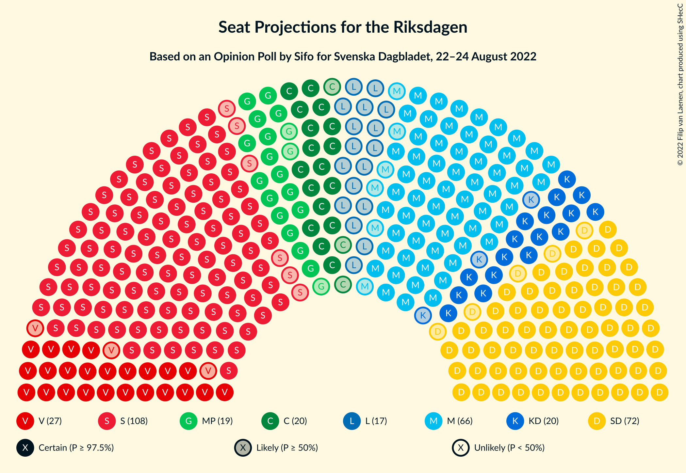
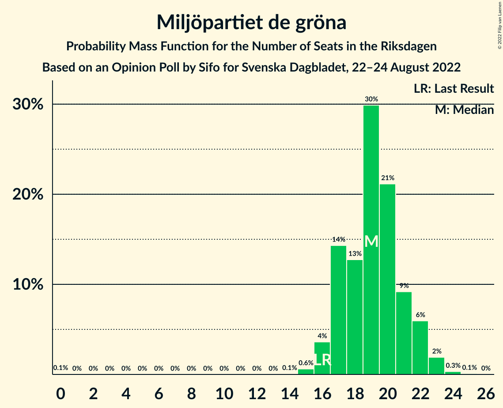

# Opinion Poll by Sifo for Svenska Dagbladet, 22–24 August 2022

<a href="#voting-intentions">Voting Intentions</a> | <a href="#seats">Seats</a> | <a href="#coalitions">Coalitions</a> | <a href="#technical-information">Technical Information</a>

## Voting Intentions

### Confidence Intervals

| Party | Last Result | Poll Result | 80% Confidence Interval | 90% Confidence Interval | 95% Confidence Interval | 99% Confidence Interval |
|:-----:|:-----------:|:-----------:|:-----------------------:|:-----------------------:|:-----------------------:|:-----------------------:|
| Sveriges socialdemokratiska arbetareparti | 28.3% | 30.5% | 29.3–31.7% |29.0–32.1% |28.7–32.4% |28.2–33.0% |
| Sverigedemokraterna | 17.5% | 20.3% | 19.3–21.4% |19.0–21.7% |18.8–22.0% |18.3–22.5% |
| Moderata samlingspartiet | 19.8% | 18.3% | 17.3–19.4% |17.1–19.7% |16.8–19.9% |16.4–20.4% |
| Vänsterpartiet | 8.0% | 7.6% | 7.0–8.3% |6.8–8.5% |6.6–8.7% |6.3–9.1% |
| Centerpartiet | 8.6% | 5.7% | 5.1–6.3% |5.0–6.5% |4.8–6.7% |4.6–7.0% |
| Kristdemokraterna | 6.3% | 5.6% | 5.0–6.2% |4.9–6.4% |4.8–6.6% |4.5–6.9% |
| Miljöpartiet de gröna | 4.4% | 5.3% | 4.8–6.0% |4.6–6.1% |4.5–6.3% |4.3–6.6% |
| Liberalerna | 5.5% | 4.6% | 4.1–5.2% |3.9–5.3% |3.8–5.5% |3.6–5.8% |

*Note:* The poll result column reflects the actual value used in the calculations. Published results may vary slightly, and in addition be rounded to fewer digits.

## Seats

### Confidence Intervals

| Party | Last Result | Median | 80% Confidence Interval | 90% Confidence Interval | 95% Confidence Interval | 99% Confidence Interval |
|:-----:|:-----------:|:------:|:-----------------------:|:-----------------------:|:-----------------------:|:-----------------------:|
| <a href="#sveriges-socialdemokratiska-arbetareparti">Sveriges socialdemokratiska arbetareparti</a> | 100 | 109 | 104–113 |103–115 |102–116 |100–119 |
| <a href="#sverigedemokraterna">Sverigedemokraterna</a> | 62 | 72 | 69–76 |68–78 |67–78 |65–80 |
| <a href="#moderata-samlingspartiet">Moderata samlingspartiet</a> | 70 | 66 | 62–69 |61–70 |60–71 |58–73 |
| <a href="#vänsterpartiet">Vänsterpartiet</a> | 28 | 27 | 25–30 |24–30 |24–31 |22–32 |
| <a href="#centerpartiet">Centerpartiet</a> | 31 | 20 | 18–23 |18–23 |17–24 |16–25 |
| <a href="#kristdemokraterna">Kristdemokraterna</a> | 22 | 20 | 18–22 |17–23 |17–24 |16–25 |
| <a href="#miljöpartiet-de-gröna">Miljöpartiet de gröna</a> | 16 | 19 | 17–21 |17–22 |16–22 |15–23 |
| <a href="#liberalerna">Liberalerna</a> | 20 | 17 | 15–18 |0–19 |0–20 |0–21 |

### Sveriges socialdemokratiska arbetareparti

*For a full overview of the results for this party, see the [Sveriges socialdemokratiska arbetareparti](party-sverigessocialdemokratiskaarbetareparti.html) page.*

| Number of Seats | Probability | Accumulated | Special Marks |
|:---------------:|:-----------:|:-----------:|:-------------:|
| 98 | 0% | 100% |  |
| 99 | 0.4% | 99.9% |  |
| 100 | 0.3% | 99.5% | Last Result |
| 101 | 0.9% | 99.2% |  |
| 102 | 2% | 98% |  |
| 103 | 3% | 97% |  |
| 104 | 4% | 93% |  |
| 105 | 6% | 89% |  |
| 106 | 9% | 83% |  |
| 107 | 8% | 75% |  |
| 108 | 14% | 67% |  |
| 109 | 9% | 53% | Median |
| 110 | 11% | 43% |  |
| 111 | 11% | 32% |  |
| 112 | 7% | 21% |  |
| 113 | 5% | 14% |  |
| 114 | 4% | 9% |  |
| 115 | 2% | 5% |  |
| 116 | 1.0% | 3% |  |
| 117 | 0.8% | 2% |  |
| 118 | 0.4% | 1.0% |  |
| 119 | 0.2% | 0.6% |  |
| 120 | 0.2% | 0.4% |  |
| 121 | 0.1% | 0.2% |  |
| 122 | 0.1% | 0.1% |  |
| 123 | 0% | 0% |  |

### Sverigedemokraterna

*For a full overview of the results for this party, see the [Sverigedemokraterna](party-sverigedemokraterna.html) page.*

| Number of Seats | Probability | Accumulated | Special Marks |
|:---------------:|:-----------:|:-----------:|:-------------:|
| 62 | 0% | 100% | Last Result |
| 63 | 0.1% | 100% |  |
| 64 | 0.2% | 99.9% |  |
| 65 | 0.7% | 99.7% |  |
| 66 | 0.9% | 99.0% |  |
| 67 | 2% | 98% |  |
| 68 | 6% | 96% |  |
| 69 | 10% | 90% |  |
| 70 | 10% | 80% |  |
| 71 | 9% | 70% |  |
| 72 | 14% | 61% | Median |
| 73 | 13% | 47% |  |
| 74 | 10% | 34% |  |
| 75 | 8% | 24% |  |
| 76 | 6% | 15% |  |
| 77 | 5% | 10% |  |
| 78 | 3% | 5% |  |
| 79 | 1.3% | 2% |  |
| 80 | 0.7% | 1.1% |  |
| 81 | 0.2% | 0.5% |  |
| 82 | 0.2% | 0.2% |  |
| 83 | 0% | 0.1% |  |
| 84 | 0% | 0% |  |

### Moderata samlingspartiet

*For a full overview of the results for this party, see the [Moderata samlingspartiet](party-moderatasamlingspartiet.html) page.*

| Number of Seats | Probability | Accumulated | Special Marks |
|:---------------:|:-----------:|:-----------:|:-------------:|
| 56 | 0% | 100% |  |
| 57 | 0.2% | 99.9% |  |
| 58 | 0.5% | 99.7% |  |
| 59 | 1.0% | 99.3% |  |
| 60 | 3% | 98% |  |
| 61 | 4% | 96% |  |
| 62 | 7% | 92% |  |
| 63 | 7% | 85% |  |
| 64 | 12% | 78% |  |
| 65 | 15% | 66% |  |
| 66 | 14% | 52% | Median |
| 67 | 12% | 37% |  |
| 68 | 9% | 25% |  |
| 69 | 8% | 16% |  |
| 70 | 3% | 8% | Last Result |
| 71 | 2% | 4% |  |
| 72 | 0.9% | 2% |  |
| 73 | 0.7% | 1.1% |  |
| 74 | 0.2% | 0.4% |  |
| 75 | 0.2% | 0.3% |  |
| 76 | 0% | 0.1% |  |
| 77 | 0% | 0% |  |

### Vänsterpartiet

*For a full overview of the results for this party, see the [Vänsterpartiet](party-vänsterpartiet.html) page.*

| Number of Seats | Probability | Accumulated | Special Marks |
|:---------------:|:-----------:|:-----------:|:-------------:|
| 21 | 0.1% | 100% |  |
| 22 | 0.4% | 99.9% |  |
| 23 | 2% | 99.5% |  |
| 24 | 6% | 98% |  |
| 25 | 10% | 92% |  |
| 26 | 23% | 82% |  |
| 27 | 16% | 59% | Median |
| 28 | 21% | 42% | Last Result |
| 29 | 11% | 22% |  |
| 30 | 6% | 11% |  |
| 31 | 3% | 5% |  |
| 32 | 1.4% | 2% |  |
| 33 | 0.3% | 0.4% |  |
| 34 | 0.1% | 0.1% |  |
| 35 | 0% | 0% |  |

### Centerpartiet

*For a full overview of the results for this party, see the [Centerpartiet](party-centerpartiet.html) page.*

| Number of Seats | Probability | Accumulated | Special Marks |
|:---------------:|:-----------:|:-----------:|:-------------:|
| 15 | 0.1% | 100% |  |
| 16 | 0.8% | 99.9% |  |
| 17 | 3% | 99.1% |  |
| 18 | 10% | 96% |  |
| 19 | 18% | 86% |  |
| 20 | 22% | 68% | Median |
| 21 | 24% | 46% |  |
| 22 | 11% | 22% |  |
| 23 | 8% | 11% |  |
| 24 | 2% | 3% |  |
| 25 | 0.8% | 1.0% |  |
| 26 | 0.2% | 0.2% |  |
| 27 | 0% | 0% |  |
| 28 | 0% | 0% |  |
| 29 | 0% | 0% |  |
| 30 | 0% | 0% |  |
| 31 | 0% | 0% | Last Result |

### Kristdemokraterna

*For a full overview of the results for this party, see the [Kristdemokraterna](party-kristdemokraterna.html) page.*

| Number of Seats | Probability | Accumulated | Special Marks |
|:---------------:|:-----------:|:-----------:|:-------------:|
| 15 | 0.1% | 100% |  |
| 16 | 0.8% | 99.9% |  |
| 17 | 6% | 99.1% |  |
| 18 | 12% | 93% |  |
| 19 | 24% | 81% |  |
| 20 | 19% | 57% | Median |
| 21 | 23% | 39% |  |
| 22 | 8% | 16% | Last Result |
| 23 | 4% | 7% |  |
| 24 | 3% | 3% |  |
| 25 | 0.4% | 0.6% |  |
| 26 | 0.1% | 0.2% |  |
| 27 | 0% | 0% |  |

### Miljöpartiet de gröna

*For a full overview of the results for this party, see the [Miljöpartiet de gröna](party-miljöpartietdegröna.html) page.*

| Number of Seats | Probability | Accumulated | Special Marks |
|:---------------:|:-----------:|:-----------:|:-------------:|
| 0 | 0.1% | 100% |  |
| 1 | 0% | 99.9% |  |
| 2 | 0% | 99.9% |  |
| 3 | 0% | 99.9% |  |
| 4 | 0% | 99.9% |  |
| 5 | 0% | 99.9% |  |
| 6 | 0% | 99.9% |  |
| 7 | 0% | 99.9% |  |
| 8 | 0% | 99.9% |  |
| 9 | 0% | 99.9% |  |
| 10 | 0% | 99.9% |  |
| 11 | 0% | 99.9% |  |
| 12 | 0% | 99.9% |  |
| 13 | 0% | 99.9% |  |
| 14 | 0.1% | 99.9% |  |
| 15 | 0.6% | 99.8% |  |
| 16 | 4% | 99.2% | Last Result |
| 17 | 14% | 96% |  |
| 18 | 13% | 81% |  |
| 19 | 30% | 69% | Median |
| 20 | 21% | 39% |  |
| 21 | 9% | 18% |  |
| 22 | 6% | 8% |  |
| 23 | 2% | 2% |  |
| 24 | 0.3% | 0.5% |  |
| 25 | 0.1% | 0.1% |  |
| 26 | 0% | 0% |  |

### Liberalerna

*For a full overview of the results for this party, see the [Liberalerna](party-liberalerna.html) page.*

| Number of Seats | Probability | Accumulated | Special Marks |
|:---------------:|:-----------:|:-----------:|:-------------:|
| 0 | 6% | 100% |  |
| 1 | 0% | 94% |  |
| 2 | 0% | 94% |  |
| 3 | 0% | 94% |  |
| 4 | 0% | 94% |  |
| 5 | 0% | 94% |  |
| 6 | 0% | 94% |  |
| 7 | 0% | 94% |  |
| 8 | 0% | 94% |  |
| 9 | 0% | 94% |  |
| 10 | 0% | 94% |  |
| 11 | 0% | 94% |  |
| 12 | 0% | 94% |  |
| 13 | 0% | 94% |  |
| 14 | 3% | 94% |  |
| 15 | 21% | 91% |  |
| 16 | 20% | 71% |  |
| 17 | 28% | 50% | Median |
| 18 | 14% | 23% |  |
| 19 | 6% | 9% |  |
| 20 | 3% | 3% | Last Result |
| 21 | 0.4% | 0.5% |  |
| 22 | 0.1% | 0.1% |  |
| 23 | 0% | 0% |  |

## Coalitions

### Confidence Intervals

| Coalition | Last Result | Median | Majority? | 80% Confidence Interval | 90% Confidence Interval | 95% Confidence Interval | 99% Confidence Interval |
|:---------:|:-----------:|:------:|:---------:|:-----------------------:|:-----------------------:|:-----------------------:|:-----------------------:|
| Sveriges socialdemokratiska arbetareparti – Moderata samlingspartiet – Centerpartiet | 201 | 195 | 100% | 190–200 | 188–202 | 187–204 | 185–208 |
| Sveriges socialdemokratiska arbetareparti – Vänsterpartiet – Centerpartiet – Miljöpartiet de gröna – Liberalerna | 195 | 191 | 100% | 186–196 | 184–198 | 181–198 | 178–201 |
| Sveriges socialdemokratiska arbetareparti – Moderata samlingspartiet | 170 | 175 | 51% | 169–179 | 168–181 | 167–183 | 164–187 |
| Sveriges socialdemokratiska arbetareparti – Centerpartiet – Miljöpartiet de gröna – Liberalerna | 167 | 164 | 0.2% | 159–169 | 156–170 | 154–171 | 150–173 |
| Sverigedemokraterna – Moderata samlingspartiet – Kristdemokraterna | 154 | 158 | 0% | 153–163 | 151–165 | 151–168 | 148–171 |
| Sveriges socialdemokratiska arbetareparti – Vänsterpartiet – Miljöpartiet de gröna | 144 | 155 | 0% | 150–160 | 148–161 | 148–163 | 145–167 |
| Sverigedemokraterna – Moderata samlingspartiet | 132 | 138 | 0% | 133–142 | 131–145 | 131–146 | 129–150 |
| Sveriges socialdemokratiska arbetareparti – Vänsterpartiet | 128 | 136 | 0% | 131–141 | 130–142 | 129–143 | 127–147 |
| Sveriges socialdemokratiska arbetareparti – Miljöpartiet de gröna | 116 | 128 | 0% | 123–133 | 122–134 | 121–136 | 119–138 |
| Moderata samlingspartiet – Centerpartiet – Kristdemokraterna – Liberalerna | 143 | 122 | 0% | 117–126 | 114–128 | 111–129 | 106–131 |
| Moderata samlingspartiet – Centerpartiet – Kristdemokraterna | 123 | 106 | 0% | 101–110 | 101–112 | 100–113 | 97–117 |
| Moderata samlingspartiet – Centerpartiet – Liberalerna | 121 | 102 | 0% | 97–106 | 94–108 | 90–108 | 86–110 |
| Moderata samlingspartiet – Centerpartiet | 101 | 86 | 0% | 82–90 | 81–91 | 80–92 | 78–95 |

### Sveriges socialdemokratiska arbetareparti – Moderata samlingspartiet – Centerpartiet

| Number of Seats | Probability | Accumulated | Special Marks |
|:---------------:|:-----------:|:-----------:|:-------------:|
| 182 | 0% | 100% |  |
| 183 | 0.2% | 99.9% |  |
| 184 | 0.2% | 99.8% |  |
| 185 | 0.3% | 99.6% |  |
| 186 | 0.9% | 99.3% |  |
| 187 | 2% | 98% |  |
| 188 | 2% | 96% |  |
| 189 | 3% | 94% |  |
| 190 | 4% | 91% |  |
| 191 | 8% | 87% |  |
| 192 | 8% | 79% |  |
| 193 | 7% | 71% |  |
| 194 | 12% | 64% |  |
| 195 | 10% | 52% | Median |
| 196 | 12% | 43% |  |
| 197 | 10% | 31% |  |
| 198 | 8% | 21% |  |
| 199 | 3% | 13% |  |
| 200 | 2% | 10% |  |
| 201 | 3% | 8% | Last Result |
| 202 | 2% | 6% |  |
| 203 | 0.6% | 4% |  |
| 204 | 0.9% | 3% |  |
| 205 | 0.7% | 2% |  |
| 206 | 0.3% | 2% |  |
| 207 | 0.6% | 1.4% |  |
| 208 | 0.4% | 0.8% |  |
| 209 | 0.1% | 0.4% |  |
| 210 | 0.1% | 0.3% |  |
| 211 | 0.1% | 0.2% |  |
| 212 | 0.1% | 0.1% |  |
| 213 | 0% | 0% |  |

### Sveriges socialdemokratiska arbetareparti – Vänsterpartiet – Centerpartiet – Miljöpartiet de gröna – Liberalerna

| Number of Seats | Probability | Accumulated | Special Marks |
|:---------------:|:-----------:|:-----------:|:-------------:|
| 175 | 0.1% | 100% | Majority |
| 176 | 0.2% | 99.9% |  |
| 177 | 0.2% | 99.7% |  |
| 178 | 0.3% | 99.5% |  |
| 179 | 0.4% | 99.2% |  |
| 180 | 0.5% | 98.8% |  |
| 181 | 0.8% | 98% |  |
| 182 | 0.7% | 97% |  |
| 183 | 0.8% | 97% |  |
| 184 | 2% | 96% |  |
| 185 | 2% | 94% |  |
| 186 | 5% | 92% |  |
| 187 | 4% | 88% |  |
| 188 | 6% | 84% |  |
| 189 | 12% | 78% |  |
| 190 | 8% | 66% |  |
| 191 | 9% | 58% |  |
| 192 | 9% | 49% | Median |
| 193 | 14% | 40% |  |
| 194 | 8% | 26% |  |
| 195 | 5% | 18% | Last Result |
| 196 | 4% | 13% |  |
| 197 | 4% | 9% |  |
| 198 | 3% | 5% |  |
| 199 | 1.3% | 2% |  |
| 200 | 0.6% | 1.1% |  |
| 201 | 0.3% | 0.5% |  |
| 202 | 0.1% | 0.2% |  |
| 203 | 0% | 0.1% |  |
| 204 | 0% | 0% |  |

### Sveriges socialdemokratiska arbetareparti – Moderata samlingspartiet

| Number of Seats | Probability | Accumulated | Special Marks |
|:---------------:|:-----------:|:-----------:|:-------------:|
| 162 | 0.1% | 100% |  |
| 163 | 0.1% | 99.9% |  |
| 164 | 0.3% | 99.8% |  |
| 165 | 0.5% | 99.5% |  |
| 166 | 1.0% | 99.0% |  |
| 167 | 3% | 98% |  |
| 168 | 2% | 95% |  |
| 169 | 4% | 93% |  |
| 170 | 6% | 89% | Last Result |
| 171 | 6% | 83% |  |
| 172 | 10% | 77% |  |
| 173 | 7% | 67% |  |
| 174 | 9% | 60% |  |
| 175 | 12% | 51% | Median, Majority |
| 176 | 12% | 39% |  |
| 177 | 8% | 27% |  |
| 178 | 6% | 20% |  |
| 179 | 5% | 14% |  |
| 180 | 3% | 9% |  |
| 181 | 2% | 6% |  |
| 182 | 1.4% | 5% |  |
| 183 | 0.7% | 3% |  |
| 184 | 0.8% | 2% |  |
| 185 | 0.3% | 2% |  |
| 186 | 0.6% | 1.4% |  |
| 187 | 0.3% | 0.7% |  |
| 188 | 0.2% | 0.5% |  |
| 189 | 0% | 0.2% |  |
| 190 | 0.1% | 0.2% |  |
| 191 | 0.1% | 0.1% |  |
| 192 | 0% | 0% |  |

### Sveriges socialdemokratiska arbetareparti – Centerpartiet – Miljöpartiet de gröna – Liberalerna

| Number of Seats | Probability | Accumulated | Special Marks |
|:---------------:|:-----------:|:-----------:|:-------------:|
| 146 | 0% | 100% |  |
| 147 | 0% | 99.9% |  |
| 148 | 0.3% | 99.9% |  |
| 149 | 0.1% | 99.6% |  |
| 150 | 0.4% | 99.5% |  |
| 151 | 0.4% | 99.2% |  |
| 152 | 0.7% | 98.8% |  |
| 153 | 0.3% | 98% |  |
| 154 | 1.1% | 98% |  |
| 155 | 0.5% | 97% |  |
| 156 | 1.3% | 96% |  |
| 157 | 1.3% | 95% |  |
| 158 | 2% | 94% |  |
| 159 | 4% | 91% |  |
| 160 | 4% | 88% |  |
| 161 | 8% | 84% |  |
| 162 | 6% | 76% |  |
| 163 | 10% | 69% |  |
| 164 | 10% | 59% |  |
| 165 | 14% | 49% | Median |
| 166 | 8% | 35% |  |
| 167 | 9% | 27% | Last Result |
| 168 | 5% | 18% |  |
| 169 | 6% | 13% |  |
| 170 | 3% | 7% |  |
| 171 | 2% | 4% |  |
| 172 | 0.9% | 2% |  |
| 173 | 0.8% | 1.2% |  |
| 174 | 0.1% | 0.4% |  |
| 175 | 0.2% | 0.2% | Majority |
| 176 | 0% | 0.1% |  |
| 177 | 0% | 0% |  |

### Sverigedemokraterna – Moderata samlingspartiet – Kristdemokraterna

| Number of Seats | Probability | Accumulated | Special Marks |
|:---------------:|:-----------:|:-----------:|:-------------:|
| 146 | 0% | 100% |  |
| 147 | 0.1% | 99.9% |  |
| 148 | 0.3% | 99.8% |  |
| 149 | 0.6% | 99.5% |  |
| 150 | 1.3% | 98.9% |  |
| 151 | 3% | 98% |  |
| 152 | 4% | 95% |  |
| 153 | 4% | 91% |  |
| 154 | 5% | 87% | Last Result |
| 155 | 8% | 82% |  |
| 156 | 14% | 74% |  |
| 157 | 9% | 60% |  |
| 158 | 9% | 51% | Median |
| 159 | 8% | 42% |  |
| 160 | 12% | 34% |  |
| 161 | 6% | 22% |  |
| 162 | 4% | 16% |  |
| 163 | 5% | 12% |  |
| 164 | 2% | 8% |  |
| 165 | 2% | 6% |  |
| 166 | 0.8% | 4% |  |
| 167 | 0.7% | 3% |  |
| 168 | 0.8% | 3% |  |
| 169 | 0.5% | 2% |  |
| 170 | 0.4% | 1.2% |  |
| 171 | 0.3% | 0.8% |  |
| 172 | 0.2% | 0.5% |  |
| 173 | 0.2% | 0.3% |  |
| 174 | 0.1% | 0.1% |  |
| 175 | 0% | 0% | Majority |

### Sveriges socialdemokratiska arbetareparti – Vänsterpartiet – Miljöpartiet de gröna

| Number of Seats | Probability | Accumulated | Special Marks |
|:---------------:|:-----------:|:-----------:|:-------------:|
| 143 | 0.1% | 100% |  |
| 144 | 0.1% | 99.9% | Last Result |
| 145 | 0.3% | 99.8% |  |
| 146 | 0.5% | 99.5% |  |
| 147 | 1.4% | 99.0% |  |
| 148 | 3% | 98% |  |
| 149 | 3% | 95% |  |
| 150 | 4% | 92% |  |
| 151 | 6% | 88% |  |
| 152 | 12% | 82% |  |
| 153 | 6% | 71% |  |
| 154 | 8% | 65% |  |
| 155 | 11% | 57% | Median |
| 156 | 9% | 46% |  |
| 157 | 7% | 36% |  |
| 158 | 12% | 29% |  |
| 159 | 6% | 17% |  |
| 160 | 4% | 11% |  |
| 161 | 3% | 8% |  |
| 162 | 1.2% | 5% |  |
| 163 | 1.4% | 4% |  |
| 164 | 0.7% | 2% |  |
| 165 | 0.4% | 1.4% |  |
| 166 | 0.3% | 0.9% |  |
| 167 | 0.3% | 0.7% |  |
| 168 | 0.2% | 0.4% |  |
| 169 | 0.1% | 0.2% |  |
| 170 | 0.1% | 0.2% |  |
| 171 | 0% | 0.1% |  |
| 172 | 0% | 0.1% |  |
| 173 | 0% | 0% |  |

### Sverigedemokraterna – Moderata samlingspartiet

| Number of Seats | Probability | Accumulated | Special Marks |
|:---------------:|:-----------:|:-----------:|:-------------:|
| 126 | 0% | 100% |  |
| 127 | 0.1% | 99.9% |  |
| 128 | 0.2% | 99.8% |  |
| 129 | 0.5% | 99.6% |  |
| 130 | 1.3% | 99.1% |  |
| 131 | 3% | 98% |  |
| 132 | 2% | 95% | Last Result |
| 133 | 5% | 92% |  |
| 134 | 8% | 88% |  |
| 135 | 6% | 80% |  |
| 136 | 6% | 74% |  |
| 137 | 13% | 67% |  |
| 138 | 12% | 54% | Median |
| 139 | 10% | 42% |  |
| 140 | 8% | 33% |  |
| 141 | 7% | 24% |  |
| 142 | 8% | 17% |  |
| 143 | 2% | 9% |  |
| 144 | 2% | 7% |  |
| 145 | 2% | 5% |  |
| 146 | 1.0% | 3% |  |
| 147 | 0.6% | 2% |  |
| 148 | 0.5% | 2% |  |
| 149 | 0.5% | 1.1% |  |
| 150 | 0.5% | 0.6% |  |
| 151 | 0.1% | 0.2% |  |
| 152 | 0.1% | 0.1% |  |
| 153 | 0% | 0.1% |  |
| 154 | 0% | 0% |  |

### Sveriges socialdemokratiska arbetareparti – Vänsterpartiet

| Number of Seats | Probability | Accumulated | Special Marks |
|:---------------:|:-----------:|:-----------:|:-------------:|
| 124 | 0% | 100% |  |
| 125 | 0.1% | 99.9% |  |
| 126 | 0.2% | 99.8% |  |
| 127 | 0.5% | 99.6% |  |
| 128 | 0.9% | 99.2% | Last Result |
| 129 | 3% | 98% |  |
| 130 | 3% | 95% |  |
| 131 | 4% | 92% |  |
| 132 | 6% | 88% |  |
| 133 | 9% | 82% |  |
| 134 | 11% | 73% |  |
| 135 | 11% | 63% |  |
| 136 | 10% | 52% | Median |
| 137 | 7% | 42% |  |
| 138 | 7% | 35% |  |
| 139 | 12% | 29% |  |
| 140 | 6% | 17% |  |
| 141 | 4% | 11% |  |
| 142 | 3% | 7% |  |
| 143 | 1.5% | 4% |  |
| 144 | 0.9% | 2% |  |
| 145 | 0.6% | 2% |  |
| 146 | 0.3% | 1.0% |  |
| 147 | 0.3% | 0.7% |  |
| 148 | 0.1% | 0.5% |  |
| 149 | 0.2% | 0.4% |  |
| 150 | 0% | 0.2% |  |
| 151 | 0.1% | 0.2% |  |
| 152 | 0% | 0% |  |

### Sveriges socialdemokratiska arbetareparti – Miljöpartiet de gröna

| Number of Seats | Probability | Accumulated | Special Marks |
|:---------------:|:-----------:|:-----------:|:-------------:|
| 115 | 0% | 100% |  |
| 116 | 0.1% | 99.9% | Last Result |
| 117 | 0.1% | 99.9% |  |
| 118 | 0.2% | 99.8% |  |
| 119 | 0.9% | 99.6% |  |
| 120 | 0.9% | 98.7% |  |
| 121 | 2% | 98% |  |
| 122 | 3% | 96% |  |
| 123 | 4% | 93% |  |
| 124 | 6% | 88% |  |
| 125 | 9% | 82% |  |
| 126 | 10% | 74% |  |
| 127 | 6% | 64% |  |
| 128 | 11% | 58% | Median |
| 129 | 12% | 47% |  |
| 130 | 12% | 34% |  |
| 131 | 7% | 22% |  |
| 132 | 5% | 16% |  |
| 133 | 4% | 10% |  |
| 134 | 2% | 6% |  |
| 135 | 2% | 4% |  |
| 136 | 1.2% | 3% |  |
| 137 | 0.5% | 1.4% |  |
| 138 | 0.4% | 0.9% |  |
| 139 | 0.2% | 0.5% |  |
| 140 | 0.1% | 0.3% |  |
| 141 | 0.1% | 0.2% |  |
| 142 | 0% | 0.1% |  |
| 143 | 0% | 0% |  |

### Moderata samlingspartiet – Centerpartiet – Kristdemokraterna – Liberalerna

| Number of Seats | Probability | Accumulated | Special Marks |
|:---------------:|:-----------:|:-----------:|:-------------:|
| 103 | 0% | 100% |  |
| 104 | 0% | 99.9% |  |
| 105 | 0.2% | 99.9% |  |
| 106 | 0.2% | 99.7% |  |
| 107 | 0.2% | 99.5% |  |
| 108 | 0.3% | 99.3% |  |
| 109 | 0.3% | 99.0% |  |
| 110 | 0.5% | 98.7% |  |
| 111 | 1.1% | 98% |  |
| 112 | 0.5% | 97% |  |
| 113 | 1.0% | 97% |  |
| 114 | 1.1% | 96% |  |
| 115 | 1.1% | 95% |  |
| 116 | 2% | 93% |  |
| 117 | 4% | 92% |  |
| 118 | 6% | 88% |  |
| 119 | 11% | 82% |  |
| 120 | 8% | 71% |  |
| 121 | 11% | 64% |  |
| 122 | 10% | 53% |  |
| 123 | 11% | 43% | Median |
| 124 | 6% | 32% |  |
| 125 | 10% | 26% |  |
| 126 | 7% | 16% |  |
| 127 | 3% | 10% |  |
| 128 | 3% | 6% |  |
| 129 | 2% | 3% |  |
| 130 | 0.9% | 1.5% |  |
| 131 | 0.3% | 0.6% |  |
| 132 | 0.2% | 0.3% |  |
| 133 | 0.1% | 0.1% |  |
| 134 | 0% | 0% |  |
| 135 | 0% | 0% |  |
| 136 | 0% | 0% |  |
| 137 | 0% | 0% |  |
| 138 | 0% | 0% |  |
| 139 | 0% | 0% |  |
| 140 | 0% | 0% |  |
| 141 | 0% | 0% |  |
| 142 | 0% | 0% |  |
| 143 | 0% | 0% | Last Result |

### Moderata samlingspartiet – Centerpartiet – Kristdemokraterna

| Number of Seats | Probability | Accumulated | Special Marks |
|:---------------:|:-----------:|:-----------:|:-------------:|
| 95 | 0.1% | 100% |  |
| 96 | 0.1% | 99.9% |  |
| 97 | 0.6% | 99.8% |  |
| 98 | 0.8% | 99.2% |  |
| 99 | 0.7% | 98% |  |
| 100 | 2% | 98% |  |
| 101 | 7% | 96% |  |
| 102 | 5% | 89% |  |
| 103 | 8% | 84% |  |
| 104 | 13% | 76% |  |
| 105 | 12% | 63% |  |
| 106 | 9% | 51% | Median |
| 107 | 13% | 42% |  |
| 108 | 9% | 30% |  |
| 109 | 4% | 21% |  |
| 110 | 7% | 17% |  |
| 111 | 4% | 10% |  |
| 112 | 1.4% | 6% |  |
| 113 | 2% | 4% |  |
| 114 | 1.1% | 2% |  |
| 115 | 0.4% | 1.3% |  |
| 116 | 0.4% | 0.9% |  |
| 117 | 0.2% | 0.5% |  |
| 118 | 0.2% | 0.3% |  |
| 119 | 0% | 0.1% |  |
| 120 | 0% | 0% |  |
| 121 | 0% | 0% |  |
| 122 | 0% | 0% |  |
| 123 | 0% | 0% | Last Result |

### Moderata samlingspartiet – Centerpartiet – Liberalerna

| Number of Seats | Probability | Accumulated | Special Marks |
|:---------------:|:-----------:|:-----------:|:-------------:|
| 82 | 0% | 100% |  |
| 83 | 0.1% | 99.9% |  |
| 84 | 0.1% | 99.8% |  |
| 85 | 0.1% | 99.7% |  |
| 86 | 0.2% | 99.6% |  |
| 87 | 0.6% | 99.4% |  |
| 88 | 0.5% | 98.8% |  |
| 89 | 0.6% | 98% |  |
| 90 | 0.7% | 98% |  |
| 91 | 0.7% | 97% |  |
| 92 | 0.7% | 96% |  |
| 93 | 0.5% | 95% |  |
| 94 | 0.7% | 95% |  |
| 95 | 1.1% | 94% |  |
| 96 | 1.5% | 93% |  |
| 97 | 3% | 92% |  |
| 98 | 4% | 89% |  |
| 99 | 7% | 84% |  |
| 100 | 13% | 78% |  |
| 101 | 9% | 65% |  |
| 102 | 12% | 56% |  |
| 103 | 10% | 44% | Median |
| 104 | 10% | 34% |  |
| 105 | 8% | 24% |  |
| 106 | 7% | 16% |  |
| 107 | 4% | 9% |  |
| 108 | 3% | 5% |  |
| 109 | 1.0% | 2% |  |
| 110 | 0.6% | 1.1% |  |
| 111 | 0.3% | 0.5% |  |
| 112 | 0.1% | 0.2% |  |
| 113 | 0.1% | 0.1% |  |
| 114 | 0% | 0% |  |
| 115 | 0% | 0% |  |
| 116 | 0% | 0% |  |
| 117 | 0% | 0% |  |
| 118 | 0% | 0% |  |
| 119 | 0% | 0% |  |
| 120 | 0% | 0% |  |
| 121 | 0% | 0% | Last Result |

### Moderata samlingspartiet – Centerpartiet

| Number of Seats | Probability | Accumulated | Special Marks |
|:---------------:|:-----------:|:-----------:|:-------------:|
| 76 | 0.1% | 100% |  |
| 77 | 0.2% | 99.9% |  |
| 78 | 0.3% | 99.6% |  |
| 79 | 2% | 99.3% |  |
| 80 | 2% | 98% |  |
| 81 | 4% | 96% |  |
| 82 | 5% | 92% |  |
| 83 | 10% | 87% |  |
| 84 | 10% | 78% |  |
| 85 | 16% | 68% |  |
| 86 | 9% | 52% | Median |
| 87 | 12% | 43% |  |
| 88 | 10% | 31% |  |
| 89 | 9% | 21% |  |
| 90 | 4% | 12% |  |
| 91 | 4% | 8% |  |
| 92 | 2% | 4% |  |
| 93 | 1.0% | 2% |  |
| 94 | 0.7% | 1.3% |  |
| 95 | 0.2% | 0.6% |  |
| 96 | 0.1% | 0.4% |  |
| 97 | 0.2% | 0.2% |  |
| 98 | 0% | 0.1% |  |
| 99 | 0% | 0% |  |
| 100 | 0% | 0% |  |
| 101 | 0% | 0% | Last Result |

## Technical Information

### Opinion Poll

+ **Polling firm:** Sifo
+ **Commissioner(s):** Svenska Dagbladet
+ **Fieldwork period:** 22–24 August 2022

### Calculations

+ **Sample size:** 2461
+ **Simulations done:** 1,048,576
+ **Error estimate:** 0.98%

