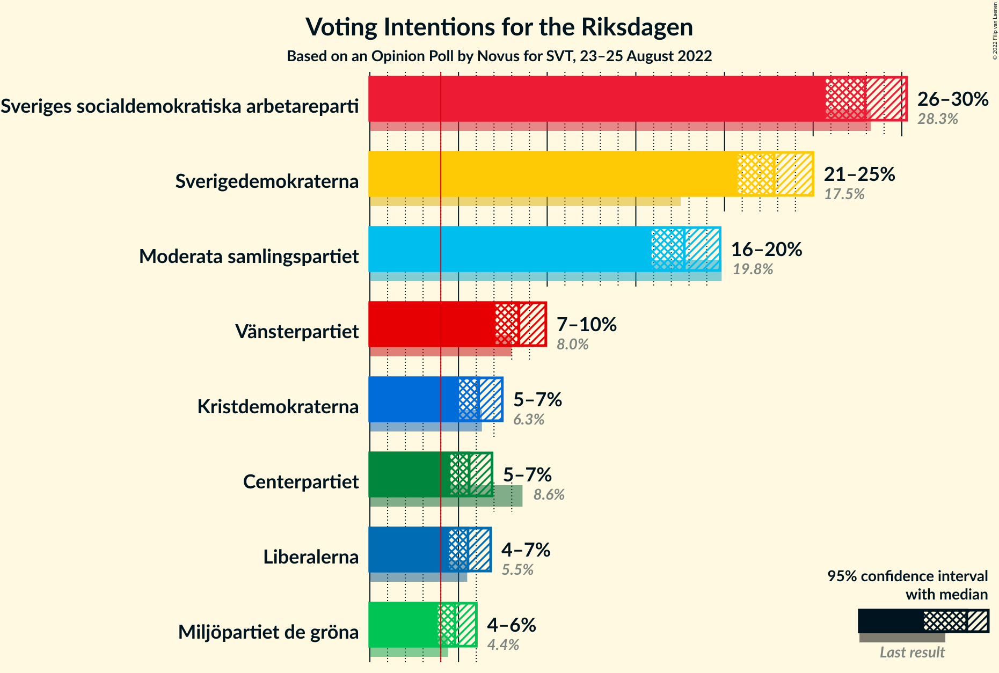
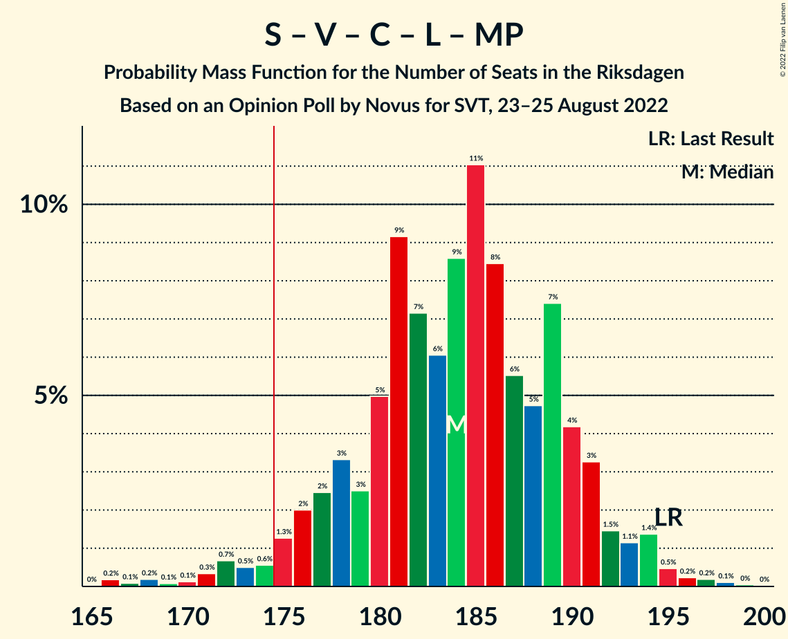

# Opinion Poll by Novus for SVT, 23–25 August 2022

<a href="#voting-intentions">Voting Intentions</a> | <a href="#seats">Seats</a> | <a href="#coalitions">Coalitions</a> | <a href="#technical-information">Technical Information</a>

## Voting Intentions

### Confidence Intervals

| Party | Last Result | Poll Result | 80% Confidence Interval | 90% Confidence Interval | 95% Confidence Interval | 99% Confidence Interval |
|:-----:|:-----------:|:-----------:|:-----------------------:|:-----------------------:|:-----------------------:|:-----------------------:|
| Sveriges socialdemokratiska arbetareparti | 28.3% | 27.9% | 26.5–29.5% |26.1–29.9% |25.7–30.3% |25.0–31.0% |
| Sverigedemokraterna | 17.5% | 22.8% | 21.4–24.2% |21.1–24.6% |20.7–25.0% |20.1–25.7% |
| Moderata samlingspartiet | 19.8% | 17.7% | 16.5–19.1% |16.2–19.4% |15.9–19.8% |15.3–20.4% |
| Vänsterpartiet | 8.0% | 8.4% | 7.5–9.4% |7.3–9.7% |7.1–9.9% |6.7–10.4% |
| Kristdemokraterna | 6.3% | 6.1% | 5.4–7.0% |5.2–7.3% |5.0–7.5% |4.7–7.9% |
| Centerpartiet | 8.6% | 5.6% | 4.9–6.4% |4.7–6.7% |4.5–6.9% |4.2–7.3% |
| Liberalerna | 5.5% | 5.5% | 4.8–6.4% |4.6–6.6% |4.5–6.8% |4.2–7.2% |
| Miljöpartiet de gröna | 4.4% | 4.8% | 4.2–5.6% |4.0–5.8% |3.8–6.0% |3.5–6.4% |

*Note:* The poll result column reflects the actual value used in the calculations. Published results may vary slightly, and in addition be rounded to fewer digits.

## Seats

### Confidence Intervals

| Party | Last Result | Median | 80% Confidence Interval | 90% Confidence Interval | 95% Confidence Interval | 99% Confidence Interval |
|:-----:|:-----------:|:------:|:-----------------------:|:-----------------------:|:-----------------------:|:-----------------------:|
| <a href="#sveriges-socialdemokratiska-arbetareparti">Sveriges socialdemokratiska arbetareparti</a> | 100 | 99 | 93–104 |92–106 |91–107 |88–110 |
| <a href="#sverigedemokraterna">Sverigedemokraterna</a> | 62 | 80 | 76–85 |74–87 |73–88 |71–92 |
| <a href="#moderata-samlingspartiet">Moderata samlingspartiet</a> | 70 | 63 | 58–67 |57–68 |56–70 |54–72 |
| <a href="#vänsterpartiet">Vänsterpartiet</a> | 28 | 30 | 27–33 |26–34 |25–35 |24–37 |
| <a href="#kristdemokraterna">Kristdemokraterna</a> | 22 | 22 | 19–25 |18–25 |18–26 |17–28 |
| <a href="#centerpartiet">Centerpartiet</a> | 31 | 20 | 17–23 |17–24 |16–24 |15–26 |
| <a href="#liberalerna">Liberalerna</a> | 20 | 20 | 17–23 |16–23 |16–24 |15–25 |
| <a href="#miljöpartiet-de-gröna">Miljöpartiet de gröna</a> | 16 | 17 | 15–19 |0–20 |0–21 |0–23 |

### Sveriges socialdemokratiska arbetareparti

*For a full overview of the results for this party, see the [Sveriges socialdemokratiska arbetareparti](party-sverigessocialdemokratiskaarbetareparti.html) page.*

| Number of Seats | Probability | Accumulated | Special Marks |
|:---------------:|:-----------:|:-----------:|:-------------:|
| 85 | 0% | 100% |  |
| 86 | 0.1% | 99.9% |  |
| 87 | 0.1% | 99.9% |  |
| 88 | 0.4% | 99.7% |  |
| 89 | 0.5% | 99.3% |  |
| 90 | 1.1% | 98.8% |  |
| 91 | 2% | 98% |  |
| 92 | 3% | 96% |  |
| 93 | 5% | 93% |  |
| 94 | 5% | 87% |  |
| 95 | 7% | 83% |  |
| 96 | 8% | 76% |  |
| 97 | 6% | 67% |  |
| 98 | 10% | 61% |  |
| 99 | 10% | 52% | Median |
| 100 | 10% | 42% | Last Result |
| 101 | 7% | 32% |  |
| 102 | 6% | 25% |  |
| 103 | 6% | 19% |  |
| 104 | 5% | 13% |  |
| 105 | 3% | 8% |  |
| 106 | 2% | 5% |  |
| 107 | 2% | 3% |  |
| 108 | 0.6% | 2% |  |
| 109 | 0.5% | 1.2% |  |
| 110 | 0.2% | 0.7% |  |
| 111 | 0.2% | 0.4% |  |
| 112 | 0.1% | 0.2% |  |
| 113 | 0.1% | 0.1% |  |
| 114 | 0% | 0.1% |  |
| 115 | 0% | 0% |  |

### Sverigedemokraterna

*For a full overview of the results for this party, see the [Sverigedemokraterna](party-sverigedemokraterna.html) page.*

| Number of Seats | Probability | Accumulated | Special Marks |
|:---------------:|:-----------:|:-----------:|:-------------:|
| 62 | 0% | 100% | Last Result |
| 63 | 0% | 100% |  |
| 64 | 0% | 100% |  |
| 65 | 0% | 100% |  |
| 66 | 0% | 100% |  |
| 67 | 0% | 100% |  |
| 68 | 0% | 100% |  |
| 69 | 0.1% | 99.9% |  |
| 70 | 0.2% | 99.8% |  |
| 71 | 0.4% | 99.6% |  |
| 72 | 1.1% | 99.2% |  |
| 73 | 3% | 98% |  |
| 74 | 2% | 96% |  |
| 75 | 3% | 94% |  |
| 76 | 7% | 91% |  |
| 77 | 10% | 84% |  |
| 78 | 10% | 74% |  |
| 79 | 5% | 65% |  |
| 80 | 14% | 60% | Median |
| 81 | 10% | 46% |  |
| 82 | 6% | 35% |  |
| 83 | 10% | 30% |  |
| 84 | 5% | 19% |  |
| 85 | 5% | 14% |  |
| 86 | 2% | 9% |  |
| 87 | 2% | 7% |  |
| 88 | 3% | 5% |  |
| 89 | 0.6% | 2% |  |
| 90 | 0.5% | 1.4% |  |
| 91 | 0.4% | 0.9% |  |
| 92 | 0.3% | 0.5% |  |
| 93 | 0.1% | 0.2% |  |
| 94 | 0.1% | 0.1% |  |
| 95 | 0% | 0% |  |

### Moderata samlingspartiet

*For a full overview of the results for this party, see the [Moderata samlingspartiet](party-moderatasamlingspartiet.html) page.*

| Number of Seats | Probability | Accumulated | Special Marks |
|:---------------:|:-----------:|:-----------:|:-------------:|
| 52 | 0.1% | 100% |  |
| 53 | 0.3% | 99.9% |  |
| 54 | 0.4% | 99.6% |  |
| 55 | 1.2% | 99.1% |  |
| 56 | 2% | 98% |  |
| 57 | 2% | 96% |  |
| 58 | 5% | 93% |  |
| 59 | 6% | 88% |  |
| 60 | 6% | 81% |  |
| 61 | 12% | 75% |  |
| 62 | 12% | 63% |  |
| 63 | 11% | 51% | Median |
| 64 | 13% | 41% |  |
| 65 | 7% | 27% |  |
| 66 | 5% | 20% |  |
| 67 | 5% | 15% |  |
| 68 | 4% | 9% |  |
| 69 | 2% | 5% |  |
| 70 | 2% | 3% | Last Result |
| 71 | 0.6% | 1.3% |  |
| 72 | 0.4% | 0.7% |  |
| 73 | 0.2% | 0.4% |  |
| 74 | 0.1% | 0.2% |  |
| 75 | 0% | 0.1% |  |
| 76 | 0% | 0% |  |

### Vänsterpartiet

*For a full overview of the results for this party, see the [Vänsterpartiet](party-vänsterpartiet.html) page.*

| Number of Seats | Probability | Accumulated | Special Marks |
|:---------------:|:-----------:|:-----------:|:-------------:|
| 22 | 0.1% | 100% |  |
| 23 | 0.3% | 99.9% |  |
| 24 | 1.2% | 99.6% |  |
| 25 | 3% | 98% |  |
| 26 | 4% | 95% |  |
| 27 | 12% | 91% |  |
| 28 | 11% | 79% | Last Result |
| 29 | 15% | 68% |  |
| 30 | 16% | 53% | Median |
| 31 | 13% | 37% |  |
| 32 | 12% | 24% |  |
| 33 | 5% | 13% |  |
| 34 | 4% | 7% |  |
| 35 | 2% | 3% |  |
| 36 | 0.8% | 2% |  |
| 37 | 0.5% | 0.8% |  |
| 38 | 0.2% | 0.3% |  |
| 39 | 0.1% | 0.1% |  |
| 40 | 0% | 0% |  |

### Kristdemokraterna

*For a full overview of the results for this party, see the [Kristdemokraterna](party-kristdemokraterna.html) page.*

| Number of Seats | Probability | Accumulated | Special Marks |
|:---------------:|:-----------:|:-----------:|:-------------:|
| 15 | 0.1% | 100% |  |
| 16 | 0.2% | 99.9% |  |
| 17 | 1.1% | 99.6% |  |
| 18 | 6% | 98.6% |  |
| 19 | 7% | 92% |  |
| 20 | 12% | 85% |  |
| 21 | 21% | 73% |  |
| 22 | 13% | 52% | Last Result, Median |
| 23 | 14% | 39% |  |
| 24 | 12% | 25% |  |
| 25 | 7% | 12% |  |
| 26 | 3% | 5% |  |
| 27 | 1.0% | 2% |  |
| 28 | 0.5% | 0.7% |  |
| 29 | 0.1% | 0.2% |  |
| 30 | 0.1% | 0.1% |  |
| 31 | 0% | 0% |  |

### Centerpartiet

*For a full overview of the results for this party, see the [Centerpartiet](party-centerpartiet.html) page.*

| Number of Seats | Probability | Accumulated | Special Marks |
|:---------------:|:-----------:|:-----------:|:-------------:|
| 0 | 0.2% | 100% |  |
| 1 | 0% | 99.8% |  |
| 2 | 0% | 99.8% |  |
| 3 | 0% | 99.8% |  |
| 4 | 0% | 99.8% |  |
| 5 | 0% | 99.8% |  |
| 6 | 0% | 99.8% |  |
| 7 | 0% | 99.8% |  |
| 8 | 0% | 99.8% |  |
| 9 | 0% | 99.8% |  |
| 10 | 0% | 99.8% |  |
| 11 | 0% | 99.8% |  |
| 12 | 0% | 99.8% |  |
| 13 | 0% | 99.8% |  |
| 14 | 0.1% | 99.8% |  |
| 15 | 0.5% | 99.7% |  |
| 16 | 3% | 99.2% |  |
| 17 | 13% | 96% |  |
| 18 | 10% | 83% |  |
| 19 | 14% | 73% |  |
| 20 | 16% | 59% | Median |
| 21 | 23% | 43% |  |
| 22 | 8% | 20% |  |
| 23 | 7% | 12% |  |
| 24 | 3% | 5% |  |
| 25 | 1.0% | 2% |  |
| 26 | 0.4% | 0.7% |  |
| 27 | 0.2% | 0.3% |  |
| 28 | 0% | 0.1% |  |
| 29 | 0% | 0% |  |
| 30 | 0% | 0% |  |
| 31 | 0% | 0% | Last Result |

### Liberalerna

*For a full overview of the results for this party, see the [Liberalerna](party-liberalerna.html) page.*

| Number of Seats | Probability | Accumulated | Special Marks |
|:---------------:|:-----------:|:-----------:|:-------------:|
| 0 | 0.1% | 100% |  |
| 1 | 0% | 99.9% |  |
| 2 | 0% | 99.9% |  |
| 3 | 0% | 99.9% |  |
| 4 | 0% | 99.9% |  |
| 5 | 0% | 99.9% |  |
| 6 | 0% | 99.9% |  |
| 7 | 0% | 99.9% |  |
| 8 | 0% | 99.9% |  |
| 9 | 0% | 99.9% |  |
| 10 | 0% | 99.9% |  |
| 11 | 0% | 99.9% |  |
| 12 | 0% | 99.9% |  |
| 13 | 0% | 99.9% |  |
| 14 | 0.2% | 99.9% |  |
| 15 | 2% | 99.7% |  |
| 16 | 3% | 98% |  |
| 17 | 8% | 95% |  |
| 18 | 18% | 87% |  |
| 19 | 15% | 69% |  |
| 20 | 23% | 54% | Last Result, Median |
| 21 | 11% | 31% |  |
| 22 | 10% | 21% |  |
| 23 | 6% | 10% |  |
| 24 | 3% | 4% |  |
| 25 | 1.2% | 2% |  |
| 26 | 0.2% | 0.4% |  |
| 27 | 0.2% | 0.2% |  |
| 28 | 0% | 0% |  |

### Miljöpartiet de gröna

*For a full overview of the results for this party, see the [Miljöpartiet de gröna](party-miljöpartietdegröna.html) page.*

| Number of Seats | Probability | Accumulated | Special Marks |
|:---------------:|:-----------:|:-----------:|:-------------:|
| 0 | 5% | 100% |  |
| 1 | 0% | 95% |  |
| 2 | 0% | 95% |  |
| 3 | 0% | 95% |  |
| 4 | 0% | 95% |  |
| 5 | 0% | 95% |  |
| 6 | 0% | 95% |  |
| 7 | 0% | 95% |  |
| 8 | 0% | 95% |  |
| 9 | 0% | 95% |  |
| 10 | 0% | 95% |  |
| 11 | 0% | 95% |  |
| 12 | 0% | 95% |  |
| 13 | 0% | 95% |  |
| 14 | 2% | 95% |  |
| 15 | 14% | 92% |  |
| 16 | 21% | 78% | Last Result |
| 17 | 22% | 57% | Median |
| 18 | 14% | 36% |  |
| 19 | 12% | 21% |  |
| 20 | 5% | 10% |  |
| 21 | 3% | 4% |  |
| 22 | 0.9% | 2% |  |
| 23 | 0.5% | 0.6% |  |
| 24 | 0.1% | 0.1% |  |
| 25 | 0% | 0% |  |

## Coalitions

### Confidence Intervals

| Coalition | Last Result | Median | Majority? | 80% Confidence Interval | 90% Confidence Interval | 95% Confidence Interval | 99% Confidence Interval |
|:---------:|:-----------:|:------:|:---------:|:-----------------------:|:-----------------------:|:-----------------------:|:-----------------------:|
| Sveriges socialdemokratiska arbetareparti – Vänsterpartiet – Centerpartiet – Liberalerna – Miljöpartiet de gröna | 195 | 184 | 97% | 178–190 | 176–192 | 174–193 | 168–196 |
| Sveriges socialdemokratiska arbetareparti – Moderata samlingspartiet – Centerpartiet | 201 | 181 | 90% | 175–187 | 172–189 | 172–191 | 169–196 |
| Sverigedemokraterna – Moderata samlingspartiet – Kristdemokraterna | 154 | 165 | 3% | 159–171 | 157–173 | 156–175 | 153–181 |
| Sveriges socialdemokratiska arbetareparti – Moderata samlingspartiet | 170 | 162 | 0.7% | 155–167 | 153–168 | 152–171 | 149–175 |
| Sveriges socialdemokratiska arbetareparti – Centerpartiet – Liberalerna – Miljöpartiet de gröna | 167 | 155 | 0% | 148–161 | 146–162 | 143–163 | 138–166 |
| Sveriges socialdemokratiska arbetareparti – Vänsterpartiet – Miljöpartiet de gröna | 144 | 144 | 0% | 139–150 | 136–152 | 133–154 | 127–156 |
| Sverigedemokraterna – Moderata samlingspartiet | 132 | 143 | 0% | 137–149 | 135–151 | 134–153 | 131–157 |
| Sveriges socialdemokratiska arbetareparti – Vänsterpartiet | 128 | 128 | 0% | 123–134 | 121–136 | 120–137 | 117–142 |
| Moderata samlingspartiet – Kristdemokraterna – Centerpartiet – Liberalerna | 143 | 124 | 0% | 119–130 | 117–132 | 115–133 | 112–136 |
| Sveriges socialdemokratiska arbetareparti – Miljöpartiet de gröna | 116 | 115 | 0% | 109–121 | 106–122 | 102–124 | 97–126 |
| Moderata samlingspartiet – Kristdemokraterna – Centerpartiet | 123 | 105 | 0% | 99–110 | 97–112 | 96–113 | 93–116 |
| Moderata samlingspartiet – Centerpartiet – Liberalerna | 121 | 102 | 0% | 97–108 | 96–110 | 93–111 | 91–114 |
| Moderata samlingspartiet – Centerpartiet | 101 | 82 | 0% | 77–88 | 76–89 | 75–91 | 72–93 |

### Sveriges socialdemokratiska arbetareparti – Vänsterpartiet – Centerpartiet – Liberalerna – Miljöpartiet de gröna

| Number of Seats | Probability | Accumulated | Special Marks |
|:---------------:|:-----------:|:-----------:|:-------------:|
| 165 | 0% | 100% |  |
| 166 | 0.2% | 99.9% |  |
| 167 | 0.1% | 99.8% |  |
| 168 | 0.2% | 99.7% |  |
| 169 | 0.1% | 99.5% |  |
| 170 | 0.1% | 99.4% |  |
| 171 | 0.3% | 99.3% |  |
| 172 | 0.7% | 98.9% |  |
| 173 | 0.5% | 98% |  |
| 174 | 0.6% | 98% |  |
| 175 | 1.3% | 97% | Majority |
| 176 | 2% | 96% |  |
| 177 | 2% | 94% |  |
| 178 | 3% | 91% |  |
| 179 | 3% | 88% |  |
| 180 | 5% | 86% |  |
| 181 | 9% | 81% |  |
| 182 | 7% | 71% |  |
| 183 | 6% | 64% |  |
| 184 | 9% | 58% |  |
| 185 | 11% | 50% |  |
| 186 | 8% | 39% | Median |
| 187 | 6% | 30% |  |
| 188 | 5% | 25% |  |
| 189 | 7% | 20% |  |
| 190 | 4% | 13% |  |
| 191 | 3% | 8% |  |
| 192 | 1.5% | 5% |  |
| 193 | 1.1% | 4% |  |
| 194 | 1.4% | 2% |  |
| 195 | 0.5% | 1.1% | Last Result |
| 196 | 0.2% | 0.6% |  |
| 197 | 0.2% | 0.4% |  |
| 198 | 0.1% | 0.2% |  |
| 199 | 0% | 0.1% |  |
| 200 | 0% | 0% |  |

### Sveriges socialdemokratiska arbetareparti – Moderata samlingspartiet – Centerpartiet

| Number of Seats | Probability | Accumulated | Special Marks |
|:---------------:|:-----------:|:-----------:|:-------------:|
| 165 | 0% | 100% |  |
| 166 | 0.1% | 99.9% |  |
| 167 | 0.1% | 99.9% |  |
| 168 | 0.1% | 99.8% |  |
| 169 | 0.4% | 99.6% |  |
| 170 | 0.3% | 99.2% |  |
| 171 | 1.3% | 98.9% |  |
| 172 | 3% | 98% |  |
| 173 | 1.4% | 95% |  |
| 174 | 3% | 93% |  |
| 175 | 4% | 90% | Majority |
| 176 | 3% | 87% |  |
| 177 | 5% | 83% |  |
| 178 | 8% | 78% |  |
| 179 | 7% | 70% |  |
| 180 | 10% | 63% |  |
| 181 | 6% | 52% |  |
| 182 | 4% | 46% | Median |
| 183 | 7% | 42% |  |
| 184 | 8% | 35% |  |
| 185 | 7% | 27% |  |
| 186 | 6% | 20% |  |
| 187 | 7% | 15% |  |
| 188 | 3% | 8% |  |
| 189 | 1.0% | 5% |  |
| 190 | 1.1% | 4% |  |
| 191 | 0.8% | 3% |  |
| 192 | 0.5% | 2% |  |
| 193 | 0.6% | 2% |  |
| 194 | 0.5% | 1.3% |  |
| 195 | 0.2% | 0.8% |  |
| 196 | 0.2% | 0.6% |  |
| 197 | 0.2% | 0.4% |  |
| 198 | 0% | 0.2% |  |
| 199 | 0.1% | 0.2% |  |
| 200 | 0% | 0.1% |  |
| 201 | 0% | 0.1% | Last Result |
| 202 | 0% | 0.1% |  |
| 203 | 0% | 0% |  |

### Sverigedemokraterna – Moderata samlingspartiet – Kristdemokraterna

| Number of Seats | Probability | Accumulated | Special Marks |
|:---------------:|:-----------:|:-----------:|:-------------:|
| 150 | 0% | 100% |  |
| 151 | 0.1% | 99.9% |  |
| 152 | 0.2% | 99.8% |  |
| 153 | 0.2% | 99.6% |  |
| 154 | 0.5% | 99.4% | Last Result |
| 155 | 1.4% | 98.9% |  |
| 156 | 1.1% | 98% |  |
| 157 | 1.5% | 96% |  |
| 158 | 3% | 95% |  |
| 159 | 4% | 92% |  |
| 160 | 7% | 87% |  |
| 161 | 5% | 80% |  |
| 162 | 6% | 75% |  |
| 163 | 8% | 70% |  |
| 164 | 11% | 61% |  |
| 165 | 9% | 50% | Median |
| 166 | 6% | 42% |  |
| 167 | 7% | 36% |  |
| 168 | 9% | 29% |  |
| 169 | 5% | 19% |  |
| 170 | 3% | 14% |  |
| 171 | 3% | 12% |  |
| 172 | 2% | 9% |  |
| 173 | 2% | 6% |  |
| 174 | 1.3% | 4% |  |
| 175 | 0.6% | 3% | Majority |
| 176 | 0.5% | 2% |  |
| 177 | 0.7% | 2% |  |
| 178 | 0.3% | 1.1% |  |
| 179 | 0.1% | 0.7% |  |
| 180 | 0.1% | 0.6% |  |
| 181 | 0.2% | 0.5% |  |
| 182 | 0.1% | 0.3% |  |
| 183 | 0.2% | 0.2% |  |
| 184 | 0% | 0.1% |  |
| 185 | 0% | 0% |  |

### Sveriges socialdemokratiska arbetareparti – Moderata samlingspartiet

| Number of Seats | Probability | Accumulated | Special Marks |
|:---------------:|:-----------:|:-----------:|:-------------:|
| 146 | 0.1% | 100% |  |
| 147 | 0.1% | 99.9% |  |
| 148 | 0.1% | 99.8% |  |
| 149 | 0.3% | 99.7% |  |
| 150 | 0.4% | 99.4% |  |
| 151 | 0.7% | 98.9% |  |
| 152 | 1.2% | 98% |  |
| 153 | 3% | 97% |  |
| 154 | 2% | 94% |  |
| 155 | 5% | 92% |  |
| 156 | 6% | 86% |  |
| 157 | 6% | 80% |  |
| 158 | 6% | 75% |  |
| 159 | 5% | 69% |  |
| 160 | 6% | 64% |  |
| 161 | 4% | 58% |  |
| 162 | 9% | 54% | Median |
| 163 | 10% | 45% |  |
| 164 | 7% | 35% |  |
| 165 | 9% | 28% |  |
| 166 | 5% | 19% |  |
| 167 | 6% | 14% |  |
| 168 | 3% | 7% |  |
| 169 | 0.9% | 5% |  |
| 170 | 1.0% | 4% | Last Result |
| 171 | 0.6% | 3% |  |
| 172 | 0.6% | 2% |  |
| 173 | 0.4% | 1.3% |  |
| 174 | 0.2% | 0.9% |  |
| 175 | 0.3% | 0.7% | Majority |
| 176 | 0.1% | 0.4% |  |
| 177 | 0.1% | 0.3% |  |
| 178 | 0% | 0.2% |  |
| 179 | 0.1% | 0.2% |  |
| 180 | 0% | 0.1% |  |
| 181 | 0% | 0.1% |  |
| 182 | 0% | 0.1% |  |
| 183 | 0% | 0% |  |

### Sveriges socialdemokratiska arbetareparti – Centerpartiet – Liberalerna – Miljöpartiet de gröna

| Number of Seats | Probability | Accumulated | Special Marks |
|:---------------:|:-----------:|:-----------:|:-------------:|
| 134 | 0% | 100% |  |
| 135 | 0.1% | 99.9% |  |
| 136 | 0.2% | 99.8% |  |
| 137 | 0% | 99.7% |  |
| 138 | 0.3% | 99.6% |  |
| 139 | 0.2% | 99.3% |  |
| 140 | 0.4% | 99.1% |  |
| 141 | 0.3% | 98.8% |  |
| 142 | 0.8% | 98% |  |
| 143 | 0.8% | 98% |  |
| 144 | 0.8% | 97% |  |
| 145 | 1.0% | 96% |  |
| 146 | 1.3% | 95% |  |
| 147 | 1.2% | 94% |  |
| 148 | 4% | 93% |  |
| 149 | 3% | 89% |  |
| 150 | 3% | 86% |  |
| 151 | 7% | 83% |  |
| 152 | 8% | 76% |  |
| 153 | 9% | 69% |  |
| 154 | 9% | 59% |  |
| 155 | 11% | 50% |  |
| 156 | 5% | 40% | Median |
| 157 | 7% | 35% |  |
| 158 | 7% | 28% |  |
| 159 | 6% | 21% |  |
| 160 | 5% | 15% |  |
| 161 | 3% | 11% |  |
| 162 | 4% | 8% |  |
| 163 | 1.4% | 4% |  |
| 164 | 0.9% | 2% |  |
| 165 | 0.7% | 1.5% |  |
| 166 | 0.3% | 0.8% |  |
| 167 | 0.2% | 0.5% | Last Result |
| 168 | 0.1% | 0.2% |  |
| 169 | 0.1% | 0.1% |  |
| 170 | 0% | 0.1% |  |
| 171 | 0% | 0% |  |

### Sveriges socialdemokratiska arbetareparti – Vänsterpartiet – Miljöpartiet de gröna

| Number of Seats | Probability | Accumulated | Special Marks |
|:---------------:|:-----------:|:-----------:|:-------------:|
| 124 | 0% | 100% |  |
| 125 | 0% | 99.9% |  |
| 126 | 0.1% | 99.9% |  |
| 127 | 0.5% | 99.8% |  |
| 128 | 0.1% | 99.3% |  |
| 129 | 0.2% | 99.3% |  |
| 130 | 0.3% | 99.1% |  |
| 131 | 0.2% | 98.8% |  |
| 132 | 0.3% | 98.6% |  |
| 133 | 0.9% | 98% |  |
| 134 | 0.8% | 97% |  |
| 135 | 1.3% | 97% |  |
| 136 | 0.9% | 95% |  |
| 137 | 3% | 95% |  |
| 138 | 2% | 92% |  |
| 139 | 3% | 90% |  |
| 140 | 6% | 87% |  |
| 141 | 3% | 81% |  |
| 142 | 7% | 78% |  |
| 143 | 9% | 71% |  |
| 144 | 13% | 63% | Last Result |
| 145 | 7% | 50% |  |
| 146 | 8% | 43% | Median |
| 147 | 7% | 35% |  |
| 148 | 8% | 29% |  |
| 149 | 6% | 20% |  |
| 150 | 5% | 14% |  |
| 151 | 3% | 9% |  |
| 152 | 2% | 7% |  |
| 153 | 2% | 5% |  |
| 154 | 0.9% | 3% |  |
| 155 | 1.0% | 2% |  |
| 156 | 0.6% | 1.0% |  |
| 157 | 0.1% | 0.4% |  |
| 158 | 0.1% | 0.3% |  |
| 159 | 0.1% | 0.2% |  |
| 160 | 0% | 0.1% |  |
| 161 | 0% | 0% |  |

### Sverigedemokraterna – Moderata samlingspartiet

| Number of Seats | Probability | Accumulated | Special Marks |
|:---------------:|:-----------:|:-----------:|:-------------:|
| 128 | 0% | 100% |  |
| 129 | 0.1% | 99.9% |  |
| 130 | 0.2% | 99.9% |  |
| 131 | 0.2% | 99.7% |  |
| 132 | 0.3% | 99.4% | Last Result |
| 133 | 0.6% | 99.1% |  |
| 134 | 1.4% | 98.5% |  |
| 135 | 2% | 97% |  |
| 136 | 3% | 95% |  |
| 137 | 3% | 92% |  |
| 138 | 4% | 89% |  |
| 139 | 6% | 85% |  |
| 140 | 10% | 79% |  |
| 141 | 9% | 69% |  |
| 142 | 7% | 60% |  |
| 143 | 6% | 53% | Median |
| 144 | 11% | 47% |  |
| 145 | 8% | 36% |  |
| 146 | 7% | 28% |  |
| 147 | 5% | 21% |  |
| 148 | 5% | 15% |  |
| 149 | 3% | 11% |  |
| 150 | 2% | 8% |  |
| 151 | 1.3% | 5% |  |
| 152 | 0.8% | 4% |  |
| 153 | 1.1% | 3% |  |
| 154 | 0.6% | 2% |  |
| 155 | 0.5% | 1.3% |  |
| 156 | 0.2% | 0.9% |  |
| 157 | 0.2% | 0.7% |  |
| 158 | 0.1% | 0.5% |  |
| 159 | 0.2% | 0.3% |  |
| 160 | 0.1% | 0.1% |  |
| 161 | 0% | 0.1% |  |
| 162 | 0% | 0.1% |  |
| 163 | 0% | 0% |  |

### Sveriges socialdemokratiska arbetareparti – Vänsterpartiet

| Number of Seats | Probability | Accumulated | Special Marks |
|:---------------:|:-----------:|:-----------:|:-------------:|
| 114 | 0.1% | 100% |  |
| 115 | 0.1% | 99.9% |  |
| 116 | 0.2% | 99.9% |  |
| 117 | 0.4% | 99.7% |  |
| 118 | 0.5% | 99.3% |  |
| 119 | 0.9% | 98.8% |  |
| 120 | 2% | 98% |  |
| 121 | 2% | 96% |  |
| 122 | 3% | 94% |  |
| 123 | 6% | 91% |  |
| 124 | 4% | 85% |  |
| 125 | 8% | 81% |  |
| 126 | 5% | 72% |  |
| 127 | 12% | 67% |  |
| 128 | 10% | 56% | Last Result |
| 129 | 7% | 45% | Median |
| 130 | 7% | 38% |  |
| 131 | 8% | 31% |  |
| 132 | 3% | 23% |  |
| 133 | 4% | 20% |  |
| 134 | 7% | 15% |  |
| 135 | 2% | 8% |  |
| 136 | 2% | 6% |  |
| 137 | 2% | 4% |  |
| 138 | 0.9% | 2% |  |
| 139 | 0.3% | 1.3% |  |
| 140 | 0.3% | 1.1% |  |
| 141 | 0.2% | 0.8% |  |
| 142 | 0.1% | 0.5% |  |
| 143 | 0.1% | 0.4% |  |
| 144 | 0.2% | 0.3% |  |
| 145 | 0% | 0.1% |  |
| 146 | 0% | 0.1% |  |
| 147 | 0% | 0% |  |

### Moderata samlingspartiet – Kristdemokraterna – Centerpartiet – Liberalerna

| Number of Seats | Probability | Accumulated | Special Marks |
|:---------------:|:-----------:|:-----------:|:-------------:|
| 105 | 0% | 100% |  |
| 106 | 0% | 99.9% |  |
| 107 | 0% | 99.9% |  |
| 108 | 0% | 99.9% |  |
| 109 | 0% | 99.9% |  |
| 110 | 0.1% | 99.8% |  |
| 111 | 0.1% | 99.7% |  |
| 112 | 0.2% | 99.6% |  |
| 113 | 0.6% | 99.4% |  |
| 114 | 0.8% | 98.9% |  |
| 115 | 1.0% | 98% |  |
| 116 | 2% | 97% |  |
| 117 | 3% | 95% |  |
| 118 | 2% | 92% |  |
| 119 | 4% | 90% |  |
| 120 | 8% | 86% |  |
| 121 | 8% | 78% |  |
| 122 | 5% | 69% |  |
| 123 | 12% | 64% |  |
| 124 | 4% | 52% |  |
| 125 | 9% | 48% | Median |
| 126 | 11% | 39% |  |
| 127 | 5% | 29% |  |
| 128 | 7% | 24% |  |
| 129 | 5% | 17% |  |
| 130 | 3% | 11% |  |
| 131 | 3% | 8% |  |
| 132 | 1.4% | 5% |  |
| 133 | 2% | 4% |  |
| 134 | 1.0% | 2% |  |
| 135 | 0.6% | 1.4% |  |
| 136 | 0.3% | 0.7% |  |
| 137 | 0.2% | 0.4% |  |
| 138 | 0.1% | 0.3% |  |
| 139 | 0.1% | 0.2% |  |
| 140 | 0.1% | 0.1% |  |
| 141 | 0.1% | 0.1% |  |
| 142 | 0% | 0% |  |
| 143 | 0% | 0% | Last Result |

### Sveriges socialdemokratiska arbetareparti – Miljöpartiet de gröna

| Number of Seats | Probability | Accumulated | Special Marks |
|:---------------:|:-----------:|:-----------:|:-------------:|
| 94 | 0.1% | 100% |  |
| 95 | 0% | 99.8% |  |
| 96 | 0.2% | 99.8% |  |
| 97 | 0.2% | 99.6% |  |
| 98 | 0.2% | 99.4% |  |
| 99 | 0.4% | 99.2% |  |
| 100 | 0.6% | 98.8% |  |
| 101 | 0.3% | 98% |  |
| 102 | 0.5% | 98% |  |
| 103 | 0.4% | 97% |  |
| 104 | 0.8% | 97% |  |
| 105 | 0.8% | 96% |  |
| 106 | 0.9% | 95% |  |
| 107 | 1.1% | 95% |  |
| 108 | 2% | 93% |  |
| 109 | 3% | 92% |  |
| 110 | 5% | 89% |  |
| 111 | 5% | 84% |  |
| 112 | 7% | 79% |  |
| 113 | 6% | 72% |  |
| 114 | 11% | 66% |  |
| 115 | 6% | 55% |  |
| 116 | 11% | 49% | Last Result, Median |
| 117 | 8% | 37% |  |
| 118 | 6% | 30% |  |
| 119 | 8% | 24% |  |
| 120 | 3% | 15% |  |
| 121 | 5% | 12% |  |
| 122 | 2% | 6% |  |
| 123 | 0.9% | 4% |  |
| 124 | 2% | 3% |  |
| 125 | 0.9% | 2% |  |
| 126 | 0.5% | 0.9% |  |
| 127 | 0.2% | 0.4% |  |
| 128 | 0.1% | 0.2% |  |
| 129 | 0% | 0.1% |  |
| 130 | 0% | 0.1% |  |
| 131 | 0% | 0% |  |

### Moderata samlingspartiet – Kristdemokraterna – Centerpartiet

| Number of Seats | Probability | Accumulated | Special Marks |
|:---------------:|:-----------:|:-----------:|:-------------:|
| 86 | 0% | 100% |  |
| 87 | 0% | 99.9% |  |
| 88 | 0% | 99.9% |  |
| 89 | 0% | 99.9% |  |
| 90 | 0.1% | 99.9% |  |
| 91 | 0% | 99.8% |  |
| 92 | 0.1% | 99.8% |  |
| 93 | 0.2% | 99.6% |  |
| 94 | 0.3% | 99.4% |  |
| 95 | 0.8% | 99.1% |  |
| 96 | 1.1% | 98% |  |
| 97 | 3% | 97% |  |
| 98 | 4% | 95% |  |
| 99 | 4% | 91% |  |
| 100 | 6% | 87% |  |
| 101 | 6% | 81% |  |
| 102 | 8% | 75% |  |
| 103 | 10% | 67% |  |
| 104 | 6% | 57% |  |
| 105 | 12% | 51% | Median |
| 106 | 8% | 39% |  |
| 107 | 5% | 31% |  |
| 108 | 11% | 26% |  |
| 109 | 3% | 15% |  |
| 110 | 2% | 11% |  |
| 111 | 4% | 9% |  |
| 112 | 2% | 5% |  |
| 113 | 1.1% | 3% |  |
| 114 | 0.8% | 2% |  |
| 115 | 0.5% | 1.2% |  |
| 116 | 0.3% | 0.7% |  |
| 117 | 0.2% | 0.4% |  |
| 118 | 0.1% | 0.2% |  |
| 119 | 0.1% | 0.1% |  |
| 120 | 0% | 0.1% |  |
| 121 | 0% | 0% |  |
| 122 | 0% | 0% |  |
| 123 | 0% | 0% | Last Result |

### Moderata samlingspartiet – Centerpartiet – Liberalerna

| Number of Seats | Probability | Accumulated | Special Marks |
|:---------------:|:-----------:|:-----------:|:-------------:|
| 83 | 0% | 100% |  |
| 84 | 0% | 99.9% |  |
| 85 | 0% | 99.9% |  |
| 86 | 0% | 99.9% |  |
| 87 | 0.1% | 99.9% |  |
| 88 | 0% | 99.8% |  |
| 89 | 0.1% | 99.8% |  |
| 90 | 0.1% | 99.7% |  |
| 91 | 0.3% | 99.6% |  |
| 92 | 0.7% | 99.3% |  |
| 93 | 1.2% | 98.6% |  |
| 94 | 0.9% | 97% |  |
| 95 | 1.5% | 97% |  |
| 96 | 2% | 95% |  |
| 97 | 6% | 93% |  |
| 98 | 7% | 87% |  |
| 99 | 8% | 80% |  |
| 100 | 10% | 72% |  |
| 101 | 6% | 63% |  |
| 102 | 8% | 57% |  |
| 103 | 8% | 49% | Median |
| 104 | 8% | 41% |  |
| 105 | 12% | 33% |  |
| 106 | 7% | 21% |  |
| 107 | 3% | 14% |  |
| 108 | 3% | 11% |  |
| 109 | 2% | 8% |  |
| 110 | 3% | 6% |  |
| 111 | 1.2% | 3% |  |
| 112 | 1.0% | 2% |  |
| 113 | 0.4% | 0.9% |  |
| 114 | 0.2% | 0.5% |  |
| 115 | 0.1% | 0.3% |  |
| 116 | 0.1% | 0.2% |  |
| 117 | 0.1% | 0.1% |  |
| 118 | 0% | 0% |  |
| 119 | 0% | 0% |  |
| 120 | 0% | 0% |  |
| 121 | 0% | 0% | Last Result |

### Moderata samlingspartiet – Centerpartiet

| Number of Seats | Probability | Accumulated | Special Marks |
|:---------------:|:-----------:|:-----------:|:-------------:|
| 64 | 0% | 100% |  |
| 65 | 0.1% | 99.9% |  |
| 66 | 0% | 99.9% |  |
| 67 | 0% | 99.9% |  |
| 68 | 0% | 99.8% |  |
| 69 | 0% | 99.8% |  |
| 70 | 0% | 99.8% |  |
| 71 | 0.1% | 99.8% |  |
| 72 | 0.2% | 99.6% |  |
| 73 | 0.3% | 99.4% |  |
| 74 | 0.8% | 99.1% |  |
| 75 | 2% | 98% |  |
| 76 | 2% | 97% |  |
| 77 | 4% | 94% |  |
| 78 | 7% | 90% |  |
| 79 | 4% | 83% |  |
| 80 | 8% | 78% |  |
| 81 | 10% | 71% |  |
| 82 | 12% | 60% |  |
| 83 | 8% | 49% | Median |
| 84 | 9% | 41% |  |
| 85 | 10% | 32% |  |
| 86 | 5% | 22% |  |
| 87 | 5% | 17% |  |
| 88 | 5% | 12% |  |
| 89 | 3% | 7% |  |
| 90 | 1.4% | 4% |  |
| 91 | 1.2% | 3% |  |
| 92 | 0.5% | 1.3% |  |
| 93 | 0.4% | 0.8% |  |
| 94 | 0.2% | 0.4% |  |
| 95 | 0.1% | 0.2% |  |
| 96 | 0.1% | 0.1% |  |
| 97 | 0% | 0% |  |
| 98 | 0% | 0% |  |
| 99 | 0% | 0% |  |
| 100 | 0% | 0% |  |
| 101 | 0% | 0% | Last Result |

## Technical Information

### Opinion Poll

+ **Polling firm:** Novus
+ **Commissioner(s):** SVT
+ **Fieldwork period:** 23–25 August 2022

### Calculations

+ **Sample size:** 1500
+ **Simulations done:** 1,048,576
+ **Error estimate:** 1.51%

