# Opinion Poll by SKOP, 21–25 August 2022

<a href="#voting-intentions">Voting Intentions</a> | <a href="#seats">Seats</a> | <a href="#coalitions">Coalitions</a> | <a href="#technical-information">Technical Information</a>

## Voting Intentions

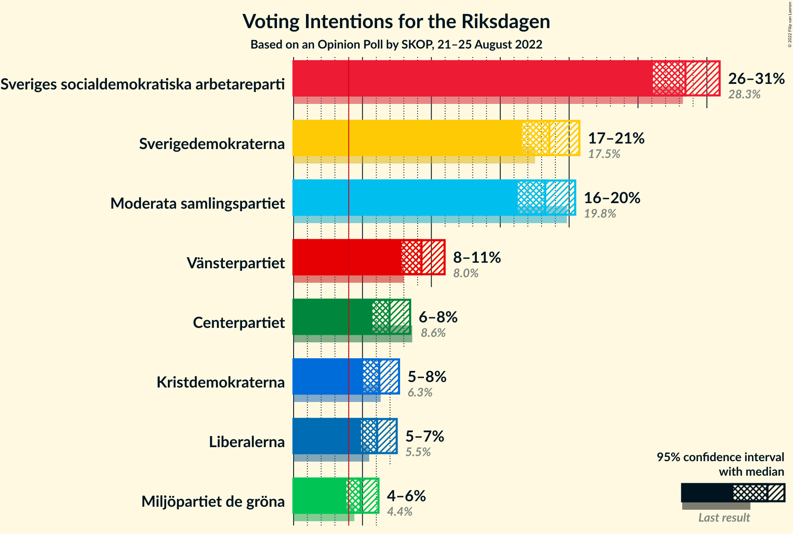

### Confidence Intervals

| Party | Last Result | Poll Result | 80% Confidence Interval | 90% Confidence Interval | 95% Confidence Interval | 99% Confidence Interval |
|:-----:|:-----------:|:-----------:|:-----------------------:|:-----------------------:|:-----------------------:|:-----------------------:|
| Sveriges socialdemokratiska arbetareparti | 28.3% | 28.4% | 26.9–30.1% |26.5–30.5% |26.1–30.9% |25.3–31.7% |
| Sverigedemokraterna | 17.5% | 18.6% | 17.3–20.0% |16.9–20.4% |16.6–20.7% |16.0–21.4% |
| Moderata samlingspartiet | 19.8% | 18.3% | 17.0–19.7% |16.6–20.1% |16.3–20.4% |15.7–21.1% |
| Vänsterpartiet | 8.0% | 9.3% | 8.3–10.4% |8.1–10.7% |7.8–11.0% |7.4–11.5% |
| Centerpartiet | 8.6% | 7.0% | 6.1–7.9% |5.9–8.2% |5.7–8.5% |5.3–8.9% |
| Kristdemokraterna | 6.3% | 6.2% | 5.4–7.1% |5.2–7.4% |5.0–7.7% |4.7–8.1% |
| Liberalerna | 5.5% | 6.1% | 5.3–7.0% |5.1–7.3% |4.9–7.5% |4.6–7.9% |
| Miljöpartiet de gröna | 4.4% | 4.9% | 4.2–5.7% |4.0–5.9% |3.8–6.2% |3.5–6.6% |

*Note:* The poll result column reflects the actual value used in the calculations. Published results may vary slightly, and in addition be rounded to fewer digits.

## Seats

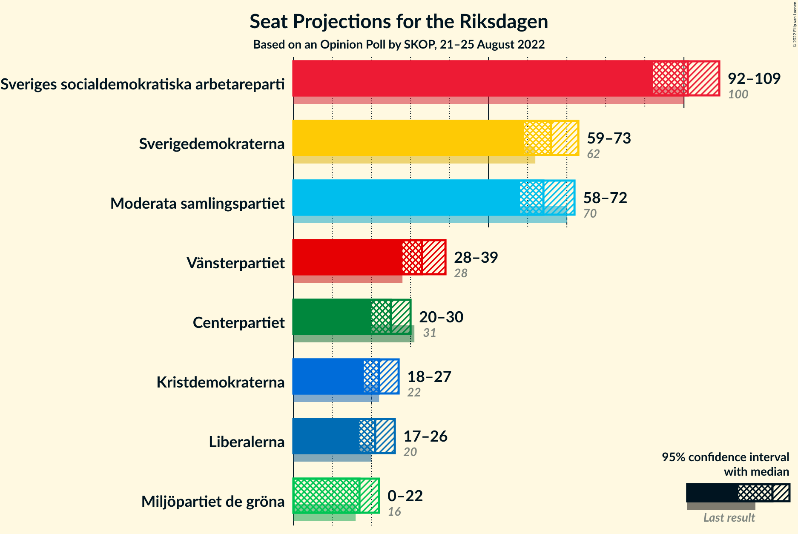

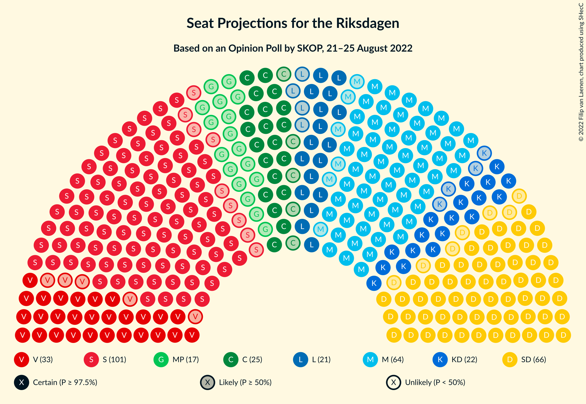

### Confidence Intervals

| Party | Last Result | Median | 80% Confidence Interval | 90% Confidence Interval | 95% Confidence Interval | 99% Confidence Interval |
|:-----:|:-----------:|:------:|:-----------------------:|:-----------------------:|:-----------------------:|:-----------------------:|
| <a href="#sveriges-socialdemokratiska-arbetareparti">Sveriges socialdemokratiska arbetareparti</a> | 100 | 101 | 95–106 |93–108 |92–109 |89–112 |
| <a href="#sverigedemokraterna">Sverigedemokraterna</a> | 62 | 66 | 61–71 |59–72 |59–73 |56–76 |
| <a href="#moderata-samlingspartiet">Moderata samlingspartiet</a> | 70 | 64 | 60–69 |59–71 |58–72 |55–75 |
| <a href="#vänsterpartiet">Vänsterpartiet</a> | 28 | 33 | 30–37 |29–38 |28–39 |26–41 |
| <a href="#centerpartiet">Centerpartiet</a> | 31 | 25 | 22–28 |21–29 |20–30 |19–32 |
| <a href="#kristdemokraterna">Kristdemokraterna</a> | 22 | 22 | 19–25 |18–26 |18–27 |17–29 |
| <a href="#liberalerna">Liberalerna</a> | 20 | 21 | 19–25 |18–26 |17–26 |16–28 |
| <a href="#miljöpartiet-de-gröna">Miljöpartiet de gröna</a> | 16 | 17 | 14–20 |14–21 |0–22 |0–23 |

### Sveriges socialdemokratiska arbetareparti

*For a full overview of the results for this party, see the [Sveriges socialdemokratiska arbetareparti](party-sverigessocialdemokratiskaarbetareparti.html) page.*

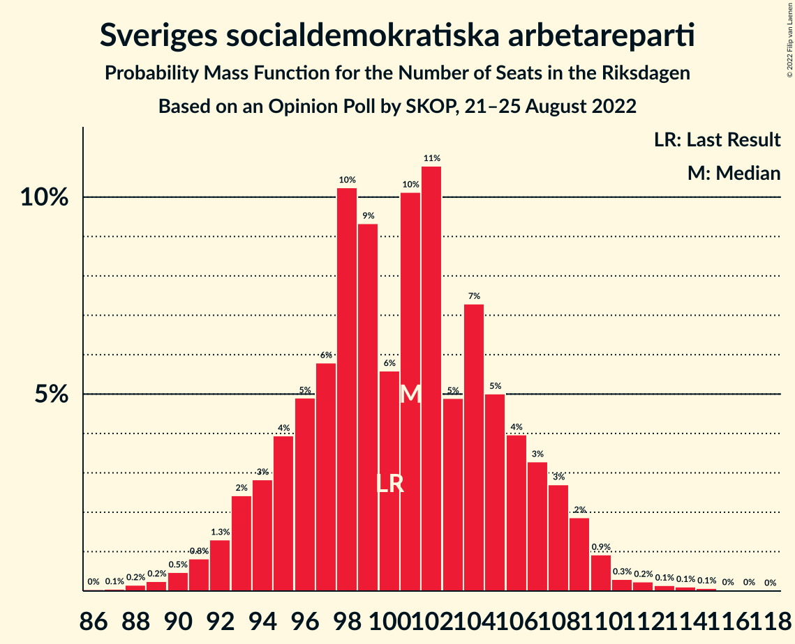

| Number of Seats | Probability | Accumulated | Special Marks |
|:---------------:|:-----------:|:-----------:|:-------------:|
| 86 | 0% | 100% |  |
| 87 | 0.1% | 99.9% |  |
| 88 | 0.2% | 99.9% |  |
| 89 | 0.2% | 99.7% |  |
| 90 | 0.5% | 99.5% |  |
| 91 | 0.8% | 99.0% |  |
| 92 | 1.3% | 98% |  |
| 93 | 2% | 97% |  |
| 94 | 3% | 94% |  |
| 95 | 4% | 92% |  |
| 96 | 5% | 88% |  |
| 97 | 6% | 83% |  |
| 98 | 10% | 77% |  |
| 99 | 9% | 67% |  |
| 100 | 6% | 57% | Last Result |
| 101 | 10% | 52% | Median |
| 102 | 11% | 42% |  |
| 103 | 5% | 31% |  |
| 104 | 7% | 26% |  |
| 105 | 5% | 19% |  |
| 106 | 4% | 14% |  |
| 107 | 3% | 10% |  |
| 108 | 3% | 6% |  |
| 109 | 2% | 4% |  |
| 110 | 0.9% | 2% |  |
| 111 | 0.3% | 1.0% |  |
| 112 | 0.2% | 0.7% |  |
| 113 | 0.1% | 0.4% |  |
| 114 | 0.1% | 0.3% |  |
| 115 | 0.1% | 0.2% |  |
| 116 | 0% | 0.1% |  |
| 117 | 0% | 0.1% |  |
| 118 | 0% | 0% |  |

### Sverigedemokraterna

*For a full overview of the results for this party, see the [Sverigedemokraterna](party-sverigedemokraterna.html) page.*

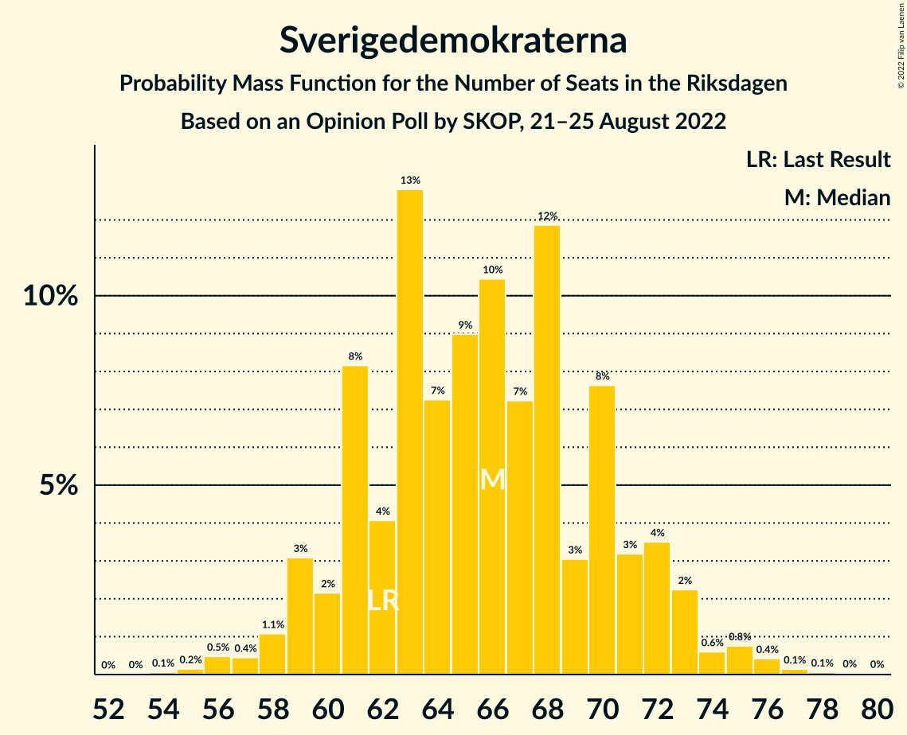

| Number of Seats | Probability | Accumulated | Special Marks |
|:---------------:|:-----------:|:-----------:|:-------------:|
| 54 | 0.1% | 100% |  |
| 55 | 0.2% | 99.9% |  |
| 56 | 0.5% | 99.8% |  |
| 57 | 0.4% | 99.3% |  |
| 58 | 1.1% | 98.8% |  |
| 59 | 3% | 98% |  |
| 60 | 2% | 95% |  |
| 61 | 8% | 93% |  |
| 62 | 4% | 84% | Last Result |
| 63 | 13% | 80% |  |
| 64 | 7% | 67% |  |
| 65 | 9% | 60% |  |
| 66 | 10% | 51% | Median |
| 67 | 7% | 41% |  |
| 68 | 12% | 34% |  |
| 69 | 3% | 22% |  |
| 70 | 8% | 19% |  |
| 71 | 3% | 11% |  |
| 72 | 4% | 8% |  |
| 73 | 2% | 4% |  |
| 74 | 0.6% | 2% |  |
| 75 | 0.8% | 1.5% |  |
| 76 | 0.4% | 0.7% |  |
| 77 | 0.1% | 0.3% |  |
| 78 | 0.1% | 0.1% |  |
| 79 | 0% | 0.1% |  |
| 80 | 0% | 0% |  |

### Moderata samlingspartiet

*For a full overview of the results for this party, see the [Moderata samlingspartiet](party-moderatasamlingspartiet.html) page.*

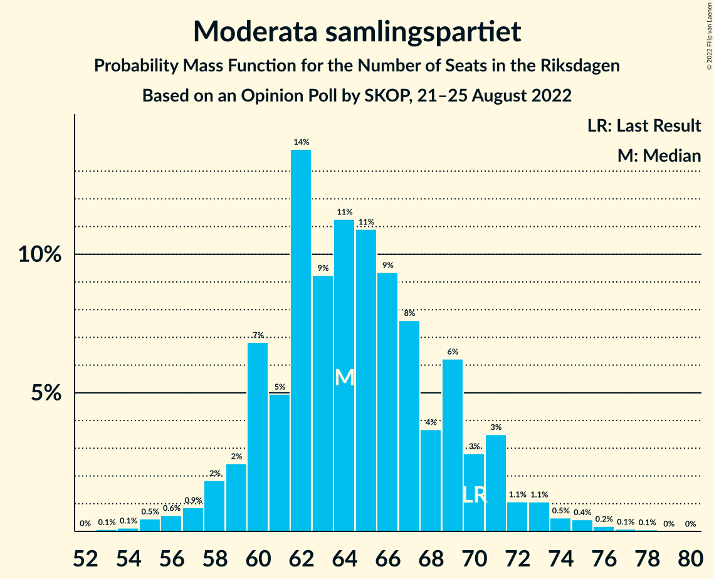

| Number of Seats | Probability | Accumulated | Special Marks |
|:---------------:|:-----------:|:-----------:|:-------------:|
| 53 | 0.1% | 100% |  |
| 54 | 0.1% | 99.9% |  |
| 55 | 0.5% | 99.8% |  |
| 56 | 0.6% | 99.3% |  |
| 57 | 0.9% | 98.7% |  |
| 58 | 2% | 98% |  |
| 59 | 2% | 96% |  |
| 60 | 7% | 94% |  |
| 61 | 5% | 87% |  |
| 62 | 14% | 82% |  |
| 63 | 9% | 68% |  |
| 64 | 11% | 59% | Median |
| 65 | 11% | 47% |  |
| 66 | 9% | 37% |  |
| 67 | 8% | 27% |  |
| 68 | 4% | 20% |  |
| 69 | 6% | 16% |  |
| 70 | 3% | 10% | Last Result |
| 71 | 3% | 7% |  |
| 72 | 1.1% | 3% |  |
| 73 | 1.1% | 2% |  |
| 74 | 0.5% | 1.3% |  |
| 75 | 0.4% | 0.8% |  |
| 76 | 0.2% | 0.4% |  |
| 77 | 0.1% | 0.2% |  |
| 78 | 0.1% | 0.1% |  |
| 79 | 0% | 0% |  |

### Vänsterpartiet

*For a full overview of the results for this party, see the [Vänsterpartiet](party-vänsterpartiet.html) page.*

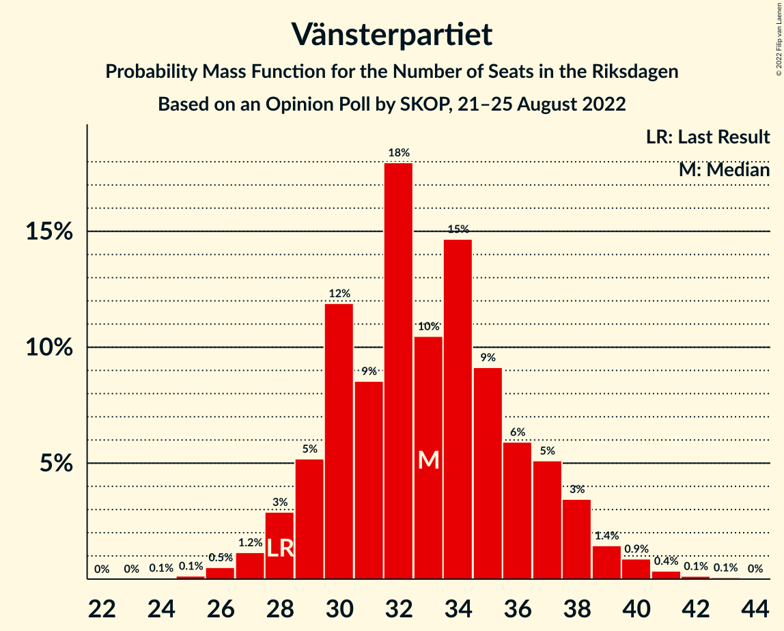

| Number of Seats | Probability | Accumulated | Special Marks |
|:---------------:|:-----------:|:-----------:|:-------------:|
| 24 | 0.1% | 100% |  |
| 25 | 0.1% | 99.9% |  |
| 26 | 0.5% | 99.8% |  |
| 27 | 1.2% | 99.3% |  |
| 28 | 3% | 98% | Last Result |
| 29 | 5% | 95% |  |
| 30 | 12% | 90% |  |
| 31 | 9% | 78% |  |
| 32 | 18% | 70% |  |
| 33 | 10% | 52% | Median |
| 34 | 15% | 41% |  |
| 35 | 9% | 27% |  |
| 36 | 6% | 17% |  |
| 37 | 5% | 11% |  |
| 38 | 3% | 6% |  |
| 39 | 1.4% | 3% |  |
| 40 | 0.9% | 1.5% |  |
| 41 | 0.4% | 0.6% |  |
| 42 | 0.1% | 0.2% |  |
| 43 | 0.1% | 0.1% |  |
| 44 | 0% | 0% |  |

### Centerpartiet

*For a full overview of the results for this party, see the [Centerpartiet](party-centerpartiet.html) page.*

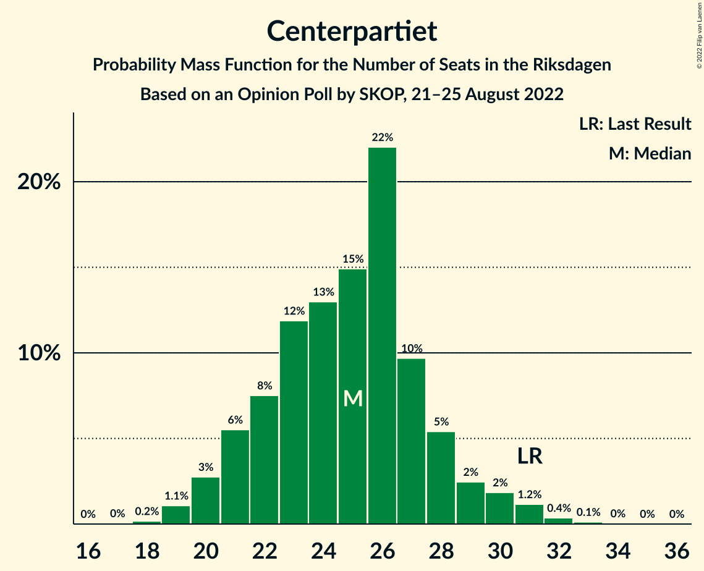

| Number of Seats | Probability | Accumulated | Special Marks |
|:---------------:|:-----------:|:-----------:|:-------------:|
| 17 | 0% | 100% |  |
| 18 | 0.2% | 99.9% |  |
| 19 | 1.1% | 99.8% |  |
| 20 | 3% | 98.7% |  |
| 21 | 6% | 96% |  |
| 22 | 8% | 90% |  |
| 23 | 12% | 83% |  |
| 24 | 13% | 71% |  |
| 25 | 15% | 58% | Median |
| 26 | 22% | 43% |  |
| 27 | 10% | 21% |  |
| 28 | 5% | 11% |  |
| 29 | 2% | 6% |  |
| 30 | 2% | 4% |  |
| 31 | 1.2% | 2% | Last Result |
| 32 | 0.4% | 0.5% |  |
| 33 | 0.1% | 0.2% |  |
| 34 | 0% | 0.1% |  |
| 35 | 0% | 0% |  |

### Kristdemokraterna

*For a full overview of the results for this party, see the [Kristdemokraterna](party-kristdemokraterna.html) page.*

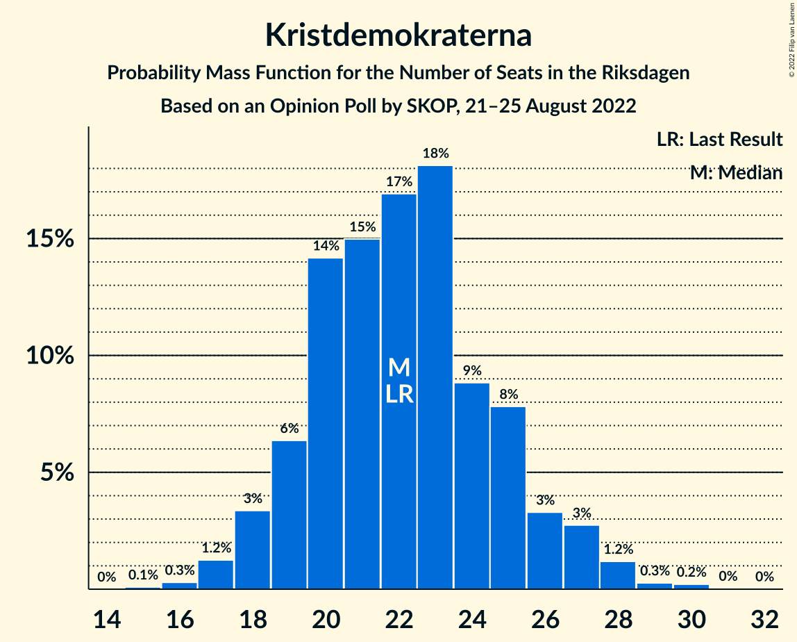

| Number of Seats | Probability | Accumulated | Special Marks |
|:---------------:|:-----------:|:-----------:|:-------------:|
| 15 | 0.1% | 100% |  |
| 16 | 0.3% | 99.9% |  |
| 17 | 1.2% | 99.6% |  |
| 18 | 3% | 98% |  |
| 19 | 6% | 95% |  |
| 20 | 14% | 89% |  |
| 21 | 15% | 74% |  |
| 22 | 17% | 59% | Last Result, Median |
| 23 | 18% | 43% |  |
| 24 | 9% | 24% |  |
| 25 | 8% | 16% |  |
| 26 | 3% | 8% |  |
| 27 | 3% | 4% |  |
| 28 | 1.2% | 2% |  |
| 29 | 0.3% | 0.5% |  |
| 30 | 0.2% | 0.3% |  |
| 31 | 0% | 0.1% |  |
| 32 | 0% | 0% |  |

### Liberalerna

*For a full overview of the results for this party, see the [Liberalerna](party-liberalerna.html) page.*

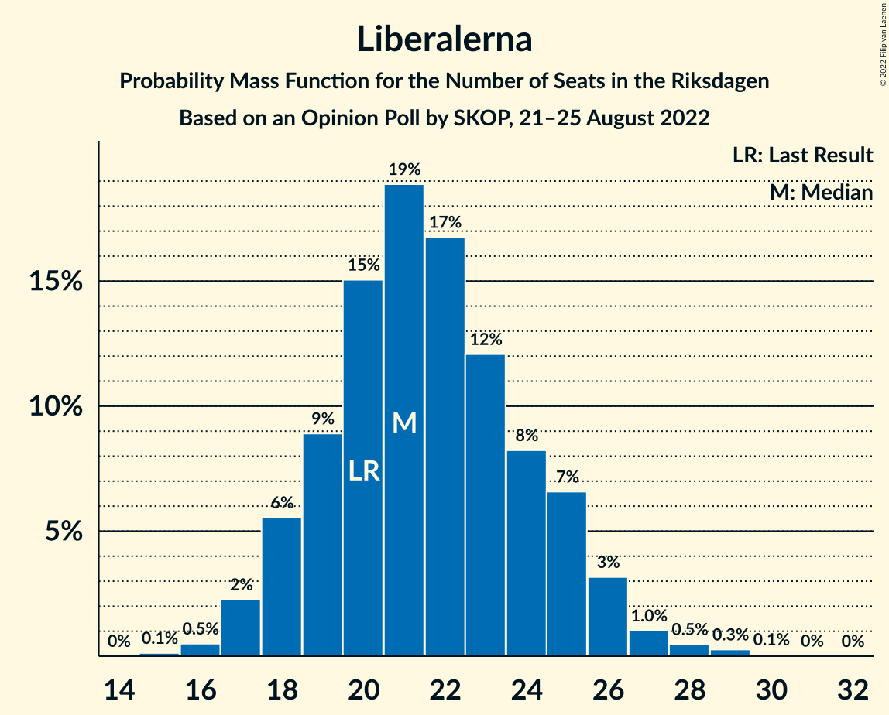

| Number of Seats | Probability | Accumulated | Special Marks |
|:---------------:|:-----------:|:-----------:|:-------------:|
| 15 | 0.1% | 100% |  |
| 16 | 0.5% | 99.8% |  |
| 17 | 2% | 99.3% |  |
| 18 | 6% | 97% |  |
| 19 | 9% | 92% |  |
| 20 | 15% | 83% | Last Result |
| 21 | 19% | 68% | Median |
| 22 | 17% | 49% |  |
| 23 | 12% | 32% |  |
| 24 | 8% | 20% |  |
| 25 | 7% | 12% |  |
| 26 | 3% | 5% |  |
| 27 | 1.0% | 2% |  |
| 28 | 0.5% | 0.8% |  |
| 29 | 0.3% | 0.4% |  |
| 30 | 0.1% | 0.1% |  |
| 31 | 0% | 0% |  |

### Miljöpartiet de gröna

*For a full overview of the results for this party, see the [Miljöpartiet de gröna](party-miljöpartietdegröna.html) page.*

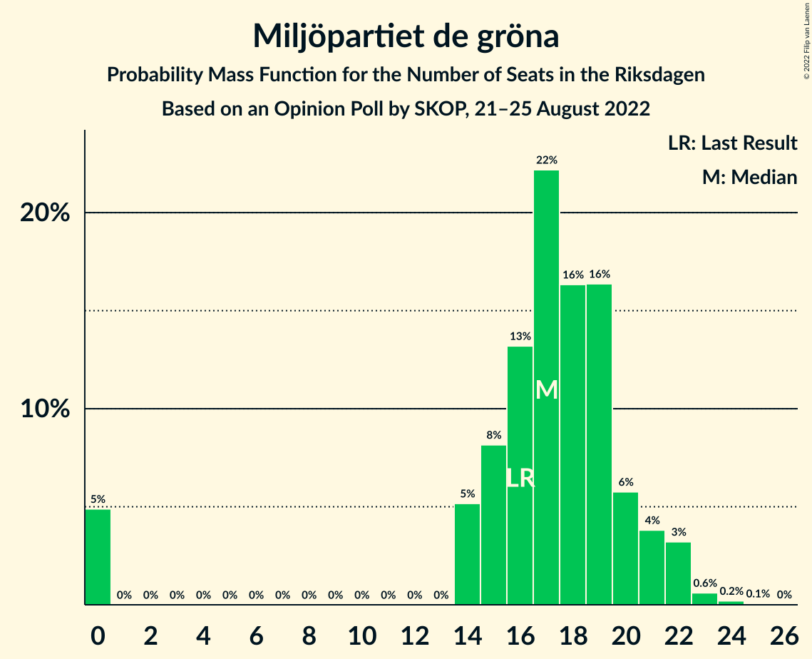

| Number of Seats | Probability | Accumulated | Special Marks |
|:---------------:|:-----------:|:-----------:|:-------------:|
| 0 | 5% | 100% |  |
| 1 | 0% | 95% |  |
| 2 | 0% | 95% |  |
| 3 | 0% | 95% |  |
| 4 | 0% | 95% |  |
| 5 | 0% | 95% |  |
| 6 | 0% | 95% |  |
| 7 | 0% | 95% |  |
| 8 | 0% | 95% |  |
| 9 | 0% | 95% |  |
| 10 | 0% | 95% |  |
| 11 | 0% | 95% |  |
| 12 | 0% | 95% |  |
| 13 | 0% | 95% |  |
| 14 | 5% | 95% |  |
| 15 | 8% | 90% |  |
| 16 | 13% | 82% | Last Result |
| 17 | 22% | 69% | Median |
| 18 | 16% | 46% |  |
| 19 | 16% | 30% |  |
| 20 | 6% | 14% |  |
| 21 | 4% | 8% |  |
| 22 | 3% | 4% |  |
| 23 | 0.6% | 0.9% |  |
| 24 | 0.2% | 0.3% |  |
| 25 | 0.1% | 0.1% |  |
| 26 | 0% | 0% |  |

## Coalitions

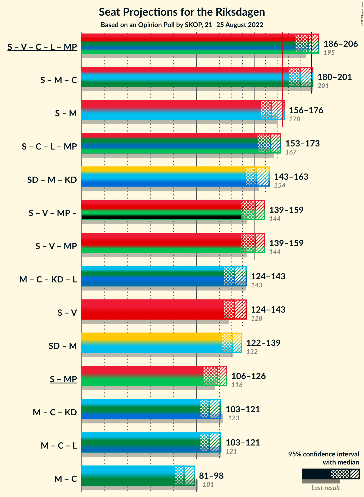

### Confidence Intervals

| Coalition | Last Result | Median | Majority? | 80% Confidence Interval | 90% Confidence Interval | 95% Confidence Interval | 99% Confidence Interval |
|:---------:|:-----------:|:------:|:---------:|:-----------------------:|:-----------------------:|:-----------------------:|:-----------------------:|
| Sveriges socialdemokratiska arbetareparti – Vänsterpartiet – Centerpartiet – Liberalerna – Miljöpartiet de gröna | 195 | 197 | 100% | 190–203 | 188–204 | 186–206 | 182–209 |
| Sveriges socialdemokratiska arbetareparti – Moderata samlingspartiet – Centerpartiet | 201 | 190 | 99.9% | 183–197 | 182–199 | 180–201 | 177–205 |
| Sveriges socialdemokratiska arbetareparti – Moderata samlingspartiet | 170 | 165 | 3% | 159–172 | 157–173 | 156–176 | 153–179 |
| Sveriges socialdemokratiska arbetareparti – Centerpartiet – Liberalerna – Miljöpartiet de gröna | 167 | 164 | 1.0% | 158–170 | 155–172 | 153–173 | 147–176 |
| Sverigedemokraterna – Moderata samlingspartiet – Kristdemokraterna | 154 | 152 | 0% | 146–159 | 145–161 | 143–163 | 140–167 |
| Sveriges socialdemokratiska arbetareparti – Vänsterpartiet – Miljöpartiet de gröna | 144 | 151 | 0% | 144–157 | 141–158 | 139–159 | 135–163 |
| Moderata samlingspartiet – Centerpartiet – Kristdemokraterna – Liberalerna | 143 | 133 | 0% | 128–139 | 126–142 | 124–143 | 121–147 |
| Sveriges socialdemokratiska arbetareparti – Vänsterpartiet | 128 | 133 | 0% | 127–140 | 126–141 | 124–143 | 121–146 |
| Sverigedemokraterna – Moderata samlingspartiet | 132 | 131 | 0% | 124–137 | 124–137 | 122–139 | 118–144 |
| Sveriges socialdemokratiska arbetareparti – Miljöpartiet de gröna | 116 | 118 | 0% | 111–123 | 108–125 | 106–126 | 100–130 |
| Moderata samlingspartiet – Centerpartiet – Kristdemokraterna | 123 | 111 | 0% | 106–117 | 104–119 | 103–121 | 100–125 |
| Moderata samlingspartiet – Centerpartiet – Liberalerna | 121 | 111 | 0% | 106–117 | 104–119 | 103–121 | 100–124 |
| Moderata samlingspartiet – Centerpartiet | 101 | 89 | 0% | 84–94 | 83–96 | 81–98 | 79–101 |

### Sveriges socialdemokratiska arbetareparti – Vänsterpartiet – Centerpartiet – Liberalerna – Miljöpartiet de gröna

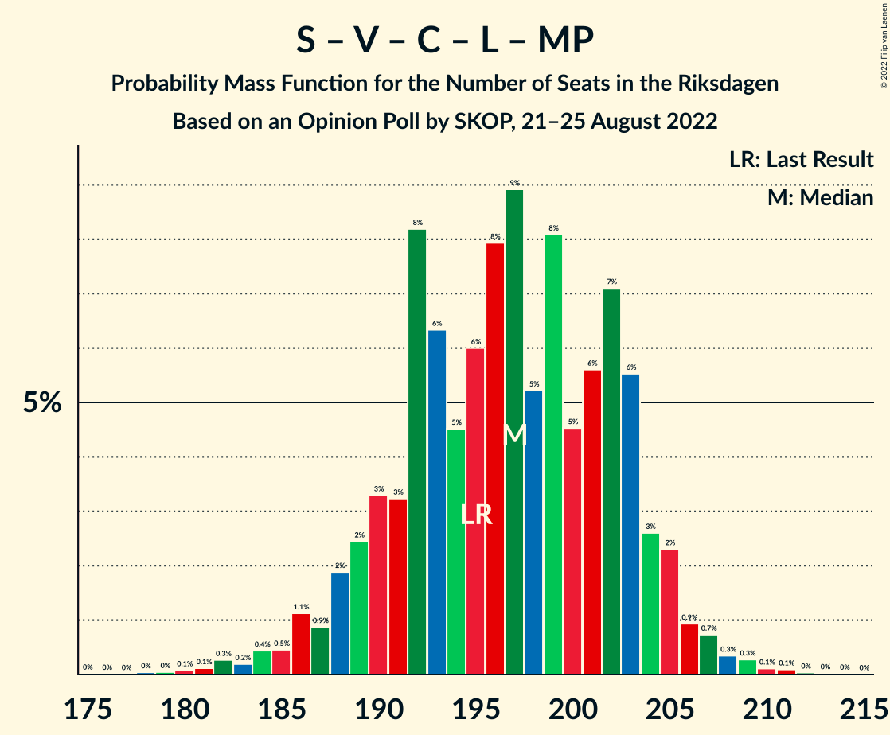

| Number of Seats | Probability | Accumulated | Special Marks |
|:---------------:|:-----------:|:-----------:|:-------------:|
| 178 | 0% | 100% |  |
| 179 | 0% | 99.9% |  |
| 180 | 0.1% | 99.9% |  |
| 181 | 0.1% | 99.8% |  |
| 182 | 0.3% | 99.7% |  |
| 183 | 0.2% | 99.4% |  |
| 184 | 0.4% | 99.2% |  |
| 185 | 0.5% | 98.8% |  |
| 186 | 1.1% | 98% |  |
| 187 | 0.9% | 97% |  |
| 188 | 2% | 96% |  |
| 189 | 2% | 94% |  |
| 190 | 3% | 92% |  |
| 191 | 3% | 89% |  |
| 192 | 8% | 85% |  |
| 193 | 6% | 77% |  |
| 194 | 5% | 71% |  |
| 195 | 6% | 66% | Last Result |
| 196 | 8% | 60% |  |
| 197 | 9% | 52% | Median |
| 198 | 5% | 44% |  |
| 199 | 8% | 38% |  |
| 200 | 5% | 30% |  |
| 201 | 6% | 26% |  |
| 202 | 7% | 20% |  |
| 203 | 6% | 13% |  |
| 204 | 3% | 7% |  |
| 205 | 2% | 5% |  |
| 206 | 0.9% | 3% |  |
| 207 | 0.7% | 2% |  |
| 208 | 0.3% | 0.9% |  |
| 209 | 0.3% | 0.6% |  |
| 210 | 0.1% | 0.3% |  |
| 211 | 0.1% | 0.2% |  |
| 212 | 0% | 0.1% |  |
| 213 | 0% | 0.1% |  |
| 214 | 0% | 0% |  |

### Sveriges socialdemokratiska arbetareparti – Moderata samlingspartiet – Centerpartiet

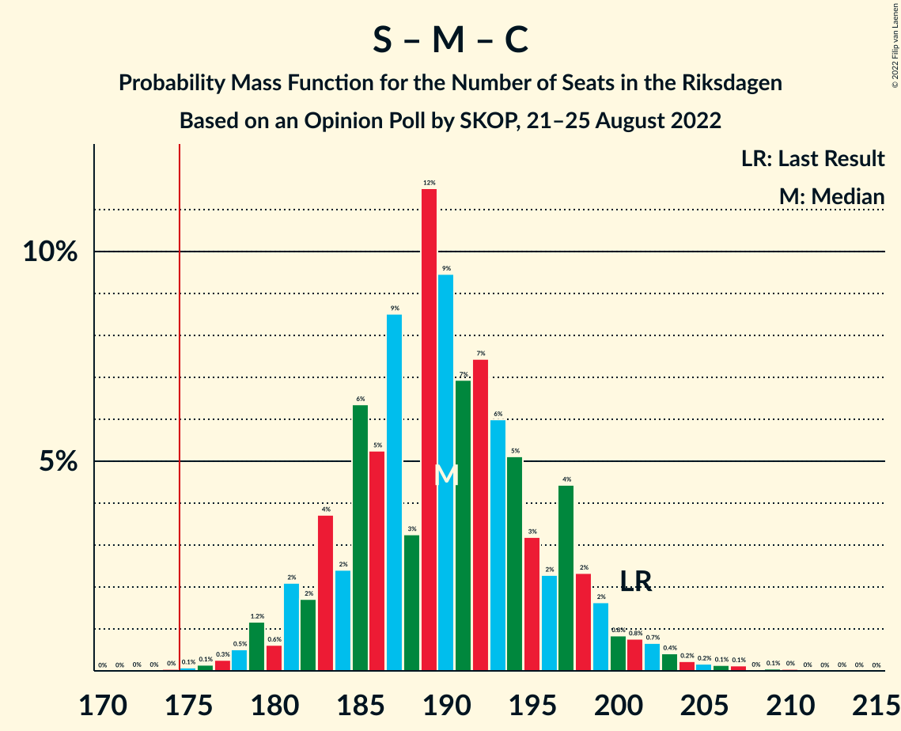

| Number of Seats | Probability | Accumulated | Special Marks |
|:---------------:|:-----------:|:-----------:|:-------------:|
| 174 | 0% | 100% |  |
| 175 | 0.1% | 99.9% | Majority |
| 176 | 0.1% | 99.8% |  |
| 177 | 0.3% | 99.7% |  |
| 178 | 0.5% | 99.4% |  |
| 179 | 1.2% | 98.9% |  |
| 180 | 0.6% | 98% |  |
| 181 | 2% | 97% |  |
| 182 | 2% | 95% |  |
| 183 | 4% | 93% |  |
| 184 | 2% | 90% |  |
| 185 | 6% | 87% |  |
| 186 | 5% | 81% |  |
| 187 | 9% | 76% |  |
| 188 | 3% | 67% |  |
| 189 | 12% | 64% |  |
| 190 | 9% | 52% | Median |
| 191 | 7% | 43% |  |
| 192 | 7% | 36% |  |
| 193 | 6% | 28% |  |
| 194 | 5% | 22% |  |
| 195 | 3% | 17% |  |
| 196 | 2% | 14% |  |
| 197 | 4% | 12% |  |
| 198 | 2% | 7% |  |
| 199 | 2% | 5% |  |
| 200 | 0.8% | 3% |  |
| 201 | 0.8% | 3% | Last Result |
| 202 | 0.7% | 2% |  |
| 203 | 0.4% | 1.2% |  |
| 204 | 0.2% | 0.8% |  |
| 205 | 0.2% | 0.6% |  |
| 206 | 0.1% | 0.4% |  |
| 207 | 0.1% | 0.3% |  |
| 208 | 0% | 0.1% |  |
| 209 | 0.1% | 0.1% |  |
| 210 | 0% | 0.1% |  |
| 211 | 0% | 0% |  |

### Sveriges socialdemokratiska arbetareparti – Moderata samlingspartiet

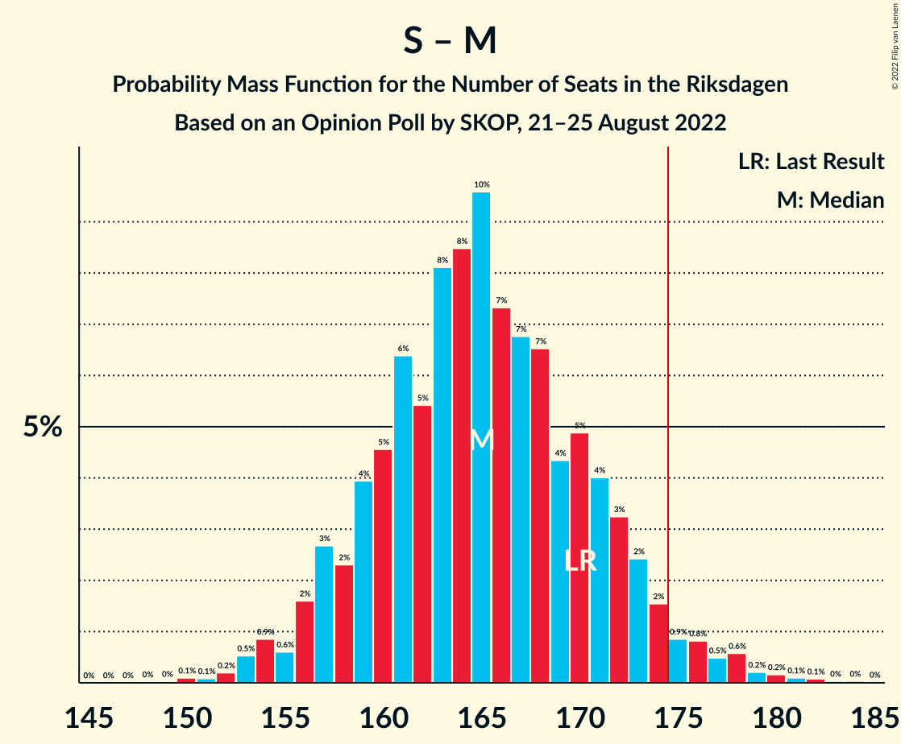

| Number of Seats | Probability | Accumulated | Special Marks |
|:---------------:|:-----------:|:-----------:|:-------------:|
| 149 | 0% | 100% |  |
| 150 | 0.1% | 99.9% |  |
| 151 | 0.1% | 99.8% |  |
| 152 | 0.2% | 99.8% |  |
| 153 | 0.5% | 99.6% |  |
| 154 | 0.9% | 99.0% |  |
| 155 | 0.6% | 98% |  |
| 156 | 2% | 98% |  |
| 157 | 3% | 96% |  |
| 158 | 2% | 93% |  |
| 159 | 4% | 91% |  |
| 160 | 5% | 87% |  |
| 161 | 6% | 82% |  |
| 162 | 5% | 76% |  |
| 163 | 8% | 71% |  |
| 164 | 8% | 63% |  |
| 165 | 10% | 54% | Median |
| 166 | 7% | 44% |  |
| 167 | 7% | 37% |  |
| 168 | 7% | 30% |  |
| 169 | 4% | 24% |  |
| 170 | 5% | 20% | Last Result |
| 171 | 4% | 15% |  |
| 172 | 3% | 11% |  |
| 173 | 2% | 7% |  |
| 174 | 2% | 5% |  |
| 175 | 0.9% | 3% | Majority |
| 176 | 0.8% | 3% |  |
| 177 | 0.5% | 2% |  |
| 178 | 0.6% | 1.2% |  |
| 179 | 0.2% | 0.7% |  |
| 180 | 0.2% | 0.4% |  |
| 181 | 0.1% | 0.3% |  |
| 182 | 0.1% | 0.2% |  |
| 183 | 0% | 0.1% |  |
| 184 | 0% | 0.1% |  |
| 185 | 0% | 0% |  |

### Sveriges socialdemokratiska arbetareparti – Centerpartiet – Liberalerna – Miljöpartiet de gröna

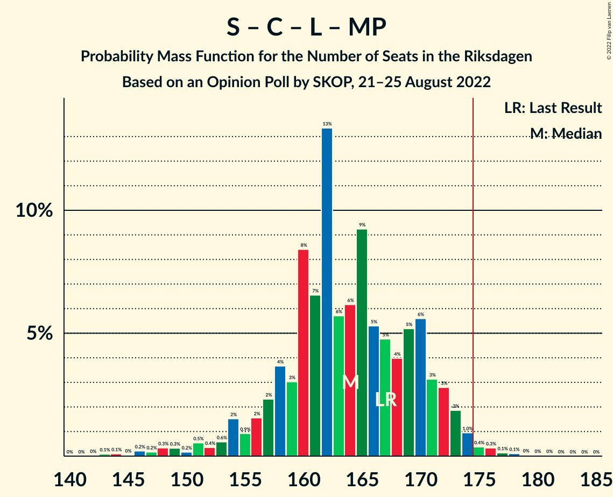

| Number of Seats | Probability | Accumulated | Special Marks |
|:---------------:|:-----------:|:-----------:|:-------------:|
| 143 | 0.1% | 100% |  |
| 144 | 0.1% | 99.9% |  |
| 145 | 0% | 99.8% |  |
| 146 | 0.2% | 99.7% |  |
| 147 | 0.2% | 99.5% |  |
| 148 | 0.3% | 99.4% |  |
| 149 | 0.3% | 99.0% |  |
| 150 | 0.2% | 98.7% |  |
| 151 | 0.5% | 98.5% |  |
| 152 | 0.4% | 98% |  |
| 153 | 0.6% | 98% |  |
| 154 | 2% | 97% |  |
| 155 | 0.9% | 96% |  |
| 156 | 2% | 95% |  |
| 157 | 2% | 93% |  |
| 158 | 4% | 91% |  |
| 159 | 3% | 87% |  |
| 160 | 8% | 84% |  |
| 161 | 7% | 76% |  |
| 162 | 13% | 69% |  |
| 163 | 6% | 56% |  |
| 164 | 6% | 50% | Median |
| 165 | 9% | 44% |  |
| 166 | 5% | 35% |  |
| 167 | 5% | 29% | Last Result |
| 168 | 4% | 25% |  |
| 169 | 5% | 21% |  |
| 170 | 6% | 15% |  |
| 171 | 3% | 10% |  |
| 172 | 3% | 7% |  |
| 173 | 2% | 4% |  |
| 174 | 1.0% | 2% |  |
| 175 | 0.4% | 1.0% | Majority |
| 176 | 0.3% | 0.7% |  |
| 177 | 0.1% | 0.3% |  |
| 178 | 0.1% | 0.2% |  |
| 179 | 0% | 0.1% |  |
| 180 | 0% | 0.1% |  |
| 181 | 0% | 0% |  |

### Sverigedemokraterna – Moderata samlingspartiet – Kristdemokraterna

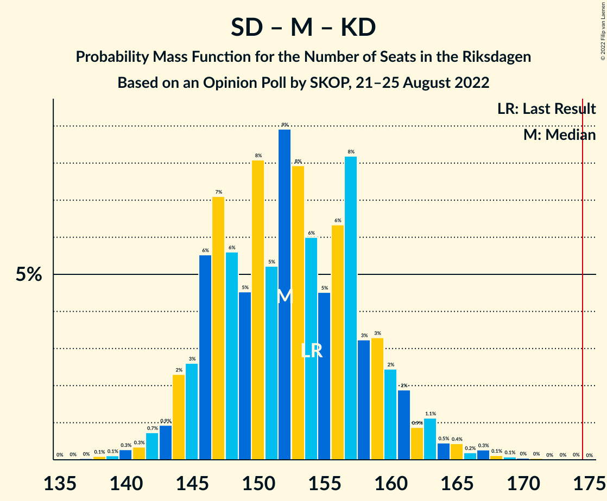

| Number of Seats | Probability | Accumulated | Special Marks |
|:---------------:|:-----------:|:-----------:|:-------------:|
| 136 | 0% | 100% |  |
| 137 | 0% | 99.9% |  |
| 138 | 0.1% | 99.9% |  |
| 139 | 0.1% | 99.8% |  |
| 140 | 0.3% | 99.7% |  |
| 141 | 0.3% | 99.4% |  |
| 142 | 0.7% | 99.1% |  |
| 143 | 0.9% | 98% |  |
| 144 | 2% | 97% |  |
| 145 | 3% | 95% |  |
| 146 | 6% | 93% |  |
| 147 | 7% | 87% |  |
| 148 | 6% | 80% |  |
| 149 | 5% | 74% |  |
| 150 | 8% | 70% |  |
| 151 | 5% | 62% |  |
| 152 | 9% | 56% | Median |
| 153 | 8% | 48% |  |
| 154 | 6% | 40% | Last Result |
| 155 | 5% | 34% |  |
| 156 | 6% | 29% |  |
| 157 | 8% | 23% |  |
| 158 | 3% | 15% |  |
| 159 | 3% | 11% |  |
| 160 | 2% | 8% |  |
| 161 | 2% | 6% |  |
| 162 | 0.9% | 4% |  |
| 163 | 1.1% | 3% |  |
| 164 | 0.5% | 2% |  |
| 165 | 0.4% | 1.2% |  |
| 166 | 0.2% | 0.8% |  |
| 167 | 0.3% | 0.6% |  |
| 168 | 0.1% | 0.3% |  |
| 169 | 0.1% | 0.2% |  |
| 170 | 0% | 0.1% |  |
| 171 | 0% | 0.1% |  |
| 172 | 0% | 0% |  |

### Sveriges socialdemokratiska arbetareparti – Vänsterpartiet – Miljöpartiet de gröna

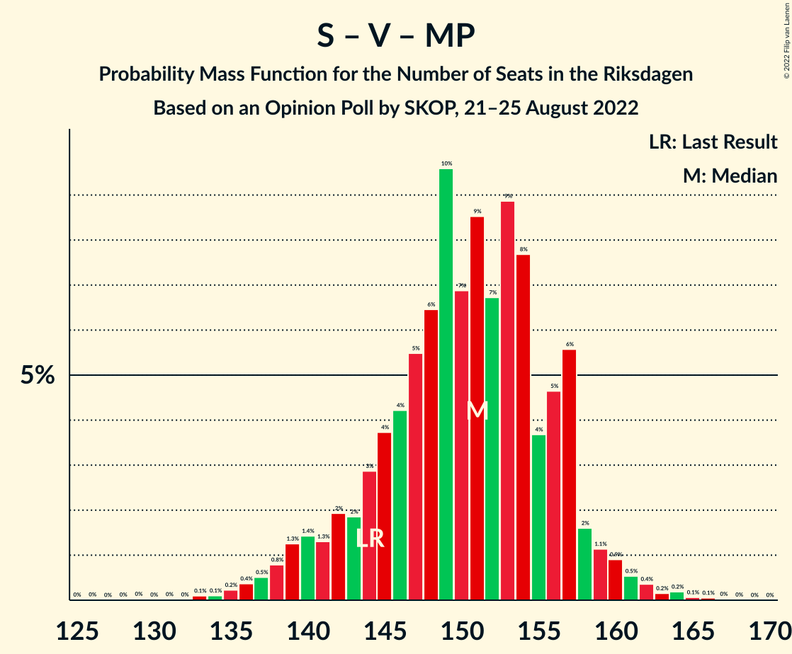

| Number of Seats | Probability | Accumulated | Special Marks |
|:---------------:|:-----------:|:-----------:|:-------------:|
| 129 | 0% | 100% |  |
| 130 | 0% | 99.9% |  |
| 131 | 0% | 99.9% |  |
| 132 | 0% | 99.9% |  |
| 133 | 0.1% | 99.9% |  |
| 134 | 0.1% | 99.8% |  |
| 135 | 0.2% | 99.7% |  |
| 136 | 0.4% | 99.4% |  |
| 137 | 0.5% | 99.1% |  |
| 138 | 0.8% | 98.6% |  |
| 139 | 1.3% | 98% |  |
| 140 | 1.4% | 97% |  |
| 141 | 1.3% | 95% |  |
| 142 | 2% | 94% |  |
| 143 | 2% | 92% |  |
| 144 | 3% | 90% | Last Result |
| 145 | 4% | 87% |  |
| 146 | 4% | 83% |  |
| 147 | 5% | 79% |  |
| 148 | 6% | 74% |  |
| 149 | 10% | 67% |  |
| 150 | 7% | 58% |  |
| 151 | 9% | 51% | Median |
| 152 | 7% | 42% |  |
| 153 | 9% | 36% |  |
| 154 | 8% | 27% |  |
| 155 | 4% | 19% |  |
| 156 | 5% | 15% |  |
| 157 | 6% | 11% |  |
| 158 | 2% | 5% |  |
| 159 | 1.1% | 3% |  |
| 160 | 0.9% | 2% |  |
| 161 | 0.5% | 1.4% |  |
| 162 | 0.4% | 0.9% |  |
| 163 | 0.2% | 0.5% |  |
| 164 | 0.2% | 0.4% |  |
| 165 | 0.1% | 0.2% |  |
| 166 | 0.1% | 0.1% |  |
| 167 | 0% | 0.1% |  |
| 168 | 0% | 0% |  |

### Moderata samlingspartiet – Centerpartiet – Kristdemokraterna – Liberalerna

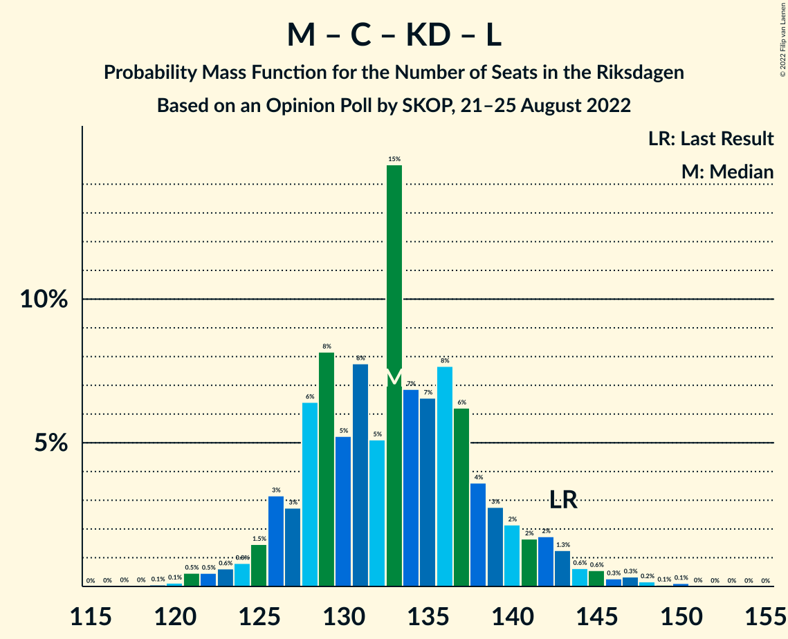

| Number of Seats | Probability | Accumulated | Special Marks |
|:---------------:|:-----------:|:-----------:|:-------------:|
| 117 | 0% | 100% |  |
| 118 | 0% | 99.9% |  |
| 119 | 0.1% | 99.9% |  |
| 120 | 0.1% | 99.8% |  |
| 121 | 0.5% | 99.7% |  |
| 122 | 0.5% | 99.3% |  |
| 123 | 0.6% | 98.8% |  |
| 124 | 0.8% | 98% |  |
| 125 | 1.5% | 97% |  |
| 126 | 3% | 96% |  |
| 127 | 3% | 93% |  |
| 128 | 6% | 90% |  |
| 129 | 8% | 84% |  |
| 130 | 5% | 75% |  |
| 131 | 8% | 70% |  |
| 132 | 5% | 62% | Median |
| 133 | 15% | 57% |  |
| 134 | 7% | 43% |  |
| 135 | 7% | 36% |  |
| 136 | 8% | 29% |  |
| 137 | 6% | 22% |  |
| 138 | 4% | 15% |  |
| 139 | 3% | 12% |  |
| 140 | 2% | 9% |  |
| 141 | 2% | 7% |  |
| 142 | 2% | 5% |  |
| 143 | 1.3% | 3% | Last Result |
| 144 | 0.6% | 2% |  |
| 145 | 0.6% | 2% |  |
| 146 | 0.3% | 1.0% |  |
| 147 | 0.3% | 0.7% |  |
| 148 | 0.2% | 0.4% |  |
| 149 | 0.1% | 0.2% |  |
| 150 | 0.1% | 0.2% |  |
| 151 | 0% | 0.1% |  |
| 152 | 0% | 0% |  |

### Sveriges socialdemokratiska arbetareparti – Vänsterpartiet

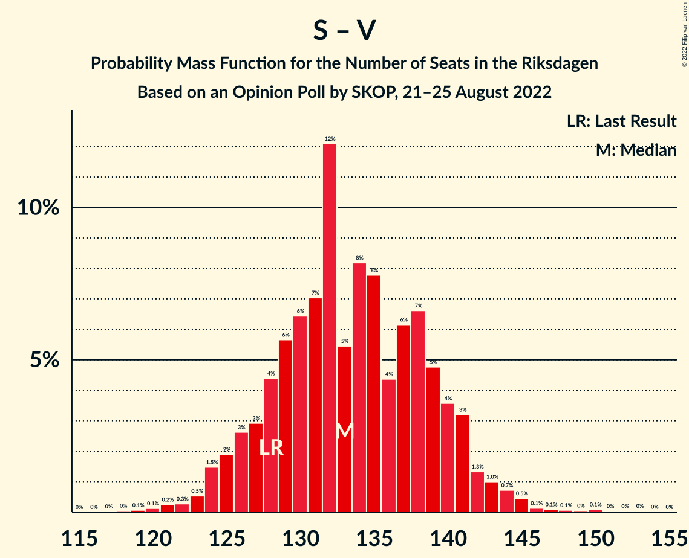

| Number of Seats | Probability | Accumulated | Special Marks |
|:---------------:|:-----------:|:-----------:|:-------------:|
| 118 | 0% | 100% |  |
| 119 | 0.1% | 99.9% |  |
| 120 | 0.1% | 99.9% |  |
| 121 | 0.2% | 99.7% |  |
| 122 | 0.3% | 99.5% |  |
| 123 | 0.5% | 99.2% |  |
| 124 | 1.5% | 98.7% |  |
| 125 | 2% | 97% |  |
| 126 | 3% | 95% |  |
| 127 | 3% | 93% |  |
| 128 | 4% | 90% | Last Result |
| 129 | 6% | 85% |  |
| 130 | 6% | 80% |  |
| 131 | 7% | 73% |  |
| 132 | 12% | 66% |  |
| 133 | 5% | 54% |  |
| 134 | 8% | 49% | Median |
| 135 | 8% | 41% |  |
| 136 | 4% | 33% |  |
| 137 | 6% | 28% |  |
| 138 | 7% | 22% |  |
| 139 | 5% | 16% |  |
| 140 | 4% | 11% |  |
| 141 | 3% | 7% |  |
| 142 | 1.3% | 4% |  |
| 143 | 1.0% | 3% |  |
| 144 | 0.7% | 2% |  |
| 145 | 0.5% | 1.0% |  |
| 146 | 0.1% | 0.5% |  |
| 147 | 0.1% | 0.4% |  |
| 148 | 0.1% | 0.3% |  |
| 149 | 0% | 0.3% |  |
| 150 | 0.1% | 0.2% |  |
| 151 | 0% | 0.1% |  |
| 152 | 0% | 0.1% |  |
| 153 | 0% | 0.1% |  |
| 154 | 0% | 0% |  |

### Sverigedemokraterna – Moderata samlingspartiet

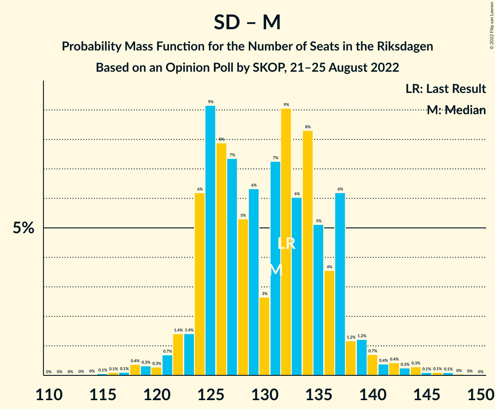

| Number of Seats | Probability | Accumulated | Special Marks |
|:---------------:|:-----------:|:-----------:|:-------------:|
| 115 | 0.1% | 100% |  |
| 116 | 0.1% | 99.9% |  |
| 117 | 0.1% | 99.8% |  |
| 118 | 0.4% | 99.7% |  |
| 119 | 0.3% | 99.3% |  |
| 120 | 0.3% | 99.0% |  |
| 121 | 0.7% | 98.7% |  |
| 122 | 1.4% | 98% |  |
| 123 | 1.4% | 97% |  |
| 124 | 6% | 95% |  |
| 125 | 9% | 89% |  |
| 126 | 8% | 80% |  |
| 127 | 7% | 72% |  |
| 128 | 5% | 65% |  |
| 129 | 6% | 59% |  |
| 130 | 3% | 53% | Median |
| 131 | 7% | 50% |  |
| 132 | 9% | 43% | Last Result |
| 133 | 6% | 34% |  |
| 134 | 8% | 28% |  |
| 135 | 5% | 20% |  |
| 136 | 4% | 15% |  |
| 137 | 6% | 11% |  |
| 138 | 1.2% | 5% |  |
| 139 | 1.2% | 4% |  |
| 140 | 0.7% | 2% |  |
| 141 | 0.4% | 2% |  |
| 142 | 0.4% | 1.3% |  |
| 143 | 0.3% | 0.9% |  |
| 144 | 0.3% | 0.7% |  |
| 145 | 0.1% | 0.4% |  |
| 146 | 0.1% | 0.3% |  |
| 147 | 0.1% | 0.2% |  |
| 148 | 0% | 0.1% |  |
| 149 | 0% | 0% |  |

### Sveriges socialdemokratiska arbetareparti – Miljöpartiet de gröna

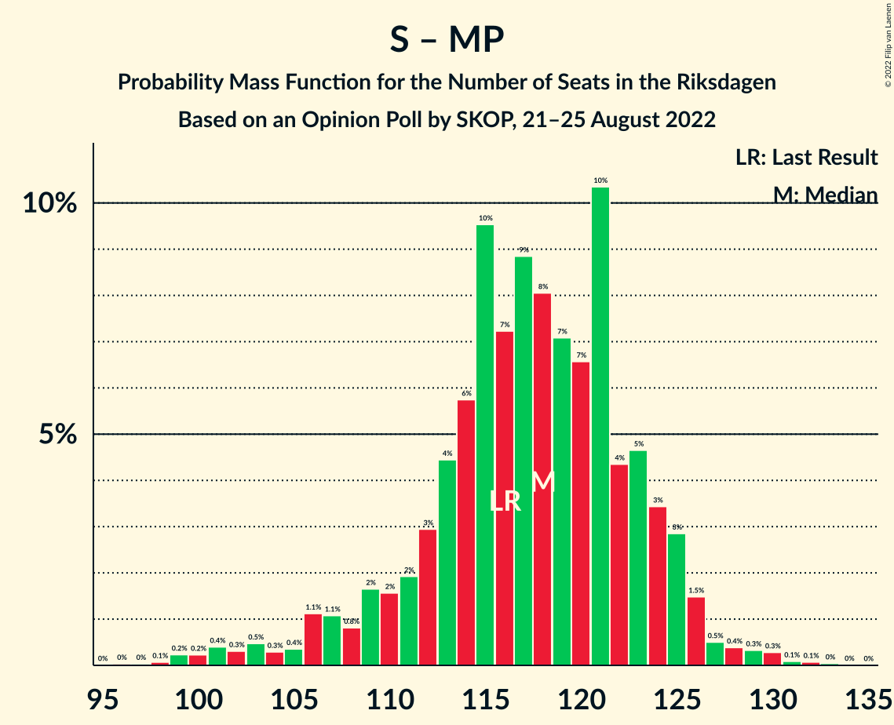

| Number of Seats | Probability | Accumulated | Special Marks |
|:---------------:|:-----------:|:-----------:|:-------------:|
| 95 | 0% | 100% |  |
| 96 | 0% | 99.9% |  |
| 97 | 0% | 99.9% |  |
| 98 | 0.1% | 99.9% |  |
| 99 | 0.2% | 99.8% |  |
| 100 | 0.2% | 99.6% |  |
| 101 | 0.4% | 99.3% |  |
| 102 | 0.3% | 98.9% |  |
| 103 | 0.5% | 98.6% |  |
| 104 | 0.3% | 98% |  |
| 105 | 0.4% | 98% |  |
| 106 | 1.1% | 98% |  |
| 107 | 1.1% | 96% |  |
| 108 | 0.8% | 95% |  |
| 109 | 2% | 94% |  |
| 110 | 2% | 93% |  |
| 111 | 2% | 91% |  |
| 112 | 3% | 89% |  |
| 113 | 4% | 86% |  |
| 114 | 6% | 82% |  |
| 115 | 10% | 76% |  |
| 116 | 7% | 67% | Last Result |
| 117 | 9% | 59% |  |
| 118 | 8% | 51% | Median |
| 119 | 7% | 43% |  |
| 120 | 7% | 35% |  |
| 121 | 10% | 29% |  |
| 122 | 4% | 19% |  |
| 123 | 5% | 14% |  |
| 124 | 3% | 10% |  |
| 125 | 3% | 6% |  |
| 126 | 1.5% | 3% |  |
| 127 | 0.5% | 2% |  |
| 128 | 0.4% | 1.2% |  |
| 129 | 0.3% | 0.8% |  |
| 130 | 0.3% | 0.5% |  |
| 131 | 0.1% | 0.2% |  |
| 132 | 0.1% | 0.1% |  |
| 133 | 0% | 0.1% |  |
| 134 | 0% | 0% |  |

### Moderata samlingspartiet – Centerpartiet – Kristdemokraterna

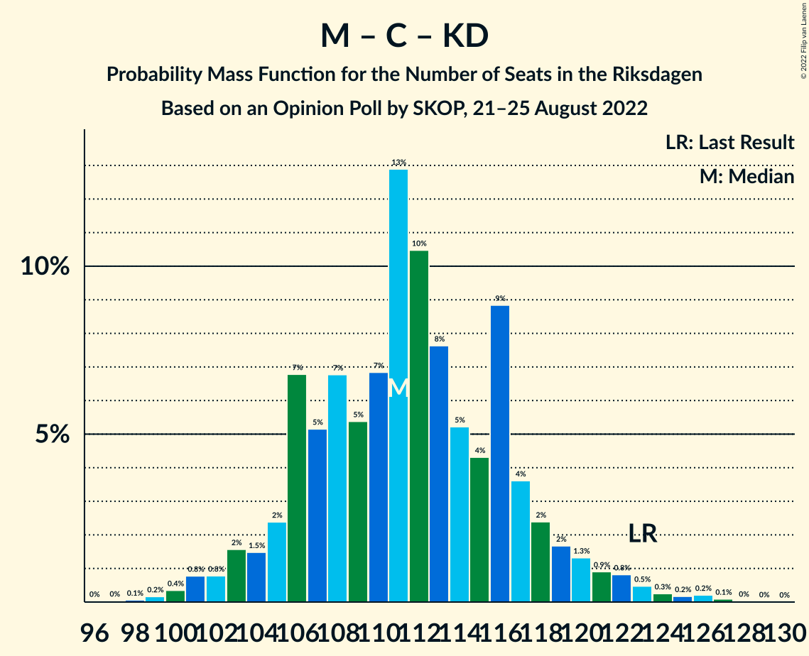

| Number of Seats | Probability | Accumulated | Special Marks |
|:---------------:|:-----------:|:-----------:|:-------------:|
| 97 | 0% | 100% |  |
| 98 | 0.1% | 99.9% |  |
| 99 | 0.2% | 99.9% |  |
| 100 | 0.4% | 99.7% |  |
| 101 | 0.8% | 99.3% |  |
| 102 | 0.8% | 98.6% |  |
| 103 | 2% | 98% |  |
| 104 | 1.5% | 96% |  |
| 105 | 2% | 95% |  |
| 106 | 7% | 92% |  |
| 107 | 5% | 86% |  |
| 108 | 7% | 80% |  |
| 109 | 5% | 74% |  |
| 110 | 7% | 68% |  |
| 111 | 13% | 61% | Median |
| 112 | 10% | 49% |  |
| 113 | 8% | 38% |  |
| 114 | 5% | 30% |  |
| 115 | 4% | 25% |  |
| 116 | 9% | 21% |  |
| 117 | 4% | 12% |  |
| 118 | 2% | 8% |  |
| 119 | 2% | 6% |  |
| 120 | 1.3% | 4% |  |
| 121 | 0.9% | 3% |  |
| 122 | 0.8% | 2% |  |
| 123 | 0.5% | 1.3% | Last Result |
| 124 | 0.3% | 0.8% |  |
| 125 | 0.2% | 0.6% |  |
| 126 | 0.2% | 0.4% |  |
| 127 | 0.1% | 0.2% |  |
| 128 | 0% | 0.1% |  |
| 129 | 0% | 0% |  |

### Moderata samlingspartiet – Centerpartiet – Liberalerna

| Number of Seats | Probability | Accumulated | Special Marks |
|:---------------:|:-----------:|:-----------:|:-------------:|
| 96 | 0% | 100% |  |
| 97 | 0.1% | 99.9% |  |
| 98 | 0.1% | 99.9% |  |
| 99 | 0.2% | 99.7% |  |
| 100 | 0.3% | 99.5% |  |
| 101 | 0.6% | 99.2% |  |
| 102 | 0.8% | 98.5% |  |
| 103 | 2% | 98% |  |
| 104 | 2% | 96% |  |
| 105 | 3% | 94% |  |
| 106 | 4% | 90% |  |
| 107 | 6% | 86% |  |
| 108 | 9% | 80% |  |
| 109 | 9% | 71% |  |
| 110 | 10% | 63% | Median |
| 111 | 10% | 53% |  |
| 112 | 10% | 43% |  |
| 113 | 8% | 33% |  |
| 114 | 7% | 25% |  |
| 115 | 5% | 18% |  |
| 116 | 3% | 13% |  |
| 117 | 3% | 11% |  |
| 118 | 2% | 8% |  |
| 119 | 1.5% | 6% |  |
| 120 | 2% | 4% |  |
| 121 | 0.5% | 3% | Last Result |
| 122 | 0.9% | 2% |  |
| 123 | 0.3% | 1.0% |  |
| 124 | 0.2% | 0.7% |  |
| 125 | 0.3% | 0.5% |  |
| 126 | 0.1% | 0.2% |  |
| 127 | 0% | 0.1% |  |
| 128 | 0% | 0% |  |

### Moderata samlingspartiet – Centerpartiet

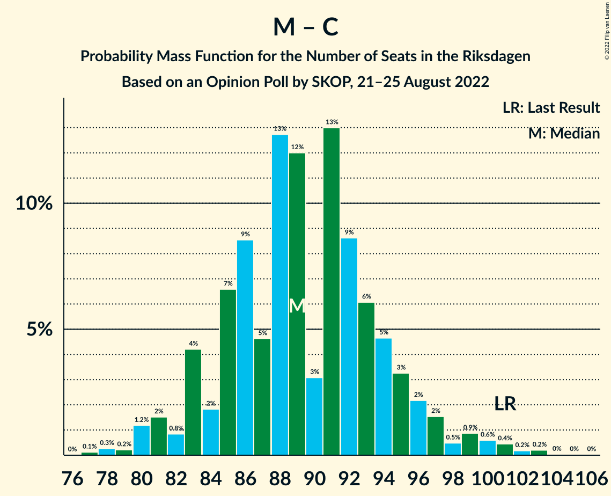

| Number of Seats | Probability | Accumulated | Special Marks |
|:---------------:|:-----------:|:-----------:|:-------------:|
| 76 | 0% | 100% |  |
| 77 | 0.1% | 99.9% |  |
| 78 | 0.3% | 99.8% |  |
| 79 | 0.2% | 99.6% |  |
| 80 | 1.2% | 99.3% |  |
| 81 | 2% | 98% |  |
| 82 | 0.8% | 97% |  |
| 83 | 4% | 96% |  |
| 84 | 2% | 92% |  |
| 85 | 7% | 90% |  |
| 86 | 9% | 83% |  |
| 87 | 5% | 75% |  |
| 88 | 13% | 70% |  |
| 89 | 12% | 57% | Median |
| 90 | 3% | 45% |  |
| 91 | 13% | 42% |  |
| 92 | 9% | 29% |  |
| 93 | 6% | 21% |  |
| 94 | 5% | 14% |  |
| 95 | 3% | 10% |  |
| 96 | 2% | 7% |  |
| 97 | 2% | 4% |  |
| 98 | 0.5% | 3% |  |
| 99 | 0.9% | 2% |  |
| 100 | 0.6% | 2% |  |
| 101 | 0.4% | 0.9% | Last Result |
| 102 | 0.2% | 0.5% |  |
| 103 | 0.2% | 0.3% |  |
| 104 | 0% | 0.1% |  |
| 105 | 0% | 0.1% |  |
| 106 | 0% | 0% |  |

## Technical Information

### Opinion Poll

+ **Polling firm:** SKOP
+ **Commissioner(s):** —
+ **Fieldwork period:** 21–25 August 2022

### Calculations

+ **Sample size:** 1336
+ **Simulations done:** 1,048,576
+ **Error estimate:** 1.28%

