# Opinion Poll by Sifo for Svenska Dagbladet, 23–25 August 2022

<a href="#voting-intentions">Voting Intentions</a> | <a href="#seats">Seats</a> | <a href="#coalitions">Coalitions</a> | <a href="#technical-information">Technical Information</a>

## Voting Intentions

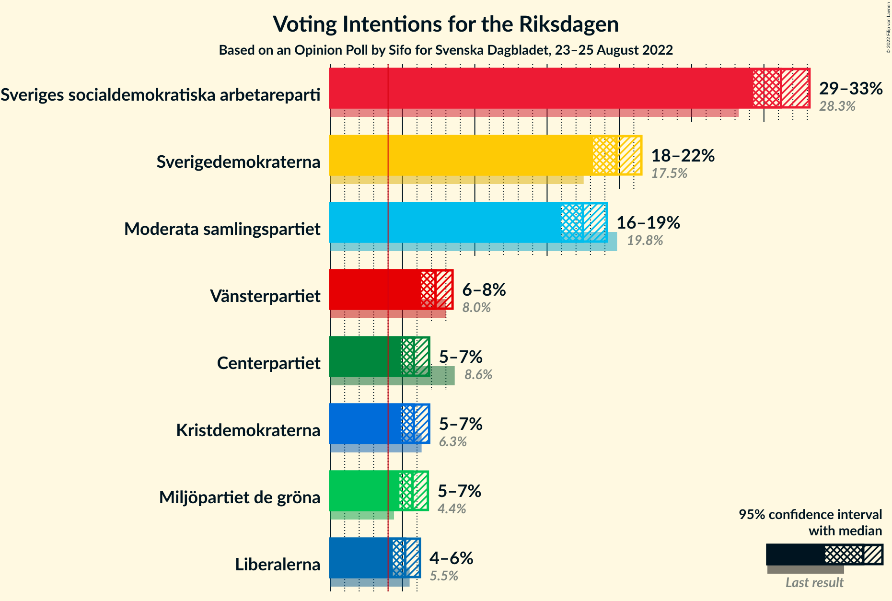

### Confidence Intervals

| Party | Last Result | Poll Result | 80% Confidence Interval | 90% Confidence Interval | 95% Confidence Interval | 99% Confidence Interval |
|:-----:|:-----------:|:-----------:|:-----------------------:|:-----------------------:|:-----------------------:|:-----------------------:|
| Sveriges socialdemokratiska arbetareparti | 28.3% | 31.2% | 29.9–32.5% |29.6–32.8% |29.3–33.2% |28.7–33.8% |
| Sverigedemokraterna | 17.5% | 19.8% | 18.7–20.9% |18.4–21.2% |18.2–21.5% |17.7–22.1% |
| Moderata samlingspartiet | 19.8% | 17.5% | 16.5–18.6% |16.2–18.9% |15.9–19.1% |15.5–19.7% |
| Vänsterpartiet | 8.0% | 7.3% | 6.6–8.0% |6.4–8.3% |6.3–8.5% |6.0–8.8% |
| Centerpartiet | 8.6% | 5.8% | 5.2–6.5% |5.0–6.7% |4.9–6.8% |4.6–7.2% |
| Kristdemokraterna | 6.3% | 5.8% | 5.2–6.5% |5.0–6.7% |4.9–6.8% |4.6–7.2% |
| Miljöpartiet de gröna | 4.4% | 5.7% | 5.1–6.4% |4.9–6.6% |4.8–6.8% |4.5–7.1% |
| Liberalerna | 5.5% | 5.2% | 4.6–5.9% |4.5–6.0% |4.3–6.2% |4.1–6.5% |

*Note:* The poll result column reflects the actual value used in the calculations. Published results may vary slightly, and in addition be rounded to fewer digits.

## Seats

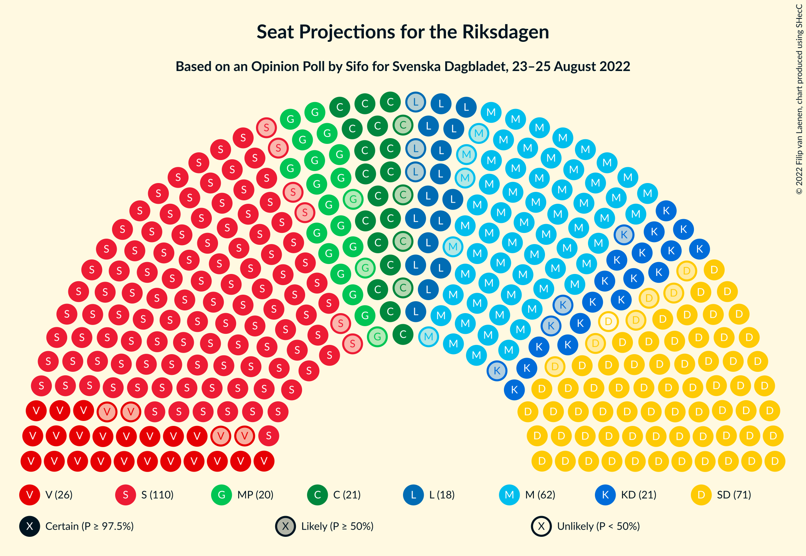

### Confidence Intervals

| Party | Last Result | Median | 80% Confidence Interval | 90% Confidence Interval | 95% Confidence Interval | 99% Confidence Interval |
|:-----:|:-----------:|:------:|:-----------------------:|:-----------------------:|:-----------------------:|:-----------------------:|
| <a href="#sveriges-socialdemokratiska-arbetareparti">Sveriges socialdemokratiska arbetareparti</a> | 100 | 110 | 106–115 |105–117 |104–118 |102–120 |
| <a href="#sverigedemokraterna">Sverigedemokraterna</a> | 62 | 70 | 66–74 |65–75 |64–76 |63–78 |
| <a href="#moderata-samlingspartiet">Moderata samlingspartiet</a> | 70 | 62 | 58–66 |57–67 |57–68 |55–69 |
| <a href="#vänsterpartiet">Vänsterpartiet</a> | 28 | 26 | 23–28 |23–29 |22–30 |21–31 |
| <a href="#centerpartiet">Centerpartiet</a> | 31 | 21 | 18–23 |18–24 |17–24 |16–25 |
| <a href="#kristdemokraterna">Kristdemokraterna</a> | 22 | 21 | 18–23 |18–24 |17–24 |16–26 |
| <a href="#miljöpartiet-de-gröna">Miljöpartiet de gröna</a> | 16 | 20 | 18–23 |17–23 |17–24 |16–25 |
| <a href="#liberalerna">Liberalerna</a> | 20 | 18 | 16–21 |16–21 |15–22 |15–23 |

### Sveriges socialdemokratiska arbetareparti

*For a full overview of the results for this party, see the [Sveriges socialdemokratiska arbetareparti](party-sverigessocialdemokratiskaarbetareparti.html) page.*

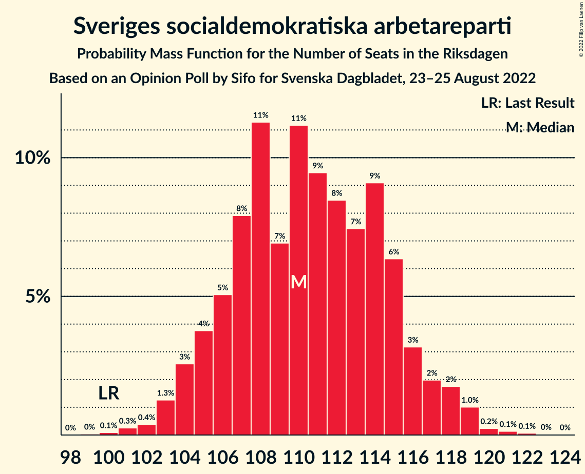

| Number of Seats | Probability | Accumulated | Special Marks |
|:---------------:|:-----------:|:-----------:|:-------------:|
| 99 | 0% | 100% |  |
| 100 | 0.1% | 99.9% | Last Result |
| 101 | 0.3% | 99.8% |  |
| 102 | 0.4% | 99.6% |  |
| 103 | 1.3% | 99.2% |  |
| 104 | 3% | 98% |  |
| 105 | 4% | 95% |  |
| 106 | 5% | 92% |  |
| 107 | 8% | 87% |  |
| 108 | 11% | 79% |  |
| 109 | 7% | 67% |  |
| 110 | 11% | 60% | Median |
| 111 | 9% | 49% |  |
| 112 | 8% | 40% |  |
| 113 | 7% | 31% |  |
| 114 | 9% | 24% |  |
| 115 | 6% | 15% |  |
| 116 | 3% | 8% |  |
| 117 | 2% | 5% |  |
| 118 | 2% | 3% |  |
| 119 | 1.0% | 2% |  |
| 120 | 0.2% | 0.5% |  |
| 121 | 0.1% | 0.3% |  |
| 122 | 0.1% | 0.1% |  |
| 123 | 0% | 0.1% |  |
| 124 | 0% | 0% |  |

### Sverigedemokraterna

*For a full overview of the results for this party, see the [Sverigedemokraterna](party-sverigedemokraterna.html) page.*

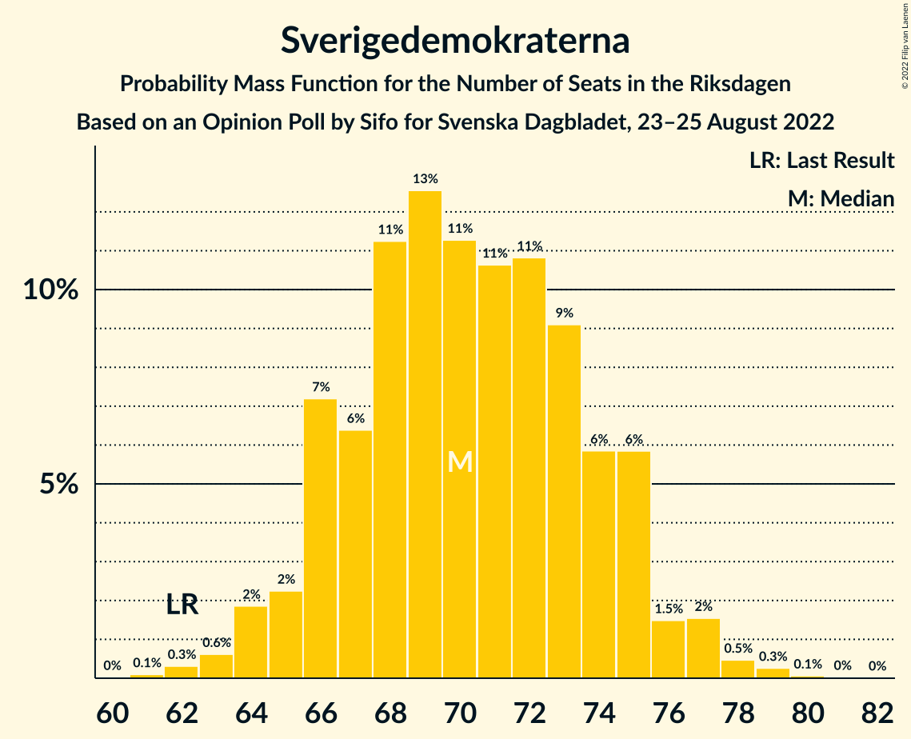

| Number of Seats | Probability | Accumulated | Special Marks |
|:---------------:|:-----------:|:-----------:|:-------------:|
| 61 | 0.1% | 100% |  |
| 62 | 0.3% | 99.9% | Last Result |
| 63 | 0.6% | 99.5% |  |
| 64 | 2% | 98.9% |  |
| 65 | 2% | 97% |  |
| 66 | 7% | 95% |  |
| 67 | 6% | 88% |  |
| 68 | 11% | 81% |  |
| 69 | 13% | 70% |  |
| 70 | 11% | 57% | Median |
| 71 | 11% | 46% |  |
| 72 | 11% | 36% |  |
| 73 | 9% | 25% |  |
| 74 | 6% | 16% |  |
| 75 | 6% | 10% |  |
| 76 | 1.5% | 4% |  |
| 77 | 2% | 2% |  |
| 78 | 0.5% | 0.9% |  |
| 79 | 0.3% | 0.4% |  |
| 80 | 0.1% | 0.1% |  |
| 81 | 0% | 0.1% |  |
| 82 | 0% | 0% |  |

### Moderata samlingspartiet

*For a full overview of the results for this party, see the [Moderata samlingspartiet](party-moderatasamlingspartiet.html) page.*

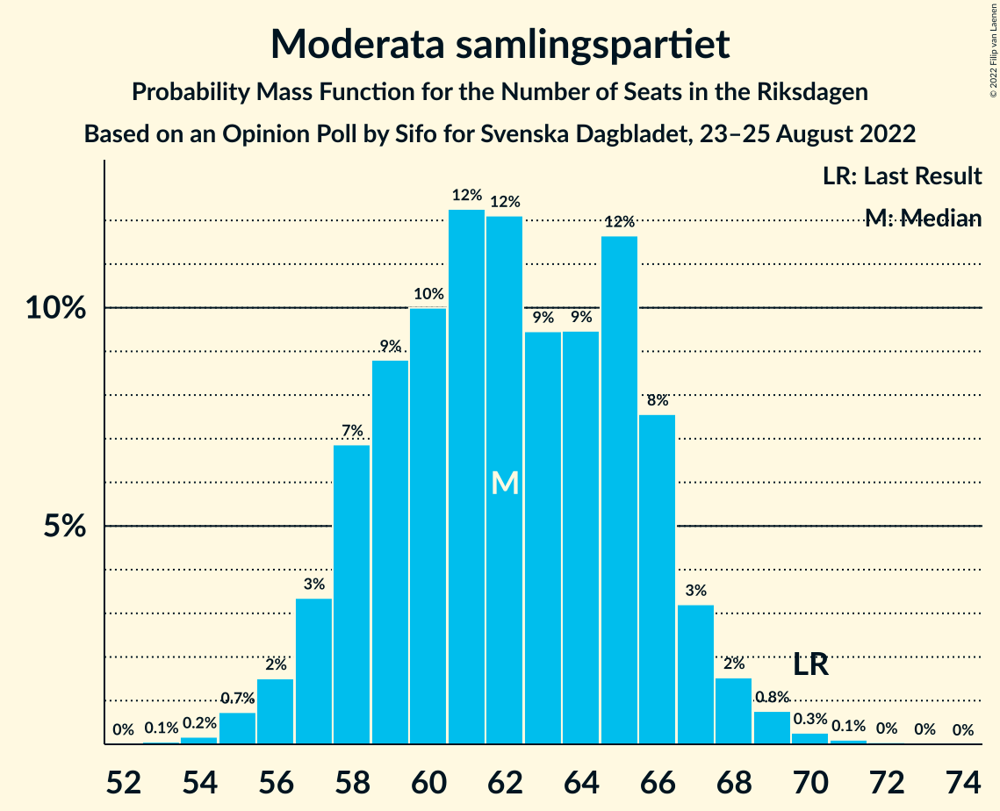

| Number of Seats | Probability | Accumulated | Special Marks |
|:---------------:|:-----------:|:-----------:|:-------------:|
| 53 | 0.1% | 100% |  |
| 54 | 0.2% | 99.9% |  |
| 55 | 0.7% | 99.7% |  |
| 56 | 2% | 99.0% |  |
| 57 | 3% | 98% |  |
| 58 | 7% | 94% |  |
| 59 | 9% | 87% |  |
| 60 | 10% | 78% |  |
| 61 | 12% | 68% |  |
| 62 | 12% | 56% | Median |
| 63 | 9% | 44% |  |
| 64 | 9% | 35% |  |
| 65 | 12% | 25% |  |
| 66 | 8% | 14% |  |
| 67 | 3% | 6% |  |
| 68 | 2% | 3% |  |
| 69 | 0.8% | 1.2% |  |
| 70 | 0.3% | 0.4% | Last Result |
| 71 | 0.1% | 0.2% |  |
| 72 | 0% | 0.1% |  |
| 73 | 0% | 0% |  |

### Vänsterpartiet

*For a full overview of the results for this party, see the [Vänsterpartiet](party-vänsterpartiet.html) page.*

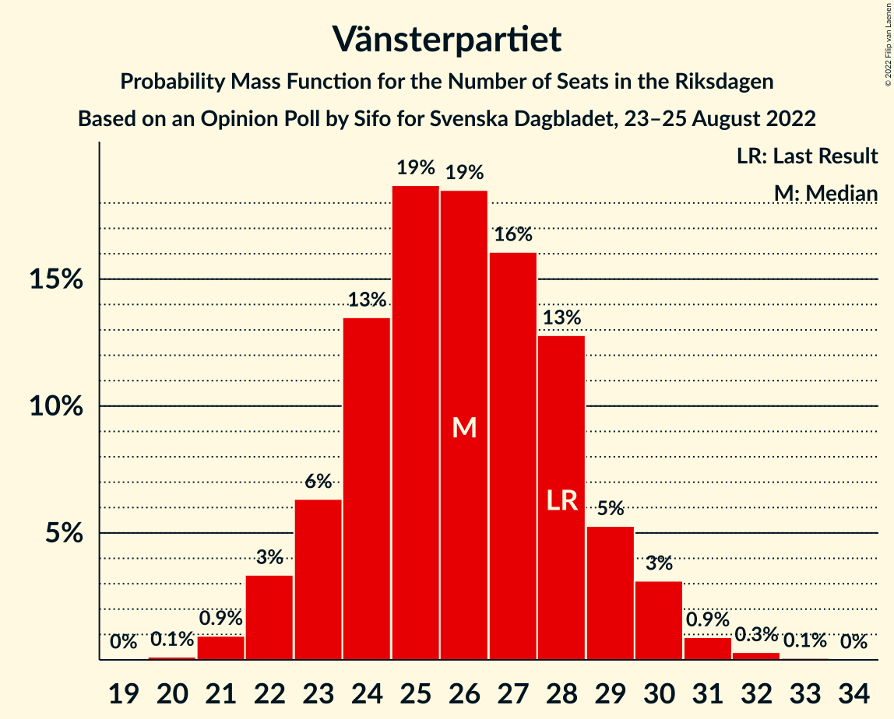

| Number of Seats | Probability | Accumulated | Special Marks |
|:---------------:|:-----------:|:-----------:|:-------------:|
| 20 | 0.1% | 100% |  |
| 21 | 0.9% | 99.9% |  |
| 22 | 3% | 98.9% |  |
| 23 | 6% | 96% |  |
| 24 | 13% | 89% |  |
| 25 | 19% | 76% |  |
| 26 | 19% | 57% | Median |
| 27 | 16% | 39% |  |
| 28 | 13% | 22% | Last Result |
| 29 | 5% | 10% |  |
| 30 | 3% | 4% |  |
| 31 | 0.9% | 1.3% |  |
| 32 | 0.3% | 0.4% |  |
| 33 | 0.1% | 0.1% |  |
| 34 | 0% | 0% |  |

### Centerpartiet

*For a full overview of the results for this party, see the [Centerpartiet](party-centerpartiet.html) page.*

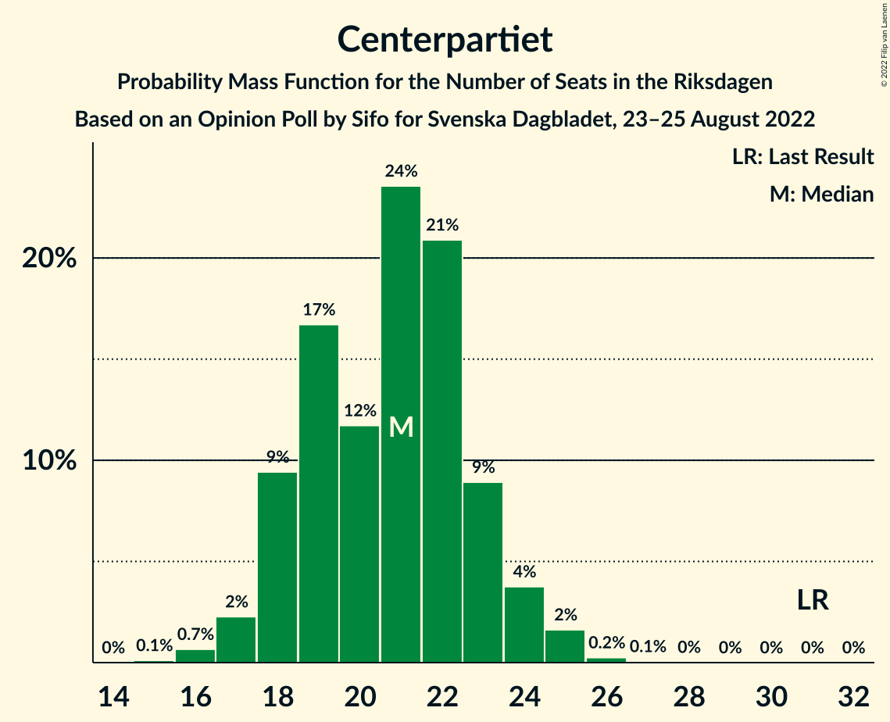

| Number of Seats | Probability | Accumulated | Special Marks |
|:---------------:|:-----------:|:-----------:|:-------------:|
| 15 | 0.1% | 100% |  |
| 16 | 0.7% | 99.9% |  |
| 17 | 2% | 99.2% |  |
| 18 | 9% | 97% |  |
| 19 | 17% | 88% |  |
| 20 | 12% | 71% |  |
| 21 | 24% | 59% | Median |
| 22 | 21% | 36% |  |
| 23 | 9% | 15% |  |
| 24 | 4% | 6% |  |
| 25 | 2% | 2% |  |
| 26 | 0.2% | 0.3% |  |
| 27 | 0.1% | 0.1% |  |
| 28 | 0% | 0% |  |
| 29 | 0% | 0% |  |
| 30 | 0% | 0% |  |
| 31 | 0% | 0% | Last Result |

### Kristdemokraterna

*For a full overview of the results for this party, see the [Kristdemokraterna](party-kristdemokraterna.html) page.*

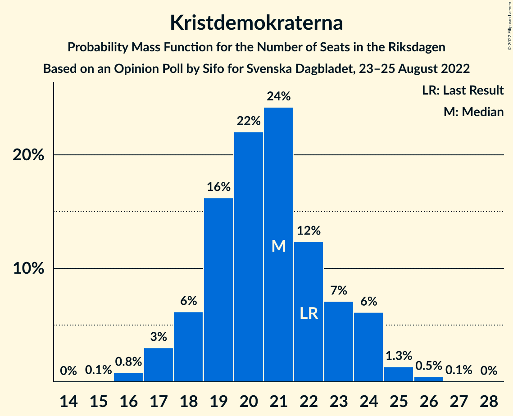

| Number of Seats | Probability | Accumulated | Special Marks |
|:---------------:|:-----------:|:-----------:|:-------------:|
| 15 | 0.1% | 100% |  |
| 16 | 0.8% | 99.9% |  |
| 17 | 3% | 99.1% |  |
| 18 | 6% | 96% |  |
| 19 | 16% | 90% |  |
| 20 | 22% | 74% |  |
| 21 | 24% | 52% | Median |
| 22 | 12% | 27% | Last Result |
| 23 | 7% | 15% |  |
| 24 | 6% | 8% |  |
| 25 | 1.3% | 2% |  |
| 26 | 0.5% | 0.6% |  |
| 27 | 0.1% | 0.1% |  |
| 28 | 0% | 0% |  |

### Miljöpartiet de gröna

*For a full overview of the results for this party, see the [Miljöpartiet de gröna](party-miljöpartietdegröna.html) page.*

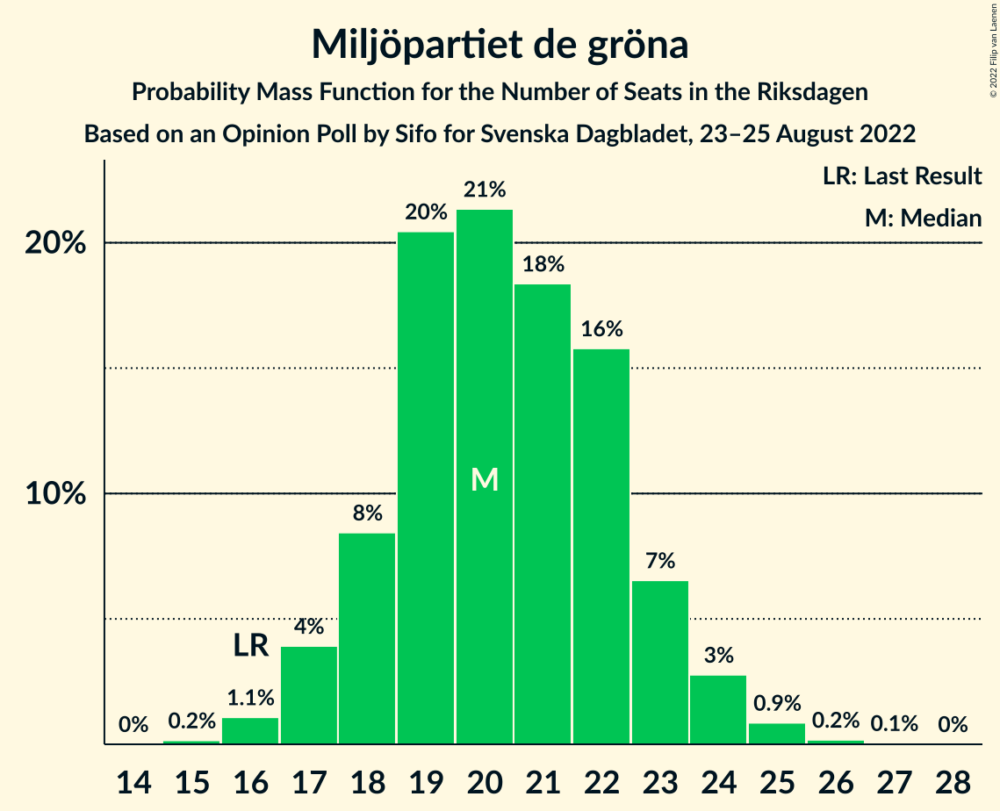

| Number of Seats | Probability | Accumulated | Special Marks |
|:---------------:|:-----------:|:-----------:|:-------------:|
| 15 | 0.2% | 100% |  |
| 16 | 1.1% | 99.8% | Last Result |
| 17 | 4% | 98.7% |  |
| 18 | 8% | 95% |  |
| 19 | 20% | 86% |  |
| 20 | 21% | 66% | Median |
| 21 | 18% | 45% |  |
| 22 | 16% | 26% |  |
| 23 | 7% | 10% |  |
| 24 | 3% | 4% |  |
| 25 | 0.9% | 1.1% |  |
| 26 | 0.2% | 0.2% |  |
| 27 | 0.1% | 0.1% |  |
| 28 | 0% | 0% |  |

### Liberalerna

*For a full overview of the results for this party, see the [Liberalerna](party-liberalerna.html) page.*

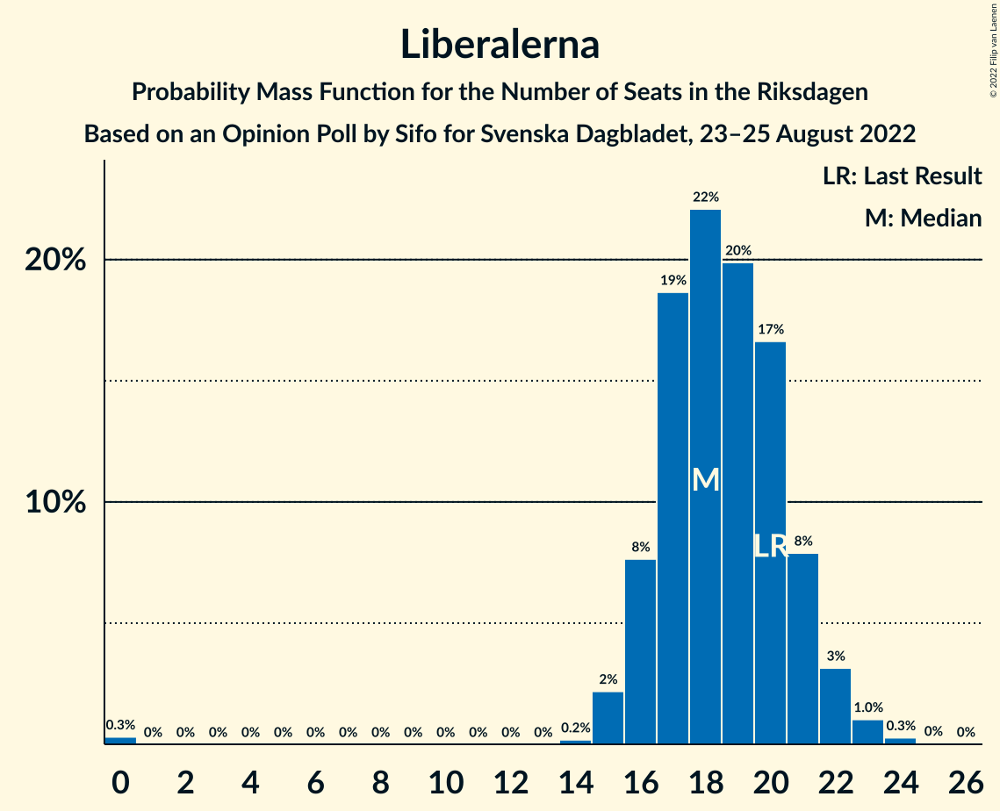

| Number of Seats | Probability | Accumulated | Special Marks |
|:---------------:|:-----------:|:-----------:|:-------------:|
| 0 | 0.3% | 100% |  |
| 1 | 0% | 99.7% |  |
| 2 | 0% | 99.7% |  |
| 3 | 0% | 99.7% |  |
| 4 | 0% | 99.7% |  |
| 5 | 0% | 99.7% |  |
| 6 | 0% | 99.7% |  |
| 7 | 0% | 99.7% |  |
| 8 | 0% | 99.7% |  |
| 9 | 0% | 99.7% |  |
| 10 | 0% | 99.7% |  |
| 11 | 0% | 99.7% |  |
| 12 | 0% | 99.7% |  |
| 13 | 0% | 99.7% |  |
| 14 | 0.2% | 99.7% |  |
| 15 | 2% | 99.5% |  |
| 16 | 8% | 97% |  |
| 17 | 19% | 90% |  |
| 18 | 22% | 71% | Median |
| 19 | 20% | 49% |  |
| 20 | 17% | 29% | Last Result |
| 21 | 8% | 12% |  |
| 22 | 3% | 5% |  |
| 23 | 1.0% | 1.4% |  |
| 24 | 0.3% | 0.3% |  |
| 25 | 0% | 0.1% |  |
| 26 | 0% | 0% |  |

## Coalitions

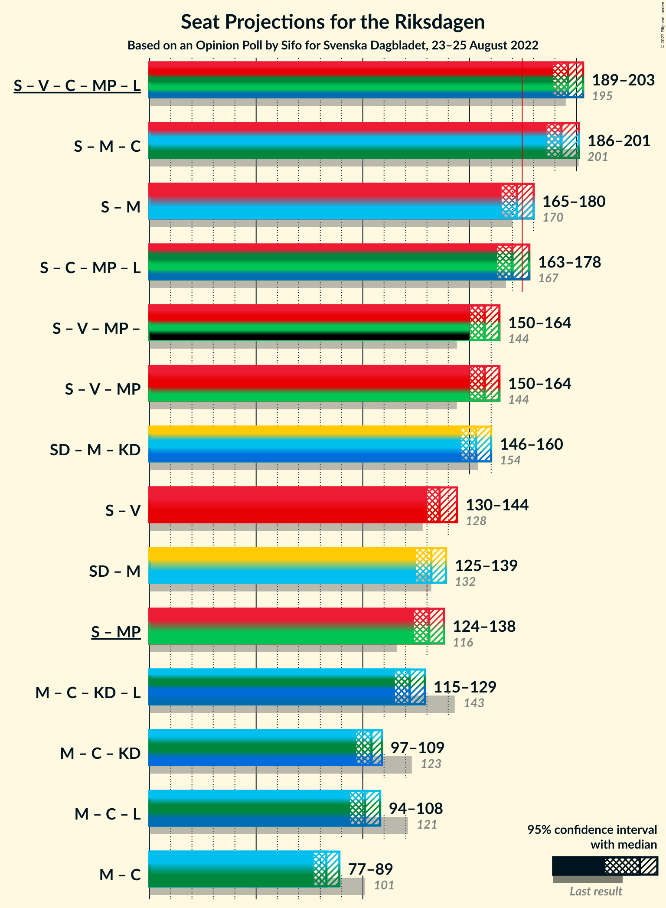

### Confidence Intervals

| Coalition | Last Result | Median | Majority? | 80% Confidence Interval | 90% Confidence Interval | 95% Confidence Interval | 99% Confidence Interval |
|:---------:|:-----------:|:------:|:---------:|:-----------------------:|:-----------------------:|:-----------------------:|:-----------------------:|
| Sveriges socialdemokratiska arbetareparti – Vänsterpartiet – Centerpartiet – Miljöpartiet de gröna – Liberalerna | 195 | 196 | 100% | 191–202 | 190–202 | 189–203 | 186–205 |
| Sveriges socialdemokratiska arbetareparti – Moderata samlingspartiet – Centerpartiet | 201 | 193 | 100% | 188–198 | 187–200 | 186–201 | 184–203 |
| Sveriges socialdemokratiska arbetareparti – Moderata samlingspartiet | 170 | 172 | 31% | 168–177 | 167–179 | 165–180 | 163–183 |
| Sveriges socialdemokratiska arbetareparti – Centerpartiet – Miljöpartiet de gröna – Liberalerna | 167 | 170 | 15% | 165–175 | 164–176 | 163–178 | 160–180 |
| Sveriges socialdemokratiska arbetareparti – Vänsterpartiet – Miljöpartiet de gröna | 144 | 157 | 0% | 152–163 | 150–163 | 150–164 | 147–167 |
| Sverigedemokraterna – Moderata samlingspartiet – Kristdemokraterna | 154 | 153 | 0% | 147–158 | 147–159 | 146–160 | 144–163 |
| Sveriges socialdemokratiska arbetareparti – Vänsterpartiet | 128 | 136 | 0% | 132–142 | 130–143 | 130–144 | 127–146 |
| Sverigedemokraterna – Moderata samlingspartiet | 132 | 132 | 0% | 127–138 | 126–139 | 125–139 | 123–142 |
| Sveriges socialdemokratiska arbetareparti – Miljöpartiet de gröna | 116 | 131 | 0% | 126–136 | 125–137 | 124–138 | 122–141 |
| Moderata samlingspartiet – Centerpartiet – Kristdemokraterna – Liberalerna | 143 | 122 | 0% | 117–127 | 116–128 | 115–129 | 112–131 |
| Moderata samlingspartiet – Centerpartiet – Kristdemokraterna | 123 | 104 | 0% | 99–108 | 98–109 | 97–109 | 96–113 |
| Moderata samlingspartiet – Centerpartiet – Liberalerna | 121 | 101 | 0% | 96–106 | 95–107 | 94–108 | 92–110 |
| Moderata samlingspartiet – Centerpartiet | 101 | 83 | 0% | 78–87 | 77–88 | 77–89 | 75–91 |

### Sveriges socialdemokratiska arbetareparti – Vänsterpartiet – Centerpartiet – Miljöpartiet de gröna – Liberalerna

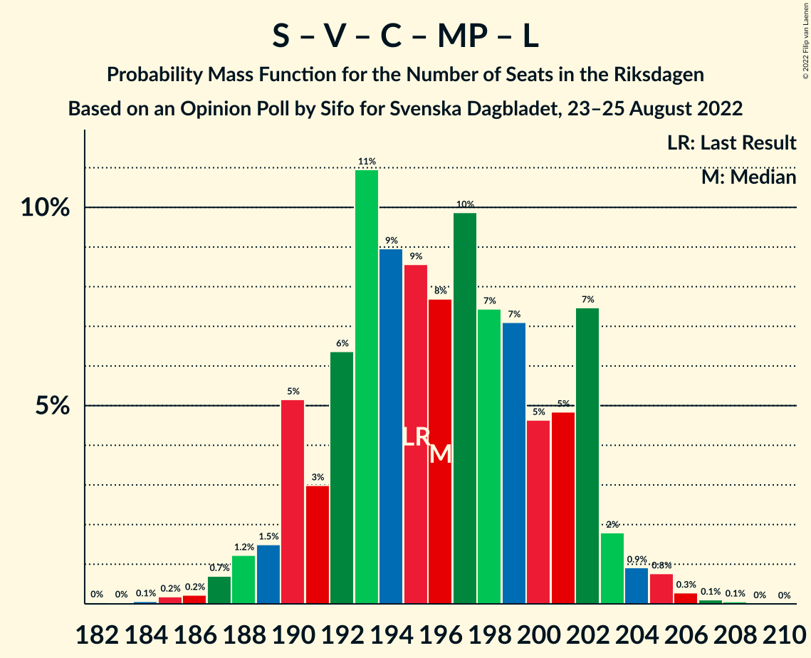

| Number of Seats | Probability | Accumulated | Special Marks |
|:---------------:|:-----------:|:-----------:|:-------------:|
| 182 | 0% | 100% |  |
| 183 | 0% | 99.9% |  |
| 184 | 0.1% | 99.9% |  |
| 185 | 0.2% | 99.8% |  |
| 186 | 0.2% | 99.7% |  |
| 187 | 0.7% | 99.4% |  |
| 188 | 1.2% | 98.7% |  |
| 189 | 1.5% | 98% |  |
| 190 | 5% | 96% |  |
| 191 | 3% | 91% |  |
| 192 | 6% | 88% |  |
| 193 | 11% | 81% |  |
| 194 | 9% | 71% |  |
| 195 | 9% | 62% | Last Result, Median |
| 196 | 8% | 53% |  |
| 197 | 10% | 45% |  |
| 198 | 7% | 35% |  |
| 199 | 7% | 28% |  |
| 200 | 5% | 21% |  |
| 201 | 5% | 16% |  |
| 202 | 7% | 11% |  |
| 203 | 2% | 4% |  |
| 204 | 0.9% | 2% |  |
| 205 | 0.8% | 1.2% |  |
| 206 | 0.3% | 0.5% |  |
| 207 | 0.1% | 0.2% |  |
| 208 | 0.1% | 0.1% |  |
| 209 | 0% | 0% |  |

### Sveriges socialdemokratiska arbetareparti – Moderata samlingspartiet – Centerpartiet

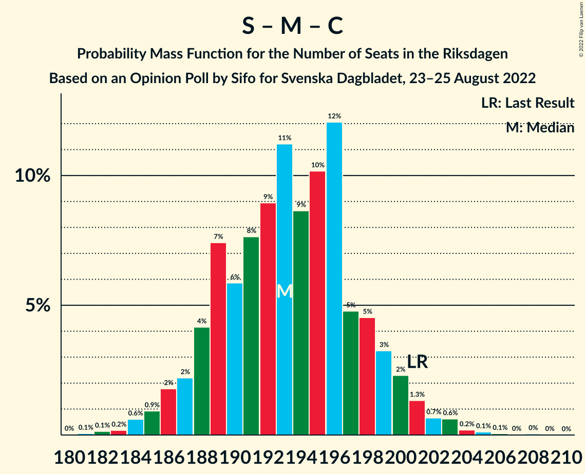

| Number of Seats | Probability | Accumulated | Special Marks |
|:---------------:|:-----------:|:-----------:|:-------------:|
| 181 | 0.1% | 100% |  |
| 182 | 0.1% | 99.9% |  |
| 183 | 0.2% | 99.8% |  |
| 184 | 0.6% | 99.6% |  |
| 185 | 0.9% | 99.0% |  |
| 186 | 2% | 98% |  |
| 187 | 2% | 96% |  |
| 188 | 4% | 94% |  |
| 189 | 7% | 90% |  |
| 190 | 6% | 82% |  |
| 191 | 8% | 77% |  |
| 192 | 9% | 69% |  |
| 193 | 11% | 60% | Median |
| 194 | 9% | 49% |  |
| 195 | 10% | 40% |  |
| 196 | 12% | 30% |  |
| 197 | 5% | 18% |  |
| 198 | 5% | 13% |  |
| 199 | 3% | 9% |  |
| 200 | 2% | 5% |  |
| 201 | 1.3% | 3% | Last Result |
| 202 | 0.7% | 2% |  |
| 203 | 0.6% | 1.1% |  |
| 204 | 0.2% | 0.5% |  |
| 205 | 0.1% | 0.3% |  |
| 206 | 0.1% | 0.2% |  |
| 207 | 0% | 0.1% |  |
| 208 | 0% | 0.1% |  |
| 209 | 0% | 0% |  |

### Sveriges socialdemokratiska arbetareparti – Moderata samlingspartiet

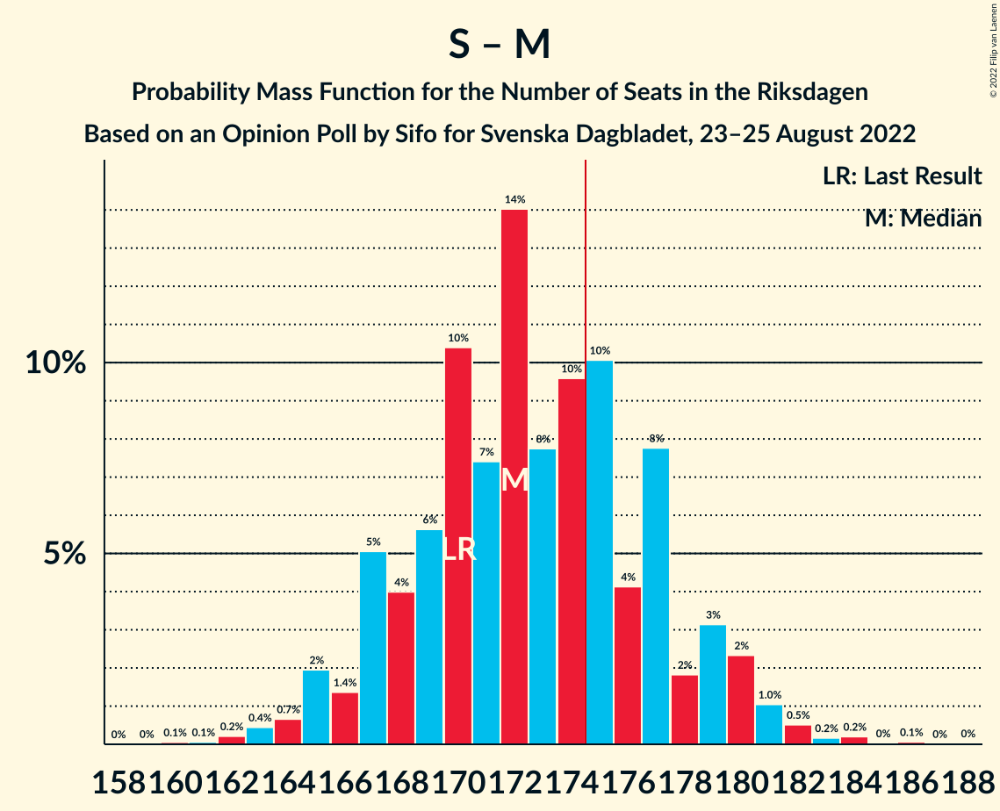

| Number of Seats | Probability | Accumulated | Special Marks |
|:---------------:|:-----------:|:-----------:|:-------------:|
| 160 | 0.1% | 100% |  |
| 161 | 0.1% | 99.9% |  |
| 162 | 0.2% | 99.9% |  |
| 163 | 0.4% | 99.6% |  |
| 164 | 0.7% | 99.2% |  |
| 165 | 2% | 98.5% |  |
| 166 | 1.4% | 97% |  |
| 167 | 5% | 95% |  |
| 168 | 4% | 90% |  |
| 169 | 6% | 86% |  |
| 170 | 10% | 81% | Last Result |
| 171 | 7% | 70% |  |
| 172 | 14% | 63% | Median |
| 173 | 8% | 49% |  |
| 174 | 10% | 41% |  |
| 175 | 10% | 31% | Majority |
| 176 | 4% | 21% |  |
| 177 | 8% | 17% |  |
| 178 | 2% | 9% |  |
| 179 | 3% | 8% |  |
| 180 | 2% | 4% |  |
| 181 | 1.0% | 2% |  |
| 182 | 0.5% | 1.0% |  |
| 183 | 0.2% | 0.5% |  |
| 184 | 0.2% | 0.4% |  |
| 185 | 0% | 0.2% |  |
| 186 | 0.1% | 0.1% |  |
| 187 | 0% | 0.1% |  |
| 188 | 0% | 0% |  |

### Sveriges socialdemokratiska arbetareparti – Centerpartiet – Miljöpartiet de gröna – Liberalerna

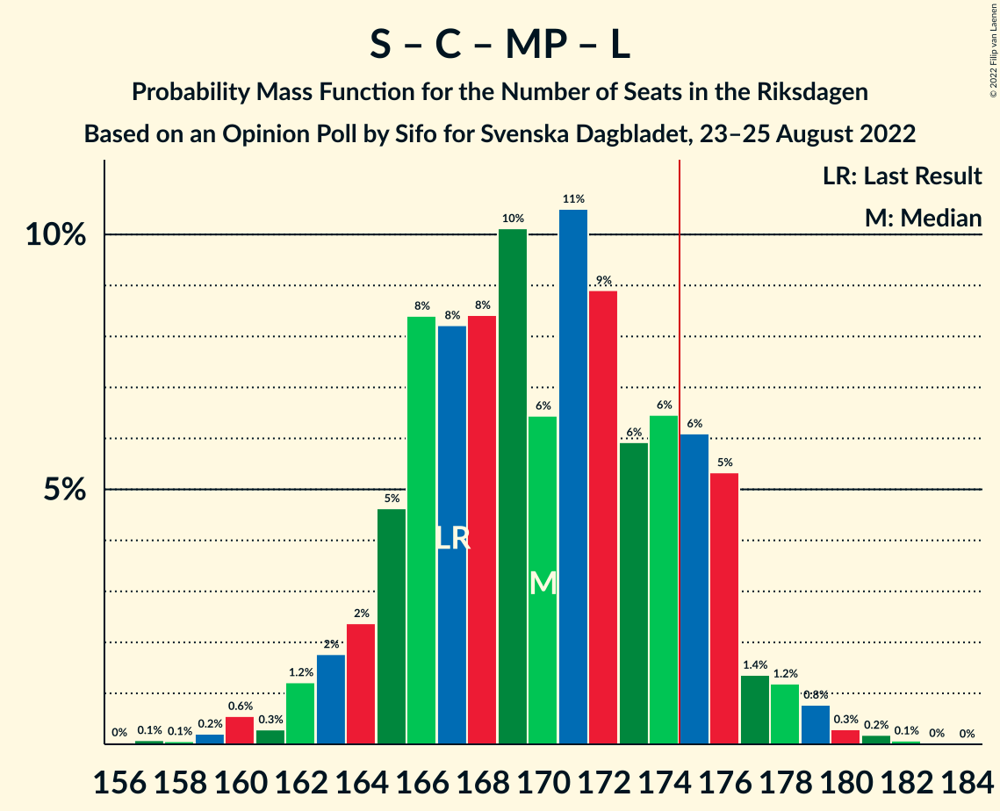

| Number of Seats | Probability | Accumulated | Special Marks |
|:---------------:|:-----------:|:-----------:|:-------------:|
| 156 | 0% | 100% |  |
| 157 | 0.1% | 99.9% |  |
| 158 | 0.1% | 99.8% |  |
| 159 | 0.2% | 99.8% |  |
| 160 | 0.6% | 99.6% |  |
| 161 | 0.3% | 99.0% |  |
| 162 | 1.2% | 98.7% |  |
| 163 | 2% | 98% |  |
| 164 | 2% | 96% |  |
| 165 | 5% | 93% |  |
| 166 | 8% | 89% |  |
| 167 | 8% | 80% | Last Result |
| 168 | 8% | 72% |  |
| 169 | 10% | 64% | Median |
| 170 | 6% | 54% |  |
| 171 | 11% | 47% |  |
| 172 | 9% | 37% |  |
| 173 | 6% | 28% |  |
| 174 | 6% | 22% |  |
| 175 | 6% | 15% | Majority |
| 176 | 5% | 9% |  |
| 177 | 1.4% | 4% |  |
| 178 | 1.2% | 3% |  |
| 179 | 0.8% | 1.4% |  |
| 180 | 0.3% | 0.6% |  |
| 181 | 0.2% | 0.3% |  |
| 182 | 0.1% | 0.1% |  |
| 183 | 0% | 0% |  |

### Sveriges socialdemokratiska arbetareparti – Vänsterpartiet – Miljöpartiet de gröna

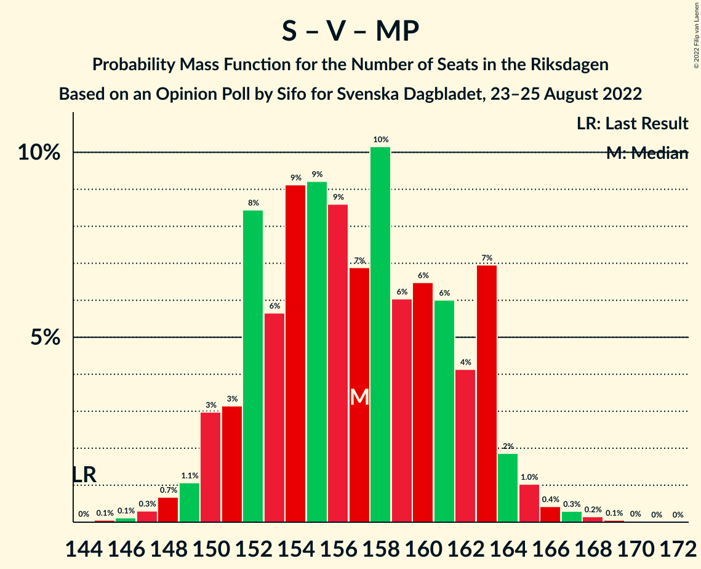

| Number of Seats | Probability | Accumulated | Special Marks |
|:---------------:|:-----------:|:-----------:|:-------------:|
| 144 | 0% | 100% | Last Result |
| 145 | 0.1% | 100% |  |
| 146 | 0.1% | 99.9% |  |
| 147 | 0.3% | 99.8% |  |
| 148 | 0.7% | 99.5% |  |
| 149 | 1.1% | 98.8% |  |
| 150 | 3% | 98% |  |
| 151 | 3% | 95% |  |
| 152 | 8% | 92% |  |
| 153 | 6% | 83% |  |
| 154 | 9% | 77% |  |
| 155 | 9% | 68% |  |
| 156 | 9% | 59% | Median |
| 157 | 7% | 51% |  |
| 158 | 10% | 44% |  |
| 159 | 6% | 34% |  |
| 160 | 6% | 27% |  |
| 161 | 6% | 21% |  |
| 162 | 4% | 15% |  |
| 163 | 7% | 11% |  |
| 164 | 2% | 4% |  |
| 165 | 1.0% | 2% |  |
| 166 | 0.4% | 1.0% |  |
| 167 | 0.3% | 0.6% |  |
| 168 | 0.2% | 0.3% |  |
| 169 | 0.1% | 0.1% |  |
| 170 | 0% | 0.1% |  |
| 171 | 0% | 0% |  |

### Sverigedemokraterna – Moderata samlingspartiet – Kristdemokraterna

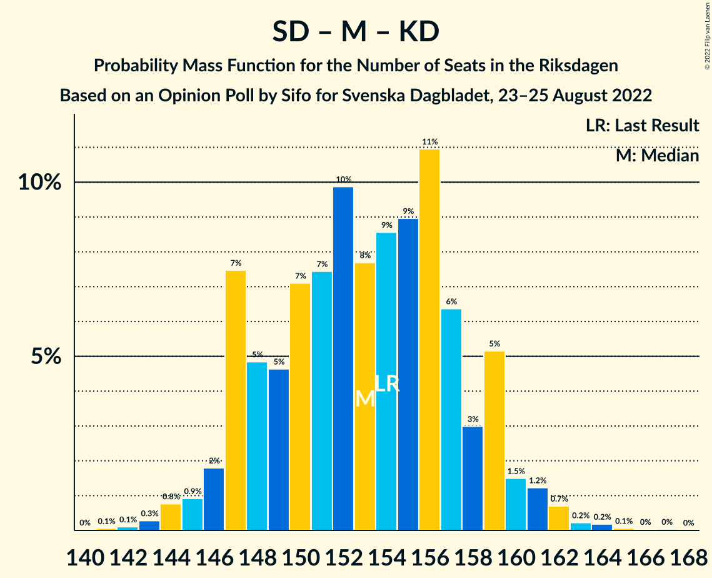

| Number of Seats | Probability | Accumulated | Special Marks |
|:---------------:|:-----------:|:-----------:|:-------------:|
| 141 | 0.1% | 100% |  |
| 142 | 0.1% | 99.9% |  |
| 143 | 0.3% | 99.8% |  |
| 144 | 0.8% | 99.5% |  |
| 145 | 0.9% | 98.8% |  |
| 146 | 2% | 98% |  |
| 147 | 7% | 96% |  |
| 148 | 5% | 89% |  |
| 149 | 5% | 84% |  |
| 150 | 7% | 79% |  |
| 151 | 7% | 72% |  |
| 152 | 10% | 65% |  |
| 153 | 8% | 55% | Median |
| 154 | 9% | 47% | Last Result |
| 155 | 9% | 38% |  |
| 156 | 11% | 29% |  |
| 157 | 6% | 19% |  |
| 158 | 3% | 12% |  |
| 159 | 5% | 9% |  |
| 160 | 1.5% | 4% |  |
| 161 | 1.2% | 2% |  |
| 162 | 0.7% | 1.3% |  |
| 163 | 0.2% | 0.6% |  |
| 164 | 0.2% | 0.3% |  |
| 165 | 0.1% | 0.2% |  |
| 166 | 0% | 0.1% |  |
| 167 | 0% | 0.1% |  |
| 168 | 0% | 0% |  |

### Sveriges socialdemokratiska arbetareparti – Vänsterpartiet

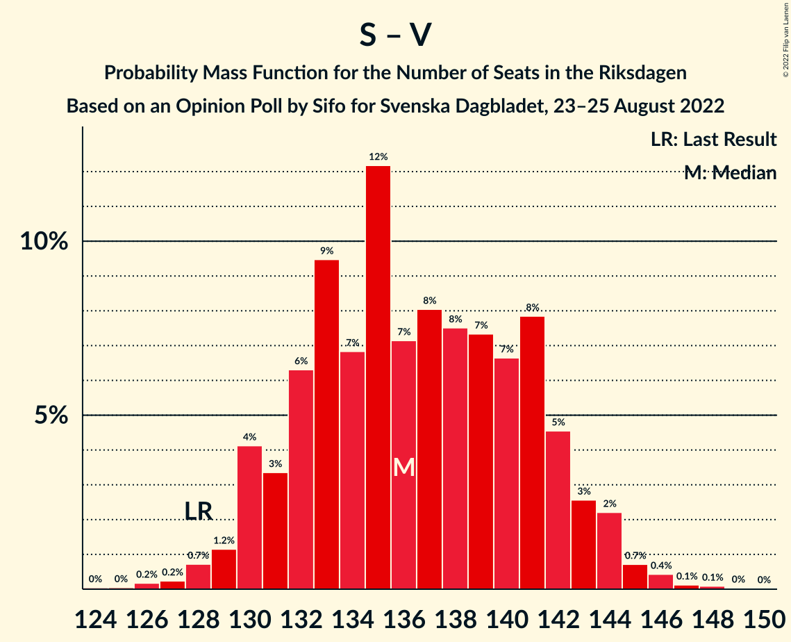

| Number of Seats | Probability | Accumulated | Special Marks |
|:---------------:|:-----------:|:-----------:|:-------------:|
| 124 | 0% | 100% |  |
| 125 | 0% | 99.9% |  |
| 126 | 0.2% | 99.9% |  |
| 127 | 0.2% | 99.7% |  |
| 128 | 0.7% | 99.5% | Last Result |
| 129 | 1.2% | 98.8% |  |
| 130 | 4% | 98% |  |
| 131 | 3% | 93% |  |
| 132 | 6% | 90% |  |
| 133 | 9% | 84% |  |
| 134 | 7% | 74% |  |
| 135 | 12% | 67% |  |
| 136 | 7% | 55% | Median |
| 137 | 8% | 48% |  |
| 138 | 8% | 40% |  |
| 139 | 7% | 33% |  |
| 140 | 7% | 25% |  |
| 141 | 8% | 19% |  |
| 142 | 5% | 11% |  |
| 143 | 3% | 6% |  |
| 144 | 2% | 4% |  |
| 145 | 0.7% | 1.5% |  |
| 146 | 0.4% | 0.7% |  |
| 147 | 0.1% | 0.3% |  |
| 148 | 0.1% | 0.2% |  |
| 149 | 0% | 0.1% |  |
| 150 | 0% | 0% |  |

### Sverigedemokraterna – Moderata samlingspartiet

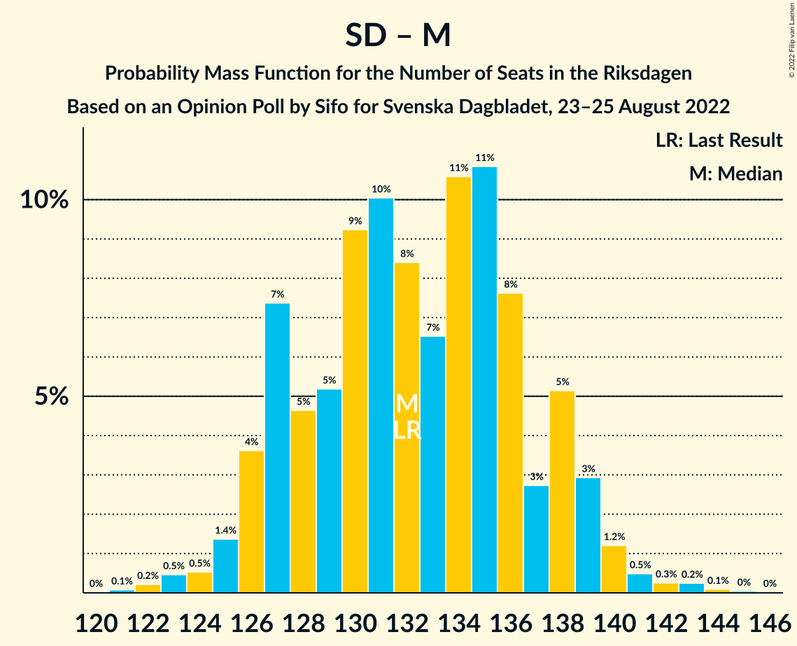

| Number of Seats | Probability | Accumulated | Special Marks |
|:---------------:|:-----------:|:-----------:|:-------------:|
| 121 | 0.1% | 100% |  |
| 122 | 0.2% | 99.9% |  |
| 123 | 0.5% | 99.7% |  |
| 124 | 0.5% | 99.2% |  |
| 125 | 1.4% | 98.7% |  |
| 126 | 4% | 97% |  |
| 127 | 7% | 94% |  |
| 128 | 5% | 86% |  |
| 129 | 5% | 82% |  |
| 130 | 9% | 76% |  |
| 131 | 10% | 67% |  |
| 132 | 8% | 57% | Last Result, Median |
| 133 | 7% | 49% |  |
| 134 | 11% | 42% |  |
| 135 | 11% | 32% |  |
| 136 | 8% | 21% |  |
| 137 | 3% | 13% |  |
| 138 | 5% | 10% |  |
| 139 | 3% | 5% |  |
| 140 | 1.2% | 2% |  |
| 141 | 0.5% | 1.2% |  |
| 142 | 0.3% | 0.7% |  |
| 143 | 0.2% | 0.4% |  |
| 144 | 0.1% | 0.2% |  |
| 145 | 0% | 0.1% |  |
| 146 | 0% | 0% |  |

### Sveriges socialdemokratiska arbetareparti – Miljöpartiet de gröna

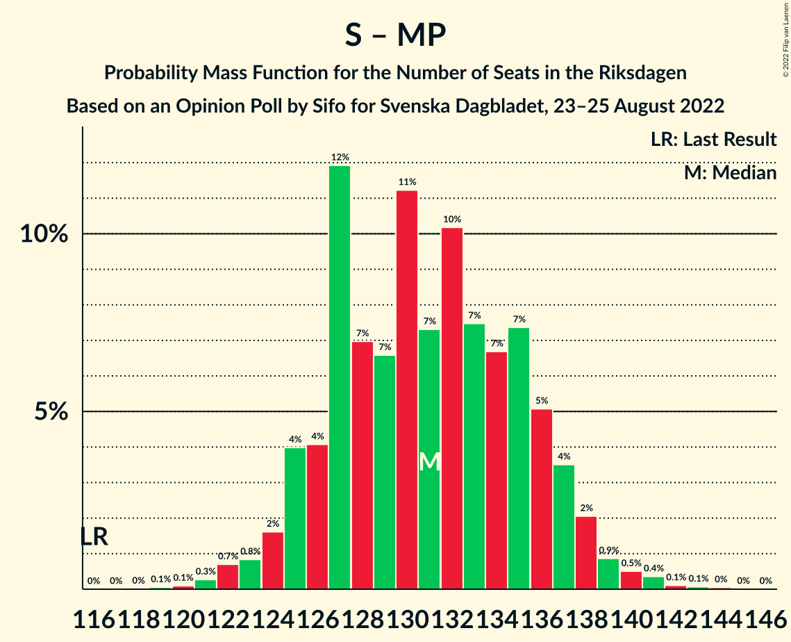

| Number of Seats | Probability | Accumulated | Special Marks |
|:---------------:|:-----------:|:-----------:|:-------------:|
| 116 | 0% | 100% | Last Result |
| 117 | 0% | 100% |  |
| 118 | 0% | 100% |  |
| 119 | 0.1% | 100% |  |
| 120 | 0.1% | 99.9% |  |
| 121 | 0.3% | 99.8% |  |
| 122 | 0.7% | 99.6% |  |
| 123 | 0.8% | 98.9% |  |
| 124 | 2% | 98% |  |
| 125 | 4% | 96% |  |
| 126 | 4% | 92% |  |
| 127 | 12% | 88% |  |
| 128 | 7% | 76% |  |
| 129 | 7% | 69% |  |
| 130 | 11% | 63% | Median |
| 131 | 7% | 52% |  |
| 132 | 10% | 44% |  |
| 133 | 7% | 34% |  |
| 134 | 7% | 27% |  |
| 135 | 7% | 20% |  |
| 136 | 5% | 13% |  |
| 137 | 4% | 8% |  |
| 138 | 2% | 4% |  |
| 139 | 0.9% | 2% |  |
| 140 | 0.5% | 1.1% |  |
| 141 | 0.4% | 0.6% |  |
| 142 | 0.1% | 0.2% |  |
| 143 | 0.1% | 0.1% |  |
| 144 | 0% | 0.1% |  |
| 145 | 0% | 0% |  |

### Moderata samlingspartiet – Centerpartiet – Kristdemokraterna – Liberalerna

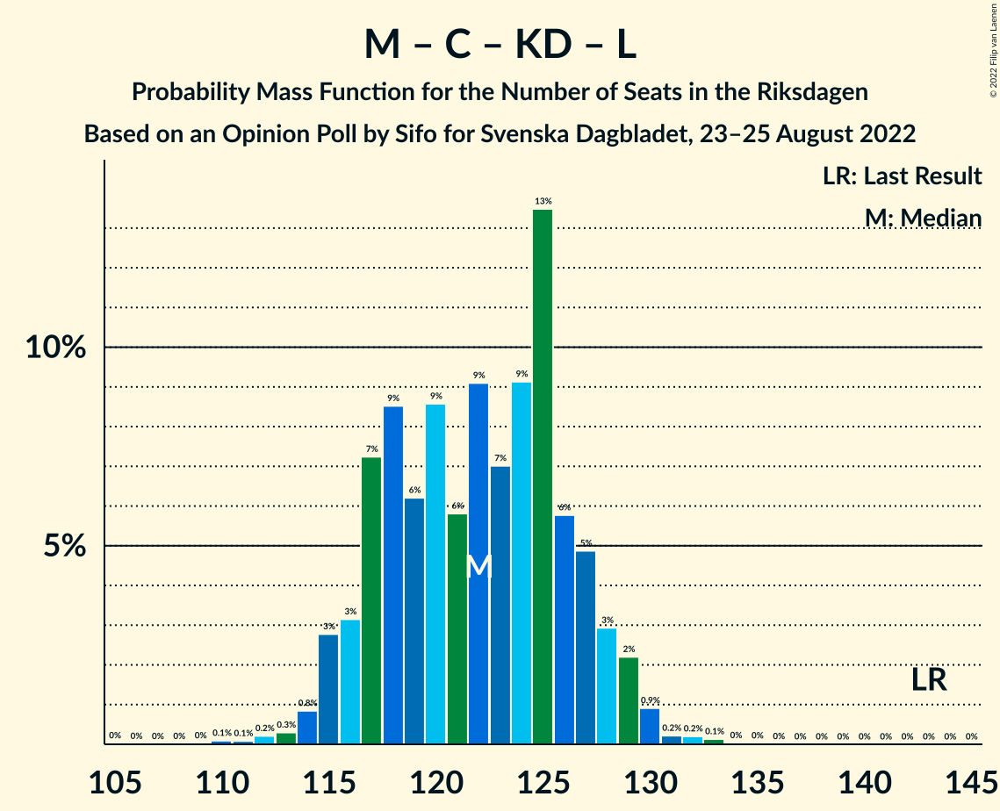

| Number of Seats | Probability | Accumulated | Special Marks |
|:---------------:|:-----------:|:-----------:|:-------------:|
| 105 | 0% | 100% |  |
| 106 | 0% | 99.9% |  |
| 107 | 0% | 99.9% |  |
| 108 | 0% | 99.9% |  |
| 109 | 0% | 99.9% |  |
| 110 | 0.1% | 99.9% |  |
| 111 | 0.1% | 99.8% |  |
| 112 | 0.2% | 99.7% |  |
| 113 | 0.3% | 99.5% |  |
| 114 | 0.8% | 99.2% |  |
| 115 | 3% | 98% |  |
| 116 | 3% | 96% |  |
| 117 | 7% | 92% |  |
| 118 | 9% | 85% |  |
| 119 | 6% | 77% |  |
| 120 | 9% | 70% |  |
| 121 | 6% | 62% |  |
| 122 | 9% | 56% | Median |
| 123 | 7% | 47% |  |
| 124 | 9% | 40% |  |
| 125 | 13% | 31% |  |
| 126 | 6% | 17% |  |
| 127 | 5% | 12% |  |
| 128 | 3% | 7% |  |
| 129 | 2% | 4% |  |
| 130 | 0.9% | 2% |  |
| 131 | 0.2% | 0.6% |  |
| 132 | 0.2% | 0.4% |  |
| 133 | 0.1% | 0.2% |  |
| 134 | 0% | 0.1% |  |
| 135 | 0% | 0% |  |
| 136 | 0% | 0% |  |
| 137 | 0% | 0% |  |
| 138 | 0% | 0% |  |
| 139 | 0% | 0% |  |
| 140 | 0% | 0% |  |
| 141 | 0% | 0% |  |
| 142 | 0% | 0% |  |
| 143 | 0% | 0% | Last Result |

### Moderata samlingspartiet – Centerpartiet – Kristdemokraterna

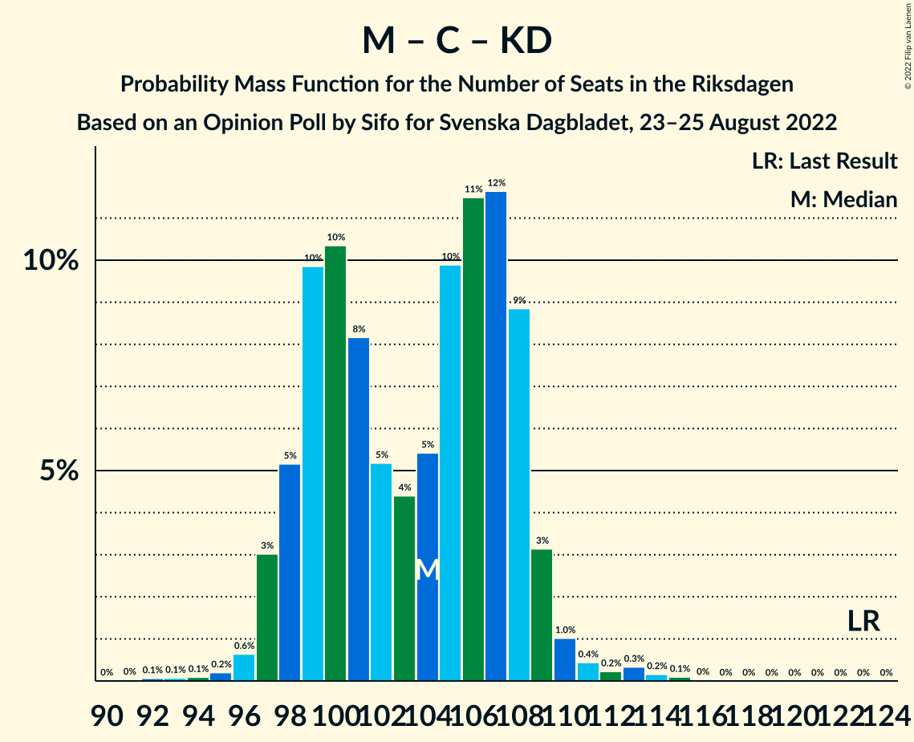

| Number of Seats | Probability | Accumulated | Special Marks |
|:---------------:|:-----------:|:-----------:|:-------------:|
| 92 | 0.1% | 100% |  |
| 93 | 0.1% | 99.9% |  |
| 94 | 0.1% | 99.8% |  |
| 95 | 0.2% | 99.7% |  |
| 96 | 0.6% | 99.5% |  |
| 97 | 3% | 98.9% |  |
| 98 | 5% | 96% |  |
| 99 | 10% | 91% |  |
| 100 | 10% | 81% |  |
| 101 | 8% | 71% |  |
| 102 | 5% | 62% |  |
| 103 | 4% | 57% |  |
| 104 | 5% | 53% | Median |
| 105 | 10% | 47% |  |
| 106 | 11% | 37% |  |
| 107 | 12% | 26% |  |
| 108 | 9% | 14% |  |
| 109 | 3% | 5% |  |
| 110 | 1.0% | 2% |  |
| 111 | 0.4% | 1.3% |  |
| 112 | 0.2% | 0.9% |  |
| 113 | 0.3% | 0.6% |  |
| 114 | 0.2% | 0.3% |  |
| 115 | 0.1% | 0.1% |  |
| 116 | 0% | 0% |  |
| 117 | 0% | 0% |  |
| 118 | 0% | 0% |  |
| 119 | 0% | 0% |  |
| 120 | 0% | 0% |  |
| 121 | 0% | 0% |  |
| 122 | 0% | 0% |  |
| 123 | 0% | 0% | Last Result |

### Moderata samlingspartiet – Centerpartiet – Liberalerna

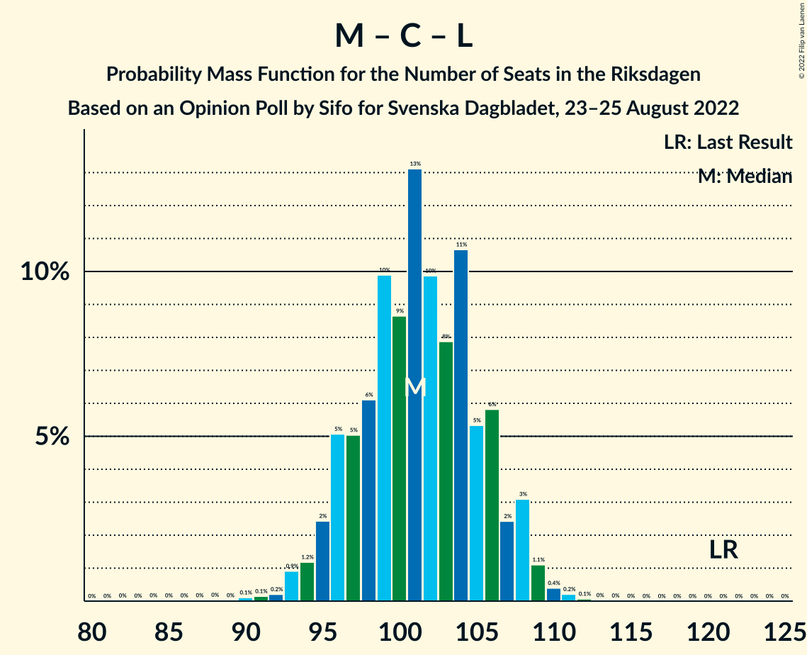

| Number of Seats | Probability | Accumulated | Special Marks |
|:---------------:|:-----------:|:-----------:|:-------------:|
| 84 | 0% | 100% |  |
| 85 | 0% | 99.9% |  |
| 86 | 0% | 99.9% |  |
| 87 | 0% | 99.9% |  |
| 88 | 0% | 99.9% |  |
| 89 | 0% | 99.8% |  |
| 90 | 0.1% | 99.8% |  |
| 91 | 0.1% | 99.7% |  |
| 92 | 0.2% | 99.6% |  |
| 93 | 0.9% | 99.3% |  |
| 94 | 1.2% | 98% |  |
| 95 | 2% | 97% |  |
| 96 | 5% | 95% |  |
| 97 | 5% | 90% |  |
| 98 | 6% | 85% |  |
| 99 | 10% | 79% |  |
| 100 | 9% | 69% |  |
| 101 | 13% | 60% | Median |
| 102 | 10% | 47% |  |
| 103 | 8% | 37% |  |
| 104 | 11% | 29% |  |
| 105 | 5% | 19% |  |
| 106 | 6% | 13% |  |
| 107 | 2% | 7% |  |
| 108 | 3% | 5% |  |
| 109 | 1.1% | 2% |  |
| 110 | 0.4% | 0.7% |  |
| 111 | 0.2% | 0.3% |  |
| 112 | 0.1% | 0.1% |  |
| 113 | 0% | 0.1% |  |
| 114 | 0% | 0% |  |
| 115 | 0% | 0% |  |
| 116 | 0% | 0% |  |
| 117 | 0% | 0% |  |
| 118 | 0% | 0% |  |
| 119 | 0% | 0% |  |
| 120 | 0% | 0% |  |
| 121 | 0% | 0% | Last Result |

### Moderata samlingspartiet – Centerpartiet

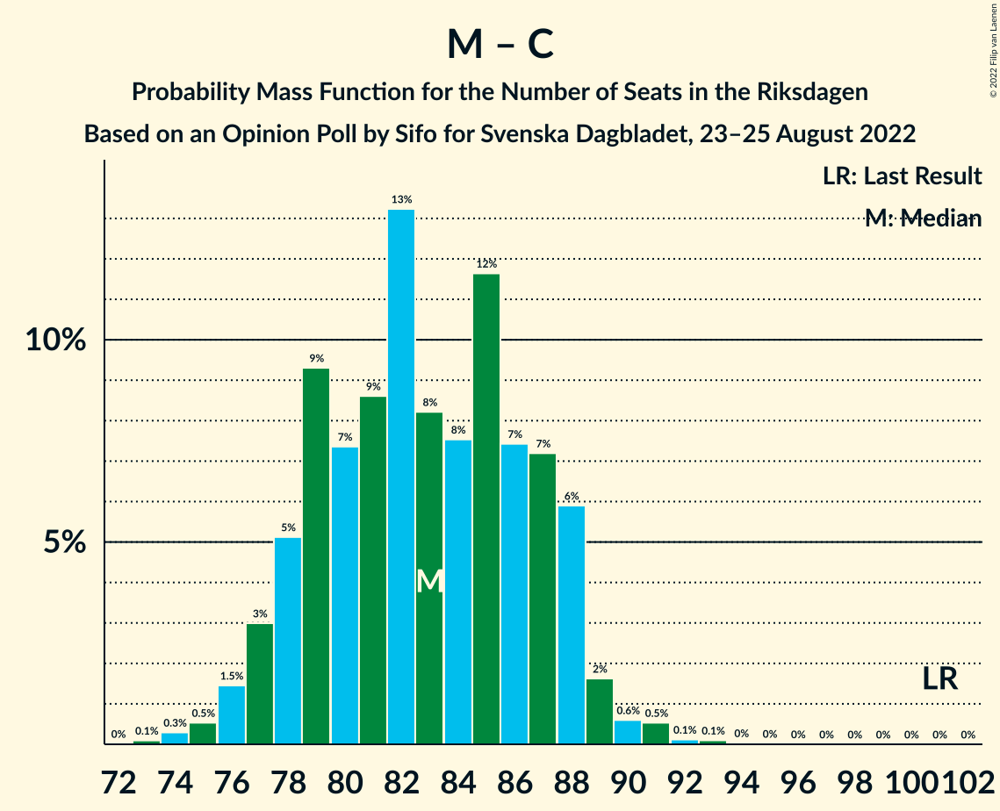

| Number of Seats | Probability | Accumulated | Special Marks |
|:---------------:|:-----------:|:-----------:|:-------------:|
| 73 | 0.1% | 100% |  |
| 74 | 0.3% | 99.9% |  |
| 75 | 0.5% | 99.6% |  |
| 76 | 1.5% | 99.0% |  |
| 77 | 3% | 98% |  |
| 78 | 5% | 95% |  |
| 79 | 9% | 89% |  |
| 80 | 7% | 80% |  |
| 81 | 9% | 73% |  |
| 82 | 13% | 64% |  |
| 83 | 8% | 51% | Median |
| 84 | 8% | 43% |  |
| 85 | 12% | 35% |  |
| 86 | 7% | 24% |  |
| 87 | 7% | 16% |  |
| 88 | 6% | 9% |  |
| 89 | 2% | 3% |  |
| 90 | 0.6% | 1.4% |  |
| 91 | 0.5% | 0.8% |  |
| 92 | 0.1% | 0.3% |  |
| 93 | 0.1% | 0.2% |  |
| 94 | 0% | 0.1% |  |
| 95 | 0% | 0% |  |
| 96 | 0% | 0% |  |
| 97 | 0% | 0% |  |
| 98 | 0% | 0% |  |
| 99 | 0% | 0% |  |
| 100 | 0% | 0% |  |
| 101 | 0% | 0% | Last Result |

## Technical Information

### Opinion Poll

+ **Polling firm:** Sifo
+ **Commissioner(s):** Svenska Dagbladet
+ **Fieldwork period:** 23–25 August 2022

### Calculations

+ **Sample size:** 2197
+ **Simulations done:** 1,048,576
+ **Error estimate:** 1.86%

