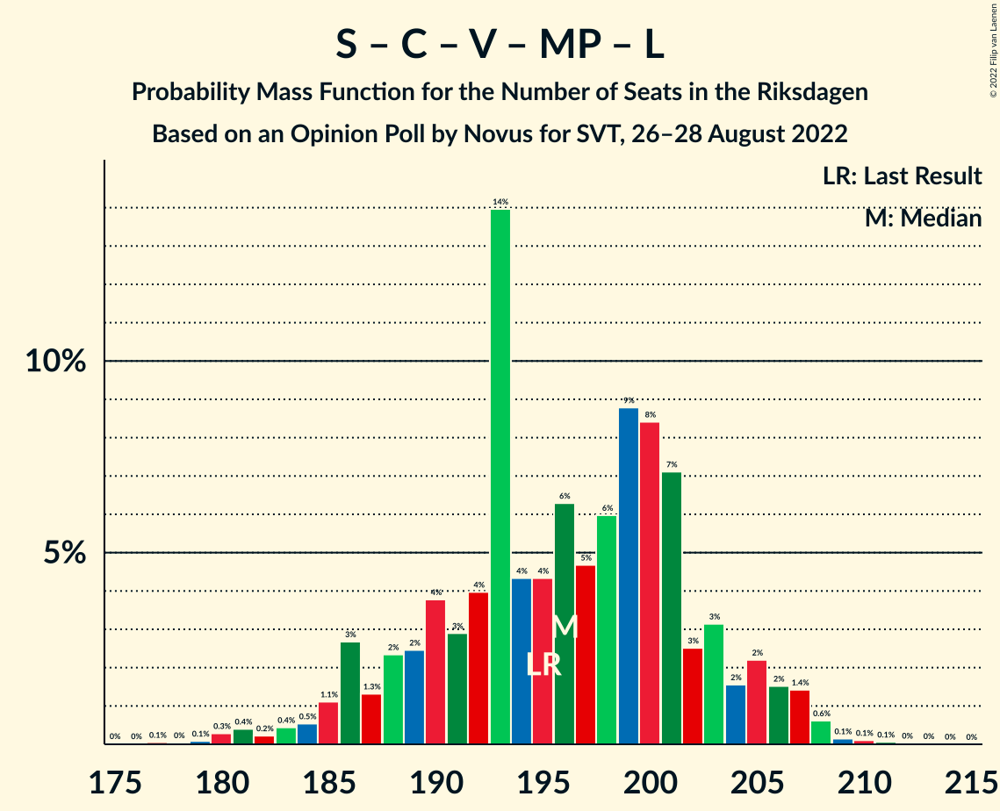

# Opinion Poll by Novus for SVT, 26–28 August 2022

<a href="#voting-intentions">Voting Intentions</a> | <a href="#seats">Seats</a> | <a href="#coalitions">Coalitions</a> | <a href="#technical-information">Technical Information</a>

## Voting Intentions

### Confidence Intervals

| Party | Last Result | Poll Result | 80% Confidence Interval | 90% Confidence Interval | 95% Confidence Interval | 99% Confidence Interval |
|:-----:|:-----------:|:-----------:|:-----------------------:|:-----------------------:|:-----------------------:|:-----------------------:|
| Sveriges socialdemokratiska arbetareparti | 28.3% | 30.3% | 28.8–31.8% |28.3–32.3% |28.0–32.6% |27.3–33.4% |
| Sverigedemokraterna | 17.5% | 20.6% | 19.3–22.0% |18.9–22.4% |18.6–22.7% |18.0–23.4% |
| Moderata samlingspartiet | 19.8% | 15.8% | 14.6–17.1% |14.3–17.4% |14.0–17.7% |13.5–18.4% |
| Centerpartiet | 8.6% | 8.0% | 7.2–9.0% |6.9–9.3% |6.7–9.5% |6.3–10.0% |
| Vänsterpartiet | 8.0% | 7.9% | 7.0–8.8% |6.8–9.1% |6.6–9.3% |6.2–9.8% |
| Kristdemokraterna | 6.3% | 6.4% | 5.7–7.3% |5.4–7.5% |5.3–7.8% |4.9–8.2% |
| Miljöpartiet de gröna | 4.4% | 5.0% | 4.3–5.8% |4.2–6.0% |4.0–6.2% |3.7–6.6% |
| Liberalerna | 5.5% | 4.5% | 3.8–5.2% |3.7–5.5% |3.5–5.6% |3.2–6.0% |

*Note:* The poll result column reflects the actual value used in the calculations. Published results may vary slightly, and in addition be rounded to fewer digits.

## Seats

### Confidence Intervals

| Party | Last Result | Median | 80% Confidence Interval | 90% Confidence Interval | 95% Confidence Interval | 99% Confidence Interval |
|:-----:|:-----------:|:------:|:-----------------------:|:-----------------------:|:-----------------------:|:-----------------------:|
| <a href="#sveriges-socialdemokratiska-arbetareparti">Sveriges socialdemokratiska arbetareparti</a> | 100 | 107 | 102–114 |100–116 |99–118 |96–121 |
| <a href="#sverigedemokraterna">Sverigedemokraterna</a> | 62 | 74 | 68–79 |68–80 |66–82 |64–84 |
| <a href="#moderata-samlingspartiet">Moderata samlingspartiet</a> | 70 | 56 | 52–61 |51–62 |50–64 |48–66 |
| <a href="#centerpartiet">Centerpartiet</a> | 31 | 28 | 25–32 |25–33 |24–34 |23–36 |
| <a href="#vänsterpartiet">Vänsterpartiet</a> | 28 | 28 | 25–32 |24–33 |23–33 |22–35 |
| <a href="#kristdemokraterna">Kristdemokraterna</a> | 22 | 23 | 20–26 |19–27 |19–28 |18–29 |
| <a href="#miljöpartiet-de-gröna">Miljöpartiet de gröna</a> | 16 | 18 | 15–21 |15–21 |0–22 |0–24 |
| <a href="#liberalerna">Liberalerna</a> | 20 | 16 | 0–19 |0–19 |0–20 |0–21 |

### Sveriges socialdemokratiska arbetareparti

*For a full overview of the results for this party, see the [Sveriges socialdemokratiska arbetareparti](party-sverigessocialdemokratiskaarbetareparti.html) page.*

| Number of Seats | Probability | Accumulated | Special Marks |
|:---------------:|:-----------:|:-----------:|:-------------:|
| 94 | 0.1% | 100% |  |
| 95 | 0.1% | 99.9% |  |
| 96 | 0.3% | 99.8% |  |
| 97 | 0.5% | 99.5% |  |
| 98 | 0.8% | 99.0% |  |
| 99 | 1.2% | 98% |  |
| 100 | 2% | 97% | Last Result |
| 101 | 2% | 95% |  |
| 102 | 4% | 93% |  |
| 103 | 6% | 89% |  |
| 104 | 7% | 83% |  |
| 105 | 7% | 76% |  |
| 106 | 11% | 69% |  |
| 107 | 9% | 58% | Median |
| 108 | 12% | 49% |  |
| 109 | 6% | 36% |  |
| 110 | 6% | 30% |  |
| 111 | 6% | 25% |  |
| 112 | 4% | 19% |  |
| 113 | 3% | 15% |  |
| 114 | 3% | 11% |  |
| 115 | 2% | 8% |  |
| 116 | 2% | 6% |  |
| 117 | 1.5% | 4% |  |
| 118 | 1.4% | 3% |  |
| 119 | 0.3% | 1.3% |  |
| 120 | 0.4% | 1.0% |  |
| 121 | 0.2% | 0.6% |  |
| 122 | 0.1% | 0.4% |  |
| 123 | 0.1% | 0.3% |  |
| 124 | 0.1% | 0.2% |  |
| 125 | 0% | 0.1% |  |
| 126 | 0% | 0% |  |

### Sverigedemokraterna

*For a full overview of the results for this party, see the [Sverigedemokraterna](party-sverigedemokraterna.html) page.*

| Number of Seats | Probability | Accumulated | Special Marks |
|:---------------:|:-----------:|:-----------:|:-------------:|
| 62 | 0.1% | 100% | Last Result |
| 63 | 0.3% | 99.9% |  |
| 64 | 0.8% | 99.6% |  |
| 65 | 0.9% | 98.8% |  |
| 66 | 0.9% | 98% |  |
| 67 | 2% | 97% |  |
| 68 | 5% | 95% |  |
| 69 | 7% | 90% |  |
| 70 | 7% | 83% |  |
| 71 | 5% | 77% |  |
| 72 | 10% | 72% |  |
| 73 | 9% | 62% |  |
| 74 | 13% | 53% | Median |
| 75 | 9% | 40% |  |
| 76 | 7% | 31% |  |
| 77 | 9% | 24% |  |
| 78 | 4% | 15% |  |
| 79 | 4% | 10% |  |
| 80 | 3% | 7% |  |
| 81 | 1.2% | 4% |  |
| 82 | 1.3% | 3% |  |
| 83 | 0.7% | 1.5% |  |
| 84 | 0.4% | 0.8% |  |
| 85 | 0.1% | 0.4% |  |
| 86 | 0.1% | 0.3% |  |
| 87 | 0.1% | 0.2% |  |
| 88 | 0% | 0.1% |  |
| 89 | 0% | 0% |  |

### Moderata samlingspartiet

*For a full overview of the results for this party, see the [Moderata samlingspartiet](party-moderatasamlingspartiet.html) page.*

| Number of Seats | Probability | Accumulated | Special Marks |
|:---------------:|:-----------:|:-----------:|:-------------:|
| 46 | 0.1% | 100% |  |
| 47 | 0.3% | 99.9% |  |
| 48 | 0.5% | 99.6% |  |
| 49 | 1.2% | 99.1% |  |
| 50 | 3% | 98% |  |
| 51 | 3% | 95% |  |
| 52 | 6% | 93% |  |
| 53 | 8% | 87% |  |
| 54 | 7% | 79% |  |
| 55 | 11% | 72% |  |
| 56 | 12% | 61% | Median |
| 57 | 13% | 49% |  |
| 58 | 10% | 36% |  |
| 59 | 7% | 26% |  |
| 60 | 6% | 19% |  |
| 61 | 5% | 13% |  |
| 62 | 4% | 8% |  |
| 63 | 2% | 4% |  |
| 64 | 1.3% | 3% |  |
| 65 | 0.6% | 1.4% |  |
| 66 | 0.5% | 0.9% |  |
| 67 | 0.1% | 0.3% |  |
| 68 | 0.1% | 0.2% |  |
| 69 | 0.1% | 0.1% |  |
| 70 | 0% | 0% | Last Result |

### Centerpartiet

*For a full overview of the results for this party, see the [Centerpartiet](party-centerpartiet.html) page.*

| Number of Seats | Probability | Accumulated | Special Marks |
|:---------------:|:-----------:|:-----------:|:-------------:|
| 21 | 0.1% | 100% |  |
| 22 | 0.4% | 99.9% |  |
| 23 | 1.4% | 99.5% |  |
| 24 | 3% | 98% |  |
| 25 | 6% | 95% |  |
| 26 | 11% | 90% |  |
| 27 | 15% | 78% |  |
| 28 | 16% | 64% | Median |
| 29 | 10% | 48% |  |
| 30 | 12% | 38% |  |
| 31 | 10% | 26% | Last Result |
| 32 | 10% | 16% |  |
| 33 | 3% | 6% |  |
| 34 | 2% | 3% |  |
| 35 | 1.0% | 2% |  |
| 36 | 0.4% | 0.6% |  |
| 37 | 0.2% | 0.2% |  |
| 38 | 0% | 0.1% |  |
| 39 | 0% | 0% |  |

### Vänsterpartiet

*For a full overview of the results for this party, see the [Vänsterpartiet](party-vänsterpartiet.html) page.*

| Number of Seats | Probability | Accumulated | Special Marks |
|:---------------:|:-----------:|:-----------:|:-------------:|
| 21 | 0.2% | 100% |  |
| 22 | 0.6% | 99.8% |  |
| 23 | 2% | 99.1% |  |
| 24 | 5% | 97% |  |
| 25 | 7% | 92% |  |
| 26 | 12% | 85% |  |
| 27 | 13% | 73% |  |
| 28 | 14% | 59% | Last Result, Median |
| 29 | 16% | 45% |  |
| 30 | 9% | 30% |  |
| 31 | 9% | 21% |  |
| 32 | 6% | 12% |  |
| 33 | 3% | 6% |  |
| 34 | 1.2% | 2% |  |
| 35 | 0.6% | 1.0% |  |
| 36 | 0.2% | 0.4% |  |
| 37 | 0.1% | 0.2% |  |
| 38 | 0% | 0.1% |  |
| 39 | 0% | 0% |  |

### Kristdemokraterna

*For a full overview of the results for this party, see the [Kristdemokraterna](party-kristdemokraterna.html) page.*

| Number of Seats | Probability | Accumulated | Special Marks |
|:---------------:|:-----------:|:-----------:|:-------------:|
| 16 | 0.1% | 100% |  |
| 17 | 0.3% | 99.9% |  |
| 18 | 1.4% | 99.6% |  |
| 19 | 5% | 98% |  |
| 20 | 9% | 93% |  |
| 21 | 15% | 84% |  |
| 22 | 15% | 69% | Last Result |
| 23 | 15% | 54% | Median |
| 24 | 9% | 39% |  |
| 25 | 14% | 30% |  |
| 26 | 7% | 16% |  |
| 27 | 6% | 8% |  |
| 28 | 2% | 3% |  |
| 29 | 0.8% | 1.1% |  |
| 30 | 0.2% | 0.3% |  |
| 31 | 0.1% | 0.1% |  |
| 32 | 0% | 0% |  |

### Miljöpartiet de gröna

*For a full overview of the results for this party, see the [Miljöpartiet de gröna](party-miljöpartietdegröna.html) page.*

| Number of Seats | Probability | Accumulated | Special Marks |
|:---------------:|:-----------:|:-----------:|:-------------:|
| 0 | 3% | 100% |  |
| 1 | 0% | 97% |  |
| 2 | 0% | 97% |  |
| 3 | 0% | 97% |  |
| 4 | 0% | 97% |  |
| 5 | 0% | 97% |  |
| 6 | 0% | 97% |  |
| 7 | 0% | 97% |  |
| 8 | 0% | 97% |  |
| 9 | 0% | 97% |  |
| 10 | 0% | 97% |  |
| 11 | 0% | 97% |  |
| 12 | 0% | 97% |  |
| 13 | 0% | 97% |  |
| 14 | 0.6% | 97% |  |
| 15 | 8% | 97% |  |
| 16 | 13% | 88% | Last Result |
| 17 | 18% | 76% |  |
| 18 | 21% | 58% | Median |
| 19 | 14% | 37% |  |
| 20 | 12% | 23% |  |
| 21 | 6% | 11% |  |
| 22 | 3% | 5% |  |
| 23 | 1.2% | 2% |  |
| 24 | 0.4% | 0.6% |  |
| 25 | 0.1% | 0.2% |  |
| 26 | 0% | 0% |  |

### Liberalerna

*For a full overview of the results for this party, see the [Liberalerna](party-liberalerna.html) page.*

| Number of Seats | Probability | Accumulated | Special Marks |
|:---------------:|:-----------:|:-----------:|:-------------:|
| 0 | 16% | 100% |  |
| 1 | 0% | 84% |  |
| 2 | 0% | 84% |  |
| 3 | 0% | 84% |  |
| 4 | 0% | 84% |  |
| 5 | 0% | 84% |  |
| 6 | 0% | 84% |  |
| 7 | 0% | 84% |  |
| 8 | 0% | 84% |  |
| 9 | 0% | 84% |  |
| 10 | 0% | 84% |  |
| 11 | 0% | 84% |  |
| 12 | 0% | 84% |  |
| 13 | 0% | 84% |  |
| 14 | 3% | 84% |  |
| 15 | 23% | 80% |  |
| 16 | 16% | 57% | Median |
| 17 | 18% | 41% |  |
| 18 | 12% | 23% |  |
| 19 | 7% | 11% |  |
| 20 | 2% | 3% | Last Result |
| 21 | 0.8% | 1.2% |  |
| 22 | 0.3% | 0.4% |  |
| 23 | 0.1% | 0.1% |  |
| 24 | 0% | 0% |  |

## Coalitions

### Confidence Intervals

| Coalition | Last Result | Median | Majority? | 80% Confidence Interval | 90% Confidence Interval | 95% Confidence Interval | 99% Confidence Interval |
|:---------:|:-----------:|:------:|:---------:|:-----------------------:|:-----------------------:|:-----------------------:|:-----------------------:|
| Sveriges socialdemokratiska arbetareparti – Centerpartiet – Vänsterpartiet – Miljöpartiet de gröna – Liberalerna | 195 | 196 | 100% | 189–203 | 186–205 | 185–206 | 180–208 |
| Sveriges socialdemokratiska arbetareparti – Moderata samlingspartiet – Centerpartiet | 201 | 191 | 100% | 186–200 | 183–203 | 182–206 | 180–210 |
| Sveriges socialdemokratiska arbetareparti – Centerpartiet – Miljöpartiet de gröna – Liberalerna | 167 | 168 | 10% | 160–175 | 157–177 | 156–178 | 151–180 |
| Sveriges socialdemokratiska arbetareparti – Moderata samlingspartiet | 170 | 163 | 4% | 158–171 | 155–174 | 154–176 | 151–181 |
| Sveriges socialdemokratiska arbetareparti – Vänsterpartiet – Miljöpartiet de gröna | 144 | 153 | 0% | 147–161 | 145–164 | 143–165 | 139–169 |
| Sverigedemokraterna – Moderata samlingspartiet – Kristdemokraterna | 154 | 153 | 0% | 146–160 | 144–163 | 143–164 | 141–169 |
| Sveriges socialdemokratiska arbetareparti – Vänsterpartiet | 128 | 135 | 0% | 130–143 | 128–145 | 126–147 | 124–150 |
| Sverigedemokraterna – Moderata samlingspartiet | 132 | 130 | 0% | 124–136 | 122–138 | 120–140 | 118–145 |
| Sveriges socialdemokratiska arbetareparti – Miljöpartiet de gröna | 116 | 125 | 0% | 119–132 | 117–134 | 115–136 | 109–139 |
| Moderata samlingspartiet – Centerpartiet – Kristdemokraterna – Liberalerna | 143 | 123 | 0% | 113–129 | 109–130 | 108–132 | 105–136 |
| Moderata samlingspartiet – Centerpartiet – Kristdemokraterna | 123 | 108 | 0% | 102–114 | 101–117 | 99–118 | 97–122 |
| Moderata samlingspartiet – Centerpartiet – Liberalerna | 121 | 100 | 0% | 90–106 | 86–107 | 84–109 | 80–112 |
| Moderata samlingspartiet – Centerpartiet | 101 | 85 | 0% | 80–90 | 78–92 | 77–94 | 75–97 |

### Sveriges socialdemokratiska arbetareparti – Centerpartiet – Vänsterpartiet – Miljöpartiet de gröna – Liberalerna

| Number of Seats | Probability | Accumulated | Special Marks |
|:---------------:|:-----------:|:-----------:|:-------------:|
| 176 | 0% | 100% |  |
| 177 | 0.1% | 99.9% |  |
| 178 | 0% | 99.9% |  |
| 179 | 0.1% | 99.8% |  |
| 180 | 0.3% | 99.8% |  |
| 181 | 0.4% | 99.5% |  |
| 182 | 0.2% | 99.1% |  |
| 183 | 0.4% | 98.8% |  |
| 184 | 0.5% | 98% |  |
| 185 | 1.1% | 98% |  |
| 186 | 3% | 97% |  |
| 187 | 1.3% | 94% |  |
| 188 | 2% | 93% |  |
| 189 | 2% | 90% |  |
| 190 | 4% | 88% |  |
| 191 | 3% | 84% |  |
| 192 | 4% | 81% |  |
| 193 | 14% | 77% |  |
| 194 | 4% | 63% |  |
| 195 | 4% | 59% | Last Result |
| 196 | 6% | 55% |  |
| 197 | 5% | 48% | Median |
| 198 | 6% | 44% |  |
| 199 | 9% | 38% |  |
| 200 | 8% | 29% |  |
| 201 | 7% | 20% |  |
| 202 | 3% | 13% |  |
| 203 | 3% | 11% |  |
| 204 | 2% | 8% |  |
| 205 | 2% | 6% |  |
| 206 | 2% | 4% |  |
| 207 | 1.4% | 2% |  |
| 208 | 0.6% | 1.0% |  |
| 209 | 0.1% | 0.4% |  |
| 210 | 0.1% | 0.2% |  |
| 211 | 0.1% | 0.1% |  |
| 212 | 0% | 0.1% |  |
| 213 | 0% | 0% |  |

### Sveriges socialdemokratiska arbetareparti – Moderata samlingspartiet – Centerpartiet

| Number of Seats | Probability | Accumulated | Special Marks |
|:---------------:|:-----------:|:-----------:|:-------------:|
| 177 | 0% | 100% |  |
| 178 | 0.1% | 99.9% |  |
| 179 | 0.1% | 99.8% |  |
| 180 | 0.3% | 99.7% |  |
| 181 | 0.9% | 99.4% |  |
| 182 | 2% | 98% |  |
| 183 | 2% | 97% |  |
| 184 | 2% | 94% |  |
| 185 | 2% | 93% |  |
| 186 | 2% | 90% |  |
| 187 | 2% | 89% |  |
| 188 | 3% | 87% |  |
| 189 | 8% | 83% |  |
| 190 | 14% | 76% |  |
| 191 | 13% | 61% | Median |
| 192 | 6% | 48% |  |
| 193 | 6% | 42% |  |
| 194 | 5% | 36% |  |
| 195 | 2% | 31% |  |
| 196 | 2% | 28% |  |
| 197 | 4% | 26% |  |
| 198 | 5% | 22% |  |
| 199 | 2% | 17% |  |
| 200 | 5% | 15% |  |
| 201 | 2% | 10% | Last Result |
| 202 | 2% | 8% |  |
| 203 | 2% | 6% |  |
| 204 | 0.6% | 4% |  |
| 205 | 0.6% | 4% |  |
| 206 | 0.6% | 3% |  |
| 207 | 0.5% | 2% |  |
| 208 | 0.6% | 2% |  |
| 209 | 0.6% | 1.3% |  |
| 210 | 0.3% | 0.7% |  |
| 211 | 0.1% | 0.4% |  |
| 212 | 0.1% | 0.3% |  |
| 213 | 0% | 0.2% |  |
| 214 | 0% | 0.2% |  |
| 215 | 0% | 0.1% |  |
| 216 | 0% | 0.1% |  |
| 217 | 0% | 0.1% |  |
| 218 | 0% | 0% |  |

### Sveriges socialdemokratiska arbetareparti – Centerpartiet – Miljöpartiet de gröna – Liberalerna

| Number of Seats | Probability | Accumulated | Special Marks |
|:---------------:|:-----------:|:-----------:|:-------------:|
| 144 | 0% | 100% |  |
| 145 | 0% | 99.9% |  |
| 146 | 0% | 99.9% |  |
| 147 | 0% | 99.9% |  |
| 148 | 0.1% | 99.9% |  |
| 149 | 0.1% | 99.8% |  |
| 150 | 0.2% | 99.8% |  |
| 151 | 0.4% | 99.6% |  |
| 152 | 0.3% | 99.3% |  |
| 153 | 0.3% | 98.9% |  |
| 154 | 0.6% | 98.7% |  |
| 155 | 0.6% | 98% |  |
| 156 | 1.0% | 98% |  |
| 157 | 3% | 97% |  |
| 158 | 0.8% | 94% |  |
| 159 | 2% | 93% |  |
| 160 | 2% | 90% |  |
| 161 | 2% | 88% |  |
| 162 | 3% | 86% |  |
| 163 | 4% | 83% |  |
| 164 | 5% | 80% |  |
| 165 | 6% | 75% |  |
| 166 | 6% | 68% |  |
| 167 | 7% | 62% | Last Result |
| 168 | 7% | 55% |  |
| 169 | 7% | 48% | Median |
| 170 | 10% | 42% |  |
| 171 | 4% | 32% |  |
| 172 | 8% | 28% |  |
| 173 | 5% | 19% |  |
| 174 | 4% | 14% |  |
| 175 | 2% | 10% | Majority |
| 176 | 3% | 9% |  |
| 177 | 2% | 6% |  |
| 178 | 1.0% | 3% |  |
| 179 | 1.3% | 2% |  |
| 180 | 0.6% | 1.0% |  |
| 181 | 0.2% | 0.5% |  |
| 182 | 0.1% | 0.3% |  |
| 183 | 0.1% | 0.2% |  |
| 184 | 0.1% | 0.1% |  |
| 185 | 0% | 0.1% |  |
| 186 | 0% | 0% |  |

### Sveriges socialdemokratiska arbetareparti – Moderata samlingspartiet

| Number of Seats | Probability | Accumulated | Special Marks |
|:---------------:|:-----------:|:-----------:|:-------------:|
| 148 | 0% | 100% |  |
| 149 | 0.1% | 99.9% |  |
| 150 | 0.1% | 99.9% |  |
| 151 | 0.3% | 99.7% |  |
| 152 | 0.5% | 99.5% |  |
| 153 | 0.6% | 98.9% |  |
| 154 | 2% | 98% |  |
| 155 | 2% | 97% |  |
| 156 | 2% | 95% |  |
| 157 | 2% | 92% |  |
| 158 | 3% | 90% |  |
| 159 | 5% | 87% |  |
| 160 | 6% | 83% |  |
| 161 | 9% | 77% |  |
| 162 | 8% | 67% |  |
| 163 | 10% | 59% | Median |
| 164 | 9% | 49% |  |
| 165 | 4% | 40% |  |
| 166 | 6% | 36% |  |
| 167 | 6% | 30% |  |
| 168 | 4% | 25% |  |
| 169 | 5% | 21% |  |
| 170 | 4% | 16% | Last Result |
| 171 | 3% | 12% |  |
| 172 | 2% | 9% |  |
| 173 | 2% | 7% |  |
| 174 | 2% | 6% |  |
| 175 | 1.1% | 4% | Majority |
| 176 | 0.9% | 3% |  |
| 177 | 0.6% | 2% |  |
| 178 | 0.3% | 2% |  |
| 179 | 0.5% | 1.3% |  |
| 180 | 0.2% | 0.8% |  |
| 181 | 0.1% | 0.5% |  |
| 182 | 0.2% | 0.4% |  |
| 183 | 0.1% | 0.2% |  |
| 184 | 0% | 0.1% |  |
| 185 | 0% | 0.1% |  |
| 186 | 0% | 0.1% |  |
| 187 | 0% | 0% |  |

### Sveriges socialdemokratiska arbetareparti – Vänsterpartiet – Miljöpartiet de gröna

| Number of Seats | Probability | Accumulated | Special Marks |
|:---------------:|:-----------:|:-----------:|:-------------:|
| 133 | 0% | 100% |  |
| 134 | 0% | 99.9% |  |
| 135 | 0.1% | 99.9% |  |
| 136 | 0% | 99.8% |  |
| 137 | 0.1% | 99.8% |  |
| 138 | 0.1% | 99.7% |  |
| 139 | 0.3% | 99.6% |  |
| 140 | 0.3% | 99.3% |  |
| 141 | 0.5% | 99.1% |  |
| 142 | 0.9% | 98.5% |  |
| 143 | 1.3% | 98% |  |
| 144 | 1.0% | 96% | Last Result |
| 145 | 1.1% | 95% |  |
| 146 | 2% | 94% |  |
| 147 | 3% | 92% |  |
| 148 | 4% | 90% |  |
| 149 | 6% | 85% |  |
| 150 | 5% | 79% |  |
| 151 | 11% | 74% |  |
| 152 | 11% | 63% |  |
| 153 | 9% | 52% | Median |
| 154 | 7% | 43% |  |
| 155 | 6% | 36% |  |
| 156 | 4% | 29% |  |
| 157 | 3% | 25% |  |
| 158 | 4% | 23% |  |
| 159 | 2% | 18% |  |
| 160 | 3% | 16% |  |
| 161 | 3% | 13% |  |
| 162 | 2% | 9% |  |
| 163 | 1.5% | 7% |  |
| 164 | 3% | 6% |  |
| 165 | 0.7% | 3% |  |
| 166 | 0.7% | 2% |  |
| 167 | 0.9% | 2% |  |
| 168 | 0.2% | 0.7% |  |
| 169 | 0.3% | 0.5% |  |
| 170 | 0.1% | 0.2% |  |
| 171 | 0.1% | 0.1% |  |
| 172 | 0% | 0.1% |  |
| 173 | 0% | 0.1% |  |
| 174 | 0% | 0% |  |

### Sverigedemokraterna – Moderata samlingspartiet – Kristdemokraterna

| Number of Seats | Probability | Accumulated | Special Marks |
|:---------------:|:-----------:|:-----------:|:-------------:|
| 137 | 0% | 100% |  |
| 138 | 0.1% | 99.9% |  |
| 139 | 0.1% | 99.9% |  |
| 140 | 0.1% | 99.8% |  |
| 141 | 0.6% | 99.6% |  |
| 142 | 1.4% | 99.0% |  |
| 143 | 2% | 98% |  |
| 144 | 2% | 96% |  |
| 145 | 2% | 94% |  |
| 146 | 3% | 92% |  |
| 147 | 3% | 89% |  |
| 148 | 7% | 87% |  |
| 149 | 8% | 80% |  |
| 150 | 9% | 71% |  |
| 151 | 6% | 62% |  |
| 152 | 5% | 56% |  |
| 153 | 6% | 52% | Median |
| 154 | 4% | 45% | Last Result |
| 155 | 4% | 41% |  |
| 156 | 14% | 37% |  |
| 157 | 4% | 23% |  |
| 158 | 3% | 19% |  |
| 159 | 4% | 16% |  |
| 160 | 2% | 12% |  |
| 161 | 2% | 10% |  |
| 162 | 1.3% | 7% |  |
| 163 | 3% | 6% |  |
| 164 | 1.1% | 3% |  |
| 165 | 0.5% | 2% |  |
| 166 | 0.4% | 2% |  |
| 167 | 0.2% | 1.2% |  |
| 168 | 0.4% | 0.9% |  |
| 169 | 0.3% | 0.5% |  |
| 170 | 0.1% | 0.2% |  |
| 171 | 0% | 0.2% |  |
| 172 | 0.1% | 0.1% |  |
| 173 | 0% | 0.1% |  |
| 174 | 0% | 0% |  |

### Sveriges socialdemokratiska arbetareparti – Vänsterpartiet

| Number of Seats | Probability | Accumulated | Special Marks |
|:---------------:|:-----------:|:-----------:|:-------------:|
| 121 | 0.1% | 100% |  |
| 122 | 0.2% | 99.9% |  |
| 123 | 0.2% | 99.7% |  |
| 124 | 0.3% | 99.5% |  |
| 125 | 0.7% | 99.2% |  |
| 126 | 1.3% | 98.5% |  |
| 127 | 1.3% | 97% |  |
| 128 | 2% | 96% | Last Result |
| 129 | 2% | 94% |  |
| 130 | 3% | 92% |  |
| 131 | 5% | 89% |  |
| 132 | 11% | 84% |  |
| 133 | 9% | 73% |  |
| 134 | 12% | 64% |  |
| 135 | 4% | 53% | Median |
| 136 | 7% | 49% |  |
| 137 | 8% | 42% |  |
| 138 | 7% | 34% |  |
| 139 | 6% | 27% |  |
| 140 | 3% | 22% |  |
| 141 | 2% | 19% |  |
| 142 | 5% | 17% |  |
| 143 | 3% | 12% |  |
| 144 | 3% | 9% |  |
| 145 | 1.3% | 5% |  |
| 146 | 1.0% | 4% |  |
| 147 | 0.7% | 3% |  |
| 148 | 0.8% | 2% |  |
| 149 | 0.7% | 2% |  |
| 150 | 0.5% | 1.0% |  |
| 151 | 0.1% | 0.5% |  |
| 152 | 0.1% | 0.4% |  |
| 153 | 0.1% | 0.2% |  |
| 154 | 0.1% | 0.2% |  |
| 155 | 0% | 0.1% |  |
| 156 | 0% | 0.1% |  |
| 157 | 0% | 0% |  |

### Sverigedemokraterna – Moderata samlingspartiet

| Number of Seats | Probability | Accumulated | Special Marks |
|:---------------:|:-----------:|:-----------:|:-------------:|
| 115 | 0% | 100% |  |
| 116 | 0.1% | 99.9% |  |
| 117 | 0.2% | 99.8% |  |
| 118 | 0.3% | 99.6% |  |
| 119 | 0.8% | 99.3% |  |
| 120 | 1.2% | 98% |  |
| 121 | 2% | 97% |  |
| 122 | 2% | 96% |  |
| 123 | 2% | 94% |  |
| 124 | 5% | 91% |  |
| 125 | 5% | 86% |  |
| 126 | 6% | 82% |  |
| 127 | 8% | 76% |  |
| 128 | 7% | 68% |  |
| 129 | 7% | 61% |  |
| 130 | 8% | 54% | Median |
| 131 | 9% | 46% |  |
| 132 | 5% | 37% | Last Result |
| 133 | 7% | 32% |  |
| 134 | 7% | 25% |  |
| 135 | 5% | 18% |  |
| 136 | 4% | 14% |  |
| 137 | 2% | 9% |  |
| 138 | 3% | 7% |  |
| 139 | 1.4% | 5% |  |
| 140 | 0.9% | 3% |  |
| 141 | 0.5% | 2% |  |
| 142 | 0.6% | 2% |  |
| 143 | 0.3% | 1.2% |  |
| 144 | 0.3% | 0.9% |  |
| 145 | 0.4% | 0.7% |  |
| 146 | 0.1% | 0.3% |  |
| 147 | 0.1% | 0.2% |  |
| 148 | 0.1% | 0.1% |  |
| 149 | 0% | 0% |  |

### Sveriges socialdemokratiska arbetareparti – Miljöpartiet de gröna

| Number of Seats | Probability | Accumulated | Special Marks |
|:---------------:|:-----------:|:-----------:|:-------------:|
| 105 | 0.1% | 100% |  |
| 106 | 0.1% | 99.9% |  |
| 107 | 0.1% | 99.8% |  |
| 108 | 0% | 99.7% |  |
| 109 | 0.4% | 99.7% |  |
| 110 | 0.2% | 99.3% |  |
| 111 | 0.3% | 99.1% |  |
| 112 | 0.2% | 98.8% |  |
| 113 | 0.4% | 98.5% |  |
| 114 | 0.5% | 98% |  |
| 115 | 0.8% | 98% |  |
| 116 | 0.6% | 97% | Last Result |
| 117 | 2% | 96% |  |
| 118 | 3% | 95% |  |
| 119 | 3% | 92% |  |
| 120 | 5% | 89% |  |
| 121 | 3% | 84% |  |
| 122 | 9% | 81% |  |
| 123 | 8% | 72% |  |
| 124 | 8% | 64% |  |
| 125 | 10% | 56% | Median |
| 126 | 11% | 46% |  |
| 127 | 6% | 35% |  |
| 128 | 4% | 28% |  |
| 129 | 5% | 24% |  |
| 130 | 4% | 20% |  |
| 131 | 4% | 16% |  |
| 132 | 3% | 12% |  |
| 133 | 2% | 9% |  |
| 134 | 2% | 7% |  |
| 135 | 1.1% | 4% |  |
| 136 | 0.8% | 3% |  |
| 137 | 1.0% | 2% |  |
| 138 | 0.4% | 1.4% |  |
| 139 | 0.7% | 1.0% |  |
| 140 | 0.2% | 0.4% |  |
| 141 | 0.1% | 0.2% |  |
| 142 | 0% | 0.1% |  |
| 143 | 0% | 0.1% |  |
| 144 | 0% | 0% |  |

### Moderata samlingspartiet – Centerpartiet – Kristdemokraterna – Liberalerna

| Number of Seats | Probability | Accumulated | Special Marks |
|:---------------:|:-----------:|:-----------:|:-------------:|
| 101 | 0.1% | 100% |  |
| 102 | 0% | 99.9% |  |
| 103 | 0.1% | 99.8% |  |
| 104 | 0.1% | 99.8% |  |
| 105 | 0.7% | 99.6% |  |
| 106 | 0.3% | 98.9% |  |
| 107 | 0.4% | 98.6% |  |
| 108 | 1.0% | 98% |  |
| 109 | 2% | 97% |  |
| 110 | 0.8% | 95% |  |
| 111 | 0.4% | 94% |  |
| 112 | 2% | 94% |  |
| 113 | 2% | 92% |  |
| 114 | 2% | 89% |  |
| 115 | 1.4% | 88% |  |
| 116 | 3% | 86% |  |
| 117 | 6% | 84% |  |
| 118 | 3% | 78% |  |
| 119 | 3% | 75% |  |
| 120 | 7% | 72% |  |
| 121 | 9% | 65% |  |
| 122 | 5% | 56% |  |
| 123 | 7% | 51% | Median |
| 124 | 6% | 44% |  |
| 125 | 10% | 38% |  |
| 126 | 7% | 28% |  |
| 127 | 6% | 21% |  |
| 128 | 5% | 16% |  |
| 129 | 4% | 11% |  |
| 130 | 2% | 6% |  |
| 131 | 1.1% | 5% |  |
| 132 | 2% | 4% |  |
| 133 | 0.7% | 2% |  |
| 134 | 0.5% | 1.3% |  |
| 135 | 0.2% | 0.8% |  |
| 136 | 0.3% | 0.6% |  |
| 137 | 0.1% | 0.3% |  |
| 138 | 0.1% | 0.2% |  |
| 139 | 0% | 0.1% |  |
| 140 | 0% | 0.1% |  |
| 141 | 0% | 0.1% |  |
| 142 | 0% | 0% |  |
| 143 | 0% | 0% | Last Result |

### Moderata samlingspartiet – Centerpartiet – Kristdemokraterna

| Number of Seats | Probability | Accumulated | Special Marks |
|:---------------:|:-----------:|:-----------:|:-------------:|
| 94 | 0.1% | 100% |  |
| 95 | 0.1% | 99.9% |  |
| 96 | 0.2% | 99.8% |  |
| 97 | 0.4% | 99.6% |  |
| 98 | 0.7% | 99.2% |  |
| 99 | 2% | 98% |  |
| 100 | 1.0% | 96% |  |
| 101 | 1.5% | 95% |  |
| 102 | 6% | 94% |  |
| 103 | 8% | 88% |  |
| 104 | 3% | 80% |  |
| 105 | 6% | 77% |  |
| 106 | 11% | 71% |  |
| 107 | 8% | 60% | Median |
| 108 | 5% | 51% |  |
| 109 | 6% | 46% |  |
| 110 | 12% | 40% |  |
| 111 | 6% | 28% |  |
| 112 | 4% | 21% |  |
| 113 | 5% | 17% |  |
| 114 | 4% | 12% |  |
| 115 | 2% | 9% |  |
| 116 | 1.1% | 7% |  |
| 117 | 3% | 6% |  |
| 118 | 0.8% | 3% |  |
| 119 | 0.5% | 2% |  |
| 120 | 0.2% | 1.2% |  |
| 121 | 0.5% | 1.0% |  |
| 122 | 0.3% | 0.6% |  |
| 123 | 0.1% | 0.3% | Last Result |
| 124 | 0.1% | 0.2% |  |
| 125 | 0.1% | 0.1% |  |
| 126 | 0% | 0% |  |

### Moderata samlingspartiet – Centerpartiet – Liberalerna

| Number of Seats | Probability | Accumulated | Special Marks |
|:---------------:|:-----------:|:-----------:|:-------------:|
| 77 | 0% | 100% |  |
| 78 | 0.1% | 99.9% |  |
| 79 | 0.1% | 99.9% |  |
| 80 | 0.4% | 99.8% |  |
| 81 | 0.2% | 99.4% |  |
| 82 | 0.4% | 99.2% |  |
| 83 | 0.6% | 98.8% |  |
| 84 | 2% | 98% |  |
| 85 | 0.9% | 97% |  |
| 86 | 0.7% | 96% |  |
| 87 | 1.4% | 95% |  |
| 88 | 2% | 94% |  |
| 89 | 0.9% | 92% |  |
| 90 | 3% | 91% |  |
| 91 | 1.1% | 88% |  |
| 92 | 3% | 87% |  |
| 93 | 2% | 84% |  |
| 94 | 2% | 82% |  |
| 95 | 3% | 80% |  |
| 96 | 4% | 77% |  |
| 97 | 6% | 73% |  |
| 98 | 6% | 67% |  |
| 99 | 7% | 61% |  |
| 100 | 9% | 54% | Median |
| 101 | 7% | 45% |  |
| 102 | 8% | 38% |  |
| 103 | 8% | 29% |  |
| 104 | 5% | 22% |  |
| 105 | 7% | 17% |  |
| 106 | 2% | 10% |  |
| 107 | 3% | 8% |  |
| 108 | 2% | 5% |  |
| 109 | 1.1% | 3% |  |
| 110 | 0.7% | 2% |  |
| 111 | 0.5% | 1.2% |  |
| 112 | 0.3% | 0.7% |  |
| 113 | 0.1% | 0.4% |  |
| 114 | 0.1% | 0.3% |  |
| 115 | 0% | 0.1% |  |
| 116 | 0.1% | 0.1% |  |
| 117 | 0% | 0% |  |
| 118 | 0% | 0% |  |
| 119 | 0% | 0% |  |
| 120 | 0% | 0% |  |
| 121 | 0% | 0% | Last Result |

### Moderata samlingspartiet – Centerpartiet

| Number of Seats | Probability | Accumulated | Special Marks |
|:---------------:|:-----------:|:-----------:|:-------------:|
| 72 | 0% | 100% |  |
| 73 | 0.2% | 99.9% |  |
| 74 | 0.2% | 99.8% |  |
| 75 | 0.4% | 99.6% |  |
| 76 | 0.7% | 99.3% |  |
| 77 | 2% | 98.5% |  |
| 78 | 2% | 96% |  |
| 79 | 3% | 94% |  |
| 80 | 5% | 91% |  |
| 81 | 5% | 86% |  |
| 82 | 8% | 81% |  |
| 83 | 11% | 73% |  |
| 84 | 8% | 63% | Median |
| 85 | 13% | 54% |  |
| 86 | 5% | 41% |  |
| 87 | 7% | 36% |  |
| 88 | 7% | 28% |  |
| 89 | 6% | 22% |  |
| 90 | 6% | 15% |  |
| 91 | 2% | 10% |  |
| 92 | 3% | 8% |  |
| 93 | 2% | 4% |  |
| 94 | 1.1% | 3% |  |
| 95 | 0.6% | 2% |  |
| 96 | 0.5% | 1.2% |  |
| 97 | 0.4% | 0.7% |  |
| 98 | 0.1% | 0.3% |  |
| 99 | 0.1% | 0.2% |  |
| 100 | 0.1% | 0.1% |  |
| 101 | 0% | 0% | Last Result |

## Technical Information

### Opinion Poll

+ **Polling firm:** Novus
+ **Commissioner(s):** SVT
+ **Fieldwork period:** 26–28 August 2022

### Calculations

+ **Sample size:** 1500
+ **Simulations done:** 1,048,576
+ **Error estimate:** 1.33%

