# Opinion Poll by SKOP, 24–28 August 2022

<a href="#voting-intentions">Voting Intentions</a> | <a href="#seats">Seats</a> | <a href="#coalitions">Coalitions</a> | <a href="#technical-information">Technical Information</a>

## Voting Intentions

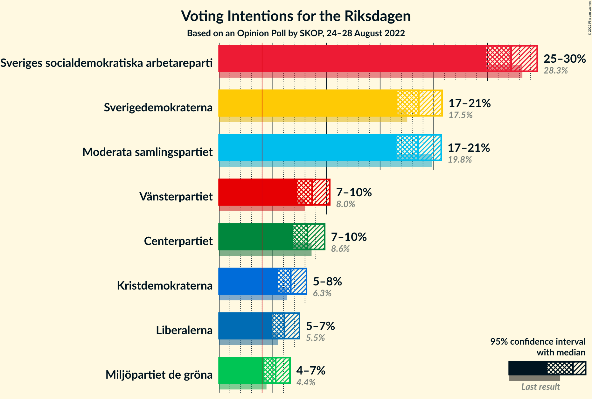

### Confidence Intervals

| Party | Last Result | Poll Result | 80% Confidence Interval | 90% Confidence Interval | 95% Confidence Interval | 99% Confidence Interval |
|:-----:|:-----------:|:-----------:|:-----------------------:|:-----------------------:|:-----------------------:|:-----------------------:|
| Sveriges socialdemokratiska arbetareparti | 28.3% | 27.2% | 25.7–28.8% |25.3–29.3% |24.9–29.6% |24.2–30.4% |
| Sverigedemokraterna | 17.5% | 18.6% | 17.3–20.0% |16.9–20.4% |16.6–20.8% |16.0–21.5% |
| Moderata samlingspartiet | 19.8% | 18.5% | 17.2–20.0% |16.9–20.3% |16.5–20.7% |15.9–21.4% |
| Vänsterpartiet | 8.0% | 8.7% | 7.8–9.7% |7.5–10.0% |7.3–10.3% |6.9–10.8% |
| Centerpartiet | 8.6% | 8.2% | 7.3–9.3% |7.1–9.6% |6.9–9.8% |6.5–10.3% |
| Kristdemokraterna | 6.3% | 6.7% | 5.9–7.6% |5.6–7.9% |5.5–8.1% |5.1–8.6% |
| Liberalerna | 5.5% | 6.1% | 5.3–7.0% |5.1–7.3% |4.9–7.5% |4.6–8.0% |
| Miljöpartiet de gröna | 4.4% | 5.3% | 4.6–6.1% |4.4–6.4% |4.2–6.6% |3.9–7.0% |

*Note:* The poll result column reflects the actual value used in the calculations. Published results may vary slightly, and in addition be rounded to fewer digits.

## Seats

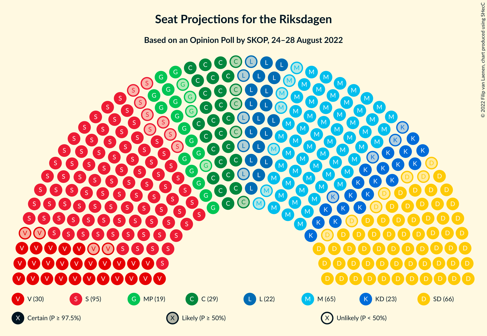

### Confidence Intervals

| Party | Last Result | Median | 80% Confidence Interval | 90% Confidence Interval | 95% Confidence Interval | 99% Confidence Interval |
|:-----:|:-----------:|:------:|:-----------------------:|:-----------------------:|:-----------------------:|:-----------------------:|
| <a href="#sveriges-socialdemokratiska-arbetareparti">Sveriges socialdemokratiska arbetareparti</a> | 100 | 95 | 90–101 |89–102 |87–104 |85–106 |
| <a href="#sverigedemokraterna">Sverigedemokraterna</a> | 62 | 66 | 61–70 |59–71 |59–72 |56–75 |
| <a href="#moderata-samlingspartiet">Moderata samlingspartiet</a> | 70 | 65 | 61–70 |59–71 |58–72 |55–75 |
| <a href="#vänsterpartiet">Vänsterpartiet</a> | 28 | 30 | 28–34 |26–35 |26–36 |24–38 |
| <a href="#centerpartiet">Centerpartiet</a> | 31 | 29 | 26–32 |25–33 |24–34 |23–36 |
| <a href="#kristdemokraterna">Kristdemokraterna</a> | 22 | 23 | 21–27 |20–27 |19–28 |18–30 |
| <a href="#liberalerna">Liberalerna</a> | 20 | 22 | 19–24 |18–25 |17–26 |16–28 |
| <a href="#miljöpartiet-de-gröna">Miljöpartiet de gröna</a> | 16 | 19 | 16–21 |16–22 |15–23 |0–24 |

### Sveriges socialdemokratiska arbetareparti

*For a full overview of the results for this party, see the [Sveriges socialdemokratiska arbetareparti](party-sverigessocialdemokratiskaarbetareparti.html) page.*

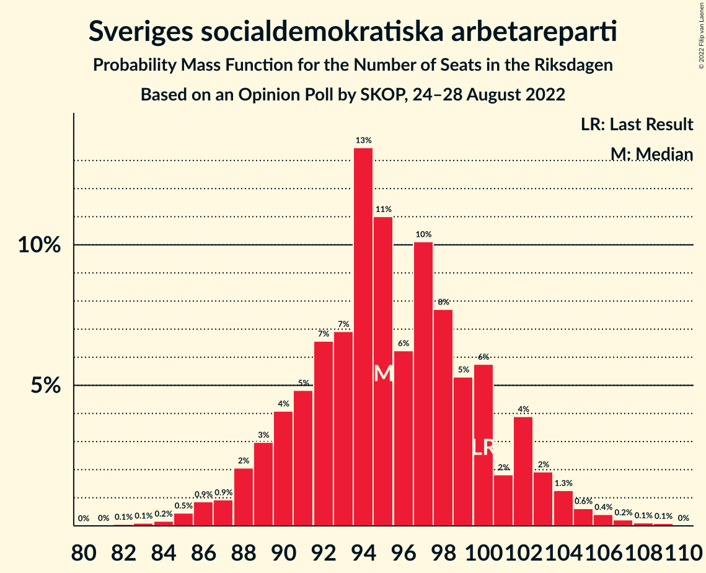

| Number of Seats | Probability | Accumulated | Special Marks |
|:---------------:|:-----------:|:-----------:|:-------------:|
| 82 | 0.1% | 100% |  |
| 83 | 0.1% | 99.9% |  |
| 84 | 0.2% | 99.8% |  |
| 85 | 0.5% | 99.6% |  |
| 86 | 0.9% | 99.2% |  |
| 87 | 0.9% | 98% |  |
| 88 | 2% | 97% |  |
| 89 | 3% | 95% |  |
| 90 | 4% | 92% |  |
| 91 | 5% | 88% |  |
| 92 | 7% | 83% |  |
| 93 | 7% | 77% |  |
| 94 | 13% | 70% |  |
| 95 | 11% | 56% | Median |
| 96 | 6% | 45% |  |
| 97 | 10% | 39% |  |
| 98 | 8% | 29% |  |
| 99 | 5% | 21% |  |
| 100 | 6% | 16% | Last Result |
| 101 | 2% | 10% |  |
| 102 | 4% | 9% |  |
| 103 | 2% | 5% |  |
| 104 | 1.3% | 3% |  |
| 105 | 0.6% | 1.5% |  |
| 106 | 0.4% | 0.9% |  |
| 107 | 0.2% | 0.5% |  |
| 108 | 0.1% | 0.2% |  |
| 109 | 0.1% | 0.1% |  |
| 110 | 0% | 0% |  |

### Sverigedemokraterna

*For a full overview of the results for this party, see the [Sverigedemokraterna](party-sverigedemokraterna.html) page.*

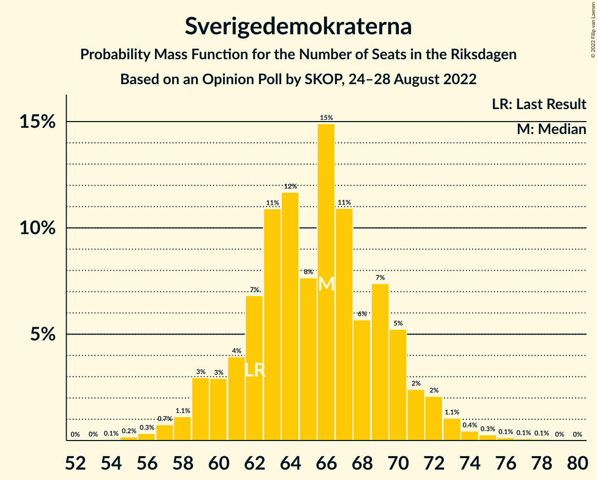

| Number of Seats | Probability | Accumulated | Special Marks |
|:---------------:|:-----------:|:-----------:|:-------------:|
| 54 | 0.1% | 100% |  |
| 55 | 0.2% | 99.9% |  |
| 56 | 0.3% | 99.7% |  |
| 57 | 0.7% | 99.4% |  |
| 58 | 1.1% | 98.7% |  |
| 59 | 3% | 98% |  |
| 60 | 3% | 95% |  |
| 61 | 4% | 92% |  |
| 62 | 7% | 88% | Last Result |
| 63 | 11% | 81% |  |
| 64 | 12% | 70% |  |
| 65 | 8% | 58% |  |
| 66 | 15% | 51% | Median |
| 67 | 11% | 36% |  |
| 68 | 6% | 25% |  |
| 69 | 7% | 19% |  |
| 70 | 5% | 12% |  |
| 71 | 2% | 7% |  |
| 72 | 2% | 4% |  |
| 73 | 1.1% | 2% |  |
| 74 | 0.4% | 1.0% |  |
| 75 | 0.3% | 0.6% |  |
| 76 | 0.1% | 0.3% |  |
| 77 | 0.1% | 0.2% |  |
| 78 | 0.1% | 0.1% |  |
| 79 | 0% | 0% |  |

### Moderata samlingspartiet

*For a full overview of the results for this party, see the [Moderata samlingspartiet](party-moderatasamlingspartiet.html) page.*

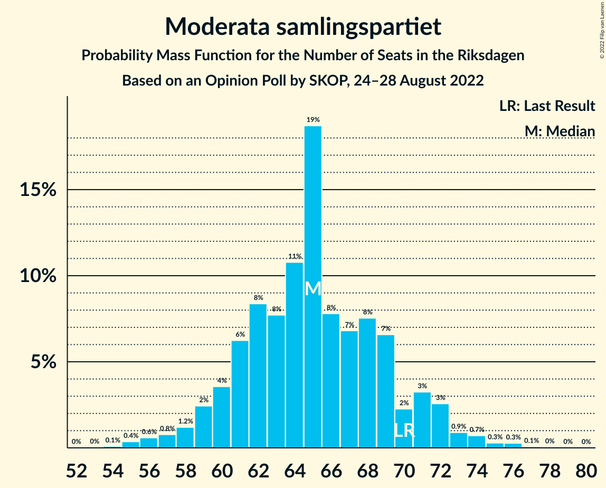

| Number of Seats | Probability | Accumulated | Special Marks |
|:---------------:|:-----------:|:-----------:|:-------------:|
| 53 | 0% | 100% |  |
| 54 | 0.1% | 99.9% |  |
| 55 | 0.4% | 99.9% |  |
| 56 | 0.6% | 99.5% |  |
| 57 | 0.8% | 98.9% |  |
| 58 | 1.2% | 98% |  |
| 59 | 2% | 97% |  |
| 60 | 4% | 94% |  |
| 61 | 6% | 91% |  |
| 62 | 8% | 85% |  |
| 63 | 8% | 76% |  |
| 64 | 11% | 69% |  |
| 65 | 19% | 58% | Median |
| 66 | 8% | 39% |  |
| 67 | 7% | 31% |  |
| 68 | 8% | 25% |  |
| 69 | 7% | 17% |  |
| 70 | 2% | 10% | Last Result |
| 71 | 3% | 8% |  |
| 72 | 3% | 5% |  |
| 73 | 0.9% | 2% |  |
| 74 | 0.7% | 1.4% |  |
| 75 | 0.3% | 0.7% |  |
| 76 | 0.3% | 0.4% |  |
| 77 | 0.1% | 0.1% |  |
| 78 | 0% | 0.1% |  |
| 79 | 0% | 0% |  |

### Vänsterpartiet

*For a full overview of the results for this party, see the [Vänsterpartiet](party-vänsterpartiet.html) page.*

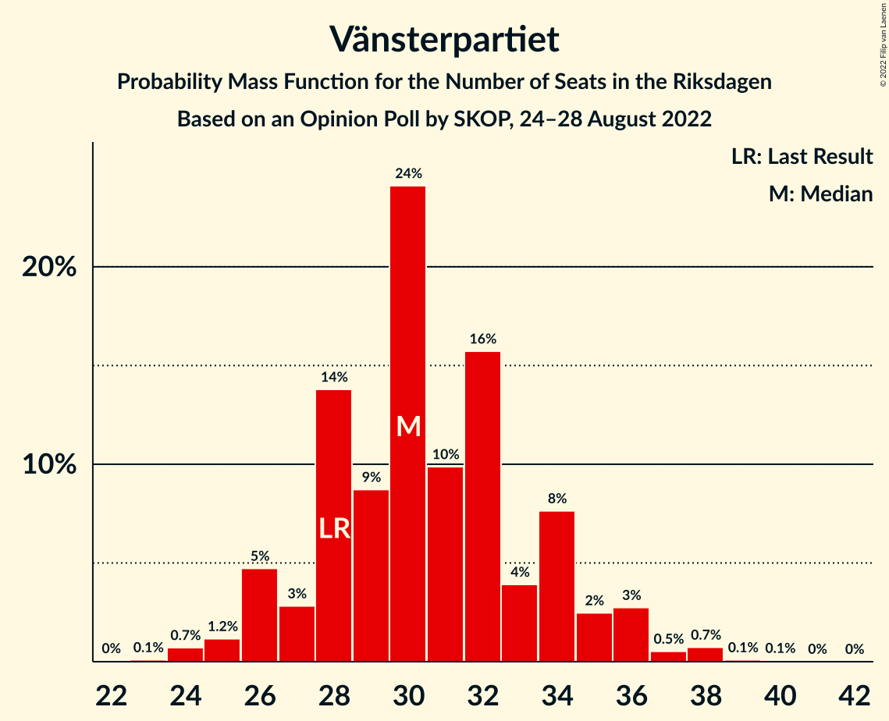

| Number of Seats | Probability | Accumulated | Special Marks |
|:---------------:|:-----------:|:-----------:|:-------------:|
| 22 | 0% | 100% |  |
| 23 | 0.1% | 99.9% |  |
| 24 | 0.7% | 99.8% |  |
| 25 | 1.2% | 99.1% |  |
| 26 | 5% | 98% |  |
| 27 | 3% | 93% |  |
| 28 | 14% | 90% | Last Result |
| 29 | 9% | 77% |  |
| 30 | 24% | 68% | Median |
| 31 | 10% | 44% |  |
| 32 | 16% | 34% |  |
| 33 | 4% | 18% |  |
| 34 | 8% | 14% |  |
| 35 | 2% | 7% |  |
| 36 | 3% | 4% |  |
| 37 | 0.5% | 1.4% |  |
| 38 | 0.7% | 0.9% |  |
| 39 | 0.1% | 0.2% |  |
| 40 | 0.1% | 0.1% |  |
| 41 | 0% | 0% |  |

### Centerpartiet

*For a full overview of the results for this party, see the [Centerpartiet](party-centerpartiet.html) page.*

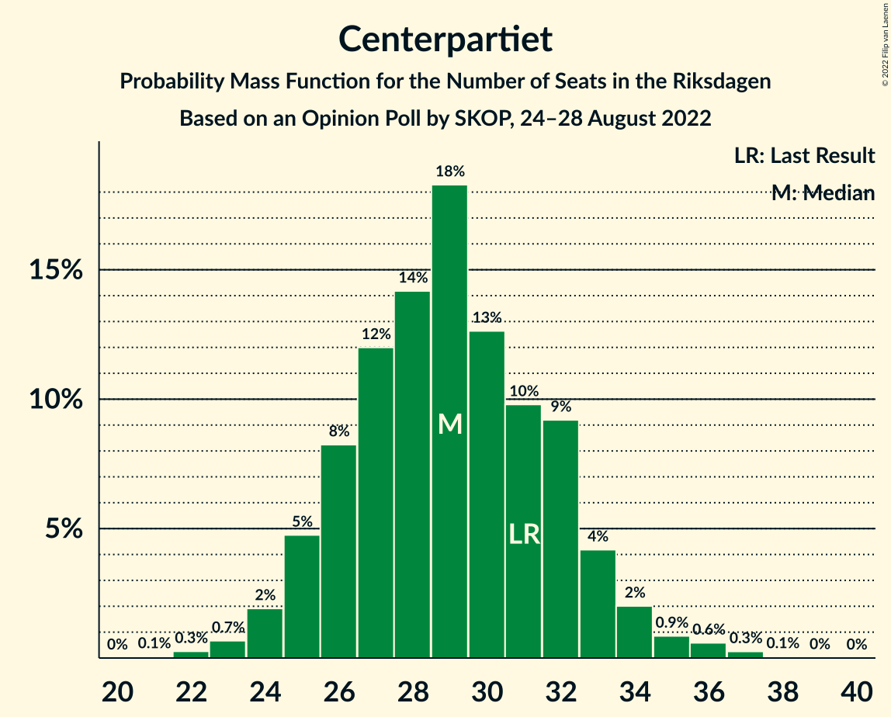

| Number of Seats | Probability | Accumulated | Special Marks |
|:---------------:|:-----------:|:-----------:|:-------------:|
| 21 | 0.1% | 100% |  |
| 22 | 0.3% | 99.9% |  |
| 23 | 0.7% | 99.7% |  |
| 24 | 2% | 99.0% |  |
| 25 | 5% | 97% |  |
| 26 | 8% | 92% |  |
| 27 | 12% | 84% |  |
| 28 | 14% | 72% |  |
| 29 | 18% | 58% | Median |
| 30 | 13% | 40% |  |
| 31 | 10% | 27% | Last Result |
| 32 | 9% | 17% |  |
| 33 | 4% | 8% |  |
| 34 | 2% | 4% |  |
| 35 | 0.9% | 2% |  |
| 36 | 0.6% | 0.9% |  |
| 37 | 0.3% | 0.4% |  |
| 38 | 0.1% | 0.1% |  |
| 39 | 0% | 0% |  |

### Kristdemokraterna

*For a full overview of the results for this party, see the [Kristdemokraterna](party-kristdemokraterna.html) page.*

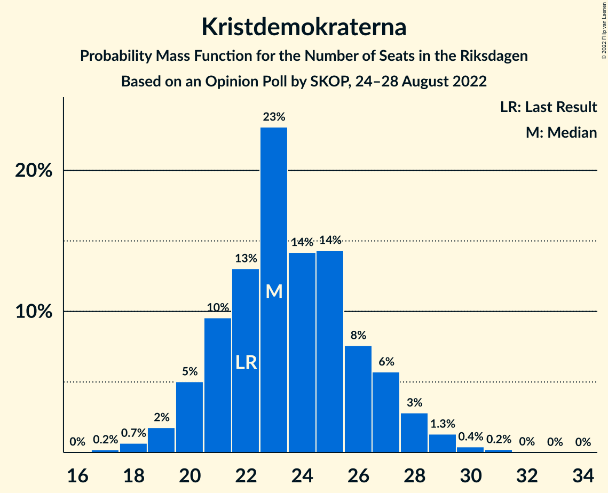

| Number of Seats | Probability | Accumulated | Special Marks |
|:---------------:|:-----------:|:-----------:|:-------------:|
| 17 | 0.2% | 100% |  |
| 18 | 0.7% | 99.8% |  |
| 19 | 2% | 99.1% |  |
| 20 | 5% | 97% |  |
| 21 | 10% | 92% |  |
| 22 | 13% | 83% | Last Result |
| 23 | 23% | 70% | Median |
| 24 | 14% | 47% |  |
| 25 | 14% | 32% |  |
| 26 | 8% | 18% |  |
| 27 | 6% | 11% |  |
| 28 | 3% | 5% |  |
| 29 | 1.3% | 2% |  |
| 30 | 0.4% | 0.7% |  |
| 31 | 0.2% | 0.3% |  |
| 32 | 0% | 0.1% |  |
| 33 | 0% | 0% |  |

### Liberalerna

*For a full overview of the results for this party, see the [Liberalerna](party-liberalerna.html) page.*

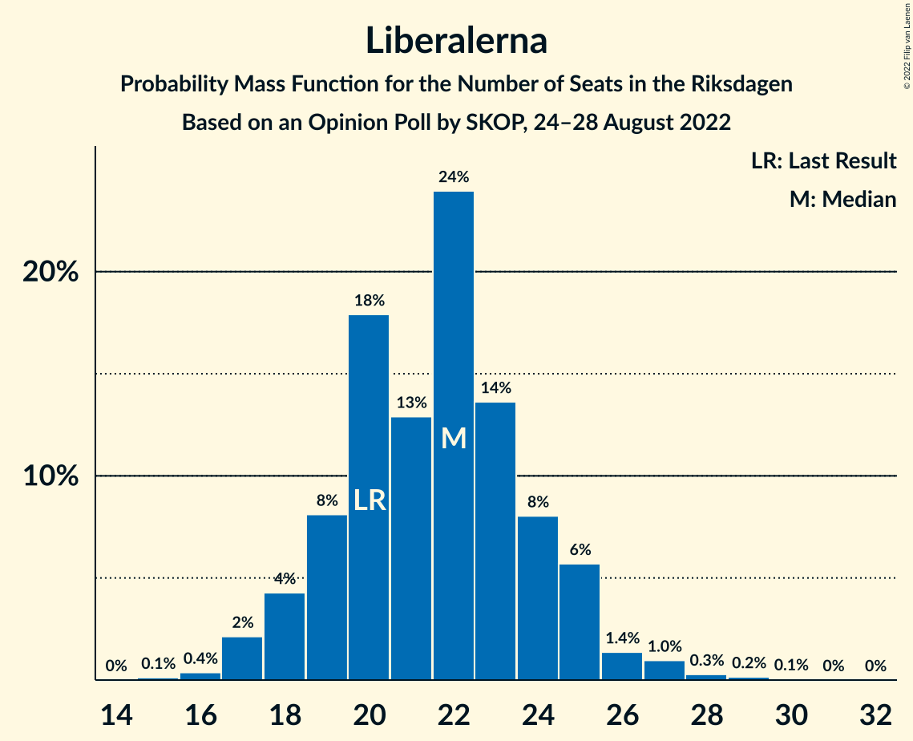

| Number of Seats | Probability | Accumulated | Special Marks |
|:---------------:|:-----------:|:-----------:|:-------------:|
| 15 | 0.1% | 100% |  |
| 16 | 0.4% | 99.9% |  |
| 17 | 2% | 99.5% |  |
| 18 | 4% | 97% |  |
| 19 | 8% | 93% |  |
| 20 | 18% | 85% | Last Result |
| 21 | 13% | 67% |  |
| 22 | 24% | 54% | Median |
| 23 | 14% | 30% |  |
| 24 | 8% | 17% |  |
| 25 | 6% | 9% |  |
| 26 | 1.4% | 3% |  |
| 27 | 1.0% | 1.5% |  |
| 28 | 0.3% | 0.5% |  |
| 29 | 0.2% | 0.2% |  |
| 30 | 0.1% | 0.1% |  |
| 31 | 0% | 0% |  |

### Miljöpartiet de gröna

*For a full overview of the results for this party, see the [Miljöpartiet de gröna](party-miljöpartietdegröna.html) page.*

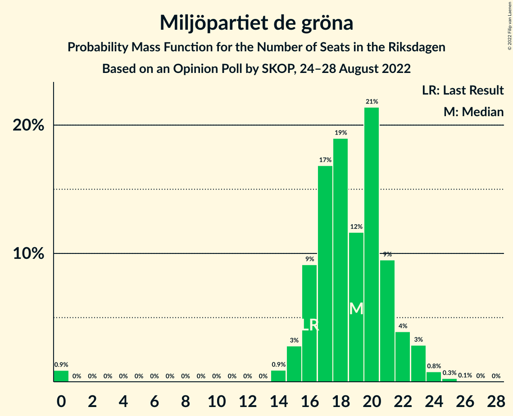

| Number of Seats | Probability | Accumulated | Special Marks |
|:---------------:|:-----------:|:-----------:|:-------------:|
| 0 | 0.9% | 100% |  |
| 1 | 0% | 99.1% |  |
| 2 | 0% | 99.1% |  |
| 3 | 0% | 99.1% |  |
| 4 | 0% | 99.1% |  |
| 5 | 0% | 99.1% |  |
| 6 | 0% | 99.1% |  |
| 7 | 0% | 99.1% |  |
| 8 | 0% | 99.1% |  |
| 9 | 0% | 99.1% |  |
| 10 | 0% | 99.1% |  |
| 11 | 0% | 99.1% |  |
| 12 | 0% | 99.1% |  |
| 13 | 0% | 99.1% |  |
| 14 | 0.9% | 99.1% |  |
| 15 | 3% | 98% |  |
| 16 | 9% | 95% | Last Result |
| 17 | 17% | 86% |  |
| 18 | 19% | 69% |  |
| 19 | 12% | 50% | Median |
| 20 | 21% | 39% |  |
| 21 | 9% | 17% |  |
| 22 | 4% | 8% |  |
| 23 | 3% | 4% |  |
| 24 | 0.8% | 1.1% |  |
| 25 | 0.3% | 0.4% |  |
| 26 | 0.1% | 0.1% |  |
| 27 | 0% | 0% |  |

## Coalitions

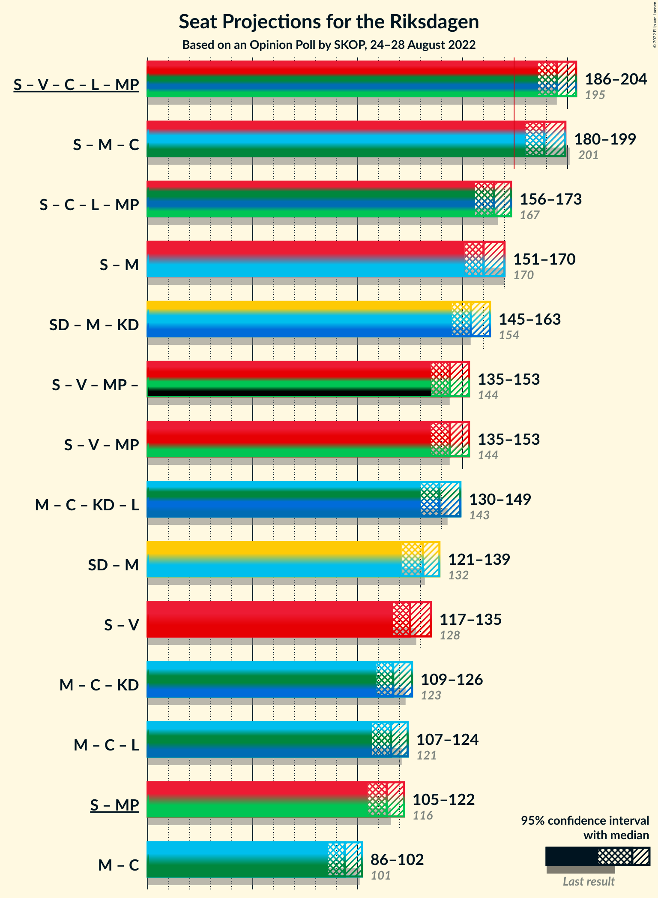

### Confidence Intervals

| Coalition | Last Result | Median | Majority? | 80% Confidence Interval | 90% Confidence Interval | 95% Confidence Interval | 99% Confidence Interval |
|:---------:|:-----------:|:------:|:---------:|:-----------------------:|:-----------------------:|:-----------------------:|:-----------------------:|
| Sveriges socialdemokratiska arbetareparti – Vänsterpartiet – Centerpartiet – Liberalerna – Miljöpartiet de gröna | 195 | 195 | 100% | 190–201 | 188–202 | 186–204 | 183–207 |
| Sveriges socialdemokratiska arbetareparti – Moderata samlingspartiet – Centerpartiet | 201 | 189 | 99.9% | 183–196 | 182–198 | 180–199 | 177–202 |
| Sveriges socialdemokratiska arbetareparti – Centerpartiet – Liberalerna – Miljöpartiet de gröna | 167 | 165 | 1.1% | 159–170 | 158–171 | 156–173 | 152–176 |
| Sveriges socialdemokratiska arbetareparti – Moderata samlingspartiet | 170 | 160 | 0.2% | 154–167 | 153–168 | 151–170 | 149–173 |
| Sverigedemokraterna – Moderata samlingspartiet – Kristdemokraterna | 154 | 154 | 0% | 148–159 | 147–161 | 145–163 | 142–166 |
| Sveriges socialdemokratiska arbetareparti – Vänsterpartiet – Miljöpartiet de gröna | 144 | 144 | 0% | 139–151 | 138–152 | 135–153 | 132–156 |
| Moderata samlingspartiet – Centerpartiet – Kristdemokraterna – Liberalerna | 143 | 139 | 0% | 133–145 | 131–147 | 130–149 | 127–152 |
| Sverigedemokraterna – Moderata samlingspartiet | 132 | 131 | 0% | 125–136 | 123–138 | 121–139 | 119–142 |
| Sveriges socialdemokratiska arbetareparti – Vänsterpartiet | 128 | 125 | 0% | 120–132 | 118–134 | 117–135 | 114–138 |
| Moderata samlingspartiet – Centerpartiet – Kristdemokraterna | 123 | 117 | 0% | 113–123 | 111–124 | 109–126 | 106–129 |
| Moderata samlingspartiet – Centerpartiet – Liberalerna | 121 | 116 | 0% | 110–122 | 108–123 | 107–124 | 104–127 |
| Sveriges socialdemokratiska arbetareparti – Miljöpartiet de gröna | 116 | 114 | 0% | 109–119 | 107–120 | 105–122 | 101–125 |
| Moderata samlingspartiet – Centerpartiet | 101 | 94 | 0% | 89–100 | 87–101 | 86–102 | 83–105 |

### Sveriges socialdemokratiska arbetareparti – Vänsterpartiet – Centerpartiet – Liberalerna – Miljöpartiet de gröna

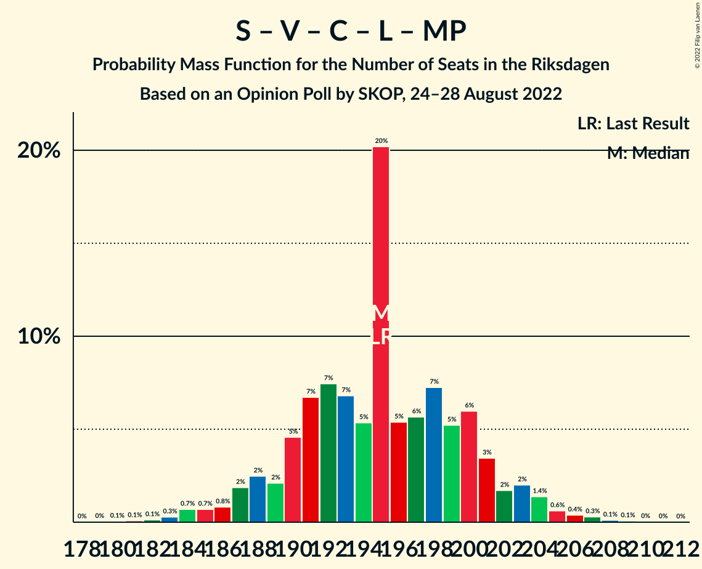

| Number of Seats | Probability | Accumulated | Special Marks |
|:---------------:|:-----------:|:-----------:|:-------------:|
| 178 | 0% | 100% |  |
| 179 | 0% | 99.9% |  |
| 180 | 0.1% | 99.9% |  |
| 181 | 0.1% | 99.9% |  |
| 182 | 0.1% | 99.8% |  |
| 183 | 0.3% | 99.6% |  |
| 184 | 0.7% | 99.4% |  |
| 185 | 0.7% | 98.7% |  |
| 186 | 0.8% | 98% |  |
| 187 | 2% | 97% |  |
| 188 | 2% | 95% |  |
| 189 | 2% | 93% |  |
| 190 | 5% | 91% |  |
| 191 | 7% | 86% |  |
| 192 | 7% | 79% |  |
| 193 | 7% | 72% |  |
| 194 | 5% | 65% |  |
| 195 | 20% | 60% | Last Result, Median |
| 196 | 5% | 40% |  |
| 197 | 6% | 34% |  |
| 198 | 7% | 29% |  |
| 199 | 5% | 21% |  |
| 200 | 6% | 16% |  |
| 201 | 3% | 10% |  |
| 202 | 2% | 7% |  |
| 203 | 2% | 5% |  |
| 204 | 1.4% | 3% |  |
| 205 | 0.6% | 2% |  |
| 206 | 0.4% | 0.9% |  |
| 207 | 0.3% | 0.5% |  |
| 208 | 0.1% | 0.3% |  |
| 209 | 0.1% | 0.1% |  |
| 210 | 0% | 0.1% |  |
| 211 | 0% | 0% |  |

### Sveriges socialdemokratiska arbetareparti – Moderata samlingspartiet – Centerpartiet

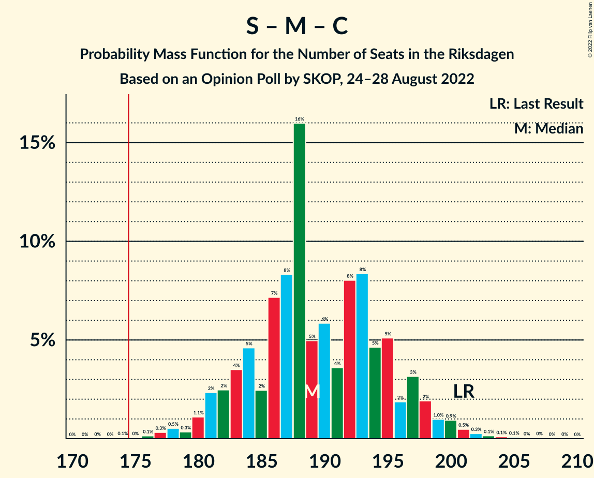

| Number of Seats | Probability | Accumulated | Special Marks |
|:---------------:|:-----------:|:-----------:|:-------------:|
| 174 | 0.1% | 100% |  |
| 175 | 0% | 99.9% | Majority |
| 176 | 0.1% | 99.9% |  |
| 177 | 0.3% | 99.7% |  |
| 178 | 0.5% | 99.4% |  |
| 179 | 0.3% | 98.9% |  |
| 180 | 1.1% | 98.5% |  |
| 181 | 2% | 97% |  |
| 182 | 2% | 95% |  |
| 183 | 4% | 93% |  |
| 184 | 5% | 89% |  |
| 185 | 2% | 85% |  |
| 186 | 7% | 82% |  |
| 187 | 8% | 75% |  |
| 188 | 16% | 67% |  |
| 189 | 5% | 51% | Median |
| 190 | 6% | 46% |  |
| 191 | 4% | 40% |  |
| 192 | 8% | 36% |  |
| 193 | 8% | 28% |  |
| 194 | 5% | 20% |  |
| 195 | 5% | 15% |  |
| 196 | 2% | 10% |  |
| 197 | 3% | 8% |  |
| 198 | 2% | 5% |  |
| 199 | 1.0% | 3% |  |
| 200 | 0.9% | 2% |  |
| 201 | 0.5% | 1.2% | Last Result |
| 202 | 0.3% | 0.7% |  |
| 203 | 0.1% | 0.4% |  |
| 204 | 0.1% | 0.3% |  |
| 205 | 0.1% | 0.2% |  |
| 206 | 0% | 0.1% |  |
| 207 | 0% | 0.1% |  |
| 208 | 0% | 0.1% |  |
| 209 | 0% | 0% |  |

### Sveriges socialdemokratiska arbetareparti – Centerpartiet – Liberalerna – Miljöpartiet de gröna

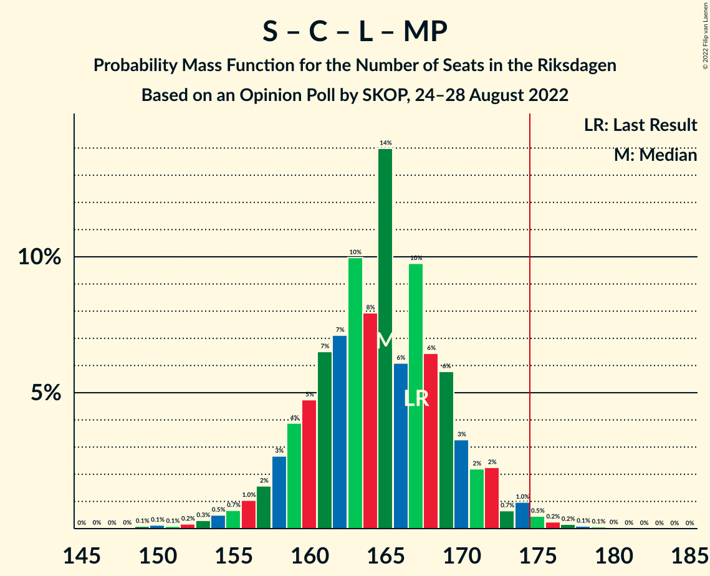

| Number of Seats | Probability | Accumulated | Special Marks |
|:---------------:|:-----------:|:-----------:|:-------------:|
| 146 | 0% | 100% |  |
| 147 | 0% | 99.9% |  |
| 148 | 0% | 99.9% |  |
| 149 | 0.1% | 99.9% |  |
| 150 | 0.1% | 99.8% |  |
| 151 | 0.1% | 99.7% |  |
| 152 | 0.2% | 99.6% |  |
| 153 | 0.3% | 99.4% |  |
| 154 | 0.5% | 99.1% |  |
| 155 | 0.7% | 98.6% |  |
| 156 | 1.0% | 98% |  |
| 157 | 2% | 97% |  |
| 158 | 3% | 95% |  |
| 159 | 4% | 93% |  |
| 160 | 5% | 89% |  |
| 161 | 7% | 84% |  |
| 162 | 7% | 78% |  |
| 163 | 10% | 70% |  |
| 164 | 8% | 60% |  |
| 165 | 14% | 53% | Median |
| 166 | 6% | 39% |  |
| 167 | 10% | 32% | Last Result |
| 168 | 6% | 23% |  |
| 169 | 6% | 16% |  |
| 170 | 3% | 10% |  |
| 171 | 2% | 7% |  |
| 172 | 2% | 5% |  |
| 173 | 0.7% | 3% |  |
| 174 | 1.0% | 2% |  |
| 175 | 0.5% | 1.1% | Majority |
| 176 | 0.2% | 0.6% |  |
| 177 | 0.2% | 0.4% |  |
| 178 | 0.1% | 0.2% |  |
| 179 | 0.1% | 0.1% |  |
| 180 | 0% | 0.1% |  |
| 181 | 0% | 0% |  |

### Sveriges socialdemokratiska arbetareparti – Moderata samlingspartiet

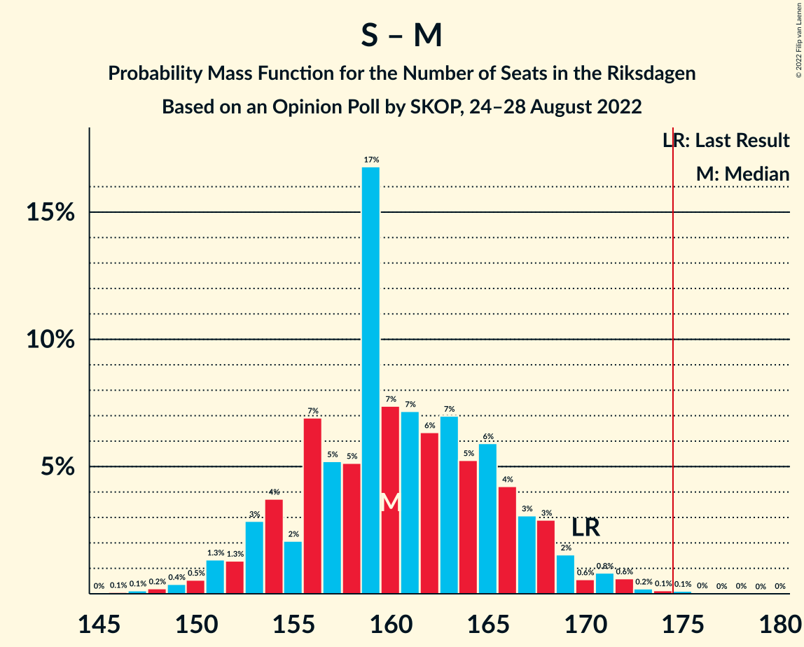

| Number of Seats | Probability | Accumulated | Special Marks |
|:---------------:|:-----------:|:-----------:|:-------------:|
| 145 | 0% | 100% |  |
| 146 | 0.1% | 99.9% |  |
| 147 | 0.1% | 99.9% |  |
| 148 | 0.2% | 99.7% |  |
| 149 | 0.4% | 99.5% |  |
| 150 | 0.5% | 99.2% |  |
| 151 | 1.3% | 98.6% |  |
| 152 | 1.3% | 97% |  |
| 153 | 3% | 96% |  |
| 154 | 4% | 93% |  |
| 155 | 2% | 89% |  |
| 156 | 7% | 87% |  |
| 157 | 5% | 80% |  |
| 158 | 5% | 75% |  |
| 159 | 17% | 70% |  |
| 160 | 7% | 53% | Median |
| 161 | 7% | 46% |  |
| 162 | 6% | 39% |  |
| 163 | 7% | 32% |  |
| 164 | 5% | 25% |  |
| 165 | 6% | 20% |  |
| 166 | 4% | 14% |  |
| 167 | 3% | 10% |  |
| 168 | 3% | 7% |  |
| 169 | 2% | 4% |  |
| 170 | 0.6% | 3% | Last Result |
| 171 | 0.8% | 2% |  |
| 172 | 0.6% | 1.2% |  |
| 173 | 0.2% | 0.6% |  |
| 174 | 0.1% | 0.4% |  |
| 175 | 0.1% | 0.2% | Majority |
| 176 | 0% | 0.1% |  |
| 177 | 0% | 0.1% |  |
| 178 | 0% | 0.1% |  |
| 179 | 0% | 0% |  |

### Sverigedemokraterna – Moderata samlingspartiet – Kristdemokraterna

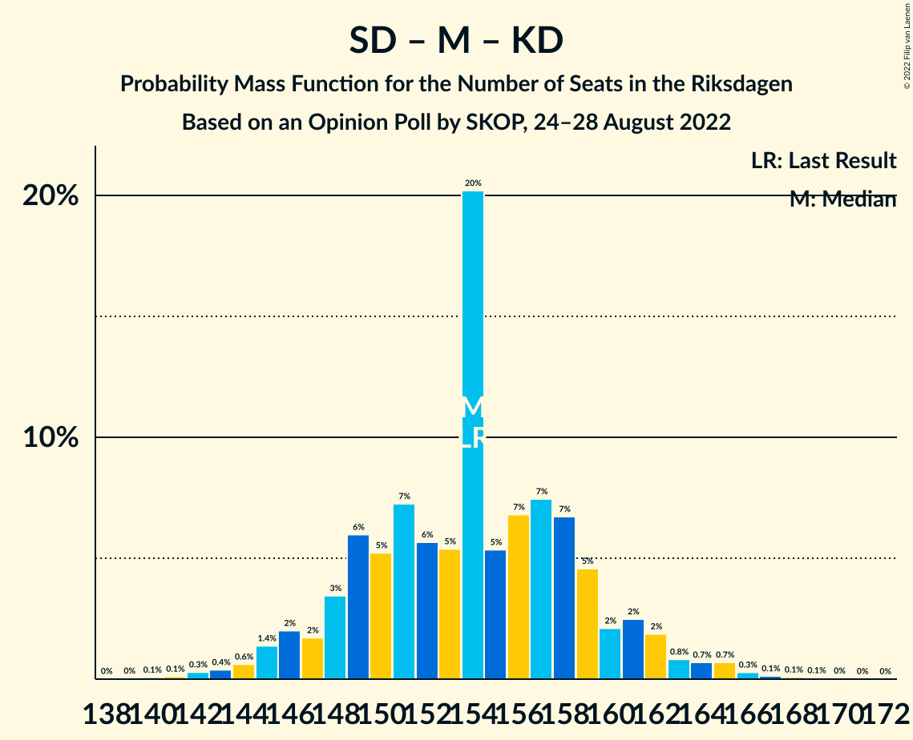

| Number of Seats | Probability | Accumulated | Special Marks |
|:---------------:|:-----------:|:-----------:|:-------------:|
| 139 | 0% | 100% |  |
| 140 | 0.1% | 99.9% |  |
| 141 | 0.1% | 99.9% |  |
| 142 | 0.3% | 99.7% |  |
| 143 | 0.4% | 99.5% |  |
| 144 | 0.6% | 99.1% |  |
| 145 | 1.4% | 98% |  |
| 146 | 2% | 97% |  |
| 147 | 2% | 95% |  |
| 148 | 3% | 93% |  |
| 149 | 6% | 90% |  |
| 150 | 5% | 84% |  |
| 151 | 7% | 79% |  |
| 152 | 6% | 71% |  |
| 153 | 5% | 66% |  |
| 154 | 20% | 60% | Last Result, Median |
| 155 | 5% | 40% |  |
| 156 | 7% | 35% |  |
| 157 | 7% | 28% |  |
| 158 | 7% | 21% |  |
| 159 | 5% | 14% |  |
| 160 | 2% | 9% |  |
| 161 | 2% | 7% |  |
| 162 | 2% | 5% |  |
| 163 | 0.8% | 3% |  |
| 164 | 0.7% | 2% |  |
| 165 | 0.7% | 1.3% |  |
| 166 | 0.3% | 0.6% |  |
| 167 | 0.1% | 0.4% |  |
| 168 | 0.1% | 0.2% |  |
| 169 | 0.1% | 0.1% |  |
| 170 | 0% | 0.1% |  |
| 171 | 0% | 0.1% |  |
| 172 | 0% | 0% |  |

### Sveriges socialdemokratiska arbetareparti – Vänsterpartiet – Miljöpartiet de gröna

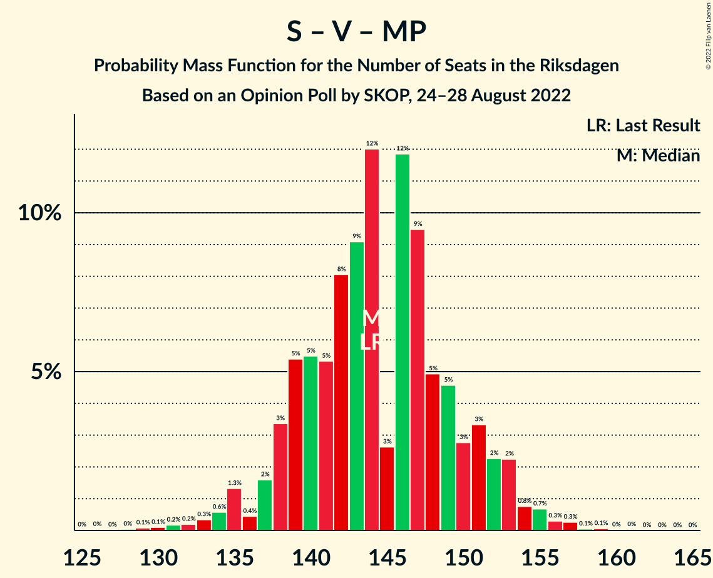

| Number of Seats | Probability | Accumulated | Special Marks |
|:---------------:|:-----------:|:-----------:|:-------------:|
| 126 | 0% | 100% |  |
| 127 | 0% | 99.9% |  |
| 128 | 0% | 99.9% |  |
| 129 | 0.1% | 99.9% |  |
| 130 | 0.1% | 99.8% |  |
| 131 | 0.2% | 99.7% |  |
| 132 | 0.2% | 99.5% |  |
| 133 | 0.3% | 99.3% |  |
| 134 | 0.6% | 99.0% |  |
| 135 | 1.3% | 98% |  |
| 136 | 0.4% | 97% |  |
| 137 | 2% | 97% |  |
| 138 | 3% | 95% |  |
| 139 | 5% | 92% |  |
| 140 | 5% | 86% |  |
| 141 | 5% | 81% |  |
| 142 | 8% | 75% |  |
| 143 | 9% | 67% |  |
| 144 | 12% | 58% | Last Result, Median |
| 145 | 3% | 46% |  |
| 146 | 12% | 44% |  |
| 147 | 9% | 32% |  |
| 148 | 5% | 22% |  |
| 149 | 5% | 17% |  |
| 150 | 3% | 13% |  |
| 151 | 3% | 10% |  |
| 152 | 2% | 7% |  |
| 153 | 2% | 4% |  |
| 154 | 0.8% | 2% |  |
| 155 | 0.7% | 1.4% |  |
| 156 | 0.3% | 0.7% |  |
| 157 | 0.3% | 0.4% |  |
| 158 | 0.1% | 0.2% |  |
| 159 | 0.1% | 0.1% |  |
| 160 | 0% | 0.1% |  |
| 161 | 0% | 0% |  |

### Moderata samlingspartiet – Centerpartiet – Kristdemokraterna – Liberalerna

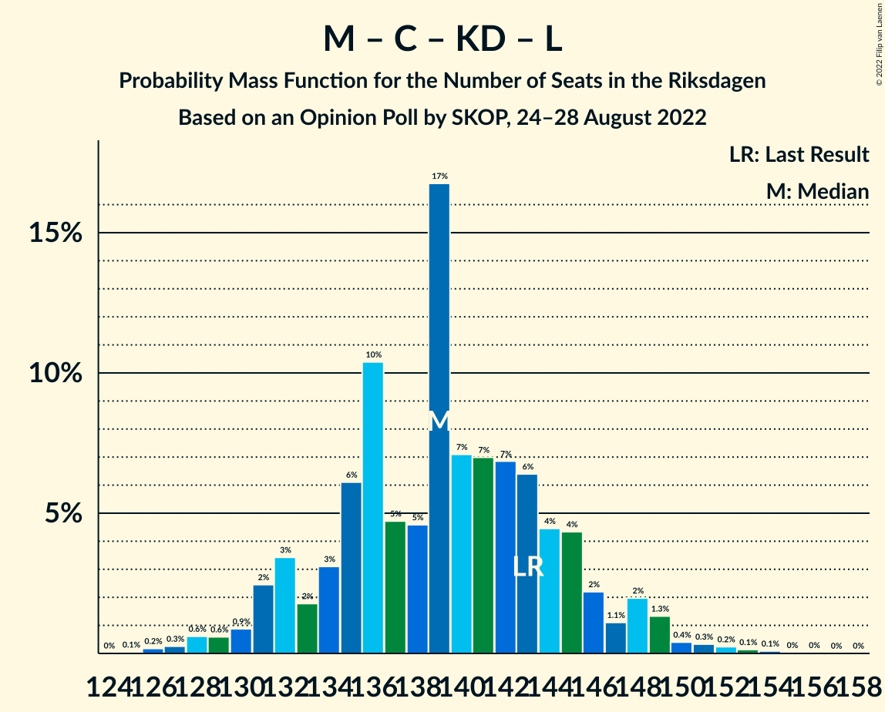

| Number of Seats | Probability | Accumulated | Special Marks |
|:---------------:|:-----------:|:-----------:|:-------------:|
| 124 | 0% | 100% |  |
| 125 | 0.1% | 99.9% |  |
| 126 | 0.2% | 99.9% |  |
| 127 | 0.3% | 99.7% |  |
| 128 | 0.6% | 99.4% |  |
| 129 | 0.6% | 98.8% |  |
| 130 | 0.9% | 98% |  |
| 131 | 2% | 97% |  |
| 132 | 3% | 95% |  |
| 133 | 2% | 91% |  |
| 134 | 3% | 90% |  |
| 135 | 6% | 87% |  |
| 136 | 10% | 81% |  |
| 137 | 5% | 70% |  |
| 138 | 5% | 65% |  |
| 139 | 17% | 61% | Median |
| 140 | 7% | 44% |  |
| 141 | 7% | 37% |  |
| 142 | 7% | 30% |  |
| 143 | 6% | 23% | Last Result |
| 144 | 4% | 17% |  |
| 145 | 4% | 12% |  |
| 146 | 2% | 8% |  |
| 147 | 1.1% | 6% |  |
| 148 | 2% | 5% |  |
| 149 | 1.3% | 3% |  |
| 150 | 0.4% | 1.3% |  |
| 151 | 0.3% | 0.9% |  |
| 152 | 0.2% | 0.6% |  |
| 153 | 0.1% | 0.3% |  |
| 154 | 0.1% | 0.2% |  |
| 155 | 0% | 0.1% |  |
| 156 | 0% | 0.1% |  |
| 157 | 0% | 0% |  |

### Sverigedemokraterna – Moderata samlingspartiet

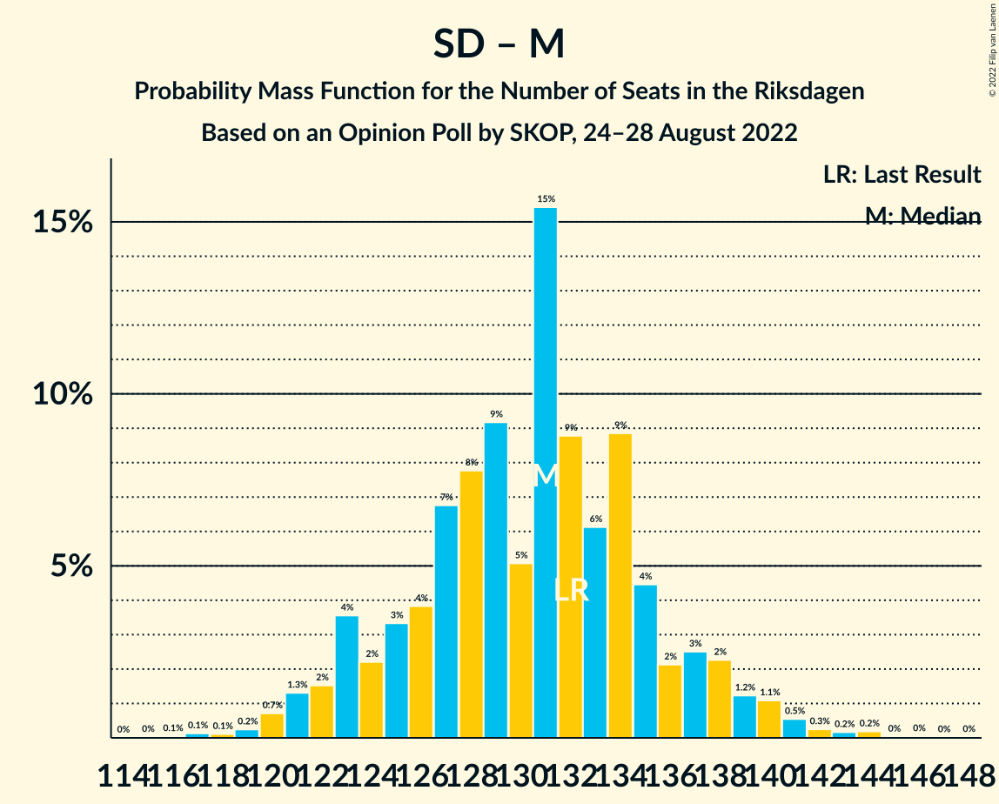

| Number of Seats | Probability | Accumulated | Special Marks |
|:---------------:|:-----------:|:-----------:|:-------------:|
| 116 | 0.1% | 100% |  |
| 117 | 0.1% | 99.9% |  |
| 118 | 0.1% | 99.8% |  |
| 119 | 0.2% | 99.7% |  |
| 120 | 0.7% | 99.4% |  |
| 121 | 1.3% | 98.7% |  |
| 122 | 2% | 97% |  |
| 123 | 4% | 96% |  |
| 124 | 2% | 92% |  |
| 125 | 3% | 90% |  |
| 126 | 4% | 87% |  |
| 127 | 7% | 83% |  |
| 128 | 8% | 76% |  |
| 129 | 9% | 68% |  |
| 130 | 5% | 59% |  |
| 131 | 15% | 54% | Median |
| 132 | 9% | 39% | Last Result |
| 133 | 6% | 30% |  |
| 134 | 9% | 24% |  |
| 135 | 4% | 15% |  |
| 136 | 2% | 11% |  |
| 137 | 3% | 8% |  |
| 138 | 2% | 6% |  |
| 139 | 1.2% | 4% |  |
| 140 | 1.1% | 2% |  |
| 141 | 0.5% | 1.3% |  |
| 142 | 0.3% | 0.7% |  |
| 143 | 0.2% | 0.5% |  |
| 144 | 0.2% | 0.3% |  |
| 145 | 0% | 0.1% |  |
| 146 | 0% | 0.1% |  |
| 147 | 0% | 0.1% |  |
| 148 | 0% | 0% |  |

### Sveriges socialdemokratiska arbetareparti – Vänsterpartiet

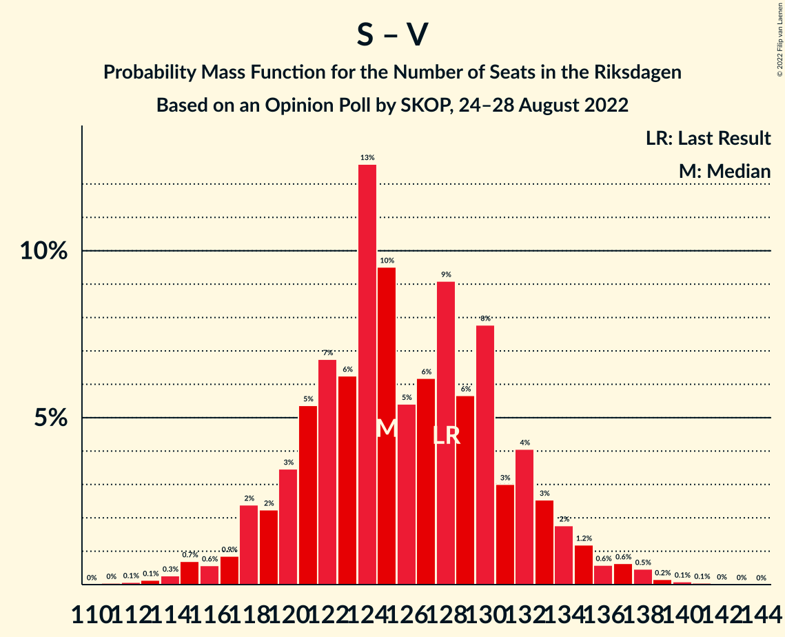

| Number of Seats | Probability | Accumulated | Special Marks |
|:---------------:|:-----------:|:-----------:|:-------------:|
| 111 | 0% | 100% |  |
| 112 | 0.1% | 99.9% |  |
| 113 | 0.1% | 99.9% |  |
| 114 | 0.3% | 99.7% |  |
| 115 | 0.7% | 99.5% |  |
| 116 | 0.6% | 98.8% |  |
| 117 | 0.9% | 98% |  |
| 118 | 2% | 97% |  |
| 119 | 2% | 95% |  |
| 120 | 3% | 93% |  |
| 121 | 5% | 89% |  |
| 122 | 7% | 84% |  |
| 123 | 6% | 77% |  |
| 124 | 13% | 71% |  |
| 125 | 10% | 58% | Median |
| 126 | 5% | 49% |  |
| 127 | 6% | 43% |  |
| 128 | 9% | 37% | Last Result |
| 129 | 6% | 28% |  |
| 130 | 8% | 22% |  |
| 131 | 3% | 15% |  |
| 132 | 4% | 12% |  |
| 133 | 3% | 8% |  |
| 134 | 2% | 5% |  |
| 135 | 1.2% | 3% |  |
| 136 | 0.6% | 2% |  |
| 137 | 0.6% | 1.5% |  |
| 138 | 0.5% | 0.8% |  |
| 139 | 0.2% | 0.4% |  |
| 140 | 0.1% | 0.2% |  |
| 141 | 0.1% | 0.1% |  |
| 142 | 0% | 0.1% |  |
| 143 | 0% | 0% |  |

### Moderata samlingspartiet – Centerpartiet – Kristdemokraterna

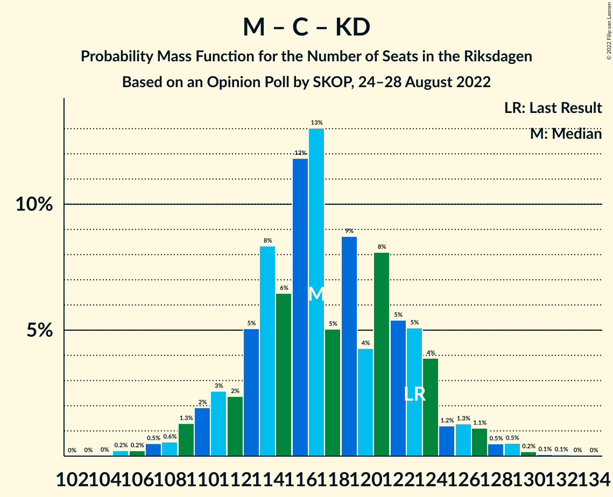

| Number of Seats | Probability | Accumulated | Special Marks |
|:---------------:|:-----------:|:-----------:|:-------------:|
| 103 | 0% | 100% |  |
| 104 | 0% | 99.9% |  |
| 105 | 0.2% | 99.9% |  |
| 106 | 0.2% | 99.7% |  |
| 107 | 0.5% | 99.5% |  |
| 108 | 0.6% | 99.0% |  |
| 109 | 1.3% | 98% |  |
| 110 | 2% | 97% |  |
| 111 | 3% | 95% |  |
| 112 | 2% | 93% |  |
| 113 | 5% | 90% |  |
| 114 | 8% | 85% |  |
| 115 | 6% | 77% |  |
| 116 | 12% | 70% |  |
| 117 | 13% | 59% | Median |
| 118 | 5% | 45% |  |
| 119 | 9% | 40% |  |
| 120 | 4% | 32% |  |
| 121 | 8% | 27% |  |
| 122 | 5% | 19% |  |
| 123 | 5% | 14% | Last Result |
| 124 | 4% | 9% |  |
| 125 | 1.2% | 5% |  |
| 126 | 1.3% | 4% |  |
| 127 | 1.1% | 2% |  |
| 128 | 0.5% | 1.4% |  |
| 129 | 0.5% | 0.9% |  |
| 130 | 0.2% | 0.4% |  |
| 131 | 0.1% | 0.2% |  |
| 132 | 0.1% | 0.1% |  |
| 133 | 0% | 0.1% |  |
| 134 | 0% | 0% |  |

### Moderata samlingspartiet – Centerpartiet – Liberalerna

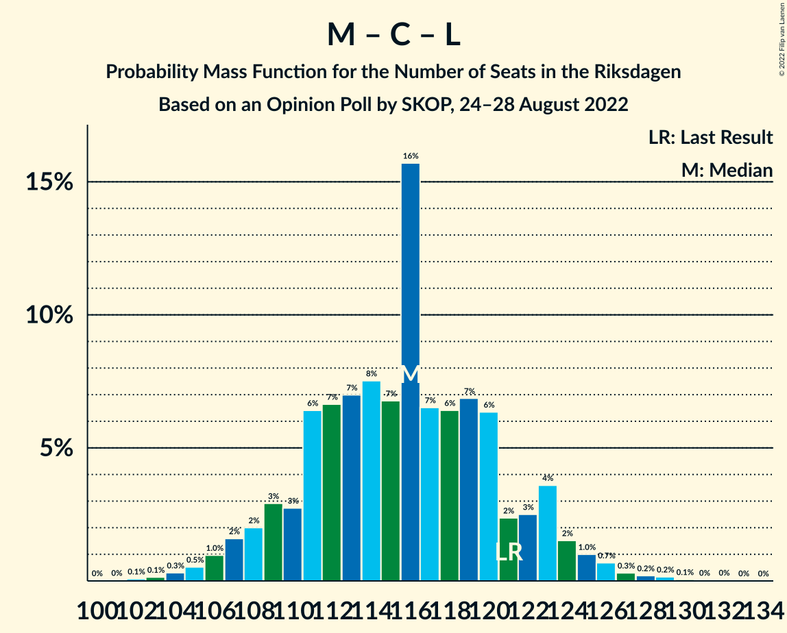

| Number of Seats | Probability | Accumulated | Special Marks |
|:---------------:|:-----------:|:-----------:|:-------------:|
| 101 | 0% | 100% |  |
| 102 | 0.1% | 99.9% |  |
| 103 | 0.1% | 99.9% |  |
| 104 | 0.3% | 99.7% |  |
| 105 | 0.5% | 99.4% |  |
| 106 | 1.0% | 98.9% |  |
| 107 | 2% | 98% |  |
| 108 | 2% | 96% |  |
| 109 | 3% | 94% |  |
| 110 | 3% | 91% |  |
| 111 | 6% | 89% |  |
| 112 | 7% | 82% |  |
| 113 | 7% | 76% |  |
| 114 | 8% | 69% |  |
| 115 | 7% | 61% |  |
| 116 | 16% | 54% | Median |
| 117 | 7% | 39% |  |
| 118 | 6% | 32% |  |
| 119 | 7% | 26% |  |
| 120 | 6% | 19% |  |
| 121 | 2% | 12% | Last Result |
| 122 | 3% | 10% |  |
| 123 | 4% | 8% |  |
| 124 | 2% | 4% |  |
| 125 | 1.0% | 2% |  |
| 126 | 0.7% | 1.5% |  |
| 127 | 0.3% | 0.8% |  |
| 128 | 0.2% | 0.5% |  |
| 129 | 0.2% | 0.3% |  |
| 130 | 0.1% | 0.1% |  |
| 131 | 0% | 0.1% |  |
| 132 | 0% | 0.1% |  |
| 133 | 0% | 0% |  |

### Sveriges socialdemokratiska arbetareparti – Miljöpartiet de gröna

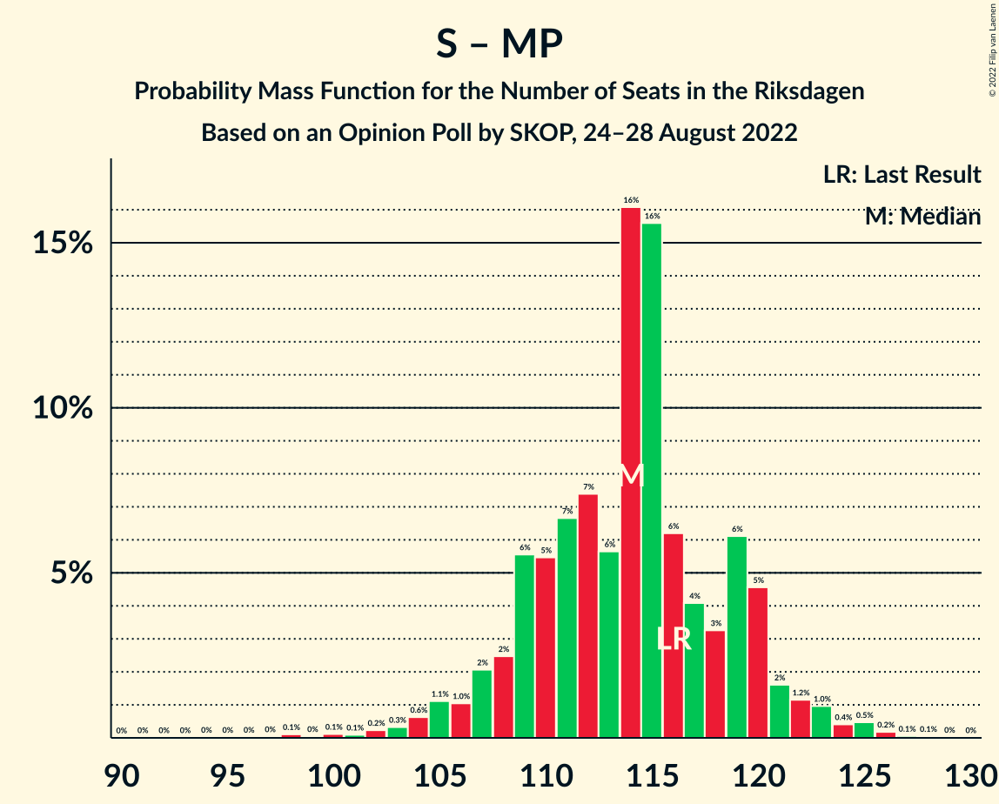

| Number of Seats | Probability | Accumulated | Special Marks |
|:---------------:|:-----------:|:-----------:|:-------------:|
| 93 | 0% | 100% |  |
| 94 | 0% | 99.9% |  |
| 95 | 0% | 99.9% |  |
| 96 | 0% | 99.9% |  |
| 97 | 0% | 99.9% |  |
| 98 | 0.1% | 99.8% |  |
| 99 | 0% | 99.7% |  |
| 100 | 0.1% | 99.7% |  |
| 101 | 0.1% | 99.6% |  |
| 102 | 0.2% | 99.5% |  |
| 103 | 0.3% | 99.2% |  |
| 104 | 0.6% | 98.9% |  |
| 105 | 1.1% | 98% |  |
| 106 | 1.0% | 97% |  |
| 107 | 2% | 96% |  |
| 108 | 2% | 94% |  |
| 109 | 6% | 92% |  |
| 110 | 5% | 86% |  |
| 111 | 7% | 81% |  |
| 112 | 7% | 74% |  |
| 113 | 6% | 67% |  |
| 114 | 16% | 61% | Median |
| 115 | 16% | 45% |  |
| 116 | 6% | 29% | Last Result |
| 117 | 4% | 23% |  |
| 118 | 3% | 19% |  |
| 119 | 6% | 16% |  |
| 120 | 5% | 10% |  |
| 121 | 2% | 5% |  |
| 122 | 1.2% | 3% |  |
| 123 | 1.0% | 2% |  |
| 124 | 0.4% | 1.2% |  |
| 125 | 0.5% | 0.8% |  |
| 126 | 0.2% | 0.3% |  |
| 127 | 0.1% | 0.2% |  |
| 128 | 0.1% | 0.1% |  |
| 129 | 0% | 0.1% |  |
| 130 | 0% | 0% |  |

### Moderata samlingspartiet – Centerpartiet

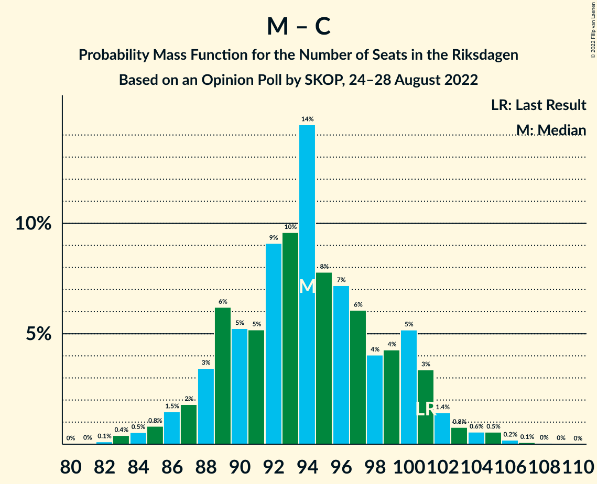

| Number of Seats | Probability | Accumulated | Special Marks |
|:---------------:|:-----------:|:-----------:|:-------------:|
| 81 | 0% | 100% |  |
| 82 | 0.1% | 99.9% |  |
| 83 | 0.4% | 99.8% |  |
| 84 | 0.5% | 99.4% |  |
| 85 | 0.8% | 98.9% |  |
| 86 | 1.5% | 98% |  |
| 87 | 2% | 97% |  |
| 88 | 3% | 95% |  |
| 89 | 6% | 91% |  |
| 90 | 5% | 85% |  |
| 91 | 5% | 80% |  |
| 92 | 9% | 75% |  |
| 93 | 10% | 66% |  |
| 94 | 14% | 56% | Median |
| 95 | 8% | 42% |  |
| 96 | 7% | 34% |  |
| 97 | 6% | 27% |  |
| 98 | 4% | 21% |  |
| 99 | 4% | 16% |  |
| 100 | 5% | 12% |  |
| 101 | 3% | 7% | Last Result |
| 102 | 1.4% | 4% |  |
| 103 | 0.8% | 2% |  |
| 104 | 0.6% | 1.5% |  |
| 105 | 0.5% | 0.9% |  |
| 106 | 0.2% | 0.4% |  |
| 107 | 0.1% | 0.2% |  |
| 108 | 0% | 0.1% |  |
| 109 | 0% | 0.1% |  |
| 110 | 0% | 0% |  |

## Technical Information

### Opinion Poll

+ **Polling firm:** SKOP
+ **Commissioner(s):** —
+ **Fieldwork period:** 24–28 August 2022

### Calculations

+ **Sample size:** 1349
+ **Simulations done:** 1,048,576
+ **Error estimate:** 0.98%

