# Opinion Poll by Sifo for Svenska Dagbladet, 26–28 August 2022

<a href="#voting-intentions">Voting Intentions</a> | <a href="#seats">Seats</a> | <a href="#coalitions">Coalitions</a> | <a href="#technical-information">Technical Information</a>

## Voting Intentions

### Confidence Intervals

| Party | Last Result | Poll Result | 80% Confidence Interval | 90% Confidence Interval | 95% Confidence Interval | 99% Confidence Interval |
|:-----:|:-----------:|:-----------:|:-----------------------:|:-----------------------:|:-----------------------:|:-----------------------:|
| Sveriges socialdemokratiska arbetareparti | 28.3% | 30.9% | 29.6–32.3% |29.2–32.7% |28.9–33.0% |28.2–33.7% |
| Sverigedemokraterna | 17.5% | 19.4% | 18.3–20.6% |18.0–20.9% |17.7–21.2% |17.2–21.8% |
| Moderata samlingspartiet | 19.8% | 18.0% | 16.9–19.2% |16.6–19.5% |16.4–19.8% |15.9–20.4% |
| Vänsterpartiet | 8.0% | 7.7% | 7.0–8.6% |6.8–8.8% |6.6–9.0% |6.3–9.4% |
| Centerpartiet | 8.6% | 6.4% | 5.7–7.2% |5.6–7.4% |5.4–7.6% |5.1–8.0% |
| Liberalerna | 5.5% | 5.8% | 5.2–6.5% |5.0–6.8% |4.8–6.9% |4.5–7.3% |
| Miljöpartiet de gröna | 4.4% | 5.3% | 4.7–6.0% |4.5–6.2% |4.4–6.4% |4.1–6.7% |
| Kristdemokraterna | 6.3% | 5.0% | 4.4–5.7% |4.3–5.9% |4.1–6.1% |3.9–6.4% |

*Note:* The poll result column reflects the actual value used in the calculations. Published results may vary slightly, and in addition be rounded to fewer digits.

## Seats

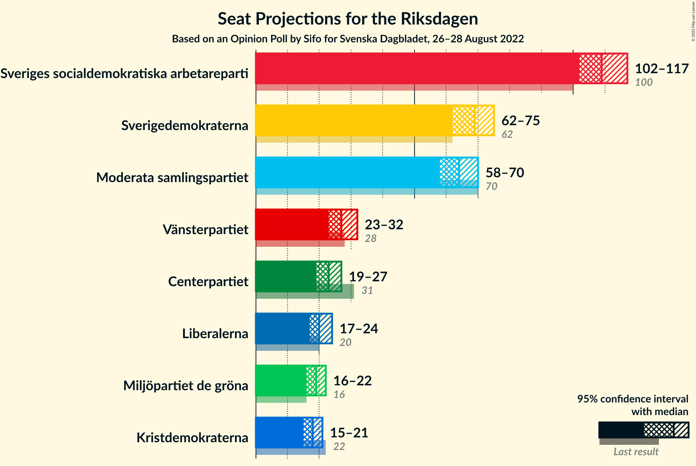

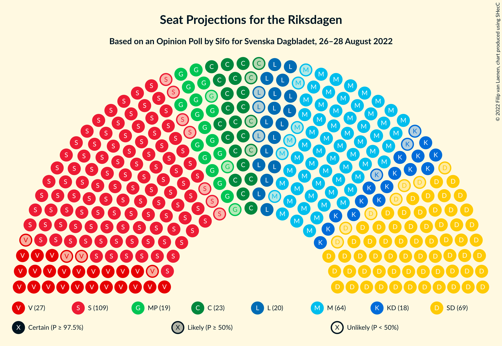

### Confidence Intervals

| Party | Last Result | Median | 80% Confidence Interval | 90% Confidence Interval | 95% Confidence Interval | 99% Confidence Interval |
|:-----:|:-----------:|:------:|:-----------------------:|:-----------------------:|:-----------------------:|:-----------------------:|
| <a href="#sveriges-socialdemokratiska-arbetareparti">Sveriges socialdemokratiska arbetareparti</a> | 100 | 109 | 104–114 |103–115 |102–117 |100–120 |
| <a href="#sverigedemokraterna">Sverigedemokraterna</a> | 62 | 69 | 64–73 |63–74 |62–75 |61–77 |
| <a href="#moderata-samlingspartiet">Moderata samlingspartiet</a> | 70 | 64 | 60–68 |59–69 |58–70 |56–72 |
| <a href="#vänsterpartiet">Vänsterpartiet</a> | 28 | 27 | 25–30 |24–31 |23–32 |22–33 |
| <a href="#centerpartiet">Centerpartiet</a> | 31 | 23 | 20–25 |20–26 |19–27 |18–28 |
| <a href="#liberalerna">Liberalerna</a> | 20 | 20 | 18–23 |18–24 |17–24 |16–26 |
| <a href="#miljöpartiet-de-gröna">Miljöpartiet de gröna</a> | 16 | 19 | 17–21 |16–22 |16–22 |15–24 |
| <a href="#kristdemokraterna">Kristdemokraterna</a> | 22 | 18 | 16–20 |15–20 |15–21 |0–23 |

### Sveriges socialdemokratiska arbetareparti

*For a full overview of the results for this party, see the [Sveriges socialdemokratiska arbetareparti](party-sverigessocialdemokratiskaarbetareparti.html) page.*

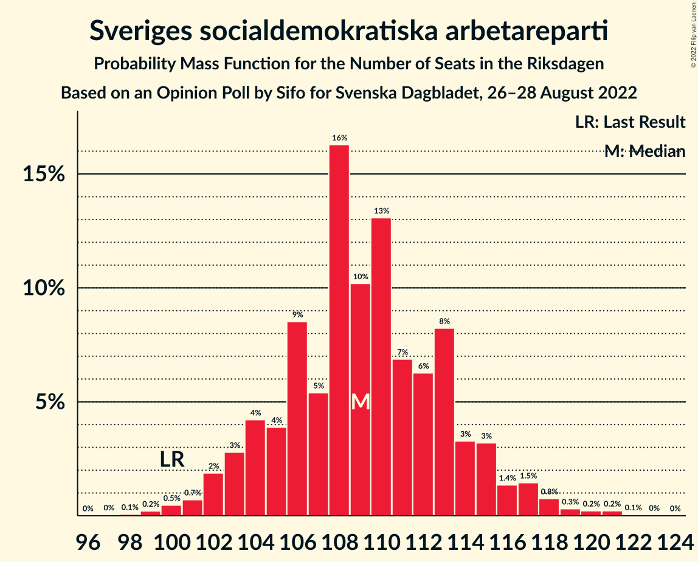

| Number of Seats | Probability | Accumulated | Special Marks |
|:---------------:|:-----------:|:-----------:|:-------------:|
| 97 | 0% | 100% |  |
| 98 | 0.1% | 99.9% |  |
| 99 | 0.2% | 99.9% |  |
| 100 | 0.5% | 99.7% | Last Result |
| 101 | 0.7% | 99.2% |  |
| 102 | 2% | 98% |  |
| 103 | 3% | 97% |  |
| 104 | 4% | 94% |  |
| 105 | 4% | 90% |  |
| 106 | 9% | 86% |  |
| 107 | 5% | 77% |  |
| 108 | 16% | 72% |  |
| 109 | 10% | 56% | Median |
| 110 | 13% | 45% |  |
| 111 | 7% | 32% |  |
| 112 | 6% | 25% |  |
| 113 | 8% | 19% |  |
| 114 | 3% | 11% |  |
| 115 | 3% | 8% |  |
| 116 | 1.4% | 4% |  |
| 117 | 1.5% | 3% |  |
| 118 | 0.8% | 2% |  |
| 119 | 0.3% | 0.9% |  |
| 120 | 0.2% | 0.5% |  |
| 121 | 0.2% | 0.3% |  |
| 122 | 0.1% | 0.1% |  |
| 123 | 0% | 0.1% |  |
| 124 | 0% | 0% |  |

### Sverigedemokraterna

*For a full overview of the results for this party, see the [Sverigedemokraterna](party-sverigedemokraterna.html) page.*

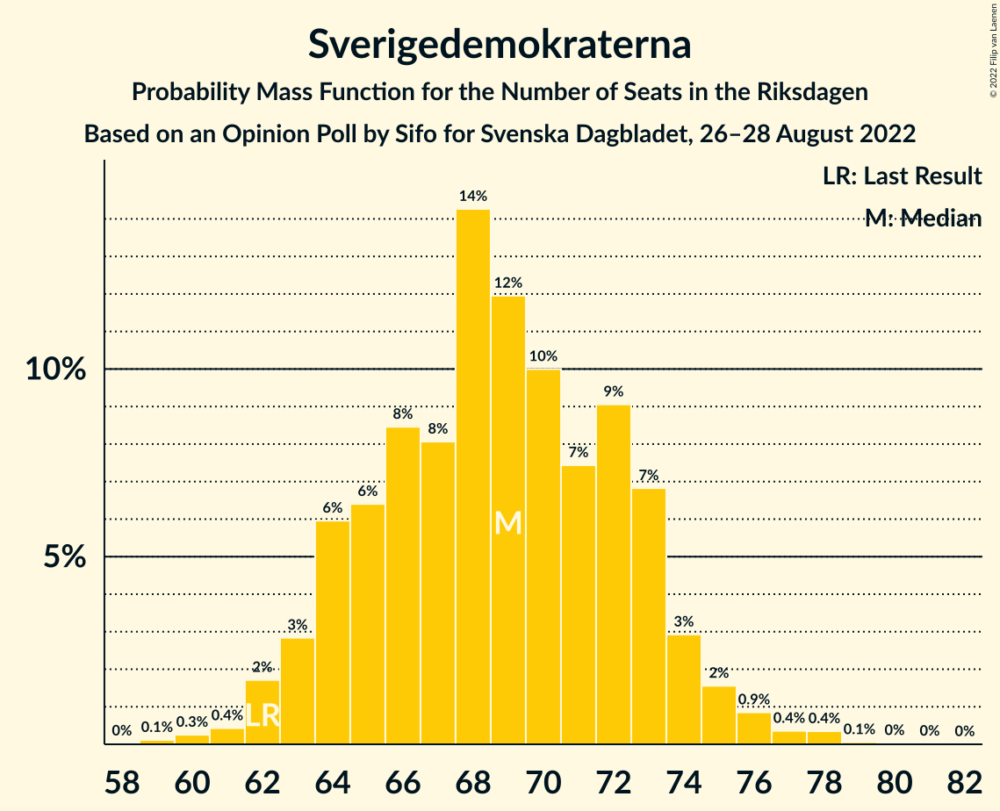

| Number of Seats | Probability | Accumulated | Special Marks |
|:---------------:|:-----------:|:-----------:|:-------------:|
| 59 | 0.1% | 100% |  |
| 60 | 0.3% | 99.8% |  |
| 61 | 0.4% | 99.6% |  |
| 62 | 2% | 99.2% | Last Result |
| 63 | 3% | 97% |  |
| 64 | 6% | 95% |  |
| 65 | 6% | 89% |  |
| 66 | 8% | 82% |  |
| 67 | 8% | 74% |  |
| 68 | 14% | 66% |  |
| 69 | 12% | 51% | Median |
| 70 | 10% | 39% |  |
| 71 | 7% | 29% |  |
| 72 | 9% | 22% |  |
| 73 | 7% | 13% |  |
| 74 | 3% | 6% |  |
| 75 | 2% | 3% |  |
| 76 | 0.9% | 2% |  |
| 77 | 0.4% | 0.8% |  |
| 78 | 0.4% | 0.5% |  |
| 79 | 0.1% | 0.1% |  |
| 80 | 0% | 0.1% |  |
| 81 | 0% | 0% |  |

### Moderata samlingspartiet

*For a full overview of the results for this party, see the [Moderata samlingspartiet](party-moderatasamlingspartiet.html) page.*

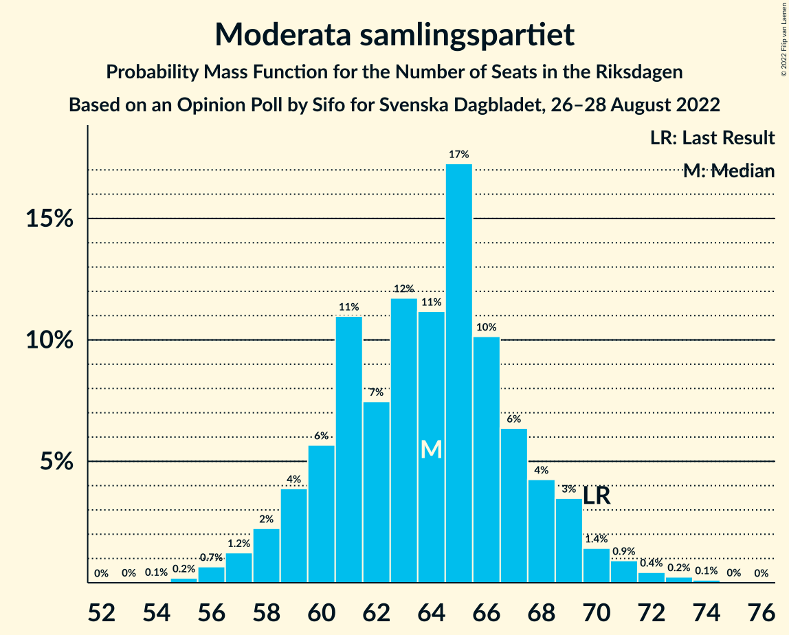

| Number of Seats | Probability | Accumulated | Special Marks |
|:---------------:|:-----------:|:-----------:|:-------------:|
| 54 | 0.1% | 100% |  |
| 55 | 0.2% | 99.9% |  |
| 56 | 0.7% | 99.7% |  |
| 57 | 1.2% | 99.1% |  |
| 58 | 2% | 98% |  |
| 59 | 4% | 96% |  |
| 60 | 6% | 92% |  |
| 61 | 11% | 86% |  |
| 62 | 7% | 75% |  |
| 63 | 12% | 68% |  |
| 64 | 11% | 56% | Median |
| 65 | 17% | 45% |  |
| 66 | 10% | 27% |  |
| 67 | 6% | 17% |  |
| 68 | 4% | 11% |  |
| 69 | 3% | 7% |  |
| 70 | 1.4% | 3% | Last Result |
| 71 | 0.9% | 2% |  |
| 72 | 0.4% | 0.8% |  |
| 73 | 0.2% | 0.4% |  |
| 74 | 0.1% | 0.2% |  |
| 75 | 0% | 0% |  |

### Vänsterpartiet

*For a full overview of the results for this party, see the [Vänsterpartiet](party-vänsterpartiet.html) page.*

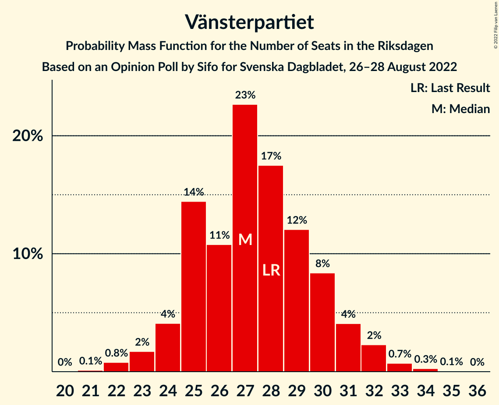

| Number of Seats | Probability | Accumulated | Special Marks |
|:---------------:|:-----------:|:-----------:|:-------------:|
| 21 | 0.1% | 100% |  |
| 22 | 0.8% | 99.9% |  |
| 23 | 2% | 99.1% |  |
| 24 | 4% | 97% |  |
| 25 | 14% | 93% |  |
| 26 | 11% | 79% |  |
| 27 | 23% | 68% | Median |
| 28 | 17% | 45% | Last Result |
| 29 | 12% | 28% |  |
| 30 | 8% | 16% |  |
| 31 | 4% | 7% |  |
| 32 | 2% | 3% |  |
| 33 | 0.7% | 1.1% |  |
| 34 | 0.3% | 0.4% |  |
| 35 | 0.1% | 0.1% |  |
| 36 | 0% | 0% |  |

### Centerpartiet

*For a full overview of the results for this party, see the [Centerpartiet](party-centerpartiet.html) page.*

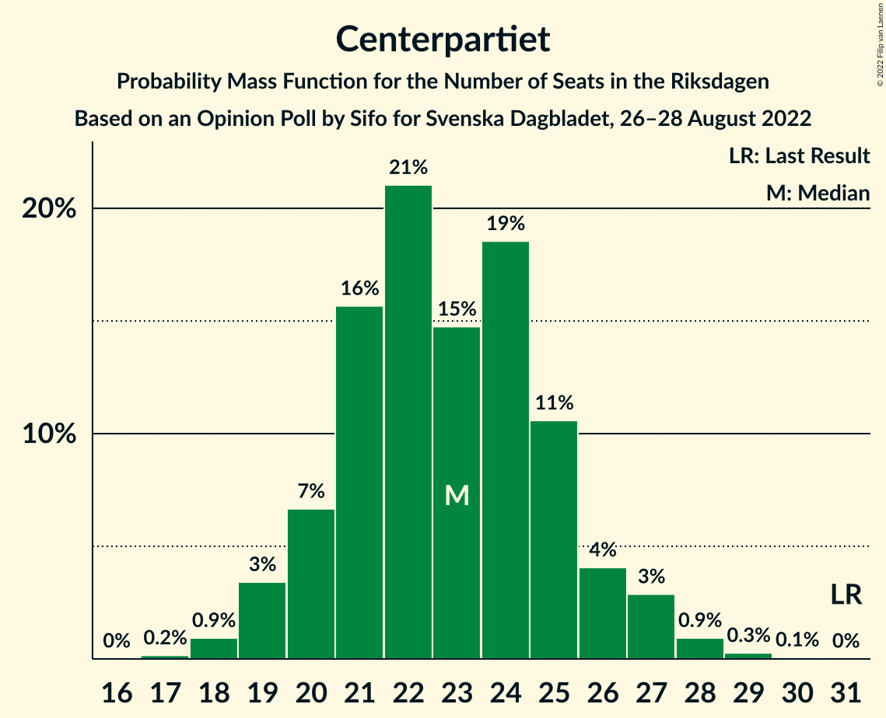

| Number of Seats | Probability | Accumulated | Special Marks |
|:---------------:|:-----------:|:-----------:|:-------------:|
| 17 | 0.2% | 100% |  |
| 18 | 0.9% | 99.8% |  |
| 19 | 3% | 98.9% |  |
| 20 | 7% | 95% |  |
| 21 | 16% | 89% |  |
| 22 | 21% | 73% |  |
| 23 | 15% | 52% | Median |
| 24 | 19% | 37% |  |
| 25 | 11% | 19% |  |
| 26 | 4% | 8% |  |
| 27 | 3% | 4% |  |
| 28 | 0.9% | 1.3% |  |
| 29 | 0.3% | 0.4% |  |
| 30 | 0.1% | 0.1% |  |
| 31 | 0% | 0% | Last Result |

### Liberalerna

*For a full overview of the results for this party, see the [Liberalerna](party-liberalerna.html) page.*

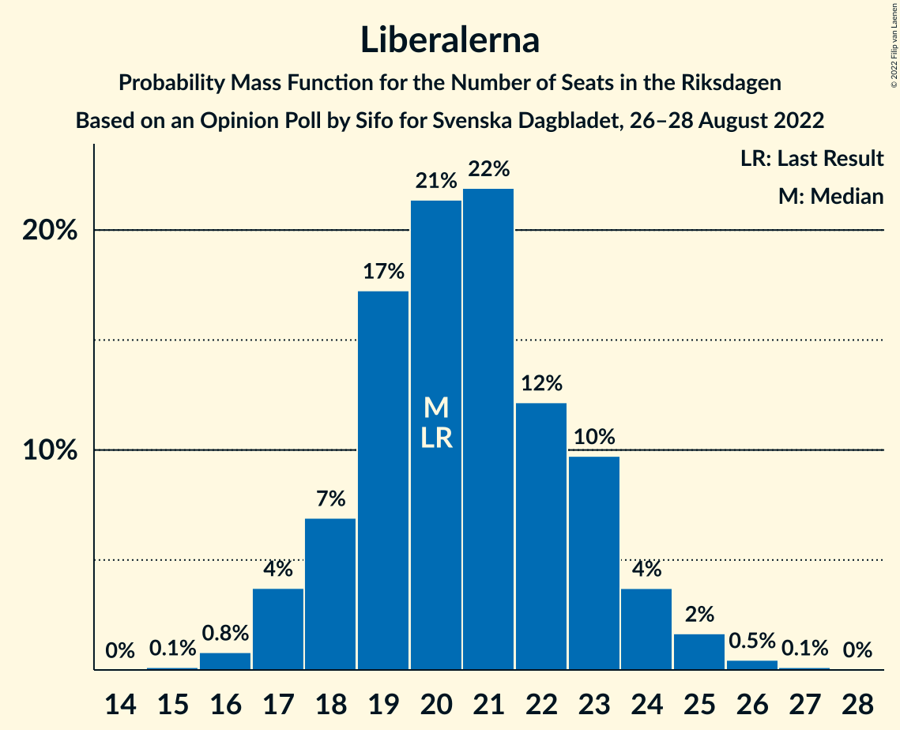

| Number of Seats | Probability | Accumulated | Special Marks |
|:---------------:|:-----------:|:-----------:|:-------------:|
| 15 | 0.1% | 100% |  |
| 16 | 0.8% | 99.9% |  |
| 17 | 4% | 99.1% |  |
| 18 | 7% | 95% |  |
| 19 | 17% | 88% |  |
| 20 | 21% | 71% | Last Result, Median |
| 21 | 22% | 50% |  |
| 22 | 12% | 28% |  |
| 23 | 10% | 16% |  |
| 24 | 4% | 6% |  |
| 25 | 2% | 2% |  |
| 26 | 0.5% | 0.6% |  |
| 27 | 0.1% | 0.2% |  |
| 28 | 0% | 0% |  |

### Miljöpartiet de gröna

*For a full overview of the results for this party, see the [Miljöpartiet de gröna](party-miljöpartietdegröna.html) page.*

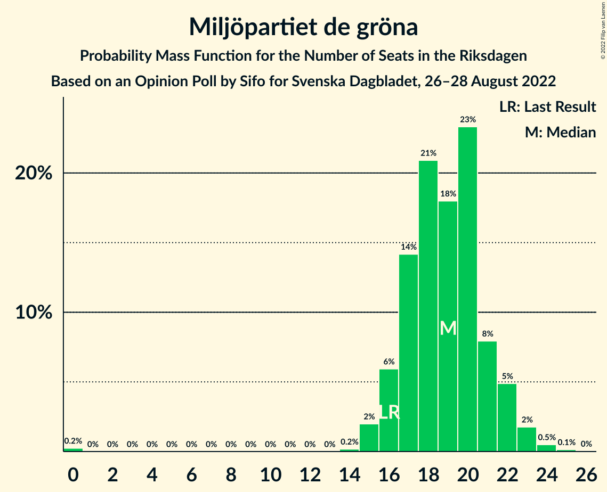

| Number of Seats | Probability | Accumulated | Special Marks |
|:---------------:|:-----------:|:-----------:|:-------------:|
| 0 | 0.2% | 100% |  |
| 1 | 0% | 99.8% |  |
| 2 | 0% | 99.8% |  |
| 3 | 0% | 99.8% |  |
| 4 | 0% | 99.8% |  |
| 5 | 0% | 99.8% |  |
| 6 | 0% | 99.8% |  |
| 7 | 0% | 99.8% |  |
| 8 | 0% | 99.8% |  |
| 9 | 0% | 99.8% |  |
| 10 | 0% | 99.8% |  |
| 11 | 0% | 99.8% |  |
| 12 | 0% | 99.8% |  |
| 13 | 0% | 99.8% |  |
| 14 | 0.2% | 99.8% |  |
| 15 | 2% | 99.6% |  |
| 16 | 6% | 98% | Last Result |
| 17 | 14% | 92% |  |
| 18 | 21% | 77% |  |
| 19 | 18% | 57% | Median |
| 20 | 23% | 39% |  |
| 21 | 8% | 15% |  |
| 22 | 5% | 7% |  |
| 23 | 2% | 2% |  |
| 24 | 0.5% | 0.7% |  |
| 25 | 0.1% | 0.2% |  |
| 26 | 0% | 0% |  |

### Kristdemokraterna

*For a full overview of the results for this party, see the [Kristdemokraterna](party-kristdemokraterna.html) page.*

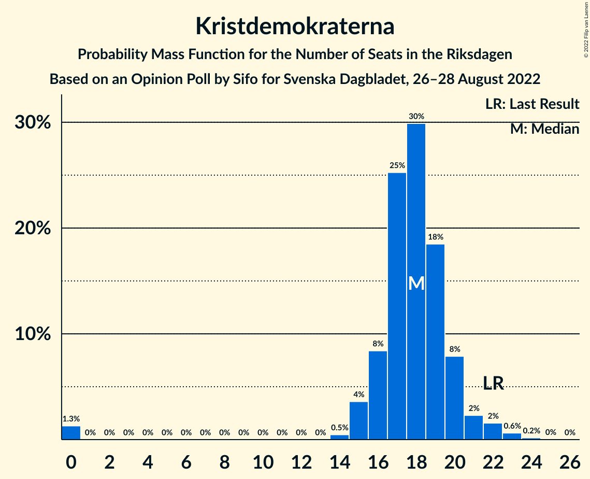

| Number of Seats | Probability | Accumulated | Special Marks |
|:---------------:|:-----------:|:-----------:|:-------------:|
| 0 | 1.3% | 100% |  |
| 1 | 0% | 98.7% |  |
| 2 | 0% | 98.7% |  |
| 3 | 0% | 98.7% |  |
| 4 | 0% | 98.7% |  |
| 5 | 0% | 98.7% |  |
| 6 | 0% | 98.7% |  |
| 7 | 0% | 98.7% |  |
| 8 | 0% | 98.7% |  |
| 9 | 0% | 98.7% |  |
| 10 | 0% | 98.7% |  |
| 11 | 0% | 98.7% |  |
| 12 | 0% | 98.7% |  |
| 13 | 0% | 98.7% |  |
| 14 | 0.5% | 98.7% |  |
| 15 | 4% | 98% |  |
| 16 | 8% | 95% |  |
| 17 | 25% | 86% |  |
| 18 | 30% | 61% | Median |
| 19 | 18% | 31% |  |
| 20 | 8% | 13% |  |
| 21 | 2% | 5% |  |
| 22 | 2% | 2% | Last Result |
| 23 | 0.6% | 0.8% |  |
| 24 | 0.2% | 0.2% |  |
| 25 | 0% | 0% |  |

## Coalitions

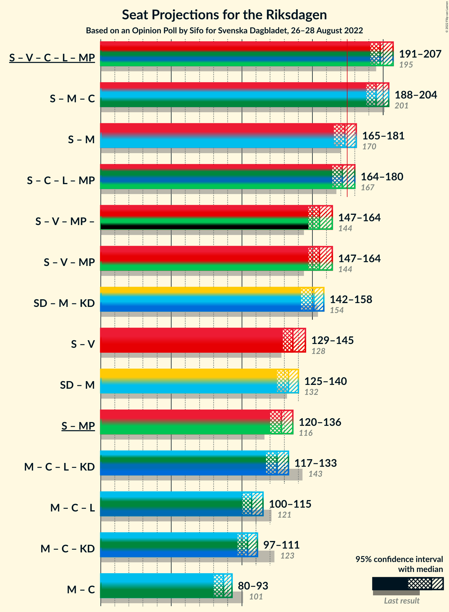

### Confidence Intervals

| Coalition | Last Result | Median | Majority? | 80% Confidence Interval | 90% Confidence Interval | 95% Confidence Interval | 99% Confidence Interval |
|:---------:|:-----------:|:------:|:---------:|:-----------------------:|:-----------------------:|:-----------------------:|:-----------------------:|
| Sveriges socialdemokratiska arbetareparti – Vänsterpartiet – Centerpartiet – Liberalerna – Miljöpartiet de gröna | 195 | 198 | 100% | 194–204 | 192–206 | 191–207 | 188–212 |
| Sveriges socialdemokratiska arbetareparti – Moderata samlingspartiet – Centerpartiet | 201 | 195 | 100% | 191–201 | 189–202 | 188–204 | 186–209 |
| Sveriges socialdemokratiska arbetareparti – Moderata samlingspartiet | 170 | 173 | 29% | 168–178 | 166–179 | 165–181 | 162–185 |
| Sveriges socialdemokratiska arbetareparti – Centerpartiet – Liberalerna – Miljöpartiet de gröna | 167 | 171 | 23% | 166–176 | 165–178 | 164–180 | 161–184 |
| Sveriges socialdemokratiska arbetareparti – Vänsterpartiet – Miljöpartiet de gröna | 144 | 155 | 0% | 150–161 | 149–162 | 147–164 | 145–167 |
| Sverigedemokraterna – Moderata samlingspartiet – Kristdemokraterna | 154 | 151 | 0% | 145–155 | 143–157 | 142–158 | 137–161 |
| Sveriges socialdemokratiska arbetareparti – Vänsterpartiet | 128 | 136 | 0% | 132–142 | 130–143 | 129–145 | 127–148 |
| Sverigedemokraterna – Moderata samlingspartiet | 132 | 133 | 0% | 127–137 | 126–139 | 125–140 | 123–144 |
| Sveriges socialdemokratiska arbetareparti – Miljöpartiet de gröna | 116 | 128 | 0% | 123–133 | 121–134 | 120–136 | 118–139 |
| Moderata samlingspartiet – Centerpartiet – Liberalerna – Kristdemokraterna | 143 | 125 | 0% | 120–130 | 119–131 | 117–133 | 112–135 |
| Moderata samlingspartiet – Centerpartiet – Liberalerna | 121 | 107 | 0% | 102–112 | 101–113 | 100–115 | 98–117 |
| Moderata samlingspartiet – Centerpartiet – Kristdemokraterna | 123 | 104 | 0% | 100–109 | 98–110 | 97–111 | 90–114 |
| Moderata samlingspartiet – Centerpartiet | 101 | 87 | 0% | 82–91 | 81–92 | 80–93 | 78–96 |

### Sveriges socialdemokratiska arbetareparti – Vänsterpartiet – Centerpartiet – Liberalerna – Miljöpartiet de gröna

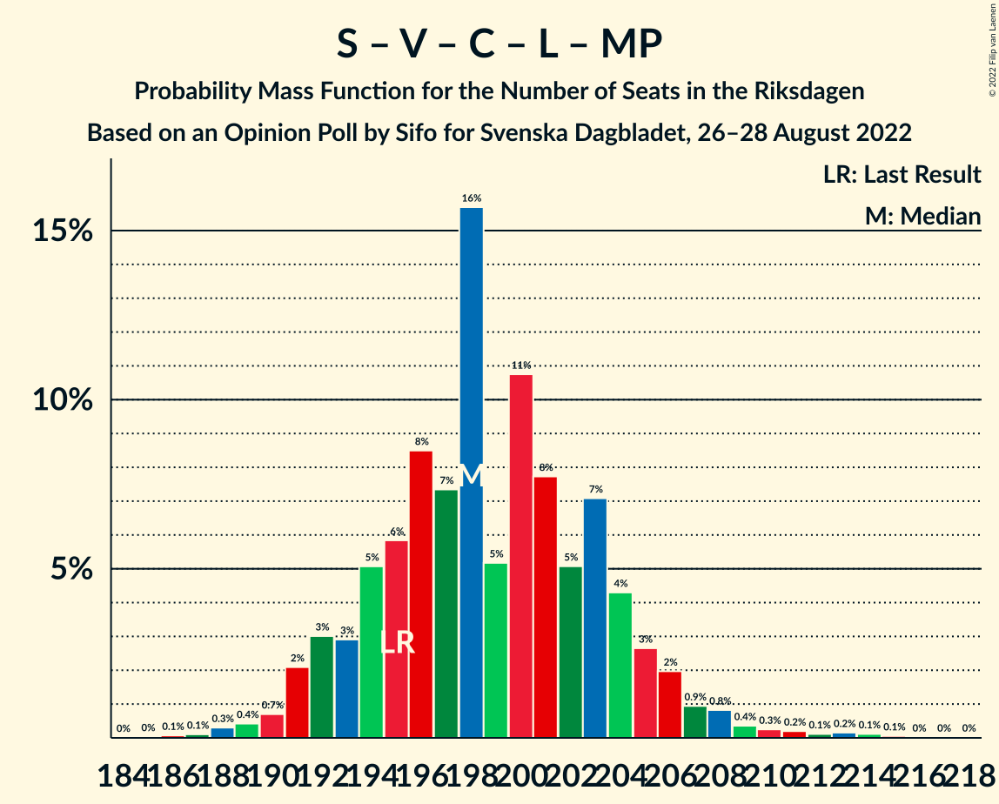

| Number of Seats | Probability | Accumulated | Special Marks |
|:---------------:|:-----------:|:-----------:|:-------------:|
| 185 | 0% | 100% |  |
| 186 | 0.1% | 99.9% |  |
| 187 | 0.1% | 99.9% |  |
| 188 | 0.3% | 99.8% |  |
| 189 | 0.4% | 99.4% |  |
| 190 | 0.7% | 99.0% |  |
| 191 | 2% | 98% |  |
| 192 | 3% | 96% |  |
| 193 | 3% | 93% |  |
| 194 | 5% | 90% |  |
| 195 | 6% | 85% | Last Result |
| 196 | 8% | 79% |  |
| 197 | 7% | 71% |  |
| 198 | 16% | 64% | Median |
| 199 | 5% | 48% |  |
| 200 | 11% | 43% |  |
| 201 | 8% | 32% |  |
| 202 | 5% | 24% |  |
| 203 | 7% | 19% |  |
| 204 | 4% | 12% |  |
| 205 | 3% | 8% |  |
| 206 | 2% | 5% |  |
| 207 | 0.9% | 3% |  |
| 208 | 0.8% | 2% |  |
| 209 | 0.4% | 1.3% |  |
| 210 | 0.3% | 1.0% |  |
| 211 | 0.2% | 0.7% |  |
| 212 | 0.1% | 0.5% |  |
| 213 | 0.2% | 0.4% |  |
| 214 | 0.1% | 0.3% |  |
| 215 | 0.1% | 0.1% |  |
| 216 | 0% | 0.1% |  |
| 217 | 0% | 0.1% |  |
| 218 | 0% | 0% |  |

### Sveriges socialdemokratiska arbetareparti – Moderata samlingspartiet – Centerpartiet

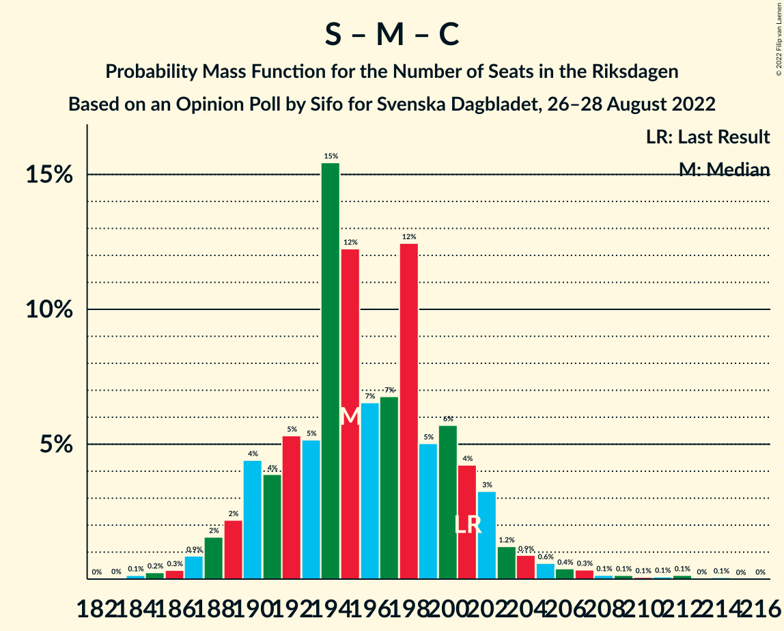

| Number of Seats | Probability | Accumulated | Special Marks |
|:---------------:|:-----------:|:-----------:|:-------------:|
| 183 | 0% | 100% |  |
| 184 | 0.1% | 99.9% |  |
| 185 | 0.2% | 99.8% |  |
| 186 | 0.3% | 99.5% |  |
| 187 | 0.9% | 99.2% |  |
| 188 | 2% | 98% |  |
| 189 | 2% | 97% |  |
| 190 | 4% | 95% |  |
| 191 | 4% | 90% |  |
| 192 | 5% | 86% |  |
| 193 | 5% | 81% |  |
| 194 | 15% | 76% |  |
| 195 | 12% | 60% |  |
| 196 | 7% | 48% | Median |
| 197 | 7% | 42% |  |
| 198 | 12% | 35% |  |
| 199 | 5% | 22% |  |
| 200 | 6% | 17% |  |
| 201 | 4% | 12% | Last Result |
| 202 | 3% | 7% |  |
| 203 | 1.2% | 4% |  |
| 204 | 0.9% | 3% |  |
| 205 | 0.6% | 2% |  |
| 206 | 0.4% | 1.4% |  |
| 207 | 0.3% | 1.1% |  |
| 208 | 0.1% | 0.7% |  |
| 209 | 0.1% | 0.6% |  |
| 210 | 0.1% | 0.4% |  |
| 211 | 0.1% | 0.4% |  |
| 212 | 0.1% | 0.3% |  |
| 213 | 0% | 0.1% |  |
| 214 | 0.1% | 0.1% |  |
| 215 | 0% | 0% |  |

### Sveriges socialdemokratiska arbetareparti – Moderata samlingspartiet

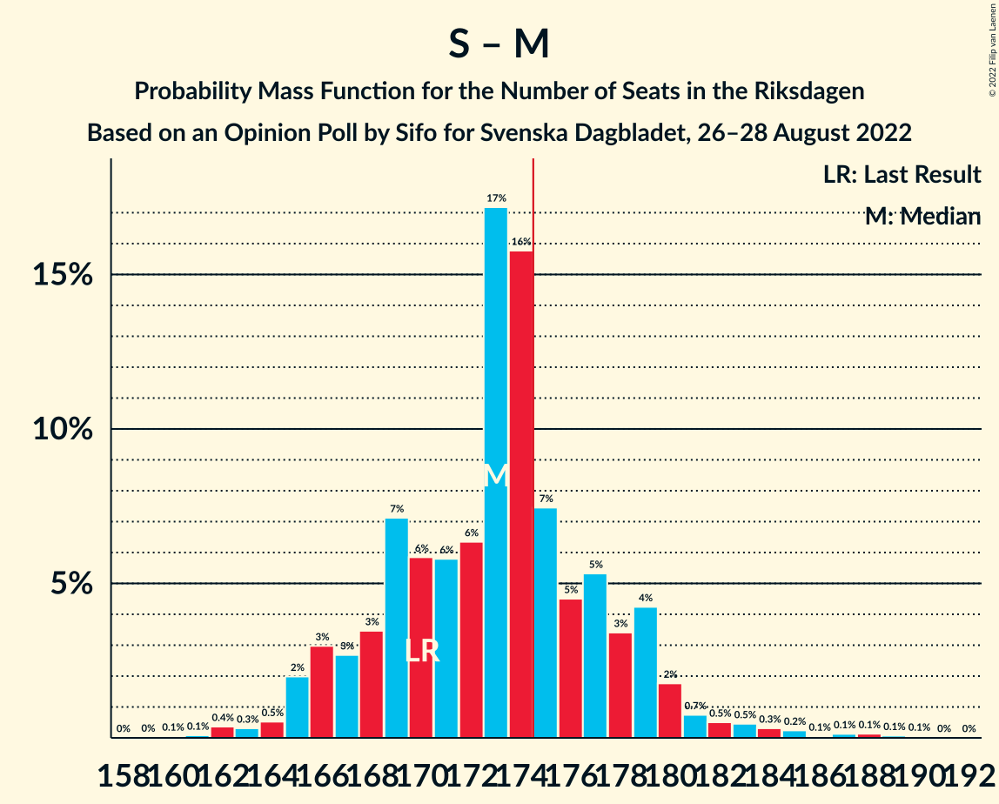

| Number of Seats | Probability | Accumulated | Special Marks |
|:---------------:|:-----------:|:-----------:|:-------------:|
| 160 | 0.1% | 100% |  |
| 161 | 0.1% | 99.9% |  |
| 162 | 0.4% | 99.8% |  |
| 163 | 0.3% | 99.5% |  |
| 164 | 0.5% | 99.1% |  |
| 165 | 2% | 98.6% |  |
| 166 | 3% | 97% |  |
| 167 | 3% | 94% |  |
| 168 | 3% | 91% |  |
| 169 | 7% | 88% |  |
| 170 | 6% | 80% | Last Result |
| 171 | 6% | 75% |  |
| 172 | 6% | 69% |  |
| 173 | 17% | 62% | Median |
| 174 | 16% | 45% |  |
| 175 | 7% | 29% | Majority |
| 176 | 5% | 22% |  |
| 177 | 5% | 17% |  |
| 178 | 3% | 12% |  |
| 179 | 4% | 9% |  |
| 180 | 2% | 5% |  |
| 181 | 0.7% | 3% |  |
| 182 | 0.5% | 2% |  |
| 183 | 0.5% | 1.5% |  |
| 184 | 0.3% | 1.0% |  |
| 185 | 0.2% | 0.7% |  |
| 186 | 0.1% | 0.5% |  |
| 187 | 0.1% | 0.4% |  |
| 188 | 0.1% | 0.3% |  |
| 189 | 0.1% | 0.2% |  |
| 190 | 0.1% | 0.1% |  |
| 191 | 0% | 0% |  |

### Sveriges socialdemokratiska arbetareparti – Centerpartiet – Liberalerna – Miljöpartiet de gröna

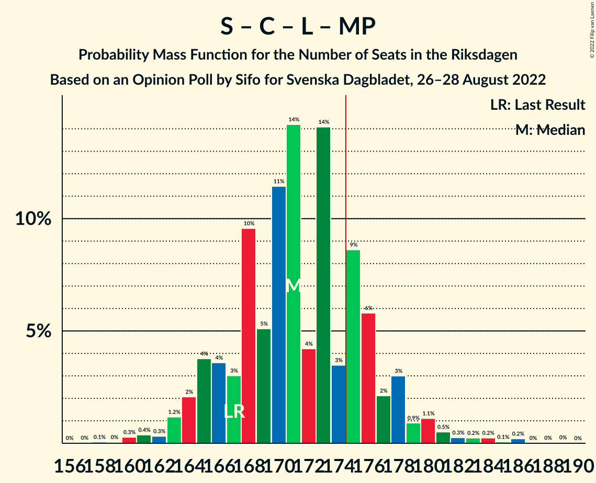

| Number of Seats | Probability | Accumulated | Special Marks |
|:---------------:|:-----------:|:-----------:|:-------------:|
| 157 | 0% | 100% |  |
| 158 | 0.1% | 99.9% |  |
| 159 | 0% | 99.9% |  |
| 160 | 0.3% | 99.8% |  |
| 161 | 0.4% | 99.5% |  |
| 162 | 0.3% | 99.2% |  |
| 163 | 1.2% | 98.9% |  |
| 164 | 2% | 98% |  |
| 165 | 4% | 96% |  |
| 166 | 4% | 92% |  |
| 167 | 3% | 88% | Last Result |
| 168 | 10% | 85% |  |
| 169 | 5% | 76% |  |
| 170 | 11% | 71% |  |
| 171 | 14% | 59% | Median |
| 172 | 4% | 45% |  |
| 173 | 14% | 41% |  |
| 174 | 3% | 27% |  |
| 175 | 9% | 23% | Majority |
| 176 | 6% | 15% |  |
| 177 | 2% | 9% |  |
| 178 | 3% | 7% |  |
| 179 | 0.9% | 4% |  |
| 180 | 1.1% | 3% |  |
| 181 | 0.5% | 2% |  |
| 182 | 0.3% | 1.1% |  |
| 183 | 0.2% | 0.8% |  |
| 184 | 0.2% | 0.6% |  |
| 185 | 0.1% | 0.4% |  |
| 186 | 0.2% | 0.3% |  |
| 187 | 0% | 0.1% |  |
| 188 | 0% | 0.1% |  |
| 189 | 0% | 0.1% |  |
| 190 | 0% | 0% |  |

### Sveriges socialdemokratiska arbetareparti – Vänsterpartiet – Miljöpartiet de gröna

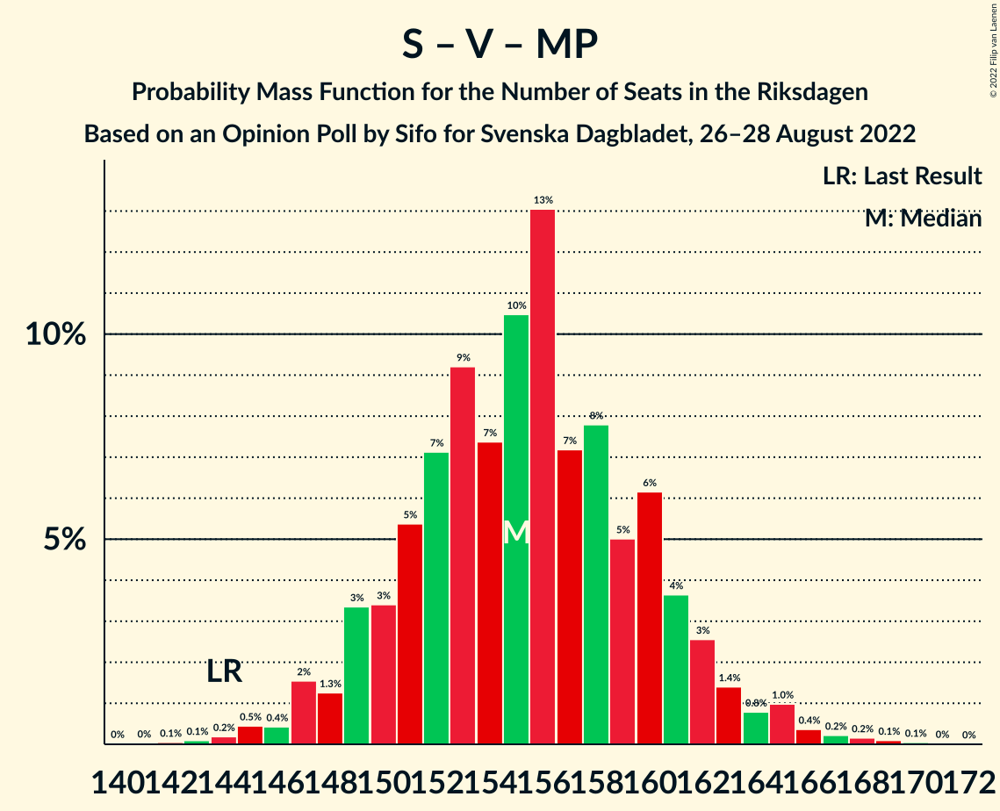

| Number of Seats | Probability | Accumulated | Special Marks |
|:---------------:|:-----------:|:-----------:|:-------------:|
| 140 | 0% | 100% |  |
| 141 | 0% | 99.9% |  |
| 142 | 0.1% | 99.9% |  |
| 143 | 0.1% | 99.9% |  |
| 144 | 0.2% | 99.8% | Last Result |
| 145 | 0.5% | 99.6% |  |
| 146 | 0.4% | 99.1% |  |
| 147 | 2% | 98.7% |  |
| 148 | 1.3% | 97% |  |
| 149 | 3% | 96% |  |
| 150 | 3% | 93% |  |
| 151 | 5% | 89% |  |
| 152 | 7% | 84% |  |
| 153 | 9% | 77% |  |
| 154 | 7% | 67% |  |
| 155 | 10% | 60% | Median |
| 156 | 13% | 50% |  |
| 157 | 7% | 36% |  |
| 158 | 8% | 29% |  |
| 159 | 5% | 22% |  |
| 160 | 6% | 16% |  |
| 161 | 4% | 10% |  |
| 162 | 3% | 7% |  |
| 163 | 1.4% | 4% |  |
| 164 | 0.8% | 3% |  |
| 165 | 1.0% | 2% |  |
| 166 | 0.4% | 0.9% |  |
| 167 | 0.2% | 0.6% |  |
| 168 | 0.2% | 0.4% |  |
| 169 | 0.1% | 0.2% |  |
| 170 | 0.1% | 0.1% |  |
| 171 | 0% | 0% |  |

### Sverigedemokraterna – Moderata samlingspartiet – Kristdemokraterna

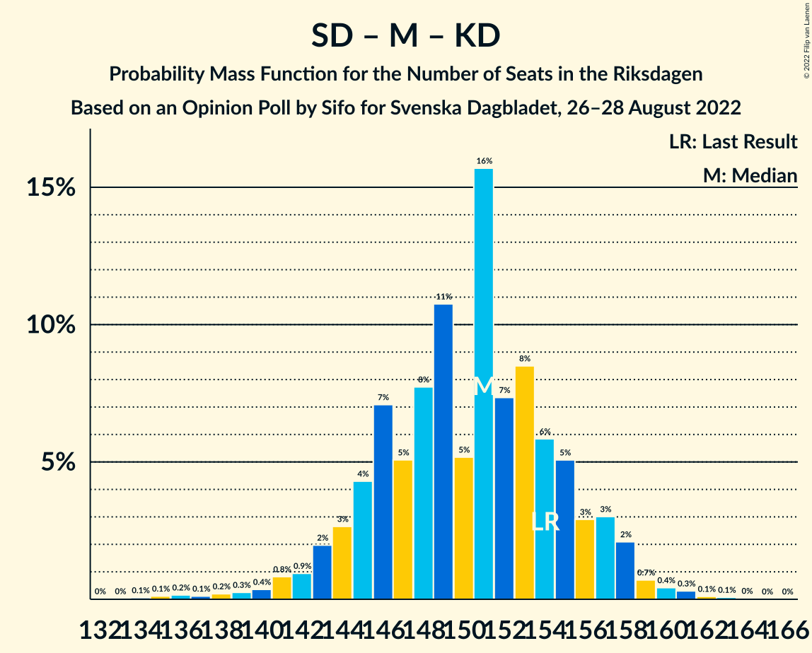

| Number of Seats | Probability | Accumulated | Special Marks |
|:---------------:|:-----------:|:-----------:|:-------------:|
| 132 | 0% | 100% |  |
| 133 | 0% | 99.9% |  |
| 134 | 0.1% | 99.9% |  |
| 135 | 0.1% | 99.9% |  |
| 136 | 0.2% | 99.7% |  |
| 137 | 0.1% | 99.6% |  |
| 138 | 0.2% | 99.5% |  |
| 139 | 0.3% | 99.3% |  |
| 140 | 0.4% | 99.0% |  |
| 141 | 0.8% | 98.7% |  |
| 142 | 0.9% | 98% |  |
| 143 | 2% | 97% |  |
| 144 | 3% | 95% |  |
| 145 | 4% | 92% |  |
| 146 | 7% | 88% |  |
| 147 | 5% | 81% |  |
| 148 | 8% | 76% |  |
| 149 | 11% | 68% |  |
| 150 | 5% | 57% |  |
| 151 | 16% | 52% | Median |
| 152 | 7% | 36% |  |
| 153 | 8% | 29% |  |
| 154 | 6% | 21% | Last Result |
| 155 | 5% | 15% |  |
| 156 | 3% | 10% |  |
| 157 | 3% | 7% |  |
| 158 | 2% | 4% |  |
| 159 | 0.7% | 2% |  |
| 160 | 0.4% | 1.0% |  |
| 161 | 0.3% | 0.6% |  |
| 162 | 0.1% | 0.2% |  |
| 163 | 0.1% | 0.1% |  |
| 164 | 0% | 0.1% |  |
| 165 | 0% | 0% |  |

### Sveriges socialdemokratiska arbetareparti – Vänsterpartiet

| Number of Seats | Probability | Accumulated | Special Marks |
|:---------------:|:-----------:|:-----------:|:-------------:|
| 124 | 0.1% | 100% |  |
| 125 | 0.2% | 99.9% |  |
| 126 | 0.2% | 99.7% |  |
| 127 | 0.5% | 99.5% |  |
| 128 | 0.9% | 99.0% | Last Result |
| 129 | 1.3% | 98% |  |
| 130 | 3% | 97% |  |
| 131 | 4% | 94% |  |
| 132 | 4% | 90% |  |
| 133 | 6% | 86% |  |
| 134 | 8% | 80% |  |
| 135 | 12% | 71% |  |
| 136 | 13% | 60% | Median |
| 137 | 8% | 47% |  |
| 138 | 11% | 40% |  |
| 139 | 6% | 29% |  |
| 140 | 8% | 23% |  |
| 141 | 3% | 15% |  |
| 142 | 5% | 12% |  |
| 143 | 3% | 7% |  |
| 144 | 1.3% | 4% |  |
| 145 | 1.3% | 3% |  |
| 146 | 0.6% | 2% |  |
| 147 | 0.4% | 1.0% |  |
| 148 | 0.3% | 0.6% |  |
| 149 | 0.1% | 0.3% |  |
| 150 | 0.1% | 0.2% |  |
| 151 | 0% | 0.1% |  |
| 152 | 0% | 0% |  |

### Sverigedemokraterna – Moderata samlingspartiet

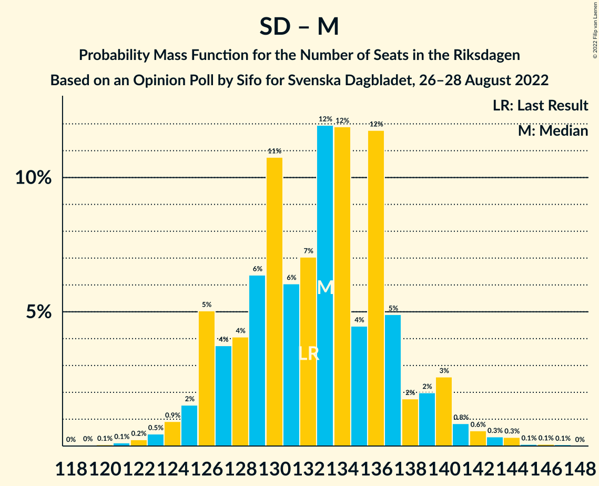

| Number of Seats | Probability | Accumulated | Special Marks |
|:---------------:|:-----------:|:-----------:|:-------------:|
| 119 | 0% | 100% |  |
| 120 | 0.1% | 99.9% |  |
| 121 | 0.1% | 99.9% |  |
| 122 | 0.2% | 99.8% |  |
| 123 | 0.5% | 99.5% |  |
| 124 | 0.9% | 99.1% |  |
| 125 | 2% | 98% |  |
| 126 | 5% | 97% |  |
| 127 | 4% | 92% |  |
| 128 | 4% | 88% |  |
| 129 | 6% | 84% |  |
| 130 | 11% | 77% |  |
| 131 | 6% | 67% |  |
| 132 | 7% | 61% | Last Result |
| 133 | 12% | 54% | Median |
| 134 | 12% | 42% |  |
| 135 | 4% | 30% |  |
| 136 | 12% | 25% |  |
| 137 | 5% | 14% |  |
| 138 | 2% | 9% |  |
| 139 | 2% | 7% |  |
| 140 | 3% | 5% |  |
| 141 | 0.8% | 2% |  |
| 142 | 0.6% | 1.5% |  |
| 143 | 0.3% | 0.9% |  |
| 144 | 0.3% | 0.5% |  |
| 145 | 0.1% | 0.2% |  |
| 146 | 0.1% | 0.1% |  |
| 147 | 0.1% | 0.1% |  |
| 148 | 0% | 0% |  |

### Sveriges socialdemokratiska arbetareparti – Miljöpartiet de gröna

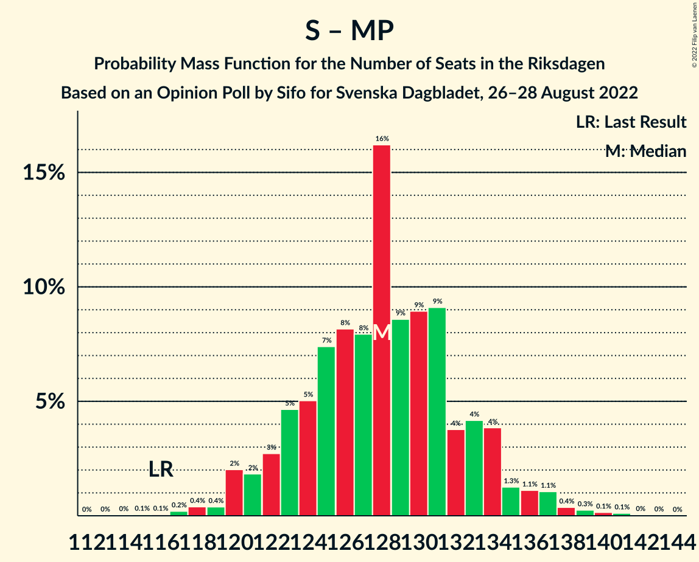

| Number of Seats | Probability | Accumulated | Special Marks |
|:---------------:|:-----------:|:-----------:|:-------------:|
| 112 | 0% | 100% |  |
| 113 | 0% | 99.9% |  |
| 114 | 0% | 99.9% |  |
| 115 | 0.1% | 99.9% |  |
| 116 | 0.1% | 99.8% | Last Result |
| 117 | 0.2% | 99.8% |  |
| 118 | 0.4% | 99.6% |  |
| 119 | 0.4% | 99.2% |  |
| 120 | 2% | 98.8% |  |
| 121 | 2% | 97% |  |
| 122 | 3% | 95% |  |
| 123 | 5% | 92% |  |
| 124 | 5% | 88% |  |
| 125 | 7% | 83% |  |
| 126 | 8% | 75% |  |
| 127 | 8% | 67% |  |
| 128 | 16% | 59% | Median |
| 129 | 9% | 43% |  |
| 130 | 9% | 34% |  |
| 131 | 9% | 25% |  |
| 132 | 4% | 16% |  |
| 133 | 4% | 12% |  |
| 134 | 4% | 8% |  |
| 135 | 1.3% | 4% |  |
| 136 | 1.1% | 3% |  |
| 137 | 1.1% | 2% |  |
| 138 | 0.4% | 1.0% |  |
| 139 | 0.3% | 0.6% |  |
| 140 | 0.1% | 0.4% |  |
| 141 | 0.1% | 0.2% |  |
| 142 | 0% | 0.1% |  |
| 143 | 0% | 0% |  |

### Moderata samlingspartiet – Centerpartiet – Liberalerna – Kristdemokraterna

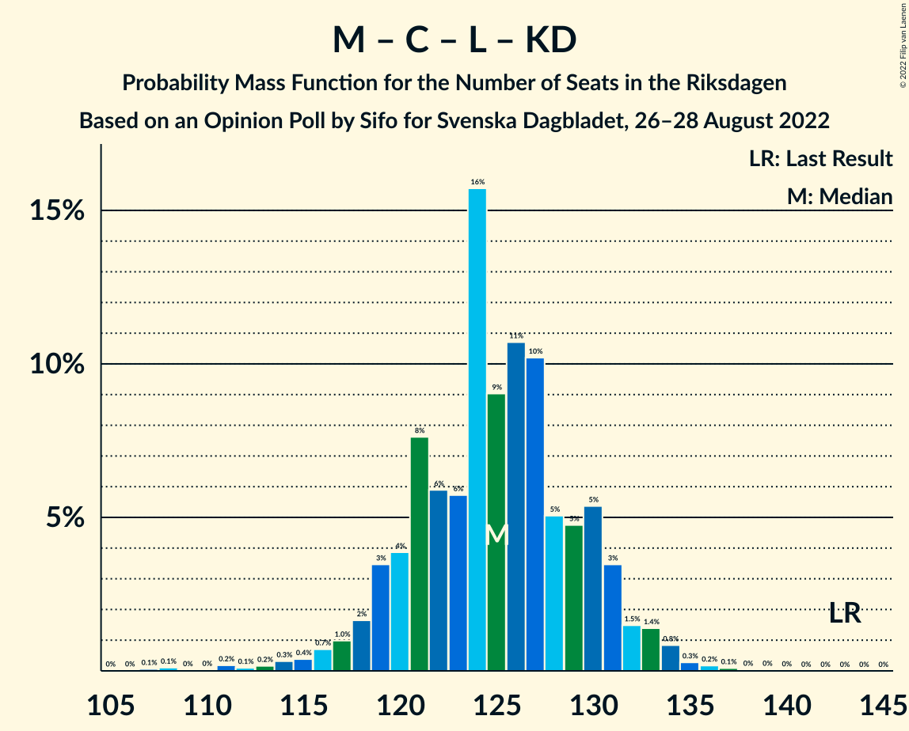

| Number of Seats | Probability | Accumulated | Special Marks |
|:---------------:|:-----------:|:-----------:|:-------------:|
| 107 | 0.1% | 100% |  |
| 108 | 0.1% | 99.9% |  |
| 109 | 0% | 99.8% |  |
| 110 | 0% | 99.8% |  |
| 111 | 0.2% | 99.7% |  |
| 112 | 0.1% | 99.5% |  |
| 113 | 0.2% | 99.5% |  |
| 114 | 0.3% | 99.3% |  |
| 115 | 0.4% | 99.0% |  |
| 116 | 0.7% | 98.6% |  |
| 117 | 1.0% | 98% |  |
| 118 | 2% | 97% |  |
| 119 | 3% | 95% |  |
| 120 | 4% | 92% |  |
| 121 | 8% | 88% |  |
| 122 | 6% | 80% |  |
| 123 | 6% | 74% |  |
| 124 | 16% | 69% |  |
| 125 | 9% | 53% | Median |
| 126 | 11% | 44% |  |
| 127 | 10% | 33% |  |
| 128 | 5% | 23% |  |
| 129 | 5% | 18% |  |
| 130 | 5% | 13% |  |
| 131 | 3% | 8% |  |
| 132 | 1.5% | 4% |  |
| 133 | 1.4% | 3% |  |
| 134 | 0.8% | 1.5% |  |
| 135 | 0.3% | 0.6% |  |
| 136 | 0.2% | 0.4% |  |
| 137 | 0.1% | 0.2% |  |
| 138 | 0% | 0.1% |  |
| 139 | 0% | 0.1% |  |
| 140 | 0% | 0% |  |
| 141 | 0% | 0% |  |
| 142 | 0% | 0% |  |
| 143 | 0% | 0% | Last Result |

### Moderata samlingspartiet – Centerpartiet – Liberalerna

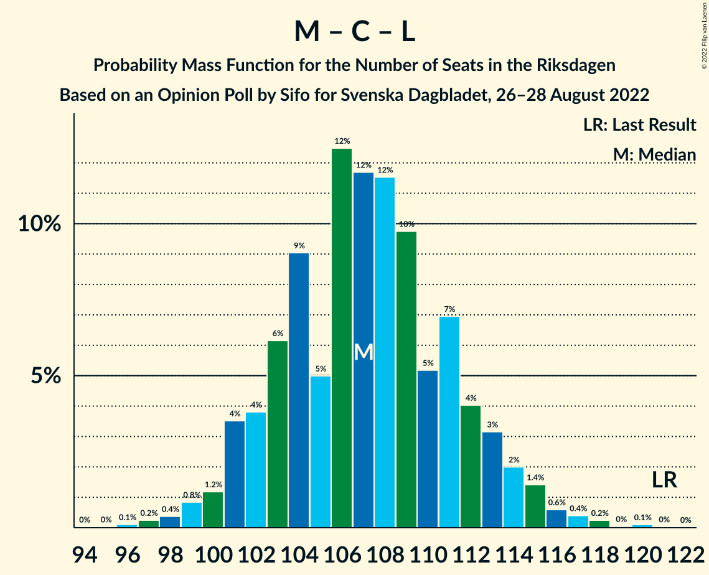

| Number of Seats | Probability | Accumulated | Special Marks |
|:---------------:|:-----------:|:-----------:|:-------------:|
| 95 | 0% | 100% |  |
| 96 | 0.1% | 99.9% |  |
| 97 | 0.2% | 99.8% |  |
| 98 | 0.4% | 99.6% |  |
| 99 | 0.8% | 99.2% |  |
| 100 | 1.2% | 98% |  |
| 101 | 4% | 97% |  |
| 102 | 4% | 94% |  |
| 103 | 6% | 90% |  |
| 104 | 9% | 84% |  |
| 105 | 5% | 75% |  |
| 106 | 12% | 70% |  |
| 107 | 12% | 57% | Median |
| 108 | 12% | 45% |  |
| 109 | 10% | 34% |  |
| 110 | 5% | 24% |  |
| 111 | 7% | 19% |  |
| 112 | 4% | 12% |  |
| 113 | 3% | 8% |  |
| 114 | 2% | 5% |  |
| 115 | 1.4% | 3% |  |
| 116 | 0.6% | 1.5% |  |
| 117 | 0.4% | 0.9% |  |
| 118 | 0.2% | 0.5% |  |
| 119 | 0% | 0.2% |  |
| 120 | 0.1% | 0.2% |  |
| 121 | 0% | 0.1% | Last Result |
| 122 | 0% | 0% |  |

### Moderata samlingspartiet – Centerpartiet – Kristdemokraterna

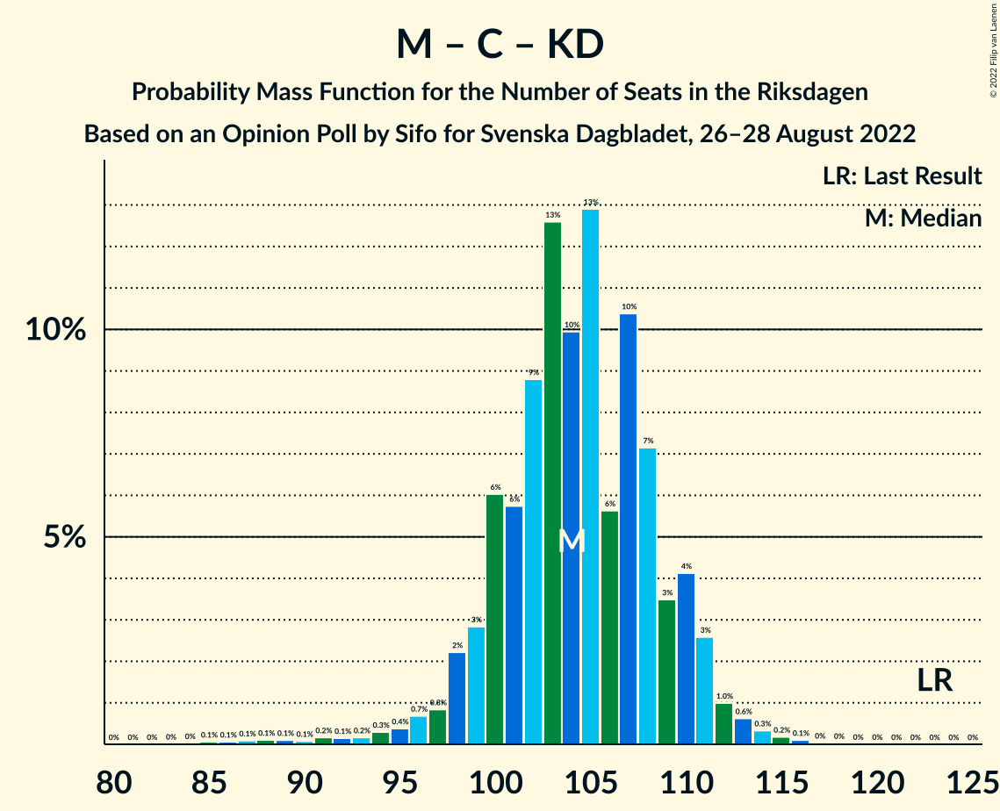

| Number of Seats | Probability | Accumulated | Special Marks |
|:---------------:|:-----------:|:-----------:|:-------------:|
| 85 | 0.1% | 100% |  |
| 86 | 0.1% | 99.9% |  |
| 87 | 0.1% | 99.8% |  |
| 88 | 0.1% | 99.7% |  |
| 89 | 0.1% | 99.6% |  |
| 90 | 0.1% | 99.5% |  |
| 91 | 0.2% | 99.5% |  |
| 92 | 0.1% | 99.3% |  |
| 93 | 0.2% | 99.1% |  |
| 94 | 0.3% | 99.0% |  |
| 95 | 0.4% | 98.7% |  |
| 96 | 0.7% | 98% |  |
| 97 | 0.8% | 98% |  |
| 98 | 2% | 97% |  |
| 99 | 3% | 95% |  |
| 100 | 6% | 92% |  |
| 101 | 6% | 86% |  |
| 102 | 9% | 80% |  |
| 103 | 13% | 71% |  |
| 104 | 10% | 59% |  |
| 105 | 13% | 49% | Median |
| 106 | 6% | 36% |  |
| 107 | 10% | 30% |  |
| 108 | 7% | 20% |  |
| 109 | 3% | 13% |  |
| 110 | 4% | 9% |  |
| 111 | 3% | 5% |  |
| 112 | 1.0% | 2% |  |
| 113 | 0.6% | 1.3% |  |
| 114 | 0.3% | 0.7% |  |
| 115 | 0.2% | 0.4% |  |
| 116 | 0.1% | 0.2% |  |
| 117 | 0% | 0.1% |  |
| 118 | 0% | 0% |  |
| 119 | 0% | 0% |  |
| 120 | 0% | 0% |  |
| 121 | 0% | 0% |  |
| 122 | 0% | 0% |  |
| 123 | 0% | 0% | Last Result |

### Moderata samlingspartiet – Centerpartiet

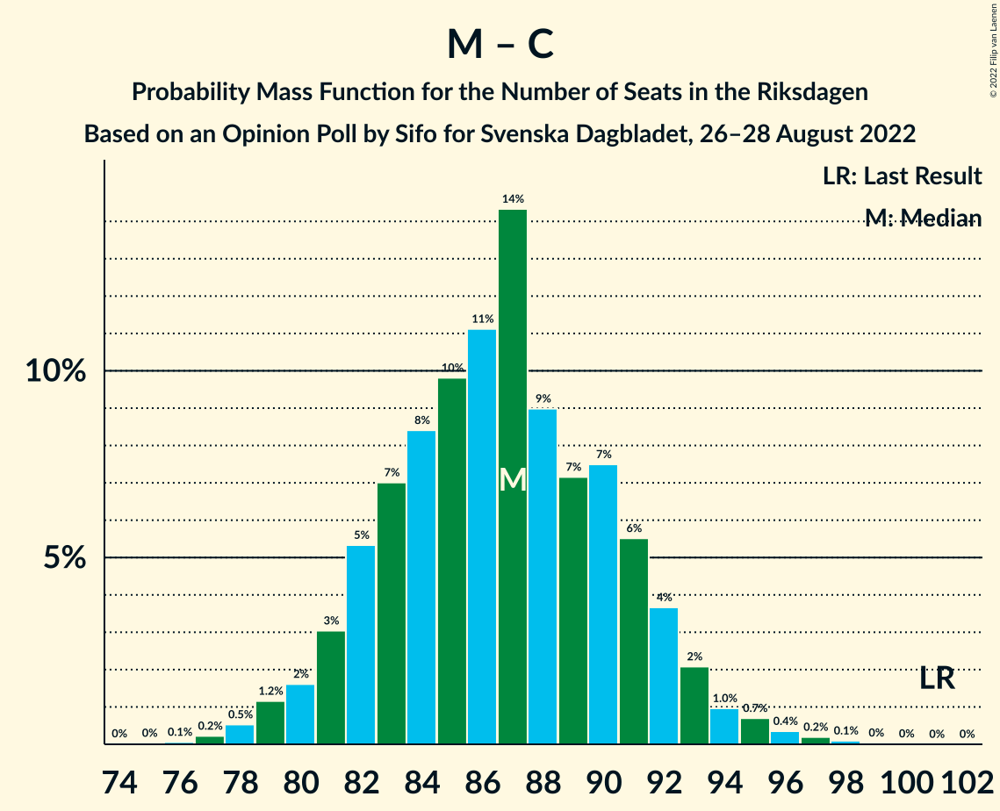

| Number of Seats | Probability | Accumulated | Special Marks |
|:---------------:|:-----------:|:-----------:|:-------------:|
| 75 | 0% | 100% |  |
| 76 | 0.1% | 99.9% |  |
| 77 | 0.2% | 99.9% |  |
| 78 | 0.5% | 99.7% |  |
| 79 | 1.2% | 99.1% |  |
| 80 | 2% | 98% |  |
| 81 | 3% | 96% |  |
| 82 | 5% | 93% |  |
| 83 | 7% | 88% |  |
| 84 | 8% | 81% |  |
| 85 | 10% | 73% |  |
| 86 | 11% | 63% |  |
| 87 | 14% | 52% | Median |
| 88 | 9% | 37% |  |
| 89 | 7% | 28% |  |
| 90 | 7% | 21% |  |
| 91 | 6% | 14% |  |
| 92 | 4% | 8% |  |
| 93 | 2% | 4% |  |
| 94 | 1.0% | 2% |  |
| 95 | 0.7% | 1.4% |  |
| 96 | 0.4% | 0.7% |  |
| 97 | 0.2% | 0.4% |  |
| 98 | 0.1% | 0.2% |  |
| 99 | 0% | 0.1% |  |
| 100 | 0% | 0% |  |
| 101 | 0% | 0% | Last Result |

## Technical Information

### Opinion Poll

+ **Polling firm:** Sifo
+ **Commissioner(s):** Svenska Dagbladet
+ **Fieldwork period:** 26–28 August 2022

### Calculations

+ **Sample size:** 1932
+ **Simulations done:** 1,048,576
+ **Error estimate:** 0.70%

