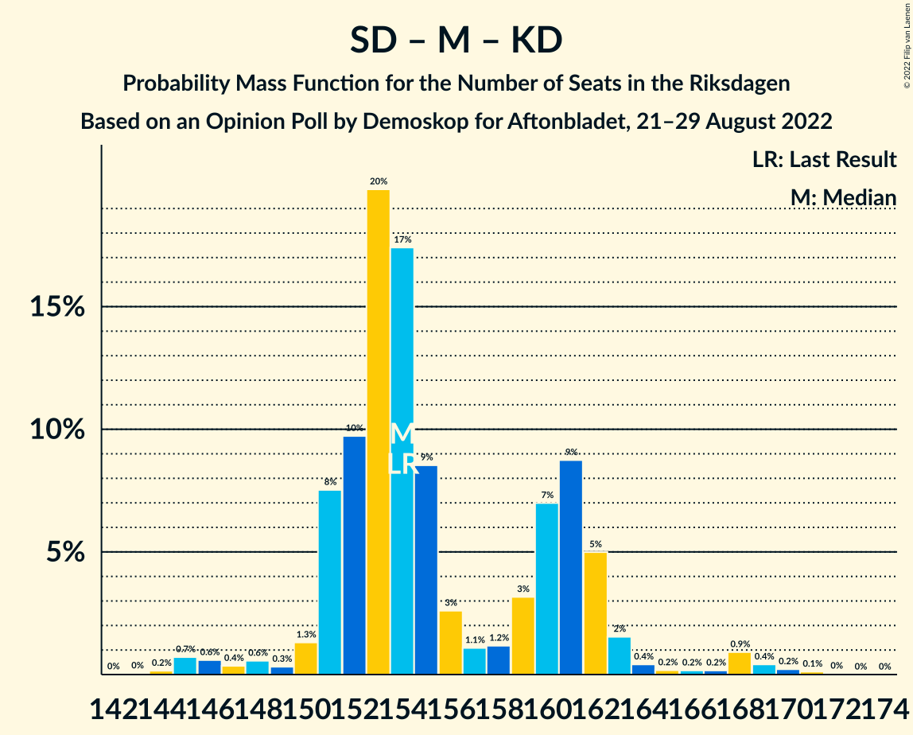

# Opinion Poll by Demoskop for Aftonbladet, 21–29 August 2022

<a href="#voting-intentions">Voting Intentions</a> | <a href="#seats">Seats</a> | <a href="#coalitions">Coalitions</a> | <a href="#technical-information">Technical Information</a>

## Voting Intentions

### Confidence Intervals

| Party | Last Result | Poll Result | 80% Confidence Interval | 90% Confidence Interval | 95% Confidence Interval | 99% Confidence Interval |
|:-----:|:-----------:|:-----------:|:-----------------------:|:-----------------------:|:-----------------------:|:-----------------------:|
| Sveriges socialdemokratiska arbetareparti | 28.3% | 29.6% | 28.4–30.9% |28.0–31.2% |27.7–31.6% |27.2–32.2% |
| Sverigedemokraterna | 17.5% | 20.6% | 19.5–21.7% |19.2–22.0% |18.9–22.3% |18.4–22.9% |
| Moderata samlingspartiet | 19.8% | 18.0% | 17.0–19.1% |16.7–19.4% |16.5–19.7% |16.0–20.2% |
| Vänsterpartiet | 8.0% | 7.8% | 7.1–8.6% |6.9–8.8% |6.8–9.0% |6.4–9.4% |
| Centerpartiet | 8.6% | 7.5% | 6.8–8.3% |6.6–8.5% |6.5–8.7% |6.2–9.1% |
| Kristdemokraterna | 6.3% | 5.4% | 4.8–6.1% |4.7–6.3% |4.5–6.4% |4.3–6.8% |
| Miljöpartiet de gröna | 4.4% | 5.3% | 4.7–5.9% |4.6–6.1% |4.4–6.3% |4.2–6.6% |
| Liberalerna | 5.5% | 4.6% | 4.1–5.2% |3.9–5.4% |3.8–5.6% |3.6–5.9% |

*Note:* The poll result column reflects the actual value used in the calculations. Published results may vary slightly, and in addition be rounded to fewer digits.

## Seats

### Confidence Intervals

| Party | Last Result | Median | 80% Confidence Interval | 90% Confidence Interval | 95% Confidence Interval | 99% Confidence Interval |
|:-----:|:-----------:|:------:|:-----------------------:|:-----------------------:|:-----------------------:|:-----------------------:|
| <a href="#sveriges-socialdemokratiska-arbetareparti">Sveriges socialdemokratiska arbetareparti</a> | 100 | 105 | 100–110 |99–111 |98–112 |96–115 |
| <a href="#sverigedemokraterna">Sverigedemokraterna</a> | 62 | 73 | 69–77 |67–78 |67–79 |65–81 |
| <a href="#moderata-samlingspartiet">Moderata samlingspartiet</a> | 70 | 63 | 60–68 |59–69 |58–70 |56–72 |
| <a href="#vänsterpartiet">Vänsterpartiet</a> | 28 | 28 | 25–30 |24–31 |24–32 |23–33 |
| <a href="#centerpartiet">Centerpartiet</a> | 31 | 27 | 24–29 |24–30 |23–31 |22–32 |
| <a href="#kristdemokraterna">Kristdemokraterna</a> | 22 | 19 | 17–21 |17–22 |16–23 |15–24 |
| <a href="#miljöpartiet-de-gröna">Miljöpartiet de gröna</a> | 16 | 19 | 17–21 |16–22 |16–22 |15–23 |
| <a href="#liberalerna">Liberalerna</a> | 20 | 16 | 14–18 |0–19 |0–20 |0–21 |

### Sveriges socialdemokratiska arbetareparti

*For a full overview of the results for this party, see the [Sveriges socialdemokratiska arbetareparti](party-sverigessocialdemokratiskaarbetareparti.html) page.*

| Number of Seats | Probability | Accumulated | Special Marks |
|:---------------:|:-----------:|:-----------:|:-------------:|
| 94 | 0.1% | 100% |  |
| 95 | 0.3% | 99.8% |  |
| 96 | 0.4% | 99.6% |  |
| 97 | 1.3% | 99.1% |  |
| 98 | 1.3% | 98% |  |
| 99 | 2% | 96% |  |
| 100 | 5% | 94% | Last Result |
| 101 | 7% | 89% |  |
| 102 | 9% | 82% |  |
| 103 | 11% | 73% |  |
| 104 | 10% | 63% |  |
| 105 | 9% | 53% | Median |
| 106 | 12% | 44% |  |
| 107 | 8% | 31% |  |
| 108 | 7% | 23% |  |
| 109 | 6% | 16% |  |
| 110 | 4% | 10% |  |
| 111 | 2% | 6% |  |
| 112 | 2% | 5% |  |
| 113 | 0.9% | 2% |  |
| 114 | 0.6% | 1.1% |  |
| 115 | 0.2% | 0.6% |  |
| 116 | 0.1% | 0.3% |  |
| 117 | 0.1% | 0.2% |  |
| 118 | 0% | 0.1% |  |
| 119 | 0% | 0% |  |

### Sverigedemokraterna

*For a full overview of the results for this party, see the [Sverigedemokraterna](party-sverigedemokraterna.html) page.*

| Number of Seats | Probability | Accumulated | Special Marks |
|:---------------:|:-----------:|:-----------:|:-------------:|
| 62 | 0% | 100% | Last Result |
| 63 | 0% | 100% |  |
| 64 | 0.1% | 99.9% |  |
| 65 | 0.4% | 99.8% |  |
| 66 | 1.3% | 99.4% |  |
| 67 | 3% | 98% |  |
| 68 | 4% | 95% |  |
| 69 | 6% | 91% |  |
| 70 | 6% | 85% |  |
| 71 | 11% | 79% |  |
| 72 | 18% | 69% |  |
| 73 | 15% | 51% | Median |
| 74 | 12% | 36% |  |
| 75 | 6% | 24% |  |
| 76 | 5% | 19% |  |
| 77 | 6% | 13% |  |
| 78 | 3% | 8% |  |
| 79 | 3% | 5% |  |
| 80 | 1.0% | 2% |  |
| 81 | 0.3% | 0.8% |  |
| 82 | 0.2% | 0.4% |  |
| 83 | 0.1% | 0.2% |  |
| 84 | 0.1% | 0.1% |  |
| 85 | 0% | 0% |  |

### Moderata samlingspartiet

*For a full overview of the results for this party, see the [Moderata samlingspartiet](party-moderatasamlingspartiet.html) page.*

| Number of Seats | Probability | Accumulated | Special Marks |
|:---------------:|:-----------:|:-----------:|:-------------:|
| 54 | 0.1% | 100% |  |
| 55 | 0.1% | 99.9% |  |
| 56 | 0.4% | 99.8% |  |
| 57 | 0.8% | 99.4% |  |
| 58 | 2% | 98.6% |  |
| 59 | 2% | 97% |  |
| 60 | 10% | 95% |  |
| 61 | 13% | 85% |  |
| 62 | 18% | 72% |  |
| 63 | 12% | 54% | Median |
| 64 | 9% | 42% |  |
| 65 | 9% | 33% |  |
| 66 | 7% | 24% |  |
| 67 | 5% | 17% |  |
| 68 | 4% | 12% |  |
| 69 | 4% | 8% |  |
| 70 | 2% | 4% | Last Result |
| 71 | 1.4% | 2% |  |
| 72 | 0.3% | 0.6% |  |
| 73 | 0.2% | 0.3% |  |
| 74 | 0% | 0.1% |  |
| 75 | 0% | 0% |  |

### Vänsterpartiet

*For a full overview of the results for this party, see the [Vänsterpartiet](party-vänsterpartiet.html) page.*

| Number of Seats | Probability | Accumulated | Special Marks |
|:---------------:|:-----------:|:-----------:|:-------------:|
| 22 | 0.2% | 100% |  |
| 23 | 0.9% | 99.7% |  |
| 24 | 4% | 98.8% |  |
| 25 | 10% | 95% |  |
| 26 | 11% | 85% |  |
| 27 | 22% | 73% |  |
| 28 | 19% | 52% | Last Result, Median |
| 29 | 13% | 33% |  |
| 30 | 11% | 20% |  |
| 31 | 5% | 8% |  |
| 32 | 2% | 4% |  |
| 33 | 0.9% | 1.2% |  |
| 34 | 0.2% | 0.3% |  |
| 35 | 0.1% | 0.1% |  |
| 36 | 0% | 0% |  |

### Centerpartiet

*For a full overview of the results for this party, see the [Centerpartiet](party-centerpartiet.html) page.*

| Number of Seats | Probability | Accumulated | Special Marks |
|:---------------:|:-----------:|:-----------:|:-------------:|
| 20 | 0% | 100% |  |
| 21 | 0.3% | 99.9% |  |
| 22 | 0.9% | 99.6% |  |
| 23 | 4% | 98.7% |  |
| 24 | 7% | 95% |  |
| 25 | 12% | 88% |  |
| 26 | 23% | 75% |  |
| 27 | 17% | 52% | Median |
| 28 | 13% | 35% |  |
| 29 | 12% | 22% |  |
| 30 | 6% | 9% |  |
| 31 | 2% | 3% | Last Result |
| 32 | 0.8% | 1.0% |  |
| 33 | 0.2% | 0.3% |  |
| 34 | 0.1% | 0.1% |  |
| 35 | 0% | 0% |  |

### Kristdemokraterna

*For a full overview of the results for this party, see the [Kristdemokraterna](party-kristdemokraterna.html) page.*

| Number of Seats | Probability | Accumulated | Special Marks |
|:---------------:|:-----------:|:-----------:|:-------------:|
| 0 | 0.1% | 100% |  |
| 1 | 0% | 99.9% |  |
| 2 | 0% | 99.9% |  |
| 3 | 0% | 99.9% |  |
| 4 | 0% | 99.9% |  |
| 5 | 0% | 99.9% |  |
| 6 | 0% | 99.9% |  |
| 7 | 0% | 99.9% |  |
| 8 | 0% | 99.9% |  |
| 9 | 0% | 99.9% |  |
| 10 | 0% | 99.9% |  |
| 11 | 0% | 99.9% |  |
| 12 | 0% | 99.9% |  |
| 13 | 0% | 99.9% |  |
| 14 | 0.1% | 99.9% |  |
| 15 | 0.9% | 99.9% |  |
| 16 | 3% | 98.9% |  |
| 17 | 9% | 96% |  |
| 18 | 18% | 87% |  |
| 19 | 28% | 69% | Median |
| 20 | 19% | 40% |  |
| 21 | 12% | 21% |  |
| 22 | 6% | 10% | Last Result |
| 23 | 2% | 3% |  |
| 24 | 0.9% | 1.1% |  |
| 25 | 0.2% | 0.3% |  |
| 26 | 0.1% | 0.1% |  |
| 27 | 0% | 0% |  |

### Miljöpartiet de gröna

*For a full overview of the results for this party, see the [Miljöpartiet de gröna](party-miljöpartietdegröna.html) page.*

| Number of Seats | Probability | Accumulated | Special Marks |
|:---------------:|:-----------:|:-----------:|:-------------:|
| 0 | 0.2% | 100% |  |
| 1 | 0% | 99.8% |  |
| 2 | 0% | 99.8% |  |
| 3 | 0% | 99.8% |  |
| 4 | 0% | 99.8% |  |
| 5 | 0% | 99.8% |  |
| 6 | 0% | 99.8% |  |
| 7 | 0% | 99.8% |  |
| 8 | 0% | 99.8% |  |
| 9 | 0% | 99.8% |  |
| 10 | 0% | 99.8% |  |
| 11 | 0% | 99.8% |  |
| 12 | 0% | 99.8% |  |
| 13 | 0% | 99.8% |  |
| 14 | 0.2% | 99.8% |  |
| 15 | 1.5% | 99.6% |  |
| 16 | 6% | 98% | Last Result |
| 17 | 11% | 92% |  |
| 18 | 21% | 81% |  |
| 19 | 22% | 60% | Median |
| 20 | 19% | 38% |  |
| 21 | 13% | 19% |  |
| 22 | 4% | 5% |  |
| 23 | 1.2% | 2% |  |
| 24 | 0.4% | 0.5% |  |
| 25 | 0.1% | 0.1% |  |
| 26 | 0% | 0% |  |

### Liberalerna

*For a full overview of the results for this party, see the [Liberalerna](party-liberalerna.html) page.*

| Number of Seats | Probability | Accumulated | Special Marks |
|:---------------:|:-----------:|:-----------:|:-------------:|
| 0 | 8% | 100% |  |
| 1 | 0% | 92% |  |
| 2 | 0% | 92% |  |
| 3 | 0% | 92% |  |
| 4 | 0% | 92% |  |
| 5 | 0% | 92% |  |
| 6 | 0% | 92% |  |
| 7 | 0% | 92% |  |
| 8 | 0% | 92% |  |
| 9 | 0% | 92% |  |
| 10 | 0% | 92% |  |
| 11 | 0% | 92% |  |
| 12 | 0% | 92% |  |
| 13 | 0% | 92% |  |
| 14 | 3% | 92% |  |
| 15 | 19% | 89% |  |
| 16 | 23% | 70% | Median |
| 17 | 21% | 47% |  |
| 18 | 17% | 26% |  |
| 19 | 6% | 9% |  |
| 20 | 2% | 3% | Last Result |
| 21 | 0.5% | 0.7% |  |
| 22 | 0.1% | 0.1% |  |
| 23 | 0% | 0% |  |

## Coalitions

### Confidence Intervals

| Coalition | Last Result | Median | Majority? | 80% Confidence Interval | 90% Confidence Interval | 95% Confidence Interval | 99% Confidence Interval |
|:---------:|:-----------:|:------:|:---------:|:-----------------------:|:-----------------------:|:-----------------------:|:-----------------------:|
| Sveriges socialdemokratiska arbetareparti – Moderata samlingspartiet – Centerpartiet | 201 | 195 | 100% | 190–201 | 188–205 | 187–207 | 185–210 |
| Sveriges socialdemokratiska arbetareparti – Vänsterpartiet – Centerpartiet – Miljöpartiet de gröna – Liberalerna | 195 | 195 | 100% | 188–198 | 187–198 | 185–200 | 180–204 |
| Sveriges socialdemokratiska arbetareparti – Moderata samlingspartiet | 170 | 168 | 10% | 163–175 | 162–177 | 161–178 | 158–182 |
| Sveriges socialdemokratiska arbetareparti – Centerpartiet – Miljöpartiet de gröna – Liberalerna | 167 | 166 | 1.1% | 160–171 | 158–172 | 156–173 | 151–175 |
| Sverigedemokraterna – Moderata samlingspartiet – Kristdemokraterna | 154 | 154 | 0% | 151–161 | 151–162 | 149–164 | 145–169 |
| Sveriges socialdemokratiska arbetareparti – Vänsterpartiet – Miljöpartiet de gröna | 144 | 152 | 0% | 145–156 | 144–159 | 143–160 | 142–163 |
| Sverigedemokraterna – Moderata samlingspartiet | 132 | 134 | 0% | 133–142 | 132–143 | 130–144 | 126–149 |
| Sveriges socialdemokratiska arbetareparti – Vänsterpartiet | 128 | 133 | 0% | 127–137 | 126–140 | 125–140 | 123–144 |
| Moderata samlingspartiet – Centerpartiet – Kristdemokraterna – Liberalerna | 143 | 125 | 0% | 119–130 | 115–131 | 114–133 | 110–135 |
| Sveriges socialdemokratiska arbetareparti – Miljöpartiet de gröna | 116 | 124 | 0% | 119–129 | 117–130 | 116–132 | 114–135 |
| Moderata samlingspartiet – Centerpartiet – Kristdemokraterna | 123 | 109 | 0% | 105–115 | 104–116 | 102–118 | 100–121 |
| Moderata samlingspartiet – Centerpartiet – Liberalerna | 121 | 106 | 0% | 100–111 | 96–112 | 94–113 | 90–115 |
| Moderata samlingspartiet – Centerpartiet | 101 | 90 | 0% | 86–95 | 85–96 | 84–98 | 82–100 |

### Sveriges socialdemokratiska arbetareparti – Moderata samlingspartiet – Centerpartiet

| Number of Seats | Probability | Accumulated | Special Marks |
|:---------------:|:-----------:|:-----------:|:-------------:|
| 182 | 0% | 100% |  |
| 183 | 0.1% | 99.9% |  |
| 184 | 0.2% | 99.8% |  |
| 185 | 0.5% | 99.6% |  |
| 186 | 0.8% | 99.1% |  |
| 187 | 1.2% | 98% |  |
| 188 | 2% | 97% |  |
| 189 | 2% | 95% |  |
| 190 | 8% | 93% |  |
| 191 | 7% | 85% |  |
| 192 | 8% | 78% |  |
| 193 | 12% | 70% |  |
| 194 | 5% | 58% |  |
| 195 | 13% | 53% | Median |
| 196 | 8% | 40% |  |
| 197 | 5% | 32% |  |
| 198 | 9% | 27% |  |
| 199 | 3% | 18% |  |
| 200 | 4% | 15% |  |
| 201 | 3% | 11% | Last Result |
| 202 | 1.3% | 9% |  |
| 203 | 1.1% | 8% |  |
| 204 | 1.4% | 7% |  |
| 205 | 2% | 5% |  |
| 206 | 0.4% | 4% |  |
| 207 | 1.2% | 3% |  |
| 208 | 1.2% | 2% |  |
| 209 | 0.1% | 0.7% |  |
| 210 | 0.2% | 0.6% |  |
| 211 | 0.2% | 0.4% |  |
| 212 | 0.1% | 0.2% |  |
| 213 | 0% | 0.1% |  |
| 214 | 0% | 0% |  |

### Sveriges socialdemokratiska arbetareparti – Vänsterpartiet – Centerpartiet – Miljöpartiet de gröna – Liberalerna

| Number of Seats | Probability | Accumulated | Special Marks |
|:---------------:|:-----------:|:-----------:|:-------------:|
| 177 | 0% | 100% |  |
| 178 | 0.1% | 99.9% |  |
| 179 | 0.2% | 99.8% |  |
| 180 | 0.4% | 99.6% |  |
| 181 | 0.9% | 99.2% |  |
| 182 | 0.2% | 98% |  |
| 183 | 0.2% | 98% |  |
| 184 | 0.2% | 98% |  |
| 185 | 0.4% | 98% |  |
| 186 | 2% | 97% |  |
| 187 | 5% | 96% |  |
| 188 | 9% | 91% |  |
| 189 | 7% | 82% |  |
| 190 | 3% | 75% |  |
| 191 | 1.2% | 72% |  |
| 192 | 1.1% | 71% |  |
| 193 | 3% | 70% |  |
| 194 | 9% | 67% |  |
| 195 | 17% | 59% | Last Result, Median |
| 196 | 20% | 41% |  |
| 197 | 10% | 21% |  |
| 198 | 8% | 12% |  |
| 199 | 1.3% | 4% |  |
| 200 | 0.3% | 3% |  |
| 201 | 0.6% | 2% |  |
| 202 | 0.4% | 2% |  |
| 203 | 0.6% | 2% |  |
| 204 | 0.7% | 0.9% |  |
| 205 | 0.2% | 0.2% |  |
| 206 | 0% | 0.1% |  |
| 207 | 0% | 0% |  |

### Sveriges socialdemokratiska arbetareparti – Moderata samlingspartiet

| Number of Seats | Probability | Accumulated | Special Marks |
|:---------------:|:-----------:|:-----------:|:-------------:|
| 156 | 0.1% | 100% |  |
| 157 | 0.2% | 99.9% |  |
| 158 | 0.3% | 99.7% |  |
| 159 | 0.3% | 99.4% |  |
| 160 | 1.0% | 99.1% |  |
| 161 | 2% | 98% |  |
| 162 | 3% | 96% |  |
| 163 | 5% | 94% |  |
| 164 | 8% | 89% |  |
| 165 | 10% | 81% |  |
| 166 | 8% | 71% |  |
| 167 | 13% | 64% |  |
| 168 | 7% | 50% | Median |
| 169 | 9% | 43% |  |
| 170 | 8% | 35% | Last Result |
| 171 | 3% | 27% |  |
| 172 | 9% | 24% |  |
| 173 | 2% | 15% |  |
| 174 | 3% | 13% |  |
| 175 | 4% | 10% | Majority |
| 176 | 1.3% | 6% |  |
| 177 | 1.0% | 5% |  |
| 178 | 2% | 4% |  |
| 179 | 0.8% | 2% |  |
| 180 | 0.5% | 1.4% |  |
| 181 | 0.2% | 0.9% |  |
| 182 | 0.3% | 0.7% |  |
| 183 | 0.3% | 0.4% |  |
| 184 | 0.1% | 0.2% |  |
| 185 | 0% | 0.1% |  |
| 186 | 0% | 0.1% |  |
| 187 | 0% | 0% |  |

### Sveriges socialdemokratiska arbetareparti – Centerpartiet – Miljöpartiet de gröna – Liberalerna

| Number of Seats | Probability | Accumulated | Special Marks |
|:---------------:|:-----------:|:-----------:|:-------------:|
| 147 | 0.1% | 100% |  |
| 148 | 0% | 99.9% |  |
| 149 | 0% | 99.9% |  |
| 150 | 0.2% | 99.9% |  |
| 151 | 0.2% | 99.6% |  |
| 152 | 0.2% | 99.4% |  |
| 153 | 0.6% | 99.2% |  |
| 154 | 0.4% | 98.6% |  |
| 155 | 0.3% | 98% |  |
| 156 | 1.0% | 98% |  |
| 157 | 0.8% | 97% |  |
| 158 | 2% | 96% |  |
| 159 | 3% | 94% |  |
| 160 | 3% | 91% |  |
| 161 | 4% | 88% |  |
| 162 | 6% | 84% |  |
| 163 | 6% | 79% |  |
| 164 | 6% | 73% |  |
| 165 | 10% | 67% |  |
| 166 | 8% | 58% |  |
| 167 | 8% | 49% | Last Result, Median |
| 168 | 12% | 42% |  |
| 169 | 10% | 30% |  |
| 170 | 7% | 20% |  |
| 171 | 6% | 13% |  |
| 172 | 2% | 7% |  |
| 173 | 3% | 5% |  |
| 174 | 0.9% | 2% |  |
| 175 | 0.7% | 1.1% | Majority |
| 176 | 0.2% | 0.5% |  |
| 177 | 0.1% | 0.3% |  |
| 178 | 0.1% | 0.1% |  |
| 179 | 0% | 0.1% |  |
| 180 | 0% | 0% |  |

### Sverigedemokraterna – Moderata samlingspartiet – Kristdemokraterna

| Number of Seats | Probability | Accumulated | Special Marks |
|:---------------:|:-----------:|:-----------:|:-------------:|
| 143 | 0% | 100% |  |
| 144 | 0.2% | 99.9% |  |
| 145 | 0.7% | 99.8% |  |
| 146 | 0.6% | 99.1% |  |
| 147 | 0.4% | 98% |  |
| 148 | 0.6% | 98% |  |
| 149 | 0.3% | 98% |  |
| 150 | 1.3% | 97% |  |
| 151 | 8% | 96% |  |
| 152 | 10% | 88% |  |
| 153 | 20% | 79% |  |
| 154 | 17% | 59% | Last Result |
| 155 | 9% | 41% | Median |
| 156 | 3% | 33% |  |
| 157 | 1.1% | 30% |  |
| 158 | 1.2% | 29% |  |
| 159 | 3% | 28% |  |
| 160 | 7% | 25% |  |
| 161 | 9% | 18% |  |
| 162 | 5% | 9% |  |
| 163 | 2% | 4% |  |
| 164 | 0.4% | 3% |  |
| 165 | 0.2% | 2% |  |
| 166 | 0.2% | 2% |  |
| 167 | 0.2% | 2% |  |
| 168 | 0.9% | 2% |  |
| 169 | 0.4% | 0.8% |  |
| 170 | 0.2% | 0.4% |  |
| 171 | 0.1% | 0.2% |  |
| 172 | 0% | 0.1% |  |
| 173 | 0% | 0% |  |

### Sveriges socialdemokratiska arbetareparti – Vänsterpartiet – Miljöpartiet de gröna

| Number of Seats | Probability | Accumulated | Special Marks |
|:---------------:|:-----------:|:-----------:|:-------------:|
| 137 | 0% | 100% |  |
| 138 | 0% | 99.9% |  |
| 139 | 0.1% | 99.9% |  |
| 140 | 0.1% | 99.8% |  |
| 141 | 0.2% | 99.7% |  |
| 142 | 0.9% | 99.6% |  |
| 143 | 2% | 98.6% |  |
| 144 | 2% | 96% | Last Result |
| 145 | 5% | 94% |  |
| 146 | 3% | 89% |  |
| 147 | 4% | 86% |  |
| 148 | 4% | 82% |  |
| 149 | 4% | 77% |  |
| 150 | 8% | 73% |  |
| 151 | 13% | 64% |  |
| 152 | 8% | 52% | Median |
| 153 | 13% | 44% |  |
| 154 | 12% | 31% |  |
| 155 | 7% | 19% |  |
| 156 | 3% | 12% |  |
| 157 | 1.5% | 10% |  |
| 158 | 2% | 8% |  |
| 159 | 3% | 6% |  |
| 160 | 1.2% | 3% |  |
| 161 | 1.0% | 2% |  |
| 162 | 0.3% | 1.0% |  |
| 163 | 0.4% | 0.7% |  |
| 164 | 0.1% | 0.3% |  |
| 165 | 0.1% | 0.2% |  |
| 166 | 0% | 0.1% |  |
| 167 | 0% | 0.1% |  |
| 168 | 0% | 0.1% |  |
| 169 | 0% | 0% |  |

### Sverigedemokraterna – Moderata samlingspartiet

| Number of Seats | Probability | Accumulated | Special Marks |
|:---------------:|:-----------:|:-----------:|:-------------:|
| 124 | 0.1% | 100% |  |
| 125 | 0.1% | 99.9% |  |
| 126 | 0.6% | 99.8% |  |
| 127 | 0.3% | 99.2% |  |
| 128 | 0.7% | 98.9% |  |
| 129 | 0.6% | 98% |  |
| 130 | 0.2% | 98% |  |
| 131 | 0.8% | 97% |  |
| 132 | 5% | 96% | Last Result |
| 133 | 12% | 91% |  |
| 134 | 30% | 79% |  |
| 135 | 10% | 49% |  |
| 136 | 8% | 39% | Median |
| 137 | 0.6% | 31% |  |
| 138 | 1.0% | 30% |  |
| 139 | 4% | 29% |  |
| 140 | 4% | 25% |  |
| 141 | 5% | 21% |  |
| 142 | 9% | 15% |  |
| 143 | 3% | 7% |  |
| 144 | 2% | 4% |  |
| 145 | 0.1% | 2% |  |
| 146 | 0.1% | 2% |  |
| 147 | 0.4% | 2% |  |
| 148 | 0.6% | 2% |  |
| 149 | 0.5% | 1.0% |  |
| 150 | 0.5% | 0.5% |  |
| 151 | 0% | 0% |  |

### Sveriges socialdemokratiska arbetareparti – Vänsterpartiet

| Number of Seats | Probability | Accumulated | Special Marks |
|:---------------:|:-----------:|:-----------:|:-------------:|
| 120 | 0% | 100% |  |
| 121 | 0.1% | 99.9% |  |
| 122 | 0.2% | 99.9% |  |
| 123 | 0.4% | 99.7% |  |
| 124 | 1.1% | 99.2% |  |
| 125 | 2% | 98% |  |
| 126 | 3% | 96% |  |
| 127 | 5% | 93% |  |
| 128 | 5% | 88% | Last Result |
| 129 | 3% | 83% |  |
| 130 | 5% | 79% |  |
| 131 | 11% | 74% |  |
| 132 | 10% | 63% |  |
| 133 | 13% | 53% | Median |
| 134 | 10% | 40% |  |
| 135 | 9% | 30% |  |
| 136 | 8% | 21% |  |
| 137 | 3% | 13% |  |
| 138 | 2% | 10% |  |
| 139 | 2% | 7% |  |
| 140 | 3% | 5% |  |
| 141 | 0.8% | 2% |  |
| 142 | 0.3% | 1.5% |  |
| 143 | 0.5% | 1.2% |  |
| 144 | 0.3% | 0.6% |  |
| 145 | 0.1% | 0.3% |  |
| 146 | 0.1% | 0.2% |  |
| 147 | 0.1% | 0.1% |  |
| 148 | 0% | 0% |  |

### Moderata samlingspartiet – Centerpartiet – Kristdemokraterna – Liberalerna

| Number of Seats | Probability | Accumulated | Special Marks |
|:---------------:|:-----------:|:-----------:|:-------------:|
| 106 | 0.1% | 100% |  |
| 107 | 0.1% | 99.9% |  |
| 108 | 0.2% | 99.8% |  |
| 109 | 0.1% | 99.6% |  |
| 110 | 0.1% | 99.5% |  |
| 111 | 0.3% | 99.4% |  |
| 112 | 0.6% | 99.1% |  |
| 113 | 0.5% | 98% |  |
| 114 | 2% | 98% |  |
| 115 | 1.2% | 96% |  |
| 116 | 0.7% | 95% |  |
| 117 | 0.6% | 94% |  |
| 118 | 1.4% | 93% |  |
| 119 | 3% | 92% |  |
| 120 | 2% | 89% |  |
| 121 | 6% | 86% |  |
| 122 | 10% | 80% |  |
| 123 | 5% | 70% |  |
| 124 | 8% | 66% |  |
| 125 | 9% | 57% | Median |
| 126 | 11% | 48% |  |
| 127 | 10% | 37% |  |
| 128 | 7% | 27% |  |
| 129 | 7% | 20% |  |
| 130 | 4% | 13% |  |
| 131 | 4% | 9% |  |
| 132 | 2% | 5% |  |
| 133 | 1.3% | 3% |  |
| 134 | 0.8% | 2% |  |
| 135 | 0.3% | 0.7% |  |
| 136 | 0.2% | 0.4% |  |
| 137 | 0.1% | 0.2% |  |
| 138 | 0.1% | 0.1% |  |
| 139 | 0% | 0% |  |
| 140 | 0% | 0% |  |
| 141 | 0% | 0% |  |
| 142 | 0% | 0% |  |
| 143 | 0% | 0% | Last Result |

### Sveriges socialdemokratiska arbetareparti – Miljöpartiet de gröna

| Number of Seats | Probability | Accumulated | Special Marks |
|:---------------:|:-----------:|:-----------:|:-------------:|
| 107 | 0% | 100% |  |
| 108 | 0% | 99.9% |  |
| 109 | 0% | 99.9% |  |
| 110 | 0% | 99.9% |  |
| 111 | 0% | 99.9% |  |
| 112 | 0.2% | 99.9% |  |
| 113 | 0.1% | 99.7% |  |
| 114 | 0.4% | 99.6% |  |
| 115 | 0.8% | 99.2% |  |
| 116 | 2% | 98% | Last Result |
| 117 | 2% | 97% |  |
| 118 | 3% | 94% |  |
| 119 | 4% | 91% |  |
| 120 | 9% | 87% |  |
| 121 | 6% | 78% |  |
| 122 | 7% | 71% |  |
| 123 | 11% | 64% |  |
| 124 | 14% | 53% | Median |
| 125 | 5% | 39% |  |
| 126 | 8% | 34% |  |
| 127 | 9% | 26% |  |
| 128 | 6% | 17% |  |
| 129 | 3% | 11% |  |
| 130 | 3% | 8% |  |
| 131 | 2% | 5% |  |
| 132 | 0.9% | 3% |  |
| 133 | 0.8% | 2% |  |
| 134 | 0.3% | 0.9% |  |
| 135 | 0.3% | 0.5% |  |
| 136 | 0.1% | 0.2% |  |
| 137 | 0.1% | 0.2% |  |
| 138 | 0% | 0.1% |  |
| 139 | 0% | 0% |  |

### Moderata samlingspartiet – Centerpartiet – Kristdemokraterna

| Number of Seats | Probability | Accumulated | Special Marks |
|:---------------:|:-----------:|:-----------:|:-------------:|
| 97 | 0% | 100% |  |
| 98 | 0.1% | 99.9% |  |
| 99 | 0.1% | 99.9% |  |
| 100 | 0.4% | 99.8% |  |
| 101 | 0.3% | 99.4% |  |
| 102 | 2% | 99.1% |  |
| 103 | 2% | 97% |  |
| 104 | 3% | 96% |  |
| 105 | 4% | 92% |  |
| 106 | 15% | 89% |  |
| 107 | 7% | 74% |  |
| 108 | 9% | 67% |  |
| 109 | 10% | 57% | Median |
| 110 | 10% | 47% |  |
| 111 | 9% | 37% |  |
| 112 | 8% | 29% |  |
| 113 | 5% | 20% |  |
| 114 | 5% | 15% |  |
| 115 | 4% | 10% |  |
| 116 | 2% | 6% |  |
| 117 | 1.2% | 4% |  |
| 118 | 0.6% | 3% |  |
| 119 | 2% | 2% |  |
| 120 | 0.2% | 0.8% |  |
| 121 | 0.3% | 0.6% |  |
| 122 | 0.2% | 0.3% |  |
| 123 | 0.1% | 0.1% | Last Result |
| 124 | 0% | 0% |  |

### Moderata samlingspartiet – Centerpartiet – Liberalerna

| Number of Seats | Probability | Accumulated | Special Marks |
|:---------------:|:-----------:|:-----------:|:-------------:|
| 86 | 0% | 100% |  |
| 87 | 0.1% | 99.9% |  |
| 88 | 0.1% | 99.9% |  |
| 89 | 0.1% | 99.8% |  |
| 90 | 0.3% | 99.7% |  |
| 91 | 0.6% | 99.4% |  |
| 92 | 0.8% | 98.9% |  |
| 93 | 0.4% | 98% |  |
| 94 | 0.4% | 98% |  |
| 95 | 1.3% | 97% |  |
| 96 | 1.4% | 96% |  |
| 97 | 1.1% | 95% |  |
| 98 | 1.4% | 93% |  |
| 99 | 1.3% | 92% |  |
| 100 | 2% | 91% |  |
| 101 | 2% | 89% |  |
| 102 | 5% | 86% |  |
| 103 | 9% | 81% |  |
| 104 | 7% | 72% |  |
| 105 | 9% | 65% |  |
| 106 | 8% | 56% | Median |
| 107 | 16% | 48% |  |
| 108 | 7% | 32% |  |
| 109 | 7% | 25% |  |
| 110 | 7% | 18% |  |
| 111 | 4% | 11% |  |
| 112 | 3% | 6% |  |
| 113 | 1.4% | 3% |  |
| 114 | 0.8% | 2% |  |
| 115 | 0.7% | 1.1% |  |
| 116 | 0.1% | 0.4% |  |
| 117 | 0.1% | 0.2% |  |
| 118 | 0.1% | 0.1% |  |
| 119 | 0% | 0% |  |
| 120 | 0% | 0% |  |
| 121 | 0% | 0% | Last Result |

### Moderata samlingspartiet – Centerpartiet

| Number of Seats | Probability | Accumulated | Special Marks |
|:---------------:|:-----------:|:-----------:|:-------------:|
| 80 | 0.1% | 100% |  |
| 81 | 0.3% | 99.9% |  |
| 82 | 0.5% | 99.6% |  |
| 83 | 1.4% | 99.1% |  |
| 84 | 2% | 98% |  |
| 85 | 3% | 96% |  |
| 86 | 7% | 93% |  |
| 87 | 9% | 86% |  |
| 88 | 9% | 77% |  |
| 89 | 14% | 68% |  |
| 90 | 9% | 54% | Median |
| 91 | 13% | 45% |  |
| 92 | 8% | 32% |  |
| 93 | 6% | 24% |  |
| 94 | 4% | 18% |  |
| 95 | 5% | 13% |  |
| 96 | 3% | 8% |  |
| 97 | 2% | 5% |  |
| 98 | 1.2% | 3% |  |
| 99 | 0.7% | 2% |  |
| 100 | 0.5% | 0.9% |  |
| 101 | 0.1% | 0.4% | Last Result |
| 102 | 0.2% | 0.3% |  |
| 103 | 0% | 0.1% |  |
| 104 | 0% | 0% |  |

## Technical Information

### Opinion Poll

+ **Polling firm:** Demoskop
+ **Commissioner(s):** Aftonbladet
+ **Fieldwork period:** 21–29 August 2022

### Calculations

+ **Sample size:** 2216
+ **Simulations done:** 1,048,576
+ **Error estimate:** 0.75%

