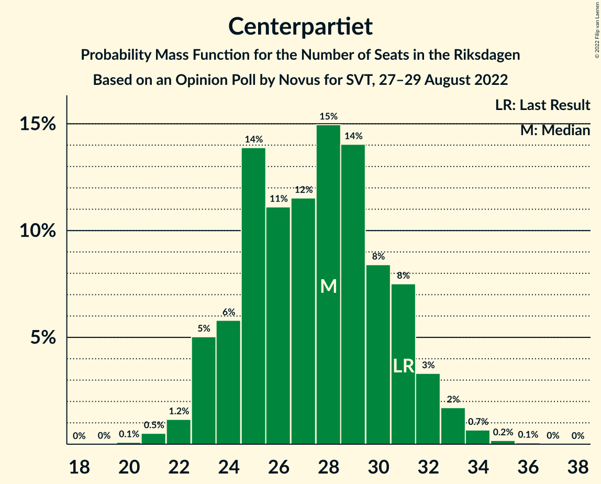

# Opinion Poll by Novus for SVT, 27–29 August 2022

<a href="#voting-intentions">Voting Intentions</a> | <a href="#seats">Seats</a> | <a href="#coalitions">Coalitions</a> | <a href="#technical-information">Technical Information</a>

## Voting Intentions

### Confidence Intervals

| Party | Last Result | Poll Result | 80% Confidence Interval | 90% Confidence Interval | 95% Confidence Interval | 99% Confidence Interval |
|:-----:|:-----------:|:-----------:|:-----------------------:|:-----------------------:|:-----------------------:|:-----------------------:|
| Sveriges socialdemokratiska arbetareparti | 28.3% | 29.8% | 28.3–31.4% |27.9–31.8% |27.5–32.2% |26.8–32.9% |
| Sverigedemokraterna | 17.5% | 20.9% | 19.6–22.3% |19.2–22.7% |18.9–23.0% |18.3–23.7% |
| Moderata samlingspartiet | 19.8% | 15.6% | 14.4–16.9% |14.1–17.2% |13.8–17.5% |13.3–18.2% |
| Centerpartiet | 8.6% | 7.7% | 6.9–8.7% |6.7–9.0% |6.5–9.2% |6.1–9.7% |
| Vänsterpartiet | 8.0% | 7.5% | 6.7–8.5% |6.5–8.7% |6.3–9.0% |5.9–9.5% |
| Kristdemokraterna | 6.3% | 6.4% | 5.7–7.3% |5.4–7.5% |5.3–7.8% |4.9–8.2% |
| Miljöpartiet de gröna | 4.4% | 5.6% | 4.9–6.4% |4.7–6.7% |4.5–6.9% |4.2–7.3% |
| Liberalerna | 5.5% | 5.2% | 4.5–6.0% |4.3–6.2% |4.2–6.4% |3.9–6.9% |

*Note:* The poll result column reflects the actual value used in the calculations. Published results may vary slightly, and in addition be rounded to fewer digits.

## Seats

### Confidence Intervals

| Party | Last Result | Median | 80% Confidence Interval | 90% Confidence Interval | 95% Confidence Interval | 99% Confidence Interval |
|:-----:|:-----------:|:------:|:-----------------------:|:-----------------------:|:-----------------------:|:-----------------------:|
| <a href="#sveriges-socialdemokratiska-arbetareparti">Sveriges socialdemokratiska arbetareparti</a> | 100 | 105 | 99–110 |98–111 |97–113 |94–117 |
| <a href="#sverigedemokraterna">Sverigedemokraterna</a> | 62 | 74 | 69–78 |68–80 |66–82 |64–84 |
| <a href="#moderata-samlingspartiet">Moderata samlingspartiet</a> | 70 | 56 | 50–59 |50–60 |49–61 |47–64 |
| <a href="#centerpartiet">Centerpartiet</a> | 31 | 28 | 24–31 |23–32 |23–33 |21–34 |
| <a href="#vänsterpartiet">Vänsterpartiet</a> | 28 | 27 | 24–30 |23–31 |22–32 |21–33 |
| <a href="#kristdemokraterna">Kristdemokraterna</a> | 22 | 23 | 20–26 |19–26 |19–27 |17–29 |
| <a href="#miljöpartiet-de-gröna">Miljöpartiet de gröna</a> | 16 | 20 | 17–22 |16–23 |16–24 |15–26 |
| <a href="#liberalerna">Liberalerna</a> | 20 | 18 | 16–21 |15–22 |15–23 |0–24 |

### Sveriges socialdemokratiska arbetareparti

*For a full overview of the results for this party, see the [Sveriges socialdemokratiska arbetareparti](party-sverigessocialdemokratiskaarbetareparti.html) page.*

| Number of Seats | Probability | Accumulated | Special Marks |
|:---------------:|:-----------:|:-----------:|:-------------:|
| 92 | 0% | 100% |  |
| 93 | 0.2% | 99.9% |  |
| 94 | 0.4% | 99.7% |  |
| 95 | 0.5% | 99.4% |  |
| 96 | 0.6% | 98.9% |  |
| 97 | 2% | 98% |  |
| 98 | 2% | 97% |  |
| 99 | 11% | 95% |  |
| 100 | 6% | 84% | Last Result |
| 101 | 3% | 78% |  |
| 102 | 7% | 75% |  |
| 103 | 6% | 68% |  |
| 104 | 8% | 63% |  |
| 105 | 8% | 55% | Median |
| 106 | 5% | 46% |  |
| 107 | 4% | 42% |  |
| 108 | 15% | 38% |  |
| 109 | 11% | 22% |  |
| 110 | 5% | 12% |  |
| 111 | 2% | 7% |  |
| 112 | 0.9% | 5% |  |
| 113 | 1.5% | 4% |  |
| 114 | 1.0% | 2% |  |
| 115 | 0.2% | 1.3% |  |
| 116 | 0.4% | 1.1% |  |
| 117 | 0.5% | 0.7% |  |
| 118 | 0.1% | 0.3% |  |
| 119 | 0.1% | 0.1% |  |
| 120 | 0% | 0% |  |

### Sverigedemokraterna

*For a full overview of the results for this party, see the [Sverigedemokraterna](party-sverigedemokraterna.html) page.*

| Number of Seats | Probability | Accumulated | Special Marks |
|:---------------:|:-----------:|:-----------:|:-------------:|
| 62 | 0% | 100% | Last Result |
| 63 | 0.2% | 99.9% |  |
| 64 | 0.7% | 99.8% |  |
| 65 | 0.9% | 99.0% |  |
| 66 | 2% | 98% |  |
| 67 | 0.8% | 97% |  |
| 68 | 4% | 96% |  |
| 69 | 6% | 92% |  |
| 70 | 9% | 86% |  |
| 71 | 9% | 77% |  |
| 72 | 5% | 68% |  |
| 73 | 8% | 63% |  |
| 74 | 7% | 55% | Median |
| 75 | 25% | 48% |  |
| 76 | 5% | 23% |  |
| 77 | 6% | 18% |  |
| 78 | 3% | 12% |  |
| 79 | 3% | 9% |  |
| 80 | 2% | 6% |  |
| 81 | 2% | 4% |  |
| 82 | 2% | 3% |  |
| 83 | 0.2% | 0.8% |  |
| 84 | 0.3% | 0.5% |  |
| 85 | 0.1% | 0.2% |  |
| 86 | 0.1% | 0.1% |  |
| 87 | 0% | 0.1% |  |
| 88 | 0% | 0% |  |

### Moderata samlingspartiet

*For a full overview of the results for this party, see the [Moderata samlingspartiet](party-moderatasamlingspartiet.html) page.*

| Number of Seats | Probability | Accumulated | Special Marks |
|:---------------:|:-----------:|:-----------:|:-------------:|
| 45 | 0.1% | 100% |  |
| 46 | 0.2% | 99.9% |  |
| 47 | 0.5% | 99.7% |  |
| 48 | 1.2% | 99.2% |  |
| 49 | 3% | 98% |  |
| 50 | 5% | 95% |  |
| 51 | 5% | 90% |  |
| 52 | 6% | 85% |  |
| 53 | 4% | 79% |  |
| 54 | 7% | 74% |  |
| 55 | 9% | 68% |  |
| 56 | 18% | 59% | Median |
| 57 | 14% | 41% |  |
| 58 | 8% | 27% |  |
| 59 | 9% | 19% |  |
| 60 | 6% | 10% |  |
| 61 | 2% | 3% |  |
| 62 | 0.8% | 2% |  |
| 63 | 0.3% | 1.1% |  |
| 64 | 0.3% | 0.7% |  |
| 65 | 0.2% | 0.4% |  |
| 66 | 0.2% | 0.2% |  |
| 67 | 0% | 0.1% |  |
| 68 | 0% | 0% |  |
| 69 | 0% | 0% |  |
| 70 | 0% | 0% | Last Result |

### Centerpartiet

*For a full overview of the results for this party, see the [Centerpartiet](party-centerpartiet.html) page.*

| Number of Seats | Probability | Accumulated | Special Marks |
|:---------------:|:-----------:|:-----------:|:-------------:|
| 20 | 0.1% | 100% |  |
| 21 | 0.5% | 99.9% |  |
| 22 | 1.2% | 99.4% |  |
| 23 | 5% | 98% |  |
| 24 | 6% | 93% |  |
| 25 | 14% | 87% |  |
| 26 | 11% | 74% |  |
| 27 | 12% | 62% |  |
| 28 | 15% | 51% | Median |
| 29 | 14% | 36% |  |
| 30 | 8% | 22% |  |
| 31 | 8% | 13% | Last Result |
| 32 | 3% | 6% |  |
| 33 | 2% | 3% |  |
| 34 | 0.7% | 0.9% |  |
| 35 | 0.2% | 0.3% |  |
| 36 | 0.1% | 0.1% |  |
| 37 | 0% | 0% |  |

### Vänsterpartiet

*For a full overview of the results for this party, see the [Vänsterpartiet](party-vänsterpartiet.html) page.*

| Number of Seats | Probability | Accumulated | Special Marks |
|:---------------:|:-----------:|:-----------:|:-------------:|
| 19 | 0% | 100% |  |
| 20 | 0.2% | 99.9% |  |
| 21 | 0.7% | 99.7% |  |
| 22 | 3% | 99.0% |  |
| 23 | 5% | 96% |  |
| 24 | 7% | 91% |  |
| 25 | 16% | 84% |  |
| 26 | 18% | 68% |  |
| 27 | 12% | 50% | Median |
| 28 | 13% | 38% | Last Result |
| 29 | 12% | 25% |  |
| 30 | 5% | 12% |  |
| 31 | 4% | 7% |  |
| 32 | 2% | 3% |  |
| 33 | 0.6% | 1.1% |  |
| 34 | 0.4% | 0.5% |  |
| 35 | 0.1% | 0.1% |  |
| 36 | 0% | 0% |  |

### Kristdemokraterna

*For a full overview of the results for this party, see the [Kristdemokraterna](party-kristdemokraterna.html) page.*

| Number of Seats | Probability | Accumulated | Special Marks |
|:---------------:|:-----------:|:-----------:|:-------------:|
| 16 | 0.1% | 100% |  |
| 17 | 0.4% | 99.9% |  |
| 18 | 2% | 99.5% |  |
| 19 | 5% | 98% |  |
| 20 | 9% | 93% |  |
| 21 | 13% | 84% |  |
| 22 | 20% | 72% | Last Result |
| 23 | 16% | 52% | Median |
| 24 | 15% | 35% |  |
| 25 | 8% | 20% |  |
| 26 | 7% | 12% |  |
| 27 | 3% | 5% |  |
| 28 | 1.4% | 2% |  |
| 29 | 0.5% | 0.7% |  |
| 30 | 0.1% | 0.2% |  |
| 31 | 0.1% | 0.1% |  |
| 32 | 0% | 0% |  |

### Miljöpartiet de gröna

*For a full overview of the results for this party, see the [Miljöpartiet de gröna](party-miljöpartietdegröna.html) page.*

| Number of Seats | Probability | Accumulated | Special Marks |
|:---------------:|:-----------:|:-----------:|:-------------:|
| 0 | 0.1% | 100% |  |
| 1 | 0% | 99.9% |  |
| 2 | 0% | 99.9% |  |
| 3 | 0% | 99.9% |  |
| 4 | 0% | 99.9% |  |
| 5 | 0% | 99.9% |  |
| 6 | 0% | 99.9% |  |
| 7 | 0% | 99.9% |  |
| 8 | 0% | 99.9% |  |
| 9 | 0% | 99.9% |  |
| 10 | 0% | 99.9% |  |
| 11 | 0% | 99.9% |  |
| 12 | 0% | 99.9% |  |
| 13 | 0% | 99.9% |  |
| 14 | 0.2% | 99.9% |  |
| 15 | 1.5% | 99.7% |  |
| 16 | 4% | 98% | Last Result |
| 17 | 10% | 94% |  |
| 18 | 13% | 85% |  |
| 19 | 16% | 71% |  |
| 20 | 22% | 55% | Median |
| 21 | 13% | 33% |  |
| 22 | 10% | 20% |  |
| 23 | 5% | 10% |  |
| 24 | 2% | 4% |  |
| 25 | 2% | 2% |  |
| 26 | 0.5% | 0.8% |  |
| 27 | 0.2% | 0.3% |  |
| 28 | 0.1% | 0.1% |  |
| 29 | 0% | 0% |  |

### Liberalerna

*For a full overview of the results for this party, see the [Liberalerna](party-liberalerna.html) page.*

| Number of Seats | Probability | Accumulated | Special Marks |
|:---------------:|:-----------:|:-----------:|:-------------:|
| 0 | 1.1% | 100% |  |
| 1 | 0% | 98.9% |  |
| 2 | 0% | 98.9% |  |
| 3 | 0% | 98.9% |  |
| 4 | 0% | 98.9% |  |
| 5 | 0% | 98.9% |  |
| 6 | 0% | 98.9% |  |
| 7 | 0% | 98.9% |  |
| 8 | 0% | 98.9% |  |
| 9 | 0% | 98.9% |  |
| 10 | 0% | 98.9% |  |
| 11 | 0% | 98.9% |  |
| 12 | 0% | 98.9% |  |
| 13 | 0% | 98.9% |  |
| 14 | 1.1% | 98.9% |  |
| 15 | 4% | 98% |  |
| 16 | 8% | 93% |  |
| 17 | 19% | 86% |  |
| 18 | 21% | 67% | Median |
| 19 | 17% | 46% |  |
| 20 | 10% | 29% | Last Result |
| 21 | 9% | 19% |  |
| 22 | 7% | 10% |  |
| 23 | 2% | 3% |  |
| 24 | 0.6% | 1.0% |  |
| 25 | 0.3% | 0.5% |  |
| 26 | 0.1% | 0.1% |  |
| 27 | 0% | 0% |  |

## Coalitions

### Confidence Intervals

| Coalition | Last Result | Median | Majority? | 80% Confidence Interval | 90% Confidence Interval | 95% Confidence Interval | 99% Confidence Interval |
|:---------:|:-----------:|:------:|:---------:|:-----------------------:|:-----------------------:|:-----------------------:|:-----------------------:|
| Sveriges socialdemokratiska arbetareparti – Centerpartiet – Vänsterpartiet – Miljöpartiet de gröna – Liberalerna | 195 | 197 | 100% | 191–203 | 190–205 | 189–206 | 185–210 |
| Sveriges socialdemokratiska arbetareparti – Moderata samlingspartiet – Centerpartiet | 201 | 188 | 99.8% | 182–194 | 180–196 | 179–198 | 176–201 |
| Sveriges socialdemokratiska arbetareparti – Centerpartiet – Miljöpartiet de gröna – Liberalerna | 167 | 171 | 19% | 164–177 | 163–178 | 162–179 | 157–183 |
| Sveriges socialdemokratiska arbetareparti – Moderata samlingspartiet | 170 | 161 | 0.3% | 154–166 | 153–168 | 151–169 | 149–174 |
| Sveriges socialdemokratiska arbetareparti – Vänsterpartiet – Miljöpartiet de gröna | 144 | 152 | 0% | 145–157 | 144–159 | 143–161 | 140–164 |
| Sverigedemokraterna – Moderata samlingspartiet – Kristdemokraterna | 154 | 152 | 0% | 146–158 | 144–159 | 143–160 | 139–164 |
| Sveriges socialdemokratiska arbetareparti – Vänsterpartiet | 128 | 132 | 0% | 125–137 | 124–139 | 124–140 | 121–144 |
| Sverigedemokraterna – Moderata samlingspartiet | 132 | 130 | 0% | 123–134 | 122–135 | 121–137 | 116–141 |
| Sveriges socialdemokratiska arbetareparti – Miljöpartiet de gröna | 116 | 125 | 0% | 119–130 | 117–132 | 116–134 | 113–137 |
| Moderata samlingspartiet – Centerpartiet – Kristdemokraterna – Liberalerna | 143 | 124 | 0% | 118–130 | 117–131 | 115–133 | 108–135 |
| Moderata samlingspartiet – Centerpartiet – Kristdemokraterna | 123 | 105 | 0% | 100–111 | 99–113 | 97–114 | 94–116 |
| Moderata samlingspartiet – Centerpartiet – Liberalerna | 121 | 101 | 0% | 96–107 | 94–108 | 92–110 | 85–112 |
| Moderata samlingspartiet – Centerpartiet | 101 | 82 | 0% | 78–88 | 77–89 | 75–90 | 72–93 |

### Sveriges socialdemokratiska arbetareparti – Centerpartiet – Vänsterpartiet – Miljöpartiet de gröna – Liberalerna

| Number of Seats | Probability | Accumulated | Special Marks |
|:---------------:|:-----------:|:-----------:|:-------------:|
| 178 | 0% | 100% |  |
| 179 | 0% | 99.9% |  |
| 180 | 0% | 99.9% |  |
| 181 | 0% | 99.9% |  |
| 182 | 0% | 99.9% |  |
| 183 | 0.1% | 99.9% |  |
| 184 | 0.1% | 99.8% |  |
| 185 | 0.4% | 99.7% |  |
| 186 | 0.3% | 99.3% |  |
| 187 | 0.4% | 99.0% |  |
| 188 | 0.4% | 98.5% |  |
| 189 | 2% | 98% |  |
| 190 | 2% | 97% |  |
| 191 | 6% | 94% |  |
| 192 | 4% | 89% |  |
| 193 | 5% | 85% |  |
| 194 | 8% | 79% |  |
| 195 | 4% | 72% | Last Result |
| 196 | 10% | 67% |  |
| 197 | 13% | 58% |  |
| 198 | 13% | 45% | Median |
| 199 | 4% | 32% |  |
| 200 | 6% | 28% |  |
| 201 | 3% | 22% |  |
| 202 | 5% | 20% |  |
| 203 | 5% | 15% |  |
| 204 | 4% | 10% |  |
| 205 | 3% | 5% |  |
| 206 | 0.9% | 3% |  |
| 207 | 0.3% | 2% |  |
| 208 | 0.4% | 1.4% |  |
| 209 | 0.4% | 1.0% |  |
| 210 | 0.3% | 0.6% |  |
| 211 | 0.2% | 0.3% |  |
| 212 | 0.1% | 0.1% |  |
| 213 | 0% | 0% |  |

### Sveriges socialdemokratiska arbetareparti – Moderata samlingspartiet – Centerpartiet

| Number of Seats | Probability | Accumulated | Special Marks |
|:---------------:|:-----------:|:-----------:|:-------------:|
| 173 | 0.1% | 100% |  |
| 174 | 0.1% | 99.9% |  |
| 175 | 0.2% | 99.8% | Majority |
| 176 | 0.5% | 99.6% |  |
| 177 | 0.7% | 99.2% |  |
| 178 | 0.9% | 98% |  |
| 179 | 1.2% | 98% |  |
| 180 | 3% | 96% |  |
| 181 | 3% | 94% |  |
| 182 | 2% | 91% |  |
| 183 | 4% | 89% |  |
| 184 | 10% | 84% |  |
| 185 | 4% | 74% |  |
| 186 | 4% | 70% |  |
| 187 | 14% | 66% |  |
| 188 | 7% | 52% |  |
| 189 | 11% | 45% | Median |
| 190 | 7% | 34% |  |
| 191 | 7% | 27% |  |
| 192 | 6% | 20% |  |
| 193 | 3% | 14% |  |
| 194 | 2% | 11% |  |
| 195 | 3% | 10% |  |
| 196 | 4% | 7% |  |
| 197 | 0.5% | 3% |  |
| 198 | 1.0% | 3% |  |
| 199 | 0.5% | 2% |  |
| 200 | 0.2% | 1.0% |  |
| 201 | 0.4% | 0.8% | Last Result |
| 202 | 0.2% | 0.4% |  |
| 203 | 0.1% | 0.2% |  |
| 204 | 0% | 0.1% |  |
| 205 | 0.1% | 0.1% |  |
| 206 | 0% | 0.1% |  |
| 207 | 0% | 0% |  |

### Sveriges socialdemokratiska arbetareparti – Centerpartiet – Miljöpartiet de gröna – Liberalerna

| Number of Seats | Probability | Accumulated | Special Marks |
|:---------------:|:-----------:|:-----------:|:-------------:|
| 152 | 0% | 100% |  |
| 153 | 0% | 99.9% |  |
| 154 | 0.1% | 99.9% |  |
| 155 | 0% | 99.9% |  |
| 156 | 0.2% | 99.8% |  |
| 157 | 0.2% | 99.6% |  |
| 158 | 0.2% | 99.4% |  |
| 159 | 0.3% | 99.2% |  |
| 160 | 0.5% | 98.9% |  |
| 161 | 0.7% | 98% |  |
| 162 | 2% | 98% |  |
| 163 | 2% | 96% |  |
| 164 | 4% | 94% |  |
| 165 | 6% | 90% |  |
| 166 | 4% | 84% |  |
| 167 | 6% | 80% | Last Result |
| 168 | 7% | 74% |  |
| 169 | 8% | 67% |  |
| 170 | 6% | 59% |  |
| 171 | 14% | 53% | Median |
| 172 | 7% | 39% |  |
| 173 | 7% | 32% |  |
| 174 | 6% | 25% |  |
| 175 | 5% | 19% | Majority |
| 176 | 4% | 14% |  |
| 177 | 3% | 10% |  |
| 178 | 4% | 7% |  |
| 179 | 1.1% | 3% |  |
| 180 | 0.9% | 2% |  |
| 181 | 0.5% | 1.4% |  |
| 182 | 0.4% | 0.9% |  |
| 183 | 0.3% | 0.6% |  |
| 184 | 0.2% | 0.3% |  |
| 185 | 0.1% | 0.1% |  |
| 186 | 0% | 0.1% |  |
| 187 | 0% | 0% |  |

### Sveriges socialdemokratiska arbetareparti – Moderata samlingspartiet

| Number of Seats | Probability | Accumulated | Special Marks |
|:---------------:|:-----------:|:-----------:|:-------------:|
| 145 | 0% | 100% |  |
| 146 | 0.1% | 99.9% |  |
| 147 | 0.1% | 99.9% |  |
| 148 | 0.3% | 99.8% |  |
| 149 | 0.5% | 99.5% |  |
| 150 | 0.8% | 99.0% |  |
| 151 | 1.1% | 98% |  |
| 152 | 2% | 97% |  |
| 153 | 2% | 95% |  |
| 154 | 4% | 93% |  |
| 155 | 5% | 89% |  |
| 156 | 11% | 85% |  |
| 157 | 4% | 74% |  |
| 158 | 7% | 70% |  |
| 159 | 6% | 63% |  |
| 160 | 4% | 57% |  |
| 161 | 10% | 52% | Median |
| 162 | 5% | 42% |  |
| 163 | 6% | 38% |  |
| 164 | 10% | 32% |  |
| 165 | 9% | 22% |  |
| 166 | 3% | 13% |  |
| 167 | 2% | 10% |  |
| 168 | 4% | 7% |  |
| 169 | 1.4% | 3% |  |
| 170 | 0.4% | 2% | Last Result |
| 171 | 0.4% | 2% |  |
| 172 | 0.3% | 1.1% |  |
| 173 | 0.2% | 0.8% |  |
| 174 | 0.3% | 0.6% |  |
| 175 | 0.1% | 0.3% | Majority |
| 176 | 0.1% | 0.2% |  |
| 177 | 0% | 0.1% |  |
| 178 | 0% | 0.1% |  |
| 179 | 0% | 0% |  |

### Sveriges socialdemokratiska arbetareparti – Vänsterpartiet – Miljöpartiet de gröna

| Number of Seats | Probability | Accumulated | Special Marks |
|:---------------:|:-----------:|:-----------:|:-------------:|
| 136 | 0% | 100% |  |
| 137 | 0.1% | 99.9% |  |
| 138 | 0.1% | 99.9% |  |
| 139 | 0.2% | 99.8% |  |
| 140 | 0.3% | 99.6% |  |
| 141 | 0.4% | 99.3% |  |
| 142 | 1.1% | 98.9% |  |
| 143 | 2% | 98% |  |
| 144 | 2% | 96% | Last Result |
| 145 | 5% | 94% |  |
| 146 | 5% | 89% |  |
| 147 | 6% | 84% |  |
| 148 | 7% | 78% |  |
| 149 | 6% | 71% |  |
| 150 | 6% | 65% |  |
| 151 | 8% | 59% |  |
| 152 | 10% | 50% | Median |
| 153 | 6% | 40% |  |
| 154 | 10% | 34% |  |
| 155 | 8% | 25% |  |
| 156 | 4% | 17% |  |
| 157 | 3% | 13% |  |
| 158 | 3% | 10% |  |
| 159 | 3% | 7% |  |
| 160 | 1.4% | 4% |  |
| 161 | 0.9% | 3% |  |
| 162 | 0.5% | 2% |  |
| 163 | 0.5% | 1.3% |  |
| 164 | 0.3% | 0.8% |  |
| 165 | 0.2% | 0.4% |  |
| 166 | 0.1% | 0.3% |  |
| 167 | 0.1% | 0.2% |  |
| 168 | 0% | 0.1% |  |
| 169 | 0% | 0.1% |  |
| 170 | 0% | 0% |  |

### Sverigedemokraterna – Moderata samlingspartiet – Kristdemokraterna

| Number of Seats | Probability | Accumulated | Special Marks |
|:---------------:|:-----------:|:-----------:|:-------------:|
| 137 | 0.1% | 100% |  |
| 138 | 0.2% | 99.9% |  |
| 139 | 0.3% | 99.7% |  |
| 140 | 0.4% | 99.4% |  |
| 141 | 0.4% | 99.0% |  |
| 142 | 0.3% | 98.6% |  |
| 143 | 0.9% | 98% |  |
| 144 | 3% | 97% |  |
| 145 | 4% | 95% |  |
| 146 | 5% | 90% |  |
| 147 | 5% | 85% |  |
| 148 | 3% | 80% |  |
| 149 | 6% | 78% |  |
| 150 | 4% | 72% |  |
| 151 | 13% | 68% |  |
| 152 | 13% | 55% |  |
| 153 | 10% | 42% | Median |
| 154 | 4% | 33% | Last Result |
| 155 | 8% | 28% |  |
| 156 | 5% | 21% |  |
| 157 | 4% | 15% |  |
| 158 | 6% | 11% |  |
| 159 | 2% | 6% |  |
| 160 | 2% | 3% |  |
| 161 | 0.4% | 2% |  |
| 162 | 0.4% | 1.5% |  |
| 163 | 0.3% | 1.0% |  |
| 164 | 0.4% | 0.7% |  |
| 165 | 0.1% | 0.3% |  |
| 166 | 0.1% | 0.2% |  |
| 167 | 0% | 0.1% |  |
| 168 | 0% | 0.1% |  |
| 169 | 0% | 0.1% |  |
| 170 | 0% | 0.1% |  |
| 171 | 0% | 0.1% |  |
| 172 | 0% | 0% |  |

### Sveriges socialdemokratiska arbetareparti – Vänsterpartiet

| Number of Seats | Probability | Accumulated | Special Marks |
|:---------------:|:-----------:|:-----------:|:-------------:|
| 118 | 0.1% | 100% |  |
| 119 | 0.1% | 99.9% |  |
| 120 | 0.1% | 99.8% |  |
| 121 | 0.5% | 99.6% |  |
| 122 | 0.7% | 99.1% |  |
| 123 | 0.6% | 98% |  |
| 124 | 3% | 98% |  |
| 125 | 6% | 95% |  |
| 126 | 3% | 89% |  |
| 127 | 4% | 86% |  |
| 128 | 10% | 81% | Last Result |
| 129 | 6% | 72% |  |
| 130 | 5% | 65% |  |
| 131 | 7% | 60% |  |
| 132 | 7% | 53% | Median |
| 133 | 7% | 46% |  |
| 134 | 14% | 39% |  |
| 135 | 5% | 25% |  |
| 136 | 6% | 21% |  |
| 137 | 5% | 14% |  |
| 138 | 4% | 10% |  |
| 139 | 2% | 6% |  |
| 140 | 1.0% | 3% |  |
| 141 | 0.7% | 2% |  |
| 142 | 0.5% | 2% |  |
| 143 | 0.5% | 1.1% |  |
| 144 | 0.1% | 0.6% |  |
| 145 | 0.2% | 0.5% |  |
| 146 | 0.2% | 0.3% |  |
| 147 | 0.1% | 0.2% |  |
| 148 | 0% | 0.1% |  |
| 149 | 0% | 0% |  |

### Sverigedemokraterna – Moderata samlingspartiet

| Number of Seats | Probability | Accumulated | Special Marks |
|:---------------:|:-----------:|:-----------:|:-------------:|
| 115 | 0.1% | 100% |  |
| 116 | 0.4% | 99.8% |  |
| 117 | 0.2% | 99.5% |  |
| 118 | 0.5% | 99.3% |  |
| 119 | 0.4% | 98.8% |  |
| 120 | 0.6% | 98% |  |
| 121 | 1.0% | 98% |  |
| 122 | 3% | 97% |  |
| 123 | 4% | 94% |  |
| 124 | 6% | 89% |  |
| 125 | 9% | 83% |  |
| 126 | 6% | 74% |  |
| 127 | 5% | 68% |  |
| 128 | 5% | 63% |  |
| 129 | 6% | 58% |  |
| 130 | 6% | 53% | Median |
| 131 | 16% | 46% |  |
| 132 | 11% | 31% | Last Result |
| 133 | 4% | 20% |  |
| 134 | 8% | 16% |  |
| 135 | 3% | 8% |  |
| 136 | 1.2% | 5% |  |
| 137 | 0.9% | 3% |  |
| 138 | 0.8% | 2% |  |
| 139 | 0.5% | 2% |  |
| 140 | 0.6% | 1.2% |  |
| 141 | 0.3% | 0.6% |  |
| 142 | 0.1% | 0.3% |  |
| 143 | 0.1% | 0.2% |  |
| 144 | 0% | 0.1% |  |
| 145 | 0% | 0.1% |  |
| 146 | 0% | 0.1% |  |
| 147 | 0% | 0% |  |

### Sveriges socialdemokratiska arbetareparti – Miljöpartiet de gröna

| Number of Seats | Probability | Accumulated | Special Marks |
|:---------------:|:-----------:|:-----------:|:-------------:|
| 110 | 0% | 100% |  |
| 111 | 0.1% | 99.9% |  |
| 112 | 0.1% | 99.8% |  |
| 113 | 0.3% | 99.7% |  |
| 114 | 0.4% | 99.5% |  |
| 115 | 1.2% | 99.0% |  |
| 116 | 0.9% | 98% | Last Result |
| 117 | 2% | 97% |  |
| 118 | 4% | 95% |  |
| 119 | 7% | 91% |  |
| 120 | 7% | 84% |  |
| 121 | 5% | 77% |  |
| 122 | 6% | 72% |  |
| 123 | 6% | 66% |  |
| 124 | 9% | 60% |  |
| 125 | 7% | 51% | Median |
| 126 | 9% | 45% |  |
| 127 | 8% | 36% |  |
| 128 | 4% | 29% |  |
| 129 | 11% | 24% |  |
| 130 | 4% | 14% |  |
| 131 | 3% | 10% |  |
| 132 | 2% | 7% |  |
| 133 | 2% | 5% |  |
| 134 | 0.8% | 3% |  |
| 135 | 0.8% | 2% |  |
| 136 | 0.4% | 1.3% |  |
| 137 | 0.4% | 0.9% |  |
| 138 | 0.3% | 0.5% |  |
| 139 | 0.1% | 0.2% |  |
| 140 | 0.1% | 0.1% |  |
| 141 | 0% | 0% |  |

### Moderata samlingspartiet – Centerpartiet – Kristdemokraterna – Liberalerna

| Number of Seats | Probability | Accumulated | Special Marks |
|:---------------:|:-----------:|:-----------:|:-------------:|
| 104 | 0% | 100% |  |
| 105 | 0.2% | 99.9% |  |
| 106 | 0% | 99.7% |  |
| 107 | 0.1% | 99.7% |  |
| 108 | 0.2% | 99.6% |  |
| 109 | 0.2% | 99.4% |  |
| 110 | 0.1% | 99.2% |  |
| 111 | 0.2% | 99.2% |  |
| 112 | 0.3% | 99.0% |  |
| 113 | 0.3% | 98.7% |  |
| 114 | 0.6% | 98% |  |
| 115 | 0.9% | 98% |  |
| 116 | 2% | 97% |  |
| 117 | 3% | 95% |  |
| 118 | 2% | 92% |  |
| 119 | 7% | 89% |  |
| 120 | 8% | 82% |  |
| 121 | 5% | 74% |  |
| 122 | 6% | 69% |  |
| 123 | 8% | 63% |  |
| 124 | 7% | 55% |  |
| 125 | 5% | 48% | Median |
| 126 | 11% | 43% |  |
| 127 | 7% | 32% |  |
| 128 | 7% | 25% |  |
| 129 | 5% | 18% |  |
| 130 | 4% | 13% |  |
| 131 | 4% | 9% |  |
| 132 | 2% | 5% |  |
| 133 | 1.3% | 3% |  |
| 134 | 0.8% | 1.5% |  |
| 135 | 0.4% | 0.7% |  |
| 136 | 0.2% | 0.3% |  |
| 137 | 0.1% | 0.2% |  |
| 138 | 0.1% | 0.1% |  |
| 139 | 0% | 0% |  |
| 140 | 0% | 0% |  |
| 141 | 0% | 0% |  |
| 142 | 0% | 0% |  |
| 143 | 0% | 0% | Last Result |

### Moderata samlingspartiet – Centerpartiet – Kristdemokraterna

| Number of Seats | Probability | Accumulated | Special Marks |
|:---------------:|:-----------:|:-----------:|:-------------:|
| 91 | 0% | 100% |  |
| 92 | 0.1% | 99.9% |  |
| 93 | 0.1% | 99.9% |  |
| 94 | 0.4% | 99.7% |  |
| 95 | 0.4% | 99.4% |  |
| 96 | 0.5% | 99.0% |  |
| 97 | 1.1% | 98.5% |  |
| 98 | 1.2% | 97% |  |
| 99 | 3% | 96% |  |
| 100 | 4% | 93% |  |
| 101 | 5% | 89% |  |
| 102 | 10% | 84% |  |
| 103 | 10% | 74% |  |
| 104 | 6% | 64% |  |
| 105 | 8% | 58% |  |
| 106 | 7% | 50% |  |
| 107 | 5% | 43% | Median |
| 108 | 8% | 37% |  |
| 109 | 7% | 29% |  |
| 110 | 8% | 22% |  |
| 111 | 5% | 15% |  |
| 112 | 4% | 10% |  |
| 113 | 3% | 6% |  |
| 114 | 1.4% | 3% |  |
| 115 | 0.8% | 2% |  |
| 116 | 0.3% | 0.8% |  |
| 117 | 0.2% | 0.4% |  |
| 118 | 0.1% | 0.3% |  |
| 119 | 0.1% | 0.1% |  |
| 120 | 0% | 0.1% |  |
| 121 | 0% | 0% |  |
| 122 | 0% | 0% |  |
| 123 | 0% | 0% | Last Result |

### Moderata samlingspartiet – Centerpartiet – Liberalerna

| Number of Seats | Probability | Accumulated | Special Marks |
|:---------------:|:-----------:|:-----------:|:-------------:|
| 81 | 0% | 100% |  |
| 82 | 0.1% | 99.9% |  |
| 83 | 0.1% | 99.8% |  |
| 84 | 0.1% | 99.7% |  |
| 85 | 0.2% | 99.5% |  |
| 86 | 0% | 99.3% |  |
| 87 | 0.1% | 99.2% |  |
| 88 | 0.1% | 99.2% |  |
| 89 | 0.1% | 99.1% |  |
| 90 | 0.4% | 98.9% |  |
| 91 | 0.5% | 98% |  |
| 92 | 0.7% | 98% |  |
| 93 | 1.1% | 97% |  |
| 94 | 2% | 96% |  |
| 95 | 4% | 94% |  |
| 96 | 3% | 90% |  |
| 97 | 5% | 87% |  |
| 98 | 12% | 82% |  |
| 99 | 6% | 70% |  |
| 100 | 7% | 64% |  |
| 101 | 7% | 57% |  |
| 102 | 8% | 50% | Median |
| 103 | 10% | 42% |  |
| 104 | 7% | 32% |  |
| 105 | 4% | 25% |  |
| 106 | 8% | 21% |  |
| 107 | 6% | 14% |  |
| 108 | 3% | 7% |  |
| 109 | 2% | 5% |  |
| 110 | 2% | 3% |  |
| 111 | 0.5% | 1.1% |  |
| 112 | 0.4% | 0.7% |  |
| 113 | 0.2% | 0.3% |  |
| 114 | 0.1% | 0.1% |  |
| 115 | 0% | 0.1% |  |
| 116 | 0% | 0% |  |
| 117 | 0% | 0% |  |
| 118 | 0% | 0% |  |
| 119 | 0% | 0% |  |
| 120 | 0% | 0% |  |
| 121 | 0% | 0% | Last Result |

### Moderata samlingspartiet – Centerpartiet

| Number of Seats | Probability | Accumulated | Special Marks |
|:---------------:|:-----------:|:-----------:|:-------------:|
| 70 | 0% | 100% |  |
| 71 | 0.2% | 99.9% |  |
| 72 | 0.5% | 99.7% |  |
| 73 | 0.3% | 99.3% |  |
| 74 | 0.8% | 98.9% |  |
| 75 | 1.0% | 98% |  |
| 76 | 1.2% | 97% |  |
| 77 | 3% | 96% |  |
| 78 | 6% | 93% |  |
| 79 | 8% | 88% |  |
| 80 | 8% | 80% |  |
| 81 | 14% | 72% |  |
| 82 | 8% | 58% |  |
| 83 | 6% | 50% |  |
| 84 | 7% | 44% | Median |
| 85 | 8% | 37% |  |
| 86 | 7% | 30% |  |
| 87 | 5% | 22% |  |
| 88 | 9% | 17% |  |
| 89 | 4% | 8% |  |
| 90 | 2% | 4% |  |
| 91 | 1.4% | 2% |  |
| 92 | 0.3% | 0.9% |  |
| 93 | 0.3% | 0.5% |  |
| 94 | 0.1% | 0.3% |  |
| 95 | 0.1% | 0.2% |  |
| 96 | 0.1% | 0.1% |  |
| 97 | 0% | 0% |  |
| 98 | 0% | 0% |  |
| 99 | 0% | 0% |  |
| 100 | 0% | 0% |  |
| 101 | 0% | 0% | Last Result |

## Technical Information

### Opinion Poll

+ **Polling firm:** Novus
+ **Commissioner(s):** SVT
+ **Fieldwork period:** 27–29 August 2022

### Calculations

+ **Sample size:** 1500
+ **Simulations done:** 1,048,576
+ **Error estimate:** 2.58%

