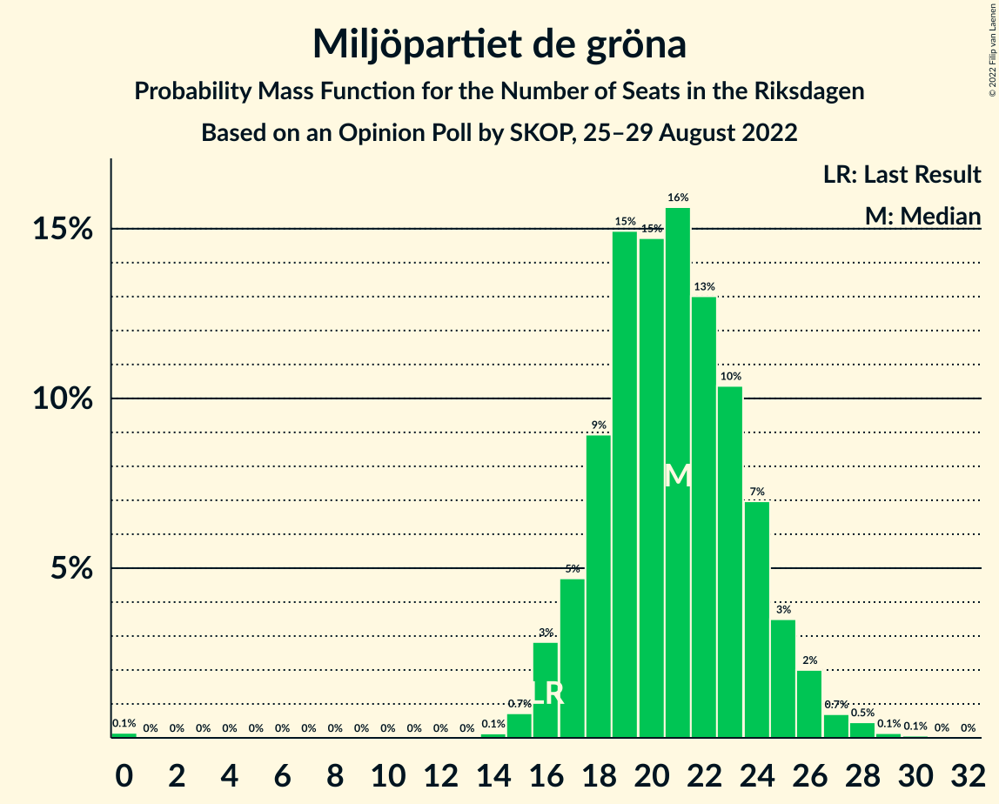
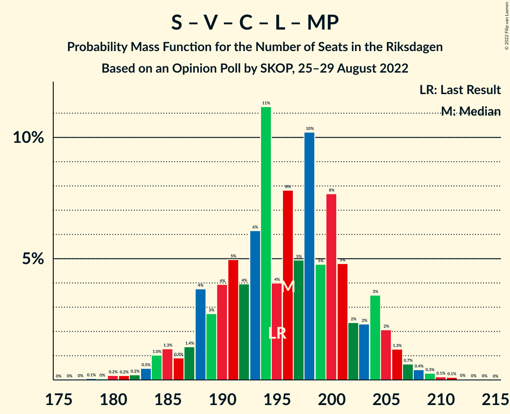
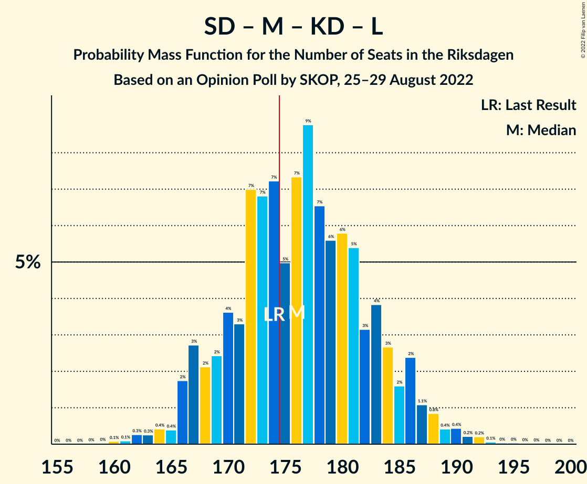
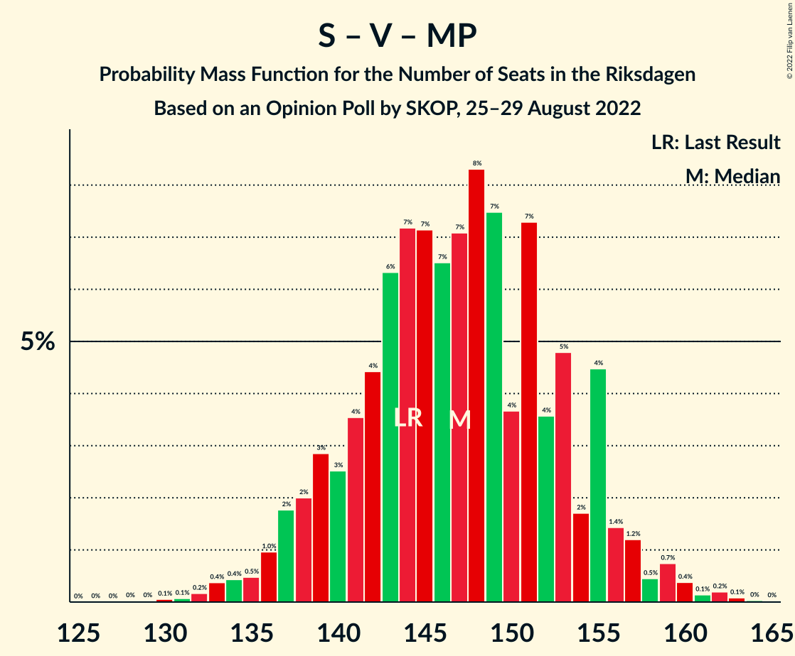
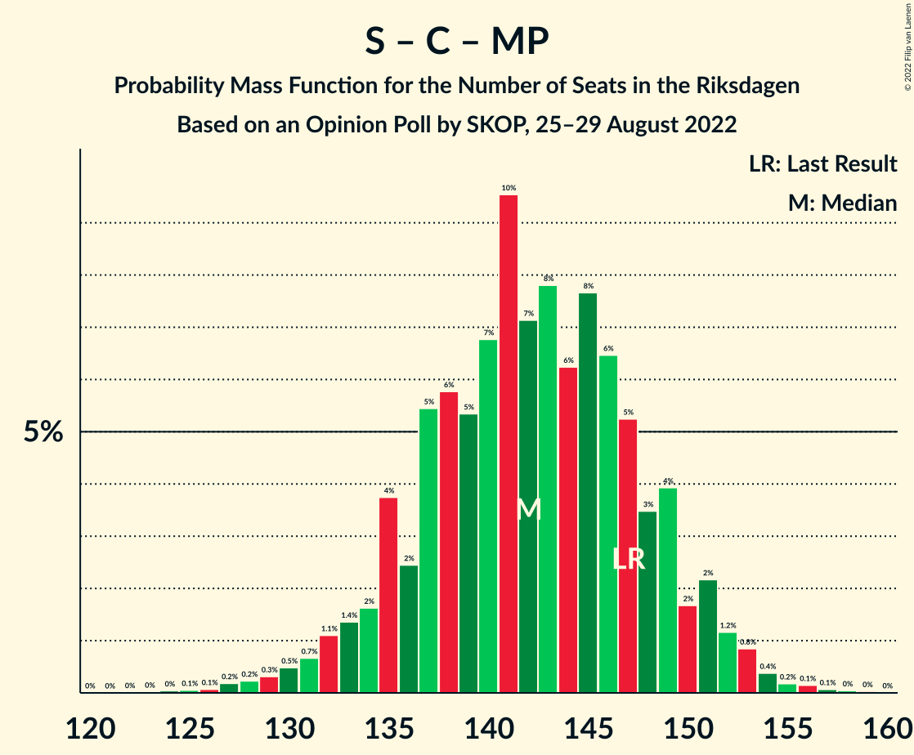
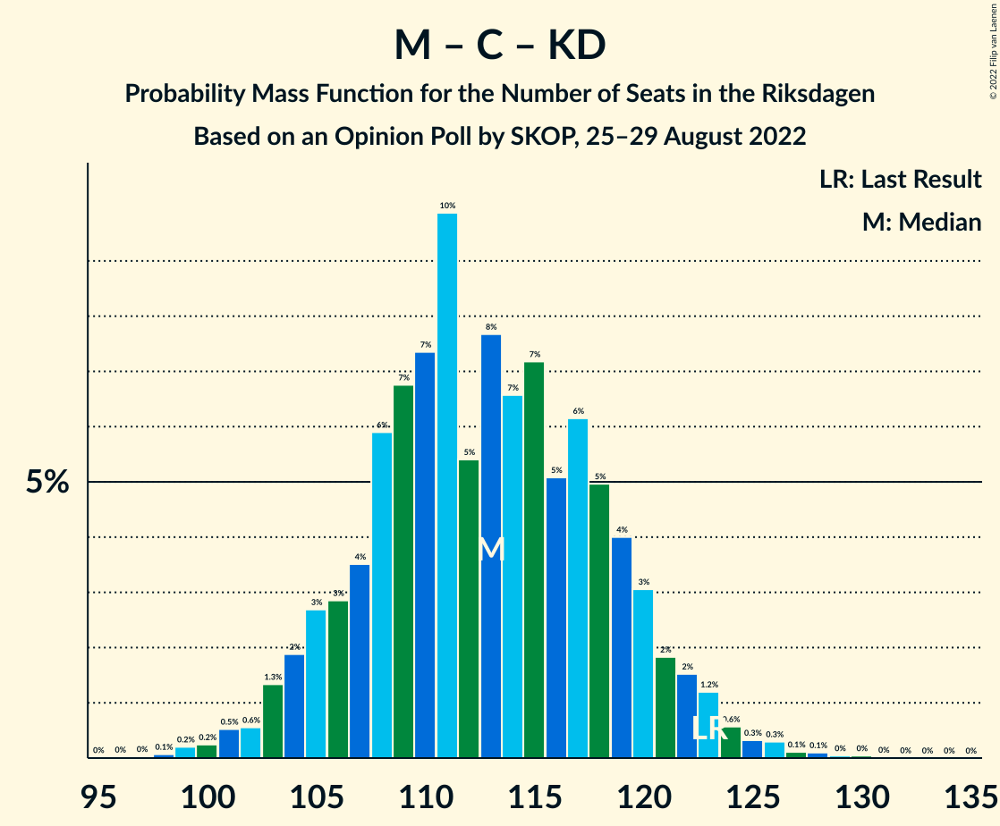
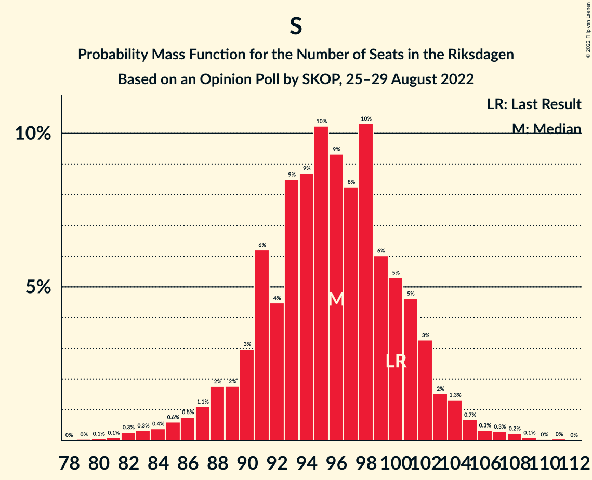

# Opinion Poll by SKOP, 25–29 August 2022

<a href="#voting-intentions">Voting Intentions</a> | <a href="#seats">Seats</a> | <a href="#coalitions">Coalitions</a> | <a href="#technical-information">Technical Information</a>

## Voting Intentions

### Confidence Intervals

| Party | Last Result | Poll Result | 80% Confidence Interval | 90% Confidence Interval | 95% Confidence Interval | 99% Confidence Interval |
|:-----:|:-----------:|:-----------:|:-----------------------:|:-----------------------:|:-----------------------:|:-----------------------:|
| Sveriges socialdemokratiska arbetareparti | 28.3% | 26.8% | 25.1–28.6% |24.6–29.1% |24.2–29.5% |23.4–30.4% |
| Sverigedemokraterna | 17.5% | 18.8% | 17.3–20.4% |16.9–20.8% |16.5–21.2% |15.9–22.0% |
| Moderata samlingspartiet | 19.8% | 18.1% | 16.7–19.7% |16.3–20.1% |15.9–20.5% |15.2–21.3% |
| Vänsterpartiet | 8.0% | 8.7% | 7.7–9.9% |7.4–10.2% |7.1–10.5% |6.7–11.1% |
| Centerpartiet | 8.6% | 7.2% | 6.3–8.3% |6.0–8.6% |5.8–8.9% |5.4–9.5% |
| Kristdemokraterna | 6.3% | 6.5% | 5.7–7.6% |5.4–7.9% |5.2–8.2% |4.8–8.7% |
| Liberalerna | 5.5% | 6.4% | 5.6–7.5% |5.3–7.8% |5.1–8.1% |4.7–8.6% |
| Miljöpartiet de gröna | 4.4% | 5.9% | 5.0–6.9% |4.8–7.2% |4.6–7.5% |4.3–8.0% |

*Note:* The poll result column reflects the actual value used in the calculations. Published results may vary slightly, and in addition be rounded to fewer digits.

## Seats

### Confidence Intervals

| Party | Last Result | Median | 80% Confidence Interval | 90% Confidence Interval | 95% Confidence Interval | 99% Confidence Interval |
|:-----:|:-----------:|:------:|:-----------------------:|:-----------------------:|:-----------------------:|:-----------------------:|
| <a href="#sveriges-socialdemokratiska-arbetareparti">Sveriges socialdemokratiska arbetareparti</a> | 100 | 98 | 93–102 |91–104 |86–104 |82–107 |
| <a href="#sverigedemokraterna">Sverigedemokraterna</a> | 62 | 65 | 60–70 |58–71 |57–72 |55–76 |
| <a href="#moderata-samlingspartiet">Moderata samlingspartiet</a> | 70 | 62 | 57–67 |56–69 |55–70 |53–74 |
| <a href="#vänsterpartiet">Vänsterpartiet</a> | 28 | 30 | 27–34 |27–35 |26–36 |25–39 |
| <a href="#centerpartiet">Centerpartiet</a> | 31 | 27 | 23–30 |22–31 |22–32 |20–34 |
| <a href="#kristdemokraterna">Kristdemokraterna</a> | 22 | 23 | 20–27 |19–28 |18–29 |17–30 |
| <a href="#liberalerna">Liberalerna</a> | 20 | 24 | 19–27 |19–28 |19–28 |16–31 |
| <a href="#miljöpartiet-de-gröna">Miljöpartiet de gröna</a> | 16 | 20 | 17–23 |16–24 |16–25 |15–28 |

### Sveriges socialdemokratiska arbetareparti

*For a full overview of the results for this party, see the [Sveriges socialdemokratiska arbetareparti](party-sverigessocialdemokratiskaarbetareparti.html) page.*

| Number of Seats | Probability | Accumulated | Special Marks |
|:---------------:|:-----------:|:-----------:|:-------------:|
| 79 | 0.1% | 100% |  |
| 80 | 0.1% | 99.9% |  |
| 81 | 0.1% | 99.8% |  |
| 82 | 0.5% | 99.7% |  |
| 83 | 0.3% | 99.3% |  |
| 84 | 0.2% | 98.9% |  |
| 85 | 0.5% | 98.7% |  |
| 86 | 0.9% | 98% |  |
| 87 | 0.5% | 97% |  |
| 88 | 0.4% | 97% |  |
| 89 | 0.5% | 96% |  |
| 90 | 0.7% | 96% |  |
| 91 | 1.5% | 95% |  |
| 92 | 2% | 94% |  |
| 93 | 4% | 92% |  |
| 94 | 7% | 89% |  |
| 95 | 5% | 82% |  |
| 96 | 9% | 76% |  |
| 97 | 14% | 67% |  |
| 98 | 7% | 53% | Median |
| 99 | 7% | 47% |  |
| 100 | 13% | 40% | Last Result |
| 101 | 10% | 27% |  |
| 102 | 9% | 17% |  |
| 103 | 3% | 8% |  |
| 104 | 3% | 5% |  |
| 105 | 2% | 2% |  |
| 106 | 0.2% | 0.8% |  |
| 107 | 0.3% | 0.6% |  |
| 108 | 0.2% | 0.3% |  |
| 109 | 0% | 0.1% |  |
| 110 | 0% | 0% |  |

### Sverigedemokraterna

*For a full overview of the results for this party, see the [Sverigedemokraterna](party-sverigedemokraterna.html) page.*

| Number of Seats | Probability | Accumulated | Special Marks |
|:---------------:|:-----------:|:-----------:|:-------------:|
| 53 | 0.1% | 100% |  |
| 54 | 0.1% | 99.9% |  |
| 55 | 0.3% | 99.8% |  |
| 56 | 0.9% | 99.5% |  |
| 57 | 1.5% | 98.6% |  |
| 58 | 2% | 97% |  |
| 59 | 4% | 95% |  |
| 60 | 4% | 90% |  |
| 61 | 7% | 87% |  |
| 62 | 8% | 80% | Last Result |
| 63 | 8% | 71% |  |
| 64 | 10% | 63% |  |
| 65 | 12% | 54% | Median |
| 66 | 11% | 41% |  |
| 67 | 9% | 30% |  |
| 68 | 7% | 22% |  |
| 69 | 4% | 14% |  |
| 70 | 3% | 10% |  |
| 71 | 4% | 7% |  |
| 72 | 1.4% | 4% |  |
| 73 | 0.9% | 2% |  |
| 74 | 0.6% | 2% |  |
| 75 | 0.4% | 1.0% |  |
| 76 | 0.2% | 0.6% |  |
| 77 | 0.2% | 0.5% |  |
| 78 | 0.1% | 0.2% |  |
| 79 | 0.1% | 0.1% |  |
| 80 | 0% | 0% |  |

### Moderata samlingspartiet

*For a full overview of the results for this party, see the [Moderata samlingspartiet](party-moderatasamlingspartiet.html) page.*

| Number of Seats | Probability | Accumulated | Special Marks |
|:---------------:|:-----------:|:-----------:|:-------------:|
| 51 | 0.1% | 100% |  |
| 52 | 0.3% | 99.9% |  |
| 53 | 0.2% | 99.6% |  |
| 54 | 0.5% | 99.4% |  |
| 55 | 2% | 98.9% |  |
| 56 | 5% | 97% |  |
| 57 | 3% | 92% |  |
| 58 | 5% | 89% |  |
| 59 | 4% | 84% |  |
| 60 | 8% | 80% |  |
| 61 | 12% | 72% |  |
| 62 | 15% | 60% | Median |
| 63 | 5% | 45% |  |
| 64 | 5% | 40% |  |
| 65 | 12% | 35% |  |
| 66 | 7% | 23% |  |
| 67 | 7% | 16% |  |
| 68 | 2% | 9% |  |
| 69 | 4% | 7% |  |
| 70 | 2% | 4% | Last Result |
| 71 | 0.4% | 2% |  |
| 72 | 0.3% | 1.5% |  |
| 73 | 0.6% | 1.1% |  |
| 74 | 0.3% | 0.5% |  |
| 75 | 0.1% | 0.3% |  |
| 76 | 0.1% | 0.2% |  |
| 77 | 0.1% | 0.1% |  |
| 78 | 0% | 0% |  |

### Vänsterpartiet

*For a full overview of the results for this party, see the [Vänsterpartiet](party-vänsterpartiet.html) page.*

| Number of Seats | Probability | Accumulated | Special Marks |
|:---------------:|:-----------:|:-----------:|:-------------:|
| 22 | 0.1% | 100% |  |
| 23 | 0.1% | 99.9% |  |
| 24 | 0.3% | 99.8% |  |
| 25 | 0.9% | 99.5% |  |
| 26 | 3% | 98.6% |  |
| 27 | 7% | 96% |  |
| 28 | 11% | 89% | Last Result |
| 29 | 12% | 78% |  |
| 30 | 23% | 66% | Median |
| 31 | 11% | 43% |  |
| 32 | 9% | 32% |  |
| 33 | 13% | 23% |  |
| 34 | 4% | 10% |  |
| 35 | 4% | 7% |  |
| 36 | 0.7% | 3% |  |
| 37 | 1.2% | 2% |  |
| 38 | 0.3% | 1.3% |  |
| 39 | 0.6% | 1.0% |  |
| 40 | 0.1% | 0.4% |  |
| 41 | 0.2% | 0.3% |  |
| 42 | 0% | 0.1% |  |
| 43 | 0.1% | 0.1% |  |
| 44 | 0% | 0% |  |

### Centerpartiet

*For a full overview of the results for this party, see the [Centerpartiet](party-centerpartiet.html) page.*

| Number of Seats | Probability | Accumulated | Special Marks |
|:---------------:|:-----------:|:-----------:|:-------------:|
| 18 | 0.1% | 100% |  |
| 19 | 0.2% | 99.9% |  |
| 20 | 0.8% | 99.7% |  |
| 21 | 1.3% | 98.9% |  |
| 22 | 4% | 98% |  |
| 23 | 4% | 93% |  |
| 24 | 10% | 89% |  |
| 25 | 13% | 79% |  |
| 26 | 11% | 65% |  |
| 27 | 11% | 54% | Median |
| 28 | 15% | 43% |  |
| 29 | 12% | 28% |  |
| 30 | 9% | 17% |  |
| 31 | 4% | 8% | Last Result |
| 32 | 2% | 3% |  |
| 33 | 0.6% | 1.2% |  |
| 34 | 0.4% | 0.5% |  |
| 35 | 0.1% | 0.2% |  |
| 36 | 0% | 0% |  |

### Kristdemokraterna

*For a full overview of the results for this party, see the [Kristdemokraterna](party-kristdemokraterna.html) page.*

| Number of Seats | Probability | Accumulated | Special Marks |
|:---------------:|:-----------:|:-----------:|:-------------:|
| 16 | 0.2% | 100% |  |
| 17 | 0.7% | 99.7% |  |
| 18 | 2% | 99.1% |  |
| 19 | 3% | 97% |  |
| 20 | 8% | 94% |  |
| 21 | 15% | 87% |  |
| 22 | 11% | 71% | Last Result |
| 23 | 11% | 60% | Median |
| 24 | 18% | 49% |  |
| 25 | 13% | 31% |  |
| 26 | 7% | 19% |  |
| 27 | 3% | 12% |  |
| 28 | 6% | 9% |  |
| 29 | 2% | 3% |  |
| 30 | 0.4% | 0.8% |  |
| 31 | 0.2% | 0.4% |  |
| 32 | 0.2% | 0.2% |  |
| 33 | 0.1% | 0.1% |  |
| 34 | 0% | 0% |  |

### Liberalerna

*For a full overview of the results for this party, see the [Liberalerna](party-liberalerna.html) page.*

| Number of Seats | Probability | Accumulated | Special Marks |
|:---------------:|:-----------:|:-----------:|:-------------:|
| 16 | 0.5% | 100% |  |
| 17 | 0.3% | 99.4% |  |
| 18 | 1.2% | 99.1% |  |
| 19 | 8% | 98% |  |
| 20 | 3% | 90% | Last Result |
| 21 | 12% | 87% |  |
| 22 | 17% | 75% |  |
| 23 | 7% | 58% |  |
| 24 | 19% | 52% | Median |
| 25 | 17% | 33% |  |
| 26 | 3% | 16% |  |
| 27 | 4% | 13% |  |
| 28 | 6% | 8% |  |
| 29 | 0.3% | 2% |  |
| 30 | 0.9% | 2% |  |
| 31 | 0.6% | 0.7% |  |
| 32 | 0% | 0.1% |  |
| 33 | 0.1% | 0.1% |  |
| 34 | 0% | 0% |  |

### Miljöpartiet de gröna

*For a full overview of the results for this party, see the [Miljöpartiet de gröna](party-miljöpartietdegröna.html) page.*

| Number of Seats | Probability | Accumulated | Special Marks |
|:---------------:|:-----------:|:-----------:|:-------------:|
| 0 | 0.3% | 100% |  |
| 1 | 0% | 99.7% |  |
| 2 | 0% | 99.7% |  |
| 3 | 0% | 99.7% |  |
| 4 | 0% | 99.7% |  |
| 5 | 0% | 99.7% |  |
| 6 | 0% | 99.7% |  |
| 7 | 0% | 99.7% |  |
| 8 | 0% | 99.7% |  |
| 9 | 0% | 99.7% |  |
| 10 | 0% | 99.7% |  |
| 11 | 0% | 99.7% |  |
| 12 | 0% | 99.7% |  |
| 13 | 0% | 99.7% |  |
| 14 | 0.2% | 99.7% |  |
| 15 | 1.2% | 99.5% |  |
| 16 | 6% | 98% | Last Result |
| 17 | 9% | 92% |  |
| 18 | 11% | 83% |  |
| 19 | 14% | 73% |  |
| 20 | 18% | 58% | Median |
| 21 | 13% | 40% |  |
| 22 | 10% | 27% |  |
| 23 | 9% | 17% |  |
| 24 | 4% | 8% |  |
| 25 | 1.3% | 4% |  |
| 26 | 1.4% | 2% |  |
| 27 | 0.5% | 1.1% |  |
| 28 | 0.4% | 0.5% |  |
| 29 | 0.1% | 0.2% |  |
| 30 | 0.1% | 0.1% |  |
| 31 | 0% | 0% |  |

## Coalitions

### Confidence Intervals

| Coalition | Last Result | Median | Majority? | 80% Confidence Interval | 90% Confidence Interval | 95% Confidence Interval | 99% Confidence Interval |
|:---------:|:-----------:|:------:|:---------:|:-----------------------:|:-----------------------:|:-----------------------:|:-----------------------:|
| Sveriges socialdemokratiska arbetareparti – Vänsterpartiet – Centerpartiet – Liberalerna – Miljöpartiet de gröna | 195 | 199 | 100% | 193–205 | 191–205 | 188–207 | 181–209 |
| Sveriges socialdemokratiska arbetareparti – Moderata samlingspartiet – Centerpartiet | 201 | 188 | 98.8% | 181–194 | 178–195 | 176–196 | 172–198 |
| Sverigedemokraterna – Moderata samlingspartiet – Kristdemokraterna – Liberalerna | 174 | 174 | 41% | 168–180 | 167–182 | 166–184 | 162–190 |
| Sveriges socialdemokratiska arbetareparti – Vänsterpartiet – Centerpartiet – Miljöpartiet de gröna | 175 | 175 | 59% | 169–181 | 167–182 | 165–183 | 159–187 |
| Sveriges socialdemokratiska arbetareparti – Centerpartiet – Liberalerna – Miljöpartiet de gröna | 167 | 168 | 8% | 163–174 | 161–175 | 157–176 | 150–178 |
| Sveriges socialdemokratiska arbetareparti – Moderata samlingspartiet | 170 | 160 | 0.2% | 154–167 | 152–168 | 150–169 | 146–172 |
| Sverigedemokraterna – Moderata samlingspartiet – Kristdemokraterna | 154 | 150 | 0% | 144–156 | 144–158 | 142–161 | 140–168 |
| Sveriges socialdemokratiska arbetareparti – Vänsterpartiet – Miljöpartiet de gröna | 144 | 148 | 0% | 142–155 | 140–157 | 138–158 | 134–162 |
| Sveriges socialdemokratiska arbetareparti – Centerpartiet – Miljöpartiet de gröna | 147 | 145 | 0% | 138–151 | 137–152 | 134–153 | 127–155 |
| Moderata samlingspartiet – Centerpartiet – Kristdemokraterna – Liberalerna | 143 | 137 | 0% | 129–143 | 126–145 | 125–146 | 122–150 |
| Sverigedemokraterna – Moderata samlingspartiet | 132 | 127 | 0% | 122–132 | 121–135 | 120–137 | 118–143 |
| Sveriges socialdemokratiska arbetareparti – Vänsterpartiet | 128 | 129 | 0% | 122–135 | 120–136 | 118–137 | 113–140 |
| Sveriges socialdemokratiska arbetareparti – Miljöpartiet de gröna | 116 | 118 | 0% | 112–124 | 110–125 | 108–126 | 103–130 |
| Moderata samlingspartiet – Centerpartiet – Liberalerna | 121 | 113 | 0% | 106–119 | 104–121 | 103–123 | 100–126 |
| Moderata samlingspartiet – Centerpartiet – Kristdemokraterna | 123 | 113 | 0% | 105–119 | 104–121 | 102–122 | 99–126 |
| Moderata samlingspartiet – Kristdemokraterna – Liberalerna | 112 | 109 | 0% | 102–116 | 101–117 | 99–119 | 97–122 |
| Sveriges socialdemokratiska arbetareparti | 100 | 98 | 0% | 93–102 | 91–104 | 86–104 | 82–107 |
| Moderata samlingspartiet – Centerpartiet | 101 | 90 | 0% | 83–95 | 81–97 | 80–98 | 77–102 |
| Moderata samlingspartiet – Kristdemokraterna | 92 | 86 | 0% | 80–92 | 78–93 | 77–95 | 75–98 |

### Sveriges socialdemokratiska arbetareparti – Vänsterpartiet – Centerpartiet – Liberalerna – Miljöpartiet de gröna

| Number of Seats | Probability | Accumulated | Special Marks |
|:---------------:|:-----------:|:-----------:|:-------------:|
| 177 | 0% | 100% |  |
| 178 | 0% | 99.9% |  |
| 179 | 0% | 99.9% |  |
| 180 | 0.3% | 99.9% |  |
| 181 | 0.2% | 99.6% |  |
| 182 | 0.1% | 99.4% |  |
| 183 | 0.1% | 99.3% |  |
| 184 | 0.4% | 99.1% |  |
| 185 | 0.5% | 98.7% |  |
| 186 | 0.2% | 98% |  |
| 187 | 0.3% | 98% |  |
| 188 | 0.7% | 98% |  |
| 189 | 0.3% | 97% |  |
| 190 | 1.1% | 97% |  |
| 191 | 3% | 96% |  |
| 192 | 0.8% | 92% |  |
| 193 | 4% | 91% |  |
| 194 | 4% | 88% |  |
| 195 | 7% | 84% | Last Result |
| 196 | 7% | 77% |  |
| 197 | 9% | 70% |  |
| 198 | 9% | 61% |  |
| 199 | 11% | 52% | Median |
| 200 | 10% | 41% |  |
| 201 | 7% | 31% |  |
| 202 | 6% | 24% |  |
| 203 | 3% | 18% |  |
| 204 | 5% | 15% |  |
| 205 | 6% | 10% |  |
| 206 | 2% | 4% |  |
| 207 | 1.3% | 3% |  |
| 208 | 0.4% | 1.3% |  |
| 209 | 0.6% | 0.9% |  |
| 210 | 0.2% | 0.3% |  |
| 211 | 0% | 0.1% |  |
| 212 | 0.1% | 0.1% |  |
| 213 | 0% | 0% |  |

### Sveriges socialdemokratiska arbetareparti – Moderata samlingspartiet – Centerpartiet

| Number of Seats | Probability | Accumulated | Special Marks |
|:---------------:|:-----------:|:-----------:|:-------------:|
| 168 | 0% | 100% |  |
| 169 | 0.1% | 99.9% |  |
| 170 | 0.1% | 99.9% |  |
| 171 | 0.2% | 99.8% |  |
| 172 | 0.1% | 99.5% |  |
| 173 | 0.4% | 99.4% |  |
| 174 | 0.3% | 99.1% |  |
| 175 | 0.6% | 98.8% | Majority |
| 176 | 0.9% | 98% |  |
| 177 | 0.4% | 97% |  |
| 178 | 2% | 97% |  |
| 179 | 0.8% | 95% |  |
| 180 | 3% | 94% |  |
| 181 | 2% | 90% |  |
| 182 | 5% | 88% |  |
| 183 | 5% | 83% |  |
| 184 | 6% | 78% |  |
| 185 | 5% | 72% |  |
| 186 | 11% | 66% |  |
| 187 | 4% | 55% | Median |
| 188 | 11% | 51% |  |
| 189 | 6% | 40% |  |
| 190 | 11% | 34% |  |
| 191 | 5% | 23% |  |
| 192 | 5% | 18% |  |
| 193 | 2% | 13% |  |
| 194 | 5% | 11% |  |
| 195 | 3% | 6% |  |
| 196 | 1.1% | 3% |  |
| 197 | 0.9% | 2% |  |
| 198 | 0.4% | 0.9% |  |
| 199 | 0.2% | 0.5% |  |
| 200 | 0.2% | 0.3% |  |
| 201 | 0.1% | 0.2% | Last Result |
| 202 | 0% | 0.1% |  |
| 203 | 0% | 0% |  |

### Sverigedemokraterna – Moderata samlingspartiet – Kristdemokraterna – Liberalerna

| Number of Seats | Probability | Accumulated | Special Marks |
|:---------------:|:-----------:|:-----------:|:-------------:|
| 160 | 0% | 100% |  |
| 161 | 0.1% | 99.9% |  |
| 162 | 0.5% | 99.8% |  |
| 163 | 0.4% | 99.3% |  |
| 164 | 0.5% | 99.0% |  |
| 165 | 0.3% | 98.5% |  |
| 166 | 1.3% | 98% |  |
| 167 | 5% | 97% |  |
| 168 | 6% | 92% |  |
| 169 | 5% | 86% |  |
| 170 | 6% | 81% |  |
| 171 | 6% | 76% |  |
| 172 | 8% | 70% |  |
| 173 | 10% | 62% |  |
| 174 | 12% | 53% | Last Result, Median |
| 175 | 10% | 41% | Majority |
| 176 | 4% | 31% |  |
| 177 | 5% | 27% |  |
| 178 | 6% | 22% |  |
| 179 | 6% | 16% |  |
| 180 | 0.9% | 10% |  |
| 181 | 3% | 9% |  |
| 182 | 2% | 6% |  |
| 183 | 2% | 4% |  |
| 184 | 0.4% | 3% |  |
| 185 | 0.3% | 2% |  |
| 186 | 0.2% | 2% |  |
| 187 | 0.5% | 2% |  |
| 188 | 0.5% | 1.2% |  |
| 189 | 0.1% | 0.7% |  |
| 190 | 0.1% | 0.6% |  |
| 191 | 0.1% | 0.4% |  |
| 192 | 0.2% | 0.4% |  |
| 193 | 0.1% | 0.1% |  |
| 194 | 0% | 0.1% |  |
| 195 | 0% | 0.1% |  |
| 196 | 0% | 0% |  |

### Sveriges socialdemokratiska arbetareparti – Vänsterpartiet – Centerpartiet – Miljöpartiet de gröna

| Number of Seats | Probability | Accumulated | Special Marks |
|:---------------:|:-----------:|:-----------:|:-------------:|
| 154 | 0% | 100% |  |
| 155 | 0% | 99.9% |  |
| 156 | 0.1% | 99.9% |  |
| 157 | 0.2% | 99.9% |  |
| 158 | 0.1% | 99.6% |  |
| 159 | 0.1% | 99.6% |  |
| 160 | 0.1% | 99.4% |  |
| 161 | 0.5% | 99.3% |  |
| 162 | 0.5% | 98.8% |  |
| 163 | 0.2% | 98% |  |
| 164 | 0.3% | 98% |  |
| 165 | 0.4% | 98% |  |
| 166 | 2% | 97% |  |
| 167 | 2% | 96% |  |
| 168 | 3% | 94% |  |
| 169 | 0.9% | 91% |  |
| 170 | 6% | 90% |  |
| 171 | 6% | 84% |  |
| 172 | 5% | 78% |  |
| 173 | 4% | 73% |  |
| 174 | 10% | 69% |  |
| 175 | 12% | 59% | Last Result, Median, Majority |
| 176 | 10% | 47% |  |
| 177 | 8% | 38% |  |
| 178 | 6% | 30% |  |
| 179 | 6% | 24% |  |
| 180 | 5% | 19% |  |
| 181 | 6% | 14% |  |
| 182 | 5% | 8% |  |
| 183 | 1.3% | 3% |  |
| 184 | 0.3% | 2% |  |
| 185 | 0.5% | 1.5% |  |
| 186 | 0.4% | 1.0% |  |
| 187 | 0.5% | 0.7% |  |
| 188 | 0.1% | 0.2% |  |
| 189 | 0% | 0.1% |  |
| 190 | 0% | 0% |  |

### Sveriges socialdemokratiska arbetareparti – Centerpartiet – Liberalerna – Miljöpartiet de gröna

| Number of Seats | Probability | Accumulated | Special Marks |
|:---------------:|:-----------:|:-----------:|:-------------:|
| 145 | 0% | 100% |  |
| 146 | 0% | 99.9% |  |
| 147 | 0.1% | 99.9% |  |
| 148 | 0% | 99.8% |  |
| 149 | 0.2% | 99.8% |  |
| 150 | 0.4% | 99.6% |  |
| 151 | 0.2% | 99.2% |  |
| 152 | 0.5% | 99.1% |  |
| 153 | 0.1% | 98.6% |  |
| 154 | 0.3% | 98% |  |
| 155 | 0.3% | 98% |  |
| 156 | 0.2% | 98% |  |
| 157 | 0.5% | 98% |  |
| 158 | 0.9% | 97% |  |
| 159 | 0.5% | 96% |  |
| 160 | 0.7% | 96% |  |
| 161 | 2% | 95% |  |
| 162 | 1.1% | 93% |  |
| 163 | 8% | 91% |  |
| 164 | 4% | 84% |  |
| 165 | 5% | 80% |  |
| 166 | 6% | 75% |  |
| 167 | 12% | 69% | Last Result |
| 168 | 8% | 57% |  |
| 169 | 13% | 49% | Median |
| 170 | 9% | 36% |  |
| 171 | 8% | 27% |  |
| 172 | 4% | 19% |  |
| 173 | 3% | 15% |  |
| 174 | 3% | 11% |  |
| 175 | 5% | 8% | Majority |
| 176 | 2% | 3% |  |
| 177 | 0.6% | 1.3% |  |
| 178 | 0.4% | 0.7% |  |
| 179 | 0.1% | 0.3% |  |
| 180 | 0.1% | 0.2% |  |
| 181 | 0.1% | 0.1% |  |
| 182 | 0% | 0% |  |

### Sveriges socialdemokratiska arbetareparti – Moderata samlingspartiet

| Number of Seats | Probability | Accumulated | Special Marks |
|:---------------:|:-----------:|:-----------:|:-------------:|
| 142 | 0% | 100% |  |
| 143 | 0.1% | 99.9% |  |
| 144 | 0.1% | 99.9% |  |
| 145 | 0.1% | 99.8% |  |
| 146 | 0.2% | 99.7% |  |
| 147 | 0.2% | 99.5% |  |
| 148 | 0.8% | 99.3% |  |
| 149 | 0.9% | 98.6% |  |
| 150 | 0.5% | 98% |  |
| 151 | 2% | 97% |  |
| 152 | 1.3% | 96% |  |
| 153 | 2% | 94% |  |
| 154 | 2% | 92% |  |
| 155 | 6% | 90% |  |
| 156 | 4% | 84% |  |
| 157 | 6% | 80% |  |
| 158 | 11% | 74% |  |
| 159 | 6% | 63% |  |
| 160 | 9% | 57% | Median |
| 161 | 6% | 48% |  |
| 162 | 9% | 42% |  |
| 163 | 5% | 33% |  |
| 164 | 8% | 28% |  |
| 165 | 6% | 20% |  |
| 166 | 3% | 14% |  |
| 167 | 3% | 11% |  |
| 168 | 4% | 8% |  |
| 169 | 2% | 4% |  |
| 170 | 0.4% | 2% | Last Result |
| 171 | 0.8% | 2% |  |
| 172 | 0.5% | 0.9% |  |
| 173 | 0.2% | 0.4% |  |
| 174 | 0.1% | 0.3% |  |
| 175 | 0.1% | 0.2% | Majority |
| 176 | 0% | 0.1% |  |
| 177 | 0% | 0% |  |

### Sverigedemokraterna – Moderata samlingspartiet – Kristdemokraterna

| Number of Seats | Probability | Accumulated | Special Marks |
|:---------------:|:-----------:|:-----------:|:-------------:|
| 137 | 0.1% | 100% |  |
| 138 | 0% | 99.9% |  |
| 139 | 0.2% | 99.9% |  |
| 140 | 0.6% | 99.7% |  |
| 141 | 0.4% | 99.1% |  |
| 142 | 1.3% | 98.7% |  |
| 143 | 2% | 97% |  |
| 144 | 6% | 96% |  |
| 145 | 5% | 90% |  |
| 146 | 3% | 85% |  |
| 147 | 6% | 82% |  |
| 148 | 7% | 76% |  |
| 149 | 10% | 69% |  |
| 150 | 11% | 59% | Median |
| 151 | 9% | 48% |  |
| 152 | 9% | 39% |  |
| 153 | 7% | 30% |  |
| 154 | 7% | 23% | Last Result |
| 155 | 4% | 16% |  |
| 156 | 4% | 12% |  |
| 157 | 0.8% | 9% |  |
| 158 | 3% | 8% |  |
| 159 | 1.1% | 4% |  |
| 160 | 0.3% | 3% |  |
| 161 | 0.7% | 3% |  |
| 162 | 0.3% | 2% |  |
| 163 | 0.2% | 2% |  |
| 164 | 0.5% | 2% |  |
| 165 | 0.4% | 1.3% |  |
| 166 | 0.1% | 0.9% |  |
| 167 | 0.1% | 0.7% |  |
| 168 | 0.2% | 0.6% |  |
| 169 | 0.3% | 0.4% |  |
| 170 | 0% | 0.1% |  |
| 171 | 0% | 0.1% |  |
| 172 | 0% | 0.1% |  |
| 173 | 0% | 0% |  |

### Sveriges socialdemokratiska arbetareparti – Vänsterpartiet – Miljöpartiet de gröna

| Number of Seats | Probability | Accumulated | Special Marks |
|:---------------:|:-----------:|:-----------:|:-------------:|
| 128 | 0% | 100% |  |
| 129 | 0% | 99.9% |  |
| 130 | 0% | 99.9% |  |
| 131 | 0.1% | 99.9% |  |
| 132 | 0.2% | 99.9% |  |
| 133 | 0.1% | 99.7% |  |
| 134 | 0.1% | 99.6% |  |
| 135 | 0.4% | 99.4% |  |
| 136 | 1.0% | 99.1% |  |
| 137 | 0.4% | 98% |  |
| 138 | 0.4% | 98% |  |
| 139 | 1.2% | 97% |  |
| 140 | 2% | 96% |  |
| 141 | 3% | 94% |  |
| 142 | 5% | 91% |  |
| 143 | 6% | 87% |  |
| 144 | 7% | 81% | Last Result |
| 145 | 6% | 74% |  |
| 146 | 6% | 68% |  |
| 147 | 9% | 61% |  |
| 148 | 4% | 52% | Median |
| 149 | 7% | 49% |  |
| 150 | 2% | 42% |  |
| 151 | 8% | 40% |  |
| 152 | 7% | 32% |  |
| 153 | 12% | 25% |  |
| 154 | 1.2% | 13% |  |
| 155 | 3% | 12% |  |
| 156 | 3% | 9% |  |
| 157 | 3% | 6% |  |
| 158 | 0.4% | 3% |  |
| 159 | 0.8% | 2% |  |
| 160 | 0.4% | 1.3% |  |
| 161 | 0.2% | 1.0% |  |
| 162 | 0.6% | 0.8% |  |
| 163 | 0.1% | 0.3% |  |
| 164 | 0.1% | 0.1% |  |
| 165 | 0% | 0% |  |

### Sveriges socialdemokratiska arbetareparti – Centerpartiet – Miljöpartiet de gröna

| Number of Seats | Probability | Accumulated | Special Marks |
|:---------------:|:-----------:|:-----------:|:-------------:|
| 123 | 0% | 100% |  |
| 124 | 0.1% | 99.9% |  |
| 125 | 0.1% | 99.8% |  |
| 126 | 0.1% | 99.8% |  |
| 127 | 0.2% | 99.6% |  |
| 128 | 0.1% | 99.4% |  |
| 129 | 0.4% | 99.3% |  |
| 130 | 0.4% | 98.9% |  |
| 131 | 0.2% | 98.5% |  |
| 132 | 0.4% | 98% |  |
| 133 | 0.3% | 98% |  |
| 134 | 0.3% | 98% |  |
| 135 | 0.9% | 97% |  |
| 136 | 1.4% | 96% |  |
| 137 | 2% | 95% |  |
| 138 | 4% | 93% |  |
| 139 | 2% | 89% |  |
| 140 | 5% | 88% |  |
| 141 | 6% | 82% |  |
| 142 | 5% | 76% |  |
| 143 | 8% | 71% |  |
| 144 | 7% | 63% |  |
| 145 | 15% | 56% | Median |
| 146 | 10% | 42% |  |
| 147 | 5% | 32% | Last Result |
| 148 | 5% | 27% |  |
| 149 | 7% | 22% |  |
| 150 | 3% | 15% |  |
| 151 | 5% | 11% |  |
| 152 | 3% | 6% |  |
| 153 | 2% | 4% |  |
| 154 | 0.7% | 1.4% |  |
| 155 | 0.2% | 0.6% |  |
| 156 | 0.2% | 0.4% |  |
| 157 | 0% | 0.2% |  |
| 158 | 0.1% | 0.2% |  |
| 159 | 0.1% | 0.1% |  |
| 160 | 0% | 0% |  |

### Moderata samlingspartiet – Centerpartiet – Kristdemokraterna – Liberalerna

| Number of Seats | Probability | Accumulated | Special Marks |
|:---------------:|:-----------:|:-----------:|:-------------:|
| 119 | 0% | 100% |  |
| 120 | 0.1% | 99.9% |  |
| 121 | 0.1% | 99.9% |  |
| 122 | 0.6% | 99.7% |  |
| 123 | 0.5% | 99.1% |  |
| 124 | 0.2% | 98.6% |  |
| 125 | 1.2% | 98% |  |
| 126 | 3% | 97% |  |
| 127 | 2% | 95% |  |
| 128 | 2% | 93% |  |
| 129 | 3% | 90% |  |
| 130 | 3% | 87% |  |
| 131 | 4% | 84% |  |
| 132 | 6% | 80% |  |
| 133 | 7% | 74% |  |
| 134 | 5% | 67% |  |
| 135 | 6% | 62% |  |
| 136 | 4% | 57% | Median |
| 137 | 15% | 52% |  |
| 138 | 5% | 37% |  |
| 139 | 6% | 33% |  |
| 140 | 9% | 27% |  |
| 141 | 2% | 18% |  |
| 142 | 6% | 16% |  |
| 143 | 3% | 11% | Last Result |
| 144 | 1.0% | 8% |  |
| 145 | 3% | 7% |  |
| 146 | 0.7% | 3% |  |
| 147 | 0.8% | 2% |  |
| 148 | 0.9% | 2% |  |
| 149 | 0.2% | 0.7% |  |
| 150 | 0.2% | 0.5% |  |
| 151 | 0.1% | 0.3% |  |
| 152 | 0% | 0.2% |  |
| 153 | 0.1% | 0.1% |  |
| 154 | 0% | 0% |  |

### Sverigedemokraterna – Moderata samlingspartiet

| Number of Seats | Probability | Accumulated | Special Marks |
|:---------------:|:-----------:|:-----------:|:-------------:|
| 115 | 0.1% | 100% |  |
| 116 | 0.1% | 99.9% |  |
| 117 | 0.2% | 99.8% |  |
| 118 | 0.4% | 99.6% |  |
| 119 | 2% | 99.2% |  |
| 120 | 1.1% | 98% |  |
| 121 | 2% | 96% |  |
| 122 | 4% | 94% |  |
| 123 | 8% | 90% |  |
| 124 | 6% | 82% |  |
| 125 | 15% | 76% |  |
| 126 | 5% | 62% |  |
| 127 | 11% | 56% | Median |
| 128 | 6% | 46% |  |
| 129 | 14% | 40% |  |
| 130 | 10% | 26% |  |
| 131 | 6% | 16% |  |
| 132 | 3% | 11% | Last Result |
| 133 | 2% | 8% |  |
| 134 | 0.8% | 6% |  |
| 135 | 1.4% | 5% |  |
| 136 | 1.2% | 4% |  |
| 137 | 0.6% | 3% |  |
| 138 | 0.2% | 2% |  |
| 139 | 0.2% | 2% |  |
| 140 | 0.2% | 2% |  |
| 141 | 0.4% | 1.4% |  |
| 142 | 0.3% | 1.0% |  |
| 143 | 0.4% | 0.8% |  |
| 144 | 0.2% | 0.4% |  |
| 145 | 0.1% | 0.2% |  |
| 146 | 0% | 0.1% |  |
| 147 | 0% | 0.1% |  |
| 148 | 0% | 0.1% |  |
| 149 | 0% | 0.1% |  |
| 150 | 0% | 0% |  |

### Sveriges socialdemokratiska arbetareparti – Vänsterpartiet

| Number of Seats | Probability | Accumulated | Special Marks |
|:---------------:|:-----------:|:-----------:|:-------------:|
| 109 | 0.1% | 100% |  |
| 110 | 0.1% | 99.9% |  |
| 111 | 0.1% | 99.9% |  |
| 112 | 0.2% | 99.8% |  |
| 113 | 0.1% | 99.6% |  |
| 114 | 0.5% | 99.5% |  |
| 115 | 0.3% | 98.9% |  |
| 116 | 0.4% | 98.7% |  |
| 117 | 0.5% | 98% |  |
| 118 | 1.1% | 98% |  |
| 119 | 0.9% | 97% |  |
| 120 | 1.2% | 96% |  |
| 121 | 4% | 95% |  |
| 122 | 3% | 91% |  |
| 123 | 4% | 87% |  |
| 124 | 6% | 84% |  |
| 125 | 4% | 78% |  |
| 126 | 11% | 74% |  |
| 127 | 8% | 63% |  |
| 128 | 4% | 55% | Last Result, Median |
| 129 | 5% | 51% |  |
| 130 | 12% | 46% |  |
| 131 | 7% | 34% |  |
| 132 | 7% | 27% |  |
| 133 | 4% | 20% |  |
| 134 | 5% | 16% |  |
| 135 | 3% | 11% |  |
| 136 | 5% | 8% |  |
| 137 | 1.3% | 3% |  |
| 138 | 1.0% | 2% |  |
| 139 | 0.4% | 0.9% |  |
| 140 | 0.3% | 0.5% |  |
| 141 | 0.2% | 0.3% |  |
| 142 | 0.1% | 0.1% |  |
| 143 | 0% | 0% |  |

### Sveriges socialdemokratiska arbetareparti – Miljöpartiet de gröna

| Number of Seats | Probability | Accumulated | Special Marks |
|:---------------:|:-----------:|:-----------:|:-------------:|
| 97 | 0% | 100% |  |
| 98 | 0% | 99.9% |  |
| 99 | 0% | 99.9% |  |
| 100 | 0% | 99.9% |  |
| 101 | 0.1% | 99.8% |  |
| 102 | 0.1% | 99.7% |  |
| 103 | 0.2% | 99.6% |  |
| 104 | 0.5% | 99.4% |  |
| 105 | 0.3% | 98.9% |  |
| 106 | 0.5% | 98.7% |  |
| 107 | 0.6% | 98% |  |
| 108 | 1.0% | 98% |  |
| 109 | 0.8% | 97% |  |
| 110 | 2% | 96% |  |
| 111 | 2% | 94% |  |
| 112 | 4% | 92% |  |
| 113 | 6% | 88% |  |
| 114 | 4% | 82% |  |
| 115 | 12% | 78% |  |
| 116 | 6% | 66% | Last Result |
| 117 | 8% | 60% |  |
| 118 | 9% | 51% | Median |
| 119 | 4% | 42% |  |
| 120 | 6% | 38% |  |
| 121 | 8% | 32% |  |
| 122 | 5% | 24% |  |
| 123 | 7% | 19% |  |
| 124 | 4% | 12% |  |
| 125 | 4% | 7% |  |
| 126 | 0.9% | 3% |  |
| 127 | 0.4% | 2% |  |
| 128 | 0.9% | 2% |  |
| 129 | 0.5% | 1.0% |  |
| 130 | 0.2% | 0.5% |  |
| 131 | 0.2% | 0.3% |  |
| 132 | 0.1% | 0.1% |  |
| 133 | 0% | 0.1% |  |
| 134 | 0% | 0% |  |

### Moderata samlingspartiet – Centerpartiet – Liberalerna

| Number of Seats | Probability | Accumulated | Special Marks |
|:---------------:|:-----------:|:-----------:|:-------------:|
| 97 | 0% | 100% |  |
| 98 | 0.2% | 99.9% |  |
| 99 | 0.2% | 99.8% |  |
| 100 | 0.8% | 99.6% |  |
| 101 | 0.3% | 98.8% |  |
| 102 | 0.7% | 98% |  |
| 103 | 2% | 98% |  |
| 104 | 3% | 96% |  |
| 105 | 2% | 93% |  |
| 106 | 4% | 90% |  |
| 107 | 2% | 86% |  |
| 108 | 4% | 84% |  |
| 109 | 9% | 80% |  |
| 110 | 7% | 71% |  |
| 111 | 4% | 64% |  |
| 112 | 3% | 60% |  |
| 113 | 7% | 56% | Median |
| 114 | 10% | 49% |  |
| 115 | 8% | 39% |  |
| 116 | 14% | 31% |  |
| 117 | 2% | 17% |  |
| 118 | 3% | 16% |  |
| 119 | 3% | 13% |  |
| 120 | 2% | 10% |  |
| 121 | 4% | 7% | Last Result |
| 122 | 0.8% | 3% |  |
| 123 | 0.9% | 3% |  |
| 124 | 0.5% | 2% |  |
| 125 | 0.6% | 1.1% |  |
| 126 | 0.3% | 0.5% |  |
| 127 | 0.1% | 0.2% |  |
| 128 | 0% | 0.1% |  |
| 129 | 0% | 0.1% |  |
| 130 | 0% | 0.1% |  |
| 131 | 0% | 0% |  |

### Moderata samlingspartiet – Centerpartiet – Kristdemokraterna

| Number of Seats | Probability | Accumulated | Special Marks |
|:---------------:|:-----------:|:-----------:|:-------------:|
| 97 | 0% | 100% |  |
| 98 | 0.1% | 99.9% |  |
| 99 | 0.6% | 99.8% |  |
| 100 | 0.2% | 99.2% |  |
| 101 | 1.1% | 99.0% |  |
| 102 | 0.7% | 98% |  |
| 103 | 1.4% | 97% |  |
| 104 | 3% | 96% |  |
| 105 | 3% | 93% |  |
| 106 | 2% | 90% |  |
| 107 | 4% | 88% |  |
| 108 | 4% | 84% |  |
| 109 | 8% | 80% |  |
| 110 | 3% | 72% |  |
| 111 | 9% | 69% |  |
| 112 | 2% | 60% | Median |
| 113 | 11% | 58% |  |
| 114 | 9% | 47% |  |
| 115 | 8% | 38% |  |
| 116 | 10% | 30% |  |
| 117 | 4% | 20% |  |
| 118 | 5% | 16% |  |
| 119 | 4% | 11% |  |
| 120 | 2% | 7% |  |
| 121 | 0.7% | 5% |  |
| 122 | 2% | 4% |  |
| 123 | 0.7% | 2% | Last Result |
| 124 | 0.9% | 2% |  |
| 125 | 0.3% | 0.9% |  |
| 126 | 0.3% | 0.6% |  |
| 127 | 0.1% | 0.4% |  |
| 128 | 0.2% | 0.2% |  |
| 129 | 0% | 0.1% |  |
| 130 | 0% | 0% |  |

### Moderata samlingspartiet – Kristdemokraterna – Liberalerna

| Number of Seats | Probability | Accumulated | Special Marks |
|:---------------:|:-----------:|:-----------:|:-------------:|
| 94 | 0.1% | 100% |  |
| 95 | 0% | 99.9% |  |
| 96 | 0.1% | 99.8% |  |
| 97 | 0.2% | 99.7% |  |
| 98 | 0.4% | 99.5% |  |
| 99 | 2% | 99.1% |  |
| 100 | 1.2% | 97% |  |
| 101 | 3% | 96% |  |
| 102 | 3% | 92% |  |
| 103 | 4% | 90% |  |
| 104 | 4% | 86% |  |
| 105 | 5% | 82% |  |
| 106 | 3% | 78% |  |
| 107 | 12% | 74% |  |
| 108 | 10% | 62% |  |
| 109 | 7% | 52% | Median |
| 110 | 3% | 45% |  |
| 111 | 10% | 41% |  |
| 112 | 5% | 31% | Last Result |
| 113 | 6% | 26% |  |
| 114 | 2% | 20% |  |
| 115 | 5% | 17% |  |
| 116 | 3% | 12% |  |
| 117 | 4% | 9% |  |
| 118 | 0.9% | 4% |  |
| 119 | 2% | 4% |  |
| 120 | 0.9% | 2% |  |
| 121 | 0.3% | 0.9% |  |
| 122 | 0.3% | 0.6% |  |
| 123 | 0.1% | 0.3% |  |
| 124 | 0% | 0.2% |  |
| 125 | 0.1% | 0.1% |  |
| 126 | 0% | 0.1% |  |
| 127 | 0% | 0% |  |

### Sveriges socialdemokratiska arbetareparti

| Number of Seats | Probability | Accumulated | Special Marks |
|:---------------:|:-----------:|:-----------:|:-------------:|
| 79 | 0.1% | 100% |  |
| 80 | 0.1% | 99.9% |  |
| 81 | 0.1% | 99.8% |  |
| 82 | 0.5% | 99.7% |  |
| 83 | 0.3% | 99.3% |  |
| 84 | 0.2% | 98.9% |  |
| 85 | 0.5% | 98.7% |  |
| 86 | 0.9% | 98% |  |
| 87 | 0.5% | 97% |  |
| 88 | 0.4% | 97% |  |
| 89 | 0.5% | 96% |  |
| 90 | 0.7% | 96% |  |
| 91 | 1.5% | 95% |  |
| 92 | 2% | 94% |  |
| 93 | 4% | 92% |  |
| 94 | 7% | 89% |  |
| 95 | 5% | 82% |  |
| 96 | 9% | 76% |  |
| 97 | 14% | 67% |  |
| 98 | 7% | 53% | Median |
| 99 | 7% | 47% |  |
| 100 | 13% | 40% | Last Result |
| 101 | 10% | 27% |  |
| 102 | 9% | 17% |  |
| 103 | 3% | 8% |  |
| 104 | 3% | 5% |  |
| 105 | 2% | 2% |  |
| 106 | 0.2% | 0.8% |  |
| 107 | 0.3% | 0.6% |  |
| 108 | 0.2% | 0.3% |  |
| 109 | 0% | 0.1% |  |
| 110 | 0% | 0% |  |

### Moderata samlingspartiet – Centerpartiet

| Number of Seats | Probability | Accumulated | Special Marks |
|:---------------:|:-----------:|:-----------:|:-------------:|
| 75 | 0% | 100% |  |
| 76 | 0.1% | 99.9% |  |
| 77 | 0.5% | 99.8% |  |
| 78 | 0.4% | 99.3% |  |
| 79 | 0.9% | 98.9% |  |
| 80 | 2% | 98% |  |
| 81 | 3% | 96% |  |
| 82 | 2% | 92% |  |
| 83 | 4% | 90% |  |
| 84 | 3% | 86% |  |
| 85 | 7% | 84% |  |
| 86 | 5% | 76% |  |
| 87 | 5% | 72% |  |
| 88 | 5% | 66% |  |
| 89 | 6% | 61% | Median |
| 90 | 13% | 55% |  |
| 91 | 6% | 42% |  |
| 92 | 10% | 36% |  |
| 93 | 8% | 26% |  |
| 94 | 4% | 17% |  |
| 95 | 4% | 13% |  |
| 96 | 2% | 9% |  |
| 97 | 2% | 7% |  |
| 98 | 2% | 5% |  |
| 99 | 1.1% | 2% |  |
| 100 | 0.3% | 1.3% |  |
| 101 | 0.4% | 1.0% | Last Result |
| 102 | 0.3% | 0.6% |  |
| 103 | 0.1% | 0.4% |  |
| 104 | 0.2% | 0.3% |  |
| 105 | 0% | 0.1% |  |
| 106 | 0% | 0.1% |  |
| 107 | 0% | 0% |  |

### Moderata samlingspartiet – Kristdemokraterna

| Number of Seats | Probability | Accumulated | Special Marks |
|:---------------:|:-----------:|:-----------:|:-------------:|
| 72 | 0.1% | 100% |  |
| 73 | 0% | 99.9% |  |
| 74 | 0.2% | 99.8% |  |
| 75 | 0.4% | 99.7% |  |
| 76 | 1.0% | 99.2% |  |
| 77 | 2% | 98% |  |
| 78 | 1.4% | 96% |  |
| 79 | 2% | 95% |  |
| 80 | 6% | 93% |  |
| 81 | 3% | 87% |  |
| 82 | 6% | 84% |  |
| 83 | 13% | 78% |  |
| 84 | 5% | 65% |  |
| 85 | 6% | 59% | Median |
| 86 | 8% | 54% |  |
| 87 | 10% | 46% |  |
| 88 | 6% | 36% |  |
| 89 | 7% | 31% |  |
| 90 | 9% | 24% |  |
| 91 | 4% | 14% |  |
| 92 | 3% | 11% | Last Result |
| 93 | 4% | 8% |  |
| 94 | 1.4% | 4% |  |
| 95 | 1.3% | 3% |  |
| 96 | 0.4% | 2% |  |
| 97 | 0.5% | 1.3% |  |
| 98 | 0.4% | 0.8% |  |
| 99 | 0.1% | 0.4% |  |
| 100 | 0.1% | 0.2% |  |
| 101 | 0% | 0.1% |  |
| 102 | 0% | 0.1% |  |
| 103 | 0% | 0% |  |

## Technical Information

### Opinion Poll

+ **Polling firm:** SKOP
+ **Commissioner(s):** —
+ **Fieldwork period:** 25–29 August 2022

### Calculations

+ **Sample size:** 1071
+ **Simulations done:** 262,144
+ **Error estimate:** 1.77%

