# Opinion Poll by Sifo for Svenska Dagbladet, 27–29 August 2022

<a href="#voting-intentions">Voting Intentions</a> | <a href="#seats">Seats</a> | <a href="#coalitions">Coalitions</a> | <a href="#technical-information">Technical Information</a>

## Voting Intentions

### Confidence Intervals

| Party | Last Result | Poll Result | 80% Confidence Interval | 90% Confidence Interval | 95% Confidence Interval | 99% Confidence Interval |
|:-----:|:-----------:|:-----------:|:-----------------------:|:-----------------------:|:-----------------------:|:-----------------------:|
| Sveriges socialdemokratiska arbetareparti | 28.3% | 30.3% | 29.0–31.7% |28.7–32.1% |28.3–32.4% |27.7–33.0% |
| Sverigedemokraterna | 17.5% | 20.9% | 19.7–22.1% |19.4–22.4% |19.1–22.7% |18.6–23.3% |
| Moderata samlingspartiet | 19.8% | 16.4% | 15.4–17.5% |15.1–17.8% |14.8–18.1% |14.3–18.6% |
| Vänsterpartiet | 8.0% | 7.9% | 7.2–8.7% |7.0–9.0% |6.8–9.2% |6.4–9.6% |
| Centerpartiet | 8.6% | 6.6% | 5.9–7.4% |5.7–7.6% |5.6–7.8% |5.3–8.2% |
| Liberalerna | 5.5% | 6.4% | 5.7–7.1% |5.5–7.4% |5.4–7.6% |5.1–7.9% |
| Kristdemokraterna | 6.3% | 5.3% | 4.7–6.0% |4.5–6.2% |4.4–6.4% |4.1–6.7% |
| Miljöpartiet de gröna | 4.4% | 5.2% | 4.6–5.9% |4.4–6.1% |4.3–6.3% |4.0–6.6% |

*Note:* The poll result column reflects the actual value used in the calculations. Published results may vary slightly, and in addition be rounded to fewer digits.

## Seats

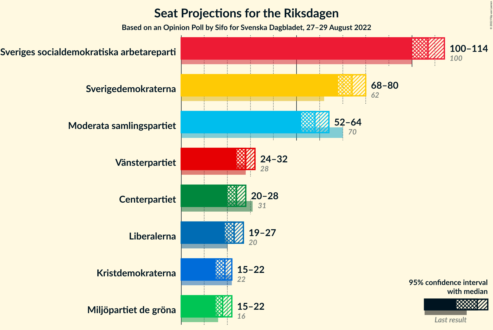

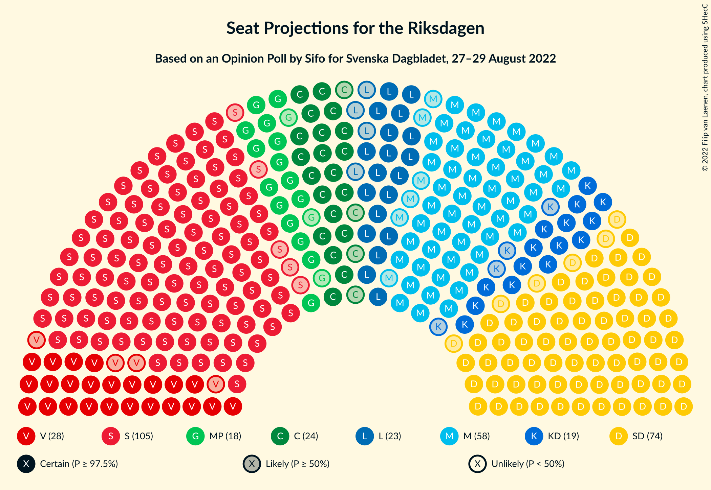

### Confidence Intervals

| Party | Last Result | Median | 80% Confidence Interval | 90% Confidence Interval | 95% Confidence Interval | 99% Confidence Interval |
|:-----:|:-----------:|:------:|:-----------------------:|:-----------------------:|:-----------------------:|:-----------------------:|
| <a href="#sveriges-socialdemokratiska-arbetareparti">Sveriges socialdemokratiska arbetareparti</a> | 100 | 107 | 102–111 |101–113 |100–114 |98–117 |
| <a href="#sverigedemokraterna">Sverigedemokraterna</a> | 62 | 74 | 70–77 |69–79 |68–80 |65–82 |
| <a href="#moderata-samlingspartiet">Moderata samlingspartiet</a> | 70 | 58 | 54–62 |53–63 |52–64 |50–65 |
| <a href="#vänsterpartiet">Vänsterpartiet</a> | 28 | 28 | 25–31 |25–31 |24–32 |23–34 |
| <a href="#centerpartiet">Centerpartiet</a> | 31 | 24 | 21–25 |20–27 |20–28 |19–29 |
| <a href="#liberalerna">Liberalerna</a> | 20 | 23 | 20–25 |19–26 |19–27 |18–28 |
| <a href="#kristdemokraterna">Kristdemokraterna</a> | 22 | 19 | 17–21 |16–22 |15–22 |14–24 |
| <a href="#miljöpartiet-de-gröna">Miljöpartiet de gröna</a> | 16 | 18 | 16–21 |16–21 |15–22 |14–23 |

### Sveriges socialdemokratiska arbetareparti

*For a full overview of the results for this party, see the [Sveriges socialdemokratiska arbetareparti](party-sverigessocialdemokratiskaarbetareparti.html) page.*

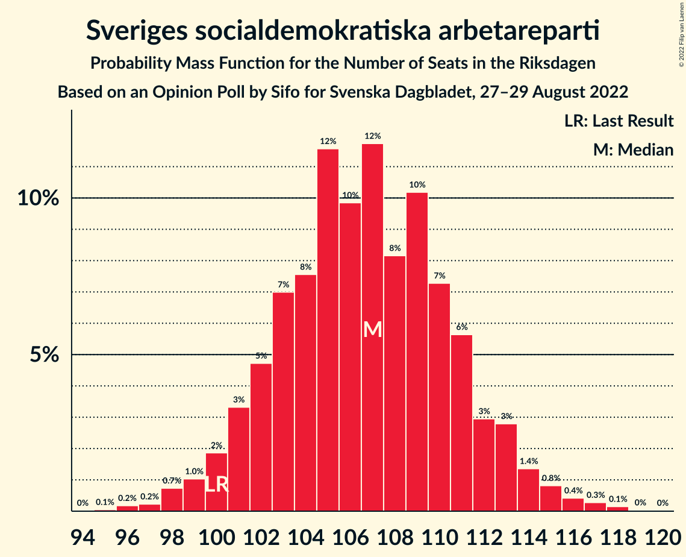

| Number of Seats | Probability | Accumulated | Special Marks |
|:---------------:|:-----------:|:-----------:|:-------------:|
| 95 | 0.1% | 100% |  |
| 96 | 0.2% | 99.9% |  |
| 97 | 0.2% | 99.7% |  |
| 98 | 0.7% | 99.5% |  |
| 99 | 1.0% | 98.8% |  |
| 100 | 2% | 98% | Last Result |
| 101 | 3% | 96% |  |
| 102 | 5% | 93% |  |
| 103 | 7% | 88% |  |
| 104 | 8% | 81% |  |
| 105 | 12% | 73% |  |
| 106 | 10% | 62% |  |
| 107 | 12% | 52% | Median |
| 108 | 8% | 40% |  |
| 109 | 10% | 32% |  |
| 110 | 7% | 22% |  |
| 111 | 6% | 14% |  |
| 112 | 3% | 9% |  |
| 113 | 3% | 6% |  |
| 114 | 1.4% | 3% |  |
| 115 | 0.8% | 2% |  |
| 116 | 0.4% | 0.9% |  |
| 117 | 0.3% | 0.5% |  |
| 118 | 0.1% | 0.2% |  |
| 119 | 0% | 0.1% |  |
| 120 | 0% | 0% |  |

### Sverigedemokraterna

*For a full overview of the results for this party, see the [Sverigedemokraterna](party-sverigedemokraterna.html) page.*

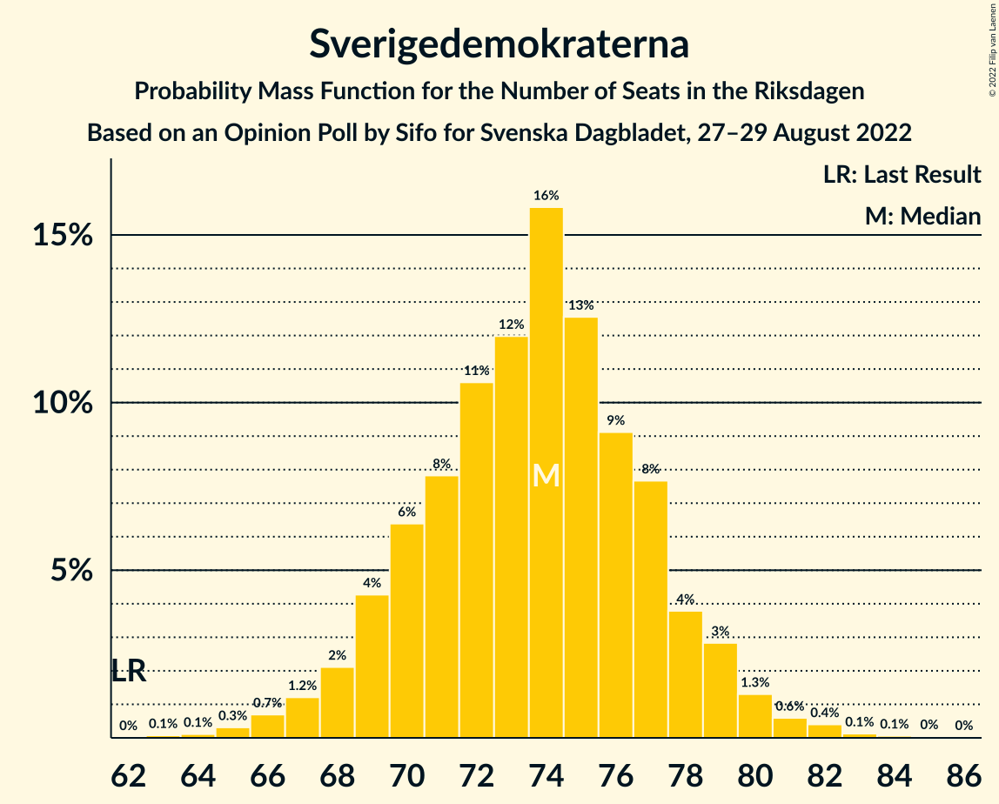

| Number of Seats | Probability | Accumulated | Special Marks |
|:---------------:|:-----------:|:-----------:|:-------------:|
| 62 | 0% | 100% | Last Result |
| 63 | 0.1% | 100% |  |
| 64 | 0.1% | 99.9% |  |
| 65 | 0.3% | 99.8% |  |
| 66 | 0.7% | 99.5% |  |
| 67 | 1.2% | 98.8% |  |
| 68 | 2% | 98% |  |
| 69 | 4% | 95% |  |
| 70 | 6% | 91% |  |
| 71 | 8% | 85% |  |
| 72 | 11% | 77% |  |
| 73 | 12% | 66% |  |
| 74 | 16% | 54% | Median |
| 75 | 13% | 39% |  |
| 76 | 9% | 26% |  |
| 77 | 8% | 17% |  |
| 78 | 4% | 9% |  |
| 79 | 3% | 5% |  |
| 80 | 1.3% | 3% |  |
| 81 | 0.6% | 1.3% |  |
| 82 | 0.4% | 0.7% |  |
| 83 | 0.1% | 0.3% |  |
| 84 | 0.1% | 0.1% |  |
| 85 | 0% | 0.1% |  |
| 86 | 0% | 0% |  |

### Moderata samlingspartiet

*For a full overview of the results for this party, see the [Moderata samlingspartiet](party-moderatasamlingspartiet.html) page.*

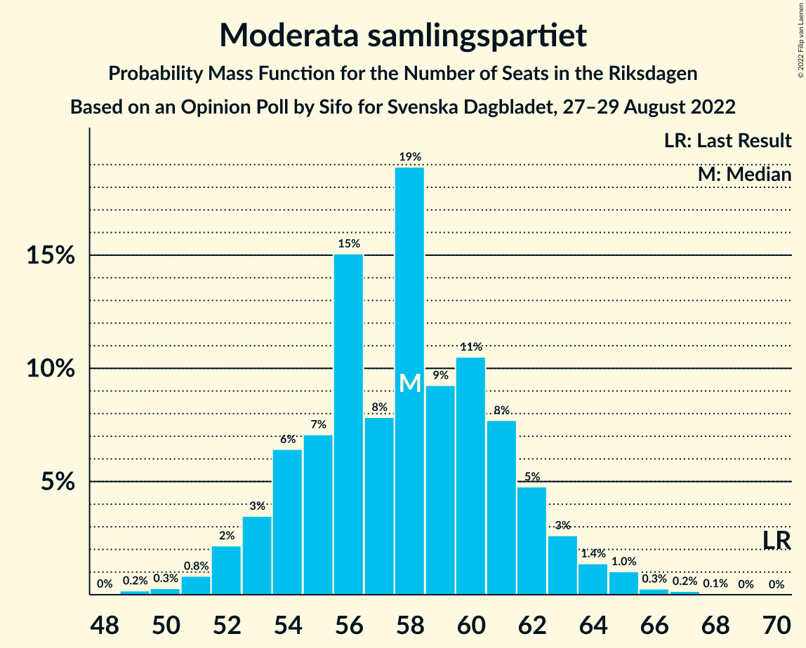

| Number of Seats | Probability | Accumulated | Special Marks |
|:---------------:|:-----------:|:-----------:|:-------------:|
| 49 | 0.2% | 100% |  |
| 50 | 0.3% | 99.8% |  |
| 51 | 0.8% | 99.5% |  |
| 52 | 2% | 98.7% |  |
| 53 | 3% | 97% |  |
| 54 | 6% | 93% |  |
| 55 | 7% | 87% |  |
| 56 | 15% | 80% |  |
| 57 | 8% | 64% |  |
| 58 | 19% | 57% | Median |
| 59 | 9% | 38% |  |
| 60 | 11% | 28% |  |
| 61 | 8% | 18% |  |
| 62 | 5% | 10% |  |
| 63 | 3% | 6% |  |
| 64 | 1.4% | 3% |  |
| 65 | 1.0% | 2% |  |
| 66 | 0.3% | 0.5% |  |
| 67 | 0.2% | 0.2% |  |
| 68 | 0.1% | 0.1% |  |
| 69 | 0% | 0% |  |
| 70 | 0% | 0% | Last Result |

### Vänsterpartiet

*For a full overview of the results for this party, see the [Vänsterpartiet](party-vänsterpartiet.html) page.*

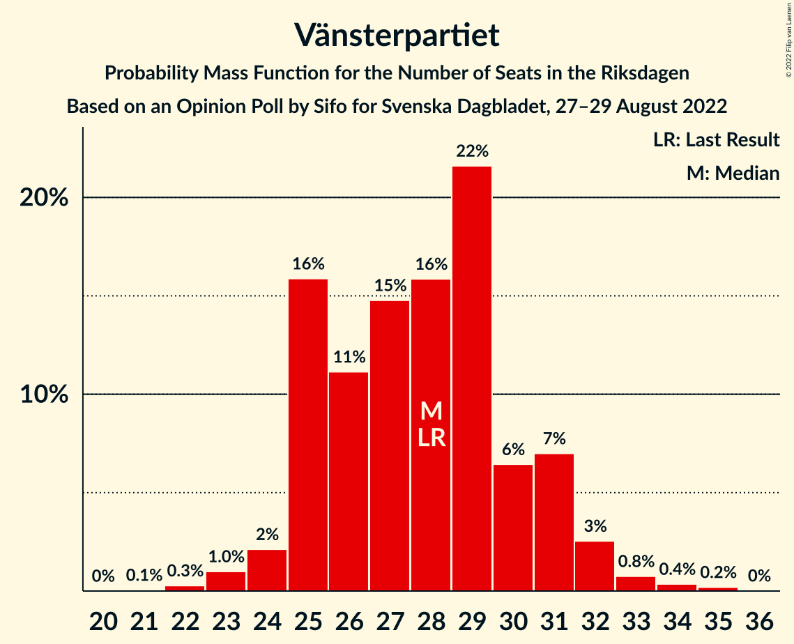

| Number of Seats | Probability | Accumulated | Special Marks |
|:---------------:|:-----------:|:-----------:|:-------------:|
| 21 | 0.1% | 100% |  |
| 22 | 0.3% | 99.9% |  |
| 23 | 1.0% | 99.7% |  |
| 24 | 2% | 98.7% |  |
| 25 | 16% | 97% |  |
| 26 | 11% | 81% |  |
| 27 | 15% | 70% |  |
| 28 | 16% | 55% | Last Result, Median |
| 29 | 22% | 39% |  |
| 30 | 6% | 17% |  |
| 31 | 7% | 11% |  |
| 32 | 3% | 4% |  |
| 33 | 0.8% | 1.3% |  |
| 34 | 0.4% | 0.6% |  |
| 35 | 0.2% | 0.2% |  |
| 36 | 0% | 0% |  |

### Centerpartiet

*For a full overview of the results for this party, see the [Centerpartiet](party-centerpartiet.html) page.*

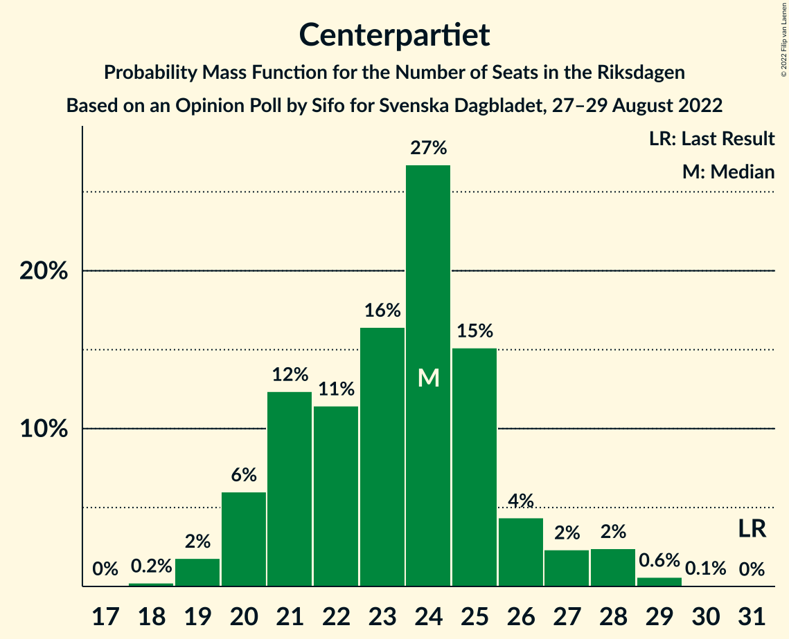

| Number of Seats | Probability | Accumulated | Special Marks |
|:---------------:|:-----------:|:-----------:|:-------------:|
| 17 | 0% | 100% |  |
| 18 | 0.2% | 99.9% |  |
| 19 | 2% | 99.7% |  |
| 20 | 6% | 98% |  |
| 21 | 12% | 92% |  |
| 22 | 11% | 80% |  |
| 23 | 16% | 68% |  |
| 24 | 27% | 52% | Median |
| 25 | 15% | 25% |  |
| 26 | 4% | 10% |  |
| 27 | 2% | 5% |  |
| 28 | 2% | 3% |  |
| 29 | 0.6% | 0.7% |  |
| 30 | 0.1% | 0.1% |  |
| 31 | 0% | 0% | Last Result |

### Liberalerna

*For a full overview of the results for this party, see the [Liberalerna](party-liberalerna.html) page.*

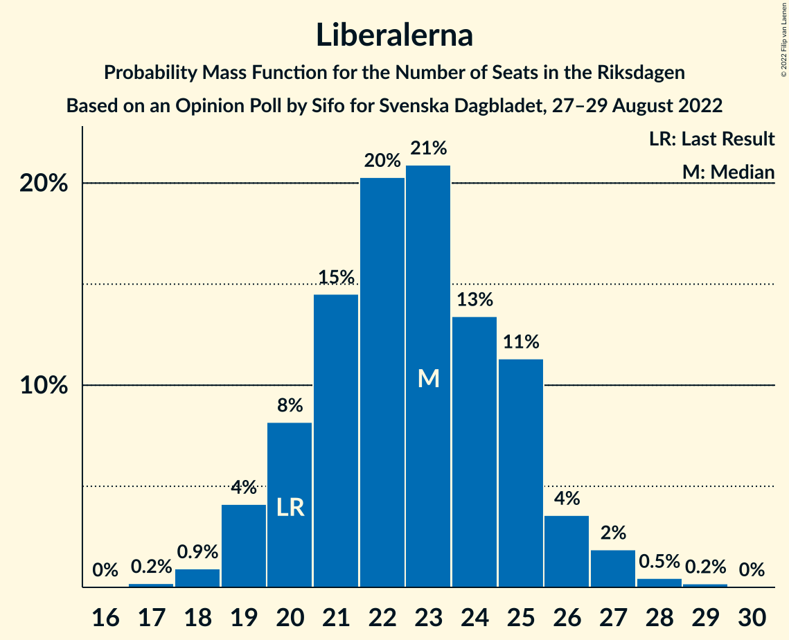

| Number of Seats | Probability | Accumulated | Special Marks |
|:---------------:|:-----------:|:-----------:|:-------------:|
| 17 | 0.2% | 100% |  |
| 18 | 0.9% | 99.8% |  |
| 19 | 4% | 98.8% |  |
| 20 | 8% | 95% | Last Result |
| 21 | 15% | 87% |  |
| 22 | 20% | 72% |  |
| 23 | 21% | 52% | Median |
| 24 | 13% | 31% |  |
| 25 | 11% | 17% |  |
| 26 | 4% | 6% |  |
| 27 | 2% | 3% |  |
| 28 | 0.5% | 0.7% |  |
| 29 | 0.2% | 0.2% |  |
| 30 | 0% | 0% |  |

### Kristdemokraterna

*For a full overview of the results for this party, see the [Kristdemokraterna](party-kristdemokraterna.html) page.*

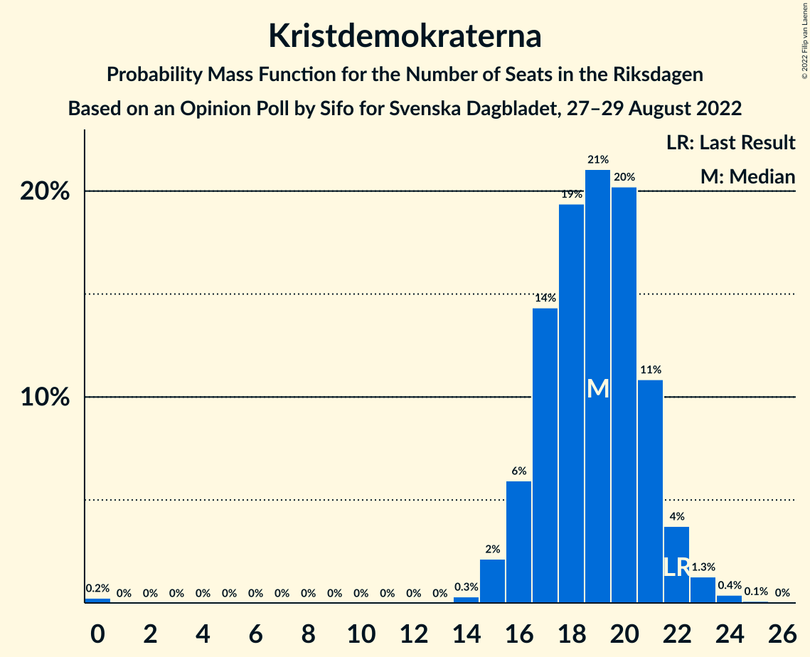

| Number of Seats | Probability | Accumulated | Special Marks |
|:---------------:|:-----------:|:-----------:|:-------------:|
| 0 | 0.2% | 100% |  |
| 1 | 0% | 99.8% |  |
| 2 | 0% | 99.8% |  |
| 3 | 0% | 99.8% |  |
| 4 | 0% | 99.8% |  |
| 5 | 0% | 99.8% |  |
| 6 | 0% | 99.8% |  |
| 7 | 0% | 99.8% |  |
| 8 | 0% | 99.8% |  |
| 9 | 0% | 99.8% |  |
| 10 | 0% | 99.8% |  |
| 11 | 0% | 99.8% |  |
| 12 | 0% | 99.8% |  |
| 13 | 0% | 99.8% |  |
| 14 | 0.3% | 99.8% |  |
| 15 | 2% | 99.4% |  |
| 16 | 6% | 97% |  |
| 17 | 14% | 91% |  |
| 18 | 19% | 77% |  |
| 19 | 21% | 58% | Median |
| 20 | 20% | 37% |  |
| 21 | 11% | 16% |  |
| 22 | 4% | 6% | Last Result |
| 23 | 1.3% | 2% |  |
| 24 | 0.4% | 0.5% |  |
| 25 | 0.1% | 0.1% |  |
| 26 | 0% | 0% |  |

### Miljöpartiet de gröna

*For a full overview of the results for this party, see the [Miljöpartiet de gröna](party-miljöpartietdegröna.html) page.*

| Number of Seats | Probability | Accumulated | Special Marks |
|:---------------:|:-----------:|:-----------:|:-------------:|
| 0 | 0.4% | 100% |  |
| 1 | 0% | 99.6% |  |
| 2 | 0% | 99.6% |  |
| 3 | 0% | 99.6% |  |
| 4 | 0% | 99.6% |  |
| 5 | 0% | 99.6% |  |
| 6 | 0% | 99.6% |  |
| 7 | 0% | 99.6% |  |
| 8 | 0% | 99.6% |  |
| 9 | 0% | 99.6% |  |
| 10 | 0% | 99.6% |  |
| 11 | 0% | 99.6% |  |
| 12 | 0% | 99.6% |  |
| 13 | 0% | 99.6% |  |
| 14 | 0.5% | 99.6% |  |
| 15 | 3% | 99.1% |  |
| 16 | 8% | 96% | Last Result |
| 17 | 19% | 88% |  |
| 18 | 21% | 70% | Median |
| 19 | 25% | 48% |  |
| 20 | 12% | 24% |  |
| 21 | 7% | 12% |  |
| 22 | 3% | 4% |  |
| 23 | 1.0% | 1.4% |  |
| 24 | 0.3% | 0.4% |  |
| 25 | 0% | 0% |  |

## Coalitions

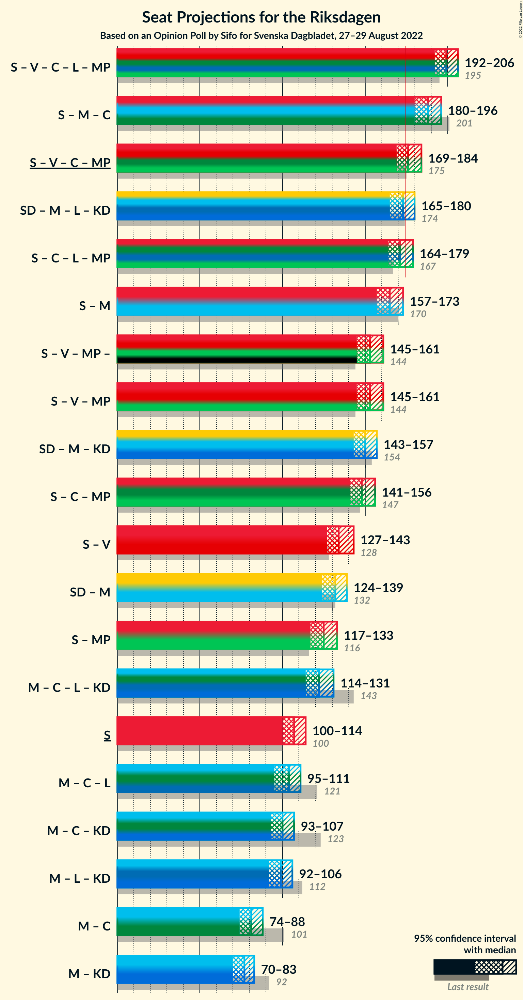

### Confidence Intervals

| Coalition | Last Result | Median | Majority? | 80% Confidence Interval | 90% Confidence Interval | 95% Confidence Interval | 99% Confidence Interval |
|:---------:|:-----------:|:------:|:---------:|:-----------------------:|:-----------------------:|:-----------------------:|:-----------------------:|
| Sveriges socialdemokratiska arbetareparti – Vänsterpartiet – Centerpartiet – Liberalerna – Miljöpartiet de gröna | 195 | 199 | 100% | 194–204 | 193–205 | 192–206 | 189–209 |
| Sveriges socialdemokratiska arbetareparti – Moderata samlingspartiet – Centerpartiet | 201 | 188 | 100% | 183–193 | 181–194 | 180–196 | 178–199 |
| Sveriges socialdemokratiska arbetareparti – Centerpartiet – Liberalerna – Miljöpartiet de gröna | 167 | 171 | 21% | 166–176 | 165–177 | 164–179 | 161–181 |
| Sveriges socialdemokratiska arbetareparti – Moderata samlingspartiet | 170 | 165 | 0.8% | 160–169 | 158–171 | 157–173 | 154–175 |
| Sveriges socialdemokratiska arbetareparti – Vänsterpartiet – Miljöpartiet de gröna | 144 | 153 | 0% | 148–158 | 146–159 | 145–161 | 143–163 |
| Sverigedemokraterna – Moderata samlingspartiet – Kristdemokraterna | 154 | 150 | 0% | 145–155 | 144–156 | 143–157 | 140–160 |
| Sveriges socialdemokratiska arbetareparti – Vänsterpartiet | 128 | 134 | 0% | 130–139 | 128–141 | 127–143 | 125–145 |
| Sverigedemokraterna – Moderata samlingspartiet | 132 | 132 | 0% | 127–136 | 125–137 | 124–139 | 122–141 |
| Sveriges socialdemokratiska arbetareparti – Miljöpartiet de gröna | 116 | 125 | 0% | 120–130 | 119–131 | 117–133 | 114–135 |
| Moderata samlingspartiet – Centerpartiet – Liberalerna – Kristdemokraterna | 143 | 122 | 0% | 117–128 | 116–129 | 114–131 | 112–133 |
| Moderata samlingspartiet – Centerpartiet – Liberalerna | 121 | 104 | 0% | 99–109 | 97–110 | 95–111 | 95–113 |
| Moderata samlingspartiet – Centerpartiet – Kristdemokraterna | 123 | 100 | 0% | 95–104 | 94–106 | 93–107 | 90–109 |
| Moderata samlingspartiet – Centerpartiet | 101 | 81 | 0% | 77–85 | 75–87 | 74–88 | 73–90 |

### Sveriges socialdemokratiska arbetareparti – Vänsterpartiet – Centerpartiet – Liberalerna – Miljöpartiet de gröna

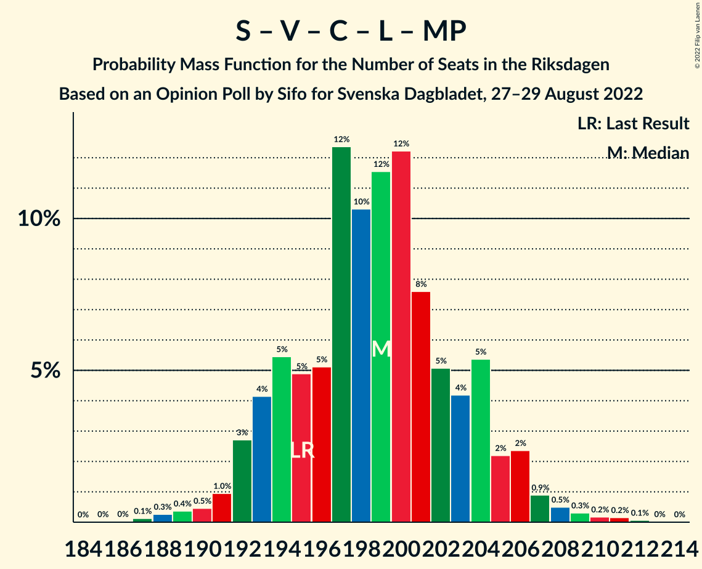

| Number of Seats | Probability | Accumulated | Special Marks |
|:---------------:|:-----------:|:-----------:|:-------------:|
| 185 | 0% | 100% |  |
| 186 | 0% | 99.9% |  |
| 187 | 0.1% | 99.9% |  |
| 188 | 0.3% | 99.8% |  |
| 189 | 0.4% | 99.5% |  |
| 190 | 0.5% | 99.2% |  |
| 191 | 1.0% | 98.7% |  |
| 192 | 3% | 98% |  |
| 193 | 4% | 95% |  |
| 194 | 5% | 91% |  |
| 195 | 5% | 85% | Last Result |
| 196 | 5% | 81% |  |
| 197 | 12% | 75% |  |
| 198 | 10% | 63% |  |
| 199 | 12% | 53% |  |
| 200 | 12% | 41% | Median |
| 201 | 8% | 29% |  |
| 202 | 5% | 21% |  |
| 203 | 4% | 16% |  |
| 204 | 5% | 12% |  |
| 205 | 2% | 7% |  |
| 206 | 2% | 5% |  |
| 207 | 0.9% | 2% |  |
| 208 | 0.5% | 1.3% |  |
| 209 | 0.3% | 0.8% |  |
| 210 | 0.2% | 0.5% |  |
| 211 | 0.2% | 0.3% |  |
| 212 | 0.1% | 0.1% |  |
| 213 | 0% | 0.1% |  |
| 214 | 0% | 0% |  |

### Sveriges socialdemokratiska arbetareparti – Moderata samlingspartiet – Centerpartiet

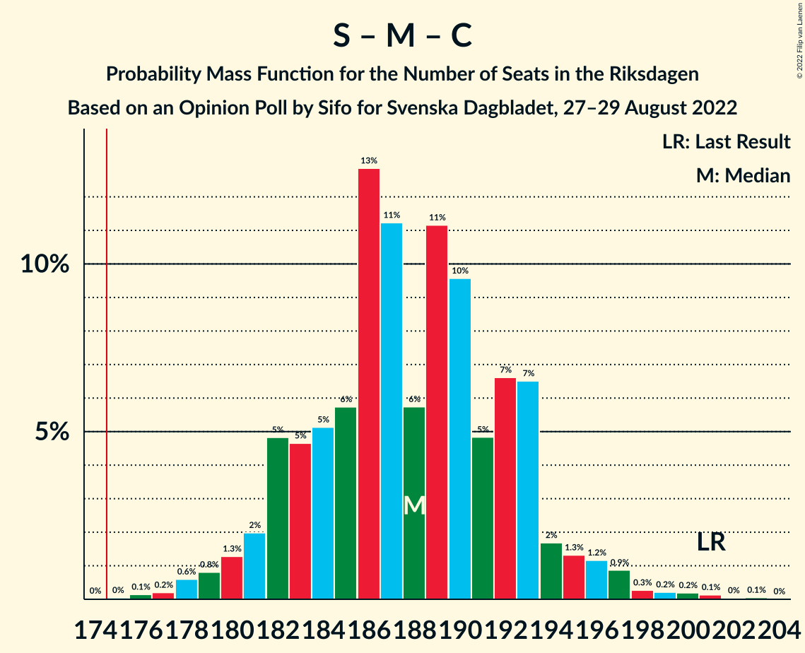

| Number of Seats | Probability | Accumulated | Special Marks |
|:---------------:|:-----------:|:-----------:|:-------------:|
| 175 | 0% | 100% | Majority |
| 176 | 0.1% | 99.9% |  |
| 177 | 0.2% | 99.8% |  |
| 178 | 0.6% | 99.6% |  |
| 179 | 0.8% | 99.0% |  |
| 180 | 1.3% | 98% |  |
| 181 | 2% | 97% |  |
| 182 | 5% | 95% |  |
| 183 | 5% | 90% |  |
| 184 | 5% | 85% |  |
| 185 | 6% | 80% |  |
| 186 | 13% | 75% |  |
| 187 | 11% | 62% |  |
| 188 | 6% | 50% |  |
| 189 | 11% | 45% | Median |
| 190 | 10% | 34% |  |
| 191 | 5% | 24% |  |
| 192 | 7% | 19% |  |
| 193 | 7% | 13% |  |
| 194 | 2% | 6% |  |
| 195 | 1.3% | 4% |  |
| 196 | 1.2% | 3% |  |
| 197 | 0.9% | 2% |  |
| 198 | 0.3% | 1.0% |  |
| 199 | 0.2% | 0.7% |  |
| 200 | 0.2% | 0.5% |  |
| 201 | 0.1% | 0.3% | Last Result |
| 202 | 0% | 0.1% |  |
| 203 | 0.1% | 0.1% |  |
| 204 | 0% | 0% |  |

### Sveriges socialdemokratiska arbetareparti – Centerpartiet – Liberalerna – Miljöpartiet de gröna

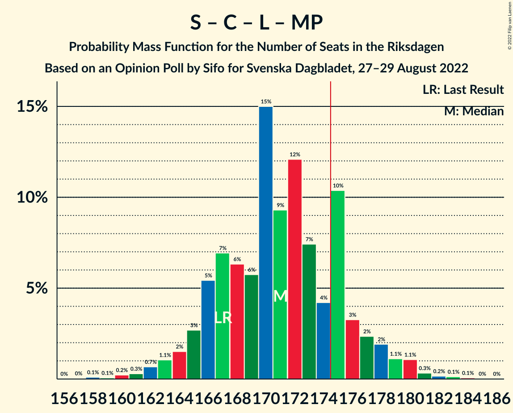

| Number of Seats | Probability | Accumulated | Special Marks |
|:---------------:|:-----------:|:-----------:|:-------------:|
| 157 | 0% | 100% |  |
| 158 | 0.1% | 99.9% |  |
| 159 | 0.1% | 99.8% |  |
| 160 | 0.2% | 99.7% |  |
| 161 | 0.3% | 99.5% |  |
| 162 | 0.7% | 99.2% |  |
| 163 | 1.1% | 98.6% |  |
| 164 | 2% | 98% |  |
| 165 | 3% | 96% |  |
| 166 | 5% | 93% |  |
| 167 | 7% | 88% | Last Result |
| 168 | 6% | 81% |  |
| 169 | 6% | 75% |  |
| 170 | 15% | 69% |  |
| 171 | 9% | 54% |  |
| 172 | 12% | 45% | Median |
| 173 | 7% | 32% |  |
| 174 | 4% | 25% |  |
| 175 | 10% | 21% | Majority |
| 176 | 3% | 10% |  |
| 177 | 2% | 7% |  |
| 178 | 2% | 5% |  |
| 179 | 1.1% | 3% |  |
| 180 | 1.1% | 2% |  |
| 181 | 0.3% | 0.7% |  |
| 182 | 0.2% | 0.4% |  |
| 183 | 0.1% | 0.2% |  |
| 184 | 0.1% | 0.1% |  |
| 185 | 0% | 0.1% |  |
| 186 | 0% | 0% |  |

### Sveriges socialdemokratiska arbetareparti – Moderata samlingspartiet

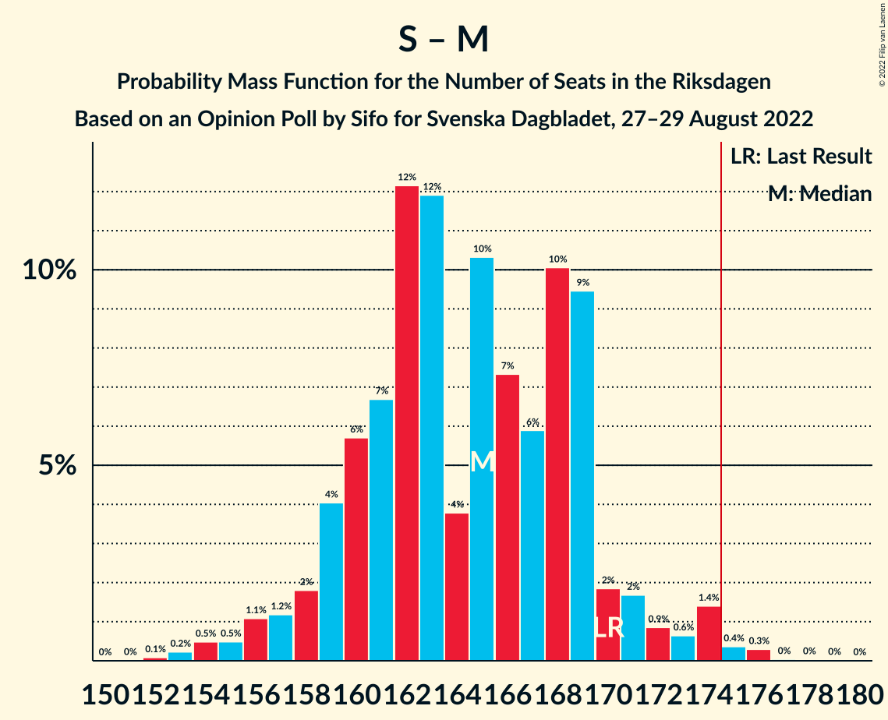

| Number of Seats | Probability | Accumulated | Special Marks |
|:---------------:|:-----------:|:-----------:|:-------------:|
| 152 | 0.1% | 100% |  |
| 153 | 0.2% | 99.9% |  |
| 154 | 0.5% | 99.7% |  |
| 155 | 0.5% | 99.2% |  |
| 156 | 1.1% | 98.7% |  |
| 157 | 1.2% | 98% |  |
| 158 | 2% | 96% |  |
| 159 | 4% | 95% |  |
| 160 | 6% | 91% |  |
| 161 | 7% | 85% |  |
| 162 | 12% | 78% |  |
| 163 | 12% | 66% |  |
| 164 | 4% | 54% |  |
| 165 | 10% | 50% | Median |
| 166 | 7% | 40% |  |
| 167 | 6% | 33% |  |
| 168 | 10% | 27% |  |
| 169 | 9% | 17% |  |
| 170 | 2% | 7% | Last Result |
| 171 | 2% | 5% |  |
| 172 | 0.9% | 4% |  |
| 173 | 0.6% | 3% |  |
| 174 | 1.4% | 2% |  |
| 175 | 0.4% | 0.8% | Majority |
| 176 | 0.3% | 0.4% |  |
| 177 | 0% | 0.1% |  |
| 178 | 0% | 0.1% |  |
| 179 | 0% | 0.1% |  |
| 180 | 0% | 0% |  |

### Sveriges socialdemokratiska arbetareparti – Vänsterpartiet – Miljöpartiet de gröna

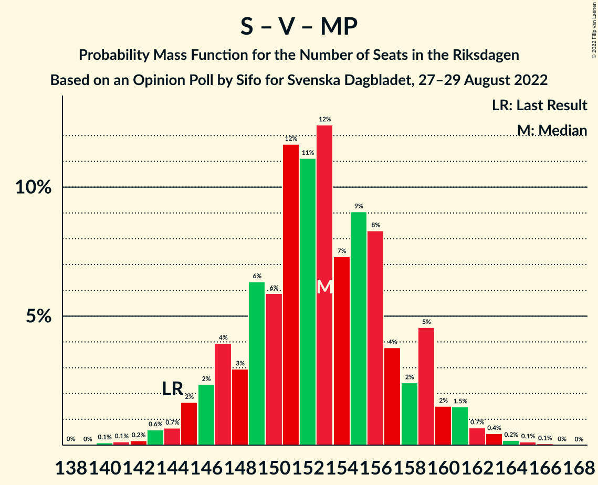

| Number of Seats | Probability | Accumulated | Special Marks |
|:---------------:|:-----------:|:-----------:|:-------------:|
| 138 | 0% | 100% |  |
| 139 | 0% | 99.9% |  |
| 140 | 0.1% | 99.9% |  |
| 141 | 0.1% | 99.8% |  |
| 142 | 0.2% | 99.7% |  |
| 143 | 0.6% | 99.5% |  |
| 144 | 0.7% | 98.9% | Last Result |
| 145 | 2% | 98% |  |
| 146 | 2% | 97% |  |
| 147 | 4% | 94% |  |
| 148 | 3% | 90% |  |
| 149 | 6% | 87% |  |
| 150 | 6% | 81% |  |
| 151 | 12% | 75% |  |
| 152 | 11% | 63% |  |
| 153 | 12% | 52% | Median |
| 154 | 7% | 40% |  |
| 155 | 9% | 33% |  |
| 156 | 8% | 24% |  |
| 157 | 4% | 15% |  |
| 158 | 2% | 12% |  |
| 159 | 5% | 9% |  |
| 160 | 2% | 5% |  |
| 161 | 1.5% | 3% |  |
| 162 | 0.7% | 2% |  |
| 163 | 0.4% | 0.9% |  |
| 164 | 0.2% | 0.4% |  |
| 165 | 0.1% | 0.2% |  |
| 166 | 0.1% | 0.1% |  |
| 167 | 0% | 0% |  |

### Sverigedemokraterna – Moderata samlingspartiet – Kristdemokraterna

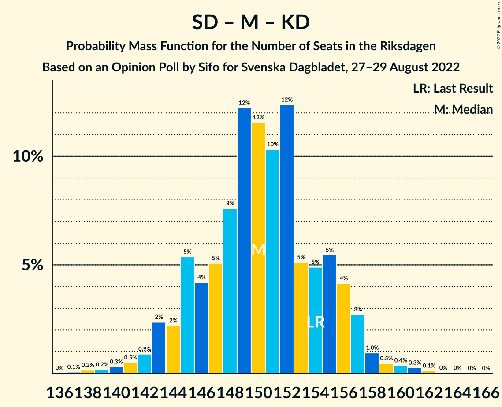

| Number of Seats | Probability | Accumulated | Special Marks |
|:---------------:|:-----------:|:-----------:|:-------------:|
| 136 | 0% | 100% |  |
| 137 | 0.1% | 99.9% |  |
| 138 | 0.2% | 99.9% |  |
| 139 | 0.2% | 99.7% |  |
| 140 | 0.3% | 99.5% |  |
| 141 | 0.5% | 99.2% |  |
| 142 | 0.9% | 98.7% |  |
| 143 | 2% | 98% |  |
| 144 | 2% | 95% |  |
| 145 | 5% | 93% |  |
| 146 | 4% | 88% |  |
| 147 | 5% | 84% |  |
| 148 | 8% | 79% |  |
| 149 | 12% | 71% |  |
| 150 | 12% | 59% |  |
| 151 | 10% | 47% | Median |
| 152 | 12% | 37% |  |
| 153 | 5% | 25% |  |
| 154 | 5% | 19% | Last Result |
| 155 | 5% | 15% |  |
| 156 | 4% | 9% |  |
| 157 | 3% | 5% |  |
| 158 | 1.0% | 2% |  |
| 159 | 0.5% | 1.3% |  |
| 160 | 0.4% | 0.8% |  |
| 161 | 0.3% | 0.5% |  |
| 162 | 0.1% | 0.2% |  |
| 163 | 0% | 0.1% |  |
| 164 | 0% | 0.1% |  |
| 165 | 0% | 0% |  |

### Sveriges socialdemokratiska arbetareparti – Vänsterpartiet

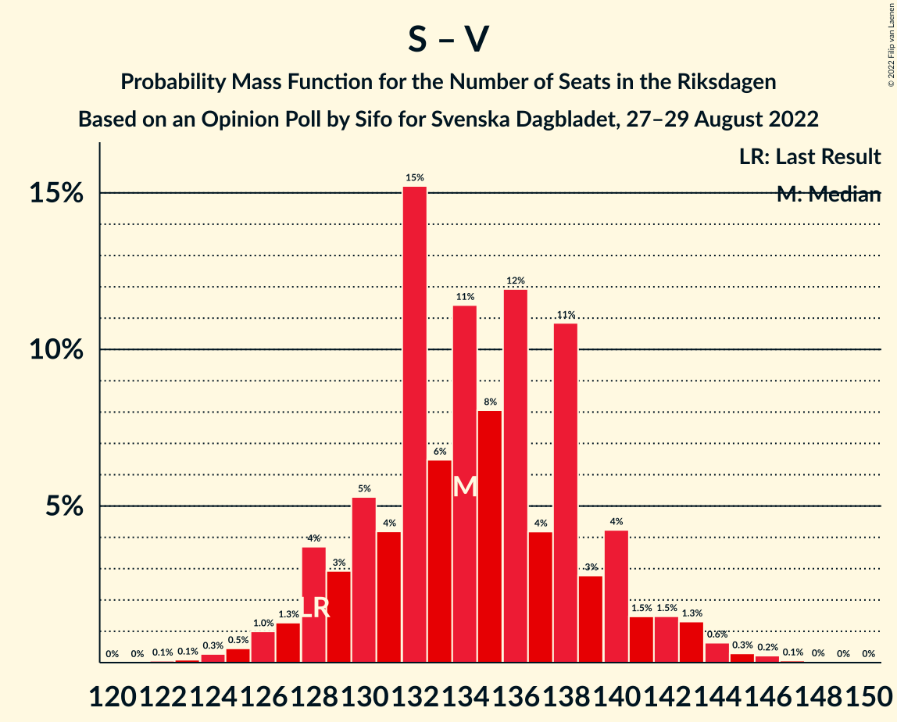

| Number of Seats | Probability | Accumulated | Special Marks |
|:---------------:|:-----------:|:-----------:|:-------------:|
| 122 | 0.1% | 100% |  |
| 123 | 0.1% | 99.9% |  |
| 124 | 0.3% | 99.8% |  |
| 125 | 0.5% | 99.6% |  |
| 126 | 1.0% | 99.1% |  |
| 127 | 1.3% | 98% |  |
| 128 | 4% | 97% | Last Result |
| 129 | 3% | 93% |  |
| 130 | 5% | 90% |  |
| 131 | 4% | 85% |  |
| 132 | 15% | 81% |  |
| 133 | 6% | 65% |  |
| 134 | 11% | 59% |  |
| 135 | 8% | 48% | Median |
| 136 | 12% | 40% |  |
| 137 | 4% | 28% |  |
| 138 | 11% | 23% |  |
| 139 | 3% | 13% |  |
| 140 | 4% | 10% |  |
| 141 | 1.5% | 6% |  |
| 142 | 1.5% | 4% |  |
| 143 | 1.3% | 3% |  |
| 144 | 0.6% | 1.3% |  |
| 145 | 0.3% | 0.7% |  |
| 146 | 0.2% | 0.4% |  |
| 147 | 0.1% | 0.1% |  |
| 148 | 0% | 0.1% |  |
| 149 | 0% | 0% |  |

### Sverigedemokraterna – Moderata samlingspartiet

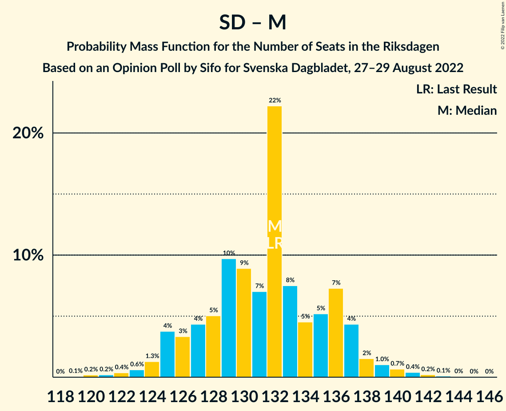

| Number of Seats | Probability | Accumulated | Special Marks |
|:---------------:|:-----------:|:-----------:|:-------------:|
| 119 | 0.1% | 100% |  |
| 120 | 0.2% | 99.9% |  |
| 121 | 0.2% | 99.7% |  |
| 122 | 0.4% | 99.5% |  |
| 123 | 0.6% | 99.1% |  |
| 124 | 1.3% | 98.5% |  |
| 125 | 4% | 97% |  |
| 126 | 3% | 93% |  |
| 127 | 4% | 90% |  |
| 128 | 5% | 86% |  |
| 129 | 10% | 81% |  |
| 130 | 9% | 71% |  |
| 131 | 7% | 62% |  |
| 132 | 22% | 55% | Last Result, Median |
| 133 | 8% | 33% |  |
| 134 | 5% | 25% |  |
| 135 | 5% | 21% |  |
| 136 | 7% | 16% |  |
| 137 | 4% | 8% |  |
| 138 | 2% | 4% |  |
| 139 | 1.0% | 3% |  |
| 140 | 0.7% | 1.5% |  |
| 141 | 0.4% | 0.8% |  |
| 142 | 0.2% | 0.4% |  |
| 143 | 0.1% | 0.2% |  |
| 144 | 0% | 0.1% |  |
| 145 | 0% | 0.1% |  |
| 146 | 0% | 0% |  |

### Sveriges socialdemokratiska arbetareparti – Miljöpartiet de gröna

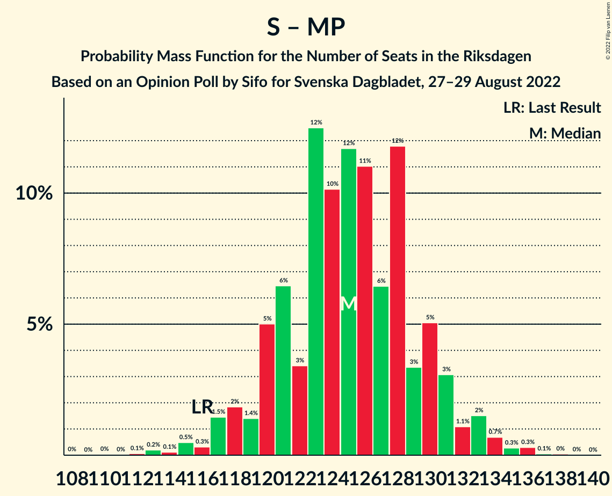

| Number of Seats | Probability | Accumulated | Special Marks |
|:---------------:|:-----------:|:-----------:|:-------------:|
| 108 | 0% | 100% |  |
| 109 | 0% | 99.9% |  |
| 110 | 0% | 99.9% |  |
| 111 | 0% | 99.9% |  |
| 112 | 0.1% | 99.9% |  |
| 113 | 0.2% | 99.8% |  |
| 114 | 0.1% | 99.6% |  |
| 115 | 0.5% | 99.5% |  |
| 116 | 0.3% | 99.0% | Last Result |
| 117 | 1.5% | 98.7% |  |
| 118 | 2% | 97% |  |
| 119 | 1.4% | 95% |  |
| 120 | 5% | 94% |  |
| 121 | 6% | 89% |  |
| 122 | 3% | 83% |  |
| 123 | 12% | 79% |  |
| 124 | 10% | 67% |  |
| 125 | 12% | 56% | Median |
| 126 | 11% | 45% |  |
| 127 | 6% | 34% |  |
| 128 | 12% | 27% |  |
| 129 | 3% | 15% |  |
| 130 | 5% | 12% |  |
| 131 | 3% | 7% |  |
| 132 | 1.1% | 4% |  |
| 133 | 2% | 3% |  |
| 134 | 0.7% | 1.4% |  |
| 135 | 0.3% | 0.7% |  |
| 136 | 0.3% | 0.4% |  |
| 137 | 0.1% | 0.1% |  |
| 138 | 0% | 0.1% |  |
| 139 | 0% | 0% |  |

### Moderata samlingspartiet – Centerpartiet – Liberalerna – Kristdemokraterna

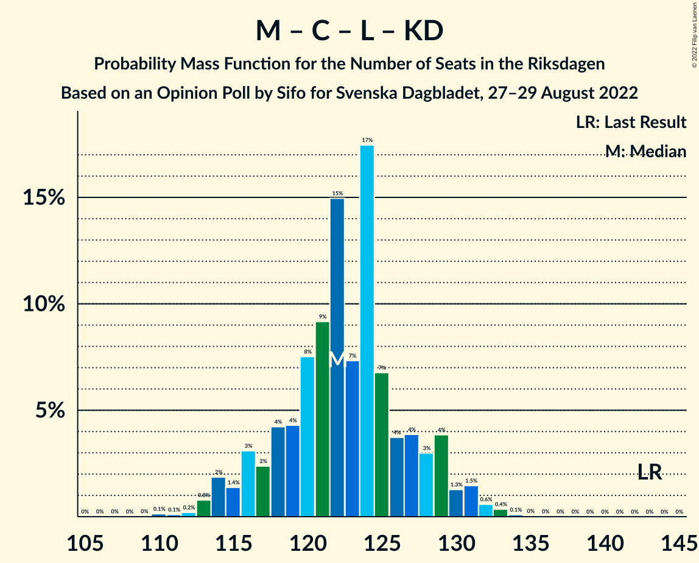

| Number of Seats | Probability | Accumulated | Special Marks |
|:---------------:|:-----------:|:-----------:|:-------------:|
| 107 | 0% | 100% |  |
| 108 | 0% | 99.9% |  |
| 109 | 0% | 99.9% |  |
| 110 | 0.1% | 99.9% |  |
| 111 | 0.1% | 99.8% |  |
| 112 | 0.2% | 99.7% |  |
| 113 | 0.8% | 99.5% |  |
| 114 | 2% | 98.7% |  |
| 115 | 1.4% | 97% |  |
| 116 | 3% | 95% |  |
| 117 | 2% | 92% |  |
| 118 | 4% | 90% |  |
| 119 | 4% | 86% |  |
| 120 | 8% | 81% |  |
| 121 | 9% | 74% |  |
| 122 | 15% | 65% |  |
| 123 | 7% | 50% |  |
| 124 | 17% | 42% | Median |
| 125 | 7% | 25% |  |
| 126 | 4% | 18% |  |
| 127 | 4% | 15% |  |
| 128 | 3% | 11% |  |
| 129 | 4% | 8% |  |
| 130 | 1.3% | 4% |  |
| 131 | 1.5% | 3% |  |
| 132 | 0.6% | 1.1% |  |
| 133 | 0.4% | 0.5% |  |
| 134 | 0.1% | 0.2% |  |
| 135 | 0% | 0.1% |  |
| 136 | 0% | 0% |  |
| 137 | 0% | 0% |  |
| 138 | 0% | 0% |  |
| 139 | 0% | 0% |  |
| 140 | 0% | 0% |  |
| 141 | 0% | 0% |  |
| 142 | 0% | 0% |  |
| 143 | 0% | 0% | Last Result |

### Moderata samlingspartiet – Centerpartiet – Liberalerna

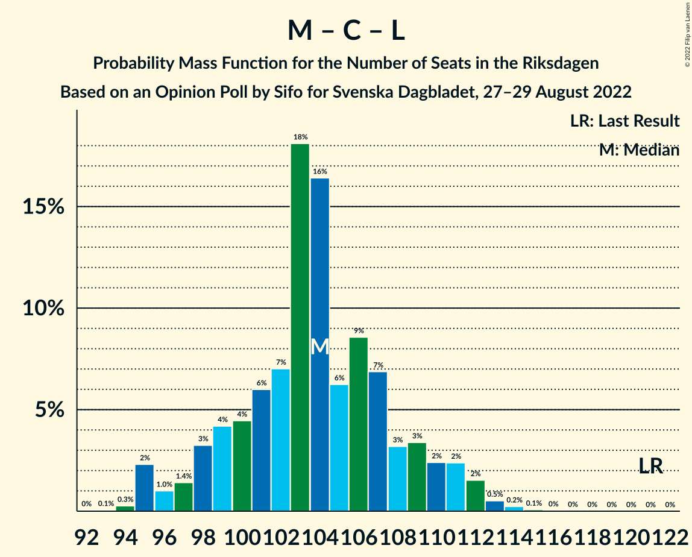

| Number of Seats | Probability | Accumulated | Special Marks |
|:---------------:|:-----------:|:-----------:|:-------------:|
| 92 | 0% | 100% |  |
| 93 | 0.1% | 99.9% |  |
| 94 | 0.3% | 99.9% |  |
| 95 | 2% | 99.6% |  |
| 96 | 1.0% | 97% |  |
| 97 | 1.4% | 96% |  |
| 98 | 3% | 95% |  |
| 99 | 4% | 92% |  |
| 100 | 4% | 87% |  |
| 101 | 6% | 83% |  |
| 102 | 7% | 77% |  |
| 103 | 18% | 70% |  |
| 104 | 16% | 52% |  |
| 105 | 6% | 35% | Median |
| 106 | 9% | 29% |  |
| 107 | 7% | 21% |  |
| 108 | 3% | 14% |  |
| 109 | 3% | 11% |  |
| 110 | 2% | 7% |  |
| 111 | 2% | 5% |  |
| 112 | 2% | 2% |  |
| 113 | 0.5% | 0.9% |  |
| 114 | 0.2% | 0.4% |  |
| 115 | 0.1% | 0.1% |  |
| 116 | 0% | 0.1% |  |
| 117 | 0% | 0% |  |
| 118 | 0% | 0% |  |
| 119 | 0% | 0% |  |
| 120 | 0% | 0% |  |
| 121 | 0% | 0% | Last Result |

### Moderata samlingspartiet – Centerpartiet – Kristdemokraterna

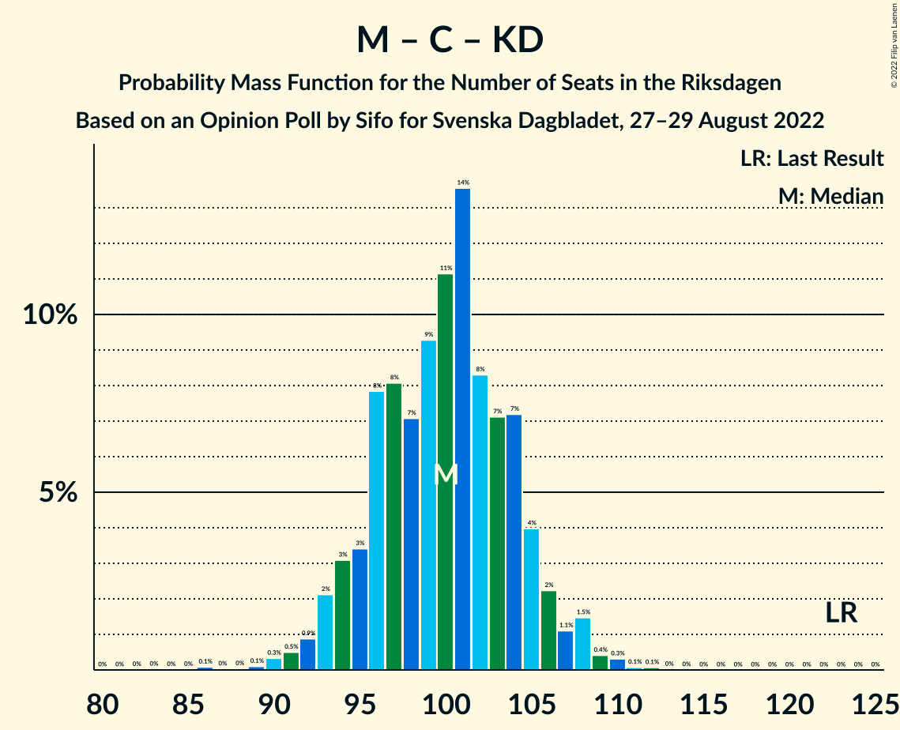

| Number of Seats | Probability | Accumulated | Special Marks |
|:---------------:|:-----------:|:-----------:|:-------------:|
| 83 | 0% | 100% |  |
| 84 | 0% | 99.9% |  |
| 85 | 0% | 99.9% |  |
| 86 | 0.1% | 99.9% |  |
| 87 | 0% | 99.8% |  |
| 88 | 0% | 99.8% |  |
| 89 | 0.1% | 99.8% |  |
| 90 | 0.3% | 99.7% |  |
| 91 | 0.5% | 99.3% |  |
| 92 | 0.9% | 98.8% |  |
| 93 | 2% | 98% |  |
| 94 | 3% | 96% |  |
| 95 | 3% | 93% |  |
| 96 | 8% | 89% |  |
| 97 | 8% | 81% |  |
| 98 | 7% | 73% |  |
| 99 | 9% | 66% |  |
| 100 | 11% | 57% |  |
| 101 | 14% | 46% | Median |
| 102 | 8% | 32% |  |
| 103 | 7% | 24% |  |
| 104 | 7% | 17% |  |
| 105 | 4% | 10% |  |
| 106 | 2% | 6% |  |
| 107 | 1.1% | 3% |  |
| 108 | 1.5% | 2% |  |
| 109 | 0.4% | 0.9% |  |
| 110 | 0.3% | 0.5% |  |
| 111 | 0.1% | 0.2% |  |
| 112 | 0.1% | 0.1% |  |
| 113 | 0% | 0% |  |
| 114 | 0% | 0% |  |
| 115 | 0% | 0% |  |
| 116 | 0% | 0% |  |
| 117 | 0% | 0% |  |
| 118 | 0% | 0% |  |
| 119 | 0% | 0% |  |
| 120 | 0% | 0% |  |
| 121 | 0% | 0% |  |
| 122 | 0% | 0% |  |
| 123 | 0% | 0% | Last Result |

### Moderata samlingspartiet – Centerpartiet

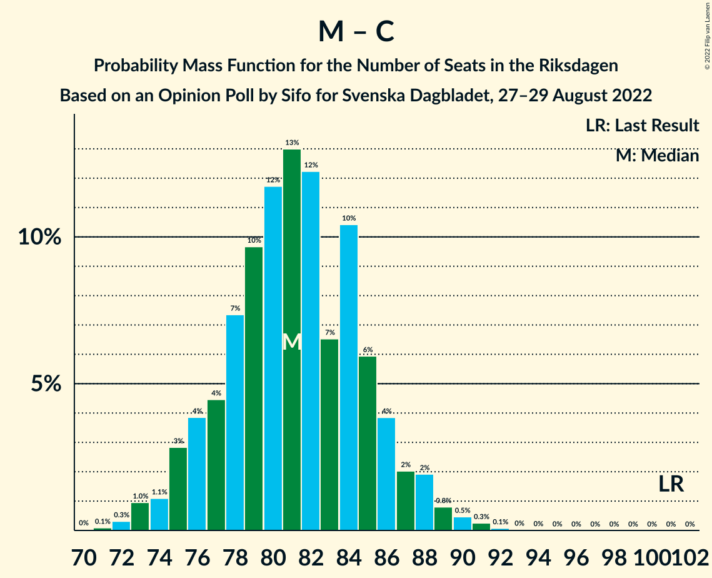

| Number of Seats | Probability | Accumulated | Special Marks |
|:---------------:|:-----------:|:-----------:|:-------------:|
| 70 | 0% | 100% |  |
| 71 | 0.1% | 99.9% |  |
| 72 | 0.3% | 99.8% |  |
| 73 | 1.0% | 99.5% |  |
| 74 | 1.1% | 98.6% |  |
| 75 | 3% | 97% |  |
| 76 | 4% | 95% |  |
| 77 | 4% | 91% |  |
| 78 | 7% | 86% |  |
| 79 | 10% | 79% |  |
| 80 | 12% | 69% |  |
| 81 | 13% | 58% |  |
| 82 | 12% | 45% | Median |
| 83 | 7% | 32% |  |
| 84 | 10% | 26% |  |
| 85 | 6% | 15% |  |
| 86 | 4% | 9% |  |
| 87 | 2% | 6% |  |
| 88 | 2% | 4% |  |
| 89 | 0.8% | 2% |  |
| 90 | 0.5% | 0.8% |  |
| 91 | 0.3% | 0.4% |  |
| 92 | 0.1% | 0.1% |  |
| 93 | 0% | 0% |  |
| 94 | 0% | 0% |  |
| 95 | 0% | 0% |  |
| 96 | 0% | 0% |  |
| 97 | 0% | 0% |  |
| 98 | 0% | 0% |  |
| 99 | 0% | 0% |  |
| 100 | 0% | 0% |  |
| 101 | 0% | 0% | Last Result |

## Technical Information

### Opinion Poll

+ **Polling firm:** Sifo
+ **Commissioner(s):** Svenska Dagbladet
+ **Fieldwork period:** 27–29 August 2022

### Calculations

+ **Sample size:** 2002
+ **Simulations done:** 1,048,576
+ **Error estimate:** 1.27%

