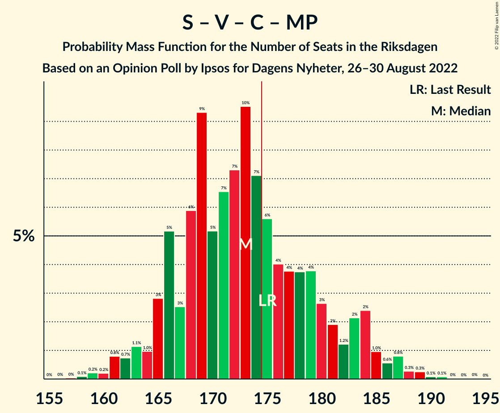

# Opinion Poll by Ipsos for Dagens Nyheter, 26–30 August 2022

<a href="#voting-intentions">Voting Intentions</a> | <a href="#seats">Seats</a> | <a href="#coalitions">Coalitions</a> | <a href="#technical-information">Technical Information</a>

## Voting Intentions

### Confidence Intervals

| Party | Last Result | Poll Result | 80% Confidence Interval | 90% Confidence Interval | 95% Confidence Interval | 99% Confidence Interval |
|:-----:|:-----------:|:-----------:|:-----------------------:|:-----------------------:|:-----------------------:|:-----------------------:|
| Sveriges socialdemokratiska arbetareparti | 28.3% | 28.3% | 26.7–30.0% |26.3–30.4% |25.9–30.8% |25.1–31.6% |
| Sverigedemokraterna | 17.5% | 22.2% | 20.8–23.7% |20.3–24.2% |20.0–24.6% |19.3–25.3% |
| Moderata samlingspartiet | 19.8% | 16.8% | 15.5–18.2% |15.2–18.6% |14.9–19.0% |14.3–19.7% |
| Vänsterpartiet | 8.0% | 8.7% | 7.7–9.8% |7.5–10.1% |7.3–10.3% |6.8–10.9% |
| Centerpartiet | 8.6% | 6.1% | 5.3–7.0% |5.1–7.3% |4.9–7.6% |4.6–8.0% |
| Kristdemokraterna | 6.3% | 6.1% | 5.3–7.0% |5.1–7.3% |4.9–7.6% |4.6–8.0% |
| Miljöpartiet de gröna | 4.4% | 5.7% | 5.0–6.6% |4.7–6.9% |4.6–7.1% |4.2–7.6% |
| Liberalerna | 5.5% | 4.8% | 4.1–5.6% |3.9–5.9% |3.7–6.1% |3.4–6.5% |

*Note:* The poll result column reflects the actual value used in the calculations. Published results may vary slightly, and in addition be rounded to fewer digits.

## Seats

### Confidence Intervals

| Party | Last Result | Median | 80% Confidence Interval | 90% Confidence Interval | 95% Confidence Interval | 99% Confidence Interval |
|:-----:|:-----------:|:------:|:-----------------------:|:-----------------------:|:-----------------------:|:-----------------------:|
| <a href="#sveriges-socialdemokratiska-arbetareparti">Sveriges socialdemokratiska arbetareparti</a> | 100 | 100 | 94–106 |92–109 |91–110 |89–113 |
| <a href="#sverigedemokraterna">Sverigedemokraterna</a> | 62 | 79 | 73–84 |72–86 |70–87 |68–90 |
| <a href="#moderata-samlingspartiet">Moderata samlingspartiet</a> | 70 | 60 | 55–65 |54–66 |52–67 |50–70 |
| <a href="#vänsterpartiet">Vänsterpartiet</a> | 28 | 31 | 27–35 |26–36 |25–37 |24–39 |
| <a href="#centerpartiet">Centerpartiet</a> | 31 | 22 | 19–25 |18–26 |17–27 |16–28 |
| <a href="#kristdemokraterna">Kristdemokraterna</a> | 22 | 22 | 19–25 |18–26 |17–27 |16–28 |
| <a href="#miljöpartiet-de-gröna">Miljöpartiet de gröna</a> | 16 | 21 | 18–24 |17–24 |16–25 |15–27 |
| <a href="#liberalerna">Liberalerna</a> | 20 | 17 | 14–20 |0–21 |0–21 |0–23 |

### Sveriges socialdemokratiska arbetareparti

*For a full overview of the results for this party, see the [Sveriges socialdemokratiska arbetareparti](party-sverigessocialdemokratiskaarbetareparti.html) page.*

| Number of Seats | Probability | Accumulated | Special Marks |
|:---------------:|:-----------:|:-----------:|:-------------:|
| 86 | 0.1% | 100% |  |
| 87 | 0.1% | 99.9% |  |
| 88 | 0.2% | 99.8% |  |
| 89 | 0.5% | 99.7% |  |
| 90 | 0.7% | 99.2% |  |
| 91 | 1.5% | 98% |  |
| 92 | 2% | 97% |  |
| 93 | 3% | 95% |  |
| 94 | 5% | 92% |  |
| 95 | 6% | 87% |  |
| 96 | 8% | 81% |  |
| 97 | 8% | 73% |  |
| 98 | 5% | 65% |  |
| 99 | 7% | 61% |  |
| 100 | 9% | 53% | Last Result, Median |
| 101 | 7% | 44% |  |
| 102 | 8% | 37% |  |
| 103 | 7% | 29% |  |
| 104 | 3% | 22% |  |
| 105 | 6% | 19% |  |
| 106 | 3% | 13% |  |
| 107 | 2% | 10% |  |
| 108 | 2% | 7% |  |
| 109 | 2% | 5% |  |
| 110 | 1.4% | 4% |  |
| 111 | 1.4% | 2% |  |
| 112 | 0.3% | 0.8% |  |
| 113 | 0.2% | 0.5% |  |
| 114 | 0.2% | 0.3% |  |
| 115 | 0.1% | 0.2% |  |
| 116 | 0.1% | 0.1% |  |
| 117 | 0% | 0% |  |

### Sverigedemokraterna

*For a full overview of the results for this party, see the [Sverigedemokraterna](party-sverigedemokraterna.html) page.*

| Number of Seats | Probability | Accumulated | Special Marks |
|:---------------:|:-----------:|:-----------:|:-------------:|
| 62 | 0% | 100% | Last Result |
| 63 | 0% | 100% |  |
| 64 | 0% | 100% |  |
| 65 | 0% | 100% |  |
| 66 | 0.1% | 99.9% |  |
| 67 | 0.2% | 99.9% |  |
| 68 | 0.4% | 99.7% |  |
| 69 | 0.6% | 99.4% |  |
| 70 | 1.5% | 98.8% |  |
| 71 | 2% | 97% |  |
| 72 | 4% | 95% |  |
| 73 | 4% | 91% |  |
| 74 | 5% | 87% |  |
| 75 | 5% | 82% |  |
| 76 | 8% | 76% |  |
| 77 | 8% | 69% |  |
| 78 | 9% | 60% |  |
| 79 | 9% | 51% | Median |
| 80 | 7% | 43% |  |
| 81 | 8% | 36% |  |
| 82 | 6% | 28% |  |
| 83 | 9% | 22% |  |
| 84 | 5% | 13% |  |
| 85 | 3% | 8% |  |
| 86 | 2% | 5% |  |
| 87 | 0.9% | 3% |  |
| 88 | 1.1% | 2% |  |
| 89 | 0.6% | 1.4% |  |
| 90 | 0.4% | 0.8% |  |
| 91 | 0.2% | 0.4% |  |
| 92 | 0.1% | 0.2% |  |
| 93 | 0% | 0.1% |  |
| 94 | 0% | 0% |  |

### Moderata samlingspartiet

*For a full overview of the results for this party, see the [Moderata samlingspartiet](party-moderatasamlingspartiet.html) page.*

| Number of Seats | Probability | Accumulated | Special Marks |
|:---------------:|:-----------:|:-----------:|:-------------:|
| 48 | 0.1% | 100% |  |
| 49 | 0.2% | 99.9% |  |
| 50 | 0.4% | 99.7% |  |
| 51 | 0.7% | 99.3% |  |
| 52 | 1.5% | 98.6% |  |
| 53 | 2% | 97% |  |
| 54 | 4% | 95% |  |
| 55 | 6% | 91% |  |
| 56 | 7% | 85% |  |
| 57 | 7% | 78% |  |
| 58 | 10% | 71% |  |
| 59 | 10% | 61% |  |
| 60 | 11% | 51% | Median |
| 61 | 9% | 40% |  |
| 62 | 8% | 31% |  |
| 63 | 7% | 22% |  |
| 64 | 4% | 15% |  |
| 65 | 4% | 11% |  |
| 66 | 2% | 6% |  |
| 67 | 2% | 4% |  |
| 68 | 1.2% | 2% |  |
| 69 | 0.4% | 0.9% |  |
| 70 | 0.2% | 0.5% | Last Result |
| 71 | 0.1% | 0.3% |  |
| 72 | 0.1% | 0.2% |  |
| 73 | 0% | 0.1% |  |
| 74 | 0% | 0% |  |

### Vänsterpartiet

*For a full overview of the results for this party, see the [Vänsterpartiet](party-vänsterpartiet.html) page.*

| Number of Seats | Probability | Accumulated | Special Marks |
|:---------------:|:-----------:|:-----------:|:-------------:|
| 22 | 0% | 100% |  |
| 23 | 0.2% | 99.9% |  |
| 24 | 0.6% | 99.8% |  |
| 25 | 2% | 99.2% |  |
| 26 | 3% | 97% |  |
| 27 | 6% | 94% |  |
| 28 | 9% | 88% | Last Result |
| 29 | 12% | 79% |  |
| 30 | 12% | 67% |  |
| 31 | 15% | 55% | Median |
| 32 | 11% | 40% |  |
| 33 | 12% | 29% |  |
| 34 | 7% | 18% |  |
| 35 | 4% | 11% |  |
| 36 | 4% | 6% |  |
| 37 | 1.2% | 3% |  |
| 38 | 1.1% | 2% |  |
| 39 | 0.3% | 0.5% |  |
| 40 | 0.1% | 0.2% |  |
| 41 | 0.1% | 0.1% |  |
| 42 | 0% | 0% |  |

### Centerpartiet

*For a full overview of the results for this party, see the [Centerpartiet](party-centerpartiet.html) page.*

| Number of Seats | Probability | Accumulated | Special Marks |
|:---------------:|:-----------:|:-----------:|:-------------:|
| 15 | 0.1% | 100% |  |
| 16 | 0.6% | 99.8% |  |
| 17 | 3% | 99.3% |  |
| 18 | 4% | 97% |  |
| 19 | 9% | 92% |  |
| 20 | 14% | 83% |  |
| 21 | 14% | 69% |  |
| 22 | 18% | 55% | Median |
| 23 | 14% | 37% |  |
| 24 | 11% | 23% |  |
| 25 | 6% | 13% |  |
| 26 | 4% | 7% |  |
| 27 | 2% | 3% |  |
| 28 | 0.8% | 1.2% |  |
| 29 | 0.3% | 0.4% |  |
| 30 | 0.1% | 0.2% |  |
| 31 | 0% | 0% | Last Result |

### Kristdemokraterna

*For a full overview of the results for this party, see the [Kristdemokraterna](party-kristdemokraterna.html) page.*

| Number of Seats | Probability | Accumulated | Special Marks |
|:---------------:|:-----------:|:-----------:|:-------------:|
| 15 | 0.2% | 100% |  |
| 16 | 0.4% | 99.8% |  |
| 17 | 3% | 99.4% |  |
| 18 | 5% | 97% |  |
| 19 | 9% | 92% |  |
| 20 | 16% | 84% |  |
| 21 | 16% | 68% |  |
| 22 | 15% | 52% | Last Result, Median |
| 23 | 14% | 37% |  |
| 24 | 12% | 23% |  |
| 25 | 6% | 12% |  |
| 26 | 3% | 6% |  |
| 27 | 2% | 3% |  |
| 28 | 0.9% | 1.4% |  |
| 29 | 0.2% | 0.4% |  |
| 30 | 0.1% | 0.2% |  |
| 31 | 0% | 0.1% |  |
| 32 | 0% | 0% |  |

### Miljöpartiet de gröna

*For a full overview of the results for this party, see the [Miljöpartiet de gröna](party-miljöpartietdegröna.html) page.*

| Number of Seats | Probability | Accumulated | Special Marks |
|:---------------:|:-----------:|:-----------:|:-------------:|
| 0 | 0.1% | 100% |  |
| 1 | 0% | 99.9% |  |
| 2 | 0% | 99.9% |  |
| 3 | 0% | 99.9% |  |
| 4 | 0% | 99.9% |  |
| 5 | 0% | 99.9% |  |
| 6 | 0% | 99.9% |  |
| 7 | 0% | 99.9% |  |
| 8 | 0% | 99.9% |  |
| 9 | 0% | 99.9% |  |
| 10 | 0% | 99.9% |  |
| 11 | 0% | 99.9% |  |
| 12 | 0% | 99.9% |  |
| 13 | 0% | 99.9% |  |
| 14 | 0.1% | 99.9% |  |
| 15 | 1.1% | 99.8% |  |
| 16 | 3% | 98.7% | Last Result |
| 17 | 4% | 96% |  |
| 18 | 16% | 92% |  |
| 19 | 14% | 76% |  |
| 20 | 11% | 62% |  |
| 21 | 24% | 51% | Median |
| 22 | 10% | 27% |  |
| 23 | 6% | 17% |  |
| 24 | 8% | 11% |  |
| 25 | 2% | 4% |  |
| 26 | 1.1% | 2% |  |
| 27 | 0.5% | 0.7% |  |
| 28 | 0.2% | 0.2% |  |
| 29 | 0.1% | 0.1% |  |
| 30 | 0% | 0% |  |

### Liberalerna

*For a full overview of the results for this party, see the [Liberalerna](party-liberalerna.html) page.*

| Number of Seats | Probability | Accumulated | Special Marks |
|:---------------:|:-----------:|:-----------:|:-------------:|
| 0 | 8% | 100% |  |
| 1 | 0% | 92% |  |
| 2 | 0% | 92% |  |
| 3 | 0% | 92% |  |
| 4 | 0% | 92% |  |
| 5 | 0% | 92% |  |
| 6 | 0% | 92% |  |
| 7 | 0% | 92% |  |
| 8 | 0% | 92% |  |
| 9 | 0% | 92% |  |
| 10 | 0% | 92% |  |
| 11 | 0% | 92% |  |
| 12 | 0% | 92% |  |
| 13 | 0% | 92% |  |
| 14 | 4% | 92% |  |
| 15 | 11% | 88% |  |
| 16 | 18% | 77% |  |
| 17 | 17% | 59% | Median |
| 18 | 19% | 42% |  |
| 19 | 10% | 23% |  |
| 20 | 7% | 13% | Last Result |
| 21 | 3% | 5% |  |
| 22 | 1.4% | 2% |  |
| 23 | 0.7% | 0.9% |  |
| 24 | 0.2% | 0.3% |  |
| 25 | 0.1% | 0.1% |  |
| 26 | 0% | 0% |  |

## Coalitions

### Confidence Intervals

| Coalition | Last Result | Median | Majority? | 80% Confidence Interval | 90% Confidence Interval | 95% Confidence Interval | 99% Confidence Interval |
|:---------:|:-----------:|:------:|:---------:|:-----------------------:|:-----------------------:|:-----------------------:|:-----------------------:|
| Sveriges socialdemokratiska arbetareparti – Vänsterpartiet – Centerpartiet – Miljöpartiet de gröna – Liberalerna | 195 | 189 | 99.0% | 183–197 | 180–198 | 177–200 | 172–202 |
| Sveriges socialdemokratiska arbetareparti – Moderata samlingspartiet – Centerpartiet | 201 | 181 | 89% | 174–189 | 173–191 | 172–194 | 168–198 |
| Sverigedemokraterna – Moderata samlingspartiet – Kristdemokraterna – Liberalerna | 174 | 176 | 66% | 168–183 | 165–184 | 164–186 | 160–189 |
| Sveriges socialdemokratiska arbetareparti – Vänsterpartiet – Centerpartiet – Miljöpartiet de gröna | 175 | 173 | 34% | 166–181 | 165–184 | 163–185 | 160–189 |
| Sveriges socialdemokratiska arbetareparti – Moderata samlingspartiet | 170 | 159 | 1.1% | 152–167 | 151–170 | 150–172 | 147–175 |
| Sverigedemokraterna – Moderata samlingspartiet – Kristdemokraterna | 154 | 160 | 1.0% | 152–166 | 151–169 | 149–172 | 147–177 |
| Sveriges socialdemokratiska arbetareparti – Centerpartiet – Miljöpartiet de gröna – Liberalerna | 167 | 157 | 0% | 152–167 | 149–167 | 146–169 | 141–171 |
| Sveriges socialdemokratiska arbetareparti – Vänsterpartiet – Miljöpartiet de gröna | 144 | 151 | 0% | 144–159 | 143–161 | 141–163 | 139–166 |
| Sveriges socialdemokratiska arbetareparti – Centerpartiet – Miljöpartiet de gröna | 147 | 141 | 0% | 136–150 | 134–152 | 133–153 | 129–156 |
| Sverigedemokraterna – Moderata samlingspartiet | 132 | 139 | 0% | 130–144 | 129–147 | 128–149 | 126–154 |
| Sveriges socialdemokratiska arbetareparti – Vänsterpartiet | 128 | 131 | 0% | 124–138 | 123–140 | 122–142 | 119–144 |
| Sveriges socialdemokratiska arbetareparti – Miljöpartiet de gröna | 116 | 120 | 0% | 114–127 | 112–130 | 111–131 | 108–134 |
| Moderata samlingspartiet – Centerpartiet – Kristdemokraterna – Liberalerna | 143 | 119 | 0% | 112–125 | 109–128 | 105–130 | 102–132 |
| Moderata samlingspartiet – Centerpartiet – Kristdemokraterna | 123 | 103 | 0% | 97–109 | 96–111 | 94–113 | 91–116 |
| Sveriges socialdemokratiska arbetareparti | 100 | 100 | 0% | 94–106 | 92–109 | 91–110 | 89–113 |
| Moderata samlingspartiet – Centerpartiet – Liberalerna | 121 | 99 | 0% | 90–104 | 86–105 | 84–107 | 79–110 |
| Moderata samlingspartiet – Kristdemokraterna – Liberalerna | 112 | 98 | 0% | 90–104 | 86–105 | 82–107 | 79–110 |
| Moderata samlingspartiet – Centerpartiet | 101 | 81 | 0% | 76–87 | 74–89 | 73–90 | 71–93 |
| Moderata samlingspartiet – Kristdemokraterna | 92 | 81 | 0% | 76–87 | 74–89 | 73–90 | 71–93 |

### Sveriges socialdemokratiska arbetareparti – Vänsterpartiet – Centerpartiet – Miljöpartiet de gröna – Liberalerna

| Number of Seats | Probability | Accumulated | Special Marks |
|:---------------:|:-----------:|:-----------:|:-------------:|
| 169 | 0.1% | 100% |  |
| 170 | 0.1% | 99.9% |  |
| 171 | 0.1% | 99.8% |  |
| 172 | 0.2% | 99.7% |  |
| 173 | 0.2% | 99.5% |  |
| 174 | 0.3% | 99.3% |  |
| 175 | 0.5% | 99.0% | Majority |
| 176 | 0.4% | 98.5% |  |
| 177 | 0.6% | 98% |  |
| 178 | 1.1% | 97% |  |
| 179 | 0.4% | 96% |  |
| 180 | 2% | 96% |  |
| 181 | 0.8% | 94% |  |
| 182 | 2% | 93% |  |
| 183 | 2% | 91% |  |
| 184 | 6% | 89% |  |
| 185 | 5% | 82% |  |
| 186 | 6% | 78% |  |
| 187 | 13% | 72% |  |
| 188 | 5% | 59% |  |
| 189 | 13% | 53% |  |
| 190 | 6% | 40% |  |
| 191 | 7% | 34% | Median |
| 192 | 4% | 27% |  |
| 193 | 4% | 23% |  |
| 194 | 3% | 19% |  |
| 195 | 3% | 16% | Last Result |
| 196 | 3% | 13% |  |
| 197 | 2% | 11% |  |
| 198 | 4% | 9% |  |
| 199 | 1.1% | 4% |  |
| 200 | 2% | 3% |  |
| 201 | 0.4% | 1.4% |  |
| 202 | 0.7% | 0.9% |  |
| 203 | 0.1% | 0.2% |  |
| 204 | 0.1% | 0.2% |  |
| 205 | 0% | 0.1% |  |
| 206 | 0% | 0% |  |

### Sveriges socialdemokratiska arbetareparti – Moderata samlingspartiet – Centerpartiet

| Number of Seats | Probability | Accumulated | Special Marks |
|:---------------:|:-----------:|:-----------:|:-------------:|
| 165 | 0.1% | 100% |  |
| 166 | 0.1% | 99.9% |  |
| 167 | 0.2% | 99.8% |  |
| 168 | 0.2% | 99.6% |  |
| 169 | 0.2% | 99.4% |  |
| 170 | 0.6% | 99.2% |  |
| 171 | 0.8% | 98.6% |  |
| 172 | 0.7% | 98% |  |
| 173 | 4% | 97% |  |
| 174 | 3% | 93% |  |
| 175 | 3% | 89% | Majority |
| 176 | 8% | 86% |  |
| 177 | 8% | 78% |  |
| 178 | 6% | 70% |  |
| 179 | 6% | 65% |  |
| 180 | 8% | 58% |  |
| 181 | 4% | 51% |  |
| 182 | 6% | 47% | Median |
| 183 | 5% | 41% |  |
| 184 | 5% | 36% |  |
| 185 | 7% | 31% |  |
| 186 | 4% | 24% |  |
| 187 | 5% | 20% |  |
| 188 | 5% | 15% |  |
| 189 | 2% | 11% |  |
| 190 | 3% | 9% |  |
| 191 | 2% | 6% |  |
| 192 | 1.0% | 4% |  |
| 193 | 0.6% | 3% |  |
| 194 | 0.4% | 3% |  |
| 195 | 1.0% | 2% |  |
| 196 | 0.6% | 1.4% |  |
| 197 | 0.2% | 0.8% |  |
| 198 | 0.3% | 0.6% |  |
| 199 | 0.2% | 0.3% |  |
| 200 | 0% | 0.1% |  |
| 201 | 0% | 0.1% | Last Result |
| 202 | 0% | 0.1% |  |
| 203 | 0% | 0% |  |

### Sverigedemokraterna – Moderata samlingspartiet – Kristdemokraterna – Liberalerna

| Number of Seats | Probability | Accumulated | Special Marks |
|:---------------:|:-----------:|:-----------:|:-------------:|
| 155 | 0% | 100% |  |
| 156 | 0% | 99.9% |  |
| 157 | 0% | 99.9% |  |
| 158 | 0.1% | 99.9% |  |
| 159 | 0.1% | 99.8% |  |
| 160 | 0.3% | 99.7% |  |
| 161 | 0.3% | 99.5% |  |
| 162 | 0.8% | 99.2% |  |
| 163 | 0.6% | 98% |  |
| 164 | 1.0% | 98% |  |
| 165 | 2% | 97% |  |
| 166 | 2% | 94% |  |
| 167 | 1.2% | 92% |  |
| 168 | 2% | 91% |  |
| 169 | 3% | 89% |  |
| 170 | 4% | 87% |  |
| 171 | 4% | 83% |  |
| 172 | 4% | 79% |  |
| 173 | 4% | 75% |  |
| 174 | 6% | 71% | Last Result |
| 175 | 7% | 66% | Majority |
| 176 | 10% | 59% |  |
| 177 | 7% | 49% |  |
| 178 | 7% | 42% | Median |
| 179 | 5% | 35% |  |
| 180 | 9% | 30% |  |
| 181 | 6% | 21% |  |
| 182 | 3% | 15% |  |
| 183 | 5% | 12% |  |
| 184 | 3% | 7% |  |
| 185 | 1.0% | 4% |  |
| 186 | 1.1% | 3% |  |
| 187 | 0.7% | 2% |  |
| 188 | 0.8% | 1.4% |  |
| 189 | 0.2% | 0.6% |  |
| 190 | 0.2% | 0.4% |  |
| 191 | 0.1% | 0.2% |  |
| 192 | 0% | 0.1% |  |
| 193 | 0% | 0.1% |  |
| 194 | 0% | 0% |  |

### Sveriges socialdemokratiska arbetareparti – Vänsterpartiet – Centerpartiet – Miljöpartiet de gröna

| Number of Seats | Probability | Accumulated | Special Marks |
|:---------------:|:-----------:|:-----------:|:-------------:|
| 156 | 0% | 100% |  |
| 157 | 0% | 99.9% |  |
| 158 | 0.1% | 99.9% |  |
| 159 | 0.2% | 99.8% |  |
| 160 | 0.2% | 99.6% |  |
| 161 | 0.8% | 99.4% |  |
| 162 | 0.7% | 98.6% |  |
| 163 | 1.1% | 98% |  |
| 164 | 1.0% | 97% |  |
| 165 | 3% | 96% |  |
| 166 | 5% | 93% |  |
| 167 | 3% | 88% |  |
| 168 | 6% | 85% |  |
| 169 | 9% | 79% |  |
| 170 | 5% | 70% |  |
| 171 | 7% | 65% |  |
| 172 | 7% | 58% |  |
| 173 | 10% | 51% |  |
| 174 | 7% | 41% | Median |
| 175 | 6% | 34% | Last Result, Majority |
| 176 | 4% | 29% |  |
| 177 | 4% | 25% |  |
| 178 | 4% | 21% |  |
| 179 | 4% | 17% |  |
| 180 | 3% | 13% |  |
| 181 | 2% | 11% |  |
| 182 | 1.2% | 9% |  |
| 183 | 2% | 8% |  |
| 184 | 2% | 6% |  |
| 185 | 1.0% | 3% |  |
| 186 | 0.6% | 2% |  |
| 187 | 0.8% | 2% |  |
| 188 | 0.3% | 0.8% |  |
| 189 | 0.3% | 0.5% |  |
| 190 | 0.1% | 0.3% |  |
| 191 | 0.1% | 0.2% |  |
| 192 | 0% | 0.1% |  |
| 193 | 0% | 0.1% |  |
| 194 | 0% | 0.1% |  |
| 195 | 0% | 0% |  |

### Sveriges socialdemokratiska arbetareparti – Moderata samlingspartiet

| Number of Seats | Probability | Accumulated | Special Marks |
|:---------------:|:-----------:|:-----------:|:-------------:|
| 143 | 0.1% | 100% |  |
| 144 | 0.1% | 99.9% |  |
| 145 | 0.2% | 99.9% |  |
| 146 | 0.1% | 99.7% |  |
| 147 | 0.4% | 99.6% |  |
| 148 | 0.6% | 99.2% |  |
| 149 | 0.4% | 98.6% |  |
| 150 | 3% | 98% |  |
| 151 | 1.1% | 95% |  |
| 152 | 5% | 94% |  |
| 153 | 3% | 90% |  |
| 154 | 3% | 86% |  |
| 155 | 10% | 83% |  |
| 156 | 4% | 74% |  |
| 157 | 8% | 70% |  |
| 158 | 8% | 62% |  |
| 159 | 4% | 53% |  |
| 160 | 8% | 49% | Median |
| 161 | 6% | 42% |  |
| 162 | 6% | 35% |  |
| 163 | 7% | 29% |  |
| 164 | 2% | 22% |  |
| 165 | 7% | 20% |  |
| 166 | 2% | 14% |  |
| 167 | 3% | 11% |  |
| 168 | 2% | 8% |  |
| 169 | 1.1% | 6% |  |
| 170 | 1.2% | 5% | Last Result |
| 171 | 1.1% | 4% |  |
| 172 | 0.7% | 3% |  |
| 173 | 0.9% | 2% |  |
| 174 | 0.1% | 1.2% |  |
| 175 | 0.8% | 1.1% | Majority |
| 176 | 0.1% | 0.3% |  |
| 177 | 0.1% | 0.2% |  |
| 178 | 0.1% | 0.1% |  |
| 179 | 0% | 0.1% |  |
| 180 | 0% | 0.1% |  |
| 181 | 0% | 0% |  |

### Sverigedemokraterna – Moderata samlingspartiet – Kristdemokraterna

| Number of Seats | Probability | Accumulated | Special Marks |
|:---------------:|:-----------:|:-----------:|:-------------:|
| 144 | 0% | 100% |  |
| 145 | 0.1% | 99.9% |  |
| 146 | 0.1% | 99.8% |  |
| 147 | 0.7% | 99.8% |  |
| 148 | 0.4% | 99.1% |  |
| 149 | 2% | 98.6% |  |
| 150 | 1.1% | 97% |  |
| 151 | 4% | 96% |  |
| 152 | 2% | 91% |  |
| 153 | 3% | 89% |  |
| 154 | 3% | 87% | Last Result |
| 155 | 3% | 84% |  |
| 156 | 4% | 81% |  |
| 157 | 4% | 77% |  |
| 158 | 7% | 73% |  |
| 159 | 6% | 66% |  |
| 160 | 13% | 60% |  |
| 161 | 5% | 47% | Median |
| 162 | 13% | 41% |  |
| 163 | 6% | 28% |  |
| 164 | 5% | 22% |  |
| 165 | 6% | 18% |  |
| 166 | 2% | 11% |  |
| 167 | 2% | 9% |  |
| 168 | 0.8% | 7% |  |
| 169 | 2% | 6% |  |
| 170 | 0.4% | 4% |  |
| 171 | 1.1% | 4% |  |
| 172 | 0.6% | 3% |  |
| 173 | 0.4% | 2% |  |
| 174 | 0.5% | 1.5% |  |
| 175 | 0.3% | 1.0% | Majority |
| 176 | 0.2% | 0.7% |  |
| 177 | 0.2% | 0.5% |  |
| 178 | 0.1% | 0.3% |  |
| 179 | 0.1% | 0.2% |  |
| 180 | 0.1% | 0.1% |  |
| 181 | 0% | 0% |  |

### Sveriges socialdemokratiska arbetareparti – Centerpartiet – Miljöpartiet de gröna – Liberalerna

| Number of Seats | Probability | Accumulated | Special Marks |
|:---------------:|:-----------:|:-----------:|:-------------:|
| 138 | 0.1% | 100% |  |
| 139 | 0.1% | 99.9% |  |
| 140 | 0.2% | 99.8% |  |
| 141 | 0.4% | 99.6% |  |
| 142 | 0.6% | 99.3% |  |
| 143 | 0.3% | 98.6% |  |
| 144 | 0.2% | 98% |  |
| 145 | 0.4% | 98% |  |
| 146 | 0.4% | 98% |  |
| 147 | 0.7% | 97% |  |
| 148 | 1.3% | 97% |  |
| 149 | 2% | 95% |  |
| 150 | 1.3% | 93% |  |
| 151 | 1.1% | 92% |  |
| 152 | 3% | 91% |  |
| 153 | 3% | 88% |  |
| 154 | 7% | 85% |  |
| 155 | 7% | 78% |  |
| 156 | 12% | 71% |  |
| 157 | 9% | 59% |  |
| 158 | 7% | 50% |  |
| 159 | 8% | 43% |  |
| 160 | 4% | 35% | Median |
| 161 | 4% | 31% |  |
| 162 | 6% | 26% |  |
| 163 | 3% | 20% |  |
| 164 | 2% | 17% |  |
| 165 | 2% | 15% |  |
| 166 | 2% | 13% |  |
| 167 | 6% | 11% | Last Result |
| 168 | 2% | 5% |  |
| 169 | 2% | 3% |  |
| 170 | 0.6% | 1.2% |  |
| 171 | 0.3% | 0.6% |  |
| 172 | 0.2% | 0.4% |  |
| 173 | 0.1% | 0.2% |  |
| 174 | 0.1% | 0.1% |  |
| 175 | 0% | 0% | Majority |

### Sveriges socialdemokratiska arbetareparti – Vänsterpartiet – Miljöpartiet de gröna

| Number of Seats | Probability | Accumulated | Special Marks |
|:---------------:|:-----------:|:-----------:|:-------------:|
| 134 | 0% | 100% |  |
| 135 | 0% | 99.9% |  |
| 136 | 0.1% | 99.9% |  |
| 137 | 0.2% | 99.8% |  |
| 138 | 0.2% | 99.7% |  |
| 139 | 0.3% | 99.5% |  |
| 140 | 0.7% | 99.2% |  |
| 141 | 2% | 98.5% |  |
| 142 | 1.4% | 97% |  |
| 143 | 3% | 95% |  |
| 144 | 4% | 93% | Last Result |
| 145 | 4% | 89% |  |
| 146 | 4% | 85% |  |
| 147 | 6% | 81% |  |
| 148 | 7% | 75% |  |
| 149 | 8% | 68% |  |
| 150 | 7% | 60% |  |
| 151 | 9% | 53% |  |
| 152 | 6% | 44% | Median |
| 153 | 6% | 37% |  |
| 154 | 6% | 32% |  |
| 155 | 5% | 26% |  |
| 156 | 5% | 20% |  |
| 157 | 2% | 16% |  |
| 158 | 3% | 14% |  |
| 159 | 3% | 11% |  |
| 160 | 2% | 8% |  |
| 161 | 1.0% | 6% |  |
| 162 | 2% | 5% |  |
| 163 | 1.1% | 3% |  |
| 164 | 0.5% | 2% |  |
| 165 | 0.8% | 1.5% |  |
| 166 | 0.2% | 0.7% |  |
| 167 | 0.1% | 0.5% |  |
| 168 | 0.1% | 0.4% |  |
| 169 | 0.1% | 0.2% |  |
| 170 | 0% | 0.1% |  |
| 171 | 0% | 0.1% |  |
| 172 | 0% | 0% |  |

### Sveriges socialdemokratiska arbetareparti – Centerpartiet – Miljöpartiet de gröna

| Number of Seats | Probability | Accumulated | Special Marks |
|:---------------:|:-----------:|:-----------:|:-------------:|
| 125 | 0% | 100% |  |
| 126 | 0% | 99.9% |  |
| 127 | 0.1% | 99.9% |  |
| 128 | 0.1% | 99.8% |  |
| 129 | 0.2% | 99.6% |  |
| 130 | 0.2% | 99.4% |  |
| 131 | 0.6% | 99.2% |  |
| 132 | 0.7% | 98.6% |  |
| 133 | 0.7% | 98% |  |
| 134 | 3% | 97% |  |
| 135 | 2% | 95% |  |
| 136 | 5% | 92% |  |
| 137 | 6% | 87% |  |
| 138 | 11% | 81% |  |
| 139 | 5% | 69% |  |
| 140 | 10% | 64% |  |
| 141 | 5% | 54% |  |
| 142 | 6% | 49% |  |
| 143 | 3% | 43% | Median |
| 144 | 7% | 39% |  |
| 145 | 5% | 32% |  |
| 146 | 5% | 27% |  |
| 147 | 4% | 22% | Last Result |
| 148 | 5% | 19% |  |
| 149 | 3% | 14% |  |
| 150 | 3% | 11% |  |
| 151 | 2% | 8% |  |
| 152 | 3% | 6% |  |
| 153 | 1.0% | 3% |  |
| 154 | 1.1% | 2% |  |
| 155 | 0.3% | 0.9% |  |
| 156 | 0.2% | 0.6% |  |
| 157 | 0.1% | 0.4% |  |
| 158 | 0.1% | 0.3% |  |
| 159 | 0% | 0.1% |  |
| 160 | 0% | 0.1% |  |
| 161 | 0% | 0.1% |  |
| 162 | 0% | 0.1% |  |
| 163 | 0% | 0% |  |

### Sverigedemokraterna – Moderata samlingspartiet

| Number of Seats | Probability | Accumulated | Special Marks |
|:---------------:|:-----------:|:-----------:|:-------------:|
| 123 | 0% | 100% |  |
| 124 | 0.1% | 99.9% |  |
| 125 | 0.2% | 99.9% |  |
| 126 | 0.5% | 99.7% |  |
| 127 | 1.0% | 99.2% |  |
| 128 | 2% | 98% |  |
| 129 | 3% | 96% |  |
| 130 | 4% | 93% |  |
| 131 | 2% | 89% |  |
| 132 | 3% | 87% | Last Result |
| 133 | 2% | 84% |  |
| 134 | 3% | 82% |  |
| 135 | 3% | 79% |  |
| 136 | 4% | 75% |  |
| 137 | 6% | 72% |  |
| 138 | 11% | 66% |  |
| 139 | 13% | 55% | Median |
| 140 | 9% | 41% |  |
| 141 | 10% | 32% |  |
| 142 | 9% | 22% |  |
| 143 | 3% | 14% |  |
| 144 | 3% | 11% |  |
| 145 | 0.8% | 8% |  |
| 146 | 1.3% | 7% |  |
| 147 | 2% | 6% |  |
| 148 | 0.8% | 4% |  |
| 149 | 0.9% | 3% |  |
| 150 | 0.4% | 2% |  |
| 151 | 0.7% | 2% |  |
| 152 | 0.4% | 1.4% |  |
| 153 | 0.3% | 1.0% |  |
| 154 | 0.2% | 0.7% |  |
| 155 | 0.2% | 0.4% |  |
| 156 | 0.1% | 0.2% |  |
| 157 | 0.1% | 0.2% |  |
| 158 | 0% | 0% |  |

### Sveriges socialdemokratiska arbetareparti – Vänsterpartiet

| Number of Seats | Probability | Accumulated | Special Marks |
|:---------------:|:-----------:|:-----------:|:-------------:|
| 115 | 0% | 100% |  |
| 116 | 0% | 99.9% |  |
| 117 | 0.1% | 99.9% |  |
| 118 | 0.2% | 99.8% |  |
| 119 | 0.7% | 99.6% |  |
| 120 | 0.4% | 98.8% |  |
| 121 | 0.8% | 98% |  |
| 122 | 0.8% | 98% |  |
| 123 | 6% | 97% |  |
| 124 | 4% | 91% |  |
| 125 | 3% | 87% |  |
| 126 | 2% | 84% |  |
| 127 | 8% | 81% |  |
| 128 | 11% | 74% | Last Result |
| 129 | 9% | 63% |  |
| 130 | 4% | 54% |  |
| 131 | 4% | 50% | Median |
| 132 | 7% | 46% |  |
| 133 | 10% | 39% |  |
| 134 | 7% | 28% |  |
| 135 | 2% | 22% |  |
| 136 | 3% | 20% |  |
| 137 | 3% | 16% |  |
| 138 | 6% | 13% |  |
| 139 | 2% | 7% |  |
| 140 | 0.7% | 5% |  |
| 141 | 0.8% | 5% |  |
| 142 | 2% | 4% |  |
| 143 | 0.8% | 2% |  |
| 144 | 1.0% | 1.5% |  |
| 145 | 0.1% | 0.5% |  |
| 146 | 0.1% | 0.4% |  |
| 147 | 0.1% | 0.3% |  |
| 148 | 0.1% | 0.2% |  |
| 149 | 0% | 0.1% |  |
| 150 | 0% | 0.1% |  |
| 151 | 0% | 0% |  |

### Sveriges socialdemokratiska arbetareparti – Miljöpartiet de gröna

| Number of Seats | Probability | Accumulated | Special Marks |
|:---------------:|:-----------:|:-----------:|:-------------:|
| 104 | 0% | 100% |  |
| 105 | 0% | 99.9% |  |
| 106 | 0.1% | 99.9% |  |
| 107 | 0.1% | 99.8% |  |
| 108 | 0.2% | 99.7% |  |
| 109 | 0.4% | 99.5% |  |
| 110 | 0.6% | 99.1% |  |
| 111 | 1.4% | 98% |  |
| 112 | 3% | 97% |  |
| 113 | 2% | 94% |  |
| 114 | 3% | 92% |  |
| 115 | 7% | 88% |  |
| 116 | 5% | 81% | Last Result |
| 117 | 7% | 76% |  |
| 118 | 8% | 68% |  |
| 119 | 4% | 61% |  |
| 120 | 11% | 57% |  |
| 121 | 9% | 46% | Median |
| 122 | 5% | 37% |  |
| 123 | 6% | 32% |  |
| 124 | 6% | 26% |  |
| 125 | 3% | 21% |  |
| 126 | 5% | 17% |  |
| 127 | 3% | 12% |  |
| 128 | 2% | 9% |  |
| 129 | 2% | 8% |  |
| 130 | 2% | 5% |  |
| 131 | 1.0% | 3% |  |
| 132 | 1.2% | 2% |  |
| 133 | 0.4% | 1.0% |  |
| 134 | 0.2% | 0.6% |  |
| 135 | 0.2% | 0.4% |  |
| 136 | 0.1% | 0.2% |  |
| 137 | 0% | 0.1% |  |
| 138 | 0% | 0.1% |  |
| 139 | 0% | 0% |  |

### Moderata samlingspartiet – Centerpartiet – Kristdemokraterna – Liberalerna

| Number of Seats | Probability | Accumulated | Special Marks |
|:---------------:|:-----------:|:-----------:|:-------------:|
| 96 | 0% | 100% |  |
| 97 | 0.1% | 99.9% |  |
| 98 | 0.2% | 99.9% |  |
| 99 | 0.1% | 99.7% |  |
| 100 | 0.1% | 99.7% |  |
| 101 | 0.1% | 99.6% |  |
| 102 | 0.3% | 99.5% |  |
| 103 | 0.3% | 99.2% |  |
| 104 | 1.0% | 98.9% |  |
| 105 | 0.8% | 98% |  |
| 106 | 0.5% | 97% |  |
| 107 | 0.8% | 97% |  |
| 108 | 0.8% | 96% |  |
| 109 | 1.2% | 95% |  |
| 110 | 2% | 94% |  |
| 111 | 2% | 92% |  |
| 112 | 3% | 90% |  |
| 113 | 3% | 87% |  |
| 114 | 3% | 84% |  |
| 115 | 3% | 80% |  |
| 116 | 4% | 77% |  |
| 117 | 5% | 74% |  |
| 118 | 10% | 69% |  |
| 119 | 10% | 59% |  |
| 120 | 8% | 49% |  |
| 121 | 5% | 41% | Median |
| 122 | 6% | 37% |  |
| 123 | 7% | 31% |  |
| 124 | 9% | 24% |  |
| 125 | 6% | 15% |  |
| 126 | 3% | 9% |  |
| 127 | 2% | 7% |  |
| 128 | 1.3% | 5% |  |
| 129 | 1.2% | 4% |  |
| 130 | 1.0% | 3% |  |
| 131 | 0.9% | 1.5% |  |
| 132 | 0.2% | 0.5% |  |
| 133 | 0.1% | 0.3% |  |
| 134 | 0.1% | 0.2% |  |
| 135 | 0.1% | 0.1% |  |
| 136 | 0% | 0.1% |  |
| 137 | 0% | 0% |  |
| 138 | 0% | 0% |  |
| 139 | 0% | 0% |  |
| 140 | 0% | 0% |  |
| 141 | 0% | 0% |  |
| 142 | 0% | 0% |  |
| 143 | 0% | 0% | Last Result |

### Moderata samlingspartiet – Centerpartiet – Kristdemokraterna

| Number of Seats | Probability | Accumulated | Special Marks |
|:---------------:|:-----------:|:-----------:|:-------------:|
| 88 | 0% | 100% |  |
| 89 | 0.1% | 99.9% |  |
| 90 | 0.2% | 99.9% |  |
| 91 | 0.2% | 99.7% |  |
| 92 | 0.4% | 99.5% |  |
| 93 | 0.9% | 99.1% |  |
| 94 | 2% | 98% |  |
| 95 | 0.6% | 96% |  |
| 96 | 3% | 95% |  |
| 97 | 6% | 92% |  |
| 98 | 3% | 86% |  |
| 99 | 4% | 83% |  |
| 100 | 9% | 79% |  |
| 101 | 8% | 70% |  |
| 102 | 8% | 63% |  |
| 103 | 7% | 54% |  |
| 104 | 8% | 47% | Median |
| 105 | 8% | 40% |  |
| 106 | 8% | 32% |  |
| 107 | 6% | 24% |  |
| 108 | 4% | 18% |  |
| 109 | 5% | 14% |  |
| 110 | 3% | 9% |  |
| 111 | 2% | 6% |  |
| 112 | 1.1% | 4% |  |
| 113 | 0.8% | 3% |  |
| 114 | 0.7% | 2% |  |
| 115 | 0.4% | 1.1% |  |
| 116 | 0.3% | 0.6% |  |
| 117 | 0.2% | 0.4% |  |
| 118 | 0.1% | 0.2% |  |
| 119 | 0.1% | 0.1% |  |
| 120 | 0% | 0.1% |  |
| 121 | 0% | 0% |  |
| 122 | 0% | 0% |  |
| 123 | 0% | 0% | Last Result |

### Sveriges socialdemokratiska arbetareparti

| Number of Seats | Probability | Accumulated | Special Marks |
|:---------------:|:-----------:|:-----------:|:-------------:|
| 86 | 0.1% | 100% |  |
| 87 | 0.1% | 99.9% |  |
| 88 | 0.2% | 99.8% |  |
| 89 | 0.5% | 99.7% |  |
| 90 | 0.7% | 99.2% |  |
| 91 | 1.5% | 98% |  |
| 92 | 2% | 97% |  |
| 93 | 3% | 95% |  |
| 94 | 5% | 92% |  |
| 95 | 6% | 87% |  |
| 96 | 8% | 81% |  |
| 97 | 8% | 73% |  |
| 98 | 5% | 65% |  |
| 99 | 7% | 61% |  |
| 100 | 9% | 53% | Last Result, Median |
| 101 | 7% | 44% |  |
| 102 | 8% | 37% |  |
| 103 | 7% | 29% |  |
| 104 | 3% | 22% |  |
| 105 | 6% | 19% |  |
| 106 | 3% | 13% |  |
| 107 | 2% | 10% |  |
| 108 | 2% | 7% |  |
| 109 | 2% | 5% |  |
| 110 | 1.4% | 4% |  |
| 111 | 1.4% | 2% |  |
| 112 | 0.3% | 0.8% |  |
| 113 | 0.2% | 0.5% |  |
| 114 | 0.2% | 0.3% |  |
| 115 | 0.1% | 0.2% |  |
| 116 | 0.1% | 0.1% |  |
| 117 | 0% | 0% |  |

### Moderata samlingspartiet – Centerpartiet – Liberalerna

| Number of Seats | Probability | Accumulated | Special Marks |
|:---------------:|:-----------:|:-----------:|:-------------:|
| 75 | 0% | 100% |  |
| 76 | 0% | 99.9% |  |
| 77 | 0.2% | 99.9% |  |
| 78 | 0.1% | 99.7% |  |
| 79 | 0.2% | 99.6% |  |
| 80 | 0.6% | 99.4% |  |
| 81 | 0.4% | 98.7% |  |
| 82 | 0.4% | 98% |  |
| 83 | 0.1% | 98% |  |
| 84 | 2% | 98% |  |
| 85 | 0.4% | 96% |  |
| 86 | 2% | 96% |  |
| 87 | 0.4% | 94% |  |
| 88 | 1.2% | 93% |  |
| 89 | 1.1% | 92% |  |
| 90 | 2% | 91% |  |
| 91 | 1.3% | 89% |  |
| 92 | 4% | 88% |  |
| 93 | 3% | 84% |  |
| 94 | 6% | 80% |  |
| 95 | 8% | 75% |  |
| 96 | 7% | 66% |  |
| 97 | 5% | 60% |  |
| 98 | 5% | 55% |  |
| 99 | 10% | 50% | Median |
| 100 | 9% | 40% |  |
| 101 | 10% | 31% |  |
| 102 | 5% | 21% |  |
| 103 | 4% | 16% |  |
| 104 | 4% | 12% |  |
| 105 | 3% | 8% |  |
| 106 | 2% | 5% |  |
| 107 | 2% | 3% |  |
| 108 | 0.7% | 2% |  |
| 109 | 0.4% | 0.9% |  |
| 110 | 0.2% | 0.5% |  |
| 111 | 0.2% | 0.3% |  |
| 112 | 0.1% | 0.2% |  |
| 113 | 0.1% | 0.1% |  |
| 114 | 0% | 0% |  |
| 115 | 0% | 0% |  |
| 116 | 0% | 0% |  |
| 117 | 0% | 0% |  |
| 118 | 0% | 0% |  |
| 119 | 0% | 0% |  |
| 120 | 0% | 0% |  |
| 121 | 0% | 0% | Last Result |

### Moderata samlingspartiet – Kristdemokraterna – Liberalerna

| Number of Seats | Probability | Accumulated | Special Marks |
|:---------------:|:-----------:|:-----------:|:-------------:|
| 75 | 0% | 100% |  |
| 76 | 0.1% | 99.9% |  |
| 77 | 0.1% | 99.8% |  |
| 78 | 0.2% | 99.8% |  |
| 79 | 0.2% | 99.6% |  |
| 80 | 0.3% | 99.3% |  |
| 81 | 0.5% | 99.1% |  |
| 82 | 1.1% | 98.5% |  |
| 83 | 0.6% | 97% |  |
| 84 | 0.6% | 97% |  |
| 85 | 0.7% | 96% |  |
| 86 | 0.7% | 96% |  |
| 87 | 1.3% | 95% |  |
| 88 | 0.8% | 94% |  |
| 89 | 2% | 93% |  |
| 90 | 2% | 91% |  |
| 91 | 2% | 89% |  |
| 92 | 4% | 87% |  |
| 93 | 5% | 83% |  |
| 94 | 2% | 78% |  |
| 95 | 8% | 76% |  |
| 96 | 5% | 68% |  |
| 97 | 9% | 63% |  |
| 98 | 8% | 54% |  |
| 99 | 10% | 46% | Median |
| 100 | 8% | 37% |  |
| 101 | 5% | 29% |  |
| 102 | 8% | 23% |  |
| 103 | 5% | 15% |  |
| 104 | 3% | 10% |  |
| 105 | 3% | 7% |  |
| 106 | 2% | 5% |  |
| 107 | 1.0% | 3% |  |
| 108 | 0.7% | 2% |  |
| 109 | 0.4% | 1.1% |  |
| 110 | 0.4% | 0.7% |  |
| 111 | 0.2% | 0.3% |  |
| 112 | 0.1% | 0.2% | Last Result |
| 113 | 0% | 0.1% |  |
| 114 | 0% | 0% |  |

### Moderata samlingspartiet – Centerpartiet

| Number of Seats | Probability | Accumulated | Special Marks |
|:---------------:|:-----------:|:-----------:|:-------------:|
| 67 | 0% | 100% |  |
| 68 | 0% | 99.9% |  |
| 69 | 0.1% | 99.9% |  |
| 70 | 0.3% | 99.8% |  |
| 71 | 0.4% | 99.6% |  |
| 72 | 0.9% | 99.2% |  |
| 73 | 1.4% | 98% |  |
| 74 | 3% | 97% |  |
| 75 | 3% | 94% |  |
| 76 | 5% | 92% |  |
| 77 | 8% | 87% |  |
| 78 | 5% | 79% |  |
| 79 | 8% | 74% |  |
| 80 | 8% | 66% |  |
| 81 | 9% | 58% |  |
| 82 | 7% | 50% | Median |
| 83 | 10% | 42% |  |
| 84 | 8% | 32% |  |
| 85 | 7% | 24% |  |
| 86 | 7% | 18% |  |
| 87 | 2% | 11% |  |
| 88 | 3% | 8% |  |
| 89 | 2% | 5% |  |
| 90 | 1.4% | 3% |  |
| 91 | 0.7% | 2% |  |
| 92 | 0.6% | 1.2% |  |
| 93 | 0.2% | 0.6% |  |
| 94 | 0.2% | 0.4% |  |
| 95 | 0.1% | 0.2% |  |
| 96 | 0% | 0.1% |  |
| 97 | 0% | 0.1% |  |
| 98 | 0% | 0% |  |
| 99 | 0% | 0% |  |
| 100 | 0% | 0% |  |
| 101 | 0% | 0% | Last Result |

### Moderata samlingspartiet – Kristdemokraterna

| Number of Seats | Probability | Accumulated | Special Marks |
|:---------------:|:-----------:|:-----------:|:-------------:|
| 68 | 0% | 100% |  |
| 69 | 0.1% | 99.9% |  |
| 70 | 0.1% | 99.8% |  |
| 71 | 0.5% | 99.6% |  |
| 72 | 1.0% | 99.2% |  |
| 73 | 1.2% | 98% |  |
| 74 | 3% | 97% |  |
| 75 | 3% | 94% |  |
| 76 | 5% | 91% |  |
| 77 | 5% | 85% |  |
| 78 | 5% | 80% |  |
| 79 | 11% | 75% |  |
| 80 | 6% | 64% |  |
| 81 | 9% | 58% |  |
| 82 | 10% | 49% | Median |
| 83 | 7% | 39% |  |
| 84 | 9% | 32% |  |
| 85 | 4% | 23% |  |
| 86 | 6% | 18% |  |
| 87 | 4% | 12% |  |
| 88 | 3% | 8% |  |
| 89 | 2% | 5% |  |
| 90 | 1.0% | 3% |  |
| 91 | 0.7% | 2% |  |
| 92 | 0.6% | 1.2% | Last Result |
| 93 | 0.2% | 0.6% |  |
| 94 | 0.2% | 0.3% |  |
| 95 | 0.1% | 0.2% |  |
| 96 | 0.1% | 0.1% |  |
| 97 | 0% | 0% |  |

## Technical Information

### Opinion Poll

+ **Polling firm:** Ipsos
+ **Commissioner(s):** Dagens Nyheter
+ **Fieldwork period:** 26–30 August 2022

### Calculations

+ **Sample size:** 1279
+ **Simulations done:** 1,048,576
+ **Error estimate:** 0.96%

