# Opinion Poll by Novus for SVT, 28–30 August 2022

<a href="#voting-intentions">Voting Intentions</a> | <a href="#seats">Seats</a> | <a href="#coalitions">Coalitions</a> | <a href="#technical-information">Technical Information</a>

## Voting Intentions

### Confidence Intervals

| Party | Last Result | Poll Result | 80% Confidence Interval | 90% Confidence Interval | 95% Confidence Interval | 99% Confidence Interval |
|:-----:|:-----------:|:-----------:|:-----------------------:|:-----------------------:|:-----------------------:|:-----------------------:|
| Sveriges socialdemokratiska arbetareparti | 28.3% | 28.3% | 26.8–29.8% |26.4–30.2% |26.0–30.6% |25.3–31.4% |
| Sverigedemokraterna | 17.5% | 19.6% | 18.3–21.0% |18.0–21.4% |17.7–21.7% |17.1–22.4% |
| Moderata samlingspartiet | 19.8% | 18.4% | 17.2–19.7% |16.8–20.1% |16.5–20.5% |15.9–21.1% |
| Centerpartiet | 8.6% | 7.3% | 6.5–8.3% |6.3–8.5% |6.1–8.8% |5.7–9.2% |
| Vänsterpartiet | 8.0% | 7.3% | 6.5–8.3% |6.3–8.5% |6.1–8.8% |5.7–9.2% |
| Kristdemokraterna | 6.3% | 6.6% | 5.8–7.5% |5.6–7.8% |5.4–8.0% |5.1–8.4% |
| Miljöpartiet de gröna | 4.4% | 5.9% | 5.2–6.8% |5.0–7.0% |4.8–7.3% |4.5–7.7% |
| Liberalerna | 5.5% | 5.6% | 4.9–6.4% |4.7–6.7% |4.5–6.9% |4.2–7.3% |

*Note:* The poll result column reflects the actual value used in the calculations. Published results may vary slightly, and in addition be rounded to fewer digits.

## Seats

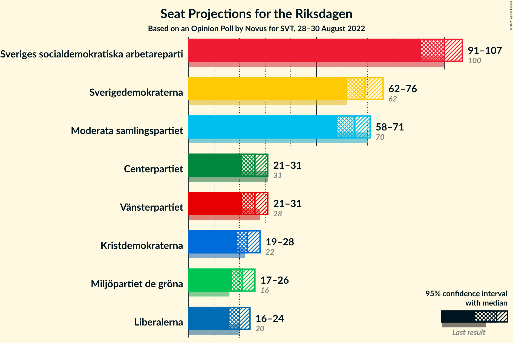

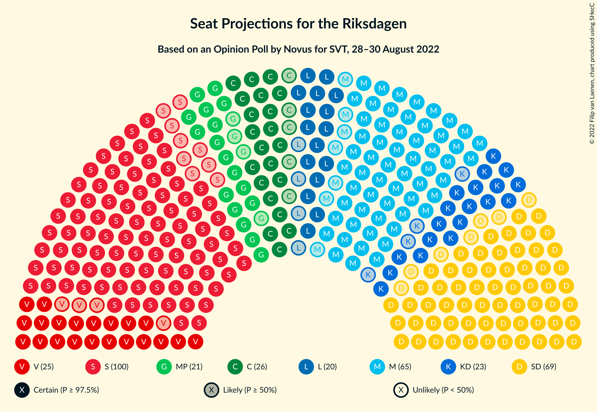

### Confidence Intervals

| Party | Last Result | Median | 80% Confidence Interval | 90% Confidence Interval | 95% Confidence Interval | 99% Confidence Interval |
|:-----:|:-----------:|:------:|:-----------------------:|:-----------------------:|:-----------------------:|:-----------------------:|
| <a href="#sveriges-socialdemokratiska-arbetareparti">Sveriges socialdemokratiska arbetareparti</a> | 100 | 100 | 94–105 |92–106 |91–107 |89–110 |
| <a href="#sverigedemokraterna">Sverigedemokraterna</a> | 62 | 69 | 64–73 |63–75 |62–76 |60–79 |
| <a href="#moderata-samlingspartiet">Moderata samlingspartiet</a> | 70 | 65 | 60–69 |59–70 |58–71 |56–74 |
| <a href="#centerpartiet">Centerpartiet</a> | 31 | 26 | 23–29 |22–30 |21–31 |20–32 |
| <a href="#vänsterpartiet">Vänsterpartiet</a> | 28 | 26 | 23–29 |22–30 |21–31 |20–32 |
| <a href="#kristdemokraterna">Kristdemokraterna</a> | 22 | 23 | 21–27 |20–28 |19–28 |18–30 |
| <a href="#miljöpartiet-de-gröna">Miljöpartiet de gröna</a> | 16 | 21 | 18–24 |18–25 |17–26 |16–27 |
| <a href="#liberalerna">Liberalerna</a> | 20 | 20 | 17–23 |17–23 |16–24 |15–26 |

### Sveriges socialdemokratiska arbetareparti

*For a full overview of the results for this party, see the [Sveriges socialdemokratiska arbetareparti](party-sverigessocialdemokratiskaarbetareparti.html) page.*

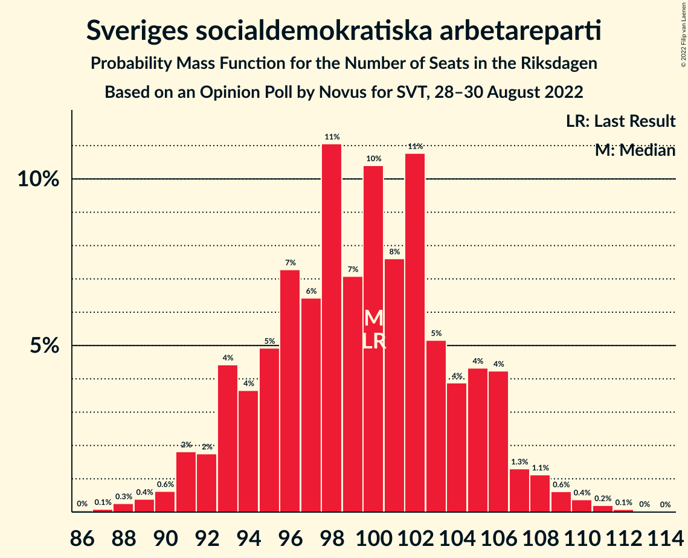

| Number of Seats | Probability | Accumulated | Special Marks |
|:---------------:|:-----------:|:-----------:|:-------------:|
| 86 | 0% | 100% |  |
| 87 | 0.1% | 99.9% |  |
| 88 | 0.3% | 99.8% |  |
| 89 | 0.4% | 99.6% |  |
| 90 | 0.6% | 99.2% |  |
| 91 | 2% | 98.6% |  |
| 92 | 2% | 97% |  |
| 93 | 4% | 95% |  |
| 94 | 4% | 91% |  |
| 95 | 5% | 87% |  |
| 96 | 7% | 82% |  |
| 97 | 6% | 75% |  |
| 98 | 11% | 68% |  |
| 99 | 7% | 57% |  |
| 100 | 10% | 50% | Last Result, Median |
| 101 | 8% | 40% |  |
| 102 | 11% | 32% |  |
| 103 | 5% | 21% |  |
| 104 | 4% | 16% |  |
| 105 | 4% | 12% |  |
| 106 | 4% | 8% |  |
| 107 | 1.3% | 4% |  |
| 108 | 1.1% | 2% |  |
| 109 | 0.6% | 1.3% |  |
| 110 | 0.4% | 0.7% |  |
| 111 | 0.2% | 0.3% |  |
| 112 | 0.1% | 0.1% |  |
| 113 | 0% | 0.1% |  |
| 114 | 0% | 0% |  |

### Sverigedemokraterna

*For a full overview of the results for this party, see the [Sverigedemokraterna](party-sverigedemokraterna.html) page.*

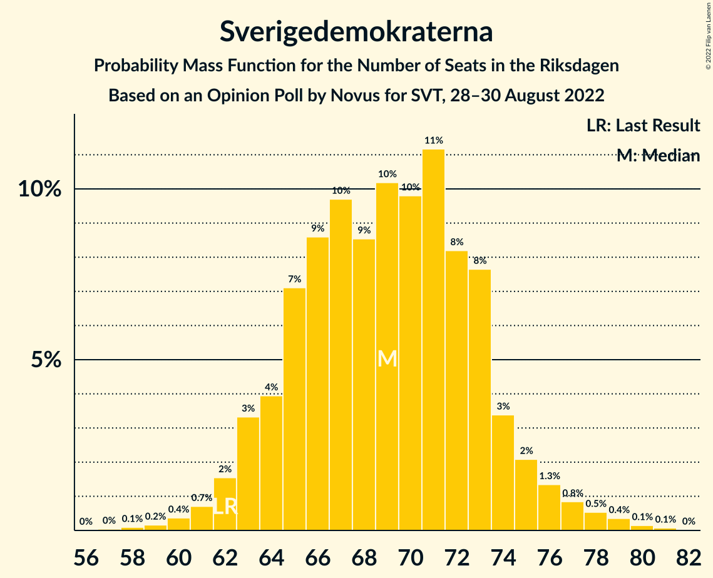

| Number of Seats | Probability | Accumulated | Special Marks |
|:---------------:|:-----------:|:-----------:|:-------------:|
| 57 | 0% | 100% |  |
| 58 | 0.1% | 99.9% |  |
| 59 | 0.2% | 99.8% |  |
| 60 | 0.4% | 99.7% |  |
| 61 | 0.7% | 99.3% |  |
| 62 | 2% | 98.6% | Last Result |
| 63 | 3% | 97% |  |
| 64 | 4% | 94% |  |
| 65 | 7% | 90% |  |
| 66 | 9% | 83% |  |
| 67 | 10% | 74% |  |
| 68 | 9% | 64% |  |
| 69 | 10% | 56% | Median |
| 70 | 10% | 46% |  |
| 71 | 11% | 36% |  |
| 72 | 8% | 25% |  |
| 73 | 8% | 16% |  |
| 74 | 3% | 9% |  |
| 75 | 2% | 5% |  |
| 76 | 1.3% | 3% |  |
| 77 | 0.8% | 2% |  |
| 78 | 0.5% | 1.1% |  |
| 79 | 0.4% | 0.6% |  |
| 80 | 0.1% | 0.3% |  |
| 81 | 0.1% | 0.1% |  |
| 82 | 0% | 0% |  |

### Moderata samlingspartiet

*For a full overview of the results for this party, see the [Moderata samlingspartiet](party-moderatasamlingspartiet.html) page.*

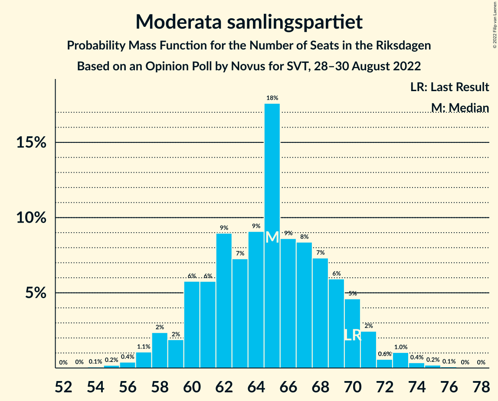

| Number of Seats | Probability | Accumulated | Special Marks |
|:---------------:|:-----------:|:-----------:|:-------------:|
| 53 | 0% | 100% |  |
| 54 | 0.1% | 99.9% |  |
| 55 | 0.2% | 99.9% |  |
| 56 | 0.4% | 99.7% |  |
| 57 | 1.1% | 99.3% |  |
| 58 | 2% | 98% |  |
| 59 | 2% | 96% |  |
| 60 | 6% | 94% |  |
| 61 | 6% | 88% |  |
| 62 | 9% | 82% |  |
| 63 | 7% | 73% |  |
| 64 | 9% | 66% |  |
| 65 | 18% | 57% | Median |
| 66 | 9% | 40% |  |
| 67 | 8% | 31% |  |
| 68 | 7% | 23% |  |
| 69 | 6% | 15% |  |
| 70 | 5% | 9% | Last Result |
| 71 | 2% | 5% |  |
| 72 | 0.6% | 2% |  |
| 73 | 1.0% | 2% |  |
| 74 | 0.4% | 0.7% |  |
| 75 | 0.2% | 0.3% |  |
| 76 | 0.1% | 0.1% |  |
| 77 | 0% | 0.1% |  |
| 78 | 0% | 0% |  |

### Centerpartiet

*For a full overview of the results for this party, see the [Centerpartiet](party-centerpartiet.html) page.*

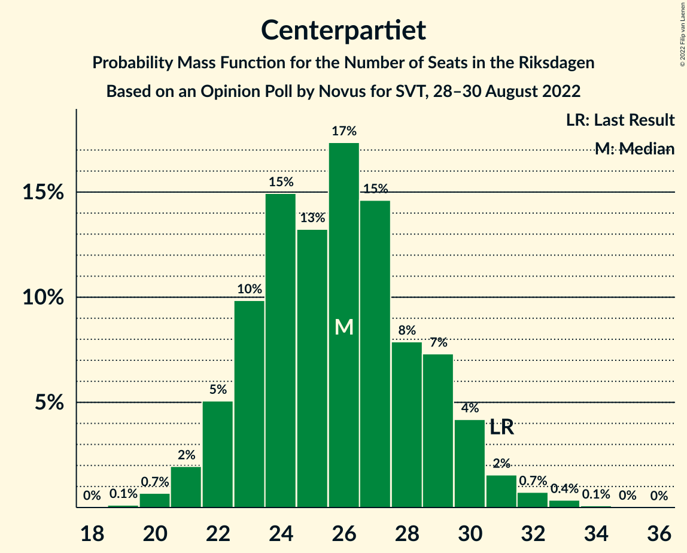

| Number of Seats | Probability | Accumulated | Special Marks |
|:---------------:|:-----------:|:-----------:|:-------------:|
| 19 | 0.1% | 100% |  |
| 20 | 0.7% | 99.9% |  |
| 21 | 2% | 99.2% |  |
| 22 | 5% | 97% |  |
| 23 | 10% | 92% |  |
| 24 | 15% | 82% |  |
| 25 | 13% | 67% |  |
| 26 | 17% | 54% | Median |
| 27 | 15% | 37% |  |
| 28 | 8% | 22% |  |
| 29 | 7% | 14% |  |
| 30 | 4% | 7% |  |
| 31 | 2% | 3% | Last Result |
| 32 | 0.7% | 1.2% |  |
| 33 | 0.4% | 0.5% |  |
| 34 | 0.1% | 0.1% |  |
| 35 | 0% | 0% |  |

### Vänsterpartiet

*For a full overview of the results for this party, see the [Vänsterpartiet](party-vänsterpartiet.html) page.*

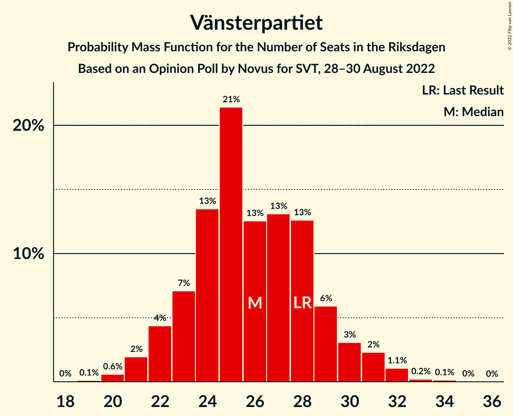

| Number of Seats | Probability | Accumulated | Special Marks |
|:---------------:|:-----------:|:-----------:|:-------------:|
| 19 | 0.1% | 100% |  |
| 20 | 0.6% | 99.9% |  |
| 21 | 2% | 99.3% |  |
| 22 | 4% | 97% |  |
| 23 | 7% | 93% |  |
| 24 | 13% | 86% |  |
| 25 | 21% | 72% |  |
| 26 | 13% | 51% | Median |
| 27 | 13% | 38% |  |
| 28 | 13% | 25% | Last Result |
| 29 | 6% | 13% |  |
| 30 | 3% | 7% |  |
| 31 | 2% | 4% |  |
| 32 | 1.1% | 1.4% |  |
| 33 | 0.2% | 0.4% |  |
| 34 | 0.1% | 0.2% |  |
| 35 | 0% | 0% |  |

### Kristdemokraterna

*For a full overview of the results for this party, see the [Kristdemokraterna](party-kristdemokraterna.html) page.*

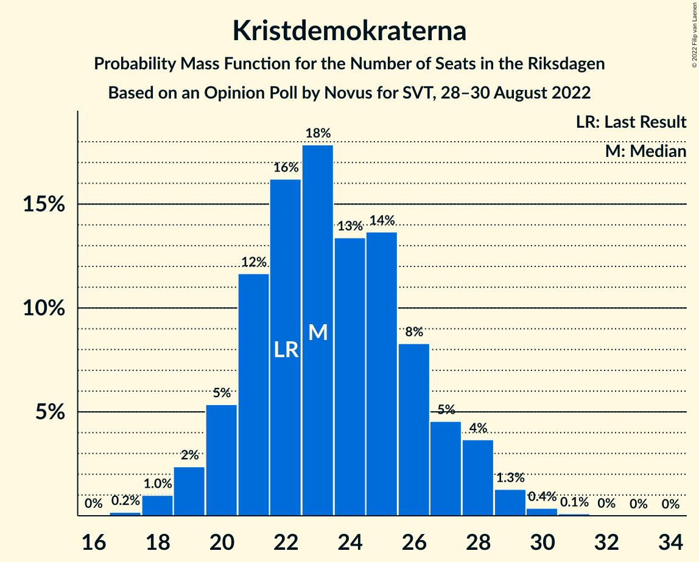

| Number of Seats | Probability | Accumulated | Special Marks |
|:---------------:|:-----------:|:-----------:|:-------------:|
| 17 | 0.2% | 100% |  |
| 18 | 1.0% | 99.8% |  |
| 19 | 2% | 98.8% |  |
| 20 | 5% | 96% |  |
| 21 | 12% | 91% |  |
| 22 | 16% | 79% | Last Result |
| 23 | 18% | 63% | Median |
| 24 | 13% | 45% |  |
| 25 | 14% | 32% |  |
| 26 | 8% | 18% |  |
| 27 | 5% | 10% |  |
| 28 | 4% | 5% |  |
| 29 | 1.3% | 2% |  |
| 30 | 0.4% | 0.5% |  |
| 31 | 0.1% | 0.2% |  |
| 32 | 0% | 0.1% |  |
| 33 | 0% | 0% |  |

### Miljöpartiet de gröna

*For a full overview of the results for this party, see the [Miljöpartiet de gröna](party-miljöpartietdegröna.html) page.*

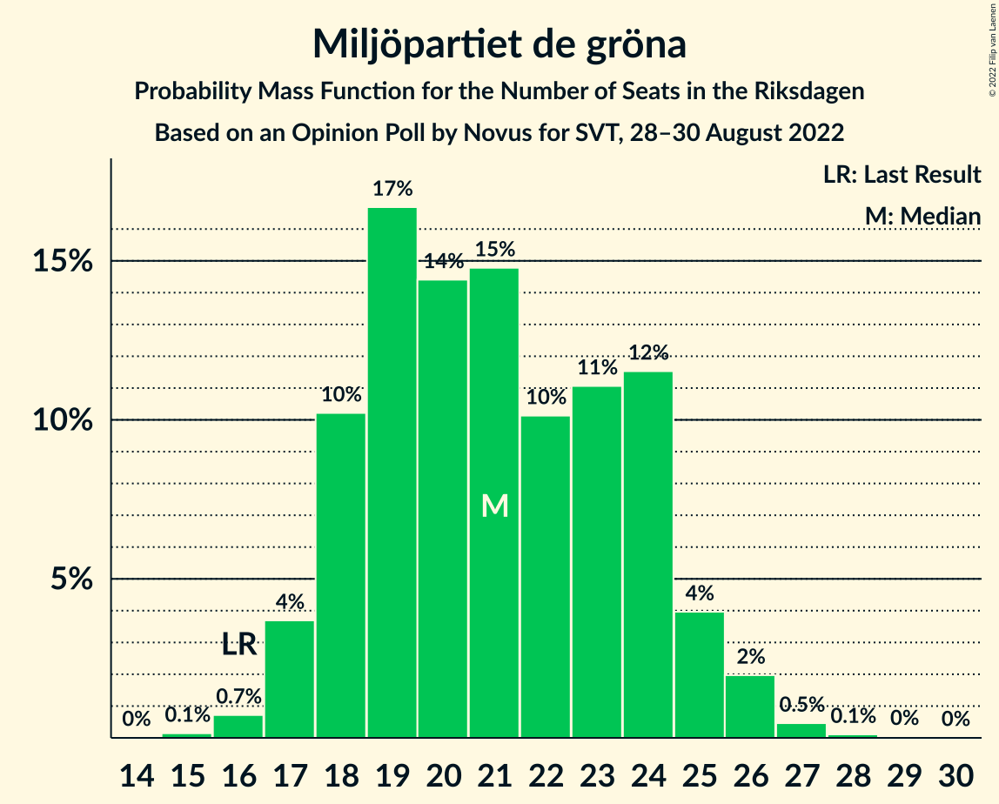

| Number of Seats | Probability | Accumulated | Special Marks |
|:---------------:|:-----------:|:-----------:|:-------------:|
| 15 | 0.1% | 100% |  |
| 16 | 0.7% | 99.8% | Last Result |
| 17 | 4% | 99.1% |  |
| 18 | 10% | 95% |  |
| 19 | 17% | 85% |  |
| 20 | 14% | 69% |  |
| 21 | 15% | 54% | Median |
| 22 | 10% | 39% |  |
| 23 | 11% | 29% |  |
| 24 | 12% | 18% |  |
| 25 | 4% | 7% |  |
| 26 | 2% | 3% |  |
| 27 | 0.5% | 0.6% |  |
| 28 | 0.1% | 0.2% |  |
| 29 | 0% | 0.1% |  |
| 30 | 0% | 0% |  |

### Liberalerna

*For a full overview of the results for this party, see the [Liberalerna](party-liberalerna.html) page.*

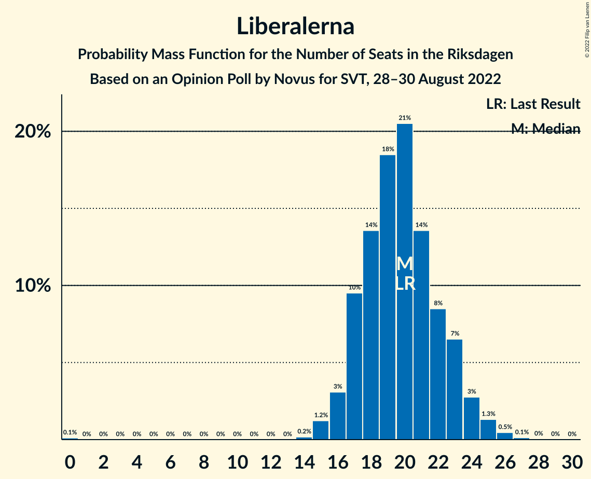

| Number of Seats | Probability | Accumulated | Special Marks |
|:---------------:|:-----------:|:-----------:|:-------------:|
| 0 | 0.1% | 100% |  |
| 1 | 0% | 99.9% |  |
| 2 | 0% | 99.9% |  |
| 3 | 0% | 99.9% |  |
| 4 | 0% | 99.9% |  |
| 5 | 0% | 99.9% |  |
| 6 | 0% | 99.9% |  |
| 7 | 0% | 99.9% |  |
| 8 | 0% | 99.9% |  |
| 9 | 0% | 99.9% |  |
| 10 | 0% | 99.9% |  |
| 11 | 0% | 99.9% |  |
| 12 | 0% | 99.9% |  |
| 13 | 0% | 99.9% |  |
| 14 | 0.2% | 99.9% |  |
| 15 | 1.2% | 99.7% |  |
| 16 | 3% | 98% |  |
| 17 | 10% | 95% |  |
| 18 | 14% | 86% |  |
| 19 | 18% | 72% |  |
| 20 | 21% | 54% | Last Result, Median |
| 21 | 14% | 33% |  |
| 22 | 8% | 20% |  |
| 23 | 7% | 11% |  |
| 24 | 3% | 5% |  |
| 25 | 1.3% | 2% |  |
| 26 | 0.5% | 0.6% |  |
| 27 | 0.1% | 0.2% |  |
| 28 | 0% | 0.1% |  |
| 29 | 0% | 0% |  |

## Coalitions

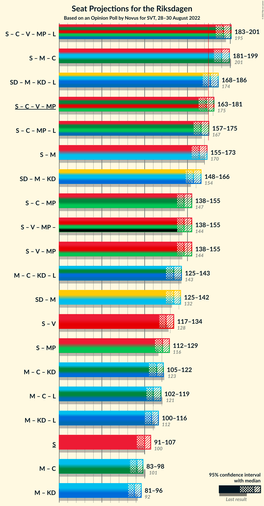

### Confidence Intervals

| Coalition | Last Result | Median | Majority? | 80% Confidence Interval | 90% Confidence Interval | 95% Confidence Interval | 99% Confidence Interval |
|:---------:|:-----------:|:------:|:---------:|:-----------------------:|:-----------------------:|:-----------------------:|:-----------------------:|
| Sveriges socialdemokratiska arbetareparti – Centerpartiet – Vänsterpartiet – Miljöpartiet de gröna – Liberalerna | 195 | 192 | 100% | 187–198 | 184–199 | 183–201 | 180–204 |
| Sveriges socialdemokratiska arbetareparti – Moderata samlingspartiet – Centerpartiet | 201 | 190 | 100% | 184–196 | 183–197 | 181–199 | 178–202 |
| Sverigedemokraterna – Moderata samlingspartiet – Kristdemokraterna – Liberalerna | 174 | 177 | 73% | 171–183 | 169–184 | 168–186 | 165–189 |
| Sveriges socialdemokratiska arbetareparti – Centerpartiet – Vänsterpartiet – Miljöpartiet de gröna | 175 | 172 | 27% | 166–178 | 165–180 | 163–181 | 160–184 |
| Sveriges socialdemokratiska arbetareparti – Centerpartiet – Miljöpartiet de gröna – Liberalerna | 167 | 166 | 3% | 160–172 | 159–173 | 157–175 | 154–178 |
| Sveriges socialdemokratiska arbetareparti – Moderata samlingspartiet | 170 | 164 | 1.0% | 158–170 | 157–172 | 155–173 | 152–176 |
| Sverigedemokraterna – Moderata samlingspartiet – Kristdemokraterna | 154 | 157 | 0% | 151–162 | 150–165 | 148–166 | 145–169 |
| Sveriges socialdemokratiska arbetareparti – Centerpartiet – Miljöpartiet de gröna | 147 | 146 | 0% | 140–152 | 139–153 | 138–155 | 135–158 |
| Sveriges socialdemokratiska arbetareparti – Vänsterpartiet – Miljöpartiet de gröna | 144 | 146 | 0% | 141–152 | 139–154 | 138–155 | 135–158 |
| Moderata samlingspartiet – Centerpartiet – Kristdemokraterna – Liberalerna | 143 | 134 | 0% | 128–139 | 126–141 | 125–143 | 123–145 |
| Sverigedemokraterna – Moderata samlingspartiet | 132 | 134 | 0% | 128–139 | 126–141 | 125–142 | 123–145 |
| Sveriges socialdemokratiska arbetareparti – Vänsterpartiet | 128 | 125 | 0% | 120–131 | 118–133 | 117–134 | 114–137 |
| Sveriges socialdemokratiska arbetareparti – Miljöpartiet de gröna | 116 | 121 | 0% | 115–126 | 113–128 | 112–129 | 109–132 |
| Moderata samlingspartiet – Centerpartiet – Kristdemokraterna | 123 | 114 | 0% | 109–119 | 107–121 | 105–122 | 103–125 |
| Moderata samlingspartiet – Centerpartiet – Liberalerna | 121 | 110 | 0% | 105–116 | 103–117 | 102–119 | 100–121 |
| Moderata samlingspartiet – Kristdemokraterna – Liberalerna | 112 | 108 | 0% | 103–113 | 101–115 | 100–116 | 97–119 |
| Sveriges socialdemokratiska arbetareparti | 100 | 100 | 0% | 94–105 | 92–106 | 91–107 | 89–110 |
| Moderata samlingspartiet – Centerpartiet | 101 | 91 | 0% | 86–96 | 84–97 | 83–98 | 81–101 |
| Moderata samlingspartiet – Kristdemokraterna | 92 | 88 | 0% | 83–93 | 82–95 | 81–96 | 78–99 |

### Sveriges socialdemokratiska arbetareparti – Centerpartiet – Vänsterpartiet – Miljöpartiet de gröna – Liberalerna

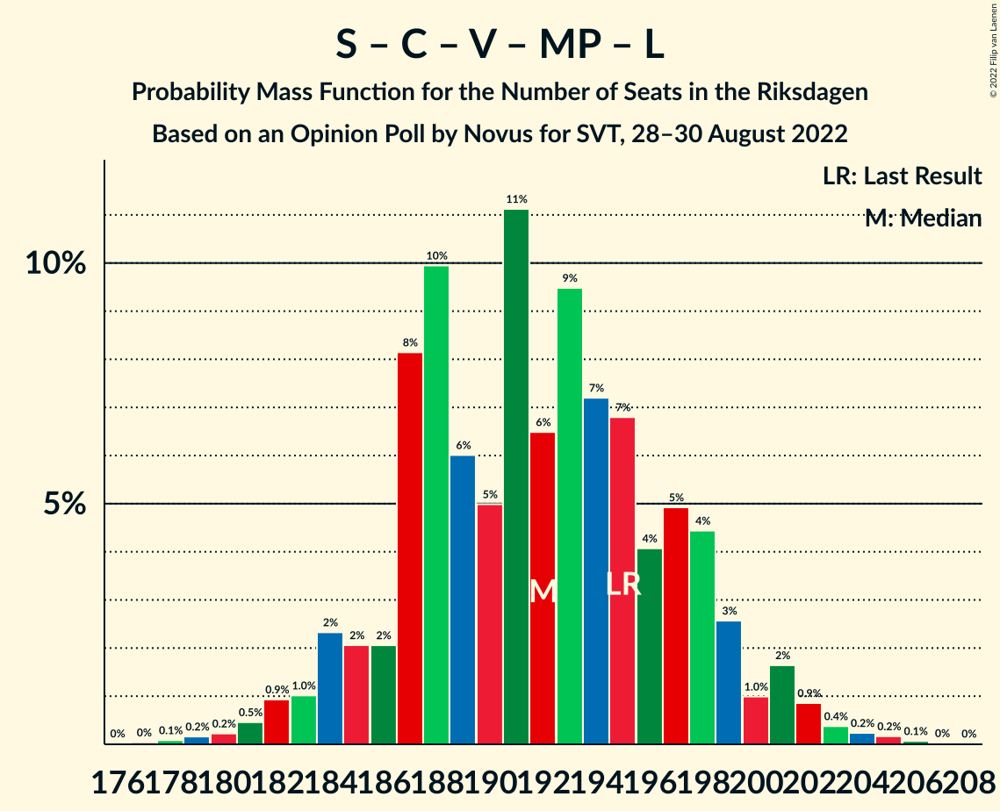

| Number of Seats | Probability | Accumulated | Special Marks |
|:---------------:|:-----------:|:-----------:|:-------------:|
| 177 | 0% | 100% |  |
| 178 | 0.1% | 99.9% |  |
| 179 | 0.2% | 99.8% |  |
| 180 | 0.2% | 99.7% |  |
| 181 | 0.5% | 99.5% |  |
| 182 | 0.9% | 99.0% |  |
| 183 | 1.0% | 98% |  |
| 184 | 2% | 97% |  |
| 185 | 2% | 95% |  |
| 186 | 2% | 93% |  |
| 187 | 8% | 91% |  |
| 188 | 10% | 82% |  |
| 189 | 6% | 73% |  |
| 190 | 5% | 66% |  |
| 191 | 11% | 62% |  |
| 192 | 6% | 50% |  |
| 193 | 9% | 44% | Median |
| 194 | 7% | 34% |  |
| 195 | 7% | 27% | Last Result |
| 196 | 4% | 20% |  |
| 197 | 5% | 16% |  |
| 198 | 4% | 11% |  |
| 199 | 3% | 7% |  |
| 200 | 1.0% | 4% |  |
| 201 | 2% | 3% |  |
| 202 | 0.9% | 2% |  |
| 203 | 0.4% | 0.9% |  |
| 204 | 0.2% | 0.5% |  |
| 205 | 0.2% | 0.3% |  |
| 206 | 0.1% | 0.1% |  |
| 207 | 0% | 0.1% |  |
| 208 | 0% | 0% |  |

### Sveriges socialdemokratiska arbetareparti – Moderata samlingspartiet – Centerpartiet

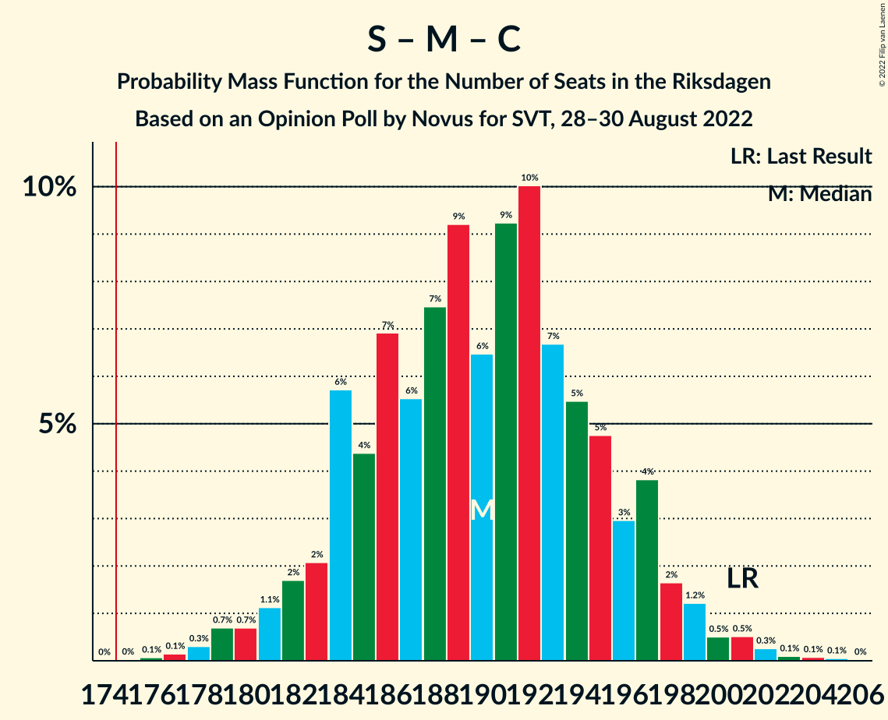

| Number of Seats | Probability | Accumulated | Special Marks |
|:---------------:|:-----------:|:-----------:|:-------------:|
| 175 | 0% | 100% | Majority |
| 176 | 0.1% | 99.9% |  |
| 177 | 0.1% | 99.9% |  |
| 178 | 0.3% | 99.7% |  |
| 179 | 0.7% | 99.4% |  |
| 180 | 0.7% | 98.7% |  |
| 181 | 1.1% | 98% |  |
| 182 | 2% | 97% |  |
| 183 | 2% | 95% |  |
| 184 | 6% | 93% |  |
| 185 | 4% | 87% |  |
| 186 | 7% | 83% |  |
| 187 | 6% | 76% |  |
| 188 | 7% | 71% |  |
| 189 | 9% | 63% |  |
| 190 | 6% | 54% |  |
| 191 | 9% | 47% | Median |
| 192 | 10% | 38% |  |
| 193 | 7% | 28% |  |
| 194 | 5% | 21% |  |
| 195 | 5% | 16% |  |
| 196 | 3% | 11% |  |
| 197 | 4% | 8% |  |
| 198 | 2% | 4% |  |
| 199 | 1.2% | 3% |  |
| 200 | 0.5% | 2% |  |
| 201 | 0.5% | 1.1% | Last Result |
| 202 | 0.3% | 0.5% |  |
| 203 | 0.1% | 0.3% |  |
| 204 | 0.1% | 0.2% |  |
| 205 | 0.1% | 0.1% |  |
| 206 | 0% | 0% |  |

### Sverigedemokraterna – Moderata samlingspartiet – Kristdemokraterna – Liberalerna

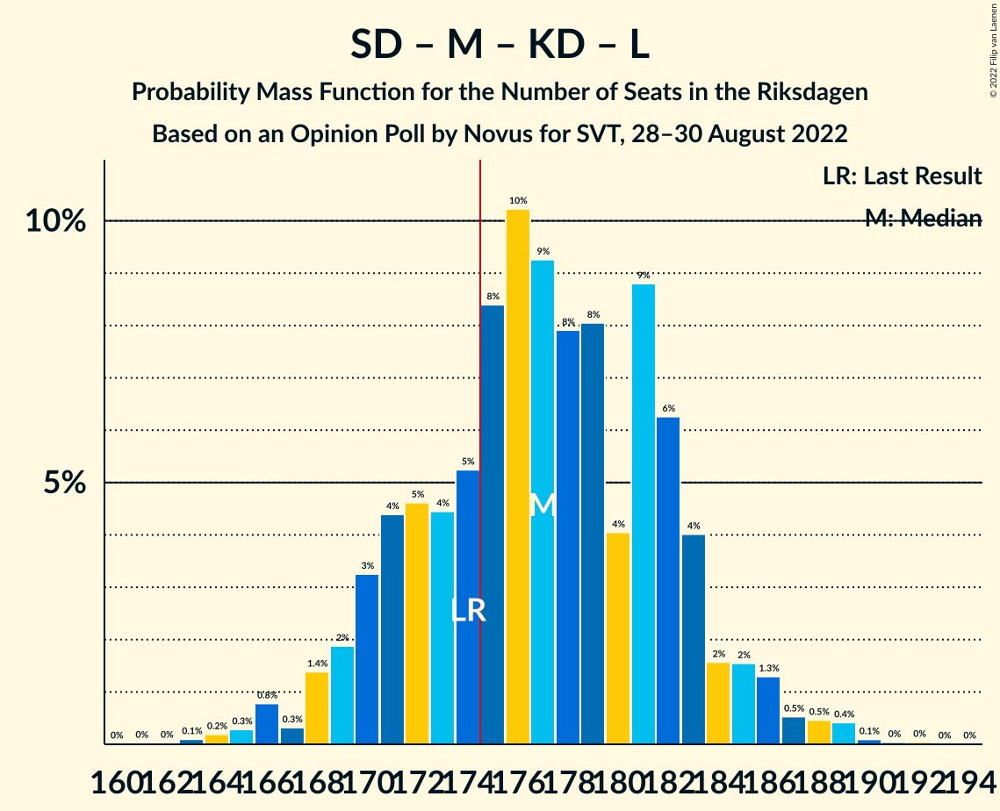

| Number of Seats | Probability | Accumulated | Special Marks |
|:---------------:|:-----------:|:-----------:|:-------------:|
| 161 | 0% | 100% |  |
| 162 | 0% | 99.9% |  |
| 163 | 0.1% | 99.9% |  |
| 164 | 0.2% | 99.8% |  |
| 165 | 0.3% | 99.6% |  |
| 166 | 0.8% | 99.3% |  |
| 167 | 0.3% | 98.6% |  |
| 168 | 1.4% | 98% |  |
| 169 | 2% | 97% |  |
| 170 | 3% | 95% |  |
| 171 | 4% | 92% |  |
| 172 | 5% | 87% |  |
| 173 | 4% | 83% |  |
| 174 | 5% | 78% | Last Result |
| 175 | 8% | 73% | Majority |
| 176 | 10% | 65% |  |
| 177 | 9% | 54% | Median |
| 178 | 8% | 45% |  |
| 179 | 8% | 37% |  |
| 180 | 4% | 29% |  |
| 181 | 9% | 25% |  |
| 182 | 6% | 16% |  |
| 183 | 4% | 10% |  |
| 184 | 2% | 6% |  |
| 185 | 2% | 4% |  |
| 186 | 1.3% | 3% |  |
| 187 | 0.5% | 2% |  |
| 188 | 0.5% | 1.1% |  |
| 189 | 0.4% | 0.6% |  |
| 190 | 0.1% | 0.2% |  |
| 191 | 0% | 0.1% |  |
| 192 | 0% | 0.1% |  |
| 193 | 0% | 0% |  |

### Sveriges socialdemokratiska arbetareparti – Centerpartiet – Vänsterpartiet – Miljöpartiet de gröna

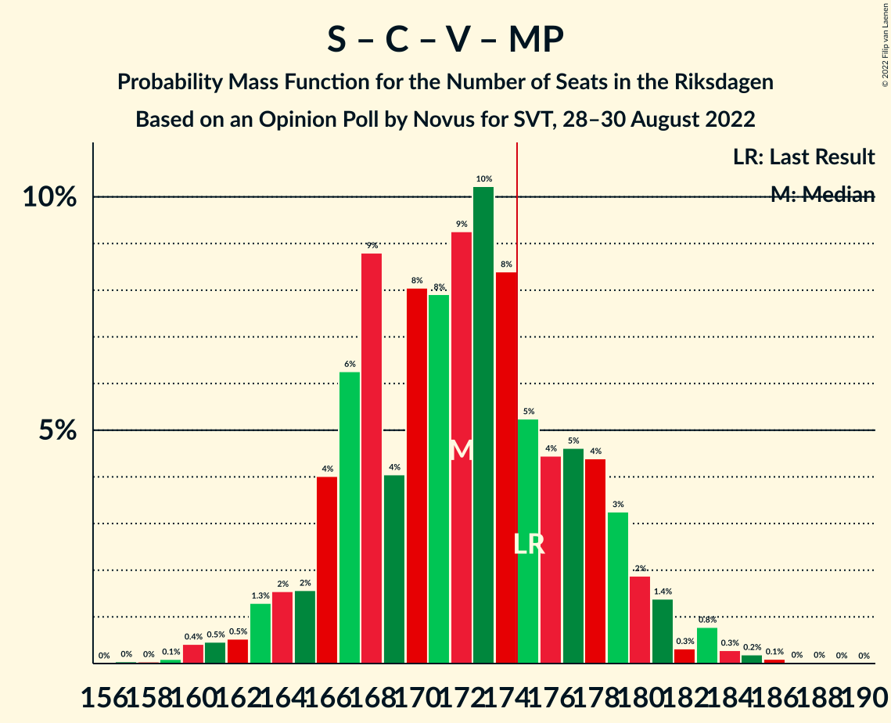

| Number of Seats | Probability | Accumulated | Special Marks |
|:---------------:|:-----------:|:-----------:|:-------------:|
| 157 | 0% | 100% |  |
| 158 | 0% | 99.9% |  |
| 159 | 0.1% | 99.9% |  |
| 160 | 0.4% | 99.8% |  |
| 161 | 0.5% | 99.4% |  |
| 162 | 0.5% | 98.9% |  |
| 163 | 1.3% | 98% |  |
| 164 | 2% | 97% |  |
| 165 | 2% | 96% |  |
| 166 | 4% | 94% |  |
| 167 | 6% | 90% |  |
| 168 | 9% | 84% |  |
| 169 | 4% | 75% |  |
| 170 | 8% | 71% |  |
| 171 | 8% | 63% |  |
| 172 | 9% | 55% |  |
| 173 | 10% | 46% | Median |
| 174 | 8% | 35% |  |
| 175 | 5% | 27% | Last Result, Majority |
| 176 | 4% | 22% |  |
| 177 | 5% | 17% |  |
| 178 | 4% | 13% |  |
| 179 | 3% | 8% |  |
| 180 | 2% | 5% |  |
| 181 | 1.4% | 3% |  |
| 182 | 0.3% | 2% |  |
| 183 | 0.8% | 1.4% |  |
| 184 | 0.3% | 0.7% |  |
| 185 | 0.2% | 0.4% |  |
| 186 | 0.1% | 0.2% |  |
| 187 | 0% | 0.1% |  |
| 188 | 0% | 0.1% |  |
| 189 | 0% | 0% |  |

### Sveriges socialdemokratiska arbetareparti – Centerpartiet – Miljöpartiet de gröna – Liberalerna

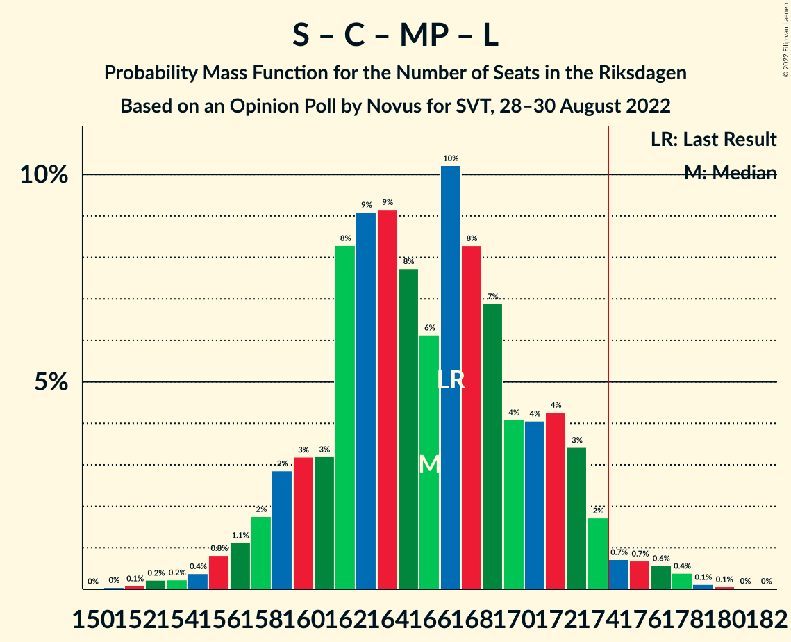

| Number of Seats | Probability | Accumulated | Special Marks |
|:---------------:|:-----------:|:-----------:|:-------------:|
| 151 | 0% | 100% |  |
| 152 | 0.1% | 99.9% |  |
| 153 | 0.2% | 99.8% |  |
| 154 | 0.2% | 99.6% |  |
| 155 | 0.4% | 99.4% |  |
| 156 | 0.8% | 99.0% |  |
| 157 | 1.1% | 98% |  |
| 158 | 2% | 97% |  |
| 159 | 3% | 95% |  |
| 160 | 3% | 92% |  |
| 161 | 3% | 89% |  |
| 162 | 8% | 86% |  |
| 163 | 9% | 78% |  |
| 164 | 9% | 69% |  |
| 165 | 8% | 59% |  |
| 166 | 6% | 52% |  |
| 167 | 10% | 46% | Last Result, Median |
| 168 | 8% | 35% |  |
| 169 | 7% | 27% |  |
| 170 | 4% | 20% |  |
| 171 | 4% | 16% |  |
| 172 | 4% | 12% |  |
| 173 | 3% | 8% |  |
| 174 | 2% | 4% |  |
| 175 | 0.7% | 3% | Majority |
| 176 | 0.7% | 2% |  |
| 177 | 0.6% | 1.2% |  |
| 178 | 0.4% | 0.6% |  |
| 179 | 0.1% | 0.2% |  |
| 180 | 0.1% | 0.1% |  |
| 181 | 0% | 0.1% |  |
| 182 | 0% | 0% |  |

### Sveriges socialdemokratiska arbetareparti – Moderata samlingspartiet

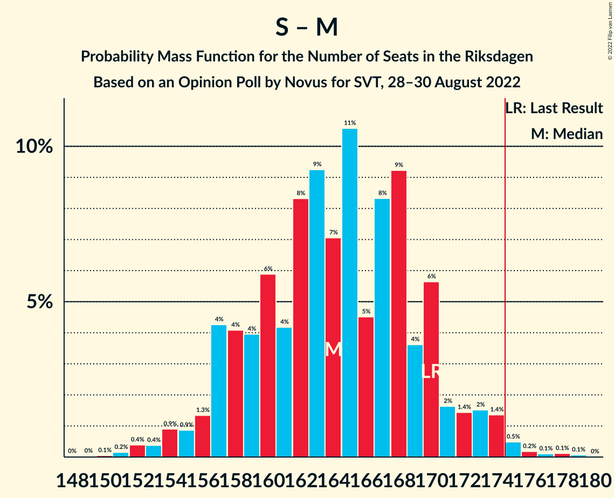

| Number of Seats | Probability | Accumulated | Special Marks |
|:---------------:|:-----------:|:-----------:|:-------------:|
| 149 | 0% | 100% |  |
| 150 | 0.1% | 99.9% |  |
| 151 | 0.2% | 99.9% |  |
| 152 | 0.4% | 99.7% |  |
| 153 | 0.4% | 99.3% |  |
| 154 | 0.9% | 99.0% |  |
| 155 | 0.9% | 98% |  |
| 156 | 1.3% | 97% |  |
| 157 | 4% | 96% |  |
| 158 | 4% | 92% |  |
| 159 | 4% | 88% |  |
| 160 | 6% | 84% |  |
| 161 | 4% | 78% |  |
| 162 | 8% | 73% |  |
| 163 | 9% | 65% |  |
| 164 | 7% | 56% |  |
| 165 | 11% | 49% | Median |
| 166 | 5% | 38% |  |
| 167 | 8% | 34% |  |
| 168 | 9% | 25% |  |
| 169 | 4% | 16% |  |
| 170 | 6% | 13% | Last Result |
| 171 | 2% | 7% |  |
| 172 | 1.4% | 5% |  |
| 173 | 2% | 4% |  |
| 174 | 1.4% | 2% |  |
| 175 | 0.5% | 1.0% | Majority |
| 176 | 0.2% | 0.5% |  |
| 177 | 0.1% | 0.3% |  |
| 178 | 0.1% | 0.2% |  |
| 179 | 0.1% | 0.1% |  |
| 180 | 0% | 0% |  |

### Sverigedemokraterna – Moderata samlingspartiet – Kristdemokraterna

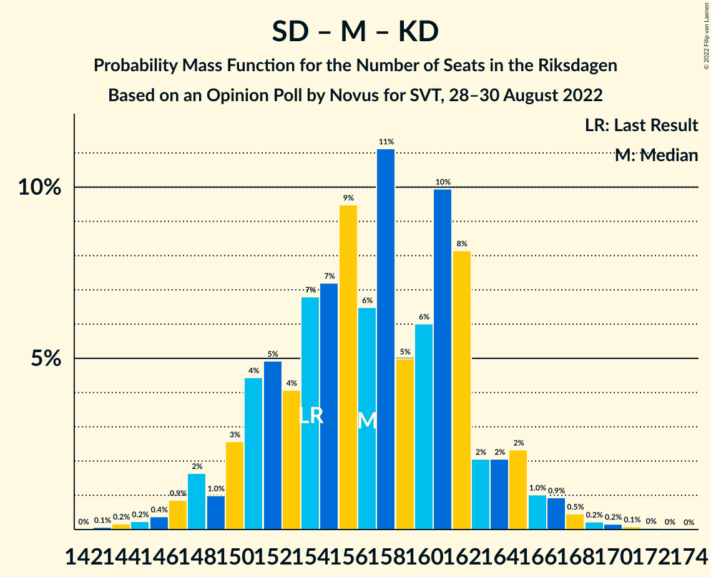

| Number of Seats | Probability | Accumulated | Special Marks |
|:---------------:|:-----------:|:-----------:|:-------------:|
| 142 | 0% | 100% |  |
| 143 | 0.1% | 99.9% |  |
| 144 | 0.2% | 99.9% |  |
| 145 | 0.2% | 99.7% |  |
| 146 | 0.4% | 99.5% |  |
| 147 | 0.9% | 99.1% |  |
| 148 | 2% | 98% |  |
| 149 | 1.0% | 97% |  |
| 150 | 3% | 96% |  |
| 151 | 4% | 93% |  |
| 152 | 5% | 89% |  |
| 153 | 4% | 84% |  |
| 154 | 7% | 80% | Last Result |
| 155 | 7% | 73% |  |
| 156 | 9% | 66% |  |
| 157 | 6% | 56% | Median |
| 158 | 11% | 50% |  |
| 159 | 5% | 38% |  |
| 160 | 6% | 34% |  |
| 161 | 10% | 27% |  |
| 162 | 8% | 18% |  |
| 163 | 2% | 9% |  |
| 164 | 2% | 7% |  |
| 165 | 2% | 5% |  |
| 166 | 1.0% | 3% |  |
| 167 | 0.9% | 2% |  |
| 168 | 0.5% | 1.0% |  |
| 169 | 0.2% | 0.5% |  |
| 170 | 0.2% | 0.3% |  |
| 171 | 0.1% | 0.2% |  |
| 172 | 0% | 0.1% |  |
| 173 | 0% | 0% |  |

### Sveriges socialdemokratiska arbetareparti – Centerpartiet – Miljöpartiet de gröna

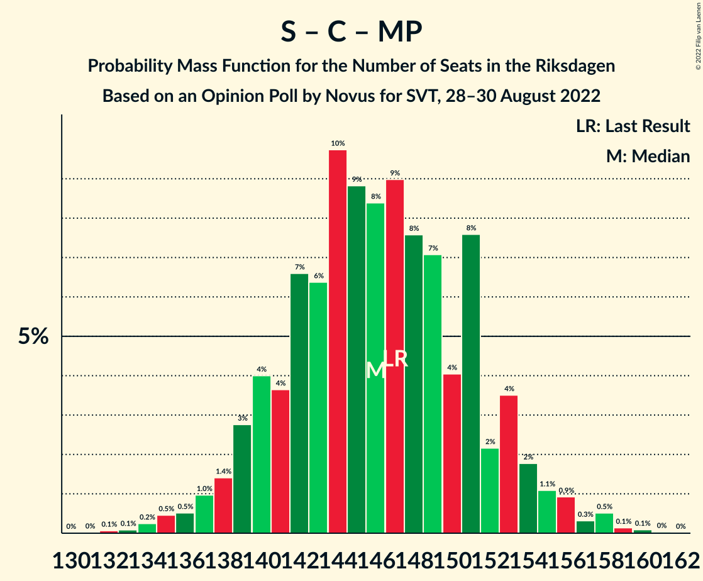

| Number of Seats | Probability | Accumulated | Special Marks |
|:---------------:|:-----------:|:-----------:|:-------------:|
| 132 | 0.1% | 100% |  |
| 133 | 0.1% | 99.9% |  |
| 134 | 0.2% | 99.8% |  |
| 135 | 0.5% | 99.6% |  |
| 136 | 0.5% | 99.1% |  |
| 137 | 1.0% | 98.6% |  |
| 138 | 1.4% | 98% |  |
| 139 | 3% | 96% |  |
| 140 | 4% | 93% |  |
| 141 | 4% | 89% |  |
| 142 | 7% | 86% |  |
| 143 | 6% | 79% |  |
| 144 | 10% | 73% |  |
| 145 | 9% | 63% |  |
| 146 | 8% | 54% |  |
| 147 | 9% | 46% | Last Result, Median |
| 148 | 8% | 37% |  |
| 149 | 7% | 29% |  |
| 150 | 4% | 22% |  |
| 151 | 8% | 18% |  |
| 152 | 2% | 11% |  |
| 153 | 4% | 8% |  |
| 154 | 2% | 5% |  |
| 155 | 1.1% | 3% |  |
| 156 | 0.9% | 2% |  |
| 157 | 0.3% | 1.1% |  |
| 158 | 0.5% | 0.8% |  |
| 159 | 0.1% | 0.3% |  |
| 160 | 0.1% | 0.2% |  |
| 161 | 0% | 0.1% |  |
| 162 | 0% | 0% |  |

### Sveriges socialdemokratiska arbetareparti – Vänsterpartiet – Miljöpartiet de gröna

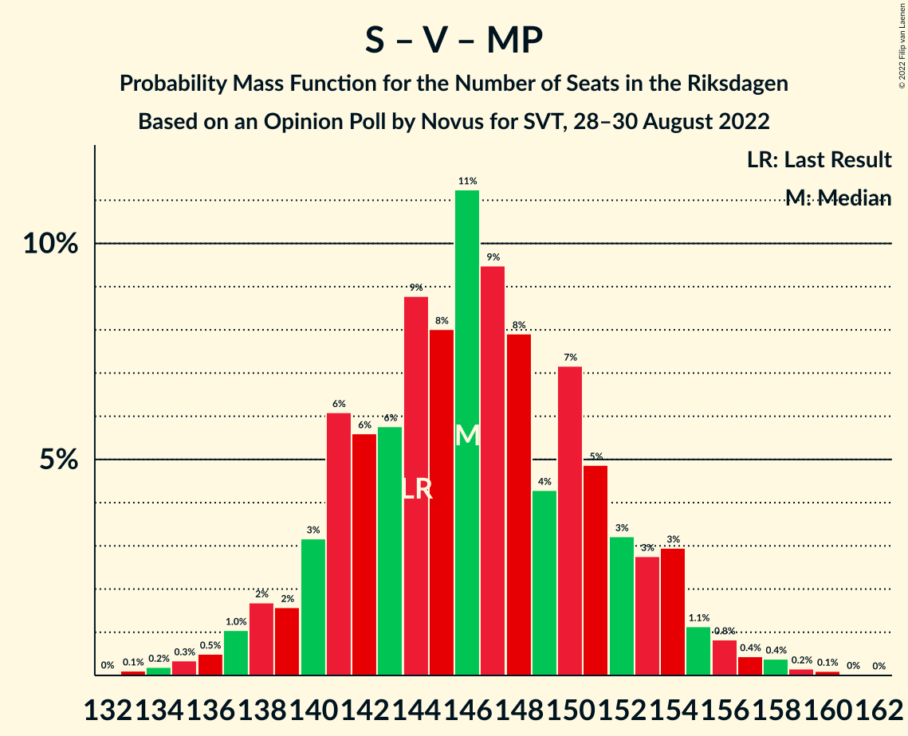

| Number of Seats | Probability | Accumulated | Special Marks |
|:---------------:|:-----------:|:-----------:|:-------------:|
| 132 | 0% | 100% |  |
| 133 | 0.1% | 99.9% |  |
| 134 | 0.2% | 99.8% |  |
| 135 | 0.3% | 99.6% |  |
| 136 | 0.5% | 99.3% |  |
| 137 | 1.0% | 98.8% |  |
| 138 | 2% | 98% |  |
| 139 | 2% | 96% |  |
| 140 | 3% | 94% |  |
| 141 | 6% | 91% |  |
| 142 | 6% | 85% |  |
| 143 | 6% | 80% |  |
| 144 | 9% | 74% | Last Result |
| 145 | 8% | 65% |  |
| 146 | 11% | 57% |  |
| 147 | 9% | 46% | Median |
| 148 | 8% | 36% |  |
| 149 | 4% | 28% |  |
| 150 | 7% | 24% |  |
| 151 | 5% | 17% |  |
| 152 | 3% | 12% |  |
| 153 | 3% | 9% |  |
| 154 | 3% | 6% |  |
| 155 | 1.1% | 3% |  |
| 156 | 0.8% | 2% |  |
| 157 | 0.4% | 1.2% |  |
| 158 | 0.4% | 0.7% |  |
| 159 | 0.2% | 0.3% |  |
| 160 | 0.1% | 0.2% |  |
| 161 | 0% | 0.1% |  |
| 162 | 0% | 0% |  |

### Moderata samlingspartiet – Centerpartiet – Kristdemokraterna – Liberalerna

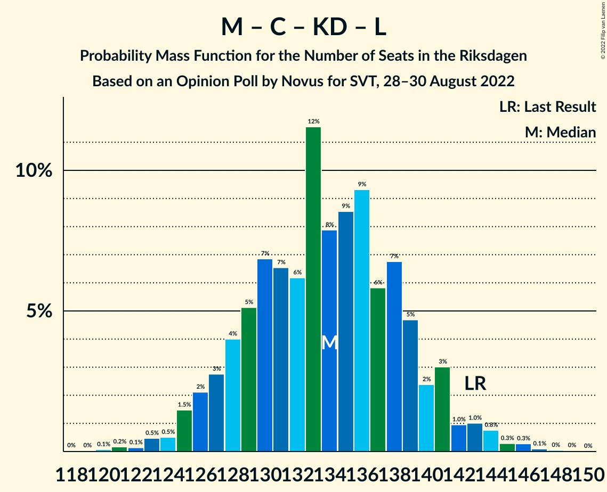

| Number of Seats | Probability | Accumulated | Special Marks |
|:---------------:|:-----------:|:-----------:|:-------------:|
| 118 | 0% | 100% |  |
| 119 | 0% | 99.9% |  |
| 120 | 0.1% | 99.9% |  |
| 121 | 0.2% | 99.8% |  |
| 122 | 0.1% | 99.7% |  |
| 123 | 0.5% | 99.5% |  |
| 124 | 0.5% | 99.0% |  |
| 125 | 1.5% | 98.5% |  |
| 126 | 2% | 97% |  |
| 127 | 3% | 95% |  |
| 128 | 4% | 92% |  |
| 129 | 5% | 88% |  |
| 130 | 7% | 83% |  |
| 131 | 7% | 76% |  |
| 132 | 6% | 70% |  |
| 133 | 12% | 63% |  |
| 134 | 8% | 52% | Median |
| 135 | 9% | 44% |  |
| 136 | 9% | 35% |  |
| 137 | 6% | 26% |  |
| 138 | 7% | 20% |  |
| 139 | 5% | 14% |  |
| 140 | 2% | 9% |  |
| 141 | 3% | 7% |  |
| 142 | 1.0% | 4% |  |
| 143 | 1.0% | 3% | Last Result |
| 144 | 0.8% | 2% |  |
| 145 | 0.3% | 0.8% |  |
| 146 | 0.3% | 0.5% |  |
| 147 | 0.1% | 0.2% |  |
| 148 | 0% | 0.1% |  |
| 149 | 0% | 0.1% |  |
| 150 | 0% | 0% |  |

### Sverigedemokraterna – Moderata samlingspartiet

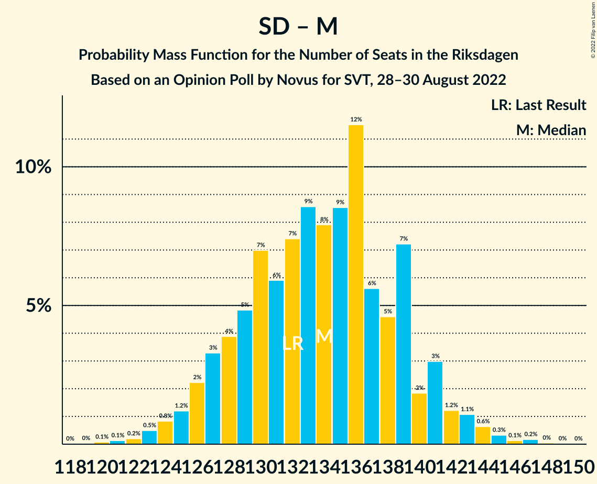

| Number of Seats | Probability | Accumulated | Special Marks |
|:---------------:|:-----------:|:-----------:|:-------------:|
| 119 | 0% | 100% |  |
| 120 | 0.1% | 99.9% |  |
| 121 | 0.1% | 99.9% |  |
| 122 | 0.2% | 99.7% |  |
| 123 | 0.5% | 99.5% |  |
| 124 | 0.8% | 99.0% |  |
| 125 | 1.2% | 98% |  |
| 126 | 2% | 97% |  |
| 127 | 3% | 95% |  |
| 128 | 4% | 91% |  |
| 129 | 5% | 88% |  |
| 130 | 7% | 83% |  |
| 131 | 6% | 76% |  |
| 132 | 7% | 70% | Last Result |
| 133 | 9% | 62% |  |
| 134 | 8% | 54% | Median |
| 135 | 9% | 46% |  |
| 136 | 12% | 37% |  |
| 137 | 6% | 26% |  |
| 138 | 5% | 20% |  |
| 139 | 7% | 16% |  |
| 140 | 2% | 8% |  |
| 141 | 3% | 7% |  |
| 142 | 1.2% | 4% |  |
| 143 | 1.1% | 2% |  |
| 144 | 0.6% | 1.4% |  |
| 145 | 0.3% | 0.7% |  |
| 146 | 0.1% | 0.4% |  |
| 147 | 0.2% | 0.3% |  |
| 148 | 0% | 0.1% |  |
| 149 | 0% | 0% |  |

### Sveriges socialdemokratiska arbetareparti – Vänsterpartiet

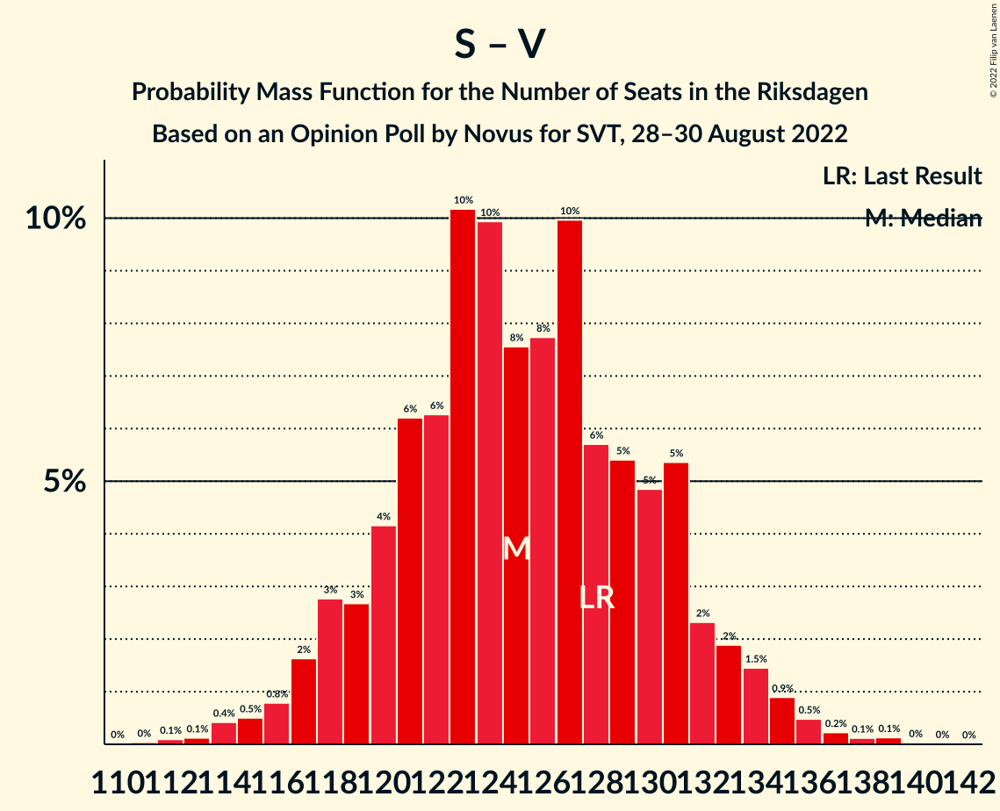

| Number of Seats | Probability | Accumulated | Special Marks |
|:---------------:|:-----------:|:-----------:|:-------------:|
| 111 | 0% | 100% |  |
| 112 | 0.1% | 99.9% |  |
| 113 | 0.1% | 99.8% |  |
| 114 | 0.4% | 99.7% |  |
| 115 | 0.5% | 99.3% |  |
| 116 | 0.8% | 98.8% |  |
| 117 | 2% | 98% |  |
| 118 | 3% | 96% |  |
| 119 | 3% | 94% |  |
| 120 | 4% | 91% |  |
| 121 | 6% | 87% |  |
| 122 | 6% | 81% |  |
| 123 | 10% | 74% |  |
| 124 | 10% | 64% |  |
| 125 | 8% | 54% |  |
| 126 | 8% | 47% | Median |
| 127 | 10% | 39% |  |
| 128 | 6% | 29% | Last Result |
| 129 | 5% | 23% |  |
| 130 | 5% | 18% |  |
| 131 | 5% | 13% |  |
| 132 | 2% | 8% |  |
| 133 | 2% | 5% |  |
| 134 | 1.5% | 3% |  |
| 135 | 0.9% | 2% |  |
| 136 | 0.5% | 1.0% |  |
| 137 | 0.2% | 0.5% |  |
| 138 | 0.1% | 0.3% |  |
| 139 | 0.1% | 0.2% |  |
| 140 | 0% | 0.1% |  |
| 141 | 0% | 0% |  |

### Sveriges socialdemokratiska arbetareparti – Miljöpartiet de gröna

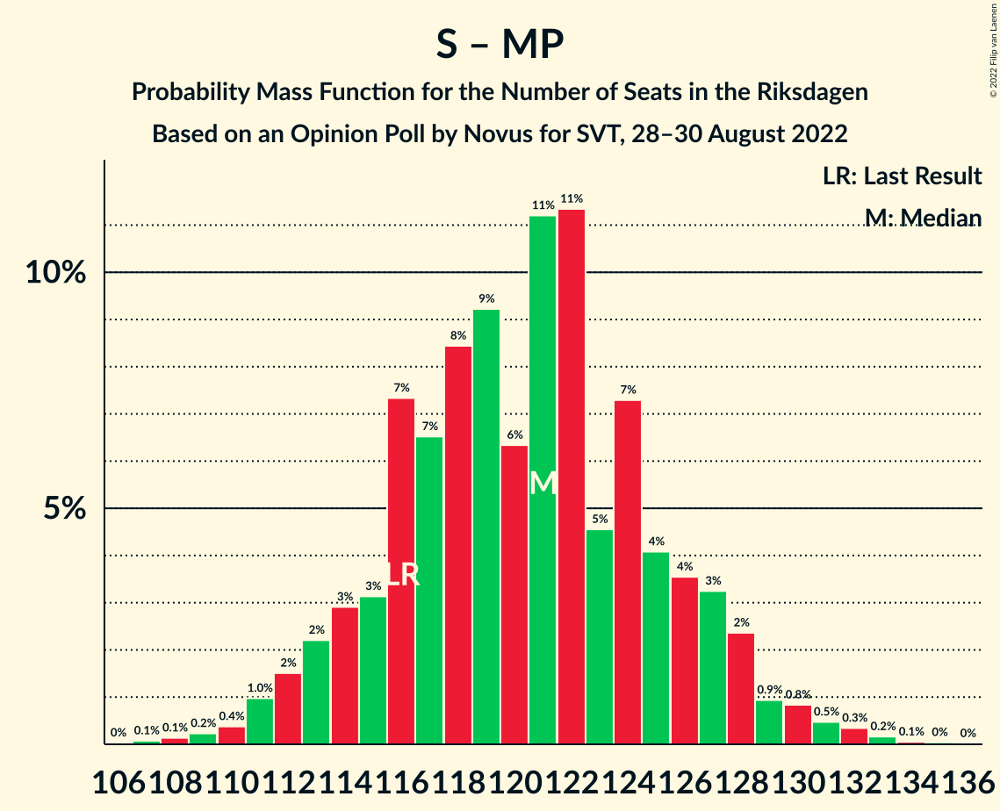

| Number of Seats | Probability | Accumulated | Special Marks |
|:---------------:|:-----------:|:-----------:|:-------------:|
| 106 | 0% | 100% |  |
| 107 | 0.1% | 99.9% |  |
| 108 | 0.1% | 99.9% |  |
| 109 | 0.2% | 99.7% |  |
| 110 | 0.4% | 99.5% |  |
| 111 | 1.0% | 99.1% |  |
| 112 | 2% | 98% |  |
| 113 | 2% | 97% |  |
| 114 | 3% | 94% |  |
| 115 | 3% | 92% |  |
| 116 | 7% | 88% | Last Result |
| 117 | 7% | 81% |  |
| 118 | 8% | 75% |  |
| 119 | 9% | 66% |  |
| 120 | 6% | 57% |  |
| 121 | 11% | 51% | Median |
| 122 | 11% | 39% |  |
| 123 | 5% | 28% |  |
| 124 | 7% | 23% |  |
| 125 | 4% | 16% |  |
| 126 | 4% | 12% |  |
| 127 | 3% | 8% |  |
| 128 | 2% | 5% |  |
| 129 | 0.9% | 3% |  |
| 130 | 0.8% | 2% |  |
| 131 | 0.5% | 1.1% |  |
| 132 | 0.3% | 0.6% |  |
| 133 | 0.2% | 0.3% |  |
| 134 | 0.1% | 0.1% |  |
| 135 | 0% | 0.1% |  |
| 136 | 0% | 0% |  |

### Moderata samlingspartiet – Centerpartiet – Kristdemokraterna

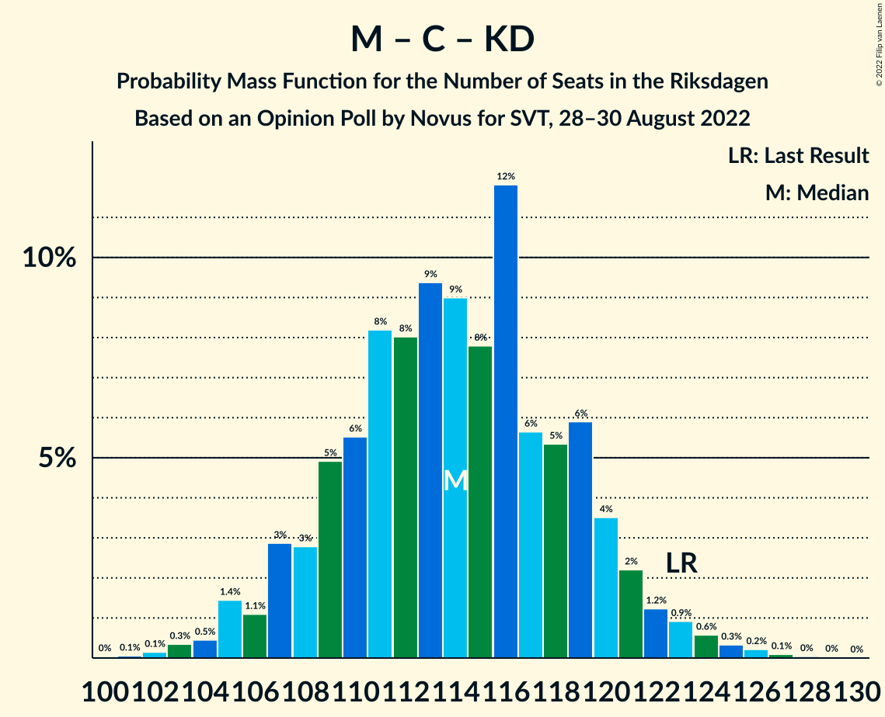

| Number of Seats | Probability | Accumulated | Special Marks |
|:---------------:|:-----------:|:-----------:|:-------------:|
| 100 | 0% | 100% |  |
| 101 | 0.1% | 99.9% |  |
| 102 | 0.1% | 99.9% |  |
| 103 | 0.3% | 99.7% |  |
| 104 | 0.5% | 99.4% |  |
| 105 | 1.4% | 98.9% |  |
| 106 | 1.1% | 97% |  |
| 107 | 3% | 96% |  |
| 108 | 3% | 94% |  |
| 109 | 5% | 91% |  |
| 110 | 6% | 86% |  |
| 111 | 8% | 80% |  |
| 112 | 8% | 72% |  |
| 113 | 9% | 64% |  |
| 114 | 9% | 55% | Median |
| 115 | 8% | 46% |  |
| 116 | 12% | 38% |  |
| 117 | 6% | 26% |  |
| 118 | 5% | 20% |  |
| 119 | 6% | 15% |  |
| 120 | 4% | 9% |  |
| 121 | 2% | 6% |  |
| 122 | 1.2% | 3% |  |
| 123 | 0.9% | 2% | Last Result |
| 124 | 0.6% | 1.3% |  |
| 125 | 0.3% | 0.7% |  |
| 126 | 0.2% | 0.4% |  |
| 127 | 0.1% | 0.2% |  |
| 128 | 0% | 0.1% |  |
| 129 | 0% | 0% |  |

### Moderata samlingspartiet – Centerpartiet – Liberalerna

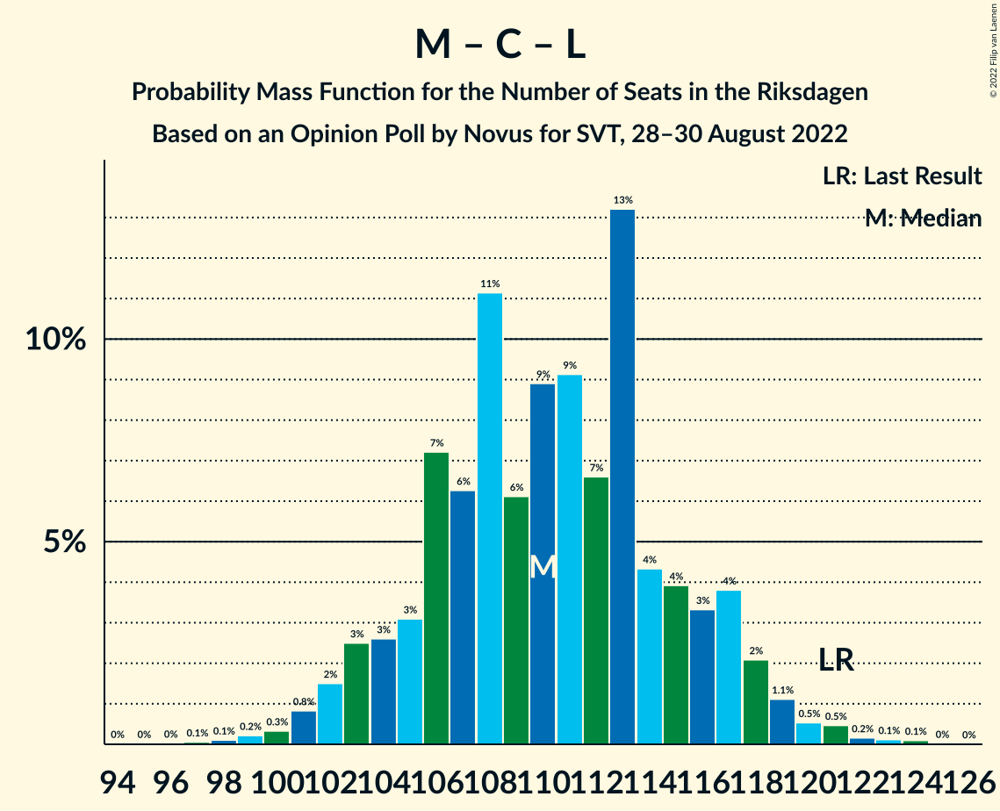

| Number of Seats | Probability | Accumulated | Special Marks |
|:---------------:|:-----------:|:-----------:|:-------------:|
| 95 | 0% | 100% |  |
| 96 | 0% | 99.9% |  |
| 97 | 0.1% | 99.9% |  |
| 98 | 0.1% | 99.8% |  |
| 99 | 0.2% | 99.7% |  |
| 100 | 0.3% | 99.5% |  |
| 101 | 0.8% | 99.2% |  |
| 102 | 2% | 98% |  |
| 103 | 3% | 97% |  |
| 104 | 3% | 94% |  |
| 105 | 3% | 92% |  |
| 106 | 7% | 89% |  |
| 107 | 6% | 81% |  |
| 108 | 11% | 75% |  |
| 109 | 6% | 64% |  |
| 110 | 9% | 58% |  |
| 111 | 9% | 49% | Median |
| 112 | 7% | 40% |  |
| 113 | 13% | 33% |  |
| 114 | 4% | 20% |  |
| 115 | 4% | 16% |  |
| 116 | 3% | 12% |  |
| 117 | 4% | 8% |  |
| 118 | 2% | 5% |  |
| 119 | 1.1% | 3% |  |
| 120 | 0.5% | 1.4% |  |
| 121 | 0.5% | 0.9% | Last Result |
| 122 | 0.2% | 0.4% |  |
| 123 | 0.1% | 0.3% |  |
| 124 | 0.1% | 0.1% |  |
| 125 | 0% | 0% |  |

### Moderata samlingspartiet – Kristdemokraterna – Liberalerna

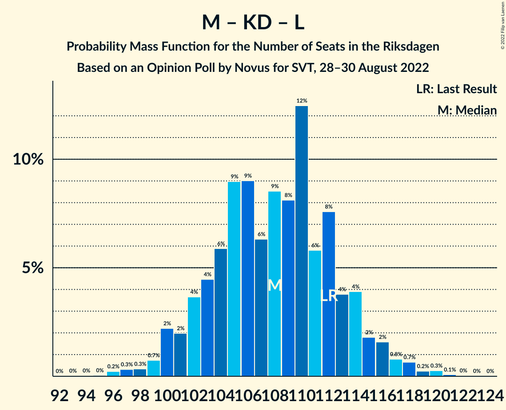

| Number of Seats | Probability | Accumulated | Special Marks |
|:---------------:|:-----------:|:-----------:|:-------------:|
| 92 | 0% | 100% |  |
| 93 | 0% | 99.9% |  |
| 94 | 0% | 99.9% |  |
| 95 | 0% | 99.9% |  |
| 96 | 0.2% | 99.8% |  |
| 97 | 0.3% | 99.6% |  |
| 98 | 0.3% | 99.3% |  |
| 99 | 0.7% | 98.9% |  |
| 100 | 2% | 98% |  |
| 101 | 2% | 96% |  |
| 102 | 4% | 94% |  |
| 103 | 4% | 90% |  |
| 104 | 6% | 86% |  |
| 105 | 9% | 80% |  |
| 106 | 9% | 71% |  |
| 107 | 6% | 62% |  |
| 108 | 9% | 56% | Median |
| 109 | 8% | 47% |  |
| 110 | 12% | 39% |  |
| 111 | 6% | 27% |  |
| 112 | 8% | 21% | Last Result |
| 113 | 4% | 13% |  |
| 114 | 4% | 9% |  |
| 115 | 2% | 5% |  |
| 116 | 2% | 4% |  |
| 117 | 0.8% | 2% |  |
| 118 | 0.7% | 1.3% |  |
| 119 | 0.2% | 0.7% |  |
| 120 | 0.3% | 0.4% |  |
| 121 | 0.1% | 0.2% |  |
| 122 | 0% | 0.1% |  |
| 123 | 0% | 0% |  |

### Sveriges socialdemokratiska arbetareparti

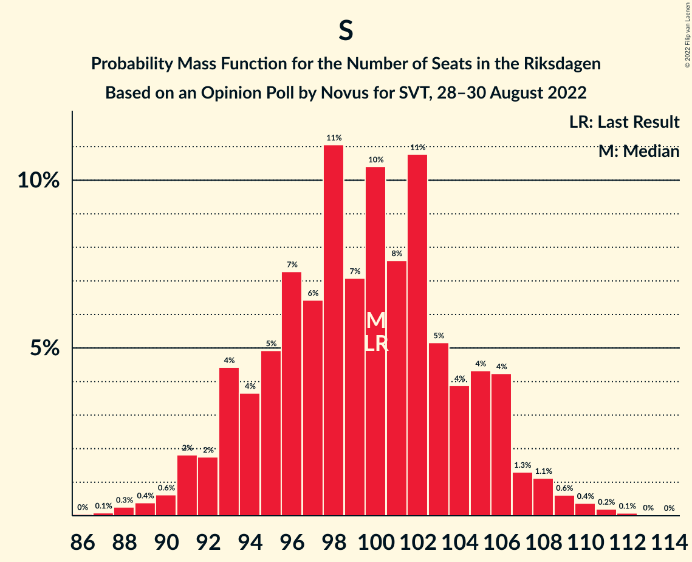

| Number of Seats | Probability | Accumulated | Special Marks |
|:---------------:|:-----------:|:-----------:|:-------------:|
| 86 | 0% | 100% |  |
| 87 | 0.1% | 99.9% |  |
| 88 | 0.3% | 99.8% |  |
| 89 | 0.4% | 99.6% |  |
| 90 | 0.6% | 99.2% |  |
| 91 | 2% | 98.6% |  |
| 92 | 2% | 97% |  |
| 93 | 4% | 95% |  |
| 94 | 4% | 91% |  |
| 95 | 5% | 87% |  |
| 96 | 7% | 82% |  |
| 97 | 6% | 75% |  |
| 98 | 11% | 68% |  |
| 99 | 7% | 57% |  |
| 100 | 10% | 50% | Last Result, Median |
| 101 | 8% | 40% |  |
| 102 | 11% | 32% |  |
| 103 | 5% | 21% |  |
| 104 | 4% | 16% |  |
| 105 | 4% | 12% |  |
| 106 | 4% | 8% |  |
| 107 | 1.3% | 4% |  |
| 108 | 1.1% | 2% |  |
| 109 | 0.6% | 1.3% |  |
| 110 | 0.4% | 0.7% |  |
| 111 | 0.2% | 0.3% |  |
| 112 | 0.1% | 0.1% |  |
| 113 | 0% | 0.1% |  |
| 114 | 0% | 0% |  |

### Moderata samlingspartiet – Centerpartiet

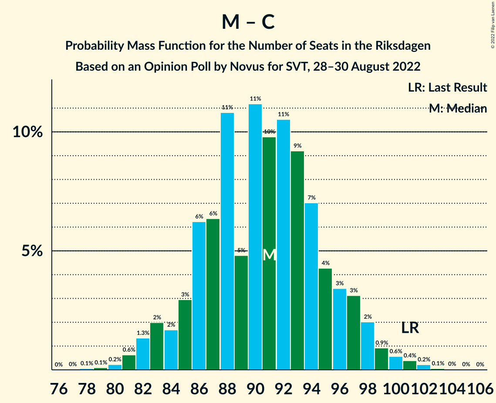

| Number of Seats | Probability | Accumulated | Special Marks |
|:---------------:|:-----------:|:-----------:|:-------------:|
| 78 | 0.1% | 100% |  |
| 79 | 0.1% | 99.9% |  |
| 80 | 0.2% | 99.8% |  |
| 81 | 0.6% | 99.6% |  |
| 82 | 1.3% | 99.0% |  |
| 83 | 2% | 98% |  |
| 84 | 2% | 96% |  |
| 85 | 3% | 94% |  |
| 86 | 6% | 91% |  |
| 87 | 6% | 85% |  |
| 88 | 11% | 78% |  |
| 89 | 5% | 68% |  |
| 90 | 11% | 63% |  |
| 91 | 10% | 52% | Median |
| 92 | 11% | 42% |  |
| 93 | 9% | 31% |  |
| 94 | 7% | 22% |  |
| 95 | 4% | 15% |  |
| 96 | 3% | 11% |  |
| 97 | 3% | 7% |  |
| 98 | 2% | 4% |  |
| 99 | 0.9% | 2% |  |
| 100 | 0.6% | 1.3% |  |
| 101 | 0.4% | 0.7% | Last Result |
| 102 | 0.2% | 0.4% |  |
| 103 | 0.1% | 0.1% |  |
| 104 | 0% | 0.1% |  |
| 105 | 0% | 0% |  |

### Moderata samlingspartiet – Kristdemokraterna

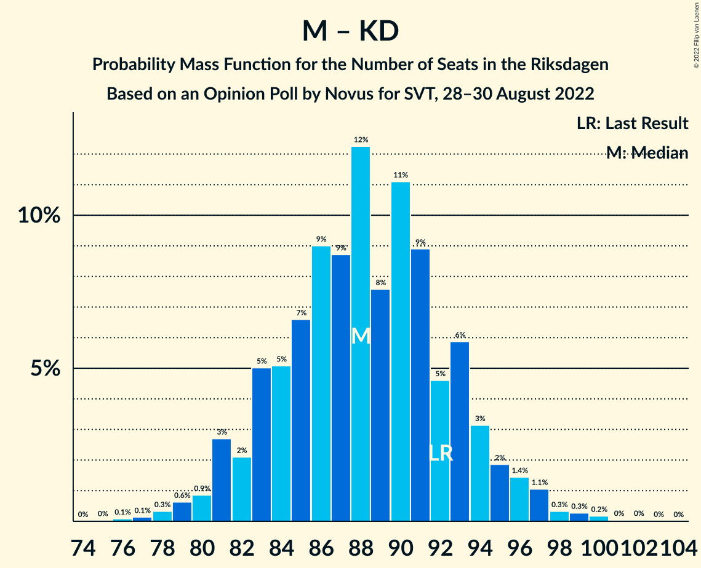

| Number of Seats | Probability | Accumulated | Special Marks |
|:---------------:|:-----------:|:-----------:|:-------------:|
| 76 | 0.1% | 100% |  |
| 77 | 0.1% | 99.9% |  |
| 78 | 0.3% | 99.7% |  |
| 79 | 0.6% | 99.4% |  |
| 80 | 0.9% | 98.8% |  |
| 81 | 3% | 98% |  |
| 82 | 2% | 95% |  |
| 83 | 5% | 93% |  |
| 84 | 5% | 88% |  |
| 85 | 7% | 83% |  |
| 86 | 9% | 76% |  |
| 87 | 9% | 67% |  |
| 88 | 12% | 59% | Median |
| 89 | 8% | 46% |  |
| 90 | 11% | 39% |  |
| 91 | 9% | 28% |  |
| 92 | 5% | 19% | Last Result |
| 93 | 6% | 14% |  |
| 94 | 3% | 8% |  |
| 95 | 2% | 5% |  |
| 96 | 1.4% | 3% |  |
| 97 | 1.1% | 2% |  |
| 98 | 0.3% | 0.9% |  |
| 99 | 0.3% | 0.5% |  |
| 100 | 0.2% | 0.3% |  |
| 101 | 0% | 0.1% |  |
| 102 | 0% | 0.1% |  |
| 103 | 0% | 0% |  |

## Technical Information

### Opinion Poll

+ **Polling firm:** Novus
+ **Commissioner(s):** SVT
+ **Fieldwork period:** 28–30 August 2022

### Calculations

+ **Sample size:** 1500
+ **Simulations done:** 1,048,576
+ **Error estimate:** 1.14%

