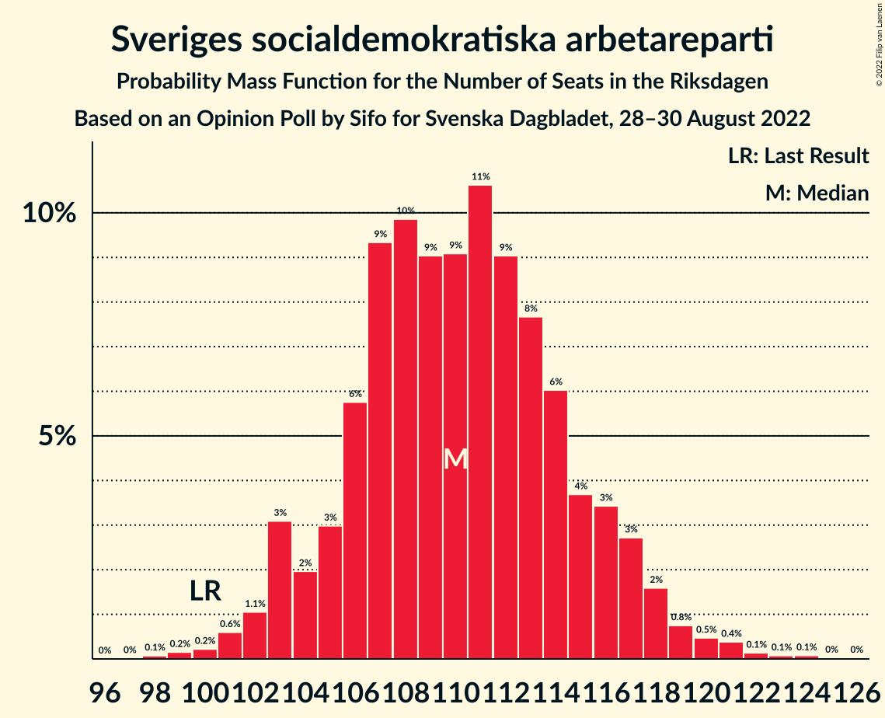

# Opinion Poll by Sifo for Svenska Dagbladet, 28–30 August 2022

<a href="#voting-intentions">Voting Intentions</a> | <a href="#seats">Seats</a> | <a href="#coalitions">Coalitions</a> | <a href="#technical-information">Technical Information</a>

## Voting Intentions

### Confidence Intervals

| Party | Last Result | Poll Result | 80% Confidence Interval | 90% Confidence Interval | 95% Confidence Interval | 99% Confidence Interval |
|:-----:|:-----------:|:-----------:|:-----------------------:|:-----------------------:|:-----------------------:|:-----------------------:|
| Sveriges socialdemokratiska arbetareparti | 28.3% | 31.1% | 29.8–32.4% |29.4–32.8% |29.1–33.1% |28.5–33.8% |
| Sverigedemokraterna | 17.5% | 19.7% | 18.6–20.9% |18.3–21.2% |18.0–21.5% |17.5–22.1% |
| Moderata samlingspartiet | 19.8% | 15.9% | 14.9–17.0% |14.6–17.3% |14.3–17.6% |13.9–18.1% |
| Vänsterpartiet | 8.0% | 8.2% | 7.5–9.0% |7.2–9.3% |7.1–9.5% |6.7–9.9% |
| Liberalerna | 5.5% | 6.8% | 6.1–7.6% |5.9–7.8% |5.8–8.0% |5.5–8.4% |
| Centerpartiet | 8.6% | 6.4% | 5.7–7.1% |5.5–7.4% |5.4–7.6% |5.1–7.9% |
| Kristdemokraterna | 6.3% | 5.7% | 5.1–6.4% |4.9–6.6% |4.8–6.8% |4.5–7.2% |
| Miljöpartiet de gröna | 4.4% | 4.7% | 4.1–5.4% |4.0–5.5% |3.8–5.7% |3.6–6.1% |

*Note:* The poll result column reflects the actual value used in the calculations. Published results may vary slightly, and in addition be rounded to fewer digits.

## Seats

### Confidence Intervals

| Party | Last Result | Median | 80% Confidence Interval | 90% Confidence Interval | 95% Confidence Interval | 99% Confidence Interval |
|:-----:|:-----------:|:------:|:-----------------------:|:-----------------------:|:-----------------------:|:-----------------------:|
| <a href="#sveriges-socialdemokratiska-arbetareparti">Sveriges socialdemokratiska arbetareparti</a> | 100 | 110 | 106–115 |103–117 |103–118 |101–121 |
| <a href="#sverigedemokraterna">Sverigedemokraterna</a> | 62 | 70 | 66–74 |65–76 |64–76 |62–78 |
| <a href="#moderata-samlingspartiet">Moderata samlingspartiet</a> | 70 | 54 | 53–61 |52–61 |51–62 |50–65 |
| <a href="#vänsterpartiet">Vänsterpartiet</a> | 28 | 29 | 26–32 |26–33 |25–34 |24–35 |
| <a href="#liberalerna">Liberalerna</a> | 20 | 24 | 22–27 |21–27 |20–29 |19–30 |
| <a href="#centerpartiet">Centerpartiet</a> | 31 | 23 | 20–25 |20–26 |19–27 |18–28 |
| <a href="#kristdemokraterna">Kristdemokraterna</a> | 22 | 20 | 18–23 |17–24 |17–24 |16–26 |
| <a href="#miljöpartiet-de-gröna">Miljöpartiet de gröna</a> | 16 | 17 | 15–19 |14–19 |0–20 |0–21 |

### Sveriges socialdemokratiska arbetareparti

*For a full overview of the results for this party, see the [Sveriges socialdemokratiska arbetareparti](party-sverigessocialdemokratiskaarbetareparti.html) page.*

| Number of Seats | Probability | Accumulated | Special Marks |
|:---------------:|:-----------:|:-----------:|:-------------:|
| 98 | 0.1% | 100% |  |
| 99 | 0.2% | 99.9% |  |
| 100 | 0.1% | 99.8% | Last Result |
| 101 | 0.5% | 99.6% |  |
| 102 | 0.6% | 99.1% |  |
| 103 | 4% | 98.5% |  |
| 104 | 2% | 94% |  |
| 105 | 2% | 93% |  |
| 106 | 6% | 91% |  |
| 107 | 7% | 85% |  |
| 108 | 10% | 78% |  |
| 109 | 10% | 68% |  |
| 110 | 11% | 57% | Median |
| 111 | 8% | 47% |  |
| 112 | 9% | 39% |  |
| 113 | 9% | 29% |  |
| 114 | 8% | 20% |  |
| 115 | 3% | 12% |  |
| 116 | 3% | 10% |  |
| 117 | 3% | 7% |  |
| 118 | 2% | 4% |  |
| 119 | 0.6% | 2% |  |
| 120 | 0.3% | 1.0% |  |
| 121 | 0.3% | 0.7% |  |
| 122 | 0.2% | 0.4% |  |
| 123 | 0.1% | 0.3% |  |
| 124 | 0.1% | 0.2% |  |
| 125 | 0% | 0.1% |  |
| 126 | 0% | 0% |  |

### Sverigedemokraterna

*For a full overview of the results for this party, see the [Sverigedemokraterna](party-sverigedemokraterna.html) page.*

| Number of Seats | Probability | Accumulated | Special Marks |
|:---------------:|:-----------:|:-----------:|:-------------:|
| 60 | 0.1% | 100% |  |
| 61 | 0.1% | 99.9% |  |
| 62 | 0.4% | 99.7% | Last Result |
| 63 | 0.7% | 99.3% |  |
| 64 | 2% | 98.6% |  |
| 65 | 4% | 97% |  |
| 66 | 6% | 92% |  |
| 67 | 6% | 86% |  |
| 68 | 19% | 80% |  |
| 69 | 10% | 61% |  |
| 70 | 15% | 51% | Median |
| 71 | 7% | 36% |  |
| 72 | 11% | 29% |  |
| 73 | 7% | 18% |  |
| 74 | 4% | 11% |  |
| 75 | 1.3% | 7% |  |
| 76 | 3% | 5% |  |
| 77 | 0.9% | 2% |  |
| 78 | 0.7% | 1.1% |  |
| 79 | 0.1% | 0.4% |  |
| 80 | 0.2% | 0.3% |  |
| 81 | 0.1% | 0.1% |  |
| 82 | 0% | 0.1% |  |
| 83 | 0% | 0% |  |

### Moderata samlingspartiet

*For a full overview of the results for this party, see the [Moderata samlingspartiet](party-moderatasamlingspartiet.html) page.*

| Number of Seats | Probability | Accumulated | Special Marks |
|:---------------:|:-----------:|:-----------:|:-------------:|
| 47 | 0% | 100% |  |
| 48 | 0% | 99.9% |  |
| 49 | 0.3% | 99.9% |  |
| 50 | 1.4% | 99.7% |  |
| 51 | 2% | 98% |  |
| 52 | 2% | 96% |  |
| 53 | 19% | 94% |  |
| 54 | 26% | 75% | Median |
| 55 | 5% | 49% |  |
| 56 | 3% | 44% |  |
| 57 | 9% | 41% |  |
| 58 | 7% | 32% |  |
| 59 | 3% | 25% |  |
| 60 | 11% | 22% |  |
| 61 | 8% | 11% |  |
| 62 | 1.4% | 4% |  |
| 63 | 0.8% | 2% |  |
| 64 | 0.9% | 1.5% |  |
| 65 | 0.5% | 0.6% |  |
| 66 | 0.1% | 0.1% |  |
| 67 | 0% | 0.1% |  |
| 68 | 0% | 0% |  |
| 69 | 0% | 0% |  |
| 70 | 0% | 0% | Last Result |

### Vänsterpartiet

*For a full overview of the results for this party, see the [Vänsterpartiet](party-vänsterpartiet.html) page.*

| Number of Seats | Probability | Accumulated | Special Marks |
|:---------------:|:-----------:|:-----------:|:-------------:|
| 23 | 0.2% | 100% |  |
| 24 | 0.7% | 99.7% |  |
| 25 | 3% | 99.0% |  |
| 26 | 7% | 96% |  |
| 27 | 12% | 89% |  |
| 28 | 15% | 77% | Last Result |
| 29 | 17% | 62% | Median |
| 30 | 16% | 45% |  |
| 31 | 8% | 30% |  |
| 32 | 16% | 22% |  |
| 33 | 2% | 6% |  |
| 34 | 2% | 4% |  |
| 35 | 0.9% | 1.4% |  |
| 36 | 0.3% | 0.5% |  |
| 37 | 0.1% | 0.1% |  |
| 38 | 0% | 0% |  |

### Liberalerna

*For a full overview of the results for this party, see the [Liberalerna](party-liberalerna.html) page.*

| Number of Seats | Probability | Accumulated | Special Marks |
|:---------------:|:-----------:|:-----------:|:-------------:|
| 18 | 0.1% | 100% |  |
| 19 | 0.4% | 99.9% |  |
| 20 | 3% | 99.5% | Last Result |
| 21 | 5% | 96% |  |
| 22 | 12% | 92% |  |
| 23 | 22% | 80% |  |
| 24 | 19% | 58% | Median |
| 25 | 11% | 39% |  |
| 26 | 17% | 28% |  |
| 27 | 7% | 11% |  |
| 28 | 2% | 4% |  |
| 29 | 2% | 3% |  |
| 30 | 0.4% | 0.6% |  |
| 31 | 0.1% | 0.1% |  |
| 32 | 0% | 0.1% |  |
| 33 | 0% | 0% |  |

### Centerpartiet

*For a full overview of the results for this party, see the [Centerpartiet](party-centerpartiet.html) page.*

| Number of Seats | Probability | Accumulated | Special Marks |
|:---------------:|:-----------:|:-----------:|:-------------:|
| 17 | 0.2% | 100% |  |
| 18 | 1.0% | 99.8% |  |
| 19 | 3% | 98.8% |  |
| 20 | 9% | 96% |  |
| 21 | 11% | 86% |  |
| 22 | 18% | 75% |  |
| 23 | 19% | 57% | Median |
| 24 | 17% | 38% |  |
| 25 | 12% | 21% |  |
| 26 | 4% | 8% |  |
| 27 | 3% | 4% |  |
| 28 | 0.5% | 0.8% |  |
| 29 | 0.2% | 0.3% |  |
| 30 | 0% | 0.1% |  |
| 31 | 0% | 0% | Last Result |

### Kristdemokraterna

*For a full overview of the results for this party, see the [Kristdemokraterna](party-kristdemokraterna.html) page.*

| Number of Seats | Probability | Accumulated | Special Marks |
|:---------------:|:-----------:|:-----------:|:-------------:|
| 15 | 0.2% | 100% |  |
| 16 | 1.1% | 99.8% |  |
| 17 | 5% | 98.7% |  |
| 18 | 9% | 93% |  |
| 19 | 15% | 84% |  |
| 20 | 22% | 68% | Median |
| 21 | 23% | 46% |  |
| 22 | 11% | 23% | Last Result |
| 23 | 6% | 12% |  |
| 24 | 4% | 6% |  |
| 25 | 1.3% | 2% |  |
| 26 | 0.4% | 0.5% |  |
| 27 | 0.1% | 0.1% |  |
| 28 | 0% | 0% |  |

### Miljöpartiet de gröna

*For a full overview of the results for this party, see the [Miljöpartiet de gröna](party-miljöpartietdegröna.html) page.*

| Number of Seats | Probability | Accumulated | Special Marks |
|:---------------:|:-----------:|:-----------:|:-------------:|
| 0 | 4% | 100% |  |
| 1 | 0% | 96% |  |
| 2 | 0% | 96% |  |
| 3 | 0% | 96% |  |
| 4 | 0% | 96% |  |
| 5 | 0% | 96% |  |
| 6 | 0% | 96% |  |
| 7 | 0% | 96% |  |
| 8 | 0% | 96% |  |
| 9 | 0% | 96% |  |
| 10 | 0% | 96% |  |
| 11 | 0% | 96% |  |
| 12 | 0% | 96% |  |
| 13 | 0% | 96% |  |
| 14 | 2% | 96% |  |
| 15 | 13% | 94% |  |
| 16 | 28% | 82% | Last Result |
| 17 | 20% | 54% | Median |
| 18 | 15% | 34% |  |
| 19 | 15% | 19% |  |
| 20 | 3% | 4% |  |
| 21 | 1.1% | 2% |  |
| 22 | 0.3% | 0.4% |  |
| 23 | 0.1% | 0.1% |  |
| 24 | 0% | 0% |  |

## Coalitions

### Confidence Intervals

| Coalition | Last Result | Median | Majority? | 80% Confidence Interval | 90% Confidence Interval | 95% Confidence Interval | 99% Confidence Interval |
|:---------:|:-----------:|:------:|:---------:|:-----------------------:|:-----------------------:|:-----------------------:|:-----------------------:|
| Sveriges socialdemokratiska arbetareparti – Vänsterpartiet – Liberalerna – Centerpartiet – Miljöpartiet de gröna | 195 | 204 | 100% | 196–209 | 195–210 | 193–211 | 190–213 |
| Sveriges socialdemokratiska arbetareparti – Moderata samlingspartiet – Centerpartiet | 201 | 189 | 100% | 185–193 | 184–195 | 182–198 | 179–204 |
| Sveriges socialdemokratiska arbetareparti – Vänsterpartiet – Centerpartiet – Miljöpartiet de gröna | 175 | 180 | 74% | 172–185 | 171–186 | 169–186 | 163–188 |
| Sveriges socialdemokratiska arbetareparti – Liberalerna – Centerpartiet – Miljöpartiet de gröna | 167 | 174 | 42% | 168–180 | 166–181 | 164–182 | 158–185 |
| Sverigedemokraterna – Moderata samlingspartiet – Liberalerna – Kristdemokraterna | 174 | 169 | 26% | 164–177 | 163–178 | 163–180 | 161–186 |
| Sveriges socialdemokratiska arbetareparti – Moderata samlingspartiet | 170 | 166 | 3% | 162–171 | 160–173 | 159–175 | 157–180 |
| Sveriges socialdemokratiska arbetareparti – Vänsterpartiet – Miljöpartiet de gröna | 144 | 157 | 0% | 150–162 | 148–163 | 146–164 | 141–166 |
| Sveriges socialdemokratiska arbetareparti – Centerpartiet – Miljöpartiet de gröna | 147 | 150 | 0% | 143–155 | 142–157 | 139–157 | 133–160 |
| Sverigedemokraterna – Moderata samlingspartiet – Kristdemokraterna | 154 | 145 | 0% | 140–153 | 139–154 | 138–156 | 136–159 |
| Sveriges socialdemokratiska arbetareparti – Vänsterpartiet | 128 | 140 | 0% | 134–145 | 132–146 | 131–148 | 129–151 |
| Sverigedemokraterna – Moderata samlingspartiet | 132 | 125 | 0% | 120–132 | 119–134 | 118–135 | 117–138 |
| Sveriges socialdemokratiska arbetareparti – Miljöpartiet de gröna | 116 | 127 | 0% | 122–132 | 119–134 | 116–135 | 110–137 |
| Moderata samlingspartiet – Liberalerna – Centerpartiet – Kristdemokraterna | 143 | 123 | 0% | 119–128 | 118–130 | 116–132 | 114–136 |
| Moderata samlingspartiet – Liberalerna – Centerpartiet | 121 | 102 | 0% | 99–108 | 97–110 | 96–111 | 94–114 |
| Moderata samlingspartiet – Liberalerna – Kristdemokraterna | 112 | 100 | 0% | 96–106 | 95–108 | 93–109 | 92–111 |
| Moderata samlingspartiet – Centerpartiet – Kristdemokraterna | 123 | 99 | 0% | 95–103 | 95–105 | 93–107 | 91–110 |
| Moderata samlingspartiet – Centerpartiet | 101 | 78 | 0% | 75–83 | 75–85 | 73–86 | 71–89 |
| Moderata samlingspartiet – Kristdemokraterna | 92 | 76 | 0% | 72–81 | 71–82 | 71–84 | 68–86 |

### Sveriges socialdemokratiska arbetareparti – Vänsterpartiet – Liberalerna – Centerpartiet – Miljöpartiet de gröna

| Number of Seats | Probability | Accumulated | Special Marks |
|:---------------:|:-----------:|:-----------:|:-------------:|
| 186 | 0.1% | 100% |  |
| 187 | 0% | 99.9% |  |
| 188 | 0.2% | 99.9% |  |
| 189 | 0.1% | 99.7% |  |
| 190 | 0.2% | 99.6% |  |
| 191 | 0.2% | 99.3% |  |
| 192 | 0.7% | 99.1% |  |
| 193 | 1.0% | 98% |  |
| 194 | 2% | 97% |  |
| 195 | 1.0% | 95% | Last Result |
| 196 | 5% | 94% |  |
| 197 | 4% | 90% |  |
| 198 | 6% | 86% |  |
| 199 | 7% | 80% |  |
| 200 | 7% | 74% |  |
| 201 | 5% | 67% |  |
| 202 | 5% | 62% |  |
| 203 | 6% | 57% | Median |
| 204 | 7% | 52% |  |
| 205 | 10% | 45% |  |
| 206 | 10% | 35% |  |
| 207 | 8% | 25% |  |
| 208 | 6% | 17% |  |
| 209 | 5% | 12% |  |
| 210 | 2% | 6% |  |
| 211 | 3% | 4% |  |
| 212 | 0.6% | 1.2% |  |
| 213 | 0.4% | 0.6% |  |
| 214 | 0.1% | 0.2% |  |
| 215 | 0.1% | 0.1% |  |
| 216 | 0% | 0% |  |

### Sveriges socialdemokratiska arbetareparti – Moderata samlingspartiet – Centerpartiet

| Number of Seats | Probability | Accumulated | Special Marks |
|:---------------:|:-----------:|:-----------:|:-------------:|
| 176 | 0.1% | 100% |  |
| 177 | 0.1% | 99.9% |  |
| 178 | 0.1% | 99.8% |  |
| 179 | 0.3% | 99.7% |  |
| 180 | 0.3% | 99.4% |  |
| 181 | 0.7% | 99.1% |  |
| 182 | 1.3% | 98% |  |
| 183 | 2% | 97% |  |
| 184 | 4% | 96% |  |
| 185 | 5% | 92% |  |
| 186 | 10% | 87% |  |
| 187 | 9% | 76% | Median |
| 188 | 9% | 68% |  |
| 189 | 18% | 58% |  |
| 190 | 10% | 40% |  |
| 191 | 7% | 30% |  |
| 192 | 9% | 23% |  |
| 193 | 4% | 14% |  |
| 194 | 3% | 10% |  |
| 195 | 2% | 7% |  |
| 196 | 1.5% | 5% |  |
| 197 | 0.9% | 4% |  |
| 198 | 0.5% | 3% |  |
| 199 | 0.6% | 2% |  |
| 200 | 0.3% | 2% |  |
| 201 | 0.3% | 1.2% | Last Result |
| 202 | 0.1% | 0.9% |  |
| 203 | 0.3% | 0.8% |  |
| 204 | 0.1% | 0.5% |  |
| 205 | 0% | 0.4% |  |
| 206 | 0.1% | 0.4% |  |
| 207 | 0.2% | 0.3% |  |
| 208 | 0% | 0.1% |  |
| 209 | 0% | 0.1% |  |
| 210 | 0% | 0% |  |

### Sveriges socialdemokratiska arbetareparti – Vänsterpartiet – Centerpartiet – Miljöpartiet de gröna

| Number of Seats | Probability | Accumulated | Special Marks |
|:---------------:|:-----------:|:-----------:|:-------------:|
| 161 | 0.1% | 100% |  |
| 162 | 0.1% | 99.9% |  |
| 163 | 0.4% | 99.8% |  |
| 164 | 0% | 99.4% |  |
| 165 | 0.2% | 99.3% |  |
| 166 | 0.4% | 99.1% |  |
| 167 | 0.3% | 98.7% |  |
| 168 | 0.4% | 98% |  |
| 169 | 0.7% | 98% |  |
| 170 | 1.4% | 97% |  |
| 171 | 3% | 96% |  |
| 172 | 3% | 93% |  |
| 173 | 7% | 90% |  |
| 174 | 9% | 83% |  |
| 175 | 4% | 74% | Last Result, Majority |
| 176 | 5% | 69% |  |
| 177 | 3% | 64% |  |
| 178 | 4% | 61% |  |
| 179 | 4% | 57% | Median |
| 180 | 5% | 53% |  |
| 181 | 9% | 48% |  |
| 182 | 8% | 39% |  |
| 183 | 12% | 31% |  |
| 184 | 7% | 19% |  |
| 185 | 6% | 12% |  |
| 186 | 5% | 6% |  |
| 187 | 0.9% | 2% |  |
| 188 | 0.5% | 0.8% |  |
| 189 | 0.2% | 0.3% |  |
| 190 | 0% | 0.1% |  |
| 191 | 0% | 0% |  |

### Sveriges socialdemokratiska arbetareparti – Liberalerna – Centerpartiet – Miljöpartiet de gröna

| Number of Seats | Probability | Accumulated | Special Marks |
|:---------------:|:-----------:|:-----------:|:-------------:|
| 154 | 0% | 100% |  |
| 155 | 0% | 99.9% |  |
| 156 | 0.2% | 99.9% |  |
| 157 | 0.1% | 99.7% |  |
| 158 | 0.2% | 99.6% |  |
| 159 | 0% | 99.5% |  |
| 160 | 0.4% | 99.4% |  |
| 161 | 0.1% | 99.0% |  |
| 162 | 0.6% | 98.9% |  |
| 163 | 0.5% | 98% |  |
| 164 | 0.6% | 98% |  |
| 165 | 1.3% | 97% |  |
| 166 | 2% | 96% |  |
| 167 | 2% | 94% | Last Result |
| 168 | 4% | 91% |  |
| 169 | 5% | 87% |  |
| 170 | 7% | 82% |  |
| 171 | 4% | 75% |  |
| 172 | 9% | 71% |  |
| 173 | 9% | 62% |  |
| 174 | 11% | 53% | Median |
| 175 | 7% | 42% | Majority |
| 176 | 6% | 36% |  |
| 177 | 9% | 29% |  |
| 178 | 5% | 20% |  |
| 179 | 4% | 14% |  |
| 180 | 5% | 11% |  |
| 181 | 3% | 6% |  |
| 182 | 2% | 3% |  |
| 183 | 0.5% | 1.3% |  |
| 184 | 0.3% | 0.9% |  |
| 185 | 0.3% | 0.6% |  |
| 186 | 0.1% | 0.2% |  |
| 187 | 0% | 0.1% |  |
| 188 | 0% | 0% |  |

### Sverigedemokraterna – Moderata samlingspartiet – Liberalerna – Kristdemokraterna

| Number of Seats | Probability | Accumulated | Special Marks |
|:---------------:|:-----------:|:-----------:|:-------------:|
| 159 | 0% | 100% |  |
| 160 | 0.2% | 99.9% |  |
| 161 | 0.5% | 99.7% |  |
| 162 | 0.9% | 99.2% |  |
| 163 | 5% | 98% |  |
| 164 | 6% | 94% |  |
| 165 | 7% | 88% |  |
| 166 | 12% | 81% |  |
| 167 | 8% | 69% |  |
| 168 | 9% | 61% | Median |
| 169 | 5% | 52% |  |
| 170 | 4% | 47% |  |
| 171 | 4% | 43% |  |
| 172 | 3% | 39% |  |
| 173 | 5% | 36% |  |
| 174 | 4% | 31% | Last Result |
| 175 | 9% | 26% | Majority |
| 176 | 7% | 17% |  |
| 177 | 3% | 10% |  |
| 178 | 3% | 7% |  |
| 179 | 1.4% | 4% |  |
| 180 | 0.7% | 3% |  |
| 181 | 0.4% | 2% |  |
| 182 | 0.3% | 2% |  |
| 183 | 0.4% | 1.3% |  |
| 184 | 0.2% | 0.9% |  |
| 185 | 0% | 0.7% |  |
| 186 | 0.4% | 0.6% |  |
| 187 | 0.1% | 0.2% |  |
| 188 | 0.1% | 0.1% |  |
| 189 | 0% | 0% |  |

### Sveriges socialdemokratiska arbetareparti – Moderata samlingspartiet

| Number of Seats | Probability | Accumulated | Special Marks |
|:---------------:|:-----------:|:-----------:|:-------------:|
| 153 | 0% | 100% |  |
| 154 | 0.1% | 99.9% |  |
| 155 | 0.2% | 99.9% |  |
| 156 | 0.1% | 99.7% |  |
| 157 | 0.7% | 99.6% |  |
| 158 | 0.7% | 98.8% |  |
| 159 | 2% | 98% |  |
| 160 | 2% | 96% |  |
| 161 | 1.5% | 95% |  |
| 162 | 10% | 93% |  |
| 163 | 8% | 83% |  |
| 164 | 10% | 76% | Median |
| 165 | 7% | 66% |  |
| 166 | 12% | 59% |  |
| 167 | 11% | 47% |  |
| 168 | 11% | 35% |  |
| 169 | 8% | 25% |  |
| 170 | 3% | 17% | Last Result |
| 171 | 5% | 14% |  |
| 172 | 3% | 9% |  |
| 173 | 2% | 5% |  |
| 174 | 0.9% | 3% |  |
| 175 | 0.4% | 3% | Majority |
| 176 | 0.5% | 2% |  |
| 177 | 0.6% | 2% |  |
| 178 | 0.2% | 1.0% |  |
| 179 | 0.3% | 0.8% |  |
| 180 | 0.1% | 0.6% |  |
| 181 | 0.1% | 0.4% |  |
| 182 | 0% | 0.4% |  |
| 183 | 0.2% | 0.3% |  |
| 184 | 0% | 0.1% |  |
| 185 | 0% | 0.1% |  |
| 186 | 0% | 0% |  |

### Sveriges socialdemokratiska arbetareparti – Vänsterpartiet – Miljöpartiet de gröna

| Number of Seats | Probability | Accumulated | Special Marks |
|:---------------:|:-----------:|:-----------:|:-------------:|
| 137 | 0.1% | 100% |  |
| 138 | 0.1% | 99.9% |  |
| 139 | 0% | 99.8% |  |
| 140 | 0.1% | 99.8% |  |
| 141 | 0.4% | 99.6% |  |
| 142 | 0.1% | 99.3% |  |
| 143 | 0.5% | 99.1% |  |
| 144 | 0.3% | 98.6% | Last Result |
| 145 | 0.4% | 98% |  |
| 146 | 1.5% | 98% |  |
| 147 | 0.7% | 96% |  |
| 148 | 1.3% | 96% |  |
| 149 | 2% | 95% |  |
| 150 | 4% | 93% |  |
| 151 | 6% | 89% |  |
| 152 | 8% | 83% |  |
| 153 | 5% | 76% |  |
| 154 | 8% | 71% |  |
| 155 | 6% | 63% |  |
| 156 | 5% | 57% | Median |
| 157 | 14% | 52% |  |
| 158 | 7% | 38% |  |
| 159 | 5% | 31% |  |
| 160 | 8% | 26% |  |
| 161 | 5% | 18% |  |
| 162 | 7% | 13% |  |
| 163 | 3% | 6% |  |
| 164 | 1.0% | 3% |  |
| 165 | 2% | 2% |  |
| 166 | 0.4% | 0.8% |  |
| 167 | 0.3% | 0.4% |  |
| 168 | 0.1% | 0.1% |  |
| 169 | 0% | 0.1% |  |
| 170 | 0% | 0% |  |

### Sveriges socialdemokratiska arbetareparti – Centerpartiet – Miljöpartiet de gröna

| Number of Seats | Probability | Accumulated | Special Marks |
|:---------------:|:-----------:|:-----------:|:-------------:|
| 130 | 0% | 100% |  |
| 131 | 0.2% | 99.9% |  |
| 132 | 0.1% | 99.7% |  |
| 133 | 0.3% | 99.6% |  |
| 134 | 0.4% | 99.3% |  |
| 135 | 0.1% | 98.9% |  |
| 136 | 0.4% | 98.8% |  |
| 137 | 0.3% | 98% |  |
| 138 | 0.3% | 98% |  |
| 139 | 0.4% | 98% |  |
| 140 | 0.4% | 97% |  |
| 141 | 2% | 97% |  |
| 142 | 1.4% | 95% |  |
| 143 | 4% | 94% |  |
| 144 | 3% | 90% |  |
| 145 | 5% | 87% |  |
| 146 | 7% | 82% |  |
| 147 | 8% | 74% | Last Result |
| 148 | 5% | 67% |  |
| 149 | 9% | 61% |  |
| 150 | 7% | 52% | Median |
| 151 | 10% | 46% |  |
| 152 | 8% | 36% |  |
| 153 | 6% | 28% |  |
| 154 | 3% | 21% |  |
| 155 | 9% | 18% |  |
| 156 | 4% | 10% |  |
| 157 | 4% | 6% |  |
| 158 | 0.8% | 2% |  |
| 159 | 0.7% | 1.2% |  |
| 160 | 0.3% | 0.5% |  |
| 161 | 0.1% | 0.2% |  |
| 162 | 0.1% | 0.1% |  |
| 163 | 0% | 0% |  |

### Sverigedemokraterna – Moderata samlingspartiet – Kristdemokraterna

| Number of Seats | Probability | Accumulated | Special Marks |
|:---------------:|:-----------:|:-----------:|:-------------:|
| 134 | 0.1% | 100% |  |
| 135 | 0.1% | 99.9% |  |
| 136 | 0.4% | 99.8% |  |
| 137 | 0.6% | 99.4% |  |
| 138 | 3% | 98.8% |  |
| 139 | 2% | 96% |  |
| 140 | 5% | 94% |  |
| 141 | 6% | 88% |  |
| 142 | 8% | 83% |  |
| 143 | 10% | 75% |  |
| 144 | 10% | 65% | Median |
| 145 | 7% | 55% |  |
| 146 | 6% | 48% |  |
| 147 | 5% | 43% |  |
| 148 | 5% | 38% |  |
| 149 | 7% | 33% |  |
| 150 | 7% | 26% |  |
| 151 | 6% | 20% |  |
| 152 | 4% | 14% |  |
| 153 | 5% | 10% |  |
| 154 | 1.0% | 6% | Last Result |
| 155 | 2% | 5% |  |
| 156 | 1.0% | 3% |  |
| 157 | 0.7% | 2% |  |
| 158 | 0.2% | 0.9% |  |
| 159 | 0.2% | 0.7% |  |
| 160 | 0.1% | 0.4% |  |
| 161 | 0.2% | 0.3% |  |
| 162 | 0% | 0.1% |  |
| 163 | 0.1% | 0.1% |  |
| 164 | 0% | 0% |  |

### Sveriges socialdemokratiska arbetareparti – Vänsterpartiet

| Number of Seats | Probability | Accumulated | Special Marks |
|:---------------:|:-----------:|:-----------:|:-------------:|
| 126 | 0% | 100% |  |
| 127 | 0.1% | 99.9% |  |
| 128 | 0.2% | 99.8% | Last Result |
| 129 | 0.4% | 99.6% |  |
| 130 | 1.0% | 99.2% |  |
| 131 | 2% | 98% |  |
| 132 | 2% | 96% |  |
| 133 | 2% | 95% |  |
| 134 | 4% | 92% |  |
| 135 | 7% | 88% |  |
| 136 | 7% | 81% |  |
| 137 | 7% | 74% |  |
| 138 | 7% | 67% |  |
| 139 | 8% | 61% | Median |
| 140 | 9% | 53% |  |
| 141 | 7% | 44% |  |
| 142 | 10% | 37% |  |
| 143 | 7% | 27% |  |
| 144 | 7% | 20% |  |
| 145 | 5% | 13% |  |
| 146 | 3% | 8% |  |
| 147 | 1.5% | 5% |  |
| 148 | 0.8% | 3% |  |
| 149 | 1.1% | 2% |  |
| 150 | 0.4% | 1.1% |  |
| 151 | 0.3% | 0.8% |  |
| 152 | 0.1% | 0.5% |  |
| 153 | 0% | 0.4% |  |
| 154 | 0.2% | 0.3% |  |
| 155 | 0.1% | 0.2% |  |
| 156 | 0% | 0.1% |  |
| 157 | 0% | 0% |  |

### Sverigedemokraterna – Moderata samlingspartiet

| Number of Seats | Probability | Accumulated | Special Marks |
|:---------------:|:-----------:|:-----------:|:-------------:|
| 115 | 0.1% | 100% |  |
| 116 | 0.3% | 99.9% |  |
| 117 | 0.5% | 99.6% |  |
| 118 | 3% | 99.1% |  |
| 119 | 5% | 96% |  |
| 120 | 4% | 92% |  |
| 121 | 6% | 88% |  |
| 122 | 14% | 82% |  |
| 123 | 12% | 68% |  |
| 124 | 6% | 56% | Median |
| 125 | 4% | 51% |  |
| 126 | 6% | 46% |  |
| 127 | 3% | 40% |  |
| 128 | 5% | 38% |  |
| 129 | 5% | 32% |  |
| 130 | 6% | 27% |  |
| 131 | 6% | 20% |  |
| 132 | 6% | 14% | Last Result |
| 133 | 3% | 9% |  |
| 134 | 2% | 5% |  |
| 135 | 1.4% | 3% |  |
| 136 | 0.5% | 2% |  |
| 137 | 0.3% | 1.0% |  |
| 138 | 0.4% | 0.7% |  |
| 139 | 0.1% | 0.3% |  |
| 140 | 0.1% | 0.2% |  |
| 141 | 0% | 0.1% |  |
| 142 | 0% | 0.1% |  |
| 143 | 0% | 0% |  |

### Sveriges socialdemokratiska arbetareparti – Miljöpartiet de gröna

| Number of Seats | Probability | Accumulated | Special Marks |
|:---------------:|:-----------:|:-----------:|:-------------:|
| 106 | 0.1% | 100% |  |
| 107 | 0.1% | 99.9% |  |
| 108 | 0.1% | 99.8% |  |
| 109 | 0.2% | 99.7% |  |
| 110 | 0.1% | 99.5% |  |
| 111 | 0.6% | 99.5% |  |
| 112 | 0.2% | 98.9% |  |
| 113 | 0.2% | 98.7% |  |
| 114 | 0.3% | 98% |  |
| 115 | 0.4% | 98% |  |
| 116 | 0.3% | 98% | Last Result |
| 117 | 0.6% | 97% |  |
| 118 | 0.9% | 97% |  |
| 119 | 2% | 96% |  |
| 120 | 1.3% | 94% |  |
| 121 | 2% | 93% |  |
| 122 | 5% | 91% |  |
| 123 | 5% | 86% |  |
| 124 | 8% | 81% |  |
| 125 | 9% | 73% |  |
| 126 | 13% | 64% |  |
| 127 | 7% | 51% | Median |
| 128 | 13% | 44% |  |
| 129 | 4% | 31% |  |
| 130 | 8% | 27% |  |
| 131 | 5% | 19% |  |
| 132 | 5% | 15% |  |
| 133 | 4% | 9% |  |
| 134 | 2% | 6% |  |
| 135 | 2% | 3% |  |
| 136 | 0.5% | 1.2% |  |
| 137 | 0.3% | 0.7% |  |
| 138 | 0.2% | 0.4% |  |
| 139 | 0.1% | 0.1% |  |
| 140 | 0% | 0% |  |

### Moderata samlingspartiet – Liberalerna – Centerpartiet – Kristdemokraterna

| Number of Seats | Probability | Accumulated | Special Marks |
|:---------------:|:-----------:|:-----------:|:-------------:|
| 111 | 0.1% | 100% |  |
| 112 | 0.1% | 99.9% |  |
| 113 | 0.2% | 99.8% |  |
| 114 | 0.3% | 99.7% |  |
| 115 | 1.1% | 99.3% |  |
| 116 | 0.9% | 98% |  |
| 117 | 2% | 97% |  |
| 118 | 4% | 95% |  |
| 119 | 7% | 91% |  |
| 120 | 6% | 85% |  |
| 121 | 13% | 79% | Median |
| 122 | 10% | 66% |  |
| 123 | 13% | 55% |  |
| 124 | 9% | 42% |  |
| 125 | 10% | 34% |  |
| 126 | 4% | 24% |  |
| 127 | 8% | 20% |  |
| 128 | 3% | 12% |  |
| 129 | 4% | 9% |  |
| 130 | 2% | 6% |  |
| 131 | 2% | 4% |  |
| 132 | 0.8% | 3% |  |
| 133 | 0.6% | 2% |  |
| 134 | 0.3% | 1.1% |  |
| 135 | 0.2% | 0.7% |  |
| 136 | 0.3% | 0.5% |  |
| 137 | 0.1% | 0.3% |  |
| 138 | 0.1% | 0.2% |  |
| 139 | 0.1% | 0.1% |  |
| 140 | 0% | 0% |  |
| 141 | 0% | 0% |  |
| 142 | 0% | 0% |  |
| 143 | 0% | 0% | Last Result |

### Moderata samlingspartiet – Liberalerna – Centerpartiet

| Number of Seats | Probability | Accumulated | Special Marks |
|:---------------:|:-----------:|:-----------:|:-------------:|
| 92 | 0.1% | 100% |  |
| 93 | 0.2% | 99.9% |  |
| 94 | 0.5% | 99.7% |  |
| 95 | 0.5% | 99.2% |  |
| 96 | 1.4% | 98.6% |  |
| 97 | 3% | 97% |  |
| 98 | 4% | 95% |  |
| 99 | 8% | 91% |  |
| 100 | 10% | 83% |  |
| 101 | 12% | 73% | Median |
| 102 | 11% | 61% |  |
| 103 | 12% | 50% |  |
| 104 | 5% | 38% |  |
| 105 | 9% | 33% |  |
| 106 | 6% | 24% |  |
| 107 | 6% | 18% |  |
| 108 | 4% | 12% |  |
| 109 | 3% | 8% |  |
| 110 | 2% | 5% |  |
| 111 | 1.0% | 3% |  |
| 112 | 0.8% | 2% |  |
| 113 | 0.4% | 1.1% |  |
| 114 | 0.3% | 0.7% |  |
| 115 | 0.2% | 0.5% |  |
| 116 | 0.1% | 0.2% |  |
| 117 | 0% | 0.1% |  |
| 118 | 0.1% | 0.1% |  |
| 119 | 0% | 0% |  |
| 120 | 0% | 0% |  |
| 121 | 0% | 0% | Last Result |

### Moderata samlingspartiet – Liberalerna – Kristdemokraterna

| Number of Seats | Probability | Accumulated | Special Marks |
|:---------------:|:-----------:|:-----------:|:-------------:|
| 89 | 0% | 100% |  |
| 90 | 0.1% | 99.9% |  |
| 91 | 0.1% | 99.9% |  |
| 92 | 1.0% | 99.8% |  |
| 93 | 2% | 98.8% |  |
| 94 | 2% | 97% |  |
| 95 | 4% | 95% |  |
| 96 | 11% | 92% |  |
| 97 | 7% | 81% |  |
| 98 | 12% | 74% | Median |
| 99 | 9% | 62% |  |
| 100 | 8% | 53% |  |
| 101 | 4% | 45% |  |
| 102 | 6% | 40% |  |
| 103 | 14% | 34% |  |
| 104 | 5% | 20% |  |
| 105 | 4% | 15% |  |
| 106 | 2% | 11% |  |
| 107 | 4% | 9% |  |
| 108 | 2% | 5% |  |
| 109 | 1.3% | 3% |  |
| 110 | 0.7% | 1.4% |  |
| 111 | 0.2% | 0.7% |  |
| 112 | 0.2% | 0.4% | Last Result |
| 113 | 0% | 0.3% |  |
| 114 | 0.2% | 0.2% |  |
| 115 | 0% | 0.1% |  |
| 116 | 0% | 0% |  |

### Moderata samlingspartiet – Centerpartiet – Kristdemokraterna

| Number of Seats | Probability | Accumulated | Special Marks |
|:---------------:|:-----------:|:-----------:|:-------------:|
| 87 | 0% | 100% |  |
| 88 | 0% | 99.9% |  |
| 89 | 0.2% | 99.9% |  |
| 90 | 0.2% | 99.7% |  |
| 91 | 0.3% | 99.5% |  |
| 92 | 1.0% | 99.2% |  |
| 93 | 0.9% | 98% |  |
| 94 | 2% | 97% |  |
| 95 | 7% | 95% |  |
| 96 | 4% | 88% |  |
| 97 | 14% | 84% | Median |
| 98 | 19% | 70% |  |
| 99 | 10% | 51% |  |
| 100 | 10% | 40% |  |
| 101 | 12% | 31% |  |
| 102 | 4% | 18% |  |
| 103 | 6% | 14% |  |
| 104 | 3% | 9% |  |
| 105 | 2% | 6% |  |
| 106 | 1.1% | 4% |  |
| 107 | 1.1% | 3% |  |
| 108 | 0.5% | 2% |  |
| 109 | 0.9% | 2% |  |
| 110 | 0.2% | 0.6% |  |
| 111 | 0.2% | 0.5% |  |
| 112 | 0.2% | 0.3% |  |
| 113 | 0% | 0.1% |  |
| 114 | 0.1% | 0.1% |  |
| 115 | 0% | 0% |  |
| 116 | 0% | 0% |  |
| 117 | 0% | 0% |  |
| 118 | 0% | 0% |  |
| 119 | 0% | 0% |  |
| 120 | 0% | 0% |  |
| 121 | 0% | 0% |  |
| 122 | 0% | 0% |  |
| 123 | 0% | 0% | Last Result |

### Moderata samlingspartiet – Centerpartiet

| Number of Seats | Probability | Accumulated | Special Marks |
|:---------------:|:-----------:|:-----------:|:-------------:|
| 69 | 0.1% | 100% |  |
| 70 | 0.3% | 99.8% |  |
| 71 | 0.7% | 99.6% |  |
| 72 | 0.6% | 98.9% |  |
| 73 | 1.4% | 98% |  |
| 74 | 2% | 97% |  |
| 75 | 6% | 95% |  |
| 76 | 8% | 90% |  |
| 77 | 19% | 82% | Median |
| 78 | 16% | 63% |  |
| 79 | 14% | 47% |  |
| 80 | 8% | 33% |  |
| 81 | 6% | 25% |  |
| 82 | 7% | 19% |  |
| 83 | 4% | 12% |  |
| 84 | 3% | 8% |  |
| 85 | 2% | 5% |  |
| 86 | 1.0% | 3% |  |
| 87 | 0.8% | 2% |  |
| 88 | 0.6% | 2% |  |
| 89 | 0.6% | 1.0% |  |
| 90 | 0.2% | 0.4% |  |
| 91 | 0.1% | 0.2% |  |
| 92 | 0% | 0% |  |
| 93 | 0% | 0% |  |
| 94 | 0% | 0% |  |
| 95 | 0% | 0% |  |
| 96 | 0% | 0% |  |
| 97 | 0% | 0% |  |
| 98 | 0% | 0% |  |
| 99 | 0% | 0% |  |
| 100 | 0% | 0% |  |
| 101 | 0% | 0% | Last Result |

### Moderata samlingspartiet – Kristdemokraterna

| Number of Seats | Probability | Accumulated | Special Marks |
|:---------------:|:-----------:|:-----------:|:-------------:|
| 66 | 0% | 100% |  |
| 67 | 0.1% | 99.9% |  |
| 68 | 0.3% | 99.8% |  |
| 69 | 0.4% | 99.5% |  |
| 70 | 2% | 99.1% |  |
| 71 | 3% | 98% |  |
| 72 | 6% | 94% |  |
| 73 | 10% | 88% |  |
| 74 | 10% | 78% | Median |
| 75 | 18% | 68% |  |
| 76 | 7% | 50% |  |
| 77 | 10% | 43% |  |
| 78 | 5% | 33% |  |
| 79 | 8% | 28% |  |
| 80 | 8% | 19% |  |
| 81 | 4% | 12% |  |
| 82 | 3% | 7% |  |
| 83 | 2% | 5% |  |
| 84 | 1.0% | 3% |  |
| 85 | 0.7% | 1.5% |  |
| 86 | 0.4% | 0.8% |  |
| 87 | 0.2% | 0.4% |  |
| 88 | 0.1% | 0.2% |  |
| 89 | 0% | 0.1% |  |
| 90 | 0% | 0% |  |
| 91 | 0% | 0% |  |
| 92 | 0% | 0% | Last Result |

## Technical Information

### Opinion Poll

+ **Polling firm:** Sifo
+ **Commissioner(s):** Svenska Dagbladet
+ **Fieldwork period:** 28–30 August 2022

### Calculations

+ **Sample size:** 2002
+ **Simulations done:** 524,288
+ **Error estimate:** 0.75%

