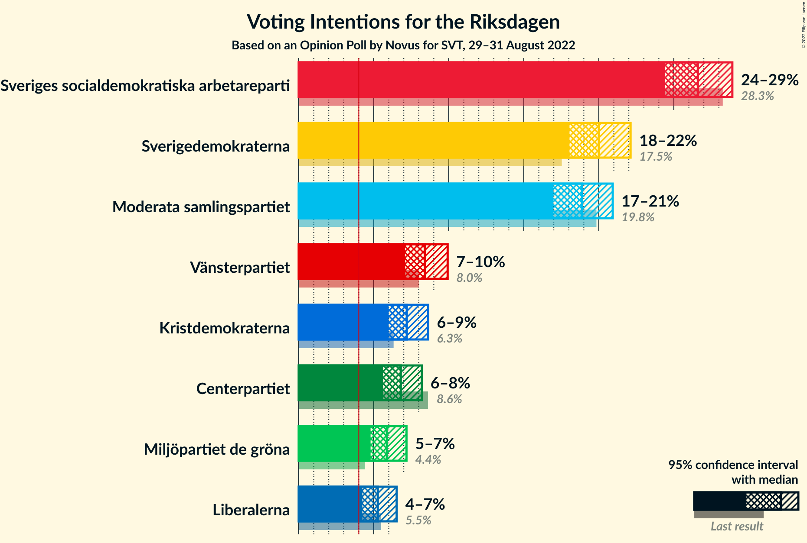

# Opinion Poll by Novus for SVT, 29–31 August 2022

<a href="#voting-intentions">Voting Intentions</a> | <a href="#seats">Seats</a> | <a href="#coalitions">Coalitions</a> | <a href="#technical-information">Technical Information</a>

## Voting Intentions

### Confidence Intervals

| Party | Last Result | Poll Result | 80% Confidence Interval | 90% Confidence Interval | 95% Confidence Interval | 99% Confidence Interval |
|:-----:|:-----------:|:-----------:|:-----------------------:|:-----------------------:|:-----------------------:|:-----------------------:|
| Sveriges socialdemokratiska arbetareparti | 28.3% | 26.6% | 25.2–28.1% |24.8–28.5% |24.4–28.9% |23.7–29.6% |
| Sverigedemokraterna | 17.5% | 20.0% | 18.7–21.4% |18.4–21.8% |18.0–22.1% |17.5–22.8% |
| Moderata samlingspartiet | 19.8% | 18.9% | 17.6–20.2% |17.3–20.6% |17.0–20.9% |16.4–21.6% |
| Vänsterpartiet | 8.0% | 8.4% | 7.5–9.4% |7.3–9.7% |7.1–9.9% |6.7–10.4% |
| Kristdemokraterna | 6.3% | 7.2% | 6.4–8.1% |6.2–8.4% |6.0–8.6% |5.6–9.1% |
| Centerpartiet | 8.6% | 6.8% | 6.0–7.7% |5.8–8.0% |5.6–8.2% |5.3–8.7% |
| Miljöpartiet de gröna | 4.4% | 5.9% | 5.2–6.7% |5.0–7.0% |4.8–7.2% |4.5–7.6% |
| Liberalerna | 5.5% | 5.3% | 4.6–6.1% |4.4–6.3% |4.2–6.5% |3.9–6.9% |

*Note:* The poll result column reflects the actual value used in the calculations. Published results may vary slightly, and in addition be rounded to fewer digits.

## Seats

### Confidence Intervals

| Party | Last Result | Median | 80% Confidence Interval | 90% Confidence Interval | 95% Confidence Interval | 99% Confidence Interval |
|:-----:|:-----------:|:------:|:-----------------------:|:-----------------------:|:-----------------------:|:-----------------------:|
| <a href="#sveriges-socialdemokratiska-arbetareparti">Sveriges socialdemokratiska arbetareparti</a> | 100 | 93 | 88–99 |87–100 |86–102 |83–104 |
| <a href="#sverigedemokraterna">Sverigedemokraterna</a> | 62 | 70 | 65–76 |64–77 |63–78 |61–82 |
| <a href="#moderata-samlingspartiet">Moderata samlingspartiet</a> | 70 | 66 | 61–72 |60–73 |59–74 |57–77 |
| <a href="#vänsterpartiet">Vänsterpartiet</a> | 28 | 30 | 26–33 |26–35 |25–35 |23–37 |
| <a href="#kristdemokraterna">Kristdemokraterna</a> | 22 | 25 | 22–28 |22–30 |21–30 |20–32 |
| <a href="#centerpartiet">Centerpartiet</a> | 31 | 24 | 20–28 |20–29 |19–29 |18–31 |
| <a href="#miljöpartiet-de-gröna">Miljöpartiet de gröna</a> | 16 | 21 | 18–24 |17–25 |17–26 |15–27 |
| <a href="#liberalerna">Liberalerna</a> | 20 | 19 | 16–22 |15–23 |15–23 |0–25 |

### Sveriges socialdemokratiska arbetareparti

*For a full overview of the results for this party, see the [Sveriges socialdemokratiska arbetareparti](party-sverigessocialdemokratiskaarbetareparti.html) page.*

| Number of Seats | Probability | Accumulated | Special Marks |
|:---------------:|:-----------:|:-----------:|:-------------:|
| 81 | 0.1% | 100% |  |
| 82 | 0.2% | 99.9% |  |
| 83 | 0.3% | 99.7% |  |
| 84 | 0.6% | 99.4% |  |
| 85 | 1.0% | 98.7% |  |
| 86 | 2% | 98% |  |
| 87 | 4% | 96% |  |
| 88 | 4% | 92% |  |
| 89 | 6% | 88% |  |
| 90 | 8% | 83% |  |
| 91 | 7% | 75% |  |
| 92 | 11% | 68% |  |
| 93 | 10% | 58% | Median |
| 94 | 10% | 48% |  |
| 95 | 9% | 38% |  |
| 96 | 8% | 29% |  |
| 97 | 7% | 22% |  |
| 98 | 4% | 15% |  |
| 99 | 4% | 10% |  |
| 100 | 2% | 7% | Last Result |
| 101 | 2% | 5% |  |
| 102 | 1.4% | 3% |  |
| 103 | 0.7% | 1.3% |  |
| 104 | 0.2% | 0.6% |  |
| 105 | 0.2% | 0.4% |  |
| 106 | 0.1% | 0.2% |  |
| 107 | 0.1% | 0.1% |  |
| 108 | 0% | 0.1% |  |
| 109 | 0% | 0% |  |

### Sverigedemokraterna

*For a full overview of the results for this party, see the [Sverigedemokraterna](party-sverigedemokraterna.html) page.*

| Number of Seats | Probability | Accumulated | Special Marks |
|:---------------:|:-----------:|:-----------:|:-------------:|
| 58 | 0% | 100% |  |
| 59 | 0.1% | 99.9% |  |
| 60 | 0.2% | 99.8% |  |
| 61 | 0.4% | 99.6% |  |
| 62 | 2% | 99.2% | Last Result |
| 63 | 3% | 98% |  |
| 64 | 2% | 95% |  |
| 65 | 4% | 93% |  |
| 66 | 6% | 89% |  |
| 67 | 10% | 83% |  |
| 68 | 6% | 73% |  |
| 69 | 8% | 66% |  |
| 70 | 10% | 59% | Median |
| 71 | 7% | 48% |  |
| 72 | 12% | 41% |  |
| 73 | 6% | 30% |  |
| 74 | 7% | 23% |  |
| 75 | 5% | 16% |  |
| 76 | 3% | 12% |  |
| 77 | 4% | 8% |  |
| 78 | 1.5% | 4% |  |
| 79 | 0.9% | 2% |  |
| 80 | 0.7% | 1.5% |  |
| 81 | 0.3% | 0.8% |  |
| 82 | 0.3% | 0.5% |  |
| 83 | 0.1% | 0.2% |  |
| 84 | 0% | 0.1% |  |
| 85 | 0% | 0% |  |

### Moderata samlingspartiet

*For a full overview of the results for this party, see the [Moderata samlingspartiet](party-moderatasamlingspartiet.html) page.*

| Number of Seats | Probability | Accumulated | Special Marks |
|:---------------:|:-----------:|:-----------:|:-------------:|
| 54 | 0% | 100% |  |
| 55 | 0.1% | 99.9% |  |
| 56 | 0.2% | 99.9% |  |
| 57 | 0.4% | 99.6% |  |
| 58 | 1.2% | 99.3% |  |
| 59 | 1.4% | 98% |  |
| 60 | 4% | 97% |  |
| 61 | 6% | 93% |  |
| 62 | 6% | 87% |  |
| 63 | 5% | 81% |  |
| 64 | 9% | 76% |  |
| 65 | 7% | 67% |  |
| 66 | 13% | 60% | Median |
| 67 | 9% | 47% |  |
| 68 | 9% | 38% |  |
| 69 | 7% | 29% |  |
| 70 | 6% | 22% | Last Result |
| 71 | 5% | 16% |  |
| 72 | 4% | 11% |  |
| 73 | 2% | 6% |  |
| 74 | 2% | 5% |  |
| 75 | 0.5% | 2% |  |
| 76 | 0.8% | 2% |  |
| 77 | 0.5% | 0.8% |  |
| 78 | 0.2% | 0.3% |  |
| 79 | 0.1% | 0.1% |  |
| 80 | 0% | 0.1% |  |
| 81 | 0% | 0% |  |

### Vänsterpartiet

*For a full overview of the results for this party, see the [Vänsterpartiet](party-vänsterpartiet.html) page.*

| Number of Seats | Probability | Accumulated | Special Marks |
|:---------------:|:-----------:|:-----------:|:-------------:|
| 22 | 0.1% | 100% |  |
| 23 | 0.4% | 99.9% |  |
| 24 | 1.1% | 99.4% |  |
| 25 | 3% | 98% |  |
| 26 | 7% | 96% |  |
| 27 | 10% | 89% |  |
| 28 | 10% | 78% | Last Result |
| 29 | 13% | 68% |  |
| 30 | 14% | 55% | Median |
| 31 | 17% | 41% |  |
| 32 | 10% | 24% |  |
| 33 | 6% | 15% |  |
| 34 | 4% | 9% |  |
| 35 | 3% | 5% |  |
| 36 | 1.3% | 2% |  |
| 37 | 0.4% | 0.7% |  |
| 38 | 0.2% | 0.3% |  |
| 39 | 0.1% | 0.1% |  |
| 40 | 0% | 0% |  |

### Kristdemokraterna

*For a full overview of the results for this party, see the [Kristdemokraterna](party-kristdemokraterna.html) page.*

| Number of Seats | Probability | Accumulated | Special Marks |
|:---------------:|:-----------:|:-----------:|:-------------:|
| 19 | 0.3% | 100% |  |
| 20 | 1.2% | 99.6% |  |
| 21 | 2% | 98% |  |
| 22 | 7% | 97% | Last Result |
| 23 | 9% | 90% |  |
| 24 | 18% | 81% |  |
| 25 | 19% | 63% | Median |
| 26 | 10% | 44% |  |
| 27 | 14% | 33% |  |
| 28 | 11% | 20% |  |
| 29 | 3% | 9% |  |
| 30 | 4% | 6% |  |
| 31 | 0.8% | 2% |  |
| 32 | 0.4% | 0.8% |  |
| 33 | 0.3% | 0.4% |  |
| 34 | 0% | 0.1% |  |
| 35 | 0% | 0% |  |

### Centerpartiet

*For a full overview of the results for this party, see the [Centerpartiet](party-centerpartiet.html) page.*

| Number of Seats | Probability | Accumulated | Special Marks |
|:---------------:|:-----------:|:-----------:|:-------------:|
| 17 | 0.1% | 100% |  |
| 18 | 0.8% | 99.9% |  |
| 19 | 3% | 99.1% |  |
| 20 | 8% | 96% |  |
| 21 | 11% | 88% |  |
| 22 | 15% | 77% |  |
| 23 | 11% | 62% |  |
| 24 | 8% | 51% | Median |
| 25 | 10% | 44% |  |
| 26 | 11% | 34% |  |
| 27 | 9% | 23% |  |
| 28 | 8% | 14% |  |
| 29 | 4% | 6% |  |
| 30 | 2% | 2% |  |
| 31 | 0.5% | 0.6% | Last Result |
| 32 | 0.1% | 0.1% |  |
| 33 | 0% | 0% |  |

### Miljöpartiet de gröna

*For a full overview of the results for this party, see the [Miljöpartiet de gröna](party-miljöpartietdegröna.html) page.*

| Number of Seats | Probability | Accumulated | Special Marks |
|:---------------:|:-----------:|:-----------:|:-------------:|
| 14 | 0.1% | 100% |  |
| 15 | 0.5% | 99.9% |  |
| 16 | 2% | 99.4% | Last Result |
| 17 | 4% | 98% |  |
| 18 | 7% | 94% |  |
| 19 | 14% | 87% |  |
| 20 | 16% | 73% |  |
| 21 | 16% | 57% | Median |
| 22 | 15% | 42% |  |
| 23 | 11% | 26% |  |
| 24 | 8% | 15% |  |
| 25 | 5% | 7% |  |
| 26 | 1.5% | 3% |  |
| 27 | 0.7% | 1.1% |  |
| 28 | 0.3% | 0.4% |  |
| 29 | 0.1% | 0.1% |  |
| 30 | 0% | 0% |  |

### Liberalerna

*For a full overview of the results for this party, see the [Liberalerna](party-liberalerna.html) page.*

| Number of Seats | Probability | Accumulated | Special Marks |
|:---------------:|:-----------:|:-----------:|:-------------:|
| 0 | 1.2% | 100% |  |
| 1 | 0% | 98.8% |  |
| 2 | 0% | 98.8% |  |
| 3 | 0% | 98.8% |  |
| 4 | 0% | 98.8% |  |
| 5 | 0% | 98.8% |  |
| 6 | 0% | 98.8% |  |
| 7 | 0% | 98.8% |  |
| 8 | 0% | 98.8% |  |
| 9 | 0% | 98.8% |  |
| 10 | 0% | 98.8% |  |
| 11 | 0% | 98.8% |  |
| 12 | 0% | 98.8% |  |
| 13 | 0% | 98.8% |  |
| 14 | 0.7% | 98.8% |  |
| 15 | 4% | 98% |  |
| 16 | 8% | 94% |  |
| 17 | 13% | 86% |  |
| 18 | 19% | 73% |  |
| 19 | 18% | 54% | Median |
| 20 | 14% | 36% | Last Result |
| 21 | 10% | 22% |  |
| 22 | 6% | 12% |  |
| 23 | 3% | 5% |  |
| 24 | 1.5% | 2% |  |
| 25 | 0.7% | 0.9% |  |
| 26 | 0.2% | 0.3% |  |
| 27 | 0% | 0.1% |  |
| 28 | 0% | 0% |  |

## Coalitions

### Confidence Intervals

| Coalition | Last Result | Median | Majority? | 80% Confidence Interval | 90% Confidence Interval | 95% Confidence Interval | 99% Confidence Interval |
|:---------:|:-----------:|:------:|:---------:|:-----------------------:|:-----------------------:|:-----------------------:|:-----------------------:|
| Sveriges socialdemokratiska arbetareparti – Vänsterpartiet – Centerpartiet – Miljöpartiet de gröna – Liberalerna | 195 | 187 | 99.5% | 181–193 | 179–194 | 178–196 | 174–198 |
| Sveriges socialdemokratiska arbetareparti – Moderata samlingspartiet – Centerpartiet | 201 | 184 | 98% | 178–190 | 176–193 | 175–194 | 171–198 |
| Sverigedemokraterna – Moderata samlingspartiet – Kristdemokraterna – Liberalerna | 174 | 181 | 91% | 175–187 | 173–188 | 172–190 | 168–192 |
| Sveriges socialdemokratiska arbetareparti – Vänsterpartiet – Centerpartiet – Miljöpartiet de gröna | 175 | 168 | 9% | 162–174 | 161–176 | 159–177 | 157–181 |
| Sverigedemokraterna – Moderata samlingspartiet – Kristdemokraterna | 154 | 162 | 0.5% | 156–168 | 155–170 | 153–171 | 151–175 |
| Sveriges socialdemokratiska arbetareparti – Moderata samlingspartiet | 170 | 159 | 0.3% | 153–166 | 152–168 | 150–170 | 147–173 |
| Sveriges socialdemokratiska arbetareparti – Centerpartiet – Miljöpartiet de gröna – Liberalerna | 167 | 157 | 0% | 151–163 | 149–165 | 147–166 | 144–169 |
| Sveriges socialdemokratiska arbetareparti – Vänsterpartiet – Miljöpartiet de gröna | 144 | 144 | 0% | 138–150 | 136–152 | 135–153 | 132–156 |
| Sveriges socialdemokratiska arbetareparti – Centerpartiet – Miljöpartiet de gröna | 147 | 138 | 0% | 132–144 | 131–146 | 129–147 | 127–151 |
| Sverigedemokraterna – Moderata samlingspartiet | 132 | 137 | 0% | 131–142 | 130–144 | 128–146 | 125–149 |
| Moderata samlingspartiet – Kristdemokraterna – Centerpartiet – Liberalerna | 143 | 134 | 0% | 129–140 | 127–142 | 125–144 | 122–146 |
| Sveriges socialdemokratiska arbetareparti – Vänsterpartiet | 128 | 123 | 0% | 118–129 | 116–131 | 114–132 | 112–135 |
| Moderata samlingspartiet – Kristdemokraterna – Centerpartiet | 123 | 116 | 0% | 110–122 | 109–124 | 108–125 | 105–128 |
| Sveriges socialdemokratiska arbetareparti – Miljöpartiet de gröna | 116 | 114 | 0% | 109–120 | 107–122 | 106–123 | 103–126 |
| Moderata samlingspartiet – Kristdemokraterna – Liberalerna | 112 | 110 | 0% | 104–117 | 103–119 | 101–120 | 96–122 |
| Moderata samlingspartiet – Centerpartiet – Liberalerna | 121 | 109 | 0% | 104–115 | 102–116 | 100–118 | 96–120 |
| Sveriges socialdemokratiska arbetareparti | 100 | 93 | 0% | 88–99 | 87–100 | 86–102 | 83–104 |
| Moderata samlingspartiet – Kristdemokraterna | 92 | 92 | 0% | 86–97 | 85–99 | 84–100 | 81–104 |
| Moderata samlingspartiet – Centerpartiet | 101 | 90 | 0% | 85–96 | 84–98 | 83–99 | 80–102 |

### Sveriges socialdemokratiska arbetareparti – Vänsterpartiet – Centerpartiet – Miljöpartiet de gröna – Liberalerna

| Number of Seats | Probability | Accumulated | Special Marks |
|:---------------:|:-----------:|:-----------:|:-------------:|
| 170 | 0% | 100% |  |
| 171 | 0.1% | 99.9% |  |
| 172 | 0.1% | 99.9% |  |
| 173 | 0.1% | 99.8% |  |
| 174 | 0.2% | 99.7% |  |
| 175 | 0.5% | 99.5% | Majority |
| 176 | 0.5% | 99.0% |  |
| 177 | 0.8% | 98% |  |
| 178 | 1.0% | 98% |  |
| 179 | 3% | 97% |  |
| 180 | 3% | 93% |  |
| 181 | 5% | 90% |  |
| 182 | 4% | 85% |  |
| 183 | 4% | 81% |  |
| 184 | 6% | 77% |  |
| 185 | 8% | 70% |  |
| 186 | 10% | 63% |  |
| 187 | 9% | 53% | Median |
| 188 | 7% | 44% |  |
| 189 | 6% | 37% |  |
| 190 | 7% | 31% |  |
| 191 | 7% | 24% |  |
| 192 | 7% | 17% |  |
| 193 | 3% | 10% |  |
| 194 | 3% | 7% |  |
| 195 | 1.4% | 4% | Last Result |
| 196 | 1.0% | 3% |  |
| 197 | 0.9% | 2% |  |
| 198 | 0.4% | 0.8% |  |
| 199 | 0.2% | 0.4% |  |
| 200 | 0.1% | 0.2% |  |
| 201 | 0.1% | 0.1% |  |
| 202 | 0% | 0.1% |  |
| 203 | 0% | 0% |  |

### Sveriges socialdemokratiska arbetareparti – Moderata samlingspartiet – Centerpartiet

| Number of Seats | Probability | Accumulated | Special Marks |
|:---------------:|:-----------:|:-----------:|:-------------:|
| 169 | 0.1% | 100% |  |
| 170 | 0.1% | 99.9% |  |
| 171 | 0.3% | 99.8% |  |
| 172 | 0.3% | 99.5% |  |
| 173 | 0.5% | 99.1% |  |
| 174 | 0.8% | 98.6% |  |
| 175 | 2% | 98% | Majority |
| 176 | 4% | 96% |  |
| 177 | 2% | 92% |  |
| 178 | 3% | 91% |  |
| 179 | 6% | 87% |  |
| 180 | 10% | 81% |  |
| 181 | 6% | 71% |  |
| 182 | 5% | 65% |  |
| 183 | 8% | 60% | Median |
| 184 | 14% | 51% |  |
| 185 | 7% | 38% |  |
| 186 | 3% | 31% |  |
| 187 | 5% | 28% |  |
| 188 | 8% | 23% |  |
| 189 | 4% | 16% |  |
| 190 | 2% | 12% |  |
| 191 | 2% | 10% |  |
| 192 | 2% | 8% |  |
| 193 | 3% | 5% |  |
| 194 | 0.6% | 3% |  |
| 195 | 0.8% | 2% |  |
| 196 | 0.3% | 1.2% |  |
| 197 | 0.3% | 0.9% |  |
| 198 | 0.3% | 0.6% |  |
| 199 | 0.1% | 0.3% |  |
| 200 | 0% | 0.1% |  |
| 201 | 0% | 0.1% | Last Result |
| 202 | 0% | 0.1% |  |
| 203 | 0% | 0.1% |  |
| 204 | 0% | 0% |  |

### Sverigedemokraterna – Moderata samlingspartiet – Kristdemokraterna – Liberalerna

| Number of Seats | Probability | Accumulated | Special Marks |
|:---------------:|:-----------:|:-----------:|:-------------:|
| 164 | 0.1% | 100% |  |
| 165 | 0.1% | 99.9% |  |
| 166 | 0.1% | 99.8% |  |
| 167 | 0.1% | 99.8% |  |
| 168 | 0.2% | 99.7% |  |
| 169 | 0.3% | 99.5% |  |
| 170 | 0.7% | 99.2% |  |
| 171 | 0.7% | 98% |  |
| 172 | 1.2% | 98% |  |
| 173 | 2% | 97% |  |
| 174 | 4% | 95% | Last Result |
| 175 | 5% | 91% | Majority |
| 176 | 5% | 87% |  |
| 177 | 6% | 81% |  |
| 178 | 5% | 75% |  |
| 179 | 9% | 70% |  |
| 180 | 7% | 61% | Median |
| 181 | 8% | 54% |  |
| 182 | 11% | 46% |  |
| 183 | 6% | 35% |  |
| 184 | 6% | 29% |  |
| 185 | 6% | 23% |  |
| 186 | 6% | 18% |  |
| 187 | 4% | 11% |  |
| 188 | 3% | 8% |  |
| 189 | 2% | 5% |  |
| 190 | 1.0% | 3% |  |
| 191 | 0.5% | 2% |  |
| 192 | 0.7% | 1.2% |  |
| 193 | 0.2% | 0.5% |  |
| 194 | 0.1% | 0.3% |  |
| 195 | 0.1% | 0.2% |  |
| 196 | 0% | 0.1% |  |
| 197 | 0% | 0% |  |

### Sveriges socialdemokratiska arbetareparti – Vänsterpartiet – Centerpartiet – Miljöpartiet de gröna

| Number of Seats | Probability | Accumulated | Special Marks |
|:---------------:|:-----------:|:-----------:|:-------------:|
| 153 | 0% | 100% |  |
| 154 | 0.1% | 99.9% |  |
| 155 | 0.1% | 99.8% |  |
| 156 | 0.2% | 99.7% |  |
| 157 | 0.7% | 99.5% |  |
| 158 | 0.5% | 98.8% |  |
| 159 | 1.0% | 98% |  |
| 160 | 2% | 97% |  |
| 161 | 3% | 95% |  |
| 162 | 4% | 92% |  |
| 163 | 6% | 89% |  |
| 164 | 6% | 82% |  |
| 165 | 6% | 77% |  |
| 166 | 6% | 71% |  |
| 167 | 11% | 65% |  |
| 168 | 8% | 54% | Median |
| 169 | 7% | 46% |  |
| 170 | 9% | 39% |  |
| 171 | 5% | 30% |  |
| 172 | 6% | 25% |  |
| 173 | 5% | 19% |  |
| 174 | 5% | 13% |  |
| 175 | 4% | 9% | Last Result, Majority |
| 176 | 2% | 5% |  |
| 177 | 1.2% | 3% |  |
| 178 | 0.7% | 2% |  |
| 179 | 0.7% | 2% |  |
| 180 | 0.3% | 0.8% |  |
| 181 | 0.2% | 0.5% |  |
| 182 | 0.1% | 0.3% |  |
| 183 | 0.1% | 0.2% |  |
| 184 | 0.1% | 0.2% |  |
| 185 | 0.1% | 0.1% |  |
| 186 | 0% | 0% |  |

### Sverigedemokraterna – Moderata samlingspartiet – Kristdemokraterna

| Number of Seats | Probability | Accumulated | Special Marks |
|:---------------:|:-----------:|:-----------:|:-------------:|
| 147 | 0% | 100% |  |
| 148 | 0.1% | 99.9% |  |
| 149 | 0.1% | 99.9% |  |
| 150 | 0.2% | 99.8% |  |
| 151 | 0.4% | 99.6% |  |
| 152 | 0.9% | 99.2% |  |
| 153 | 1.0% | 98% |  |
| 154 | 1.4% | 97% | Last Result |
| 155 | 3% | 96% |  |
| 156 | 3% | 93% |  |
| 157 | 7% | 90% |  |
| 158 | 7% | 83% |  |
| 159 | 7% | 76% |  |
| 160 | 6% | 69% |  |
| 161 | 7% | 63% | Median |
| 162 | 9% | 56% |  |
| 163 | 10% | 47% |  |
| 164 | 8% | 37% |  |
| 165 | 6% | 30% |  |
| 166 | 4% | 23% |  |
| 167 | 4% | 19% |  |
| 168 | 5% | 15% |  |
| 169 | 3% | 10% |  |
| 170 | 3% | 7% |  |
| 171 | 1.0% | 3% |  |
| 172 | 0.8% | 2% |  |
| 173 | 0.5% | 2% |  |
| 174 | 0.5% | 1.0% |  |
| 175 | 0.2% | 0.5% | Majority |
| 176 | 0.1% | 0.3% |  |
| 177 | 0.1% | 0.2% |  |
| 178 | 0.1% | 0.1% |  |
| 179 | 0% | 0.1% |  |
| 180 | 0% | 0% |  |

### Sveriges socialdemokratiska arbetareparti – Moderata samlingspartiet

| Number of Seats | Probability | Accumulated | Special Marks |
|:---------------:|:-----------:|:-----------:|:-------------:|
| 145 | 0.1% | 100% |  |
| 146 | 0.1% | 99.9% |  |
| 147 | 0.3% | 99.8% |  |
| 148 | 0.4% | 99.5% |  |
| 149 | 0.6% | 99.1% |  |
| 150 | 1.4% | 98.5% |  |
| 151 | 1.2% | 97% |  |
| 152 | 3% | 96% |  |
| 153 | 4% | 93% |  |
| 154 | 5% | 89% |  |
| 155 | 5% | 85% |  |
| 156 | 6% | 80% |  |
| 157 | 8% | 74% |  |
| 158 | 7% | 66% |  |
| 159 | 10% | 59% | Median |
| 160 | 7% | 49% |  |
| 161 | 6% | 42% |  |
| 162 | 9% | 36% |  |
| 163 | 6% | 28% |  |
| 164 | 6% | 22% |  |
| 165 | 3% | 16% |  |
| 166 | 4% | 13% |  |
| 167 | 3% | 9% |  |
| 168 | 3% | 7% |  |
| 169 | 1.2% | 4% |  |
| 170 | 0.8% | 3% | Last Result |
| 171 | 0.8% | 2% |  |
| 172 | 0.4% | 1.0% |  |
| 173 | 0.2% | 0.6% |  |
| 174 | 0.2% | 0.5% |  |
| 175 | 0.1% | 0.3% | Majority |
| 176 | 0.1% | 0.2% |  |
| 177 | 0% | 0.1% |  |
| 178 | 0% | 0% |  |

### Sveriges socialdemokratiska arbetareparti – Centerpartiet – Miljöpartiet de gröna – Liberalerna

| Number of Seats | Probability | Accumulated | Special Marks |
|:---------------:|:-----------:|:-----------:|:-------------:|
| 139 | 0% | 100% |  |
| 140 | 0% | 99.9% |  |
| 141 | 0% | 99.9% |  |
| 142 | 0% | 99.9% |  |
| 143 | 0.1% | 99.8% |  |
| 144 | 0.4% | 99.7% |  |
| 145 | 0.3% | 99.3% |  |
| 146 | 0.6% | 99.0% |  |
| 147 | 1.2% | 98% |  |
| 148 | 1.3% | 97% |  |
| 149 | 2% | 96% |  |
| 150 | 3% | 94% |  |
| 151 | 3% | 91% |  |
| 152 | 4% | 88% |  |
| 153 | 4% | 84% |  |
| 154 | 7% | 79% |  |
| 155 | 8% | 72% |  |
| 156 | 8% | 64% |  |
| 157 | 9% | 56% | Median |
| 158 | 9% | 46% |  |
| 159 | 8% | 37% |  |
| 160 | 7% | 29% |  |
| 161 | 6% | 22% |  |
| 162 | 4% | 16% |  |
| 163 | 4% | 12% |  |
| 164 | 2% | 8% |  |
| 165 | 2% | 5% |  |
| 166 | 2% | 3% |  |
| 167 | 0.9% | 2% | Last Result |
| 168 | 0.5% | 1.0% |  |
| 169 | 0.2% | 0.5% |  |
| 170 | 0.1% | 0.3% |  |
| 171 | 0.1% | 0.1% |  |
| 172 | 0% | 0.1% |  |
| 173 | 0% | 0% |  |

### Sveriges socialdemokratiska arbetareparti – Vänsterpartiet – Miljöpartiet de gröna

| Number of Seats | Probability | Accumulated | Special Marks |
|:---------------:|:-----------:|:-----------:|:-------------:|
| 129 | 0% | 100% |  |
| 130 | 0.1% | 99.9% |  |
| 131 | 0.2% | 99.8% |  |
| 132 | 0.3% | 99.7% |  |
| 133 | 0.4% | 99.4% |  |
| 134 | 1.1% | 99.0% |  |
| 135 | 1.1% | 98% |  |
| 136 | 2% | 97% |  |
| 137 | 4% | 95% |  |
| 138 | 4% | 91% |  |
| 139 | 5% | 88% |  |
| 140 | 6% | 82% |  |
| 141 | 6% | 77% |  |
| 142 | 8% | 70% |  |
| 143 | 8% | 63% |  |
| 144 | 7% | 54% | Last Result, Median |
| 145 | 7% | 48% |  |
| 146 | 8% | 41% |  |
| 147 | 7% | 33% |  |
| 148 | 8% | 26% |  |
| 149 | 5% | 19% |  |
| 150 | 4% | 14% |  |
| 151 | 4% | 10% |  |
| 152 | 2% | 6% |  |
| 153 | 2% | 4% |  |
| 154 | 1.0% | 2% |  |
| 155 | 0.7% | 1.4% |  |
| 156 | 0.3% | 0.8% |  |
| 157 | 0.2% | 0.5% |  |
| 158 | 0.1% | 0.3% |  |
| 159 | 0.1% | 0.2% |  |
| 160 | 0% | 0.1% |  |
| 161 | 0% | 0% |  |

### Sveriges socialdemokratiska arbetareparti – Centerpartiet – Miljöpartiet de gröna

| Number of Seats | Probability | Accumulated | Special Marks |
|:---------------:|:-----------:|:-----------:|:-------------:|
| 123 | 0% | 100% |  |
| 124 | 0.1% | 99.9% |  |
| 125 | 0.1% | 99.9% |  |
| 126 | 0.1% | 99.7% |  |
| 127 | 0.5% | 99.6% |  |
| 128 | 0.6% | 99.1% |  |
| 129 | 2% | 98.5% |  |
| 130 | 2% | 97% |  |
| 131 | 2% | 95% |  |
| 132 | 4% | 93% |  |
| 133 | 3% | 89% |  |
| 134 | 7% | 86% |  |
| 135 | 6% | 79% |  |
| 136 | 7% | 72% |  |
| 137 | 9% | 66% |  |
| 138 | 9% | 57% | Median |
| 139 | 7% | 47% |  |
| 140 | 8% | 40% |  |
| 141 | 7% | 32% |  |
| 142 | 6% | 25% |  |
| 143 | 7% | 19% |  |
| 144 | 3% | 13% |  |
| 145 | 4% | 10% |  |
| 146 | 2% | 6% |  |
| 147 | 2% | 4% | Last Result |
| 148 | 0.7% | 2% |  |
| 149 | 0.6% | 2% |  |
| 150 | 0.4% | 1.0% |  |
| 151 | 0.1% | 0.6% |  |
| 152 | 0.3% | 0.5% |  |
| 153 | 0.1% | 0.2% |  |
| 154 | 0.1% | 0.1% |  |
| 155 | 0% | 0.1% |  |
| 156 | 0% | 0% |  |

### Sverigedemokraterna – Moderata samlingspartiet

| Number of Seats | Probability | Accumulated | Special Marks |
|:---------------:|:-----------:|:-----------:|:-------------:|
| 122 | 0.1% | 100% |  |
| 123 | 0.1% | 99.9% |  |
| 124 | 0.1% | 99.9% |  |
| 125 | 0.4% | 99.7% |  |
| 126 | 0.5% | 99.3% |  |
| 127 | 0.7% | 98.9% |  |
| 128 | 0.7% | 98% |  |
| 129 | 2% | 97% |  |
| 130 | 3% | 96% |  |
| 131 | 5% | 93% |  |
| 132 | 6% | 88% | Last Result |
| 133 | 8% | 82% |  |
| 134 | 11% | 74% |  |
| 135 | 6% | 64% |  |
| 136 | 5% | 58% | Median |
| 137 | 6% | 52% |  |
| 138 | 10% | 47% |  |
| 139 | 8% | 37% |  |
| 140 | 5% | 29% |  |
| 141 | 10% | 23% |  |
| 142 | 4% | 13% |  |
| 143 | 3% | 9% |  |
| 144 | 2% | 6% |  |
| 145 | 1.4% | 4% |  |
| 146 | 1.0% | 3% |  |
| 147 | 0.8% | 2% |  |
| 148 | 0.6% | 1.2% |  |
| 149 | 0.2% | 0.6% |  |
| 150 | 0.2% | 0.3% |  |
| 151 | 0.1% | 0.2% |  |
| 152 | 0% | 0.1% |  |
| 153 | 0% | 0.1% |  |
| 154 | 0% | 0% |  |

### Moderata samlingspartiet – Kristdemokraterna – Centerpartiet – Liberalerna

| Number of Seats | Probability | Accumulated | Special Marks |
|:---------------:|:-----------:|:-----------:|:-------------:|
| 115 | 0% | 100% |  |
| 116 | 0.1% | 99.9% |  |
| 117 | 0% | 99.8% |  |
| 118 | 0% | 99.8% |  |
| 119 | 0.1% | 99.8% |  |
| 120 | 0.1% | 99.7% |  |
| 121 | 0.1% | 99.6% |  |
| 122 | 0.2% | 99.5% |  |
| 123 | 0.4% | 99.3% |  |
| 124 | 0.8% | 98.9% |  |
| 125 | 0.7% | 98% |  |
| 126 | 2% | 97% |  |
| 127 | 2% | 96% |  |
| 128 | 3% | 94% |  |
| 129 | 5% | 91% |  |
| 130 | 6% | 86% |  |
| 131 | 7% | 80% |  |
| 132 | 8% | 72% |  |
| 133 | 8% | 65% |  |
| 134 | 8% | 57% | Median |
| 135 | 7% | 49% |  |
| 136 | 8% | 42% |  |
| 137 | 8% | 34% |  |
| 138 | 7% | 26% |  |
| 139 | 4% | 19% |  |
| 140 | 5% | 15% |  |
| 141 | 4% | 10% |  |
| 142 | 2% | 6% |  |
| 143 | 1.1% | 4% | Last Result |
| 144 | 1.2% | 3% |  |
| 145 | 0.6% | 1.3% |  |
| 146 | 0.3% | 0.8% |  |
| 147 | 0.2% | 0.4% |  |
| 148 | 0.1% | 0.3% |  |
| 149 | 0.1% | 0.2% |  |
| 150 | 0% | 0.1% |  |
| 151 | 0% | 0% |  |

### Sveriges socialdemokratiska arbetareparti – Vänsterpartiet

| Number of Seats | Probability | Accumulated | Special Marks |
|:---------------:|:-----------:|:-----------:|:-------------:|
| 109 | 0% | 100% |  |
| 110 | 0.1% | 99.9% |  |
| 111 | 0.1% | 99.8% |  |
| 112 | 0.3% | 99.6% |  |
| 113 | 0.6% | 99.4% |  |
| 114 | 2% | 98.7% |  |
| 115 | 1.4% | 97% |  |
| 116 | 2% | 96% |  |
| 117 | 3% | 94% |  |
| 118 | 8% | 91% |  |
| 119 | 6% | 82% |  |
| 120 | 5% | 76% |  |
| 121 | 7% | 72% |  |
| 122 | 7% | 65% |  |
| 123 | 11% | 58% | Median |
| 124 | 9% | 47% |  |
| 125 | 7% | 38% |  |
| 126 | 8% | 31% |  |
| 127 | 7% | 23% |  |
| 128 | 5% | 16% | Last Result |
| 129 | 3% | 11% |  |
| 130 | 3% | 8% |  |
| 131 | 2% | 5% |  |
| 132 | 1.2% | 3% |  |
| 133 | 0.7% | 2% |  |
| 134 | 0.4% | 1.1% |  |
| 135 | 0.4% | 0.8% |  |
| 136 | 0.1% | 0.3% |  |
| 137 | 0.1% | 0.2% |  |
| 138 | 0.1% | 0.1% |  |
| 139 | 0% | 0.1% |  |
| 140 | 0% | 0% |  |

### Moderata samlingspartiet – Kristdemokraterna – Centerpartiet

| Number of Seats | Probability | Accumulated | Special Marks |
|:---------------:|:-----------:|:-----------:|:-------------:|
| 102 | 0% | 100% |  |
| 103 | 0.1% | 99.9% |  |
| 104 | 0.3% | 99.8% |  |
| 105 | 0.3% | 99.5% |  |
| 106 | 0.8% | 99.2% |  |
| 107 | 0.8% | 98% |  |
| 108 | 2% | 98% |  |
| 109 | 3% | 96% |  |
| 110 | 4% | 93% |  |
| 111 | 10% | 90% |  |
| 112 | 5% | 80% |  |
| 113 | 7% | 74% |  |
| 114 | 11% | 67% |  |
| 115 | 6% | 56% | Median |
| 116 | 8% | 51% |  |
| 117 | 7% | 43% |  |
| 118 | 8% | 36% |  |
| 119 | 7% | 28% |  |
| 120 | 5% | 21% |  |
| 121 | 4% | 16% |  |
| 122 | 4% | 12% |  |
| 123 | 2% | 7% | Last Result |
| 124 | 2% | 5% |  |
| 125 | 1.0% | 3% |  |
| 126 | 0.7% | 2% |  |
| 127 | 0.5% | 1.0% |  |
| 128 | 0.2% | 0.6% |  |
| 129 | 0.2% | 0.4% |  |
| 130 | 0.1% | 0.2% |  |
| 131 | 0% | 0.1% |  |
| 132 | 0% | 0.1% |  |
| 133 | 0% | 0% |  |

### Sveriges socialdemokratiska arbetareparti – Miljöpartiet de gröna

| Number of Seats | Probability | Accumulated | Special Marks |
|:---------------:|:-----------:|:-----------:|:-------------:|
| 100 | 0% | 100% |  |
| 101 | 0% | 99.9% |  |
| 102 | 0.1% | 99.9% |  |
| 103 | 0.3% | 99.7% |  |
| 104 | 0.5% | 99.5% |  |
| 105 | 0.7% | 98.9% |  |
| 106 | 1.3% | 98% |  |
| 107 | 3% | 97% |  |
| 108 | 3% | 94% |  |
| 109 | 5% | 91% |  |
| 110 | 6% | 86% |  |
| 111 | 7% | 81% |  |
| 112 | 8% | 74% |  |
| 113 | 9% | 66% |  |
| 114 | 8% | 58% | Median |
| 115 | 10% | 50% |  |
| 116 | 9% | 40% | Last Result |
| 117 | 8% | 31% |  |
| 118 | 6% | 23% |  |
| 119 | 5% | 17% |  |
| 120 | 4% | 12% |  |
| 121 | 2% | 8% |  |
| 122 | 2% | 5% |  |
| 123 | 1.5% | 3% |  |
| 124 | 0.8% | 2% |  |
| 125 | 0.4% | 1.1% |  |
| 126 | 0.4% | 0.7% |  |
| 127 | 0.1% | 0.3% |  |
| 128 | 0.1% | 0.2% |  |
| 129 | 0% | 0.1% |  |
| 130 | 0% | 0% |  |

### Moderata samlingspartiet – Kristdemokraterna – Liberalerna

| Number of Seats | Probability | Accumulated | Special Marks |
|:---------------:|:-----------:|:-----------:|:-------------:|
| 89 | 0.1% | 100% |  |
| 90 | 0% | 99.9% |  |
| 91 | 0% | 99.9% |  |
| 92 | 0% | 99.8% |  |
| 93 | 0% | 99.8% |  |
| 94 | 0.1% | 99.7% |  |
| 95 | 0.1% | 99.7% |  |
| 96 | 0.2% | 99.6% |  |
| 97 | 0.4% | 99.4% |  |
| 98 | 0.2% | 99.0% |  |
| 99 | 0.4% | 98.8% |  |
| 100 | 0.4% | 98% |  |
| 101 | 1.2% | 98% |  |
| 102 | 2% | 97% |  |
| 103 | 3% | 95% |  |
| 104 | 4% | 92% |  |
| 105 | 6% | 88% |  |
| 106 | 3% | 82% |  |
| 107 | 7% | 79% |  |
| 108 | 5% | 72% |  |
| 109 | 8% | 67% |  |
| 110 | 9% | 59% | Median |
| 111 | 8% | 49% |  |
| 112 | 6% | 41% | Last Result |
| 113 | 8% | 36% |  |
| 114 | 7% | 27% |  |
| 115 | 4% | 21% |  |
| 116 | 5% | 16% |  |
| 117 | 3% | 12% |  |
| 118 | 3% | 8% |  |
| 119 | 3% | 6% |  |
| 120 | 1.0% | 3% |  |
| 121 | 0.9% | 2% |  |
| 122 | 0.5% | 1.0% |  |
| 123 | 0.2% | 0.5% |  |
| 124 | 0.1% | 0.3% |  |
| 125 | 0.1% | 0.1% |  |
| 126 | 0% | 0% |  |

### Moderata samlingspartiet – Centerpartiet – Liberalerna

| Number of Seats | Probability | Accumulated | Special Marks |
|:---------------:|:-----------:|:-----------:|:-------------:|
| 89 | 0% | 100% |  |
| 90 | 0.1% | 99.9% |  |
| 91 | 0.1% | 99.9% |  |
| 92 | 0.1% | 99.8% |  |
| 93 | 0.1% | 99.7% |  |
| 94 | 0.1% | 99.7% |  |
| 95 | 0.1% | 99.6% |  |
| 96 | 0.1% | 99.5% |  |
| 97 | 0.4% | 99.4% |  |
| 98 | 0.5% | 99.0% |  |
| 99 | 0.4% | 98% |  |
| 100 | 1.0% | 98% |  |
| 101 | 1.3% | 97% |  |
| 102 | 2% | 96% |  |
| 103 | 3% | 94% |  |
| 104 | 4% | 90% |  |
| 105 | 7% | 86% |  |
| 106 | 7% | 79% |  |
| 107 | 9% | 72% |  |
| 108 | 10% | 63% |  |
| 109 | 8% | 53% | Median |
| 110 | 9% | 45% |  |
| 111 | 6% | 36% |  |
| 112 | 7% | 29% |  |
| 113 | 5% | 22% |  |
| 114 | 5% | 16% |  |
| 115 | 5% | 11% |  |
| 116 | 2% | 7% |  |
| 117 | 2% | 4% |  |
| 118 | 1.0% | 3% |  |
| 119 | 0.6% | 2% |  |
| 120 | 0.5% | 1.0% |  |
| 121 | 0.2% | 0.5% | Last Result |
| 122 | 0.2% | 0.3% |  |
| 123 | 0% | 0.1% |  |
| 124 | 0% | 0.1% |  |
| 125 | 0% | 0% |  |

### Sveriges socialdemokratiska arbetareparti

| Number of Seats | Probability | Accumulated | Special Marks |
|:---------------:|:-----------:|:-----------:|:-------------:|
| 81 | 0.1% | 100% |  |
| 82 | 0.2% | 99.9% |  |
| 83 | 0.3% | 99.7% |  |
| 84 | 0.6% | 99.4% |  |
| 85 | 1.0% | 98.7% |  |
| 86 | 2% | 98% |  |
| 87 | 4% | 96% |  |
| 88 | 4% | 92% |  |
| 89 | 6% | 88% |  |
| 90 | 8% | 83% |  |
| 91 | 7% | 75% |  |
| 92 | 11% | 68% |  |
| 93 | 10% | 58% | Median |
| 94 | 10% | 48% |  |
| 95 | 9% | 38% |  |
| 96 | 8% | 29% |  |
| 97 | 7% | 22% |  |
| 98 | 4% | 15% |  |
| 99 | 4% | 10% |  |
| 100 | 2% | 7% | Last Result |
| 101 | 2% | 5% |  |
| 102 | 1.4% | 3% |  |
| 103 | 0.7% | 1.3% |  |
| 104 | 0.2% | 0.6% |  |
| 105 | 0.2% | 0.4% |  |
| 106 | 0.1% | 0.2% |  |
| 107 | 0.1% | 0.1% |  |
| 108 | 0% | 0.1% |  |
| 109 | 0% | 0% |  |

### Moderata samlingspartiet – Kristdemokraterna

| Number of Seats | Probability | Accumulated | Special Marks |
|:---------------:|:-----------:|:-----------:|:-------------:|
| 78 | 0% | 100% |  |
| 79 | 0.1% | 99.9% |  |
| 80 | 0.3% | 99.9% |  |
| 81 | 0.3% | 99.6% |  |
| 82 | 0.4% | 99.3% |  |
| 83 | 0.5% | 98.9% |  |
| 84 | 2% | 98% |  |
| 85 | 5% | 97% |  |
| 86 | 5% | 92% |  |
| 87 | 5% | 87% |  |
| 88 | 6% | 81% |  |
| 89 | 7% | 76% |  |
| 90 | 9% | 69% |  |
| 91 | 8% | 60% | Median |
| 92 | 8% | 52% | Last Result |
| 93 | 9% | 44% |  |
| 94 | 7% | 35% |  |
| 95 | 5% | 28% |  |
| 96 | 7% | 22% |  |
| 97 | 6% | 15% |  |
| 98 | 3% | 10% |  |
| 99 | 3% | 6% |  |
| 100 | 2% | 4% |  |
| 101 | 0.8% | 2% |  |
| 102 | 0.6% | 1.5% |  |
| 103 | 0.3% | 0.9% |  |
| 104 | 0.3% | 0.6% |  |
| 105 | 0.2% | 0.3% |  |
| 106 | 0% | 0.1% |  |
| 107 | 0% | 0% |  |

### Moderata samlingspartiet – Centerpartiet

| Number of Seats | Probability | Accumulated | Special Marks |
|:---------------:|:-----------:|:-----------:|:-------------:|
| 78 | 0.1% | 100% |  |
| 79 | 0.2% | 99.8% |  |
| 80 | 0.4% | 99.7% |  |
| 81 | 0.7% | 99.3% |  |
| 82 | 1.0% | 98.6% |  |
| 83 | 2% | 98% |  |
| 84 | 3% | 95% |  |
| 85 | 4% | 92% |  |
| 86 | 6% | 88% |  |
| 87 | 10% | 82% |  |
| 88 | 7% | 72% |  |
| 89 | 9% | 65% |  |
| 90 | 9% | 56% | Median |
| 91 | 9% | 47% |  |
| 92 | 10% | 38% |  |
| 93 | 6% | 28% |  |
| 94 | 6% | 23% |  |
| 95 | 4% | 16% |  |
| 96 | 4% | 13% |  |
| 97 | 4% | 9% |  |
| 98 | 2% | 5% |  |
| 99 | 1.4% | 3% |  |
| 100 | 0.9% | 2% |  |
| 101 | 0.3% | 0.9% | Last Result |
| 102 | 0.4% | 0.6% |  |
| 103 | 0.1% | 0.2% |  |
| 104 | 0.1% | 0.2% |  |
| 105 | 0% | 0.1% |  |
| 106 | 0% | 0% |  |

## Technical Information

### Opinion Poll

+ **Polling firm:** Novus
+ **Commissioner(s):** SVT
+ **Fieldwork period:** 29–31 August 2022

### Calculations

+ **Sample size:** 1500
+ **Simulations done:** 1,048,576
+ **Error estimate:** 1.57%

