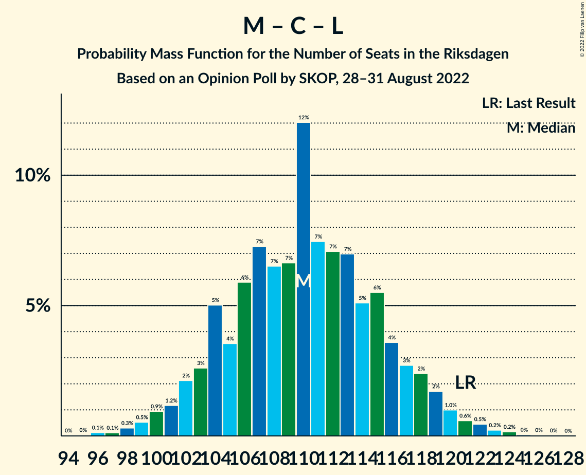

# Opinion Poll by SKOP, 28–31 August 2022

<a href="#voting-intentions">Voting Intentions</a> | <a href="#seats">Seats</a> | <a href="#coalitions">Coalitions</a> | <a href="#technical-information">Technical Information</a>

## Voting Intentions

### Confidence Intervals

| Party | Last Result | Poll Result | 80% Confidence Interval | 90% Confidence Interval | 95% Confidence Interval | 99% Confidence Interval |
|:-----:|:-----------:|:-----------:|:-----------------------:|:-----------------------:|:-----------------------:|:-----------------------:|
| Sveriges socialdemokratiska arbetareparti | 28.3% | 28.6% | 27.0–30.4% |26.5–30.9% |26.1–31.3% |25.4–32.1% |
| Sverigedemokraterna | 17.5% | 18.8% | 17.4–20.3% |17.0–20.8% |16.7–21.2% |16.0–21.9% |
| Moderata samlingspartiet | 19.8% | 16.0% | 14.7–17.5% |14.3–17.9% |14.0–18.2% |13.4–18.9% |
| Centerpartiet | 8.6% | 8.3% | 7.3–9.4% |7.1–9.7% |6.9–10.0% |6.4–10.6% |
| Vänsterpartiet | 8.0% | 8.1% | 7.1–9.2% |6.8–9.5% |6.6–9.8% |6.2–10.3% |
| Liberalerna | 5.5% | 6.7% | 5.8–7.7% |5.6–8.0% |5.4–8.3% |5.0–8.8% |
| Kristdemokraterna | 6.3% | 6.1% | 5.3–7.1% |5.1–7.4% |4.9–7.6% |4.5–8.1% |
| Miljöpartiet de gröna | 4.4% | 5.8% | 5.0–6.7% |4.8–7.0% |4.6–7.3% |4.2–7.7% |

*Note:* The poll result column reflects the actual value used in the calculations. Published results may vary slightly, and in addition be rounded to fewer digits.

## Seats

### Confidence Intervals

| Party | Last Result | Median | 80% Confidence Interval | 90% Confidence Interval | 95% Confidence Interval | 99% Confidence Interval |
|:-----:|:-----------:|:------:|:-----------------------:|:-----------------------:|:-----------------------:|:-----------------------:|
| <a href="#sveriges-socialdemokratiska-arbetareparti">Sveriges socialdemokratiska arbetareparti</a> | 100 | 101 | 95–107 |94–109 |92–110 |89–114 |
| <a href="#sverigedemokraterna">Sverigedemokraterna</a> | 62 | 66 | 61–72 |60–73 |59–75 |57–77 |
| <a href="#moderata-samlingspartiet">Moderata samlingspartiet</a> | 70 | 57 | 52–62 |50–63 |49–64 |47–67 |
| <a href="#centerpartiet">Centerpartiet</a> | 31 | 29 | 26–33 |25–34 |24–35 |23–37 |
| <a href="#vänsterpartiet">Vänsterpartiet</a> | 28 | 29 | 25–32 |24–33 |23–34 |22–36 |
| <a href="#liberalerna">Liberalerna</a> | 20 | 24 | 21–27 |20–28 |19–29 |18–31 |
| <a href="#kristdemokraterna">Kristdemokraterna</a> | 22 | 22 | 19–25 |18–26 |17–27 |16–29 |
| <a href="#miljöpartiet-de-gröna">Miljöpartiet de gröna</a> | 16 | 21 | 18–23 |17–24 |16–25 |15–28 |

### Sveriges socialdemokratiska arbetareparti

*For a full overview of the results for this party, see the [Sveriges socialdemokratiska arbetareparti](party-sverigessocialdemokratiskaarbetareparti.html) page.*

| Number of Seats | Probability | Accumulated | Special Marks |
|:---------------:|:-----------:|:-----------:|:-------------:|
| 86 | 0% | 100% |  |
| 87 | 0.1% | 99.9% |  |
| 88 | 0.2% | 99.9% |  |
| 89 | 0.2% | 99.7% |  |
| 90 | 0.4% | 99.5% |  |
| 91 | 0.7% | 99.1% |  |
| 92 | 1.4% | 98% |  |
| 93 | 1.4% | 97% |  |
| 94 | 2% | 96% |  |
| 95 | 4% | 93% |  |
| 96 | 6% | 90% |  |
| 97 | 5% | 84% |  |
| 98 | 6% | 78% |  |
| 99 | 10% | 72% |  |
| 100 | 8% | 63% | Last Result |
| 101 | 8% | 54% | Median |
| 102 | 7% | 46% |  |
| 103 | 8% | 39% |  |
| 104 | 7% | 32% |  |
| 105 | 6% | 24% |  |
| 106 | 6% | 18% |  |
| 107 | 4% | 13% |  |
| 108 | 2% | 8% |  |
| 109 | 2% | 6% |  |
| 110 | 1.0% | 3% |  |
| 111 | 1.0% | 2% |  |
| 112 | 0.6% | 2% |  |
| 113 | 0.4% | 1.0% |  |
| 114 | 0.3% | 0.6% |  |
| 115 | 0.1% | 0.3% |  |
| 116 | 0.1% | 0.1% |  |
| 117 | 0% | 0.1% |  |
| 118 | 0% | 0% |  |

### Sverigedemokraterna

*For a full overview of the results for this party, see the [Sverigedemokraterna](party-sverigedemokraterna.html) page.*

| Number of Seats | Probability | Accumulated | Special Marks |
|:---------------:|:-----------:|:-----------:|:-------------:|
| 54 | 0.1% | 100% |  |
| 55 | 0.1% | 99.9% |  |
| 56 | 0.2% | 99.8% |  |
| 57 | 0.5% | 99.6% |  |
| 58 | 1.2% | 99.1% |  |
| 59 | 2% | 98% |  |
| 60 | 3% | 96% |  |
| 61 | 4% | 93% |  |
| 62 | 5% | 89% | Last Result |
| 63 | 7% | 84% |  |
| 64 | 6% | 77% |  |
| 65 | 12% | 71% |  |
| 66 | 10% | 59% | Median |
| 67 | 11% | 48% |  |
| 68 | 7% | 38% |  |
| 69 | 7% | 30% |  |
| 70 | 6% | 23% |  |
| 71 | 6% | 17% |  |
| 72 | 4% | 12% |  |
| 73 | 3% | 8% |  |
| 74 | 1.4% | 4% |  |
| 75 | 1.4% | 3% |  |
| 76 | 0.6% | 1.4% |  |
| 77 | 0.4% | 0.8% |  |
| 78 | 0.2% | 0.4% |  |
| 79 | 0.1% | 0.2% |  |
| 80 | 0.1% | 0.1% |  |
| 81 | 0% | 0% |  |

### Moderata samlingspartiet

*For a full overview of the results for this party, see the [Moderata samlingspartiet](party-moderatasamlingspartiet.html) page.*

| Number of Seats | Probability | Accumulated | Special Marks |
|:---------------:|:-----------:|:-----------:|:-------------:|
| 45 | 0.1% | 100% |  |
| 46 | 0.1% | 99.9% |  |
| 47 | 0.4% | 99.8% |  |
| 48 | 0.6% | 99.4% |  |
| 49 | 2% | 98.8% |  |
| 50 | 3% | 97% |  |
| 51 | 2% | 95% |  |
| 52 | 6% | 92% |  |
| 53 | 6% | 86% |  |
| 54 | 9% | 80% |  |
| 55 | 10% | 71% |  |
| 56 | 10% | 61% |  |
| 57 | 12% | 51% | Median |
| 58 | 7% | 39% |  |
| 59 | 8% | 32% |  |
| 60 | 5% | 23% |  |
| 61 | 6% | 18% |  |
| 62 | 4% | 12% |  |
| 63 | 4% | 8% |  |
| 64 | 2% | 4% |  |
| 65 | 0.9% | 2% |  |
| 66 | 0.7% | 1.4% |  |
| 67 | 0.3% | 0.6% |  |
| 68 | 0.2% | 0.4% |  |
| 69 | 0.1% | 0.2% |  |
| 70 | 0% | 0.1% | Last Result |
| 71 | 0% | 0% |  |

### Centerpartiet

*For a full overview of the results for this party, see the [Centerpartiet](party-centerpartiet.html) page.*

| Number of Seats | Probability | Accumulated | Special Marks |
|:---------------:|:-----------:|:-----------:|:-------------:|
| 21 | 0.1% | 100% |  |
| 22 | 0.2% | 99.9% |  |
| 23 | 0.8% | 99.6% |  |
| 24 | 2% | 98.9% |  |
| 25 | 5% | 97% |  |
| 26 | 6% | 92% |  |
| 27 | 9% | 86% |  |
| 28 | 13% | 77% |  |
| 29 | 16% | 64% | Median |
| 30 | 14% | 47% |  |
| 31 | 9% | 33% | Last Result |
| 32 | 9% | 25% |  |
| 33 | 8% | 16% |  |
| 34 | 4% | 8% |  |
| 35 | 2% | 4% |  |
| 36 | 1.1% | 2% |  |
| 37 | 0.6% | 1.0% |  |
| 38 | 0.2% | 0.4% |  |
| 39 | 0.1% | 0.2% |  |
| 40 | 0% | 0.1% |  |
| 41 | 0% | 0% |  |

### Vänsterpartiet

*For a full overview of the results for this party, see the [Vänsterpartiet](party-vänsterpartiet.html) page.*

| Number of Seats | Probability | Accumulated | Special Marks |
|:---------------:|:-----------:|:-----------:|:-------------:|
| 20 | 0.1% | 100% |  |
| 21 | 0.2% | 99.9% |  |
| 22 | 0.7% | 99.7% |  |
| 23 | 2% | 99.0% |  |
| 24 | 3% | 97% |  |
| 25 | 8% | 94% |  |
| 26 | 9% | 86% |  |
| 27 | 13% | 77% |  |
| 28 | 11% | 64% | Last Result |
| 29 | 15% | 53% | Median |
| 30 | 12% | 38% |  |
| 31 | 9% | 26% |  |
| 32 | 8% | 16% |  |
| 33 | 5% | 9% |  |
| 34 | 2% | 4% |  |
| 35 | 1.1% | 2% |  |
| 36 | 0.5% | 0.9% |  |
| 37 | 0.3% | 0.5% |  |
| 38 | 0.1% | 0.1% |  |
| 39 | 0% | 0.1% |  |
| 40 | 0% | 0% |  |

### Liberalerna

*For a full overview of the results for this party, see the [Liberalerna](party-liberalerna.html) page.*

| Number of Seats | Probability | Accumulated | Special Marks |
|:---------------:|:-----------:|:-----------:|:-------------:|
| 16 | 0.1% | 100% |  |
| 17 | 0.2% | 99.9% |  |
| 18 | 0.8% | 99.7% |  |
| 19 | 3% | 98.8% |  |
| 20 | 6% | 96% | Last Result |
| 21 | 9% | 90% |  |
| 22 | 11% | 81% |  |
| 23 | 15% | 70% |  |
| 24 | 16% | 55% | Median |
| 25 | 11% | 39% |  |
| 26 | 10% | 28% |  |
| 27 | 9% | 18% |  |
| 28 | 5% | 8% |  |
| 29 | 2% | 4% |  |
| 30 | 1.1% | 2% |  |
| 31 | 0.5% | 0.8% |  |
| 32 | 0.2% | 0.3% |  |
| 33 | 0.1% | 0.1% |  |
| 34 | 0% | 0% |  |

### Kristdemokraterna

*For a full overview of the results for this party, see the [Kristdemokraterna](party-kristdemokraterna.html) page.*

| Number of Seats | Probability | Accumulated | Special Marks |
|:---------------:|:-----------:|:-----------:|:-------------:|
| 15 | 0.2% | 100% |  |
| 16 | 0.6% | 99.7% |  |
| 17 | 2% | 99.1% |  |
| 18 | 5% | 97% |  |
| 19 | 9% | 91% |  |
| 20 | 14% | 82% |  |
| 21 | 14% | 68% |  |
| 22 | 15% | 54% | Last Result, Median |
| 23 | 14% | 39% |  |
| 24 | 11% | 25% |  |
| 25 | 7% | 15% |  |
| 26 | 4% | 8% |  |
| 27 | 2% | 3% |  |
| 28 | 0.9% | 1.4% |  |
| 29 | 0.4% | 0.6% |  |
| 30 | 0.1% | 0.2% |  |
| 31 | 0.1% | 0.1% |  |
| 32 | 0% | 0% |  |

### Miljöpartiet de gröna

*For a full overview of the results for this party, see the [Miljöpartiet de gröna](party-miljöpartietdegröna.html) page.*

| Number of Seats | Probability | Accumulated | Special Marks |
|:---------------:|:-----------:|:-----------:|:-------------:|
| 0 | 0.2% | 100% |  |
| 1 | 0% | 99.8% |  |
| 2 | 0% | 99.8% |  |
| 3 | 0% | 99.8% |  |
| 4 | 0% | 99.8% |  |
| 5 | 0% | 99.8% |  |
| 6 | 0% | 99.8% |  |
| 7 | 0% | 99.8% |  |
| 8 | 0% | 99.8% |  |
| 9 | 0% | 99.8% |  |
| 10 | 0% | 99.8% |  |
| 11 | 0% | 99.8% |  |
| 12 | 0% | 99.8% |  |
| 13 | 0% | 99.8% |  |
| 14 | 0.1% | 99.8% |  |
| 15 | 1.1% | 99.7% |  |
| 16 | 3% | 98.6% | Last Result |
| 17 | 5% | 96% |  |
| 18 | 6% | 91% |  |
| 19 | 12% | 85% |  |
| 20 | 16% | 73% |  |
| 21 | 20% | 56% | Median |
| 22 | 18% | 36% |  |
| 23 | 10% | 18% |  |
| 24 | 4% | 9% |  |
| 25 | 2% | 4% |  |
| 26 | 0.9% | 2% |  |
| 27 | 0.8% | 1.4% |  |
| 28 | 0.4% | 0.6% |  |
| 29 | 0.1% | 0.2% |  |
| 30 | 0% | 0% |  |

## Coalitions

### Confidence Intervals

| Coalition | Last Result | Median | Majority? | 80% Confidence Interval | 90% Confidence Interval | 95% Confidence Interval | 99% Confidence Interval |
|:---------:|:-----------:|:------:|:---------:|:-----------------------:|:-----------------------:|:-----------------------:|:-----------------------:|
| Sveriges socialdemokratiska arbetareparti – Centerpartiet – Vänsterpartiet – Liberalerna – Miljöpartiet de gröna | 195 | 204 | 100% | 197–210 | 195–212 | 194–214 | 191–216 |
| Sveriges socialdemokratiska arbetareparti – Moderata samlingspartiet – Centerpartiet | 201 | 187 | 99.4% | 181–194 | 179–196 | 178–198 | 174–200 |
| Sveriges socialdemokratiska arbetareparti – Centerpartiet – Vänsterpartiet – Miljöpartiet de gröna | 175 | 180 | 86% | 173–187 | 171–189 | 170–190 | 167–194 |
| Sveriges socialdemokratiska arbetareparti – Centerpartiet – Liberalerna – Miljöpartiet de gröna | 167 | 176 | 61% | 168–182 | 167–184 | 165–185 | 161–189 |
| Sverigedemokraterna – Moderata samlingspartiet – Liberalerna – Kristdemokraterna | 174 | 169 | 14% | 162–176 | 160–178 | 159–179 | 155–182 |
| Sveriges socialdemokratiska arbetareparti – Moderata samlingspartiet | 170 | 158 | 0.1% | 151–165 | 150–166 | 148–168 | 145–172 |
| Sveriges socialdemokratiska arbetareparti – Centerpartiet – Miljöpartiet de gröna | 147 | 151 | 0% | 145–158 | 143–160 | 141–161 | 138–165 |
| Sveriges socialdemokratiska arbetareparti – Vänsterpartiet – Miljöpartiet de gröna | 144 | 150 | 0% | 144–157 | 142–159 | 141–161 | 137–164 |
| Sverigedemokraterna – Moderata samlingspartiet – Kristdemokraterna | 154 | 145 | 0% | 139–152 | 137–154 | 135–155 | 133–158 |
| Moderata samlingspartiet – Centerpartiet – Liberalerna – Kristdemokraterna | 143 | 132 | 0% | 125–139 | 124–141 | 123–142 | 119–145 |
| Sveriges socialdemokratiska arbetareparti – Vänsterpartiet | 128 | 130 | 0% | 123–136 | 122–138 | 120–140 | 117–143 |
| Sverigedemokraterna – Moderata samlingspartiet | 132 | 123 | 0% | 117–130 | 115–132 | 114–133 | 111–136 |
| Sveriges socialdemokratiska arbetareparti – Miljöpartiet de gröna | 116 | 123 | 0% | 116–128 | 114–130 | 112–132 | 109–135 |
| Moderata samlingspartiet – Centerpartiet – Liberalerna | 121 | 110 | 0% | 104–116 | 102–118 | 101–120 | 98–123 |
| Moderata samlingspartiet – Centerpartiet – Kristdemokraterna | 123 | 108 | 0% | 102–114 | 100–116 | 99–118 | 96–121 |
| Moderata samlingspartiet – Liberalerna – Kristdemokraterna | 112 | 103 | 0% | 97–109 | 95–110 | 93–112 | 90–115 |
| Sveriges socialdemokratiska arbetareparti | 100 | 101 | 0% | 95–107 | 94–109 | 92–110 | 89–114 |
| Moderata samlingspartiet – Centerpartiet | 101 | 86 | 0% | 81–92 | 79–94 | 78–95 | 75–98 |
| Moderata samlingspartiet – Kristdemokraterna | 92 | 78 | 0% | 73–85 | 71–86 | 70–87 | 68–90 |

### Sveriges socialdemokratiska arbetareparti – Centerpartiet – Vänsterpartiet – Liberalerna – Miljöpartiet de gröna

| Number of Seats | Probability | Accumulated | Special Marks |
|:---------------:|:-----------:|:-----------:|:-------------:|
| 187 | 0% | 100% |  |
| 188 | 0.1% | 99.9% |  |
| 189 | 0% | 99.8% |  |
| 190 | 0.3% | 99.8% |  |
| 191 | 0.2% | 99.5% |  |
| 192 | 0.6% | 99.3% |  |
| 193 | 1.1% | 98.7% |  |
| 194 | 1.2% | 98% |  |
| 195 | 3% | 96% | Last Result |
| 196 | 2% | 94% |  |
| 197 | 4% | 92% |  |
| 198 | 2% | 88% |  |
| 199 | 6% | 86% |  |
| 200 | 5% | 80% |  |
| 201 | 8% | 75% |  |
| 202 | 6% | 67% |  |
| 203 | 7% | 61% |  |
| 204 | 7% | 54% | Median |
| 205 | 6% | 47% |  |
| 206 | 6% | 41% |  |
| 207 | 10% | 35% |  |
| 208 | 5% | 25% |  |
| 209 | 7% | 20% |  |
| 210 | 4% | 13% |  |
| 211 | 3% | 9% |  |
| 212 | 2% | 6% |  |
| 213 | 2% | 4% |  |
| 214 | 1.1% | 3% |  |
| 215 | 0.6% | 2% |  |
| 216 | 0.5% | 1.0% |  |
| 217 | 0.2% | 0.5% |  |
| 218 | 0.1% | 0.3% |  |
| 219 | 0.1% | 0.2% |  |
| 220 | 0.1% | 0.1% |  |
| 221 | 0% | 0.1% |  |
| 222 | 0% | 0% |  |

### Sveriges socialdemokratiska arbetareparti – Moderata samlingspartiet – Centerpartiet

| Number of Seats | Probability | Accumulated | Special Marks |
|:---------------:|:-----------:|:-----------:|:-------------:|
| 171 | 0.1% | 100% |  |
| 172 | 0.1% | 99.9% |  |
| 173 | 0.2% | 99.8% |  |
| 174 | 0.2% | 99.6% |  |
| 175 | 0.3% | 99.4% | Majority |
| 176 | 0.5% | 99.1% |  |
| 177 | 0.8% | 98.6% |  |
| 178 | 1.3% | 98% |  |
| 179 | 3% | 96% |  |
| 180 | 2% | 93% |  |
| 181 | 4% | 92% |  |
| 182 | 5% | 87% |  |
| 183 | 4% | 82% |  |
| 184 | 9% | 78% |  |
| 185 | 5% | 69% |  |
| 186 | 6% | 64% |  |
| 187 | 10% | 58% | Median |
| 188 | 6% | 48% |  |
| 189 | 7% | 42% |  |
| 190 | 8% | 34% |  |
| 191 | 3% | 26% |  |
| 192 | 7% | 23% |  |
| 193 | 3% | 16% |  |
| 194 | 3% | 12% |  |
| 195 | 2% | 9% |  |
| 196 | 2% | 7% |  |
| 197 | 2% | 5% |  |
| 198 | 1.2% | 3% |  |
| 199 | 0.6% | 1.3% |  |
| 200 | 0.3% | 0.7% |  |
| 201 | 0.1% | 0.4% | Last Result |
| 202 | 0.1% | 0.3% |  |
| 203 | 0.1% | 0.2% |  |
| 204 | 0% | 0.1% |  |
| 205 | 0% | 0.1% |  |
| 206 | 0% | 0.1% |  |
| 207 | 0% | 0% |  |

### Sveriges socialdemokratiska arbetareparti – Centerpartiet – Vänsterpartiet – Miljöpartiet de gröna

| Number of Seats | Probability | Accumulated | Special Marks |
|:---------------:|:-----------:|:-----------:|:-------------:|
| 162 | 0% | 100% |  |
| 163 | 0% | 99.9% |  |
| 164 | 0.1% | 99.9% |  |
| 165 | 0.1% | 99.9% |  |
| 166 | 0.2% | 99.8% |  |
| 167 | 0.3% | 99.5% |  |
| 168 | 0.4% | 99.3% |  |
| 169 | 1.1% | 98.8% |  |
| 170 | 0.8% | 98% |  |
| 171 | 3% | 97% |  |
| 172 | 2% | 94% |  |
| 173 | 2% | 92% |  |
| 174 | 4% | 90% |  |
| 175 | 6% | 86% | Last Result, Majority |
| 176 | 4% | 79% |  |
| 177 | 6% | 75% |  |
| 178 | 9% | 70% |  |
| 179 | 6% | 61% |  |
| 180 | 9% | 54% | Median |
| 181 | 5% | 45% |  |
| 182 | 7% | 40% |  |
| 183 | 8% | 33% |  |
| 184 | 3% | 25% |  |
| 185 | 6% | 22% |  |
| 186 | 5% | 16% |  |
| 187 | 2% | 10% |  |
| 188 | 3% | 8% |  |
| 189 | 2% | 5% |  |
| 190 | 0.8% | 3% |  |
| 191 | 1.0% | 2% |  |
| 192 | 0.5% | 1.2% |  |
| 193 | 0.2% | 0.7% |  |
| 194 | 0.3% | 0.5% |  |
| 195 | 0.1% | 0.2% |  |
| 196 | 0.1% | 0.1% |  |
| 197 | 0% | 0.1% |  |
| 198 | 0% | 0% |  |

### Sveriges socialdemokratiska arbetareparti – Centerpartiet – Liberalerna – Miljöpartiet de gröna

| Number of Seats | Probability | Accumulated | Special Marks |
|:---------------:|:-----------:|:-----------:|:-------------:|
| 158 | 0% | 100% |  |
| 159 | 0.1% | 99.9% |  |
| 160 | 0.2% | 99.9% |  |
| 161 | 0.3% | 99.7% |  |
| 162 | 0.3% | 99.5% |  |
| 163 | 0.5% | 99.2% |  |
| 164 | 0.9% | 98.8% |  |
| 165 | 0.9% | 98% |  |
| 166 | 1.0% | 97% |  |
| 167 | 1.4% | 96% | Last Result |
| 168 | 5% | 95% |  |
| 169 | 7% | 90% |  |
| 170 | 5% | 83% |  |
| 171 | 2% | 78% |  |
| 172 | 6% | 76% |  |
| 173 | 5% | 70% |  |
| 174 | 4% | 65% |  |
| 175 | 8% | 61% | Median, Majority |
| 176 | 7% | 53% |  |
| 177 | 14% | 46% |  |
| 178 | 8% | 32% |  |
| 179 | 4% | 25% |  |
| 180 | 5% | 20% |  |
| 181 | 5% | 16% |  |
| 182 | 3% | 10% |  |
| 183 | 2% | 7% |  |
| 184 | 2% | 6% |  |
| 185 | 1.3% | 4% |  |
| 186 | 1.2% | 2% |  |
| 187 | 0.2% | 1.0% |  |
| 188 | 0.3% | 0.8% |  |
| 189 | 0.3% | 0.5% |  |
| 190 | 0.1% | 0.2% |  |
| 191 | 0% | 0.1% |  |
| 192 | 0% | 0.1% |  |
| 193 | 0% | 0.1% |  |
| 194 | 0% | 0% |  |

### Sverigedemokraterna – Moderata samlingspartiet – Liberalerna – Kristdemokraterna

| Number of Seats | Probability | Accumulated | Special Marks |
|:---------------:|:-----------:|:-----------:|:-------------:|
| 152 | 0% | 100% |  |
| 153 | 0.1% | 99.9% |  |
| 154 | 0.1% | 99.9% |  |
| 155 | 0.3% | 99.8% |  |
| 156 | 0.2% | 99.5% |  |
| 157 | 0.5% | 99.3% |  |
| 158 | 1.0% | 98.8% |  |
| 159 | 0.8% | 98% |  |
| 160 | 2% | 97% |  |
| 161 | 3% | 95% |  |
| 162 | 2% | 92% |  |
| 163 | 5% | 90% |  |
| 164 | 6% | 84% |  |
| 165 | 3% | 78% |  |
| 166 | 8% | 75% |  |
| 167 | 7% | 67% |  |
| 168 | 5% | 60% |  |
| 169 | 9% | 55% | Median |
| 170 | 6% | 46% |  |
| 171 | 9% | 39% |  |
| 172 | 6% | 30% |  |
| 173 | 4% | 25% |  |
| 174 | 6% | 21% | Last Result |
| 175 | 4% | 14% | Majority |
| 176 | 2% | 10% |  |
| 177 | 2% | 8% |  |
| 178 | 3% | 6% |  |
| 179 | 0.8% | 3% |  |
| 180 | 1.1% | 2% |  |
| 181 | 0.4% | 1.2% |  |
| 182 | 0.3% | 0.7% |  |
| 183 | 0.2% | 0.5% |  |
| 184 | 0.1% | 0.2% |  |
| 185 | 0.1% | 0.1% |  |
| 186 | 0% | 0.1% |  |
| 187 | 0% | 0.1% |  |
| 188 | 0% | 0% |  |

### Sveriges socialdemokratiska arbetareparti – Moderata samlingspartiet

| Number of Seats | Probability | Accumulated | Special Marks |
|:---------------:|:-----------:|:-----------:|:-------------:|
| 141 | 0% | 100% |  |
| 142 | 0.1% | 99.9% |  |
| 143 | 0.1% | 99.9% |  |
| 144 | 0.3% | 99.8% |  |
| 145 | 0.4% | 99.5% |  |
| 146 | 0.3% | 99.1% |  |
| 147 | 0.8% | 98.8% |  |
| 148 | 0.7% | 98% |  |
| 149 | 2% | 97% |  |
| 150 | 3% | 96% |  |
| 151 | 3% | 92% |  |
| 152 | 3% | 89% |  |
| 153 | 6% | 86% |  |
| 154 | 8% | 81% |  |
| 155 | 7% | 72% |  |
| 156 | 9% | 66% |  |
| 157 | 6% | 57% |  |
| 158 | 5% | 51% | Median |
| 159 | 6% | 46% |  |
| 160 | 8% | 40% |  |
| 161 | 4% | 32% |  |
| 162 | 8% | 28% |  |
| 163 | 6% | 20% |  |
| 164 | 3% | 13% |  |
| 165 | 4% | 11% |  |
| 166 | 3% | 7% |  |
| 167 | 1.1% | 4% |  |
| 168 | 0.7% | 3% |  |
| 169 | 0.8% | 2% |  |
| 170 | 0.3% | 1.2% | Last Result |
| 171 | 0.3% | 0.9% |  |
| 172 | 0.4% | 0.6% |  |
| 173 | 0.1% | 0.2% |  |
| 174 | 0.1% | 0.1% |  |
| 175 | 0% | 0.1% | Majority |
| 176 | 0% | 0% |  |

### Sveriges socialdemokratiska arbetareparti – Centerpartiet – Miljöpartiet de gröna

| Number of Seats | Probability | Accumulated | Special Marks |
|:---------------:|:-----------:|:-----------:|:-------------:|
| 133 | 0% | 100% |  |
| 134 | 0% | 99.9% |  |
| 135 | 0.1% | 99.9% |  |
| 136 | 0.1% | 99.9% |  |
| 137 | 0.2% | 99.8% |  |
| 138 | 0.3% | 99.6% |  |
| 139 | 0.5% | 99.3% |  |
| 140 | 0.4% | 98.8% |  |
| 141 | 1.0% | 98% |  |
| 142 | 2% | 97% |  |
| 143 | 3% | 96% |  |
| 144 | 3% | 93% |  |
| 145 | 4% | 90% |  |
| 146 | 6% | 86% |  |
| 147 | 4% | 81% | Last Result |
| 148 | 5% | 77% |  |
| 149 | 7% | 72% |  |
| 150 | 7% | 65% |  |
| 151 | 9% | 58% | Median |
| 152 | 8% | 49% |  |
| 153 | 7% | 41% |  |
| 154 | 6% | 34% |  |
| 155 | 5% | 28% |  |
| 156 | 5% | 23% |  |
| 157 | 6% | 17% |  |
| 158 | 3% | 11% |  |
| 159 | 2% | 8% |  |
| 160 | 2% | 6% |  |
| 161 | 2% | 4% |  |
| 162 | 0.6% | 2% |  |
| 163 | 0.6% | 2% |  |
| 164 | 0.4% | 1.0% |  |
| 165 | 0.3% | 0.6% |  |
| 166 | 0.1% | 0.3% |  |
| 167 | 0.1% | 0.1% |  |
| 168 | 0% | 0.1% |  |
| 169 | 0% | 0% |  |

### Sveriges socialdemokratiska arbetareparti – Vänsterpartiet – Miljöpartiet de gröna

| Number of Seats | Probability | Accumulated | Special Marks |
|:---------------:|:-----------:|:-----------:|:-------------:|
| 132 | 0% | 100% |  |
| 133 | 0% | 99.9% |  |
| 134 | 0% | 99.9% |  |
| 135 | 0.1% | 99.9% |  |
| 136 | 0.2% | 99.8% |  |
| 137 | 0.2% | 99.6% |  |
| 138 | 0.5% | 99.5% |  |
| 139 | 0.7% | 99.0% |  |
| 140 | 0.8% | 98% |  |
| 141 | 2% | 98% |  |
| 142 | 3% | 95% |  |
| 143 | 2% | 93% |  |
| 144 | 3% | 91% | Last Result |
| 145 | 4% | 88% |  |
| 146 | 6% | 84% |  |
| 147 | 5% | 79% |  |
| 148 | 6% | 73% |  |
| 149 | 9% | 67% |  |
| 150 | 9% | 58% |  |
| 151 | 6% | 49% | Median |
| 152 | 10% | 43% |  |
| 153 | 4% | 33% |  |
| 154 | 6% | 29% |  |
| 155 | 6% | 23% |  |
| 156 | 5% | 17% |  |
| 157 | 4% | 12% |  |
| 158 | 2% | 9% |  |
| 159 | 3% | 7% |  |
| 160 | 0.9% | 4% |  |
| 161 | 1.5% | 3% |  |
| 162 | 0.3% | 1.3% |  |
| 163 | 0.5% | 1.0% |  |
| 164 | 0.2% | 0.5% |  |
| 165 | 0.1% | 0.3% |  |
| 166 | 0.1% | 0.2% |  |
| 167 | 0% | 0.1% |  |
| 168 | 0% | 0% |  |

### Sverigedemokraterna – Moderata samlingspartiet – Kristdemokraterna

| Number of Seats | Probability | Accumulated | Special Marks |
|:---------------:|:-----------:|:-----------:|:-------------:|
| 128 | 0% | 100% |  |
| 129 | 0.1% | 99.9% |  |
| 130 | 0.1% | 99.9% |  |
| 131 | 0.1% | 99.8% |  |
| 132 | 0.2% | 99.7% |  |
| 133 | 0.5% | 99.5% |  |
| 134 | 0.6% | 99.0% |  |
| 135 | 1.1% | 98% |  |
| 136 | 2% | 97% |  |
| 137 | 2% | 96% |  |
| 138 | 3% | 94% |  |
| 139 | 4% | 91% |  |
| 140 | 7% | 87% |  |
| 141 | 5% | 80% |  |
| 142 | 10% | 75% |  |
| 143 | 6% | 65% |  |
| 144 | 6% | 59% |  |
| 145 | 7% | 53% | Median |
| 146 | 7% | 46% |  |
| 147 | 6% | 39% |  |
| 148 | 8% | 33% |  |
| 149 | 5% | 25% |  |
| 150 | 6% | 20% |  |
| 151 | 2% | 14% |  |
| 152 | 4% | 12% |  |
| 153 | 2% | 8% |  |
| 154 | 3% | 6% | Last Result |
| 155 | 1.2% | 4% |  |
| 156 | 1.1% | 2% |  |
| 157 | 0.6% | 1.3% |  |
| 158 | 0.2% | 0.7% |  |
| 159 | 0.3% | 0.5% |  |
| 160 | 0% | 0.2% |  |
| 161 | 0.1% | 0.2% |  |
| 162 | 0% | 0.1% |  |
| 163 | 0% | 0% |  |

### Moderata samlingspartiet – Centerpartiet – Liberalerna – Kristdemokraterna

| Number of Seats | Probability | Accumulated | Special Marks |
|:---------------:|:-----------:|:-----------:|:-------------:|
| 115 | 0% | 100% |  |
| 116 | 0.1% | 99.9% |  |
| 117 | 0.2% | 99.9% |  |
| 118 | 0.2% | 99.7% |  |
| 119 | 0.4% | 99.6% |  |
| 120 | 0.2% | 99.2% |  |
| 121 | 0.4% | 99.0% |  |
| 122 | 0.7% | 98.6% |  |
| 123 | 2% | 98% |  |
| 124 | 3% | 96% |  |
| 125 | 4% | 93% |  |
| 126 | 6% | 90% |  |
| 127 | 6% | 84% |  |
| 128 | 4% | 79% |  |
| 129 | 5% | 75% |  |
| 130 | 4% | 70% |  |
| 131 | 9% | 66% |  |
| 132 | 11% | 56% | Median |
| 133 | 8% | 45% |  |
| 134 | 11% | 37% |  |
| 135 | 5% | 27% |  |
| 136 | 5% | 22% |  |
| 137 | 4% | 17% |  |
| 138 | 2% | 13% |  |
| 139 | 4% | 12% |  |
| 140 | 2% | 8% |  |
| 141 | 2% | 5% |  |
| 142 | 2% | 3% |  |
| 143 | 0.7% | 1.5% | Last Result |
| 144 | 0.3% | 0.8% |  |
| 145 | 0.2% | 0.6% |  |
| 146 | 0.1% | 0.3% |  |
| 147 | 0.1% | 0.2% |  |
| 148 | 0.1% | 0.1% |  |
| 149 | 0% | 0.1% |  |
| 150 | 0% | 0% |  |

### Sveriges socialdemokratiska arbetareparti – Vänsterpartiet

| Number of Seats | Probability | Accumulated | Special Marks |
|:---------------:|:-----------:|:-----------:|:-------------:|
| 114 | 0% | 100% |  |
| 115 | 0.1% | 99.9% |  |
| 116 | 0.1% | 99.8% |  |
| 117 | 0.2% | 99.7% |  |
| 118 | 0.6% | 99.5% |  |
| 119 | 0.6% | 98.9% |  |
| 120 | 1.0% | 98% |  |
| 121 | 2% | 97% |  |
| 122 | 1.5% | 95% |  |
| 123 | 4% | 94% |  |
| 124 | 4% | 90% |  |
| 125 | 4% | 86% |  |
| 126 | 6% | 82% |  |
| 127 | 7% | 75% |  |
| 128 | 7% | 69% | Last Result |
| 129 | 9% | 62% |  |
| 130 | 10% | 53% | Median |
| 131 | 7% | 43% |  |
| 132 | 7% | 36% |  |
| 133 | 6% | 29% |  |
| 134 | 6% | 23% |  |
| 135 | 4% | 17% |  |
| 136 | 4% | 13% |  |
| 137 | 2% | 9% |  |
| 138 | 3% | 7% |  |
| 139 | 1.5% | 4% |  |
| 140 | 1.2% | 3% |  |
| 141 | 0.7% | 2% |  |
| 142 | 0.3% | 0.8% |  |
| 143 | 0.2% | 0.5% |  |
| 144 | 0.1% | 0.3% |  |
| 145 | 0.1% | 0.2% |  |
| 146 | 0% | 0.1% |  |
| 147 | 0% | 0% |  |

### Sverigedemokraterna – Moderata samlingspartiet

| Number of Seats | Probability | Accumulated | Special Marks |
|:---------------:|:-----------:|:-----------:|:-------------:|
| 107 | 0% | 100% |  |
| 108 | 0.1% | 99.9% |  |
| 109 | 0.1% | 99.9% |  |
| 110 | 0.2% | 99.8% |  |
| 111 | 0.3% | 99.6% |  |
| 112 | 0.4% | 99.3% |  |
| 113 | 0.9% | 98.9% |  |
| 114 | 1.2% | 98% |  |
| 115 | 2% | 97% |  |
| 116 | 3% | 95% |  |
| 117 | 5% | 92% |  |
| 118 | 4% | 87% |  |
| 119 | 6% | 83% |  |
| 120 | 8% | 77% |  |
| 121 | 6% | 69% |  |
| 122 | 8% | 63% |  |
| 123 | 9% | 55% | Median |
| 124 | 8% | 46% |  |
| 125 | 8% | 39% |  |
| 126 | 6% | 31% |  |
| 127 | 6% | 26% |  |
| 128 | 5% | 20% |  |
| 129 | 3% | 15% |  |
| 130 | 4% | 12% |  |
| 131 | 2% | 8% |  |
| 132 | 2% | 5% | Last Result |
| 133 | 2% | 4% |  |
| 134 | 0.7% | 2% |  |
| 135 | 0.7% | 1.5% |  |
| 136 | 0.3% | 0.8% |  |
| 137 | 0.2% | 0.4% |  |
| 138 | 0.1% | 0.2% |  |
| 139 | 0% | 0.1% |  |
| 140 | 0% | 0.1% |  |
| 141 | 0% | 0% |  |

### Sveriges socialdemokratiska arbetareparti – Miljöpartiet de gröna

| Number of Seats | Probability | Accumulated | Special Marks |
|:---------------:|:-----------:|:-----------:|:-------------:|
| 104 | 0% | 100% |  |
| 105 | 0% | 99.9% |  |
| 106 | 0.1% | 99.9% |  |
| 107 | 0.1% | 99.8% |  |
| 108 | 0.2% | 99.8% |  |
| 109 | 0.2% | 99.5% |  |
| 110 | 0.5% | 99.3% |  |
| 111 | 0.5% | 98.8% |  |
| 112 | 1.0% | 98% |  |
| 113 | 0.8% | 97% |  |
| 114 | 2% | 97% |  |
| 115 | 3% | 95% |  |
| 116 | 6% | 91% | Last Result |
| 117 | 6% | 85% |  |
| 118 | 7% | 79% |  |
| 119 | 6% | 72% |  |
| 120 | 5% | 66% |  |
| 121 | 6% | 61% |  |
| 122 | 4% | 54% | Median |
| 123 | 9% | 50% |  |
| 124 | 11% | 41% |  |
| 125 | 9% | 31% |  |
| 126 | 6% | 22% |  |
| 127 | 4% | 16% |  |
| 128 | 3% | 12% |  |
| 129 | 3% | 9% |  |
| 130 | 1.2% | 5% |  |
| 131 | 1.4% | 4% |  |
| 132 | 1.1% | 3% |  |
| 133 | 0.9% | 2% |  |
| 134 | 0.3% | 0.9% |  |
| 135 | 0.2% | 0.5% |  |
| 136 | 0.1% | 0.3% |  |
| 137 | 0.1% | 0.1% |  |
| 138 | 0% | 0.1% |  |
| 139 | 0% | 0% |  |

### Moderata samlingspartiet – Centerpartiet – Liberalerna

| Number of Seats | Probability | Accumulated | Special Marks |
|:---------------:|:-----------:|:-----------:|:-------------:|
| 95 | 0% | 100% |  |
| 96 | 0.1% | 99.9% |  |
| 97 | 0.1% | 99.8% |  |
| 98 | 0.3% | 99.7% |  |
| 99 | 0.5% | 99.4% |  |
| 100 | 0.9% | 98.8% |  |
| 101 | 1.2% | 98% |  |
| 102 | 2% | 97% |  |
| 103 | 3% | 95% |  |
| 104 | 5% | 92% |  |
| 105 | 4% | 87% |  |
| 106 | 6% | 83% |  |
| 107 | 7% | 78% |  |
| 108 | 7% | 70% |  |
| 109 | 7% | 64% |  |
| 110 | 12% | 57% | Median |
| 111 | 7% | 45% |  |
| 112 | 7% | 38% |  |
| 113 | 7% | 31% |  |
| 114 | 5% | 24% |  |
| 115 | 6% | 18% |  |
| 116 | 4% | 13% |  |
| 117 | 3% | 9% |  |
| 118 | 2% | 7% |  |
| 119 | 2% | 4% |  |
| 120 | 1.0% | 3% |  |
| 121 | 0.6% | 2% | Last Result |
| 122 | 0.5% | 1.0% |  |
| 123 | 0.2% | 0.5% |  |
| 124 | 0.2% | 0.3% |  |
| 125 | 0% | 0.1% |  |
| 126 | 0% | 0.1% |  |
| 127 | 0% | 0% |  |

### Moderata samlingspartiet – Centerpartiet – Kristdemokraterna

| Number of Seats | Probability | Accumulated | Special Marks |
|:---------------:|:-----------:|:-----------:|:-------------:|
| 92 | 0% | 100% |  |
| 93 | 0% | 99.9% |  |
| 94 | 0.1% | 99.9% |  |
| 95 | 0.1% | 99.8% |  |
| 96 | 0.3% | 99.7% |  |
| 97 | 0.5% | 99.4% |  |
| 98 | 1.2% | 98.8% |  |
| 99 | 2% | 98% |  |
| 100 | 1.4% | 96% |  |
| 101 | 2% | 94% |  |
| 102 | 4% | 92% |  |
| 103 | 4% | 88% |  |
| 104 | 5% | 84% |  |
| 105 | 9% | 79% |  |
| 106 | 8% | 70% |  |
| 107 | 9% | 62% |  |
| 108 | 9% | 53% | Median |
| 109 | 5% | 44% |  |
| 110 | 10% | 39% |  |
| 111 | 6% | 28% |  |
| 112 | 4% | 23% |  |
| 113 | 6% | 19% |  |
| 114 | 4% | 14% |  |
| 115 | 3% | 10% |  |
| 116 | 2% | 6% |  |
| 117 | 1.0% | 4% |  |
| 118 | 2% | 3% |  |
| 119 | 0.3% | 1.2% |  |
| 120 | 0.4% | 0.9% |  |
| 121 | 0.2% | 0.5% |  |
| 122 | 0.1% | 0.3% |  |
| 123 | 0.1% | 0.2% | Last Result |
| 124 | 0% | 0.1% |  |
| 125 | 0% | 0% |  |

### Moderata samlingspartiet – Liberalerna – Kristdemokraterna

| Number of Seats | Probability | Accumulated | Special Marks |
|:---------------:|:-----------:|:-----------:|:-------------:|
| 87 | 0% | 100% |  |
| 88 | 0.1% | 99.9% |  |
| 89 | 0.2% | 99.9% |  |
| 90 | 0.2% | 99.6% |  |
| 91 | 0.3% | 99.5% |  |
| 92 | 0.7% | 99.1% |  |
| 93 | 1.2% | 98% |  |
| 94 | 1.3% | 97% |  |
| 95 | 4% | 96% |  |
| 96 | 2% | 92% |  |
| 97 | 5% | 90% |  |
| 98 | 6% | 85% |  |
| 99 | 8% | 79% |  |
| 100 | 5% | 71% |  |
| 101 | 10% | 66% |  |
| 102 | 6% | 57% |  |
| 103 | 8% | 51% | Median |
| 104 | 9% | 43% |  |
| 105 | 9% | 34% |  |
| 106 | 5% | 25% |  |
| 107 | 6% | 20% |  |
| 108 | 3% | 14% |  |
| 109 | 3% | 11% |  |
| 110 | 3% | 7% |  |
| 111 | 2% | 5% |  |
| 112 | 2% | 3% | Last Result |
| 113 | 0.7% | 2% |  |
| 114 | 0.3% | 0.9% |  |
| 115 | 0.2% | 0.5% |  |
| 116 | 0.1% | 0.3% |  |
| 117 | 0.1% | 0.2% |  |
| 118 | 0% | 0.1% |  |
| 119 | 0% | 0% |  |

### Sveriges socialdemokratiska arbetareparti

| Number of Seats | Probability | Accumulated | Special Marks |
|:---------------:|:-----------:|:-----------:|:-------------:|
| 86 | 0% | 100% |  |
| 87 | 0.1% | 99.9% |  |
| 88 | 0.2% | 99.9% |  |
| 89 | 0.2% | 99.7% |  |
| 90 | 0.4% | 99.5% |  |
| 91 | 0.7% | 99.1% |  |
| 92 | 1.4% | 98% |  |
| 93 | 1.4% | 97% |  |
| 94 | 2% | 96% |  |
| 95 | 4% | 93% |  |
| 96 | 6% | 90% |  |
| 97 | 5% | 84% |  |
| 98 | 6% | 78% |  |
| 99 | 10% | 72% |  |
| 100 | 8% | 63% | Last Result |
| 101 | 8% | 54% | Median |
| 102 | 7% | 46% |  |
| 103 | 8% | 39% |  |
| 104 | 7% | 32% |  |
| 105 | 6% | 24% |  |
| 106 | 6% | 18% |  |
| 107 | 4% | 13% |  |
| 108 | 2% | 8% |  |
| 109 | 2% | 6% |  |
| 110 | 1.0% | 3% |  |
| 111 | 1.0% | 2% |  |
| 112 | 0.6% | 2% |  |
| 113 | 0.4% | 1.0% |  |
| 114 | 0.3% | 0.6% |  |
| 115 | 0.1% | 0.3% |  |
| 116 | 0.1% | 0.1% |  |
| 117 | 0% | 0.1% |  |
| 118 | 0% | 0% |  |

### Moderata samlingspartiet – Centerpartiet

| Number of Seats | Probability | Accumulated | Special Marks |
|:---------------:|:-----------:|:-----------:|:-------------:|
| 72 | 0% | 100% |  |
| 73 | 0.1% | 99.9% |  |
| 74 | 0.2% | 99.9% |  |
| 75 | 0.2% | 99.7% |  |
| 76 | 0.8% | 99.5% |  |
| 77 | 0.8% | 98.7% |  |
| 78 | 2% | 98% |  |
| 79 | 2% | 96% |  |
| 80 | 3% | 94% |  |
| 81 | 6% | 90% |  |
| 82 | 5% | 85% |  |
| 83 | 8% | 80% |  |
| 84 | 8% | 72% |  |
| 85 | 7% | 64% |  |
| 86 | 12% | 57% | Median |
| 87 | 9% | 45% |  |
| 88 | 6% | 36% |  |
| 89 | 5% | 30% |  |
| 90 | 6% | 24% |  |
| 91 | 7% | 19% |  |
| 92 | 3% | 12% |  |
| 93 | 3% | 9% |  |
| 94 | 3% | 6% |  |
| 95 | 1.3% | 3% |  |
| 96 | 0.8% | 2% |  |
| 97 | 0.4% | 1.0% |  |
| 98 | 0.3% | 0.6% |  |
| 99 | 0.1% | 0.3% |  |
| 100 | 0.1% | 0.2% |  |
| 101 | 0.1% | 0.1% | Last Result |
| 102 | 0% | 0% |  |

### Moderata samlingspartiet – Kristdemokraterna

| Number of Seats | Probability | Accumulated | Special Marks |
|:---------------:|:-----------:|:-----------:|:-------------:|
| 65 | 0.1% | 100% |  |
| 66 | 0.1% | 99.9% |  |
| 67 | 0.2% | 99.8% |  |
| 68 | 0.2% | 99.6% |  |
| 69 | 0.5% | 99.3% |  |
| 70 | 1.4% | 98.8% |  |
| 71 | 4% | 97% |  |
| 72 | 2% | 93% |  |
| 73 | 1.4% | 91% |  |
| 74 | 3% | 90% |  |
| 75 | 15% | 87% |  |
| 76 | 8% | 72% |  |
| 77 | 11% | 65% |  |
| 78 | 5% | 54% |  |
| 79 | 5% | 49% | Median |
| 80 | 5% | 43% |  |
| 81 | 16% | 39% |  |
| 82 | 9% | 23% |  |
| 83 | 1.2% | 14% |  |
| 84 | 0.7% | 13% |  |
| 85 | 5% | 12% |  |
| 86 | 4% | 7% |  |
| 87 | 1.2% | 3% |  |
| 88 | 1.1% | 2% |  |
| 89 | 0.2% | 0.9% |  |
| 90 | 0.2% | 0.6% |  |
| 91 | 0.3% | 0.5% |  |
| 92 | 0.2% | 0.2% | Last Result |
| 93 | 0% | 0% |  |

## Technical Information

### Opinion Poll

+ **Polling firm:** SKOP
+ **Commissioner(s):** —
+ **Fieldwork period:** 28–31 August 2022

### Calculations

+ **Sample size:** 1180
+ **Simulations done:** 1,048,576
+ **Error estimate:** 1.16%

