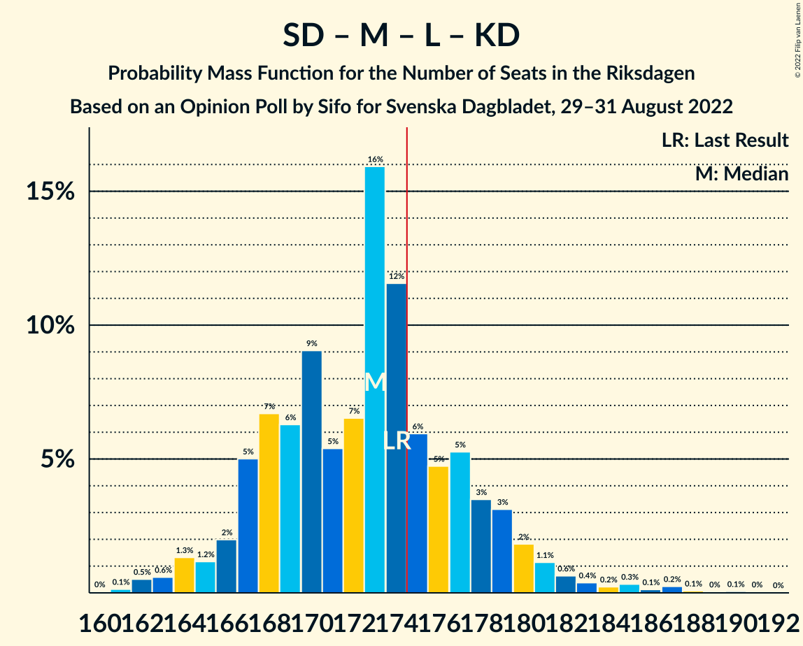
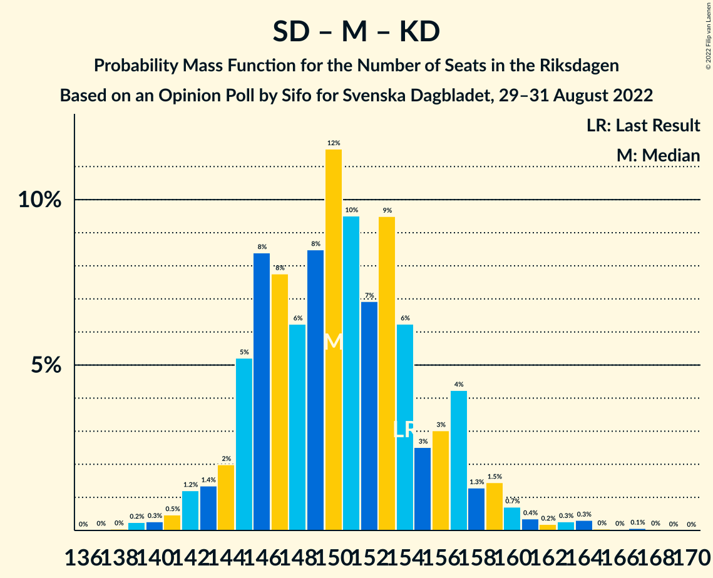
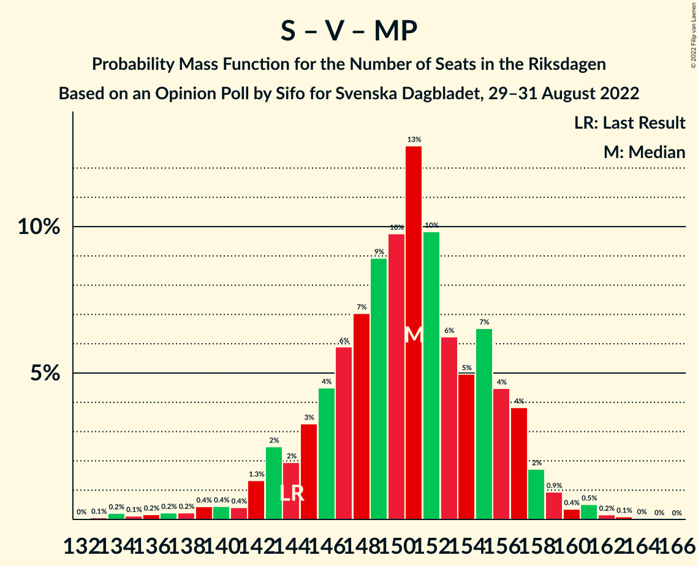
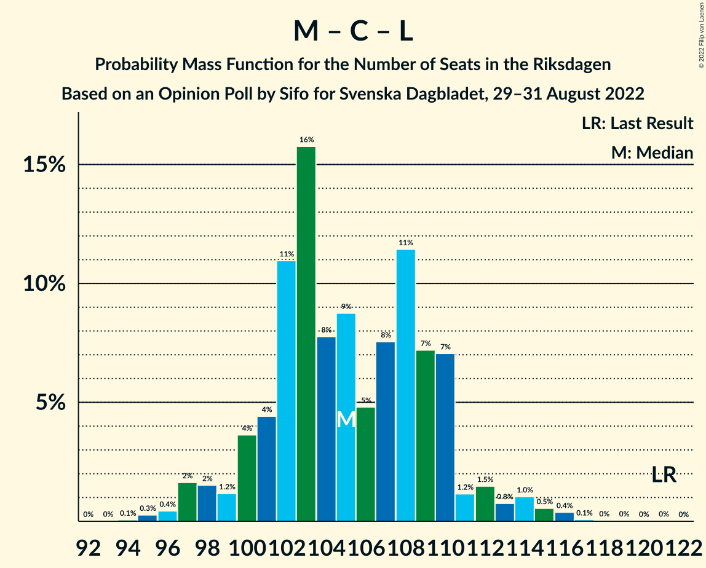
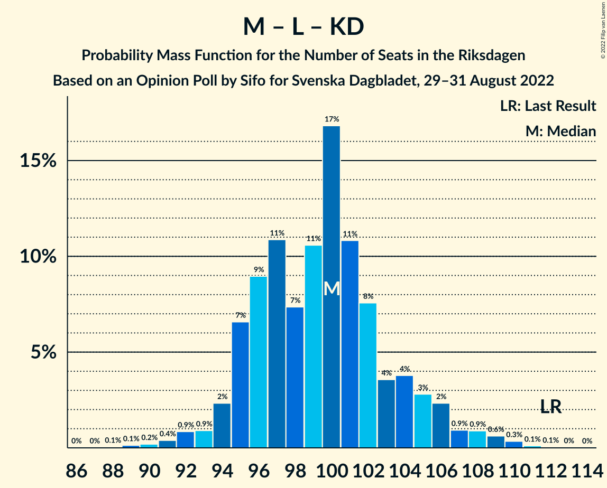

# Opinion Poll by Sifo for Svenska Dagbladet, 29–31 August 2022

<a href="#voting-intentions">Voting Intentions</a> | <a href="#seats">Seats</a> | <a href="#coalitions">Coalitions</a> | <a href="#technical-information">Technical Information</a>

## Voting Intentions

### Confidence Intervals

| Party | Last Result | Poll Result | 80% Confidence Interval | 90% Confidence Interval | 95% Confidence Interval | 99% Confidence Interval |
|:-----:|:-----------:|:-----------:|:-----------------------:|:-----------------------:|:-----------------------:|:-----------------------:|
| Sveriges socialdemokratiska arbetareparti | 28.3% | 29.7% | 28.4–31.0% |28.0–31.4% |27.7–31.7% |27.1–32.4% |
| Sverigedemokraterna | 17.5% | 20.6% | 19.4–21.8% |19.1–22.1% |18.9–22.4% |18.3–23.0% |
| Moderata samlingspartiet | 19.8% | 16.1% | 15.0–17.2% |14.8–17.5% |14.5–17.8% |14.0–18.3% |
| Vänsterpartiet | 8.0% | 8.0% | 7.2–8.8% |7.0–9.1% |6.9–9.3% |6.5–9.7% |
| Centerpartiet | 8.6% | 7.3% | 6.6–8.1% |6.4–8.3% |6.2–8.5% |5.9–8.9% |
| Liberalerna | 5.5% | 6.2% | 5.5–7.0% |5.4–7.2% |5.2–7.4% |4.9–7.7% |
| Kristdemokraterna | 6.3% | 5.7% | 5.1–6.4% |4.9–6.6% |4.8–6.8% |4.5–7.2% |
| Miljöpartiet de gröna | 4.4% | 4.8% | 4.2–5.5% |4.1–5.7% |3.9–5.8% |3.7–6.2% |

*Note:* The poll result column reflects the actual value used in the calculations. Published results may vary slightly, and in addition be rounded to fewer digits.

## Seats

### Confidence Intervals

| Party | Last Result | Median | 80% Confidence Interval | 90% Confidence Interval | 95% Confidence Interval | 99% Confidence Interval |
|:-----:|:-----------:|:------:|:-----------------------:|:-----------------------:|:-----------------------:|:-----------------------:|
| <a href="#sveriges-socialdemokratiska-arbetareparti">Sveriges socialdemokratiska arbetareparti</a> | 100 | 105 | 100–110 |100–112 |98–113 |96–116 |
| <a href="#sverigedemokraterna">Sverigedemokraterna</a> | 62 | 73 | 69–77 |68–79 |67–79 |65–82 |
| <a href="#moderata-samlingspartiet">Moderata samlingspartiet</a> | 70 | 57 | 53–61 |52–62 |51–63 |50–65 |
| <a href="#vänsterpartiet">Vänsterpartiet</a> | 28 | 28 | 26–31 |25–32 |24–33 |23–34 |
| <a href="#centerpartiet">Centerpartiet</a> | 31 | 26 | 23–29 |23–30 |22–30 |21–31 |
| <a href="#liberalerna">Liberalerna</a> | 20 | 23 | 20–24 |19–25 |19–26 |17–28 |
| <a href="#kristdemokraterna">Kristdemokraterna</a> | 22 | 20 | 18–22 |18–24 |17–24 |16–26 |
| <a href="#miljöpartiet-de-gröna">Miljöpartiet de gröna</a> | 16 | 17 | 15–19 |14–20 |0–21 |0–22 |

### Sveriges socialdemokratiska arbetareparti

*For a full overview of the results for this party, see the [Sveriges socialdemokratiska arbetareparti](party-sverigessocialdemokratiskaarbetareparti.html) page.*

| Number of Seats | Probability | Accumulated | Special Marks |
|:---------------:|:-----------:|:-----------:|:-------------:|
| 93 | 0% | 100% |  |
| 94 | 0.1% | 99.9% |  |
| 95 | 0.2% | 99.9% |  |
| 96 | 0.4% | 99.6% |  |
| 97 | 0.9% | 99.2% |  |
| 98 | 1.3% | 98% |  |
| 99 | 2% | 97% |  |
| 100 | 6% | 95% | Last Result |
| 101 | 4% | 89% |  |
| 102 | 7% | 85% |  |
| 103 | 11% | 78% |  |
| 104 | 8% | 67% |  |
| 105 | 11% | 60% | Median |
| 106 | 10% | 49% |  |
| 107 | 12% | 39% |  |
| 108 | 8% | 27% |  |
| 109 | 6% | 19% |  |
| 110 | 5% | 13% |  |
| 111 | 2% | 8% |  |
| 112 | 2% | 6% |  |
| 113 | 2% | 4% |  |
| 114 | 0.7% | 2% |  |
| 115 | 0.4% | 1.0% |  |
| 116 | 0.2% | 0.6% |  |
| 117 | 0.2% | 0.4% |  |
| 118 | 0% | 0.2% |  |
| 119 | 0.1% | 0.1% |  |
| 120 | 0% | 0% |  |

### Sverigedemokraterna

*For a full overview of the results for this party, see the [Sverigedemokraterna](party-sverigedemokraterna.html) page.*

| Number of Seats | Probability | Accumulated | Special Marks |
|:---------------:|:-----------:|:-----------:|:-------------:|
| 62 | 0% | 100% | Last Result |
| 63 | 0.1% | 100% |  |
| 64 | 0.2% | 99.9% |  |
| 65 | 0.6% | 99.7% |  |
| 66 | 0.8% | 99.2% |  |
| 67 | 2% | 98% |  |
| 68 | 4% | 97% |  |
| 69 | 6% | 93% |  |
| 70 | 7% | 87% |  |
| 71 | 12% | 79% |  |
| 72 | 9% | 68% |  |
| 73 | 13% | 59% | Median |
| 74 | 15% | 46% |  |
| 75 | 6% | 31% |  |
| 76 | 12% | 25% |  |
| 77 | 5% | 14% |  |
| 78 | 4% | 9% |  |
| 79 | 3% | 5% |  |
| 80 | 1.0% | 2% |  |
| 81 | 0.7% | 1.4% |  |
| 82 | 0.3% | 0.6% |  |
| 83 | 0.2% | 0.3% |  |
| 84 | 0.1% | 0.2% |  |
| 85 | 0% | 0% |  |

### Moderata samlingspartiet

*For a full overview of the results for this party, see the [Moderata samlingspartiet](party-moderatasamlingspartiet.html) page.*

| Number of Seats | Probability | Accumulated | Special Marks |
|:---------------:|:-----------:|:-----------:|:-------------:|
| 48 | 0.1% | 100% |  |
| 49 | 0.2% | 99.9% |  |
| 50 | 0.7% | 99.7% |  |
| 51 | 2% | 99.0% |  |
| 52 | 3% | 97% |  |
| 53 | 6% | 94% |  |
| 54 | 9% | 88% |  |
| 55 | 8% | 79% |  |
| 56 | 13% | 71% |  |
| 57 | 17% | 58% | Median |
| 58 | 12% | 41% |  |
| 59 | 7% | 29% |  |
| 60 | 8% | 21% |  |
| 61 | 6% | 13% |  |
| 62 | 3% | 7% |  |
| 63 | 1.2% | 3% |  |
| 64 | 1.2% | 2% |  |
| 65 | 0.5% | 0.9% |  |
| 66 | 0.2% | 0.4% |  |
| 67 | 0.1% | 0.2% |  |
| 68 | 0% | 0% |  |
| 69 | 0% | 0% |  |
| 70 | 0% | 0% | Last Result |

### Vänsterpartiet

*For a full overview of the results for this party, see the [Vänsterpartiet](party-vänsterpartiet.html) page.*

| Number of Seats | Probability | Accumulated | Special Marks |
|:---------------:|:-----------:|:-----------:|:-------------:|
| 22 | 0.1% | 100% |  |
| 23 | 0.6% | 99.8% |  |
| 24 | 2% | 99.3% |  |
| 25 | 6% | 97% |  |
| 26 | 9% | 92% |  |
| 27 | 16% | 83% |  |
| 28 | 19% | 67% | Last Result, Median |
| 29 | 18% | 48% |  |
| 30 | 14% | 30% |  |
| 31 | 8% | 16% |  |
| 32 | 4% | 8% |  |
| 33 | 2% | 3% |  |
| 34 | 1.0% | 1.3% |  |
| 35 | 0.3% | 0.4% |  |
| 36 | 0.1% | 0.1% |  |
| 37 | 0% | 0% |  |

### Centerpartiet

*For a full overview of the results for this party, see the [Centerpartiet](party-centerpartiet.html) page.*

| Number of Seats | Probability | Accumulated | Special Marks |
|:---------------:|:-----------:|:-----------:|:-------------:|
| 20 | 0.3% | 100% |  |
| 21 | 0.8% | 99.7% |  |
| 22 | 3% | 98.9% |  |
| 23 | 7% | 96% |  |
| 24 | 14% | 89% |  |
| 25 | 17% | 74% |  |
| 26 | 20% | 57% | Median |
| 27 | 15% | 37% |  |
| 28 | 12% | 22% |  |
| 29 | 5% | 11% |  |
| 30 | 4% | 6% |  |
| 31 | 1.2% | 2% | Last Result |
| 32 | 0.3% | 0.5% |  |
| 33 | 0.1% | 0.2% |  |
| 34 | 0% | 0% |  |

### Liberalerna

*For a full overview of the results for this party, see the [Liberalerna](party-liberalerna.html) page.*

| Number of Seats | Probability | Accumulated | Special Marks |
|:---------------:|:-----------:|:-----------:|:-------------:|
| 16 | 0.1% | 100% |  |
| 17 | 0.5% | 99.9% |  |
| 18 | 1.1% | 99.3% |  |
| 19 | 4% | 98% |  |
| 20 | 21% | 94% | Last Result |
| 21 | 13% | 73% |  |
| 22 | 9% | 60% |  |
| 23 | 23% | 51% | Median |
| 24 | 21% | 29% |  |
| 25 | 4% | 8% |  |
| 26 | 2% | 4% |  |
| 27 | 2% | 2% |  |
| 28 | 0.5% | 0.5% |  |
| 29 | 0% | 0.1% |  |
| 30 | 0% | 0% |  |

### Kristdemokraterna

*For a full overview of the results for this party, see the [Kristdemokraterna](party-kristdemokraterna.html) page.*

| Number of Seats | Probability | Accumulated | Special Marks |
|:---------------:|:-----------:|:-----------:|:-------------:|
| 15 | 0.2% | 100% |  |
| 16 | 0.7% | 99.8% |  |
| 17 | 3% | 99.1% |  |
| 18 | 9% | 96% |  |
| 19 | 24% | 87% |  |
| 20 | 26% | 63% | Median |
| 21 | 19% | 37% |  |
| 22 | 9% | 19% | Last Result |
| 23 | 4% | 9% |  |
| 24 | 3% | 5% |  |
| 25 | 1.5% | 2% |  |
| 26 | 0.5% | 0.6% |  |
| 27 | 0.1% | 0.1% |  |
| 28 | 0% | 0% |  |

### Miljöpartiet de gröna

*For a full overview of the results for this party, see the [Miljöpartiet de gröna](party-miljöpartietdegröna.html) page.*

| Number of Seats | Probability | Accumulated | Special Marks |
|:---------------:|:-----------:|:-----------:|:-------------:|
| 0 | 3% | 100% |  |
| 1 | 0% | 97% |  |
| 2 | 0% | 97% |  |
| 3 | 0% | 97% |  |
| 4 | 0% | 97% |  |
| 5 | 0% | 97% |  |
| 6 | 0% | 97% |  |
| 7 | 0% | 97% |  |
| 8 | 0% | 97% |  |
| 9 | 0% | 97% |  |
| 10 | 0% | 97% |  |
| 11 | 0% | 97% |  |
| 12 | 0% | 97% |  |
| 13 | 0% | 97% |  |
| 14 | 2% | 97% |  |
| 15 | 15% | 95% |  |
| 16 | 19% | 80% | Last Result |
| 17 | 21% | 61% | Median |
| 18 | 19% | 40% |  |
| 19 | 14% | 21% |  |
| 20 | 5% | 7% |  |
| 21 | 2% | 3% |  |
| 22 | 0.6% | 0.8% |  |
| 23 | 0.1% | 0.2% |  |
| 24 | 0% | 0% |  |

## Coalitions

### Confidence Intervals

| Coalition | Last Result | Median | Majority? | 80% Confidence Interval | 90% Confidence Interval | 95% Confidence Interval | 99% Confidence Interval |
|:---------:|:-----------:|:------:|:---------:|:-----------------------:|:-----------------------:|:-----------------------:|:-----------------------:|
| Sveriges socialdemokratiska arbetareparti – Vänsterpartiet – Centerpartiet – Liberalerna – Miljöpartiet de gröna | 195 | 199 | 100% | 193–204 | 192–205 | 190–206 | 185–209 |
| Sveriges socialdemokratiska arbetareparti – Moderata samlingspartiet – Centerpartiet | 201 | 188 | 100% | 183–194 | 182–195 | 181–197 | 178–202 |
| Sveriges socialdemokratiska arbetareparti – Vänsterpartiet – Centerpartiet – Miljöpartiet de gröna | 175 | 176 | 72% | 171–182 | 169–183 | 168–185 | 163–187 |
| Sverigedemokraterna – Moderata samlingspartiet – Liberalerna – Kristdemokraterna | 174 | 173 | 28% | 167–178 | 166–180 | 164–181 | 162–186 |
| Sveriges socialdemokratiska arbetareparti – Centerpartiet – Liberalerna – Miljöpartiet de gröna | 167 | 170 | 13% | 165–175 | 163–176 | 161–178 | 156–181 |
| Sveriges socialdemokratiska arbetareparti – Moderata samlingspartiet | 170 | 163 | 0.8% | 157–167 | 155–169 | 155–171 | 152–176 |
| Sverigedemokraterna – Moderata samlingspartiet – Kristdemokraterna | 154 | 150 | 0% | 145–156 | 144–157 | 143–159 | 140–164 |
| Sveriges socialdemokratiska arbetareparti – Vänsterpartiet – Miljöpartiet de gröna | 144 | 151 | 0% | 145–156 | 143–157 | 142–158 | 136–161 |
| Sveriges socialdemokratiska arbetareparti – Centerpartiet – Miljöpartiet de gröna | 147 | 148 | 0% | 143–153 | 141–154 | 139–156 | 133–158 |
| Sveriges socialdemokratiska arbetareparti – Vänsterpartiet | 128 | 133 | 0% | 129–139 | 127–140 | 126–142 | 124–146 |
| Sverigedemokraterna – Moderata samlingspartiet | 132 | 130 | 0% | 125–136 | 124–137 | 123–139 | 120–142 |
| Moderata samlingspartiet – Centerpartiet – Liberalerna – Kristdemokraterna | 143 | 125 | 0% | 121–130 | 120–132 | 118–133 | 116–137 |
| Sveriges socialdemokratiska arbetareparti – Miljöpartiet de gröna | 116 | 122 | 0% | 117–127 | 115–128 | 113–130 | 107–132 |
| Moderata samlingspartiet – Centerpartiet – Liberalerna | 121 | 105 | 0% | 101–110 | 99–111 | 98–113 | 96–116 |
| Sveriges socialdemokratiska arbetareparti | 100 | 105 | 0% | 100–110 | 100–112 | 98–113 | 96–116 |
| Moderata samlingspartiet – Centerpartiet – Kristdemokraterna | 123 | 103 | 0% | 98–108 | 98–109 | 96–111 | 94–114 |
| Moderata samlingspartiet – Liberalerna – Kristdemokraterna | 112 | 100 | 0% | 95–104 | 95–106 | 93–107 | 91–110 |
| Moderata samlingspartiet – Centerpartiet | 101 | 83 | 0% | 79–87 | 77–89 | 77–90 | 74–93 |
| Moderata samlingspartiet – Kristdemokraterna | 92 | 77 | 0% | 73–81 | 72–83 | 72–84 | 70–86 |

### Sveriges socialdemokratiska arbetareparti – Vänsterpartiet – Centerpartiet – Liberalerna – Miljöpartiet de gröna

| Number of Seats | Probability | Accumulated | Special Marks |
|:---------------:|:-----------:|:-----------:|:-------------:|
| 181 | 0% | 100% |  |
| 182 | 0.1% | 99.9% |  |
| 183 | 0% | 99.9% |  |
| 184 | 0% | 99.8% |  |
| 185 | 0.3% | 99.8% |  |
| 186 | 0.3% | 99.5% |  |
| 187 | 0.2% | 99.2% |  |
| 188 | 0.4% | 99.0% |  |
| 189 | 0.7% | 98.7% |  |
| 190 | 1.5% | 98% |  |
| 191 | 1.3% | 97% |  |
| 192 | 4% | 95% |  |
| 193 | 3% | 91% |  |
| 194 | 3% | 88% |  |
| 195 | 6% | 85% | Last Result |
| 196 | 9% | 79% |  |
| 197 | 7% | 70% |  |
| 198 | 10% | 63% |  |
| 199 | 12% | 53% | Median |
| 200 | 8% | 42% |  |
| 201 | 6% | 33% |  |
| 202 | 8% | 27% |  |
| 203 | 8% | 19% |  |
| 204 | 5% | 11% |  |
| 205 | 2% | 6% |  |
| 206 | 1.4% | 4% |  |
| 207 | 1.2% | 2% |  |
| 208 | 0.5% | 1.1% |  |
| 209 | 0.3% | 0.6% |  |
| 210 | 0.2% | 0.3% |  |
| 211 | 0% | 0.1% |  |
| 212 | 0% | 0.1% |  |
| 213 | 0% | 0% |  |

### Sveriges socialdemokratiska arbetareparti – Moderata samlingspartiet – Centerpartiet

| Number of Seats | Probability | Accumulated | Special Marks |
|:---------------:|:-----------:|:-----------:|:-------------:|
| 175 | 0.1% | 100% | Majority |
| 176 | 0.1% | 99.9% |  |
| 177 | 0.1% | 99.8% |  |
| 178 | 0.5% | 99.7% |  |
| 179 | 0.7% | 99.1% |  |
| 180 | 0.8% | 98% |  |
| 181 | 2% | 98% |  |
| 182 | 3% | 95% |  |
| 183 | 5% | 93% |  |
| 184 | 6% | 88% |  |
| 185 | 5% | 82% |  |
| 186 | 10% | 77% |  |
| 187 | 11% | 67% |  |
| 188 | 10% | 56% | Median |
| 189 | 8% | 46% |  |
| 190 | 10% | 37% |  |
| 191 | 7% | 28% |  |
| 192 | 6% | 21% |  |
| 193 | 5% | 16% |  |
| 194 | 4% | 11% |  |
| 195 | 2% | 7% |  |
| 196 | 1.5% | 5% |  |
| 197 | 1.1% | 3% |  |
| 198 | 0.4% | 2% |  |
| 199 | 0.4% | 2% |  |
| 200 | 0.3% | 2% |  |
| 201 | 0.5% | 1.2% | Last Result |
| 202 | 0.3% | 0.7% |  |
| 203 | 0.2% | 0.4% |  |
| 204 | 0.1% | 0.3% |  |
| 205 | 0% | 0.2% |  |
| 206 | 0% | 0.2% |  |
| 207 | 0.1% | 0.1% |  |
| 208 | 0% | 0% |  |

### Sveriges socialdemokratiska arbetareparti – Vänsterpartiet – Centerpartiet – Miljöpartiet de gröna

| Number of Seats | Probability | Accumulated | Special Marks |
|:---------------:|:-----------:|:-----------:|:-------------:|
| 158 | 0% | 100% |  |
| 159 | 0.1% | 99.9% |  |
| 160 | 0% | 99.9% |  |
| 161 | 0.1% | 99.8% |  |
| 162 | 0.2% | 99.8% |  |
| 163 | 0.1% | 99.5% |  |
| 164 | 0.3% | 99.4% |  |
| 165 | 0.2% | 99.1% |  |
| 166 | 0.4% | 98.8% |  |
| 167 | 0.6% | 98% |  |
| 168 | 1.1% | 98% |  |
| 169 | 2% | 97% |  |
| 170 | 3% | 95% |  |
| 171 | 3% | 92% |  |
| 172 | 5% | 88% |  |
| 173 | 5% | 83% |  |
| 174 | 6% | 78% |  |
| 175 | 12% | 72% | Last Result, Majority |
| 176 | 16% | 61% | Median |
| 177 | 7% | 45% |  |
| 178 | 5% | 38% |  |
| 179 | 9% | 33% |  |
| 180 | 6% | 24% |  |
| 181 | 7% | 18% |  |
| 182 | 5% | 11% |  |
| 183 | 2% | 6% |  |
| 184 | 1.2% | 4% |  |
| 185 | 1.3% | 3% |  |
| 186 | 0.6% | 1.3% |  |
| 187 | 0.5% | 0.7% |  |
| 188 | 0.1% | 0.2% |  |
| 189 | 0% | 0.1% |  |
| 190 | 0% | 0% |  |

### Sverigedemokraterna – Moderata samlingspartiet – Liberalerna – Kristdemokraterna

| Number of Seats | Probability | Accumulated | Special Marks |
|:---------------:|:-----------:|:-----------:|:-------------:|
| 160 | 0% | 100% |  |
| 161 | 0.1% | 99.9% |  |
| 162 | 0.5% | 99.8% |  |
| 163 | 0.6% | 99.3% |  |
| 164 | 1.3% | 98.7% |  |
| 165 | 1.2% | 97% |  |
| 166 | 2% | 96% |  |
| 167 | 5% | 94% |  |
| 168 | 7% | 89% |  |
| 169 | 6% | 82% |  |
| 170 | 9% | 76% |  |
| 171 | 5% | 67% |  |
| 172 | 7% | 62% |  |
| 173 | 16% | 55% | Median |
| 174 | 12% | 39% | Last Result |
| 175 | 6% | 28% | Majority |
| 176 | 5% | 22% |  |
| 177 | 5% | 17% |  |
| 178 | 3% | 12% |  |
| 179 | 3% | 8% |  |
| 180 | 2% | 5% |  |
| 181 | 1.1% | 3% |  |
| 182 | 0.6% | 2% |  |
| 183 | 0.4% | 2% |  |
| 184 | 0.2% | 1.2% |  |
| 185 | 0.3% | 0.9% |  |
| 186 | 0.1% | 0.6% |  |
| 187 | 0.2% | 0.5% |  |
| 188 | 0.1% | 0.2% |  |
| 189 | 0% | 0.2% |  |
| 190 | 0.1% | 0.1% |  |
| 191 | 0% | 0.1% |  |
| 192 | 0% | 0% |  |

### Sveriges socialdemokratiska arbetareparti – Centerpartiet – Liberalerna – Miljöpartiet de gröna

| Number of Seats | Probability | Accumulated | Special Marks |
|:---------------:|:-----------:|:-----------:|:-------------:|
| 153 | 0.1% | 100% |  |
| 154 | 0.2% | 99.9% |  |
| 155 | 0.2% | 99.7% |  |
| 156 | 0.1% | 99.6% |  |
| 157 | 0.2% | 99.5% |  |
| 158 | 0.3% | 99.3% |  |
| 159 | 0.5% | 99.0% |  |
| 160 | 0.4% | 98% |  |
| 161 | 2% | 98% |  |
| 162 | 1.0% | 96% |  |
| 163 | 2% | 95% |  |
| 164 | 3% | 94% |  |
| 165 | 5% | 91% |  |
| 166 | 5% | 86% |  |
| 167 | 5% | 81% | Last Result |
| 168 | 6% | 76% |  |
| 169 | 15% | 70% |  |
| 170 | 7% | 55% |  |
| 171 | 8% | 48% | Median |
| 172 | 7% | 39% |  |
| 173 | 10% | 33% |  |
| 174 | 10% | 23% |  |
| 175 | 4% | 13% | Majority |
| 176 | 5% | 9% |  |
| 177 | 1.3% | 5% |  |
| 178 | 1.3% | 3% |  |
| 179 | 0.8% | 2% |  |
| 180 | 0.5% | 1.1% |  |
| 181 | 0.3% | 0.6% |  |
| 182 | 0.2% | 0.3% |  |
| 183 | 0% | 0.1% |  |
| 184 | 0% | 0% |  |

### Sveriges socialdemokratiska arbetareparti – Moderata samlingspartiet

| Number of Seats | Probability | Accumulated | Special Marks |
|:---------------:|:-----------:|:-----------:|:-------------:|
| 149 | 0% | 100% |  |
| 150 | 0.1% | 99.9% |  |
| 151 | 0.1% | 99.8% |  |
| 152 | 0.3% | 99.6% |  |
| 153 | 0.5% | 99.4% |  |
| 154 | 1.3% | 98.8% |  |
| 155 | 3% | 98% |  |
| 156 | 2% | 95% |  |
| 157 | 5% | 93% |  |
| 158 | 5% | 88% |  |
| 159 | 7% | 83% |  |
| 160 | 8% | 76% |  |
| 161 | 8% | 68% |  |
| 162 | 9% | 60% | Median |
| 163 | 14% | 51% |  |
| 164 | 9% | 37% |  |
| 165 | 7% | 28% |  |
| 166 | 6% | 22% |  |
| 167 | 6% | 16% |  |
| 168 | 3% | 10% |  |
| 169 | 2% | 6% |  |
| 170 | 1.2% | 5% | Last Result |
| 171 | 0.8% | 3% |  |
| 172 | 0.9% | 2% |  |
| 173 | 0.3% | 2% |  |
| 174 | 0.5% | 1.2% |  |
| 175 | 0.2% | 0.8% | Majority |
| 176 | 0.1% | 0.5% |  |
| 177 | 0.2% | 0.4% |  |
| 178 | 0.1% | 0.2% |  |
| 179 | 0% | 0.1% |  |
| 180 | 0% | 0.1% |  |
| 181 | 0% | 0.1% |  |
| 182 | 0% | 0% |  |

### Sverigedemokraterna – Moderata samlingspartiet – Kristdemokraterna

| Number of Seats | Probability | Accumulated | Special Marks |
|:---------------:|:-----------:|:-----------:|:-------------:|
| 137 | 0% | 100% |  |
| 138 | 0% | 99.9% |  |
| 139 | 0.2% | 99.9% |  |
| 140 | 0.3% | 99.7% |  |
| 141 | 0.5% | 99.4% |  |
| 142 | 1.2% | 98.9% |  |
| 143 | 1.4% | 98% |  |
| 144 | 2% | 96% |  |
| 145 | 5% | 94% |  |
| 146 | 8% | 89% |  |
| 147 | 8% | 81% |  |
| 148 | 6% | 73% |  |
| 149 | 8% | 67% |  |
| 150 | 12% | 58% | Median |
| 151 | 10% | 47% |  |
| 152 | 7% | 37% |  |
| 153 | 9% | 30% |  |
| 154 | 6% | 21% | Last Result |
| 155 | 3% | 15% |  |
| 156 | 3% | 12% |  |
| 157 | 4% | 9% |  |
| 158 | 1.3% | 5% |  |
| 159 | 1.5% | 3% |  |
| 160 | 0.7% | 2% |  |
| 161 | 0.4% | 1.3% |  |
| 162 | 0.2% | 1.0% |  |
| 163 | 0.3% | 0.8% |  |
| 164 | 0.3% | 0.5% |  |
| 165 | 0% | 0.2% |  |
| 166 | 0% | 0.2% |  |
| 167 | 0.1% | 0.1% |  |
| 168 | 0% | 0.1% |  |
| 169 | 0% | 0% |  |

### Sveriges socialdemokratiska arbetareparti – Vänsterpartiet – Miljöpartiet de gröna

| Number of Seats | Probability | Accumulated | Special Marks |
|:---------------:|:-----------:|:-----------:|:-------------:|
| 132 | 0% | 100% |  |
| 133 | 0.1% | 99.9% |  |
| 134 | 0.2% | 99.9% |  |
| 135 | 0.1% | 99.6% |  |
| 136 | 0.2% | 99.5% |  |
| 137 | 0.2% | 99.4% |  |
| 138 | 0.2% | 99.1% |  |
| 139 | 0.4% | 98.9% |  |
| 140 | 0.4% | 98% |  |
| 141 | 0.4% | 98% |  |
| 142 | 1.3% | 98% |  |
| 143 | 2% | 96% |  |
| 144 | 2% | 94% | Last Result |
| 145 | 3% | 92% |  |
| 146 | 4% | 89% |  |
| 147 | 6% | 84% |  |
| 148 | 7% | 78% |  |
| 149 | 9% | 71% |  |
| 150 | 10% | 62% | Median |
| 151 | 13% | 52% |  |
| 152 | 10% | 40% |  |
| 153 | 6% | 30% |  |
| 154 | 5% | 24% |  |
| 155 | 7% | 19% |  |
| 156 | 4% | 12% |  |
| 157 | 4% | 8% |  |
| 158 | 2% | 4% |  |
| 159 | 0.9% | 2% |  |
| 160 | 0.4% | 1.2% |  |
| 161 | 0.5% | 0.8% |  |
| 162 | 0.2% | 0.3% |  |
| 163 | 0.1% | 0.2% |  |
| 164 | 0% | 0.1% |  |
| 165 | 0% | 0% |  |

### Sveriges socialdemokratiska arbetareparti – Centerpartiet – Miljöpartiet de gröna

| Number of Seats | Probability | Accumulated | Special Marks |
|:---------------:|:-----------:|:-----------:|:-------------:|
| 129 | 0.1% | 100% |  |
| 130 | 0.1% | 99.9% |  |
| 131 | 0% | 99.8% |  |
| 132 | 0.1% | 99.8% |  |
| 133 | 0.2% | 99.7% |  |
| 134 | 0.1% | 99.5% |  |
| 135 | 0.1% | 99.4% |  |
| 136 | 0.4% | 99.2% |  |
| 137 | 0.4% | 98.8% |  |
| 138 | 0.4% | 98% |  |
| 139 | 0.9% | 98% |  |
| 140 | 1.4% | 97% |  |
| 141 | 3% | 96% |  |
| 142 | 2% | 93% |  |
| 143 | 3% | 91% |  |
| 144 | 5% | 88% |  |
| 145 | 10% | 83% |  |
| 146 | 10% | 73% |  |
| 147 | 6% | 63% | Last Result |
| 148 | 10% | 57% | Median |
| 149 | 10% | 47% |  |
| 150 | 10% | 36% |  |
| 151 | 6% | 26% |  |
| 152 | 7% | 20% |  |
| 153 | 4% | 14% |  |
| 154 | 5% | 10% |  |
| 155 | 1.3% | 4% |  |
| 156 | 1.1% | 3% |  |
| 157 | 1.0% | 2% |  |
| 158 | 0.7% | 1.1% |  |
| 159 | 0.3% | 0.4% |  |
| 160 | 0.1% | 0.2% |  |
| 161 | 0.1% | 0.1% |  |
| 162 | 0% | 0% |  |

### Sveriges socialdemokratiska arbetareparti – Vänsterpartiet

| Number of Seats | Probability | Accumulated | Special Marks |
|:---------------:|:-----------:|:-----------:|:-------------:|
| 121 | 0% | 100% |  |
| 122 | 0.1% | 99.9% |  |
| 123 | 0.2% | 99.8% |  |
| 124 | 0.4% | 99.6% |  |
| 125 | 1.0% | 99.2% |  |
| 126 | 0.9% | 98% |  |
| 127 | 2% | 97% |  |
| 128 | 3% | 95% | Last Result |
| 129 | 5% | 92% |  |
| 130 | 9% | 87% |  |
| 131 | 9% | 78% |  |
| 132 | 6% | 70% |  |
| 133 | 14% | 63% | Median |
| 134 | 7% | 50% |  |
| 135 | 6% | 43% |  |
| 136 | 12% | 37% |  |
| 137 | 5% | 25% |  |
| 138 | 8% | 20% |  |
| 139 | 5% | 12% |  |
| 140 | 3% | 7% |  |
| 141 | 1.0% | 4% |  |
| 142 | 1.2% | 3% |  |
| 143 | 0.7% | 2% |  |
| 144 | 0.4% | 1.2% |  |
| 145 | 0.2% | 0.8% |  |
| 146 | 0.3% | 0.6% |  |
| 147 | 0.1% | 0.3% |  |
| 148 | 0.1% | 0.2% |  |
| 149 | 0.1% | 0.1% |  |
| 150 | 0% | 0% |  |

### Sverigedemokraterna – Moderata samlingspartiet

| Number of Seats | Probability | Accumulated | Special Marks |
|:---------------:|:-----------:|:-----------:|:-------------:|
| 118 | 0.1% | 100% |  |
| 119 | 0.2% | 99.9% |  |
| 120 | 0.3% | 99.7% |  |
| 121 | 0.5% | 99.4% |  |
| 122 | 1.1% | 99.0% |  |
| 123 | 1.5% | 98% |  |
| 124 | 4% | 96% |  |
| 125 | 4% | 93% |  |
| 126 | 7% | 89% |  |
| 127 | 8% | 81% |  |
| 128 | 7% | 73% |  |
| 129 | 10% | 66% |  |
| 130 | 12% | 56% | Median |
| 131 | 8% | 44% |  |
| 132 | 8% | 37% | Last Result |
| 133 | 9% | 28% |  |
| 134 | 6% | 20% |  |
| 135 | 3% | 13% |  |
| 136 | 3% | 10% |  |
| 137 | 2% | 7% |  |
| 138 | 1.3% | 4% |  |
| 139 | 2% | 3% |  |
| 140 | 0.4% | 1.4% |  |
| 141 | 0.3% | 1.0% |  |
| 142 | 0.2% | 0.7% |  |
| 143 | 0.2% | 0.5% |  |
| 144 | 0.1% | 0.2% |  |
| 145 | 0.1% | 0.1% |  |
| 146 | 0% | 0.1% |  |
| 147 | 0% | 0% |  |

### Moderata samlingspartiet – Centerpartiet – Liberalerna – Kristdemokraterna

| Number of Seats | Probability | Accumulated | Special Marks |
|:---------------:|:-----------:|:-----------:|:-------------:|
| 113 | 0% | 100% |  |
| 114 | 0.1% | 99.9% |  |
| 115 | 0.2% | 99.8% |  |
| 116 | 0.5% | 99.6% |  |
| 117 | 0.5% | 99.1% |  |
| 118 | 2% | 98.6% |  |
| 119 | 1.4% | 97% |  |
| 120 | 4% | 95% |  |
| 121 | 9% | 92% |  |
| 122 | 6% | 83% |  |
| 123 | 10% | 77% |  |
| 124 | 11% | 66% |  |
| 125 | 7% | 55% |  |
| 126 | 12% | 48% | Median |
| 127 | 8% | 36% |  |
| 128 | 8% | 28% |  |
| 129 | 6% | 20% |  |
| 130 | 5% | 15% |  |
| 131 | 3% | 9% |  |
| 132 | 3% | 7% |  |
| 133 | 1.3% | 4% |  |
| 134 | 0.9% | 2% |  |
| 135 | 0.6% | 2% |  |
| 136 | 0.3% | 0.9% |  |
| 137 | 0.3% | 0.6% |  |
| 138 | 0.1% | 0.3% |  |
| 139 | 0.1% | 0.1% |  |
| 140 | 0% | 0.1% |  |
| 141 | 0% | 0.1% |  |
| 142 | 0% | 0% |  |
| 143 | 0% | 0% | Last Result |

### Sveriges socialdemokratiska arbetareparti – Miljöpartiet de gröna

| Number of Seats | Probability | Accumulated | Special Marks |
|:---------------:|:-----------:|:-----------:|:-------------:|
| 102 | 0% | 100% |  |
| 103 | 0% | 99.9% |  |
| 104 | 0.1% | 99.9% |  |
| 105 | 0.2% | 99.8% |  |
| 106 | 0.1% | 99.6% |  |
| 107 | 0.2% | 99.5% |  |
| 108 | 0.2% | 99.3% |  |
| 109 | 0.2% | 99.0% |  |
| 110 | 0.3% | 98.8% |  |
| 111 | 0.3% | 98% |  |
| 112 | 0.7% | 98% |  |
| 113 | 0.6% | 98% |  |
| 114 | 0.9% | 97% |  |
| 115 | 2% | 96% |  |
| 116 | 3% | 94% | Last Result |
| 117 | 5% | 91% |  |
| 118 | 4% | 86% |  |
| 119 | 6% | 82% |  |
| 120 | 8% | 76% |  |
| 121 | 7% | 68% |  |
| 122 | 13% | 61% | Median |
| 123 | 15% | 48% |  |
| 124 | 6% | 33% |  |
| 125 | 7% | 27% |  |
| 126 | 6% | 20% |  |
| 127 | 6% | 14% |  |
| 128 | 4% | 8% |  |
| 129 | 2% | 5% |  |
| 130 | 1.4% | 3% |  |
| 131 | 0.4% | 1.4% |  |
| 132 | 0.5% | 0.9% |  |
| 133 | 0.3% | 0.5% |  |
| 134 | 0.1% | 0.2% |  |
| 135 | 0.1% | 0.1% |  |
| 136 | 0% | 0% |  |

### Moderata samlingspartiet – Centerpartiet – Liberalerna

| Number of Seats | Probability | Accumulated | Special Marks |
|:---------------:|:-----------:|:-----------:|:-------------:|
| 94 | 0.1% | 100% |  |
| 95 | 0.3% | 99.9% |  |
| 96 | 0.4% | 99.6% |  |
| 97 | 2% | 99.2% |  |
| 98 | 2% | 98% |  |
| 99 | 1.2% | 96% |  |
| 100 | 4% | 95% |  |
| 101 | 4% | 91% |  |
| 102 | 11% | 87% |  |
| 103 | 16% | 76% |  |
| 104 | 8% | 60% |  |
| 105 | 9% | 52% |  |
| 106 | 5% | 44% | Median |
| 107 | 8% | 39% |  |
| 108 | 11% | 31% |  |
| 109 | 7% | 20% |  |
| 110 | 7% | 13% |  |
| 111 | 1.2% | 6% |  |
| 112 | 1.5% | 4% |  |
| 113 | 0.8% | 3% |  |
| 114 | 1.0% | 2% |  |
| 115 | 0.5% | 1.1% |  |
| 116 | 0.4% | 0.6% |  |
| 117 | 0.1% | 0.2% |  |
| 118 | 0% | 0.1% |  |
| 119 | 0% | 0.1% |  |
| 120 | 0% | 0% |  |
| 121 | 0% | 0% | Last Result |

### Sveriges socialdemokratiska arbetareparti

| Number of Seats | Probability | Accumulated | Special Marks |
|:---------------:|:-----------:|:-----------:|:-------------:|
| 93 | 0% | 100% |  |
| 94 | 0.1% | 99.9% |  |
| 95 | 0.2% | 99.9% |  |
| 96 | 0.4% | 99.6% |  |
| 97 | 0.9% | 99.2% |  |
| 98 | 1.3% | 98% |  |
| 99 | 2% | 97% |  |
| 100 | 6% | 95% | Last Result |
| 101 | 4% | 89% |  |
| 102 | 7% | 85% |  |
| 103 | 11% | 78% |  |
| 104 | 8% | 67% |  |
| 105 | 11% | 60% | Median |
| 106 | 10% | 49% |  |
| 107 | 12% | 39% |  |
| 108 | 8% | 27% |  |
| 109 | 6% | 19% |  |
| 110 | 5% | 13% |  |
| 111 | 2% | 8% |  |
| 112 | 2% | 6% |  |
| 113 | 2% | 4% |  |
| 114 | 0.7% | 2% |  |
| 115 | 0.4% | 1.0% |  |
| 116 | 0.2% | 0.6% |  |
| 117 | 0.2% | 0.4% |  |
| 118 | 0% | 0.2% |  |
| 119 | 0.1% | 0.1% |  |
| 120 | 0% | 0% |  |

### Moderata samlingspartiet – Centerpartiet – Kristdemokraterna

| Number of Seats | Probability | Accumulated | Special Marks |
|:---------------:|:-----------:|:-----------:|:-------------:|
| 92 | 0.1% | 100% |  |
| 93 | 0.3% | 99.9% |  |
| 94 | 0.3% | 99.6% |  |
| 95 | 0.4% | 99.3% |  |
| 96 | 1.5% | 98.9% |  |
| 97 | 2% | 97% |  |
| 98 | 8% | 96% |  |
| 99 | 5% | 88% |  |
| 100 | 5% | 83% |  |
| 101 | 12% | 78% |  |
| 102 | 8% | 66% |  |
| 103 | 17% | 58% | Median |
| 104 | 7% | 40% |  |
| 105 | 6% | 33% |  |
| 106 | 8% | 27% |  |
| 107 | 5% | 19% |  |
| 108 | 6% | 14% |  |
| 109 | 3% | 8% |  |
| 110 | 1.3% | 5% |  |
| 111 | 1.5% | 3% |  |
| 112 | 0.8% | 2% |  |
| 113 | 0.5% | 1.1% |  |
| 114 | 0.2% | 0.6% |  |
| 115 | 0.1% | 0.3% |  |
| 116 | 0.2% | 0.2% |  |
| 117 | 0% | 0.1% |  |
| 118 | 0% | 0% |  |
| 119 | 0% | 0% |  |
| 120 | 0% | 0% |  |
| 121 | 0% | 0% |  |
| 122 | 0% | 0% |  |
| 123 | 0% | 0% | Last Result |

### Moderata samlingspartiet – Liberalerna – Kristdemokraterna

| Number of Seats | Probability | Accumulated | Special Marks |
|:---------------:|:-----------:|:-----------:|:-------------:|
| 87 | 0% | 100% |  |
| 88 | 0.1% | 99.9% |  |
| 89 | 0.1% | 99.9% |  |
| 90 | 0.2% | 99.8% |  |
| 91 | 0.4% | 99.6% |  |
| 92 | 0.9% | 99.2% |  |
| 93 | 0.9% | 98% |  |
| 94 | 2% | 97% |  |
| 95 | 7% | 95% |  |
| 96 | 9% | 88% |  |
| 97 | 11% | 80% |  |
| 98 | 7% | 69% |  |
| 99 | 11% | 61% |  |
| 100 | 17% | 51% | Median |
| 101 | 11% | 34% |  |
| 102 | 8% | 23% |  |
| 103 | 4% | 16% |  |
| 104 | 4% | 12% |  |
| 105 | 3% | 8% |  |
| 106 | 2% | 5% |  |
| 107 | 0.9% | 3% |  |
| 108 | 0.9% | 2% |  |
| 109 | 0.6% | 1.2% |  |
| 110 | 0.3% | 0.6% |  |
| 111 | 0.1% | 0.2% |  |
| 112 | 0.1% | 0.1% | Last Result |
| 113 | 0% | 0.1% |  |
| 114 | 0% | 0% |  |

### Moderata samlingspartiet – Centerpartiet

| Number of Seats | Probability | Accumulated | Special Marks |
|:---------------:|:-----------:|:-----------:|:-------------:|
| 72 | 0% | 100% |  |
| 73 | 0.2% | 99.9% |  |
| 74 | 0.3% | 99.8% |  |
| 75 | 0.7% | 99.5% |  |
| 76 | 1.2% | 98.8% |  |
| 77 | 3% | 98% |  |
| 78 | 4% | 95% |  |
| 79 | 7% | 91% |  |
| 80 | 11% | 84% |  |
| 81 | 8% | 73% |  |
| 82 | 9% | 65% |  |
| 83 | 14% | 57% | Median |
| 84 | 10% | 43% |  |
| 85 | 11% | 33% |  |
| 86 | 7% | 22% |  |
| 87 | 5% | 15% |  |
| 88 | 3% | 10% |  |
| 89 | 4% | 7% |  |
| 90 | 1.2% | 3% |  |
| 91 | 0.8% | 2% |  |
| 92 | 0.5% | 1.0% |  |
| 93 | 0.3% | 0.6% |  |
| 94 | 0.1% | 0.3% |  |
| 95 | 0.1% | 0.2% |  |
| 96 | 0.1% | 0.1% |  |
| 97 | 0% | 0% |  |
| 98 | 0% | 0% |  |
| 99 | 0% | 0% |  |
| 100 | 0% | 0% |  |
| 101 | 0% | 0% | Last Result |

### Moderata samlingspartiet – Kristdemokraterna

| Number of Seats | Probability | Accumulated | Special Marks |
|:---------------:|:-----------:|:-----------:|:-------------:|
| 67 | 0.1% | 100% |  |
| 68 | 0.1% | 99.9% |  |
| 69 | 0.2% | 99.7% |  |
| 70 | 0.6% | 99.5% |  |
| 71 | 0.9% | 98.9% |  |
| 72 | 4% | 98% |  |
| 73 | 5% | 94% |  |
| 74 | 6% | 89% |  |
| 75 | 12% | 83% |  |
| 76 | 13% | 71% |  |
| 77 | 18% | 58% | Median |
| 78 | 11% | 40% |  |
| 79 | 6% | 29% |  |
| 80 | 7% | 23% |  |
| 81 | 7% | 16% |  |
| 82 | 4% | 10% |  |
| 83 | 2% | 6% |  |
| 84 | 2% | 4% |  |
| 85 | 1.5% | 2% |  |
| 86 | 0.6% | 1.0% |  |
| 87 | 0.2% | 0.5% |  |
| 88 | 0.2% | 0.3% |  |
| 89 | 0% | 0.1% |  |
| 90 | 0% | 0% |  |
| 91 | 0% | 0% |  |
| 92 | 0% | 0% | Last Result |

## Technical Information

### Opinion Poll

+ **Polling firm:** Sifo
+ **Commissioner(s):** Svenska Dagbladet
+ **Fieldwork period:** 29–31 August 2022

### Calculations

+ **Sample size:** 1967
+ **Simulations done:** 1,048,576
+ **Error estimate:** 0.81%

