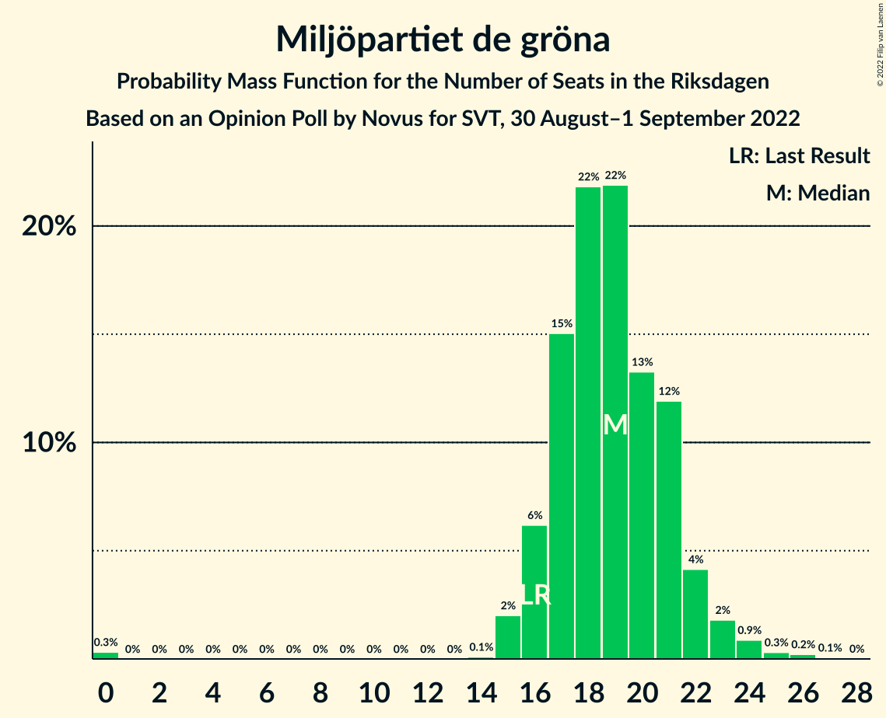
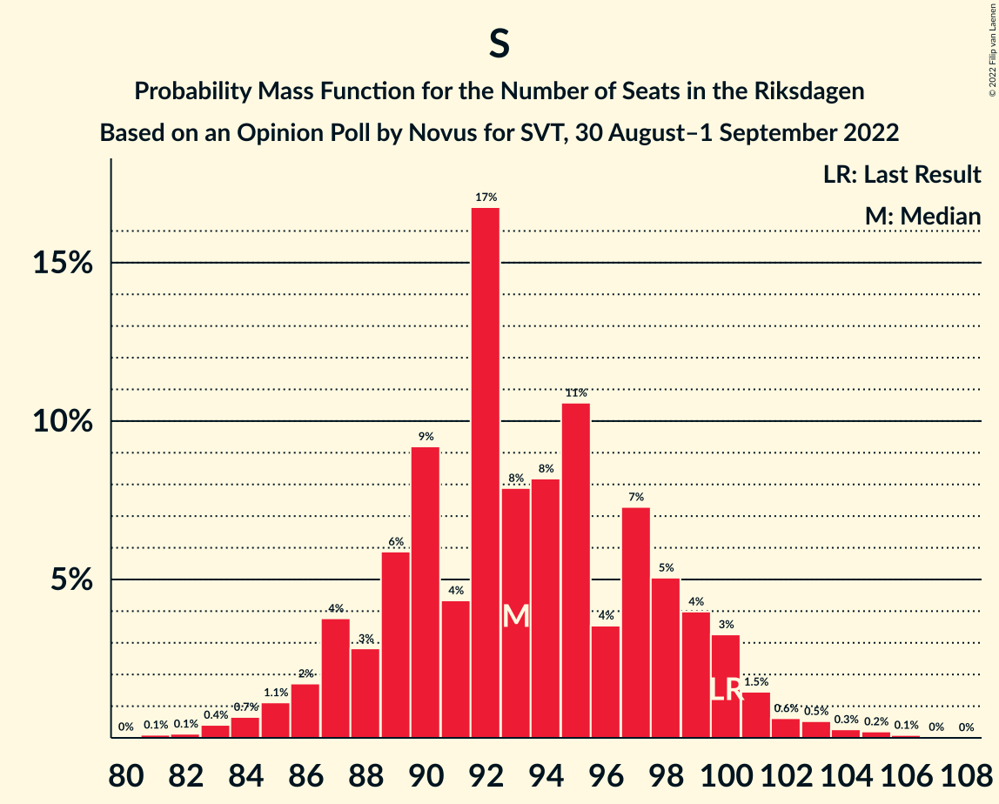

# Opinion Poll by Novus for SVT, 30 August–1 September 2022

<a href="#voting-intentions">Voting Intentions</a> | <a href="#seats">Seats</a> | <a href="#coalitions">Coalitions</a> | <a href="#technical-information">Technical Information</a>

## Voting Intentions

### Confidence Intervals

| Party | Last Result | Poll Result | 80% Confidence Interval | 90% Confidence Interval | 95% Confidence Interval | 99% Confidence Interval |
|:-----:|:-----------:|:-----------:|:-----------------------:|:-----------------------:|:-----------------------:|:-----------------------:|
| Sveriges socialdemokratiska arbetareparti | 28.3% | 26.6% | 25.2–28.1% |24.8–28.5% |24.4–28.9% |23.7–29.6% |
| Sverigedemokraterna | 17.5% | 21.0% | 19.7–22.4% |19.3–22.8% |19.0–23.1% |18.4–23.8% |
| Moderata samlingspartiet | 19.8% | 18.8% | 17.5–20.1% |17.2–20.5% |16.9–20.9% |16.3–21.5% |
| Vänsterpartiet | 8.0% | 8.5% | 7.6–9.5% |7.4–9.7% |7.2–10.0% |6.8–10.5% |
| Kristdemokraterna | 6.3% | 7.1% | 6.3–8.1% |6.1–8.3% |5.9–8.6% |5.6–9.0% |
| Centerpartiet | 8.6% | 6.7% | 6.0–7.6% |5.7–7.9% |5.6–8.1% |5.2–8.6% |
| Miljöpartiet de gröna | 4.4% | 5.4% | 4.7–6.2% |4.5–6.5% |4.4–6.7% |4.1–7.1% |
| Liberalerna | 5.5% | 5.1% | 4.5–5.9% |4.3–6.2% |4.1–6.4% |3.8–6.8% |

*Note:* The poll result column reflects the actual value used in the calculations. Published results may vary slightly, and in addition be rounded to fewer digits.

## Seats

### Confidence Intervals

| Party | Last Result | Median | 80% Confidence Interval | 90% Confidence Interval | 95% Confidence Interval | 99% Confidence Interval |
|:-----:|:-----------:|:------:|:-----------------------:|:-----------------------:|:-----------------------:|:-----------------------:|
| <a href="#sveriges-socialdemokratiska-arbetareparti">Sveriges socialdemokratiska arbetareparti</a> | 100 | 93 | 88–99 |87–100 |86–101 |83–104 |
| <a href="#sverigedemokraterna">Sverigedemokraterna</a> | 62 | 73 | 69–79 |68–80 |66–81 |64–84 |
| <a href="#moderata-samlingspartiet">Moderata samlingspartiet</a> | 70 | 66 | 62–71 |61–72 |60–73 |57–75 |
| <a href="#vänsterpartiet">Vänsterpartiet</a> | 28 | 30 | 27–33 |26–34 |25–35 |24–37 |
| <a href="#kristdemokraterna">Kristdemokraterna</a> | 22 | 25 | 22–28 |22–29 |21–30 |20–31 |
| <a href="#centerpartiet">Centerpartiet</a> | 31 | 24 | 21–27 |20–28 |19–28 |18–30 |
| <a href="#miljöpartiet-de-gröna">Miljöpartiet de gröna</a> | 16 | 19 | 17–21 |16–22 |16–23 |15–25 |
| <a href="#liberalerna">Liberalerna</a> | 20 | 18 | 16–21 |16–21 |15–22 |0–23 |

### Sveriges socialdemokratiska arbetareparti

*For a full overview of the results for this party, see the [Sveriges socialdemokratiska arbetareparti](party-sverigessocialdemokratiskaarbetareparti.html) page.*

| Number of Seats | Probability | Accumulated | Special Marks |
|:---------------:|:-----------:|:-----------:|:-------------:|
| 80 | 0% | 100% |  |
| 81 | 0.1% | 99.9% |  |
| 82 | 0.1% | 99.8% |  |
| 83 | 0.4% | 99.7% |  |
| 84 | 0.7% | 99.3% |  |
| 85 | 1.1% | 98.6% |  |
| 86 | 2% | 98% |  |
| 87 | 4% | 96% |  |
| 88 | 3% | 92% |  |
| 89 | 6% | 89% |  |
| 90 | 9% | 83% |  |
| 91 | 4% | 74% |  |
| 92 | 17% | 70% |  |
| 93 | 8% | 53% | Median |
| 94 | 8% | 45% |  |
| 95 | 11% | 37% |  |
| 96 | 4% | 26% |  |
| 97 | 7% | 23% |  |
| 98 | 5% | 16% |  |
| 99 | 4% | 10% |  |
| 100 | 3% | 7% | Last Result |
| 101 | 1.5% | 3% |  |
| 102 | 0.6% | 2% |  |
| 103 | 0.5% | 1.2% |  |
| 104 | 0.3% | 0.6% |  |
| 105 | 0.2% | 0.4% |  |
| 106 | 0.1% | 0.2% |  |
| 107 | 0% | 0.1% |  |
| 108 | 0% | 0% |  |

### Sverigedemokraterna

*For a full overview of the results for this party, see the [Sverigedemokraterna](party-sverigedemokraterna.html) page.*

| Number of Seats | Probability | Accumulated | Special Marks |
|:---------------:|:-----------:|:-----------:|:-------------:|
| 62 | 0% | 100% | Last Result |
| 63 | 0.1% | 100% |  |
| 64 | 0.4% | 99.9% |  |
| 65 | 0.6% | 99.5% |  |
| 66 | 1.5% | 98.9% |  |
| 67 | 1.4% | 97% |  |
| 68 | 4% | 96% |  |
| 69 | 3% | 92% |  |
| 70 | 7% | 90% |  |
| 71 | 7% | 83% |  |
| 72 | 14% | 76% |  |
| 73 | 13% | 62% | Median |
| 74 | 10% | 49% |  |
| 75 | 7% | 39% |  |
| 76 | 7% | 32% |  |
| 77 | 7% | 26% |  |
| 78 | 6% | 19% |  |
| 79 | 6% | 13% |  |
| 80 | 3% | 7% |  |
| 81 | 2% | 4% |  |
| 82 | 0.5% | 2% |  |
| 83 | 0.4% | 1.0% |  |
| 84 | 0.3% | 0.5% |  |
| 85 | 0.1% | 0.3% |  |
| 86 | 0.1% | 0.1% |  |
| 87 | 0% | 0% |  |

### Moderata samlingspartiet

*For a full overview of the results for this party, see the [Moderata samlingspartiet](party-moderatasamlingspartiet.html) page.*

| Number of Seats | Probability | Accumulated | Special Marks |
|:---------------:|:-----------:|:-----------:|:-------------:|
| 55 | 0.1% | 100% |  |
| 56 | 0.1% | 99.9% |  |
| 57 | 0.3% | 99.8% |  |
| 58 | 0.7% | 99.5% |  |
| 59 | 1.2% | 98.8% |  |
| 60 | 2% | 98% |  |
| 61 | 4% | 95% |  |
| 62 | 6% | 91% |  |
| 63 | 10% | 85% |  |
| 64 | 8% | 75% |  |
| 65 | 10% | 68% |  |
| 66 | 12% | 58% | Median |
| 67 | 13% | 46% |  |
| 68 | 8% | 33% |  |
| 69 | 7% | 25% |  |
| 70 | 7% | 18% | Last Result |
| 71 | 3% | 11% |  |
| 72 | 3% | 8% |  |
| 73 | 2% | 4% |  |
| 74 | 1.1% | 2% |  |
| 75 | 0.5% | 1.0% |  |
| 76 | 0.2% | 0.5% |  |
| 77 | 0.1% | 0.2% |  |
| 78 | 0.1% | 0.1% |  |
| 79 | 0% | 0% |  |

### Vänsterpartiet

*For a full overview of the results for this party, see the [Vänsterpartiet](party-vänsterpartiet.html) page.*

| Number of Seats | Probability | Accumulated | Special Marks |
|:---------------:|:-----------:|:-----------:|:-------------:|
| 22 | 0.1% | 100% |  |
| 23 | 0.3% | 99.9% |  |
| 24 | 1.1% | 99.6% |  |
| 25 | 3% | 98.5% |  |
| 26 | 4% | 96% |  |
| 27 | 10% | 91% |  |
| 28 | 14% | 81% | Last Result |
| 29 | 14% | 67% |  |
| 30 | 16% | 53% | Median |
| 31 | 12% | 37% |  |
| 32 | 10% | 24% |  |
| 33 | 7% | 15% |  |
| 34 | 4% | 8% |  |
| 35 | 2% | 4% |  |
| 36 | 0.9% | 1.5% |  |
| 37 | 0.3% | 0.5% |  |
| 38 | 0.2% | 0.2% |  |
| 39 | 0% | 0.1% |  |
| 40 | 0% | 0% |  |

### Kristdemokraterna

*For a full overview of the results for this party, see the [Kristdemokraterna](party-kristdemokraterna.html) page.*

| Number of Seats | Probability | Accumulated | Special Marks |
|:---------------:|:-----------:|:-----------:|:-------------:|
| 18 | 0.1% | 100% |  |
| 19 | 0.3% | 99.9% |  |
| 20 | 1.3% | 99.6% |  |
| 21 | 3% | 98% |  |
| 22 | 7% | 95% | Last Result |
| 23 | 13% | 88% |  |
| 24 | 18% | 75% |  |
| 25 | 18% | 57% | Median |
| 26 | 14% | 39% |  |
| 27 | 11% | 25% |  |
| 28 | 7% | 14% |  |
| 29 | 5% | 7% |  |
| 30 | 2% | 3% |  |
| 31 | 0.7% | 1.2% |  |
| 32 | 0.3% | 0.4% |  |
| 33 | 0.1% | 0.2% |  |
| 34 | 0% | 0% |  |

### Centerpartiet

*For a full overview of the results for this party, see the [Centerpartiet](party-centerpartiet.html) page.*

| Number of Seats | Probability | Accumulated | Special Marks |
|:---------------:|:-----------:|:-----------:|:-------------:|
| 17 | 0.1% | 100% |  |
| 18 | 0.4% | 99.9% |  |
| 19 | 3% | 99.5% |  |
| 20 | 4% | 96% |  |
| 21 | 7% | 92% |  |
| 22 | 14% | 85% |  |
| 23 | 18% | 71% |  |
| 24 | 16% | 53% | Median |
| 25 | 9% | 37% |  |
| 26 | 18% | 28% |  |
| 27 | 5% | 11% |  |
| 28 | 3% | 6% |  |
| 29 | 1.4% | 2% |  |
| 30 | 0.6% | 1.0% |  |
| 31 | 0.3% | 0.3% | Last Result |
| 32 | 0.1% | 0.1% |  |
| 33 | 0% | 0% |  |

### Miljöpartiet de gröna

*For a full overview of the results for this party, see the [Miljöpartiet de gröna](party-miljöpartietdegröna.html) page.*

| Number of Seats | Probability | Accumulated | Special Marks |
|:---------------:|:-----------:|:-----------:|:-------------:|
| 0 | 0.3% | 100% |  |
| 1 | 0% | 99.7% |  |
| 2 | 0% | 99.7% |  |
| 3 | 0% | 99.7% |  |
| 4 | 0% | 99.7% |  |
| 5 | 0% | 99.7% |  |
| 6 | 0% | 99.7% |  |
| 7 | 0% | 99.7% |  |
| 8 | 0% | 99.7% |  |
| 9 | 0% | 99.7% |  |
| 10 | 0% | 99.7% |  |
| 11 | 0% | 99.7% |  |
| 12 | 0% | 99.7% |  |
| 13 | 0% | 99.7% |  |
| 14 | 0.1% | 99.7% |  |
| 15 | 2% | 99.6% |  |
| 16 | 6% | 98% | Last Result |
| 17 | 15% | 91% |  |
| 18 | 22% | 76% |  |
| 19 | 22% | 55% | Median |
| 20 | 13% | 33% |  |
| 21 | 12% | 19% |  |
| 22 | 4% | 7% |  |
| 23 | 2% | 3% |  |
| 24 | 0.9% | 1.5% |  |
| 25 | 0.3% | 0.6% |  |
| 26 | 0.2% | 0.3% |  |
| 27 | 0.1% | 0.1% |  |
| 28 | 0% | 0% |  |

### Liberalerna

*For a full overview of the results for this party, see the [Liberalerna](party-liberalerna.html) page.*

| Number of Seats | Probability | Accumulated | Special Marks |
|:---------------:|:-----------:|:-----------:|:-------------:|
| 0 | 1.0% | 100% |  |
| 1 | 0% | 99.0% |  |
| 2 | 0% | 99.0% |  |
| 3 | 0% | 99.0% |  |
| 4 | 0% | 99.0% |  |
| 5 | 0% | 99.0% |  |
| 6 | 0% | 99.0% |  |
| 7 | 0% | 99.0% |  |
| 8 | 0% | 99.0% |  |
| 9 | 0% | 99.0% |  |
| 10 | 0% | 99.0% |  |
| 11 | 0% | 99.0% |  |
| 12 | 0% | 99.0% |  |
| 13 | 0% | 99.0% |  |
| 14 | 0.8% | 99.0% |  |
| 15 | 3% | 98% |  |
| 16 | 7% | 95% |  |
| 17 | 17% | 88% |  |
| 18 | 22% | 71% | Median |
| 19 | 22% | 49% |  |
| 20 | 16% | 27% | Last Result |
| 21 | 8% | 11% |  |
| 22 | 2% | 3% |  |
| 23 | 0.7% | 1.1% |  |
| 24 | 0.3% | 0.5% |  |
| 25 | 0.1% | 0.2% |  |
| 26 | 0% | 0% |  |

## Coalitions

### Confidence Intervals

| Coalition | Last Result | Median | Majority? | 80% Confidence Interval | 90% Confidence Interval | 95% Confidence Interval | 99% Confidence Interval |
|:---------:|:-----------:|:------:|:---------:|:-----------------------:|:-----------------------:|:-----------------------:|:-----------------------:|
| Sveriges socialdemokratiska arbetareparti – Vänsterpartiet – Centerpartiet – Miljöpartiet de gröna – Liberalerna | 195 | 184 | 98% | 178–190 | 177–192 | 175–192 | 172–196 |
| Sveriges socialdemokratiska arbetareparti – Moderata samlingspartiet – Centerpartiet | 201 | 183 | 97% | 177–190 | 176–191 | 174–192 | 171–196 |
| Sverigedemokraterna – Moderata samlingspartiet – Kristdemokraterna – Liberalerna | 174 | 184 | 97% | 177–189 | 177–190 | 174–192 | 170–194 |
| Sveriges socialdemokratiska arbetareparti – Vänsterpartiet – Centerpartiet – Miljöpartiet de gröna | 175 | 165 | 3% | 160–172 | 159–172 | 157–175 | 155–179 |
| Sverigedemokraterna – Moderata samlingspartiet – Kristdemokraterna | 154 | 165 | 2% | 159–171 | 157–172 | 157–174 | 153–177 |
| Sveriges socialdemokratiska arbetareparti – Moderata samlingspartiet | 170 | 159 | 0.1% | 153–165 | 152–167 | 150–169 | 148–172 |
| Sveriges socialdemokratiska arbetareparti – Centerpartiet – Miljöpartiet de gröna – Liberalerna | 167 | 155 | 0% | 148–160 | 146–162 | 145–163 | 141–166 |
| Sveriges socialdemokratiska arbetareparti – Vänsterpartiet – Miljöpartiet de gröna | 144 | 141 | 0% | 137–148 | 135–149 | 134–150 | 131–155 |
| Sverigedemokraterna – Moderata samlingspartiet | 132 | 140 | 0% | 135–145 | 133–147 | 132–148 | 129–151 |
| Sveriges socialdemokratiska arbetareparti – Centerpartiet – Miljöpartiet de gröna | 147 | 136 | 0% | 130–141 | 129–143 | 128–144 | 125–148 |
| Moderata samlingspartiet – Kristdemokraterna – Centerpartiet – Liberalerna | 143 | 133 | 0% | 128–139 | 126–141 | 124–142 | 120–145 |
| Sveriges socialdemokratiska arbetareparti – Vänsterpartiet | 128 | 123 | 0% | 118–129 | 116–131 | 115–131 | 112–134 |
| Moderata samlingspartiet – Kristdemokraterna – Centerpartiet | 123 | 115 | 0% | 109–121 | 108–122 | 106–124 | 103–126 |
| Sveriges socialdemokratiska arbetareparti – Miljöpartiet de gröna | 116 | 112 | 0% | 107–117 | 105–119 | 104–120 | 101–124 |
| Moderata samlingspartiet – Kristdemokraterna – Liberalerna | 112 | 109 | 0% | 104–115 | 102–117 | 101–118 | 96–120 |
| Moderata samlingspartiet – Centerpartiet – Liberalerna | 121 | 109 | 0% | 104–113 | 102–115 | 100–116 | 93–118 |
| Sveriges socialdemokratiska arbetareparti | 100 | 93 | 0% | 88–99 | 87–100 | 86–101 | 83–104 |
| Moderata samlingspartiet – Kristdemokraterna | 92 | 91 | 0% | 86–97 | 85–98 | 84–100 | 81–102 |
| Moderata samlingspartiet – Centerpartiet | 101 | 90 | 0% | 85–95 | 84–97 | 82–98 | 80–101 |

### Sveriges socialdemokratiska arbetareparti – Vänsterpartiet – Centerpartiet – Miljöpartiet de gröna – Liberalerna

| Number of Seats | Probability | Accumulated | Special Marks |
|:---------------:|:-----------:|:-----------:|:-------------:|
| 167 | 0% | 100% |  |
| 168 | 0% | 99.9% |  |
| 169 | 0% | 99.9% |  |
| 170 | 0.1% | 99.8% |  |
| 171 | 0.2% | 99.7% |  |
| 172 | 0.3% | 99.6% |  |
| 173 | 0.5% | 99.3% |  |
| 174 | 0.7% | 98.7% |  |
| 175 | 1.1% | 98% | Majority |
| 176 | 1.4% | 97% |  |
| 177 | 3% | 95% |  |
| 178 | 4% | 92% |  |
| 179 | 3% | 88% |  |
| 180 | 9% | 84% |  |
| 181 | 6% | 76% |  |
| 182 | 5% | 69% |  |
| 183 | 9% | 64% |  |
| 184 | 10% | 55% | Median |
| 185 | 9% | 45% |  |
| 186 | 8% | 36% |  |
| 187 | 6% | 28% |  |
| 188 | 5% | 22% |  |
| 189 | 5% | 17% |  |
| 190 | 4% | 12% |  |
| 191 | 2% | 8% |  |
| 192 | 3% | 5% |  |
| 193 | 0.8% | 2% |  |
| 194 | 0.6% | 2% |  |
| 195 | 0.5% | 1.0% | Last Result |
| 196 | 0.3% | 0.5% |  |
| 197 | 0.1% | 0.2% |  |
| 198 | 0% | 0.1% |  |
| 199 | 0% | 0.1% |  |
| 200 | 0% | 0% |  |

### Sveriges socialdemokratiska arbetareparti – Moderata samlingspartiet – Centerpartiet

| Number of Seats | Probability | Accumulated | Special Marks |
|:---------------:|:-----------:|:-----------:|:-------------:|
| 168 | 0% | 100% |  |
| 169 | 0.1% | 99.9% |  |
| 170 | 0.2% | 99.9% |  |
| 171 | 0.3% | 99.7% |  |
| 172 | 0.3% | 99.4% |  |
| 173 | 1.0% | 99.1% |  |
| 174 | 1.0% | 98% |  |
| 175 | 2% | 97% | Majority |
| 176 | 3% | 96% |  |
| 177 | 3% | 93% |  |
| 178 | 5% | 89% |  |
| 179 | 6% | 85% |  |
| 180 | 7% | 78% |  |
| 181 | 6% | 72% |  |
| 182 | 11% | 66% |  |
| 183 | 7% | 55% | Median |
| 184 | 7% | 48% |  |
| 185 | 12% | 40% |  |
| 186 | 5% | 28% |  |
| 187 | 4% | 23% |  |
| 188 | 5% | 19% |  |
| 189 | 3% | 14% |  |
| 190 | 4% | 10% |  |
| 191 | 2% | 6% |  |
| 192 | 1.1% | 4% |  |
| 193 | 0.8% | 2% |  |
| 194 | 0.6% | 2% |  |
| 195 | 0.4% | 1.0% |  |
| 196 | 0.3% | 0.6% |  |
| 197 | 0.1% | 0.4% |  |
| 198 | 0.1% | 0.2% |  |
| 199 | 0% | 0.1% |  |
| 200 | 0% | 0.1% |  |
| 201 | 0% | 0.1% | Last Result |
| 202 | 0% | 0% |  |

### Sverigedemokraterna – Moderata samlingspartiet – Kristdemokraterna – Liberalerna

| Number of Seats | Probability | Accumulated | Special Marks |
|:---------------:|:-----------:|:-----------:|:-------------:|
| 165 | 0% | 100% |  |
| 166 | 0% | 99.9% |  |
| 167 | 0.1% | 99.9% |  |
| 168 | 0.1% | 99.9% |  |
| 169 | 0.2% | 99.8% |  |
| 170 | 0.2% | 99.6% |  |
| 171 | 0.3% | 99.4% |  |
| 172 | 0.3% | 99.1% |  |
| 173 | 0.6% | 98.8% |  |
| 174 | 0.7% | 98% | Last Result |
| 175 | 1.0% | 97% | Majority |
| 176 | 1.2% | 96% |  |
| 177 | 6% | 95% |  |
| 178 | 2% | 90% |  |
| 179 | 5% | 87% |  |
| 180 | 7% | 83% |  |
| 181 | 6% | 76% |  |
| 182 | 7% | 69% | Median |
| 183 | 12% | 63% |  |
| 184 | 11% | 50% |  |
| 185 | 7% | 39% |  |
| 186 | 8% | 32% |  |
| 187 | 8% | 23% |  |
| 188 | 4% | 15% |  |
| 189 | 4% | 11% |  |
| 190 | 3% | 7% |  |
| 191 | 1.0% | 4% |  |
| 192 | 1.1% | 3% |  |
| 193 | 0.8% | 2% |  |
| 194 | 0.3% | 0.8% |  |
| 195 | 0.2% | 0.5% |  |
| 196 | 0.2% | 0.3% |  |
| 197 | 0% | 0.2% |  |
| 198 | 0% | 0.1% |  |
| 199 | 0% | 0.1% |  |
| 200 | 0% | 0% |  |

### Sveriges socialdemokratiska arbetareparti – Vänsterpartiet – Centerpartiet – Miljöpartiet de gröna

| Number of Seats | Probability | Accumulated | Special Marks |
|:---------------:|:-----------:|:-----------:|:-------------:|
| 150 | 0% | 100% |  |
| 151 | 0% | 99.9% |  |
| 152 | 0% | 99.9% |  |
| 153 | 0.2% | 99.8% |  |
| 154 | 0.2% | 99.7% |  |
| 155 | 0.3% | 99.5% |  |
| 156 | 0.8% | 99.2% |  |
| 157 | 1.1% | 98% |  |
| 158 | 1.0% | 97% |  |
| 159 | 3% | 96% |  |
| 160 | 4% | 93% |  |
| 161 | 4% | 89% |  |
| 162 | 8% | 85% |  |
| 163 | 8% | 77% |  |
| 164 | 7% | 68% |  |
| 165 | 11% | 61% |  |
| 166 | 12% | 50% | Median |
| 167 | 7% | 37% |  |
| 168 | 6% | 31% |  |
| 169 | 7% | 24% |  |
| 170 | 5% | 17% |  |
| 171 | 2% | 13% |  |
| 172 | 6% | 10% |  |
| 173 | 1.2% | 5% |  |
| 174 | 1.0% | 4% |  |
| 175 | 0.7% | 3% | Last Result, Majority |
| 176 | 0.6% | 2% |  |
| 177 | 0.3% | 1.2% |  |
| 178 | 0.3% | 0.9% |  |
| 179 | 0.2% | 0.6% |  |
| 180 | 0.2% | 0.4% |  |
| 181 | 0.1% | 0.2% |  |
| 182 | 0.1% | 0.1% |  |
| 183 | 0% | 0.1% |  |
| 184 | 0% | 0.1% |  |
| 185 | 0% | 0% |  |

### Sverigedemokraterna – Moderata samlingspartiet – Kristdemokraterna

| Number of Seats | Probability | Accumulated | Special Marks |
|:---------------:|:-----------:|:-----------:|:-------------:|
| 150 | 0% | 100% |  |
| 151 | 0% | 99.9% |  |
| 152 | 0.1% | 99.9% |  |
| 153 | 0.3% | 99.8% |  |
| 154 | 0.5% | 99.5% | Last Result |
| 155 | 0.6% | 99.0% |  |
| 156 | 0.8% | 98% |  |
| 157 | 3% | 98% |  |
| 158 | 2% | 95% |  |
| 159 | 4% | 92% |  |
| 160 | 5% | 88% |  |
| 161 | 5% | 83% |  |
| 162 | 6% | 78% |  |
| 163 | 8% | 72% |  |
| 164 | 9% | 64% | Median |
| 165 | 10% | 55% |  |
| 166 | 9% | 45% |  |
| 167 | 5% | 36% |  |
| 168 | 6% | 31% |  |
| 169 | 9% | 24% |  |
| 170 | 3% | 16% |  |
| 171 | 4% | 12% |  |
| 172 | 3% | 8% |  |
| 173 | 1.4% | 5% |  |
| 174 | 1.1% | 3% |  |
| 175 | 0.7% | 2% | Majority |
| 176 | 0.5% | 1.3% |  |
| 177 | 0.3% | 0.7% |  |
| 178 | 0.2% | 0.4% |  |
| 179 | 0.1% | 0.3% |  |
| 180 | 0% | 0.2% |  |
| 181 | 0% | 0.1% |  |
| 182 | 0% | 0.1% |  |
| 183 | 0% | 0% |  |

### Sveriges socialdemokratiska arbetareparti – Moderata samlingspartiet

| Number of Seats | Probability | Accumulated | Special Marks |
|:---------------:|:-----------:|:-----------:|:-------------:|
| 144 | 0% | 100% |  |
| 145 | 0% | 99.9% |  |
| 146 | 0.1% | 99.9% |  |
| 147 | 0.2% | 99.8% |  |
| 148 | 0.4% | 99.6% |  |
| 149 | 0.6% | 99.2% |  |
| 150 | 1.4% | 98.6% |  |
| 151 | 2% | 97% |  |
| 152 | 1.4% | 95% |  |
| 153 | 4% | 94% |  |
| 154 | 4% | 90% |  |
| 155 | 5% | 86% |  |
| 156 | 12% | 82% |  |
| 157 | 3% | 70% |  |
| 158 | 7% | 66% |  |
| 159 | 15% | 60% | Median |
| 160 | 7% | 45% |  |
| 161 | 6% | 38% |  |
| 162 | 5% | 32% |  |
| 163 | 6% | 27% |  |
| 164 | 6% | 21% |  |
| 165 | 6% | 15% |  |
| 166 | 2% | 9% |  |
| 167 | 3% | 7% |  |
| 168 | 1.1% | 4% |  |
| 169 | 1.2% | 3% |  |
| 170 | 0.7% | 2% | Last Result |
| 171 | 0.2% | 0.8% |  |
| 172 | 0.2% | 0.6% |  |
| 173 | 0.2% | 0.4% |  |
| 174 | 0.1% | 0.2% |  |
| 175 | 0.1% | 0.1% | Majority |
| 176 | 0% | 0.1% |  |
| 177 | 0% | 0% |  |

### Sveriges socialdemokratiska arbetareparti – Centerpartiet – Miljöpartiet de gröna – Liberalerna

| Number of Seats | Probability | Accumulated | Special Marks |
|:---------------:|:-----------:|:-----------:|:-------------:|
| 136 | 0% | 100% |  |
| 137 | 0% | 99.9% |  |
| 138 | 0% | 99.9% |  |
| 139 | 0.1% | 99.8% |  |
| 140 | 0.1% | 99.8% |  |
| 141 | 0.2% | 99.7% |  |
| 142 | 0.2% | 99.5% |  |
| 143 | 0.3% | 99.2% |  |
| 144 | 0.8% | 98.9% |  |
| 145 | 1.3% | 98% |  |
| 146 | 3% | 97% |  |
| 147 | 3% | 94% |  |
| 148 | 2% | 91% |  |
| 149 | 4% | 89% |  |
| 150 | 8% | 86% |  |
| 151 | 7% | 78% |  |
| 152 | 7% | 71% |  |
| 153 | 7% | 65% |  |
| 154 | 6% | 57% | Median |
| 155 | 11% | 51% |  |
| 156 | 10% | 40% |  |
| 157 | 7% | 30% |  |
| 158 | 7% | 24% |  |
| 159 | 5% | 17% |  |
| 160 | 4% | 12% |  |
| 161 | 3% | 8% |  |
| 162 | 2% | 5% |  |
| 163 | 0.9% | 3% |  |
| 164 | 0.7% | 2% |  |
| 165 | 0.4% | 1.2% |  |
| 166 | 0.4% | 0.8% |  |
| 167 | 0.2% | 0.3% | Last Result |
| 168 | 0.1% | 0.2% |  |
| 169 | 0% | 0.1% |  |
| 170 | 0% | 0% |  |

### Sveriges socialdemokratiska arbetareparti – Vänsterpartiet – Miljöpartiet de gröna

| Number of Seats | Probability | Accumulated | Special Marks |
|:---------------:|:-----------:|:-----------:|:-------------:|
| 125 | 0% | 100% |  |
| 126 | 0% | 99.9% |  |
| 127 | 0% | 99.9% |  |
| 128 | 0.1% | 99.9% |  |
| 129 | 0.1% | 99.8% |  |
| 130 | 0.1% | 99.7% |  |
| 131 | 0.2% | 99.6% |  |
| 132 | 0.4% | 99.4% |  |
| 133 | 0.9% | 98.9% |  |
| 134 | 1.3% | 98% |  |
| 135 | 2% | 97% |  |
| 136 | 2% | 94% |  |
| 137 | 5% | 92% |  |
| 138 | 8% | 87% |  |
| 139 | 14% | 79% |  |
| 140 | 8% | 65% |  |
| 141 | 8% | 58% |  |
| 142 | 5% | 50% | Median |
| 143 | 13% | 45% |  |
| 144 | 7% | 32% | Last Result |
| 145 | 7% | 25% |  |
| 146 | 4% | 18% |  |
| 147 | 4% | 14% |  |
| 148 | 3% | 11% |  |
| 149 | 3% | 7% |  |
| 150 | 2% | 4% |  |
| 151 | 0.8% | 2% |  |
| 152 | 0.5% | 2% |  |
| 153 | 0.3% | 1.1% |  |
| 154 | 0.2% | 0.8% |  |
| 155 | 0.3% | 0.5% |  |
| 156 | 0.1% | 0.2% |  |
| 157 | 0.1% | 0.2% |  |
| 158 | 0.1% | 0.1% |  |
| 159 | 0% | 0.1% |  |
| 160 | 0% | 0% |  |

### Sverigedemokraterna – Moderata samlingspartiet

| Number of Seats | Probability | Accumulated | Special Marks |
|:---------------:|:-----------:|:-----------:|:-------------:|
| 125 | 0% | 100% |  |
| 126 | 0.1% | 99.9% |  |
| 127 | 0.1% | 99.9% |  |
| 128 | 0.3% | 99.8% |  |
| 129 | 0.4% | 99.5% |  |
| 130 | 0.6% | 99.1% |  |
| 131 | 1.0% | 98.5% |  |
| 132 | 0.9% | 98% | Last Result |
| 133 | 3% | 97% |  |
| 134 | 3% | 93% |  |
| 135 | 5% | 90% |  |
| 136 | 7% | 85% |  |
| 137 | 5% | 78% |  |
| 138 | 9% | 73% |  |
| 139 | 5% | 64% | Median |
| 140 | 13% | 59% |  |
| 141 | 11% | 45% |  |
| 142 | 7% | 34% |  |
| 143 | 6% | 27% |  |
| 144 | 5% | 21% |  |
| 145 | 7% | 16% |  |
| 146 | 3% | 9% |  |
| 147 | 2% | 6% |  |
| 148 | 2% | 4% |  |
| 149 | 0.7% | 2% |  |
| 150 | 0.7% | 1.4% |  |
| 151 | 0.3% | 0.7% |  |
| 152 | 0.1% | 0.4% |  |
| 153 | 0.1% | 0.3% |  |
| 154 | 0% | 0.2% |  |
| 155 | 0% | 0.1% |  |
| 156 | 0% | 0.1% |  |
| 157 | 0% | 0.1% |  |
| 158 | 0% | 0% |  |

### Sveriges socialdemokratiska arbetareparti – Centerpartiet – Miljöpartiet de gröna

| Number of Seats | Probability | Accumulated | Special Marks |
|:---------------:|:-----------:|:-----------:|:-------------:|
| 119 | 0% | 100% |  |
| 120 | 0% | 99.9% |  |
| 121 | 0% | 99.9% |  |
| 122 | 0.1% | 99.9% |  |
| 123 | 0.1% | 99.8% |  |
| 124 | 0.2% | 99.7% |  |
| 125 | 0.3% | 99.5% |  |
| 126 | 0.4% | 99.3% |  |
| 127 | 1.1% | 98.9% |  |
| 128 | 2% | 98% |  |
| 129 | 2% | 95% |  |
| 130 | 4% | 93% |  |
| 131 | 4% | 90% |  |
| 132 | 7% | 86% |  |
| 133 | 6% | 78% |  |
| 134 | 10% | 72% |  |
| 135 | 7% | 62% |  |
| 136 | 10% | 55% | Median |
| 137 | 12% | 45% |  |
| 138 | 7% | 33% |  |
| 139 | 5% | 26% |  |
| 140 | 7% | 20% |  |
| 141 | 5% | 13% |  |
| 142 | 2% | 8% |  |
| 143 | 1.4% | 5% |  |
| 144 | 1.4% | 4% |  |
| 145 | 0.8% | 2% |  |
| 146 | 0.6% | 2% |  |
| 147 | 0.4% | 1.1% | Last Result |
| 148 | 0.3% | 0.7% |  |
| 149 | 0.2% | 0.4% |  |
| 150 | 0.1% | 0.2% |  |
| 151 | 0.1% | 0.1% |  |
| 152 | 0% | 0.1% |  |
| 153 | 0% | 0.1% |  |
| 154 | 0% | 0% |  |

### Moderata samlingspartiet – Kristdemokraterna – Centerpartiet – Liberalerna

| Number of Seats | Probability | Accumulated | Special Marks |
|:---------------:|:-----------:|:-----------:|:-------------:|
| 114 | 0% | 100% |  |
| 115 | 0% | 99.9% |  |
| 116 | 0% | 99.9% |  |
| 117 | 0.1% | 99.8% |  |
| 118 | 0% | 99.7% |  |
| 119 | 0.1% | 99.7% |  |
| 120 | 0.2% | 99.6% |  |
| 121 | 0.2% | 99.4% |  |
| 122 | 0.5% | 99.1% |  |
| 123 | 0.4% | 98.6% |  |
| 124 | 1.4% | 98% |  |
| 125 | 1.3% | 97% |  |
| 126 | 1.1% | 96% |  |
| 127 | 4% | 94% |  |
| 128 | 4% | 91% |  |
| 129 | 3% | 86% |  |
| 130 | 9% | 83% |  |
| 131 | 6% | 75% |  |
| 132 | 13% | 69% |  |
| 133 | 10% | 56% | Median |
| 134 | 8% | 46% |  |
| 135 | 6% | 39% |  |
| 136 | 6% | 32% |  |
| 137 | 10% | 26% |  |
| 138 | 3% | 16% |  |
| 139 | 5% | 13% |  |
| 140 | 3% | 8% |  |
| 141 | 2% | 5% |  |
| 142 | 1.0% | 3% |  |
| 143 | 1.0% | 2% | Last Result |
| 144 | 0.4% | 1.0% |  |
| 145 | 0.2% | 0.5% |  |
| 146 | 0.1% | 0.3% |  |
| 147 | 0.1% | 0.1% |  |
| 148 | 0% | 0.1% |  |
| 149 | 0% | 0% |  |

### Sveriges socialdemokratiska arbetareparti – Vänsterpartiet

| Number of Seats | Probability | Accumulated | Special Marks |
|:---------------:|:-----------:|:-----------:|:-------------:|
| 109 | 0% | 100% |  |
| 110 | 0.2% | 99.9% |  |
| 111 | 0.1% | 99.7% |  |
| 112 | 0.2% | 99.7% |  |
| 113 | 1.3% | 99.4% |  |
| 114 | 0.5% | 98% |  |
| 115 | 1.2% | 98% |  |
| 116 | 2% | 96% |  |
| 117 | 0.9% | 95% |  |
| 118 | 9% | 94% |  |
| 119 | 4% | 85% |  |
| 120 | 11% | 81% |  |
| 121 | 10% | 70% |  |
| 122 | 8% | 60% |  |
| 123 | 11% | 52% | Median |
| 124 | 9% | 41% |  |
| 125 | 2% | 32% |  |
| 126 | 7% | 29% |  |
| 127 | 6% | 23% |  |
| 128 | 6% | 17% | Last Result |
| 129 | 4% | 11% |  |
| 130 | 0.8% | 7% |  |
| 131 | 4% | 6% |  |
| 132 | 0.7% | 2% |  |
| 133 | 0.3% | 1.3% |  |
| 134 | 0.5% | 1.0% |  |
| 135 | 0.2% | 0.5% |  |
| 136 | 0.2% | 0.3% |  |
| 137 | 0.1% | 0.2% |  |
| 138 | 0% | 0.1% |  |
| 139 | 0% | 0.1% |  |
| 140 | 0% | 0% |  |

### Moderata samlingspartiet – Kristdemokraterna – Centerpartiet

| Number of Seats | Probability | Accumulated | Special Marks |
|:---------------:|:-----------:|:-----------:|:-------------:|
| 101 | 0% | 100% |  |
| 102 | 0.1% | 99.9% |  |
| 103 | 0.4% | 99.8% |  |
| 104 | 0.3% | 99.4% |  |
| 105 | 0.3% | 99.1% |  |
| 106 | 1.4% | 98.8% |  |
| 107 | 1.2% | 97% |  |
| 108 | 3% | 96% |  |
| 109 | 4% | 93% |  |
| 110 | 3% | 89% |  |
| 111 | 5% | 86% |  |
| 112 | 5% | 80% |  |
| 113 | 14% | 75% |  |
| 114 | 7% | 61% |  |
| 115 | 11% | 54% | Median |
| 116 | 7% | 43% |  |
| 117 | 5% | 36% |  |
| 118 | 9% | 30% |  |
| 119 | 6% | 21% |  |
| 120 | 4% | 15% |  |
| 121 | 3% | 11% |  |
| 122 | 4% | 8% |  |
| 123 | 2% | 5% | Last Result |
| 124 | 1.3% | 3% |  |
| 125 | 0.8% | 2% |  |
| 126 | 0.5% | 0.9% |  |
| 127 | 0.2% | 0.5% |  |
| 128 | 0.1% | 0.3% |  |
| 129 | 0.1% | 0.1% |  |
| 130 | 0% | 0.1% |  |
| 131 | 0% | 0% |  |

### Sveriges socialdemokratiska arbetareparti – Miljöpartiet de gröna

| Number of Seats | Probability | Accumulated | Special Marks |
|:---------------:|:-----------:|:-----------:|:-------------:|
| 94 | 0% | 100% |  |
| 95 | 0% | 99.9% |  |
| 96 | 0% | 99.9% |  |
| 97 | 0% | 99.9% |  |
| 98 | 0% | 99.9% |  |
| 99 | 0.1% | 99.9% |  |
| 100 | 0.1% | 99.8% |  |
| 101 | 0.2% | 99.7% |  |
| 102 | 0.4% | 99.4% |  |
| 103 | 0.6% | 99.0% |  |
| 104 | 1.4% | 98% |  |
| 105 | 2% | 97% |  |
| 106 | 2% | 95% |  |
| 107 | 5% | 93% |  |
| 108 | 7% | 88% |  |
| 109 | 6% | 80% |  |
| 110 | 8% | 74% |  |
| 111 | 14% | 66% |  |
| 112 | 7% | 52% | Median |
| 113 | 13% | 46% |  |
| 114 | 6% | 32% |  |
| 115 | 6% | 26% |  |
| 116 | 7% | 21% | Last Result |
| 117 | 4% | 13% |  |
| 118 | 3% | 9% |  |
| 119 | 2% | 6% |  |
| 120 | 1.1% | 3% |  |
| 121 | 0.9% | 2% |  |
| 122 | 0.6% | 1.5% |  |
| 123 | 0.3% | 0.8% |  |
| 124 | 0.2% | 0.5% |  |
| 125 | 0.1% | 0.3% |  |
| 126 | 0.1% | 0.2% |  |
| 127 | 0.1% | 0.1% |  |
| 128 | 0% | 0% |  |

### Moderata samlingspartiet – Kristdemokraterna – Liberalerna

| Number of Seats | Probability | Accumulated | Special Marks |
|:---------------:|:-----------:|:-----------:|:-------------:|
| 89 | 0% | 100% |  |
| 90 | 0% | 99.9% |  |
| 91 | 0% | 99.9% |  |
| 92 | 0.1% | 99.9% |  |
| 93 | 0.1% | 99.8% |  |
| 94 | 0.1% | 99.7% |  |
| 95 | 0.1% | 99.6% |  |
| 96 | 0.2% | 99.5% |  |
| 97 | 0.1% | 99.3% |  |
| 98 | 0.3% | 99.2% |  |
| 99 | 0.3% | 98.9% |  |
| 100 | 0.8% | 98.6% |  |
| 101 | 0.6% | 98% |  |
| 102 | 3% | 97% |  |
| 103 | 2% | 95% |  |
| 104 | 4% | 93% |  |
| 105 | 6% | 89% |  |
| 106 | 5% | 83% |  |
| 107 | 9% | 78% |  |
| 108 | 5% | 69% |  |
| 109 | 15% | 64% | Median |
| 110 | 7% | 49% |  |
| 111 | 12% | 42% |  |
| 112 | 7% | 30% | Last Result |
| 113 | 7% | 23% |  |
| 114 | 3% | 16% |  |
| 115 | 5% | 13% |  |
| 116 | 2% | 7% |  |
| 117 | 2% | 6% |  |
| 118 | 2% | 4% |  |
| 119 | 1.1% | 2% |  |
| 120 | 0.4% | 0.8% |  |
| 121 | 0.2% | 0.4% |  |
| 122 | 0.1% | 0.2% |  |
| 123 | 0% | 0.1% |  |
| 124 | 0% | 0.1% |  |
| 125 | 0% | 0% |  |

### Moderata samlingspartiet – Centerpartiet – Liberalerna

| Number of Seats | Probability | Accumulated | Special Marks |
|:---------------:|:-----------:|:-----------:|:-------------:|
| 86 | 0% | 100% |  |
| 87 | 0% | 99.9% |  |
| 88 | 0.1% | 99.9% |  |
| 89 | 0% | 99.8% |  |
| 90 | 0% | 99.8% |  |
| 91 | 0.1% | 99.8% |  |
| 92 | 0.1% | 99.7% |  |
| 93 | 0.2% | 99.5% |  |
| 94 | 0.1% | 99.4% |  |
| 95 | 0.1% | 99.3% |  |
| 96 | 0.2% | 99.2% |  |
| 97 | 0.2% | 99.0% |  |
| 98 | 0.5% | 98.8% |  |
| 99 | 0.8% | 98% |  |
| 100 | 0.7% | 98% |  |
| 101 | 2% | 97% |  |
| 102 | 2% | 95% |  |
| 103 | 3% | 93% |  |
| 104 | 8% | 91% |  |
| 105 | 6% | 83% |  |
| 106 | 10% | 78% |  |
| 107 | 10% | 68% |  |
| 108 | 7% | 58% | Median |
| 109 | 12% | 51% |  |
| 110 | 8% | 38% |  |
| 111 | 6% | 30% |  |
| 112 | 11% | 24% |  |
| 113 | 4% | 13% |  |
| 114 | 4% | 9% |  |
| 115 | 2% | 5% |  |
| 116 | 1.2% | 3% |  |
| 117 | 1.0% | 2% |  |
| 118 | 0.3% | 0.8% |  |
| 119 | 0.2% | 0.5% |  |
| 120 | 0.1% | 0.3% |  |
| 121 | 0.1% | 0.1% | Last Result |
| 122 | 0% | 0.1% |  |
| 123 | 0% | 0% |  |

### Sveriges socialdemokratiska arbetareparti

| Number of Seats | Probability | Accumulated | Special Marks |
|:---------------:|:-----------:|:-----------:|:-------------:|
| 80 | 0% | 100% |  |
| 81 | 0.1% | 99.9% |  |
| 82 | 0.1% | 99.8% |  |
| 83 | 0.4% | 99.7% |  |
| 84 | 0.7% | 99.3% |  |
| 85 | 1.1% | 98.6% |  |
| 86 | 2% | 98% |  |
| 87 | 4% | 96% |  |
| 88 | 3% | 92% |  |
| 89 | 6% | 89% |  |
| 90 | 9% | 83% |  |
| 91 | 4% | 74% |  |
| 92 | 17% | 70% |  |
| 93 | 8% | 53% | Median |
| 94 | 8% | 45% |  |
| 95 | 11% | 37% |  |
| 96 | 4% | 26% |  |
| 97 | 7% | 23% |  |
| 98 | 5% | 16% |  |
| 99 | 4% | 10% |  |
| 100 | 3% | 7% | Last Result |
| 101 | 1.5% | 3% |  |
| 102 | 0.6% | 2% |  |
| 103 | 0.5% | 1.2% |  |
| 104 | 0.3% | 0.6% |  |
| 105 | 0.2% | 0.4% |  |
| 106 | 0.1% | 0.2% |  |
| 107 | 0% | 0.1% |  |
| 108 | 0% | 0% |  |

### Moderata samlingspartiet – Kristdemokraterna

| Number of Seats | Probability | Accumulated | Special Marks |
|:---------------:|:-----------:|:-----------:|:-------------:|
| 78 | 0% | 100% |  |
| 79 | 0.1% | 99.9% |  |
| 80 | 0.2% | 99.9% |  |
| 81 | 0.3% | 99.6% |  |
| 82 | 0.9% | 99.3% |  |
| 83 | 0.9% | 98% |  |
| 84 | 2% | 98% |  |
| 85 | 4% | 95% |  |
| 86 | 3% | 92% |  |
| 87 | 6% | 89% |  |
| 88 | 7% | 82% |  |
| 89 | 10% | 75% |  |
| 90 | 10% | 65% |  |
| 91 | 8% | 55% | Median |
| 92 | 11% | 47% | Last Result |
| 93 | 9% | 35% |  |
| 94 | 6% | 27% |  |
| 95 | 5% | 21% |  |
| 96 | 5% | 16% |  |
| 97 | 5% | 11% |  |
| 98 | 2% | 6% |  |
| 99 | 1.4% | 4% |  |
| 100 | 1.5% | 3% |  |
| 101 | 0.8% | 1.5% |  |
| 102 | 0.4% | 0.7% |  |
| 103 | 0.1% | 0.3% |  |
| 104 | 0.1% | 0.2% |  |
| 105 | 0% | 0.1% |  |
| 106 | 0% | 0% |  |

### Moderata samlingspartiet – Centerpartiet

| Number of Seats | Probability | Accumulated | Special Marks |
|:---------------:|:-----------:|:-----------:|:-------------:|
| 78 | 0.1% | 100% |  |
| 79 | 0.4% | 99.9% |  |
| 80 | 0.4% | 99.5% |  |
| 81 | 0.7% | 99.2% |  |
| 82 | 2% | 98% |  |
| 83 | 1.3% | 97% |  |
| 84 | 3% | 96% |  |
| 85 | 6% | 93% |  |
| 86 | 6% | 86% |  |
| 87 | 7% | 80% |  |
| 88 | 7% | 72% |  |
| 89 | 8% | 65% |  |
| 90 | 12% | 57% | Median |
| 91 | 11% | 45% |  |
| 92 | 7% | 34% |  |
| 93 | 10% | 27% |  |
| 94 | 4% | 17% |  |
| 95 | 4% | 13% |  |
| 96 | 3% | 8% |  |
| 97 | 2% | 6% |  |
| 98 | 2% | 4% |  |
| 99 | 0.9% | 2% |  |
| 100 | 0.3% | 0.9% |  |
| 101 | 0.3% | 0.6% | Last Result |
| 102 | 0.1% | 0.2% |  |
| 103 | 0.1% | 0.1% |  |
| 104 | 0% | 0.1% |  |
| 105 | 0% | 0% |  |

## Technical Information

### Opinion Poll

+ **Polling firm:** Novus
+ **Commissioner(s):** SVT
+ **Fieldwork period:** 30 August–1 September 2022

### Calculations

+ **Sample size:** 1500
+ **Simulations done:** 1,048,576
+ **Error estimate:** 0.73%

