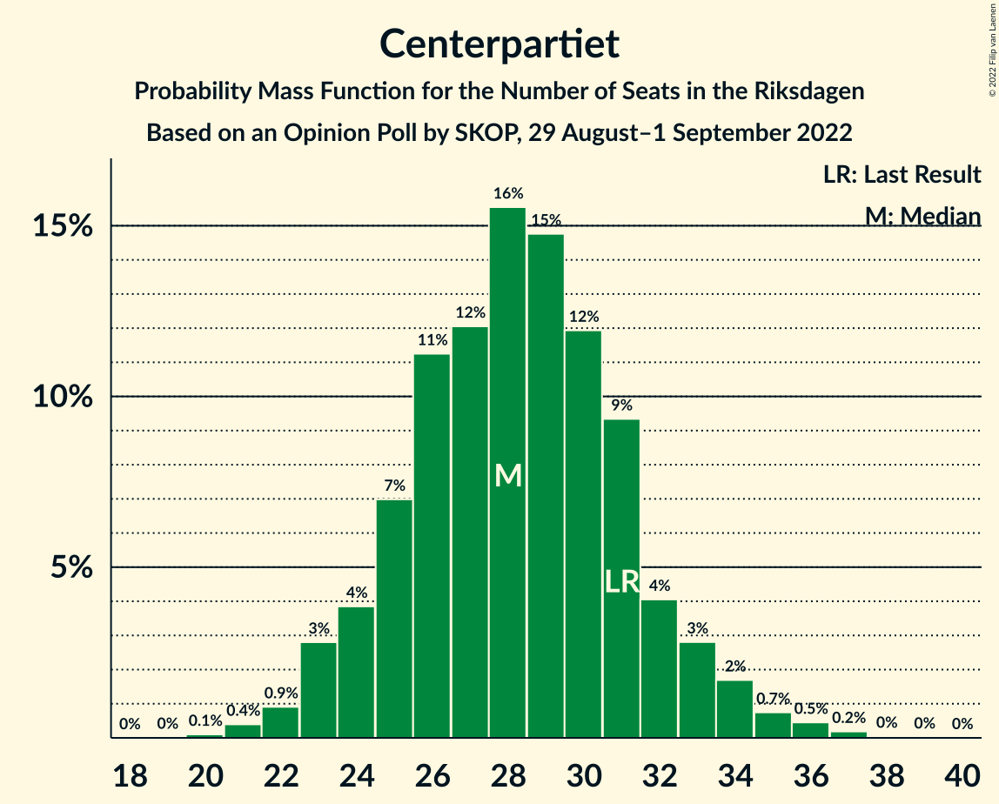
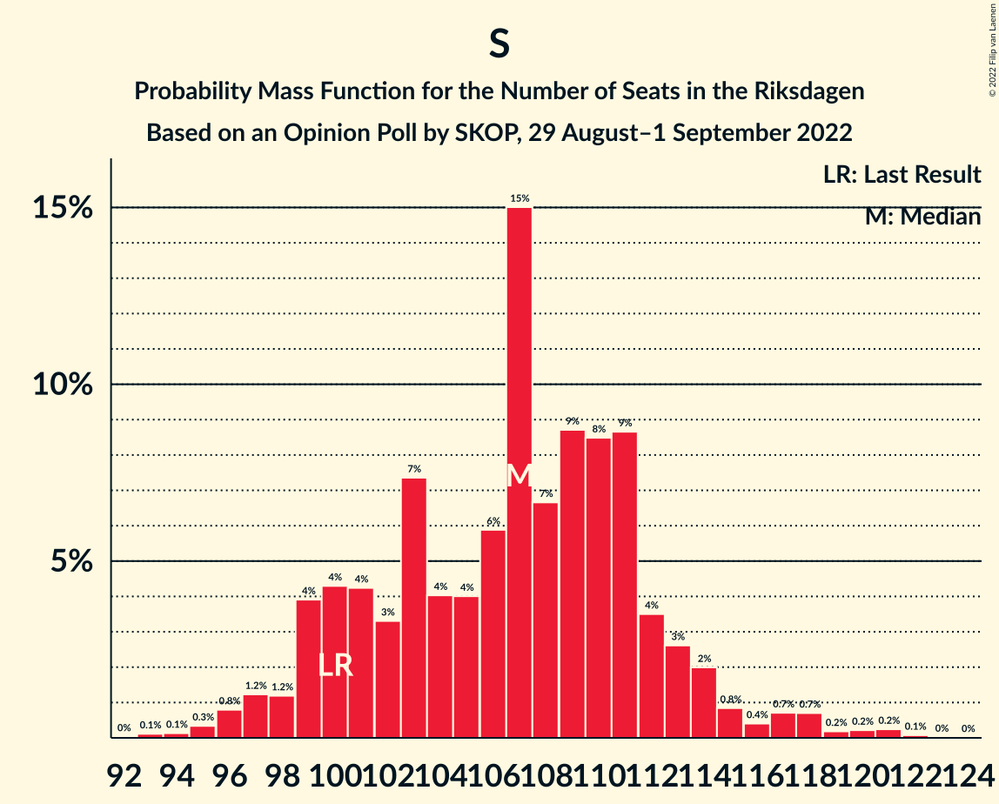

# Opinion Poll by SKOP, 29 August–1 September 2022

<a href="#voting-intentions">Voting Intentions</a> | <a href="#seats">Seats</a> | <a href="#coalitions">Coalitions</a> | <a href="#technical-information">Technical Information</a>

## Voting Intentions

### Confidence Intervals

| Party | Last Result | Poll Result | 80% Confidence Interval | 90% Confidence Interval | 95% Confidence Interval | 99% Confidence Interval |
|:-----:|:-----------:|:-----------:|:-----------------------:|:-----------------------:|:-----------------------:|:-----------------------:|
| Sveriges socialdemokratiska arbetareparti | 28.3% | 30.4% | 28.7–32.1% |28.2–32.6% |27.8–33.0% |27.0–33.9% |
| Sverigedemokraterna | 17.5% | 18.4% | 17.0–19.9% |16.6–20.3% |16.3–20.7% |15.6–21.4% |
| Moderata samlingspartiet | 19.8% | 14.8% | 13.5–16.2% |13.2–16.6% |12.9–16.9% |12.3–17.6% |
| Vänsterpartiet | 8.0% | 8.8% | 7.8–10.0% |7.6–10.3% |7.3–10.6% |6.9–11.1% |
| Centerpartiet | 8.6% | 8.0% | 7.0–9.1% |6.8–9.4% |6.6–9.6% |6.1–10.2% |
| Liberalerna | 5.5% | 7.4% | 6.5–8.4% |6.2–8.7% |6.0–9.0% |5.6–9.6% |
| Miljöpartiet de gröna | 4.4% | 5.7% | 4.9–6.7% |4.7–6.9% |4.5–7.2% |4.2–7.7% |
| Kristdemokraterna | 6.3% | 5.6% | 4.8–6.6% |4.6–6.8% |4.5–7.1% |4.1–7.6% |

*Note:* The poll result column reflects the actual value used in the calculations. Published results may vary slightly, and in addition be rounded to fewer digits.

## Seats

### Confidence Intervals

| Party | Last Result | Median | 80% Confidence Interval | 90% Confidence Interval | 95% Confidence Interval | 99% Confidence Interval |
|:-----:|:-----------:|:------:|:-----------------------:|:-----------------------:|:-----------------------:|:-----------------------:|
| <a href="#sveriges-socialdemokratiska-arbetareparti">Sveriges socialdemokratiska arbetareparti</a> | 100 | 107 | 100–112 |99–114 |97–116 |95–120 |
| <a href="#sverigedemokraterna">Sverigedemokraterna</a> | 62 | 65 | 60–70 |58–71 |57–73 |55–76 |
| <a href="#moderata-samlingspartiet">Moderata samlingspartiet</a> | 70 | 52 | 47–57 |46–58 |45–59 |43–62 |
| <a href="#vänsterpartiet">Vänsterpartiet</a> | 28 | 31 | 27–35 |26–36 |26–37 |24–39 |
| <a href="#centerpartiet">Centerpartiet</a> | 31 | 28 | 25–32 |24–33 |23–34 |21–36 |
| <a href="#liberalerna">Liberalerna</a> | 20 | 26 | 22–30 |22–31 |21–31 |20–33 |
| <a href="#miljöpartiet-de-gröna">Miljöpartiet de gröna</a> | 16 | 20 | 17–23 |17–24 |16–25 |15–27 |
| <a href="#kristdemokraterna">Kristdemokraterna</a> | 22 | 20 | 17–23 |16–24 |15–25 |14–27 |

### Sveriges socialdemokratiska arbetareparti

*For a full overview of the results for this party, see the [Sveriges socialdemokratiska arbetareparti](party-sverigessocialdemokratiskaarbetareparti.html) page.*

| Number of Seats | Probability | Accumulated | Special Marks |
|:---------------:|:-----------:|:-----------:|:-------------:|
| 92 | 0% | 100% |  |
| 93 | 0.1% | 99.9% |  |
| 94 | 0.1% | 99.8% |  |
| 95 | 0.3% | 99.7% |  |
| 96 | 0.8% | 99.3% |  |
| 97 | 1.2% | 98.5% |  |
| 98 | 1.2% | 97% |  |
| 99 | 4% | 96% |  |
| 100 | 4% | 92% | Last Result |
| 101 | 4% | 88% |  |
| 102 | 3% | 84% |  |
| 103 | 7% | 80% |  |
| 104 | 4% | 73% |  |
| 105 | 4% | 69% |  |
| 106 | 6% | 65% |  |
| 107 | 15% | 59% | Median |
| 108 | 7% | 44% |  |
| 109 | 9% | 37% |  |
| 110 | 8% | 29% |  |
| 111 | 9% | 20% |  |
| 112 | 4% | 12% |  |
| 113 | 3% | 8% |  |
| 114 | 2% | 5% |  |
| 115 | 0.8% | 3% |  |
| 116 | 0.4% | 3% |  |
| 117 | 0.7% | 2% |  |
| 118 | 0.7% | 1.5% |  |
| 119 | 0.2% | 0.8% |  |
| 120 | 0.2% | 0.6% |  |
| 121 | 0.2% | 0.4% |  |
| 122 | 0.1% | 0.1% |  |
| 123 | 0% | 0% |  |

### Sverigedemokraterna

*For a full overview of the results for this party, see the [Sverigedemokraterna](party-sverigedemokraterna.html) page.*

| Number of Seats | Probability | Accumulated | Special Marks |
|:---------------:|:-----------:|:-----------:|:-------------:|
| 52 | 0% | 100% |  |
| 53 | 0.1% | 99.9% |  |
| 54 | 0.3% | 99.8% |  |
| 55 | 0.4% | 99.5% |  |
| 56 | 0.9% | 99.1% |  |
| 57 | 2% | 98% |  |
| 58 | 2% | 97% |  |
| 59 | 4% | 94% |  |
| 60 | 5% | 90% |  |
| 61 | 8% | 86% |  |
| 62 | 7% | 78% | Last Result |
| 63 | 9% | 71% |  |
| 64 | 10% | 61% |  |
| 65 | 8% | 52% | Median |
| 66 | 11% | 43% |  |
| 67 | 9% | 33% |  |
| 68 | 7% | 24% |  |
| 69 | 7% | 17% |  |
| 70 | 3% | 10% |  |
| 71 | 3% | 7% |  |
| 72 | 2% | 5% |  |
| 73 | 1.2% | 3% |  |
| 74 | 0.6% | 1.4% |  |
| 75 | 0.3% | 0.9% |  |
| 76 | 0.3% | 0.5% |  |
| 77 | 0.1% | 0.2% |  |
| 78 | 0% | 0.1% |  |
| 79 | 0% | 0.1% |  |
| 80 | 0% | 0% |  |

### Moderata samlingspartiet

*For a full overview of the results for this party, see the [Moderata samlingspartiet](party-moderatasamlingspartiet.html) page.*

| Number of Seats | Probability | Accumulated | Special Marks |
|:---------------:|:-----------:|:-----------:|:-------------:|
| 41 | 0.1% | 100% |  |
| 42 | 0.2% | 99.9% |  |
| 43 | 0.5% | 99.7% |  |
| 44 | 0.9% | 99.3% |  |
| 45 | 2% | 98% |  |
| 46 | 3% | 97% |  |
| 47 | 6% | 94% |  |
| 48 | 3% | 87% |  |
| 49 | 6% | 84% |  |
| 50 | 14% | 78% |  |
| 51 | 13% | 64% |  |
| 52 | 6% | 51% | Median |
| 53 | 7% | 45% |  |
| 54 | 13% | 38% |  |
| 55 | 11% | 25% |  |
| 56 | 2% | 14% |  |
| 57 | 4% | 12% |  |
| 58 | 5% | 9% |  |
| 59 | 2% | 4% |  |
| 60 | 0.5% | 2% |  |
| 61 | 0.5% | 1.2% |  |
| 62 | 0.4% | 0.7% |  |
| 63 | 0.2% | 0.3% |  |
| 64 | 0.1% | 0.1% |  |
| 65 | 0% | 0.1% |  |
| 66 | 0% | 0% |  |
| 67 | 0% | 0% |  |
| 68 | 0% | 0% |  |
| 69 | 0% | 0% |  |
| 70 | 0% | 0% | Last Result |

### Vänsterpartiet

*For a full overview of the results for this party, see the [Vänsterpartiet](party-vänsterpartiet.html) page.*

| Number of Seats | Probability | Accumulated | Special Marks |
|:---------------:|:-----------:|:-----------:|:-------------:|
| 23 | 0.2% | 100% |  |
| 24 | 0.4% | 99.7% |  |
| 25 | 2% | 99.3% |  |
| 26 | 3% | 98% |  |
| 27 | 5% | 95% |  |
| 28 | 8% | 90% | Last Result |
| 29 | 11% | 82% |  |
| 30 | 16% | 71% |  |
| 31 | 11% | 55% | Median |
| 32 | 14% | 43% |  |
| 33 | 9% | 30% |  |
| 34 | 10% | 20% |  |
| 35 | 4% | 11% |  |
| 36 | 3% | 6% |  |
| 37 | 2% | 3% |  |
| 38 | 1.0% | 2% |  |
| 39 | 0.5% | 0.8% |  |
| 40 | 0.2% | 0.3% |  |
| 41 | 0.1% | 0.1% |  |
| 42 | 0% | 0% |  |

### Centerpartiet

*For a full overview of the results for this party, see the [Centerpartiet](party-centerpartiet.html) page.*

| Number of Seats | Probability | Accumulated | Special Marks |
|:---------------:|:-----------:|:-----------:|:-------------:|
| 20 | 0.1% | 100% |  |
| 21 | 0.4% | 99.9% |  |
| 22 | 0.9% | 99.5% |  |
| 23 | 3% | 98.6% |  |
| 24 | 4% | 96% |  |
| 25 | 7% | 92% |  |
| 26 | 11% | 85% |  |
| 27 | 12% | 74% |  |
| 28 | 16% | 62% | Median |
| 29 | 15% | 46% |  |
| 30 | 12% | 31% |  |
| 31 | 9% | 19% | Last Result |
| 32 | 4% | 10% |  |
| 33 | 3% | 6% |  |
| 34 | 2% | 3% |  |
| 35 | 0.7% | 1.5% |  |
| 36 | 0.5% | 0.7% |  |
| 37 | 0.2% | 0.3% |  |
| 38 | 0% | 0.1% |  |
| 39 | 0% | 0% |  |

### Liberalerna

*For a full overview of the results for this party, see the [Liberalerna](party-liberalerna.html) page.*

| Number of Seats | Probability | Accumulated | Special Marks |
|:---------------:|:-----------:|:-----------:|:-------------:|
| 19 | 0.1% | 100% |  |
| 20 | 0.8% | 99.9% | Last Result |
| 21 | 3% | 99.1% |  |
| 22 | 9% | 96% |  |
| 23 | 16% | 87% |  |
| 24 | 12% | 70% |  |
| 25 | 6% | 58% |  |
| 26 | 4% | 53% | Median |
| 27 | 6% | 49% |  |
| 28 | 13% | 43% |  |
| 29 | 14% | 30% |  |
| 30 | 11% | 17% |  |
| 31 | 4% | 6% |  |
| 32 | 1.2% | 2% |  |
| 33 | 0.3% | 0.5% |  |
| 34 | 0.1% | 0.2% |  |
| 35 | 0.1% | 0.2% |  |
| 36 | 0.1% | 0.1% |  |
| 37 | 0% | 0% |  |

### Miljöpartiet de gröna

*For a full overview of the results for this party, see the [Miljöpartiet de gröna](party-miljöpartietdegröna.html) page.*

| Number of Seats | Probability | Accumulated | Special Marks |
|:---------------:|:-----------:|:-----------:|:-------------:|
| 0 | 0.2% | 100% |  |
| 1 | 0% | 99.8% |  |
| 2 | 0% | 99.8% |  |
| 3 | 0% | 99.8% |  |
| 4 | 0% | 99.8% |  |
| 5 | 0% | 99.8% |  |
| 6 | 0% | 99.8% |  |
| 7 | 0% | 99.8% |  |
| 8 | 0% | 99.8% |  |
| 9 | 0% | 99.8% |  |
| 10 | 0% | 99.8% |  |
| 11 | 0% | 99.8% |  |
| 12 | 0% | 99.8% |  |
| 13 | 0% | 99.8% |  |
| 14 | 0.2% | 99.8% |  |
| 15 | 1.3% | 99.6% |  |
| 16 | 3% | 98% | Last Result |
| 17 | 6% | 95% |  |
| 18 | 12% | 89% |  |
| 19 | 17% | 77% |  |
| 20 | 16% | 59% | Median |
| 21 | 15% | 43% |  |
| 22 | 12% | 28% |  |
| 23 | 9% | 17% |  |
| 24 | 4% | 8% |  |
| 25 | 3% | 4% |  |
| 26 | 1.0% | 2% |  |
| 27 | 0.4% | 0.7% |  |
| 28 | 0.1% | 0.2% |  |
| 29 | 0.1% | 0.1% |  |
| 30 | 0% | 0% |  |

### Kristdemokraterna

*For a full overview of the results for this party, see the [Kristdemokraterna](party-kristdemokraterna.html) page.*

| Number of Seats | Probability | Accumulated | Special Marks |
|:---------------:|:-----------:|:-----------:|:-------------:|
| 0 | 0.4% | 100% |  |
| 1 | 0% | 99.6% |  |
| 2 | 0% | 99.6% |  |
| 3 | 0% | 99.6% |  |
| 4 | 0% | 99.6% |  |
| 5 | 0% | 99.6% |  |
| 6 | 0% | 99.6% |  |
| 7 | 0% | 99.6% |  |
| 8 | 0% | 99.6% |  |
| 9 | 0% | 99.6% |  |
| 10 | 0% | 99.6% |  |
| 11 | 0% | 99.6% |  |
| 12 | 0% | 99.6% |  |
| 13 | 0% | 99.6% |  |
| 14 | 0.4% | 99.6% |  |
| 15 | 2% | 99.1% |  |
| 16 | 4% | 97% |  |
| 17 | 8% | 94% |  |
| 18 | 13% | 85% |  |
| 19 | 15% | 73% |  |
| 20 | 16% | 58% | Median |
| 21 | 15% | 42% |  |
| 22 | 11% | 27% | Last Result |
| 23 | 7% | 16% |  |
| 24 | 4% | 9% |  |
| 25 | 3% | 5% |  |
| 26 | 1.5% | 2% |  |
| 27 | 0.5% | 0.6% |  |
| 28 | 0.1% | 0.2% |  |
| 29 | 0% | 0.1% |  |
| 30 | 0% | 0% |  |

## Coalitions

### Confidence Intervals

| Coalition | Last Result | Median | Majority? | 80% Confidence Interval | 90% Confidence Interval | 95% Confidence Interval | 99% Confidence Interval |
|:---------:|:-----------:|:------:|:---------:|:-----------------------:|:-----------------------:|:-----------------------:|:-----------------------:|
| Sveriges socialdemokratiska arbetareparti – Vänsterpartiet – Centerpartiet – Liberalerna – Miljöpartiet de gröna | 195 | 212 | 100% | 206–220 | 204–221 | 202–223 | 199–225 |
| Sveriges socialdemokratiska arbetareparti – Moderata samlingspartiet – Centerpartiet | 201 | 187 | 99.3% | 180–193 | 179–195 | 177–197 | 174–201 |
| Sveriges socialdemokratiska arbetareparti – Vänsterpartiet – Centerpartiet – Miljöpartiet de gröna | 175 | 186 | 98.9% | 179–193 | 178–195 | 176–196 | 173–200 |
| Sveriges socialdemokratiska arbetareparti – Centerpartiet – Liberalerna – Miljöpartiet de gröna | 167 | 180 | 89% | 174–187 | 173–191 | 172–192 | 167–194 |
| Sverigedemokraterna – Moderata samlingspartiet – Liberalerna – Kristdemokraterna | 174 | 163 | 1.1% | 156–170 | 154–171 | 153–173 | 149–176 |
| Sveriges socialdemokratiska arbetareparti – Moderata samlingspartiet | 170 | 159 | 0.1% | 152–165 | 150–167 | 149–169 | 145–172 |
| Sveriges socialdemokratiska arbetareparti – Vänsterpartiet – Miljöpartiet de gröna | 144 | 158 | 0.1% | 151–164 | 149–166 | 148–168 | 145–172 |
| Sveriges socialdemokratiska arbetareparti – Centerpartiet – Miljöpartiet de gröna | 147 | 155 | 0% | 148–162 | 146–164 | 145–165 | 142–168 |
| Sveriges socialdemokratiska arbetareparti – Vänsterpartiet | 128 | 138 | 0% | 131–144 | 129–146 | 128–148 | 126–152 |
| Sverigedemokraterna – Moderata samlingspartiet – Kristdemokraterna | 154 | 137 | 0% | 129–143 | 128–145 | 126–147 | 124–150 |
| Sveriges socialdemokratiska arbetareparti – Miljöpartiet de gröna | 116 | 128 | 0% | 120–132 | 118–134 | 117–136 | 114–141 |
| Moderata samlingspartiet – Centerpartiet – Liberalerna – Kristdemokraterna | 143 | 127 | 0% | 120–133 | 118–135 | 116–136 | 113–139 |
| Sverigedemokraterna – Moderata samlingspartiet | 132 | 117 | 0% | 110–123 | 109–125 | 107–126 | 105–129 |
| Moderata samlingspartiet – Centerpartiet – Liberalerna | 121 | 106 | 0% | 100–113 | 98–115 | 97–116 | 94–119 |
| Sveriges socialdemokratiska arbetareparti | 100 | 107 | 0% | 100–112 | 99–114 | 97–116 | 95–120 |
| Moderata samlingspartiet – Centerpartiet – Kristdemokraterna | 123 | 100 | 0% | 94–107 | 92–108 | 91–109 | 88–112 |
| Moderata samlingspartiet – Liberalerna – Kristdemokraterna | 112 | 98 | 0% | 92–104 | 90–106 | 89–107 | 85–110 |
| Moderata samlingspartiet – Centerpartiet | 101 | 80 | 0% | 75–86 | 73–88 | 72–89 | 70–91 |
| Moderata samlingspartiet – Kristdemokraterna | 92 | 72 | 0% | 67–78 | 65–79 | 64–80 | 60–83 |

### Sveriges socialdemokratiska arbetareparti – Vänsterpartiet – Centerpartiet – Liberalerna – Miljöpartiet de gröna

| Number of Seats | Probability | Accumulated | Special Marks |
|:---------------:|:-----------:|:-----------:|:-------------:|
| 195 | 0% | 100% | Last Result |
| 196 | 0.1% | 99.9% |  |
| 197 | 0.1% | 99.9% |  |
| 198 | 0.2% | 99.8% |  |
| 199 | 0.5% | 99.6% |  |
| 200 | 0.5% | 99.1% |  |
| 201 | 0.6% | 98.6% |  |
| 202 | 2% | 98% |  |
| 203 | 1.0% | 96% |  |
| 204 | 2% | 95% |  |
| 205 | 2% | 93% |  |
| 206 | 3% | 91% |  |
| 207 | 4% | 88% |  |
| 208 | 8% | 84% |  |
| 209 | 6% | 76% |  |
| 210 | 10% | 70% |  |
| 211 | 8% | 60% |  |
| 212 | 6% | 52% | Median |
| 213 | 7% | 46% |  |
| 214 | 8% | 39% |  |
| 215 | 3% | 31% |  |
| 216 | 6% | 28% |  |
| 217 | 3% | 22% |  |
| 218 | 5% | 18% |  |
| 219 | 2% | 13% |  |
| 220 | 4% | 11% |  |
| 221 | 2% | 7% |  |
| 222 | 1.4% | 4% |  |
| 223 | 1.0% | 3% |  |
| 224 | 0.7% | 2% |  |
| 225 | 0.6% | 1.1% |  |
| 226 | 0.1% | 0.5% |  |
| 227 | 0.1% | 0.4% |  |
| 228 | 0% | 0.2% |  |
| 229 | 0.1% | 0.2% |  |
| 230 | 0% | 0.1% |  |
| 231 | 0% | 0.1% |  |
| 232 | 0% | 0% |  |

### Sveriges socialdemokratiska arbetareparti – Moderata samlingspartiet – Centerpartiet

| Number of Seats | Probability | Accumulated | Special Marks |
|:---------------:|:-----------:|:-----------:|:-------------:|
| 170 | 0% | 100% |  |
| 171 | 0.1% | 99.9% |  |
| 172 | 0.1% | 99.9% |  |
| 173 | 0.1% | 99.7% |  |
| 174 | 0.3% | 99.6% |  |
| 175 | 0.5% | 99.3% | Majority |
| 176 | 0.7% | 98.8% |  |
| 177 | 1.3% | 98% |  |
| 178 | 2% | 97% |  |
| 179 | 2% | 95% |  |
| 180 | 3% | 93% |  |
| 181 | 4% | 90% |  |
| 182 | 6% | 86% |  |
| 183 | 6% | 80% |  |
| 184 | 5% | 75% |  |
| 185 | 9% | 69% |  |
| 186 | 8% | 60% |  |
| 187 | 5% | 52% | Median |
| 188 | 9% | 48% |  |
| 189 | 8% | 39% |  |
| 190 | 6% | 31% |  |
| 191 | 7% | 25% |  |
| 192 | 5% | 17% |  |
| 193 | 3% | 12% |  |
| 194 | 2% | 9% |  |
| 195 | 2% | 7% |  |
| 196 | 1.3% | 5% |  |
| 197 | 1.2% | 3% |  |
| 198 | 0.9% | 2% |  |
| 199 | 0.5% | 1.3% |  |
| 200 | 0.2% | 0.8% |  |
| 201 | 0.2% | 0.5% | Last Result |
| 202 | 0.1% | 0.3% |  |
| 203 | 0% | 0.2% |  |
| 204 | 0.1% | 0.1% |  |
| 205 | 0% | 0.1% |  |
| 206 | 0% | 0% |  |

### Sveriges socialdemokratiska arbetareparti – Vänsterpartiet – Centerpartiet – Miljöpartiet de gröna

| Number of Seats | Probability | Accumulated | Special Marks |
|:---------------:|:-----------:|:-----------:|:-------------:|
| 169 | 0% | 100% |  |
| 170 | 0.1% | 99.9% |  |
| 171 | 0.1% | 99.9% |  |
| 172 | 0.1% | 99.8% |  |
| 173 | 0.4% | 99.7% |  |
| 174 | 0.4% | 99.3% |  |
| 175 | 0.9% | 98.9% | Last Result, Majority |
| 176 | 1.0% | 98% |  |
| 177 | 2% | 97% |  |
| 178 | 2% | 95% |  |
| 179 | 3% | 93% |  |
| 180 | 5% | 90% |  |
| 181 | 4% | 85% |  |
| 182 | 5% | 81% |  |
| 183 | 7% | 76% |  |
| 184 | 5% | 69% |  |
| 185 | 10% | 64% |  |
| 186 | 6% | 54% | Median |
| 187 | 8% | 48% |  |
| 188 | 7% | 41% |  |
| 189 | 7% | 33% |  |
| 190 | 7% | 27% |  |
| 191 | 5% | 20% |  |
| 192 | 4% | 15% |  |
| 193 | 3% | 11% |  |
| 194 | 2% | 8% |  |
| 195 | 2% | 5% |  |
| 196 | 1.4% | 4% |  |
| 197 | 1.0% | 2% |  |
| 198 | 0.5% | 1.4% |  |
| 199 | 0.4% | 0.9% |  |
| 200 | 0.2% | 0.5% |  |
| 201 | 0.2% | 0.3% |  |
| 202 | 0.1% | 0.2% |  |
| 203 | 0.1% | 0.1% |  |
| 204 | 0% | 0.1% |  |
| 205 | 0% | 0% |  |

### Sveriges socialdemokratiska arbetareparti – Centerpartiet – Liberalerna – Miljöpartiet de gröna

| Number of Seats | Probability | Accumulated | Special Marks |
|:---------------:|:-----------:|:-----------:|:-------------:|
| 163 | 0% | 100% |  |
| 164 | 0% | 99.9% |  |
| 165 | 0% | 99.9% |  |
| 166 | 0.1% | 99.9% |  |
| 167 | 0.6% | 99.8% | Last Result |
| 168 | 0.6% | 99.2% |  |
| 169 | 0.5% | 98.6% |  |
| 170 | 0.3% | 98% |  |
| 171 | 0.2% | 98% |  |
| 172 | 1.3% | 98% |  |
| 173 | 3% | 96% |  |
| 174 | 4% | 93% |  |
| 175 | 3% | 89% | Majority |
| 176 | 2% | 85% |  |
| 177 | 3% | 83% |  |
| 178 | 8% | 80% |  |
| 179 | 8% | 73% |  |
| 180 | 17% | 65% |  |
| 181 | 7% | 48% | Median |
| 182 | 4% | 41% |  |
| 183 | 2% | 37% |  |
| 184 | 4% | 35% |  |
| 185 | 7% | 30% |  |
| 186 | 7% | 23% |  |
| 187 | 7% | 16% |  |
| 188 | 1.1% | 9% |  |
| 189 | 0.9% | 8% |  |
| 190 | 2% | 7% |  |
| 191 | 2% | 5% |  |
| 192 | 2% | 3% |  |
| 193 | 0.6% | 1.3% |  |
| 194 | 0.2% | 0.7% |  |
| 195 | 0.1% | 0.4% |  |
| 196 | 0.1% | 0.3% |  |
| 197 | 0.1% | 0.2% |  |
| 198 | 0% | 0.1% |  |
| 199 | 0% | 0.1% |  |
| 200 | 0% | 0% |  |

### Sverigedemokraterna – Moderata samlingspartiet – Liberalerna – Kristdemokraterna

| Number of Seats | Probability | Accumulated | Special Marks |
|:---------------:|:-----------:|:-----------:|:-------------:|
| 145 | 0% | 100% |  |
| 146 | 0.1% | 99.9% |  |
| 147 | 0.1% | 99.9% |  |
| 148 | 0.2% | 99.8% |  |
| 149 | 0.2% | 99.7% |  |
| 150 | 0.4% | 99.5% |  |
| 151 | 0.5% | 99.1% |  |
| 152 | 1.0% | 98.6% |  |
| 153 | 1.4% | 98% |  |
| 154 | 2% | 96% |  |
| 155 | 2% | 95% |  |
| 156 | 3% | 92% |  |
| 157 | 4% | 89% |  |
| 158 | 5% | 85% |  |
| 159 | 7% | 80% |  |
| 160 | 7% | 73% |  |
| 161 | 7% | 67% |  |
| 162 | 8% | 59% |  |
| 163 | 6% | 52% | Median |
| 164 | 10% | 46% |  |
| 165 | 5% | 36% |  |
| 166 | 7% | 31% |  |
| 167 | 5% | 24% |  |
| 168 | 4% | 19% |  |
| 169 | 5% | 15% |  |
| 170 | 3% | 10% |  |
| 171 | 2% | 7% |  |
| 172 | 2% | 5% |  |
| 173 | 1.0% | 3% |  |
| 174 | 0.9% | 2% | Last Result |
| 175 | 0.4% | 1.1% | Majority |
| 176 | 0.4% | 0.7% |  |
| 177 | 0.1% | 0.3% |  |
| 178 | 0.1% | 0.2% |  |
| 179 | 0.1% | 0.1% |  |
| 180 | 0% | 0.1% |  |
| 181 | 0% | 0% |  |

### Sveriges socialdemokratiska arbetareparti – Moderata samlingspartiet

| Number of Seats | Probability | Accumulated | Special Marks |
|:---------------:|:-----------:|:-----------:|:-------------:|
| 142 | 0% | 100% |  |
| 143 | 0.1% | 99.9% |  |
| 144 | 0.1% | 99.9% |  |
| 145 | 0.3% | 99.7% |  |
| 146 | 0.4% | 99.5% |  |
| 147 | 0.5% | 99.1% |  |
| 148 | 0.8% | 98.5% |  |
| 149 | 0.8% | 98% |  |
| 150 | 2% | 97% |  |
| 151 | 2% | 95% |  |
| 152 | 3% | 93% |  |
| 153 | 5% | 89% |  |
| 154 | 6% | 85% |  |
| 155 | 5% | 79% |  |
| 156 | 9% | 74% |  |
| 157 | 4% | 65% |  |
| 158 | 8% | 61% |  |
| 159 | 8% | 53% | Median |
| 160 | 5% | 44% |  |
| 161 | 12% | 39% |  |
| 162 | 6% | 27% |  |
| 163 | 3% | 21% |  |
| 164 | 7% | 18% |  |
| 165 | 3% | 11% |  |
| 166 | 2% | 8% |  |
| 167 | 2% | 6% |  |
| 168 | 1.4% | 4% |  |
| 169 | 1.3% | 3% |  |
| 170 | 0.5% | 2% | Last Result |
| 171 | 0.3% | 1.1% |  |
| 172 | 0.5% | 0.9% |  |
| 173 | 0.2% | 0.4% |  |
| 174 | 0.1% | 0.2% |  |
| 175 | 0% | 0.1% | Majority |
| 176 | 0% | 0.1% |  |
| 177 | 0% | 0.1% |  |
| 178 | 0% | 0% |  |

### Sveriges socialdemokratiska arbetareparti – Vänsterpartiet – Miljöpartiet de gröna

| Number of Seats | Probability | Accumulated | Special Marks |
|:---------------:|:-----------:|:-----------:|:-------------:|
| 140 | 0% | 100% |  |
| 141 | 0% | 99.9% |  |
| 142 | 0% | 99.9% |  |
| 143 | 0.1% | 99.9% |  |
| 144 | 0.1% | 99.8% | Last Result |
| 145 | 0.2% | 99.7% |  |
| 146 | 0.4% | 99.5% |  |
| 147 | 0.7% | 99.0% |  |
| 148 | 1.0% | 98% |  |
| 149 | 3% | 97% |  |
| 150 | 4% | 94% |  |
| 151 | 3% | 91% |  |
| 152 | 4% | 87% |  |
| 153 | 4% | 83% |  |
| 154 | 6% | 79% |  |
| 155 | 6% | 73% |  |
| 156 | 8% | 67% |  |
| 157 | 5% | 60% |  |
| 158 | 6% | 55% | Median |
| 159 | 7% | 49% |  |
| 160 | 9% | 42% |  |
| 161 | 6% | 33% |  |
| 162 | 10% | 26% |  |
| 163 | 3% | 16% |  |
| 164 | 4% | 14% |  |
| 165 | 3% | 10% |  |
| 166 | 1.5% | 6% |  |
| 167 | 2% | 5% |  |
| 168 | 0.8% | 3% |  |
| 169 | 0.6% | 2% |  |
| 170 | 0.4% | 2% |  |
| 171 | 0.5% | 1.1% |  |
| 172 | 0.3% | 0.6% |  |
| 173 | 0.1% | 0.3% |  |
| 174 | 0.1% | 0.2% |  |
| 175 | 0.1% | 0.1% | Majority |
| 176 | 0% | 0% |  |

### Sveriges socialdemokratiska arbetareparti – Centerpartiet – Miljöpartiet de gröna

| Number of Seats | Probability | Accumulated | Special Marks |
|:---------------:|:-----------:|:-----------:|:-------------:|
| 137 | 0% | 100% |  |
| 138 | 0% | 99.9% |  |
| 139 | 0% | 99.9% |  |
| 140 | 0.1% | 99.9% |  |
| 141 | 0.1% | 99.7% |  |
| 142 | 0.2% | 99.6% |  |
| 143 | 0.4% | 99.4% |  |
| 144 | 1.3% | 99.0% |  |
| 145 | 2% | 98% |  |
| 146 | 3% | 96% |  |
| 147 | 1.3% | 93% | Last Result |
| 148 | 2% | 92% |  |
| 149 | 2% | 90% |  |
| 150 | 4% | 88% |  |
| 151 | 5% | 84% |  |
| 152 | 8% | 79% |  |
| 153 | 8% | 71% |  |
| 154 | 6% | 64% |  |
| 155 | 9% | 58% | Median |
| 156 | 10% | 49% |  |
| 157 | 12% | 39% |  |
| 158 | 7% | 27% |  |
| 159 | 3% | 21% |  |
| 160 | 2% | 18% |  |
| 161 | 4% | 16% |  |
| 162 | 4% | 12% |  |
| 163 | 3% | 8% |  |
| 164 | 2% | 5% |  |
| 165 | 1.0% | 3% |  |
| 166 | 0.7% | 2% |  |
| 167 | 0.4% | 1.1% |  |
| 168 | 0.2% | 0.7% |  |
| 169 | 0.2% | 0.5% |  |
| 170 | 0.1% | 0.2% |  |
| 171 | 0.1% | 0.2% |  |
| 172 | 0% | 0.1% |  |
| 173 | 0.1% | 0.1% |  |
| 174 | 0% | 0% |  |

### Sveriges socialdemokratiska arbetareparti – Vänsterpartiet

| Number of Seats | Probability | Accumulated | Special Marks |
|:---------------:|:-----------:|:-----------:|:-------------:|
| 122 | 0% | 100% |  |
| 123 | 0.1% | 99.9% |  |
| 124 | 0.1% | 99.9% |  |
| 125 | 0.3% | 99.8% |  |
| 126 | 0.5% | 99.5% |  |
| 127 | 0.8% | 99.0% |  |
| 128 | 2% | 98% | Last Result |
| 129 | 2% | 96% |  |
| 130 | 3% | 94% |  |
| 131 | 4% | 91% |  |
| 132 | 3% | 87% |  |
| 133 | 7% | 84% |  |
| 134 | 4% | 77% |  |
| 135 | 6% | 74% |  |
| 136 | 5% | 68% |  |
| 137 | 10% | 63% |  |
| 138 | 6% | 53% | Median |
| 139 | 9% | 47% |  |
| 140 | 7% | 38% |  |
| 141 | 8% | 30% |  |
| 142 | 4% | 22% |  |
| 143 | 8% | 18% |  |
| 144 | 3% | 10% |  |
| 145 | 2% | 7% |  |
| 146 | 2% | 5% |  |
| 147 | 1.1% | 4% |  |
| 148 | 1.0% | 3% |  |
| 149 | 0.4% | 2% |  |
| 150 | 0.5% | 1.3% |  |
| 151 | 0.3% | 0.8% |  |
| 152 | 0.3% | 0.5% |  |
| 153 | 0.1% | 0.2% |  |
| 154 | 0.1% | 0.1% |  |
| 155 | 0% | 0.1% |  |
| 156 | 0% | 0% |  |

### Sverigedemokraterna – Moderata samlingspartiet – Kristdemokraterna

| Number of Seats | Probability | Accumulated | Special Marks |
|:---------------:|:-----------:|:-----------:|:-------------:|
| 118 | 0% | 100% |  |
| 119 | 0% | 99.9% |  |
| 120 | 0.1% | 99.9% |  |
| 121 | 0% | 99.8% |  |
| 122 | 0.1% | 99.8% |  |
| 123 | 0.1% | 99.6% |  |
| 124 | 0.6% | 99.5% |  |
| 125 | 0.7% | 98.9% |  |
| 126 | 1.0% | 98% |  |
| 127 | 1.4% | 97% |  |
| 128 | 2% | 96% |  |
| 129 | 4% | 93% |  |
| 130 | 2% | 89% |  |
| 131 | 5% | 87% |  |
| 132 | 3% | 82% |  |
| 133 | 6% | 78% |  |
| 134 | 3% | 72% |  |
| 135 | 8% | 69% |  |
| 136 | 7% | 61% |  |
| 137 | 6% | 54% | Median |
| 138 | 8% | 48% |  |
| 139 | 10% | 40% |  |
| 140 | 6% | 30% |  |
| 141 | 8% | 24% |  |
| 142 | 4% | 16% |  |
| 143 | 3% | 12% |  |
| 144 | 2% | 9% |  |
| 145 | 2% | 7% |  |
| 146 | 1.0% | 5% |  |
| 147 | 2% | 4% |  |
| 148 | 0.6% | 2% |  |
| 149 | 0.5% | 1.4% |  |
| 150 | 0.5% | 0.9% |  |
| 151 | 0.2% | 0.4% |  |
| 152 | 0.1% | 0.2% |  |
| 153 | 0.1% | 0.1% |  |
| 154 | 0% | 0.1% | Last Result |
| 155 | 0% | 0% |  |

### Sveriges socialdemokratiska arbetareparti – Miljöpartiet de gröna

| Number of Seats | Probability | Accumulated | Special Marks |
|:---------------:|:-----------:|:-----------:|:-------------:|
| 109 | 0% | 100% |  |
| 110 | 0% | 99.9% |  |
| 111 | 0% | 99.9% |  |
| 112 | 0% | 99.8% |  |
| 113 | 0.1% | 99.8% |  |
| 114 | 0.2% | 99.7% |  |
| 115 | 0.3% | 99.5% |  |
| 116 | 0.7% | 99.2% | Last Result |
| 117 | 1.2% | 98% |  |
| 118 | 3% | 97% |  |
| 119 | 3% | 95% |  |
| 120 | 3% | 92% |  |
| 121 | 5% | 89% |  |
| 122 | 5% | 84% |  |
| 123 | 7% | 79% |  |
| 124 | 4% | 73% |  |
| 125 | 5% | 69% |  |
| 126 | 9% | 64% |  |
| 127 | 6% | 56% | Median |
| 128 | 9% | 50% |  |
| 129 | 8% | 41% |  |
| 130 | 11% | 33% |  |
| 131 | 9% | 23% |  |
| 132 | 4% | 13% |  |
| 133 | 2% | 10% |  |
| 134 | 3% | 7% |  |
| 135 | 1.1% | 5% |  |
| 136 | 1.0% | 3% |  |
| 137 | 0.6% | 2% |  |
| 138 | 0.6% | 2% |  |
| 139 | 0.4% | 1.2% |  |
| 140 | 0.3% | 0.8% |  |
| 141 | 0.2% | 0.5% |  |
| 142 | 0.2% | 0.3% |  |
| 143 | 0.1% | 0.1% |  |
| 144 | 0% | 0% |  |

### Moderata samlingspartiet – Centerpartiet – Liberalerna – Kristdemokraterna

| Number of Seats | Probability | Accumulated | Special Marks |
|:---------------:|:-----------:|:-----------:|:-------------:|
| 108 | 0% | 100% |  |
| 109 | 0% | 99.9% |  |
| 110 | 0.1% | 99.9% |  |
| 111 | 0.1% | 99.8% |  |
| 112 | 0.2% | 99.8% |  |
| 113 | 0.3% | 99.5% |  |
| 114 | 0.3% | 99.2% |  |
| 115 | 0.5% | 98.9% |  |
| 116 | 1.3% | 98% |  |
| 117 | 2% | 97% |  |
| 118 | 1.2% | 95% |  |
| 119 | 2% | 94% |  |
| 120 | 3% | 92% |  |
| 121 | 6% | 89% |  |
| 122 | 7% | 83% |  |
| 123 | 5% | 76% |  |
| 124 | 4% | 72% |  |
| 125 | 11% | 68% |  |
| 126 | 7% | 57% | Median |
| 127 | 11% | 50% |  |
| 128 | 6% | 39% |  |
| 129 | 7% | 33% |  |
| 130 | 6% | 26% |  |
| 131 | 5% | 20% |  |
| 132 | 3% | 16% |  |
| 133 | 4% | 12% |  |
| 134 | 3% | 9% |  |
| 135 | 2% | 5% |  |
| 136 | 0.9% | 3% |  |
| 137 | 0.5% | 2% |  |
| 138 | 0.7% | 2% |  |
| 139 | 0.4% | 0.9% |  |
| 140 | 0.2% | 0.4% |  |
| 141 | 0.1% | 0.3% |  |
| 142 | 0.1% | 0.1% |  |
| 143 | 0% | 0.1% | Last Result |
| 144 | 0% | 0.1% |  |
| 145 | 0% | 0% |  |

### Sverigedemokraterna – Moderata samlingspartiet

| Number of Seats | Probability | Accumulated | Special Marks |
|:---------------:|:-----------:|:-----------:|:-------------:|
| 101 | 0.1% | 100% |  |
| 102 | 0.1% | 99.9% |  |
| 103 | 0.2% | 99.8% |  |
| 104 | 0.1% | 99.7% |  |
| 105 | 0.4% | 99.5% |  |
| 106 | 1.2% | 99.2% |  |
| 107 | 0.9% | 98% |  |
| 108 | 2% | 97% |  |
| 109 | 2% | 95% |  |
| 110 | 3% | 93% |  |
| 111 | 3% | 89% |  |
| 112 | 7% | 86% |  |
| 113 | 6% | 79% |  |
| 114 | 6% | 73% |  |
| 115 | 8% | 67% |  |
| 116 | 7% | 59% |  |
| 117 | 6% | 52% | Median |
| 118 | 9% | 46% |  |
| 119 | 6% | 37% |  |
| 120 | 10% | 31% |  |
| 121 | 6% | 21% |  |
| 122 | 5% | 15% |  |
| 123 | 2% | 11% |  |
| 124 | 3% | 8% |  |
| 125 | 2% | 6% |  |
| 126 | 1.3% | 3% |  |
| 127 | 0.5% | 2% |  |
| 128 | 0.7% | 2% |  |
| 129 | 0.5% | 1.0% |  |
| 130 | 0.2% | 0.5% |  |
| 131 | 0.1% | 0.3% |  |
| 132 | 0.1% | 0.2% | Last Result |
| 133 | 0.1% | 0.1% |  |
| 134 | 0% | 0% |  |

### Moderata samlingspartiet – Centerpartiet – Liberalerna

| Number of Seats | Probability | Accumulated | Special Marks |
|:---------------:|:-----------:|:-----------:|:-------------:|
| 92 | 0.1% | 100% |  |
| 93 | 0.1% | 99.9% |  |
| 94 | 0.4% | 99.7% |  |
| 95 | 0.6% | 99.4% |  |
| 96 | 1.1% | 98.7% |  |
| 97 | 1.2% | 98% |  |
| 98 | 2% | 96% |  |
| 99 | 3% | 94% |  |
| 100 | 3% | 91% |  |
| 101 | 7% | 88% |  |
| 102 | 5% | 81% |  |
| 103 | 7% | 77% |  |
| 104 | 6% | 70% |  |
| 105 | 7% | 64% |  |
| 106 | 8% | 57% | Median |
| 107 | 8% | 50% |  |
| 108 | 9% | 41% |  |
| 109 | 6% | 32% |  |
| 110 | 5% | 27% |  |
| 111 | 7% | 22% |  |
| 112 | 3% | 16% |  |
| 113 | 3% | 12% |  |
| 114 | 4% | 9% |  |
| 115 | 1.2% | 5% |  |
| 116 | 2% | 4% |  |
| 117 | 0.7% | 2% |  |
| 118 | 0.5% | 1.1% |  |
| 119 | 0.3% | 0.6% |  |
| 120 | 0.1% | 0.3% |  |
| 121 | 0.1% | 0.2% | Last Result |
| 122 | 0.1% | 0.1% |  |
| 123 | 0% | 0% |  |

### Sveriges socialdemokratiska arbetareparti

| Number of Seats | Probability | Accumulated | Special Marks |
|:---------------:|:-----------:|:-----------:|:-------------:|
| 92 | 0% | 100% |  |
| 93 | 0.1% | 99.9% |  |
| 94 | 0.1% | 99.8% |  |
| 95 | 0.3% | 99.7% |  |
| 96 | 0.8% | 99.3% |  |
| 97 | 1.2% | 98.5% |  |
| 98 | 1.2% | 97% |  |
| 99 | 4% | 96% |  |
| 100 | 4% | 92% | Last Result |
| 101 | 4% | 88% |  |
| 102 | 3% | 84% |  |
| 103 | 7% | 80% |  |
| 104 | 4% | 73% |  |
| 105 | 4% | 69% |  |
| 106 | 6% | 65% |  |
| 107 | 15% | 59% | Median |
| 108 | 7% | 44% |  |
| 109 | 9% | 37% |  |
| 110 | 8% | 29% |  |
| 111 | 9% | 20% |  |
| 112 | 4% | 12% |  |
| 113 | 3% | 8% |  |
| 114 | 2% | 5% |  |
| 115 | 0.8% | 3% |  |
| 116 | 0.4% | 3% |  |
| 117 | 0.7% | 2% |  |
| 118 | 0.7% | 1.5% |  |
| 119 | 0.2% | 0.8% |  |
| 120 | 0.2% | 0.6% |  |
| 121 | 0.2% | 0.4% |  |
| 122 | 0.1% | 0.1% |  |
| 123 | 0% | 0% |  |

### Moderata samlingspartiet – Centerpartiet – Kristdemokraterna

| Number of Seats | Probability | Accumulated | Special Marks |
|:---------------:|:-----------:|:-----------:|:-------------:|
| 81 | 0% | 100% |  |
| 82 | 0% | 99.9% |  |
| 83 | 0% | 99.9% |  |
| 84 | 0% | 99.9% |  |
| 85 | 0.1% | 99.8% |  |
| 86 | 0% | 99.7% |  |
| 87 | 0.1% | 99.7% |  |
| 88 | 0.3% | 99.6% |  |
| 89 | 0.6% | 99.3% |  |
| 90 | 0.8% | 98.6% |  |
| 91 | 0.9% | 98% |  |
| 92 | 2% | 97% |  |
| 93 | 2% | 95% |  |
| 94 | 3% | 92% |  |
| 95 | 6% | 90% |  |
| 96 | 5% | 84% |  |
| 97 | 6% | 78% |  |
| 98 | 10% | 73% |  |
| 99 | 7% | 63% |  |
| 100 | 9% | 56% | Median |
| 101 | 7% | 47% |  |
| 102 | 7% | 40% |  |
| 103 | 5% | 33% |  |
| 104 | 10% | 28% |  |
| 105 | 3% | 18% |  |
| 106 | 4% | 15% |  |
| 107 | 4% | 10% |  |
| 108 | 3% | 6% |  |
| 109 | 1.3% | 4% |  |
| 110 | 0.7% | 2% |  |
| 111 | 0.7% | 2% |  |
| 112 | 0.4% | 0.8% |  |
| 113 | 0.2% | 0.5% |  |
| 114 | 0.1% | 0.3% |  |
| 115 | 0.1% | 0.1% |  |
| 116 | 0% | 0.1% |  |
| 117 | 0% | 0% |  |
| 118 | 0% | 0% |  |
| 119 | 0% | 0% |  |
| 120 | 0% | 0% |  |
| 121 | 0% | 0% |  |
| 122 | 0% | 0% |  |
| 123 | 0% | 0% | Last Result |

### Moderata samlingspartiet – Liberalerna – Kristdemokraterna

| Number of Seats | Probability | Accumulated | Special Marks |
|:---------------:|:-----------:|:-----------:|:-------------:|
| 79 | 0% | 100% |  |
| 80 | 0% | 99.9% |  |
| 81 | 0% | 99.9% |  |
| 82 | 0.1% | 99.9% |  |
| 83 | 0.1% | 99.8% |  |
| 84 | 0.2% | 99.7% |  |
| 85 | 0.2% | 99.5% |  |
| 86 | 0.4% | 99.4% |  |
| 87 | 0.4% | 98.9% |  |
| 88 | 1.1% | 98.6% |  |
| 89 | 0.8% | 98% |  |
| 90 | 2% | 97% |  |
| 91 | 2% | 95% |  |
| 92 | 4% | 92% |  |
| 93 | 4% | 88% |  |
| 94 | 6% | 84% |  |
| 95 | 7% | 78% |  |
| 96 | 7% | 71% |  |
| 97 | 8% | 64% |  |
| 98 | 9% | 56% | Median |
| 99 | 9% | 47% |  |
| 100 | 8% | 39% |  |
| 101 | 6% | 30% |  |
| 102 | 6% | 24% |  |
| 103 | 6% | 18% |  |
| 104 | 4% | 12% |  |
| 105 | 2% | 8% |  |
| 106 | 3% | 7% |  |
| 107 | 2% | 4% |  |
| 108 | 0.8% | 2% |  |
| 109 | 0.8% | 2% |  |
| 110 | 0.3% | 0.8% |  |
| 111 | 0.3% | 0.5% |  |
| 112 | 0.1% | 0.2% | Last Result |
| 113 | 0.1% | 0.1% |  |
| 114 | 0% | 0.1% |  |
| 115 | 0% | 0% |  |

### Moderata samlingspartiet – Centerpartiet

| Number of Seats | Probability | Accumulated | Special Marks |
|:---------------:|:-----------:|:-----------:|:-------------:|
| 67 | 0.1% | 100% |  |
| 68 | 0.1% | 99.9% |  |
| 69 | 0.2% | 99.8% |  |
| 70 | 0.5% | 99.5% |  |
| 71 | 0.9% | 99.0% |  |
| 72 | 1.5% | 98% |  |
| 73 | 3% | 97% |  |
| 74 | 2% | 94% |  |
| 75 | 5% | 91% |  |
| 76 | 5% | 86% |  |
| 77 | 7% | 81% |  |
| 78 | 12% | 75% |  |
| 79 | 5% | 63% |  |
| 80 | 11% | 57% | Median |
| 81 | 9% | 47% |  |
| 82 | 7% | 38% |  |
| 83 | 8% | 31% |  |
| 84 | 6% | 23% |  |
| 85 | 5% | 17% |  |
| 86 | 5% | 12% |  |
| 87 | 2% | 7% |  |
| 88 | 3% | 5% |  |
| 89 | 1.0% | 3% |  |
| 90 | 0.7% | 2% |  |
| 91 | 0.5% | 1.0% |  |
| 92 | 0.2% | 0.5% |  |
| 93 | 0.1% | 0.3% |  |
| 94 | 0.1% | 0.1% |  |
| 95 | 0% | 0.1% |  |
| 96 | 0% | 0% |  |
| 97 | 0% | 0% |  |
| 98 | 0% | 0% |  |
| 99 | 0% | 0% |  |
| 100 | 0% | 0% |  |
| 101 | 0% | 0% | Last Result |

### Moderata samlingspartiet – Kristdemokraterna

| Number of Seats | Probability | Accumulated | Special Marks |
|:---------------:|:-----------:|:-----------:|:-------------:|
| 52 | 0% | 100% |  |
| 53 | 0% | 99.9% |  |
| 54 | 0% | 99.9% |  |
| 55 | 0% | 99.9% |  |
| 56 | 0.1% | 99.8% |  |
| 57 | 0.1% | 99.8% |  |
| 58 | 0% | 99.6% |  |
| 59 | 0.1% | 99.6% |  |
| 60 | 0.1% | 99.6% |  |
| 61 | 0.3% | 99.5% |  |
| 62 | 0.5% | 99.2% |  |
| 63 | 0.6% | 98.7% |  |
| 64 | 2% | 98% |  |
| 65 | 2% | 96% |  |
| 66 | 4% | 94% |  |
| 67 | 6% | 90% |  |
| 68 | 6% | 85% |  |
| 69 | 8% | 79% |  |
| 70 | 7% | 71% |  |
| 71 | 8% | 64% |  |
| 72 | 11% | 56% | Median |
| 73 | 7% | 45% |  |
| 74 | 8% | 37% |  |
| 75 | 8% | 29% |  |
| 76 | 5% | 21% |  |
| 77 | 4% | 16% |  |
| 78 | 5% | 12% |  |
| 79 | 2% | 7% |  |
| 80 | 2% | 4% |  |
| 81 | 0.9% | 2% |  |
| 82 | 0.6% | 1.3% |  |
| 83 | 0.2% | 0.7% |  |
| 84 | 0.2% | 0.4% |  |
| 85 | 0.1% | 0.2% |  |
| 86 | 0% | 0.1% |  |
| 87 | 0% | 0% |  |
| 88 | 0% | 0% |  |
| 89 | 0% | 0% |  |
| 90 | 0% | 0% |  |
| 91 | 0% | 0% |  |
| 92 | 0% | 0% | Last Result |

## Technical Information

### Opinion Poll

+ **Polling firm:** SKOP
+ **Commissioner(s):** —
+ **Fieldwork period:** 29 August–1 September 2022

### Calculations

+ **Sample size:** 1192
+ **Simulations done:** 1,048,576
+ **Error estimate:** 1.62%

