# Opinion Poll by Sifo for Svenska Dagbladet, 30 August–1 September 2022

<a href="#voting-intentions">Voting Intentions</a> | <a href="#seats">Seats</a> | <a href="#coalitions">Coalitions</a> | <a href="#technical-information">Technical Information</a>

## Voting Intentions

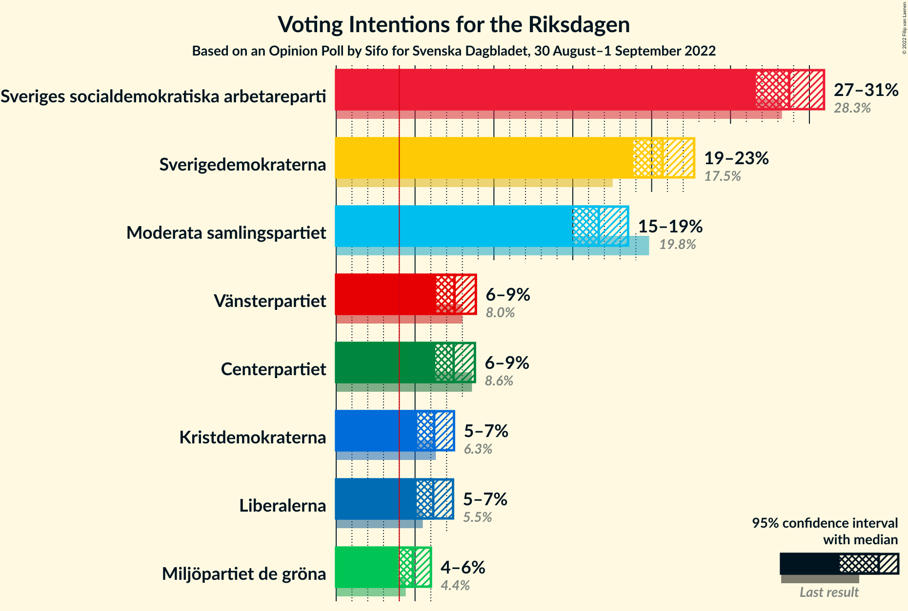

### Confidence Intervals

| Party | Last Result | Poll Result | 80% Confidence Interval | 90% Confidence Interval | 95% Confidence Interval | 99% Confidence Interval |
|:-----:|:-----------:|:-----------:|:-----------------------:|:-----------------------:|:-----------------------:|:-----------------------:|
| Sveriges socialdemokratiska arbetareparti | 28.3% | 28.7% | 27.3–30.2% |26.9–30.6% |26.6–30.9% |26.0–31.6% |
| Sverigedemokraterna | 17.5% | 20.7% | 19.5–22.0% |19.1–22.4% |18.8–22.7% |18.3–23.3% |
| Moderata samlingspartiet | 19.8% | 16.6% | 15.5–17.9% |15.2–18.2% |15.0–18.5% |14.4–19.1% |
| Vänsterpartiet | 8.0% | 7.5% | 6.7–8.4% |6.5–8.6% |6.3–8.9% |6.0–9.3% |
| Centerpartiet | 8.6% | 7.4% | 6.7–8.3% |6.5–8.6% |6.3–8.8% |5.9–9.2% |
| Kristdemokraterna | 6.3% | 6.2% | 5.5–7.0% |5.3–7.3% |5.2–7.5% |4.8–7.9% |
| Liberalerna | 5.5% | 6.2% | 5.5–7.0% |5.3–7.2% |5.1–7.4% |4.8–7.8% |
| Miljöpartiet de gröna | 4.4% | 4.9% | 4.3–5.6% |4.1–5.8% |3.9–6.0% |3.7–6.4% |

*Note:* The poll result column reflects the actual value used in the calculations. Published results may vary slightly, and in addition be rounded to fewer digits.

## Seats

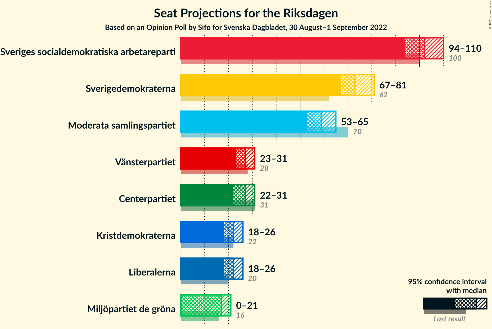

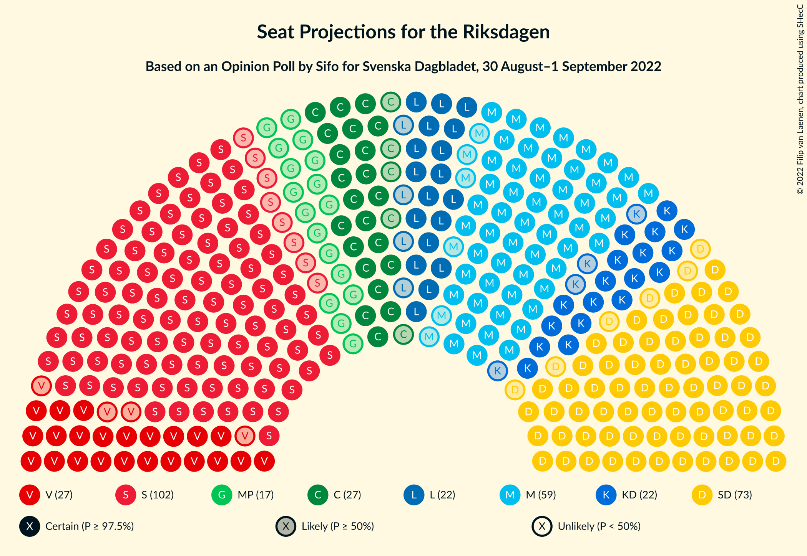

### Confidence Intervals

| Party | Last Result | Median | 80% Confidence Interval | 90% Confidence Interval | 95% Confidence Interval | 99% Confidence Interval |
|:-----:|:-----------:|:------:|:-----------------------:|:-----------------------:|:-----------------------:|:-----------------------:|
| <a href="#sveriges-socialdemokratiska-arbetareparti">Sveriges socialdemokratiska arbetareparti</a> | 100 | 102 | 97–107 |95–108 |94–110 |92–113 |
| <a href="#sverigedemokraterna">Sverigedemokraterna</a> | 62 | 73 | 70–78 |68–80 |67–81 |64–83 |
| <a href="#moderata-samlingspartiet">Moderata samlingspartiet</a> | 70 | 59 | 55–63 |54–65 |53–65 |51–68 |
| <a href="#vänsterpartiet">Vänsterpartiet</a> | 28 | 27 | 24–30 |23–31 |23–31 |21–33 |
| <a href="#centerpartiet">Centerpartiet</a> | 31 | 27 | 24–29 |23–30 |22–31 |21–33 |
| <a href="#kristdemokraterna">Kristdemokraterna</a> | 22 | 22 | 20–25 |19–26 |18–26 |17–28 |
| <a href="#liberalerna">Liberalerna</a> | 20 | 22 | 19–24 |19–26 |18–26 |17–28 |
| <a href="#miljöpartiet-de-gröna">Miljöpartiet de gröna</a> | 16 | 17 | 15–20 |15–20 |0–21 |0–23 |

### Sveriges socialdemokratiska arbetareparti

*For a full overview of the results for this party, see the [Sveriges socialdemokratiska arbetareparti](party-sverigessocialdemokratiskaarbetareparti.html) page.*

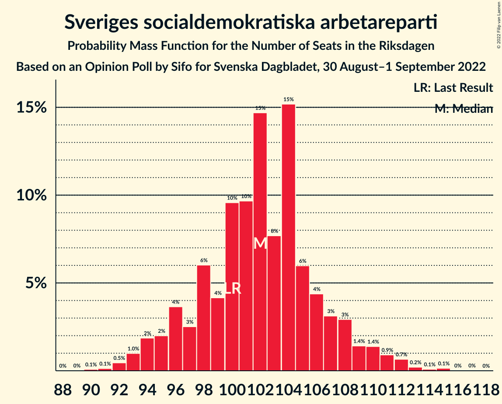

| Number of Seats | Probability | Accumulated | Special Marks |
|:---------------:|:-----------:|:-----------:|:-------------:|
| 90 | 0.1% | 100% |  |
| 91 | 0.1% | 99.9% |  |
| 92 | 0.5% | 99.7% |  |
| 93 | 1.0% | 99.3% |  |
| 94 | 2% | 98% |  |
| 95 | 2% | 96% |  |
| 96 | 4% | 94% |  |
| 97 | 3% | 91% |  |
| 98 | 6% | 88% |  |
| 99 | 4% | 82% |  |
| 100 | 10% | 78% | Last Result |
| 101 | 10% | 69% |  |
| 102 | 15% | 59% | Median |
| 103 | 8% | 44% |  |
| 104 | 15% | 36% |  |
| 105 | 6% | 21% |  |
| 106 | 4% | 15% |  |
| 107 | 3% | 11% |  |
| 108 | 3% | 8% |  |
| 109 | 1.4% | 5% |  |
| 110 | 1.4% | 3% |  |
| 111 | 0.9% | 2% |  |
| 112 | 0.7% | 1.2% |  |
| 113 | 0.2% | 0.5% |  |
| 114 | 0.1% | 0.3% |  |
| 115 | 0.1% | 0.2% |  |
| 116 | 0% | 0.1% |  |
| 117 | 0% | 0% |  |

### Sverigedemokraterna

*For a full overview of the results for this party, see the [Sverigedemokraterna](party-sverigedemokraterna.html) page.*

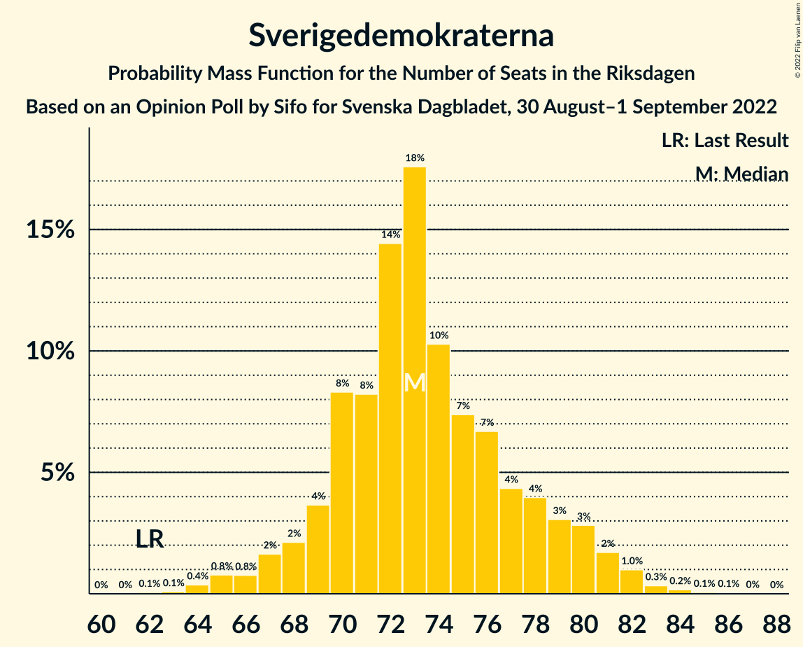

| Number of Seats | Probability | Accumulated | Special Marks |
|:---------------:|:-----------:|:-----------:|:-------------:|
| 62 | 0.1% | 100% | Last Result |
| 63 | 0.1% | 99.9% |  |
| 64 | 0.4% | 99.8% |  |
| 65 | 0.8% | 99.5% |  |
| 66 | 0.8% | 98.7% |  |
| 67 | 2% | 98% |  |
| 68 | 2% | 96% |  |
| 69 | 4% | 94% |  |
| 70 | 8% | 90% |  |
| 71 | 8% | 82% |  |
| 72 | 14% | 74% |  |
| 73 | 18% | 60% | Median |
| 74 | 10% | 42% |  |
| 75 | 7% | 32% |  |
| 76 | 7% | 24% |  |
| 77 | 4% | 18% |  |
| 78 | 4% | 13% |  |
| 79 | 3% | 9% |  |
| 80 | 3% | 6% |  |
| 81 | 2% | 3% |  |
| 82 | 1.0% | 2% |  |
| 83 | 0.3% | 0.7% |  |
| 84 | 0.2% | 0.3% |  |
| 85 | 0.1% | 0.2% |  |
| 86 | 0.1% | 0.1% |  |
| 87 | 0% | 0% |  |

### Moderata samlingspartiet

*For a full overview of the results for this party, see the [Moderata samlingspartiet](party-moderatasamlingspartiet.html) page.*

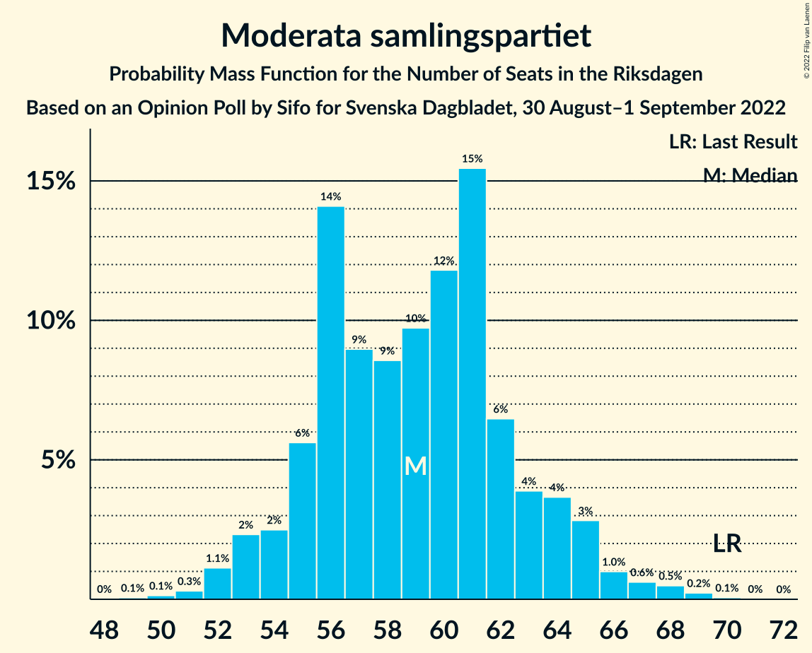

| Number of Seats | Probability | Accumulated | Special Marks |
|:---------------:|:-----------:|:-----------:|:-------------:|
| 49 | 0.1% | 100% |  |
| 50 | 0.1% | 99.9% |  |
| 51 | 0.3% | 99.8% |  |
| 52 | 1.1% | 99.5% |  |
| 53 | 2% | 98% |  |
| 54 | 2% | 96% |  |
| 55 | 6% | 94% |  |
| 56 | 14% | 88% |  |
| 57 | 9% | 74% |  |
| 58 | 9% | 65% |  |
| 59 | 10% | 56% | Median |
| 60 | 12% | 47% |  |
| 61 | 15% | 35% |  |
| 62 | 6% | 19% |  |
| 63 | 4% | 13% |  |
| 64 | 4% | 9% |  |
| 65 | 3% | 5% |  |
| 66 | 1.0% | 2% |  |
| 67 | 0.6% | 1.4% |  |
| 68 | 0.5% | 0.8% |  |
| 69 | 0.2% | 0.3% |  |
| 70 | 0.1% | 0.1% | Last Result |
| 71 | 0% | 0% |  |

### Vänsterpartiet

*For a full overview of the results for this party, see the [Vänsterpartiet](party-vänsterpartiet.html) page.*

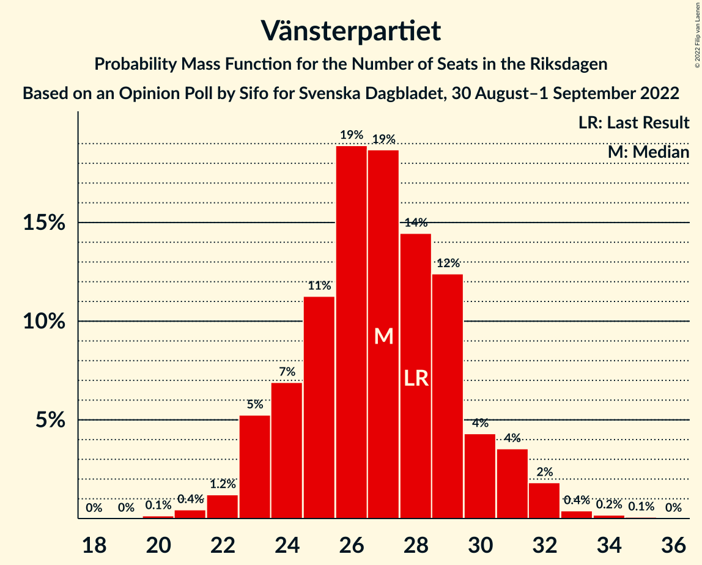

| Number of Seats | Probability | Accumulated | Special Marks |
|:---------------:|:-----------:|:-----------:|:-------------:|
| 20 | 0.1% | 100% |  |
| 21 | 0.4% | 99.8% |  |
| 22 | 1.2% | 99.4% |  |
| 23 | 5% | 98% |  |
| 24 | 7% | 93% |  |
| 25 | 11% | 86% |  |
| 26 | 19% | 75% |  |
| 27 | 19% | 56% | Median |
| 28 | 14% | 37% | Last Result |
| 29 | 12% | 23% |  |
| 30 | 4% | 10% |  |
| 31 | 4% | 6% |  |
| 32 | 2% | 2% |  |
| 33 | 0.4% | 0.7% |  |
| 34 | 0.2% | 0.3% |  |
| 35 | 0.1% | 0.1% |  |
| 36 | 0% | 0% |  |

### Centerpartiet

*For a full overview of the results for this party, see the [Centerpartiet](party-centerpartiet.html) page.*

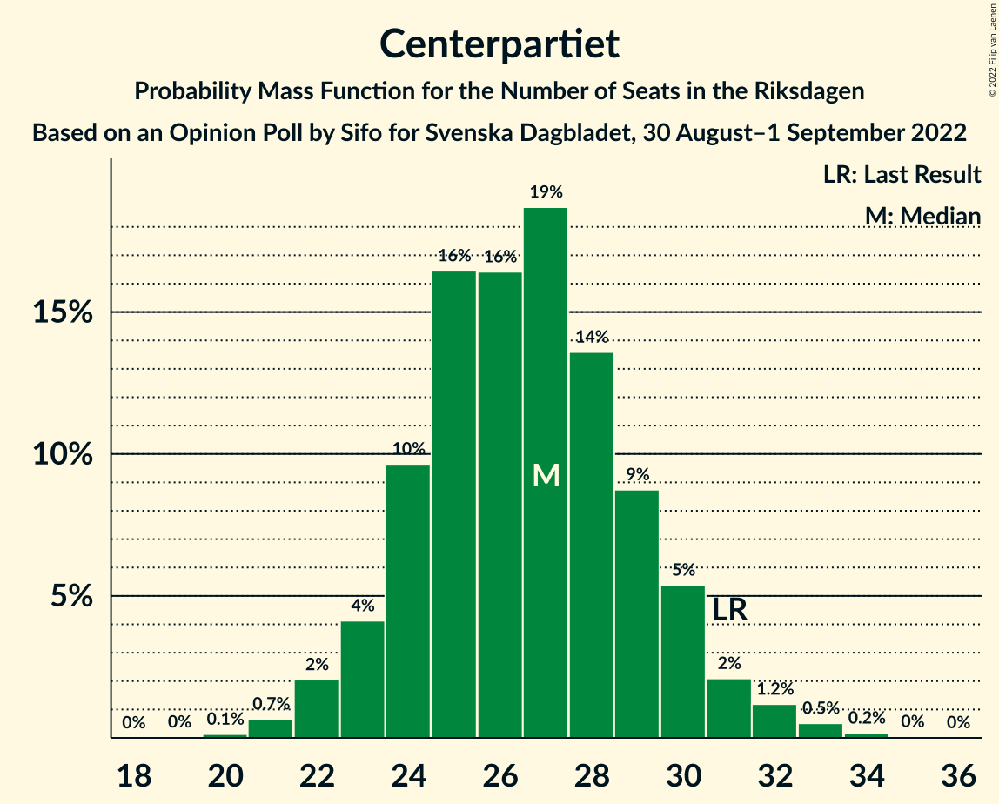

| Number of Seats | Probability | Accumulated | Special Marks |
|:---------------:|:-----------:|:-----------:|:-------------:|
| 20 | 0.1% | 100% |  |
| 21 | 0.7% | 99.8% |  |
| 22 | 2% | 99.2% |  |
| 23 | 4% | 97% |  |
| 24 | 10% | 93% |  |
| 25 | 16% | 83% |  |
| 26 | 16% | 67% |  |
| 27 | 19% | 50% | Median |
| 28 | 14% | 32% |  |
| 29 | 9% | 18% |  |
| 30 | 5% | 9% |  |
| 31 | 2% | 4% | Last Result |
| 32 | 1.2% | 2% |  |
| 33 | 0.5% | 0.7% |  |
| 34 | 0.2% | 0.2% |  |
| 35 | 0% | 0.1% |  |
| 36 | 0% | 0% |  |

### Kristdemokraterna

*For a full overview of the results for this party, see the [Kristdemokraterna](party-kristdemokraterna.html) page.*

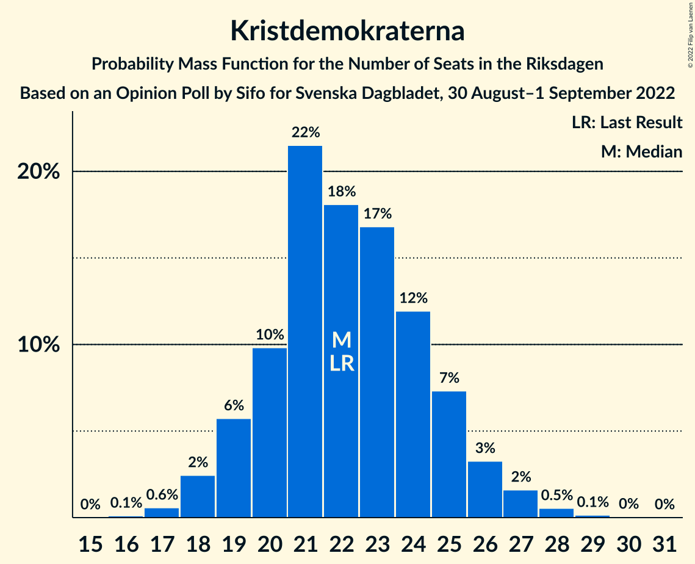

| Number of Seats | Probability | Accumulated | Special Marks |
|:---------------:|:-----------:|:-----------:|:-------------:|
| 16 | 0.1% | 100% |  |
| 17 | 0.6% | 99.9% |  |
| 18 | 2% | 99.3% |  |
| 19 | 6% | 97% |  |
| 20 | 10% | 91% |  |
| 21 | 22% | 81% |  |
| 22 | 18% | 60% | Last Result, Median |
| 23 | 17% | 42% |  |
| 24 | 12% | 25% |  |
| 25 | 7% | 13% |  |
| 26 | 3% | 6% |  |
| 27 | 2% | 2% |  |
| 28 | 0.5% | 0.8% |  |
| 29 | 0.1% | 0.2% |  |
| 30 | 0% | 0.1% |  |
| 31 | 0% | 0% |  |

### Liberalerna

*For a full overview of the results for this party, see the [Liberalerna](party-liberalerna.html) page.*

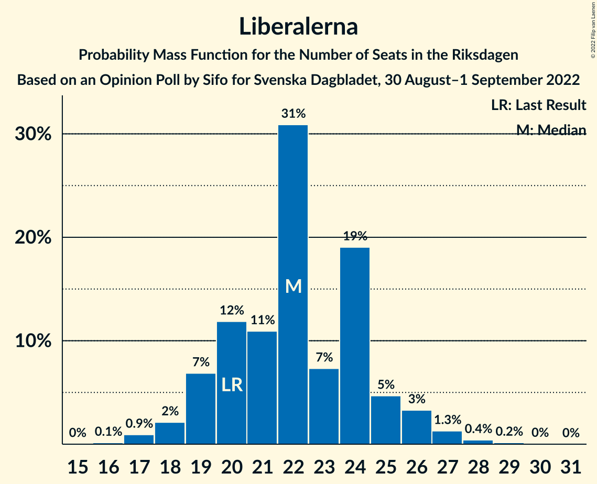

| Number of Seats | Probability | Accumulated | Special Marks |
|:---------------:|:-----------:|:-----------:|:-------------:|
| 16 | 0.1% | 100% |  |
| 17 | 0.9% | 99.8% |  |
| 18 | 2% | 98.9% |  |
| 19 | 7% | 97% |  |
| 20 | 12% | 90% | Last Result |
| 21 | 11% | 78% |  |
| 22 | 31% | 67% | Median |
| 23 | 7% | 36% |  |
| 24 | 19% | 29% |  |
| 25 | 5% | 10% |  |
| 26 | 3% | 5% |  |
| 27 | 1.3% | 2% |  |
| 28 | 0.4% | 0.6% |  |
| 29 | 0.2% | 0.2% |  |
| 30 | 0% | 0.1% |  |
| 31 | 0% | 0% |  |

### Miljöpartiet de gröna

*For a full overview of the results for this party, see the [Miljöpartiet de gröna](party-miljöpartietdegröna.html) page.*

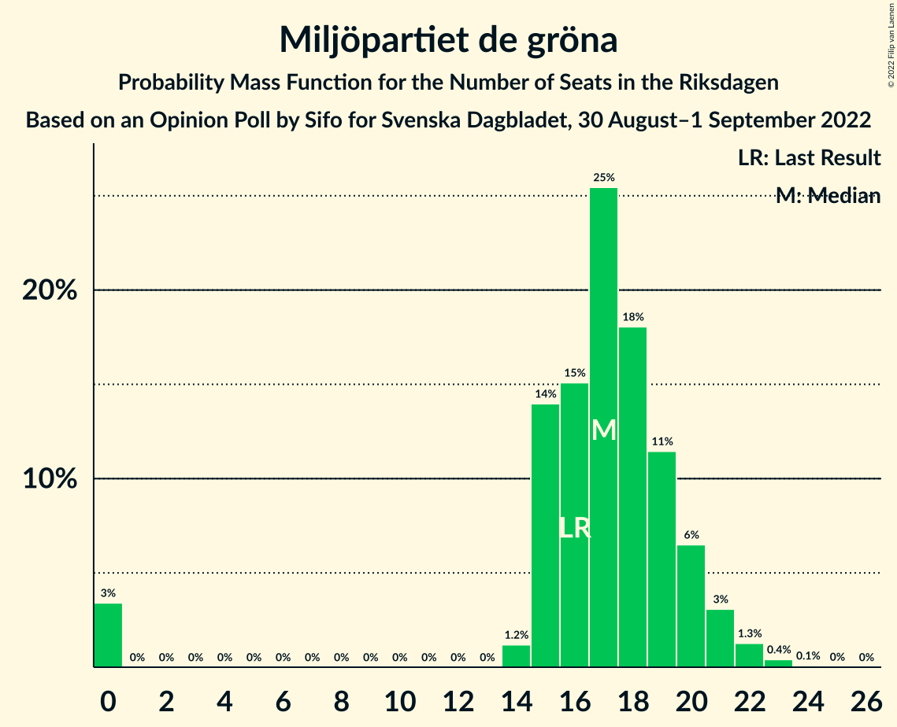

| Number of Seats | Probability | Accumulated | Special Marks |
|:---------------:|:-----------:|:-----------:|:-------------:|
| 0 | 3% | 100% |  |
| 1 | 0% | 97% |  |
| 2 | 0% | 97% |  |
| 3 | 0% | 97% |  |
| 4 | 0% | 97% |  |
| 5 | 0% | 97% |  |
| 6 | 0% | 97% |  |
| 7 | 0% | 97% |  |
| 8 | 0% | 97% |  |
| 9 | 0% | 97% |  |
| 10 | 0% | 97% |  |
| 11 | 0% | 97% |  |
| 12 | 0% | 97% |  |
| 13 | 0% | 97% |  |
| 14 | 1.2% | 97% |  |
| 15 | 14% | 95% |  |
| 16 | 15% | 81% | Last Result |
| 17 | 25% | 66% | Median |
| 18 | 18% | 41% |  |
| 19 | 11% | 23% |  |
| 20 | 6% | 11% |  |
| 21 | 3% | 5% |  |
| 22 | 1.3% | 2% |  |
| 23 | 0.4% | 0.5% |  |
| 24 | 0.1% | 0.1% |  |
| 25 | 0% | 0% |  |

## Coalitions

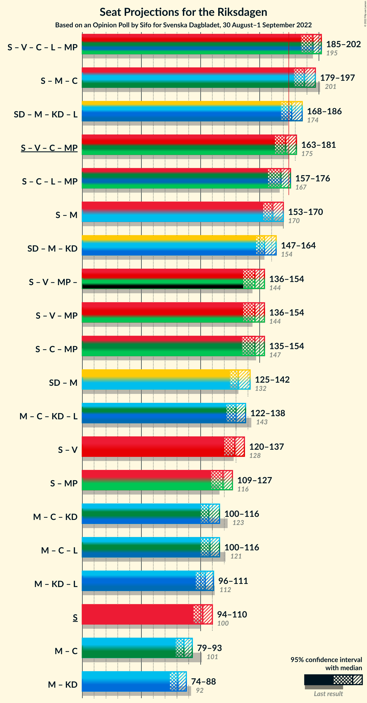

### Confidence Intervals

| Coalition | Last Result | Median | Majority? | 80% Confidence Interval | 90% Confidence Interval | 95% Confidence Interval | 99% Confidence Interval |
|:---------:|:-----------:|:------:|:---------:|:-----------------------:|:-----------------------:|:-----------------------:|:-----------------------:|
| Sveriges socialdemokratiska arbetareparti – Vänsterpartiet – Centerpartiet – Liberalerna – Miljöpartiet de gröna | 195 | 195 | 100% | 189–200 | 187–201 | 185–202 | 181–205 |
| Sveriges socialdemokratiska arbetareparti – Moderata samlingspartiet – Centerpartiet | 201 | 188 | 99.9% | 182–193 | 180–195 | 179–197 | 176–202 |
| Sverigedemokraterna – Moderata samlingspartiet – Kristdemokraterna – Liberalerna | 174 | 177 | 67% | 171–183 | 170–185 | 168–186 | 166–190 |
| Sveriges socialdemokratiska arbetareparti – Vänsterpartiet – Centerpartiet – Miljöpartiet de gröna | 175 | 172 | 33% | 166–178 | 164–179 | 163–181 | 159–183 |
| Sveriges socialdemokratiska arbetareparti – Centerpartiet – Liberalerna – Miljöpartiet de gröna | 167 | 168 | 5% | 161–173 | 160–174 | 157–176 | 154–179 |
| Sveriges socialdemokratiska arbetareparti – Moderata samlingspartiet | 170 | 161 | 0.5% | 156–167 | 154–169 | 153–170 | 150–174 |
| Sverigedemokraterna – Moderata samlingspartiet – Kristdemokraterna | 154 | 154 | 0% | 149–160 | 148–162 | 147–164 | 144–168 |
| Sveriges socialdemokratiska arbetareparti – Vänsterpartiet – Miljöpartiet de gröna | 144 | 146 | 0% | 140–151 | 138–153 | 136–154 | 131–157 |
| Sveriges socialdemokratiska arbetareparti – Centerpartiet – Miljöpartiet de gröna | 147 | 146 | 0% | 140–151 | 137–152 | 135–154 | 131–157 |
| Sverigedemokraterna – Moderata samlingspartiet | 132 | 132 | 0% | 127–138 | 126–140 | 125–142 | 122–145 |
| Moderata samlingspartiet – Centerpartiet – Kristdemokraterna – Liberalerna | 143 | 130 | 0% | 124–135 | 123–137 | 122–138 | 119–142 |
| Sveriges socialdemokratiska arbetareparti – Vänsterpartiet | 128 | 129 | 0% | 124–134 | 122–136 | 120–137 | 118–141 |
| Sveriges socialdemokratiska arbetareparti – Miljöpartiet de gröna | 116 | 119 | 0% | 113–124 | 111–126 | 109–127 | 103–130 |
| Moderata samlingspartiet – Centerpartiet – Kristdemokraterna | 123 | 107 | 0% | 103–113 | 101–114 | 100–116 | 98–119 |
| Moderata samlingspartiet – Centerpartiet – Liberalerna | 121 | 108 | 0% | 102–113 | 101–114 | 100–116 | 98–119 |
| Moderata samlingspartiet – Kristdemokraterna – Liberalerna | 112 | 104 | 0% | 98–108 | 97–110 | 96–111 | 93–114 |
| Sveriges socialdemokratiska arbetareparti | 100 | 102 | 0% | 97–107 | 95–108 | 94–110 | 92–113 |
| Moderata samlingspartiet – Centerpartiet | 101 | 86 | 0% | 81–90 | 79–92 | 79–93 | 77–96 |
| Moderata samlingspartiet – Kristdemokraterna | 92 | 81 | 0% | 77–86 | 75–87 | 74–88 | 72–91 |

### Sveriges socialdemokratiska arbetareparti – Vänsterpartiet – Centerpartiet – Liberalerna – Miljöpartiet de gröna

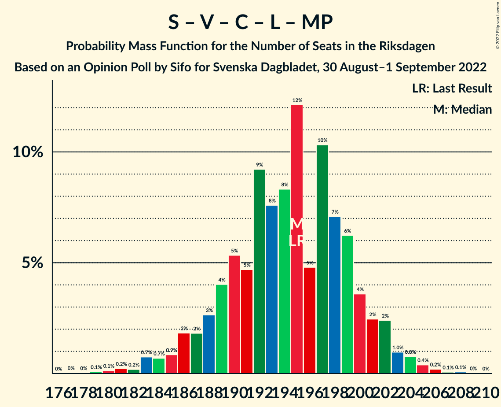

| Number of Seats | Probability | Accumulated | Special Marks |
|:---------------:|:-----------:|:-----------:|:-------------:|
| 177 | 0% | 100% |  |
| 178 | 0% | 99.9% |  |
| 179 | 0.1% | 99.9% |  |
| 180 | 0.1% | 99.8% |  |
| 181 | 0.2% | 99.7% |  |
| 182 | 0.2% | 99.4% |  |
| 183 | 0.7% | 99.3% |  |
| 184 | 0.7% | 98.5% |  |
| 185 | 0.9% | 98% |  |
| 186 | 2% | 97% |  |
| 187 | 2% | 95% |  |
| 188 | 3% | 93% |  |
| 189 | 4% | 91% |  |
| 190 | 5% | 87% |  |
| 191 | 5% | 81% |  |
| 192 | 9% | 77% |  |
| 193 | 8% | 67% |  |
| 194 | 8% | 60% |  |
| 195 | 12% | 51% | Last Result, Median |
| 196 | 5% | 39% |  |
| 197 | 10% | 35% |  |
| 198 | 7% | 24% |  |
| 199 | 6% | 17% |  |
| 200 | 4% | 11% |  |
| 201 | 2% | 7% |  |
| 202 | 2% | 5% |  |
| 203 | 1.0% | 2% |  |
| 204 | 0.8% | 2% |  |
| 205 | 0.4% | 0.8% |  |
| 206 | 0.2% | 0.4% |  |
| 207 | 0.1% | 0.2% |  |
| 208 | 0.1% | 0.1% |  |
| 209 | 0% | 0% |  |

### Sveriges socialdemokratiska arbetareparti – Moderata samlingspartiet – Centerpartiet

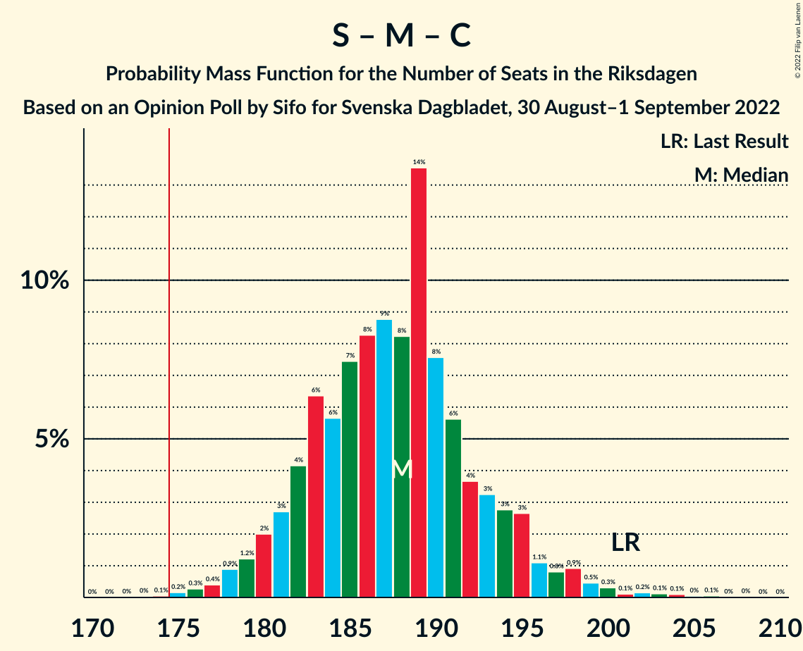

| Number of Seats | Probability | Accumulated | Special Marks |
|:---------------:|:-----------:|:-----------:|:-------------:|
| 173 | 0% | 100% |  |
| 174 | 0.1% | 99.9% |  |
| 175 | 0.2% | 99.9% | Majority |
| 176 | 0.3% | 99.7% |  |
| 177 | 0.4% | 99.5% |  |
| 178 | 0.9% | 99.0% |  |
| 179 | 1.2% | 98% |  |
| 180 | 2% | 97% |  |
| 181 | 3% | 95% |  |
| 182 | 4% | 92% |  |
| 183 | 6% | 88% |  |
| 184 | 6% | 82% |  |
| 185 | 7% | 76% |  |
| 186 | 8% | 69% |  |
| 187 | 9% | 60% |  |
| 188 | 8% | 52% | Median |
| 189 | 14% | 43% |  |
| 190 | 8% | 30% |  |
| 191 | 6% | 22% |  |
| 192 | 4% | 17% |  |
| 193 | 3% | 13% |  |
| 194 | 3% | 10% |  |
| 195 | 3% | 7% |  |
| 196 | 1.1% | 4% |  |
| 197 | 0.8% | 3% |  |
| 198 | 0.9% | 2% |  |
| 199 | 0.5% | 1.4% |  |
| 200 | 0.3% | 0.9% |  |
| 201 | 0.1% | 0.6% | Last Result |
| 202 | 0.2% | 0.5% |  |
| 203 | 0.1% | 0.4% |  |
| 204 | 0.1% | 0.3% |  |
| 205 | 0% | 0.2% |  |
| 206 | 0.1% | 0.1% |  |
| 207 | 0% | 0% |  |

### Sverigedemokraterna – Moderata samlingspartiet – Kristdemokraterna – Liberalerna

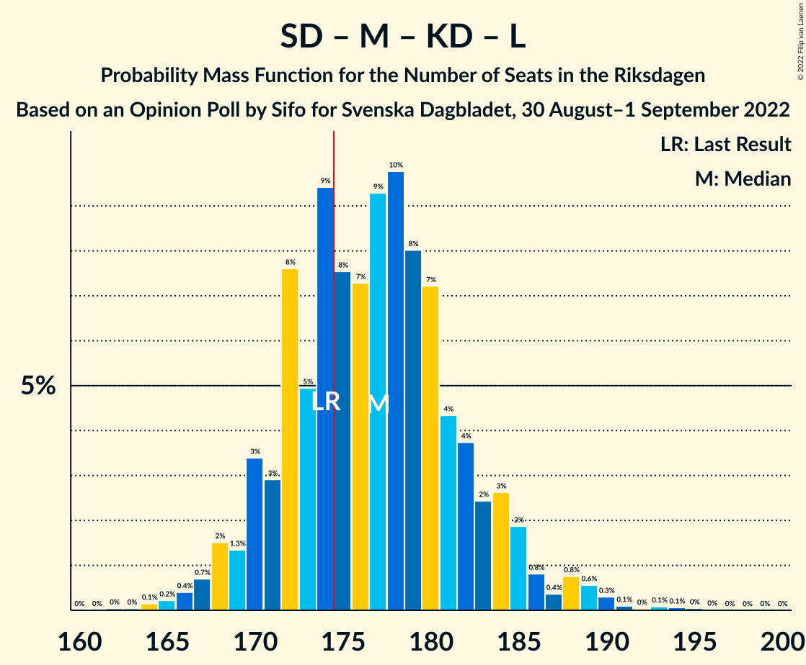

| Number of Seats | Probability | Accumulated | Special Marks |
|:---------------:|:-----------:|:-----------:|:-------------:|
| 162 | 0% | 100% |  |
| 163 | 0% | 99.9% |  |
| 164 | 0.1% | 99.9% |  |
| 165 | 0.2% | 99.8% |  |
| 166 | 0.4% | 99.5% |  |
| 167 | 0.7% | 99.1% |  |
| 168 | 2% | 98% |  |
| 169 | 1.3% | 97% |  |
| 170 | 3% | 96% |  |
| 171 | 3% | 92% |  |
| 172 | 8% | 89% |  |
| 173 | 5% | 82% |  |
| 174 | 9% | 77% | Last Result |
| 175 | 8% | 67% | Majority |
| 176 | 7% | 60% | Median |
| 177 | 9% | 52% |  |
| 178 | 10% | 43% |  |
| 179 | 8% | 33% |  |
| 180 | 7% | 25% |  |
| 181 | 4% | 18% |  |
| 182 | 4% | 14% |  |
| 183 | 2% | 10% |  |
| 184 | 3% | 8% |  |
| 185 | 2% | 5% |  |
| 186 | 0.8% | 3% |  |
| 187 | 0.4% | 2% |  |
| 188 | 0.8% | 2% |  |
| 189 | 0.6% | 1.2% |  |
| 190 | 0.3% | 0.7% |  |
| 191 | 0.1% | 0.4% |  |
| 192 | 0% | 0.3% |  |
| 193 | 0.1% | 0.2% |  |
| 194 | 0.1% | 0.1% |  |
| 195 | 0% | 0.1% |  |
| 196 | 0% | 0% |  |

### Sveriges socialdemokratiska arbetareparti – Vänsterpartiet – Centerpartiet – Miljöpartiet de gröna

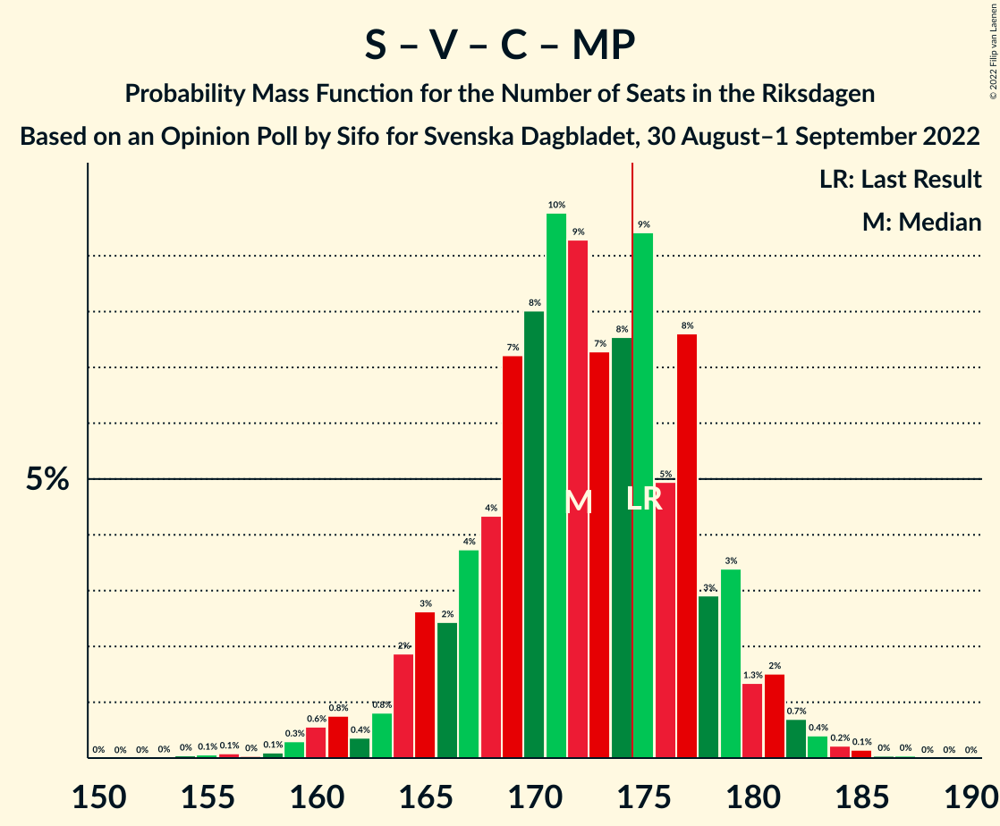

| Number of Seats | Probability | Accumulated | Special Marks |
|:---------------:|:-----------:|:-----------:|:-------------:|
| 154 | 0% | 100% |  |
| 155 | 0.1% | 99.9% |  |
| 156 | 0.1% | 99.9% |  |
| 157 | 0% | 99.8% |  |
| 158 | 0.1% | 99.7% |  |
| 159 | 0.3% | 99.6% |  |
| 160 | 0.6% | 99.3% |  |
| 161 | 0.8% | 98.8% |  |
| 162 | 0.4% | 98% |  |
| 163 | 0.8% | 98% |  |
| 164 | 2% | 97% |  |
| 165 | 3% | 95% |  |
| 166 | 2% | 92% |  |
| 167 | 4% | 90% |  |
| 168 | 4% | 86% |  |
| 169 | 7% | 82% |  |
| 170 | 8% | 75% |  |
| 171 | 10% | 67% |  |
| 172 | 9% | 57% |  |
| 173 | 7% | 48% | Median |
| 174 | 8% | 40% |  |
| 175 | 9% | 33% | Last Result, Majority |
| 176 | 5% | 23% |  |
| 177 | 8% | 18% |  |
| 178 | 3% | 11% |  |
| 179 | 3% | 8% |  |
| 180 | 1.3% | 4% |  |
| 181 | 2% | 3% |  |
| 182 | 0.7% | 2% |  |
| 183 | 0.4% | 0.9% |  |
| 184 | 0.2% | 0.5% |  |
| 185 | 0.1% | 0.2% |  |
| 186 | 0% | 0.1% |  |
| 187 | 0% | 0.1% |  |
| 188 | 0% | 0% |  |

### Sveriges socialdemokratiska arbetareparti – Centerpartiet – Liberalerna – Miljöpartiet de gröna

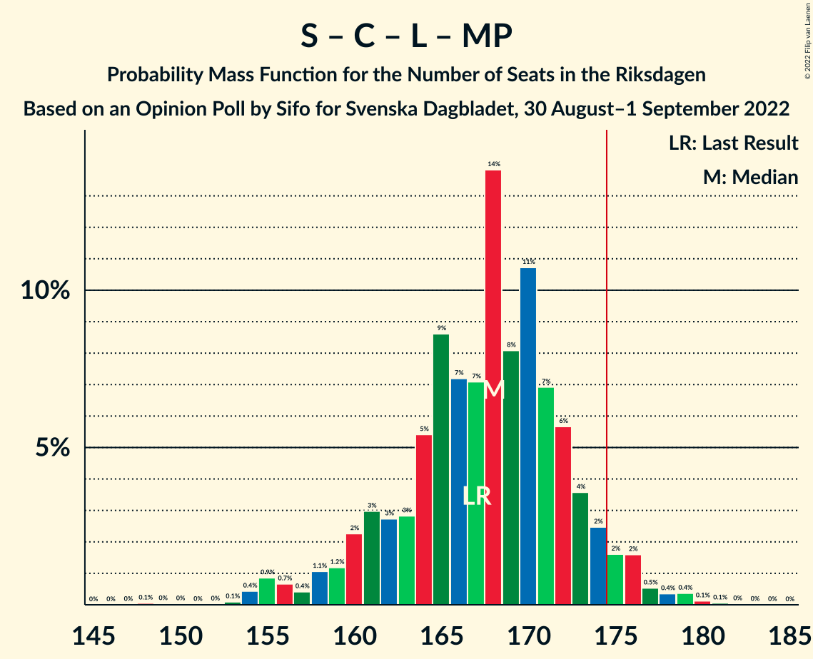

| Number of Seats | Probability | Accumulated | Special Marks |
|:---------------:|:-----------:|:-----------:|:-------------:|
| 148 | 0.1% | 100% |  |
| 149 | 0% | 99.9% |  |
| 150 | 0% | 99.9% |  |
| 151 | 0% | 99.9% |  |
| 152 | 0% | 99.8% |  |
| 153 | 0.1% | 99.8% |  |
| 154 | 0.4% | 99.7% |  |
| 155 | 0.9% | 99.3% |  |
| 156 | 0.7% | 98% |  |
| 157 | 0.4% | 98% |  |
| 158 | 1.1% | 97% |  |
| 159 | 1.2% | 96% |  |
| 160 | 2% | 95% |  |
| 161 | 3% | 93% |  |
| 162 | 3% | 90% |  |
| 163 | 3% | 87% |  |
| 164 | 5% | 84% |  |
| 165 | 9% | 79% |  |
| 166 | 7% | 70% |  |
| 167 | 7% | 63% | Last Result |
| 168 | 14% | 56% | Median |
| 169 | 8% | 42% |  |
| 170 | 11% | 34% |  |
| 171 | 7% | 23% |  |
| 172 | 6% | 16% |  |
| 173 | 4% | 11% |  |
| 174 | 2% | 7% |  |
| 175 | 2% | 5% | Majority |
| 176 | 2% | 3% |  |
| 177 | 0.5% | 1.5% |  |
| 178 | 0.4% | 1.0% |  |
| 179 | 0.4% | 0.6% |  |
| 180 | 0.1% | 0.2% |  |
| 181 | 0.1% | 0.1% |  |
| 182 | 0% | 0.1% |  |
| 183 | 0% | 0% |  |

### Sveriges socialdemokratiska arbetareparti – Moderata samlingspartiet

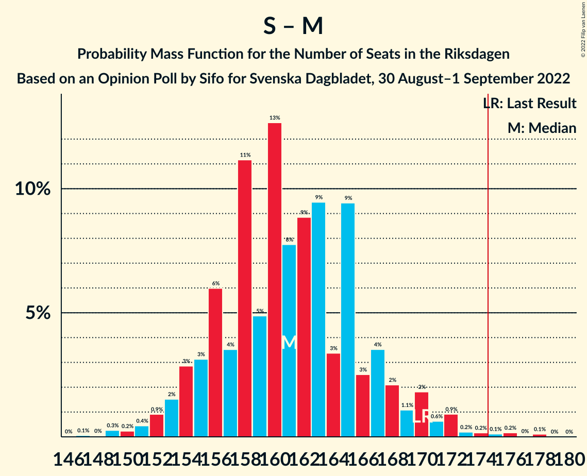

| Number of Seats | Probability | Accumulated | Special Marks |
|:---------------:|:-----------:|:-----------:|:-------------:|
| 147 | 0.1% | 100% |  |
| 148 | 0% | 99.9% |  |
| 149 | 0.3% | 99.9% |  |
| 150 | 0.2% | 99.6% |  |
| 151 | 0.4% | 99.4% |  |
| 152 | 0.9% | 98.9% |  |
| 153 | 2% | 98% |  |
| 154 | 3% | 96% |  |
| 155 | 3% | 94% |  |
| 156 | 6% | 90% |  |
| 157 | 4% | 85% |  |
| 158 | 11% | 81% |  |
| 159 | 5% | 70% |  |
| 160 | 13% | 65% |  |
| 161 | 8% | 52% | Median |
| 162 | 9% | 45% |  |
| 163 | 9% | 36% |  |
| 164 | 3% | 26% |  |
| 165 | 9% | 23% |  |
| 166 | 3% | 13% |  |
| 167 | 4% | 11% |  |
| 168 | 2% | 7% |  |
| 169 | 1.1% | 5% |  |
| 170 | 2% | 4% | Last Result |
| 171 | 0.6% | 2% |  |
| 172 | 0.9% | 2% |  |
| 173 | 0.2% | 0.8% |  |
| 174 | 0.2% | 0.6% |  |
| 175 | 0.1% | 0.5% | Majority |
| 176 | 0.2% | 0.4% |  |
| 177 | 0% | 0.2% |  |
| 178 | 0.1% | 0.2% |  |
| 179 | 0% | 0% |  |

### Sverigedemokraterna – Moderata samlingspartiet – Kristdemokraterna

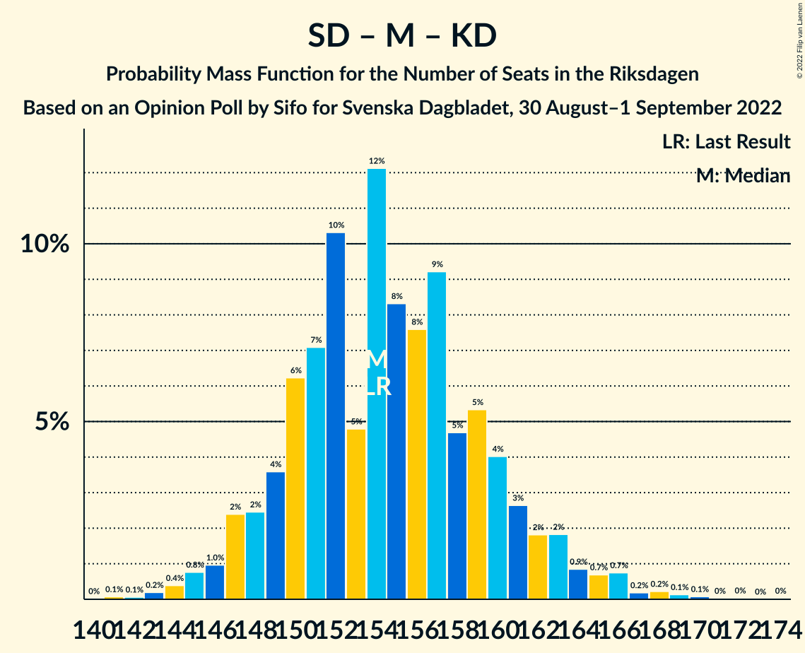

| Number of Seats | Probability | Accumulated | Special Marks |
|:---------------:|:-----------:|:-----------:|:-------------:|
| 141 | 0.1% | 100% |  |
| 142 | 0.1% | 99.9% |  |
| 143 | 0.2% | 99.8% |  |
| 144 | 0.4% | 99.6% |  |
| 145 | 0.8% | 99.2% |  |
| 146 | 1.0% | 98% |  |
| 147 | 2% | 98% |  |
| 148 | 2% | 95% |  |
| 149 | 4% | 93% |  |
| 150 | 6% | 89% |  |
| 151 | 7% | 83% |  |
| 152 | 10% | 76% |  |
| 153 | 5% | 65% |  |
| 154 | 12% | 61% | Last Result, Median |
| 155 | 8% | 49% |  |
| 156 | 8% | 40% |  |
| 157 | 9% | 33% |  |
| 158 | 5% | 23% |  |
| 159 | 5% | 19% |  |
| 160 | 4% | 13% |  |
| 161 | 3% | 9% |  |
| 162 | 2% | 7% |  |
| 163 | 2% | 5% |  |
| 164 | 0.9% | 3% |  |
| 165 | 0.7% | 2% |  |
| 166 | 0.7% | 1.5% |  |
| 167 | 0.2% | 0.7% |  |
| 168 | 0.2% | 0.6% |  |
| 169 | 0.1% | 0.3% |  |
| 170 | 0.1% | 0.2% |  |
| 171 | 0% | 0.1% |  |
| 172 | 0% | 0.1% |  |
| 173 | 0% | 0% |  |

### Sveriges socialdemokratiska arbetareparti – Vänsterpartiet – Miljöpartiet de gröna

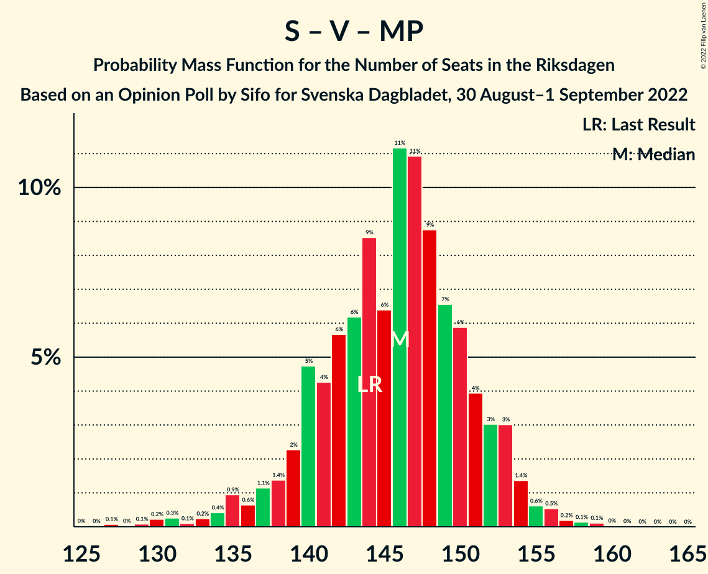

| Number of Seats | Probability | Accumulated | Special Marks |
|:---------------:|:-----------:|:-----------:|:-------------:|
| 126 | 0% | 100% |  |
| 127 | 0.1% | 99.9% |  |
| 128 | 0% | 99.9% |  |
| 129 | 0.1% | 99.8% |  |
| 130 | 0.2% | 99.7% |  |
| 131 | 0.3% | 99.5% |  |
| 132 | 0.1% | 99.3% |  |
| 133 | 0.2% | 99.2% |  |
| 134 | 0.4% | 98.9% |  |
| 135 | 0.9% | 98% |  |
| 136 | 0.6% | 98% |  |
| 137 | 1.1% | 97% |  |
| 138 | 1.4% | 96% |  |
| 139 | 2% | 94% |  |
| 140 | 5% | 92% |  |
| 141 | 4% | 87% |  |
| 142 | 6% | 83% |  |
| 143 | 6% | 77% |  |
| 144 | 9% | 71% | Last Result |
| 145 | 6% | 63% |  |
| 146 | 11% | 56% | Median |
| 147 | 11% | 45% |  |
| 148 | 9% | 34% |  |
| 149 | 7% | 25% |  |
| 150 | 6% | 19% |  |
| 151 | 4% | 13% |  |
| 152 | 3% | 9% |  |
| 153 | 3% | 6% |  |
| 154 | 1.4% | 3% |  |
| 155 | 0.6% | 2% |  |
| 156 | 0.5% | 1.0% |  |
| 157 | 0.2% | 0.5% |  |
| 158 | 0.1% | 0.3% |  |
| 159 | 0.1% | 0.2% |  |
| 160 | 0% | 0.1% |  |
| 161 | 0% | 0% |  |

### Sveriges socialdemokratiska arbetareparti – Centerpartiet – Miljöpartiet de gröna

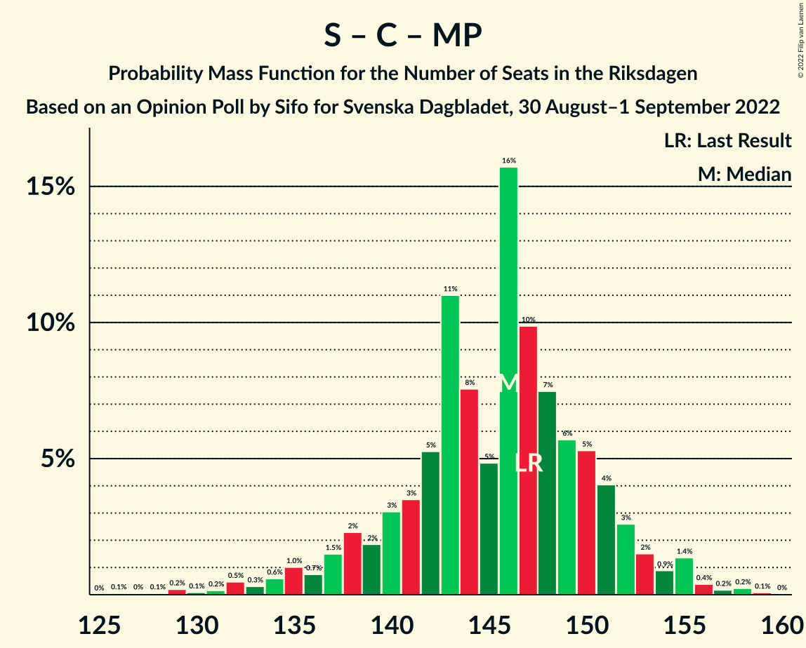

| Number of Seats | Probability | Accumulated | Special Marks |
|:---------------:|:-----------:|:-----------:|:-------------:|
| 126 | 0.1% | 100% |  |
| 127 | 0% | 99.9% |  |
| 128 | 0.1% | 99.9% |  |
| 129 | 0.2% | 99.8% |  |
| 130 | 0.1% | 99.6% |  |
| 131 | 0.2% | 99.5% |  |
| 132 | 0.5% | 99.4% |  |
| 133 | 0.3% | 98.9% |  |
| 134 | 0.6% | 98.6% |  |
| 135 | 1.0% | 98% |  |
| 136 | 0.7% | 97% |  |
| 137 | 1.5% | 96% |  |
| 138 | 2% | 95% |  |
| 139 | 2% | 92% |  |
| 140 | 3% | 91% |  |
| 141 | 3% | 88% |  |
| 142 | 5% | 84% |  |
| 143 | 11% | 79% |  |
| 144 | 8% | 68% |  |
| 145 | 5% | 60% |  |
| 146 | 16% | 55% | Median |
| 147 | 10% | 40% | Last Result |
| 148 | 7% | 30% |  |
| 149 | 6% | 22% |  |
| 150 | 5% | 17% |  |
| 151 | 4% | 11% |  |
| 152 | 3% | 7% |  |
| 153 | 2% | 5% |  |
| 154 | 0.9% | 3% |  |
| 155 | 1.4% | 2% |  |
| 156 | 0.4% | 0.9% |  |
| 157 | 0.2% | 0.5% |  |
| 158 | 0.2% | 0.4% |  |
| 159 | 0.1% | 0.1% |  |
| 160 | 0% | 0% |  |

### Sverigedemokraterna – Moderata samlingspartiet

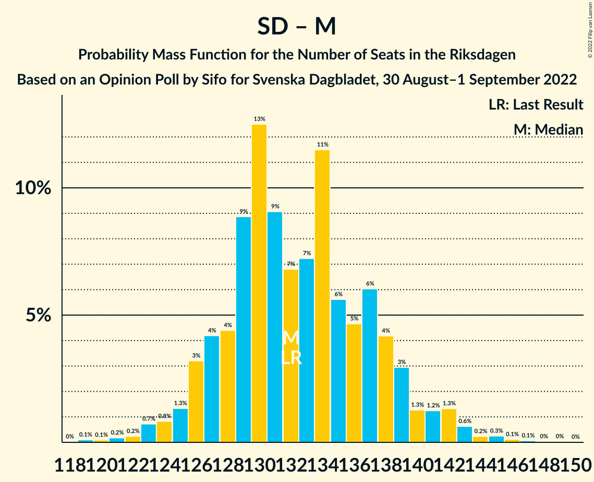

| Number of Seats | Probability | Accumulated | Special Marks |
|:---------------:|:-----------:|:-----------:|:-------------:|
| 119 | 0.1% | 100% |  |
| 120 | 0.1% | 99.9% |  |
| 121 | 0.2% | 99.8% |  |
| 122 | 0.2% | 99.6% |  |
| 123 | 0.7% | 99.4% |  |
| 124 | 0.8% | 98.6% |  |
| 125 | 1.3% | 98% |  |
| 126 | 3% | 96% |  |
| 127 | 4% | 93% |  |
| 128 | 4% | 89% |  |
| 129 | 9% | 85% |  |
| 130 | 13% | 76% |  |
| 131 | 9% | 63% |  |
| 132 | 7% | 54% | Last Result, Median |
| 133 | 7% | 47% |  |
| 134 | 11% | 40% |  |
| 135 | 6% | 29% |  |
| 136 | 5% | 23% |  |
| 137 | 6% | 18% |  |
| 138 | 4% | 12% |  |
| 139 | 3% | 8% |  |
| 140 | 1.3% | 5% |  |
| 141 | 1.2% | 4% |  |
| 142 | 1.3% | 3% |  |
| 143 | 0.6% | 1.4% |  |
| 144 | 0.2% | 0.8% |  |
| 145 | 0.3% | 0.5% |  |
| 146 | 0.1% | 0.3% |  |
| 147 | 0.1% | 0.2% |  |
| 148 | 0% | 0.1% |  |
| 149 | 0% | 0.1% |  |
| 150 | 0% | 0% |  |

### Moderata samlingspartiet – Centerpartiet – Kristdemokraterna – Liberalerna

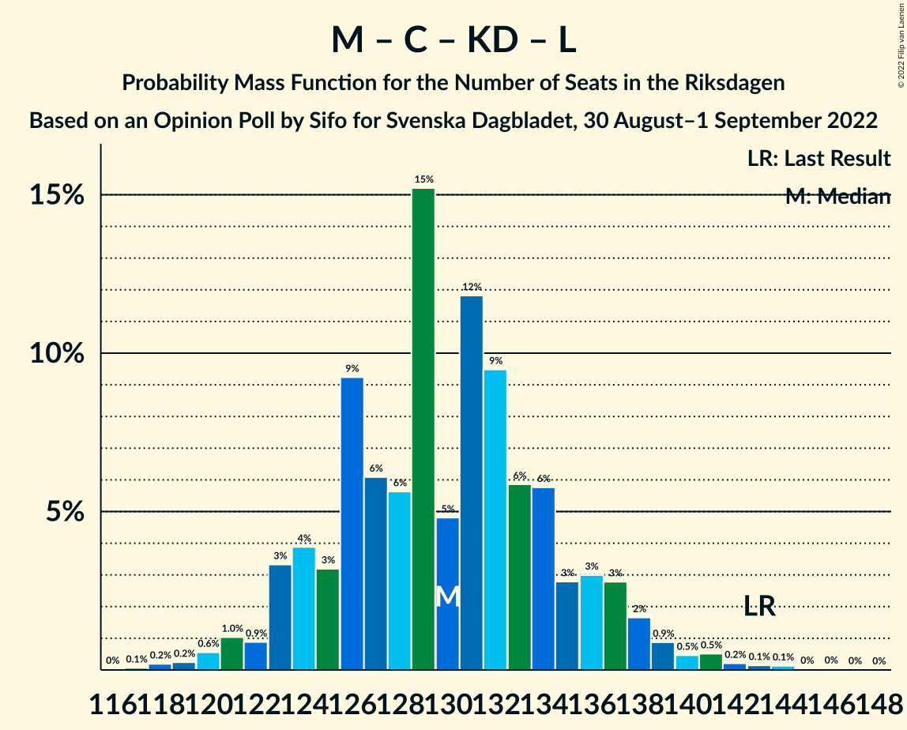

| Number of Seats | Probability | Accumulated | Special Marks |
|:---------------:|:-----------:|:-----------:|:-------------:|
| 116 | 0% | 100% |  |
| 117 | 0.1% | 99.9% |  |
| 118 | 0.2% | 99.9% |  |
| 119 | 0.2% | 99.7% |  |
| 120 | 0.6% | 99.4% |  |
| 121 | 1.0% | 98.9% |  |
| 122 | 0.9% | 98% |  |
| 123 | 3% | 97% |  |
| 124 | 4% | 94% |  |
| 125 | 3% | 90% |  |
| 126 | 9% | 87% |  |
| 127 | 6% | 77% |  |
| 128 | 6% | 71% |  |
| 129 | 15% | 66% |  |
| 130 | 5% | 50% | Median |
| 131 | 12% | 46% |  |
| 132 | 9% | 34% |  |
| 133 | 6% | 24% |  |
| 134 | 6% | 18% |  |
| 135 | 3% | 13% |  |
| 136 | 3% | 10% |  |
| 137 | 3% | 7% |  |
| 138 | 2% | 4% |  |
| 139 | 0.9% | 2% |  |
| 140 | 0.5% | 2% |  |
| 141 | 0.5% | 1.1% |  |
| 142 | 0.2% | 0.6% |  |
| 143 | 0.1% | 0.4% | Last Result |
| 144 | 0.1% | 0.2% |  |
| 145 | 0% | 0.1% |  |
| 146 | 0% | 0.1% |  |
| 147 | 0% | 0% |  |

### Sveriges socialdemokratiska arbetareparti – Vänsterpartiet

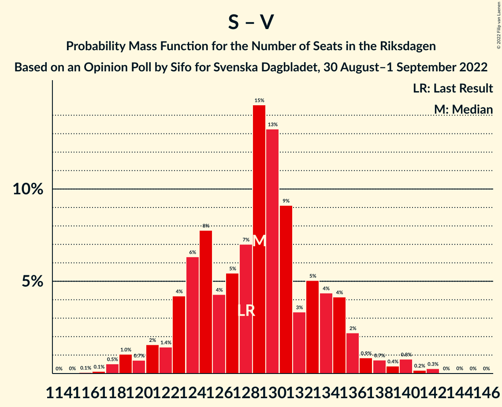

| Number of Seats | Probability | Accumulated | Special Marks |
|:---------------:|:-----------:|:-----------:|:-------------:|
| 115 | 0% | 100% |  |
| 116 | 0.1% | 99.9% |  |
| 117 | 0.1% | 99.9% |  |
| 118 | 0.5% | 99.8% |  |
| 119 | 1.0% | 99.2% |  |
| 120 | 0.7% | 98% |  |
| 121 | 2% | 97% |  |
| 122 | 1.4% | 96% |  |
| 123 | 4% | 94% |  |
| 124 | 6% | 90% |  |
| 125 | 8% | 84% |  |
| 126 | 4% | 76% |  |
| 127 | 5% | 72% |  |
| 128 | 7% | 66% | Last Result |
| 129 | 15% | 59% | Median |
| 130 | 13% | 45% |  |
| 131 | 9% | 32% |  |
| 132 | 3% | 22% |  |
| 133 | 5% | 19% |  |
| 134 | 4% | 14% |  |
| 135 | 4% | 10% |  |
| 136 | 2% | 6% |  |
| 137 | 0.9% | 3% |  |
| 138 | 0.7% | 2% |  |
| 139 | 0.4% | 2% |  |
| 140 | 0.8% | 1.4% |  |
| 141 | 0.2% | 0.6% |  |
| 142 | 0.3% | 0.4% |  |
| 143 | 0% | 0.1% |  |
| 144 | 0% | 0.1% |  |
| 145 | 0% | 0.1% |  |
| 146 | 0% | 0% |  |

### Sveriges socialdemokratiska arbetareparti – Miljöpartiet de gröna

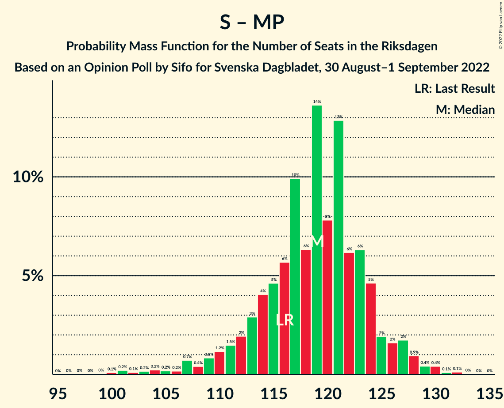

| Number of Seats | Probability | Accumulated | Special Marks |
|:---------------:|:-----------:|:-----------:|:-------------:|
| 99 | 0% | 100% |  |
| 100 | 0.1% | 99.9% |  |
| 101 | 0.2% | 99.8% |  |
| 102 | 0.1% | 99.6% |  |
| 103 | 0.2% | 99.5% |  |
| 104 | 0.2% | 99.3% |  |
| 105 | 0.2% | 99.1% |  |
| 106 | 0.2% | 98.9% |  |
| 107 | 0.7% | 98.8% |  |
| 108 | 0.4% | 98% |  |
| 109 | 0.8% | 98% |  |
| 110 | 1.2% | 97% |  |
| 111 | 1.5% | 96% |  |
| 112 | 2% | 94% |  |
| 113 | 3% | 92% |  |
| 114 | 4% | 89% |  |
| 115 | 5% | 85% |  |
| 116 | 6% | 81% | Last Result |
| 117 | 10% | 75% |  |
| 118 | 6% | 65% |  |
| 119 | 14% | 59% | Median |
| 120 | 8% | 45% |  |
| 121 | 13% | 37% |  |
| 122 | 6% | 24% |  |
| 123 | 6% | 18% |  |
| 124 | 5% | 12% |  |
| 125 | 2% | 7% |  |
| 126 | 2% | 5% |  |
| 127 | 2% | 4% |  |
| 128 | 0.9% | 2% |  |
| 129 | 0.4% | 1.1% |  |
| 130 | 0.4% | 0.7% |  |
| 131 | 0.1% | 0.3% |  |
| 132 | 0.1% | 0.2% |  |
| 133 | 0% | 0.1% |  |
| 134 | 0% | 0% |  |

### Moderata samlingspartiet – Centerpartiet – Kristdemokraterna

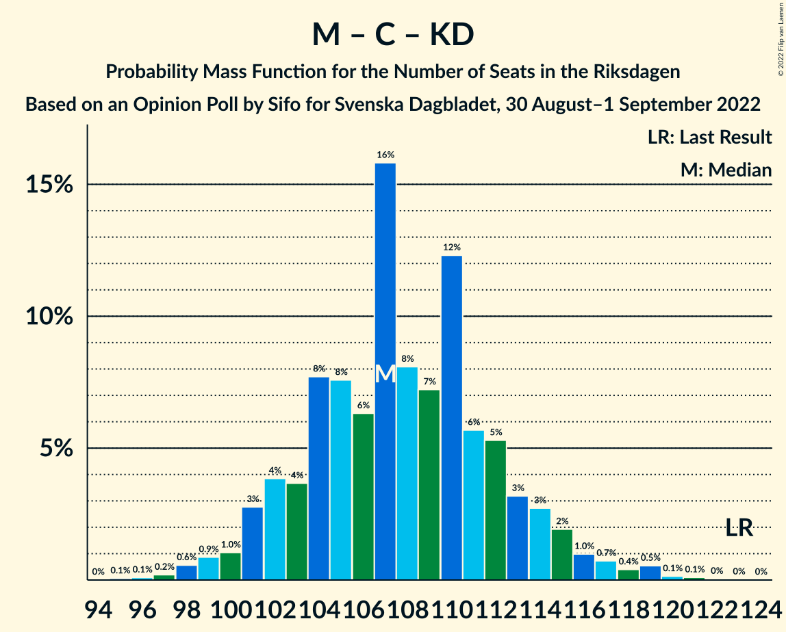

| Number of Seats | Probability | Accumulated | Special Marks |
|:---------------:|:-----------:|:-----------:|:-------------:|
| 95 | 0.1% | 100% |  |
| 96 | 0.1% | 99.9% |  |
| 97 | 0.2% | 99.8% |  |
| 98 | 0.6% | 99.6% |  |
| 99 | 0.9% | 99.1% |  |
| 100 | 1.0% | 98% |  |
| 101 | 3% | 97% |  |
| 102 | 4% | 94% |  |
| 103 | 4% | 91% |  |
| 104 | 8% | 87% |  |
| 105 | 8% | 79% |  |
| 106 | 6% | 72% |  |
| 107 | 16% | 65% |  |
| 108 | 8% | 49% | Median |
| 109 | 7% | 41% |  |
| 110 | 12% | 34% |  |
| 111 | 6% | 22% |  |
| 112 | 5% | 16% |  |
| 113 | 3% | 11% |  |
| 114 | 3% | 8% |  |
| 115 | 2% | 5% |  |
| 116 | 1.0% | 3% |  |
| 117 | 0.7% | 2% |  |
| 118 | 0.4% | 1.3% |  |
| 119 | 0.5% | 0.9% |  |
| 120 | 0.1% | 0.3% |  |
| 121 | 0.1% | 0.2% |  |
| 122 | 0% | 0.1% |  |
| 123 | 0% | 0% | Last Result |

### Moderata samlingspartiet – Centerpartiet – Liberalerna

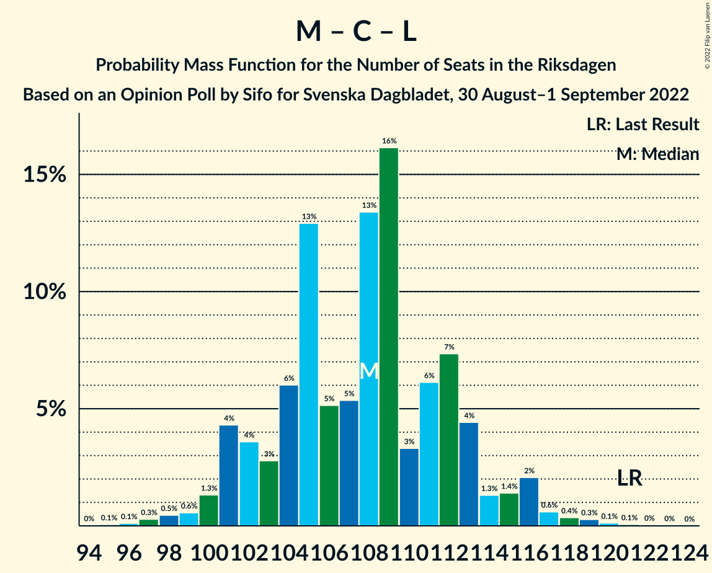

| Number of Seats | Probability | Accumulated | Special Marks |
|:---------------:|:-----------:|:-----------:|:-------------:|
| 95 | 0.1% | 100% |  |
| 96 | 0.1% | 99.9% |  |
| 97 | 0.3% | 99.8% |  |
| 98 | 0.5% | 99.5% |  |
| 99 | 0.6% | 99.0% |  |
| 100 | 1.3% | 98% |  |
| 101 | 4% | 97% |  |
| 102 | 4% | 93% |  |
| 103 | 3% | 89% |  |
| 104 | 6% | 86% |  |
| 105 | 13% | 80% |  |
| 106 | 5% | 68% |  |
| 107 | 5% | 62% |  |
| 108 | 13% | 57% | Median |
| 109 | 16% | 44% |  |
| 110 | 3% | 27% |  |
| 111 | 6% | 24% |  |
| 112 | 7% | 18% |  |
| 113 | 4% | 11% |  |
| 114 | 1.3% | 6% |  |
| 115 | 1.4% | 5% |  |
| 116 | 2% | 4% |  |
| 117 | 0.6% | 1.5% |  |
| 118 | 0.4% | 0.9% |  |
| 119 | 0.3% | 0.5% |  |
| 120 | 0.1% | 0.3% |  |
| 121 | 0.1% | 0.1% | Last Result |
| 122 | 0% | 0.1% |  |
| 123 | 0% | 0% |  |

### Moderata samlingspartiet – Kristdemokraterna – Liberalerna

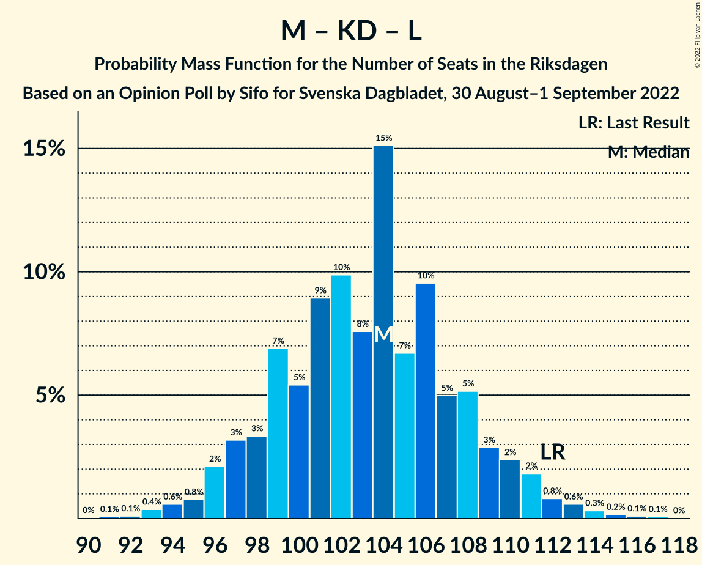

| Number of Seats | Probability | Accumulated | Special Marks |
|:---------------:|:-----------:|:-----------:|:-------------:|
| 90 | 0% | 100% |  |
| 91 | 0.1% | 99.9% |  |
| 92 | 0.1% | 99.9% |  |
| 93 | 0.4% | 99.8% |  |
| 94 | 0.6% | 99.4% |  |
| 95 | 0.8% | 98.8% |  |
| 96 | 2% | 98% |  |
| 97 | 3% | 96% |  |
| 98 | 3% | 93% |  |
| 99 | 7% | 89% |  |
| 100 | 5% | 83% |  |
| 101 | 9% | 77% |  |
| 102 | 10% | 68% |  |
| 103 | 8% | 58% | Median |
| 104 | 15% | 51% |  |
| 105 | 7% | 36% |  |
| 106 | 10% | 29% |  |
| 107 | 5% | 19% |  |
| 108 | 5% | 14% |  |
| 109 | 3% | 9% |  |
| 110 | 2% | 6% |  |
| 111 | 2% | 4% |  |
| 112 | 0.8% | 2% | Last Result |
| 113 | 0.6% | 1.3% |  |
| 114 | 0.3% | 0.7% |  |
| 115 | 0.2% | 0.4% |  |
| 116 | 0.1% | 0.2% |  |
| 117 | 0.1% | 0.1% |  |
| 118 | 0% | 0% |  |

### Sveriges socialdemokratiska arbetareparti

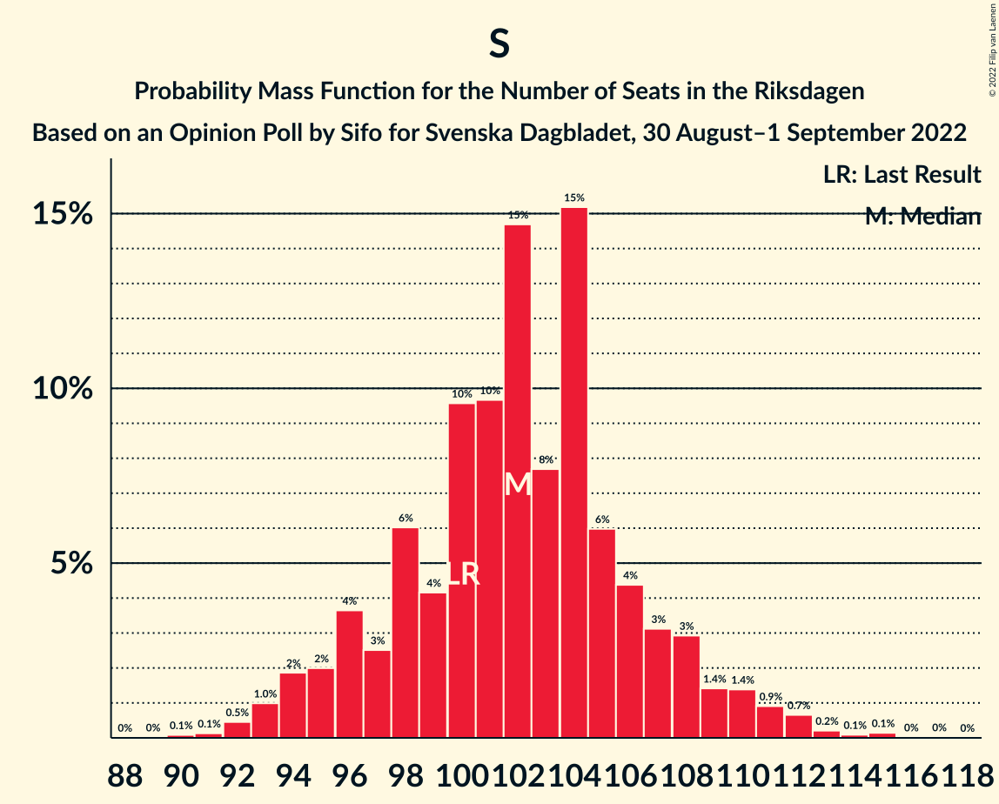

| Number of Seats | Probability | Accumulated | Special Marks |
|:---------------:|:-----------:|:-----------:|:-------------:|
| 90 | 0.1% | 100% |  |
| 91 | 0.1% | 99.9% |  |
| 92 | 0.5% | 99.7% |  |
| 93 | 1.0% | 99.3% |  |
| 94 | 2% | 98% |  |
| 95 | 2% | 96% |  |
| 96 | 4% | 94% |  |
| 97 | 3% | 91% |  |
| 98 | 6% | 88% |  |
| 99 | 4% | 82% |  |
| 100 | 10% | 78% | Last Result |
| 101 | 10% | 69% |  |
| 102 | 15% | 59% | Median |
| 103 | 8% | 44% |  |
| 104 | 15% | 36% |  |
| 105 | 6% | 21% |  |
| 106 | 4% | 15% |  |
| 107 | 3% | 11% |  |
| 108 | 3% | 8% |  |
| 109 | 1.4% | 5% |  |
| 110 | 1.4% | 3% |  |
| 111 | 0.9% | 2% |  |
| 112 | 0.7% | 1.2% |  |
| 113 | 0.2% | 0.5% |  |
| 114 | 0.1% | 0.3% |  |
| 115 | 0.1% | 0.2% |  |
| 116 | 0% | 0.1% |  |
| 117 | 0% | 0% |  |

### Moderata samlingspartiet – Centerpartiet

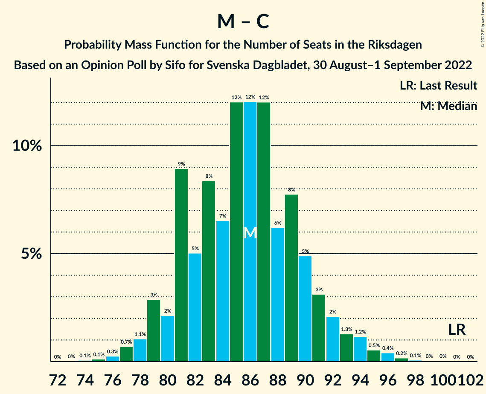

| Number of Seats | Probability | Accumulated | Special Marks |
|:---------------:|:-----------:|:-----------:|:-------------:|
| 74 | 0.1% | 100% |  |
| 75 | 0.1% | 99.9% |  |
| 76 | 0.3% | 99.8% |  |
| 77 | 0.7% | 99.5% |  |
| 78 | 1.1% | 98.8% |  |
| 79 | 3% | 98% |  |
| 80 | 2% | 95% |  |
| 81 | 9% | 93% |  |
| 82 | 5% | 84% |  |
| 83 | 8% | 79% |  |
| 84 | 7% | 70% |  |
| 85 | 12% | 64% |  |
| 86 | 12% | 52% | Median |
| 87 | 12% | 40% |  |
| 88 | 6% | 28% |  |
| 89 | 8% | 22% |  |
| 90 | 5% | 14% |  |
| 91 | 3% | 9% |  |
| 92 | 2% | 6% |  |
| 93 | 1.3% | 4% |  |
| 94 | 1.2% | 2% |  |
| 95 | 0.5% | 1.3% |  |
| 96 | 0.4% | 0.7% |  |
| 97 | 0.2% | 0.3% |  |
| 98 | 0.1% | 0.2% |  |
| 99 | 0% | 0.1% |  |
| 100 | 0% | 0% |  |
| 101 | 0% | 0% | Last Result |

### Moderata samlingspartiet – Kristdemokraterna

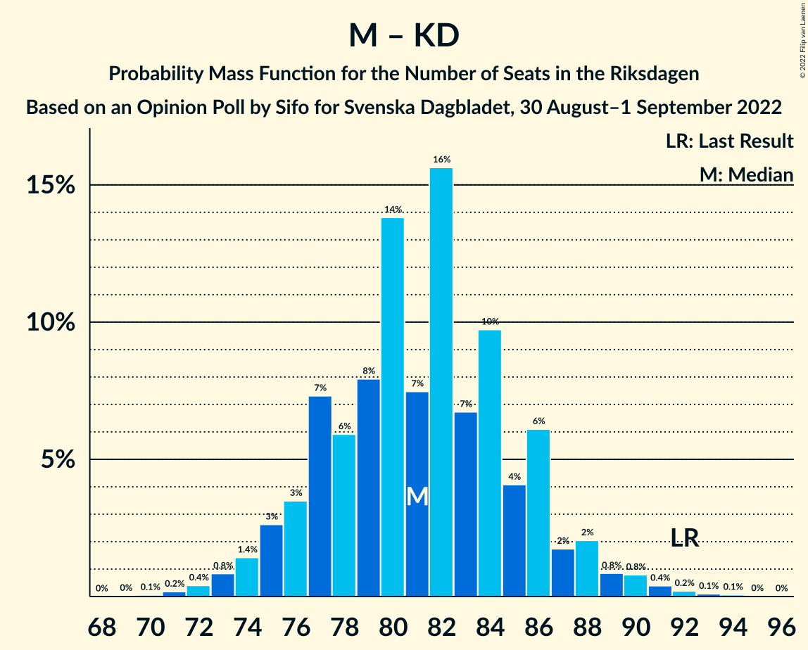

| Number of Seats | Probability | Accumulated | Special Marks |
|:---------------:|:-----------:|:-----------:|:-------------:|
| 70 | 0.1% | 100% |  |
| 71 | 0.2% | 99.9% |  |
| 72 | 0.4% | 99.7% |  |
| 73 | 0.8% | 99.3% |  |
| 74 | 1.4% | 98% |  |
| 75 | 3% | 97% |  |
| 76 | 3% | 94% |  |
| 77 | 7% | 91% |  |
| 78 | 6% | 84% |  |
| 79 | 8% | 78% |  |
| 80 | 14% | 70% |  |
| 81 | 7% | 56% | Median |
| 82 | 16% | 48% |  |
| 83 | 7% | 33% |  |
| 84 | 10% | 26% |  |
| 85 | 4% | 16% |  |
| 86 | 6% | 12% |  |
| 87 | 2% | 6% |  |
| 88 | 2% | 4% |  |
| 89 | 0.8% | 2% |  |
| 90 | 0.8% | 2% |  |
| 91 | 0.4% | 0.8% |  |
| 92 | 0.2% | 0.4% | Last Result |
| 93 | 0.1% | 0.2% |  |
| 94 | 0.1% | 0.1% |  |
| 95 | 0% | 0% |  |

## Technical Information

### Opinion Poll

+ **Polling firm:** Sifo
+ **Commissioner(s):** Svenska Dagbladet
+ **Fieldwork period:** 30 August–1 September 2022

### Calculations

+ **Sample size:** 1706
+ **Simulations done:** 1,048,576
+ **Error estimate:** 0.70%

