# Opinion Poll by Sifo for Svenska Dagbladet, 31 August–2 September 2022

<a href="#voting-intentions">Voting Intentions</a> | <a href="#seats">Seats</a> | <a href="#coalitions">Coalitions</a> | <a href="#technical-information">Technical Information</a>

## Voting Intentions

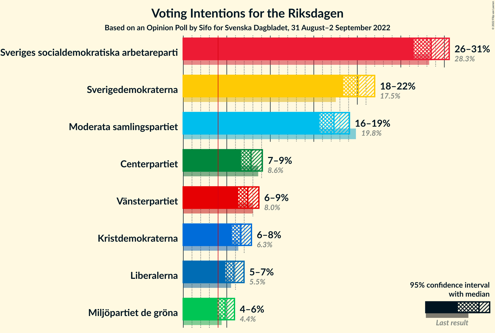

### Confidence Intervals

| Party | Last Result | Poll Result | 80% Confidence Interval | 90% Confidence Interval | 95% Confidence Interval | 99% Confidence Interval |
|:-----:|:-----------:|:-----------:|:-----------------------:|:-----------------------:|:-----------------------:|:-----------------------:|
| Sveriges socialdemokratiska arbetareparti | 28.3% | 28.5% | 27.2–29.8% |26.8–30.2% |26.5–30.6% |25.9–31.2% |
| Sverigedemokraterna | 17.5% | 20.1% | 19.0–21.3% |18.6–21.7% |18.4–22.0% |17.8–22.6% |
| Moderata samlingspartiet | 19.8% | 17.3% | 16.2–18.5% |15.9–18.8% |15.7–19.1% |15.2–19.7% |
| Centerpartiet | 8.6% | 7.8% | 7.0–8.6% |6.8–8.9% |6.6–9.1% |6.3–9.5% |
| Vänsterpartiet | 8.0% | 7.4% | 6.7–8.2% |6.5–8.5% |6.3–8.7% |6.0–9.1% |
| Kristdemokraterna | 6.3% | 6.6% | 5.9–7.4% |5.7–7.6% |5.6–7.8% |5.3–8.2% |
| Liberalerna | 5.5% | 5.8% | 5.2–6.6% |5.0–6.8% |4.8–7.0% |4.6–7.4% |
| Miljöpartiet de gröna | 4.4% | 4.8% | 4.2–5.5% |4.1–5.7% |3.9–5.9% |3.7–6.2% |

*Note:* The poll result column reflects the actual value used in the calculations. Published results may vary slightly, and in addition be rounded to fewer digits.

## Seats

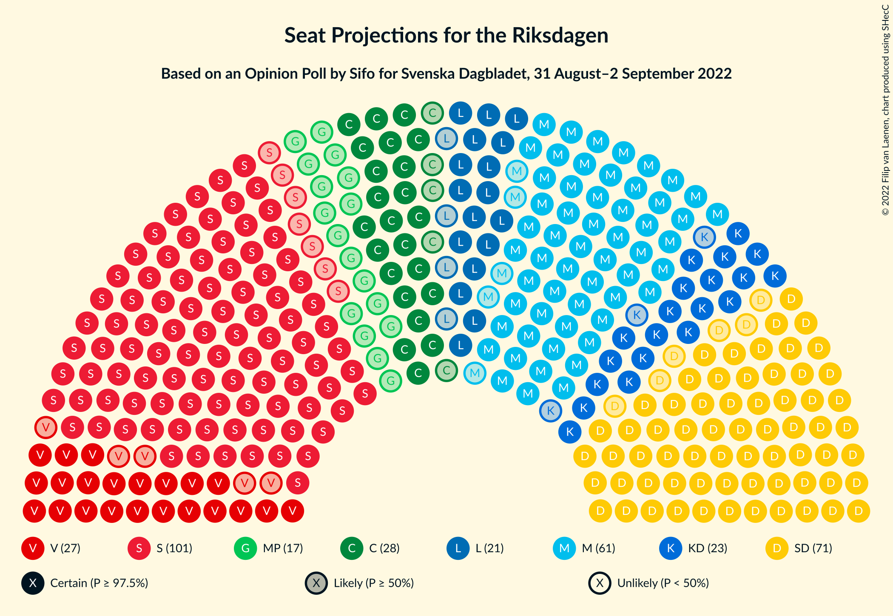

### Confidence Intervals

| Party | Last Result | Median | 80% Confidence Interval | 90% Confidence Interval | 95% Confidence Interval | 99% Confidence Interval |
|:-----:|:-----------:|:------:|:-----------------------:|:-----------------------:|:-----------------------:|:-----------------------:|
| <a href="#sveriges-socialdemokratiska-arbetareparti">Sveriges socialdemokratiska arbetareparti</a> | 100 | 101 | 96–106 |95–107 |94–109 |92–112 |
| <a href="#sverigedemokraterna">Sverigedemokraterna</a> | 62 | 71 | 67–76 |66–77 |65–78 |63–81 |
| <a href="#moderata-samlingspartiet">Moderata samlingspartiet</a> | 70 | 61 | 58–65 |57–66 |56–67 |54–70 |
| <a href="#centerpartiet">Centerpartiet</a> | 31 | 28 | 25–31 |24–32 |23–32 |22–34 |
| <a href="#vänsterpartiet">Vänsterpartiet</a> | 28 | 27 | 24–29 |23–30 |22–31 |21–32 |
| <a href="#kristdemokraterna">Kristdemokraterna</a> | 22 | 23 | 21–26 |20–27 |20–27 |19–29 |
| <a href="#liberalerna">Liberalerna</a> | 20 | 21 | 18–23 |18–24 |17–25 |16–26 |
| <a href="#miljöpartiet-de-gröna">Miljöpartiet de gröna</a> | 16 | 17 | 15–20 |14–20 |0–21 |0–22 |

### Sveriges socialdemokratiska arbetareparti

*For a full overview of the results for this party, see the [Sveriges socialdemokratiska arbetareparti](party-sverigessocialdemokratiskaarbetareparti.html) page.*

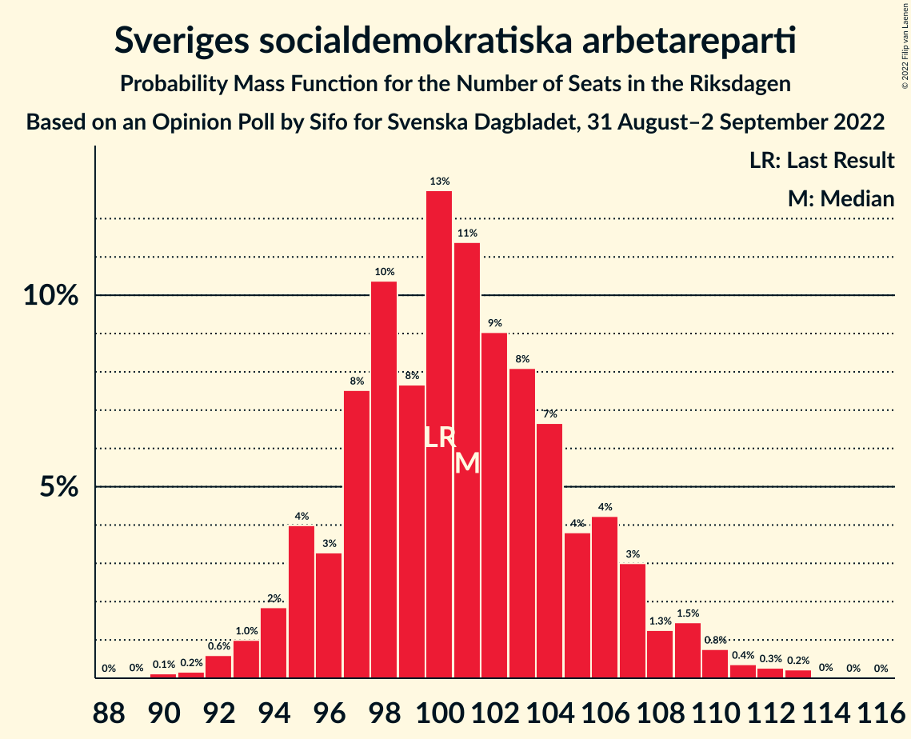

| Number of Seats | Probability | Accumulated | Special Marks |
|:---------------:|:-----------:|:-----------:|:-------------:|
| 89 | 0% | 100% |  |
| 90 | 0.1% | 99.9% |  |
| 91 | 0.2% | 99.8% |  |
| 92 | 0.6% | 99.7% |  |
| 93 | 1.0% | 99.1% |  |
| 94 | 2% | 98% |  |
| 95 | 4% | 96% |  |
| 96 | 3% | 92% |  |
| 97 | 8% | 89% |  |
| 98 | 10% | 81% |  |
| 99 | 8% | 71% |  |
| 100 | 13% | 63% | Last Result |
| 101 | 11% | 51% | Median |
| 102 | 9% | 39% |  |
| 103 | 8% | 30% |  |
| 104 | 7% | 22% |  |
| 105 | 4% | 15% |  |
| 106 | 4% | 12% |  |
| 107 | 3% | 7% |  |
| 108 | 1.3% | 4% |  |
| 109 | 1.5% | 3% |  |
| 110 | 0.8% | 2% |  |
| 111 | 0.4% | 0.9% |  |
| 112 | 0.3% | 0.6% |  |
| 113 | 0.2% | 0.3% |  |
| 114 | 0% | 0.1% |  |
| 115 | 0% | 0% |  |

### Sverigedemokraterna

*For a full overview of the results for this party, see the [Sverigedemokraterna](party-sverigedemokraterna.html) page.*

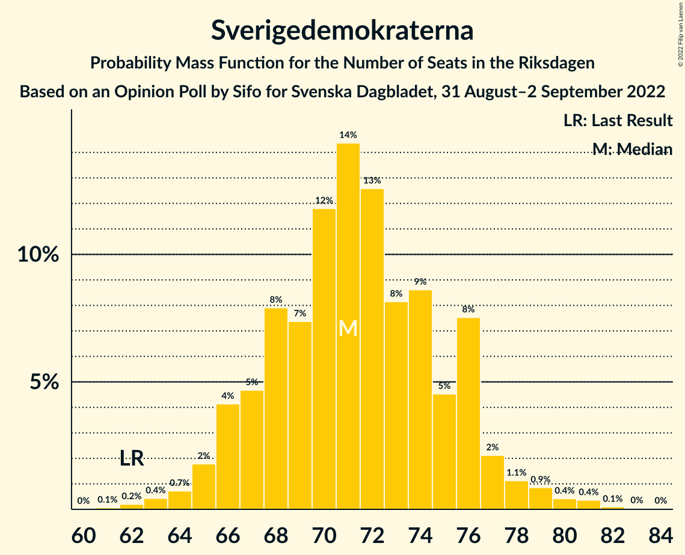

| Number of Seats | Probability | Accumulated | Special Marks |
|:---------------:|:-----------:|:-----------:|:-------------:|
| 61 | 0.1% | 100% |  |
| 62 | 0.2% | 99.9% | Last Result |
| 63 | 0.4% | 99.7% |  |
| 64 | 0.7% | 99.3% |  |
| 65 | 2% | 98.5% |  |
| 66 | 4% | 97% |  |
| 67 | 5% | 93% |  |
| 68 | 8% | 88% |  |
| 69 | 7% | 80% |  |
| 70 | 12% | 73% |  |
| 71 | 14% | 61% | Median |
| 72 | 13% | 46% |  |
| 73 | 8% | 34% |  |
| 74 | 9% | 26% |  |
| 75 | 5% | 17% |  |
| 76 | 8% | 13% |  |
| 77 | 2% | 5% |  |
| 78 | 1.1% | 3% |  |
| 79 | 0.9% | 2% |  |
| 80 | 0.4% | 1.0% |  |
| 81 | 0.4% | 0.6% |  |
| 82 | 0.1% | 0.2% |  |
| 83 | 0% | 0.1% |  |
| 84 | 0% | 0% |  |

### Moderata samlingspartiet

*For a full overview of the results for this party, see the [Moderata samlingspartiet](party-moderatasamlingspartiet.html) page.*

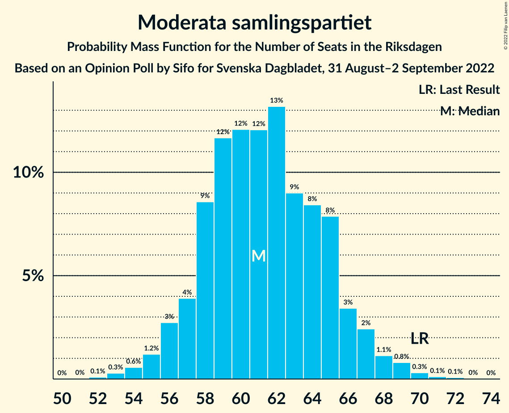

| Number of Seats | Probability | Accumulated | Special Marks |
|:---------------:|:-----------:|:-----------:|:-------------:|
| 52 | 0.1% | 100% |  |
| 53 | 0.3% | 99.9% |  |
| 54 | 0.6% | 99.6% |  |
| 55 | 1.2% | 99.0% |  |
| 56 | 3% | 98% |  |
| 57 | 4% | 95% |  |
| 58 | 9% | 91% |  |
| 59 | 12% | 83% |  |
| 60 | 12% | 71% |  |
| 61 | 12% | 59% | Median |
| 62 | 13% | 47% |  |
| 63 | 9% | 34% |  |
| 64 | 8% | 25% |  |
| 65 | 8% | 16% |  |
| 66 | 3% | 8% |  |
| 67 | 2% | 5% |  |
| 68 | 1.1% | 2% |  |
| 69 | 0.8% | 1.3% |  |
| 70 | 0.3% | 0.5% | Last Result |
| 71 | 0.1% | 0.2% |  |
| 72 | 0.1% | 0.1% |  |
| 73 | 0% | 0% |  |

### Centerpartiet

*For a full overview of the results for this party, see the [Centerpartiet](party-centerpartiet.html) page.*

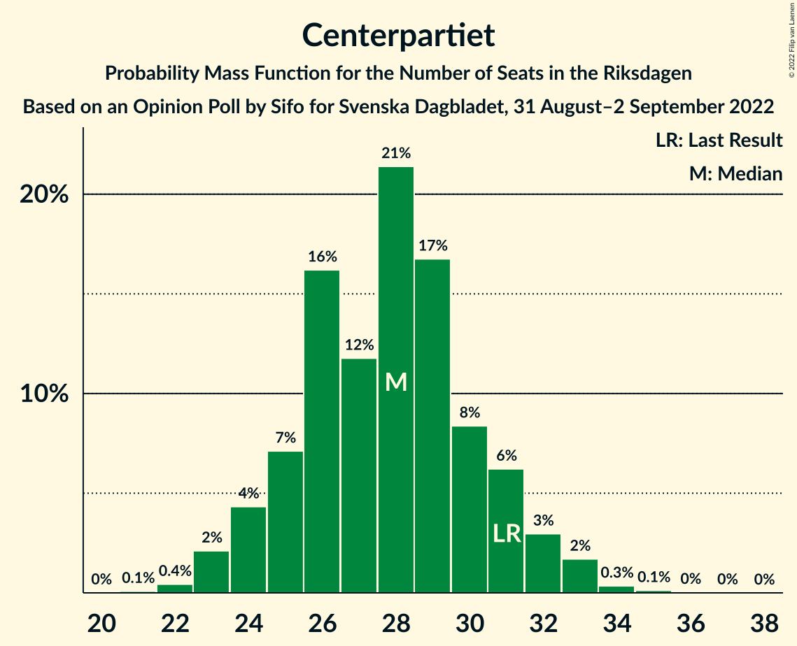

| Number of Seats | Probability | Accumulated | Special Marks |
|:---------------:|:-----------:|:-----------:|:-------------:|
| 21 | 0.1% | 100% |  |
| 22 | 0.4% | 99.9% |  |
| 23 | 2% | 99.5% |  |
| 24 | 4% | 97% |  |
| 25 | 7% | 93% |  |
| 26 | 16% | 86% |  |
| 27 | 12% | 70% |  |
| 28 | 21% | 58% | Median |
| 29 | 17% | 37% |  |
| 30 | 8% | 20% |  |
| 31 | 6% | 11% | Last Result |
| 32 | 3% | 5% |  |
| 33 | 2% | 2% |  |
| 34 | 0.3% | 0.5% |  |
| 35 | 0.1% | 0.2% |  |
| 36 | 0% | 0.1% |  |
| 37 | 0% | 0% |  |

### Vänsterpartiet

*For a full overview of the results for this party, see the [Vänsterpartiet](party-vänsterpartiet.html) page.*

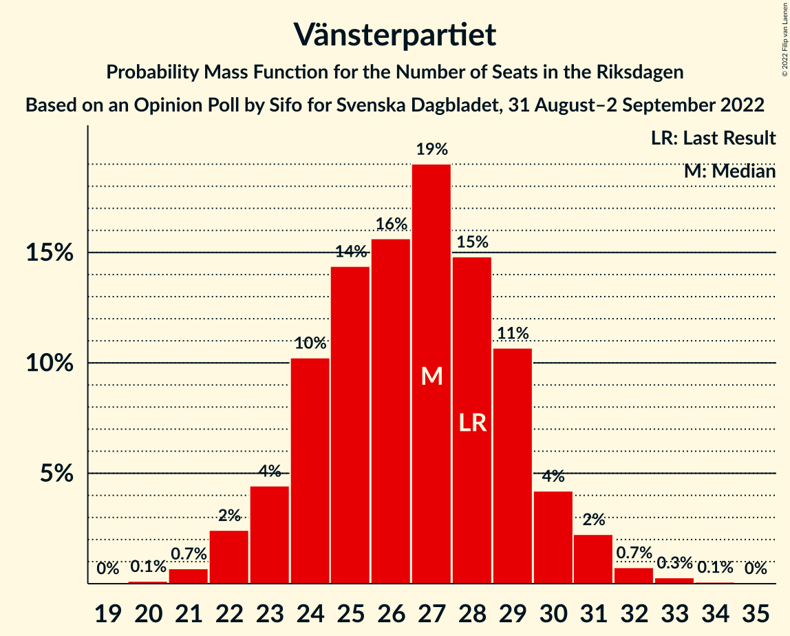

| Number of Seats | Probability | Accumulated | Special Marks |
|:---------------:|:-----------:|:-----------:|:-------------:|
| 20 | 0.1% | 100% |  |
| 21 | 0.7% | 99.9% |  |
| 22 | 2% | 99.2% |  |
| 23 | 4% | 97% |  |
| 24 | 10% | 92% |  |
| 25 | 14% | 82% |  |
| 26 | 16% | 68% |  |
| 27 | 19% | 52% | Median |
| 28 | 15% | 33% | Last Result |
| 29 | 11% | 18% |  |
| 30 | 4% | 8% |  |
| 31 | 2% | 3% |  |
| 32 | 0.7% | 1.1% |  |
| 33 | 0.3% | 0.4% |  |
| 34 | 0.1% | 0.1% |  |
| 35 | 0% | 0% |  |

### Kristdemokraterna

*For a full overview of the results for this party, see the [Kristdemokraterna](party-kristdemokraterna.html) page.*

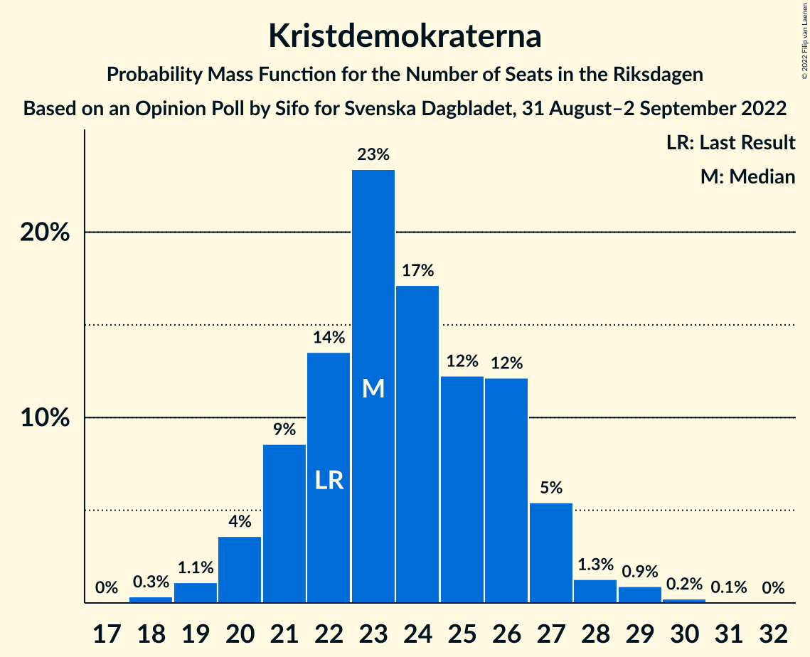

| Number of Seats | Probability | Accumulated | Special Marks |
|:---------------:|:-----------:|:-----------:|:-------------:|
| 18 | 0.3% | 100% |  |
| 19 | 1.1% | 99.6% |  |
| 20 | 4% | 98.5% |  |
| 21 | 9% | 95% |  |
| 22 | 14% | 86% | Last Result |
| 23 | 23% | 73% | Median |
| 24 | 17% | 49% |  |
| 25 | 12% | 32% |  |
| 26 | 12% | 20% |  |
| 27 | 5% | 8% |  |
| 28 | 1.3% | 2% |  |
| 29 | 0.9% | 1.2% |  |
| 30 | 0.2% | 0.3% |  |
| 31 | 0.1% | 0.1% |  |
| 32 | 0% | 0% |  |

### Liberalerna

*For a full overview of the results for this party, see the [Liberalerna](party-liberalerna.html) page.*

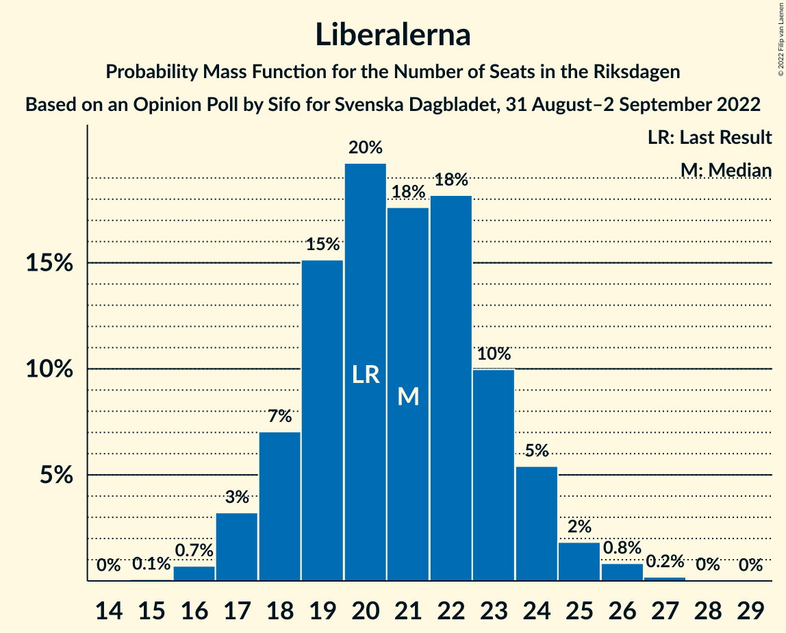

| Number of Seats | Probability | Accumulated | Special Marks |
|:---------------:|:-----------:|:-----------:|:-------------:|
| 15 | 0.1% | 100% |  |
| 16 | 0.7% | 99.9% |  |
| 17 | 3% | 99.2% |  |
| 18 | 7% | 96% |  |
| 19 | 15% | 89% |  |
| 20 | 20% | 74% | Last Result |
| 21 | 18% | 54% | Median |
| 22 | 18% | 36% |  |
| 23 | 10% | 18% |  |
| 24 | 5% | 8% |  |
| 25 | 2% | 3% |  |
| 26 | 0.8% | 1.1% |  |
| 27 | 0.2% | 0.2% |  |
| 28 | 0% | 0.1% |  |
| 29 | 0% | 0% |  |

### Miljöpartiet de gröna

*For a full overview of the results for this party, see the [Miljöpartiet de gröna](party-miljöpartietdegröna.html) page.*

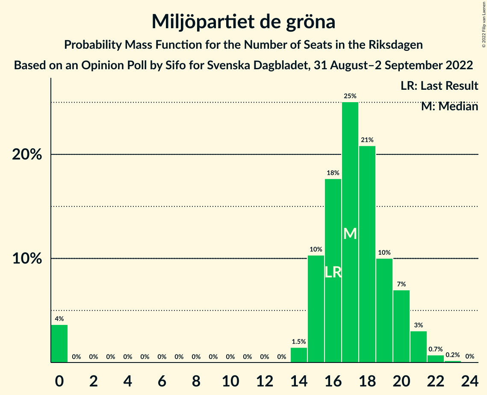

| Number of Seats | Probability | Accumulated | Special Marks |
|:---------------:|:-----------:|:-----------:|:-------------:|
| 0 | 4% | 100% |  |
| 1 | 0% | 96% |  |
| 2 | 0% | 96% |  |
| 3 | 0% | 96% |  |
| 4 | 0% | 96% |  |
| 5 | 0% | 96% |  |
| 6 | 0% | 96% |  |
| 7 | 0% | 96% |  |
| 8 | 0% | 96% |  |
| 9 | 0% | 96% |  |
| 10 | 0% | 96% |  |
| 11 | 0% | 96% |  |
| 12 | 0% | 96% |  |
| 13 | 0% | 96% |  |
| 14 | 1.5% | 96% |  |
| 15 | 10% | 95% |  |
| 16 | 18% | 85% | Last Result |
| 17 | 25% | 67% | Median |
| 18 | 21% | 42% |  |
| 19 | 10% | 21% |  |
| 20 | 7% | 11% |  |
| 21 | 3% | 4% |  |
| 22 | 0.7% | 1.0% |  |
| 23 | 0.2% | 0.2% |  |
| 24 | 0% | 0% |  |

## Coalitions

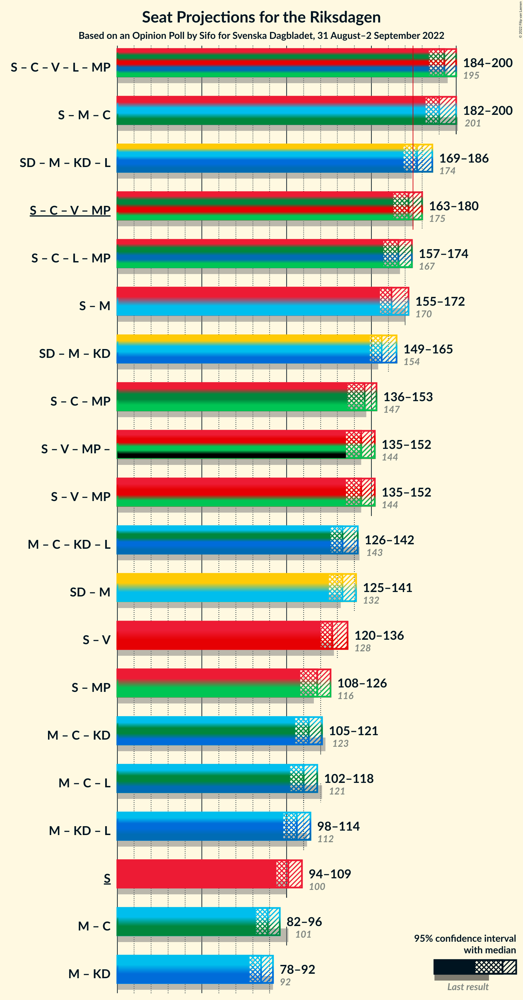

### Confidence Intervals

| Coalition | Last Result | Median | Majority? | 80% Confidence Interval | 90% Confidence Interval | 95% Confidence Interval | 99% Confidence Interval |
|:---------:|:-----------:|:------:|:---------:|:-----------------------:|:-----------------------:|:-----------------------:|:-----------------------:|
| Sveriges socialdemokratiska arbetareparti – Centerpartiet – Vänsterpartiet – Liberalerna – Miljöpartiet de gröna | 195 | 193 | 100% | 187–198 | 186–200 | 184–200 | 180–203 |
| Sveriges socialdemokratiska arbetareparti – Moderata samlingspartiet – Centerpartiet | 201 | 190 | 100% | 185–196 | 183–198 | 182–200 | 179–205 |
| Sverigedemokraterna – Moderata samlingspartiet – Kristdemokraterna – Liberalerna | 174 | 177 | 74% | 172–183 | 171–184 | 169–186 | 167–191 |
| Sveriges socialdemokratiska arbetareparti – Centerpartiet – Vänsterpartiet – Miljöpartiet de gröna | 175 | 172 | 26% | 166–177 | 165–178 | 163–180 | 158–182 |
| Sveriges socialdemokratiska arbetareparti – Centerpartiet – Liberalerna – Miljöpartiet de gröna | 167 | 166 | 2% | 161–172 | 159–173 | 157–174 | 153–176 |
| Sveriges socialdemokratiska arbetareparti – Moderata samlingspartiet | 170 | 162 | 0.9% | 157–168 | 156–170 | 155–172 | 152–176 |
| Sverigedemokraterna – Moderata samlingspartiet – Kristdemokraterna | 154 | 156 | 0% | 151–162 | 149–163 | 149–165 | 146–169 |
| Sveriges socialdemokratiska arbetareparti – Centerpartiet – Miljöpartiet de gröna | 147 | 146 | 0% | 140–151 | 138–152 | 136–153 | 131–156 |
| Sveriges socialdemokratiska arbetareparti – Vänsterpartiet – Miljöpartiet de gröna | 144 | 144 | 0% | 139–150 | 137–151 | 135–152 | 128–155 |
| Moderata samlingspartiet – Centerpartiet – Kristdemokraterna – Liberalerna | 143 | 133 | 0% | 129–139 | 127–141 | 126–142 | 123–146 |
| Sverigedemokraterna – Moderata samlingspartiet | 132 | 133 | 0% | 128–138 | 126–139 | 125–141 | 123–145 |
| Sveriges socialdemokratiska arbetareparti – Vänsterpartiet | 128 | 127 | 0% | 122–132 | 121–134 | 120–136 | 117–139 |
| Sveriges socialdemokratiska arbetareparti – Miljöpartiet de gröna | 116 | 118 | 0% | 112–123 | 110–124 | 108–126 | 103–128 |
| Moderata samlingspartiet – Centerpartiet – Kristdemokraterna | 123 | 113 | 0% | 108–118 | 106–119 | 105–121 | 104–124 |
| Moderata samlingspartiet – Centerpartiet – Liberalerna | 121 | 110 | 0% | 105–115 | 104–116 | 102–118 | 100–121 |
| Moderata samlingspartiet – Kristdemokraterna – Liberalerna | 112 | 106 | 0% | 101–111 | 100–113 | 98–114 | 96–116 |
| Sveriges socialdemokratiska arbetareparti | 100 | 101 | 0% | 96–106 | 95–107 | 94–109 | 92–112 |
| Moderata samlingspartiet – Centerpartiet | 101 | 89 | 0% | 85–93 | 84–95 | 82–96 | 80–99 |
| Moderata samlingspartiet – Kristdemokraterna | 92 | 85 | 0% | 80–90 | 79–91 | 78–92 | 77–94 |

### Sveriges socialdemokratiska arbetareparti – Centerpartiet – Vänsterpartiet – Liberalerna – Miljöpartiet de gröna

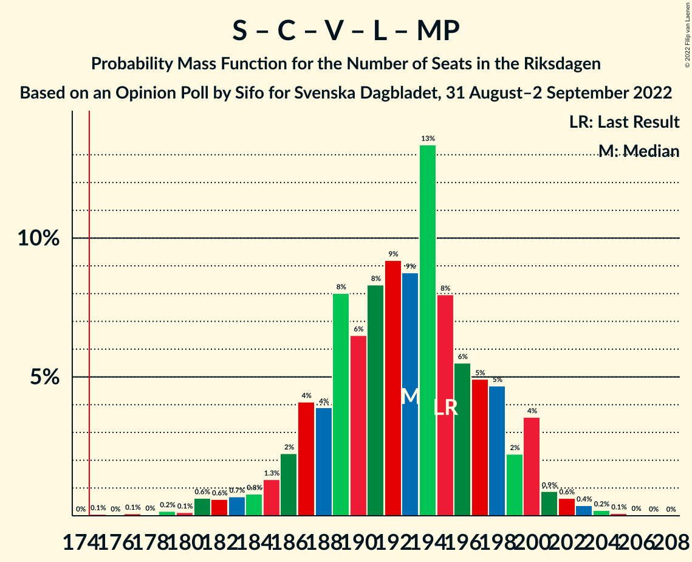

| Number of Seats | Probability | Accumulated | Special Marks |
|:---------------:|:-----------:|:-----------:|:-------------:|
| 175 | 0.1% | 100% | Majority |
| 176 | 0% | 99.9% |  |
| 177 | 0.1% | 99.9% |  |
| 178 | 0% | 99.8% |  |
| 179 | 0.2% | 99.8% |  |
| 180 | 0.1% | 99.6% |  |
| 181 | 0.6% | 99.5% |  |
| 182 | 0.6% | 98.9% |  |
| 183 | 0.7% | 98% |  |
| 184 | 0.8% | 98% |  |
| 185 | 1.3% | 97% |  |
| 186 | 2% | 95% |  |
| 187 | 4% | 93% |  |
| 188 | 4% | 89% |  |
| 189 | 8% | 85% |  |
| 190 | 6% | 77% |  |
| 191 | 8% | 71% |  |
| 192 | 9% | 62% |  |
| 193 | 9% | 53% |  |
| 194 | 13% | 44% | Median |
| 195 | 8% | 31% | Last Result |
| 196 | 6% | 23% |  |
| 197 | 5% | 18% |  |
| 198 | 5% | 13% |  |
| 199 | 2% | 8% |  |
| 200 | 4% | 6% |  |
| 201 | 0.9% | 2% |  |
| 202 | 0.6% | 1.3% |  |
| 203 | 0.4% | 0.7% |  |
| 204 | 0.2% | 0.3% |  |
| 205 | 0.1% | 0.1% |  |
| 206 | 0% | 0.1% |  |
| 207 | 0% | 0% |  |

### Sveriges socialdemokratiska arbetareparti – Moderata samlingspartiet – Centerpartiet

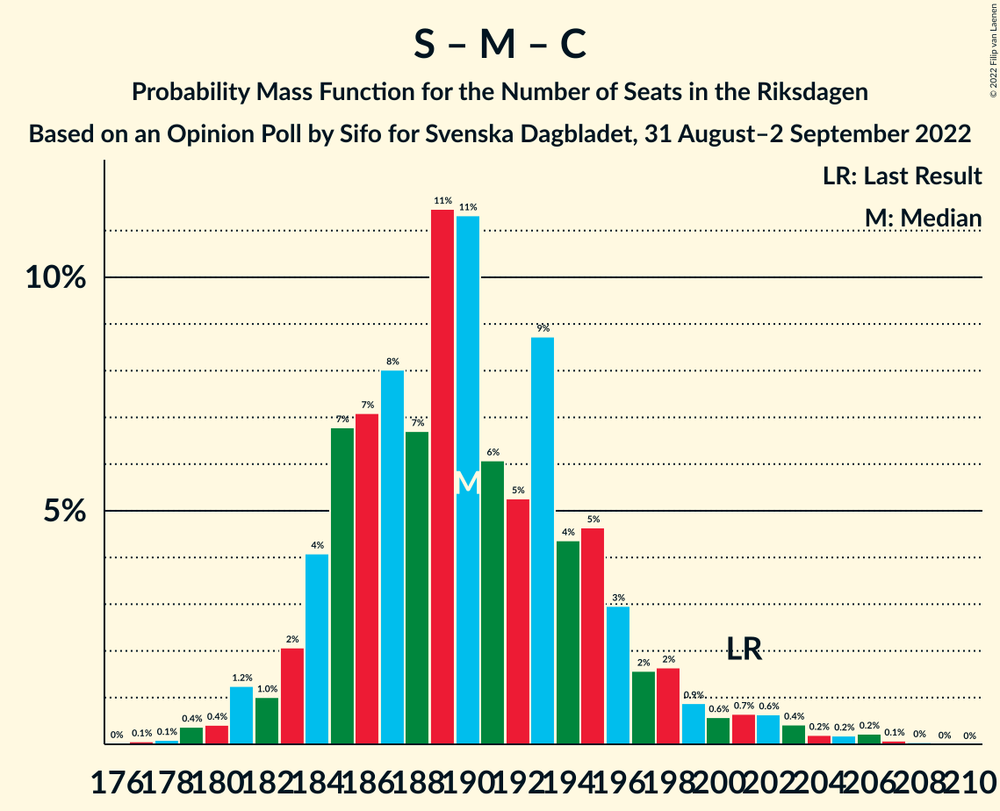

| Number of Seats | Probability | Accumulated | Special Marks |
|:---------------:|:-----------:|:-----------:|:-------------:|
| 177 | 0.1% | 100% |  |
| 178 | 0.1% | 99.9% |  |
| 179 | 0.4% | 99.8% |  |
| 180 | 0.4% | 99.4% |  |
| 181 | 1.2% | 99.0% |  |
| 182 | 1.0% | 98% |  |
| 183 | 2% | 97% |  |
| 184 | 4% | 95% |  |
| 185 | 7% | 91% |  |
| 186 | 7% | 84% |  |
| 187 | 8% | 77% |  |
| 188 | 7% | 69% |  |
| 189 | 11% | 62% |  |
| 190 | 11% | 51% | Median |
| 191 | 6% | 39% |  |
| 192 | 5% | 33% |  |
| 193 | 9% | 28% |  |
| 194 | 4% | 19% |  |
| 195 | 5% | 15% |  |
| 196 | 3% | 10% |  |
| 197 | 2% | 7% |  |
| 198 | 2% | 6% |  |
| 199 | 0.9% | 4% |  |
| 200 | 0.6% | 3% |  |
| 201 | 0.7% | 2% | Last Result |
| 202 | 0.6% | 2% |  |
| 203 | 0.4% | 1.2% |  |
| 204 | 0.2% | 0.8% |  |
| 205 | 0.2% | 0.6% |  |
| 206 | 0.2% | 0.4% |  |
| 207 | 0.1% | 0.2% |  |
| 208 | 0% | 0.1% |  |
| 209 | 0% | 0% |  |

### Sverigedemokraterna – Moderata samlingspartiet – Kristdemokraterna – Liberalerna

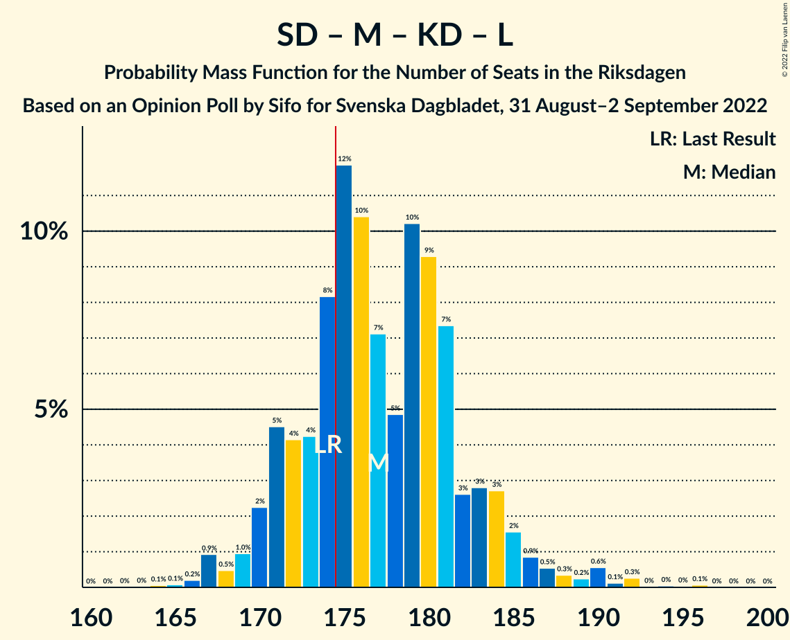

| Number of Seats | Probability | Accumulated | Special Marks |
|:---------------:|:-----------:|:-----------:|:-------------:|
| 164 | 0.1% | 100% |  |
| 165 | 0.1% | 99.9% |  |
| 166 | 0.2% | 99.8% |  |
| 167 | 0.9% | 99.6% |  |
| 168 | 0.5% | 98.7% |  |
| 169 | 1.0% | 98% |  |
| 170 | 2% | 97% |  |
| 171 | 5% | 95% |  |
| 172 | 4% | 90% |  |
| 173 | 4% | 86% |  |
| 174 | 8% | 82% | Last Result |
| 175 | 12% | 74% | Majority |
| 176 | 10% | 62% | Median |
| 177 | 7% | 52% |  |
| 178 | 5% | 45% |  |
| 179 | 10% | 40% |  |
| 180 | 9% | 29% |  |
| 181 | 7% | 20% |  |
| 182 | 3% | 13% |  |
| 183 | 3% | 10% |  |
| 184 | 3% | 7% |  |
| 185 | 2% | 5% |  |
| 186 | 0.9% | 3% |  |
| 187 | 0.5% | 2% |  |
| 188 | 0.3% | 2% |  |
| 189 | 0.2% | 1.4% |  |
| 190 | 0.6% | 1.1% |  |
| 191 | 0.1% | 0.6% |  |
| 192 | 0.3% | 0.4% |  |
| 193 | 0% | 0.2% |  |
| 194 | 0% | 0.2% |  |
| 195 | 0% | 0.1% |  |
| 196 | 0.1% | 0.1% |  |
| 197 | 0% | 0% |  |

### Sveriges socialdemokratiska arbetareparti – Centerpartiet – Vänsterpartiet – Miljöpartiet de gröna

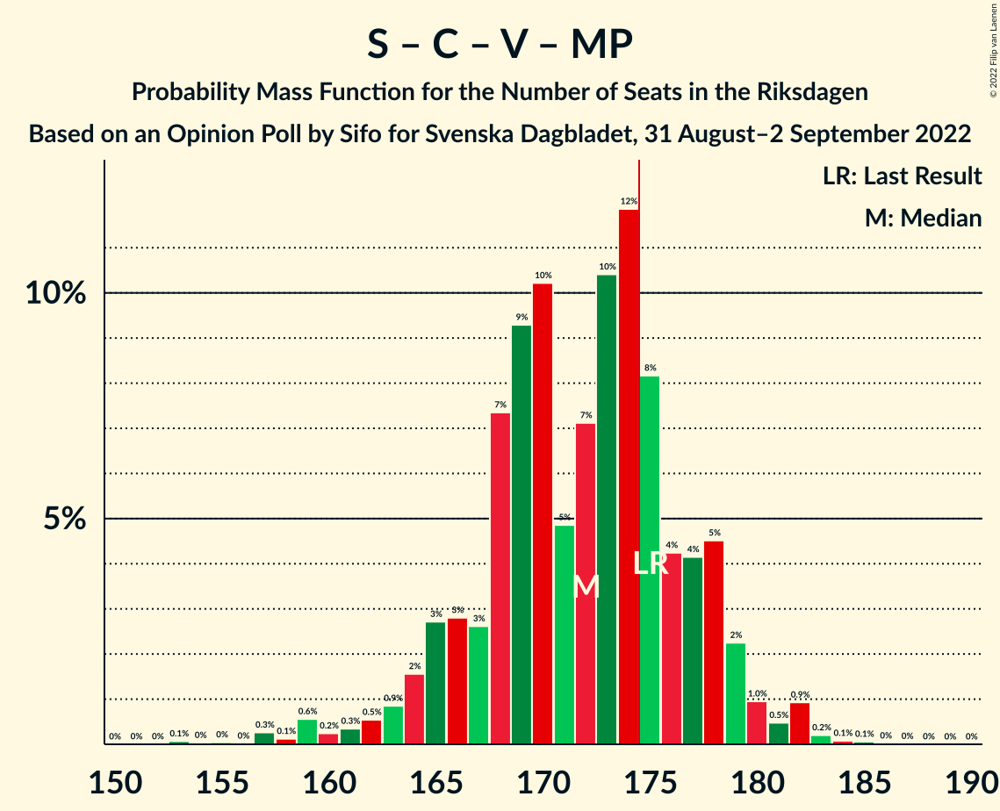

| Number of Seats | Probability | Accumulated | Special Marks |
|:---------------:|:-----------:|:-----------:|:-------------:|
| 153 | 0.1% | 100% |  |
| 154 | 0% | 99.9% |  |
| 155 | 0% | 99.9% |  |
| 156 | 0% | 99.8% |  |
| 157 | 0.3% | 99.8% |  |
| 158 | 0.1% | 99.6% |  |
| 159 | 0.6% | 99.4% |  |
| 160 | 0.2% | 98.9% |  |
| 161 | 0.3% | 98.6% |  |
| 162 | 0.5% | 98% |  |
| 163 | 0.9% | 98% |  |
| 164 | 2% | 97% |  |
| 165 | 3% | 95% |  |
| 166 | 3% | 93% |  |
| 167 | 3% | 90% |  |
| 168 | 7% | 87% |  |
| 169 | 9% | 80% |  |
| 170 | 10% | 71% |  |
| 171 | 5% | 60% |  |
| 172 | 7% | 55% |  |
| 173 | 10% | 48% | Median |
| 174 | 12% | 38% |  |
| 175 | 8% | 26% | Last Result, Majority |
| 176 | 4% | 18% |  |
| 177 | 4% | 14% |  |
| 178 | 5% | 10% |  |
| 179 | 2% | 5% |  |
| 180 | 1.0% | 3% |  |
| 181 | 0.5% | 2% |  |
| 182 | 0.9% | 1.3% |  |
| 183 | 0.2% | 0.4% |  |
| 184 | 0.1% | 0.2% |  |
| 185 | 0.1% | 0.1% |  |
| 186 | 0% | 0% |  |

### Sveriges socialdemokratiska arbetareparti – Centerpartiet – Liberalerna – Miljöpartiet de gröna

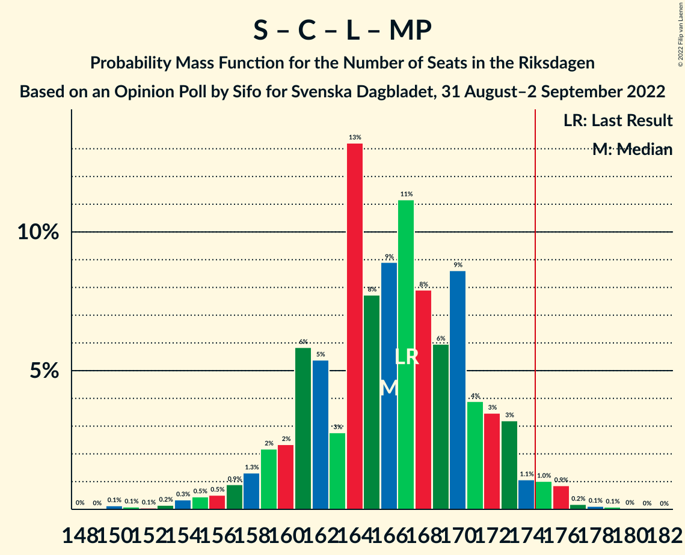

| Number of Seats | Probability | Accumulated | Special Marks |
|:---------------:|:-----------:|:-----------:|:-------------:|
| 148 | 0% | 100% |  |
| 149 | 0% | 99.9% |  |
| 150 | 0.1% | 99.9% |  |
| 151 | 0.1% | 99.8% |  |
| 152 | 0.1% | 99.7% |  |
| 153 | 0.2% | 99.6% |  |
| 154 | 0.3% | 99.5% |  |
| 155 | 0.5% | 99.1% |  |
| 156 | 0.5% | 98.7% |  |
| 157 | 0.9% | 98% |  |
| 158 | 1.3% | 97% |  |
| 159 | 2% | 96% |  |
| 160 | 2% | 94% |  |
| 161 | 6% | 91% |  |
| 162 | 5% | 86% |  |
| 163 | 3% | 80% |  |
| 164 | 13% | 77% |  |
| 165 | 8% | 64% |  |
| 166 | 9% | 57% |  |
| 167 | 11% | 48% | Last Result, Median |
| 168 | 8% | 36% |  |
| 169 | 6% | 29% |  |
| 170 | 9% | 23% |  |
| 171 | 4% | 14% |  |
| 172 | 3% | 10% |  |
| 173 | 3% | 7% |  |
| 174 | 1.1% | 3% |  |
| 175 | 1.0% | 2% | Majority |
| 176 | 0.9% | 1.3% |  |
| 177 | 0.2% | 0.4% |  |
| 178 | 0.1% | 0.3% |  |
| 179 | 0.1% | 0.2% |  |
| 180 | 0% | 0.1% |  |
| 181 | 0% | 0% |  |

### Sveriges socialdemokratiska arbetareparti – Moderata samlingspartiet

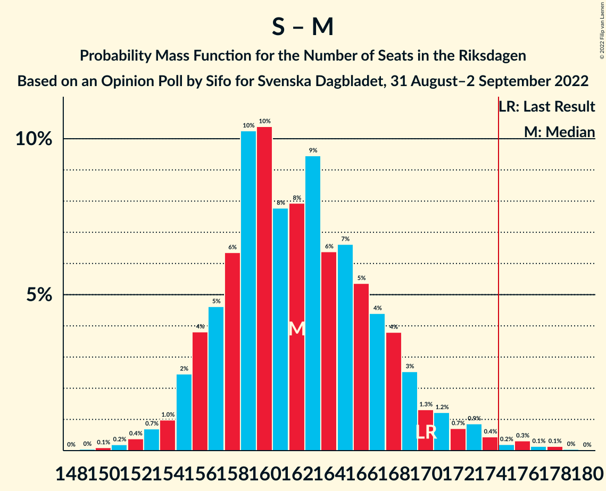

| Number of Seats | Probability | Accumulated | Special Marks |
|:---------------:|:-----------:|:-----------:|:-------------:|
| 149 | 0% | 100% |  |
| 150 | 0.1% | 99.9% |  |
| 151 | 0.2% | 99.8% |  |
| 152 | 0.4% | 99.6% |  |
| 153 | 0.7% | 99.2% |  |
| 154 | 1.0% | 98.5% |  |
| 155 | 2% | 98% |  |
| 156 | 4% | 95% |  |
| 157 | 5% | 91% |  |
| 158 | 6% | 87% |  |
| 159 | 10% | 80% |  |
| 160 | 10% | 70% |  |
| 161 | 8% | 60% |  |
| 162 | 8% | 52% | Median |
| 163 | 9% | 44% |  |
| 164 | 6% | 35% |  |
| 165 | 7% | 28% |  |
| 166 | 5% | 22% |  |
| 167 | 4% | 16% |  |
| 168 | 4% | 12% |  |
| 169 | 3% | 8% |  |
| 170 | 1.3% | 5% | Last Result |
| 171 | 1.2% | 4% |  |
| 172 | 0.7% | 3% |  |
| 173 | 0.9% | 2% |  |
| 174 | 0.4% | 1.3% |  |
| 175 | 0.2% | 0.9% | Majority |
| 176 | 0.3% | 0.7% |  |
| 177 | 0.1% | 0.4% |  |
| 178 | 0.1% | 0.2% |  |
| 179 | 0% | 0.1% |  |
| 180 | 0% | 0% |  |

### Sverigedemokraterna – Moderata samlingspartiet – Kristdemokraterna

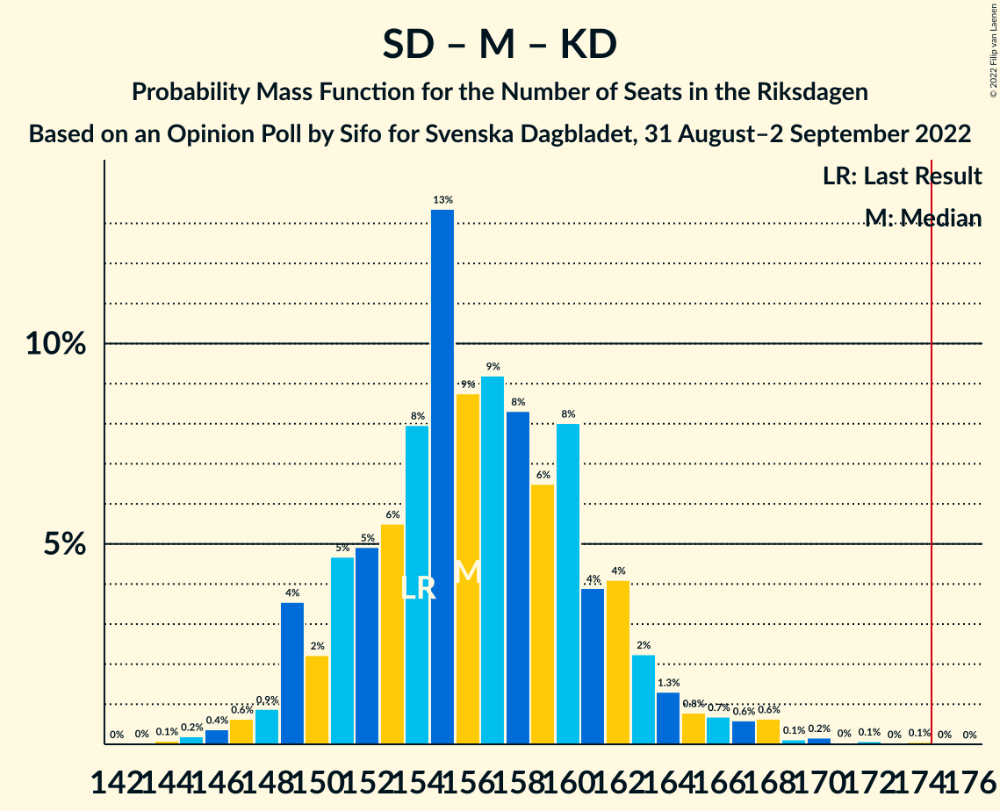

| Number of Seats | Probability | Accumulated | Special Marks |
|:---------------:|:-----------:|:-----------:|:-------------:|
| 143 | 0% | 100% |  |
| 144 | 0.1% | 99.9% |  |
| 145 | 0.2% | 99.9% |  |
| 146 | 0.4% | 99.7% |  |
| 147 | 0.6% | 99.3% |  |
| 148 | 0.9% | 98.7% |  |
| 149 | 4% | 98% |  |
| 150 | 2% | 94% |  |
| 151 | 5% | 92% |  |
| 152 | 5% | 87% |  |
| 153 | 6% | 82% |  |
| 154 | 8% | 77% | Last Result |
| 155 | 13% | 69% | Median |
| 156 | 9% | 56% |  |
| 157 | 9% | 47% |  |
| 158 | 8% | 38% |  |
| 159 | 6% | 29% |  |
| 160 | 8% | 23% |  |
| 161 | 4% | 15% |  |
| 162 | 4% | 11% |  |
| 163 | 2% | 7% |  |
| 164 | 1.3% | 5% |  |
| 165 | 0.8% | 3% |  |
| 166 | 0.7% | 2% |  |
| 167 | 0.6% | 2% |  |
| 168 | 0.6% | 1.1% |  |
| 169 | 0.1% | 0.5% |  |
| 170 | 0.2% | 0.4% |  |
| 171 | 0% | 0.2% |  |
| 172 | 0.1% | 0.2% |  |
| 173 | 0% | 0.1% |  |
| 174 | 0.1% | 0.1% |  |
| 175 | 0% | 0% | Majority |

### Sveriges socialdemokratiska arbetareparti – Centerpartiet – Miljöpartiet de gröna

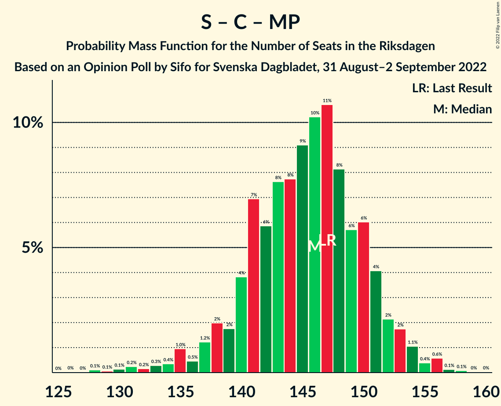

| Number of Seats | Probability | Accumulated | Special Marks |
|:---------------:|:-----------:|:-----------:|:-------------:|
| 126 | 0% | 100% |  |
| 127 | 0% | 99.9% |  |
| 128 | 0.1% | 99.9% |  |
| 129 | 0.1% | 99.8% |  |
| 130 | 0.1% | 99.8% |  |
| 131 | 0.2% | 99.6% |  |
| 132 | 0.2% | 99.4% |  |
| 133 | 0.3% | 99.2% |  |
| 134 | 0.4% | 98.9% |  |
| 135 | 1.0% | 98.6% |  |
| 136 | 0.5% | 98% |  |
| 137 | 1.2% | 97% |  |
| 138 | 2% | 96% |  |
| 139 | 2% | 94% |  |
| 140 | 4% | 92% |  |
| 141 | 7% | 88% |  |
| 142 | 6% | 81% |  |
| 143 | 8% | 76% |  |
| 144 | 8% | 68% |  |
| 145 | 9% | 60% |  |
| 146 | 10% | 51% | Median |
| 147 | 11% | 41% | Last Result |
| 148 | 8% | 30% |  |
| 149 | 6% | 22% |  |
| 150 | 6% | 16% |  |
| 151 | 4% | 10% |  |
| 152 | 2% | 6% |  |
| 153 | 2% | 4% |  |
| 154 | 1.1% | 2% |  |
| 155 | 0.4% | 1.2% |  |
| 156 | 0.6% | 0.9% |  |
| 157 | 0.1% | 0.3% |  |
| 158 | 0.1% | 0.1% |  |
| 159 | 0% | 0.1% |  |
| 160 | 0% | 0% |  |

### Sveriges socialdemokratiska arbetareparti – Vänsterpartiet – Miljöpartiet de gröna

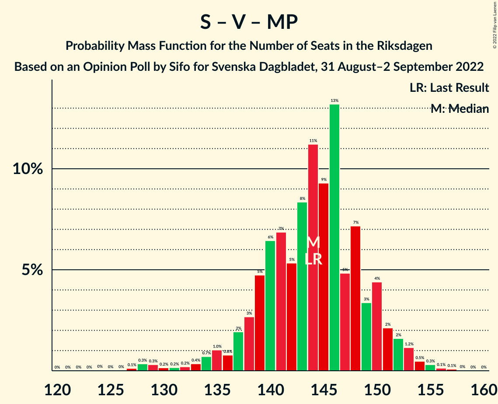

| Number of Seats | Probability | Accumulated | Special Marks |
|:---------------:|:-----------:|:-----------:|:-------------:|
| 124 | 0% | 100% |  |
| 125 | 0% | 99.9% |  |
| 126 | 0% | 99.9% |  |
| 127 | 0.1% | 99.9% |  |
| 128 | 0.3% | 99.8% |  |
| 129 | 0.3% | 99.4% |  |
| 130 | 0.2% | 99.1% |  |
| 131 | 0.2% | 99.0% |  |
| 132 | 0.2% | 98.8% |  |
| 133 | 0.4% | 98.6% |  |
| 134 | 0.7% | 98% |  |
| 135 | 1.0% | 98% |  |
| 136 | 0.8% | 97% |  |
| 137 | 2% | 96% |  |
| 138 | 3% | 94% |  |
| 139 | 5% | 91% |  |
| 140 | 6% | 86% |  |
| 141 | 7% | 80% |  |
| 142 | 5% | 73% |  |
| 143 | 8% | 68% |  |
| 144 | 11% | 59% | Last Result |
| 145 | 9% | 48% | Median |
| 146 | 13% | 39% |  |
| 147 | 5% | 26% |  |
| 148 | 7% | 21% |  |
| 149 | 3% | 14% |  |
| 150 | 4% | 10% |  |
| 151 | 2% | 6% |  |
| 152 | 2% | 4% |  |
| 153 | 1.2% | 2% |  |
| 154 | 0.5% | 1.0% |  |
| 155 | 0.3% | 0.6% |  |
| 156 | 0.1% | 0.3% |  |
| 157 | 0.1% | 0.1% |  |
| 158 | 0% | 0% |  |

### Moderata samlingspartiet – Centerpartiet – Kristdemokraterna – Liberalerna

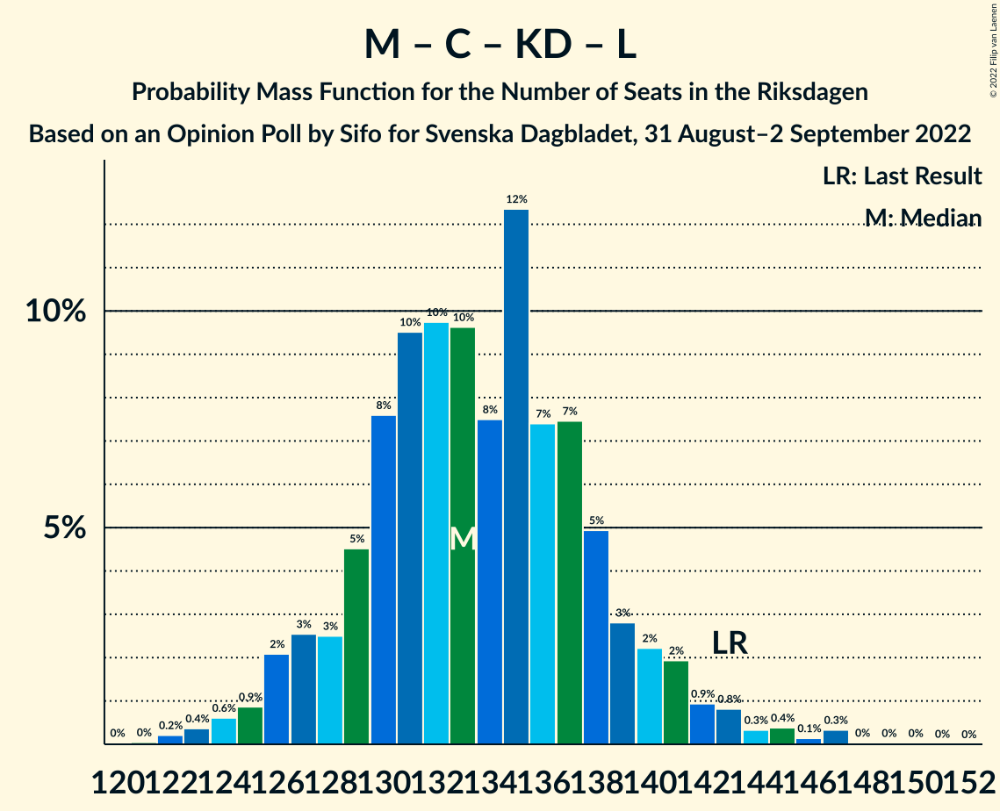

| Number of Seats | Probability | Accumulated | Special Marks |
|:---------------:|:-----------:|:-----------:|:-------------:|
| 120 | 0% | 100% |  |
| 121 | 0% | 99.9% |  |
| 122 | 0.2% | 99.9% |  |
| 123 | 0.4% | 99.7% |  |
| 124 | 0.6% | 99.3% |  |
| 125 | 0.9% | 98.7% |  |
| 126 | 2% | 98% |  |
| 127 | 3% | 96% |  |
| 128 | 3% | 93% |  |
| 129 | 5% | 91% |  |
| 130 | 8% | 86% |  |
| 131 | 10% | 79% |  |
| 132 | 10% | 69% |  |
| 133 | 10% | 59% | Median |
| 134 | 8% | 50% |  |
| 135 | 12% | 42% |  |
| 136 | 7% | 30% |  |
| 137 | 7% | 22% |  |
| 138 | 5% | 15% |  |
| 139 | 3% | 10% |  |
| 140 | 2% | 7% |  |
| 141 | 2% | 5% |  |
| 142 | 0.9% | 3% |  |
| 143 | 0.8% | 2% | Last Result |
| 144 | 0.3% | 1.3% |  |
| 145 | 0.4% | 1.0% |  |
| 146 | 0.1% | 0.6% |  |
| 147 | 0.3% | 0.5% |  |
| 148 | 0% | 0.1% |  |
| 149 | 0% | 0.1% |  |
| 150 | 0% | 0.1% |  |
| 151 | 0% | 0% |  |

### Sverigedemokraterna – Moderata samlingspartiet

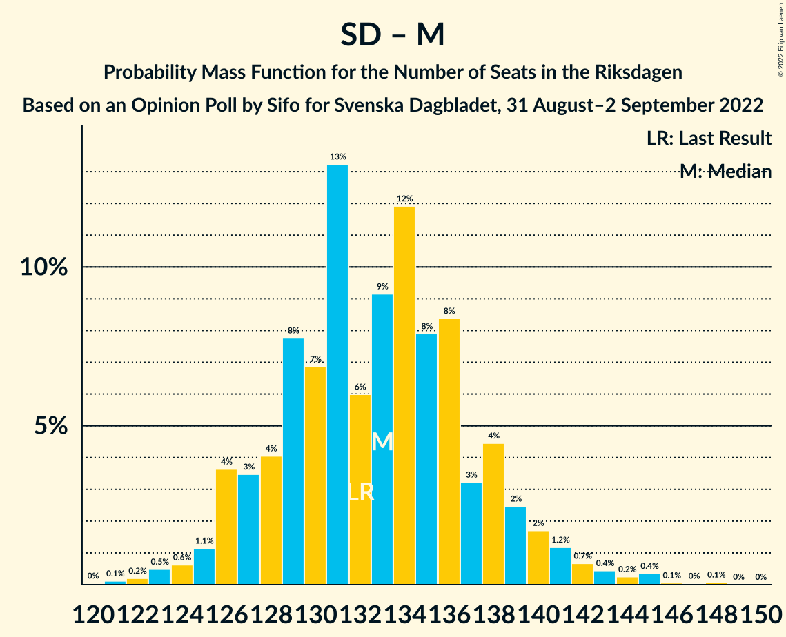

| Number of Seats | Probability | Accumulated | Special Marks |
|:---------------:|:-----------:|:-----------:|:-------------:|
| 120 | 0% | 100% |  |
| 121 | 0.1% | 99.9% |  |
| 122 | 0.2% | 99.8% |  |
| 123 | 0.5% | 99.6% |  |
| 124 | 0.6% | 99.1% |  |
| 125 | 1.1% | 98.5% |  |
| 126 | 4% | 97% |  |
| 127 | 3% | 94% |  |
| 128 | 4% | 90% |  |
| 129 | 8% | 86% |  |
| 130 | 7% | 78% |  |
| 131 | 13% | 72% |  |
| 132 | 6% | 58% | Last Result, Median |
| 133 | 9% | 52% |  |
| 134 | 12% | 43% |  |
| 135 | 8% | 31% |  |
| 136 | 8% | 23% |  |
| 137 | 3% | 15% |  |
| 138 | 4% | 12% |  |
| 139 | 2% | 7% |  |
| 140 | 2% | 5% |  |
| 141 | 1.2% | 3% |  |
| 142 | 0.7% | 2% |  |
| 143 | 0.4% | 1.3% |  |
| 144 | 0.2% | 0.8% |  |
| 145 | 0.4% | 0.6% |  |
| 146 | 0.1% | 0.2% |  |
| 147 | 0% | 0.2% |  |
| 148 | 0.1% | 0.1% |  |
| 149 | 0% | 0% |  |

### Sveriges socialdemokratiska arbetareparti – Vänsterpartiet

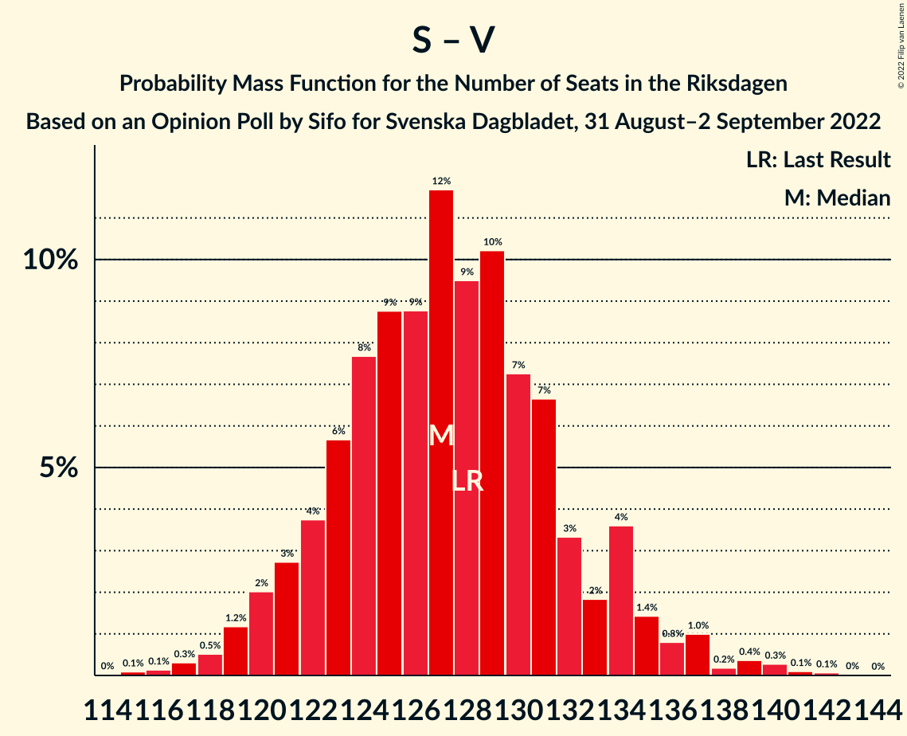

| Number of Seats | Probability | Accumulated | Special Marks |
|:---------------:|:-----------:|:-----------:|:-------------:|
| 115 | 0.1% | 100% |  |
| 116 | 0.1% | 99.9% |  |
| 117 | 0.3% | 99.7% |  |
| 118 | 0.5% | 99.4% |  |
| 119 | 1.2% | 98.9% |  |
| 120 | 2% | 98% |  |
| 121 | 3% | 96% |  |
| 122 | 4% | 93% |  |
| 123 | 6% | 89% |  |
| 124 | 8% | 84% |  |
| 125 | 9% | 76% |  |
| 126 | 9% | 67% |  |
| 127 | 12% | 58% |  |
| 128 | 9% | 47% | Last Result, Median |
| 129 | 10% | 37% |  |
| 130 | 7% | 27% |  |
| 131 | 7% | 20% |  |
| 132 | 3% | 13% |  |
| 133 | 2% | 10% |  |
| 134 | 4% | 8% |  |
| 135 | 1.4% | 4% |  |
| 136 | 0.8% | 3% |  |
| 137 | 1.0% | 2% |  |
| 138 | 0.2% | 1.0% |  |
| 139 | 0.4% | 0.9% |  |
| 140 | 0.3% | 0.5% |  |
| 141 | 0.1% | 0.2% |  |
| 142 | 0.1% | 0.1% |  |
| 143 | 0% | 0% |  |

### Sveriges socialdemokratiska arbetareparti – Miljöpartiet de gröna

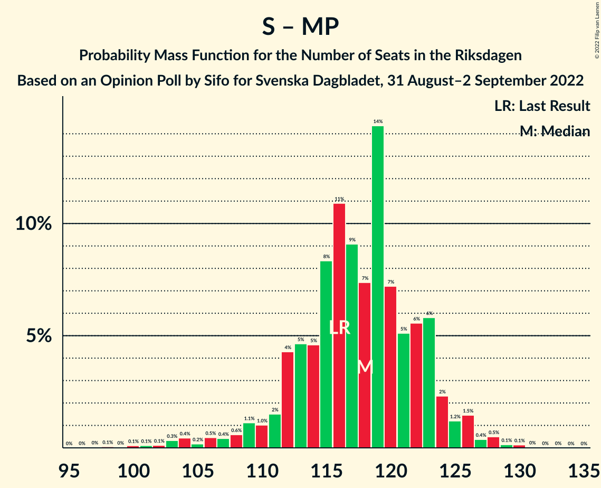

| Number of Seats | Probability | Accumulated | Special Marks |
|:---------------:|:-----------:|:-----------:|:-------------:|
| 97 | 0% | 100% |  |
| 98 | 0.1% | 99.9% |  |
| 99 | 0% | 99.9% |  |
| 100 | 0.1% | 99.9% |  |
| 101 | 0.1% | 99.8% |  |
| 102 | 0.1% | 99.7% |  |
| 103 | 0.3% | 99.5% |  |
| 104 | 0.4% | 99.2% |  |
| 105 | 0.2% | 98.8% |  |
| 106 | 0.5% | 98.6% |  |
| 107 | 0.4% | 98% |  |
| 108 | 0.6% | 98% |  |
| 109 | 1.1% | 97% |  |
| 110 | 1.0% | 96% |  |
| 111 | 2% | 95% |  |
| 112 | 4% | 93% |  |
| 113 | 5% | 89% |  |
| 114 | 5% | 85% |  |
| 115 | 8% | 80% |  |
| 116 | 11% | 72% | Last Result |
| 117 | 9% | 61% |  |
| 118 | 7% | 52% | Median |
| 119 | 14% | 44% |  |
| 120 | 7% | 30% |  |
| 121 | 5% | 23% |  |
| 122 | 6% | 18% |  |
| 123 | 6% | 12% |  |
| 124 | 2% | 6% |  |
| 125 | 1.2% | 4% |  |
| 126 | 1.5% | 3% |  |
| 127 | 0.4% | 1.2% |  |
| 128 | 0.5% | 0.8% |  |
| 129 | 0.1% | 0.3% |  |
| 130 | 0.1% | 0.2% |  |
| 131 | 0% | 0.1% |  |
| 132 | 0% | 0% |  |

### Moderata samlingspartiet – Centerpartiet – Kristdemokraterna

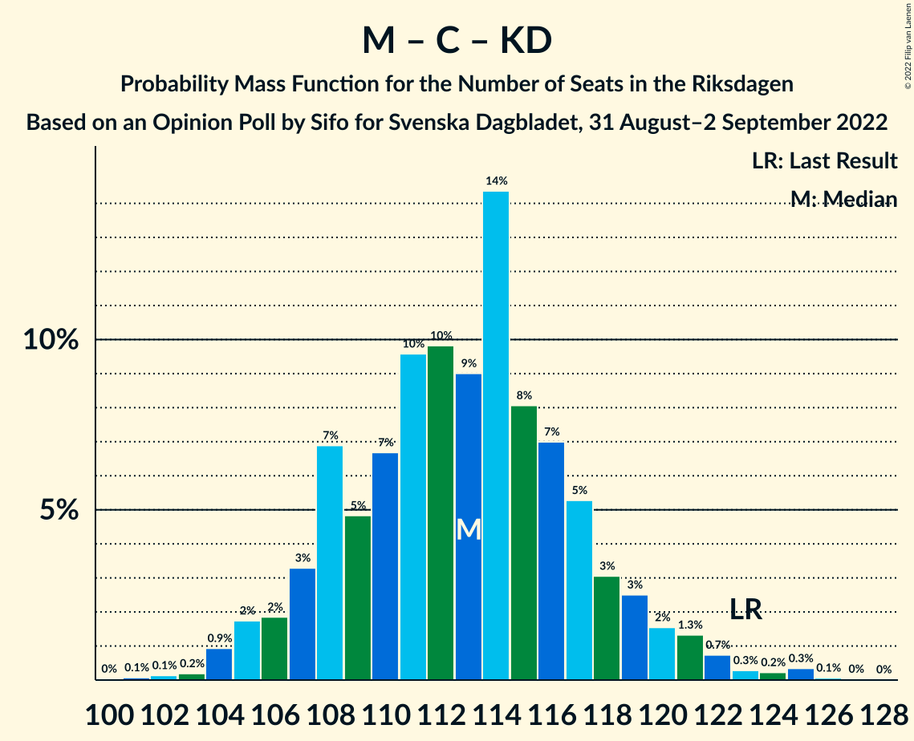

| Number of Seats | Probability | Accumulated | Special Marks |
|:---------------:|:-----------:|:-----------:|:-------------:|
| 100 | 0% | 100% |  |
| 101 | 0.1% | 99.9% |  |
| 102 | 0.1% | 99.9% |  |
| 103 | 0.2% | 99.7% |  |
| 104 | 0.9% | 99.5% |  |
| 105 | 2% | 98.6% |  |
| 106 | 2% | 97% |  |
| 107 | 3% | 95% |  |
| 108 | 7% | 92% |  |
| 109 | 5% | 85% |  |
| 110 | 7% | 80% |  |
| 111 | 10% | 73% |  |
| 112 | 10% | 64% | Median |
| 113 | 9% | 54% |  |
| 114 | 14% | 45% |  |
| 115 | 8% | 31% |  |
| 116 | 7% | 22% |  |
| 117 | 5% | 15% |  |
| 118 | 3% | 10% |  |
| 119 | 3% | 7% |  |
| 120 | 2% | 5% |  |
| 121 | 1.3% | 3% |  |
| 122 | 0.7% | 2% |  |
| 123 | 0.3% | 1.0% | Last Result |
| 124 | 0.2% | 0.7% |  |
| 125 | 0.3% | 0.5% |  |
| 126 | 0.1% | 0.1% |  |
| 127 | 0% | 0.1% |  |
| 128 | 0% | 0% |  |

### Moderata samlingspartiet – Centerpartiet – Liberalerna

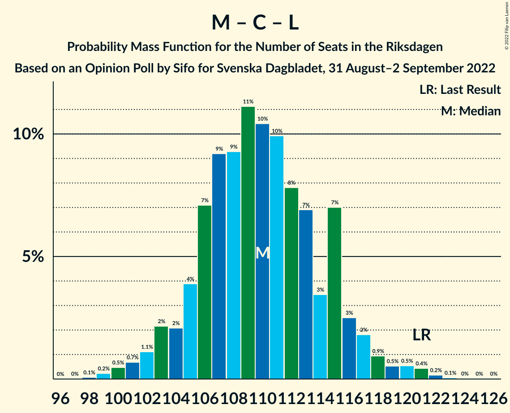

| Number of Seats | Probability | Accumulated | Special Marks |
|:---------------:|:-----------:|:-----------:|:-------------:|
| 98 | 0.1% | 100% |  |
| 99 | 0.2% | 99.9% |  |
| 100 | 0.5% | 99.7% |  |
| 101 | 0.7% | 99.2% |  |
| 102 | 1.1% | 98.5% |  |
| 103 | 2% | 97% |  |
| 104 | 2% | 95% |  |
| 105 | 4% | 93% |  |
| 106 | 7% | 89% |  |
| 107 | 9% | 82% |  |
| 108 | 9% | 73% |  |
| 109 | 11% | 64% |  |
| 110 | 10% | 53% | Median |
| 111 | 10% | 42% |  |
| 112 | 8% | 32% |  |
| 113 | 7% | 24% |  |
| 114 | 3% | 17% |  |
| 115 | 7% | 14% |  |
| 116 | 3% | 7% |  |
| 117 | 2% | 5% |  |
| 118 | 0.9% | 3% |  |
| 119 | 0.5% | 2% |  |
| 120 | 0.5% | 1.3% |  |
| 121 | 0.4% | 0.7% | Last Result |
| 122 | 0.2% | 0.3% |  |
| 123 | 0.1% | 0.1% |  |
| 124 | 0% | 0.1% |  |
| 125 | 0% | 0% |  |

### Moderata samlingspartiet – Kristdemokraterna – Liberalerna

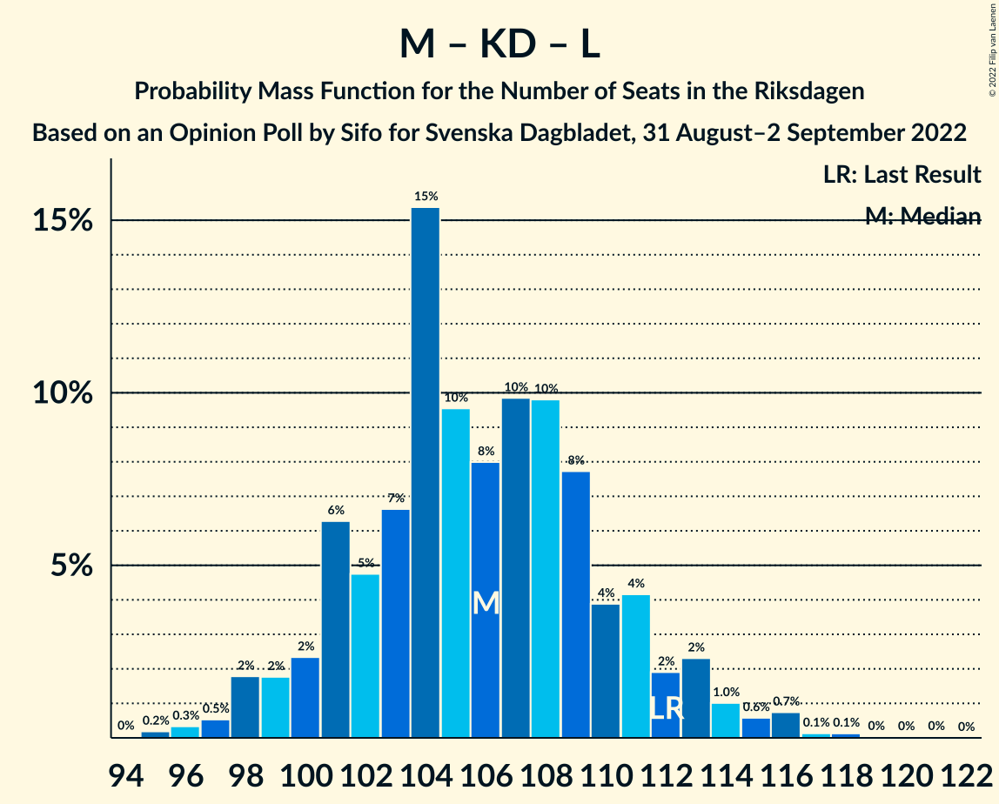

| Number of Seats | Probability | Accumulated | Special Marks |
|:---------------:|:-----------:|:-----------:|:-------------:|
| 94 | 0% | 100% |  |
| 95 | 0.2% | 99.9% |  |
| 96 | 0.3% | 99.7% |  |
| 97 | 0.5% | 99.4% |  |
| 98 | 2% | 98.8% |  |
| 99 | 2% | 97% |  |
| 100 | 2% | 95% |  |
| 101 | 6% | 93% |  |
| 102 | 5% | 87% |  |
| 103 | 7% | 82% |  |
| 104 | 15% | 75% |  |
| 105 | 10% | 60% | Median |
| 106 | 8% | 50% |  |
| 107 | 10% | 42% |  |
| 108 | 10% | 33% |  |
| 109 | 8% | 23% |  |
| 110 | 4% | 15% |  |
| 111 | 4% | 11% |  |
| 112 | 2% | 7% | Last Result |
| 113 | 2% | 5% |  |
| 114 | 1.0% | 3% |  |
| 115 | 0.6% | 2% |  |
| 116 | 0.7% | 1.1% |  |
| 117 | 0.1% | 0.4% |  |
| 118 | 0.1% | 0.2% |  |
| 119 | 0% | 0.1% |  |
| 120 | 0% | 0.1% |  |
| 121 | 0% | 0% |  |

### Sveriges socialdemokratiska arbetareparti

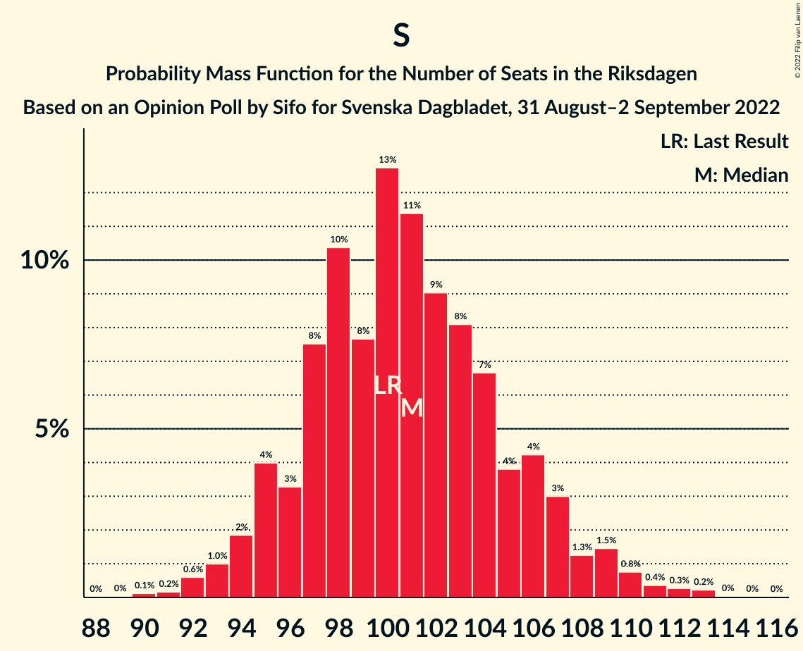

| Number of Seats | Probability | Accumulated | Special Marks |
|:---------------:|:-----------:|:-----------:|:-------------:|
| 89 | 0% | 100% |  |
| 90 | 0.1% | 99.9% |  |
| 91 | 0.2% | 99.8% |  |
| 92 | 0.6% | 99.7% |  |
| 93 | 1.0% | 99.1% |  |
| 94 | 2% | 98% |  |
| 95 | 4% | 96% |  |
| 96 | 3% | 92% |  |
| 97 | 8% | 89% |  |
| 98 | 10% | 81% |  |
| 99 | 8% | 71% |  |
| 100 | 13% | 63% | Last Result |
| 101 | 11% | 51% | Median |
| 102 | 9% | 39% |  |
| 103 | 8% | 30% |  |
| 104 | 7% | 22% |  |
| 105 | 4% | 15% |  |
| 106 | 4% | 12% |  |
| 107 | 3% | 7% |  |
| 108 | 1.3% | 4% |  |
| 109 | 1.5% | 3% |  |
| 110 | 0.8% | 2% |  |
| 111 | 0.4% | 0.9% |  |
| 112 | 0.3% | 0.6% |  |
| 113 | 0.2% | 0.3% |  |
| 114 | 0% | 0.1% |  |
| 115 | 0% | 0% |  |

### Moderata samlingspartiet – Centerpartiet

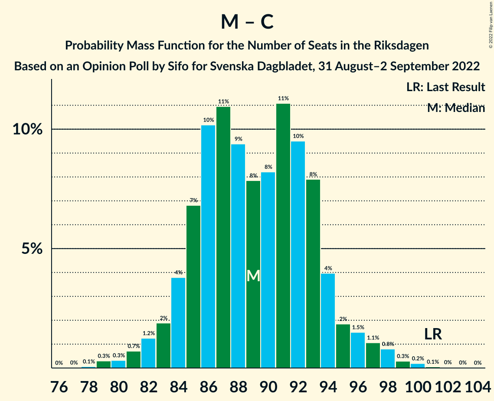

| Number of Seats | Probability | Accumulated | Special Marks |
|:---------------:|:-----------:|:-----------:|:-------------:|
| 78 | 0.1% | 100% |  |
| 79 | 0.3% | 99.9% |  |
| 80 | 0.3% | 99.6% |  |
| 81 | 0.7% | 99.3% |  |
| 82 | 1.2% | 98.6% |  |
| 83 | 2% | 97% |  |
| 84 | 4% | 95% |  |
| 85 | 7% | 92% |  |
| 86 | 10% | 85% |  |
| 87 | 11% | 75% |  |
| 88 | 9% | 64% |  |
| 89 | 8% | 54% | Median |
| 90 | 8% | 46% |  |
| 91 | 11% | 38% |  |
| 92 | 10% | 27% |  |
| 93 | 8% | 18% |  |
| 94 | 4% | 10% |  |
| 95 | 2% | 6% |  |
| 96 | 1.5% | 4% |  |
| 97 | 1.1% | 2% |  |
| 98 | 0.8% | 1.4% |  |
| 99 | 0.3% | 0.6% |  |
| 100 | 0.2% | 0.3% |  |
| 101 | 0.1% | 0.1% | Last Result |
| 102 | 0% | 0.1% |  |
| 103 | 0% | 0% |  |

### Moderata samlingspartiet – Kristdemokraterna

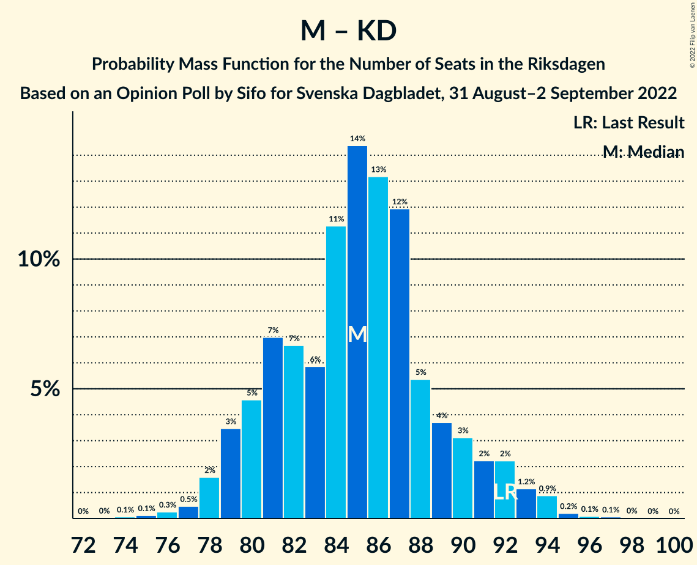

| Number of Seats | Probability | Accumulated | Special Marks |
|:---------------:|:-----------:|:-----------:|:-------------:|
| 74 | 0.1% | 100% |  |
| 75 | 0.1% | 99.9% |  |
| 76 | 0.3% | 99.8% |  |
| 77 | 0.5% | 99.5% |  |
| 78 | 2% | 99.0% |  |
| 79 | 3% | 97% |  |
| 80 | 5% | 94% |  |
| 81 | 7% | 89% |  |
| 82 | 7% | 82% |  |
| 83 | 6% | 76% |  |
| 84 | 11% | 70% | Median |
| 85 | 14% | 59% |  |
| 86 | 13% | 44% |  |
| 87 | 12% | 31% |  |
| 88 | 5% | 19% |  |
| 89 | 4% | 14% |  |
| 90 | 3% | 10% |  |
| 91 | 2% | 7% |  |
| 92 | 2% | 5% | Last Result |
| 93 | 1.2% | 2% |  |
| 94 | 0.9% | 1.3% |  |
| 95 | 0.2% | 0.4% |  |
| 96 | 0.1% | 0.2% |  |
| 97 | 0.1% | 0.1% |  |
| 98 | 0% | 0.1% |  |
| 99 | 0% | 0% |  |

## Technical Information

### Opinion Poll

+ **Polling firm:** Sifo
+ **Commissioner(s):** Svenska Dagbladet
+ **Fieldwork period:** 31 August–2 September 2022

### Calculations

+ **Sample size:** 1889
+ **Simulations done:** 1,048,576
+ **Error estimate:** 1.11%

