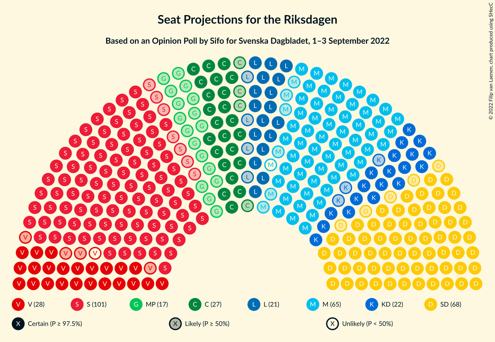

# Opinion Poll by Sifo for Svenska Dagbladet, 1–3 September 2022

<a href="#voting-intentions">Voting Intentions</a> | <a href="#seats">Seats</a> | <a href="#coalitions">Coalitions</a> | <a href="#technical-information">Technical Information</a>

## Voting Intentions

### Confidence Intervals

| Party | Last Result | Poll Result | 80% Confidence Interval | 90% Confidence Interval | 95% Confidence Interval | 99% Confidence Interval |
|:-----:|:-----------:|:-----------:|:-----------------------:|:-----------------------:|:-----------------------:|:-----------------------:|
| Sveriges socialdemokratiska arbetareparti | 28.3% | 28.5% | 27.2–29.9% |26.8–30.3% |26.5–30.6% |25.8–31.3% |
| Sverigedemokraterna | 17.5% | 19.4% | 18.2–20.6% |17.9–21.0% |17.6–21.3% |17.1–21.9% |
| Moderata samlingspartiet | 19.8% | 18.1% | 17.0–19.3% |16.7–19.6% |16.4–19.9% |15.9–20.5% |
| Vänsterpartiet | 8.0% | 7.7% | 6.9–8.6% |6.7–8.8% |6.5–9.0% |6.2–9.4% |
| Centerpartiet | 8.6% | 7.6% | 6.8–8.4% |6.6–8.7% |6.4–8.9% |6.1–9.3% |
| Kristdemokraterna | 6.3% | 6.2% | 5.5–7.0% |5.3–7.2% |5.2–7.4% |4.9–7.8% |
| Liberalerna | 5.5% | 5.9% | 5.2–6.7% |5.0–6.9% |4.9–7.1% |4.6–7.5% |
| Miljöpartiet de gröna | 4.4% | 4.8% | 4.2–5.5% |4.0–5.7% |3.9–5.9% |3.6–6.2% |

*Note:* The poll result column reflects the actual value used in the calculations. Published results may vary slightly, and in addition be rounded to fewer digits.

## Seats

### Confidence Intervals

| Party | Last Result | Median | 80% Confidence Interval | 90% Confidence Interval | 95% Confidence Interval | 99% Confidence Interval |
|:-----:|:-----------:|:------:|:-----------------------:|:-----------------------:|:-----------------------:|:-----------------------:|
| <a href="#sveriges-socialdemokratiska-arbetareparti">Sveriges socialdemokratiska arbetareparti</a> | 100 | 101 | 97–106 |95–108 |94–109 |92–112 |
| <a href="#sverigedemokraterna">Sverigedemokraterna</a> | 62 | 68 | 65–74 |63–75 |63–75 |60–78 |
| <a href="#moderata-samlingspartiet">Moderata samlingspartiet</a> | 70 | 64 | 60–69 |59–70 |58–70 |56–73 |
| <a href="#vänsterpartiet">Vänsterpartiet</a> | 28 | 27 | 24–30 |24–31 |23–32 |22–34 |
| <a href="#centerpartiet">Centerpartiet</a> | 31 | 27 | 24–30 |24–31 |23–32 |22–33 |
| <a href="#kristdemokraterna">Kristdemokraterna</a> | 22 | 22 | 20–25 |19–26 |19–26 |18–28 |
| <a href="#liberalerna">Liberalerna</a> | 20 | 21 | 19–24 |18–24 |17–25 |16–26 |
| <a href="#miljöpartiet-de-gröna">Miljöpartiet de gröna</a> | 16 | 17 | 15–20 |14–20 |0–21 |0–22 |

### Sveriges socialdemokratiska arbetareparti

*For a full overview of the results for this party, see the [Sveriges socialdemokratiska arbetareparti](party-sverigessocialdemokratiskaarbetareparti.html) page.*

| Number of Seats | Probability | Accumulated | Special Marks |
|:---------------:|:-----------:|:-----------:|:-------------:|
| 89 | 0% | 100% |  |
| 90 | 0.2% | 99.9% |  |
| 91 | 0.2% | 99.8% |  |
| 92 | 0.6% | 99.5% |  |
| 93 | 0.8% | 98.9% |  |
| 94 | 2% | 98% |  |
| 95 | 1.5% | 96% |  |
| 96 | 3% | 95% |  |
| 97 | 8% | 92% |  |
| 98 | 9% | 84% |  |
| 99 | 6% | 76% |  |
| 100 | 11% | 70% | Last Result |
| 101 | 18% | 59% | Median |
| 102 | 8% | 41% |  |
| 103 | 7% | 33% |  |
| 104 | 8% | 26% |  |
| 105 | 6% | 18% |  |
| 106 | 2% | 12% |  |
| 107 | 4% | 9% |  |
| 108 | 3% | 6% |  |
| 109 | 0.8% | 3% |  |
| 110 | 0.7% | 2% |  |
| 111 | 0.6% | 1.2% |  |
| 112 | 0.3% | 0.6% |  |
| 113 | 0.2% | 0.3% |  |
| 114 | 0.1% | 0.1% |  |
| 115 | 0% | 0.1% |  |
| 116 | 0% | 0% |  |

### Sverigedemokraterna

*For a full overview of the results for this party, see the [Sverigedemokraterna](party-sverigedemokraterna.html) page.*

| Number of Seats | Probability | Accumulated | Special Marks |
|:---------------:|:-----------:|:-----------:|:-------------:|
| 59 | 0% | 100% |  |
| 60 | 0.4% | 99.9% |  |
| 61 | 0.6% | 99.5% |  |
| 62 | 0.6% | 98.9% | Last Result |
| 63 | 4% | 98% |  |
| 64 | 5% | 95% |  |
| 65 | 5% | 90% |  |
| 66 | 6% | 85% |  |
| 67 | 13% | 79% |  |
| 68 | 16% | 66% | Median |
| 69 | 4% | 49% |  |
| 70 | 10% | 45% |  |
| 71 | 19% | 35% |  |
| 72 | 5% | 17% |  |
| 73 | 1.4% | 12% |  |
| 74 | 6% | 11% |  |
| 75 | 3% | 5% |  |
| 76 | 0.7% | 2% |  |
| 77 | 0.5% | 1.4% |  |
| 78 | 0.4% | 0.9% |  |
| 79 | 0.4% | 0.5% |  |
| 80 | 0% | 0.1% |  |
| 81 | 0% | 0.1% |  |
| 82 | 0% | 0% |  |

### Moderata samlingspartiet

*For a full overview of the results for this party, see the [Moderata samlingspartiet](party-moderatasamlingspartiet.html) page.*

| Number of Seats | Probability | Accumulated | Special Marks |
|:---------------:|:-----------:|:-----------:|:-------------:|
| 54 | 0% | 100% |  |
| 55 | 0.1% | 99.9% |  |
| 56 | 0.5% | 99.8% |  |
| 57 | 0.7% | 99.3% |  |
| 58 | 1.4% | 98.6% |  |
| 59 | 3% | 97% |  |
| 60 | 5% | 94% |  |
| 61 | 9% | 89% |  |
| 62 | 8% | 80% |  |
| 63 | 18% | 71% |  |
| 64 | 8% | 53% | Median |
| 65 | 11% | 45% |  |
| 66 | 6% | 34% |  |
| 67 | 8% | 28% |  |
| 68 | 5% | 20% |  |
| 69 | 9% | 15% |  |
| 70 | 3% | 6% | Last Result |
| 71 | 0.6% | 2% |  |
| 72 | 1.0% | 2% |  |
| 73 | 0.5% | 0.8% |  |
| 74 | 0.2% | 0.3% |  |
| 75 | 0.1% | 0.1% |  |
| 76 | 0% | 0% |  |

### Vänsterpartiet

*For a full overview of the results for this party, see the [Vänsterpartiet](party-vänsterpartiet.html) page.*

| Number of Seats | Probability | Accumulated | Special Marks |
|:---------------:|:-----------:|:-----------:|:-------------:|
| 21 | 0.1% | 100% |  |
| 22 | 0.8% | 99.8% |  |
| 23 | 2% | 99.0% |  |
| 24 | 7% | 97% |  |
| 25 | 5% | 90% |  |
| 26 | 25% | 85% |  |
| 27 | 14% | 61% | Median |
| 28 | 18% | 46% | Last Result |
| 29 | 12% | 28% |  |
| 30 | 9% | 17% |  |
| 31 | 5% | 8% |  |
| 32 | 2% | 4% |  |
| 33 | 0.9% | 2% |  |
| 34 | 0.7% | 0.8% |  |
| 35 | 0.1% | 0.2% |  |
| 36 | 0% | 0% |  |

### Centerpartiet

*For a full overview of the results for this party, see the [Centerpartiet](party-centerpartiet.html) page.*

| Number of Seats | Probability | Accumulated | Special Marks |
|:---------------:|:-----------:|:-----------:|:-------------:|
| 20 | 0.1% | 100% |  |
| 21 | 0.2% | 99.9% |  |
| 22 | 0.9% | 99.7% |  |
| 23 | 3% | 98.7% |  |
| 24 | 8% | 96% |  |
| 25 | 8% | 88% |  |
| 26 | 17% | 80% |  |
| 27 | 22% | 63% | Median |
| 28 | 20% | 41% |  |
| 29 | 8% | 21% |  |
| 30 | 6% | 13% |  |
| 31 | 3% | 7% | Last Result |
| 32 | 2% | 3% |  |
| 33 | 0.6% | 1.0% |  |
| 34 | 0.3% | 0.4% |  |
| 35 | 0.1% | 0.1% |  |
| 36 | 0% | 0% |  |

### Kristdemokraterna

*For a full overview of the results for this party, see the [Kristdemokraterna](party-kristdemokraterna.html) page.*

| Number of Seats | Probability | Accumulated | Special Marks |
|:---------------:|:-----------:|:-----------:|:-------------:|
| 16 | 0.1% | 100% |  |
| 17 | 0.4% | 99.9% |  |
| 18 | 2% | 99.5% |  |
| 19 | 6% | 98% |  |
| 20 | 12% | 92% |  |
| 21 | 22% | 80% |  |
| 22 | 16% | 58% | Last Result, Median |
| 23 | 15% | 42% |  |
| 24 | 14% | 27% |  |
| 25 | 7% | 13% |  |
| 26 | 3% | 5% |  |
| 27 | 2% | 2% |  |
| 28 | 0.5% | 0.7% |  |
| 29 | 0.1% | 0.2% |  |
| 30 | 0% | 0% |  |

### Liberalerna

*For a full overview of the results for this party, see the [Liberalerna](party-liberalerna.html) page.*

| Number of Seats | Probability | Accumulated | Special Marks |
|:---------------:|:-----------:|:-----------:|:-------------:|
| 15 | 0.1% | 100% |  |
| 16 | 0.5% | 99.9% |  |
| 17 | 2% | 99.4% |  |
| 18 | 5% | 97% |  |
| 19 | 10% | 92% |  |
| 20 | 17% | 82% | Last Result |
| 21 | 26% | 65% | Median |
| 22 | 16% | 39% |  |
| 23 | 11% | 23% |  |
| 24 | 7% | 12% |  |
| 25 | 3% | 5% |  |
| 26 | 1.4% | 2% |  |
| 27 | 0.3% | 0.5% |  |
| 28 | 0.1% | 0.1% |  |
| 29 | 0% | 0% |  |

### Miljöpartiet de gröna

*For a full overview of the results for this party, see the [Miljöpartiet de gröna](party-miljöpartietdegröna.html) page.*

| Number of Seats | Probability | Accumulated | Special Marks |
|:---------------:|:-----------:|:-----------:|:-------------:|
| 0 | 4% | 100% |  |
| 1 | 0% | 96% |  |
| 2 | 0% | 96% |  |
| 3 | 0% | 96% |  |
| 4 | 0% | 96% |  |
| 5 | 0% | 96% |  |
| 6 | 0% | 96% |  |
| 7 | 0% | 96% |  |
| 8 | 0% | 96% |  |
| 9 | 0% | 96% |  |
| 10 | 0% | 96% |  |
| 11 | 0% | 96% |  |
| 12 | 0% | 96% |  |
| 13 | 0% | 96% |  |
| 14 | 3% | 96% |  |
| 15 | 9% | 94% |  |
| 16 | 17% | 84% | Last Result |
| 17 | 26% | 67% | Median |
| 18 | 18% | 41% |  |
| 19 | 11% | 24% |  |
| 20 | 9% | 12% |  |
| 21 | 3% | 4% |  |
| 22 | 0.6% | 1.0% |  |
| 23 | 0.3% | 0.4% |  |
| 24 | 0% | 0% |  |

## Coalitions

### Confidence Intervals

| Coalition | Last Result | Median | Majority? | 80% Confidence Interval | 90% Confidence Interval | 95% Confidence Interval | 99% Confidence Interval |
|:---------:|:-----------:|:------:|:---------:|:-----------------------:|:-----------------------:|:-----------------------:|:-----------------------:|
| Sveriges socialdemokratiska arbetareparti – Vänsterpartiet – Centerpartiet – Liberalerna – Miljöpartiet de gröna | 195 | 194 | 100% | 188–199 | 186–200 | 184–202 | 180–204 |
| Sveriges socialdemokratiska arbetareparti – Moderata samlingspartiet – Centerpartiet | 201 | 192 | 100% | 187–198 | 186–200 | 184–202 | 182–206 |
| Sverigedemokraterna – Moderata samlingspartiet – Kristdemokraterna – Liberalerna | 174 | 176 | 65% | 171–182 | 170–184 | 168–187 | 166–191 |
| Sveriges socialdemokratiska arbetareparti – Vänsterpartiet – Centerpartiet – Miljöpartiet de gröna | 175 | 173 | 35% | 167–178 | 165–179 | 162–181 | 158–183 |
| Sveriges socialdemokratiska arbetareparti – Moderata samlingspartiet | 170 | 165 | 3% | 160–171 | 159–172 | 158–175 | 155–178 |
| Sveriges socialdemokratiska arbetareparti – Centerpartiet – Liberalerna – Miljöpartiet de gröna | 167 | 166 | 3% | 161–171 | 158–173 | 157–175 | 152–176 |
| Sverigedemokraterna – Moderata samlingspartiet – Kristdemokraterna | 154 | 155 | 0% | 150–161 | 149–163 | 147–165 | 145–169 |
| Sveriges socialdemokratiska arbetareparti – Vänsterpartiet – Miljöpartiet de gröna | 144 | 145 | 0% | 140–151 | 138–153 | 135–154 | 132–156 |
| Sveriges socialdemokratiska arbetareparti – Centerpartiet – Miljöpartiet de gröna | 147 | 145 | 0% | 139–150 | 137–152 | 134–153 | 130–155 |
| Moderata samlingspartiet – Centerpartiet – Kristdemokraterna – Liberalerna | 143 | 134 | 0% | 129–140 | 128–142 | 127–143 | 125–146 |
| Sverigedemokraterna – Moderata samlingspartiet | 132 | 133 | 0% | 128–139 | 127–140 | 126–142 | 123–145 |
| Sveriges socialdemokratiska arbetareparti – Vänsterpartiet | 128 | 128 | 0% | 123–134 | 122–136 | 121–137 | 118–140 |
| Sveriges socialdemokratiska arbetareparti – Miljöpartiet de gröna | 116 | 118 | 0% | 113–123 | 110–125 | 106–126 | 102–128 |
| Moderata samlingspartiet – Centerpartiet – Kristdemokraterna | 123 | 114 | 0% | 109–118 | 107–120 | 106–121 | 103–125 |
| Moderata samlingspartiet – Centerpartiet – Liberalerna | 121 | 113 | 0% | 107–118 | 106–119 | 105–120 | 103–123 |
| Moderata samlingspartiet – Kristdemokraterna – Liberalerna | 112 | 107 | 0% | 102–113 | 102–114 | 101–116 | 98–118 |
| Sveriges socialdemokratiska arbetareparti | 100 | 101 | 0% | 97–106 | 95–108 | 94–109 | 92–112 |
| Moderata samlingspartiet – Centerpartiet | 101 | 91 | 0% | 87–96 | 86–97 | 85–99 | 82–101 |
| Moderata samlingspartiet – Kristdemokraterna | 92 | 86 | 0% | 82–92 | 81–92 | 80–94 | 77–96 |

### Sveriges socialdemokratiska arbetareparti – Vänsterpartiet – Centerpartiet – Liberalerna – Miljöpartiet de gröna

| Number of Seats | Probability | Accumulated | Special Marks |
|:---------------:|:-----------:|:-----------:|:-------------:|
| 176 | 0% | 100% |  |
| 177 | 0% | 99.9% |  |
| 178 | 0.1% | 99.9% |  |
| 179 | 0.1% | 99.8% |  |
| 180 | 0.3% | 99.7% |  |
| 181 | 0.2% | 99.5% |  |
| 182 | 0.2% | 99.3% |  |
| 183 | 0.8% | 99.0% |  |
| 184 | 1.2% | 98% |  |
| 185 | 0.8% | 97% |  |
| 186 | 2% | 96% |  |
| 187 | 3% | 95% |  |
| 188 | 5% | 92% |  |
| 189 | 4% | 86% |  |
| 190 | 4% | 82% |  |
| 191 | 10% | 78% |  |
| 192 | 6% | 68% |  |
| 193 | 12% | 62% | Median |
| 194 | 6% | 50% |  |
| 195 | 10% | 45% | Last Result |
| 196 | 11% | 35% |  |
| 197 | 3% | 24% |  |
| 198 | 8% | 21% |  |
| 199 | 3% | 13% |  |
| 200 | 5% | 9% |  |
| 201 | 2% | 5% |  |
| 202 | 2% | 3% |  |
| 203 | 0.5% | 1.5% |  |
| 204 | 0.6% | 1.0% |  |
| 205 | 0.2% | 0.4% |  |
| 206 | 0.1% | 0.2% |  |
| 207 | 0% | 0.1% |  |
| 208 | 0% | 0% |  |

### Sveriges socialdemokratiska arbetareparti – Moderata samlingspartiet – Centerpartiet

| Number of Seats | Probability | Accumulated | Special Marks |
|:---------------:|:-----------:|:-----------:|:-------------:|
| 179 | 0% | 100% |  |
| 180 | 0.1% | 99.9% |  |
| 181 | 0.3% | 99.8% |  |
| 182 | 0.5% | 99.5% |  |
| 183 | 0.6% | 99.0% |  |
| 184 | 1.3% | 98% |  |
| 185 | 2% | 97% |  |
| 186 | 4% | 96% |  |
| 187 | 4% | 92% |  |
| 188 | 5% | 88% |  |
| 189 | 5% | 83% |  |
| 190 | 7% | 78% |  |
| 191 | 9% | 71% |  |
| 192 | 13% | 61% | Median |
| 193 | 7% | 49% |  |
| 194 | 6% | 42% |  |
| 195 | 11% | 36% |  |
| 196 | 8% | 25% |  |
| 197 | 6% | 17% |  |
| 198 | 4% | 11% |  |
| 199 | 2% | 7% |  |
| 200 | 1.2% | 5% |  |
| 201 | 0.9% | 4% | Last Result |
| 202 | 1.2% | 3% |  |
| 203 | 0.5% | 2% |  |
| 204 | 0.4% | 1.3% |  |
| 205 | 0.3% | 0.9% |  |
| 206 | 0.2% | 0.7% |  |
| 207 | 0.1% | 0.4% |  |
| 208 | 0.1% | 0.3% |  |
| 209 | 0.1% | 0.2% |  |
| 210 | 0% | 0.1% |  |
| 211 | 0% | 0.1% |  |
| 212 | 0% | 0.1% |  |
| 213 | 0% | 0% |  |

### Sverigedemokraterna – Moderata samlingspartiet – Kristdemokraterna – Liberalerna

| Number of Seats | Probability | Accumulated | Special Marks |
|:---------------:|:-----------:|:-----------:|:-------------:|
| 163 | 0.1% | 100% |  |
| 164 | 0.1% | 99.9% |  |
| 165 | 0.3% | 99.8% |  |
| 166 | 0.4% | 99.5% |  |
| 167 | 0.4% | 99.1% |  |
| 168 | 2% | 98.7% |  |
| 169 | 1.2% | 97% |  |
| 170 | 4% | 96% |  |
| 171 | 4% | 91% |  |
| 172 | 4% | 87% |  |
| 173 | 9% | 83% |  |
| 174 | 10% | 74% | Last Result |
| 175 | 3% | 65% | Median, Majority |
| 176 | 14% | 61% |  |
| 177 | 9% | 48% |  |
| 178 | 6% | 39% |  |
| 179 | 9% | 33% |  |
| 180 | 5% | 24% |  |
| 181 | 7% | 19% |  |
| 182 | 3% | 12% |  |
| 183 | 3% | 9% |  |
| 184 | 2% | 7% |  |
| 185 | 0.9% | 5% |  |
| 186 | 1.0% | 4% |  |
| 187 | 1.5% | 3% |  |
| 188 | 0.2% | 1.3% |  |
| 189 | 0.5% | 1.1% |  |
| 190 | 0.1% | 0.6% |  |
| 191 | 0.1% | 0.5% |  |
| 192 | 0.3% | 0.4% |  |
| 193 | 0% | 0.1% |  |
| 194 | 0.1% | 0.1% |  |
| 195 | 0% | 0% |  |

### Sveriges socialdemokratiska arbetareparti – Vänsterpartiet – Centerpartiet – Miljöpartiet de gröna

| Number of Seats | Probability | Accumulated | Special Marks |
|:---------------:|:-----------:|:-----------:|:-------------:|
| 155 | 0.1% | 100% |  |
| 156 | 0% | 99.9% |  |
| 157 | 0.3% | 99.9% |  |
| 158 | 0.1% | 99.6% |  |
| 159 | 0.1% | 99.5% |  |
| 160 | 0.5% | 99.4% |  |
| 161 | 0.2% | 98.9% |  |
| 162 | 1.5% | 98.7% |  |
| 163 | 1.0% | 97% |  |
| 164 | 0.9% | 96% |  |
| 165 | 2% | 95% |  |
| 166 | 3% | 93% |  |
| 167 | 3% | 91% |  |
| 168 | 7% | 88% |  |
| 169 | 5% | 81% |  |
| 170 | 9% | 76% |  |
| 171 | 6% | 67% |  |
| 172 | 9% | 61% | Median |
| 173 | 14% | 52% |  |
| 174 | 3% | 39% |  |
| 175 | 10% | 35% | Last Result, Majority |
| 176 | 9% | 26% |  |
| 177 | 4% | 17% |  |
| 178 | 4% | 13% |  |
| 179 | 4% | 9% |  |
| 180 | 1.2% | 4% |  |
| 181 | 2% | 3% |  |
| 182 | 0.4% | 1.3% |  |
| 183 | 0.4% | 0.9% |  |
| 184 | 0.3% | 0.5% |  |
| 185 | 0.1% | 0.2% |  |
| 186 | 0.1% | 0.1% |  |
| 187 | 0% | 0% |  |

### Sveriges socialdemokratiska arbetareparti – Moderata samlingspartiet

| Number of Seats | Probability | Accumulated | Special Marks |
|:---------------:|:-----------:|:-----------:|:-------------:|
| 151 | 0% | 100% |  |
| 152 | 0% | 99.9% |  |
| 153 | 0.1% | 99.9% |  |
| 154 | 0.1% | 99.8% |  |
| 155 | 0.4% | 99.6% |  |
| 156 | 0.6% | 99.2% |  |
| 157 | 1.0% | 98.6% |  |
| 158 | 2% | 98% |  |
| 159 | 4% | 96% |  |
| 160 | 5% | 92% |  |
| 161 | 5% | 87% |  |
| 162 | 5% | 83% |  |
| 163 | 8% | 77% |  |
| 164 | 16% | 69% |  |
| 165 | 7% | 53% | Median |
| 166 | 8% | 45% |  |
| 167 | 4% | 37% |  |
| 168 | 4% | 33% |  |
| 169 | 6% | 29% |  |
| 170 | 12% | 23% | Last Result |
| 171 | 4% | 11% |  |
| 172 | 3% | 8% |  |
| 173 | 1.0% | 5% |  |
| 174 | 0.8% | 4% |  |
| 175 | 1.2% | 3% | Majority |
| 176 | 0.5% | 2% |  |
| 177 | 0.5% | 1.2% |  |
| 178 | 0.3% | 0.7% |  |
| 179 | 0.1% | 0.4% |  |
| 180 | 0.1% | 0.3% |  |
| 181 | 0% | 0.2% |  |
| 182 | 0.1% | 0.2% |  |
| 183 | 0% | 0.1% |  |
| 184 | 0% | 0% |  |

### Sveriges socialdemokratiska arbetareparti – Centerpartiet – Liberalerna – Miljöpartiet de gröna

| Number of Seats | Probability | Accumulated | Special Marks |
|:---------------:|:-----------:|:-----------:|:-------------:|
| 147 | 0% | 100% |  |
| 148 | 0% | 99.9% |  |
| 149 | 0.1% | 99.9% |  |
| 150 | 0.3% | 99.8% |  |
| 151 | 0% | 99.5% |  |
| 152 | 0.2% | 99.5% |  |
| 153 | 0.1% | 99.3% |  |
| 154 | 0.3% | 99.2% |  |
| 155 | 0.7% | 98.9% |  |
| 156 | 0.5% | 98% |  |
| 157 | 1.0% | 98% |  |
| 158 | 2% | 97% |  |
| 159 | 2% | 95% |  |
| 160 | 3% | 93% |  |
| 161 | 3% | 90% |  |
| 162 | 4% | 87% |  |
| 163 | 6% | 83% |  |
| 164 | 6% | 76% |  |
| 165 | 18% | 71% |  |
| 166 | 6% | 53% | Median |
| 167 | 7% | 48% | Last Result |
| 168 | 5% | 40% |  |
| 169 | 12% | 35% |  |
| 170 | 8% | 23% |  |
| 171 | 7% | 16% |  |
| 172 | 3% | 9% |  |
| 173 | 2% | 6% |  |
| 174 | 1.2% | 4% |  |
| 175 | 2% | 3% | Majority |
| 176 | 0.7% | 1.1% |  |
| 177 | 0.1% | 0.3% |  |
| 178 | 0.1% | 0.2% |  |
| 179 | 0.1% | 0.1% |  |
| 180 | 0% | 0.1% |  |
| 181 | 0% | 0% |  |

### Sverigedemokraterna – Moderata samlingspartiet – Kristdemokraterna

| Number of Seats | Probability | Accumulated | Special Marks |
|:---------------:|:-----------:|:-----------:|:-------------:|
| 142 | 0% | 100% |  |
| 143 | 0.1% | 99.9% |  |
| 144 | 0.2% | 99.8% |  |
| 145 | 0.6% | 99.6% |  |
| 146 | 0.5% | 99.0% |  |
| 147 | 2% | 98.5% |  |
| 148 | 2% | 97% |  |
| 149 | 5% | 95% |  |
| 150 | 3% | 91% |  |
| 151 | 8% | 87% |  |
| 152 | 3% | 79% |  |
| 153 | 11% | 76% |  |
| 154 | 10% | 65% | Last Result, Median |
| 155 | 6% | 55% |  |
| 156 | 12% | 50% |  |
| 157 | 6% | 38% |  |
| 158 | 10% | 32% |  |
| 159 | 4% | 22% |  |
| 160 | 4% | 18% |  |
| 161 | 5% | 14% |  |
| 162 | 3% | 8% |  |
| 163 | 2% | 5% |  |
| 164 | 0.8% | 4% |  |
| 165 | 1.2% | 3% |  |
| 166 | 0.8% | 2% |  |
| 167 | 0.2% | 1.0% |  |
| 168 | 0.2% | 0.7% |  |
| 169 | 0.3% | 0.5% |  |
| 170 | 0.1% | 0.3% |  |
| 171 | 0.1% | 0.2% |  |
| 172 | 0% | 0.1% |  |
| 173 | 0% | 0.1% |  |
| 174 | 0% | 0% |  |

### Sveriges socialdemokratiska arbetareparti – Vänsterpartiet – Miljöpartiet de gröna

| Number of Seats | Probability | Accumulated | Special Marks |
|:---------------:|:-----------:|:-----------:|:-------------:|
| 126 | 0% | 100% |  |
| 127 | 0% | 99.9% |  |
| 128 | 0% | 99.9% |  |
| 129 | 0.2% | 99.9% |  |
| 130 | 0.1% | 99.7% |  |
| 131 | 0.1% | 99.6% |  |
| 132 | 0.3% | 99.5% |  |
| 133 | 0.2% | 99.2% |  |
| 134 | 0.9% | 98.9% |  |
| 135 | 2% | 98% |  |
| 136 | 0.5% | 97% |  |
| 137 | 1.0% | 96% |  |
| 138 | 2% | 95% |  |
| 139 | 2% | 93% |  |
| 140 | 4% | 91% |  |
| 141 | 6% | 87% |  |
| 142 | 8% | 82% |  |
| 143 | 6% | 74% |  |
| 144 | 9% | 68% | Last Result |
| 145 | 11% | 59% | Median |
| 146 | 5% | 48% |  |
| 147 | 11% | 43% |  |
| 148 | 9% | 32% |  |
| 149 | 7% | 24% |  |
| 150 | 5% | 17% |  |
| 151 | 3% | 12% |  |
| 152 | 4% | 9% |  |
| 153 | 2% | 5% |  |
| 154 | 2% | 3% |  |
| 155 | 0.4% | 1.1% |  |
| 156 | 0.3% | 0.7% |  |
| 157 | 0.2% | 0.4% |  |
| 158 | 0.1% | 0.2% |  |
| 159 | 0.1% | 0.1% |  |
| 160 | 0% | 0% |  |

### Sveriges socialdemokratiska arbetareparti – Centerpartiet – Miljöpartiet de gröna

| Number of Seats | Probability | Accumulated | Special Marks |
|:---------------:|:-----------:|:-----------:|:-------------:|
| 126 | 0.1% | 100% |  |
| 127 | 0.3% | 99.9% |  |
| 128 | 0% | 99.6% |  |
| 129 | 0.1% | 99.6% |  |
| 130 | 0.1% | 99.5% |  |
| 131 | 0.1% | 99.4% |  |
| 132 | 0.1% | 99.2% |  |
| 133 | 0.7% | 99.1% |  |
| 134 | 1.2% | 98% |  |
| 135 | 0.7% | 97% |  |
| 136 | 0.6% | 97% |  |
| 137 | 2% | 96% |  |
| 138 | 2% | 94% |  |
| 139 | 3% | 93% |  |
| 140 | 2% | 89% |  |
| 141 | 5% | 87% |  |
| 142 | 6% | 82% |  |
| 143 | 6% | 76% |  |
| 144 | 14% | 70% |  |
| 145 | 8% | 56% | Median |
| 146 | 7% | 48% |  |
| 147 | 9% | 41% | Last Result |
| 148 | 12% | 32% |  |
| 149 | 6% | 19% |  |
| 150 | 5% | 13% |  |
| 151 | 2% | 8% |  |
| 152 | 3% | 6% |  |
| 153 | 0.9% | 3% |  |
| 154 | 1.1% | 2% |  |
| 155 | 0.7% | 1.2% |  |
| 156 | 0.2% | 0.5% |  |
| 157 | 0.2% | 0.3% |  |
| 158 | 0.1% | 0.1% |  |
| 159 | 0% | 0.1% |  |
| 160 | 0% | 0% |  |

### Moderata samlingspartiet – Centerpartiet – Kristdemokraterna – Liberalerna

| Number of Seats | Probability | Accumulated | Special Marks |
|:---------------:|:-----------:|:-----------:|:-------------:|
| 122 | 0.1% | 100% |  |
| 123 | 0.1% | 99.9% |  |
| 124 | 0.2% | 99.8% |  |
| 125 | 0.6% | 99.6% |  |
| 126 | 0.7% | 98.9% |  |
| 127 | 1.2% | 98% |  |
| 128 | 3% | 97% |  |
| 129 | 5% | 94% |  |
| 130 | 4% | 89% |  |
| 131 | 8% | 85% |  |
| 132 | 7% | 78% |  |
| 133 | 10% | 71% |  |
| 134 | 12% | 61% | Median |
| 135 | 6% | 49% |  |
| 136 | 7% | 43% |  |
| 137 | 11% | 36% |  |
| 138 | 5% | 25% |  |
| 139 | 7% | 20% |  |
| 140 | 5% | 13% |  |
| 141 | 2% | 8% |  |
| 142 | 2% | 6% |  |
| 143 | 2% | 4% | Last Result |
| 144 | 0.6% | 2% |  |
| 145 | 0.5% | 1.2% |  |
| 146 | 0.2% | 0.7% |  |
| 147 | 0.2% | 0.5% |  |
| 148 | 0.1% | 0.3% |  |
| 149 | 0.1% | 0.2% |  |
| 150 | 0.1% | 0.2% |  |
| 151 | 0% | 0% |  |

### Sverigedemokraterna – Moderata samlingspartiet

| Number of Seats | Probability | Accumulated | Special Marks |
|:---------------:|:-----------:|:-----------:|:-------------:|
| 120 | 0% | 100% |  |
| 121 | 0.1% | 99.9% |  |
| 122 | 0.2% | 99.9% |  |
| 123 | 0.4% | 99.6% |  |
| 124 | 0.3% | 99.2% |  |
| 125 | 1.3% | 98.9% |  |
| 126 | 2% | 98% |  |
| 127 | 3% | 95% |  |
| 128 | 4% | 93% |  |
| 129 | 8% | 88% |  |
| 130 | 8% | 80% |  |
| 131 | 8% | 72% |  |
| 132 | 9% | 64% | Last Result, Median |
| 133 | 10% | 55% |  |
| 134 | 8% | 44% |  |
| 135 | 7% | 37% |  |
| 136 | 4% | 30% |  |
| 137 | 11% | 25% |  |
| 138 | 3% | 15% |  |
| 139 | 4% | 12% |  |
| 140 | 3% | 8% |  |
| 141 | 2% | 5% |  |
| 142 | 1.1% | 3% |  |
| 143 | 0.7% | 2% |  |
| 144 | 0.5% | 1.1% |  |
| 145 | 0.3% | 0.7% |  |
| 146 | 0.1% | 0.3% |  |
| 147 | 0.1% | 0.2% |  |
| 148 | 0.1% | 0.1% |  |
| 149 | 0% | 0% |  |

### Sveriges socialdemokratiska arbetareparti – Vänsterpartiet

| Number of Seats | Probability | Accumulated | Special Marks |
|:---------------:|:-----------:|:-----------:|:-------------:|
| 116 | 0.1% | 100% |  |
| 117 | 0.2% | 99.9% |  |
| 118 | 0.4% | 99.7% |  |
| 119 | 0.9% | 99.3% |  |
| 120 | 0.9% | 98% |  |
| 121 | 1.1% | 98% |  |
| 122 | 2% | 96% |  |
| 123 | 5% | 94% |  |
| 124 | 4% | 90% |  |
| 125 | 6% | 85% |  |
| 126 | 10% | 79% |  |
| 127 | 14% | 69% |  |
| 128 | 10% | 55% | Last Result, Median |
| 129 | 4% | 45% |  |
| 130 | 10% | 41% |  |
| 131 | 7% | 31% |  |
| 132 | 8% | 24% |  |
| 133 | 2% | 16% |  |
| 134 | 5% | 14% |  |
| 135 | 3% | 9% |  |
| 136 | 2% | 6% |  |
| 137 | 1.5% | 4% |  |
| 138 | 1.0% | 2% |  |
| 139 | 0.7% | 1.4% |  |
| 140 | 0.2% | 0.7% |  |
| 141 | 0.2% | 0.5% |  |
| 142 | 0.1% | 0.3% |  |
| 143 | 0.1% | 0.2% |  |
| 144 | 0% | 0% |  |

### Sveriges socialdemokratiska arbetareparti – Miljöpartiet de gröna

| Number of Seats | Probability | Accumulated | Special Marks |
|:---------------:|:-----------:|:-----------:|:-------------:|
| 98 | 0.1% | 100% |  |
| 99 | 0% | 99.9% |  |
| 100 | 0.1% | 99.9% |  |
| 101 | 0.1% | 99.8% |  |
| 102 | 0.3% | 99.7% |  |
| 103 | 0.2% | 99.4% |  |
| 104 | 0.2% | 99.2% |  |
| 105 | 0.8% | 99.0% |  |
| 106 | 0.7% | 98% |  |
| 107 | 0.3% | 97% |  |
| 108 | 0.5% | 97% |  |
| 109 | 0.8% | 97% |  |
| 110 | 1.0% | 96% |  |
| 111 | 1.5% | 95% |  |
| 112 | 2% | 93% |  |
| 113 | 5% | 91% |  |
| 114 | 5% | 86% |  |
| 115 | 6% | 80% |  |
| 116 | 7% | 74% | Last Result |
| 117 | 8% | 68% |  |
| 118 | 10% | 59% | Median |
| 119 | 14% | 49% |  |
| 120 | 6% | 36% |  |
| 121 | 13% | 30% |  |
| 122 | 5% | 17% |  |
| 123 | 4% | 12% |  |
| 124 | 1.4% | 8% |  |
| 125 | 3% | 7% |  |
| 126 | 1.3% | 3% |  |
| 127 | 1.3% | 2% |  |
| 128 | 0.6% | 0.9% |  |
| 129 | 0.2% | 0.3% |  |
| 130 | 0.1% | 0.2% |  |
| 131 | 0% | 0.1% |  |
| 132 | 0% | 0% |  |

### Moderata samlingspartiet – Centerpartiet – Kristdemokraterna

| Number of Seats | Probability | Accumulated | Special Marks |
|:---------------:|:-----------:|:-----------:|:-------------:|
| 101 | 0% | 100% |  |
| 102 | 0.2% | 99.9% |  |
| 103 | 0.4% | 99.8% |  |
| 104 | 0.5% | 99.4% |  |
| 105 | 0.8% | 98.9% |  |
| 106 | 1.4% | 98% |  |
| 107 | 2% | 97% |  |
| 108 | 1.2% | 95% |  |
| 109 | 4% | 93% |  |
| 110 | 12% | 89% |  |
| 111 | 15% | 77% |  |
| 112 | 5% | 62% |  |
| 113 | 4% | 57% | Median |
| 114 | 11% | 52% |  |
| 115 | 8% | 42% |  |
| 116 | 9% | 34% |  |
| 117 | 7% | 25% |  |
| 118 | 9% | 18% |  |
| 119 | 3% | 9% |  |
| 120 | 2% | 6% |  |
| 121 | 2% | 4% |  |
| 122 | 0.9% | 2% |  |
| 123 | 0.7% | 2% | Last Result |
| 124 | 0.2% | 0.8% |  |
| 125 | 0.2% | 0.6% |  |
| 126 | 0.1% | 0.3% |  |
| 127 | 0.1% | 0.2% |  |
| 128 | 0.1% | 0.1% |  |
| 129 | 0% | 0% |  |

### Moderata samlingspartiet – Centerpartiet – Liberalerna

| Number of Seats | Probability | Accumulated | Special Marks |
|:---------------:|:-----------:|:-----------:|:-------------:|
| 100 | 0% | 100% |  |
| 101 | 0.1% | 99.9% |  |
| 102 | 0.3% | 99.9% |  |
| 103 | 0.4% | 99.6% |  |
| 104 | 1.0% | 99.2% |  |
| 105 | 1.1% | 98% |  |
| 106 | 2% | 97% |  |
| 107 | 6% | 95% |  |
| 108 | 5% | 89% |  |
| 109 | 8% | 84% |  |
| 110 | 5% | 76% |  |
| 111 | 9% | 71% |  |
| 112 | 10% | 61% | Median |
| 113 | 13% | 51% |  |
| 114 | 6% | 38% |  |
| 115 | 6% | 32% |  |
| 116 | 8% | 26% |  |
| 117 | 6% | 18% |  |
| 118 | 7% | 12% |  |
| 119 | 2% | 6% |  |
| 120 | 2% | 4% |  |
| 121 | 0.6% | 2% | Last Result |
| 122 | 0.6% | 1.3% |  |
| 123 | 0.2% | 0.7% |  |
| 124 | 0.3% | 0.5% |  |
| 125 | 0.1% | 0.2% |  |
| 126 | 0.1% | 0.1% |  |
| 127 | 0% | 0.1% |  |
| 128 | 0% | 0% |  |

### Moderata samlingspartiet – Kristdemokraterna – Liberalerna

| Number of Seats | Probability | Accumulated | Special Marks |
|:---------------:|:-----------:|:-----------:|:-------------:|
| 95 | 0% | 100% |  |
| 96 | 0.1% | 99.9% |  |
| 97 | 0.3% | 99.9% |  |
| 98 | 0.5% | 99.6% |  |
| 99 | 0.7% | 99.1% |  |
| 100 | 0.6% | 98% |  |
| 101 | 2% | 98% |  |
| 102 | 6% | 96% |  |
| 103 | 6% | 90% |  |
| 104 | 5% | 84% |  |
| 105 | 9% | 79% |  |
| 106 | 7% | 70% |  |
| 107 | 14% | 62% | Median |
| 108 | 9% | 48% |  |
| 109 | 7% | 39% |  |
| 110 | 7% | 32% |  |
| 111 | 10% | 26% |  |
| 112 | 4% | 16% | Last Result |
| 113 | 4% | 12% |  |
| 114 | 3% | 8% |  |
| 115 | 2% | 5% |  |
| 116 | 2% | 3% |  |
| 117 | 0.4% | 1.2% |  |
| 118 | 0.4% | 0.9% |  |
| 119 | 0.2% | 0.5% |  |
| 120 | 0.2% | 0.2% |  |
| 121 | 0% | 0.1% |  |
| 122 | 0% | 0% |  |

### Sveriges socialdemokratiska arbetareparti

| Number of Seats | Probability | Accumulated | Special Marks |
|:---------------:|:-----------:|:-----------:|:-------------:|
| 89 | 0% | 100% |  |
| 90 | 0.2% | 99.9% |  |
| 91 | 0.2% | 99.8% |  |
| 92 | 0.6% | 99.5% |  |
| 93 | 0.8% | 98.9% |  |
| 94 | 2% | 98% |  |
| 95 | 1.5% | 96% |  |
| 96 | 3% | 95% |  |
| 97 | 8% | 92% |  |
| 98 | 9% | 84% |  |
| 99 | 6% | 76% |  |
| 100 | 11% | 70% | Last Result |
| 101 | 18% | 59% | Median |
| 102 | 8% | 41% |  |
| 103 | 7% | 33% |  |
| 104 | 8% | 26% |  |
| 105 | 6% | 18% |  |
| 106 | 2% | 12% |  |
| 107 | 4% | 9% |  |
| 108 | 3% | 6% |  |
| 109 | 0.8% | 3% |  |
| 110 | 0.7% | 2% |  |
| 111 | 0.6% | 1.2% |  |
| 112 | 0.3% | 0.6% |  |
| 113 | 0.2% | 0.3% |  |
| 114 | 0.1% | 0.1% |  |
| 115 | 0% | 0.1% |  |
| 116 | 0% | 0% |  |

### Moderata samlingspartiet – Centerpartiet

| Number of Seats | Probability | Accumulated | Special Marks |
|:---------------:|:-----------:|:-----------:|:-------------:|
| 80 | 0.1% | 100% |  |
| 81 | 0.2% | 99.9% |  |
| 82 | 0.3% | 99.7% |  |
| 83 | 0.9% | 99.4% |  |
| 84 | 0.7% | 98% |  |
| 85 | 2% | 98% |  |
| 86 | 5% | 96% |  |
| 87 | 5% | 91% |  |
| 88 | 9% | 86% |  |
| 89 | 6% | 77% |  |
| 90 | 10% | 71% |  |
| 91 | 17% | 61% | Median |
| 92 | 7% | 45% |  |
| 93 | 8% | 38% |  |
| 94 | 6% | 30% |  |
| 95 | 10% | 24% |  |
| 96 | 5% | 14% |  |
| 97 | 5% | 9% |  |
| 98 | 1.3% | 4% |  |
| 99 | 0.9% | 3% |  |
| 100 | 0.8% | 2% |  |
| 101 | 0.4% | 0.8% | Last Result |
| 102 | 0.2% | 0.5% |  |
| 103 | 0.1% | 0.2% |  |
| 104 | 0.1% | 0.1% |  |
| 105 | 0% | 0.1% |  |
| 106 | 0% | 0% |  |

### Moderata samlingspartiet – Kristdemokraterna

| Number of Seats | Probability | Accumulated | Special Marks |
|:---------------:|:-----------:|:-----------:|:-------------:|
| 75 | 0.1% | 100% |  |
| 76 | 0.1% | 99.9% |  |
| 77 | 0.5% | 99.8% |  |
| 78 | 0.6% | 99.4% |  |
| 79 | 1.2% | 98.7% |  |
| 80 | 1.3% | 98% |  |
| 81 | 2% | 96% |  |
| 82 | 6% | 94% |  |
| 83 | 12% | 88% |  |
| 84 | 11% | 76% |  |
| 85 | 5% | 65% |  |
| 86 | 11% | 60% | Median |
| 87 | 8% | 49% |  |
| 88 | 11% | 40% |  |
| 89 | 5% | 29% |  |
| 90 | 10% | 24% |  |
| 91 | 4% | 14% |  |
| 92 | 5% | 10% | Last Result |
| 93 | 2% | 5% |  |
| 94 | 2% | 3% |  |
| 95 | 0.8% | 2% |  |
| 96 | 0.3% | 0.7% |  |
| 97 | 0.2% | 0.5% |  |
| 98 | 0.1% | 0.2% |  |
| 99 | 0.1% | 0.1% |  |
| 100 | 0% | 0% |  |

## Technical Information

### Opinion Poll

+ **Polling firm:** Sifo
+ **Commissioner(s):** Svenska Dagbladet
+ **Fieldwork period:** 1–3 September 2022

### Calculations

+ **Sample size:** 1835
+ **Simulations done:** 524,288
+ **Error estimate:** 1.19%

