# Opinion Poll by Demoskop for Aftonbladet, 31 August–4 September 2022

<a href="#voting-intentions">Voting Intentions</a> | <a href="#seats">Seats</a> | <a href="#coalitions">Coalitions</a> | <a href="#technical-information">Technical Information</a>

## Voting Intentions

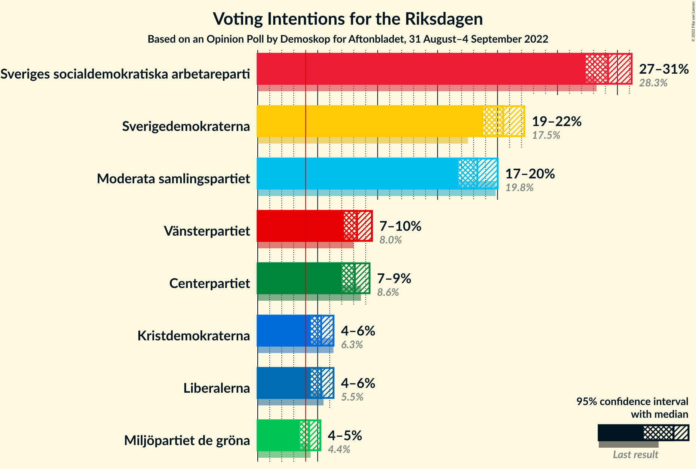

### Confidence Intervals

| Party | Last Result | Poll Result | 80% Confidence Interval | 90% Confidence Interval | 95% Confidence Interval | 99% Confidence Interval |
|:-----:|:-----------:|:-----------:|:-----------------------:|:-----------------------:|:-----------------------:|:-----------------------:|
| Sveriges socialdemokratiska arbetareparti | 28.3% | 29.2% | 28.0–30.5% |27.6–30.9% |27.3–31.2% |26.8–31.8% |
| Sverigedemokraterna | 17.5% | 20.5% | 19.4–21.6% |19.1–21.9% |18.8–22.2% |18.3–22.8% |
| Moderata samlingspartiet | 19.8% | 18.3% | 17.3–19.4% |17.0–19.7% |16.7–20.0% |16.3–20.5% |
| Vänsterpartiet | 8.0% | 8.3% | 7.6–9.1% |7.4–9.3% |7.2–9.5% |6.9–9.9% |
| Centerpartiet | 8.6% | 8.1% | 7.4–8.9% |7.2–9.1% |7.0–9.3% |6.7–9.7% |
| Kristdemokraterna | 6.3% | 5.3% | 4.7–6.0% |4.6–6.2% |4.4–6.3% |4.2–6.7% |
| Liberalerna | 5.5% | 5.3% | 4.7–6.0% |4.6–6.2% |4.4–6.3% |4.2–6.7% |
| Miljöpartiet de gröna | 4.4% | 4.3% | 3.8–4.9% |3.6–5.1% |3.5–5.2% |3.3–5.5% |

*Note:* The poll result column reflects the actual value used in the calculations. Published results may vary slightly, and in addition be rounded to fewer digits.

## Seats

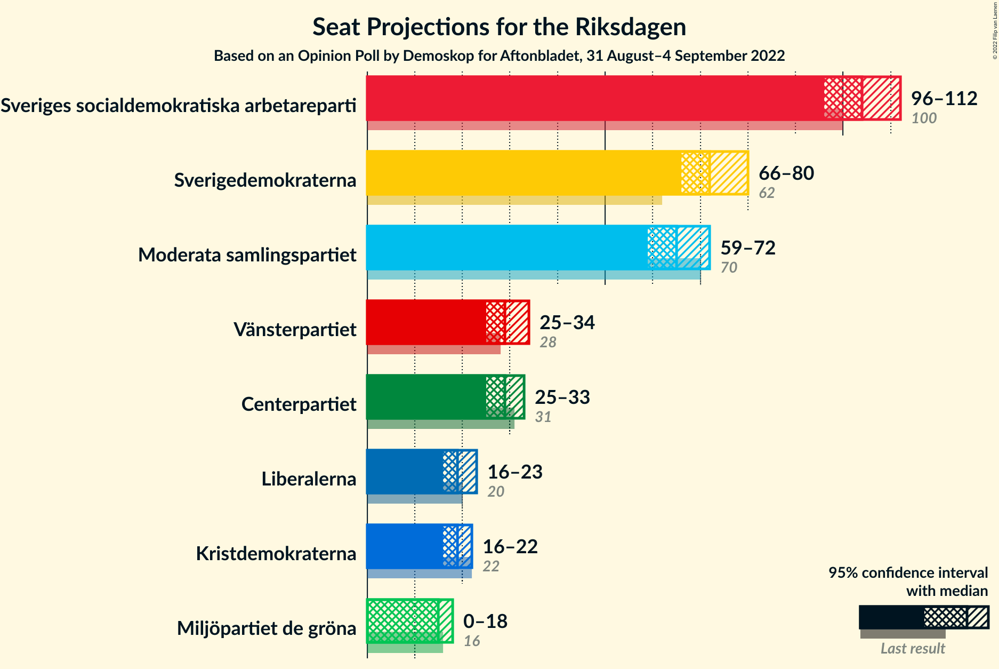

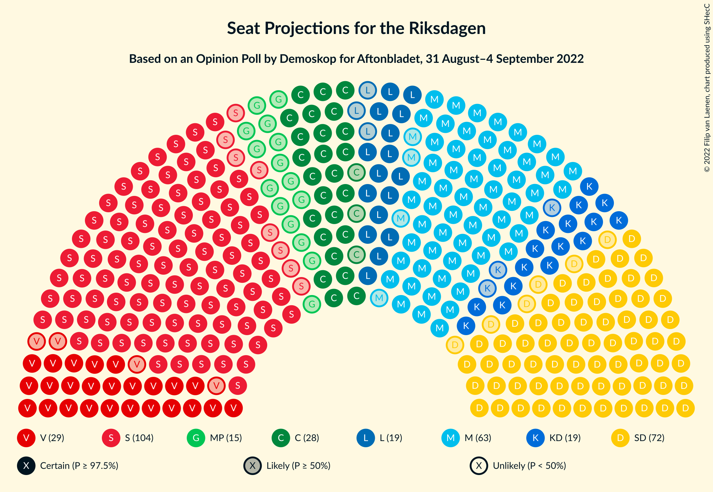

### Confidence Intervals

| Party | Last Result | Median | 80% Confidence Interval | 90% Confidence Interval | 95% Confidence Interval | 99% Confidence Interval |
|:-----:|:-----------:|:------:|:-----------------------:|:-----------------------:|:-----------------------:|:-----------------------:|
| <a href="#sveriges-socialdemokratiska-arbetareparti">Sveriges socialdemokratiska arbetareparti</a> | 100 | 104 | 99–109 |97–111 |96–112 |94–115 |
| <a href="#sverigedemokraterna">Sverigedemokraterna</a> | 62 | 72 | 68–77 |67–78 |66–80 |65–82 |
| <a href="#moderata-samlingspartiet">Moderata samlingspartiet</a> | 70 | 65 | 61–69 |60–71 |59–72 |57–74 |
| <a href="#vänsterpartiet">Vänsterpartiet</a> | 28 | 29 | 27–32 |26–33 |25–34 |24–35 |
| <a href="#centerpartiet">Centerpartiet</a> | 31 | 29 | 26–32 |25–33 |25–33 |24–35 |
| <a href="#kristdemokraterna">Kristdemokraterna</a> | 22 | 19 | 16–21 |16–22 |16–22 |15–24 |
| <a href="#liberalerna">Liberalerna</a> | 20 | 19 | 17–21 |16–22 |16–23 |15–24 |
| <a href="#miljöpartiet-de-gröna">Miljöpartiet de gröna</a> | 16 | 15 | 0–17 |0–18 |0–18 |0–19 |

### Sveriges socialdemokratiska arbetareparti

*For a full overview of the results for this party, see the [Sveriges socialdemokratiska arbetareparti](party-sverigessocialdemokratiskaarbetareparti.html) page.*

| Number of Seats | Probability | Accumulated | Special Marks |
|:---------------:|:-----------:|:-----------:|:-------------:|
| 92 | 0.1% | 100% |  |
| 93 | 0.2% | 99.9% |  |
| 94 | 0.3% | 99.7% |  |
| 95 | 0.7% | 99.4% |  |
| 96 | 2% | 98.8% |  |
| 97 | 4% | 97% |  |
| 98 | 2% | 93% |  |
| 99 | 6% | 91% |  |
| 100 | 7% | 85% | Last Result |
| 101 | 11% | 78% |  |
| 102 | 8% | 67% |  |
| 103 | 8% | 59% |  |
| 104 | 10% | 52% | Median |
| 105 | 13% | 41% |  |
| 106 | 5% | 28% |  |
| 107 | 7% | 23% |  |
| 108 | 3% | 16% |  |
| 109 | 4% | 14% |  |
| 110 | 2% | 9% |  |
| 111 | 3% | 7% |  |
| 112 | 1.3% | 4% |  |
| 113 | 1.0% | 2% |  |
| 114 | 0.4% | 1.3% |  |
| 115 | 0.5% | 0.9% |  |
| 116 | 0.3% | 0.4% |  |
| 117 | 0.1% | 0.1% |  |
| 118 | 0% | 0% |  |

### Sverigedemokraterna

*For a full overview of the results for this party, see the [Sverigedemokraterna](party-sverigedemokraterna.html) page.*

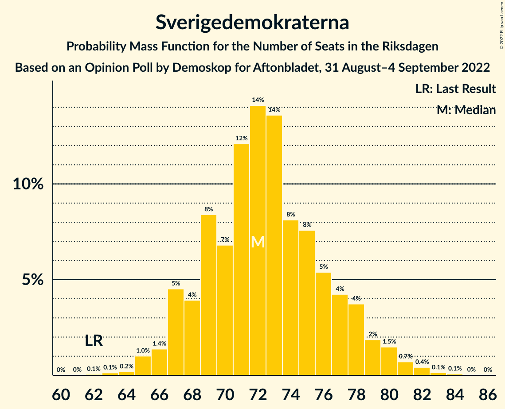

| Number of Seats | Probability | Accumulated | Special Marks |
|:---------------:|:-----------:|:-----------:|:-------------:|
| 62 | 0.1% | 100% | Last Result |
| 63 | 0.1% | 99.9% |  |
| 64 | 0.2% | 99.8% |  |
| 65 | 1.0% | 99.6% |  |
| 66 | 1.4% | 98.6% |  |
| 67 | 5% | 97% |  |
| 68 | 4% | 93% |  |
| 69 | 8% | 89% |  |
| 70 | 7% | 80% |  |
| 71 | 12% | 74% |  |
| 72 | 14% | 61% | Median |
| 73 | 14% | 47% |  |
| 74 | 8% | 34% |  |
| 75 | 8% | 26% |  |
| 76 | 5% | 18% |  |
| 77 | 4% | 13% |  |
| 78 | 4% | 8% |  |
| 79 | 2% | 5% |  |
| 80 | 1.5% | 3% |  |
| 81 | 0.7% | 1.4% |  |
| 82 | 0.4% | 0.7% |  |
| 83 | 0.1% | 0.2% |  |
| 84 | 0.1% | 0.1% |  |
| 85 | 0% | 0% |  |

### Moderata samlingspartiet

*For a full overview of the results for this party, see the [Moderata samlingspartiet](party-moderatasamlingspartiet.html) page.*

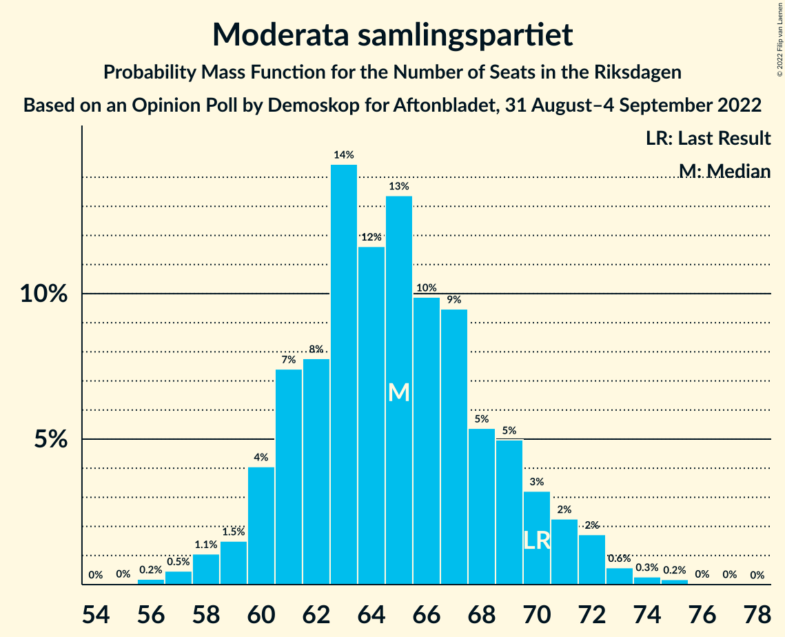

| Number of Seats | Probability | Accumulated | Special Marks |
|:---------------:|:-----------:|:-----------:|:-------------:|
| 55 | 0% | 100% |  |
| 56 | 0.2% | 99.9% |  |
| 57 | 0.5% | 99.7% |  |
| 58 | 1.1% | 99.3% |  |
| 59 | 1.5% | 98% |  |
| 60 | 4% | 97% |  |
| 61 | 7% | 93% |  |
| 62 | 8% | 85% |  |
| 63 | 14% | 77% |  |
| 64 | 12% | 63% |  |
| 65 | 13% | 51% | Median |
| 66 | 10% | 38% |  |
| 67 | 9% | 28% |  |
| 68 | 5% | 19% |  |
| 69 | 5% | 13% |  |
| 70 | 3% | 8% | Last Result |
| 71 | 2% | 5% |  |
| 72 | 2% | 3% |  |
| 73 | 0.6% | 1.1% |  |
| 74 | 0.3% | 0.5% |  |
| 75 | 0.2% | 0.3% |  |
| 76 | 0% | 0.1% |  |
| 77 | 0% | 0% |  |

### Vänsterpartiet

*For a full overview of the results for this party, see the [Vänsterpartiet](party-vänsterpartiet.html) page.*

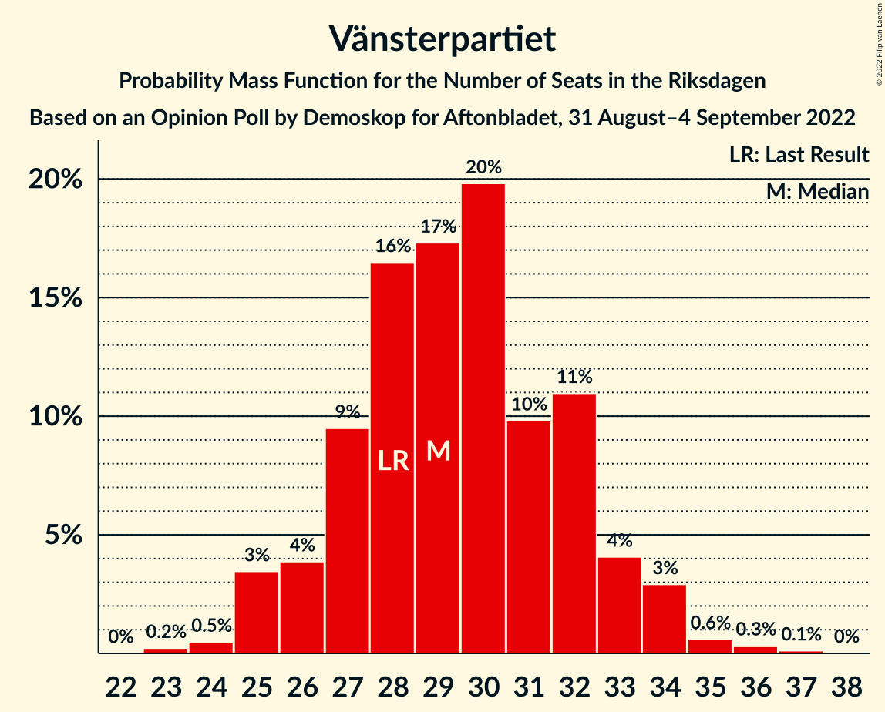

| Number of Seats | Probability | Accumulated | Special Marks |
|:---------------:|:-----------:|:-----------:|:-------------:|
| 23 | 0.2% | 100% |  |
| 24 | 0.5% | 99.8% |  |
| 25 | 3% | 99.3% |  |
| 26 | 4% | 96% |  |
| 27 | 9% | 92% |  |
| 28 | 16% | 82% | Last Result |
| 29 | 17% | 66% | Median |
| 30 | 20% | 49% |  |
| 31 | 10% | 29% |  |
| 32 | 11% | 19% |  |
| 33 | 4% | 8% |  |
| 34 | 3% | 4% |  |
| 35 | 0.6% | 1.1% |  |
| 36 | 0.3% | 0.5% |  |
| 37 | 0.1% | 0.1% |  |
| 38 | 0% | 0% |  |

### Centerpartiet

*For a full overview of the results for this party, see the [Centerpartiet](party-centerpartiet.html) page.*

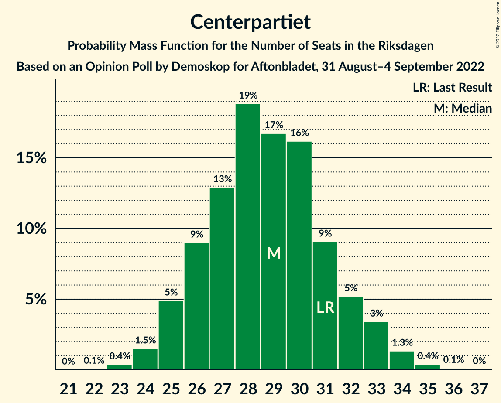

| Number of Seats | Probability | Accumulated | Special Marks |
|:---------------:|:-----------:|:-----------:|:-------------:|
| 22 | 0.1% | 100% |  |
| 23 | 0.4% | 99.9% |  |
| 24 | 1.5% | 99.5% |  |
| 25 | 5% | 98% |  |
| 26 | 9% | 93% |  |
| 27 | 13% | 84% |  |
| 28 | 19% | 71% |  |
| 29 | 17% | 52% | Median |
| 30 | 16% | 36% |  |
| 31 | 9% | 20% | Last Result |
| 32 | 5% | 10% |  |
| 33 | 3% | 5% |  |
| 34 | 1.3% | 2% |  |
| 35 | 0.4% | 0.6% |  |
| 36 | 0.1% | 0.2% |  |
| 37 | 0% | 0% |  |

### Kristdemokraterna

*For a full overview of the results for this party, see the [Kristdemokraterna](party-kristdemokraterna.html) page.*

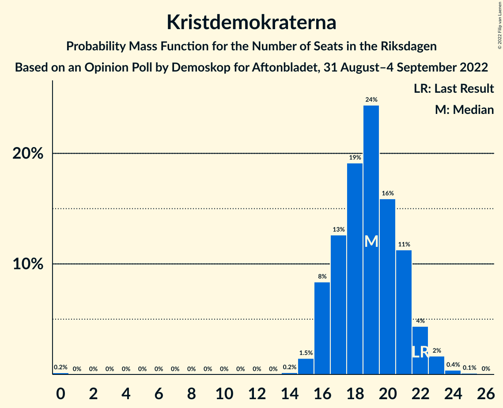

| Number of Seats | Probability | Accumulated | Special Marks |
|:---------------:|:-----------:|:-----------:|:-------------:|
| 0 | 0.2% | 100% |  |
| 1 | 0% | 99.8% |  |
| 2 | 0% | 99.8% |  |
| 3 | 0% | 99.8% |  |
| 4 | 0% | 99.8% |  |
| 5 | 0% | 99.8% |  |
| 6 | 0% | 99.8% |  |
| 7 | 0% | 99.8% |  |
| 8 | 0% | 99.8% |  |
| 9 | 0% | 99.8% |  |
| 10 | 0% | 99.8% |  |
| 11 | 0% | 99.8% |  |
| 12 | 0% | 99.8% |  |
| 13 | 0% | 99.8% |  |
| 14 | 0.2% | 99.8% |  |
| 15 | 1.5% | 99.7% |  |
| 16 | 8% | 98% |  |
| 17 | 13% | 90% |  |
| 18 | 19% | 77% |  |
| 19 | 24% | 58% | Median |
| 20 | 16% | 34% |  |
| 21 | 11% | 18% |  |
| 22 | 4% | 7% | Last Result |
| 23 | 2% | 2% |  |
| 24 | 0.4% | 0.5% |  |
| 25 | 0.1% | 0.1% |  |
| 26 | 0% | 0% |  |

### Liberalerna

*For a full overview of the results for this party, see the [Liberalerna](party-liberalerna.html) page.*

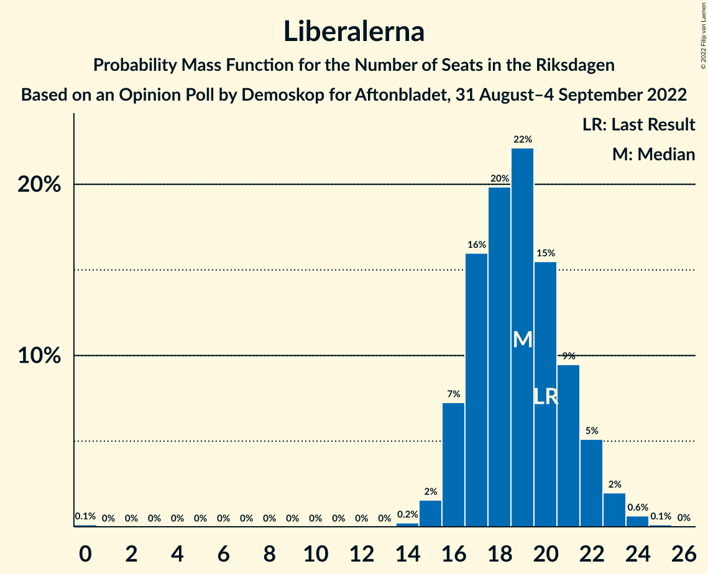

| Number of Seats | Probability | Accumulated | Special Marks |
|:---------------:|:-----------:|:-----------:|:-------------:|
| 0 | 0.1% | 100% |  |
| 1 | 0% | 99.9% |  |
| 2 | 0% | 99.9% |  |
| 3 | 0% | 99.9% |  |
| 4 | 0% | 99.9% |  |
| 5 | 0% | 99.9% |  |
| 6 | 0% | 99.9% |  |
| 7 | 0% | 99.9% |  |
| 8 | 0% | 99.9% |  |
| 9 | 0% | 99.9% |  |
| 10 | 0% | 99.9% |  |
| 11 | 0% | 99.9% |  |
| 12 | 0% | 99.9% |  |
| 13 | 0% | 99.9% |  |
| 14 | 0.2% | 99.9% |  |
| 15 | 2% | 99.6% |  |
| 16 | 7% | 98% |  |
| 17 | 16% | 91% |  |
| 18 | 20% | 75% |  |
| 19 | 22% | 55% | Median |
| 20 | 15% | 33% | Last Result |
| 21 | 9% | 17% |  |
| 22 | 5% | 8% |  |
| 23 | 2% | 3% |  |
| 24 | 0.6% | 0.8% |  |
| 25 | 0.1% | 0.2% |  |
| 26 | 0% | 0% |  |

### Miljöpartiet de gröna

*For a full overview of the results for this party, see the [Miljöpartiet de gröna](party-miljöpartietdegröna.html) page.*

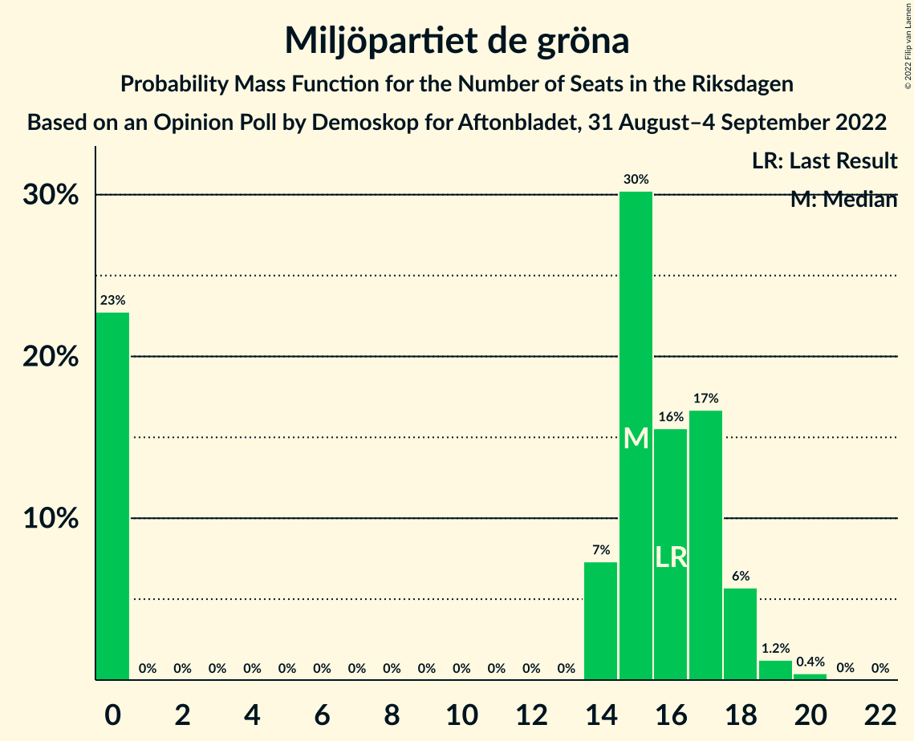

| Number of Seats | Probability | Accumulated | Special Marks |
|:---------------:|:-----------:|:-----------:|:-------------:|
| 0 | 23% | 100% |  |
| 1 | 0% | 77% |  |
| 2 | 0% | 77% |  |
| 3 | 0% | 77% |  |
| 4 | 0% | 77% |  |
| 5 | 0% | 77% |  |
| 6 | 0% | 77% |  |
| 7 | 0% | 77% |  |
| 8 | 0% | 77% |  |
| 9 | 0% | 77% |  |
| 10 | 0% | 77% |  |
| 11 | 0% | 77% |  |
| 12 | 0% | 77% |  |
| 13 | 0% | 77% |  |
| 14 | 7% | 77% |  |
| 15 | 30% | 70% | Median |
| 16 | 16% | 40% | Last Result |
| 17 | 17% | 24% |  |
| 18 | 6% | 7% |  |
| 19 | 1.2% | 2% |  |
| 20 | 0.4% | 0.5% |  |
| 21 | 0% | 0.1% |  |
| 22 | 0% | 0% |  |

## Coalitions

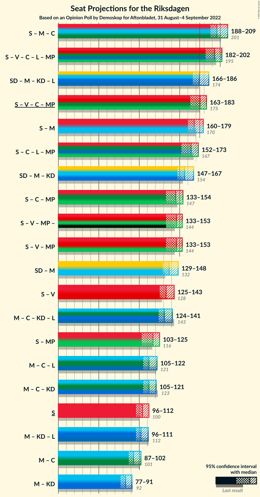

### Confidence Intervals

| Coalition | Last Result | Median | Majority? | 80% Confidence Interval | 90% Confidence Interval | 95% Confidence Interval | 99% Confidence Interval |
|:---------:|:-----------:|:------:|:---------:|:-----------------------:|:-----------------------:|:-----------------------:|:-----------------------:|
| Sveriges socialdemokratiska arbetareparti – Moderata samlingspartiet – Centerpartiet | 201 | 196 | 100% | 190–206 | 189–207 | 188–209 | 186–212 |
| Sveriges socialdemokratiska arbetareparti – Vänsterpartiet – Centerpartiet – Liberalerna – Miljöpartiet de gröna | 195 | 193 | 100% | 187–198 | 184–200 | 182–202 | 179–204 |
| Sverigedemokraterna – Moderata samlingspartiet – Kristdemokraterna – Liberalerna | 174 | 174 | 50% | 169–182 | 168–184 | 166–186 | 164–189 |
| Sveriges socialdemokratiska arbetareparti – Vänsterpartiet – Centerpartiet – Miljöpartiet de gröna | 175 | 175 | 50% | 167–180 | 165–181 | 163–183 | 160–185 |
| Sveriges socialdemokratiska arbetareparti – Moderata samlingspartiet | 170 | 168 | 13% | 162–176 | 161–177 | 160–179 | 157–183 |
| Sveriges socialdemokratiska arbetareparti – Centerpartiet – Liberalerna – Miljöpartiet de gröna | 167 | 164 | 0.5% | 156–169 | 154–171 | 152–173 | 149–174 |
| Sverigedemokraterna – Moderata samlingspartiet – Kristdemokraterna | 154 | 156 | 0% | 151–162 | 149–165 | 147–167 | 145–170 |
| Sveriges socialdemokratiska arbetareparti – Centerpartiet – Miljöpartiet de gröna | 147 | 145 | 0% | 137–151 | 135–152 | 133–154 | 130–156 |
| Sveriges socialdemokratiska arbetareparti – Vänsterpartiet – Miljöpartiet de gröna | 144 | 146 | 0% | 137–152 | 135–153 | 133–153 | 130–156 |
| Sverigedemokraterna – Moderata samlingspartiet | 132 | 137 | 0% | 132–143 | 130–146 | 129–148 | 127–151 |
| Sveriges socialdemokratiska arbetareparti – Vänsterpartiet | 128 | 133 | 0% | 128–140 | 126–142 | 125–143 | 123–146 |
| Moderata samlingspartiet – Centerpartiet – Kristdemokraterna – Liberalerna | 143 | 131 | 0% | 126–137 | 125–139 | 124–141 | 121–144 |
| Sveriges socialdemokratiska arbetareparti – Miljöpartiet de gröna | 116 | 117 | 0% | 107–122 | 105–123 | 103–125 | 100–127 |
| Moderata samlingspartiet – Centerpartiet – Liberalerna | 121 | 112 | 0% | 107–119 | 106–120 | 105–122 | 102–124 |
| Moderata samlingspartiet – Centerpartiet – Kristdemokraterna | 123 | 112 | 0% | 108–117 | 106–120 | 105–121 | 103–124 |
| Sveriges socialdemokratiska arbetareparti | 100 | 104 | 0% | 99–109 | 97–111 | 96–112 | 94–115 |
| Moderata samlingspartiet – Kristdemokraterna – Liberalerna | 112 | 102 | 0% | 98–108 | 97–109 | 96–111 | 92–114 |
| Moderata samlingspartiet – Centerpartiet | 101 | 93 | 0% | 89–99 | 88–100 | 87–102 | 84–104 |
| Moderata samlingspartiet – Kristdemokraterna | 92 | 83 | 0% | 79–88 | 78–90 | 77–91 | 75–94 |

### Sveriges socialdemokratiska arbetareparti – Moderata samlingspartiet – Centerpartiet

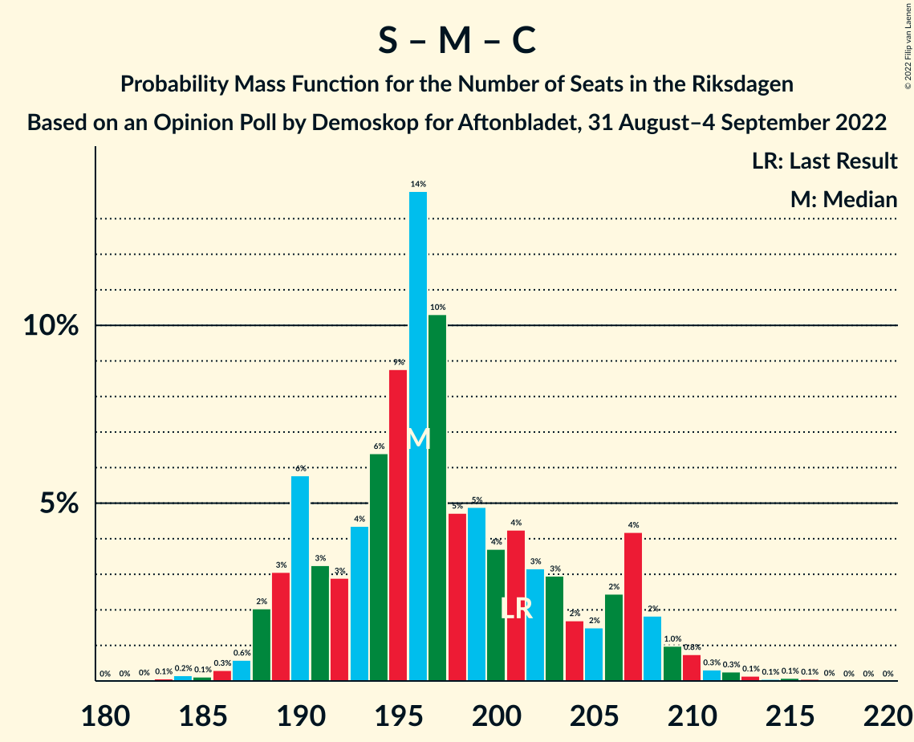

| Number of Seats | Probability | Accumulated | Special Marks |
|:---------------:|:-----------:|:-----------:|:-------------:|
| 183 | 0.1% | 100% |  |
| 184 | 0.2% | 99.9% |  |
| 185 | 0.1% | 99.7% |  |
| 186 | 0.3% | 99.6% |  |
| 187 | 0.6% | 99.3% |  |
| 188 | 2% | 98.7% |  |
| 189 | 3% | 97% |  |
| 190 | 6% | 94% |  |
| 191 | 3% | 88% |  |
| 192 | 3% | 85% |  |
| 193 | 4% | 82% |  |
| 194 | 6% | 77% |  |
| 195 | 9% | 71% |  |
| 196 | 14% | 62% |  |
| 197 | 10% | 48% |  |
| 198 | 5% | 38% | Median |
| 199 | 5% | 33% |  |
| 200 | 4% | 28% |  |
| 201 | 4% | 25% | Last Result |
| 202 | 3% | 20% |  |
| 203 | 3% | 17% |  |
| 204 | 2% | 14% |  |
| 205 | 2% | 13% |  |
| 206 | 2% | 11% |  |
| 207 | 4% | 9% |  |
| 208 | 2% | 5% |  |
| 209 | 1.0% | 3% |  |
| 210 | 0.8% | 2% |  |
| 211 | 0.3% | 1.0% |  |
| 212 | 0.3% | 0.6% |  |
| 213 | 0.1% | 0.4% |  |
| 214 | 0.1% | 0.2% |  |
| 215 | 0.1% | 0.2% |  |
| 216 | 0.1% | 0.1% |  |
| 217 | 0% | 0% |  |

### Sveriges socialdemokratiska arbetareparti – Vänsterpartiet – Centerpartiet – Liberalerna – Miljöpartiet de gröna

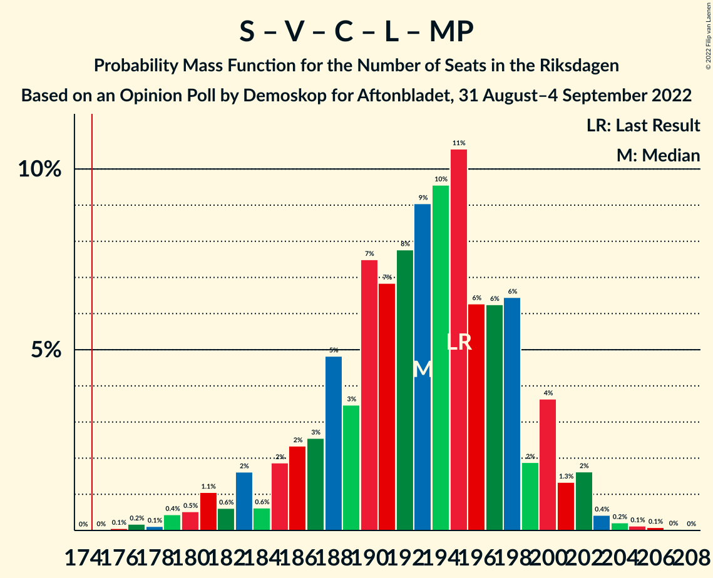

| Number of Seats | Probability | Accumulated | Special Marks |
|:---------------:|:-----------:|:-----------:|:-------------:|
| 176 | 0.1% | 100% |  |
| 177 | 0.2% | 99.9% |  |
| 178 | 0.1% | 99.7% |  |
| 179 | 0.4% | 99.6% |  |
| 180 | 0.5% | 99.2% |  |
| 181 | 1.1% | 98.6% |  |
| 182 | 0.6% | 98% |  |
| 183 | 2% | 97% |  |
| 184 | 0.6% | 95% |  |
| 185 | 2% | 95% |  |
| 186 | 2% | 93% |  |
| 187 | 3% | 91% |  |
| 188 | 5% | 88% |  |
| 189 | 3% | 83% |  |
| 190 | 7% | 80% |  |
| 191 | 7% | 72% |  |
| 192 | 8% | 65% |  |
| 193 | 9% | 58% |  |
| 194 | 10% | 49% |  |
| 195 | 11% | 39% | Last Result |
| 196 | 6% | 28% | Median |
| 197 | 6% | 22% |  |
| 198 | 6% | 16% |  |
| 199 | 2% | 9% |  |
| 200 | 4% | 8% |  |
| 201 | 1.3% | 4% |  |
| 202 | 2% | 3% |  |
| 203 | 0.4% | 0.9% |  |
| 204 | 0.2% | 0.5% |  |
| 205 | 0.1% | 0.3% |  |
| 206 | 0.1% | 0.2% |  |
| 207 | 0% | 0.1% |  |
| 208 | 0% | 0% |  |

### Sverigedemokraterna – Moderata samlingspartiet – Kristdemokraterna – Liberalerna

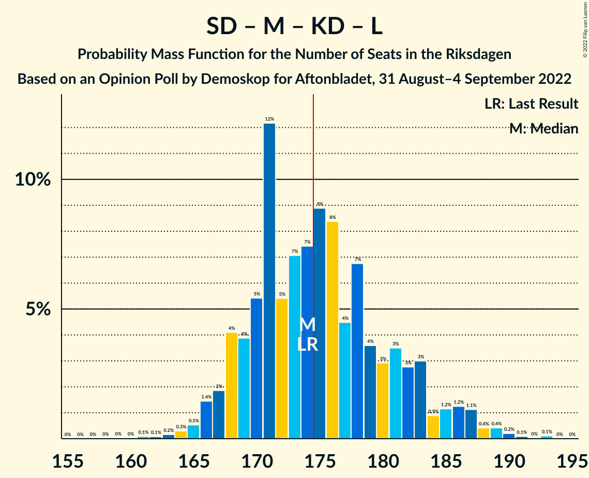

| Number of Seats | Probability | Accumulated | Special Marks |
|:---------------:|:-----------:|:-----------:|:-------------:|
| 159 | 0% | 100% |  |
| 160 | 0% | 99.9% |  |
| 161 | 0.1% | 99.9% |  |
| 162 | 0.1% | 99.8% |  |
| 163 | 0.2% | 99.8% |  |
| 164 | 0.3% | 99.6% |  |
| 165 | 0.5% | 99.3% |  |
| 166 | 1.4% | 98.8% |  |
| 167 | 2% | 97% |  |
| 168 | 4% | 95% |  |
| 169 | 4% | 91% |  |
| 170 | 5% | 87% |  |
| 171 | 12% | 82% |  |
| 172 | 5% | 70% |  |
| 173 | 7% | 64% |  |
| 174 | 7% | 57% | Last Result |
| 175 | 9% | 50% | Median, Majority |
| 176 | 8% | 41% |  |
| 177 | 4% | 33% |  |
| 178 | 7% | 28% |  |
| 179 | 4% | 21% |  |
| 180 | 3% | 18% |  |
| 181 | 3% | 15% |  |
| 182 | 3% | 11% |  |
| 183 | 3% | 9% |  |
| 184 | 0.9% | 6% |  |
| 185 | 1.2% | 5% |  |
| 186 | 1.2% | 4% |  |
| 187 | 1.1% | 2% |  |
| 188 | 0.4% | 1.3% |  |
| 189 | 0.4% | 0.9% |  |
| 190 | 0.2% | 0.4% |  |
| 191 | 0.1% | 0.2% |  |
| 192 | 0% | 0.1% |  |
| 193 | 0.1% | 0.1% |  |
| 194 | 0% | 0% |  |

### Sveriges socialdemokratiska arbetareparti – Vänsterpartiet – Centerpartiet – Miljöpartiet de gröna

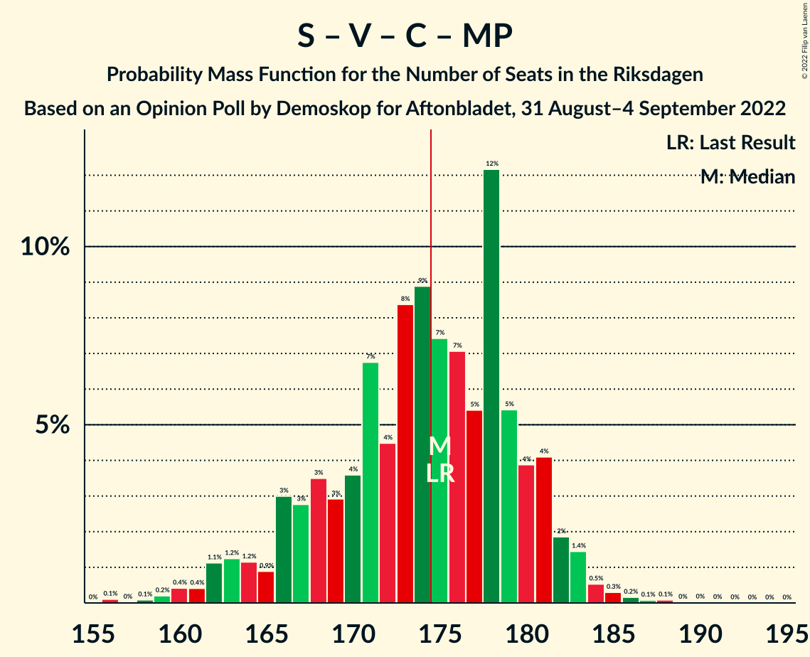

| Number of Seats | Probability | Accumulated | Special Marks |
|:---------------:|:-----------:|:-----------:|:-------------:|
| 156 | 0.1% | 100% |  |
| 157 | 0% | 99.9% |  |
| 158 | 0.1% | 99.9% |  |
| 159 | 0.2% | 99.8% |  |
| 160 | 0.4% | 99.6% |  |
| 161 | 0.4% | 99.1% |  |
| 162 | 1.1% | 98.7% |  |
| 163 | 1.2% | 98% |  |
| 164 | 1.2% | 96% |  |
| 165 | 0.9% | 95% |  |
| 166 | 3% | 94% |  |
| 167 | 3% | 91% |  |
| 168 | 3% | 89% |  |
| 169 | 3% | 85% |  |
| 170 | 4% | 82% |  |
| 171 | 7% | 79% |  |
| 172 | 4% | 72% |  |
| 173 | 8% | 67% |  |
| 174 | 9% | 59% |  |
| 175 | 7% | 50% | Last Result, Majority |
| 176 | 7% | 43% |  |
| 177 | 5% | 36% | Median |
| 178 | 12% | 30% |  |
| 179 | 5% | 18% |  |
| 180 | 4% | 13% |  |
| 181 | 4% | 9% |  |
| 182 | 2% | 5% |  |
| 183 | 1.4% | 3% |  |
| 184 | 0.5% | 1.2% |  |
| 185 | 0.3% | 0.7% |  |
| 186 | 0.2% | 0.4% |  |
| 187 | 0.1% | 0.2% |  |
| 188 | 0.1% | 0.2% |  |
| 189 | 0% | 0.1% |  |
| 190 | 0% | 0.1% |  |
| 191 | 0% | 0% |  |

### Sveriges socialdemokratiska arbetareparti – Moderata samlingspartiet

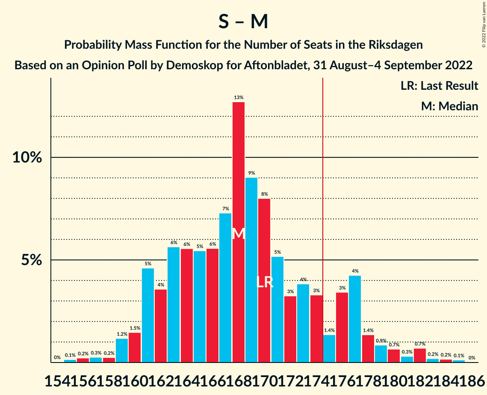

| Number of Seats | Probability | Accumulated | Special Marks |
|:---------------:|:-----------:|:-----------:|:-------------:|
| 154 | 0% | 100% |  |
| 155 | 0.1% | 99.9% |  |
| 156 | 0.2% | 99.8% |  |
| 157 | 0.3% | 99.6% |  |
| 158 | 0.2% | 99.3% |  |
| 159 | 1.2% | 99.1% |  |
| 160 | 1.5% | 98% |  |
| 161 | 5% | 96% |  |
| 162 | 4% | 92% |  |
| 163 | 6% | 88% |  |
| 164 | 6% | 83% |  |
| 165 | 5% | 77% |  |
| 166 | 6% | 72% |  |
| 167 | 7% | 66% |  |
| 168 | 13% | 59% |  |
| 169 | 9% | 46% | Median |
| 170 | 8% | 37% | Last Result |
| 171 | 5% | 29% |  |
| 172 | 3% | 24% |  |
| 173 | 4% | 21% |  |
| 174 | 3% | 17% |  |
| 175 | 1.4% | 13% | Majority |
| 176 | 3% | 12% |  |
| 177 | 4% | 9% |  |
| 178 | 1.4% | 4% |  |
| 179 | 0.9% | 3% |  |
| 180 | 0.7% | 2% |  |
| 181 | 0.3% | 2% |  |
| 182 | 0.7% | 1.2% |  |
| 183 | 0.2% | 0.5% |  |
| 184 | 0.2% | 0.3% |  |
| 185 | 0.1% | 0.2% |  |
| 186 | 0% | 0% |  |

### Sveriges socialdemokratiska arbetareparti – Centerpartiet – Liberalerna – Miljöpartiet de gröna

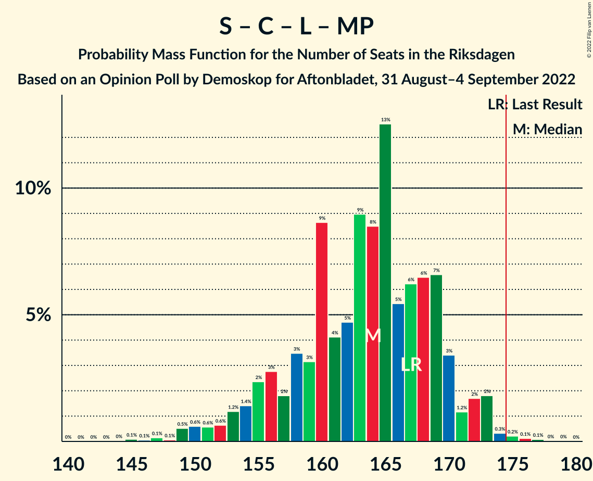

| Number of Seats | Probability | Accumulated | Special Marks |
|:---------------:|:-----------:|:-----------:|:-------------:|
| 144 | 0% | 100% |  |
| 145 | 0.1% | 99.9% |  |
| 146 | 0.1% | 99.9% |  |
| 147 | 0.1% | 99.8% |  |
| 148 | 0.1% | 99.7% |  |
| 149 | 0.5% | 99.6% |  |
| 150 | 0.6% | 99.1% |  |
| 151 | 0.6% | 98% |  |
| 152 | 0.6% | 98% |  |
| 153 | 1.2% | 97% |  |
| 154 | 1.4% | 96% |  |
| 155 | 2% | 95% |  |
| 156 | 3% | 92% |  |
| 157 | 2% | 90% |  |
| 158 | 3% | 88% |  |
| 159 | 3% | 84% |  |
| 160 | 9% | 81% |  |
| 161 | 4% | 72% |  |
| 162 | 5% | 68% |  |
| 163 | 9% | 64% |  |
| 164 | 8% | 55% |  |
| 165 | 13% | 46% |  |
| 166 | 5% | 34% |  |
| 167 | 6% | 28% | Last Result, Median |
| 168 | 6% | 22% |  |
| 169 | 7% | 15% |  |
| 170 | 3% | 9% |  |
| 171 | 1.2% | 5% |  |
| 172 | 2% | 4% |  |
| 173 | 2% | 3% |  |
| 174 | 0.3% | 0.8% |  |
| 175 | 0.2% | 0.5% | Majority |
| 176 | 0.1% | 0.3% |  |
| 177 | 0.1% | 0.1% |  |
| 178 | 0% | 0.1% |  |
| 179 | 0% | 0% |  |

### Sverigedemokraterna – Moderata samlingspartiet – Kristdemokraterna

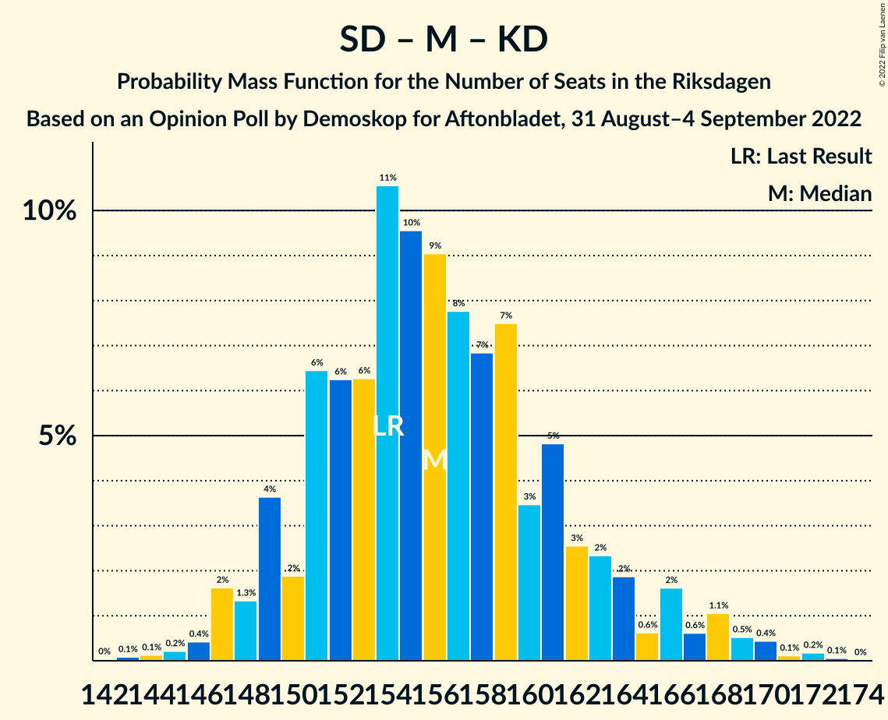

| Number of Seats | Probability | Accumulated | Special Marks |
|:---------------:|:-----------:|:-----------:|:-------------:|
| 142 | 0% | 100% |  |
| 143 | 0.1% | 99.9% |  |
| 144 | 0.1% | 99.8% |  |
| 145 | 0.2% | 99.7% |  |
| 146 | 0.4% | 99.5% |  |
| 147 | 2% | 99.1% |  |
| 148 | 1.3% | 97% |  |
| 149 | 4% | 96% |  |
| 150 | 2% | 92% |  |
| 151 | 6% | 91% |  |
| 152 | 6% | 84% |  |
| 153 | 6% | 78% |  |
| 154 | 11% | 72% | Last Result |
| 155 | 10% | 61% |  |
| 156 | 9% | 51% | Median |
| 157 | 8% | 42% |  |
| 158 | 7% | 35% |  |
| 159 | 7% | 28% |  |
| 160 | 3% | 20% |  |
| 161 | 5% | 17% |  |
| 162 | 3% | 12% |  |
| 163 | 2% | 9% |  |
| 164 | 2% | 7% |  |
| 165 | 0.6% | 5% |  |
| 166 | 2% | 5% |  |
| 167 | 0.6% | 3% |  |
| 168 | 1.1% | 2% |  |
| 169 | 0.5% | 1.4% |  |
| 170 | 0.4% | 0.8% |  |
| 171 | 0.1% | 0.4% |  |
| 172 | 0.2% | 0.3% |  |
| 173 | 0.1% | 0.1% |  |
| 174 | 0% | 0% |  |

### Sveriges socialdemokratiska arbetareparti – Centerpartiet – Miljöpartiet de gröna

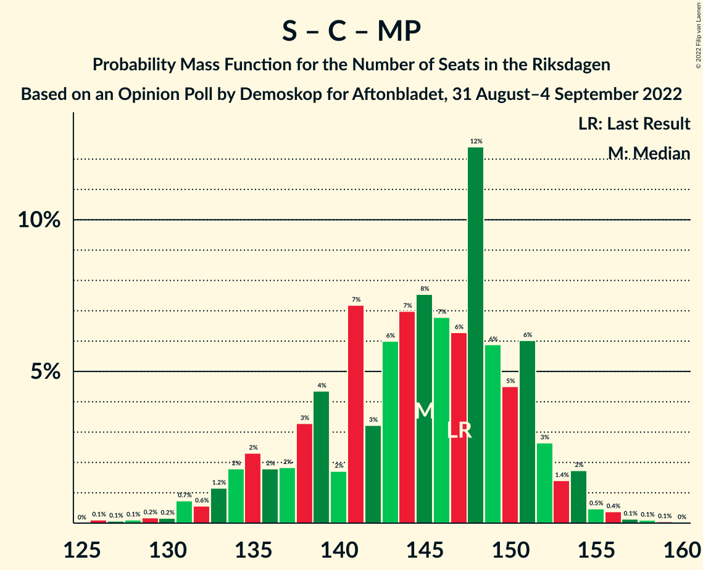

| Number of Seats | Probability | Accumulated | Special Marks |
|:---------------:|:-----------:|:-----------:|:-------------:|
| 126 | 0.1% | 100% |  |
| 127 | 0.1% | 99.9% |  |
| 128 | 0.1% | 99.8% |  |
| 129 | 0.2% | 99.7% |  |
| 130 | 0.2% | 99.5% |  |
| 131 | 0.7% | 99.3% |  |
| 132 | 0.6% | 98.6% |  |
| 133 | 1.2% | 98% |  |
| 134 | 2% | 97% |  |
| 135 | 2% | 95% |  |
| 136 | 2% | 93% |  |
| 137 | 2% | 91% |  |
| 138 | 3% | 89% |  |
| 139 | 4% | 86% |  |
| 140 | 2% | 82% |  |
| 141 | 7% | 80% |  |
| 142 | 3% | 73% |  |
| 143 | 6% | 69% |  |
| 144 | 7% | 63% |  |
| 145 | 8% | 56% |  |
| 146 | 7% | 49% |  |
| 147 | 6% | 42% | Last Result |
| 148 | 12% | 36% | Median |
| 149 | 6% | 23% |  |
| 150 | 5% | 17% |  |
| 151 | 6% | 13% |  |
| 152 | 3% | 7% |  |
| 153 | 1.4% | 4% |  |
| 154 | 2% | 3% |  |
| 155 | 0.5% | 1.2% |  |
| 156 | 0.4% | 0.7% |  |
| 157 | 0.1% | 0.3% |  |
| 158 | 0.1% | 0.2% |  |
| 159 | 0.1% | 0.1% |  |
| 160 | 0% | 0% |  |

### Sveriges socialdemokratiska arbetareparti – Vänsterpartiet – Miljöpartiet de gröna

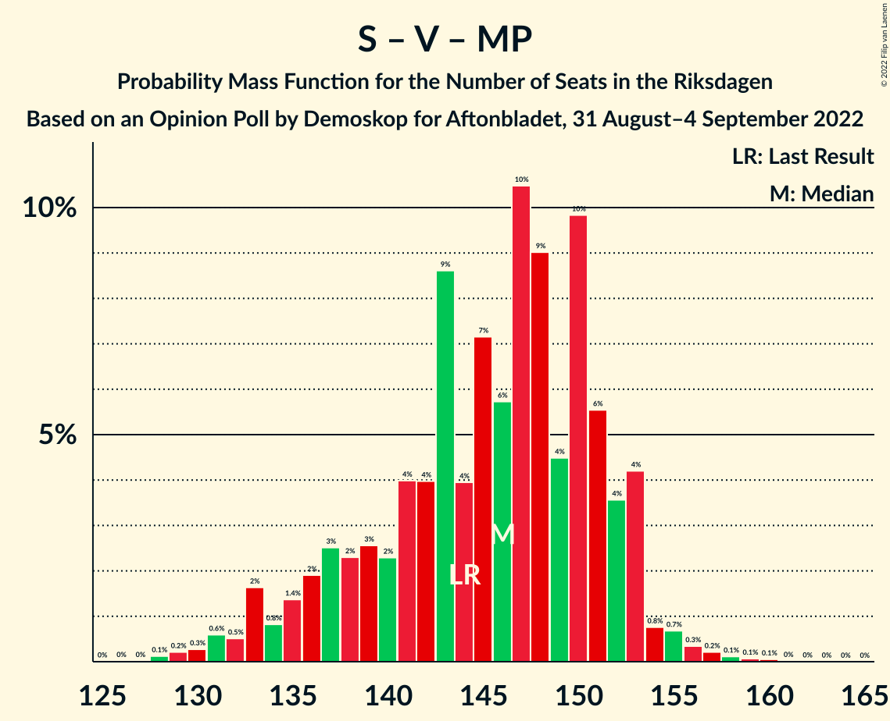

| Number of Seats | Probability | Accumulated | Special Marks |
|:---------------:|:-----------:|:-----------:|:-------------:|
| 127 | 0% | 100% |  |
| 128 | 0.1% | 99.9% |  |
| 129 | 0.2% | 99.8% |  |
| 130 | 0.3% | 99.6% |  |
| 131 | 0.6% | 99.3% |  |
| 132 | 0.5% | 98.7% |  |
| 133 | 2% | 98% |  |
| 134 | 0.8% | 97% |  |
| 135 | 1.4% | 96% |  |
| 136 | 2% | 94% |  |
| 137 | 3% | 92% |  |
| 138 | 2% | 90% |  |
| 139 | 3% | 88% |  |
| 140 | 2% | 85% |  |
| 141 | 4% | 83% |  |
| 142 | 4% | 79% |  |
| 143 | 9% | 75% |  |
| 144 | 4% | 66% | Last Result |
| 145 | 7% | 62% |  |
| 146 | 6% | 55% |  |
| 147 | 10% | 49% |  |
| 148 | 9% | 39% | Median |
| 149 | 4% | 30% |  |
| 150 | 10% | 25% |  |
| 151 | 6% | 16% |  |
| 152 | 4% | 10% |  |
| 153 | 4% | 6% |  |
| 154 | 0.8% | 2% |  |
| 155 | 0.7% | 2% |  |
| 156 | 0.3% | 0.8% |  |
| 157 | 0.2% | 0.5% |  |
| 158 | 0.1% | 0.3% |  |
| 159 | 0.1% | 0.2% |  |
| 160 | 0.1% | 0.1% |  |
| 161 | 0% | 0% |  |

### Sverigedemokraterna – Moderata samlingspartiet

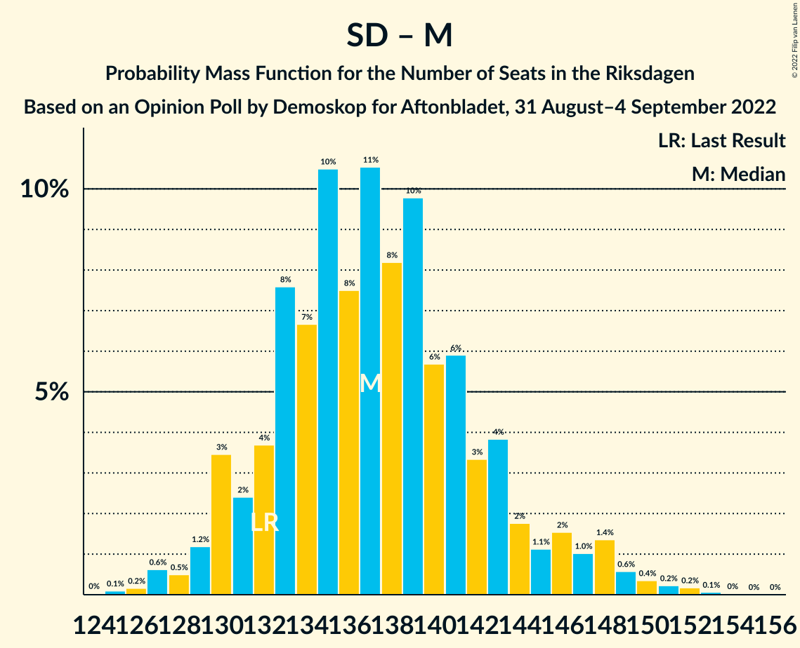

| Number of Seats | Probability | Accumulated | Special Marks |
|:---------------:|:-----------:|:-----------:|:-------------:|
| 125 | 0.1% | 100% |  |
| 126 | 0.2% | 99.9% |  |
| 127 | 0.6% | 99.7% |  |
| 128 | 0.5% | 99.1% |  |
| 129 | 1.2% | 98.6% |  |
| 130 | 3% | 97% |  |
| 131 | 2% | 94% |  |
| 132 | 4% | 92% | Last Result |
| 133 | 8% | 88% |  |
| 134 | 7% | 80% |  |
| 135 | 10% | 74% |  |
| 136 | 8% | 63% |  |
| 137 | 11% | 56% | Median |
| 138 | 8% | 45% |  |
| 139 | 10% | 37% |  |
| 140 | 6% | 27% |  |
| 141 | 6% | 21% |  |
| 142 | 3% | 15% |  |
| 143 | 4% | 12% |  |
| 144 | 2% | 8% |  |
| 145 | 1.1% | 7% |  |
| 146 | 2% | 5% |  |
| 147 | 1.0% | 4% |  |
| 148 | 1.4% | 3% |  |
| 149 | 0.6% | 1.5% |  |
| 150 | 0.4% | 0.9% |  |
| 151 | 0.2% | 0.5% |  |
| 152 | 0.2% | 0.3% |  |
| 153 | 0.1% | 0.1% |  |
| 154 | 0% | 0.1% |  |
| 155 | 0% | 0% |  |

### Sveriges socialdemokratiska arbetareparti – Vänsterpartiet

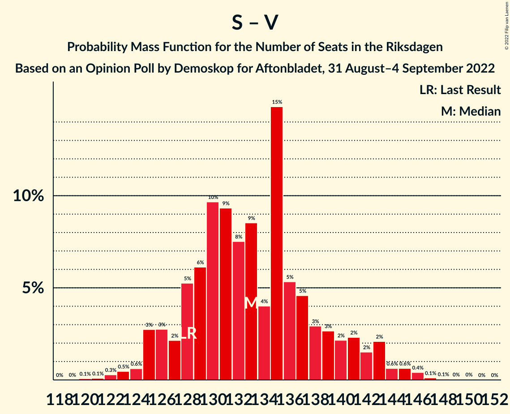

| Number of Seats | Probability | Accumulated | Special Marks |
|:---------------:|:-----------:|:-----------:|:-------------:|
| 120 | 0.1% | 100% |  |
| 121 | 0.1% | 99.9% |  |
| 122 | 0.3% | 99.8% |  |
| 123 | 0.5% | 99.5% |  |
| 124 | 0.6% | 99.0% |  |
| 125 | 3% | 98% |  |
| 126 | 3% | 96% |  |
| 127 | 2% | 93% |  |
| 128 | 5% | 91% | Last Result |
| 129 | 6% | 86% |  |
| 130 | 10% | 79% |  |
| 131 | 9% | 70% |  |
| 132 | 8% | 60% |  |
| 133 | 9% | 53% | Median |
| 134 | 4% | 44% |  |
| 135 | 15% | 40% |  |
| 136 | 5% | 26% |  |
| 137 | 5% | 20% |  |
| 138 | 3% | 16% |  |
| 139 | 3% | 13% |  |
| 140 | 2% | 10% |  |
| 141 | 2% | 8% |  |
| 142 | 2% | 6% |  |
| 143 | 2% | 4% |  |
| 144 | 0.6% | 2% |  |
| 145 | 0.6% | 1.3% |  |
| 146 | 0.4% | 0.7% |  |
| 147 | 0.1% | 0.3% |  |
| 148 | 0.1% | 0.1% |  |
| 149 | 0% | 0.1% |  |
| 150 | 0% | 0.1% |  |
| 151 | 0% | 0% |  |

### Moderata samlingspartiet – Centerpartiet – Kristdemokraterna – Liberalerna

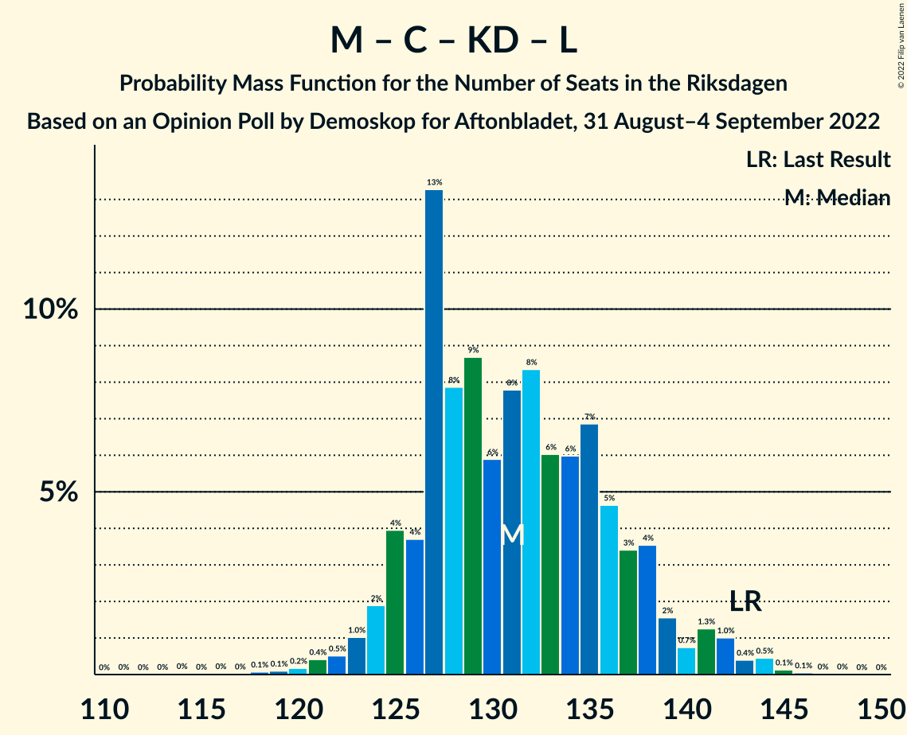

| Number of Seats | Probability | Accumulated | Special Marks |
|:---------------:|:-----------:|:-----------:|:-------------:|
| 114 | 0% | 100% |  |
| 115 | 0% | 99.9% |  |
| 116 | 0% | 99.9% |  |
| 117 | 0% | 99.9% |  |
| 118 | 0.1% | 99.9% |  |
| 119 | 0.1% | 99.8% |  |
| 120 | 0.2% | 99.7% |  |
| 121 | 0.4% | 99.5% |  |
| 122 | 0.5% | 99.1% |  |
| 123 | 1.0% | 98.6% |  |
| 124 | 2% | 98% |  |
| 125 | 4% | 96% |  |
| 126 | 4% | 92% |  |
| 127 | 13% | 88% |  |
| 128 | 8% | 75% |  |
| 129 | 9% | 67% |  |
| 130 | 6% | 58% |  |
| 131 | 8% | 52% |  |
| 132 | 8% | 44% | Median |
| 133 | 6% | 36% |  |
| 134 | 6% | 30% |  |
| 135 | 7% | 24% |  |
| 136 | 5% | 17% |  |
| 137 | 3% | 13% |  |
| 138 | 4% | 9% |  |
| 139 | 2% | 6% |  |
| 140 | 0.7% | 4% |  |
| 141 | 1.3% | 3% |  |
| 142 | 1.0% | 2% |  |
| 143 | 0.4% | 1.1% | Last Result |
| 144 | 0.5% | 0.7% |  |
| 145 | 0.1% | 0.2% |  |
| 146 | 0.1% | 0.1% |  |
| 147 | 0% | 0.1% |  |
| 148 | 0% | 0% |  |

### Sveriges socialdemokratiska arbetareparti – Miljöpartiet de gröna

| Number of Seats | Probability | Accumulated | Special Marks |
|:---------------:|:-----------:|:-----------:|:-------------:|
| 97 | 0% | 100% |  |
| 98 | 0.2% | 99.9% |  |
| 99 | 0.2% | 99.8% |  |
| 100 | 0.2% | 99.5% |  |
| 101 | 0.4% | 99.3% |  |
| 102 | 0.6% | 98.8% |  |
| 103 | 1.3% | 98% |  |
| 104 | 2% | 97% |  |
| 105 | 2% | 95% |  |
| 106 | 1.4% | 93% |  |
| 107 | 2% | 92% |  |
| 108 | 1.3% | 90% |  |
| 109 | 4% | 88% |  |
| 110 | 2% | 85% |  |
| 111 | 4% | 82% |  |
| 112 | 2% | 79% |  |
| 113 | 4% | 76% |  |
| 114 | 5% | 72% |  |
| 115 | 8% | 68% |  |
| 116 | 7% | 59% | Last Result |
| 117 | 7% | 53% |  |
| 118 | 7% | 46% |  |
| 119 | 7% | 39% | Median |
| 120 | 12% | 32% |  |
| 121 | 6% | 20% |  |
| 122 | 5% | 14% |  |
| 123 | 4% | 8% |  |
| 124 | 1.3% | 4% |  |
| 125 | 2% | 3% |  |
| 126 | 0.6% | 1.4% |  |
| 127 | 0.4% | 0.7% |  |
| 128 | 0.1% | 0.3% |  |
| 129 | 0.1% | 0.2% |  |
| 130 | 0.1% | 0.1% |  |
| 131 | 0% | 0% |  |

### Moderata samlingspartiet – Centerpartiet – Liberalerna

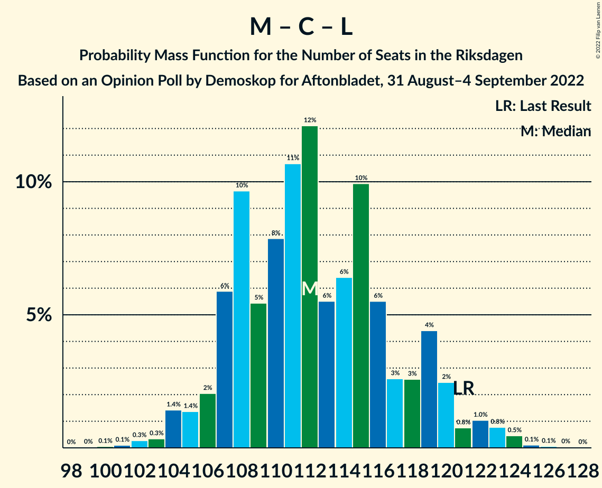

| Number of Seats | Probability | Accumulated | Special Marks |
|:---------------:|:-----------:|:-----------:|:-------------:|
| 98 | 0% | 100% |  |
| 99 | 0% | 99.9% |  |
| 100 | 0.1% | 99.9% |  |
| 101 | 0.1% | 99.9% |  |
| 102 | 0.3% | 99.8% |  |
| 103 | 0.3% | 99.5% |  |
| 104 | 1.4% | 99.2% |  |
| 105 | 1.4% | 98% |  |
| 106 | 2% | 96% |  |
| 107 | 6% | 94% |  |
| 108 | 10% | 88% |  |
| 109 | 5% | 79% |  |
| 110 | 8% | 73% |  |
| 111 | 11% | 65% |  |
| 112 | 12% | 55% |  |
| 113 | 6% | 43% | Median |
| 114 | 6% | 37% |  |
| 115 | 10% | 31% |  |
| 116 | 6% | 21% |  |
| 117 | 3% | 15% |  |
| 118 | 3% | 13% |  |
| 119 | 4% | 10% |  |
| 120 | 2% | 6% |  |
| 121 | 0.8% | 3% | Last Result |
| 122 | 1.0% | 3% |  |
| 123 | 0.8% | 1.5% |  |
| 124 | 0.5% | 0.7% |  |
| 125 | 0.1% | 0.2% |  |
| 126 | 0.1% | 0.1% |  |
| 127 | 0% | 0.1% |  |
| 128 | 0% | 0% |  |

### Moderata samlingspartiet – Centerpartiet – Kristdemokraterna

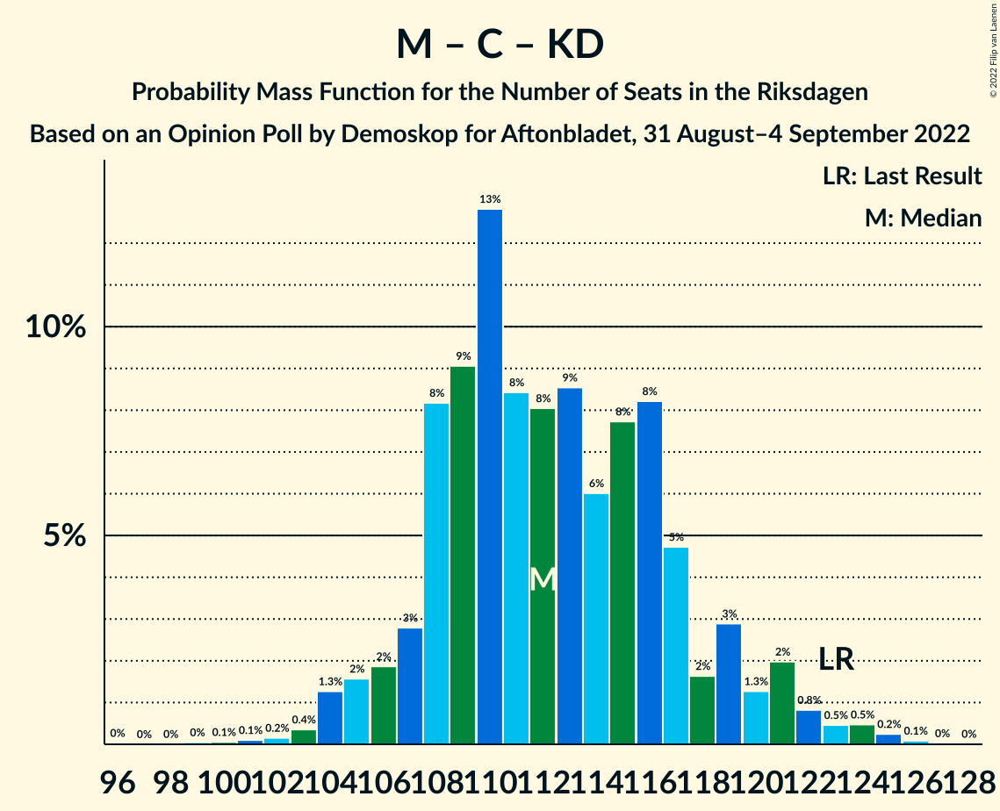

| Number of Seats | Probability | Accumulated | Special Marks |
|:---------------:|:-----------:|:-----------:|:-------------:|
| 96 | 0% | 100% |  |
| 97 | 0% | 99.9% |  |
| 98 | 0% | 99.9% |  |
| 99 | 0% | 99.9% |  |
| 100 | 0.1% | 99.9% |  |
| 101 | 0.1% | 99.8% |  |
| 102 | 0.2% | 99.7% |  |
| 103 | 0.4% | 99.6% |  |
| 104 | 1.3% | 99.2% |  |
| 105 | 2% | 98% |  |
| 106 | 2% | 96% |  |
| 107 | 3% | 95% |  |
| 108 | 8% | 92% |  |
| 109 | 9% | 84% |  |
| 110 | 13% | 74% |  |
| 111 | 8% | 62% |  |
| 112 | 8% | 53% |  |
| 113 | 9% | 45% | Median |
| 114 | 6% | 37% |  |
| 115 | 8% | 31% |  |
| 116 | 8% | 23% |  |
| 117 | 5% | 15% |  |
| 118 | 2% | 10% |  |
| 119 | 3% | 8% |  |
| 120 | 1.3% | 5% |  |
| 121 | 2% | 4% |  |
| 122 | 0.8% | 2% |  |
| 123 | 0.5% | 1.3% | Last Result |
| 124 | 0.5% | 0.9% |  |
| 125 | 0.2% | 0.4% |  |
| 126 | 0.1% | 0.1% |  |
| 127 | 0% | 0.1% |  |
| 128 | 0% | 0% |  |

### Sveriges socialdemokratiska arbetareparti

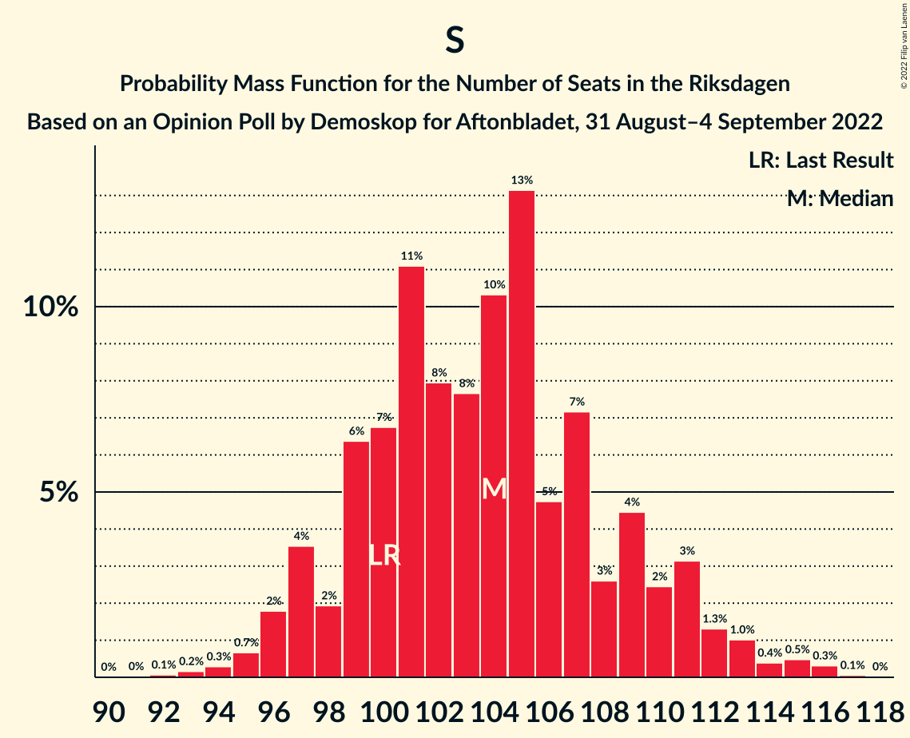

| Number of Seats | Probability | Accumulated | Special Marks |
|:---------------:|:-----------:|:-----------:|:-------------:|
| 92 | 0.1% | 100% |  |
| 93 | 0.2% | 99.9% |  |
| 94 | 0.3% | 99.7% |  |
| 95 | 0.7% | 99.4% |  |
| 96 | 2% | 98.8% |  |
| 97 | 4% | 97% |  |
| 98 | 2% | 93% |  |
| 99 | 6% | 91% |  |
| 100 | 7% | 85% | Last Result |
| 101 | 11% | 78% |  |
| 102 | 8% | 67% |  |
| 103 | 8% | 59% |  |
| 104 | 10% | 52% | Median |
| 105 | 13% | 41% |  |
| 106 | 5% | 28% |  |
| 107 | 7% | 23% |  |
| 108 | 3% | 16% |  |
| 109 | 4% | 14% |  |
| 110 | 2% | 9% |  |
| 111 | 3% | 7% |  |
| 112 | 1.3% | 4% |  |
| 113 | 1.0% | 2% |  |
| 114 | 0.4% | 1.3% |  |
| 115 | 0.5% | 0.9% |  |
| 116 | 0.3% | 0.4% |  |
| 117 | 0.1% | 0.1% |  |
| 118 | 0% | 0% |  |

### Moderata samlingspartiet – Kristdemokraterna – Liberalerna

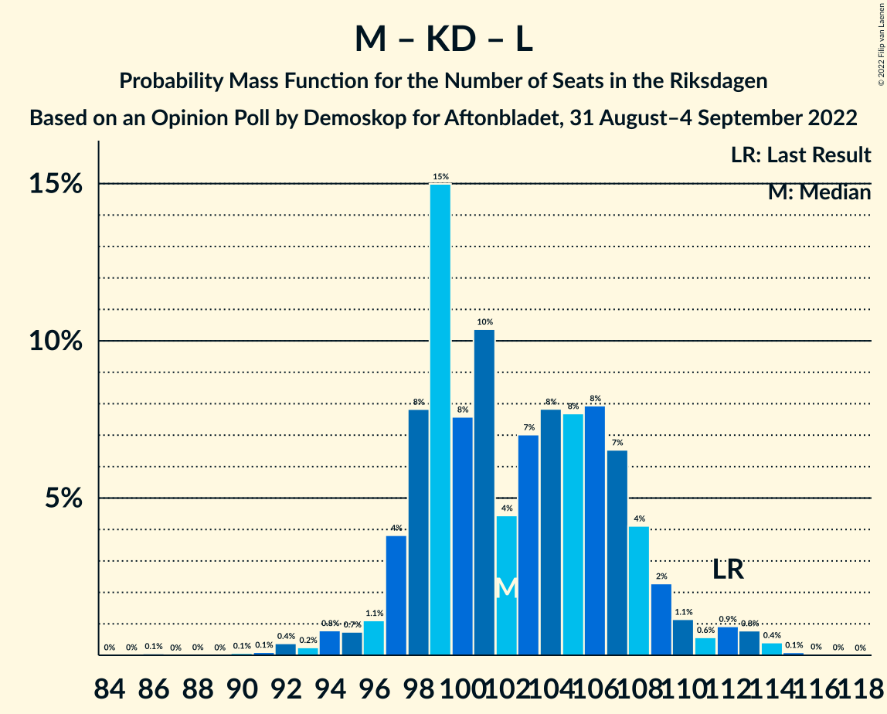

| Number of Seats | Probability | Accumulated | Special Marks |
|:---------------:|:-----------:|:-----------:|:-------------:|
| 85 | 0% | 100% |  |
| 86 | 0.1% | 99.9% |  |
| 87 | 0% | 99.9% |  |
| 88 | 0% | 99.9% |  |
| 89 | 0% | 99.9% |  |
| 90 | 0.1% | 99.8% |  |
| 91 | 0.1% | 99.8% |  |
| 92 | 0.4% | 99.7% |  |
| 93 | 0.2% | 99.3% |  |
| 94 | 0.8% | 99.0% |  |
| 95 | 0.7% | 98% |  |
| 96 | 1.1% | 98% |  |
| 97 | 4% | 96% |  |
| 98 | 8% | 93% |  |
| 99 | 15% | 85% |  |
| 100 | 8% | 70% |  |
| 101 | 10% | 62% |  |
| 102 | 4% | 52% |  |
| 103 | 7% | 47% | Median |
| 104 | 8% | 40% |  |
| 105 | 8% | 33% |  |
| 106 | 8% | 25% |  |
| 107 | 7% | 17% |  |
| 108 | 4% | 10% |  |
| 109 | 2% | 6% |  |
| 110 | 1.1% | 4% |  |
| 111 | 0.6% | 3% |  |
| 112 | 0.9% | 2% | Last Result |
| 113 | 0.8% | 1.3% |  |
| 114 | 0.4% | 0.6% |  |
| 115 | 0.1% | 0.2% |  |
| 116 | 0% | 0.1% |  |
| 117 | 0% | 0% |  |

### Moderata samlingspartiet – Centerpartiet

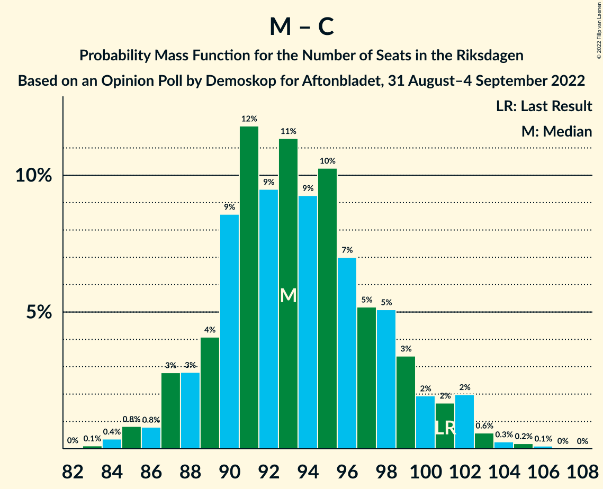

| Number of Seats | Probability | Accumulated | Special Marks |
|:---------------:|:-----------:|:-----------:|:-------------:|
| 82 | 0% | 100% |  |
| 83 | 0.1% | 99.9% |  |
| 84 | 0.4% | 99.8% |  |
| 85 | 0.8% | 99.5% |  |
| 86 | 0.8% | 98.7% |  |
| 87 | 3% | 98% |  |
| 88 | 3% | 95% |  |
| 89 | 4% | 92% |  |
| 90 | 9% | 88% |  |
| 91 | 12% | 80% |  |
| 92 | 9% | 68% |  |
| 93 | 11% | 58% |  |
| 94 | 9% | 47% | Median |
| 95 | 10% | 38% |  |
| 96 | 7% | 27% |  |
| 97 | 5% | 20% |  |
| 98 | 5% | 15% |  |
| 99 | 3% | 10% |  |
| 100 | 2% | 7% |  |
| 101 | 2% | 5% | Last Result |
| 102 | 2% | 3% |  |
| 103 | 0.6% | 1.2% |  |
| 104 | 0.3% | 0.6% |  |
| 105 | 0.2% | 0.4% |  |
| 106 | 0.1% | 0.2% |  |
| 107 | 0% | 0.1% |  |
| 108 | 0% | 0% |  |

### Moderata samlingspartiet – Kristdemokraterna

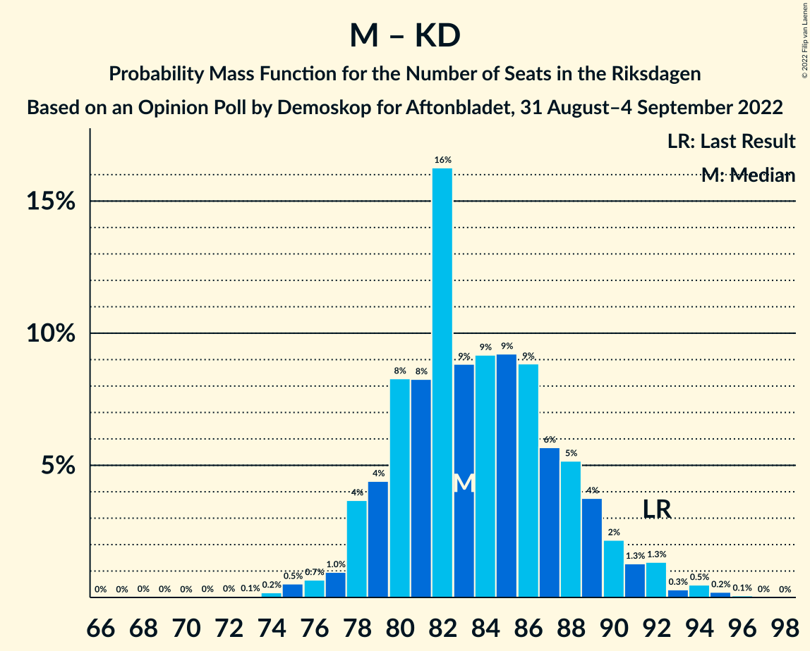

| Number of Seats | Probability | Accumulated | Special Marks |
|:---------------:|:-----------:|:-----------:|:-------------:|
| 67 | 0% | 100% |  |
| 68 | 0% | 99.9% |  |
| 69 | 0% | 99.9% |  |
| 70 | 0% | 99.9% |  |
| 71 | 0% | 99.9% |  |
| 72 | 0% | 99.9% |  |
| 73 | 0.1% | 99.8% |  |
| 74 | 0.2% | 99.8% |  |
| 75 | 0.5% | 99.6% |  |
| 76 | 0.7% | 99.1% |  |
| 77 | 1.0% | 98% |  |
| 78 | 4% | 97% |  |
| 79 | 4% | 94% |  |
| 80 | 8% | 89% |  |
| 81 | 8% | 81% |  |
| 82 | 16% | 73% |  |
| 83 | 9% | 57% |  |
| 84 | 9% | 48% | Median |
| 85 | 9% | 39% |  |
| 86 | 9% | 29% |  |
| 87 | 6% | 20% |  |
| 88 | 5% | 15% |  |
| 89 | 4% | 10% |  |
| 90 | 2% | 6% |  |
| 91 | 1.3% | 4% |  |
| 92 | 1.3% | 2% | Last Result |
| 93 | 0.3% | 1.1% |  |
| 94 | 0.5% | 0.8% |  |
| 95 | 0.2% | 0.3% |  |
| 96 | 0.1% | 0.1% |  |
| 97 | 0% | 0% |  |

## Technical Information

### Opinion Poll

+ **Polling firm:** Demoskop
+ **Commissioner(s):** Aftonbladet
+ **Fieldwork period:** 31 August–4 September 2022

### Calculations

+ **Sample size:** 2173
+ **Simulations done:** 1,048,576
+ **Error estimate:** 0.75%

