# Opinion Poll by Novus for SVT, 2–4 September 2022

<a href="#voting-intentions">Voting Intentions</a> | <a href="#seats">Seats</a> | <a href="#coalitions">Coalitions</a> | <a href="#technical-information">Technical Information</a>

## Voting Intentions

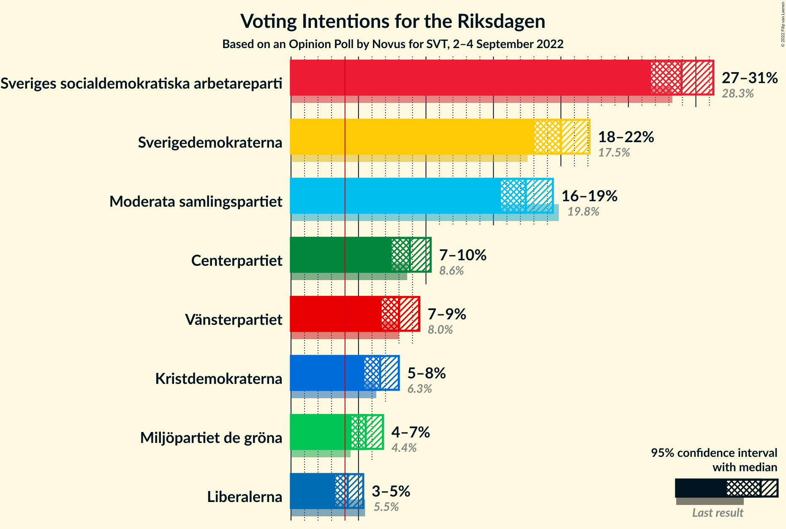

### Confidence Intervals

| Party | Last Result | Poll Result | 80% Confidence Interval | 90% Confidence Interval | 95% Confidence Interval | 99% Confidence Interval |
|:-----:|:-----------:|:-----------:|:-----------------------:|:-----------------------:|:-----------------------:|:-----------------------:|
| Sveriges socialdemokratiska arbetareparti | 28.3% | 28.9% | 27.5–30.5% |27.0–30.9% |26.7–31.3% |26.0–32.0% |
| Sverigedemokraterna | 17.5% | 20.0% | 18.7–21.4% |18.4–21.8% |18.0–22.1% |17.5–22.8% |
| Moderata samlingspartiet | 19.8% | 17.4% | 16.2–18.7% |15.9–19.1% |15.6–19.4% |15.0–20.1% |
| Centerpartiet | 8.6% | 8.8% | 7.9–9.8% |7.7–10.1% |7.5–10.3% |7.1–10.9% |
| Vänsterpartiet | 8.0% | 8.0% | 7.2–9.0% |6.9–9.3% |6.7–9.5% |6.3–10.0% |
| Kristdemokraterna | 6.3% | 6.6% | 5.8–7.5% |5.6–7.8% |5.4–8.0% |5.1–8.4% |
| Miljöpartiet de gröna | 4.4% | 5.5% | 4.8–6.4% |4.6–6.6% |4.5–6.8% |4.2–7.2% |
| Liberalerna | 5.5% | 4.2% | 3.6–5.0% |3.4–5.2% |3.3–5.3% |3.0–5.7% |

*Note:* The poll result column reflects the actual value used in the calculations. Published results may vary slightly, and in addition be rounded to fewer digits.

## Seats

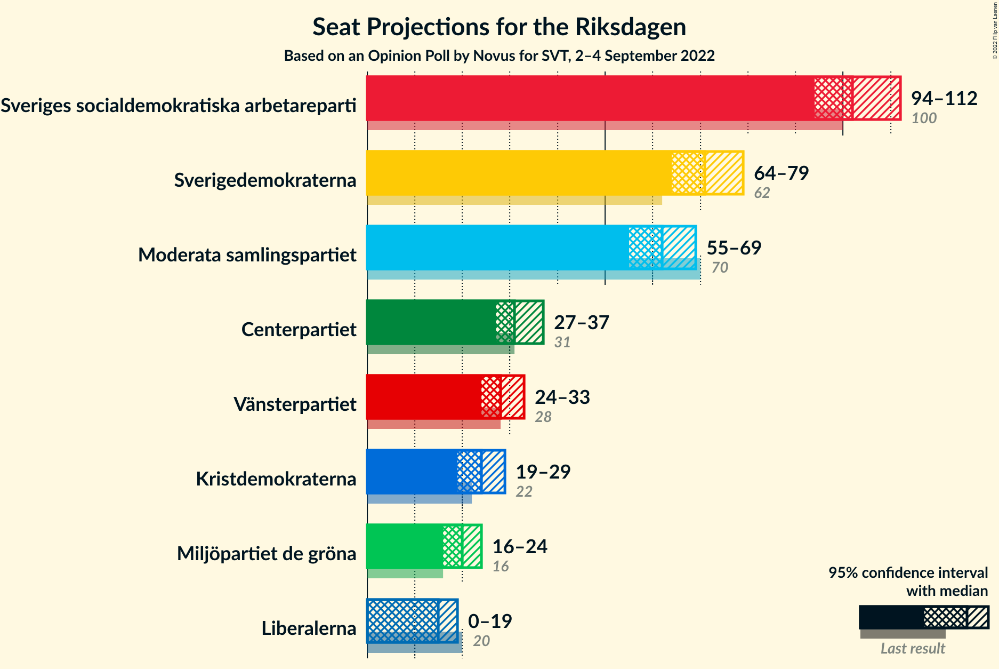

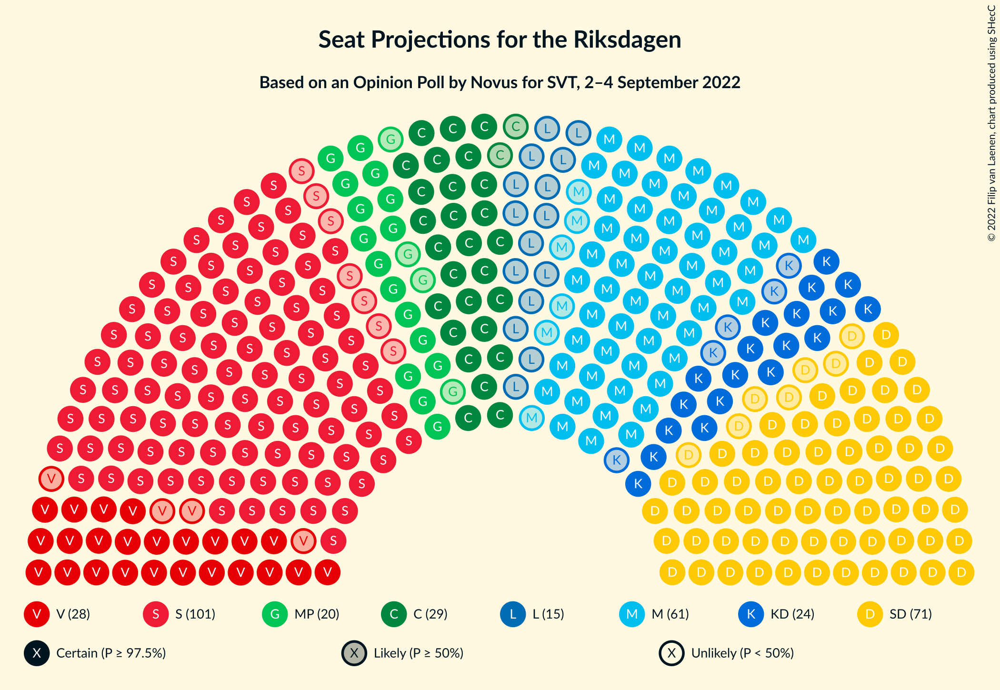

### Confidence Intervals

| Party | Last Result | Median | 80% Confidence Interval | 90% Confidence Interval | 95% Confidence Interval | 99% Confidence Interval |
|:-----:|:-----------:|:------:|:-----------------------:|:-----------------------:|:-----------------------:|:-----------------------:|
| <a href="#sveriges-socialdemokratiska-arbetareparti">Sveriges socialdemokratiska arbetareparti</a> | 100 | 102 | 97–109 |95–111 |94–112 |92–115 |
| <a href="#sverigedemokraterna">Sverigedemokraterna</a> | 62 | 71 | 66–76 |65–77 |64–79 |62–81 |
| <a href="#moderata-samlingspartiet">Moderata samlingspartiet</a> | 70 | 62 | 57–67 |56–68 |55–69 |53–72 |
| <a href="#centerpartiet">Centerpartiet</a> | 31 | 31 | 28–35 |27–36 |27–37 |25–39 |
| <a href="#vänsterpartiet">Vänsterpartiet</a> | 28 | 28 | 26–31 |24–33 |24–33 |22–35 |
| <a href="#kristdemokraterna">Kristdemokraterna</a> | 22 | 24 | 21–26 |20–27 |19–29 |18–30 |
| <a href="#miljöpartiet-de-gröna">Miljöpartiet de gröna</a> | 16 | 20 | 17–22 |17–23 |16–24 |15–26 |
| <a href="#liberalerna">Liberalerna</a> | 20 | 15 | 0–17 |0–18 |0–19 |0–20 |

### Sveriges socialdemokratiska arbetareparti

*For a full overview of the results for this party, see the [Sveriges socialdemokratiska arbetareparti](party-sverigessocialdemokratiskaarbetareparti.html) page.*

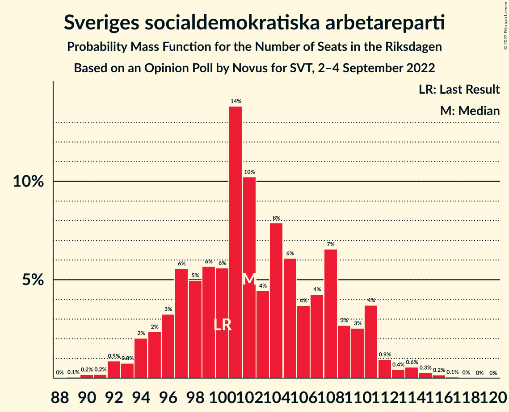

| Number of Seats | Probability | Accumulated | Special Marks |
|:---------------:|:-----------:|:-----------:|:-------------:|
| 88 | 0% | 100% |  |
| 89 | 0.1% | 99.9% |  |
| 90 | 0.2% | 99.9% |  |
| 91 | 0.2% | 99.7% |  |
| 92 | 0.9% | 99.5% |  |
| 93 | 0.8% | 98.6% |  |
| 94 | 2% | 98% |  |
| 95 | 2% | 96% |  |
| 96 | 3% | 94% |  |
| 97 | 6% | 90% |  |
| 98 | 5% | 85% |  |
| 99 | 6% | 80% |  |
| 100 | 6% | 74% | Last Result |
| 101 | 14% | 68% |  |
| 102 | 10% | 55% | Median |
| 103 | 4% | 44% |  |
| 104 | 8% | 40% |  |
| 105 | 6% | 32% |  |
| 106 | 4% | 26% |  |
| 107 | 4% | 22% |  |
| 108 | 7% | 18% |  |
| 109 | 3% | 11% |  |
| 110 | 3% | 9% |  |
| 111 | 4% | 6% |  |
| 112 | 0.9% | 3% |  |
| 113 | 0.4% | 2% |  |
| 114 | 0.6% | 1.1% |  |
| 115 | 0.3% | 0.6% |  |
| 116 | 0.2% | 0.3% |  |
| 117 | 0.1% | 0.1% |  |
| 118 | 0% | 0.1% |  |
| 119 | 0% | 0% |  |

### Sverigedemokraterna

*For a full overview of the results for this party, see the [Sverigedemokraterna](party-sverigedemokraterna.html) page.*

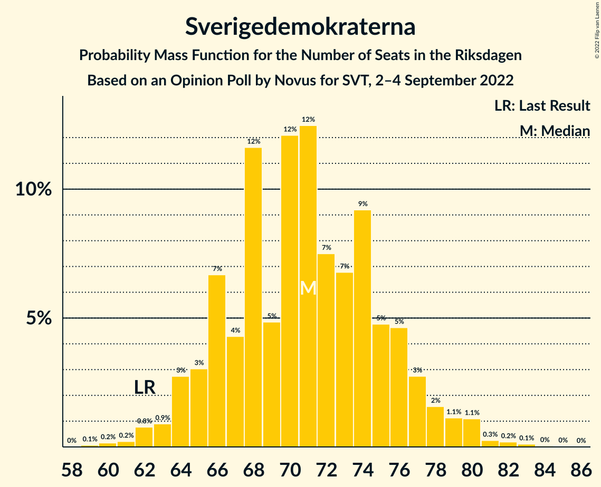

| Number of Seats | Probability | Accumulated | Special Marks |
|:---------------:|:-----------:|:-----------:|:-------------:|
| 59 | 0.1% | 100% |  |
| 60 | 0.2% | 99.9% |  |
| 61 | 0.2% | 99.7% |  |
| 62 | 0.8% | 99.5% | Last Result |
| 63 | 0.9% | 98.8% |  |
| 64 | 3% | 98% |  |
| 65 | 3% | 95% |  |
| 66 | 7% | 92% |  |
| 67 | 4% | 85% |  |
| 68 | 12% | 81% |  |
| 69 | 5% | 69% |  |
| 70 | 12% | 65% |  |
| 71 | 12% | 53% | Median |
| 72 | 7% | 40% |  |
| 73 | 7% | 33% |  |
| 74 | 9% | 26% |  |
| 75 | 5% | 17% |  |
| 76 | 5% | 12% |  |
| 77 | 3% | 7% |  |
| 78 | 2% | 4% |  |
| 79 | 1.1% | 3% |  |
| 80 | 1.1% | 2% |  |
| 81 | 0.3% | 0.7% |  |
| 82 | 0.2% | 0.4% |  |
| 83 | 0.1% | 0.2% |  |
| 84 | 0% | 0.1% |  |
| 85 | 0% | 0.1% |  |
| 86 | 0% | 0% |  |

### Moderata samlingspartiet

*For a full overview of the results for this party, see the [Moderata samlingspartiet](party-moderatasamlingspartiet.html) page.*

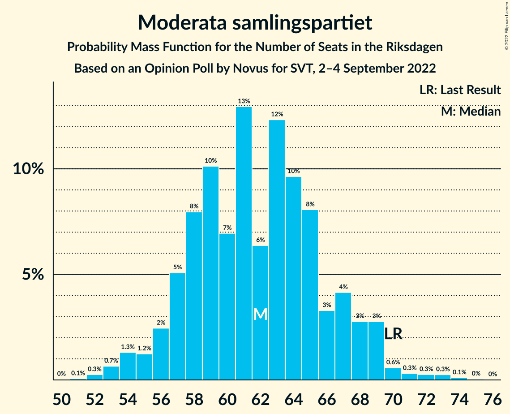

| Number of Seats | Probability | Accumulated | Special Marks |
|:---------------:|:-----------:|:-----------:|:-------------:|
| 50 | 0% | 100% |  |
| 51 | 0.1% | 99.9% |  |
| 52 | 0.3% | 99.9% |  |
| 53 | 0.7% | 99.6% |  |
| 54 | 1.3% | 99.0% |  |
| 55 | 1.2% | 98% |  |
| 56 | 2% | 96% |  |
| 57 | 5% | 94% |  |
| 58 | 8% | 89% |  |
| 59 | 10% | 81% |  |
| 60 | 7% | 71% |  |
| 61 | 13% | 64% |  |
| 62 | 6% | 51% | Median |
| 63 | 12% | 45% |  |
| 64 | 10% | 32% |  |
| 65 | 8% | 23% |  |
| 66 | 3% | 15% |  |
| 67 | 4% | 11% |  |
| 68 | 3% | 7% |  |
| 69 | 3% | 4% |  |
| 70 | 0.6% | 2% | Last Result |
| 71 | 0.3% | 1.0% |  |
| 72 | 0.3% | 0.7% |  |
| 73 | 0.3% | 0.4% |  |
| 74 | 0.1% | 0.2% |  |
| 75 | 0% | 0.1% |  |
| 76 | 0% | 0% |  |

### Centerpartiet

*For a full overview of the results for this party, see the [Centerpartiet](party-centerpartiet.html) page.*

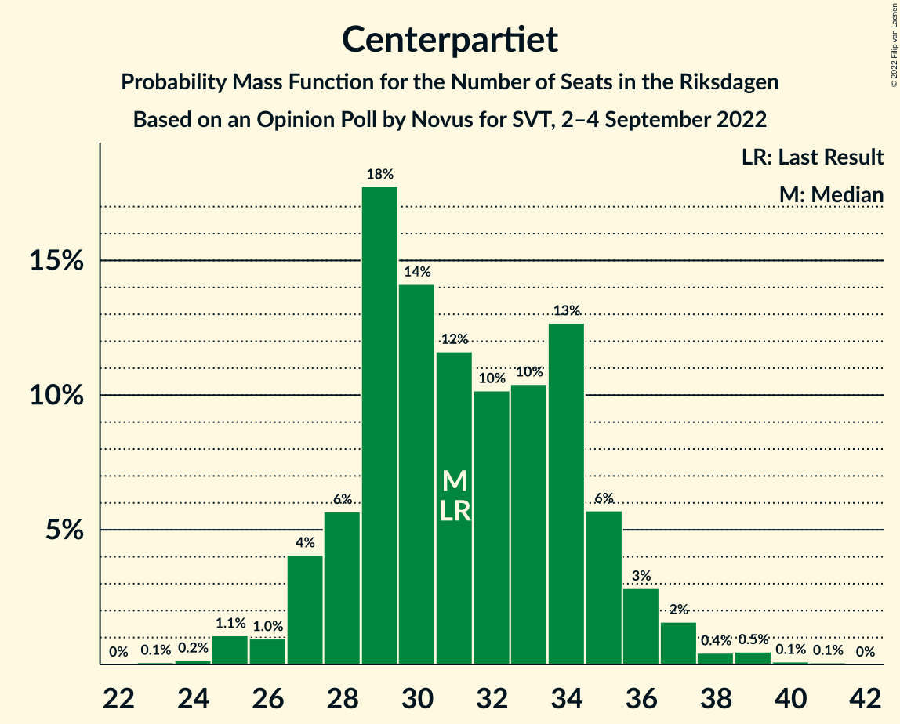

| Number of Seats | Probability | Accumulated | Special Marks |
|:---------------:|:-----------:|:-----------:|:-------------:|
| 23 | 0.1% | 100% |  |
| 24 | 0.2% | 99.9% |  |
| 25 | 1.1% | 99.8% |  |
| 26 | 1.0% | 98.7% |  |
| 27 | 4% | 98% |  |
| 28 | 6% | 94% |  |
| 29 | 18% | 88% |  |
| 30 | 14% | 70% |  |
| 31 | 12% | 56% | Last Result, Median |
| 32 | 10% | 44% |  |
| 33 | 10% | 34% |  |
| 34 | 13% | 24% |  |
| 35 | 6% | 11% |  |
| 36 | 3% | 6% |  |
| 37 | 2% | 3% |  |
| 38 | 0.4% | 1.1% |  |
| 39 | 0.5% | 0.7% |  |
| 40 | 0.1% | 0.2% |  |
| 41 | 0.1% | 0.1% |  |
| 42 | 0% | 0% |  |

### Vänsterpartiet

*For a full overview of the results for this party, see the [Vänsterpartiet](party-vänsterpartiet.html) page.*

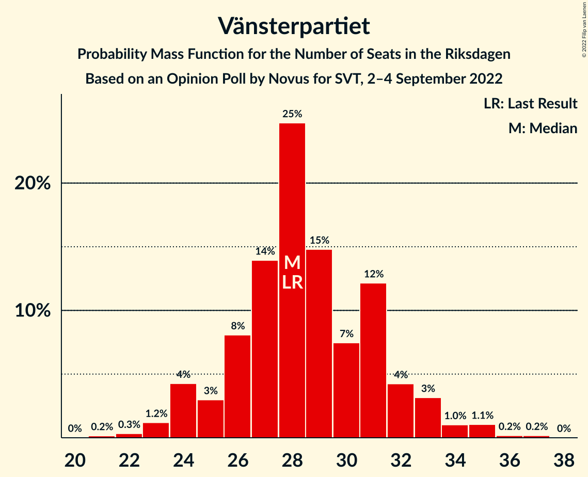

| Number of Seats | Probability | Accumulated | Special Marks |
|:---------------:|:-----------:|:-----------:|:-------------:|
| 21 | 0.2% | 100% |  |
| 22 | 0.3% | 99.8% |  |
| 23 | 1.2% | 99.5% |  |
| 24 | 4% | 98% |  |
| 25 | 3% | 94% |  |
| 26 | 8% | 91% |  |
| 27 | 14% | 83% |  |
| 28 | 25% | 69% | Last Result, Median |
| 29 | 15% | 44% |  |
| 30 | 7% | 29% |  |
| 31 | 12% | 22% |  |
| 32 | 4% | 10% |  |
| 33 | 3% | 6% |  |
| 34 | 1.0% | 2% |  |
| 35 | 1.1% | 1.4% |  |
| 36 | 0.2% | 0.4% |  |
| 37 | 0.2% | 0.2% |  |
| 38 | 0% | 0% |  |

### Kristdemokraterna

*For a full overview of the results for this party, see the [Kristdemokraterna](party-kristdemokraterna.html) page.*

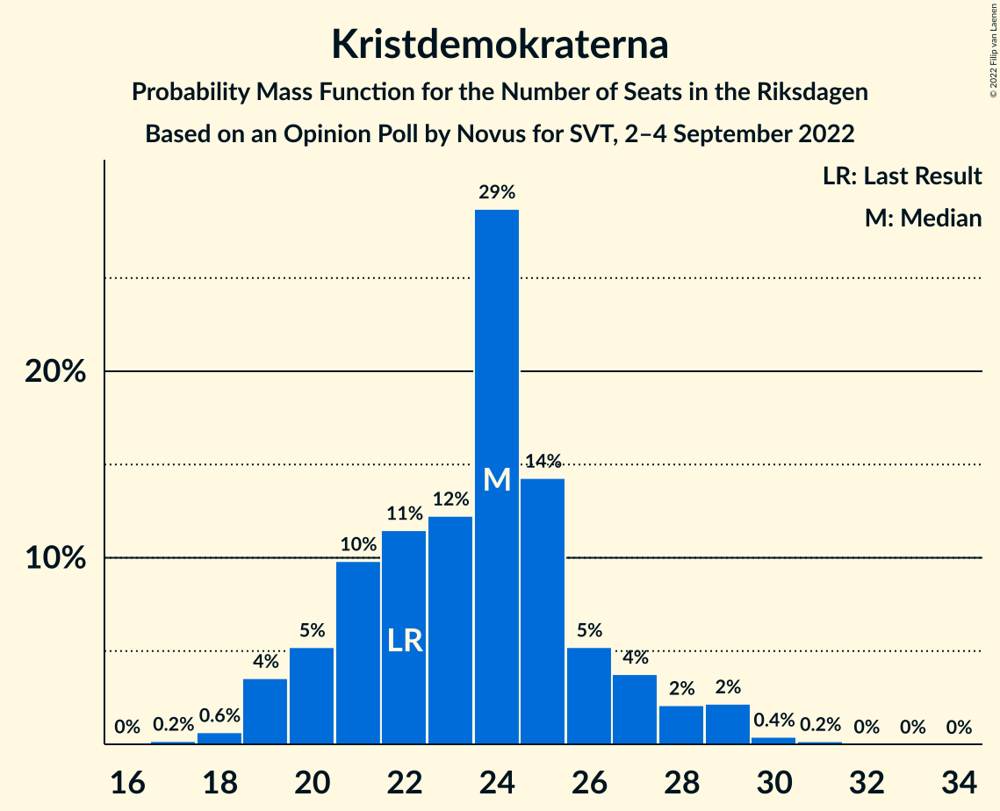

| Number of Seats | Probability | Accumulated | Special Marks |
|:---------------:|:-----------:|:-----------:|:-------------:|
| 17 | 0.2% | 100% |  |
| 18 | 0.6% | 99.8% |  |
| 19 | 4% | 99.1% |  |
| 20 | 5% | 96% |  |
| 21 | 10% | 90% |  |
| 22 | 11% | 81% | Last Result |
| 23 | 12% | 69% |  |
| 24 | 29% | 57% | Median |
| 25 | 14% | 28% |  |
| 26 | 5% | 14% |  |
| 27 | 4% | 9% |  |
| 28 | 2% | 5% |  |
| 29 | 2% | 3% |  |
| 30 | 0.4% | 0.6% |  |
| 31 | 0.2% | 0.2% |  |
| 32 | 0% | 0.1% |  |
| 33 | 0% | 0% |  |

### Miljöpartiet de gröna

*For a full overview of the results for this party, see the [Miljöpartiet de gröna](party-miljöpartietdegröna.html) page.*

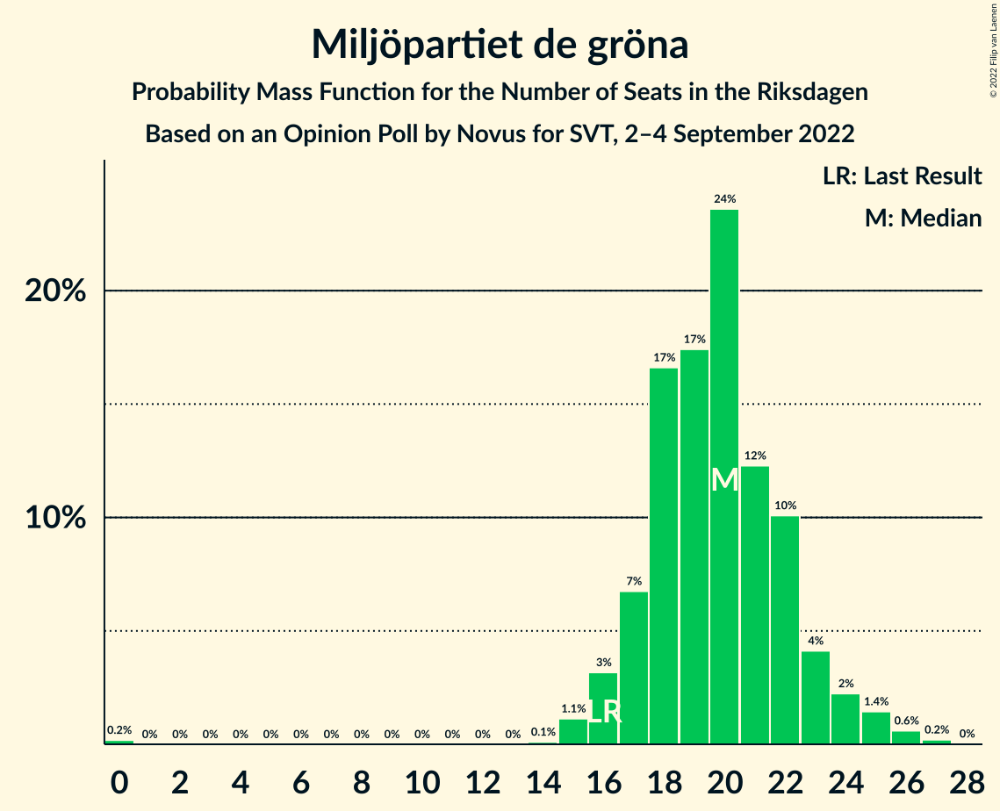

| Number of Seats | Probability | Accumulated | Special Marks |
|:---------------:|:-----------:|:-----------:|:-------------:|
| 0 | 0.2% | 100% |  |
| 1 | 0% | 99.8% |  |
| 2 | 0% | 99.8% |  |
| 3 | 0% | 99.8% |  |
| 4 | 0% | 99.8% |  |
| 5 | 0% | 99.8% |  |
| 6 | 0% | 99.8% |  |
| 7 | 0% | 99.8% |  |
| 8 | 0% | 99.8% |  |
| 9 | 0% | 99.8% |  |
| 10 | 0% | 99.8% |  |
| 11 | 0% | 99.8% |  |
| 12 | 0% | 99.8% |  |
| 13 | 0% | 99.8% |  |
| 14 | 0.1% | 99.8% |  |
| 15 | 1.1% | 99.7% |  |
| 16 | 3% | 98.6% | Last Result |
| 17 | 7% | 95% |  |
| 18 | 17% | 89% |  |
| 19 | 17% | 72% |  |
| 20 | 24% | 55% | Median |
| 21 | 12% | 31% |  |
| 22 | 10% | 19% |  |
| 23 | 4% | 9% |  |
| 24 | 2% | 5% |  |
| 25 | 1.4% | 2% |  |
| 26 | 0.6% | 0.8% |  |
| 27 | 0.2% | 0.2% |  |
| 28 | 0% | 0% |  |

### Liberalerna

*For a full overview of the results for this party, see the [Liberalerna](party-liberalerna.html) page.*

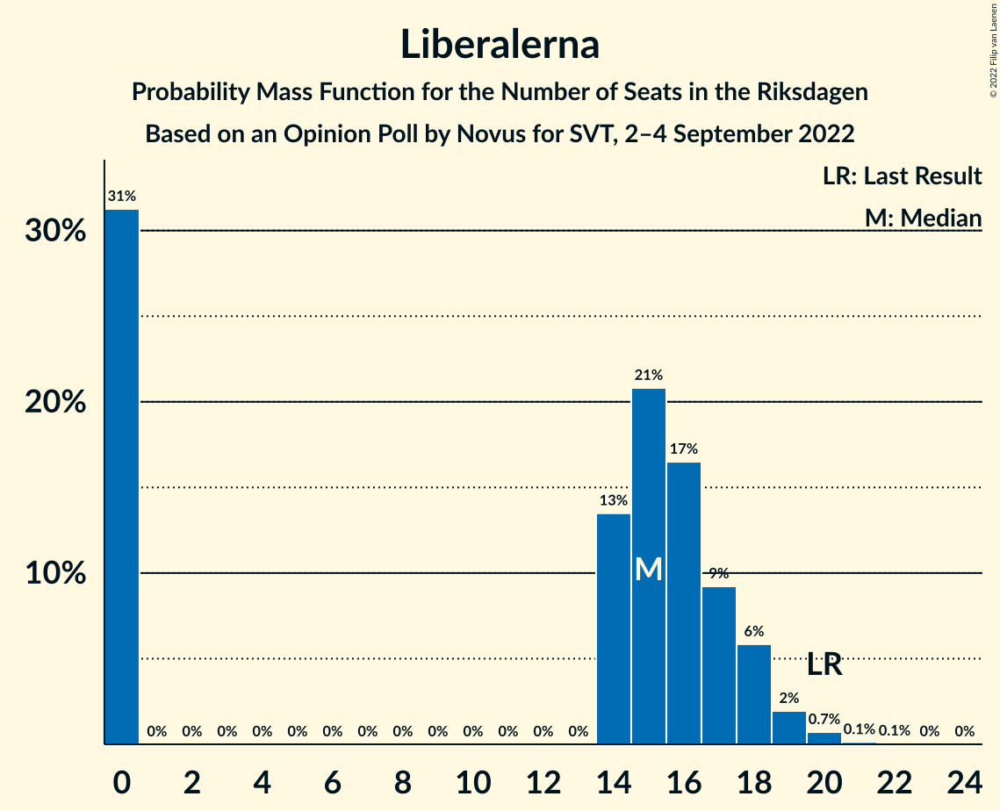

| Number of Seats | Probability | Accumulated | Special Marks |
|:---------------:|:-----------:|:-----------:|:-------------:|
| 0 | 31% | 100% |  |
| 1 | 0% | 69% |  |
| 2 | 0% | 69% |  |
| 3 | 0% | 69% |  |
| 4 | 0% | 69% |  |
| 5 | 0% | 69% |  |
| 6 | 0% | 69% |  |
| 7 | 0% | 69% |  |
| 8 | 0% | 69% |  |
| 9 | 0% | 69% |  |
| 10 | 0% | 69% |  |
| 11 | 0% | 69% |  |
| 12 | 0% | 69% |  |
| 13 | 0% | 69% |  |
| 14 | 13% | 69% |  |
| 15 | 21% | 55% | Median |
| 16 | 17% | 34% |  |
| 17 | 9% | 18% |  |
| 18 | 6% | 9% |  |
| 19 | 2% | 3% |  |
| 20 | 0.7% | 0.9% | Last Result |
| 21 | 0.1% | 0.2% |  |
| 22 | 0.1% | 0.1% |  |
| 23 | 0% | 0% |  |

## Coalitions

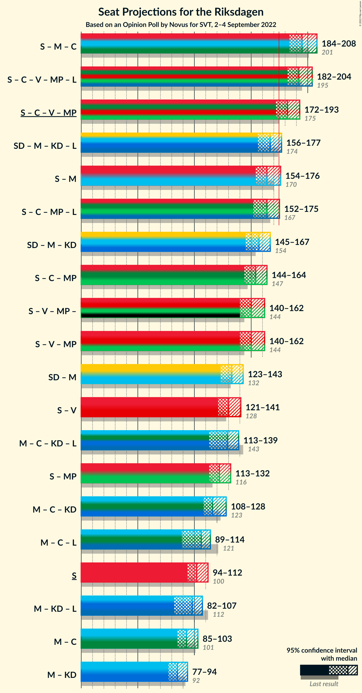

### Confidence Intervals

| Coalition | Last Result | Median | Majority? | 80% Confidence Interval | 90% Confidence Interval | 95% Confidence Interval | 99% Confidence Interval |
|:---------:|:-----------:|:------:|:---------:|:-----------------------:|:-----------------------:|:-----------------------:|:-----------------------:|
| Sveriges socialdemokratiska arbetareparti – Moderata samlingspartiet – Centerpartiet | 201 | 195 | 100% | 188–205 | 186–208 | 184–208 | 182–211 |
| Sveriges socialdemokratiska arbetareparti – Centerpartiet – Vänsterpartiet – Miljöpartiet de gröna – Liberalerna | 195 | 192 | 100% | 185–199 | 184–201 | 182–204 | 178–206 |
| Sveriges socialdemokratiska arbetareparti – Centerpartiet – Vänsterpartiet – Miljöpartiet de gröna | 175 | 182 | 90% | 174–191 | 173–192 | 172–193 | 168–198 |
| Sverigedemokraterna – Moderata samlingspartiet – Kristdemokraterna – Liberalerna | 174 | 167 | 10% | 158–175 | 157–176 | 156–177 | 151–181 |
| Sveriges socialdemokratiska arbetareparti – Moderata samlingspartiet | 170 | 164 | 7% | 157–173 | 155–175 | 154–176 | 151–179 |
| Sveriges socialdemokratiska arbetareparti – Centerpartiet – Miljöpartiet de gröna – Liberalerna | 167 | 164 | 3% | 156–171 | 154–173 | 152–175 | 149–178 |
| Sverigedemokraterna – Moderata samlingspartiet – Kristdemokraterna | 154 | 157 | 0% | 150–164 | 148–165 | 145–167 | 143–171 |
| Sveriges socialdemokratiska arbetareparti – Centerpartiet – Miljöpartiet de gröna | 147 | 154 | 0% | 147–162 | 145–164 | 144–164 | 140–168 |
| Sveriges socialdemokratiska arbetareparti – Vänsterpartiet – Miljöpartiet de gröna | 144 | 150 | 0% | 144–158 | 142–161 | 140–162 | 138–165 |
| Sverigedemokraterna – Moderata samlingspartiet | 132 | 133 | 0% | 126–140 | 124–141 | 123–143 | 120–147 |
| Sveriges socialdemokratiska arbetareparti – Vänsterpartiet | 128 | 130 | 0% | 125–138 | 122–139 | 121–141 | 119–145 |
| Moderata samlingspartiet – Centerpartiet – Kristdemokraterna – Liberalerna | 143 | 129 | 0% | 118–135 | 115–136 | 113–139 | 111–141 |
| Sveriges socialdemokratiska arbetareparti – Miljöpartiet de gröna | 116 | 122 | 0% | 116–130 | 115–131 | 113–132 | 110–135 |
| Moderata samlingspartiet – Centerpartiet – Kristdemokraterna | 123 | 116 | 0% | 111–123 | 109–125 | 108–128 | 105–129 |
| Moderata samlingspartiet – Centerpartiet – Liberalerna | 121 | 106 | 0% | 94–112 | 91–113 | 89–114 | 87–118 |
| Sveriges socialdemokratiska arbetareparti | 100 | 102 | 0% | 97–109 | 95–111 | 94–112 | 92–115 |
| Moderata samlingspartiet – Kristdemokraterna – Liberalerna | 112 | 98 | 0% | 85–104 | 83–105 | 82–107 | 79–109 |
| Moderata samlingspartiet – Centerpartiet | 101 | 93 | 0% | 88–98 | 86–101 | 85–103 | 83–105 |
| Moderata samlingspartiet – Kristdemokraterna | 92 | 85 | 0% | 80–91 | 79–93 | 77–94 | 75–97 |

### Sveriges socialdemokratiska arbetareparti – Moderata samlingspartiet – Centerpartiet

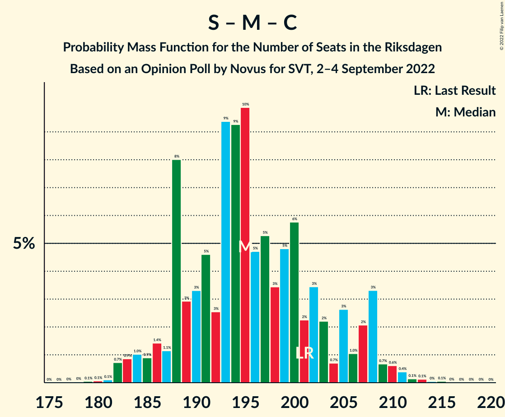

| Number of Seats | Probability | Accumulated | Special Marks |
|:---------------:|:-----------:|:-----------:|:-------------:|
| 178 | 0% | 100% |  |
| 179 | 0.1% | 99.9% |  |
| 180 | 0.1% | 99.9% |  |
| 181 | 0.1% | 99.8% |  |
| 182 | 0.7% | 99.7% |  |
| 183 | 0.9% | 99.0% |  |
| 184 | 1.0% | 98% |  |
| 185 | 0.9% | 97% |  |
| 186 | 1.4% | 96% |  |
| 187 | 1.1% | 95% |  |
| 188 | 8% | 94% |  |
| 189 | 3% | 86% |  |
| 190 | 3% | 83% |  |
| 191 | 5% | 79% |  |
| 192 | 3% | 75% |  |
| 193 | 9% | 72% |  |
| 194 | 9% | 63% |  |
| 195 | 10% | 54% | Median |
| 196 | 5% | 44% |  |
| 197 | 5% | 39% |  |
| 198 | 3% | 34% |  |
| 199 | 5% | 30% |  |
| 200 | 6% | 26% |  |
| 201 | 2% | 20% | Last Result |
| 202 | 3% | 17% |  |
| 203 | 2% | 14% |  |
| 204 | 0.7% | 12% |  |
| 205 | 3% | 11% |  |
| 206 | 1.0% | 9% |  |
| 207 | 2% | 7% |  |
| 208 | 3% | 5% |  |
| 209 | 0.7% | 2% |  |
| 210 | 0.6% | 1.4% |  |
| 211 | 0.4% | 0.8% |  |
| 212 | 0.1% | 0.4% |  |
| 213 | 0.1% | 0.3% |  |
| 214 | 0% | 0.1% |  |
| 215 | 0.1% | 0.1% |  |
| 216 | 0% | 0% |  |

### Sveriges socialdemokratiska arbetareparti – Centerpartiet – Vänsterpartiet – Miljöpartiet de gröna – Liberalerna

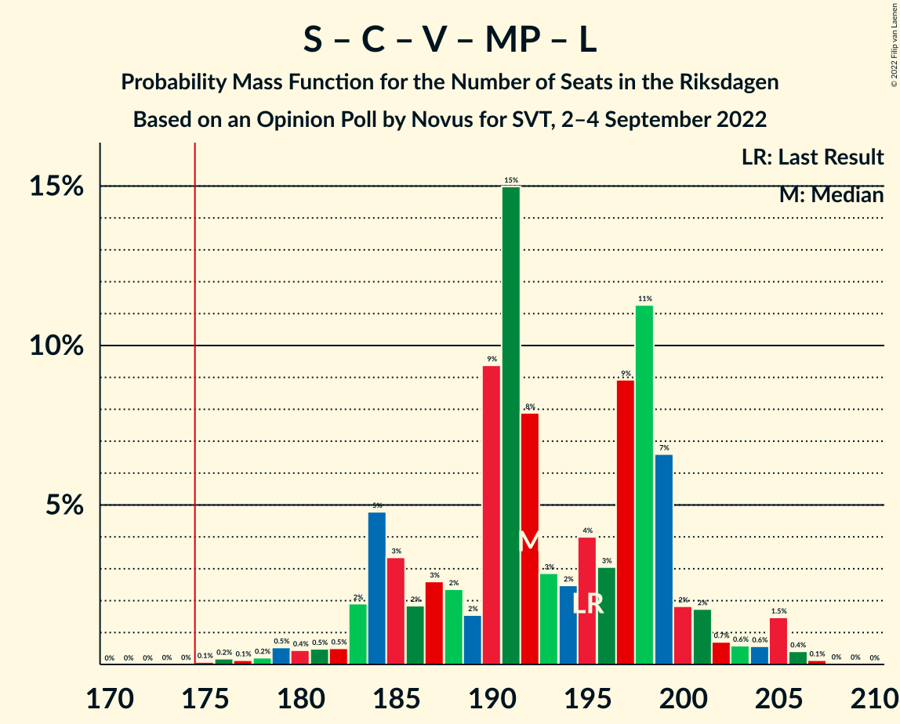

| Number of Seats | Probability | Accumulated | Special Marks |
|:---------------:|:-----------:|:-----------:|:-------------:|
| 175 | 0.1% | 100% | Majority |
| 176 | 0.2% | 99.9% |  |
| 177 | 0.1% | 99.7% |  |
| 178 | 0.2% | 99.6% |  |
| 179 | 0.5% | 99.4% |  |
| 180 | 0.4% | 98.8% |  |
| 181 | 0.5% | 98% |  |
| 182 | 0.5% | 98% |  |
| 183 | 2% | 97% |  |
| 184 | 5% | 95% |  |
| 185 | 3% | 91% |  |
| 186 | 2% | 87% |  |
| 187 | 3% | 85% |  |
| 188 | 2% | 83% |  |
| 189 | 2% | 81% |  |
| 190 | 9% | 79% |  |
| 191 | 15% | 70% |  |
| 192 | 8% | 55% |  |
| 193 | 3% | 47% |  |
| 194 | 2% | 44% |  |
| 195 | 4% | 41% | Last Result |
| 196 | 3% | 37% | Median |
| 197 | 9% | 34% |  |
| 198 | 11% | 25% |  |
| 199 | 7% | 14% |  |
| 200 | 2% | 8% |  |
| 201 | 2% | 6% |  |
| 202 | 0.7% | 4% |  |
| 203 | 0.6% | 3% |  |
| 204 | 0.6% | 3% |  |
| 205 | 1.5% | 2% |  |
| 206 | 0.4% | 0.6% |  |
| 207 | 0.1% | 0.2% |  |
| 208 | 0% | 0.1% |  |
| 209 | 0% | 0.1% |  |
| 210 | 0% | 0% |  |

### Sveriges socialdemokratiska arbetareparti – Centerpartiet – Vänsterpartiet – Miljöpartiet de gröna

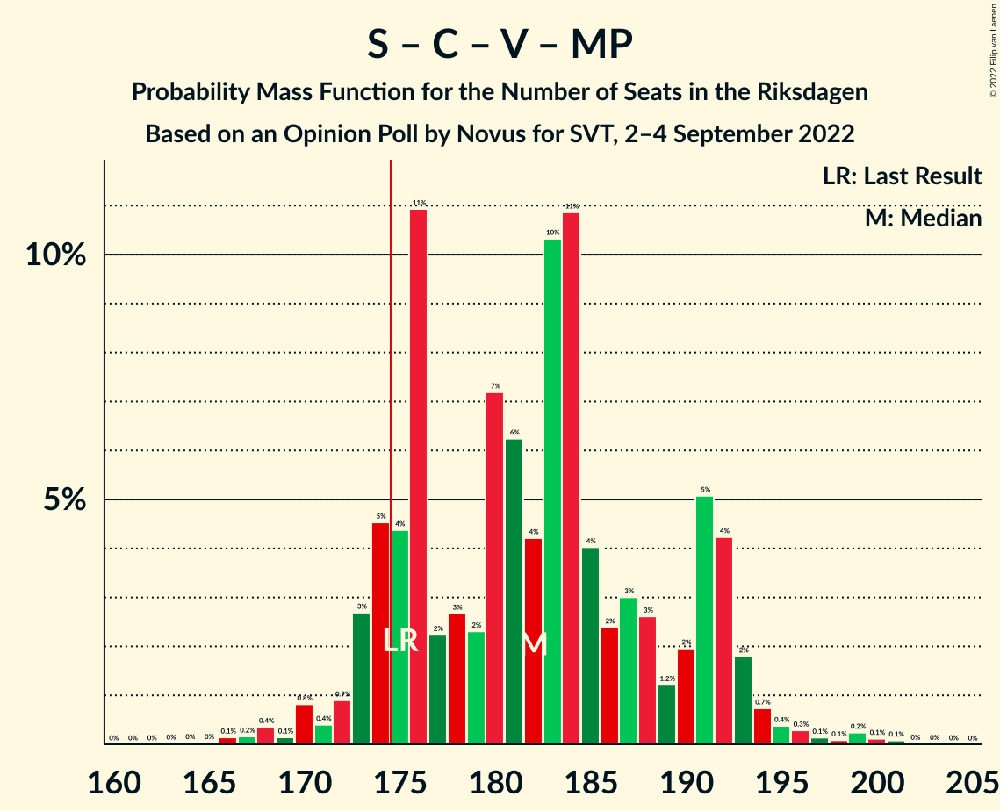

| Number of Seats | Probability | Accumulated | Special Marks |
|:---------------:|:-----------:|:-----------:|:-------------:|
| 164 | 0% | 100% |  |
| 165 | 0% | 99.9% |  |
| 166 | 0.1% | 99.9% |  |
| 167 | 0.2% | 99.8% |  |
| 168 | 0.4% | 99.6% |  |
| 169 | 0.1% | 99.3% |  |
| 170 | 0.8% | 99.1% |  |
| 171 | 0.4% | 98% |  |
| 172 | 0.9% | 98% |  |
| 173 | 3% | 97% |  |
| 174 | 5% | 94% |  |
| 175 | 4% | 90% | Last Result, Majority |
| 176 | 11% | 85% |  |
| 177 | 2% | 74% |  |
| 178 | 3% | 72% |  |
| 179 | 2% | 70% |  |
| 180 | 7% | 67% |  |
| 181 | 6% | 60% | Median |
| 182 | 4% | 54% |  |
| 183 | 10% | 50% |  |
| 184 | 11% | 39% |  |
| 185 | 4% | 28% |  |
| 186 | 2% | 24% |  |
| 187 | 3% | 22% |  |
| 188 | 3% | 19% |  |
| 189 | 1.2% | 16% |  |
| 190 | 2% | 15% |  |
| 191 | 5% | 13% |  |
| 192 | 4% | 8% |  |
| 193 | 2% | 4% |  |
| 194 | 0.7% | 2% |  |
| 195 | 0.4% | 1.3% |  |
| 196 | 0.3% | 1.0% |  |
| 197 | 0.1% | 0.7% |  |
| 198 | 0.1% | 0.6% |  |
| 199 | 0.2% | 0.5% |  |
| 200 | 0.1% | 0.2% |  |
| 201 | 0.1% | 0.1% |  |
| 202 | 0% | 0% |  |

### Sverigedemokraterna – Moderata samlingspartiet – Kristdemokraterna – Liberalerna

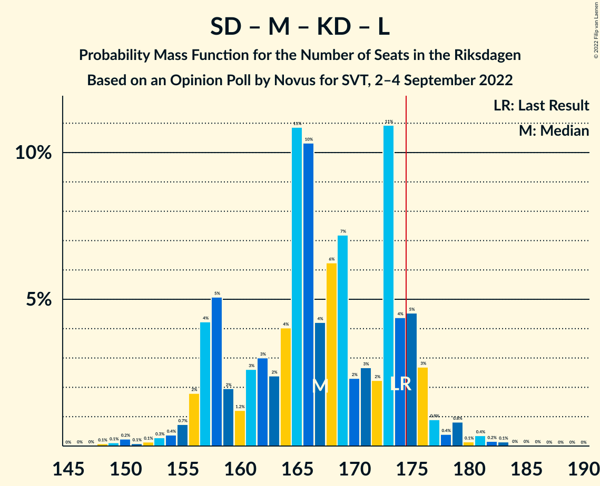

| Number of Seats | Probability | Accumulated | Special Marks |
|:---------------:|:-----------:|:-----------:|:-------------:|
| 148 | 0.1% | 100% |  |
| 149 | 0.1% | 99.9% |  |
| 150 | 0.2% | 99.8% |  |
| 151 | 0.1% | 99.5% |  |
| 152 | 0.1% | 99.4% |  |
| 153 | 0.3% | 99.3% |  |
| 154 | 0.4% | 99.0% |  |
| 155 | 0.7% | 98.7% |  |
| 156 | 2% | 98% |  |
| 157 | 4% | 96% |  |
| 158 | 5% | 92% |  |
| 159 | 2% | 87% |  |
| 160 | 1.2% | 85% |  |
| 161 | 3% | 84% |  |
| 162 | 3% | 81% |  |
| 163 | 2% | 78% |  |
| 164 | 4% | 76% |  |
| 165 | 11% | 72% |  |
| 166 | 10% | 61% |  |
| 167 | 4% | 50% |  |
| 168 | 6% | 46% |  |
| 169 | 7% | 40% |  |
| 170 | 2% | 33% |  |
| 171 | 3% | 30% |  |
| 172 | 2% | 28% | Median |
| 173 | 11% | 26% |  |
| 174 | 4% | 15% | Last Result |
| 175 | 5% | 10% | Majority |
| 176 | 3% | 6% |  |
| 177 | 0.9% | 3% |  |
| 178 | 0.4% | 2% |  |
| 179 | 0.8% | 2% |  |
| 180 | 0.1% | 0.9% |  |
| 181 | 0.4% | 0.7% |  |
| 182 | 0.2% | 0.4% |  |
| 183 | 0.1% | 0.2% |  |
| 184 | 0% | 0.1% |  |
| 185 | 0% | 0.1% |  |
| 186 | 0% | 0% |  |

### Sveriges socialdemokratiska arbetareparti – Moderata samlingspartiet

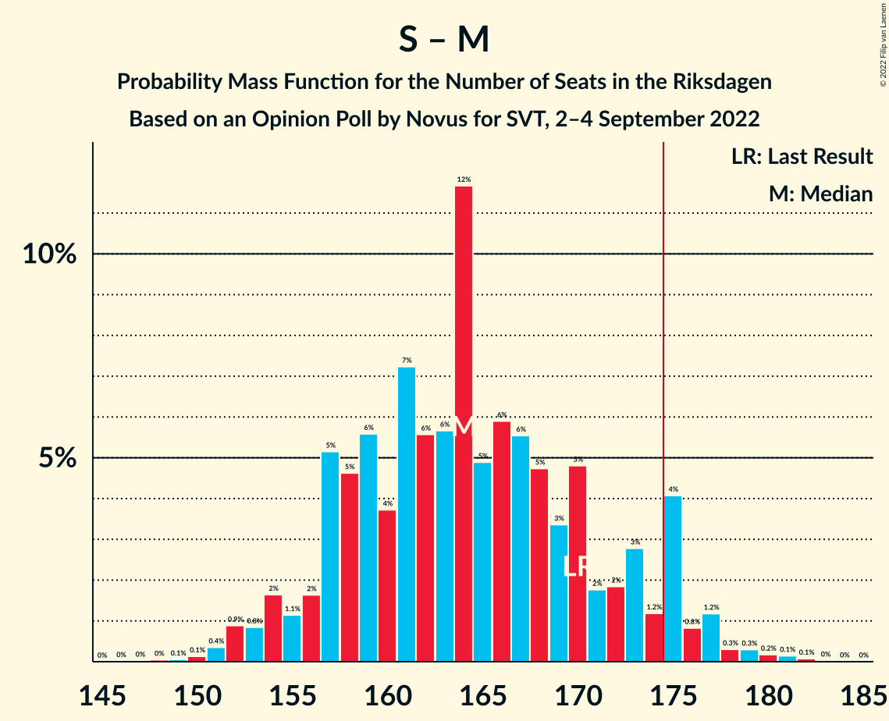

| Number of Seats | Probability | Accumulated | Special Marks |
|:---------------:|:-----------:|:-----------:|:-------------:|
| 147 | 0% | 100% |  |
| 148 | 0% | 99.9% |  |
| 149 | 0.1% | 99.9% |  |
| 150 | 0.1% | 99.8% |  |
| 151 | 0.4% | 99.7% |  |
| 152 | 0.9% | 99.4% |  |
| 153 | 0.8% | 98% |  |
| 154 | 2% | 98% |  |
| 155 | 1.1% | 96% |  |
| 156 | 2% | 95% |  |
| 157 | 5% | 93% |  |
| 158 | 5% | 88% |  |
| 159 | 6% | 83% |  |
| 160 | 4% | 78% |  |
| 161 | 7% | 74% |  |
| 162 | 6% | 67% |  |
| 163 | 6% | 61% |  |
| 164 | 12% | 56% | Median |
| 165 | 5% | 44% |  |
| 166 | 6% | 39% |  |
| 167 | 6% | 33% |  |
| 168 | 5% | 28% |  |
| 169 | 3% | 23% |  |
| 170 | 5% | 20% | Last Result |
| 171 | 2% | 15% |  |
| 172 | 2% | 13% |  |
| 173 | 3% | 11% |  |
| 174 | 1.2% | 8% |  |
| 175 | 4% | 7% | Majority |
| 176 | 0.8% | 3% |  |
| 177 | 1.2% | 2% |  |
| 178 | 0.3% | 1.1% |  |
| 179 | 0.3% | 0.8% |  |
| 180 | 0.2% | 0.5% |  |
| 181 | 0.1% | 0.3% |  |
| 182 | 0.1% | 0.1% |  |
| 183 | 0% | 0.1% |  |
| 184 | 0% | 0% |  |

### Sveriges socialdemokratiska arbetareparti – Centerpartiet – Miljöpartiet de gröna – Liberalerna

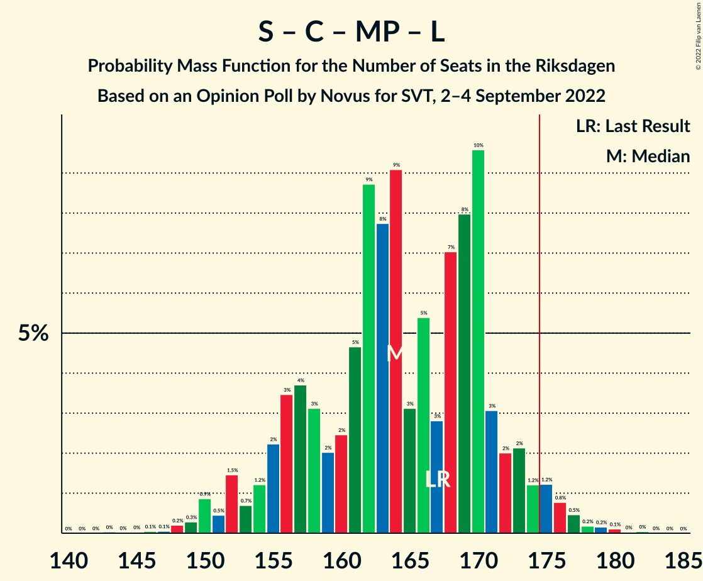

| Number of Seats | Probability | Accumulated | Special Marks |
|:---------------:|:-----------:|:-----------:|:-------------:|
| 144 | 0% | 100% |  |
| 145 | 0% | 99.9% |  |
| 146 | 0.1% | 99.9% |  |
| 147 | 0.1% | 99.9% |  |
| 148 | 0.2% | 99.8% |  |
| 149 | 0.3% | 99.6% |  |
| 150 | 0.9% | 99.3% |  |
| 151 | 0.5% | 98% |  |
| 152 | 1.5% | 98% |  |
| 153 | 0.7% | 97% |  |
| 154 | 1.2% | 96% |  |
| 155 | 2% | 95% |  |
| 156 | 3% | 92% |  |
| 157 | 4% | 89% |  |
| 158 | 3% | 85% |  |
| 159 | 2% | 82% |  |
| 160 | 2% | 80% |  |
| 161 | 5% | 78% |  |
| 162 | 9% | 73% |  |
| 163 | 8% | 64% |  |
| 164 | 9% | 56% |  |
| 165 | 3% | 47% |  |
| 166 | 5% | 44% |  |
| 167 | 3% | 39% | Last Result |
| 168 | 7% | 36% | Median |
| 169 | 8% | 29% |  |
| 170 | 10% | 21% |  |
| 171 | 3% | 11% |  |
| 172 | 2% | 8% |  |
| 173 | 2% | 6% |  |
| 174 | 1.2% | 4% |  |
| 175 | 1.2% | 3% | Majority |
| 176 | 0.8% | 2% |  |
| 177 | 0.5% | 1.0% |  |
| 178 | 0.2% | 0.5% |  |
| 179 | 0.2% | 0.4% |  |
| 180 | 0.1% | 0.2% |  |
| 181 | 0% | 0.1% |  |
| 182 | 0% | 0.1% |  |
| 183 | 0% | 0% |  |

### Sverigedemokraterna – Moderata samlingspartiet – Kristdemokraterna

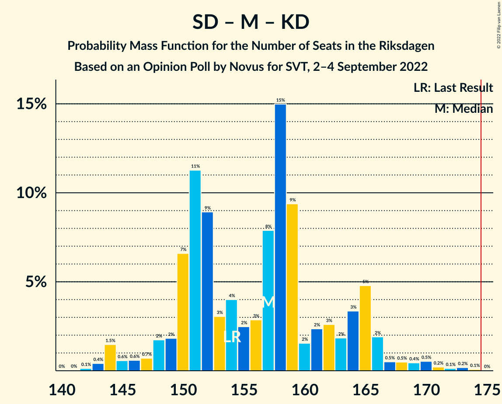

| Number of Seats | Probability | Accumulated | Special Marks |
|:---------------:|:-----------:|:-----------:|:-------------:|
| 140 | 0% | 100% |  |
| 141 | 0% | 99.9% |  |
| 142 | 0.1% | 99.9% |  |
| 143 | 0.4% | 99.8% |  |
| 144 | 1.5% | 99.4% |  |
| 145 | 0.6% | 98% |  |
| 146 | 0.6% | 97% |  |
| 147 | 0.7% | 97% |  |
| 148 | 2% | 96% |  |
| 149 | 2% | 94% |  |
| 150 | 7% | 92% |  |
| 151 | 11% | 86% |  |
| 152 | 9% | 75% |  |
| 153 | 3% | 66% |  |
| 154 | 4% | 63% | Last Result |
| 155 | 2% | 59% |  |
| 156 | 3% | 56% |  |
| 157 | 8% | 53% | Median |
| 158 | 15% | 45% |  |
| 159 | 9% | 30% |  |
| 160 | 2% | 21% |  |
| 161 | 2% | 19% |  |
| 162 | 3% | 17% |  |
| 163 | 2% | 15% |  |
| 164 | 3% | 13% |  |
| 165 | 5% | 9% |  |
| 166 | 2% | 5% |  |
| 167 | 0.5% | 3% |  |
| 168 | 0.5% | 2% |  |
| 169 | 0.4% | 2% |  |
| 170 | 0.5% | 1.2% |  |
| 171 | 0.2% | 0.6% |  |
| 172 | 0.1% | 0.4% |  |
| 173 | 0.2% | 0.3% |  |
| 174 | 0.1% | 0.1% |  |
| 175 | 0% | 0% | Majority |

### Sveriges socialdemokratiska arbetareparti – Centerpartiet – Miljöpartiet de gröna

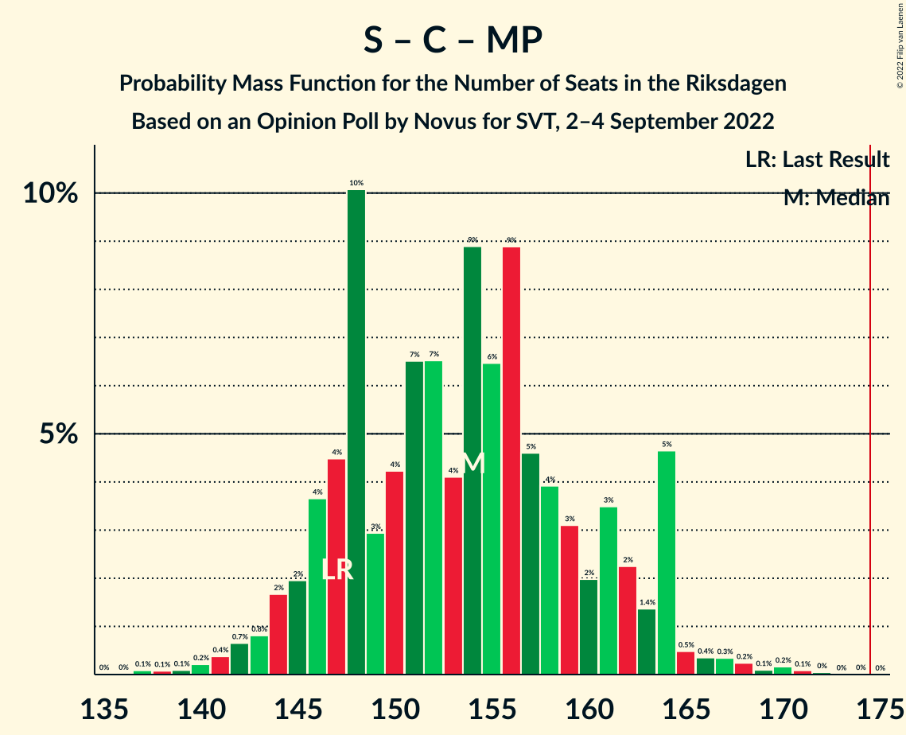

| Number of Seats | Probability | Accumulated | Special Marks |
|:---------------:|:-----------:|:-----------:|:-------------:|
| 135 | 0% | 100% |  |
| 136 | 0% | 99.9% |  |
| 137 | 0.1% | 99.9% |  |
| 138 | 0.1% | 99.8% |  |
| 139 | 0.1% | 99.8% |  |
| 140 | 0.2% | 99.7% |  |
| 141 | 0.4% | 99.5% |  |
| 142 | 0.7% | 99.1% |  |
| 143 | 0.8% | 98% |  |
| 144 | 2% | 98% |  |
| 145 | 2% | 96% |  |
| 146 | 4% | 94% |  |
| 147 | 4% | 90% | Last Result |
| 148 | 10% | 86% |  |
| 149 | 3% | 76% |  |
| 150 | 4% | 73% |  |
| 151 | 7% | 69% |  |
| 152 | 7% | 62% |  |
| 153 | 4% | 56% | Median |
| 154 | 9% | 51% |  |
| 155 | 6% | 43% |  |
| 156 | 9% | 36% |  |
| 157 | 5% | 27% |  |
| 158 | 4% | 23% |  |
| 159 | 3% | 19% |  |
| 160 | 2% | 16% |  |
| 161 | 3% | 14% |  |
| 162 | 2% | 10% |  |
| 163 | 1.4% | 8% |  |
| 164 | 5% | 6% |  |
| 165 | 0.5% | 2% |  |
| 166 | 0.4% | 1.4% |  |
| 167 | 0.3% | 1.0% |  |
| 168 | 0.2% | 0.7% |  |
| 169 | 0.1% | 0.4% |  |
| 170 | 0.2% | 0.3% |  |
| 171 | 0.1% | 0.2% |  |
| 172 | 0% | 0.1% |  |
| 173 | 0% | 0% |  |

### Sveriges socialdemokratiska arbetareparti – Vänsterpartiet – Miljöpartiet de gröna

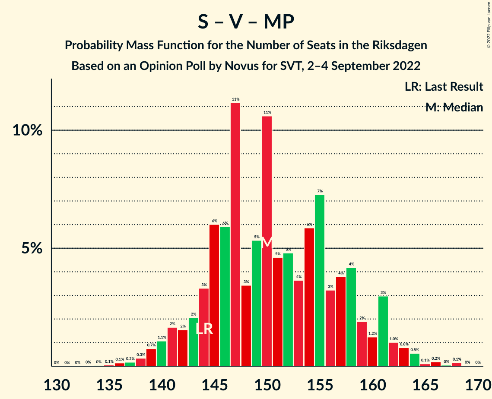

| Number of Seats | Probability | Accumulated | Special Marks |
|:---------------:|:-----------:|:-----------:|:-------------:|
| 134 | 0% | 100% |  |
| 135 | 0.1% | 99.9% |  |
| 136 | 0.1% | 99.9% |  |
| 137 | 0.2% | 99.7% |  |
| 138 | 0.3% | 99.6% |  |
| 139 | 0.7% | 99.2% |  |
| 140 | 1.1% | 98% |  |
| 141 | 2% | 97% |  |
| 142 | 2% | 96% |  |
| 143 | 2% | 94% |  |
| 144 | 3% | 92% | Last Result |
| 145 | 6% | 89% |  |
| 146 | 6% | 83% |  |
| 147 | 11% | 77% |  |
| 148 | 3% | 66% |  |
| 149 | 5% | 62% |  |
| 150 | 11% | 57% | Median |
| 151 | 5% | 46% |  |
| 152 | 5% | 42% |  |
| 153 | 4% | 37% |  |
| 154 | 6% | 33% |  |
| 155 | 7% | 27% |  |
| 156 | 3% | 20% |  |
| 157 | 4% | 17% |  |
| 158 | 4% | 13% |  |
| 159 | 2% | 9% |  |
| 160 | 1.2% | 7% |  |
| 161 | 3% | 6% |  |
| 162 | 1.0% | 3% |  |
| 163 | 0.8% | 2% |  |
| 164 | 0.5% | 1.1% |  |
| 165 | 0.1% | 0.5% |  |
| 166 | 0.2% | 0.4% |  |
| 167 | 0% | 0.2% |  |
| 168 | 0.1% | 0.2% |  |
| 169 | 0% | 0.1% |  |
| 170 | 0% | 0% |  |

### Sverigedemokraterna – Moderata samlingspartiet

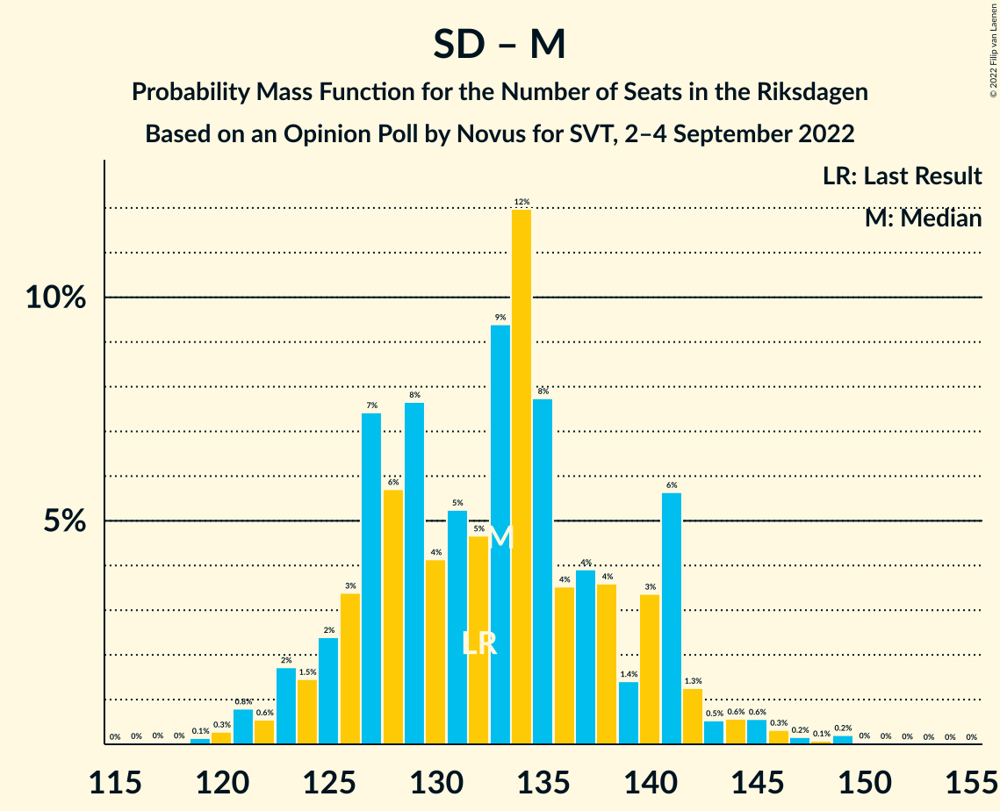

| Number of Seats | Probability | Accumulated | Special Marks |
|:---------------:|:-----------:|:-----------:|:-------------:|
| 117 | 0% | 100% |  |
| 118 | 0% | 99.9% |  |
| 119 | 0.1% | 99.9% |  |
| 120 | 0.3% | 99.8% |  |
| 121 | 0.8% | 99.5% |  |
| 122 | 0.6% | 98.7% |  |
| 123 | 2% | 98% |  |
| 124 | 1.5% | 96% |  |
| 125 | 2% | 95% |  |
| 126 | 3% | 93% |  |
| 127 | 7% | 89% |  |
| 128 | 6% | 82% |  |
| 129 | 8% | 76% |  |
| 130 | 4% | 68% |  |
| 131 | 5% | 64% |  |
| 132 | 5% | 59% | Last Result |
| 133 | 9% | 54% | Median |
| 134 | 12% | 45% |  |
| 135 | 8% | 33% |  |
| 136 | 4% | 25% |  |
| 137 | 4% | 22% |  |
| 138 | 4% | 18% |  |
| 139 | 1.4% | 14% |  |
| 140 | 3% | 13% |  |
| 141 | 6% | 9% |  |
| 142 | 1.3% | 4% |  |
| 143 | 0.5% | 3% |  |
| 144 | 0.6% | 2% |  |
| 145 | 0.6% | 1.4% |  |
| 146 | 0.3% | 0.8% |  |
| 147 | 0.2% | 0.5% |  |
| 148 | 0.1% | 0.4% |  |
| 149 | 0.2% | 0.3% |  |
| 150 | 0% | 0.1% |  |
| 151 | 0% | 0% |  |

### Sveriges socialdemokratiska arbetareparti – Vänsterpartiet

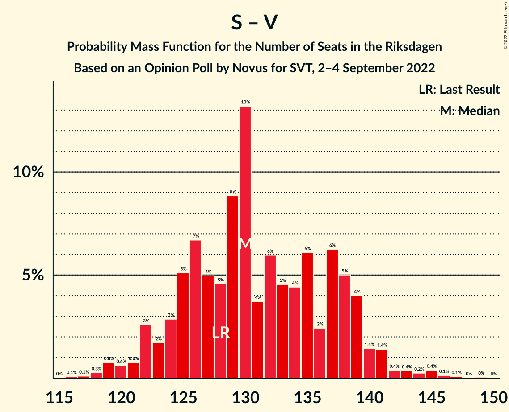

| Number of Seats | Probability | Accumulated | Special Marks |
|:---------------:|:-----------:|:-----------:|:-------------:|
| 116 | 0.1% | 100% |  |
| 117 | 0.1% | 99.9% |  |
| 118 | 0.3% | 99.8% |  |
| 119 | 0.8% | 99.5% |  |
| 120 | 0.6% | 98.8% |  |
| 121 | 0.8% | 98% |  |
| 122 | 3% | 97% |  |
| 123 | 2% | 95% |  |
| 124 | 3% | 93% |  |
| 125 | 5% | 90% |  |
| 126 | 7% | 85% |  |
| 127 | 5% | 78% |  |
| 128 | 5% | 73% | Last Result |
| 129 | 9% | 69% |  |
| 130 | 13% | 60% | Median |
| 131 | 4% | 47% |  |
| 132 | 6% | 43% |  |
| 133 | 5% | 37% |  |
| 134 | 4% | 33% |  |
| 135 | 6% | 28% |  |
| 136 | 2% | 22% |  |
| 137 | 6% | 20% |  |
| 138 | 5% | 13% |  |
| 139 | 4% | 8% |  |
| 140 | 1.4% | 4% |  |
| 141 | 1.4% | 3% |  |
| 142 | 0.4% | 2% |  |
| 143 | 0.4% | 1.3% |  |
| 144 | 0.2% | 0.9% |  |
| 145 | 0.4% | 0.7% |  |
| 146 | 0.1% | 0.3% |  |
| 147 | 0.1% | 0.2% |  |
| 148 | 0% | 0.1% |  |
| 149 | 0% | 0.1% |  |
| 150 | 0% | 0% |  |

### Moderata samlingspartiet – Centerpartiet – Kristdemokraterna – Liberalerna

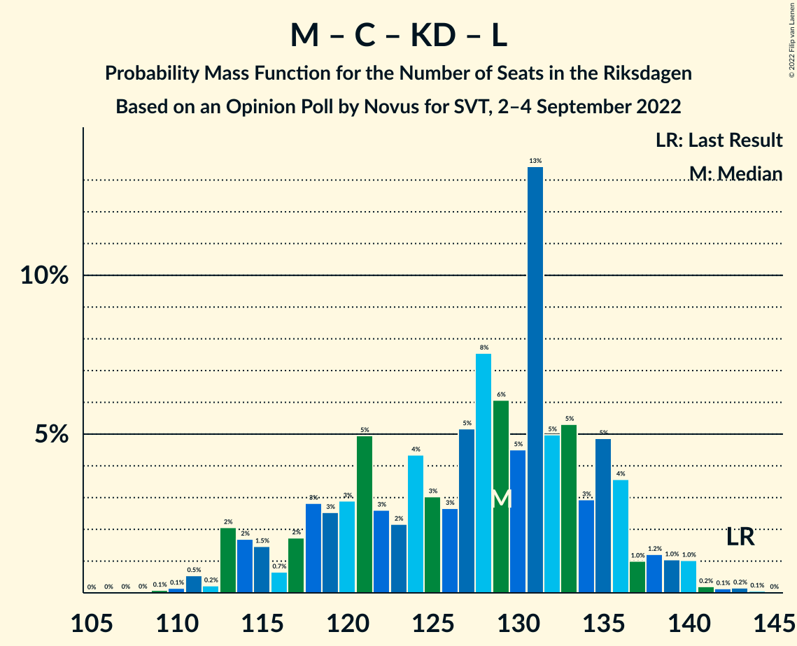

| Number of Seats | Probability | Accumulated | Special Marks |
|:---------------:|:-----------:|:-----------:|:-------------:|
| 108 | 0% | 100% |  |
| 109 | 0.1% | 99.9% |  |
| 110 | 0.1% | 99.8% |  |
| 111 | 0.5% | 99.7% |  |
| 112 | 0.2% | 99.1% |  |
| 113 | 2% | 98.9% |  |
| 114 | 2% | 97% |  |
| 115 | 1.5% | 95% |  |
| 116 | 0.7% | 94% |  |
| 117 | 2% | 93% |  |
| 118 | 3% | 91% |  |
| 119 | 3% | 88% |  |
| 120 | 3% | 86% |  |
| 121 | 5% | 83% |  |
| 122 | 3% | 78% |  |
| 123 | 2% | 75% |  |
| 124 | 4% | 73% |  |
| 125 | 3% | 69% |  |
| 126 | 3% | 66% |  |
| 127 | 5% | 63% |  |
| 128 | 8% | 58% |  |
| 129 | 6% | 51% |  |
| 130 | 5% | 44% |  |
| 131 | 13% | 40% |  |
| 132 | 5% | 27% | Median |
| 133 | 5% | 22% |  |
| 134 | 3% | 16% |  |
| 135 | 5% | 13% |  |
| 136 | 4% | 8% |  |
| 137 | 1.0% | 5% |  |
| 138 | 1.2% | 4% |  |
| 139 | 1.0% | 3% |  |
| 140 | 1.0% | 2% |  |
| 141 | 0.2% | 0.6% |  |
| 142 | 0.1% | 0.4% |  |
| 143 | 0.2% | 0.3% | Last Result |
| 144 | 0.1% | 0.1% |  |
| 145 | 0% | 0% |  |

### Sveriges socialdemokratiska arbetareparti – Miljöpartiet de gröna

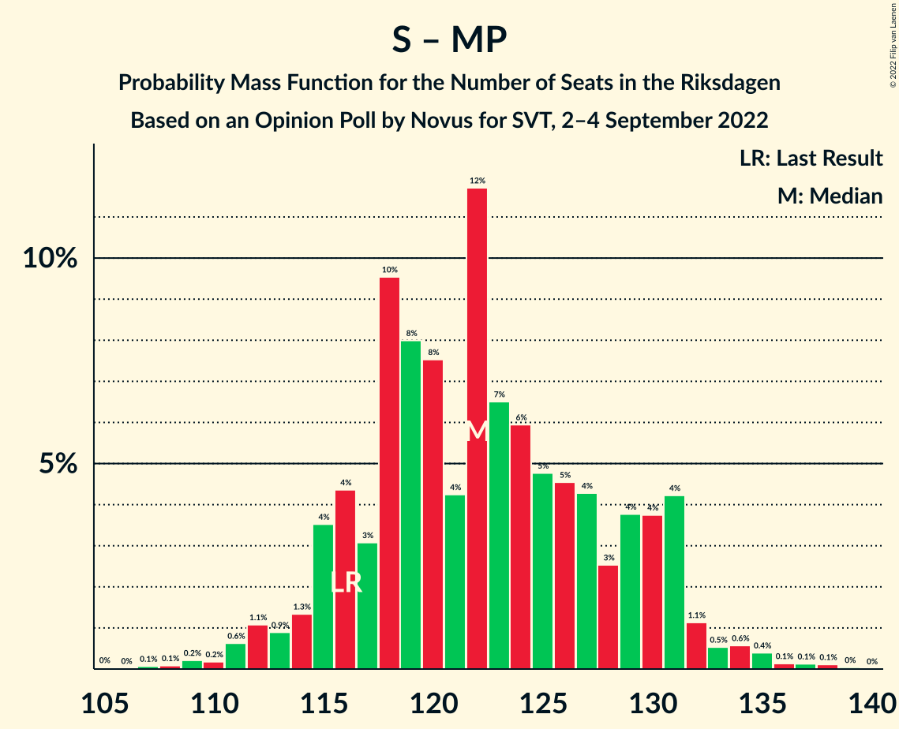

| Number of Seats | Probability | Accumulated | Special Marks |
|:---------------:|:-----------:|:-----------:|:-------------:|
| 105 | 0% | 100% |  |
| 106 | 0% | 99.9% |  |
| 107 | 0.1% | 99.9% |  |
| 108 | 0.1% | 99.8% |  |
| 109 | 0.2% | 99.7% |  |
| 110 | 0.2% | 99.5% |  |
| 111 | 0.6% | 99.4% |  |
| 112 | 1.1% | 98.7% |  |
| 113 | 0.9% | 98% |  |
| 114 | 1.3% | 97% |  |
| 115 | 4% | 95% |  |
| 116 | 4% | 92% | Last Result |
| 117 | 3% | 88% |  |
| 118 | 10% | 84% |  |
| 119 | 8% | 75% |  |
| 120 | 8% | 67% |  |
| 121 | 4% | 59% |  |
| 122 | 12% | 55% | Median |
| 123 | 7% | 43% |  |
| 124 | 6% | 37% |  |
| 125 | 5% | 31% |  |
| 126 | 5% | 26% |  |
| 127 | 4% | 22% |  |
| 128 | 3% | 17% |  |
| 129 | 4% | 15% |  |
| 130 | 4% | 11% |  |
| 131 | 4% | 7% |  |
| 132 | 1.1% | 3% |  |
| 133 | 0.5% | 2% |  |
| 134 | 0.6% | 1.4% |  |
| 135 | 0.4% | 0.8% |  |
| 136 | 0.1% | 0.4% |  |
| 137 | 0.1% | 0.3% |  |
| 138 | 0.1% | 0.2% |  |
| 139 | 0% | 0.1% |  |
| 140 | 0% | 0% |  |

### Moderata samlingspartiet – Centerpartiet – Kristdemokraterna

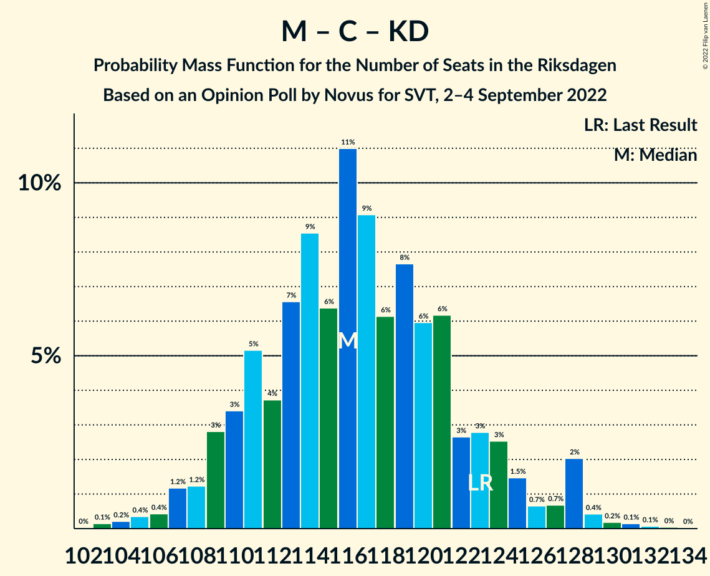

| Number of Seats | Probability | Accumulated | Special Marks |
|:---------------:|:-----------:|:-----------:|:-------------:|
| 102 | 0% | 100% |  |
| 103 | 0.1% | 99.9% |  |
| 104 | 0.2% | 99.8% |  |
| 105 | 0.4% | 99.6% |  |
| 106 | 0.4% | 99.2% |  |
| 107 | 1.2% | 98.8% |  |
| 108 | 1.2% | 98% |  |
| 109 | 3% | 96% |  |
| 110 | 3% | 94% |  |
| 111 | 5% | 90% |  |
| 112 | 4% | 85% |  |
| 113 | 7% | 81% |  |
| 114 | 9% | 75% |  |
| 115 | 6% | 66% |  |
| 116 | 11% | 60% |  |
| 117 | 9% | 49% | Median |
| 118 | 6% | 40% |  |
| 119 | 8% | 34% |  |
| 120 | 6% | 26% |  |
| 121 | 6% | 20% |  |
| 122 | 3% | 14% |  |
| 123 | 3% | 11% | Last Result |
| 124 | 3% | 8% |  |
| 125 | 1.5% | 6% |  |
| 126 | 0.7% | 4% |  |
| 127 | 0.7% | 4% |  |
| 128 | 2% | 3% |  |
| 129 | 0.4% | 0.9% |  |
| 130 | 0.2% | 0.5% |  |
| 131 | 0.1% | 0.3% |  |
| 132 | 0.1% | 0.2% |  |
| 133 | 0% | 0.1% |  |
| 134 | 0% | 0% |  |

### Moderata samlingspartiet – Centerpartiet – Liberalerna

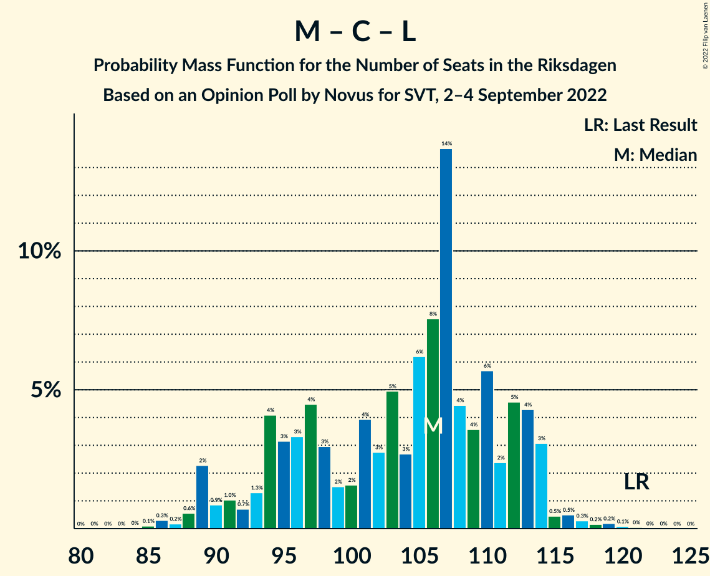

| Number of Seats | Probability | Accumulated | Special Marks |
|:---------------:|:-----------:|:-----------:|:-------------:|
| 85 | 0.1% | 100% |  |
| 86 | 0.3% | 99.9% |  |
| 87 | 0.2% | 99.6% |  |
| 88 | 0.6% | 99.4% |  |
| 89 | 2% | 98.8% |  |
| 90 | 0.9% | 97% |  |
| 91 | 1.0% | 96% |  |
| 92 | 0.7% | 95% |  |
| 93 | 1.3% | 94% |  |
| 94 | 4% | 93% |  |
| 95 | 3% | 89% |  |
| 96 | 3% | 85% |  |
| 97 | 4% | 82% |  |
| 98 | 3% | 78% |  |
| 99 | 2% | 75% |  |
| 100 | 2% | 73% |  |
| 101 | 4% | 72% |  |
| 102 | 3% | 68% |  |
| 103 | 5% | 65% |  |
| 104 | 3% | 60% |  |
| 105 | 6% | 57% |  |
| 106 | 8% | 51% |  |
| 107 | 14% | 43% |  |
| 108 | 4% | 30% | Median |
| 109 | 4% | 25% |  |
| 110 | 6% | 22% |  |
| 111 | 2% | 16% |  |
| 112 | 5% | 14% |  |
| 113 | 4% | 9% |  |
| 114 | 3% | 5% |  |
| 115 | 0.5% | 2% |  |
| 116 | 0.5% | 1.3% |  |
| 117 | 0.3% | 0.8% |  |
| 118 | 0.2% | 0.5% |  |
| 119 | 0.2% | 0.3% |  |
| 120 | 0.1% | 0.2% |  |
| 121 | 0% | 0.1% | Last Result |
| 122 | 0% | 0% |  |

### Sveriges socialdemokratiska arbetareparti

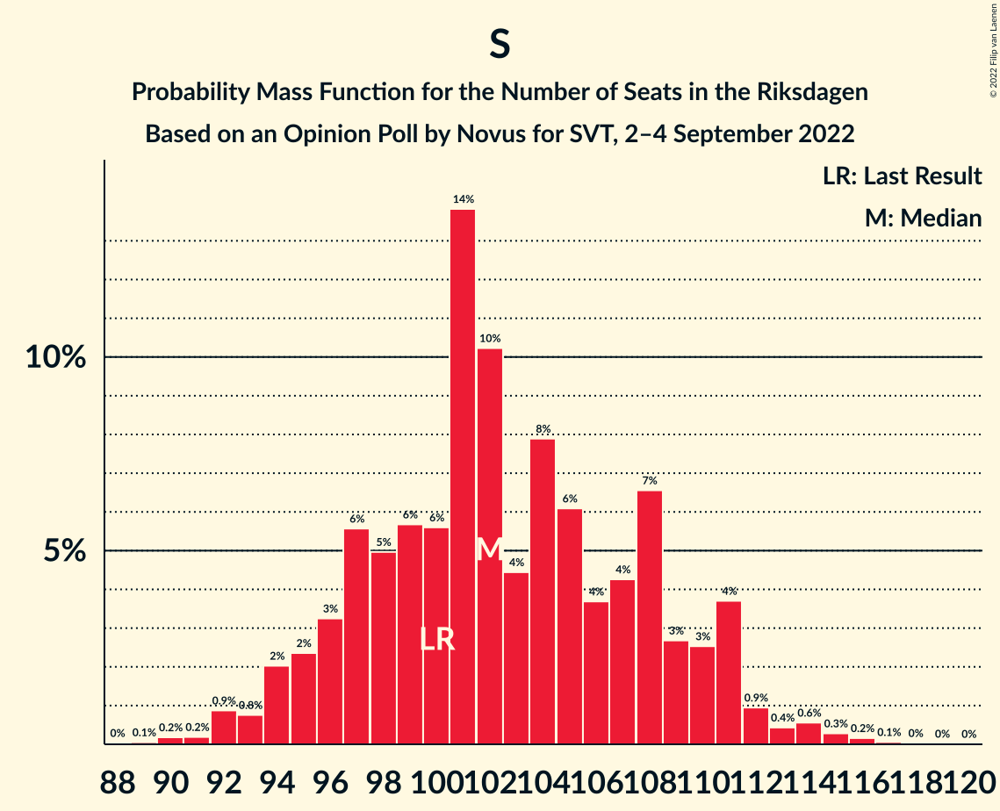

| Number of Seats | Probability | Accumulated | Special Marks |
|:---------------:|:-----------:|:-----------:|:-------------:|
| 88 | 0% | 100% |  |
| 89 | 0.1% | 99.9% |  |
| 90 | 0.2% | 99.9% |  |
| 91 | 0.2% | 99.7% |  |
| 92 | 0.9% | 99.5% |  |
| 93 | 0.8% | 98.6% |  |
| 94 | 2% | 98% |  |
| 95 | 2% | 96% |  |
| 96 | 3% | 94% |  |
| 97 | 6% | 90% |  |
| 98 | 5% | 85% |  |
| 99 | 6% | 80% |  |
| 100 | 6% | 74% | Last Result |
| 101 | 14% | 68% |  |
| 102 | 10% | 55% | Median |
| 103 | 4% | 44% |  |
| 104 | 8% | 40% |  |
| 105 | 6% | 32% |  |
| 106 | 4% | 26% |  |
| 107 | 4% | 22% |  |
| 108 | 7% | 18% |  |
| 109 | 3% | 11% |  |
| 110 | 3% | 9% |  |
| 111 | 4% | 6% |  |
| 112 | 0.9% | 3% |  |
| 113 | 0.4% | 2% |  |
| 114 | 0.6% | 1.1% |  |
| 115 | 0.3% | 0.6% |  |
| 116 | 0.2% | 0.3% |  |
| 117 | 0.1% | 0.1% |  |
| 118 | 0% | 0.1% |  |
| 119 | 0% | 0% |  |

### Moderata samlingspartiet – Kristdemokraterna – Liberalerna

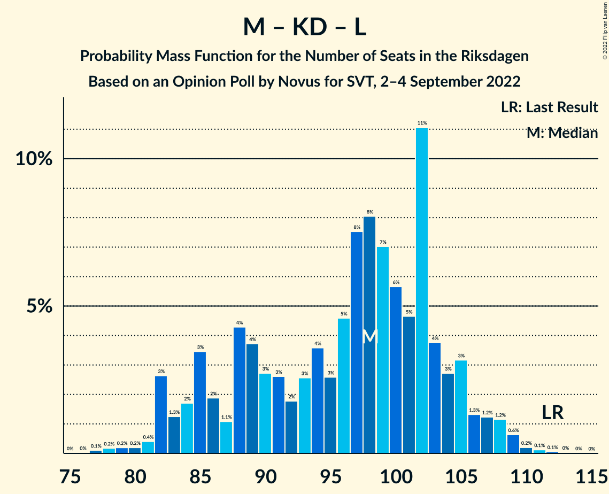

| Number of Seats | Probability | Accumulated | Special Marks |
|:---------------:|:-----------:|:-----------:|:-------------:|
| 77 | 0.1% | 100% |  |
| 78 | 0.2% | 99.9% |  |
| 79 | 0.2% | 99.7% |  |
| 80 | 0.2% | 99.5% |  |
| 81 | 0.4% | 99.3% |  |
| 82 | 3% | 98.9% |  |
| 83 | 1.3% | 96% |  |
| 84 | 2% | 95% |  |
| 85 | 3% | 93% |  |
| 86 | 2% | 90% |  |
| 87 | 1.1% | 88% |  |
| 88 | 4% | 87% |  |
| 89 | 4% | 83% |  |
| 90 | 3% | 79% |  |
| 91 | 3% | 76% |  |
| 92 | 2% | 74% |  |
| 93 | 3% | 72% |  |
| 94 | 4% | 69% |  |
| 95 | 3% | 66% |  |
| 96 | 5% | 63% |  |
| 97 | 8% | 58% |  |
| 98 | 8% | 51% |  |
| 99 | 7% | 43% |  |
| 100 | 6% | 36% |  |
| 101 | 5% | 30% | Median |
| 102 | 11% | 25% |  |
| 103 | 4% | 14% |  |
| 104 | 3% | 11% |  |
| 105 | 3% | 8% |  |
| 106 | 1.3% | 5% |  |
| 107 | 1.2% | 3% |  |
| 108 | 1.2% | 2% |  |
| 109 | 0.6% | 1.1% |  |
| 110 | 0.2% | 0.4% |  |
| 111 | 0.1% | 0.2% |  |
| 112 | 0.1% | 0.1% | Last Result |
| 113 | 0% | 0.1% |  |
| 114 | 0% | 0% |  |

### Moderata samlingspartiet – Centerpartiet

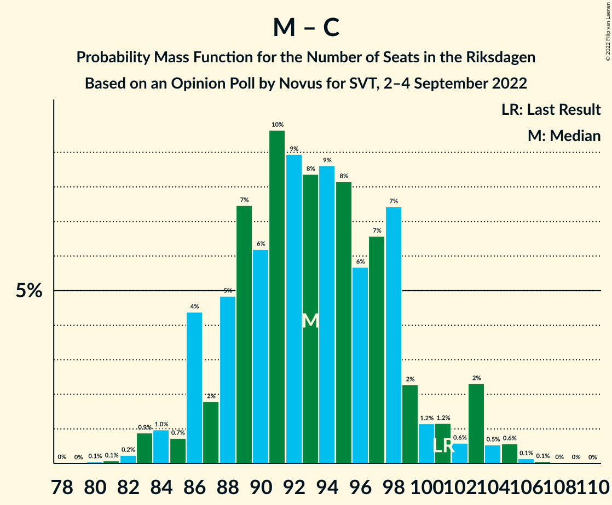

| Number of Seats | Probability | Accumulated | Special Marks |
|:---------------:|:-----------:|:-----------:|:-------------:|
| 79 | 0% | 100% |  |
| 80 | 0.1% | 99.9% |  |
| 81 | 0.1% | 99.9% |  |
| 82 | 0.2% | 99.8% |  |
| 83 | 0.9% | 99.6% |  |
| 84 | 1.0% | 98.7% |  |
| 85 | 0.7% | 98% |  |
| 86 | 4% | 97% |  |
| 87 | 2% | 93% |  |
| 88 | 5% | 91% |  |
| 89 | 7% | 86% |  |
| 90 | 6% | 79% |  |
| 91 | 10% | 72% |  |
| 92 | 9% | 63% |  |
| 93 | 8% | 54% | Median |
| 94 | 9% | 45% |  |
| 95 | 8% | 37% |  |
| 96 | 6% | 29% |  |
| 97 | 7% | 23% |  |
| 98 | 7% | 16% |  |
| 99 | 2% | 9% |  |
| 100 | 1.2% | 7% |  |
| 101 | 1.2% | 5% | Last Result |
| 102 | 0.6% | 4% |  |
| 103 | 2% | 4% |  |
| 104 | 0.5% | 1.4% |  |
| 105 | 0.6% | 0.9% |  |
| 106 | 0.1% | 0.3% |  |
| 107 | 0.1% | 0.1% |  |
| 108 | 0% | 0.1% |  |
| 109 | 0% | 0.1% |  |
| 110 | 0% | 0% |  |

### Moderata samlingspartiet – Kristdemokraterna

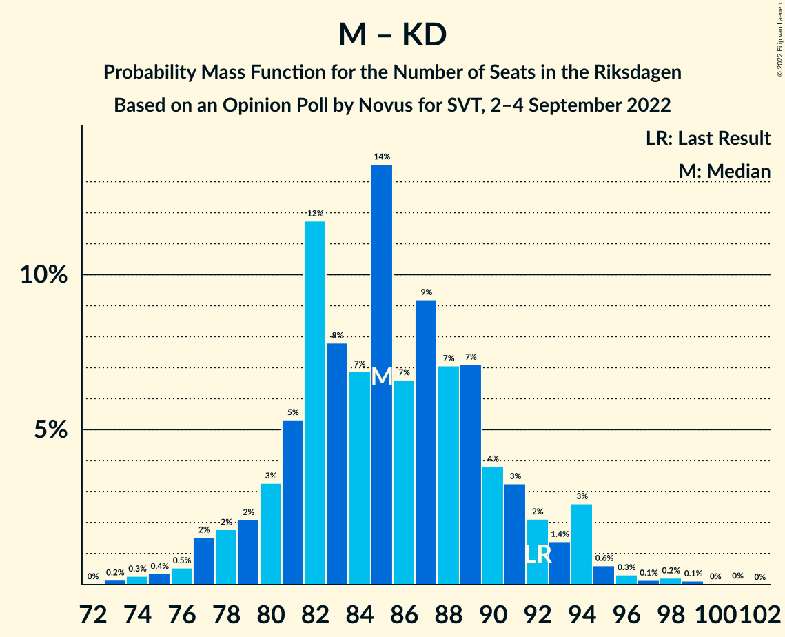

| Number of Seats | Probability | Accumulated | Special Marks |
|:---------------:|:-----------:|:-----------:|:-------------:|
| 72 | 0% | 100% |  |
| 73 | 0.2% | 99.9% |  |
| 74 | 0.3% | 99.8% |  |
| 75 | 0.4% | 99.5% |  |
| 76 | 0.5% | 99.2% |  |
| 77 | 2% | 98.6% |  |
| 78 | 2% | 97% |  |
| 79 | 2% | 95% |  |
| 80 | 3% | 93% |  |
| 81 | 5% | 90% |  |
| 82 | 12% | 85% |  |
| 83 | 8% | 73% |  |
| 84 | 7% | 65% |  |
| 85 | 14% | 58% |  |
| 86 | 7% | 45% | Median |
| 87 | 9% | 38% |  |
| 88 | 7% | 29% |  |
| 89 | 7% | 22% |  |
| 90 | 4% | 15% |  |
| 91 | 3% | 11% |  |
| 92 | 2% | 8% | Last Result |
| 93 | 1.4% | 5% |  |
| 94 | 3% | 4% |  |
| 95 | 0.6% | 1.5% |  |
| 96 | 0.3% | 0.9% |  |
| 97 | 0.1% | 0.6% |  |
| 98 | 0.2% | 0.4% |  |
| 99 | 0.1% | 0.2% |  |
| 100 | 0% | 0.1% |  |
| 101 | 0% | 0.1% |  |
| 102 | 0% | 0% |  |

## Technical Information

### Opinion Poll

+ **Polling firm:** Novus
+ **Commissioner(s):** SVT
+ **Fieldwork period:** 2–4 September 2022

### Calculations

+ **Sample size:** 1500
+ **Simulations done:** 1,048,576
+ **Error estimate:** 1.25%

