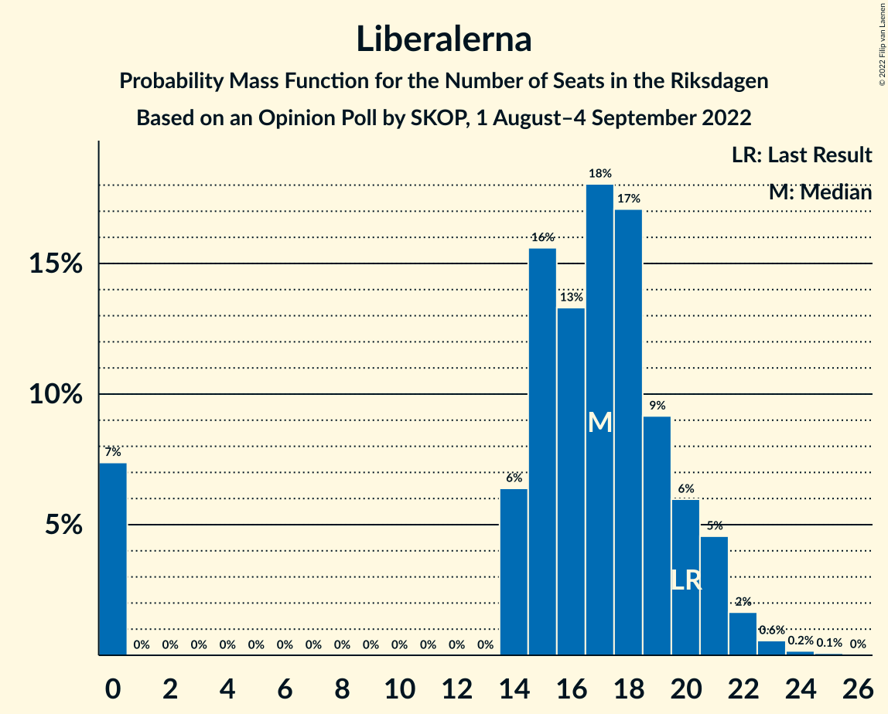

# Opinion Poll by SKOP, 1 August–4 September 2022

<a href="#voting-intentions">Voting Intentions</a> | <a href="#seats">Seats</a> | <a href="#coalitions">Coalitions</a> | <a href="#technical-information">Technical Information</a>

## Voting Intentions

### Confidence Intervals

| Party | Last Result | Poll Result | 80% Confidence Interval | 90% Confidence Interval | 95% Confidence Interval | 99% Confidence Interval |
|:-----:|:-----------:|:-----------:|:-----------------------:|:-----------------------:|:-----------------------:|:-----------------------:|
| Sveriges socialdemokratiska arbetareparti | 28.3% | 30.0% | 28.3–31.8% |27.8–32.3% |27.4–32.7% |26.6–33.6% |
| Sverigedemokraterna | 17.5% | 18.8% | 17.4–20.3% |17.0–20.8% |16.6–21.2% |16.0–21.9% |
| Moderata samlingspartiet | 19.8% | 17.6% | 16.2–19.1% |15.8–19.5% |15.5–19.9% |14.9–20.6% |
| Miljöpartiet de gröna | 4.4% | 7.8% | 6.9–8.9% |6.6–9.2% |6.4–9.5% |6.0–10.1% |
| Centerpartiet | 8.6% | 7.5% | 6.5–8.5% |6.3–8.9% |6.1–9.1% |5.7–9.7% |
| Vänsterpartiet | 8.0% | 7.2% | 6.3–8.3% |6.1–8.6% |5.8–8.8% |5.4–9.4% |
| Kristdemokraterna | 6.3% | 5.9% | 5.1–6.9% |4.9–7.2% |4.7–7.4% |4.3–7.9% |
| Liberalerna | 5.5% | 4.8% | 4.0–5.7% |3.8–5.9% |3.7–6.2% |3.4–6.6% |

*Note:* The poll result column reflects the actual value used in the calculations. Published results may vary slightly, and in addition be rounded to fewer digits.

## Seats

### Confidence Intervals

| Party | Last Result | Median | 80% Confidence Interval | 90% Confidence Interval | 95% Confidence Interval | 99% Confidence Interval |
|:-----:|:-----------:|:------:|:-----------------------:|:-----------------------:|:-----------------------:|:-----------------------:|
| <a href="#sveriges-socialdemokratiska-arbetareparti">Sveriges socialdemokratiska arbetareparti</a> | 100 | 106 | 99–112 |97–113 |96–115 |93–119 |
| <a href="#sverigedemokraterna">Sverigedemokraterna</a> | 62 | 66 | 61–71 |59–73 |58–74 |56–78 |
| <a href="#moderata-samlingspartiet">Moderata samlingspartiet</a> | 70 | 61 | 56–66 |55–68 |54–70 |52–73 |
| <a href="#miljöpartiet-de-gröna">Miljöpartiet de gröna</a> | 16 | 27 | 24–32 |23–32 |22–33 |21–35 |
| <a href="#centerpartiet">Centerpartiet</a> | 31 | 26 | 23–30 |22–31 |21–32 |20–35 |
| <a href="#vänsterpartiet">Vänsterpartiet</a> | 28 | 26 | 22–29 |21–30 |20–31 |19–33 |
| <a href="#kristdemokraterna">Kristdemokraterna</a> | 22 | 21 | 18–24 |17–25 |16–26 |15–28 |
| <a href="#liberalerna">Liberalerna</a> | 20 | 17 | 14–20 |0–21 |0–21 |0–23 |

### Sveriges socialdemokratiska arbetareparti

*For a full overview of the results for this party, see the [Sveriges socialdemokratiska arbetareparti](party-sverigessocialdemokratiskaarbetareparti.html) page.*

| Number of Seats | Probability | Accumulated | Special Marks |
|:---------------:|:-----------:|:-----------:|:-------------:|
| 90 | 0.1% | 100% |  |
| 91 | 0.1% | 99.9% |  |
| 92 | 0.1% | 99.8% |  |
| 93 | 0.5% | 99.7% |  |
| 94 | 0.8% | 99.2% |  |
| 95 | 0.4% | 98% |  |
| 96 | 2% | 98% |  |
| 97 | 3% | 96% |  |
| 98 | 0.9% | 93% |  |
| 99 | 4% | 92% |  |
| 100 | 5% | 89% | Last Result |
| 101 | 6% | 84% |  |
| 102 | 4% | 78% |  |
| 103 | 10% | 74% |  |
| 104 | 7% | 64% |  |
| 105 | 6% | 57% |  |
| 106 | 8% | 51% | Median |
| 107 | 10% | 43% |  |
| 108 | 3% | 34% |  |
| 109 | 10% | 31% |  |
| 110 | 7% | 20% |  |
| 111 | 3% | 13% |  |
| 112 | 4% | 11% |  |
| 113 | 2% | 6% |  |
| 114 | 0.8% | 4% |  |
| 115 | 1.3% | 3% |  |
| 116 | 0.6% | 2% |  |
| 117 | 0.2% | 1.0% |  |
| 118 | 0.2% | 0.7% |  |
| 119 | 0.2% | 0.5% |  |
| 120 | 0.1% | 0.3% |  |
| 121 | 0.1% | 0.3% |  |
| 122 | 0.1% | 0.2% |  |
| 123 | 0% | 0.1% |  |
| 124 | 0% | 0% |  |

### Sverigedemokraterna

*For a full overview of the results for this party, see the [Sverigedemokraterna](party-sverigedemokraterna.html) page.*

| Number of Seats | Probability | Accumulated | Special Marks |
|:---------------:|:-----------:|:-----------:|:-------------:|
| 53 | 0% | 100% |  |
| 54 | 0.1% | 99.9% |  |
| 55 | 0.1% | 99.8% |  |
| 56 | 0.5% | 99.7% |  |
| 57 | 0.7% | 99.2% |  |
| 58 | 1.2% | 98.5% |  |
| 59 | 3% | 97% |  |
| 60 | 2% | 95% |  |
| 61 | 6% | 92% |  |
| 62 | 6% | 86% | Last Result |
| 63 | 6% | 80% |  |
| 64 | 14% | 73% |  |
| 65 | 6% | 59% |  |
| 66 | 11% | 53% | Median |
| 67 | 11% | 43% |  |
| 68 | 8% | 32% |  |
| 69 | 7% | 24% |  |
| 70 | 6% | 17% |  |
| 71 | 4% | 11% |  |
| 72 | 2% | 8% |  |
| 73 | 2% | 6% |  |
| 74 | 1.4% | 3% |  |
| 75 | 0.7% | 2% |  |
| 76 | 0.7% | 1.4% |  |
| 77 | 0.2% | 0.7% |  |
| 78 | 0.3% | 0.5% |  |
| 79 | 0.1% | 0.2% |  |
| 80 | 0.1% | 0.1% |  |
| 81 | 0% | 0.1% |  |
| 82 | 0% | 0% |  |

### Moderata samlingspartiet

*For a full overview of the results for this party, see the [Moderata samlingspartiet](party-moderatasamlingspartiet.html) page.*

| Number of Seats | Probability | Accumulated | Special Marks |
|:---------------:|:-----------:|:-----------:|:-------------:|
| 49 | 0% | 100% |  |
| 50 | 0.1% | 99.9% |  |
| 51 | 0.1% | 99.9% |  |
| 52 | 0.5% | 99.7% |  |
| 53 | 0.9% | 99.2% |  |
| 54 | 1.1% | 98% |  |
| 55 | 3% | 97% |  |
| 56 | 6% | 94% |  |
| 57 | 4% | 88% |  |
| 58 | 11% | 84% |  |
| 59 | 7% | 73% |  |
| 60 | 8% | 66% |  |
| 61 | 12% | 58% | Median |
| 62 | 11% | 46% |  |
| 63 | 7% | 36% |  |
| 64 | 7% | 28% |  |
| 65 | 7% | 21% |  |
| 66 | 4% | 14% |  |
| 67 | 3% | 10% |  |
| 68 | 3% | 7% |  |
| 69 | 2% | 4% |  |
| 70 | 1.3% | 3% | Last Result |
| 71 | 0.7% | 2% |  |
| 72 | 0.3% | 0.9% |  |
| 73 | 0.3% | 0.5% |  |
| 74 | 0.1% | 0.3% |  |
| 75 | 0.1% | 0.2% |  |
| 76 | 0% | 0.1% |  |
| 77 | 0% | 0% |  |

### Miljöpartiet de gröna

*For a full overview of the results for this party, see the [Miljöpartiet de gröna](party-miljöpartietdegröna.html) page.*

| Number of Seats | Probability | Accumulated | Special Marks |
|:---------------:|:-----------:|:-----------:|:-------------:|
| 16 | 0% | 100% | Last Result |
| 17 | 0% | 100% |  |
| 18 | 0% | 100% |  |
| 19 | 0% | 100% |  |
| 20 | 0.2% | 99.9% |  |
| 21 | 0.6% | 99.7% |  |
| 22 | 2% | 99.1% |  |
| 23 | 4% | 97% |  |
| 24 | 8% | 94% |  |
| 25 | 10% | 86% |  |
| 26 | 14% | 76% |  |
| 27 | 12% | 62% | Median |
| 28 | 13% | 49% |  |
| 29 | 8% | 36% |  |
| 30 | 11% | 28% |  |
| 31 | 6% | 17% |  |
| 32 | 7% | 11% |  |
| 33 | 3% | 5% |  |
| 34 | 0.8% | 2% |  |
| 35 | 0.5% | 0.9% |  |
| 36 | 0.2% | 0.4% |  |
| 37 | 0.1% | 0.2% |  |
| 38 | 0% | 0.1% |  |
| 39 | 0% | 0% |  |

### Centerpartiet

*For a full overview of the results for this party, see the [Centerpartiet](party-centerpartiet.html) page.*

| Number of Seats | Probability | Accumulated | Special Marks |
|:---------------:|:-----------:|:-----------:|:-------------:|
| 18 | 0.1% | 100% |  |
| 19 | 0.2% | 99.9% |  |
| 20 | 0.9% | 99.7% |  |
| 21 | 2% | 98.8% |  |
| 22 | 4% | 97% |  |
| 23 | 5% | 92% |  |
| 24 | 12% | 87% |  |
| 25 | 11% | 76% |  |
| 26 | 16% | 65% | Median |
| 27 | 14% | 49% |  |
| 28 | 14% | 35% |  |
| 29 | 8% | 21% |  |
| 30 | 6% | 13% |  |
| 31 | 3% | 7% | Last Result |
| 32 | 3% | 4% |  |
| 33 | 1.0% | 2% |  |
| 34 | 0.2% | 0.7% |  |
| 35 | 0.4% | 0.5% |  |
| 36 | 0.1% | 0.1% |  |
| 37 | 0% | 0.1% |  |
| 38 | 0% | 0% |  |

### Vänsterpartiet

*For a full overview of the results for this party, see the [Vänsterpartiet](party-vänsterpartiet.html) page.*

| Number of Seats | Probability | Accumulated | Special Marks |
|:---------------:|:-----------:|:-----------:|:-------------:|
| 17 | 0% | 100% |  |
| 18 | 0.3% | 99.9% |  |
| 19 | 0.8% | 99.7% |  |
| 20 | 2% | 98.9% |  |
| 21 | 4% | 97% |  |
| 22 | 5% | 94% |  |
| 23 | 10% | 88% |  |
| 24 | 12% | 78% |  |
| 25 | 14% | 66% |  |
| 26 | 17% | 52% | Median |
| 27 | 12% | 35% |  |
| 28 | 12% | 23% | Last Result |
| 29 | 5% | 11% |  |
| 30 | 3% | 6% |  |
| 31 | 2% | 4% |  |
| 32 | 0.8% | 2% |  |
| 33 | 0.5% | 0.8% |  |
| 34 | 0.2% | 0.3% |  |
| 35 | 0.1% | 0.1% |  |
| 36 | 0% | 0% |  |

### Kristdemokraterna

*For a full overview of the results for this party, see the [Kristdemokraterna](party-kristdemokraterna.html) page.*

| Number of Seats | Probability | Accumulated | Special Marks |
|:---------------:|:-----------:|:-----------:|:-------------:|
| 0 | 0.1% | 100% |  |
| 1 | 0% | 99.9% |  |
| 2 | 0% | 99.9% |  |
| 3 | 0% | 99.9% |  |
| 4 | 0% | 99.9% |  |
| 5 | 0% | 99.9% |  |
| 6 | 0% | 99.9% |  |
| 7 | 0% | 99.9% |  |
| 8 | 0% | 99.9% |  |
| 9 | 0% | 99.9% |  |
| 10 | 0% | 99.9% |  |
| 11 | 0% | 99.9% |  |
| 12 | 0% | 99.9% |  |
| 13 | 0% | 99.9% |  |
| 14 | 0.1% | 99.9% |  |
| 15 | 0.8% | 99.8% |  |
| 16 | 2% | 99.0% |  |
| 17 | 5% | 97% |  |
| 18 | 9% | 92% |  |
| 19 | 17% | 83% |  |
| 20 | 13% | 66% |  |
| 21 | 15% | 53% | Median |
| 22 | 16% | 38% | Last Result |
| 23 | 8% | 22% |  |
| 24 | 7% | 14% |  |
| 25 | 4% | 7% |  |
| 26 | 2% | 4% |  |
| 27 | 0.9% | 2% |  |
| 28 | 0.4% | 0.6% |  |
| 29 | 0.2% | 0.2% |  |
| 30 | 0.1% | 0.1% |  |
| 31 | 0% | 0% |  |

### Liberalerna

*For a full overview of the results for this party, see the [Liberalerna](party-liberalerna.html) page.*

| Number of Seats | Probability | Accumulated | Special Marks |
|:---------------:|:-----------:|:-----------:|:-------------:|
| 0 | 7% | 100% |  |
| 1 | 0% | 93% |  |
| 2 | 0% | 93% |  |
| 3 | 0% | 93% |  |
| 4 | 0% | 93% |  |
| 5 | 0% | 93% |  |
| 6 | 0% | 93% |  |
| 7 | 0% | 93% |  |
| 8 | 0% | 93% |  |
| 9 | 0% | 93% |  |
| 10 | 0% | 93% |  |
| 11 | 0% | 93% |  |
| 12 | 0% | 93% |  |
| 13 | 0% | 93% |  |
| 14 | 6% | 93% |  |
| 15 | 16% | 86% |  |
| 16 | 13% | 71% |  |
| 17 | 18% | 57% | Median |
| 18 | 17% | 39% |  |
| 19 | 9% | 22% |  |
| 20 | 6% | 13% | Last Result |
| 21 | 5% | 7% |  |
| 22 | 2% | 2% |  |
| 23 | 0.6% | 0.8% |  |
| 24 | 0.2% | 0.3% |  |
| 25 | 0.1% | 0.1% |  |
| 26 | 0% | 0% |  |

## Coalitions

### Confidence Intervals

| Coalition | Last Result | Median | Majority? | 80% Confidence Interval | 90% Confidence Interval | 95% Confidence Interval | 99% Confidence Interval |
|:---------:|:-----------:|:------:|:---------:|:-----------------------:|:-----------------------:|:-----------------------:|:-----------------------:|
| Sveriges socialdemokratiska arbetareparti – Miljöpartiet de gröna – Centerpartiet – Vänsterpartiet – Liberalerna | 195 | 202 | 100% | 194–207 | 191–208 | 189–210 | 185–213 |
| Sveriges socialdemokratiska arbetareparti – Moderata samlingspartiet – Centerpartiet | 201 | 193 | 100% | 186–200 | 184–203 | 183–205 | 179–210 |
| Sveriges socialdemokratiska arbetareparti – Miljöpartiet de gröna – Centerpartiet – Vänsterpartiet | 175 | 186 | 97% | 178–191 | 176–194 | 174–199 | 171–201 |
| Sveriges socialdemokratiska arbetareparti – Miljöpartiet de gröna – Centerpartiet – Liberalerna | 167 | 176 | 59% | 168–182 | 165–184 | 164–185 | 158–188 |
| Sveriges socialdemokratiska arbetareparti – Moderata samlingspartiet | 170 | 167 | 8% | 160–174 | 158–176 | 156–178 | 153–184 |
| Sverigedemokraterna – Moderata samlingspartiet – Kristdemokraterna – Liberalerna | 174 | 163 | 3% | 158–171 | 155–173 | 150–175 | 148–178 |
| Sveriges socialdemokratiska arbetareparti – Miljöpartiet de gröna – Centerpartiet | 147 | 160 | 0.6% | 152–166 | 150–168 | 148–171 | 145–175 |
| Sveriges socialdemokratiska arbetareparti – Miljöpartiet de gröna – Vänsterpartiet | 144 | 159 | 0.5% | 152–166 | 150–167 | 148–171 | 145–175 |
| Sverigedemokraterna – Moderata samlingspartiet – Kristdemokraterna | 154 | 147 | 0% | 142–155 | 141–158 | 139–160 | 136–164 |
| Sveriges socialdemokratiska arbetareparti – Miljöpartiet de gröna | 116 | 133 | 0% | 126–139 | 124–141 | 122–143 | 119–147 |
| Sveriges socialdemokratiska arbetareparti – Vänsterpartiet | 128 | 131 | 0% | 124–138 | 123–140 | 121–143 | 118–145 |
| Sverigedemokraterna – Moderata samlingspartiet | 132 | 126 | 0% | 122–134 | 120–137 | 118–139 | 115–143 |
| Moderata samlingspartiet – Centerpartiet – Kristdemokraterna – Liberalerna | 143 | 125 | 0% | 118–132 | 114–133 | 110–136 | 107–138 |
| Moderata samlingspartiet – Centerpartiet – Kristdemokraterna | 123 | 108 | 0% | 103–115 | 101–117 | 99–119 | 97–122 |
| Sveriges socialdemokratiska arbetareparti | 100 | 106 | 0% | 99–112 | 97–113 | 96–115 | 93–119 |
| Moderata samlingspartiet – Centerpartiet – Liberalerna | 121 | 104 | 0% | 97–110 | 93–112 | 89–113 | 85–118 |
| Moderata samlingspartiet – Kristdemokraterna – Liberalerna | 112 | 98 | 0% | 91–105 | 87–107 | 82–109 | 80–111 |
| Moderata samlingspartiet – Centerpartiet | 101 | 88 | 0% | 82–93 | 80–95 | 79–97 | 77–100 |
| Moderata samlingspartiet – Kristdemokraterna | 92 | 81 | 0% | 77–89 | 75–90 | 75–91 | 72–95 |

### Sveriges socialdemokratiska arbetareparti – Miljöpartiet de gröna – Centerpartiet – Vänsterpartiet – Liberalerna

| Number of Seats | Probability | Accumulated | Special Marks |
|:---------------:|:-----------:|:-----------:|:-------------:|
| 179 | 0% | 100% |  |
| 180 | 0% | 99.9% |  |
| 181 | 0% | 99.9% |  |
| 182 | 0.1% | 99.9% |  |
| 183 | 0.1% | 99.8% |  |
| 184 | 0.2% | 99.8% |  |
| 185 | 0.3% | 99.5% |  |
| 186 | 0.4% | 99.3% |  |
| 187 | 0.5% | 98.9% |  |
| 188 | 0.7% | 98% |  |
| 189 | 0.4% | 98% |  |
| 190 | 1.0% | 97% |  |
| 191 | 2% | 96% |  |
| 192 | 1.3% | 95% |  |
| 193 | 3% | 93% |  |
| 194 | 3% | 90% |  |
| 195 | 6% | 87% | Last Result |
| 196 | 3% | 81% |  |
| 197 | 6% | 78% |  |
| 198 | 5% | 72% |  |
| 199 | 4% | 68% |  |
| 200 | 4% | 64% |  |
| 201 | 4% | 60% |  |
| 202 | 9% | 55% | Median |
| 203 | 7% | 47% |  |
| 204 | 7% | 39% |  |
| 205 | 10% | 33% |  |
| 206 | 7% | 22% |  |
| 207 | 7% | 15% |  |
| 208 | 4% | 9% |  |
| 209 | 2% | 5% |  |
| 210 | 1.4% | 3% |  |
| 211 | 0.7% | 2% |  |
| 212 | 0.2% | 0.9% |  |
| 213 | 0.2% | 0.7% |  |
| 214 | 0.1% | 0.4% |  |
| 215 | 0.1% | 0.3% |  |
| 216 | 0.1% | 0.2% |  |
| 217 | 0% | 0.1% |  |
| 218 | 0% | 0.1% |  |
| 219 | 0% | 0% |  |

### Sveriges socialdemokratiska arbetareparti – Moderata samlingspartiet – Centerpartiet

| Number of Seats | Probability | Accumulated | Special Marks |
|:---------------:|:-----------:|:-----------:|:-------------:|
| 176 | 0% | 100% |  |
| 177 | 0% | 99.9% |  |
| 178 | 0.2% | 99.9% |  |
| 179 | 0.4% | 99.7% |  |
| 180 | 0.4% | 99.4% |  |
| 181 | 0.7% | 99.0% |  |
| 182 | 0.5% | 98% |  |
| 183 | 0.9% | 98% |  |
| 184 | 2% | 97% |  |
| 185 | 4% | 95% |  |
| 186 | 3% | 91% |  |
| 187 | 6% | 88% |  |
| 188 | 2% | 82% |  |
| 189 | 4% | 80% |  |
| 190 | 5% | 77% |  |
| 191 | 8% | 71% |  |
| 192 | 11% | 64% |  |
| 193 | 11% | 52% | Median |
| 194 | 3% | 41% |  |
| 195 | 6% | 38% |  |
| 196 | 3% | 32% |  |
| 197 | 7% | 29% |  |
| 198 | 4% | 23% |  |
| 199 | 7% | 19% |  |
| 200 | 3% | 11% |  |
| 201 | 2% | 8% | Last Result |
| 202 | 0.9% | 7% |  |
| 203 | 1.0% | 6% |  |
| 204 | 1.0% | 5% |  |
| 205 | 1.4% | 4% |  |
| 206 | 0.5% | 2% |  |
| 207 | 0.6% | 2% |  |
| 208 | 0.4% | 1.2% |  |
| 209 | 0.1% | 0.7% |  |
| 210 | 0.2% | 0.7% |  |
| 211 | 0.2% | 0.5% |  |
| 212 | 0.1% | 0.3% |  |
| 213 | 0.1% | 0.2% |  |
| 214 | 0% | 0.1% |  |
| 215 | 0% | 0.1% |  |
| 216 | 0% | 0% |  |

### Sveriges socialdemokratiska arbetareparti – Miljöpartiet de gröna – Centerpartiet – Vänsterpartiet

| Number of Seats | Probability | Accumulated | Special Marks |
|:---------------:|:-----------:|:-----------:|:-------------:|
| 167 | 0% | 100% |  |
| 168 | 0% | 99.9% |  |
| 169 | 0.1% | 99.9% |  |
| 170 | 0.2% | 99.8% |  |
| 171 | 0.2% | 99.6% |  |
| 172 | 0.4% | 99.4% |  |
| 173 | 0.6% | 99.0% |  |
| 174 | 2% | 98% |  |
| 175 | 2% | 97% | Last Result, Majority |
| 176 | 2% | 95% |  |
| 177 | 2% | 93% |  |
| 178 | 5% | 91% |  |
| 179 | 3% | 85% |  |
| 180 | 4% | 82% |  |
| 181 | 5% | 78% |  |
| 182 | 6% | 73% |  |
| 183 | 3% | 67% |  |
| 184 | 8% | 64% |  |
| 185 | 5% | 56% | Median |
| 186 | 7% | 51% |  |
| 187 | 13% | 44% |  |
| 188 | 5% | 31% |  |
| 189 | 5% | 26% |  |
| 190 | 6% | 21% |  |
| 191 | 6% | 15% |  |
| 192 | 2% | 9% |  |
| 193 | 0.9% | 7% |  |
| 194 | 2% | 6% |  |
| 195 | 0.6% | 5% |  |
| 196 | 0.3% | 4% |  |
| 197 | 0.3% | 4% |  |
| 198 | 0.9% | 3% |  |
| 199 | 1.3% | 3% |  |
| 200 | 0.3% | 1.3% |  |
| 201 | 0.5% | 0.9% |  |
| 202 | 0.1% | 0.5% |  |
| 203 | 0.3% | 0.4% |  |
| 204 | 0% | 0.1% |  |
| 205 | 0% | 0.1% |  |
| 206 | 0% | 0.1% |  |
| 207 | 0% | 0% |  |

### Sveriges socialdemokratiska arbetareparti – Miljöpartiet de gröna – Centerpartiet – Liberalerna

| Number of Seats | Probability | Accumulated | Special Marks |
|:---------------:|:-----------:|:-----------:|:-------------:|
| 152 | 0% | 100% |  |
| 153 | 0% | 99.9% |  |
| 154 | 0% | 99.9% |  |
| 155 | 0.1% | 99.9% |  |
| 156 | 0.1% | 99.8% |  |
| 157 | 0.1% | 99.7% |  |
| 158 | 0.2% | 99.6% |  |
| 159 | 0.2% | 99.5% |  |
| 160 | 0.2% | 99.3% |  |
| 161 | 0.6% | 99.0% |  |
| 162 | 0.3% | 98% |  |
| 163 | 0.5% | 98% |  |
| 164 | 1.2% | 98% |  |
| 165 | 1.5% | 96% |  |
| 166 | 1.3% | 95% |  |
| 167 | 2% | 94% | Last Result |
| 168 | 4% | 92% |  |
| 169 | 4% | 88% |  |
| 170 | 3% | 84% |  |
| 171 | 5% | 80% |  |
| 172 | 7% | 76% |  |
| 173 | 4% | 68% |  |
| 174 | 6% | 64% |  |
| 175 | 4% | 59% | Majority |
| 176 | 5% | 54% | Median |
| 177 | 5% | 49% |  |
| 178 | 13% | 43% |  |
| 179 | 3% | 31% |  |
| 180 | 7% | 27% |  |
| 181 | 4% | 20% |  |
| 182 | 8% | 17% |  |
| 183 | 3% | 9% |  |
| 184 | 3% | 6% |  |
| 185 | 0.8% | 3% |  |
| 186 | 0.9% | 2% |  |
| 187 | 0.6% | 1.2% |  |
| 188 | 0.2% | 0.6% |  |
| 189 | 0.2% | 0.4% |  |
| 190 | 0.1% | 0.2% |  |
| 191 | 0.1% | 0.1% |  |
| 192 | 0% | 0.1% |  |
| 193 | 0% | 0.1% |  |
| 194 | 0% | 0% |  |

### Sveriges socialdemokratiska arbetareparti – Moderata samlingspartiet

| Number of Seats | Probability | Accumulated | Special Marks |
|:---------------:|:-----------:|:-----------:|:-------------:|
| 149 | 0% | 100% |  |
| 150 | 0% | 99.9% |  |
| 151 | 0.1% | 99.9% |  |
| 152 | 0.2% | 99.8% |  |
| 153 | 0.2% | 99.7% |  |
| 154 | 0.5% | 99.4% |  |
| 155 | 0.7% | 99.0% |  |
| 156 | 0.8% | 98% |  |
| 157 | 0.9% | 97% |  |
| 158 | 2% | 96% |  |
| 159 | 3% | 94% |  |
| 160 | 4% | 92% |  |
| 161 | 6% | 88% |  |
| 162 | 5% | 83% |  |
| 163 | 4% | 78% |  |
| 164 | 12% | 74% |  |
| 165 | 6% | 63% |  |
| 166 | 6% | 56% |  |
| 167 | 6% | 50% | Median |
| 168 | 9% | 44% |  |
| 169 | 6% | 36% |  |
| 170 | 6% | 29% | Last Result |
| 171 | 4% | 23% |  |
| 172 | 4% | 19% |  |
| 173 | 4% | 15% |  |
| 174 | 3% | 10% |  |
| 175 | 2% | 8% | Majority |
| 176 | 1.2% | 6% |  |
| 177 | 1.3% | 5% |  |
| 178 | 0.8% | 3% |  |
| 179 | 0.8% | 2% |  |
| 180 | 0.6% | 2% |  |
| 181 | 0.2% | 1.1% |  |
| 182 | 0.2% | 0.9% |  |
| 183 | 0.2% | 0.7% |  |
| 184 | 0.2% | 0.5% |  |
| 185 | 0.1% | 0.3% |  |
| 186 | 0.1% | 0.2% |  |
| 187 | 0% | 0.2% |  |
| 188 | 0.1% | 0.1% |  |
| 189 | 0% | 0% |  |

### Sverigedemokraterna – Moderata samlingspartiet – Kristdemokraterna – Liberalerna

| Number of Seats | Probability | Accumulated | Special Marks |
|:---------------:|:-----------:|:-----------:|:-------------:|
| 143 | 0% | 100% |  |
| 144 | 0% | 99.9% |  |
| 145 | 0% | 99.9% |  |
| 146 | 0.3% | 99.9% |  |
| 147 | 0.1% | 99.6% |  |
| 148 | 0.5% | 99.5% |  |
| 149 | 0.3% | 99.1% |  |
| 150 | 1.3% | 98.7% |  |
| 151 | 0.9% | 97% |  |
| 152 | 0.3% | 97% |  |
| 153 | 0.3% | 96% |  |
| 154 | 0.6% | 96% |  |
| 155 | 2% | 95% |  |
| 156 | 0.9% | 94% |  |
| 157 | 2% | 93% |  |
| 158 | 6% | 91% |  |
| 159 | 6% | 85% |  |
| 160 | 5% | 79% |  |
| 161 | 5% | 74% |  |
| 162 | 13% | 69% |  |
| 163 | 7% | 56% |  |
| 164 | 5% | 49% |  |
| 165 | 8% | 44% | Median |
| 166 | 3% | 36% |  |
| 167 | 6% | 33% |  |
| 168 | 5% | 27% |  |
| 169 | 4% | 22% |  |
| 170 | 3% | 18% |  |
| 171 | 5% | 15% |  |
| 172 | 2% | 9% |  |
| 173 | 2% | 7% |  |
| 174 | 2% | 5% | Last Result |
| 175 | 2% | 3% | Majority |
| 176 | 0.6% | 2% |  |
| 177 | 0.4% | 1.0% |  |
| 178 | 0.2% | 0.6% |  |
| 179 | 0.2% | 0.4% |  |
| 180 | 0.1% | 0.2% |  |
| 181 | 0% | 0.1% |  |
| 182 | 0% | 0.1% |  |
| 183 | 0% | 0% |  |

### Sveriges socialdemokratiska arbetareparti – Miljöpartiet de gröna – Centerpartiet

| Number of Seats | Probability | Accumulated | Special Marks |
|:---------------:|:-----------:|:-----------:|:-------------:|
| 142 | 0% | 100% |  |
| 143 | 0.1% | 99.9% |  |
| 144 | 0.1% | 99.9% |  |
| 145 | 0.3% | 99.7% |  |
| 146 | 0.3% | 99.5% |  |
| 147 | 0.5% | 99.1% | Last Result |
| 148 | 1.5% | 98.6% |  |
| 149 | 1.4% | 97% |  |
| 150 | 2% | 96% |  |
| 151 | 3% | 94% |  |
| 152 | 4% | 91% |  |
| 153 | 2% | 87% |  |
| 154 | 4% | 84% |  |
| 155 | 4% | 80% |  |
| 156 | 3% | 76% |  |
| 157 | 5% | 73% |  |
| 158 | 7% | 68% |  |
| 159 | 8% | 61% | Median |
| 160 | 7% | 52% |  |
| 161 | 8% | 45% |  |
| 162 | 4% | 38% |  |
| 163 | 10% | 34% |  |
| 164 | 8% | 24% |  |
| 165 | 6% | 16% |  |
| 166 | 2% | 10% |  |
| 167 | 2% | 8% |  |
| 168 | 2% | 7% |  |
| 169 | 0.9% | 4% |  |
| 170 | 0.9% | 3% |  |
| 171 | 0.6% | 3% |  |
| 172 | 0.8% | 2% |  |
| 173 | 0.4% | 1.1% |  |
| 174 | 0.1% | 0.7% |  |
| 175 | 0.2% | 0.6% | Majority |
| 176 | 0.1% | 0.4% |  |
| 177 | 0.2% | 0.3% |  |
| 178 | 0.1% | 0.1% |  |
| 179 | 0% | 0.1% |  |
| 180 | 0% | 0.1% |  |
| 181 | 0% | 0% |  |

### Sveriges socialdemokratiska arbetareparti – Miljöpartiet de gröna – Vänsterpartiet

| Number of Seats | Probability | Accumulated | Special Marks |
|:---------------:|:-----------:|:-----------:|:-------------:|
| 141 | 0% | 100% |  |
| 142 | 0% | 99.9% |  |
| 143 | 0.1% | 99.9% |  |
| 144 | 0.1% | 99.7% | Last Result |
| 145 | 0.4% | 99.6% |  |
| 146 | 0.5% | 99.2% |  |
| 147 | 0.8% | 98.7% |  |
| 148 | 1.1% | 98% |  |
| 149 | 2% | 97% |  |
| 150 | 2% | 95% |  |
| 151 | 3% | 93% |  |
| 152 | 5% | 90% |  |
| 153 | 4% | 86% |  |
| 154 | 5% | 82% |  |
| 155 | 4% | 77% |  |
| 156 | 10% | 74% |  |
| 157 | 7% | 63% |  |
| 158 | 5% | 56% |  |
| 159 | 4% | 51% | Median |
| 160 | 8% | 47% |  |
| 161 | 13% | 39% |  |
| 162 | 6% | 26% |  |
| 163 | 3% | 21% |  |
| 164 | 5% | 18% |  |
| 165 | 3% | 13% |  |
| 166 | 2% | 11% |  |
| 167 | 3% | 8% |  |
| 168 | 1.0% | 5% |  |
| 169 | 0.9% | 4% |  |
| 170 | 0.4% | 3% |  |
| 171 | 0.3% | 3% |  |
| 172 | 1.0% | 2% |  |
| 173 | 0.5% | 1.3% |  |
| 174 | 0.2% | 0.8% |  |
| 175 | 0.2% | 0.5% | Majority |
| 176 | 0.1% | 0.3% |  |
| 177 | 0.1% | 0.2% |  |
| 178 | 0% | 0.1% |  |
| 179 | 0% | 0% |  |

### Sverigedemokraterna – Moderata samlingspartiet – Kristdemokraterna

| Number of Seats | Probability | Accumulated | Special Marks |
|:---------------:|:-----------:|:-----------:|:-------------:|
| 131 | 0% | 100% |  |
| 132 | 0% | 99.9% |  |
| 133 | 0.1% | 99.9% |  |
| 134 | 0.1% | 99.8% |  |
| 135 | 0.1% | 99.7% |  |
| 136 | 0.2% | 99.6% |  |
| 137 | 0.2% | 99.3% |  |
| 138 | 0.7% | 99.1% |  |
| 139 | 1.4% | 98% |  |
| 140 | 2% | 97% |  |
| 141 | 4% | 95% |  |
| 142 | 7% | 91% |  |
| 143 | 7% | 85% |  |
| 144 | 10% | 78% |  |
| 145 | 7% | 67% |  |
| 146 | 7% | 61% |  |
| 147 | 9% | 53% |  |
| 148 | 4% | 45% | Median |
| 149 | 4% | 40% |  |
| 150 | 4% | 36% |  |
| 151 | 5% | 32% |  |
| 152 | 6% | 28% |  |
| 153 | 3% | 22% |  |
| 154 | 6% | 19% | Last Result |
| 155 | 3% | 13% |  |
| 156 | 3% | 10% |  |
| 157 | 1.3% | 7% |  |
| 158 | 2% | 5% |  |
| 159 | 1.0% | 4% |  |
| 160 | 0.4% | 3% |  |
| 161 | 0.7% | 2% |  |
| 162 | 0.5% | 2% |  |
| 163 | 0.4% | 1.1% |  |
| 164 | 0.3% | 0.7% |  |
| 165 | 0.2% | 0.5% |  |
| 166 | 0.1% | 0.2% |  |
| 167 | 0.1% | 0.2% |  |
| 168 | 0% | 0.1% |  |
| 169 | 0% | 0.1% |  |
| 170 | 0% | 0.1% |  |
| 171 | 0% | 0% |  |

### Sveriges socialdemokratiska arbetareparti – Miljöpartiet de gröna

| Number of Seats | Probability | Accumulated | Special Marks |
|:---------------:|:-----------:|:-----------:|:-------------:|
| 116 | 0% | 100% | Last Result |
| 117 | 0% | 100% |  |
| 118 | 0.2% | 99.9% |  |
| 119 | 0.3% | 99.7% |  |
| 120 | 0.4% | 99.4% |  |
| 121 | 0.5% | 99.0% |  |
| 122 | 1.2% | 98.5% |  |
| 123 | 2% | 97% |  |
| 124 | 2% | 96% |  |
| 125 | 2% | 94% |  |
| 126 | 4% | 91% |  |
| 127 | 4% | 87% |  |
| 128 | 3% | 84% |  |
| 129 | 4% | 80% |  |
| 130 | 5% | 76% |  |
| 131 | 5% | 71% |  |
| 132 | 7% | 66% |  |
| 133 | 11% | 59% | Median |
| 134 | 7% | 48% |  |
| 135 | 8% | 41% |  |
| 136 | 7% | 33% |  |
| 137 | 7% | 25% |  |
| 138 | 4% | 18% |  |
| 139 | 4% | 13% |  |
| 140 | 3% | 9% |  |
| 141 | 2% | 6% |  |
| 142 | 1.1% | 4% |  |
| 143 | 0.9% | 3% |  |
| 144 | 0.6% | 2% |  |
| 145 | 0.5% | 1.4% |  |
| 146 | 0.3% | 0.9% |  |
| 147 | 0.2% | 0.6% |  |
| 148 | 0.2% | 0.5% |  |
| 149 | 0.1% | 0.3% |  |
| 150 | 0.1% | 0.2% |  |
| 151 | 0.1% | 0.2% |  |
| 152 | 0% | 0.1% |  |
| 153 | 0% | 0% |  |

### Sveriges socialdemokratiska arbetareparti – Vänsterpartiet

| Number of Seats | Probability | Accumulated | Special Marks |
|:---------------:|:-----------:|:-----------:|:-------------:|
| 114 | 0% | 100% |  |
| 115 | 0% | 99.9% |  |
| 116 | 0.1% | 99.9% |  |
| 117 | 0.1% | 99.7% |  |
| 118 | 0.3% | 99.6% |  |
| 119 | 0.7% | 99.3% |  |
| 120 | 0.6% | 98.6% |  |
| 121 | 1.2% | 98% |  |
| 122 | 2% | 97% |  |
| 123 | 2% | 95% |  |
| 124 | 4% | 93% |  |
| 125 | 4% | 90% |  |
| 126 | 5% | 86% |  |
| 127 | 7% | 81% |  |
| 128 | 6% | 74% | Last Result |
| 129 | 8% | 68% |  |
| 130 | 9% | 60% |  |
| 131 | 8% | 51% |  |
| 132 | 4% | 43% | Median |
| 133 | 8% | 39% |  |
| 134 | 7% | 31% |  |
| 135 | 5% | 24% |  |
| 136 | 4% | 19% |  |
| 137 | 4% | 15% |  |
| 138 | 4% | 11% |  |
| 139 | 2% | 7% |  |
| 140 | 1.0% | 6% |  |
| 141 | 1.3% | 5% |  |
| 142 | 0.6% | 3% |  |
| 143 | 2% | 3% |  |
| 144 | 0.2% | 0.9% |  |
| 145 | 0.2% | 0.7% |  |
| 146 | 0.1% | 0.5% |  |
| 147 | 0.1% | 0.3% |  |
| 148 | 0.1% | 0.2% |  |
| 149 | 0% | 0.1% |  |
| 150 | 0% | 0.1% |  |
| 151 | 0% | 0% |  |

### Sverigedemokraterna – Moderata samlingspartiet

| Number of Seats | Probability | Accumulated | Special Marks |
|:---------------:|:-----------:|:-----------:|:-------------:|
| 111 | 0% | 100% |  |
| 112 | 0.1% | 99.9% |  |
| 113 | 0.1% | 99.9% |  |
| 114 | 0.2% | 99.8% |  |
| 115 | 0.2% | 99.6% |  |
| 116 | 0.5% | 99.4% |  |
| 117 | 0.8% | 99.0% |  |
| 118 | 1.1% | 98% |  |
| 119 | 2% | 97% |  |
| 120 | 2% | 96% |  |
| 121 | 3% | 94% |  |
| 122 | 8% | 91% |  |
| 123 | 7% | 83% |  |
| 124 | 8% | 77% |  |
| 125 | 9% | 69% |  |
| 126 | 12% | 60% |  |
| 127 | 5% | 48% | Median |
| 128 | 10% | 43% |  |
| 129 | 4% | 33% |  |
| 130 | 5% | 28% |  |
| 131 | 4% | 23% |  |
| 132 | 4% | 19% | Last Result |
| 133 | 3% | 15% |  |
| 134 | 2% | 12% |  |
| 135 | 2% | 9% |  |
| 136 | 2% | 7% |  |
| 137 | 1.1% | 5% |  |
| 138 | 1.1% | 4% |  |
| 139 | 0.8% | 3% |  |
| 140 | 0.9% | 2% |  |
| 141 | 0.5% | 1.3% |  |
| 142 | 0.2% | 0.7% |  |
| 143 | 0.2% | 0.6% |  |
| 144 | 0.2% | 0.4% |  |
| 145 | 0.1% | 0.3% |  |
| 146 | 0.1% | 0.1% |  |
| 147 | 0% | 0.1% |  |
| 148 | 0% | 0% |  |

### Moderata samlingspartiet – Centerpartiet – Kristdemokraterna – Liberalerna

| Number of Seats | Probability | Accumulated | Special Marks |
|:---------------:|:-----------:|:-----------:|:-------------:|
| 103 | 0.1% | 100% |  |
| 104 | 0.1% | 99.9% |  |
| 105 | 0.1% | 99.8% |  |
| 106 | 0.1% | 99.7% |  |
| 107 | 1.0% | 99.6% |  |
| 108 | 0.3% | 98.6% |  |
| 109 | 0.6% | 98% |  |
| 110 | 0.3% | 98% |  |
| 111 | 0.2% | 97% |  |
| 112 | 0.7% | 97% |  |
| 113 | 1.0% | 96% |  |
| 114 | 1.0% | 95% |  |
| 115 | 1.2% | 94% |  |
| 116 | 1.3% | 93% |  |
| 117 | 2% | 92% |  |
| 118 | 4% | 90% |  |
| 119 | 3% | 87% |  |
| 120 | 2% | 83% |  |
| 121 | 9% | 81% |  |
| 122 | 6% | 73% |  |
| 123 | 6% | 66% |  |
| 124 | 10% | 60% |  |
| 125 | 4% | 50% | Median |
| 126 | 10% | 46% |  |
| 127 | 4% | 36% |  |
| 128 | 7% | 32% |  |
| 129 | 4% | 24% |  |
| 130 | 5% | 20% |  |
| 131 | 4% | 15% |  |
| 132 | 3% | 11% |  |
| 133 | 3% | 8% |  |
| 134 | 1.1% | 5% |  |
| 135 | 1.4% | 4% |  |
| 136 | 0.8% | 3% |  |
| 137 | 0.8% | 2% |  |
| 138 | 0.4% | 0.9% |  |
| 139 | 0.1% | 0.5% |  |
| 140 | 0.2% | 0.4% |  |
| 141 | 0.1% | 0.1% |  |
| 142 | 0.1% | 0.1% |  |
| 143 | 0% | 0% | Last Result |

### Moderata samlingspartiet – Centerpartiet – Kristdemokraterna

| Number of Seats | Probability | Accumulated | Special Marks |
|:---------------:|:-----------:|:-----------:|:-------------:|
| 92 | 0% | 100% |  |
| 93 | 0% | 99.9% |  |
| 94 | 0.1% | 99.9% |  |
| 95 | 0.1% | 99.8% |  |
| 96 | 0.2% | 99.7% |  |
| 97 | 0.2% | 99.5% |  |
| 98 | 0.8% | 99.3% |  |
| 99 | 2% | 98.6% |  |
| 100 | 2% | 97% |  |
| 101 | 2% | 95% |  |
| 102 | 2% | 93% |  |
| 103 | 5% | 91% |  |
| 104 | 12% | 86% |  |
| 105 | 3% | 74% |  |
| 106 | 3% | 71% |  |
| 107 | 10% | 68% |  |
| 108 | 12% | 59% | Median |
| 109 | 6% | 46% |  |
| 110 | 6% | 41% |  |
| 111 | 5% | 34% |  |
| 112 | 7% | 30% |  |
| 113 | 7% | 22% |  |
| 114 | 5% | 16% |  |
| 115 | 2% | 11% |  |
| 116 | 2% | 9% |  |
| 117 | 2% | 7% |  |
| 118 | 2% | 4% |  |
| 119 | 0.7% | 3% |  |
| 120 | 0.5% | 2% |  |
| 121 | 0.6% | 1.4% |  |
| 122 | 0.3% | 0.8% |  |
| 123 | 0.2% | 0.5% | Last Result |
| 124 | 0.1% | 0.3% |  |
| 125 | 0.1% | 0.2% |  |
| 126 | 0.1% | 0.1% |  |
| 127 | 0% | 0.1% |  |
| 128 | 0% | 0% |  |

### Sveriges socialdemokratiska arbetareparti

| Number of Seats | Probability | Accumulated | Special Marks |
|:---------------:|:-----------:|:-----------:|:-------------:|
| 90 | 0.1% | 100% |  |
| 91 | 0.1% | 99.9% |  |
| 92 | 0.1% | 99.8% |  |
| 93 | 0.5% | 99.7% |  |
| 94 | 0.8% | 99.2% |  |
| 95 | 0.4% | 98% |  |
| 96 | 2% | 98% |  |
| 97 | 3% | 96% |  |
| 98 | 0.9% | 93% |  |
| 99 | 4% | 92% |  |
| 100 | 5% | 89% | Last Result |
| 101 | 6% | 84% |  |
| 102 | 4% | 78% |  |
| 103 | 10% | 74% |  |
| 104 | 7% | 64% |  |
| 105 | 6% | 57% |  |
| 106 | 8% | 51% | Median |
| 107 | 10% | 43% |  |
| 108 | 3% | 34% |  |
| 109 | 10% | 31% |  |
| 110 | 7% | 20% |  |
| 111 | 3% | 13% |  |
| 112 | 4% | 11% |  |
| 113 | 2% | 6% |  |
| 114 | 0.8% | 4% |  |
| 115 | 1.3% | 3% |  |
| 116 | 0.6% | 2% |  |
| 117 | 0.2% | 1.0% |  |
| 118 | 0.2% | 0.7% |  |
| 119 | 0.2% | 0.5% |  |
| 120 | 0.1% | 0.3% |  |
| 121 | 0.1% | 0.3% |  |
| 122 | 0.1% | 0.2% |  |
| 123 | 0% | 0.1% |  |
| 124 | 0% | 0% |  |

### Moderata samlingspartiet – Centerpartiet – Liberalerna

| Number of Seats | Probability | Accumulated | Special Marks |
|:---------------:|:-----------:|:-----------:|:-------------:|
| 81 | 0% | 100% |  |
| 82 | 0% | 99.9% |  |
| 83 | 0.1% | 99.9% |  |
| 84 | 0.2% | 99.8% |  |
| 85 | 0.2% | 99.6% |  |
| 86 | 0.2% | 99.4% |  |
| 87 | 0.6% | 99.2% |  |
| 88 | 1.0% | 98.5% |  |
| 89 | 0.4% | 98% |  |
| 90 | 0.7% | 97% |  |
| 91 | 0.3% | 96% |  |
| 92 | 0.6% | 96% |  |
| 93 | 0.9% | 95% |  |
| 94 | 1.2% | 95% |  |
| 95 | 1.0% | 93% |  |
| 96 | 2% | 92% |  |
| 97 | 2% | 90% |  |
| 98 | 2% | 89% |  |
| 99 | 4% | 87% |  |
| 100 | 5% | 82% |  |
| 101 | 5% | 77% |  |
| 102 | 8% | 72% |  |
| 103 | 7% | 64% |  |
| 104 | 9% | 57% | Median |
| 105 | 9% | 48% |  |
| 106 | 8% | 38% |  |
| 107 | 5% | 30% |  |
| 108 | 4% | 25% |  |
| 109 | 7% | 21% |  |
| 110 | 6% | 14% |  |
| 111 | 2% | 8% |  |
| 112 | 1.4% | 6% |  |
| 113 | 2% | 4% |  |
| 114 | 0.7% | 2% |  |
| 115 | 0.6% | 2% |  |
| 116 | 0.3% | 1.2% |  |
| 117 | 0.4% | 0.9% |  |
| 118 | 0.3% | 0.5% |  |
| 119 | 0.1% | 0.2% |  |
| 120 | 0% | 0.1% |  |
| 121 | 0% | 0.1% | Last Result |
| 122 | 0% | 0% |  |

### Moderata samlingspartiet – Kristdemokraterna – Liberalerna

| Number of Seats | Probability | Accumulated | Special Marks |
|:---------------:|:-----------:|:-----------:|:-------------:|
| 76 | 0% | 100% |  |
| 77 | 0.1% | 99.9% |  |
| 78 | 0.1% | 99.8% |  |
| 79 | 0.1% | 99.7% |  |
| 80 | 1.1% | 99.6% |  |
| 81 | 0.8% | 98.5% |  |
| 82 | 0.3% | 98% |  |
| 83 | 0.3% | 97% |  |
| 84 | 0.4% | 97% |  |
| 85 | 1.0% | 97% |  |
| 86 | 0.5% | 96% |  |
| 87 | 0.5% | 95% |  |
| 88 | 0.5% | 95% |  |
| 89 | 0.6% | 94% |  |
| 90 | 0.7% | 94% |  |
| 91 | 3% | 93% |  |
| 92 | 4% | 90% |  |
| 93 | 3% | 86% |  |
| 94 | 3% | 83% |  |
| 95 | 6% | 80% |  |
| 96 | 13% | 74% |  |
| 97 | 7% | 61% |  |
| 98 | 6% | 54% |  |
| 99 | 6% | 47% | Median |
| 100 | 5% | 41% |  |
| 101 | 11% | 36% |  |
| 102 | 4% | 24% |  |
| 103 | 4% | 20% |  |
| 104 | 2% | 16% |  |
| 105 | 4% | 14% |  |
| 106 | 3% | 10% |  |
| 107 | 3% | 7% |  |
| 108 | 1.1% | 4% |  |
| 109 | 0.9% | 3% |  |
| 110 | 1.0% | 2% |  |
| 111 | 0.6% | 1.1% |  |
| 112 | 0.1% | 0.4% | Last Result |
| 113 | 0.1% | 0.3% |  |
| 114 | 0.1% | 0.1% |  |
| 115 | 0% | 0.1% |  |
| 116 | 0% | 0% |  |

### Moderata samlingspartiet – Centerpartiet

| Number of Seats | Probability | Accumulated | Special Marks |
|:---------------:|:-----------:|:-----------:|:-------------:|
| 74 | 0.1% | 100% |  |
| 75 | 0.1% | 99.9% |  |
| 76 | 0.1% | 99.8% |  |
| 77 | 0.7% | 99.7% |  |
| 78 | 0.8% | 98.9% |  |
| 79 | 1.1% | 98% |  |
| 80 | 2% | 97% |  |
| 81 | 3% | 95% |  |
| 82 | 4% | 92% |  |
| 83 | 6% | 89% |  |
| 84 | 7% | 83% |  |
| 85 | 7% | 77% |  |
| 86 | 7% | 70% |  |
| 87 | 9% | 63% | Median |
| 88 | 13% | 54% |  |
| 89 | 5% | 41% |  |
| 90 | 12% | 36% |  |
| 91 | 4% | 25% |  |
| 92 | 7% | 20% |  |
| 93 | 5% | 14% |  |
| 94 | 2% | 9% |  |
| 95 | 2% | 7% |  |
| 96 | 2% | 5% |  |
| 97 | 0.9% | 3% |  |
| 98 | 0.5% | 2% |  |
| 99 | 0.6% | 1.5% |  |
| 100 | 0.4% | 0.9% |  |
| 101 | 0.2% | 0.5% | Last Result |
| 102 | 0.1% | 0.3% |  |
| 103 | 0.1% | 0.2% |  |
| 104 | 0% | 0.1% |  |
| 105 | 0% | 0.1% |  |
| 106 | 0% | 0% |  |

### Moderata samlingspartiet – Kristdemokraterna

| Number of Seats | Probability | Accumulated | Special Marks |
|:---------------:|:-----------:|:-----------:|:-------------:|
| 65 | 0% | 100% |  |
| 66 | 0% | 99.9% |  |
| 67 | 0% | 99.9% |  |
| 68 | 0% | 99.9% |  |
| 69 | 0.1% | 99.9% |  |
| 70 | 0.1% | 99.8% |  |
| 71 | 0.1% | 99.7% |  |
| 72 | 0.4% | 99.5% |  |
| 73 | 0.5% | 99.1% |  |
| 74 | 0.8% | 98.6% |  |
| 75 | 3% | 98% |  |
| 76 | 5% | 95% |  |
| 77 | 5% | 90% |  |
| 78 | 8% | 85% |  |
| 79 | 9% | 77% |  |
| 80 | 12% | 68% |  |
| 81 | 8% | 56% |  |
| 82 | 6% | 48% | Median |
| 83 | 6% | 42% |  |
| 84 | 5% | 37% |  |
| 85 | 5% | 32% |  |
| 86 | 8% | 27% |  |
| 87 | 4% | 19% |  |
| 88 | 4% | 14% |  |
| 89 | 4% | 10% |  |
| 90 | 3% | 7% |  |
| 91 | 2% | 4% |  |
| 92 | 1.0% | 2% | Last Result |
| 93 | 0.7% | 1.5% |  |
| 94 | 0.2% | 0.8% |  |
| 95 | 0.3% | 0.7% |  |
| 96 | 0.2% | 0.4% |  |
| 97 | 0.1% | 0.2% |  |
| 98 | 0% | 0.1% |  |
| 99 | 0% | 0.1% |  |
| 100 | 0% | 0% |  |

## Technical Information

### Opinion Poll

+ **Polling firm:** SKOP
+ **Commissioner(s):** —
+ **Fieldwork period:** 1 August–4 September 2022

### Calculations

+ **Sample size:** 1154
+ **Simulations done:** 1,048,576
+ **Error estimate:** 1.34%

