# Opinion Poll by Sifo for Svenska Dagbladet, 2–4 September 2022

<a href="#voting-intentions">Voting Intentions</a> | <a href="#seats">Seats</a> | <a href="#coalitions">Coalitions</a> | <a href="#technical-information">Technical Information</a>

## Voting Intentions

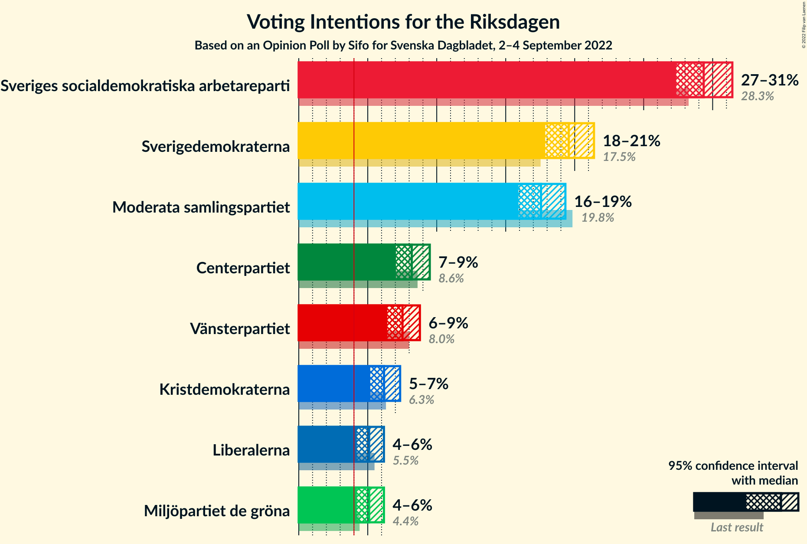

### Confidence Intervals

| Party | Last Result | Poll Result | 80% Confidence Interval | 90% Confidence Interval | 95% Confidence Interval | 99% Confidence Interval |
|:-----:|:-----------:|:-----------:|:-----------------------:|:-----------------------:|:-----------------------:|:-----------------------:|
| Sveriges socialdemokratiska arbetareparti | 28.3% | 29.4% | 28.0–30.7% |27.7–31.1% |27.4–31.4% |26.7–32.1% |
| Sverigedemokraterna | 17.5% | 19.6% | 18.4–20.8% |18.1–21.1% |17.9–21.4% |17.3–22.0% |
| Moderata samlingspartiet | 19.8% | 17.6% | 16.5–18.7% |16.2–19.0% |15.9–19.3% |15.4–19.9% |
| Centerpartiet | 8.6% | 8.2% | 7.4–9.0% |7.2–9.3% |7.0–9.5% |6.7–9.9% |
| Vänsterpartiet | 8.0% | 7.5% | 6.8–8.4% |6.6–8.6% |6.4–8.8% |6.1–9.2% |
| Kristdemokraterna | 6.3% | 6.2% | 5.5–7.0% |5.3–7.2% |5.2–7.3% |4.9–7.7% |
| Liberalerna | 5.5% | 5.1% | 4.5–5.8% |4.3–6.0% |4.2–6.2% |3.9–6.5% |
| Miljöpartiet de gröna | 4.4% | 5.1% | 4.5–5.8% |4.3–6.0% |4.2–6.2% |3.9–6.5% |

*Note:* The poll result column reflects the actual value used in the calculations. Published results may vary slightly, and in addition be rounded to fewer digits.

## Seats

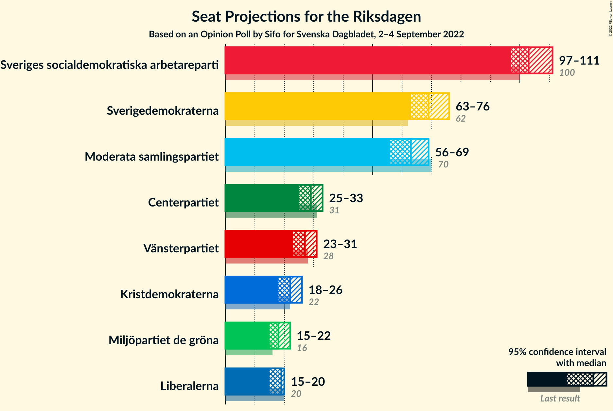

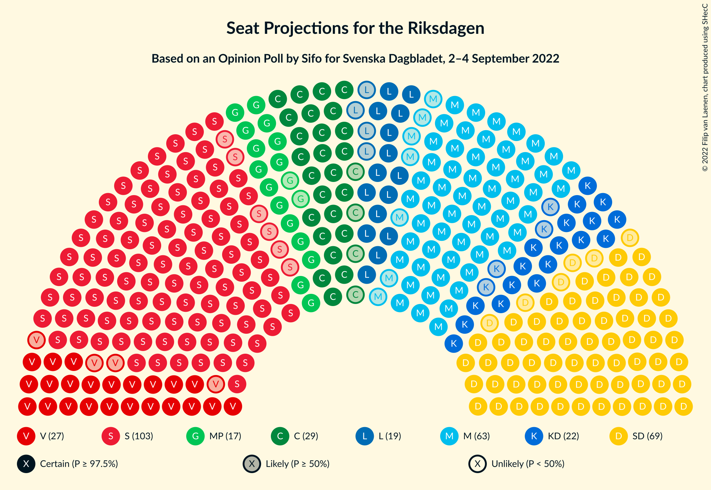

### Confidence Intervals

| Party | Last Result | Median | 80% Confidence Interval | 90% Confidence Interval | 95% Confidence Interval | 99% Confidence Interval |
|:-----:|:-----------:|:------:|:-----------------------:|:-----------------------:|:-----------------------:|:-----------------------:|
| <a href="#sveriges-socialdemokratiska-arbetareparti">Sveriges socialdemokratiska arbetareparti</a> | 100 | 103 | 99–108 |98–110 |97–111 |94–114 |
| <a href="#sverigedemokraterna">Sverigedemokraterna</a> | 62 | 69 | 65–74 |64–74 |63–76 |61–78 |
| <a href="#moderata-samlingspartiet">Moderata samlingspartiet</a> | 70 | 63 | 58–66 |58–67 |56–69 |54–70 |
| <a href="#centerpartiet">Centerpartiet</a> | 31 | 29 | 26–32 |25–33 |25–33 |24–35 |
| <a href="#vänsterpartiet">Vänsterpartiet</a> | 28 | 27 | 24–30 |23–30 |23–31 |22–33 |
| <a href="#kristdemokraterna">Kristdemokraterna</a> | 22 | 22 | 19–24 |19–25 |18–26 |17–27 |
| <a href="#liberalerna">Liberalerna</a> | 20 | 19 | 18–20 |18–20 |15–20 |0–21 |
| <a href="#miljöpartiet-de-gröna">Miljöpartiet de gröna</a> | 16 | 18 | 16–20 |15–21 |15–22 |0–23 |

### Sveriges socialdemokratiska arbetareparti

*For a full overview of the results for this party, see the [Sveriges socialdemokratiska arbetareparti](party-sverigessocialdemokratiskaarbetareparti.html) page.*

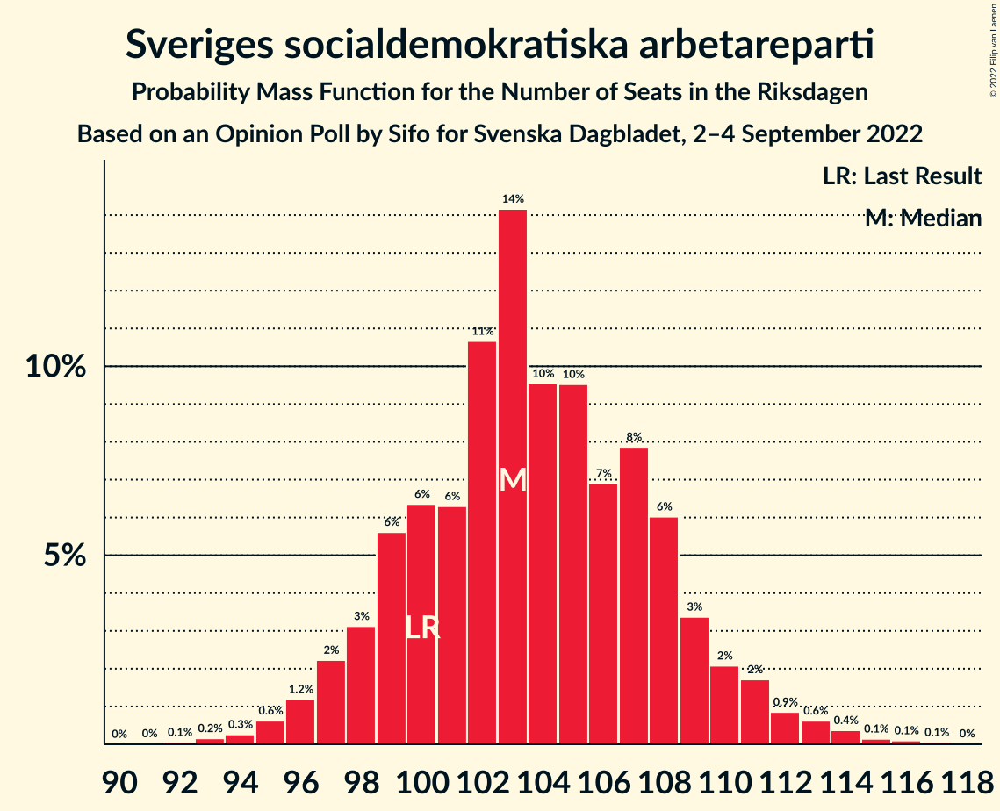

| Number of Seats | Probability | Accumulated | Special Marks |
|:---------------:|:-----------:|:-----------:|:-------------:|
| 92 | 0.1% | 100% |  |
| 93 | 0.2% | 99.9% |  |
| 94 | 0.3% | 99.8% |  |
| 95 | 0.6% | 99.5% |  |
| 96 | 1.2% | 98.9% |  |
| 97 | 2% | 98% |  |
| 98 | 3% | 95% |  |
| 99 | 6% | 92% |  |
| 100 | 6% | 87% | Last Result |
| 101 | 6% | 80% |  |
| 102 | 11% | 74% |  |
| 103 | 14% | 63% | Median |
| 104 | 10% | 49% |  |
| 105 | 10% | 40% |  |
| 106 | 7% | 30% |  |
| 107 | 8% | 23% |  |
| 108 | 6% | 15% |  |
| 109 | 3% | 9% |  |
| 110 | 2% | 6% |  |
| 111 | 2% | 4% |  |
| 112 | 0.9% | 2% |  |
| 113 | 0.6% | 1.3% |  |
| 114 | 0.4% | 0.7% |  |
| 115 | 0.1% | 0.3% |  |
| 116 | 0.1% | 0.2% |  |
| 117 | 0.1% | 0.1% |  |
| 118 | 0% | 0% |  |

### Sverigedemokraterna

*For a full overview of the results for this party, see the [Sverigedemokraterna](party-sverigedemokraterna.html) page.*

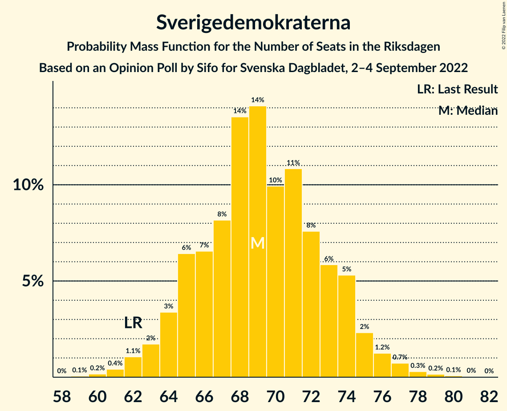

| Number of Seats | Probability | Accumulated | Special Marks |
|:---------------:|:-----------:|:-----------:|:-------------:|
| 59 | 0.1% | 100% |  |
| 60 | 0.2% | 99.9% |  |
| 61 | 0.4% | 99.7% |  |
| 62 | 1.1% | 99.3% | Last Result |
| 63 | 2% | 98% |  |
| 64 | 3% | 97% |  |
| 65 | 6% | 93% |  |
| 66 | 7% | 87% |  |
| 67 | 8% | 80% |  |
| 68 | 14% | 72% |  |
| 69 | 14% | 58% | Median |
| 70 | 10% | 44% |  |
| 71 | 11% | 34% |  |
| 72 | 8% | 24% |  |
| 73 | 6% | 16% |  |
| 74 | 5% | 10% |  |
| 75 | 2% | 5% |  |
| 76 | 1.2% | 3% |  |
| 77 | 0.7% | 1.3% |  |
| 78 | 0.3% | 0.6% |  |
| 79 | 0.2% | 0.3% |  |
| 80 | 0.1% | 0.1% |  |
| 81 | 0% | 0.1% |  |
| 82 | 0% | 0% |  |

### Moderata samlingspartiet

*For a full overview of the results for this party, see the [Moderata samlingspartiet](party-moderatasamlingspartiet.html) page.*

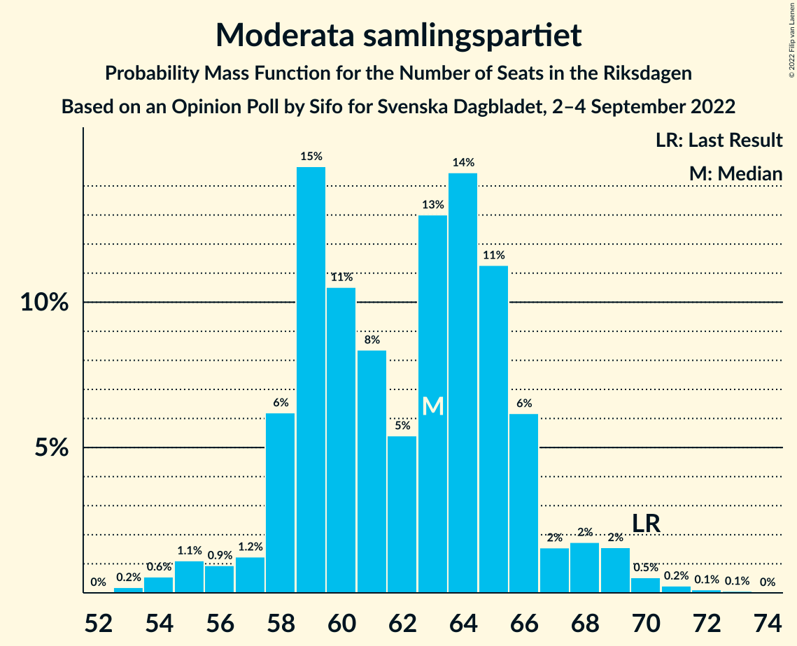

| Number of Seats | Probability | Accumulated | Special Marks |
|:---------------:|:-----------:|:-----------:|:-------------:|
| 53 | 0.2% | 100% |  |
| 54 | 0.6% | 99.8% |  |
| 55 | 1.1% | 99.2% |  |
| 56 | 0.9% | 98% |  |
| 57 | 1.2% | 97% |  |
| 58 | 6% | 96% |  |
| 59 | 15% | 90% |  |
| 60 | 11% | 75% |  |
| 61 | 8% | 65% |  |
| 62 | 5% | 56% |  |
| 63 | 13% | 51% | Median |
| 64 | 14% | 38% |  |
| 65 | 11% | 23% |  |
| 66 | 6% | 12% |  |
| 67 | 2% | 6% |  |
| 68 | 2% | 4% |  |
| 69 | 2% | 3% |  |
| 70 | 0.5% | 1.0% | Last Result |
| 71 | 0.2% | 0.5% |  |
| 72 | 0.1% | 0.2% |  |
| 73 | 0.1% | 0.1% |  |
| 74 | 0% | 0% |  |

### Centerpartiet

*For a full overview of the results for this party, see the [Centerpartiet](party-centerpartiet.html) page.*

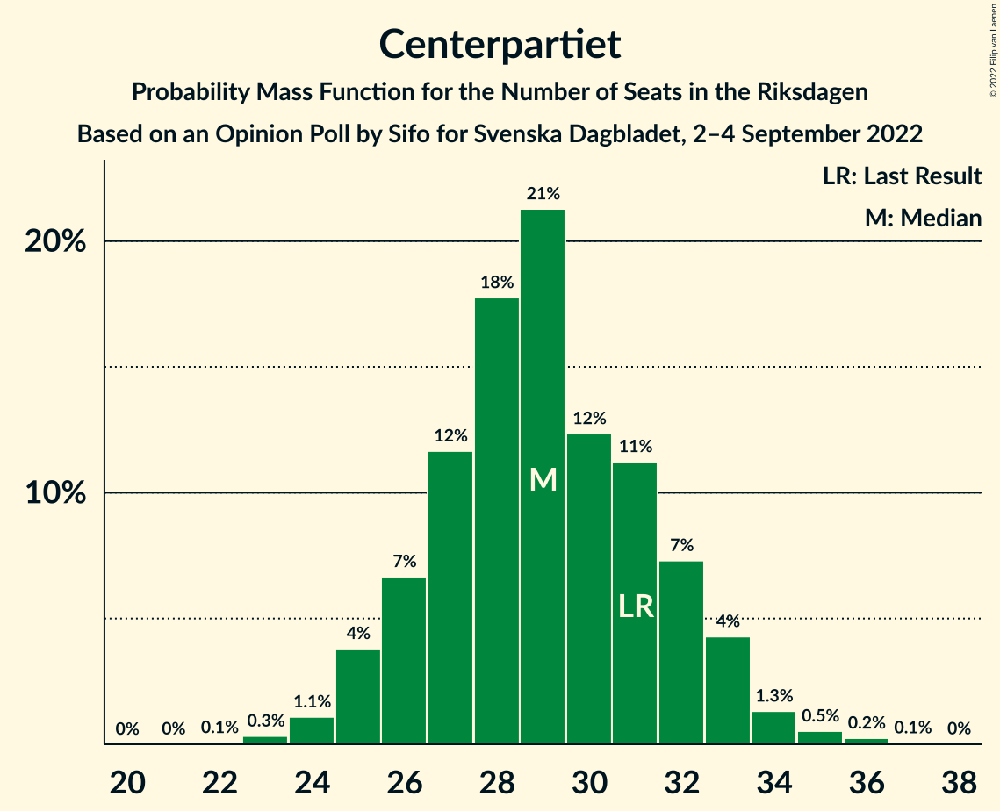

| Number of Seats | Probability | Accumulated | Special Marks |
|:---------------:|:-----------:|:-----------:|:-------------:|
| 22 | 0.1% | 100% |  |
| 23 | 0.3% | 99.9% |  |
| 24 | 1.1% | 99.6% |  |
| 25 | 4% | 98.5% |  |
| 26 | 7% | 95% |  |
| 27 | 12% | 88% |  |
| 28 | 18% | 76% |  |
| 29 | 21% | 59% | Median |
| 30 | 12% | 37% |  |
| 31 | 11% | 25% | Last Result |
| 32 | 7% | 14% |  |
| 33 | 4% | 6% |  |
| 34 | 1.3% | 2% |  |
| 35 | 0.5% | 0.9% |  |
| 36 | 0.2% | 0.3% |  |
| 37 | 0.1% | 0.1% |  |
| 38 | 0% | 0% |  |

### Vänsterpartiet

*For a full overview of the results for this party, see the [Vänsterpartiet](party-vänsterpartiet.html) page.*

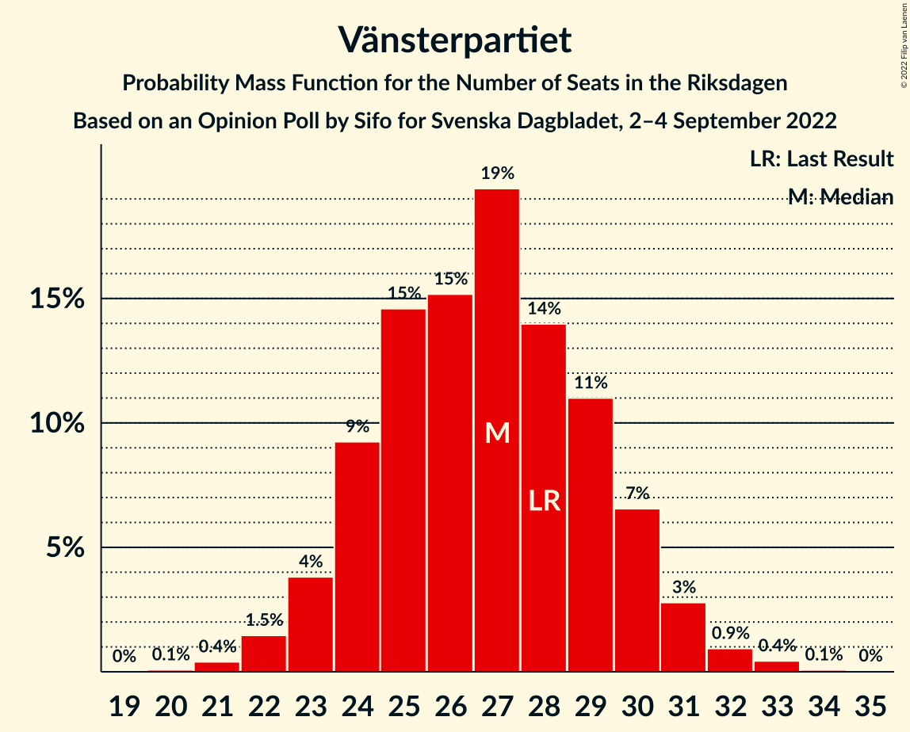

| Number of Seats | Probability | Accumulated | Special Marks |
|:---------------:|:-----------:|:-----------:|:-------------:|
| 20 | 0.1% | 100% |  |
| 21 | 0.4% | 99.9% |  |
| 22 | 1.5% | 99.5% |  |
| 23 | 4% | 98% |  |
| 24 | 9% | 94% |  |
| 25 | 15% | 85% |  |
| 26 | 15% | 70% |  |
| 27 | 19% | 55% | Median |
| 28 | 14% | 36% | Last Result |
| 29 | 11% | 22% |  |
| 30 | 7% | 11% |  |
| 31 | 3% | 4% |  |
| 32 | 0.9% | 1.5% |  |
| 33 | 0.4% | 0.5% |  |
| 34 | 0.1% | 0.1% |  |
| 35 | 0% | 0% |  |

### Kristdemokraterna

*For a full overview of the results for this party, see the [Kristdemokraterna](party-kristdemokraterna.html) page.*

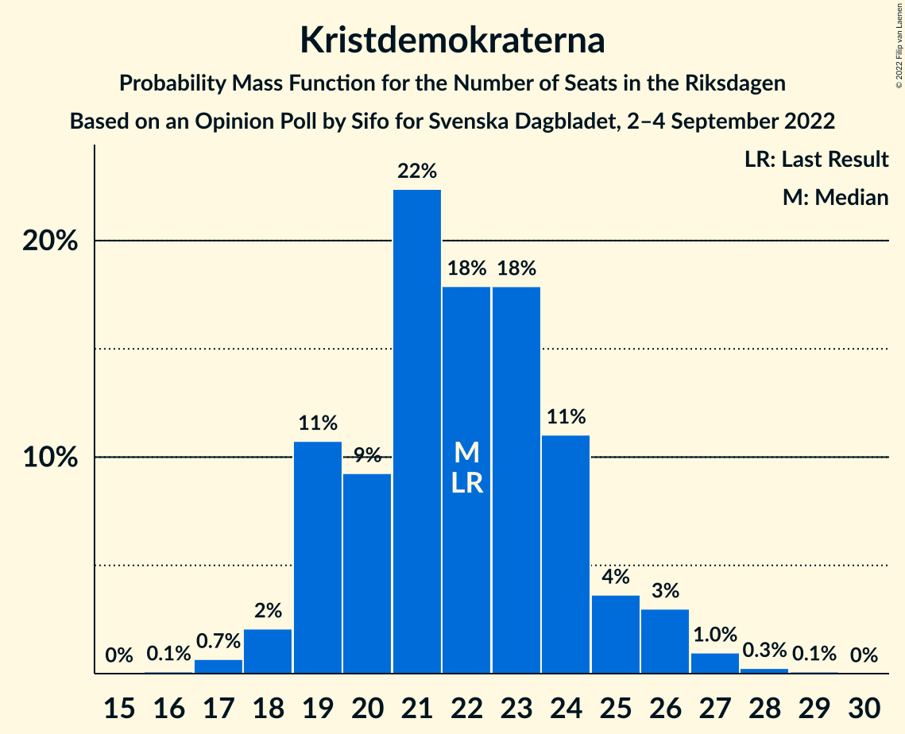

| Number of Seats | Probability | Accumulated | Special Marks |
|:---------------:|:-----------:|:-----------:|:-------------:|
| 16 | 0.1% | 100% |  |
| 17 | 0.7% | 99.9% |  |
| 18 | 2% | 99.2% |  |
| 19 | 11% | 97% |  |
| 20 | 9% | 86% |  |
| 21 | 22% | 77% |  |
| 22 | 18% | 55% | Last Result, Median |
| 23 | 18% | 37% |  |
| 24 | 11% | 19% |  |
| 25 | 4% | 8% |  |
| 26 | 3% | 4% |  |
| 27 | 1.0% | 1.3% |  |
| 28 | 0.3% | 0.4% |  |
| 29 | 0.1% | 0.1% |  |
| 30 | 0% | 0% |  |

### Liberalerna

*For a full overview of the results for this party, see the [Liberalerna](party-liberalerna.html) page.*

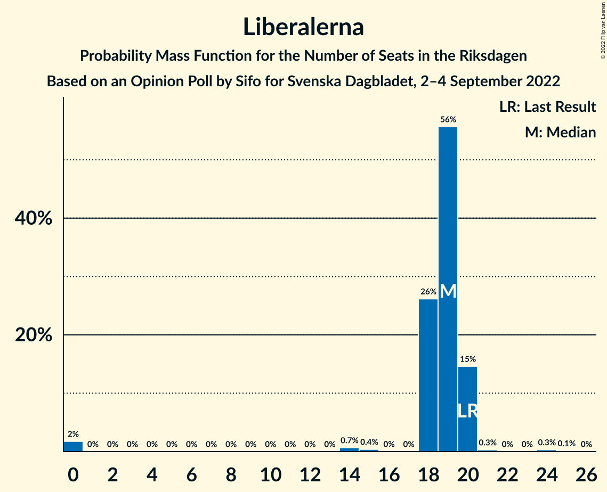

| Number of Seats | Probability | Accumulated | Special Marks |
|:---------------:|:-----------:|:-----------:|:-------------:|
| 0 | 2% | 100% |  |
| 1 | 0% | 98% |  |
| 2 | 0% | 98% |  |
| 3 | 0% | 98% |  |
| 4 | 0% | 98% |  |
| 5 | 0% | 98% |  |
| 6 | 0% | 98% |  |
| 7 | 0% | 98% |  |
| 8 | 0% | 98% |  |
| 9 | 0% | 98% |  |
| 10 | 0% | 98% |  |
| 11 | 0% | 98% |  |
| 12 | 0% | 98% |  |
| 13 | 0% | 98% |  |
| 14 | 0.7% | 98% |  |
| 15 | 0.4% | 98% |  |
| 16 | 0% | 97% |  |
| 17 | 0% | 97% |  |
| 18 | 26% | 97% |  |
| 19 | 56% | 71% | Median |
| 20 | 15% | 15% | Last Result |
| 21 | 0.3% | 0.7% |  |
| 22 | 0% | 0.5% |  |
| 23 | 0% | 0.5% |  |
| 24 | 0.3% | 0.5% |  |
| 25 | 0.1% | 0.1% |  |
| 26 | 0% | 0% |  |

### Miljöpartiet de gröna

*For a full overview of the results for this party, see the [Miljöpartiet de gröna](party-miljöpartietdegröna.html) page.*

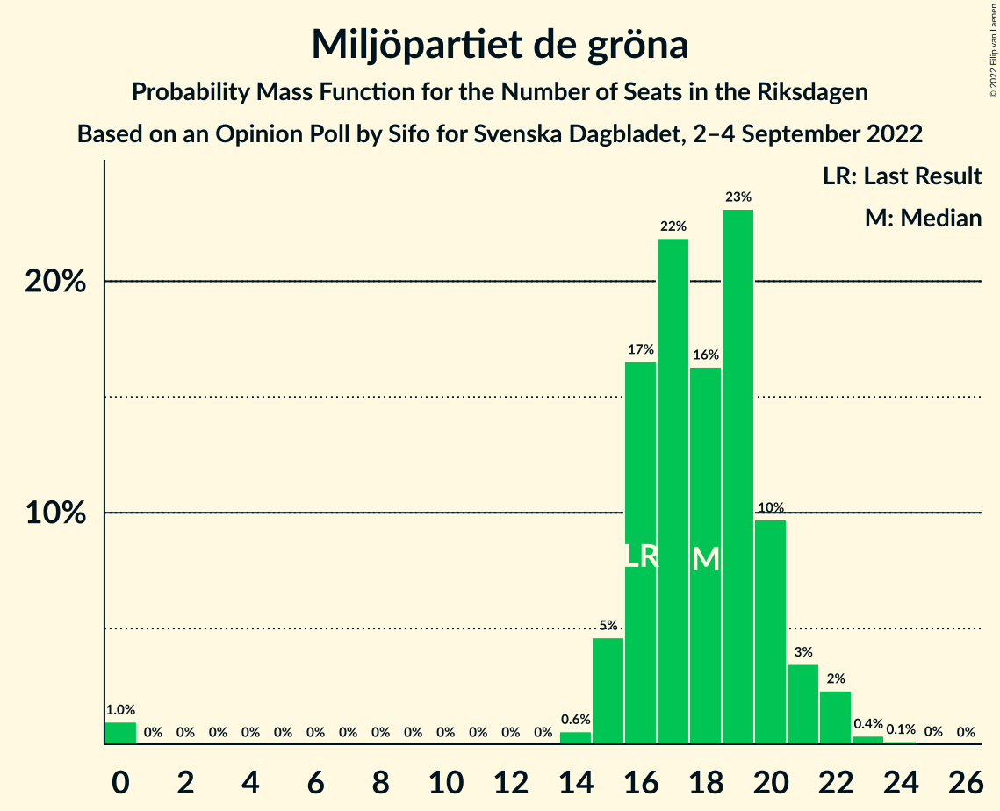

| Number of Seats | Probability | Accumulated | Special Marks |
|:---------------:|:-----------:|:-----------:|:-------------:|
| 0 | 1.0% | 100% |  |
| 1 | 0% | 99.0% |  |
| 2 | 0% | 99.0% |  |
| 3 | 0% | 99.0% |  |
| 4 | 0% | 99.0% |  |
| 5 | 0% | 99.0% |  |
| 6 | 0% | 99.0% |  |
| 7 | 0% | 99.0% |  |
| 8 | 0% | 99.0% |  |
| 9 | 0% | 99.0% |  |
| 10 | 0% | 99.0% |  |
| 11 | 0% | 99.0% |  |
| 12 | 0% | 99.0% |  |
| 13 | 0% | 99.0% |  |
| 14 | 0.6% | 99.0% |  |
| 15 | 5% | 98% |  |
| 16 | 17% | 94% | Last Result |
| 17 | 22% | 77% |  |
| 18 | 16% | 55% | Median |
| 19 | 23% | 39% |  |
| 20 | 10% | 16% |  |
| 21 | 3% | 6% |  |
| 22 | 2% | 3% |  |
| 23 | 0.4% | 0.5% |  |
| 24 | 0.1% | 0.2% |  |
| 25 | 0% | 0% |  |

## Coalitions

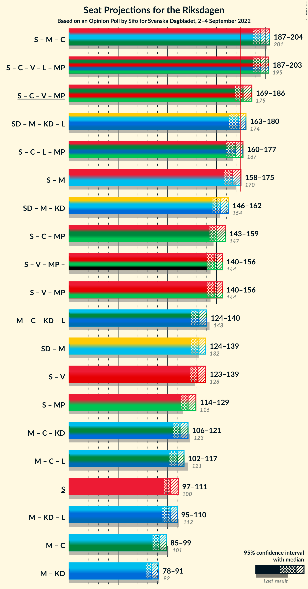

### Confidence Intervals

| Coalition | Last Result | Median | Majority? | 80% Confidence Interval | 90% Confidence Interval | 95% Confidence Interval | 99% Confidence Interval |
|:---------:|:-----------:|:------:|:---------:|:-----------------------:|:-----------------------:|:-----------------------:|:-----------------------:|
| Sveriges socialdemokratiska arbetareparti – Moderata samlingspartiet – Centerpartiet | 201 | 195 | 100% | 190–200 | 188–202 | 187–204 | 184–209 |
| Sveriges socialdemokratiska arbetareparti – Centerpartiet – Vänsterpartiet – Liberalerna – Miljöpartiet de gröna | 195 | 195 | 100% | 191–201 | 188–202 | 187–203 | 183–206 |
| Sveriges socialdemokratiska arbetareparti – Centerpartiet – Vänsterpartiet – Miljöpartiet de gröna | 175 | 177 | 76% | 173–183 | 170–184 | 169–186 | 167–190 |
| Sverigedemokraterna – Moderata samlingspartiet – Kristdemokraterna – Liberalerna | 174 | 172 | 24% | 166–176 | 165–179 | 163–180 | 159–182 |
| Sveriges socialdemokratiska arbetareparti – Centerpartiet – Liberalerna – Miljöpartiet de gröna | 167 | 169 | 10% | 164–174 | 162–176 | 160–177 | 156–179 |
| Sveriges socialdemokratiska arbetareparti – Moderata samlingspartiet | 170 | 166 | 3% | 161–171 | 160–173 | 158–175 | 155–179 |
| Sverigedemokraterna – Moderata samlingspartiet – Kristdemokraterna | 154 | 154 | 0% | 148–158 | 147–161 | 146–162 | 143–166 |
| Sveriges socialdemokratiska arbetareparti – Centerpartiet – Miljöpartiet de gröna | 147 | 150 | 0% | 145–156 | 144–157 | 143–159 | 139–162 |
| Sveriges socialdemokratiska arbetareparti – Vänsterpartiet – Miljöpartiet de gröna | 144 | 148 | 0% | 143–153 | 142–155 | 140–156 | 137–160 |
| Moderata samlingspartiet – Centerpartiet – Kristdemokraterna – Liberalerna | 143 | 132 | 0% | 127–136 | 125–138 | 124–140 | 116–142 |
| Sverigedemokraterna – Moderata samlingspartiet | 132 | 132 | 0% | 126–136 | 125–138 | 124–139 | 121–143 |
| Sveriges socialdemokratiska arbetareparti – Vänsterpartiet | 128 | 131 | 0% | 125–136 | 124–137 | 123–139 | 121–142 |
| Sveriges socialdemokratiska arbetareparti – Miljöpartiet de gröna | 116 | 121 | 0% | 117–127 | 115–128 | 114–129 | 109–133 |
| Moderata samlingspartiet – Centerpartiet – Kristdemokraterna | 123 | 113 | 0% | 108–118 | 107–119 | 106–121 | 103–124 |
| Moderata samlingspartiet – Centerpartiet – Liberalerna | 121 | 110 | 0% | 105–114 | 104–115 | 102–117 | 94–119 |
| Sveriges socialdemokratiska arbetareparti | 100 | 103 | 0% | 99–108 | 98–110 | 97–111 | 94–114 |
| Moderata samlingspartiet – Kristdemokraterna – Liberalerna | 112 | 103 | 0% | 98–107 | 97–108 | 95–110 | 87–112 |
| Moderata samlingspartiet – Centerpartiet | 101 | 92 | 0% | 87–95 | 86–97 | 85–99 | 82–101 |
| Moderata samlingspartiet – Kristdemokraterna | 92 | 84 | 0% | 80–88 | 78–90 | 78–91 | 75–94 |

### Sveriges socialdemokratiska arbetareparti – Moderata samlingspartiet – Centerpartiet

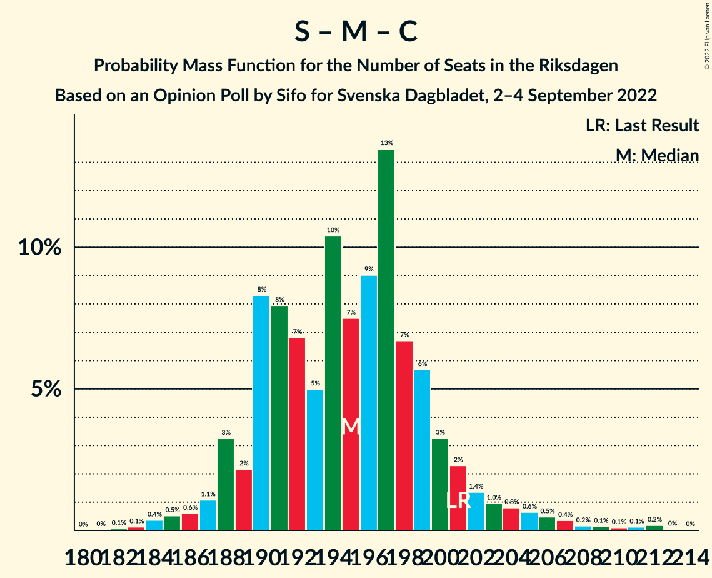

| Number of Seats | Probability | Accumulated | Special Marks |
|:---------------:|:-----------:|:-----------:|:-------------:|
| 182 | 0.1% | 100% |  |
| 183 | 0.1% | 99.9% |  |
| 184 | 0.4% | 99.8% |  |
| 185 | 0.5% | 99.4% |  |
| 186 | 0.6% | 98.9% |  |
| 187 | 1.1% | 98% |  |
| 188 | 3% | 97% |  |
| 189 | 2% | 94% |  |
| 190 | 8% | 92% |  |
| 191 | 8% | 83% |  |
| 192 | 7% | 76% |  |
| 193 | 5% | 69% |  |
| 194 | 10% | 64% |  |
| 195 | 7% | 53% | Median |
| 196 | 9% | 46% |  |
| 197 | 13% | 37% |  |
| 198 | 7% | 23% |  |
| 199 | 6% | 17% |  |
| 200 | 3% | 11% |  |
| 201 | 2% | 8% | Last Result |
| 202 | 1.4% | 5% |  |
| 203 | 1.0% | 4% |  |
| 204 | 0.8% | 3% |  |
| 205 | 0.6% | 2% |  |
| 206 | 0.5% | 2% |  |
| 207 | 0.4% | 1.2% |  |
| 208 | 0.2% | 0.8% |  |
| 209 | 0.1% | 0.6% |  |
| 210 | 0.1% | 0.5% |  |
| 211 | 0.1% | 0.4% |  |
| 212 | 0.2% | 0.3% |  |
| 213 | 0% | 0.1% |  |
| 214 | 0% | 0% |  |

### Sveriges socialdemokratiska arbetareparti – Centerpartiet – Vänsterpartiet – Liberalerna – Miljöpartiet de gröna

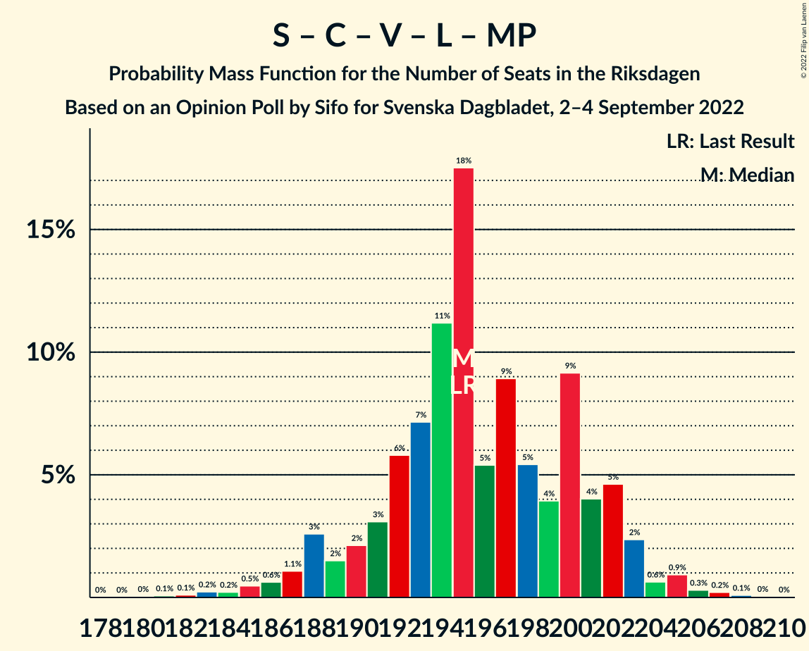

| Number of Seats | Probability | Accumulated | Special Marks |
|:---------------:|:-----------:|:-----------:|:-------------:|
| 179 | 0% | 100% |  |
| 180 | 0% | 99.9% |  |
| 181 | 0.1% | 99.9% |  |
| 182 | 0.1% | 99.8% |  |
| 183 | 0.2% | 99.7% |  |
| 184 | 0.2% | 99.5% |  |
| 185 | 0.5% | 99.3% |  |
| 186 | 0.6% | 98.8% |  |
| 187 | 1.1% | 98% |  |
| 188 | 3% | 97% |  |
| 189 | 2% | 94% |  |
| 190 | 2% | 93% |  |
| 191 | 3% | 91% |  |
| 192 | 6% | 88% |  |
| 193 | 7% | 82% |  |
| 194 | 11% | 75% |  |
| 195 | 18% | 64% | Last Result |
| 196 | 5% | 46% | Median |
| 197 | 9% | 41% |  |
| 198 | 5% | 32% |  |
| 199 | 4% | 26% |  |
| 200 | 9% | 22% |  |
| 201 | 4% | 13% |  |
| 202 | 5% | 9% |  |
| 203 | 2% | 5% |  |
| 204 | 0.6% | 2% |  |
| 205 | 0.9% | 2% |  |
| 206 | 0.3% | 0.7% |  |
| 207 | 0.2% | 0.4% |  |
| 208 | 0.1% | 0.2% |  |
| 209 | 0% | 0.1% |  |
| 210 | 0% | 0% |  |

### Sveriges socialdemokratiska arbetareparti – Centerpartiet – Vänsterpartiet – Miljöpartiet de gröna

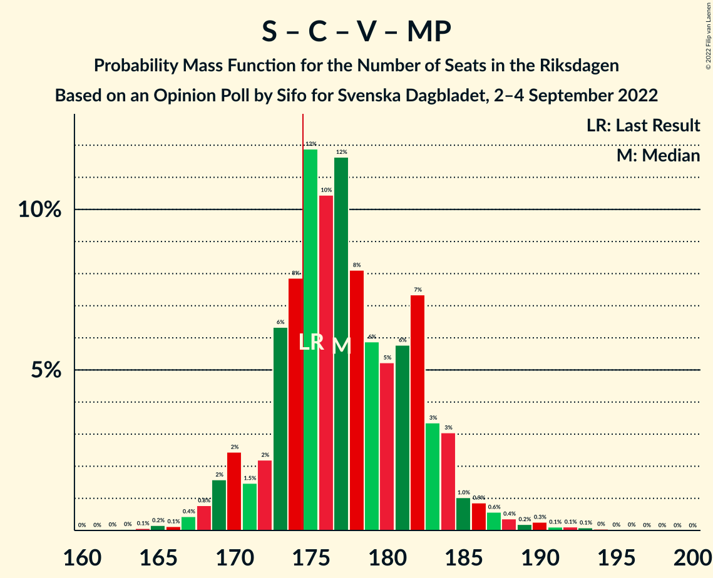

| Number of Seats | Probability | Accumulated | Special Marks |
|:---------------:|:-----------:|:-----------:|:-------------:|
| 162 | 0% | 100% |  |
| 163 | 0% | 99.9% |  |
| 164 | 0.1% | 99.9% |  |
| 165 | 0.2% | 99.8% |  |
| 166 | 0.1% | 99.7% |  |
| 167 | 0.4% | 99.5% |  |
| 168 | 0.8% | 99.1% |  |
| 169 | 2% | 98% |  |
| 170 | 2% | 97% |  |
| 171 | 1.5% | 94% |  |
| 172 | 2% | 93% |  |
| 173 | 6% | 91% |  |
| 174 | 8% | 84% |  |
| 175 | 12% | 76% | Last Result, Majority |
| 176 | 10% | 65% |  |
| 177 | 12% | 54% | Median |
| 178 | 8% | 42% |  |
| 179 | 6% | 34% |  |
| 180 | 5% | 28% |  |
| 181 | 6% | 23% |  |
| 182 | 7% | 17% |  |
| 183 | 3% | 10% |  |
| 184 | 3% | 7% |  |
| 185 | 1.0% | 4% |  |
| 186 | 0.9% | 3% |  |
| 187 | 0.6% | 2% |  |
| 188 | 0.4% | 1.3% |  |
| 189 | 0.2% | 0.9% |  |
| 190 | 0.3% | 0.7% |  |
| 191 | 0.1% | 0.4% |  |
| 192 | 0.1% | 0.3% |  |
| 193 | 0.1% | 0.2% |  |
| 194 | 0% | 0.1% |  |
| 195 | 0% | 0.1% |  |
| 196 | 0% | 0% |  |

### Sverigedemokraterna – Moderata samlingspartiet – Kristdemokraterna – Liberalerna

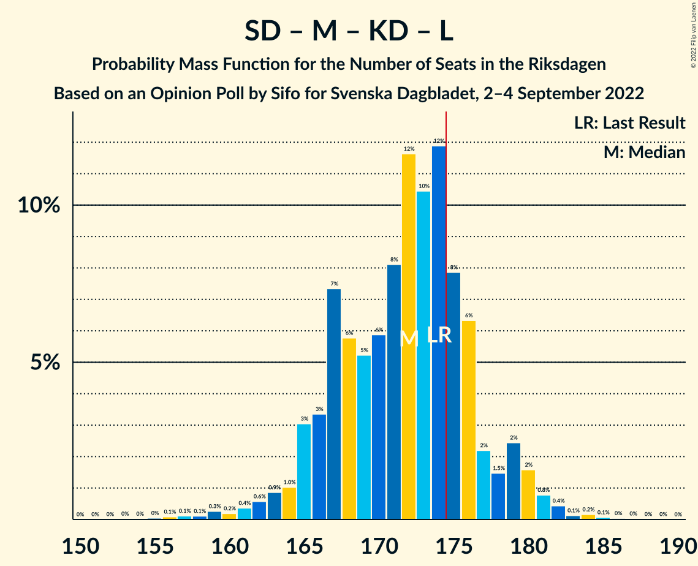

| Number of Seats | Probability | Accumulated | Special Marks |
|:---------------:|:-----------:|:-----------:|:-------------:|
| 154 | 0% | 100% |  |
| 155 | 0% | 99.9% |  |
| 156 | 0.1% | 99.9% |  |
| 157 | 0.1% | 99.8% |  |
| 158 | 0.1% | 99.7% |  |
| 159 | 0.3% | 99.6% |  |
| 160 | 0.2% | 99.3% |  |
| 161 | 0.4% | 99.1% |  |
| 162 | 0.6% | 98.7% |  |
| 163 | 0.9% | 98% |  |
| 164 | 1.0% | 97% |  |
| 165 | 3% | 96% |  |
| 166 | 3% | 93% |  |
| 167 | 7% | 90% |  |
| 168 | 6% | 83% |  |
| 169 | 5% | 77% |  |
| 170 | 6% | 72% |  |
| 171 | 8% | 66% |  |
| 172 | 12% | 58% |  |
| 173 | 10% | 46% | Median |
| 174 | 12% | 35% | Last Result |
| 175 | 8% | 24% | Majority |
| 176 | 6% | 16% |  |
| 177 | 2% | 9% |  |
| 178 | 1.5% | 7% |  |
| 179 | 2% | 6% |  |
| 180 | 2% | 3% |  |
| 181 | 0.8% | 2% |  |
| 182 | 0.4% | 0.9% |  |
| 183 | 0.1% | 0.5% |  |
| 184 | 0.2% | 0.3% |  |
| 185 | 0.1% | 0.2% |  |
| 186 | 0% | 0.1% |  |
| 187 | 0% | 0.1% |  |
| 188 | 0% | 0% |  |

### Sveriges socialdemokratiska arbetareparti – Centerpartiet – Liberalerna – Miljöpartiet de gröna

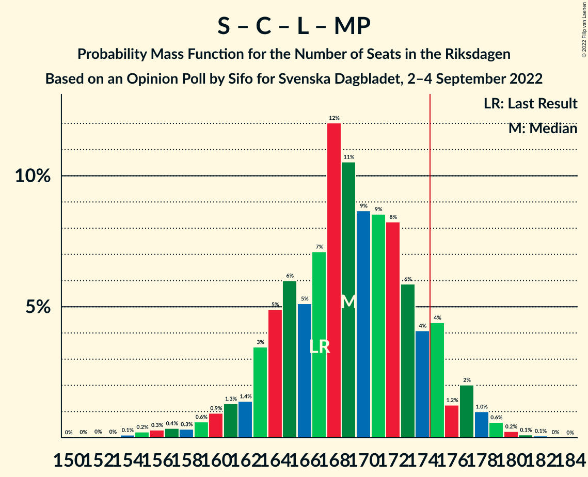

| Number of Seats | Probability | Accumulated | Special Marks |
|:---------------:|:-----------:|:-----------:|:-------------:|
| 151 | 0% | 100% |  |
| 152 | 0% | 99.9% |  |
| 153 | 0% | 99.9% |  |
| 154 | 0.1% | 99.8% |  |
| 155 | 0.2% | 99.7% |  |
| 156 | 0.3% | 99.5% |  |
| 157 | 0.4% | 99.2% |  |
| 158 | 0.3% | 98.9% |  |
| 159 | 0.6% | 98.5% |  |
| 160 | 0.9% | 98% |  |
| 161 | 1.3% | 97% |  |
| 162 | 1.4% | 96% |  |
| 163 | 3% | 94% |  |
| 164 | 5% | 91% |  |
| 165 | 6% | 86% |  |
| 166 | 5% | 80% |  |
| 167 | 7% | 75% | Last Result |
| 168 | 12% | 68% |  |
| 169 | 11% | 56% | Median |
| 170 | 9% | 45% |  |
| 171 | 9% | 36% |  |
| 172 | 8% | 28% |  |
| 173 | 6% | 20% |  |
| 174 | 4% | 14% |  |
| 175 | 4% | 10% | Majority |
| 176 | 1.2% | 5% |  |
| 177 | 2% | 4% |  |
| 178 | 1.0% | 2% |  |
| 179 | 0.6% | 1.1% |  |
| 180 | 0.2% | 0.5% |  |
| 181 | 0.1% | 0.2% |  |
| 182 | 0.1% | 0.1% |  |
| 183 | 0% | 0% |  |

### Sveriges socialdemokratiska arbetareparti – Moderata samlingspartiet

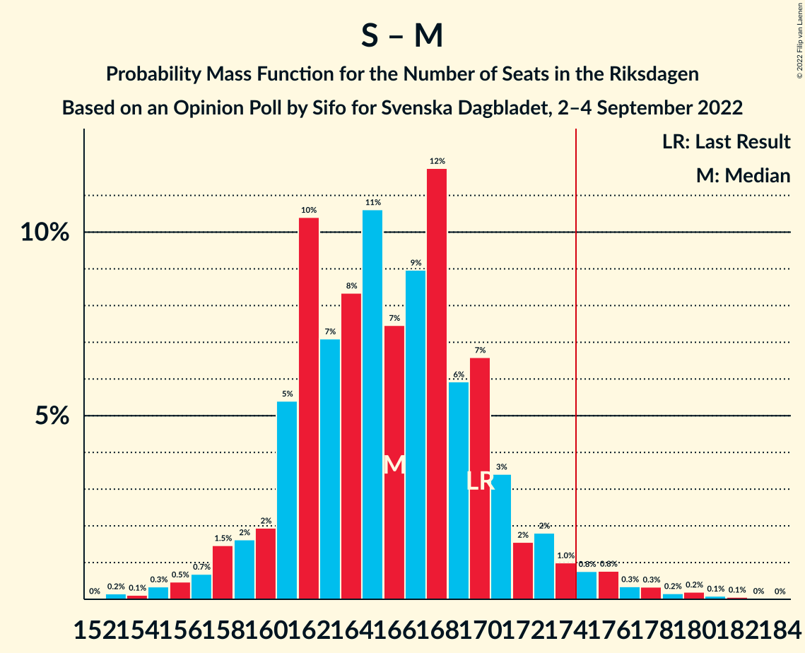

| Number of Seats | Probability | Accumulated | Special Marks |
|:---------------:|:-----------:|:-----------:|:-------------:|
| 153 | 0.2% | 100% |  |
| 154 | 0.1% | 99.8% |  |
| 155 | 0.3% | 99.7% |  |
| 156 | 0.5% | 99.3% |  |
| 157 | 0.7% | 98.9% |  |
| 158 | 1.5% | 98% |  |
| 159 | 2% | 97% |  |
| 160 | 2% | 95% |  |
| 161 | 5% | 93% |  |
| 162 | 10% | 88% |  |
| 163 | 7% | 77% |  |
| 164 | 8% | 70% |  |
| 165 | 11% | 62% |  |
| 166 | 7% | 51% | Median |
| 167 | 9% | 44% |  |
| 168 | 12% | 35% |  |
| 169 | 6% | 23% |  |
| 170 | 7% | 17% | Last Result |
| 171 | 3% | 11% |  |
| 172 | 2% | 7% |  |
| 173 | 2% | 6% |  |
| 174 | 1.0% | 4% |  |
| 175 | 0.8% | 3% | Majority |
| 176 | 0.8% | 2% |  |
| 177 | 0.3% | 1.3% |  |
| 178 | 0.3% | 0.9% |  |
| 179 | 0.2% | 0.6% |  |
| 180 | 0.2% | 0.4% |  |
| 181 | 0.1% | 0.2% |  |
| 182 | 0.1% | 0.1% |  |
| 183 | 0% | 0.1% |  |
| 184 | 0% | 0% |  |

### Sverigedemokraterna – Moderata samlingspartiet – Kristdemokraterna

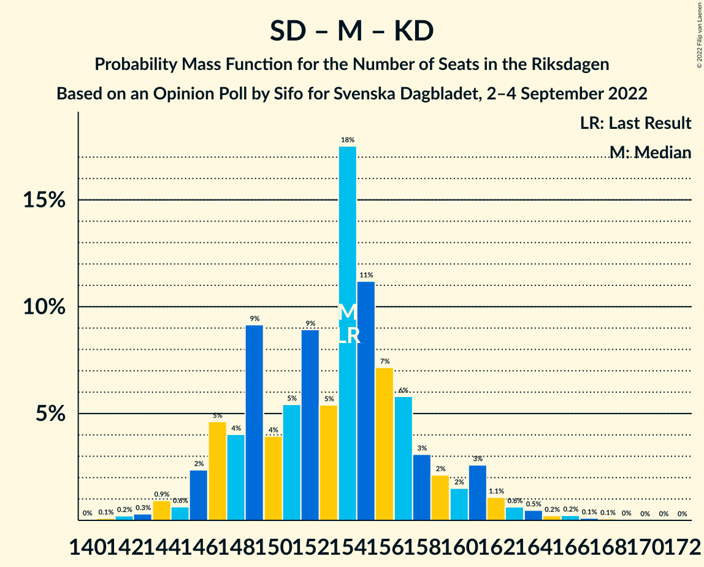

| Number of Seats | Probability | Accumulated | Special Marks |
|:---------------:|:-----------:|:-----------:|:-------------:|
| 140 | 0% | 100% |  |
| 141 | 0.1% | 99.9% |  |
| 142 | 0.2% | 99.8% |  |
| 143 | 0.3% | 99.6% |  |
| 144 | 0.9% | 99.3% |  |
| 145 | 0.6% | 98% |  |
| 146 | 2% | 98% |  |
| 147 | 5% | 95% |  |
| 148 | 4% | 91% |  |
| 149 | 9% | 87% |  |
| 150 | 4% | 78% |  |
| 151 | 5% | 74% |  |
| 152 | 9% | 68% |  |
| 153 | 5% | 59% |  |
| 154 | 18% | 54% | Last Result, Median |
| 155 | 11% | 36% |  |
| 156 | 7% | 25% |  |
| 157 | 6% | 18% |  |
| 158 | 3% | 12% |  |
| 159 | 2% | 9% |  |
| 160 | 2% | 7% |  |
| 161 | 3% | 6% |  |
| 162 | 1.1% | 3% |  |
| 163 | 0.6% | 2% |  |
| 164 | 0.5% | 1.2% |  |
| 165 | 0.2% | 0.7% |  |
| 166 | 0.2% | 0.5% |  |
| 167 | 0.1% | 0.3% |  |
| 168 | 0.1% | 0.2% |  |
| 169 | 0% | 0.1% |  |
| 170 | 0% | 0.1% |  |
| 171 | 0% | 0% |  |

### Sveriges socialdemokratiska arbetareparti – Centerpartiet – Miljöpartiet de gröna

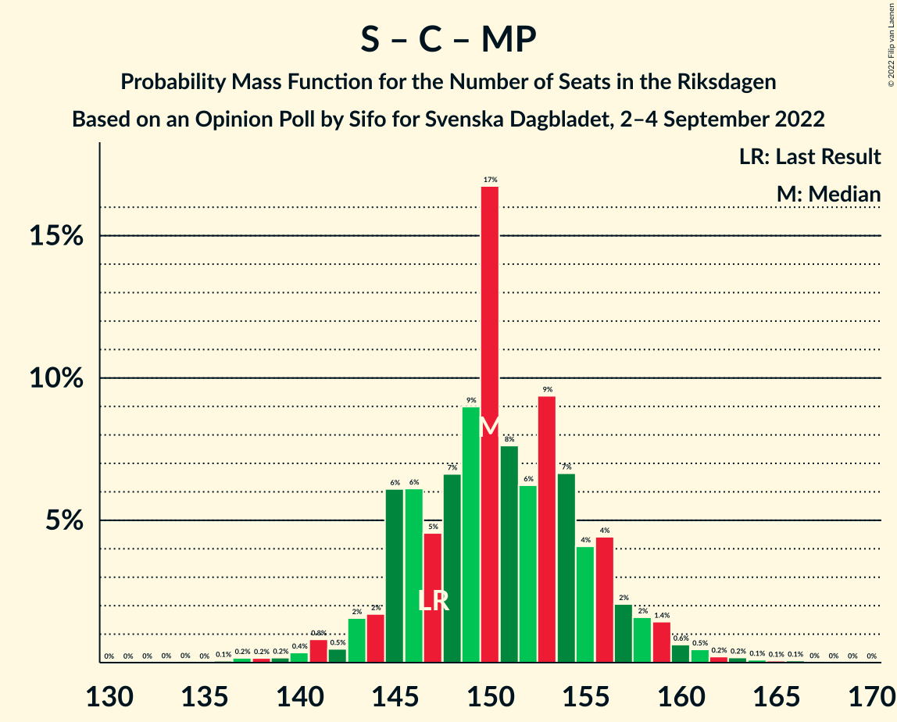

| Number of Seats | Probability | Accumulated | Special Marks |
|:---------------:|:-----------:|:-----------:|:-------------:|
| 134 | 0% | 100% |  |
| 135 | 0% | 99.9% |  |
| 136 | 0.1% | 99.9% |  |
| 137 | 0.2% | 99.9% |  |
| 138 | 0.2% | 99.7% |  |
| 139 | 0.2% | 99.5% |  |
| 140 | 0.4% | 99.4% |  |
| 141 | 0.8% | 99.0% |  |
| 142 | 0.5% | 98% |  |
| 143 | 2% | 98% |  |
| 144 | 2% | 96% |  |
| 145 | 6% | 94% |  |
| 146 | 6% | 88% |  |
| 147 | 5% | 82% | Last Result |
| 148 | 7% | 78% |  |
| 149 | 9% | 71% |  |
| 150 | 17% | 62% | Median |
| 151 | 8% | 45% |  |
| 152 | 6% | 38% |  |
| 153 | 9% | 31% |  |
| 154 | 7% | 22% |  |
| 155 | 4% | 15% |  |
| 156 | 4% | 11% |  |
| 157 | 2% | 7% |  |
| 158 | 2% | 5% |  |
| 159 | 1.4% | 3% |  |
| 160 | 0.6% | 2% |  |
| 161 | 0.5% | 1.2% |  |
| 162 | 0.2% | 0.7% |  |
| 163 | 0.2% | 0.5% |  |
| 164 | 0.1% | 0.3% |  |
| 165 | 0.1% | 0.2% |  |
| 166 | 0.1% | 0.1% |  |
| 167 | 0% | 0.1% |  |
| 168 | 0% | 0% |  |

### Sveriges socialdemokratiska arbetareparti – Vänsterpartiet – Miljöpartiet de gröna

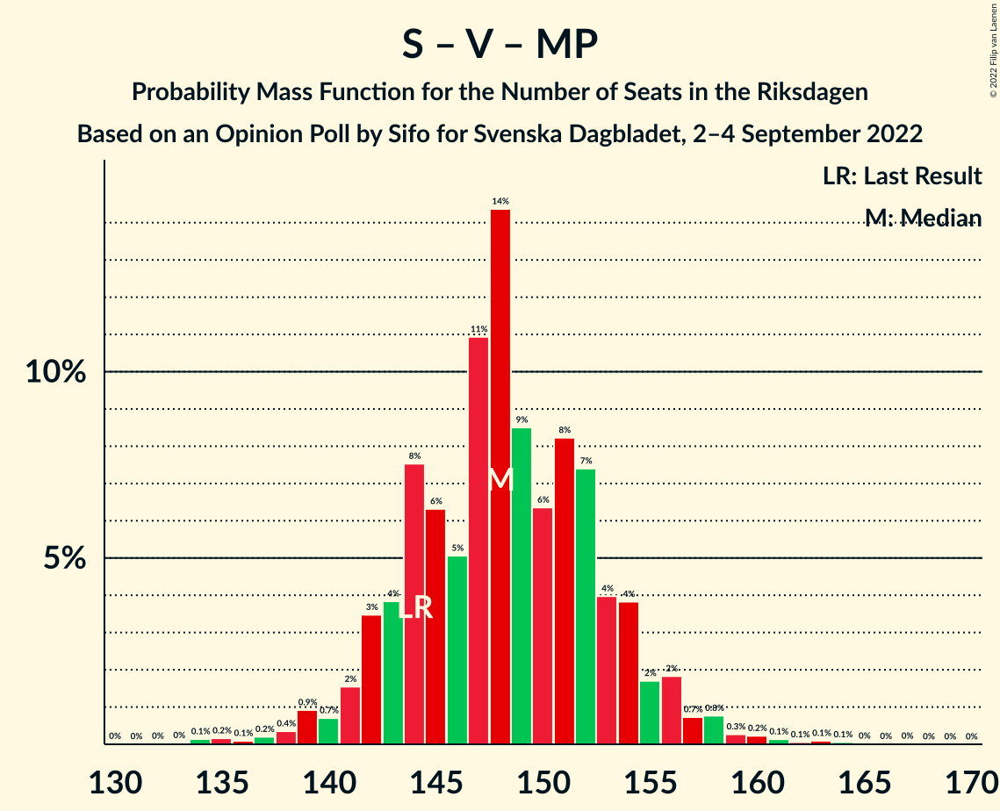

| Number of Seats | Probability | Accumulated | Special Marks |
|:---------------:|:-----------:|:-----------:|:-------------:|
| 132 | 0% | 100% |  |
| 133 | 0% | 99.9% |  |
| 134 | 0.1% | 99.9% |  |
| 135 | 0.2% | 99.8% |  |
| 136 | 0.1% | 99.6% |  |
| 137 | 0.2% | 99.5% |  |
| 138 | 0.4% | 99.3% |  |
| 139 | 0.9% | 99.0% |  |
| 140 | 0.7% | 98% |  |
| 141 | 2% | 97% |  |
| 142 | 3% | 96% |  |
| 143 | 4% | 92% |  |
| 144 | 8% | 88% | Last Result |
| 145 | 6% | 81% |  |
| 146 | 5% | 75% |  |
| 147 | 11% | 70% |  |
| 148 | 14% | 59% | Median |
| 149 | 9% | 44% |  |
| 150 | 6% | 36% |  |
| 151 | 8% | 29% |  |
| 152 | 7% | 21% |  |
| 153 | 4% | 14% |  |
| 154 | 4% | 10% |  |
| 155 | 2% | 6% |  |
| 156 | 2% | 4% |  |
| 157 | 0.7% | 2% |  |
| 158 | 0.8% | 2% |  |
| 159 | 0.3% | 0.9% |  |
| 160 | 0.2% | 0.6% |  |
| 161 | 0.1% | 0.4% |  |
| 162 | 0.1% | 0.3% |  |
| 163 | 0.1% | 0.2% |  |
| 164 | 0.1% | 0.1% |  |
| 165 | 0% | 0.1% |  |
| 166 | 0% | 0% |  |

### Moderata samlingspartiet – Centerpartiet – Kristdemokraterna – Liberalerna

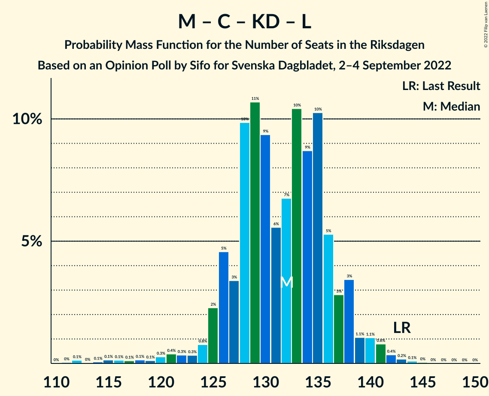

| Number of Seats | Probability | Accumulated | Special Marks |
|:---------------:|:-----------:|:-----------:|:-------------:|
| 111 | 0% | 100% |  |
| 112 | 0.1% | 99.9% |  |
| 113 | 0% | 99.8% |  |
| 114 | 0.1% | 99.8% |  |
| 115 | 0.1% | 99.7% |  |
| 116 | 0.1% | 99.6% |  |
| 117 | 0.1% | 99.5% |  |
| 118 | 0.1% | 99.3% |  |
| 119 | 0.1% | 99.2% |  |
| 120 | 0.3% | 99.1% |  |
| 121 | 0.4% | 98.8% |  |
| 122 | 0.3% | 98% |  |
| 123 | 0.3% | 98% |  |
| 124 | 0.8% | 98% |  |
| 125 | 2% | 97% |  |
| 126 | 5% | 95% |  |
| 127 | 3% | 90% |  |
| 128 | 10% | 87% |  |
| 129 | 11% | 77% |  |
| 130 | 9% | 66% |  |
| 131 | 6% | 57% |  |
| 132 | 7% | 51% |  |
| 133 | 10% | 45% | Median |
| 134 | 9% | 34% |  |
| 135 | 10% | 25% |  |
| 136 | 5% | 15% |  |
| 137 | 3% | 10% |  |
| 138 | 3% | 7% |  |
| 139 | 1.1% | 4% |  |
| 140 | 1.1% | 3% |  |
| 141 | 0.8% | 1.5% |  |
| 142 | 0.4% | 0.7% |  |
| 143 | 0.2% | 0.3% | Last Result |
| 144 | 0.1% | 0.2% |  |
| 145 | 0% | 0.1% |  |
| 146 | 0% | 0% |  |

### Sverigedemokraterna – Moderata samlingspartiet

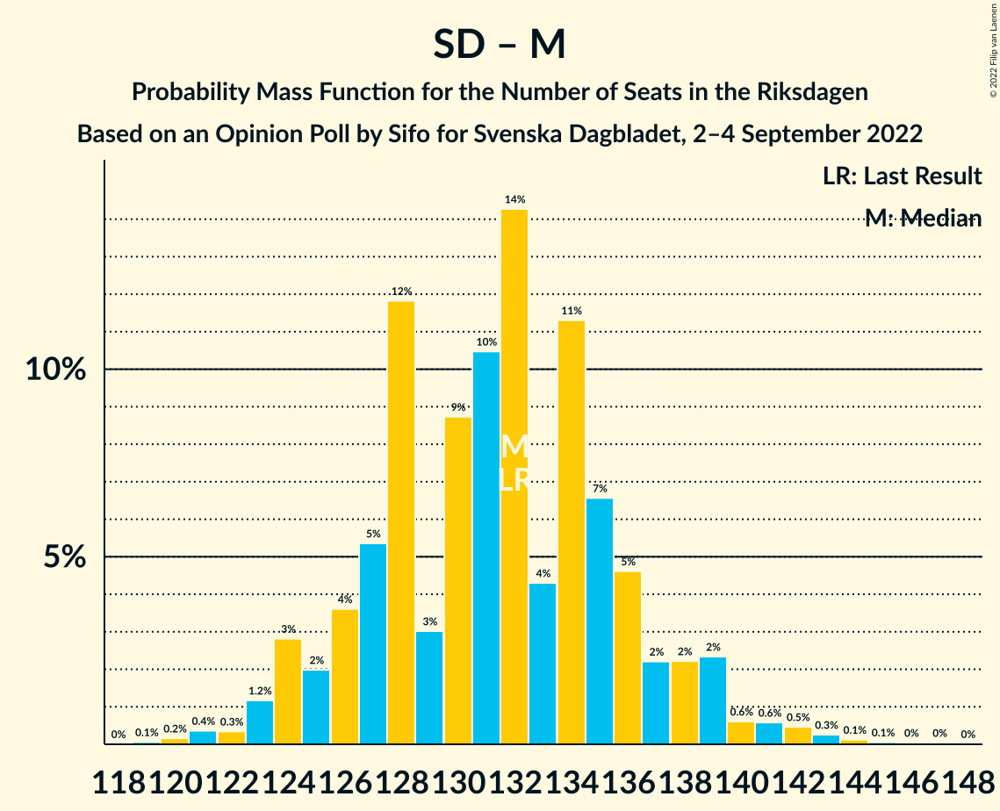

| Number of Seats | Probability | Accumulated | Special Marks |
|:---------------:|:-----------:|:-----------:|:-------------:|
| 119 | 0.1% | 100% |  |
| 120 | 0.2% | 99.9% |  |
| 121 | 0.4% | 99.7% |  |
| 122 | 0.3% | 99.4% |  |
| 123 | 1.2% | 99.0% |  |
| 124 | 3% | 98% |  |
| 125 | 2% | 95% |  |
| 126 | 4% | 93% |  |
| 127 | 5% | 89% |  |
| 128 | 12% | 84% |  |
| 129 | 3% | 72% |  |
| 130 | 9% | 69% |  |
| 131 | 10% | 61% |  |
| 132 | 14% | 50% | Last Result, Median |
| 133 | 4% | 36% |  |
| 134 | 11% | 31% |  |
| 135 | 7% | 20% |  |
| 136 | 5% | 14% |  |
| 137 | 2% | 9% |  |
| 138 | 2% | 7% |  |
| 139 | 2% | 5% |  |
| 140 | 0.6% | 2% |  |
| 141 | 0.6% | 2% |  |
| 142 | 0.5% | 1.0% |  |
| 143 | 0.3% | 0.5% |  |
| 144 | 0.1% | 0.3% |  |
| 145 | 0.1% | 0.2% |  |
| 146 | 0% | 0.1% |  |
| 147 | 0% | 0.1% |  |
| 148 | 0% | 0% |  |

### Sveriges socialdemokratiska arbetareparti – Vänsterpartiet

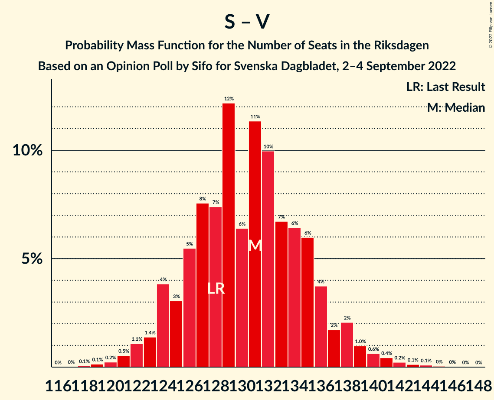

| Number of Seats | Probability | Accumulated | Special Marks |
|:---------------:|:-----------:|:-----------:|:-------------:|
| 118 | 0.1% | 100% |  |
| 119 | 0.1% | 99.9% |  |
| 120 | 0.2% | 99.8% |  |
| 121 | 0.5% | 99.5% |  |
| 122 | 1.1% | 99.0% |  |
| 123 | 1.4% | 98% |  |
| 124 | 4% | 97% |  |
| 125 | 3% | 93% |  |
| 126 | 5% | 90% |  |
| 127 | 8% | 84% |  |
| 128 | 7% | 77% | Last Result |
| 129 | 12% | 69% |  |
| 130 | 6% | 57% | Median |
| 131 | 11% | 51% |  |
| 132 | 10% | 39% |  |
| 133 | 7% | 29% |  |
| 134 | 6% | 23% |  |
| 135 | 6% | 16% |  |
| 136 | 4% | 10% |  |
| 137 | 2% | 6% |  |
| 138 | 2% | 5% |  |
| 139 | 1.0% | 3% |  |
| 140 | 0.6% | 2% |  |
| 141 | 0.4% | 1.0% |  |
| 142 | 0.2% | 0.5% |  |
| 143 | 0.1% | 0.3% |  |
| 144 | 0.1% | 0.2% |  |
| 145 | 0% | 0.1% |  |
| 146 | 0% | 0.1% |  |
| 147 | 0% | 0% |  |

### Sveriges socialdemokratiska arbetareparti – Miljöpartiet de gröna

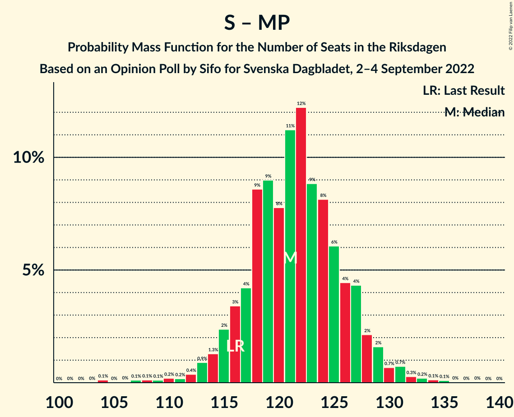

| Number of Seats | Probability | Accumulated | Special Marks |
|:---------------:|:-----------:|:-----------:|:-------------:|
| 104 | 0.1% | 100% |  |
| 105 | 0% | 99.8% |  |
| 106 | 0% | 99.8% |  |
| 107 | 0.1% | 99.8% |  |
| 108 | 0.1% | 99.7% |  |
| 109 | 0.1% | 99.6% |  |
| 110 | 0.2% | 99.4% |  |
| 111 | 0.2% | 99.2% |  |
| 112 | 0.4% | 99.1% |  |
| 113 | 0.9% | 98.7% |  |
| 114 | 1.3% | 98% |  |
| 115 | 2% | 97% |  |
| 116 | 3% | 94% | Last Result |
| 117 | 4% | 91% |  |
| 118 | 9% | 87% |  |
| 119 | 9% | 78% |  |
| 120 | 8% | 69% |  |
| 121 | 11% | 61% | Median |
| 122 | 12% | 50% |  |
| 123 | 9% | 38% |  |
| 124 | 8% | 29% |  |
| 125 | 6% | 21% |  |
| 126 | 4% | 15% |  |
| 127 | 4% | 10% |  |
| 128 | 2% | 6% |  |
| 129 | 2% | 4% |  |
| 130 | 0.7% | 2% |  |
| 131 | 0.7% | 2% |  |
| 132 | 0.3% | 0.8% |  |
| 133 | 0.2% | 0.5% |  |
| 134 | 0.1% | 0.3% |  |
| 135 | 0.1% | 0.2% |  |
| 136 | 0% | 0.1% |  |
| 137 | 0% | 0.1% |  |
| 138 | 0% | 0% |  |

### Moderata samlingspartiet – Centerpartiet – Kristdemokraterna

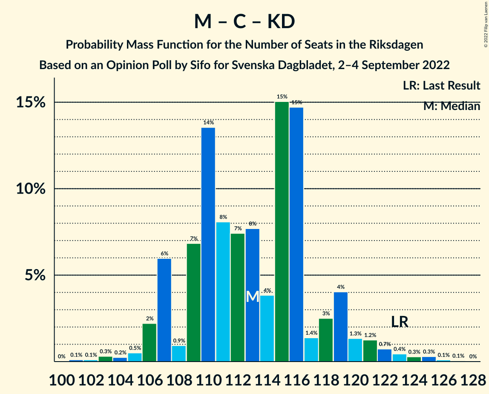

| Number of Seats | Probability | Accumulated | Special Marks |
|:---------------:|:-----------:|:-----------:|:-------------:|
| 101 | 0.1% | 100% |  |
| 102 | 0.1% | 99.9% |  |
| 103 | 0.3% | 99.8% |  |
| 104 | 0.2% | 99.5% |  |
| 105 | 0.5% | 99.2% |  |
| 106 | 2% | 98.7% |  |
| 107 | 6% | 96% |  |
| 108 | 0.9% | 91% |  |
| 109 | 7% | 90% |  |
| 110 | 14% | 83% |  |
| 111 | 8% | 69% |  |
| 112 | 7% | 61% |  |
| 113 | 8% | 54% |  |
| 114 | 4% | 46% | Median |
| 115 | 15% | 42% |  |
| 116 | 15% | 27% |  |
| 117 | 1.4% | 12% |  |
| 118 | 3% | 11% |  |
| 119 | 4% | 9% |  |
| 120 | 1.3% | 5% |  |
| 121 | 1.2% | 3% |  |
| 122 | 0.7% | 2% |  |
| 123 | 0.4% | 1.2% | Last Result |
| 124 | 0.3% | 0.8% |  |
| 125 | 0.3% | 0.5% |  |
| 126 | 0.1% | 0.2% |  |
| 127 | 0.1% | 0.1% |  |
| 128 | 0% | 0% |  |

### Moderata samlingspartiet – Centerpartiet – Liberalerna

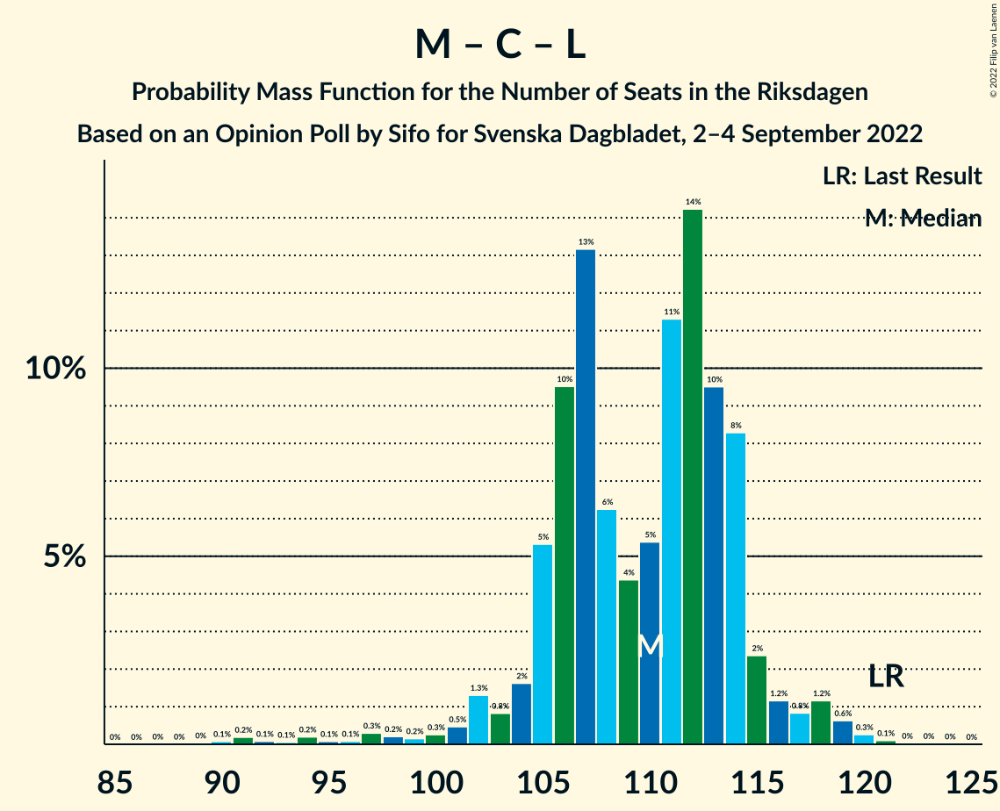

| Number of Seats | Probability | Accumulated | Special Marks |
|:---------------:|:-----------:|:-----------:|:-------------:|
| 89 | 0% | 100% |  |
| 90 | 0.1% | 99.9% |  |
| 91 | 0.2% | 99.9% |  |
| 92 | 0.1% | 99.7% |  |
| 93 | 0.1% | 99.6% |  |
| 94 | 0.2% | 99.5% |  |
| 95 | 0.1% | 99.3% |  |
| 96 | 0.1% | 99.2% |  |
| 97 | 0.3% | 99.1% |  |
| 98 | 0.2% | 98.8% |  |
| 99 | 0.2% | 98.6% |  |
| 100 | 0.3% | 98% |  |
| 101 | 0.5% | 98% |  |
| 102 | 1.3% | 98% |  |
| 103 | 0.8% | 96% |  |
| 104 | 2% | 96% |  |
| 105 | 5% | 94% |  |
| 106 | 10% | 89% |  |
| 107 | 13% | 79% |  |
| 108 | 6% | 66% |  |
| 109 | 4% | 60% |  |
| 110 | 5% | 55% |  |
| 111 | 11% | 50% | Median |
| 112 | 14% | 39% |  |
| 113 | 10% | 24% |  |
| 114 | 8% | 15% |  |
| 115 | 2% | 7% |  |
| 116 | 1.2% | 4% |  |
| 117 | 0.8% | 3% |  |
| 118 | 1.2% | 2% |  |
| 119 | 0.6% | 1.1% |  |
| 120 | 0.3% | 0.4% |  |
| 121 | 0.1% | 0.2% | Last Result |
| 122 | 0% | 0.1% |  |
| 123 | 0% | 0% |  |

### Sveriges socialdemokratiska arbetareparti

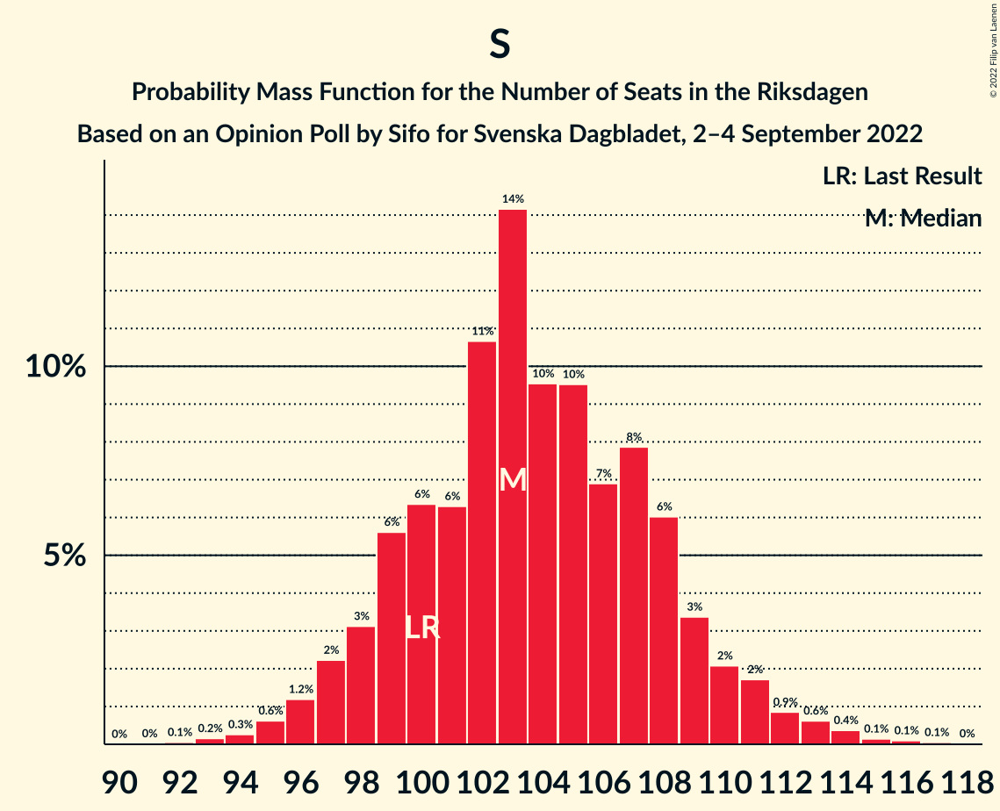

| Number of Seats | Probability | Accumulated | Special Marks |
|:---------------:|:-----------:|:-----------:|:-------------:|
| 92 | 0.1% | 100% |  |
| 93 | 0.2% | 99.9% |  |
| 94 | 0.3% | 99.8% |  |
| 95 | 0.6% | 99.5% |  |
| 96 | 1.2% | 98.9% |  |
| 97 | 2% | 98% |  |
| 98 | 3% | 95% |  |
| 99 | 6% | 92% |  |
| 100 | 6% | 87% | Last Result |
| 101 | 6% | 80% |  |
| 102 | 11% | 74% |  |
| 103 | 14% | 63% | Median |
| 104 | 10% | 49% |  |
| 105 | 10% | 40% |  |
| 106 | 7% | 30% |  |
| 107 | 8% | 23% |  |
| 108 | 6% | 15% |  |
| 109 | 3% | 9% |  |
| 110 | 2% | 6% |  |
| 111 | 2% | 4% |  |
| 112 | 0.9% | 2% |  |
| 113 | 0.6% | 1.3% |  |
| 114 | 0.4% | 0.7% |  |
| 115 | 0.1% | 0.3% |  |
| 116 | 0.1% | 0.2% |  |
| 117 | 0.1% | 0.1% |  |
| 118 | 0% | 0% |  |

### Moderata samlingspartiet – Kristdemokraterna – Liberalerna

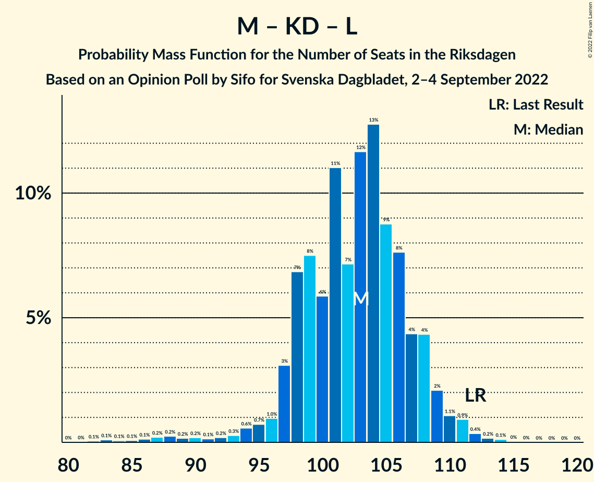

| Number of Seats | Probability | Accumulated | Special Marks |
|:---------------:|:-----------:|:-----------:|:-------------:|
| 82 | 0.1% | 100% |  |
| 83 | 0.1% | 99.9% |  |
| 84 | 0.1% | 99.8% |  |
| 85 | 0.1% | 99.7% |  |
| 86 | 0.1% | 99.7% |  |
| 87 | 0.2% | 99.5% |  |
| 88 | 0.2% | 99.3% |  |
| 89 | 0.2% | 99.1% |  |
| 90 | 0.2% | 98.9% |  |
| 91 | 0.1% | 98.7% |  |
| 92 | 0.2% | 98.6% |  |
| 93 | 0.3% | 98% |  |
| 94 | 0.6% | 98% |  |
| 95 | 0.7% | 98% |  |
| 96 | 1.0% | 97% |  |
| 97 | 3% | 96% |  |
| 98 | 7% | 93% |  |
| 99 | 8% | 86% |  |
| 100 | 6% | 78% |  |
| 101 | 11% | 73% |  |
| 102 | 7% | 61% |  |
| 103 | 12% | 54% |  |
| 104 | 13% | 43% | Median |
| 105 | 9% | 30% |  |
| 106 | 8% | 21% |  |
| 107 | 4% | 13% |  |
| 108 | 4% | 9% |  |
| 109 | 2% | 5% |  |
| 110 | 1.1% | 3% |  |
| 111 | 0.9% | 2% |  |
| 112 | 0.4% | 0.7% | Last Result |
| 113 | 0.2% | 0.4% |  |
| 114 | 0.1% | 0.2% |  |
| 115 | 0% | 0.1% |  |
| 116 | 0% | 0% |  |

### Moderata samlingspartiet – Centerpartiet

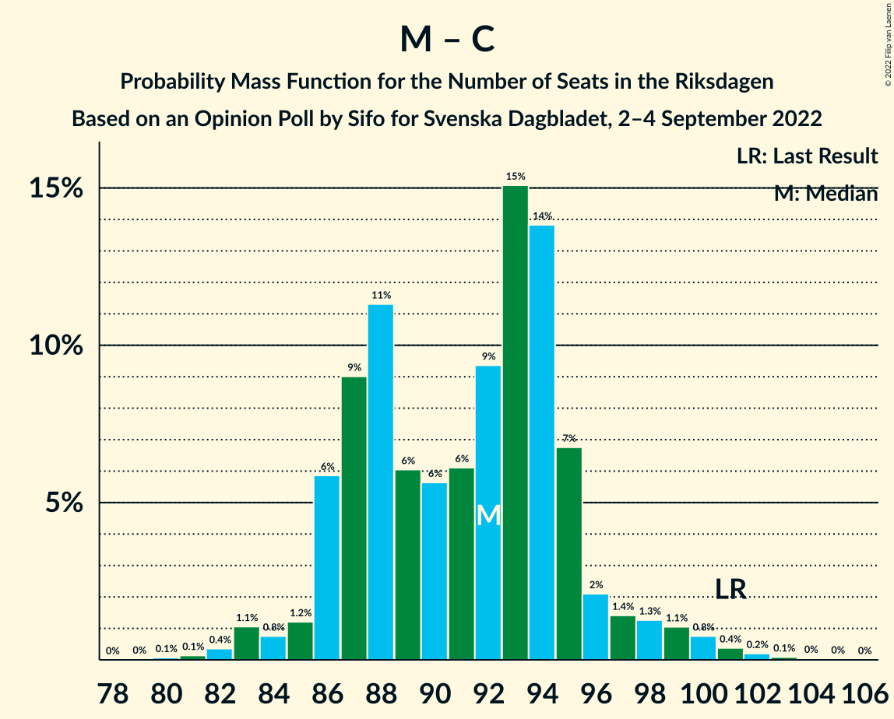

| Number of Seats | Probability | Accumulated | Special Marks |
|:---------------:|:-----------:|:-----------:|:-------------:|
| 80 | 0.1% | 100% |  |
| 81 | 0.1% | 99.9% |  |
| 82 | 0.4% | 99.8% |  |
| 83 | 1.1% | 99.4% |  |
| 84 | 0.8% | 98% |  |
| 85 | 1.2% | 98% |  |
| 86 | 6% | 96% |  |
| 87 | 9% | 91% |  |
| 88 | 11% | 82% |  |
| 89 | 6% | 70% |  |
| 90 | 6% | 64% |  |
| 91 | 6% | 59% |  |
| 92 | 9% | 52% | Median |
| 93 | 15% | 43% |  |
| 94 | 14% | 28% |  |
| 95 | 7% | 14% |  |
| 96 | 2% | 7% |  |
| 97 | 1.4% | 5% |  |
| 98 | 1.3% | 4% |  |
| 99 | 1.1% | 3% |  |
| 100 | 0.8% | 2% |  |
| 101 | 0.4% | 0.8% | Last Result |
| 102 | 0.2% | 0.4% |  |
| 103 | 0.1% | 0.2% |  |
| 104 | 0% | 0.1% |  |
| 105 | 0% | 0% |  |

### Moderata samlingspartiet – Kristdemokraterna

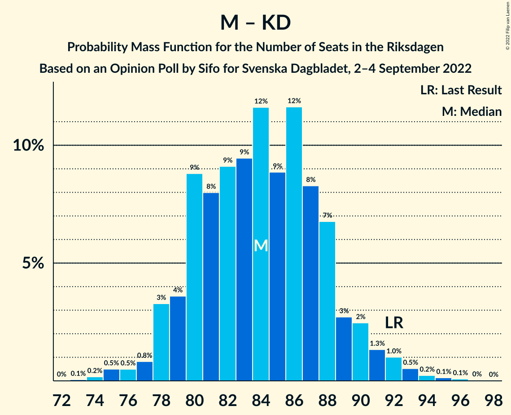

| Number of Seats | Probability | Accumulated | Special Marks |
|:---------------:|:-----------:|:-----------:|:-------------:|
| 73 | 0.1% | 100% |  |
| 74 | 0.2% | 99.9% |  |
| 75 | 0.5% | 99.7% |  |
| 76 | 0.5% | 99.2% |  |
| 77 | 0.8% | 98.7% |  |
| 78 | 3% | 98% |  |
| 79 | 4% | 95% |  |
| 80 | 9% | 91% |  |
| 81 | 8% | 82% |  |
| 82 | 9% | 74% |  |
| 83 | 9% | 65% |  |
| 84 | 12% | 56% |  |
| 85 | 9% | 44% | Median |
| 86 | 12% | 35% |  |
| 87 | 8% | 24% |  |
| 88 | 7% | 15% |  |
| 89 | 3% | 9% |  |
| 90 | 2% | 6% |  |
| 91 | 1.3% | 3% |  |
| 92 | 1.0% | 2% | Last Result |
| 93 | 0.5% | 1.0% |  |
| 94 | 0.2% | 0.5% |  |
| 95 | 0.1% | 0.3% |  |
| 96 | 0.1% | 0.1% |  |
| 97 | 0% | 0.1% |  |
| 98 | 0% | 0% |  |

## Technical Information

### Opinion Poll

+ **Polling firm:** Sifo
+ **Commissioner(s):** Svenska Dagbladet
+ **Fieldwork period:** 2–4 September 2022

### Calculations

+ **Sample size:** 1942
+ **Simulations done:** 1,048,576
+ **Error estimate:** 1.40%

