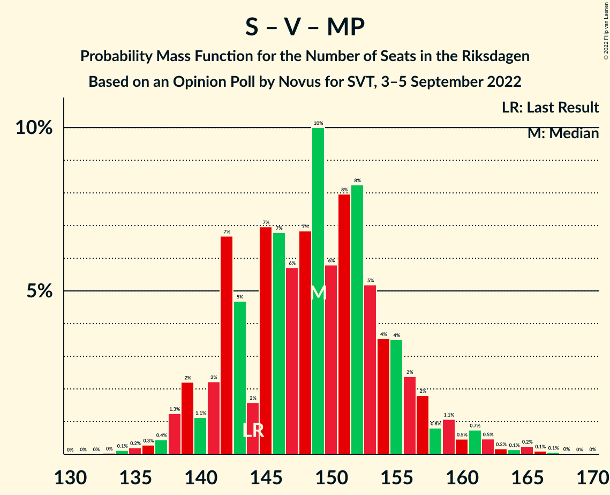

# Opinion Poll by Novus for SVT, 3–5 September 2022

<a href="#voting-intentions">Voting Intentions</a> | <a href="#seats">Seats</a> | <a href="#coalitions">Coalitions</a> | <a href="#technical-information">Technical Information</a>

## Voting Intentions

### Confidence Intervals

| Party | Last Result | Poll Result | 80% Confidence Interval | 90% Confidence Interval | 95% Confidence Interval | 99% Confidence Interval |
|:-----:|:-----------:|:-----------:|:-----------------------:|:-----------------------:|:-----------------------:|:-----------------------:|
| Sveriges socialdemokratiska arbetareparti | 28.3% | 28.7% | 27.3–30.3% |26.9–30.7% |26.5–31.1% |25.8–31.8% |
| Sverigedemokraterna | 17.5% | 19.9% | 18.7–21.3% |18.3–21.7% |18.0–22.0% |17.4–22.7% |
| Moderata samlingspartiet | 19.8% | 17.9% | 16.7–19.3% |16.4–19.6% |16.1–20.0% |15.5–20.6% |
| Centerpartiet | 8.6% | 8.8% | 7.9–9.8% |7.7–10.1% |7.5–10.3% |7.1–10.9% |
| Vänsterpartiet | 8.0% | 7.5% | 6.7–8.5% |6.5–8.7% |6.3–9.0% |5.9–9.5% |
| Kristdemokraterna | 6.3% | 6.1% | 5.4–7.0% |5.2–7.3% |5.0–7.5% |4.7–7.9% |
| Miljöpartiet de gröna | 4.4% | 5.6% | 4.9–6.4% |4.7–6.7% |4.5–6.9% |4.2–7.3% |
| Liberalerna | 5.5% | 4.4% | 3.8–5.2% |3.6–5.4% |3.5–5.6% |3.2–6.0% |

*Note:* The poll result column reflects the actual value used in the calculations. Published results may vary slightly, and in addition be rounded to fewer digits.

## Seats

### Confidence Intervals

| Party | Last Result | Median | 80% Confidence Interval | 90% Confidence Interval | 95% Confidence Interval | 99% Confidence Interval |
|:-----:|:-----------:|:------:|:-----------------------:|:-----------------------:|:-----------------------:|:-----------------------:|
| <a href="#sveriges-socialdemokratiska-arbetareparti">Sveriges socialdemokratiska arbetareparti</a> | 100 | 101 | 96–108 |94–109 |93–111 |91–114 |
| <a href="#sverigedemokraterna">Sverigedemokraterna</a> | 62 | 71 | 65–76 |65–78 |63–79 |61–81 |
| <a href="#moderata-samlingspartiet">Moderata samlingspartiet</a> | 70 | 63 | 59–69 |57–70 |56–72 |55–74 |
| <a href="#centerpartiet">Centerpartiet</a> | 31 | 31 | 28–35 |28–36 |26–37 |25–38 |
| <a href="#vänsterpartiet">Vänsterpartiet</a> | 28 | 27 | 24–30 |23–31 |22–32 |21–34 |
| <a href="#kristdemokraterna">Kristdemokraterna</a> | 22 | 22 | 19–25 |18–26 |18–27 |16–28 |
| <a href="#miljöpartiet-de-gröna">Miljöpartiet de gröna</a> | 16 | 20 | 17–23 |17–24 |16–24 |15–26 |
| <a href="#liberalerna">Liberalerna</a> | 20 | 16 | 0–18 |0–19 |0–20 |0–21 |

### Sveriges socialdemokratiska arbetareparti

*For a full overview of the results for this party, see the [Sveriges socialdemokratiska arbetareparti](party-sverigessocialdemokratiskaarbetareparti.html) page.*

| Number of Seats | Probability | Accumulated | Special Marks |
|:---------------:|:-----------:|:-----------:|:-------------:|
| 88 | 0% | 100% |  |
| 89 | 0.1% | 99.9% |  |
| 90 | 0.3% | 99.8% |  |
| 91 | 0.3% | 99.5% |  |
| 92 | 1.4% | 99.2% |  |
| 93 | 2% | 98% |  |
| 94 | 3% | 96% |  |
| 95 | 3% | 93% |  |
| 96 | 3% | 90% |  |
| 97 | 5% | 87% |  |
| 98 | 4% | 82% |  |
| 99 | 9% | 78% |  |
| 100 | 7% | 69% | Last Result |
| 101 | 13% | 63% | Median |
| 102 | 8% | 49% |  |
| 103 | 5% | 41% |  |
| 104 | 11% | 36% |  |
| 105 | 6% | 26% |  |
| 106 | 4% | 20% |  |
| 107 | 6% | 16% |  |
| 108 | 2% | 10% |  |
| 109 | 3% | 8% |  |
| 110 | 2% | 5% |  |
| 111 | 0.8% | 3% |  |
| 112 | 0.4% | 2% |  |
| 113 | 0.8% | 2% |  |
| 114 | 0.3% | 0.7% |  |
| 115 | 0.2% | 0.4% |  |
| 116 | 0% | 0.2% |  |
| 117 | 0% | 0.1% |  |
| 118 | 0.1% | 0.1% |  |
| 119 | 0% | 0% |  |

### Sverigedemokraterna

*For a full overview of the results for this party, see the [Sverigedemokraterna](party-sverigedemokraterna.html) page.*

| Number of Seats | Probability | Accumulated | Special Marks |
|:---------------:|:-----------:|:-----------:|:-------------:|
| 59 | 0.1% | 100% |  |
| 60 | 0.2% | 99.9% |  |
| 61 | 0.4% | 99.7% |  |
| 62 | 1.0% | 99.3% | Last Result |
| 63 | 2% | 98% |  |
| 64 | 1.3% | 97% |  |
| 65 | 6% | 95% |  |
| 66 | 6% | 90% |  |
| 67 | 5% | 83% |  |
| 68 | 7% | 78% |  |
| 69 | 10% | 72% |  |
| 70 | 9% | 61% |  |
| 71 | 10% | 52% | Median |
| 72 | 9% | 43% |  |
| 73 | 10% | 34% |  |
| 74 | 6% | 24% |  |
| 75 | 6% | 18% |  |
| 76 | 5% | 13% |  |
| 77 | 3% | 8% |  |
| 78 | 1.4% | 5% |  |
| 79 | 2% | 4% |  |
| 80 | 1.0% | 2% |  |
| 81 | 0.4% | 0.8% |  |
| 82 | 0.2% | 0.4% |  |
| 83 | 0.1% | 0.2% |  |
| 84 | 0% | 0.1% |  |
| 85 | 0% | 0% |  |

### Moderata samlingspartiet

*For a full overview of the results for this party, see the [Moderata samlingspartiet](party-moderatasamlingspartiet.html) page.*

| Number of Seats | Probability | Accumulated | Special Marks |
|:---------------:|:-----------:|:-----------:|:-------------:|
| 52 | 0% | 100% |  |
| 53 | 0.1% | 99.9% |  |
| 54 | 0.3% | 99.8% |  |
| 55 | 0.7% | 99.5% |  |
| 56 | 2% | 98.9% |  |
| 57 | 2% | 97% |  |
| 58 | 3% | 95% |  |
| 59 | 6% | 92% |  |
| 60 | 7% | 86% |  |
| 61 | 11% | 80% |  |
| 62 | 11% | 69% |  |
| 63 | 8% | 58% | Median |
| 64 | 10% | 50% |  |
| 65 | 9% | 39% |  |
| 66 | 5% | 30% |  |
| 67 | 8% | 25% |  |
| 68 | 5% | 17% |  |
| 69 | 4% | 12% |  |
| 70 | 4% | 8% | Last Result |
| 71 | 1.2% | 4% |  |
| 72 | 2% | 3% |  |
| 73 | 0.4% | 1.0% |  |
| 74 | 0.3% | 0.6% |  |
| 75 | 0.2% | 0.3% |  |
| 76 | 0.1% | 0.1% |  |
| 77 | 0% | 0.1% |  |
| 78 | 0% | 0% |  |

### Centerpartiet

*For a full overview of the results for this party, see the [Centerpartiet](party-centerpartiet.html) page.*

| Number of Seats | Probability | Accumulated | Special Marks |
|:---------------:|:-----------:|:-----------:|:-------------:|
| 23 | 0.1% | 100% |  |
| 24 | 0.3% | 99.9% |  |
| 25 | 1.0% | 99.6% |  |
| 26 | 1.3% | 98.6% |  |
| 27 | 1.5% | 97% |  |
| 28 | 7% | 96% |  |
| 29 | 16% | 89% |  |
| 30 | 19% | 73% |  |
| 31 | 16% | 53% | Last Result, Median |
| 32 | 7% | 38% |  |
| 33 | 7% | 31% |  |
| 34 | 10% | 25% |  |
| 35 | 8% | 15% |  |
| 36 | 4% | 7% |  |
| 37 | 2% | 3% |  |
| 38 | 0.9% | 1.4% |  |
| 39 | 0.2% | 0.5% |  |
| 40 | 0.1% | 0.2% |  |
| 41 | 0.1% | 0.1% |  |
| 42 | 0% | 0% |  |

### Vänsterpartiet

*For a full overview of the results for this party, see the [Vänsterpartiet](party-vänsterpartiet.html) page.*

| Number of Seats | Probability | Accumulated | Special Marks |
|:---------------:|:-----------:|:-----------:|:-------------:|
| 20 | 0.2% | 100% |  |
| 21 | 1.0% | 99.8% |  |
| 22 | 3% | 98.8% |  |
| 23 | 5% | 96% |  |
| 24 | 8% | 90% |  |
| 25 | 14% | 82% |  |
| 26 | 14% | 68% |  |
| 27 | 16% | 54% | Median |
| 28 | 15% | 38% | Last Result |
| 29 | 9% | 23% |  |
| 30 | 6% | 15% |  |
| 31 | 5% | 8% |  |
| 32 | 2% | 3% |  |
| 33 | 1.0% | 2% |  |
| 34 | 0.4% | 0.6% |  |
| 35 | 0.1% | 0.2% |  |
| 36 | 0.1% | 0.1% |  |
| 37 | 0% | 0% |  |

### Kristdemokraterna

*For a full overview of the results for this party, see the [Kristdemokraterna](party-kristdemokraterna.html) page.*

| Number of Seats | Probability | Accumulated | Special Marks |
|:---------------:|:-----------:|:-----------:|:-------------:|
| 15 | 0.1% | 100% |  |
| 16 | 0.5% | 99.9% |  |
| 17 | 1.4% | 99.4% |  |
| 18 | 4% | 98% |  |
| 19 | 5% | 94% |  |
| 20 | 21% | 89% |  |
| 21 | 15% | 68% |  |
| 22 | 14% | 54% | Last Result, Median |
| 23 | 14% | 40% |  |
| 24 | 12% | 26% |  |
| 25 | 7% | 14% |  |
| 26 | 4% | 7% |  |
| 27 | 2% | 3% |  |
| 28 | 0.6% | 0.9% |  |
| 29 | 0.2% | 0.3% |  |
| 30 | 0.1% | 0.1% |  |
| 31 | 0% | 0% |  |

### Miljöpartiet de gröna

*For a full overview of the results for this party, see the [Miljöpartiet de gröna](party-miljöpartietdegröna.html) page.*

| Number of Seats | Probability | Accumulated | Special Marks |
|:---------------:|:-----------:|:-----------:|:-------------:|
| 0 | 0.1% | 100% |  |
| 1 | 0% | 99.9% |  |
| 2 | 0% | 99.9% |  |
| 3 | 0% | 99.9% |  |
| 4 | 0% | 99.9% |  |
| 5 | 0% | 99.9% |  |
| 6 | 0% | 99.9% |  |
| 7 | 0% | 99.9% |  |
| 8 | 0% | 99.9% |  |
| 9 | 0% | 99.9% |  |
| 10 | 0% | 99.9% |  |
| 11 | 0% | 99.9% |  |
| 12 | 0% | 99.9% |  |
| 13 | 0% | 99.9% |  |
| 14 | 0.1% | 99.9% |  |
| 15 | 1.1% | 99.8% |  |
| 16 | 3% | 98.7% | Last Result |
| 17 | 6% | 96% |  |
| 18 | 13% | 89% |  |
| 19 | 17% | 77% |  |
| 20 | 20% | 60% | Median |
| 21 | 16% | 40% |  |
| 22 | 10% | 24% |  |
| 23 | 8% | 14% |  |
| 24 | 4% | 6% |  |
| 25 | 1.3% | 2% |  |
| 26 | 0.6% | 0.9% |  |
| 27 | 0.1% | 0.3% |  |
| 28 | 0.1% | 0.1% |  |
| 29 | 0% | 0% |  |

### Liberalerna

*For a full overview of the results for this party, see the [Liberalerna](party-liberalerna.html) page.*

| Number of Seats | Probability | Accumulated | Special Marks |
|:---------------:|:-----------:|:-----------:|:-------------:|
| 0 | 22% | 100% |  |
| 1 | 0% | 78% |  |
| 2 | 0% | 78% |  |
| 3 | 0% | 78% |  |
| 4 | 0% | 78% |  |
| 5 | 0% | 78% |  |
| 6 | 0% | 78% |  |
| 7 | 0% | 78% |  |
| 8 | 0% | 78% |  |
| 9 | 0% | 78% |  |
| 10 | 0% | 78% |  |
| 11 | 0% | 78% |  |
| 12 | 0% | 78% |  |
| 13 | 0% | 78% |  |
| 14 | 9% | 78% |  |
| 15 | 17% | 69% |  |
| 16 | 18% | 52% | Median |
| 17 | 17% | 34% |  |
| 18 | 9% | 17% |  |
| 19 | 5% | 8% |  |
| 20 | 2% | 3% | Last Result |
| 21 | 0.5% | 0.8% |  |
| 22 | 0.2% | 0.3% |  |
| 23 | 0% | 0% |  |

## Coalitions

### Confidence Intervals

| Coalition | Last Result | Median | Majority? | 80% Confidence Interval | 90% Confidence Interval | 95% Confidence Interval | 99% Confidence Interval |
|:---------:|:-----------:|:------:|:---------:|:-----------------------:|:-----------------------:|:-----------------------:|:-----------------------:|
| Sveriges socialdemokratiska arbetareparti – Moderata samlingspartiet – Centerpartiet | 201 | 196 | 100% | 190–206 | 188–208 | 186–210 | 184–213 |
| Sveriges socialdemokratiska arbetareparti – Centerpartiet – Vänsterpartiet – Miljöpartiet de gröna – Liberalerna | 195 | 194 | 99.9% | 185–200 | 182–201 | 181–203 | 179–205 |
| Sveriges socialdemokratiska arbetareparti – Centerpartiet – Vänsterpartiet – Miljöpartiet de gröna | 175 | 180 | 82% | 172–187 | 171–189 | 170–192 | 167–197 |
| Sverigedemokraterna – Moderata samlingspartiet – Kristdemokraterna – Liberalerna | 174 | 169 | 18% | 162–177 | 160–178 | 157–179 | 152–182 |
| Sveriges socialdemokratiska arbetareparti – Moderata samlingspartiet | 170 | 165 | 8% | 159–173 | 157–175 | 155–177 | 152–181 |
| Sveriges socialdemokratiska arbetareparti – Centerpartiet – Miljöpartiet de gröna – Liberalerna | 167 | 166 | 6% | 157–173 | 155–175 | 153–176 | 150–179 |
| Sverigedemokraterna – Moderata samlingspartiet – Kristdemokraterna | 154 | 155 | 0.1% | 149–164 | 148–167 | 146–168 | 144–170 |
| Sveriges socialdemokratiska arbetareparti – Centerpartiet – Miljöpartiet de gröna | 147 | 153 | 0% | 147–160 | 145–162 | 143–164 | 140–167 |
| Sveriges socialdemokratiska arbetareparti – Vänsterpartiet – Miljöpartiet de gröna | 144 | 149 | 0% | 142–155 | 140–157 | 139–159 | 136–164 |
| Sverigedemokraterna – Moderata samlingspartiet | 132 | 134 | 0% | 127–142 | 126–144 | 125–145 | 122–147 |
| Moderata samlingspartiet – Centerpartiet – Kristdemokraterna – Liberalerna | 143 | 130 | 0% | 121–137 | 118–138 | 116–140 | 113–143 |
| Sveriges socialdemokratiska arbetareparti – Vänsterpartiet | 128 | 129 | 0% | 122–135 | 120–136 | 119–139 | 117–143 |
| Sveriges socialdemokratiska arbetareparti – Miljöpartiet de gröna | 116 | 122 | 0% | 115–128 | 114–130 | 112–132 | 110–135 |
| Moderata samlingspartiet – Centerpartiet – Kristdemokraterna | 123 | 117 | 0% | 110–124 | 109–127 | 108–127 | 105–131 |
| Moderata samlingspartiet – Centerpartiet – Liberalerna | 121 | 109 | 0% | 98–115 | 96–117 | 94–118 | 91–121 |
| Sveriges socialdemokratiska arbetareparti | 100 | 101 | 0% | 96–108 | 94–109 | 93–111 | 91–114 |
| Moderata samlingspartiet – Kristdemokraterna – Liberalerna | 112 | 99 | 0% | 89–106 | 87–106 | 85–108 | 81–112 |
| Moderata samlingspartiet – Centerpartiet | 101 | 95 | 0% | 89–101 | 87–103 | 86–105 | 84–107 |
| Moderata samlingspartiet – Kristdemokraterna | 92 | 85 | 0% | 80–91 | 79–94 | 77–96 | 75–97 |

### Sveriges socialdemokratiska arbetareparti – Moderata samlingspartiet – Centerpartiet

| Number of Seats | Probability | Accumulated | Special Marks |
|:---------------:|:-----------:|:-----------:|:-------------:|
| 180 | 0% | 100% |  |
| 181 | 0.1% | 99.9% |  |
| 182 | 0.1% | 99.9% |  |
| 183 | 0.2% | 99.7% |  |
| 184 | 0.3% | 99.5% |  |
| 185 | 1.1% | 99.3% |  |
| 186 | 0.8% | 98% |  |
| 187 | 1.4% | 97% |  |
| 188 | 3% | 96% |  |
| 189 | 2% | 93% |  |
| 190 | 5% | 91% |  |
| 191 | 6% | 86% |  |
| 192 | 9% | 81% |  |
| 193 | 3% | 72% |  |
| 194 | 9% | 68% |  |
| 195 | 6% | 59% | Median |
| 196 | 7% | 54% |  |
| 197 | 6% | 47% |  |
| 198 | 8% | 41% |  |
| 199 | 3% | 32% |  |
| 200 | 4% | 29% |  |
| 201 | 5% | 25% | Last Result |
| 202 | 3% | 21% |  |
| 203 | 3% | 17% |  |
| 204 | 2% | 15% |  |
| 205 | 2% | 12% |  |
| 206 | 3% | 10% |  |
| 207 | 1.1% | 7% |  |
| 208 | 2% | 6% |  |
| 209 | 1.0% | 4% |  |
| 210 | 1.1% | 3% |  |
| 211 | 0.8% | 2% |  |
| 212 | 0.2% | 0.8% |  |
| 213 | 0.2% | 0.6% |  |
| 214 | 0.3% | 0.4% |  |
| 215 | 0.1% | 0.2% |  |
| 216 | 0% | 0.1% |  |
| 217 | 0% | 0.1% |  |
| 218 | 0% | 0% |  |

### Sveriges socialdemokratiska arbetareparti – Centerpartiet – Vänsterpartiet – Miljöpartiet de gröna – Liberalerna

| Number of Seats | Probability | Accumulated | Special Marks |
|:---------------:|:-----------:|:-----------:|:-------------:|
| 174 | 0.1% | 100% |  |
| 175 | 0% | 99.9% | Majority |
| 176 | 0% | 99.9% |  |
| 177 | 0.1% | 99.8% |  |
| 178 | 0.1% | 99.7% |  |
| 179 | 0.6% | 99.7% |  |
| 180 | 0.3% | 99.0% |  |
| 181 | 2% | 98.7% |  |
| 182 | 3% | 97% |  |
| 183 | 2% | 94% |  |
| 184 | 2% | 92% |  |
| 185 | 3% | 91% |  |
| 186 | 5% | 87% |  |
| 187 | 4% | 83% |  |
| 188 | 5% | 78% |  |
| 189 | 4% | 74% |  |
| 190 | 7% | 70% |  |
| 191 | 5% | 63% |  |
| 192 | 3% | 58% |  |
| 193 | 4% | 55% |  |
| 194 | 8% | 51% |  |
| 195 | 7% | 43% | Last Result, Median |
| 196 | 8% | 36% |  |
| 197 | 4% | 28% |  |
| 198 | 7% | 24% |  |
| 199 | 5% | 17% |  |
| 200 | 4% | 12% |  |
| 201 | 4% | 8% |  |
| 202 | 2% | 5% |  |
| 203 | 1.3% | 3% |  |
| 204 | 0.8% | 1.4% |  |
| 205 | 0.2% | 0.6% |  |
| 206 | 0.2% | 0.4% |  |
| 207 | 0.1% | 0.2% |  |
| 208 | 0% | 0.1% |  |
| 209 | 0% | 0.1% |  |
| 210 | 0% | 0% |  |

### Sveriges socialdemokratiska arbetareparti – Centerpartiet – Vänsterpartiet – Miljöpartiet de gröna

| Number of Seats | Probability | Accumulated | Special Marks |
|:---------------:|:-----------:|:-----------:|:-------------:|
| 163 | 0% | 100% |  |
| 164 | 0% | 99.9% |  |
| 165 | 0.1% | 99.9% |  |
| 166 | 0.2% | 99.8% |  |
| 167 | 0.4% | 99.5% |  |
| 168 | 0.3% | 99.2% |  |
| 169 | 0.7% | 98.9% |  |
| 170 | 1.2% | 98% |  |
| 171 | 4% | 97% |  |
| 172 | 3% | 93% |  |
| 173 | 3% | 89% |  |
| 174 | 5% | 87% |  |
| 175 | 5% | 82% | Last Result, Majority |
| 176 | 4% | 77% |  |
| 177 | 7% | 73% |  |
| 178 | 8% | 66% |  |
| 179 | 6% | 58% | Median |
| 180 | 7% | 53% |  |
| 181 | 9% | 46% |  |
| 182 | 7% | 37% |  |
| 183 | 5% | 31% |  |
| 184 | 6% | 26% |  |
| 185 | 3% | 20% |  |
| 186 | 5% | 16% |  |
| 187 | 4% | 11% |  |
| 188 | 2% | 7% |  |
| 189 | 2% | 5% |  |
| 190 | 0.5% | 4% |  |
| 191 | 0.7% | 3% |  |
| 192 | 0.4% | 3% |  |
| 193 | 0.4% | 2% |  |
| 194 | 0.7% | 2% |  |
| 195 | 0.4% | 1.2% |  |
| 196 | 0.3% | 0.8% |  |
| 197 | 0.2% | 0.5% |  |
| 198 | 0.2% | 0.3% |  |
| 199 | 0.1% | 0.2% |  |
| 200 | 0% | 0.1% |  |
| 201 | 0% | 0.1% |  |
| 202 | 0% | 0% |  |

### Sverigedemokraterna – Moderata samlingspartiet – Kristdemokraterna – Liberalerna

| Number of Seats | Probability | Accumulated | Special Marks |
|:---------------:|:-----------:|:-----------:|:-------------:|
| 148 | 0% | 100% |  |
| 149 | 0% | 99.9% |  |
| 150 | 0.1% | 99.9% |  |
| 151 | 0.2% | 99.8% |  |
| 152 | 0.2% | 99.7% |  |
| 153 | 0.3% | 99.5% |  |
| 154 | 0.4% | 99.2% |  |
| 155 | 0.7% | 98.8% |  |
| 156 | 0.4% | 98% |  |
| 157 | 0.4% | 98% |  |
| 158 | 0.7% | 97% |  |
| 159 | 0.5% | 97% |  |
| 160 | 2% | 96% |  |
| 161 | 2% | 95% |  |
| 162 | 4% | 93% |  |
| 163 | 5% | 89% |  |
| 164 | 3% | 84% |  |
| 165 | 6% | 80% |  |
| 166 | 5% | 74% |  |
| 167 | 7% | 69% |  |
| 168 | 9% | 63% |  |
| 169 | 7% | 54% |  |
| 170 | 6% | 47% |  |
| 171 | 8% | 42% |  |
| 172 | 7% | 34% | Median |
| 173 | 4% | 27% |  |
| 174 | 5% | 23% | Last Result |
| 175 | 5% | 18% | Majority |
| 176 | 3% | 13% |  |
| 177 | 3% | 11% |  |
| 178 | 4% | 7% |  |
| 179 | 1.2% | 3% |  |
| 180 | 0.7% | 2% |  |
| 181 | 0.3% | 1.1% |  |
| 182 | 0.4% | 0.8% |  |
| 183 | 0.2% | 0.5% |  |
| 184 | 0.1% | 0.2% |  |
| 185 | 0% | 0.1% |  |
| 186 | 0% | 0.1% |  |
| 187 | 0% | 0% |  |

### Sveriges socialdemokratiska arbetareparti – Moderata samlingspartiet

| Number of Seats | Probability | Accumulated | Special Marks |
|:---------------:|:-----------:|:-----------:|:-------------:|
| 149 | 0% | 100% |  |
| 150 | 0.1% | 99.9% |  |
| 151 | 0.1% | 99.8% |  |
| 152 | 0.2% | 99.7% |  |
| 153 | 0.5% | 99.5% |  |
| 154 | 0.5% | 99.0% |  |
| 155 | 1.2% | 98% |  |
| 156 | 2% | 97% |  |
| 157 | 1.3% | 95% |  |
| 158 | 3% | 94% |  |
| 159 | 4% | 90% |  |
| 160 | 6% | 87% |  |
| 161 | 7% | 80% |  |
| 162 | 7% | 73% |  |
| 163 | 8% | 66% |  |
| 164 | 6% | 58% | Median |
| 165 | 4% | 52% |  |
| 166 | 8% | 48% |  |
| 167 | 6% | 40% |  |
| 168 | 6% | 34% |  |
| 169 | 4% | 27% |  |
| 170 | 4% | 24% | Last Result |
| 171 | 5% | 20% |  |
| 172 | 3% | 15% |  |
| 173 | 1.3% | 11% |  |
| 174 | 2% | 10% |  |
| 175 | 4% | 8% | Majority |
| 176 | 0.9% | 4% |  |
| 177 | 1.2% | 3% |  |
| 178 | 0.7% | 2% |  |
| 179 | 0.3% | 1.1% |  |
| 180 | 0.1% | 0.8% |  |
| 181 | 0.3% | 0.6% |  |
| 182 | 0.2% | 0.4% |  |
| 183 | 0% | 0.2% |  |
| 184 | 0.1% | 0.1% |  |
| 185 | 0% | 0% |  |

### Sveriges socialdemokratiska arbetareparti – Centerpartiet – Miljöpartiet de gröna – Liberalerna

| Number of Seats | Probability | Accumulated | Special Marks |
|:---------------:|:-----------:|:-----------:|:-------------:|
| 146 | 0% | 100% |  |
| 147 | 0% | 99.9% |  |
| 148 | 0.1% | 99.9% |  |
| 149 | 0.1% | 99.8% |  |
| 150 | 0.4% | 99.7% |  |
| 151 | 1.1% | 99.3% |  |
| 152 | 0.6% | 98% |  |
| 153 | 0.5% | 98% |  |
| 154 | 2% | 97% |  |
| 155 | 2% | 95% |  |
| 156 | 2% | 93% |  |
| 157 | 1.5% | 91% |  |
| 158 | 3% | 90% |  |
| 159 | 3% | 87% |  |
| 160 | 3% | 84% |  |
| 161 | 5% | 81% |  |
| 162 | 4% | 77% |  |
| 163 | 4% | 73% |  |
| 164 | 6% | 69% |  |
| 165 | 7% | 63% |  |
| 166 | 6% | 56% |  |
| 167 | 7% | 50% | Last Result |
| 168 | 7% | 43% | Median |
| 169 | 5% | 36% |  |
| 170 | 5% | 31% |  |
| 171 | 7% | 25% |  |
| 172 | 7% | 19% |  |
| 173 | 3% | 12% |  |
| 174 | 3% | 9% |  |
| 175 | 2% | 6% | Majority |
| 176 | 1.4% | 4% |  |
| 177 | 1.1% | 2% |  |
| 178 | 0.7% | 1.3% |  |
| 179 | 0.3% | 0.6% |  |
| 180 | 0.2% | 0.4% |  |
| 181 | 0.1% | 0.2% |  |
| 182 | 0.1% | 0.1% |  |
| 183 | 0% | 0% |  |

### Sverigedemokraterna – Moderata samlingspartiet – Kristdemokraterna

| Number of Seats | Probability | Accumulated | Special Marks |
|:---------------:|:-----------:|:-----------:|:-------------:|
| 140 | 0% | 100% |  |
| 141 | 0% | 99.9% |  |
| 142 | 0.1% | 99.9% |  |
| 143 | 0.2% | 99.8% |  |
| 144 | 0.2% | 99.6% |  |
| 145 | 0.8% | 99.4% |  |
| 146 | 1.3% | 98.6% |  |
| 147 | 2% | 97% |  |
| 148 | 4% | 95% |  |
| 149 | 4% | 92% |  |
| 150 | 5% | 88% |  |
| 151 | 7% | 83% |  |
| 152 | 4% | 76% |  |
| 153 | 8% | 72% |  |
| 154 | 7% | 64% | Last Result |
| 155 | 8% | 57% |  |
| 156 | 4% | 49% | Median |
| 157 | 3% | 45% |  |
| 158 | 5% | 42% |  |
| 159 | 7% | 37% |  |
| 160 | 4% | 30% |  |
| 161 | 5% | 26% |  |
| 162 | 4% | 22% |  |
| 163 | 5% | 17% |  |
| 164 | 3% | 13% |  |
| 165 | 2% | 9% |  |
| 166 | 2% | 8% |  |
| 167 | 3% | 6% |  |
| 168 | 2% | 3% |  |
| 169 | 0.3% | 1.3% |  |
| 170 | 0.6% | 1.0% |  |
| 171 | 0.1% | 0.3% |  |
| 172 | 0.1% | 0.3% |  |
| 173 | 0% | 0.2% |  |
| 174 | 0% | 0.1% |  |
| 175 | 0.1% | 0.1% | Majority |
| 176 | 0% | 0% |  |

### Sveriges socialdemokratiska arbetareparti – Centerpartiet – Miljöpartiet de gröna

| Number of Seats | Probability | Accumulated | Special Marks |
|:---------------:|:-----------:|:-----------:|:-------------:|
| 136 | 0% | 100% |  |
| 137 | 0.1% | 99.9% |  |
| 138 | 0.1% | 99.9% |  |
| 139 | 0.2% | 99.8% |  |
| 140 | 0.3% | 99.6% |  |
| 141 | 0.3% | 99.3% |  |
| 142 | 0.9% | 99.0% |  |
| 143 | 0.8% | 98% |  |
| 144 | 1.4% | 97% |  |
| 145 | 2% | 96% |  |
| 146 | 3% | 93% |  |
| 147 | 4% | 90% | Last Result |
| 148 | 5% | 86% |  |
| 149 | 8% | 81% |  |
| 150 | 5% | 73% |  |
| 151 | 8% | 68% |  |
| 152 | 7% | 61% | Median |
| 153 | 8% | 54% |  |
| 154 | 9% | 46% |  |
| 155 | 7% | 37% |  |
| 156 | 5% | 29% |  |
| 157 | 4% | 25% |  |
| 158 | 6% | 21% |  |
| 159 | 4% | 15% |  |
| 160 | 3% | 11% |  |
| 161 | 3% | 9% |  |
| 162 | 1.3% | 5% |  |
| 163 | 1.3% | 4% |  |
| 164 | 0.4% | 3% |  |
| 165 | 0.6% | 2% |  |
| 166 | 0.6% | 2% |  |
| 167 | 0.7% | 1.2% |  |
| 168 | 0.1% | 0.5% |  |
| 169 | 0.2% | 0.4% |  |
| 170 | 0.1% | 0.2% |  |
| 171 | 0% | 0.1% |  |
| 172 | 0% | 0.1% |  |
| 173 | 0% | 0% |  |

### Sveriges socialdemokratiska arbetareparti – Vänsterpartiet – Miljöpartiet de gröna

| Number of Seats | Probability | Accumulated | Special Marks |
|:---------------:|:-----------:|:-----------:|:-------------:|
| 132 | 0% | 100% |  |
| 133 | 0% | 99.9% |  |
| 134 | 0.1% | 99.9% |  |
| 135 | 0.2% | 99.8% |  |
| 136 | 0.3% | 99.6% |  |
| 137 | 0.4% | 99.3% |  |
| 138 | 1.3% | 98.9% |  |
| 139 | 2% | 98% |  |
| 140 | 1.1% | 95% |  |
| 141 | 2% | 94% |  |
| 142 | 7% | 92% |  |
| 143 | 5% | 85% |  |
| 144 | 2% | 81% | Last Result |
| 145 | 7% | 79% |  |
| 146 | 7% | 72% |  |
| 147 | 6% | 65% |  |
| 148 | 7% | 60% | Median |
| 149 | 10% | 53% |  |
| 150 | 6% | 43% |  |
| 151 | 8% | 37% |  |
| 152 | 8% | 29% |  |
| 153 | 5% | 21% |  |
| 154 | 4% | 16% |  |
| 155 | 4% | 12% |  |
| 156 | 2% | 9% |  |
| 157 | 2% | 6% |  |
| 158 | 0.8% | 4% |  |
| 159 | 1.1% | 4% |  |
| 160 | 0.5% | 2% |  |
| 161 | 0.7% | 2% |  |
| 162 | 0.5% | 1.2% |  |
| 163 | 0.2% | 0.8% |  |
| 164 | 0.1% | 0.6% |  |
| 165 | 0.2% | 0.5% |  |
| 166 | 0.1% | 0.2% |  |
| 167 | 0.1% | 0.1% |  |
| 168 | 0% | 0.1% |  |
| 169 | 0% | 0% |  |

### Sverigedemokraterna – Moderata samlingspartiet

| Number of Seats | Probability | Accumulated | Special Marks |
|:---------------:|:-----------:|:-----------:|:-------------:|
| 119 | 0% | 100% |  |
| 120 | 0.1% | 99.9% |  |
| 121 | 0.1% | 99.9% |  |
| 122 | 0.4% | 99.7% |  |
| 123 | 0.3% | 99.3% |  |
| 124 | 0.9% | 99.0% |  |
| 125 | 2% | 98% |  |
| 126 | 3% | 96% |  |
| 127 | 3% | 93% |  |
| 128 | 4% | 90% |  |
| 129 | 5% | 86% |  |
| 130 | 8% | 81% |  |
| 131 | 8% | 73% |  |
| 132 | 8% | 65% | Last Result |
| 133 | 5% | 57% |  |
| 134 | 4% | 52% | Median |
| 135 | 7% | 48% |  |
| 136 | 5% | 41% |  |
| 137 | 6% | 36% |  |
| 138 | 5% | 30% |  |
| 139 | 4% | 25% |  |
| 140 | 4% | 21% |  |
| 141 | 6% | 17% |  |
| 142 | 3% | 11% |  |
| 143 | 3% | 8% |  |
| 144 | 2% | 5% |  |
| 145 | 2% | 3% |  |
| 146 | 0.7% | 1.5% |  |
| 147 | 0.4% | 0.8% |  |
| 148 | 0.2% | 0.4% |  |
| 149 | 0.1% | 0.2% |  |
| 150 | 0% | 0.2% |  |
| 151 | 0.1% | 0.1% |  |
| 152 | 0% | 0.1% |  |
| 153 | 0% | 0% |  |

### Moderata samlingspartiet – Centerpartiet – Kristdemokraterna – Liberalerna

| Number of Seats | Probability | Accumulated | Special Marks |
|:---------------:|:-----------:|:-----------:|:-------------:|
| 109 | 0% | 100% |  |
| 110 | 0.1% | 99.9% |  |
| 111 | 0.2% | 99.9% |  |
| 112 | 0.1% | 99.7% |  |
| 113 | 0.5% | 99.6% |  |
| 114 | 0.4% | 99.0% |  |
| 115 | 0.6% | 98.6% |  |
| 116 | 0.6% | 98% |  |
| 117 | 0.7% | 97% |  |
| 118 | 2% | 97% |  |
| 119 | 2% | 95% |  |
| 120 | 0.9% | 93% |  |
| 121 | 3% | 92% |  |
| 122 | 3% | 89% |  |
| 123 | 1.4% | 86% |  |
| 124 | 3% | 85% |  |
| 125 | 4% | 82% |  |
| 126 | 5% | 79% |  |
| 127 | 6% | 74% |  |
| 128 | 7% | 68% |  |
| 129 | 6% | 60% |  |
| 130 | 6% | 55% |  |
| 131 | 8% | 49% |  |
| 132 | 7% | 41% | Median |
| 133 | 8% | 34% |  |
| 134 | 6% | 26% |  |
| 135 | 5% | 20% |  |
| 136 | 4% | 15% |  |
| 137 | 3% | 11% |  |
| 138 | 3% | 8% |  |
| 139 | 1.5% | 5% |  |
| 140 | 2% | 3% |  |
| 141 | 0.7% | 2% |  |
| 142 | 0.5% | 1.1% |  |
| 143 | 0.3% | 0.6% | Last Result |
| 144 | 0.2% | 0.4% |  |
| 145 | 0.1% | 0.2% |  |
| 146 | 0% | 0.1% |  |
| 147 | 0% | 0.1% |  |
| 148 | 0% | 0% |  |

### Sveriges socialdemokratiska arbetareparti – Vänsterpartiet

| Number of Seats | Probability | Accumulated | Special Marks |
|:---------------:|:-----------:|:-----------:|:-------------:|
| 114 | 0.1% | 100% |  |
| 115 | 0.1% | 99.9% |  |
| 116 | 0.2% | 99.8% |  |
| 117 | 0.7% | 99.6% |  |
| 118 | 0.9% | 98.9% |  |
| 119 | 1.2% | 98% |  |
| 120 | 2% | 97% |  |
| 121 | 3% | 95% |  |
| 122 | 6% | 92% |  |
| 123 | 5% | 86% |  |
| 124 | 4% | 81% |  |
| 125 | 7% | 77% |  |
| 126 | 6% | 70% |  |
| 127 | 5% | 64% |  |
| 128 | 6% | 60% | Last Result, Median |
| 129 | 9% | 54% |  |
| 130 | 7% | 45% |  |
| 131 | 8% | 38% |  |
| 132 | 9% | 30% |  |
| 133 | 7% | 21% |  |
| 134 | 3% | 14% |  |
| 135 | 3% | 10% |  |
| 136 | 3% | 7% |  |
| 137 | 0.8% | 4% |  |
| 138 | 0.6% | 3% |  |
| 139 | 0.5% | 3% |  |
| 140 | 0.9% | 2% |  |
| 141 | 0.4% | 1.5% |  |
| 142 | 0.3% | 1.0% |  |
| 143 | 0.3% | 0.7% |  |
| 144 | 0.2% | 0.4% |  |
| 145 | 0.1% | 0.2% |  |
| 146 | 0.1% | 0.1% |  |
| 147 | 0% | 0% |  |

### Sveriges socialdemokratiska arbetareparti – Miljöpartiet de gröna

| Number of Seats | Probability | Accumulated | Special Marks |
|:---------------:|:-----------:|:-----------:|:-------------:|
| 105 | 0% | 100% |  |
| 106 | 0% | 99.9% |  |
| 107 | 0.1% | 99.9% |  |
| 108 | 0.1% | 99.9% |  |
| 109 | 0.2% | 99.8% |  |
| 110 | 0.3% | 99.6% |  |
| 111 | 0.8% | 99.3% |  |
| 112 | 1.5% | 98% |  |
| 113 | 2% | 97% |  |
| 114 | 4% | 95% |  |
| 115 | 2% | 92% |  |
| 116 | 4% | 90% | Last Result |
| 117 | 3% | 86% |  |
| 118 | 5% | 83% |  |
| 119 | 6% | 78% |  |
| 120 | 12% | 72% |  |
| 121 | 8% | 60% | Median |
| 122 | 10% | 52% |  |
| 123 | 8% | 42% |  |
| 124 | 6% | 33% |  |
| 125 | 6% | 27% |  |
| 126 | 4% | 21% |  |
| 127 | 5% | 17% |  |
| 128 | 3% | 12% |  |
| 129 | 3% | 9% |  |
| 130 | 2% | 6% |  |
| 131 | 0.7% | 4% |  |
| 132 | 1.0% | 3% |  |
| 133 | 0.7% | 2% |  |
| 134 | 0.8% | 1.4% |  |
| 135 | 0.2% | 0.6% |  |
| 136 | 0.1% | 0.4% |  |
| 137 | 0.2% | 0.3% |  |
| 138 | 0.1% | 0.2% |  |
| 139 | 0% | 0.1% |  |
| 140 | 0% | 0% |  |

### Moderata samlingspartiet – Centerpartiet – Kristdemokraterna

| Number of Seats | Probability | Accumulated | Special Marks |
|:---------------:|:-----------:|:-----------:|:-------------:|
| 102 | 0% | 100% |  |
| 103 | 0.1% | 99.9% |  |
| 104 | 0.2% | 99.9% |  |
| 105 | 0.3% | 99.7% |  |
| 106 | 0.9% | 99.4% |  |
| 107 | 1.0% | 98% |  |
| 108 | 2% | 98% |  |
| 109 | 2% | 96% |  |
| 110 | 4% | 94% |  |
| 111 | 5% | 90% |  |
| 112 | 6% | 85% |  |
| 113 | 7% | 78% |  |
| 114 | 6% | 72% |  |
| 115 | 7% | 65% |  |
| 116 | 7% | 58% | Median |
| 117 | 9% | 51% |  |
| 118 | 7% | 42% |  |
| 119 | 8% | 35% |  |
| 120 | 5% | 27% |  |
| 121 | 4% | 23% |  |
| 122 | 5% | 18% |  |
| 123 | 1.0% | 14% | Last Result |
| 124 | 3% | 13% |  |
| 125 | 3% | 10% |  |
| 126 | 2% | 7% |  |
| 127 | 3% | 5% |  |
| 128 | 0.6% | 2% |  |
| 129 | 0.7% | 2% |  |
| 130 | 0.2% | 0.9% |  |
| 131 | 0.5% | 0.8% |  |
| 132 | 0.2% | 0.3% |  |
| 133 | 0% | 0.1% |  |
| 134 | 0% | 0.1% |  |
| 135 | 0% | 0% |  |

### Moderata samlingspartiet – Centerpartiet – Liberalerna

| Number of Seats | Probability | Accumulated | Special Marks |
|:---------------:|:-----------:|:-----------:|:-------------:|
| 87 | 0.1% | 100% |  |
| 88 | 0.1% | 99.9% |  |
| 89 | 0.1% | 99.9% |  |
| 90 | 0.2% | 99.8% |  |
| 91 | 0.2% | 99.6% |  |
| 92 | 0.8% | 99.4% |  |
| 93 | 0.5% | 98.6% |  |
| 94 | 1.5% | 98% |  |
| 95 | 0.8% | 97% |  |
| 96 | 2% | 96% |  |
| 97 | 3% | 94% |  |
| 98 | 2% | 92% |  |
| 99 | 2% | 90% |  |
| 100 | 0.6% | 88% |  |
| 101 | 4% | 87% |  |
| 102 | 2% | 83% |  |
| 103 | 5% | 81% |  |
| 104 | 3% | 76% |  |
| 105 | 6% | 73% |  |
| 106 | 3% | 67% |  |
| 107 | 5% | 65% |  |
| 108 | 9% | 59% |  |
| 109 | 8% | 50% |  |
| 110 | 5% | 42% | Median |
| 111 | 9% | 38% |  |
| 112 | 7% | 29% |  |
| 113 | 6% | 22% |  |
| 114 | 3% | 16% |  |
| 115 | 4% | 12% |  |
| 116 | 2% | 8% |  |
| 117 | 3% | 6% |  |
| 118 | 0.7% | 3% |  |
| 119 | 0.6% | 2% |  |
| 120 | 0.7% | 1.3% |  |
| 121 | 0.2% | 0.6% | Last Result |
| 122 | 0.2% | 0.4% |  |
| 123 | 0.1% | 0.2% |  |
| 124 | 0.1% | 0.1% |  |
| 125 | 0% | 0% |  |

### Sveriges socialdemokratiska arbetareparti

| Number of Seats | Probability | Accumulated | Special Marks |
|:---------------:|:-----------:|:-----------:|:-------------:|
| 88 | 0% | 100% |  |
| 89 | 0.1% | 99.9% |  |
| 90 | 0.3% | 99.8% |  |
| 91 | 0.3% | 99.5% |  |
| 92 | 1.4% | 99.2% |  |
| 93 | 2% | 98% |  |
| 94 | 3% | 96% |  |
| 95 | 3% | 93% |  |
| 96 | 3% | 90% |  |
| 97 | 5% | 87% |  |
| 98 | 4% | 82% |  |
| 99 | 9% | 78% |  |
| 100 | 7% | 69% | Last Result |
| 101 | 13% | 63% | Median |
| 102 | 8% | 49% |  |
| 103 | 5% | 41% |  |
| 104 | 11% | 36% |  |
| 105 | 6% | 26% |  |
| 106 | 4% | 20% |  |
| 107 | 6% | 16% |  |
| 108 | 2% | 10% |  |
| 109 | 3% | 8% |  |
| 110 | 2% | 5% |  |
| 111 | 0.8% | 3% |  |
| 112 | 0.4% | 2% |  |
| 113 | 0.8% | 2% |  |
| 114 | 0.3% | 0.7% |  |
| 115 | 0.2% | 0.4% |  |
| 116 | 0% | 0.2% |  |
| 117 | 0% | 0.1% |  |
| 118 | 0.1% | 0.1% |  |
| 119 | 0% | 0% |  |

### Moderata samlingspartiet – Kristdemokraterna – Liberalerna

| Number of Seats | Probability | Accumulated | Special Marks |
|:---------------:|:-----------:|:-----------:|:-------------:|
| 78 | 0% | 100% |  |
| 79 | 0.1% | 99.9% |  |
| 80 | 0.2% | 99.8% |  |
| 81 | 0.3% | 99.6% |  |
| 82 | 0.5% | 99.3% |  |
| 83 | 0.7% | 98.8% |  |
| 84 | 0.4% | 98% |  |
| 85 | 1.3% | 98% |  |
| 86 | 1.3% | 96% |  |
| 87 | 3% | 95% |  |
| 88 | 1.2% | 93% |  |
| 89 | 3% | 91% |  |
| 90 | 2% | 88% |  |
| 91 | 2% | 86% |  |
| 92 | 2% | 85% |  |
| 93 | 2% | 82% |  |
| 94 | 2% | 80% |  |
| 95 | 5% | 78% |  |
| 96 | 5% | 73% |  |
| 97 | 2% | 68% |  |
| 98 | 8% | 66% |  |
| 99 | 14% | 58% |  |
| 100 | 3% | 44% |  |
| 101 | 7% | 41% | Median |
| 102 | 7% | 34% |  |
| 103 | 8% | 26% |  |
| 104 | 2% | 18% |  |
| 105 | 5% | 17% |  |
| 106 | 7% | 11% |  |
| 107 | 0.9% | 5% |  |
| 108 | 2% | 4% |  |
| 109 | 1.1% | 2% |  |
| 110 | 0.4% | 1.2% |  |
| 111 | 0.2% | 0.7% |  |
| 112 | 0.2% | 0.5% | Last Result |
| 113 | 0.2% | 0.3% |  |
| 114 | 0% | 0.1% |  |
| 115 | 0% | 0.1% |  |
| 116 | 0% | 0% |  |

### Moderata samlingspartiet – Centerpartiet

| Number of Seats | Probability | Accumulated | Special Marks |
|:---------------:|:-----------:|:-----------:|:-------------:|
| 81 | 0% | 100% |  |
| 82 | 0.1% | 99.9% |  |
| 83 | 0.3% | 99.9% |  |
| 84 | 0.4% | 99.6% |  |
| 85 | 0.8% | 99.2% |  |
| 86 | 1.0% | 98% |  |
| 87 | 3% | 97% |  |
| 88 | 2% | 94% |  |
| 89 | 4% | 92% |  |
| 90 | 4% | 87% |  |
| 91 | 9% | 83% |  |
| 92 | 6% | 75% |  |
| 93 | 9% | 69% |  |
| 94 | 8% | 60% | Median |
| 95 | 9% | 52% |  |
| 96 | 8% | 43% |  |
| 97 | 9% | 36% |  |
| 98 | 6% | 27% |  |
| 99 | 5% | 21% |  |
| 100 | 2% | 16% |  |
| 101 | 5% | 13% | Last Result |
| 102 | 2% | 9% |  |
| 103 | 3% | 7% |  |
| 104 | 0.4% | 4% |  |
| 105 | 2% | 3% |  |
| 106 | 0.2% | 2% |  |
| 107 | 0.8% | 1.3% |  |
| 108 | 0.3% | 0.5% |  |
| 109 | 0.1% | 0.2% |  |
| 110 | 0% | 0.1% |  |
| 111 | 0% | 0% |  |

### Moderata samlingspartiet – Kristdemokraterna

| Number of Seats | Probability | Accumulated | Special Marks |
|:---------------:|:-----------:|:-----------:|:-------------:|
| 73 | 0.1% | 100% |  |
| 74 | 0.2% | 99.9% |  |
| 75 | 0.4% | 99.6% |  |
| 76 | 0.5% | 99.3% |  |
| 77 | 2% | 98.8% |  |
| 78 | 2% | 97% |  |
| 79 | 4% | 95% |  |
| 80 | 3% | 92% |  |
| 81 | 5% | 88% |  |
| 82 | 10% | 83% |  |
| 83 | 7% | 73% |  |
| 84 | 9% | 66% |  |
| 85 | 9% | 57% | Median |
| 86 | 9% | 48% |  |
| 87 | 8% | 40% |  |
| 88 | 7% | 32% |  |
| 89 | 8% | 25% |  |
| 90 | 5% | 17% |  |
| 91 | 3% | 13% |  |
| 92 | 2% | 10% | Last Result |
| 93 | 2% | 8% |  |
| 94 | 2% | 6% |  |
| 95 | 0.5% | 4% |  |
| 96 | 3% | 3% |  |
| 97 | 0.3% | 0.7% |  |
| 98 | 0.1% | 0.3% |  |
| 99 | 0% | 0.2% |  |
| 100 | 0.1% | 0.2% |  |
| 101 | 0% | 0% |  |

## Technical Information

### Opinion Poll

+ **Polling firm:** Novus
+ **Commissioner(s):** SVT
+ **Fieldwork period:** 3–5 September 2022

### Calculations

+ **Sample size:** 1500
+ **Simulations done:** 1,048,576
+ **Error estimate:** 0.85%

