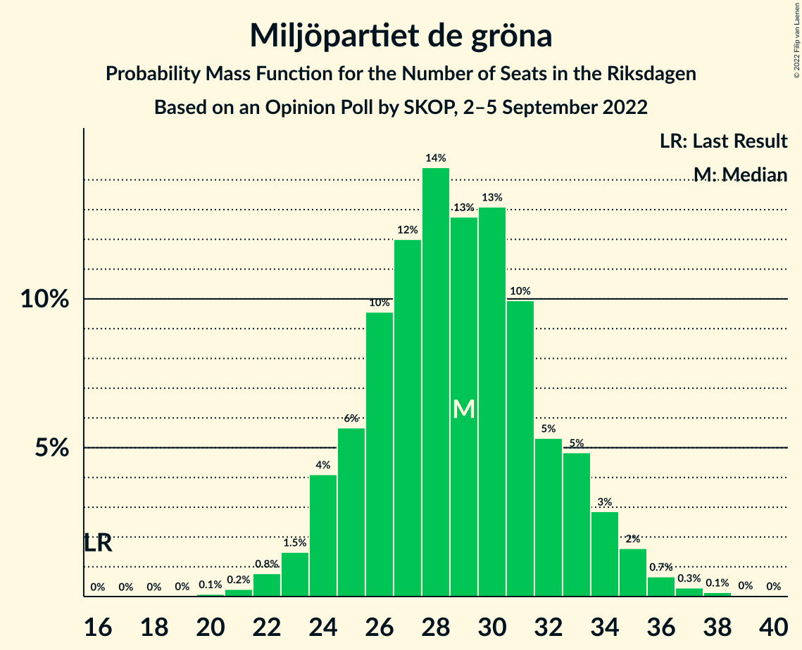

# Opinion Poll by SKOP, 2–5 September 2022

<a href="#voting-intentions">Voting Intentions</a> | <a href="#seats">Seats</a> | <a href="#coalitions">Coalitions</a> | <a href="#technical-information">Technical Information</a>

## Voting Intentions

### Confidence Intervals

| Party | Last Result | Poll Result | 80% Confidence Interval | 90% Confidence Interval | 95% Confidence Interval | 99% Confidence Interval |
|:-----:|:-----------:|:-----------:|:-----------------------:|:-----------------------:|:-----------------------:|:-----------------------:|
| Sveriges socialdemokratiska arbetareparti | 28.3% | 27.6% | 26.0–29.4% |25.5–29.9% |25.1–30.3% |24.3–31.2% |
| Sverigedemokraterna | 17.5% | 18.5% | 17.1–20.1% |16.7–20.5% |16.4–20.9% |15.7–21.7% |
| Moderata samlingspartiet | 19.8% | 18.1% | 16.7–19.6% |16.3–20.1% |15.9–20.5% |15.3–21.2% |
| Miljöpartiet de gröna | 4.4% | 8.1% | 7.1–9.3% |6.9–9.6% |6.6–9.9% |6.2–10.4% |
| Vänsterpartiet | 8.0% | 7.7% | 6.7–8.8% |6.5–9.1% |6.2–9.4% |5.8–9.9% |
| Centerpartiet | 8.6% | 7.4% | 6.5–8.5% |6.2–8.8% |6.0–9.1% |5.6–9.6% |
| Kristdemokraterna | 6.3% | 6.0% | 5.2–7.0% |4.9–7.3% |4.7–7.5% |4.4–8.0% |
| Liberalerna | 5.5% | 5.5% | 4.7–6.5% |4.5–6.8% |4.3–7.0% |4.0–7.5% |

*Note:* The poll result column reflects the actual value used in the calculations. Published results may vary slightly, and in addition be rounded to fewer digits.

## Seats

### Confidence Intervals

| Party | Last Result | Median | 80% Confidence Interval | 90% Confidence Interval | 95% Confidence Interval | 99% Confidence Interval |
|:-----:|:-----------:|:------:|:-----------------------:|:-----------------------:|:-----------------------:|:-----------------------:|
| <a href="#sveriges-socialdemokratiska-arbetareparti">Sveriges socialdemokratiska arbetareparti</a> | 100 | 97 | 91–103 |90–105 |88–106 |85–110 |
| <a href="#sverigedemokraterna">Sverigedemokraterna</a> | 62 | 65 | 60–71 |59–72 |58–74 |55–76 |
| <a href="#moderata-samlingspartiet">Moderata samlingspartiet</a> | 70 | 64 | 59–69 |58–70 |56–72 |53–75 |
| <a href="#miljöpartiet-de-gröna">Miljöpartiet de gröna</a> | 16 | 29 | 25–33 |24–34 |23–35 |22–37 |
| <a href="#vänsterpartiet">Vänsterpartiet</a> | 28 | 27 | 24–31 |23–32 |22–33 |21–35 |
| <a href="#centerpartiet">Centerpartiet</a> | 31 | 26 | 23–30 |22–31 |21–32 |20–34 |
| <a href="#kristdemokraterna">Kristdemokraterna</a> | 22 | 21 | 18–25 |17–26 |17–26 |15–28 |
| <a href="#liberalerna">Liberalerna</a> | 20 | 19 | 17–23 |16–24 |15–25 |0–26 |

### Sveriges socialdemokratiska arbetareparti

*For a full overview of the results for this party, see the [Sveriges socialdemokratiska arbetareparti](party-sverigessocialdemokratiskaarbetareparti.html) page.*

| Number of Seats | Probability | Accumulated | Special Marks |
|:---------------:|:-----------:|:-----------:|:-------------:|
| 82 | 0% | 100% |  |
| 83 | 0.1% | 99.9% |  |
| 84 | 0.1% | 99.8% |  |
| 85 | 0.4% | 99.8% |  |
| 86 | 0.4% | 99.4% |  |
| 87 | 0.7% | 99.0% |  |
| 88 | 2% | 98% |  |
| 89 | 1.1% | 96% |  |
| 90 | 3% | 95% |  |
| 91 | 3% | 92% |  |
| 92 | 4% | 88% |  |
| 93 | 8% | 85% |  |
| 94 | 6% | 77% |  |
| 95 | 8% | 71% |  |
| 96 | 6% | 63% |  |
| 97 | 13% | 57% | Median |
| 98 | 6% | 43% |  |
| 99 | 7% | 38% |  |
| 100 | 7% | 30% | Last Result |
| 101 | 4% | 23% |  |
| 102 | 5% | 19% |  |
| 103 | 5% | 14% |  |
| 104 | 2% | 9% |  |
| 105 | 2% | 7% |  |
| 106 | 2% | 4% |  |
| 107 | 0.6% | 2% |  |
| 108 | 0.9% | 2% |  |
| 109 | 0.4% | 0.9% |  |
| 110 | 0.2% | 0.5% |  |
| 111 | 0.2% | 0.4% |  |
| 112 | 0.1% | 0.2% |  |
| 113 | 0% | 0.1% |  |
| 114 | 0% | 0% |  |

### Sverigedemokraterna

*For a full overview of the results for this party, see the [Sverigedemokraterna](party-sverigedemokraterna.html) page.*

| Number of Seats | Probability | Accumulated | Special Marks |
|:---------------:|:-----------:|:-----------:|:-------------:|
| 53 | 0.1% | 100% |  |
| 54 | 0.2% | 99.9% |  |
| 55 | 0.4% | 99.6% |  |
| 56 | 0.6% | 99.3% |  |
| 57 | 1.0% | 98.7% |  |
| 58 | 2% | 98% |  |
| 59 | 3% | 95% |  |
| 60 | 6% | 93% |  |
| 61 | 5% | 87% |  |
| 62 | 7% | 82% | Last Result |
| 63 | 8% | 75% |  |
| 64 | 7% | 67% |  |
| 65 | 15% | 60% | Median |
| 66 | 9% | 45% |  |
| 67 | 9% | 37% |  |
| 68 | 6% | 28% |  |
| 69 | 5% | 21% |  |
| 70 | 6% | 16% |  |
| 71 | 4% | 11% |  |
| 72 | 2% | 6% |  |
| 73 | 2% | 4% |  |
| 74 | 2% | 3% |  |
| 75 | 0.6% | 1.4% |  |
| 76 | 0.4% | 0.8% |  |
| 77 | 0.1% | 0.4% |  |
| 78 | 0.1% | 0.2% |  |
| 79 | 0.1% | 0.1% |  |
| 80 | 0% | 0.1% |  |
| 81 | 0% | 0% |  |

### Moderata samlingspartiet

*For a full overview of the results for this party, see the [Moderata samlingspartiet](party-moderatasamlingspartiet.html) page.*

| Number of Seats | Probability | Accumulated | Special Marks |
|:---------------:|:-----------:|:-----------:|:-------------:|
| 51 | 0.1% | 100% |  |
| 52 | 0.1% | 99.9% |  |
| 53 | 0.3% | 99.8% |  |
| 54 | 0.5% | 99.4% |  |
| 55 | 0.5% | 98.9% |  |
| 56 | 1.0% | 98% |  |
| 57 | 2% | 97% |  |
| 58 | 4% | 95% |  |
| 59 | 9% | 92% |  |
| 60 | 10% | 83% |  |
| 61 | 7% | 73% |  |
| 62 | 7% | 65% |  |
| 63 | 7% | 58% |  |
| 64 | 6% | 51% | Median |
| 65 | 9% | 45% |  |
| 66 | 13% | 37% |  |
| 67 | 7% | 24% |  |
| 68 | 5% | 17% |  |
| 69 | 4% | 11% |  |
| 70 | 3% | 7% | Last Result |
| 71 | 0.9% | 4% |  |
| 72 | 1.3% | 3% |  |
| 73 | 0.7% | 2% |  |
| 74 | 0.3% | 1.1% |  |
| 75 | 0.4% | 0.7% |  |
| 76 | 0.2% | 0.3% |  |
| 77 | 0.1% | 0.1% |  |
| 78 | 0% | 0% |  |

### Miljöpartiet de gröna

*For a full overview of the results for this party, see the [Miljöpartiet de gröna](party-miljöpartietdegröna.html) page.*

| Number of Seats | Probability | Accumulated | Special Marks |
|:---------------:|:-----------:|:-----------:|:-------------:|
| 16 | 0% | 100% | Last Result |
| 17 | 0% | 100% |  |
| 18 | 0% | 100% |  |
| 19 | 0% | 100% |  |
| 20 | 0.1% | 100% |  |
| 21 | 0.2% | 99.9% |  |
| 22 | 0.8% | 99.6% |  |
| 23 | 1.5% | 98.9% |  |
| 24 | 4% | 97% |  |
| 25 | 6% | 93% |  |
| 26 | 10% | 88% |  |
| 27 | 12% | 78% |  |
| 28 | 14% | 66% |  |
| 29 | 13% | 52% | Median |
| 30 | 13% | 39% |  |
| 31 | 10% | 26% |  |
| 32 | 5% | 16% |  |
| 33 | 5% | 11% |  |
| 34 | 3% | 6% |  |
| 35 | 2% | 3% |  |
| 36 | 0.7% | 1.2% |  |
| 37 | 0.3% | 0.5% |  |
| 38 | 0.1% | 0.2% |  |
| 39 | 0% | 0.1% |  |
| 40 | 0% | 0% |  |

### Vänsterpartiet

*For a full overview of the results for this party, see the [Vänsterpartiet](party-vänsterpartiet.html) page.*

| Number of Seats | Probability | Accumulated | Special Marks |
|:---------------:|:-----------:|:-----------:|:-------------:|
| 19 | 0.1% | 100% |  |
| 20 | 0.3% | 99.9% |  |
| 21 | 1.4% | 99.6% |  |
| 22 | 3% | 98% |  |
| 23 | 5% | 95% |  |
| 24 | 6% | 91% |  |
| 25 | 9% | 84% |  |
| 26 | 18% | 75% |  |
| 27 | 14% | 57% | Median |
| 28 | 12% | 43% | Last Result |
| 29 | 11% | 31% |  |
| 30 | 9% | 20% |  |
| 31 | 5% | 11% |  |
| 32 | 3% | 6% |  |
| 33 | 2% | 3% |  |
| 34 | 0.9% | 2% |  |
| 35 | 0.4% | 0.7% |  |
| 36 | 0.2% | 0.3% |  |
| 37 | 0.1% | 0.1% |  |
| 38 | 0% | 0% |  |

### Centerpartiet

*For a full overview of the results for this party, see the [Centerpartiet](party-centerpartiet.html) page.*

| Number of Seats | Probability | Accumulated | Special Marks |
|:---------------:|:-----------:|:-----------:|:-------------:|
| 18 | 0.1% | 100% |  |
| 19 | 0.3% | 99.9% |  |
| 20 | 1.1% | 99.6% |  |
| 21 | 2% | 98% |  |
| 22 | 6% | 96% |  |
| 23 | 8% | 90% |  |
| 24 | 12% | 83% |  |
| 25 | 14% | 71% |  |
| 26 | 15% | 57% | Median |
| 27 | 13% | 42% |  |
| 28 | 11% | 29% |  |
| 29 | 7% | 18% |  |
| 30 | 4% | 11% |  |
| 31 | 3% | 6% | Last Result |
| 32 | 2% | 4% |  |
| 33 | 0.9% | 2% |  |
| 34 | 0.4% | 0.8% |  |
| 35 | 0.2% | 0.4% |  |
| 36 | 0.1% | 0.1% |  |
| 37 | 0% | 0% |  |

### Kristdemokraterna

*For a full overview of the results for this party, see the [Kristdemokraterna](party-kristdemokraterna.html) page.*

| Number of Seats | Probability | Accumulated | Special Marks |
|:---------------:|:-----------:|:-----------:|:-------------:|
| 0 | 0.1% | 100% |  |
| 1 | 0% | 99.9% |  |
| 2 | 0% | 99.9% |  |
| 3 | 0% | 99.9% |  |
| 4 | 0% | 99.9% |  |
| 5 | 0% | 99.9% |  |
| 6 | 0% | 99.9% |  |
| 7 | 0% | 99.9% |  |
| 8 | 0% | 99.9% |  |
| 9 | 0% | 99.9% |  |
| 10 | 0% | 99.9% |  |
| 11 | 0% | 99.9% |  |
| 12 | 0% | 99.9% |  |
| 13 | 0% | 99.9% |  |
| 14 | 0.1% | 99.9% |  |
| 15 | 0.6% | 99.8% |  |
| 16 | 2% | 99.3% |  |
| 17 | 4% | 98% |  |
| 18 | 6% | 94% |  |
| 19 | 10% | 88% |  |
| 20 | 12% | 78% |  |
| 21 | 19% | 66% | Median |
| 22 | 14% | 47% | Last Result |
| 23 | 13% | 33% |  |
| 24 | 7% | 20% |  |
| 25 | 8% | 13% |  |
| 26 | 3% | 5% |  |
| 27 | 1.3% | 2% |  |
| 28 | 0.6% | 1.0% |  |
| 29 | 0.3% | 0.4% |  |
| 30 | 0.1% | 0.1% |  |
| 31 | 0% | 0% |  |

### Liberalerna

*For a full overview of the results for this party, see the [Liberalerna](party-liberalerna.html) page.*

| Number of Seats | Probability | Accumulated | Special Marks |
|:---------------:|:-----------:|:-----------:|:-------------:|
| 0 | 0.6% | 100% |  |
| 1 | 0% | 99.4% |  |
| 2 | 0% | 99.4% |  |
| 3 | 0% | 99.4% |  |
| 4 | 0% | 99.4% |  |
| 5 | 0% | 99.4% |  |
| 6 | 0% | 99.4% |  |
| 7 | 0% | 99.4% |  |
| 8 | 0% | 99.4% |  |
| 9 | 0% | 99.4% |  |
| 10 | 0% | 99.4% |  |
| 11 | 0% | 99.4% |  |
| 12 | 0% | 99.4% |  |
| 13 | 0% | 99.4% |  |
| 14 | 0.4% | 99.4% |  |
| 15 | 3% | 99.0% |  |
| 16 | 5% | 96% |  |
| 17 | 10% | 91% |  |
| 18 | 15% | 82% |  |
| 19 | 17% | 66% | Median |
| 20 | 14% | 49% | Last Result |
| 21 | 13% | 35% |  |
| 22 | 9% | 22% |  |
| 23 | 7% | 13% |  |
| 24 | 3% | 6% |  |
| 25 | 2% | 3% |  |
| 26 | 0.8% | 1.2% |  |
| 27 | 0.3% | 0.4% |  |
| 28 | 0.1% | 0.2% |  |
| 29 | 0% | 0% |  |

## Coalitions

### Confidence Intervals

| Coalition | Last Result | Median | Majority? | 80% Confidence Interval | 90% Confidence Interval | 95% Confidence Interval | 99% Confidence Interval |
|:---------:|:-----------:|:------:|:---------:|:-----------------------:|:-----------------------:|:-----------------------:|:-----------------------:|
| Sveriges socialdemokratiska arbetareparti – Miljöpartiet de gröna – Vänsterpartiet – Centerpartiet – Liberalerna | 195 | 199 | 100% | 192–205 | 190–208 | 188–209 | 185–212 |
| Sveriges socialdemokratiska arbetareparti – Moderata samlingspartiet – Centerpartiet | 201 | 186 | 99.0% | 181–194 | 180–196 | 178–197 | 173–201 |
| Sveriges socialdemokratiska arbetareparti – Miljöpartiet de gröna – Vänsterpartiet – Centerpartiet | 175 | 179 | 80% | 173–186 | 170–188 | 169–190 | 166–194 |
| Sveriges socialdemokratiska arbetareparti – Miljöpartiet de gröna – Centerpartiet – Liberalerna | 167 | 172 | 27% | 165–178 | 163–180 | 161–182 | 158–185 |
| Sverigedemokraterna – Moderata samlingspartiet – Kristdemokraterna – Liberalerna | 174 | 170 | 20% | 163–176 | 161–179 | 159–180 | 155–183 |
| Sveriges socialdemokratiska arbetareparti – Moderata samlingspartiet | 170 | 161 | 0.7% | 154–167 | 152–170 | 151–172 | 147–175 |
| Sveriges socialdemokratiska arbetareparti – Miljöpartiet de gröna – Vänsterpartiet | 144 | 153 | 0% | 146–160 | 144–161 | 143–163 | 140–167 |
| Sveriges socialdemokratiska arbetareparti – Miljöpartiet de gröna – Centerpartiet | 147 | 152 | 0% | 145–159 | 143–161 | 142–162 | 139–166 |
| Sverigedemokraterna – Moderata samlingspartiet – Kristdemokraterna | 154 | 150 | 0% | 144–157 | 141–159 | 140–161 | 137–164 |
| Moderata samlingspartiet – Centerpartiet – Kristdemokraterna – Liberalerna | 143 | 131 | 0% | 124–137 | 123–139 | 120–141 | 116–144 |
| Sverigedemokraterna – Moderata samlingspartiet | 132 | 129 | 0% | 123–136 | 120–137 | 119–139 | 116–143 |
| Sveriges socialdemokratiska arbetareparti – Miljöpartiet de gröna | 116 | 126 | 0% | 119–132 | 117–134 | 117–136 | 113–140 |
| Sveriges socialdemokratiska arbetareparti – Vänsterpartiet | 128 | 124 | 0% | 118–131 | 116–132 | 114–134 | 111–137 |
| Moderata samlingspartiet – Centerpartiet – Kristdemokraterna | 123 | 111 | 0% | 105–117 | 103–119 | 102–121 | 98–124 |
| Moderata samlingspartiet – Centerpartiet – Liberalerna | 121 | 109 | 0% | 103–116 | 102–117 | 100–119 | 96–122 |
| Moderata samlingspartiet – Kristdemokraterna – Liberalerna | 112 | 105 | 0% | 99–111 | 97–112 | 95–114 | 91–117 |
| Sveriges socialdemokratiska arbetareparti | 100 | 97 | 0% | 91–103 | 90–105 | 88–106 | 85–110 |
| Moderata samlingspartiet – Centerpartiet | 101 | 90 | 0% | 84–96 | 82–97 | 81–99 | 79–102 |
| Moderata samlingspartiet – Kristdemokraterna | 92 | 85 | 0% | 80–91 | 78–92 | 77–94 | 73–97 |

### Sveriges socialdemokratiska arbetareparti – Miljöpartiet de gröna – Vänsterpartiet – Centerpartiet – Liberalerna

| Number of Seats | Probability | Accumulated | Special Marks |
|:---------------:|:-----------:|:-----------:|:-------------:|
| 181 | 0% | 100% |  |
| 182 | 0% | 99.9% |  |
| 183 | 0.1% | 99.9% |  |
| 184 | 0.1% | 99.8% |  |
| 185 | 0.4% | 99.7% |  |
| 186 | 0.5% | 99.3% |  |
| 187 | 0.6% | 98.8% |  |
| 188 | 1.2% | 98% |  |
| 189 | 1.3% | 97% |  |
| 190 | 2% | 96% |  |
| 191 | 3% | 94% |  |
| 192 | 3% | 91% |  |
| 193 | 4% | 88% |  |
| 194 | 6% | 84% |  |
| 195 | 4% | 78% | Last Result |
| 196 | 6% | 74% |  |
| 197 | 9% | 67% |  |
| 198 | 7% | 59% | Median |
| 199 | 8% | 52% |  |
| 200 | 7% | 44% |  |
| 201 | 7% | 37% |  |
| 202 | 9% | 30% |  |
| 203 | 3% | 21% |  |
| 204 | 5% | 18% |  |
| 205 | 4% | 13% |  |
| 206 | 3% | 9% |  |
| 207 | 1.1% | 6% |  |
| 208 | 2% | 5% |  |
| 209 | 1.2% | 3% |  |
| 210 | 0.7% | 2% |  |
| 211 | 0.3% | 1.0% |  |
| 212 | 0.3% | 0.8% |  |
| 213 | 0.2% | 0.5% |  |
| 214 | 0.1% | 0.2% |  |
| 215 | 0% | 0.1% |  |
| 216 | 0% | 0.1% |  |
| 217 | 0% | 0% |  |

### Sveriges socialdemokratiska arbetareparti – Moderata samlingspartiet – Centerpartiet

| Number of Seats | Probability | Accumulated | Special Marks |
|:---------------:|:-----------:|:-----------:|:-------------:|
| 170 | 0.1% | 100% |  |
| 171 | 0.1% | 99.9% |  |
| 172 | 0.2% | 99.8% |  |
| 173 | 0.3% | 99.5% |  |
| 174 | 0.3% | 99.3% |  |
| 175 | 0.4% | 99.0% | Majority |
| 176 | 0.4% | 98.6% |  |
| 177 | 0.5% | 98% |  |
| 178 | 0.9% | 98% |  |
| 179 | 1.4% | 97% |  |
| 180 | 4% | 95% |  |
| 181 | 5% | 92% |  |
| 182 | 6% | 86% |  |
| 183 | 10% | 80% |  |
| 184 | 10% | 71% |  |
| 185 | 10% | 61% |  |
| 186 | 7% | 51% |  |
| 187 | 6% | 44% | Median |
| 188 | 3% | 38% |  |
| 189 | 3% | 35% |  |
| 190 | 4% | 32% |  |
| 191 | 6% | 28% |  |
| 192 | 3% | 23% |  |
| 193 | 5% | 19% |  |
| 194 | 5% | 14% |  |
| 195 | 4% | 10% |  |
| 196 | 2% | 6% |  |
| 197 | 1.5% | 4% |  |
| 198 | 1.0% | 2% |  |
| 199 | 0.2% | 1.2% |  |
| 200 | 0.4% | 1.0% |  |
| 201 | 0.2% | 0.5% | Last Result |
| 202 | 0.1% | 0.3% |  |
| 203 | 0.1% | 0.2% |  |
| 204 | 0% | 0.2% |  |
| 205 | 0.1% | 0.1% |  |
| 206 | 0% | 0.1% |  |
| 207 | 0% | 0% |  |

### Sveriges socialdemokratiska arbetareparti – Miljöpartiet de gröna – Vänsterpartiet – Centerpartiet

| Number of Seats | Probability | Accumulated | Special Marks |
|:---------------:|:-----------:|:-----------:|:-------------:|
| 162 | 0% | 100% |  |
| 163 | 0.1% | 99.9% |  |
| 164 | 0.1% | 99.9% |  |
| 165 | 0.2% | 99.8% |  |
| 166 | 0.4% | 99.6% |  |
| 167 | 0.8% | 99.1% |  |
| 168 | 0.7% | 98% |  |
| 169 | 1.3% | 98% |  |
| 170 | 1.5% | 96% |  |
| 171 | 3% | 95% |  |
| 172 | 2% | 92% |  |
| 173 | 3% | 90% |  |
| 174 | 6% | 87% |  |
| 175 | 6% | 80% | Last Result, Majority |
| 176 | 6% | 75% |  |
| 177 | 5% | 68% |  |
| 178 | 8% | 64% |  |
| 179 | 12% | 56% | Median |
| 180 | 6% | 44% |  |
| 181 | 5% | 38% |  |
| 182 | 6% | 33% |  |
| 183 | 8% | 27% |  |
| 184 | 4% | 20% |  |
| 185 | 4% | 15% |  |
| 186 | 3% | 11% |  |
| 187 | 3% | 9% |  |
| 188 | 2% | 6% |  |
| 189 | 1.2% | 4% |  |
| 190 | 0.8% | 3% |  |
| 191 | 0.7% | 2% |  |
| 192 | 0.3% | 1.0% |  |
| 193 | 0.2% | 0.7% |  |
| 194 | 0.2% | 0.5% |  |
| 195 | 0.1% | 0.3% |  |
| 196 | 0.1% | 0.3% |  |
| 197 | 0.1% | 0.2% |  |
| 198 | 0% | 0.1% |  |
| 199 | 0% | 0% |  |

### Sveriges socialdemokratiska arbetareparti – Miljöpartiet de gröna – Centerpartiet – Liberalerna

| Number of Seats | Probability | Accumulated | Special Marks |
|:---------------:|:-----------:|:-----------:|:-------------:|
| 152 | 0% | 100% |  |
| 153 | 0% | 99.9% |  |
| 154 | 0% | 99.9% |  |
| 155 | 0.1% | 99.9% |  |
| 156 | 0.1% | 99.8% |  |
| 157 | 0.1% | 99.7% |  |
| 158 | 0.4% | 99.6% |  |
| 159 | 0.4% | 99.2% |  |
| 160 | 0.7% | 98.8% |  |
| 161 | 0.9% | 98% |  |
| 162 | 2% | 97% |  |
| 163 | 2% | 95% |  |
| 164 | 2% | 93% |  |
| 165 | 3% | 91% |  |
| 166 | 5% | 88% |  |
| 167 | 4% | 83% | Last Result |
| 168 | 7% | 79% |  |
| 169 | 7% | 72% |  |
| 170 | 6% | 65% |  |
| 171 | 9% | 60% | Median |
| 172 | 7% | 50% |  |
| 173 | 8% | 43% |  |
| 174 | 8% | 35% |  |
| 175 | 5% | 27% | Majority |
| 176 | 5% | 22% |  |
| 177 | 5% | 18% |  |
| 178 | 4% | 12% |  |
| 179 | 2% | 8% |  |
| 180 | 1.3% | 6% |  |
| 181 | 0.9% | 4% |  |
| 182 | 1.0% | 3% |  |
| 183 | 0.9% | 2% |  |
| 184 | 0.7% | 1.4% |  |
| 185 | 0.3% | 0.7% |  |
| 186 | 0.2% | 0.4% |  |
| 187 | 0.1% | 0.3% |  |
| 188 | 0% | 0.1% |  |
| 189 | 0.1% | 0.1% |  |
| 190 | 0% | 0% |  |

### Sverigedemokraterna – Moderata samlingspartiet – Kristdemokraterna – Liberalerna

| Number of Seats | Probability | Accumulated | Special Marks |
|:---------------:|:-----------:|:-----------:|:-------------:|
| 151 | 0% | 100% |  |
| 152 | 0.1% | 99.9% |  |
| 153 | 0.1% | 99.8% |  |
| 154 | 0.1% | 99.7% |  |
| 155 | 0.2% | 99.7% |  |
| 156 | 0.2% | 99.5% |  |
| 157 | 0.3% | 99.3% |  |
| 158 | 0.7% | 99.0% |  |
| 159 | 0.8% | 98% |  |
| 160 | 1.2% | 97% |  |
| 161 | 2% | 96% |  |
| 162 | 3% | 94% |  |
| 163 | 3% | 91% |  |
| 164 | 4% | 89% |  |
| 165 | 4% | 85% |  |
| 166 | 8% | 80% |  |
| 167 | 6% | 73% |  |
| 168 | 5% | 67% |  |
| 169 | 6% | 62% | Median |
| 170 | 12% | 56% |  |
| 171 | 8% | 44% |  |
| 172 | 5% | 36% |  |
| 173 | 6% | 32% |  |
| 174 | 6% | 25% | Last Result |
| 175 | 6% | 20% | Majority |
| 176 | 3% | 13% |  |
| 177 | 2% | 10% |  |
| 178 | 3% | 8% |  |
| 179 | 1.5% | 5% |  |
| 180 | 1.3% | 4% |  |
| 181 | 0.7% | 2% |  |
| 182 | 0.8% | 2% |  |
| 183 | 0.4% | 0.9% |  |
| 184 | 0.2% | 0.4% |  |
| 185 | 0.1% | 0.2% |  |
| 186 | 0.1% | 0.1% |  |
| 187 | 0% | 0.1% |  |
| 188 | 0% | 0% |  |

### Sveriges socialdemokratiska arbetareparti – Moderata samlingspartiet

| Number of Seats | Probability | Accumulated | Special Marks |
|:---------------:|:-----------:|:-----------:|:-------------:|
| 144 | 0.1% | 100% |  |
| 145 | 0.1% | 99.9% |  |
| 146 | 0.2% | 99.8% |  |
| 147 | 0.2% | 99.7% |  |
| 148 | 0.4% | 99.4% |  |
| 149 | 0.4% | 99.0% |  |
| 150 | 0.6% | 98.6% |  |
| 151 | 1.1% | 98% |  |
| 152 | 3% | 97% |  |
| 153 | 2% | 94% |  |
| 154 | 4% | 92% |  |
| 155 | 3% | 89% |  |
| 156 | 11% | 86% |  |
| 157 | 5% | 75% |  |
| 158 | 6% | 70% |  |
| 159 | 6% | 64% |  |
| 160 | 6% | 58% |  |
| 161 | 7% | 52% | Median |
| 162 | 8% | 45% |  |
| 163 | 7% | 37% |  |
| 164 | 4% | 30% |  |
| 165 | 7% | 26% |  |
| 166 | 6% | 19% |  |
| 167 | 4% | 14% |  |
| 168 | 2% | 10% |  |
| 169 | 2% | 7% |  |
| 170 | 2% | 5% | Last Result |
| 171 | 1.0% | 4% |  |
| 172 | 0.9% | 3% |  |
| 173 | 0.8% | 2% |  |
| 174 | 0.3% | 1.1% |  |
| 175 | 0.4% | 0.7% | Majority |
| 176 | 0.1% | 0.4% |  |
| 177 | 0.1% | 0.2% |  |
| 178 | 0% | 0.1% |  |
| 179 | 0% | 0.1% |  |
| 180 | 0% | 0% |  |

### Sveriges socialdemokratiska arbetareparti – Miljöpartiet de gröna – Vänsterpartiet

| Number of Seats | Probability | Accumulated | Special Marks |
|:---------------:|:-----------:|:-----------:|:-------------:|
| 136 | 0% | 100% |  |
| 137 | 0% | 99.9% |  |
| 138 | 0.2% | 99.9% |  |
| 139 | 0.1% | 99.7% |  |
| 140 | 0.4% | 99.6% |  |
| 141 | 0.3% | 99.2% |  |
| 142 | 0.9% | 98.9% |  |
| 143 | 1.0% | 98% |  |
| 144 | 2% | 97% | Last Result |
| 145 | 2% | 95% |  |
| 146 | 3% | 92% |  |
| 147 | 3% | 89% |  |
| 148 | 6% | 86% |  |
| 149 | 5% | 80% |  |
| 150 | 6% | 76% |  |
| 151 | 9% | 70% |  |
| 152 | 9% | 61% |  |
| 153 | 8% | 53% | Median |
| 154 | 6% | 45% |  |
| 155 | 7% | 39% |  |
| 156 | 6% | 31% |  |
| 157 | 6% | 25% |  |
| 158 | 4% | 19% |  |
| 159 | 4% | 15% |  |
| 160 | 3% | 11% |  |
| 161 | 4% | 9% |  |
| 162 | 1.2% | 5% |  |
| 163 | 1.2% | 3% |  |
| 164 | 0.8% | 2% |  |
| 165 | 0.4% | 1.3% |  |
| 166 | 0.3% | 0.9% |  |
| 167 | 0.2% | 0.6% |  |
| 168 | 0.2% | 0.4% |  |
| 169 | 0.1% | 0.2% |  |
| 170 | 0% | 0.1% |  |
| 171 | 0% | 0.1% |  |
| 172 | 0% | 0.1% |  |
| 173 | 0% | 0% |  |

### Sveriges socialdemokratiska arbetareparti – Miljöpartiet de gröna – Centerpartiet

| Number of Seats | Probability | Accumulated | Special Marks |
|:---------------:|:-----------:|:-----------:|:-------------:|
| 135 | 0% | 100% |  |
| 136 | 0.1% | 99.9% |  |
| 137 | 0.1% | 99.9% |  |
| 138 | 0.2% | 99.8% |  |
| 139 | 0.2% | 99.6% |  |
| 140 | 0.8% | 99.4% |  |
| 141 | 0.8% | 98.6% |  |
| 142 | 1.3% | 98% |  |
| 143 | 2% | 97% |  |
| 144 | 1.4% | 95% |  |
| 145 | 4% | 93% |  |
| 146 | 5% | 90% |  |
| 147 | 5% | 85% | Last Result |
| 148 | 8% | 80% |  |
| 149 | 4% | 72% |  |
| 150 | 6% | 67% |  |
| 151 | 6% | 62% |  |
| 152 | 8% | 55% | Median |
| 153 | 12% | 48% |  |
| 154 | 7% | 36% |  |
| 155 | 5% | 29% |  |
| 156 | 5% | 23% |  |
| 157 | 4% | 19% |  |
| 158 | 4% | 15% |  |
| 159 | 4% | 11% |  |
| 160 | 2% | 7% |  |
| 161 | 2% | 5% |  |
| 162 | 1.1% | 3% |  |
| 163 | 0.5% | 2% |  |
| 164 | 0.5% | 2% |  |
| 165 | 0.6% | 1.3% |  |
| 166 | 0.2% | 0.7% |  |
| 167 | 0.2% | 0.5% |  |
| 168 | 0.1% | 0.2% |  |
| 169 | 0% | 0.2% |  |
| 170 | 0.1% | 0.1% |  |
| 171 | 0% | 0.1% |  |
| 172 | 0% | 0% |  |

### Sverigedemokraterna – Moderata samlingspartiet – Kristdemokraterna

| Number of Seats | Probability | Accumulated | Special Marks |
|:---------------:|:-----------:|:-----------:|:-------------:|
| 133 | 0% | 100% |  |
| 134 | 0% | 99.9% |  |
| 135 | 0.1% | 99.9% |  |
| 136 | 0.2% | 99.8% |  |
| 137 | 0.3% | 99.5% |  |
| 138 | 0.3% | 99.2% |  |
| 139 | 0.7% | 99.0% |  |
| 140 | 1.2% | 98% |  |
| 141 | 2% | 97% |  |
| 142 | 1.1% | 95% |  |
| 143 | 3% | 94% |  |
| 144 | 4% | 91% |  |
| 145 | 5% | 87% |  |
| 146 | 3% | 82% |  |
| 147 | 9% | 79% |  |
| 148 | 7% | 70% |  |
| 149 | 7% | 63% |  |
| 150 | 8% | 56% | Median |
| 151 | 7% | 48% |  |
| 152 | 9% | 41% |  |
| 153 | 6% | 33% |  |
| 154 | 4% | 26% | Last Result |
| 155 | 6% | 22% |  |
| 156 | 4% | 16% |  |
| 157 | 3% | 12% |  |
| 158 | 3% | 9% |  |
| 159 | 2% | 6% |  |
| 160 | 1.3% | 4% |  |
| 161 | 1.2% | 3% |  |
| 162 | 0.6% | 2% |  |
| 163 | 0.5% | 1.2% |  |
| 164 | 0.4% | 0.7% |  |
| 165 | 0.1% | 0.3% |  |
| 166 | 0.1% | 0.2% |  |
| 167 | 0% | 0.1% |  |
| 168 | 0% | 0.1% |  |
| 169 | 0% | 0% |  |

### Moderata samlingspartiet – Centerpartiet – Kristdemokraterna – Liberalerna

| Number of Seats | Probability | Accumulated | Special Marks |
|:---------------:|:-----------:|:-----------:|:-------------:|
| 110 | 0% | 100% |  |
| 111 | 0% | 99.9% |  |
| 112 | 0% | 99.9% |  |
| 113 | 0% | 99.9% |  |
| 114 | 0.1% | 99.9% |  |
| 115 | 0.2% | 99.8% |  |
| 116 | 0.1% | 99.6% |  |
| 117 | 0.1% | 99.4% |  |
| 118 | 0.2% | 99.3% |  |
| 119 | 0.8% | 99.1% |  |
| 120 | 1.1% | 98% |  |
| 121 | 0.9% | 97% |  |
| 122 | 1.1% | 96% |  |
| 123 | 3% | 95% |  |
| 124 | 5% | 92% |  |
| 125 | 4% | 87% |  |
| 126 | 3% | 84% |  |
| 127 | 8% | 81% |  |
| 128 | 10% | 73% |  |
| 129 | 4% | 62% |  |
| 130 | 5% | 58% | Median |
| 131 | 7% | 53% |  |
| 132 | 7% | 46% |  |
| 133 | 13% | 39% |  |
| 134 | 3% | 27% |  |
| 135 | 4% | 24% |  |
| 136 | 8% | 20% |  |
| 137 | 3% | 12% |  |
| 138 | 3% | 9% |  |
| 139 | 2% | 6% |  |
| 140 | 2% | 4% |  |
| 141 | 1.3% | 3% |  |
| 142 | 0.5% | 1.4% |  |
| 143 | 0.3% | 0.9% | Last Result |
| 144 | 0.2% | 0.7% |  |
| 145 | 0.3% | 0.5% |  |
| 146 | 0.1% | 0.2% |  |
| 147 | 0% | 0.1% |  |
| 148 | 0% | 0.1% |  |
| 149 | 0% | 0% |  |

### Sverigedemokraterna – Moderata samlingspartiet

| Number of Seats | Probability | Accumulated | Special Marks |
|:---------------:|:-----------:|:-----------:|:-------------:|
| 113 | 0% | 100% |  |
| 114 | 0.1% | 99.9% |  |
| 115 | 0.2% | 99.8% |  |
| 116 | 0.3% | 99.6% |  |
| 117 | 0.3% | 99.3% |  |
| 118 | 0.7% | 99.0% |  |
| 119 | 1.4% | 98% |  |
| 120 | 3% | 97% |  |
| 121 | 2% | 94% |  |
| 122 | 2% | 92% |  |
| 123 | 4% | 91% |  |
| 124 | 8% | 87% |  |
| 125 | 5% | 79% |  |
| 126 | 8% | 74% |  |
| 127 | 8% | 67% |  |
| 128 | 6% | 59% |  |
| 129 | 8% | 54% | Median |
| 130 | 7% | 45% |  |
| 131 | 10% | 39% |  |
| 132 | 5% | 29% | Last Result |
| 133 | 6% | 23% |  |
| 134 | 4% | 18% |  |
| 135 | 4% | 14% |  |
| 136 | 2% | 11% |  |
| 137 | 4% | 8% |  |
| 138 | 1.4% | 4% |  |
| 139 | 0.8% | 3% |  |
| 140 | 0.5% | 2% |  |
| 141 | 0.7% | 2% |  |
| 142 | 0.5% | 1.0% |  |
| 143 | 0.3% | 0.5% |  |
| 144 | 0.1% | 0.2% |  |
| 145 | 0% | 0.1% |  |
| 146 | 0.1% | 0.1% |  |
| 147 | 0% | 0% |  |

### Sveriges socialdemokratiska arbetareparti – Miljöpartiet de gröna

| Number of Seats | Probability | Accumulated | Special Marks |
|:---------------:|:-----------:|:-----------:|:-------------:|
| 110 | 0% | 100% |  |
| 111 | 0.1% | 99.9% |  |
| 112 | 0.2% | 99.8% |  |
| 113 | 0.4% | 99.6% |  |
| 114 | 0.4% | 99.3% |  |
| 115 | 0.4% | 98.9% |  |
| 116 | 1.0% | 98% | Last Result |
| 117 | 3% | 98% |  |
| 118 | 3% | 95% |  |
| 119 | 3% | 92% |  |
| 120 | 3% | 89% |  |
| 121 | 4% | 86% |  |
| 122 | 8% | 82% |  |
| 123 | 5% | 74% |  |
| 124 | 6% | 69% |  |
| 125 | 11% | 63% |  |
| 126 | 6% | 52% | Median |
| 127 | 12% | 46% |  |
| 128 | 6% | 35% |  |
| 129 | 6% | 29% |  |
| 130 | 5% | 23% |  |
| 131 | 5% | 18% |  |
| 132 | 3% | 13% |  |
| 133 | 3% | 10% |  |
| 134 | 2% | 7% |  |
| 135 | 0.9% | 4% |  |
| 136 | 1.5% | 3% |  |
| 137 | 0.6% | 2% |  |
| 138 | 0.4% | 1.2% |  |
| 139 | 0.1% | 0.7% |  |
| 140 | 0.3% | 0.6% |  |
| 141 | 0.1% | 0.3% |  |
| 142 | 0.1% | 0.1% |  |
| 143 | 0% | 0.1% |  |
| 144 | 0% | 0% |  |

### Sveriges socialdemokratiska arbetareparti – Vänsterpartiet

| Number of Seats | Probability | Accumulated | Special Marks |
|:---------------:|:-----------:|:-----------:|:-------------:|
| 108 | 0% | 100% |  |
| 109 | 0.1% | 99.9% |  |
| 110 | 0.1% | 99.8% |  |
| 111 | 0.2% | 99.7% |  |
| 112 | 0.3% | 99.5% |  |
| 113 | 0.4% | 99.2% |  |
| 114 | 2% | 98.8% |  |
| 115 | 1.3% | 97% |  |
| 116 | 2% | 96% |  |
| 117 | 2% | 94% |  |
| 118 | 5% | 92% |  |
| 119 | 4% | 87% |  |
| 120 | 5% | 83% |  |
| 121 | 7% | 77% |  |
| 122 | 6% | 70% |  |
| 123 | 12% | 65% |  |
| 124 | 4% | 53% | Median |
| 125 | 6% | 49% |  |
| 126 | 11% | 43% |  |
| 127 | 6% | 32% |  |
| 128 | 6% | 26% | Last Result |
| 129 | 4% | 20% |  |
| 130 | 4% | 16% |  |
| 131 | 4% | 12% |  |
| 132 | 2% | 7% |  |
| 133 | 1.4% | 5% |  |
| 134 | 1.3% | 3% |  |
| 135 | 0.8% | 2% |  |
| 136 | 0.4% | 1.4% |  |
| 137 | 0.5% | 0.9% |  |
| 138 | 0.1% | 0.4% |  |
| 139 | 0.1% | 0.3% |  |
| 140 | 0.1% | 0.2% |  |
| 141 | 0.1% | 0.1% |  |
| 142 | 0% | 0.1% |  |
| 143 | 0% | 0% |  |

### Moderata samlingspartiet – Centerpartiet – Kristdemokraterna

| Number of Seats | Probability | Accumulated | Special Marks |
|:---------------:|:-----------:|:-----------:|:-------------:|
| 94 | 0% | 100% |  |
| 95 | 0% | 99.9% |  |
| 96 | 0.1% | 99.9% |  |
| 97 | 0.1% | 99.9% |  |
| 98 | 0.3% | 99.7% |  |
| 99 | 0.2% | 99.5% |  |
| 100 | 0.9% | 99.2% |  |
| 101 | 0.8% | 98% |  |
| 102 | 1.2% | 98% |  |
| 103 | 2% | 96% |  |
| 104 | 2% | 94% |  |
| 105 | 4% | 92% |  |
| 106 | 6% | 88% |  |
| 107 | 7% | 82% |  |
| 108 | 6% | 75% |  |
| 109 | 8% | 68% |  |
| 110 | 7% | 60% |  |
| 111 | 6% | 53% | Median |
| 112 | 7% | 47% |  |
| 113 | 6% | 40% |  |
| 114 | 6% | 33% |  |
| 115 | 9% | 28% |  |
| 116 | 4% | 19% |  |
| 117 | 5% | 15% |  |
| 118 | 2% | 10% |  |
| 119 | 3% | 7% |  |
| 120 | 1.5% | 4% |  |
| 121 | 1.1% | 3% |  |
| 122 | 0.9% | 2% |  |
| 123 | 0.4% | 1.1% | Last Result |
| 124 | 0.3% | 0.7% |  |
| 125 | 0.2% | 0.4% |  |
| 126 | 0.1% | 0.2% |  |
| 127 | 0% | 0.1% |  |
| 128 | 0% | 0.1% |  |
| 129 | 0% | 0% |  |

### Moderata samlingspartiet – Centerpartiet – Liberalerna

| Number of Seats | Probability | Accumulated | Special Marks |
|:---------------:|:-----------:|:-----------:|:-------------:|
| 89 | 0% | 100% |  |
| 90 | 0% | 99.9% |  |
| 91 | 0% | 99.9% |  |
| 92 | 0.1% | 99.9% |  |
| 93 | 0.1% | 99.8% |  |
| 94 | 0.1% | 99.7% |  |
| 95 | 0.1% | 99.6% |  |
| 96 | 0.2% | 99.6% |  |
| 97 | 0.3% | 99.4% |  |
| 98 | 0.4% | 99.1% |  |
| 99 | 0.7% | 98.7% |  |
| 100 | 2% | 98% |  |
| 101 | 1.0% | 96% |  |
| 102 | 4% | 95% |  |
| 103 | 4% | 91% |  |
| 104 | 3% | 88% |  |
| 105 | 9% | 84% |  |
| 106 | 5% | 75% |  |
| 107 | 6% | 70% |  |
| 108 | 8% | 64% |  |
| 109 | 7% | 56% | Median |
| 110 | 8% | 49% |  |
| 111 | 7% | 41% |  |
| 112 | 10% | 35% |  |
| 113 | 5% | 25% |  |
| 114 | 6% | 20% |  |
| 115 | 4% | 15% |  |
| 116 | 4% | 10% |  |
| 117 | 2% | 7% |  |
| 118 | 2% | 5% |  |
| 119 | 1.0% | 3% |  |
| 120 | 0.8% | 2% |  |
| 121 | 0.6% | 1.3% | Last Result |
| 122 | 0.2% | 0.7% |  |
| 123 | 0.3% | 0.5% |  |
| 124 | 0.1% | 0.2% |  |
| 125 | 0.1% | 0.1% |  |
| 126 | 0% | 0.1% |  |
| 127 | 0% | 0% |  |

### Moderata samlingspartiet – Kristdemokraterna – Liberalerna

| Number of Seats | Probability | Accumulated | Special Marks |
|:---------------:|:-----------:|:-----------:|:-------------:|
| 83 | 0% | 100% |  |
| 84 | 0% | 99.9% |  |
| 85 | 0.1% | 99.9% |  |
| 86 | 0.1% | 99.8% |  |
| 87 | 0.1% | 99.8% |  |
| 88 | 0% | 99.7% |  |
| 89 | 0.1% | 99.7% |  |
| 90 | 0.1% | 99.6% |  |
| 91 | 0.3% | 99.5% |  |
| 92 | 0.2% | 99.3% |  |
| 93 | 0.5% | 99.0% |  |
| 94 | 0.6% | 98.5% |  |
| 95 | 0.9% | 98% |  |
| 96 | 1.1% | 97% |  |
| 97 | 2% | 96% |  |
| 98 | 3% | 94% |  |
| 99 | 5% | 91% |  |
| 100 | 5% | 86% |  |
| 101 | 9% | 81% |  |
| 102 | 7% | 72% |  |
| 103 | 7% | 65% |  |
| 104 | 6% | 58% | Median |
| 105 | 9% | 53% |  |
| 106 | 8% | 43% |  |
| 107 | 7% | 36% |  |
| 108 | 7% | 28% |  |
| 109 | 5% | 21% |  |
| 110 | 5% | 17% |  |
| 111 | 4% | 12% |  |
| 112 | 4% | 8% | Last Result |
| 113 | 1.0% | 4% |  |
| 114 | 2% | 3% |  |
| 115 | 0.7% | 2% |  |
| 116 | 0.5% | 1.1% |  |
| 117 | 0.2% | 0.6% |  |
| 118 | 0.2% | 0.4% |  |
| 119 | 0.1% | 0.2% |  |
| 120 | 0% | 0.1% |  |
| 121 | 0% | 0.1% |  |
| 122 | 0% | 0% |  |

### Sveriges socialdemokratiska arbetareparti

| Number of Seats | Probability | Accumulated | Special Marks |
|:---------------:|:-----------:|:-----------:|:-------------:|
| 82 | 0% | 100% |  |
| 83 | 0.1% | 99.9% |  |
| 84 | 0.1% | 99.8% |  |
| 85 | 0.4% | 99.8% |  |
| 86 | 0.4% | 99.4% |  |
| 87 | 0.7% | 99.0% |  |
| 88 | 2% | 98% |  |
| 89 | 1.1% | 96% |  |
| 90 | 3% | 95% |  |
| 91 | 3% | 92% |  |
| 92 | 4% | 88% |  |
| 93 | 8% | 85% |  |
| 94 | 6% | 77% |  |
| 95 | 8% | 71% |  |
| 96 | 6% | 63% |  |
| 97 | 13% | 57% | Median |
| 98 | 6% | 43% |  |
| 99 | 7% | 38% |  |
| 100 | 7% | 30% | Last Result |
| 101 | 4% | 23% |  |
| 102 | 5% | 19% |  |
| 103 | 5% | 14% |  |
| 104 | 2% | 9% |  |
| 105 | 2% | 7% |  |
| 106 | 2% | 4% |  |
| 107 | 0.6% | 2% |  |
| 108 | 0.9% | 2% |  |
| 109 | 0.4% | 0.9% |  |
| 110 | 0.2% | 0.5% |  |
| 111 | 0.2% | 0.4% |  |
| 112 | 0.1% | 0.2% |  |
| 113 | 0% | 0.1% |  |
| 114 | 0% | 0% |  |

### Moderata samlingspartiet – Centerpartiet

| Number of Seats | Probability | Accumulated | Special Marks |
|:---------------:|:-----------:|:-----------:|:-------------:|
| 75 | 0% | 100% |  |
| 76 | 0.1% | 99.9% |  |
| 77 | 0.1% | 99.9% |  |
| 78 | 0.2% | 99.8% |  |
| 79 | 0.4% | 99.5% |  |
| 80 | 0.8% | 99.1% |  |
| 81 | 1.0% | 98% |  |
| 82 | 2% | 97% |  |
| 83 | 3% | 95% |  |
| 84 | 6% | 92% |  |
| 85 | 5% | 86% |  |
| 86 | 9% | 81% |  |
| 87 | 7% | 72% |  |
| 88 | 7% | 65% |  |
| 89 | 7% | 58% |  |
| 90 | 7% | 51% | Median |
| 91 | 9% | 44% |  |
| 92 | 7% | 35% |  |
| 93 | 6% | 28% |  |
| 94 | 8% | 23% |  |
| 95 | 4% | 15% |  |
| 96 | 3% | 11% |  |
| 97 | 2% | 7% |  |
| 98 | 1.2% | 5% |  |
| 99 | 2% | 4% |  |
| 100 | 0.7% | 2% |  |
| 101 | 0.4% | 1.2% | Last Result |
| 102 | 0.3% | 0.8% |  |
| 103 | 0.3% | 0.5% |  |
| 104 | 0.1% | 0.2% |  |
| 105 | 0.1% | 0.1% |  |
| 106 | 0% | 0.1% |  |
| 107 | 0% | 0% |  |

### Moderata samlingspartiet – Kristdemokraterna

| Number of Seats | Probability | Accumulated | Special Marks |
|:---------------:|:-----------:|:-----------:|:-------------:|
| 69 | 0% | 100% |  |
| 70 | 0% | 99.9% |  |
| 71 | 0.1% | 99.9% |  |
| 72 | 0.2% | 99.9% |  |
| 73 | 0.3% | 99.7% |  |
| 74 | 0.4% | 99.4% |  |
| 75 | 0.6% | 99.0% |  |
| 76 | 0.7% | 98% |  |
| 77 | 1.4% | 98% |  |
| 78 | 3% | 96% |  |
| 79 | 3% | 93% |  |
| 80 | 5% | 91% |  |
| 81 | 6% | 85% |  |
| 82 | 14% | 79% |  |
| 83 | 7% | 65% |  |
| 84 | 5% | 59% |  |
| 85 | 5% | 54% | Median |
| 86 | 10% | 48% |  |
| 87 | 9% | 39% |  |
| 88 | 7% | 30% |  |
| 89 | 4% | 23% |  |
| 90 | 6% | 18% |  |
| 91 | 4% | 12% |  |
| 92 | 5% | 8% | Last Result |
| 93 | 1.1% | 4% |  |
| 94 | 0.6% | 3% |  |
| 95 | 0.8% | 2% |  |
| 96 | 0.6% | 1.2% |  |
| 97 | 0.4% | 0.6% |  |
| 98 | 0.1% | 0.2% |  |
| 99 | 0.1% | 0.2% |  |
| 100 | 0% | 0.1% |  |
| 101 | 0% | 0.1% |  |
| 102 | 0% | 0% |  |

## Technical Information

### Opinion Poll

+ **Polling firm:** SKOP
+ **Commissioner(s):** —
+ **Fieldwork period:** 2–5 September 2022

### Calculations

+ **Sample size:** 1122
+ **Simulations done:** 1,048,576
+ **Error estimate:** 1.59%

