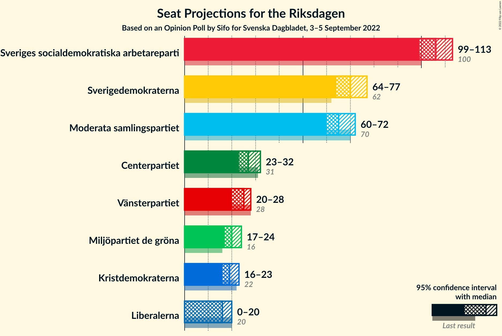

# Opinion Poll by Sifo for Svenska Dagbladet, 3–5 September 2022

<a href="#voting-intentions">Voting Intentions</a> | <a href="#seats">Seats</a> | <a href="#coalitions">Coalitions</a> | <a href="#technical-information">Technical Information</a>

## Voting Intentions

### Confidence Intervals

| Party | Last Result | Poll Result | 80% Confidence Interval | 90% Confidence Interval | 95% Confidence Interval | 99% Confidence Interval |
|:-----:|:-----------:|:-----------:|:-----------------------:|:-----------------------:|:-----------------------:|:-----------------------:|
| Sveriges socialdemokratiska arbetareparti | 28.3% | 30.0% | 28.7–31.4% |28.3–31.7% |28.0–32.1% |27.4–32.7% |
| Sverigedemokraterna | 17.5% | 20.0% | 18.9–21.2% |18.6–21.5% |18.3–21.8% |17.8–22.4% |
| Moderata samlingspartiet | 19.8% | 18.6% | 17.5–19.8% |17.2–20.1% |17.0–20.4% |16.4–20.9% |
| Centerpartiet | 8.6% | 7.7% | 7.0–8.5% |6.8–8.8% |6.6–9.0% |6.3–9.4% |
| Vänsterpartiet | 8.0% | 6.9% | 6.2–7.7% |6.0–7.9% |5.9–8.1% |5.6–8.5% |
| Miljöpartiet de gröna | 4.4% | 5.7% | 5.1–6.4% |4.9–6.6% |4.8–6.8% |4.5–7.2% |
| Kristdemokraterna | 6.3% | 5.5% | 4.9–6.2% |4.7–6.4% |4.6–6.6% |4.3–7.0% |
| Liberalerna | 5.5% | 4.7% | 4.1–5.4% |4.0–5.6% |3.9–5.7% |3.6–6.1% |

*Note:* The poll result column reflects the actual value used in the calculations. Published results may vary slightly, and in addition be rounded to fewer digits.

## Seats

### Confidence Intervals

| Party | Last Result | Median | 80% Confidence Interval | 90% Confidence Interval | 95% Confidence Interval | 99% Confidence Interval |
|:-----:|:-----------:|:------:|:-----------------------:|:-----------------------:|:-----------------------:|:-----------------------:|
| <a href="#sveriges-socialdemokratiska-arbetareparti">Sveriges socialdemokratiska arbetareparti</a> | 100 | 106 | 101–111 |100–112 |99–113 |96–116 |
| <a href="#sverigedemokraterna">Sverigedemokraterna</a> | 62 | 70 | 67–75 |65–76 |64–77 |63–79 |
| <a href="#moderata-samlingspartiet">Moderata samlingspartiet</a> | 70 | 65 | 62–69 |61–71 |60–72 |58–74 |
| <a href="#centerpartiet">Centerpartiet</a> | 31 | 27 | 25–30 |24–31 |23–32 |22–33 |
| <a href="#vänsterpartiet">Vänsterpartiet</a> | 28 | 25 | 22–27 |21–28 |20–28 |20–30 |
| <a href="#miljöpartiet-de-gröna">Miljöpartiet de gröna</a> | 16 | 20 | 18–23 |17–23 |17–24 |16–25 |
| <a href="#kristdemokraterna">Kristdemokraterna</a> | 22 | 19 | 17–22 |17–23 |16–23 |15–24 |
| <a href="#liberalerna">Liberalerna</a> | 20 | 16 | 15–19 |0–20 |0–20 |0–21 |

### Sveriges socialdemokratiska arbetareparti

*For a full overview of the results for this party, see the [Sveriges socialdemokratiska arbetareparti](party-sverigessocialdemokratiskaarbetareparti.html) page.*

| Number of Seats | Probability | Accumulated | Special Marks |
|:---------------:|:-----------:|:-----------:|:-------------:|
| 94 | 0.1% | 100% |  |
| 95 | 0.1% | 99.9% |  |
| 96 | 0.4% | 99.8% |  |
| 97 | 0.5% | 99.3% |  |
| 98 | 0.7% | 98.8% |  |
| 99 | 3% | 98% |  |
| 100 | 3% | 95% | Last Result |
| 101 | 3% | 92% |  |
| 102 | 9% | 89% |  |
| 103 | 8% | 81% |  |
| 104 | 5% | 73% |  |
| 105 | 14% | 68% |  |
| 106 | 12% | 54% | Median |
| 107 | 4% | 42% |  |
| 108 | 16% | 38% |  |
| 109 | 7% | 21% |  |
| 110 | 3% | 14% |  |
| 111 | 5% | 11% |  |
| 112 | 3% | 6% |  |
| 113 | 1.2% | 3% |  |
| 114 | 0.7% | 2% |  |
| 115 | 0.7% | 1.4% |  |
| 116 | 0.3% | 0.7% |  |
| 117 | 0.1% | 0.4% |  |
| 118 | 0.2% | 0.3% |  |
| 119 | 0.1% | 0.1% |  |
| 120 | 0% | 0% |  |

### Sverigedemokraterna

*For a full overview of the results for this party, see the [Sverigedemokraterna](party-sverigedemokraterna.html) page.*

| Number of Seats | Probability | Accumulated | Special Marks |
|:---------------:|:-----------:|:-----------:|:-------------:|
| 61 | 0.1% | 100% |  |
| 62 | 0.3% | 99.9% | Last Result |
| 63 | 1.1% | 99.5% |  |
| 64 | 1.4% | 98% |  |
| 65 | 3% | 97% |  |
| 66 | 4% | 94% |  |
| 67 | 5% | 90% |  |
| 68 | 8% | 85% |  |
| 69 | 14% | 76% |  |
| 70 | 14% | 62% | Median |
| 71 | 15% | 48% |  |
| 72 | 9% | 33% |  |
| 73 | 6% | 24% |  |
| 74 | 5% | 18% |  |
| 75 | 4% | 13% |  |
| 76 | 5% | 9% |  |
| 77 | 2% | 4% |  |
| 78 | 1.3% | 2% |  |
| 79 | 0.4% | 0.7% |  |
| 80 | 0.2% | 0.3% |  |
| 81 | 0.1% | 0.2% |  |
| 82 | 0% | 0.1% |  |
| 83 | 0% | 0% |  |

### Moderata samlingspartiet

*For a full overview of the results for this party, see the [Moderata samlingspartiet](party-moderatasamlingspartiet.html) page.*

| Number of Seats | Probability | Accumulated | Special Marks |
|:---------------:|:-----------:|:-----------:|:-------------:|
| 56 | 0.1% | 100% |  |
| 57 | 0.3% | 99.9% |  |
| 58 | 0.5% | 99.6% |  |
| 59 | 1.3% | 99.1% |  |
| 60 | 3% | 98% |  |
| 61 | 4% | 95% |  |
| 62 | 8% | 91% |  |
| 63 | 14% | 83% |  |
| 64 | 12% | 69% |  |
| 65 | 13% | 57% | Median |
| 66 | 9% | 44% |  |
| 67 | 6% | 35% |  |
| 68 | 11% | 29% |  |
| 69 | 8% | 17% |  |
| 70 | 4% | 9% | Last Result |
| 71 | 3% | 5% |  |
| 72 | 1.0% | 3% |  |
| 73 | 0.8% | 2% |  |
| 74 | 0.6% | 0.9% |  |
| 75 | 0.2% | 0.4% |  |
| 76 | 0.1% | 0.2% |  |
| 77 | 0% | 0.1% |  |
| 78 | 0% | 0% |  |

### Centerpartiet

*For a full overview of the results for this party, see the [Centerpartiet](party-centerpartiet.html) page.*

| Number of Seats | Probability | Accumulated | Special Marks |
|:---------------:|:-----------:|:-----------:|:-------------:|
| 21 | 0.2% | 100% |  |
| 22 | 0.4% | 99.8% |  |
| 23 | 3% | 99.4% |  |
| 24 | 6% | 96% |  |
| 25 | 11% | 90% |  |
| 26 | 14% | 80% |  |
| 27 | 24% | 65% | Median |
| 28 | 13% | 41% |  |
| 29 | 15% | 28% |  |
| 30 | 7% | 14% |  |
| 31 | 3% | 6% | Last Result |
| 32 | 2% | 3% |  |
| 33 | 0.8% | 1.1% |  |
| 34 | 0.2% | 0.3% |  |
| 35 | 0.1% | 0.1% |  |
| 36 | 0% | 0% |  |

### Vänsterpartiet

*For a full overview of the results for this party, see the [Vänsterpartiet](party-vänsterpartiet.html) page.*

| Number of Seats | Probability | Accumulated | Special Marks |
|:---------------:|:-----------:|:-----------:|:-------------:|
| 18 | 0.1% | 100% |  |
| 19 | 0.3% | 99.9% |  |
| 20 | 3% | 99.7% |  |
| 21 | 3% | 97% |  |
| 22 | 6% | 94% |  |
| 23 | 20% | 88% |  |
| 24 | 14% | 68% |  |
| 25 | 18% | 54% | Median |
| 26 | 23% | 36% |  |
| 27 | 7% | 13% |  |
| 28 | 4% | 6% | Last Result |
| 29 | 2% | 2% |  |
| 30 | 0.6% | 0.8% |  |
| 31 | 0.2% | 0.2% |  |
| 32 | 0.1% | 0.1% |  |
| 33 | 0% | 0% |  |

### Miljöpartiet de gröna

*For a full overview of the results for this party, see the [Miljöpartiet de gröna](party-miljöpartietdegröna.html) page.*

| Number of Seats | Probability | Accumulated | Special Marks |
|:---------------:|:-----------:|:-----------:|:-------------:|
| 15 | 0.2% | 100% |  |
| 16 | 1.3% | 99.7% | Last Result |
| 17 | 5% | 98% |  |
| 18 | 13% | 94% |  |
| 19 | 19% | 81% |  |
| 20 | 27% | 63% | Median |
| 21 | 14% | 36% |  |
| 22 | 12% | 22% |  |
| 23 | 6% | 10% |  |
| 24 | 3% | 4% |  |
| 25 | 0.7% | 1.1% |  |
| 26 | 0.4% | 0.4% |  |
| 27 | 0.1% | 0.1% |  |
| 28 | 0% | 0% |  |

### Kristdemokraterna

*For a full overview of the results for this party, see the [Kristdemokraterna](party-kristdemokraterna.html) page.*

| Number of Seats | Probability | Accumulated | Special Marks |
|:---------------:|:-----------:|:-----------:|:-------------:|
| 0 | 0.1% | 100% |  |
| 1 | 0% | 99.9% |  |
| 2 | 0% | 99.9% |  |
| 3 | 0% | 99.9% |  |
| 4 | 0% | 99.9% |  |
| 5 | 0% | 99.9% |  |
| 6 | 0% | 99.9% |  |
| 7 | 0% | 99.9% |  |
| 8 | 0% | 99.9% |  |
| 9 | 0% | 99.9% |  |
| 10 | 0% | 99.9% |  |
| 11 | 0% | 99.9% |  |
| 12 | 0% | 99.9% |  |
| 13 | 0% | 99.9% |  |
| 14 | 0.1% | 99.9% |  |
| 15 | 0.7% | 99.9% |  |
| 16 | 3% | 99.2% |  |
| 17 | 9% | 96% |  |
| 18 | 18% | 86% |  |
| 19 | 23% | 68% | Median |
| 20 | 17% | 45% |  |
| 21 | 14% | 28% |  |
| 22 | 8% | 14% | Last Result |
| 23 | 4% | 6% |  |
| 24 | 2% | 2% |  |
| 25 | 0.3% | 0.4% |  |
| 26 | 0.1% | 0.1% |  |
| 27 | 0% | 0% |  |

### Liberalerna

*For a full overview of the results for this party, see the [Liberalerna](party-liberalerna.html) page.*

| Number of Seats | Probability | Accumulated | Special Marks |
|:---------------:|:-----------:|:-----------:|:-------------:|
| 0 | 6% | 100% |  |
| 1 | 0% | 94% |  |
| 2 | 0% | 94% |  |
| 3 | 0% | 94% |  |
| 4 | 0% | 94% |  |
| 5 | 0% | 94% |  |
| 6 | 0% | 94% |  |
| 7 | 0% | 94% |  |
| 8 | 0% | 94% |  |
| 9 | 0% | 94% |  |
| 10 | 0% | 94% |  |
| 11 | 0% | 94% |  |
| 12 | 0% | 94% |  |
| 13 | 0% | 94% |  |
| 14 | 2% | 94% |  |
| 15 | 14% | 92% |  |
| 16 | 29% | 77% | Median |
| 17 | 19% | 49% |  |
| 18 | 17% | 30% |  |
| 19 | 7% | 13% |  |
| 20 | 4% | 5% | Last Result |
| 21 | 1.0% | 1.3% |  |
| 22 | 0.3% | 0.3% |  |
| 23 | 0% | 0.1% |  |
| 24 | 0% | 0% |  |

## Coalitions

### Confidence Intervals

| Coalition | Last Result | Median | Majority? | 80% Confidence Interval | 90% Confidence Interval | 95% Confidence Interval | 99% Confidence Interval |
|:---------:|:-----------:|:------:|:---------:|:-----------------------:|:-----------------------:|:-----------------------:|:-----------------------:|
| Sveriges socialdemokratiska arbetareparti – Moderata samlingspartiet – Centerpartiet | 201 | 198 | 100% | 193–204 | 192–206 | 191–209 | 188–214 |
| Sveriges socialdemokratiska arbetareparti – Centerpartiet – Vänsterpartiet – Miljöpartiet de gröna – Liberalerna | 195 | 194 | 100% | 188–198 | 186–200 | 184–202 | 181–204 |
| Sveriges socialdemokratiska arbetareparti – Centerpartiet – Vänsterpartiet – Miljöpartiet de gröna | 175 | 178 | 75% | 172–183 | 171–186 | 170–188 | 167–192 |
| Sveriges socialdemokratiska arbetareparti – Moderata samlingspartiet | 170 | 171 | 19% | 166–176 | 164–179 | 163–181 | 160–185 |
| Sverigedemokraterna – Moderata samlingspartiet – Kristdemokraterna – Liberalerna | 174 | 171 | 25% | 166–177 | 163–178 | 161–179 | 157–182 |
| Sveriges socialdemokratiska arbetareparti – Centerpartiet – Miljöpartiet de gröna – Liberalerna | 167 | 170 | 8% | 163–174 | 161–176 | 159–177 | 155–180 |
| Sverigedemokraterna – Moderata samlingspartiet – Kristdemokraterna | 154 | 155 | 0% | 151–161 | 149–163 | 147–165 | 145–168 |
| Sveriges socialdemokratiska arbetareparti – Centerpartiet – Miljöpartiet de gröna | 147 | 153 | 0% | 148–159 | 147–160 | 145–162 | 143–167 |
| Sveriges socialdemokratiska arbetareparti – Vänsterpartiet – Miljöpartiet de gröna | 144 | 151 | 0% | 145–156 | 143–157 | 143–160 | 140–163 |
| Sverigedemokraterna – Moderata samlingspartiet | 132 | 136 | 0% | 131–141 | 130–143 | 128–145 | 126–149 |
| Sveriges socialdemokratiska arbetareparti – Vänsterpartiet | 128 | 131 | 0% | 125–135 | 123–137 | 123–138 | 120–142 |
| Moderata samlingspartiet – Centerpartiet – Kristdemokraterna – Liberalerna | 143 | 128 | 0% | 123–134 | 120–135 | 117–136 | 112–138 |
| Sveriges socialdemokratiska arbetareparti – Miljöpartiet de gröna | 116 | 126 | 0% | 121–131 | 119–132 | 119–134 | 116–138 |
| Moderata samlingspartiet – Centerpartiet – Kristdemokraterna | 123 | 112 | 0% | 108–118 | 107–119 | 105–120 | 103–124 |
| Moderata samlingspartiet – Centerpartiet – Liberalerna | 121 | 109 | 0% | 104–114 | 100–115 | 96–116 | 93–119 |
| Sveriges socialdemokratiska arbetareparti | 100 | 106 | 0% | 101–111 | 100–112 | 99–113 | 96–116 |
| Moderata samlingspartiet – Kristdemokraterna – Liberalerna | 112 | 101 | 0% | 96–106 | 92–107 | 89–109 | 83–111 |
| Moderata samlingspartiet – Centerpartiet | 101 | 92 | 0% | 88–98 | 87–99 | 86–100 | 84–104 |
| Moderata samlingspartiet – Kristdemokraterna | 92 | 84 | 0% | 80–90 | 80–91 | 78–92 | 77–95 |

### Sveriges socialdemokratiska arbetareparti – Moderata samlingspartiet – Centerpartiet

| Number of Seats | Probability | Accumulated | Special Marks |
|:---------------:|:-----------:|:-----------:|:-------------:|
| 185 | 0% | 100% |  |
| 186 | 0.1% | 99.9% |  |
| 187 | 0.1% | 99.8% |  |
| 188 | 0.4% | 99.7% |  |
| 189 | 0.7% | 99.3% |  |
| 190 | 1.0% | 98.6% |  |
| 191 | 2% | 98% |  |
| 192 | 4% | 95% |  |
| 193 | 3% | 91% |  |
| 194 | 5% | 87% |  |
| 195 | 6% | 82% |  |
| 196 | 7% | 76% |  |
| 197 | 7% | 69% |  |
| 198 | 16% | 62% | Median |
| 199 | 5% | 46% |  |
| 200 | 12% | 40% |  |
| 201 | 9% | 28% | Last Result |
| 202 | 4% | 20% |  |
| 203 | 5% | 16% |  |
| 204 | 2% | 11% |  |
| 205 | 2% | 8% |  |
| 206 | 2% | 6% |  |
| 207 | 1.1% | 5% |  |
| 208 | 0.8% | 4% |  |
| 209 | 0.7% | 3% |  |
| 210 | 0.5% | 2% |  |
| 211 | 0.5% | 2% |  |
| 212 | 0.3% | 1.1% |  |
| 213 | 0.3% | 0.8% |  |
| 214 | 0.1% | 0.5% |  |
| 215 | 0.2% | 0.4% |  |
| 216 | 0.1% | 0.2% |  |
| 217 | 0% | 0.1% |  |
| 218 | 0% | 0% |  |

### Sveriges socialdemokratiska arbetareparti – Centerpartiet – Vänsterpartiet – Miljöpartiet de gröna – Liberalerna

| Number of Seats | Probability | Accumulated | Special Marks |
|:---------------:|:-----------:|:-----------:|:-------------:|
| 177 | 0% | 100% |  |
| 178 | 0% | 99.9% |  |
| 179 | 0.1% | 99.9% |  |
| 180 | 0.3% | 99.8% |  |
| 181 | 0.4% | 99.5% |  |
| 182 | 0.2% | 99.1% |  |
| 183 | 1.2% | 99.0% |  |
| 184 | 0.6% | 98% |  |
| 185 | 0.9% | 97% |  |
| 186 | 2% | 96% |  |
| 187 | 2% | 94% |  |
| 188 | 3% | 92% |  |
| 189 | 8% | 90% |  |
| 190 | 8% | 82% |  |
| 191 | 4% | 73% |  |
| 192 | 3% | 69% |  |
| 193 | 13% | 66% |  |
| 194 | 7% | 53% | Median |
| 195 | 4% | 46% | Last Result |
| 196 | 11% | 42% |  |
| 197 | 16% | 31% |  |
| 198 | 6% | 14% |  |
| 199 | 2% | 8% |  |
| 200 | 2% | 6% |  |
| 201 | 1.4% | 4% |  |
| 202 | 0.5% | 3% |  |
| 203 | 0.9% | 2% |  |
| 204 | 0.8% | 1.1% |  |
| 205 | 0.2% | 0.3% |  |
| 206 | 0.1% | 0.1% |  |
| 207 | 0% | 0.1% |  |
| 208 | 0% | 0% |  |

### Sveriges socialdemokratiska arbetareparti – Centerpartiet – Vänsterpartiet – Miljöpartiet de gröna

| Number of Seats | Probability | Accumulated | Special Marks |
|:---------------:|:-----------:|:-----------:|:-------------:|
| 164 | 0.1% | 100% |  |
| 165 | 0.1% | 99.9% |  |
| 166 | 0.2% | 99.9% |  |
| 167 | 0.4% | 99.7% |  |
| 168 | 0.5% | 99.3% |  |
| 169 | 0.9% | 98.8% |  |
| 170 | 2% | 98% |  |
| 171 | 2% | 96% |  |
| 172 | 5% | 93% |  |
| 173 | 6% | 88% |  |
| 174 | 8% | 83% |  |
| 175 | 5% | 75% | Last Result, Majority |
| 176 | 7% | 70% |  |
| 177 | 10% | 63% |  |
| 178 | 12% | 53% | Median |
| 179 | 5% | 41% |  |
| 180 | 8% | 36% |  |
| 181 | 12% | 28% |  |
| 182 | 3% | 16% |  |
| 183 | 5% | 13% |  |
| 184 | 2% | 8% |  |
| 185 | 0.9% | 6% |  |
| 186 | 1.2% | 5% |  |
| 187 | 1.2% | 4% |  |
| 188 | 0.9% | 3% |  |
| 189 | 0.4% | 2% |  |
| 190 | 0.5% | 1.4% |  |
| 191 | 0.2% | 0.9% |  |
| 192 | 0.5% | 0.7% |  |
| 193 | 0.1% | 0.2% |  |
| 194 | 0% | 0.1% |  |
| 195 | 0.1% | 0.1% |  |
| 196 | 0% | 0% |  |

### Sveriges socialdemokratiska arbetareparti – Moderata samlingspartiet

| Number of Seats | Probability | Accumulated | Special Marks |
|:---------------:|:-----------:|:-----------:|:-------------:|
| 158 | 0% | 100% |  |
| 159 | 0.1% | 99.9% |  |
| 160 | 0.4% | 99.8% |  |
| 161 | 0.3% | 99.4% |  |
| 162 | 1.0% | 99.1% |  |
| 163 | 1.3% | 98% |  |
| 164 | 2% | 97% |  |
| 165 | 3% | 94% |  |
| 166 | 4% | 91% |  |
| 167 | 7% | 87% |  |
| 168 | 4% | 81% |  |
| 169 | 8% | 77% |  |
| 170 | 7% | 68% | Last Result |
| 171 | 15% | 61% | Median |
| 172 | 11% | 46% |  |
| 173 | 11% | 35% |  |
| 174 | 6% | 25% |  |
| 175 | 5% | 19% | Majority |
| 176 | 4% | 14% |  |
| 177 | 2% | 10% |  |
| 178 | 3% | 8% |  |
| 179 | 1.3% | 5% |  |
| 180 | 0.9% | 4% |  |
| 181 | 0.9% | 3% |  |
| 182 | 0.6% | 2% |  |
| 183 | 0.4% | 1.4% |  |
| 184 | 0.4% | 0.9% |  |
| 185 | 0.1% | 0.5% |  |
| 186 | 0.2% | 0.4% |  |
| 187 | 0.2% | 0.3% |  |
| 188 | 0% | 0.1% |  |
| 189 | 0.1% | 0.1% |  |
| 190 | 0% | 0% |  |

### Sverigedemokraterna – Moderata samlingspartiet – Kristdemokraterna – Liberalerna

| Number of Seats | Probability | Accumulated | Special Marks |
|:---------------:|:-----------:|:-----------:|:-------------:|
| 154 | 0.1% | 100% |  |
| 155 | 0% | 99.9% |  |
| 156 | 0.1% | 99.9% |  |
| 157 | 0.5% | 99.8% |  |
| 158 | 0.2% | 99.3% |  |
| 159 | 0.5% | 99.1% |  |
| 160 | 0.4% | 98.6% |  |
| 161 | 0.9% | 98% |  |
| 162 | 1.2% | 97% |  |
| 163 | 1.2% | 96% |  |
| 164 | 0.9% | 95% |  |
| 165 | 2% | 94% |  |
| 166 | 5% | 92% |  |
| 167 | 3% | 87% |  |
| 168 | 12% | 84% |  |
| 169 | 8% | 72% |  |
| 170 | 5% | 64% | Median |
| 171 | 12% | 59% |  |
| 172 | 10% | 47% |  |
| 173 | 7% | 37% |  |
| 174 | 5% | 30% | Last Result |
| 175 | 8% | 25% | Majority |
| 176 | 6% | 17% |  |
| 177 | 5% | 12% |  |
| 178 | 2% | 7% |  |
| 179 | 2% | 4% |  |
| 180 | 0.9% | 2% |  |
| 181 | 0.5% | 1.2% |  |
| 182 | 0.4% | 0.7% |  |
| 183 | 0.2% | 0.3% |  |
| 184 | 0.1% | 0.1% |  |
| 185 | 0.1% | 0.1% |  |
| 186 | 0% | 0% |  |

### Sveriges socialdemokratiska arbetareparti – Centerpartiet – Miljöpartiet de gröna – Liberalerna

| Number of Seats | Probability | Accumulated | Special Marks |
|:---------------:|:-----------:|:-----------:|:-------------:|
| 152 | 0% | 100% |  |
| 153 | 0.2% | 99.9% |  |
| 154 | 0.2% | 99.8% |  |
| 155 | 0.2% | 99.6% |  |
| 156 | 0.6% | 99.4% |  |
| 157 | 0.2% | 98.8% |  |
| 158 | 0.7% | 98.6% |  |
| 159 | 0.8% | 98% |  |
| 160 | 1.3% | 97% |  |
| 161 | 2% | 96% |  |
| 162 | 1.4% | 94% |  |
| 163 | 3% | 93% |  |
| 164 | 3% | 90% |  |
| 165 | 7% | 87% |  |
| 166 | 5% | 80% |  |
| 167 | 9% | 75% | Last Result |
| 168 | 8% | 66% |  |
| 169 | 4% | 58% | Median |
| 170 | 7% | 53% |  |
| 171 | 18% | 46% |  |
| 172 | 9% | 27% |  |
| 173 | 4% | 19% |  |
| 174 | 6% | 14% |  |
| 175 | 3% | 8% | Majority |
| 176 | 2% | 5% |  |
| 177 | 1.3% | 4% |  |
| 178 | 1.3% | 2% |  |
| 179 | 0.5% | 1.1% |  |
| 180 | 0.4% | 0.6% |  |
| 181 | 0.1% | 0.2% |  |
| 182 | 0.1% | 0.1% |  |
| 183 | 0% | 0% |  |

### Sverigedemokraterna – Moderata samlingspartiet – Kristdemokraterna

| Number of Seats | Probability | Accumulated | Special Marks |
|:---------------:|:-----------:|:-----------:|:-------------:|
| 142 | 0% | 100% |  |
| 143 | 0.1% | 99.9% |  |
| 144 | 0.2% | 99.9% |  |
| 145 | 0.8% | 99.7% |  |
| 146 | 0.9% | 98.9% |  |
| 147 | 0.5% | 98% |  |
| 148 | 1.4% | 97% |  |
| 149 | 2% | 96% |  |
| 150 | 2% | 94% |  |
| 151 | 6% | 92% |  |
| 152 | 16% | 86% |  |
| 153 | 11% | 69% |  |
| 154 | 4% | 58% | Last Result, Median |
| 155 | 7% | 54% |  |
| 156 | 13% | 47% |  |
| 157 | 3% | 34% |  |
| 158 | 4% | 31% |  |
| 159 | 8% | 27% |  |
| 160 | 8% | 18% |  |
| 161 | 3% | 10% |  |
| 162 | 2% | 8% |  |
| 163 | 2% | 6% |  |
| 164 | 0.9% | 4% |  |
| 165 | 0.6% | 3% |  |
| 166 | 1.2% | 2% |  |
| 167 | 0.2% | 1.0% |  |
| 168 | 0.4% | 0.9% |  |
| 169 | 0.3% | 0.5% |  |
| 170 | 0.1% | 0.2% |  |
| 171 | 0% | 0.1% |  |
| 172 | 0% | 0.1% |  |
| 173 | 0% | 0% |  |

### Sveriges socialdemokratiska arbetareparti – Centerpartiet – Miljöpartiet de gröna

| Number of Seats | Probability | Accumulated | Special Marks |
|:---------------:|:-----------:|:-----------:|:-------------:|
| 140 | 0% | 100% |  |
| 141 | 0.1% | 99.9% |  |
| 142 | 0.3% | 99.9% |  |
| 143 | 0.3% | 99.6% |  |
| 144 | 0.9% | 99.2% |  |
| 145 | 2% | 98% |  |
| 146 | 1.2% | 96% |  |
| 147 | 3% | 95% | Last Result |
| 148 | 6% | 92% |  |
| 149 | 7% | 86% |  |
| 150 | 6% | 80% |  |
| 151 | 8% | 74% |  |
| 152 | 7% | 66% |  |
| 153 | 13% | 60% | Median |
| 154 | 9% | 46% |  |
| 155 | 12% | 38% |  |
| 156 | 5% | 25% |  |
| 157 | 5% | 20% |  |
| 158 | 5% | 15% |  |
| 159 | 3% | 11% |  |
| 160 | 3% | 7% |  |
| 161 | 1.2% | 5% |  |
| 162 | 1.1% | 3% |  |
| 163 | 0.7% | 2% |  |
| 164 | 0.3% | 1.5% |  |
| 165 | 0.5% | 1.1% |  |
| 166 | 0.1% | 0.7% |  |
| 167 | 0.4% | 0.6% |  |
| 168 | 0.1% | 0.2% |  |
| 169 | 0% | 0.1% |  |
| 170 | 0% | 0.1% |  |
| 171 | 0% | 0% |  |

### Sveriges socialdemokratiska arbetareparti – Vänsterpartiet – Miljöpartiet de gröna

| Number of Seats | Probability | Accumulated | Special Marks |
|:---------------:|:-----------:|:-----------:|:-------------:|
| 137 | 0% | 100% |  |
| 138 | 0.1% | 99.9% |  |
| 139 | 0.1% | 99.8% |  |
| 140 | 0.4% | 99.7% |  |
| 141 | 0.8% | 99.3% |  |
| 142 | 0.9% | 98.5% |  |
| 143 | 3% | 98% |  |
| 144 | 3% | 95% | Last Result |
| 145 | 4% | 92% |  |
| 146 | 5% | 88% |  |
| 147 | 7% | 84% |  |
| 148 | 7% | 77% |  |
| 149 | 11% | 70% |  |
| 150 | 8% | 59% |  |
| 151 | 11% | 51% | Median |
| 152 | 8% | 40% |  |
| 153 | 5% | 31% |  |
| 154 | 12% | 27% |  |
| 155 | 3% | 15% |  |
| 156 | 4% | 11% |  |
| 157 | 2% | 7% |  |
| 158 | 0.9% | 5% |  |
| 159 | 1.2% | 4% |  |
| 160 | 1.1% | 3% |  |
| 161 | 0.8% | 2% |  |
| 162 | 0.1% | 0.9% |  |
| 163 | 0.3% | 0.8% |  |
| 164 | 0.3% | 0.5% |  |
| 165 | 0.1% | 0.2% |  |
| 166 | 0% | 0.1% |  |
| 167 | 0% | 0.1% |  |
| 168 | 0% | 0% |  |

### Sverigedemokraterna – Moderata samlingspartiet

| Number of Seats | Probability | Accumulated | Special Marks |
|:---------------:|:-----------:|:-----------:|:-------------:|
| 123 | 0% | 100% |  |
| 124 | 0% | 99.9% |  |
| 125 | 0.2% | 99.9% |  |
| 126 | 0.5% | 99.7% |  |
| 127 | 0.9% | 99.2% |  |
| 128 | 1.3% | 98% |  |
| 129 | 2% | 97% |  |
| 130 | 2% | 95% |  |
| 131 | 5% | 93% |  |
| 132 | 6% | 88% | Last Result |
| 133 | 15% | 82% |  |
| 134 | 5% | 67% |  |
| 135 | 11% | 62% | Median |
| 136 | 8% | 50% |  |
| 137 | 8% | 43% |  |
| 138 | 9% | 34% |  |
| 139 | 8% | 25% |  |
| 140 | 7% | 18% |  |
| 141 | 2% | 11% |  |
| 142 | 2% | 9% |  |
| 143 | 3% | 7% |  |
| 144 | 2% | 4% |  |
| 145 | 0.9% | 3% |  |
| 146 | 0.8% | 2% |  |
| 147 | 0.3% | 1.1% |  |
| 148 | 0.3% | 0.8% |  |
| 149 | 0.4% | 0.6% |  |
| 150 | 0.1% | 0.2% |  |
| 151 | 0.1% | 0.1% |  |
| 152 | 0% | 0.1% |  |
| 153 | 0% | 0% |  |

### Sveriges socialdemokratiska arbetareparti – Vänsterpartiet

| Number of Seats | Probability | Accumulated | Special Marks |
|:---------------:|:-----------:|:-----------:|:-------------:|
| 118 | 0.1% | 100% |  |
| 119 | 0.2% | 99.9% |  |
| 120 | 0.3% | 99.7% |  |
| 121 | 0.6% | 99.4% |  |
| 122 | 1.3% | 98.8% |  |
| 123 | 3% | 98% |  |
| 124 | 3% | 95% |  |
| 125 | 3% | 92% |  |
| 126 | 5% | 89% |  |
| 127 | 6% | 84% |  |
| 128 | 7% | 78% | Last Result |
| 129 | 13% | 71% |  |
| 130 | 7% | 58% |  |
| 131 | 10% | 51% | Median |
| 132 | 9% | 42% |  |
| 133 | 9% | 33% |  |
| 134 | 13% | 24% |  |
| 135 | 3% | 11% |  |
| 136 | 2% | 8% |  |
| 137 | 2% | 6% |  |
| 138 | 2% | 4% |  |
| 139 | 0.7% | 2% |  |
| 140 | 0.8% | 2% |  |
| 141 | 0.4% | 0.9% |  |
| 142 | 0.1% | 0.5% |  |
| 143 | 0.3% | 0.4% |  |
| 144 | 0% | 0.1% |  |
| 145 | 0% | 0.1% |  |
| 146 | 0% | 0% |  |

### Moderata samlingspartiet – Centerpartiet – Kristdemokraterna – Liberalerna

| Number of Seats | Probability | Accumulated | Special Marks |
|:---------------:|:-----------:|:-----------:|:-------------:|
| 108 | 0% | 100% |  |
| 109 | 0% | 99.9% |  |
| 110 | 0.1% | 99.9% |  |
| 111 | 0.1% | 99.8% |  |
| 112 | 0.3% | 99.7% |  |
| 113 | 0.2% | 99.5% |  |
| 114 | 0.6% | 99.3% |  |
| 115 | 0.4% | 98.7% |  |
| 116 | 0.5% | 98% |  |
| 117 | 0.6% | 98% |  |
| 118 | 1.3% | 97% |  |
| 119 | 0.7% | 96% |  |
| 120 | 2% | 95% |  |
| 121 | 1.3% | 94% |  |
| 122 | 1.2% | 92% |  |
| 123 | 3% | 91% |  |
| 124 | 5% | 88% |  |
| 125 | 12% | 83% |  |
| 126 | 10% | 71% |  |
| 127 | 6% | 61% | Median |
| 128 | 7% | 54% |  |
| 129 | 8% | 48% |  |
| 130 | 12% | 39% |  |
| 131 | 8% | 28% |  |
| 132 | 5% | 20% |  |
| 133 | 3% | 14% |  |
| 134 | 4% | 11% |  |
| 135 | 3% | 7% |  |
| 136 | 1.4% | 4% |  |
| 137 | 1.3% | 2% |  |
| 138 | 0.5% | 0.9% |  |
| 139 | 0.2% | 0.4% |  |
| 140 | 0.1% | 0.2% |  |
| 141 | 0.1% | 0.1% |  |
| 142 | 0% | 0% |  |
| 143 | 0% | 0% | Last Result |

### Sveriges socialdemokratiska arbetareparti – Miljöpartiet de gröna

| Number of Seats | Probability | Accumulated | Special Marks |
|:---------------:|:-----------:|:-----------:|:-------------:|
| 113 | 0% | 100% |  |
| 114 | 0.1% | 99.9% |  |
| 115 | 0.2% | 99.8% |  |
| 116 | 0.5% | 99.7% | Last Result |
| 117 | 0.7% | 99.1% |  |
| 118 | 0.9% | 98% |  |
| 119 | 3% | 98% |  |
| 120 | 4% | 95% |  |
| 121 | 4% | 91% |  |
| 122 | 5% | 87% |  |
| 123 | 8% | 82% |  |
| 124 | 9% | 74% |  |
| 125 | 12% | 65% |  |
| 126 | 8% | 53% | Median |
| 127 | 10% | 45% |  |
| 128 | 11% | 34% |  |
| 129 | 5% | 24% |  |
| 130 | 5% | 19% |  |
| 131 | 6% | 14% |  |
| 132 | 3% | 8% |  |
| 133 | 2% | 5% |  |
| 134 | 1.0% | 3% |  |
| 135 | 0.7% | 2% |  |
| 136 | 0.6% | 1.4% |  |
| 137 | 0.3% | 0.9% |  |
| 138 | 0.2% | 0.5% |  |
| 139 | 0.2% | 0.3% |  |
| 140 | 0% | 0.1% |  |
| 141 | 0.1% | 0.1% |  |
| 142 | 0% | 0% |  |

### Moderata samlingspartiet – Centerpartiet – Kristdemokraterna

| Number of Seats | Probability | Accumulated | Special Marks |
|:---------------:|:-----------:|:-----------:|:-------------:|
| 99 | 0% | 100% |  |
| 100 | 0% | 99.9% |  |
| 101 | 0.1% | 99.9% |  |
| 102 | 0.2% | 99.8% |  |
| 103 | 0.6% | 99.6% |  |
| 104 | 1.3% | 99.0% |  |
| 105 | 1.3% | 98% |  |
| 106 | 1.1% | 96% |  |
| 107 | 4% | 95% |  |
| 108 | 9% | 91% |  |
| 109 | 16% | 82% |  |
| 110 | 6% | 66% |  |
| 111 | 6% | 59% | Median |
| 112 | 7% | 53% |  |
| 113 | 11% | 46% |  |
| 114 | 11% | 35% |  |
| 115 | 6% | 24% |  |
| 116 | 4% | 18% |  |
| 117 | 4% | 15% |  |
| 118 | 5% | 11% |  |
| 119 | 3% | 6% |  |
| 120 | 1.2% | 4% |  |
| 121 | 1.1% | 2% |  |
| 122 | 0.3% | 1.3% |  |
| 123 | 0.4% | 1.1% | Last Result |
| 124 | 0.3% | 0.7% |  |
| 125 | 0.4% | 0.4% |  |
| 126 | 0% | 0.1% |  |
| 127 | 0% | 0% |  |

### Moderata samlingspartiet – Centerpartiet – Liberalerna

| Number of Seats | Probability | Accumulated | Special Marks |
|:---------------:|:-----------:|:-----------:|:-------------:|
| 88 | 0% | 100% |  |
| 89 | 0% | 99.9% |  |
| 90 | 0% | 99.9% |  |
| 91 | 0.1% | 99.9% |  |
| 92 | 0.3% | 99.8% |  |
| 93 | 0.2% | 99.5% |  |
| 94 | 0.2% | 99.3% |  |
| 95 | 0.5% | 99.1% |  |
| 96 | 1.2% | 98.6% |  |
| 97 | 1.0% | 97% |  |
| 98 | 0.4% | 96% |  |
| 99 | 0.5% | 96% |  |
| 100 | 0.6% | 95% |  |
| 101 | 1.2% | 95% |  |
| 102 | 2% | 94% |  |
| 103 | 1.3% | 92% |  |
| 104 | 6% | 91% |  |
| 105 | 4% | 85% |  |
| 106 | 12% | 80% |  |
| 107 | 5% | 68% |  |
| 108 | 13% | 63% | Median |
| 109 | 7% | 50% |  |
| 110 | 9% | 43% |  |
| 111 | 10% | 35% |  |
| 112 | 6% | 24% |  |
| 113 | 6% | 18% |  |
| 114 | 5% | 12% |  |
| 115 | 4% | 7% |  |
| 116 | 2% | 4% |  |
| 117 | 0.9% | 2% |  |
| 118 | 0.5% | 1.1% |  |
| 119 | 0.3% | 0.5% |  |
| 120 | 0.1% | 0.3% |  |
| 121 | 0.1% | 0.1% | Last Result |
| 122 | 0% | 0.1% |  |
| 123 | 0% | 0% |  |

### Sveriges socialdemokratiska arbetareparti

| Number of Seats | Probability | Accumulated | Special Marks |
|:---------------:|:-----------:|:-----------:|:-------------:|
| 94 | 0.1% | 100% |  |
| 95 | 0.1% | 99.9% |  |
| 96 | 0.4% | 99.8% |  |
| 97 | 0.5% | 99.3% |  |
| 98 | 0.7% | 98.8% |  |
| 99 | 3% | 98% |  |
| 100 | 3% | 95% | Last Result |
| 101 | 3% | 92% |  |
| 102 | 9% | 89% |  |
| 103 | 8% | 81% |  |
| 104 | 5% | 73% |  |
| 105 | 14% | 68% |  |
| 106 | 12% | 54% | Median |
| 107 | 4% | 42% |  |
| 108 | 16% | 38% |  |
| 109 | 7% | 21% |  |
| 110 | 3% | 14% |  |
| 111 | 5% | 11% |  |
| 112 | 3% | 6% |  |
| 113 | 1.2% | 3% |  |
| 114 | 0.7% | 2% |  |
| 115 | 0.7% | 1.4% |  |
| 116 | 0.3% | 0.7% |  |
| 117 | 0.1% | 0.4% |  |
| 118 | 0.2% | 0.3% |  |
| 119 | 0.1% | 0.1% |  |
| 120 | 0% | 0% |  |

### Moderata samlingspartiet – Kristdemokraterna – Liberalerna

| Number of Seats | Probability | Accumulated | Special Marks |
|:---------------:|:-----------:|:-----------:|:-------------:|
| 81 | 0% | 100% |  |
| 82 | 0.1% | 99.9% |  |
| 83 | 0.4% | 99.9% |  |
| 84 | 0.1% | 99.5% |  |
| 85 | 0.5% | 99.4% |  |
| 86 | 0.2% | 98.9% |  |
| 87 | 0.5% | 98.7% |  |
| 88 | 0.5% | 98% |  |
| 89 | 0.6% | 98% |  |
| 90 | 2% | 97% |  |
| 91 | 0.3% | 96% |  |
| 92 | 0.4% | 95% |  |
| 93 | 0.7% | 95% |  |
| 94 | 1.5% | 94% |  |
| 95 | 2% | 93% |  |
| 96 | 4% | 90% |  |
| 97 | 5% | 87% |  |
| 98 | 11% | 81% |  |
| 99 | 4% | 70% |  |
| 100 | 10% | 66% | Median |
| 101 | 11% | 56% |  |
| 102 | 12% | 45% |  |
| 103 | 8% | 32% |  |
| 104 | 4% | 24% |  |
| 105 | 7% | 20% |  |
| 106 | 4% | 13% |  |
| 107 | 4% | 9% |  |
| 108 | 2% | 4% |  |
| 109 | 1.3% | 3% |  |
| 110 | 0.7% | 1.4% |  |
| 111 | 0.4% | 0.6% |  |
| 112 | 0.2% | 0.3% | Last Result |
| 113 | 0.1% | 0.1% |  |
| 114 | 0% | 0.1% |  |
| 115 | 0% | 0% |  |

### Moderata samlingspartiet – Centerpartiet

| Number of Seats | Probability | Accumulated | Special Marks |
|:---------------:|:-----------:|:-----------:|:-------------:|
| 81 | 0% | 100% |  |
| 82 | 0.1% | 99.9% |  |
| 83 | 0.2% | 99.9% |  |
| 84 | 0.4% | 99.7% |  |
| 85 | 1.1% | 99.3% |  |
| 86 | 2% | 98% |  |
| 87 | 3% | 96% |  |
| 88 | 5% | 93% |  |
| 89 | 8% | 89% |  |
| 90 | 17% | 81% |  |
| 91 | 6% | 64% |  |
| 92 | 8% | 57% | Median |
| 93 | 7% | 49% |  |
| 94 | 10% | 42% |  |
| 95 | 11% | 33% |  |
| 96 | 6% | 21% |  |
| 97 | 5% | 15% |  |
| 98 | 5% | 10% |  |
| 99 | 2% | 6% |  |
| 100 | 0.9% | 3% |  |
| 101 | 0.7% | 2% | Last Result |
| 102 | 0.8% | 2% |  |
| 103 | 0.2% | 0.8% |  |
| 104 | 0.1% | 0.5% |  |
| 105 | 0.3% | 0.4% |  |
| 106 | 0.1% | 0.1% |  |
| 107 | 0% | 0% |  |

### Moderata samlingspartiet – Kristdemokraterna

| Number of Seats | Probability | Accumulated | Special Marks |
|:---------------:|:-----------:|:-----------:|:-------------:|
| 73 | 0% | 100% |  |
| 74 | 0.1% | 99.9% |  |
| 75 | 0.1% | 99.9% |  |
| 76 | 0.2% | 99.7% |  |
| 77 | 0.6% | 99.5% |  |
| 78 | 2% | 98.9% |  |
| 79 | 1.5% | 97% |  |
| 80 | 7% | 96% |  |
| 81 | 3% | 88% |  |
| 82 | 17% | 85% |  |
| 83 | 5% | 68% |  |
| 84 | 14% | 62% | Median |
| 85 | 7% | 49% |  |
| 86 | 10% | 41% |  |
| 87 | 10% | 31% |  |
| 88 | 5% | 22% |  |
| 89 | 5% | 17% |  |
| 90 | 5% | 11% |  |
| 91 | 2% | 6% |  |
| 92 | 2% | 4% | Last Result |
| 93 | 0.6% | 2% |  |
| 94 | 0.9% | 1.4% |  |
| 95 | 0.2% | 0.5% |  |
| 96 | 0.2% | 0.3% |  |
| 97 | 0% | 0.1% |  |
| 98 | 0% | 0.1% |  |
| 99 | 0% | 0% |  |

## Technical Information

### Opinion Poll

+ **Polling firm:** Sifo
+ **Commissioner(s):** Svenska Dagbladet
+ **Fieldwork period:** 3–5 September 2022

### Calculations

+ **Sample size:** 1999
+ **Simulations done:** 1,048,576
+ **Error estimate:** 0.67%

