# Opinion Poll by Ipsos for Dagens Nyheter, 1–6 September 2022

<a href="#voting-intentions">Voting Intentions</a> | <a href="#seats">Seats</a> | <a href="#coalitions">Coalitions</a> | <a href="#technical-information">Technical Information</a>

## Voting Intentions

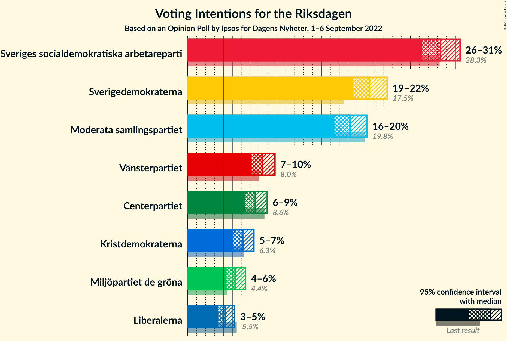

### Confidence Intervals

| Party | Last Result | Poll Result | 80% Confidence Interval | 90% Confidence Interval | 95% Confidence Interval | 99% Confidence Interval |
|:-----:|:-----------:|:-----------:|:-----------------------:|:-----------------------:|:-----------------------:|:-----------------------:|
| Sveriges socialdemokratiska arbetareparti | 28.3% | 28.4% | 27.0–29.8% |26.6–30.2% |26.3–30.6% |25.7–31.2% |
| Sverigedemokraterna | 17.5% | 20.4% | 19.2–21.7% |18.9–22.1% |18.6–22.4% |18.0–23.0% |
| Moderata samlingspartiet | 19.8% | 18.2% | 17.1–19.4% |16.7–19.8% |16.5–20.1% |15.9–20.7% |
| Vänsterpartiet | 8.0% | 8.4% | 7.6–9.3% |7.3–9.6% |7.2–9.8% |6.8–10.2% |
| Centerpartiet | 8.6% | 7.6% | 6.8–8.5% |6.6–8.7% |6.4–8.9% |6.1–9.4% |
| Kristdemokraterna | 6.3% | 6.2% | 5.5–7.0% |5.3–7.2% |5.1–7.4% |4.8–7.8% |
| Miljöpartiet de gröna | 4.4% | 5.3% | 4.7–6.1% |4.5–6.3% |4.3–6.5% |4.1–6.9% |
| Liberalerna | 5.5% | 4.2% | 3.7–4.9% |3.5–5.1% |3.4–5.3% |3.1–5.6% |

*Note:* The poll result column reflects the actual value used in the calculations. Published results may vary slightly, and in addition be rounded to fewer digits.

## Seats

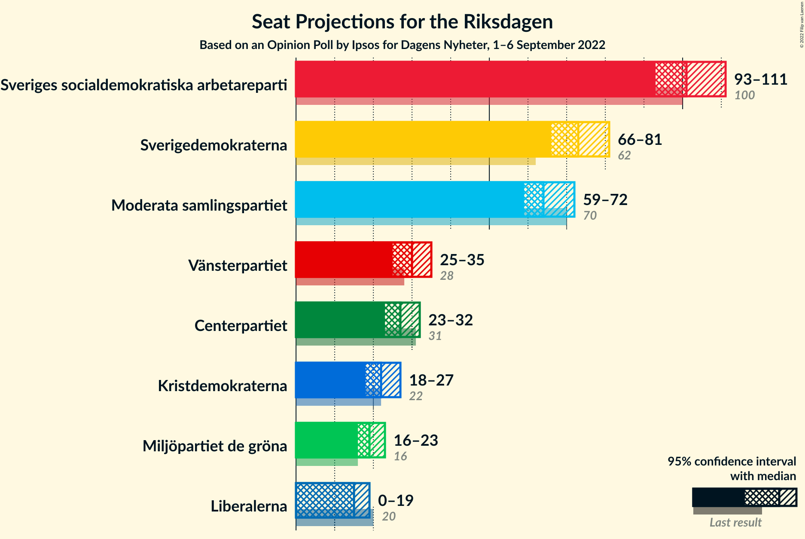

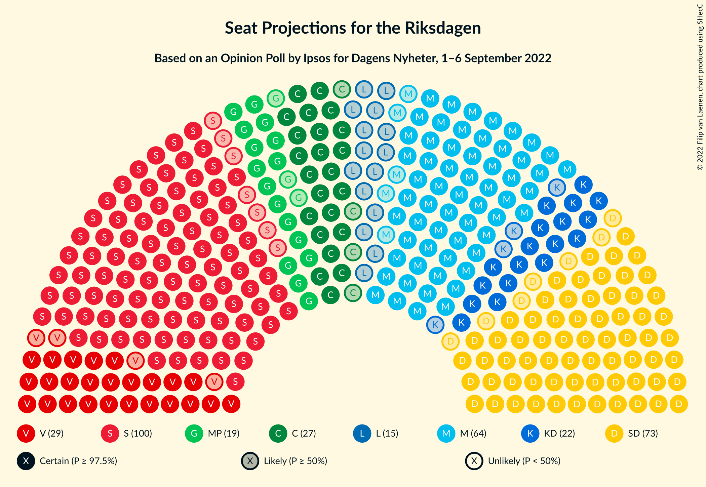

### Confidence Intervals

| Party | Last Result | Median | 80% Confidence Interval | 90% Confidence Interval | 95% Confidence Interval | 99% Confidence Interval |
|:-----:|:-----------:|:------:|:-----------------------:|:-----------------------:|:-----------------------:|:-----------------------:|
| <a href="#sveriges-socialdemokratiska-arbetareparti">Sveriges socialdemokratiska arbetareparti</a> | 100 | 101 | 96–107 |95–109 |93–111 |91–113 |
| <a href="#sverigedemokraterna">Sverigedemokraterna</a> | 62 | 73 | 68–78 |67–79 |66–81 |63–84 |
| <a href="#moderata-samlingspartiet">Moderata samlingspartiet</a> | 70 | 64 | 61–70 |60–71 |59–72 |56–74 |
| <a href="#vänsterpartiet">Vänsterpartiet</a> | 28 | 30 | 27–33 |26–34 |25–35 |24–37 |
| <a href="#centerpartiet">Centerpartiet</a> | 31 | 27 | 24–30 |24–31 |23–32 |22–34 |
| <a href="#kristdemokraterna">Kristdemokraterna</a> | 22 | 22 | 20–25 |19–26 |18–27 |17–28 |
| <a href="#miljöpartiet-de-gröna">Miljöpartiet de gröna</a> | 16 | 19 | 17–22 |16–23 |16–23 |14–25 |
| <a href="#liberalerna">Liberalerna</a> | 20 | 15 | 0–17 |0–18 |0–19 |0–20 |

### Sveriges socialdemokratiska arbetareparti

*For a full overview of the results for this party, see the [Sveriges socialdemokratiska arbetareparti](party-sverigessocialdemokratiskaarbetareparti.html) page.*

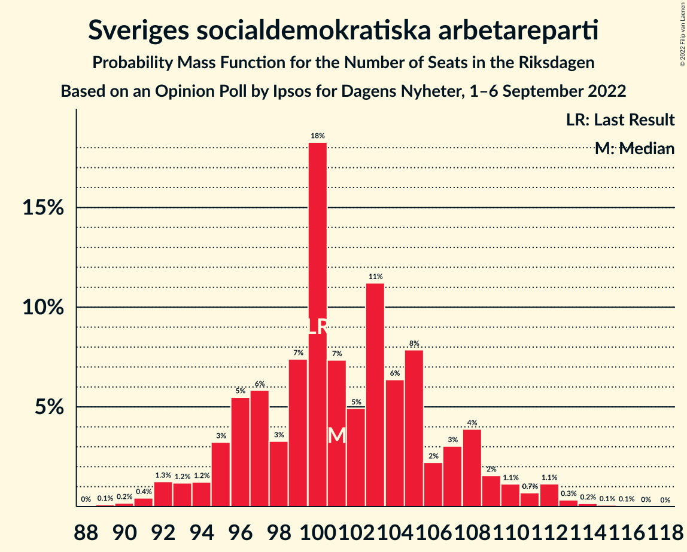

| Number of Seats | Probability | Accumulated | Special Marks |
|:---------------:|:-----------:|:-----------:|:-------------:|
| 88 | 0% | 100% |  |
| 89 | 0.1% | 99.9% |  |
| 90 | 0.2% | 99.8% |  |
| 91 | 0.4% | 99.6% |  |
| 92 | 1.3% | 99.2% |  |
| 93 | 1.2% | 98% |  |
| 94 | 1.2% | 97% |  |
| 95 | 3% | 96% |  |
| 96 | 5% | 92% |  |
| 97 | 6% | 87% |  |
| 98 | 3% | 81% |  |
| 99 | 7% | 78% |  |
| 100 | 18% | 70% | Last Result |
| 101 | 7% | 52% | Median |
| 102 | 5% | 45% |  |
| 103 | 11% | 40% |  |
| 104 | 6% | 29% |  |
| 105 | 8% | 22% |  |
| 106 | 2% | 14% |  |
| 107 | 3% | 12% |  |
| 108 | 4% | 9% |  |
| 109 | 2% | 5% |  |
| 110 | 1.1% | 4% |  |
| 111 | 0.7% | 3% |  |
| 112 | 1.1% | 2% |  |
| 113 | 0.3% | 0.7% |  |
| 114 | 0.2% | 0.3% |  |
| 115 | 0.1% | 0.2% |  |
| 116 | 0.1% | 0.1% |  |
| 117 | 0% | 0% |  |

### Sverigedemokraterna

*For a full overview of the results for this party, see the [Sverigedemokraterna](party-sverigedemokraterna.html) page.*

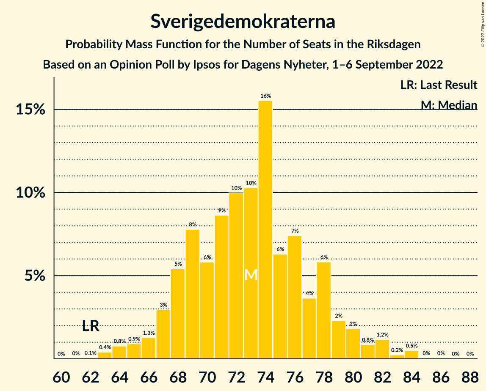

| Number of Seats | Probability | Accumulated | Special Marks |
|:---------------:|:-----------:|:-----------:|:-------------:|
| 62 | 0.1% | 100% | Last Result |
| 63 | 0.4% | 99.9% |  |
| 64 | 0.8% | 99.5% |  |
| 65 | 0.9% | 98.7% |  |
| 66 | 1.3% | 98% |  |
| 67 | 3% | 97% |  |
| 68 | 5% | 94% |  |
| 69 | 8% | 88% |  |
| 70 | 6% | 80% |  |
| 71 | 9% | 75% |  |
| 72 | 10% | 66% |  |
| 73 | 10% | 56% | Median |
| 74 | 16% | 46% |  |
| 75 | 6% | 30% |  |
| 76 | 7% | 24% |  |
| 77 | 4% | 16% |  |
| 78 | 6% | 13% |  |
| 79 | 2% | 7% |  |
| 80 | 2% | 5% |  |
| 81 | 0.8% | 3% |  |
| 82 | 1.2% | 2% |  |
| 83 | 0.2% | 0.8% |  |
| 84 | 0.5% | 0.6% |  |
| 85 | 0% | 0.1% |  |
| 86 | 0% | 0.1% |  |
| 87 | 0% | 0% |  |

### Moderata samlingspartiet

*For a full overview of the results for this party, see the [Moderata samlingspartiet](party-moderatasamlingspartiet.html) page.*

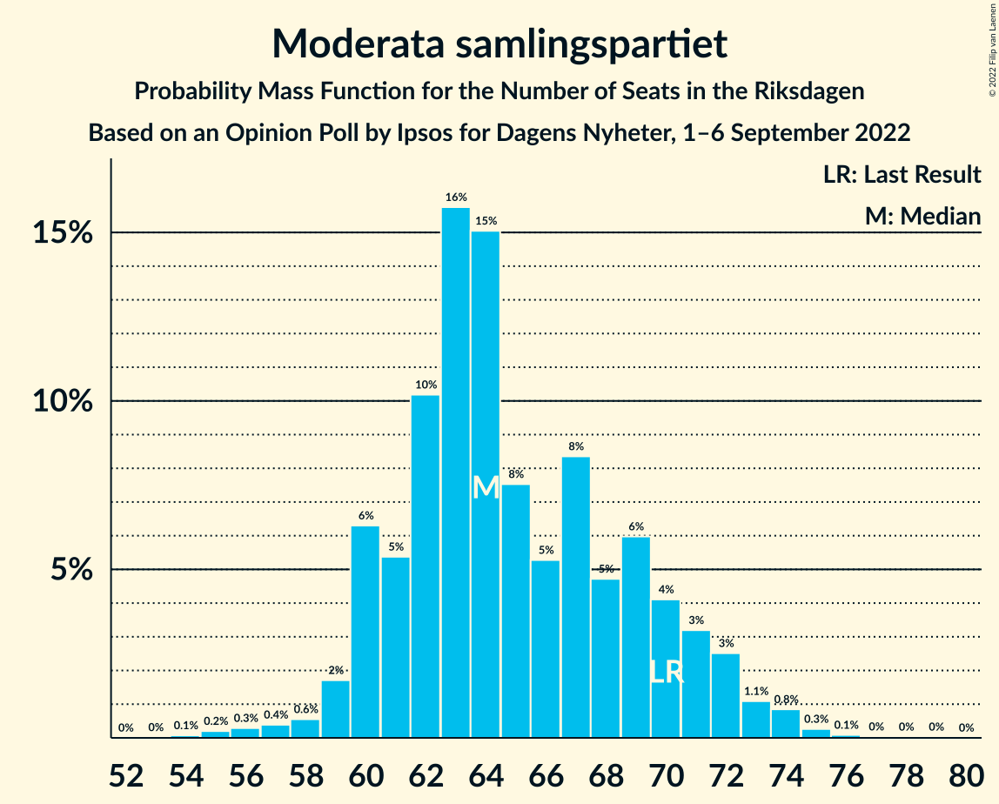

| Number of Seats | Probability | Accumulated | Special Marks |
|:---------------:|:-----------:|:-----------:|:-------------:|
| 54 | 0.1% | 100% |  |
| 55 | 0.2% | 99.9% |  |
| 56 | 0.3% | 99.7% |  |
| 57 | 0.4% | 99.4% |  |
| 58 | 0.6% | 99.0% |  |
| 59 | 2% | 98% |  |
| 60 | 6% | 97% |  |
| 61 | 5% | 90% |  |
| 62 | 10% | 85% |  |
| 63 | 16% | 75% |  |
| 64 | 15% | 59% | Median |
| 65 | 8% | 44% |  |
| 66 | 5% | 37% |  |
| 67 | 8% | 31% |  |
| 68 | 5% | 23% |  |
| 69 | 6% | 18% |  |
| 70 | 4% | 12% | Last Result |
| 71 | 3% | 8% |  |
| 72 | 3% | 5% |  |
| 73 | 1.1% | 2% |  |
| 74 | 0.8% | 1.3% |  |
| 75 | 0.3% | 0.5% |  |
| 76 | 0.1% | 0.2% |  |
| 77 | 0% | 0.1% |  |
| 78 | 0% | 0.1% |  |
| 79 | 0% | 0% |  |

### Vänsterpartiet

*For a full overview of the results for this party, see the [Vänsterpartiet](party-vänsterpartiet.html) page.*

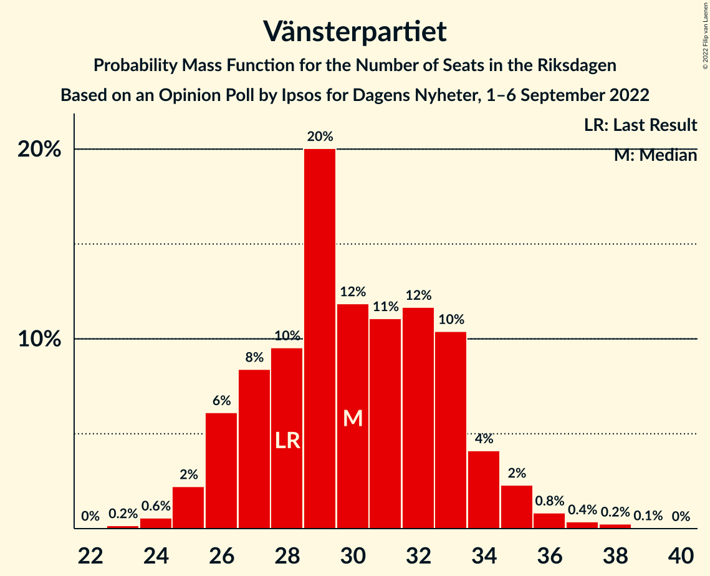

| Number of Seats | Probability | Accumulated | Special Marks |
|:---------------:|:-----------:|:-----------:|:-------------:|
| 23 | 0.2% | 100% |  |
| 24 | 0.6% | 99.8% |  |
| 25 | 2% | 99.2% |  |
| 26 | 6% | 97% |  |
| 27 | 8% | 91% |  |
| 28 | 10% | 82% | Last Result |
| 29 | 20% | 73% |  |
| 30 | 12% | 53% | Median |
| 31 | 11% | 41% |  |
| 32 | 12% | 30% |  |
| 33 | 10% | 18% |  |
| 34 | 4% | 8% |  |
| 35 | 2% | 4% |  |
| 36 | 0.8% | 2% |  |
| 37 | 0.4% | 0.7% |  |
| 38 | 0.2% | 0.3% |  |
| 39 | 0.1% | 0.1% |  |
| 40 | 0% | 0% |  |

### Centerpartiet

*For a full overview of the results for this party, see the [Centerpartiet](party-centerpartiet.html) page.*

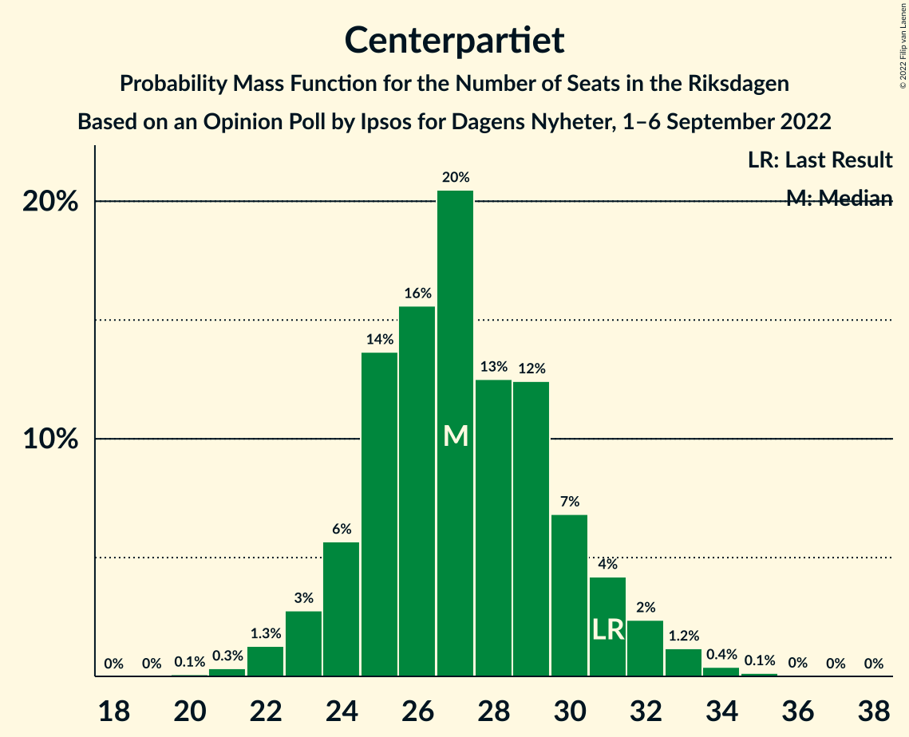

| Number of Seats | Probability | Accumulated | Special Marks |
|:---------------:|:-----------:|:-----------:|:-------------:|
| 20 | 0.1% | 100% |  |
| 21 | 0.3% | 99.9% |  |
| 22 | 1.3% | 99.6% |  |
| 23 | 3% | 98% |  |
| 24 | 6% | 96% |  |
| 25 | 14% | 90% |  |
| 26 | 16% | 76% |  |
| 27 | 20% | 61% | Median |
| 28 | 13% | 40% |  |
| 29 | 12% | 28% |  |
| 30 | 7% | 15% |  |
| 31 | 4% | 8% | Last Result |
| 32 | 2% | 4% |  |
| 33 | 1.2% | 2% |  |
| 34 | 0.4% | 0.6% |  |
| 35 | 0.1% | 0.2% |  |
| 36 | 0% | 0.1% |  |
| 37 | 0% | 0% |  |

### Kristdemokraterna

*For a full overview of the results for this party, see the [Kristdemokraterna](party-kristdemokraterna.html) page.*

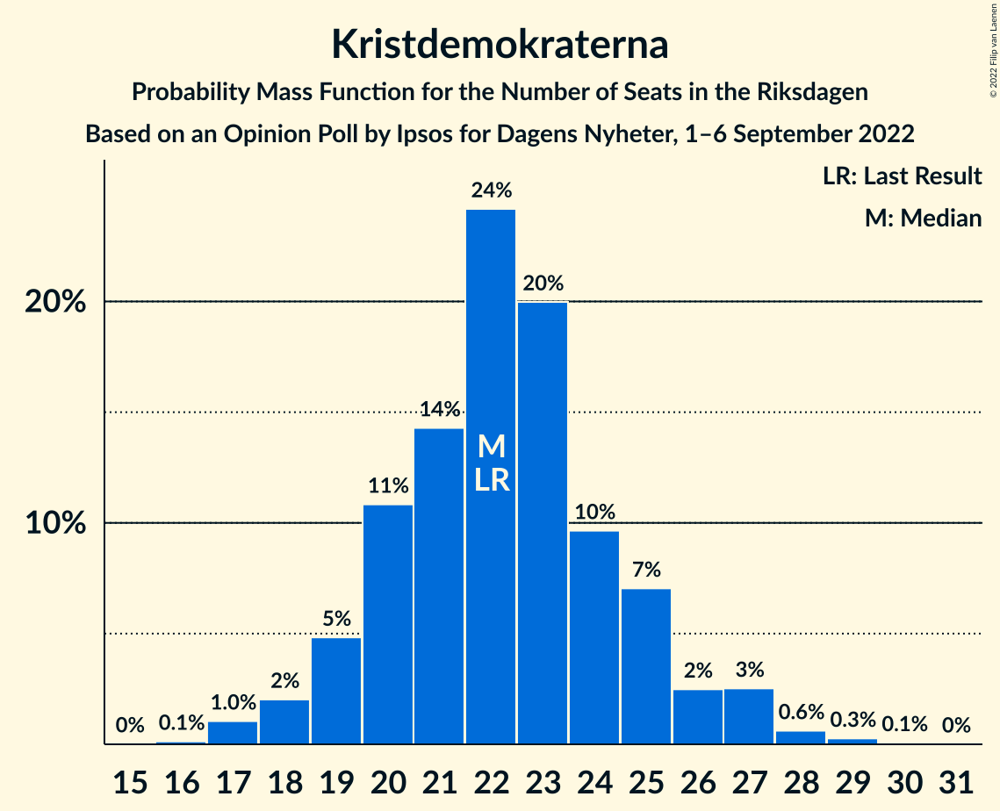

| Number of Seats | Probability | Accumulated | Special Marks |
|:---------------:|:-----------:|:-----------:|:-------------:|
| 16 | 0.1% | 100% |  |
| 17 | 1.0% | 99.8% |  |
| 18 | 2% | 98.8% |  |
| 19 | 5% | 97% |  |
| 20 | 11% | 92% |  |
| 21 | 14% | 81% |  |
| 22 | 24% | 67% | Last Result, Median |
| 23 | 20% | 43% |  |
| 24 | 10% | 23% |  |
| 25 | 7% | 13% |  |
| 26 | 2% | 6% |  |
| 27 | 3% | 3% |  |
| 28 | 0.6% | 1.0% |  |
| 29 | 0.3% | 0.3% |  |
| 30 | 0.1% | 0.1% |  |
| 31 | 0% | 0% |  |

### Miljöpartiet de gröna

*For a full overview of the results for this party, see the [Miljöpartiet de gröna](party-miljöpartietdegröna.html) page.*

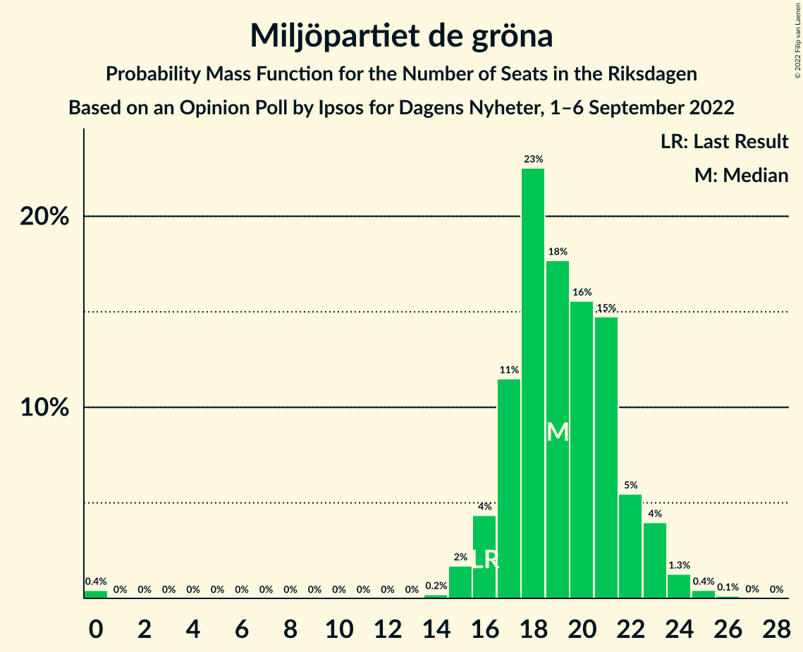

| Number of Seats | Probability | Accumulated | Special Marks |
|:---------------:|:-----------:|:-----------:|:-------------:|
| 0 | 0.4% | 100% |  |
| 1 | 0% | 99.6% |  |
| 2 | 0% | 99.6% |  |
| 3 | 0% | 99.6% |  |
| 4 | 0% | 99.6% |  |
| 5 | 0% | 99.6% |  |
| 6 | 0% | 99.6% |  |
| 7 | 0% | 99.6% |  |
| 8 | 0% | 99.6% |  |
| 9 | 0% | 99.6% |  |
| 10 | 0% | 99.6% |  |
| 11 | 0% | 99.6% |  |
| 12 | 0% | 99.6% |  |
| 13 | 0% | 99.6% |  |
| 14 | 0.2% | 99.6% |  |
| 15 | 2% | 99.4% |  |
| 16 | 4% | 98% | Last Result |
| 17 | 11% | 93% |  |
| 18 | 23% | 82% |  |
| 19 | 18% | 59% | Median |
| 20 | 16% | 42% |  |
| 21 | 15% | 26% |  |
| 22 | 5% | 11% |  |
| 23 | 4% | 6% |  |
| 24 | 1.3% | 2% |  |
| 25 | 0.4% | 0.6% |  |
| 26 | 0.1% | 0.2% |  |
| 27 | 0% | 0% |  |

### Liberalerna

*For a full overview of the results for this party, see the [Liberalerna](party-liberalerna.html) page.*

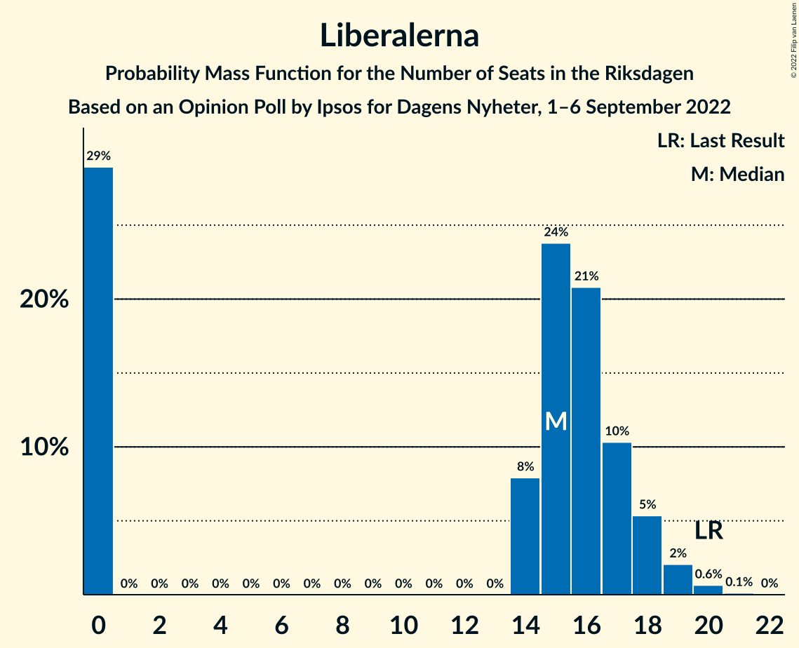

| Number of Seats | Probability | Accumulated | Special Marks |
|:---------------:|:-----------:|:-----------:|:-------------:|
| 0 | 29% | 100% |  |
| 1 | 0% | 71% |  |
| 2 | 0% | 71% |  |
| 3 | 0% | 71% |  |
| 4 | 0% | 71% |  |
| 5 | 0% | 71% |  |
| 6 | 0% | 71% |  |
| 7 | 0% | 71% |  |
| 8 | 0% | 71% |  |
| 9 | 0% | 71% |  |
| 10 | 0% | 71% |  |
| 11 | 0% | 71% |  |
| 12 | 0% | 71% |  |
| 13 | 0% | 71% |  |
| 14 | 8% | 71% |  |
| 15 | 24% | 63% | Median |
| 16 | 21% | 39% |  |
| 17 | 10% | 19% |  |
| 18 | 5% | 8% |  |
| 19 | 2% | 3% |  |
| 20 | 0.6% | 0.8% | Last Result |
| 21 | 0.1% | 0.2% |  |
| 22 | 0% | 0% |  |

## Coalitions

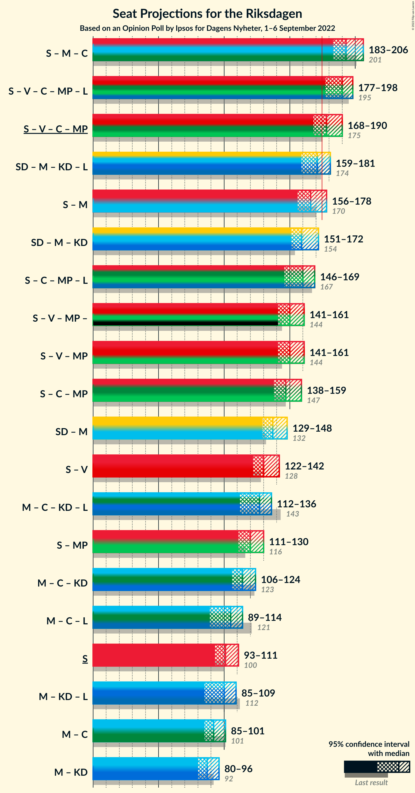

### Confidence Intervals

| Coalition | Last Result | Median | Majority? | 80% Confidence Interval | 90% Confidence Interval | 95% Confidence Interval | 99% Confidence Interval |
|:---------:|:-----------:|:------:|:---------:|:-----------------------:|:-----------------------:|:-----------------------:|:-----------------------:|
| Sveriges socialdemokratiska arbetareparti – Moderata samlingspartiet – Centerpartiet | 201 | 193 | 100% | 187–202 | 185–204 | 183–206 | 181–210 |
| Sveriges socialdemokratiska arbetareparti – Vänsterpartiet – Centerpartiet – Miljöpartiet de gröna – Liberalerna | 195 | 190 | 99.2% | 181–195 | 179–197 | 177–198 | 174–201 |
| Sveriges socialdemokratiska arbetareparti – Vänsterpartiet – Centerpartiet – Miljöpartiet de gröna | 175 | 178 | 69% | 171–185 | 169–188 | 168–190 | 165–192 |
| Sverigedemokraterna – Moderata samlingspartiet – Kristdemokraterna – Liberalerna | 174 | 171 | 31% | 164–178 | 161–180 | 159–181 | 157–184 |
| Sveriges socialdemokratiska arbetareparti – Moderata samlingspartiet | 170 | 166 | 7% | 160–173 | 158–176 | 156–178 | 154–182 |
| Sverigedemokraterna – Moderata samlingspartiet – Kristdemokraterna | 154 | 159 | 0.8% | 154–168 | 152–170 | 151–172 | 148–175 |
| Sveriges socialdemokratiska arbetareparti – Centerpartiet – Miljöpartiet de gröna – Liberalerna | 167 | 160 | 0.1% | 150–165 | 147–168 | 146–169 | 143–172 |
| Sveriges socialdemokratiska arbetareparti – Vänsterpartiet – Miljöpartiet de gröna | 144 | 150 | 0% | 144–158 | 142–160 | 141–161 | 138–164 |
| Sveriges socialdemokratiska arbetareparti – Centerpartiet – Miljöpartiet de gröna | 147 | 147 | 0% | 141–155 | 139–157 | 138–159 | 135–161 |
| Sverigedemokraterna – Moderata samlingspartiet | 132 | 137 | 0% | 132–145 | 130–148 | 129–148 | 126–152 |
| Sveriges socialdemokratiska arbetareparti – Vänsterpartiet | 128 | 130 | 0% | 125–138 | 124–140 | 122–142 | 119–145 |
| Moderata samlingspartiet – Centerpartiet – Kristdemokraterna – Liberalerna | 143 | 127 | 0% | 117–132 | 114–134 | 112–136 | 110–139 |
| Sveriges socialdemokratiska arbetareparti – Miljöpartiet de gröna | 116 | 120 | 0% | 114–127 | 113–128 | 111–130 | 109–133 |
| Moderata samlingspartiet – Centerpartiet – Kristdemokraterna | 123 | 114 | 0% | 108–120 | 107–123 | 106–124 | 104–127 |
| Moderata samlingspartiet – Centerpartiet – Liberalerna | 121 | 105 | 0% | 93–111 | 91–112 | 89–114 | 87–116 |
| Sveriges socialdemokratiska arbetareparti | 100 | 101 | 0% | 96–107 | 95–109 | 93–111 | 91–113 |
| Moderata samlingspartiet – Kristdemokraterna – Liberalerna | 112 | 100 | 0% | 89–106 | 86–107 | 85–109 | 82–111 |
| Moderata samlingspartiet – Centerpartiet | 101 | 92 | 0% | 86–98 | 86–99 | 85–101 | 82–104 |
| Moderata samlingspartiet – Kristdemokraterna | 92 | 87 | 0% | 82–93 | 81–94 | 80–96 | 78–98 |

### Sveriges socialdemokratiska arbetareparti – Moderata samlingspartiet – Centerpartiet

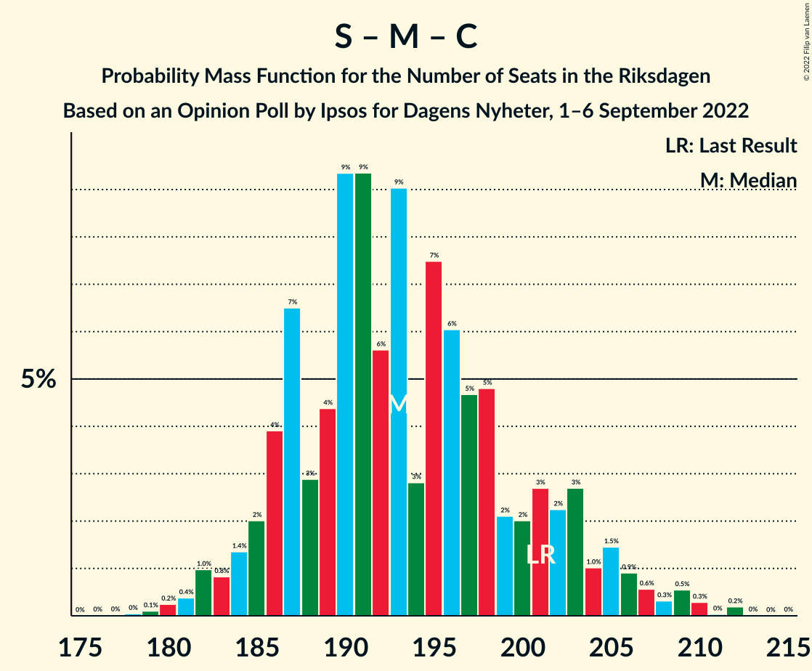

| Number of Seats | Probability | Accumulated | Special Marks |
|:---------------:|:-----------:|:-----------:|:-------------:|
| 178 | 0% | 100% |  |
| 179 | 0.1% | 99.9% |  |
| 180 | 0.2% | 99.8% |  |
| 181 | 0.4% | 99.6% |  |
| 182 | 1.0% | 99.2% |  |
| 183 | 0.8% | 98% |  |
| 184 | 1.4% | 97% |  |
| 185 | 2% | 96% |  |
| 186 | 4% | 94% |  |
| 187 | 7% | 90% |  |
| 188 | 3% | 84% |  |
| 189 | 4% | 81% |  |
| 190 | 9% | 76% |  |
| 191 | 9% | 67% |  |
| 192 | 6% | 58% | Median |
| 193 | 9% | 52% |  |
| 194 | 3% | 43% |  |
| 195 | 7% | 40% |  |
| 196 | 6% | 33% |  |
| 197 | 5% | 27% |  |
| 198 | 5% | 22% |  |
| 199 | 2% | 17% |  |
| 200 | 2% | 15% |  |
| 201 | 3% | 13% | Last Result |
| 202 | 2% | 10% |  |
| 203 | 3% | 8% |  |
| 204 | 1.0% | 5% |  |
| 205 | 1.5% | 4% |  |
| 206 | 0.9% | 3% |  |
| 207 | 0.6% | 2% |  |
| 208 | 0.3% | 1.4% |  |
| 209 | 0.5% | 1.1% |  |
| 210 | 0.3% | 0.6% |  |
| 211 | 0% | 0.3% |  |
| 212 | 0.2% | 0.2% |  |
| 213 | 0% | 0.1% |  |
| 214 | 0% | 0% |  |

### Sveriges socialdemokratiska arbetareparti – Vänsterpartiet – Centerpartiet – Miljöpartiet de gröna – Liberalerna

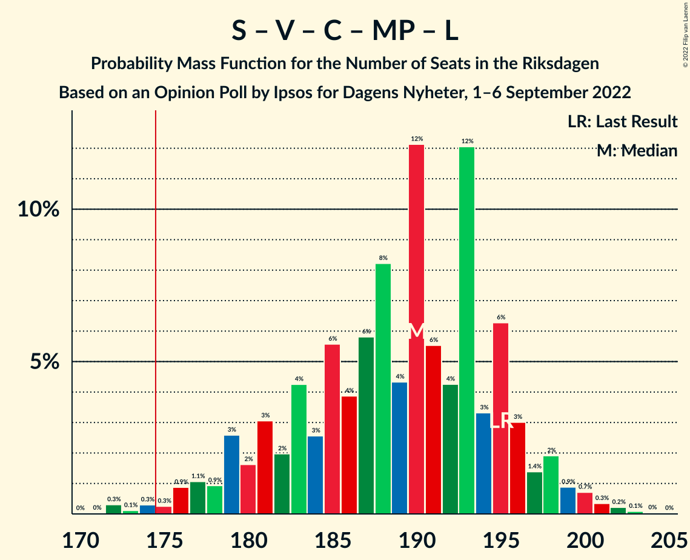

| Number of Seats | Probability | Accumulated | Special Marks |
|:---------------:|:-----------:|:-----------:|:-------------:|
| 170 | 0% | 100% |  |
| 171 | 0% | 99.9% |  |
| 172 | 0.3% | 99.9% |  |
| 173 | 0.1% | 99.6% |  |
| 174 | 0.3% | 99.5% |  |
| 175 | 0.3% | 99.2% | Majority |
| 176 | 0.9% | 98.9% |  |
| 177 | 1.1% | 98% |  |
| 178 | 0.9% | 97% |  |
| 179 | 3% | 96% |  |
| 180 | 2% | 93% |  |
| 181 | 3% | 92% |  |
| 182 | 2% | 89% |  |
| 183 | 4% | 87% |  |
| 184 | 3% | 83% |  |
| 185 | 6% | 80% |  |
| 186 | 4% | 74% |  |
| 187 | 6% | 71% |  |
| 188 | 8% | 65% |  |
| 189 | 4% | 57% |  |
| 190 | 12% | 52% |  |
| 191 | 6% | 40% |  |
| 192 | 4% | 35% | Median |
| 193 | 12% | 30% |  |
| 194 | 3% | 18% |  |
| 195 | 6% | 15% | Last Result |
| 196 | 3% | 9% |  |
| 197 | 1.4% | 6% |  |
| 198 | 2% | 4% |  |
| 199 | 0.9% | 2% |  |
| 200 | 0.7% | 1.4% |  |
| 201 | 0.3% | 0.7% |  |
| 202 | 0.2% | 0.4% |  |
| 203 | 0.1% | 0.2% |  |
| 204 | 0% | 0.1% |  |
| 205 | 0% | 0% |  |

### Sveriges socialdemokratiska arbetareparti – Vänsterpartiet – Centerpartiet – Miljöpartiet de gröna

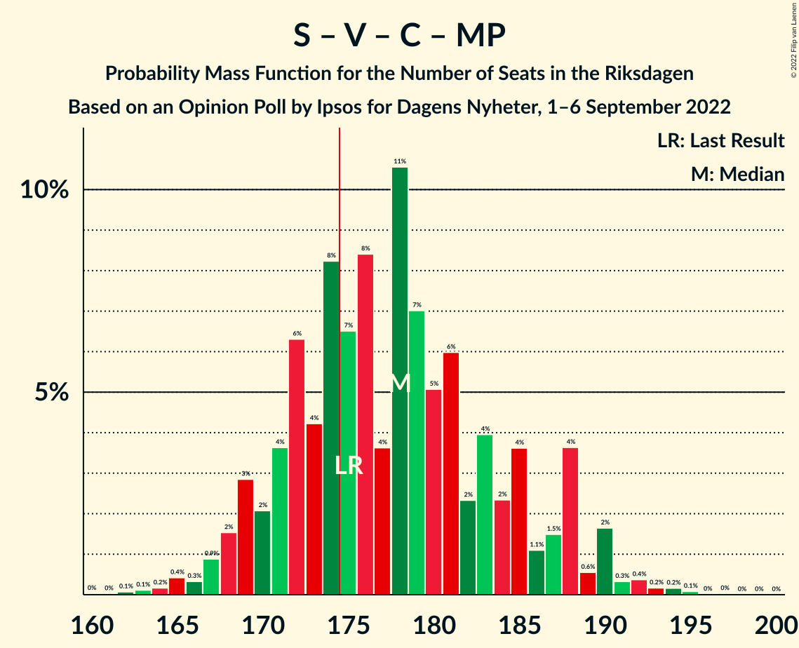

| Number of Seats | Probability | Accumulated | Special Marks |
|:---------------:|:-----------:|:-----------:|:-------------:|
| 160 | 0% | 100% |  |
| 161 | 0% | 99.9% |  |
| 162 | 0.1% | 99.9% |  |
| 163 | 0.1% | 99.8% |  |
| 164 | 0.2% | 99.7% |  |
| 165 | 0.4% | 99.6% |  |
| 166 | 0.3% | 99.1% |  |
| 167 | 0.9% | 98.8% |  |
| 168 | 2% | 98% |  |
| 169 | 3% | 96% |  |
| 170 | 2% | 94% |  |
| 171 | 4% | 91% |  |
| 172 | 6% | 88% |  |
| 173 | 4% | 82% |  |
| 174 | 8% | 77% |  |
| 175 | 7% | 69% | Last Result, Majority |
| 176 | 8% | 63% |  |
| 177 | 4% | 54% | Median |
| 178 | 11% | 50% |  |
| 179 | 7% | 40% |  |
| 180 | 5% | 33% |  |
| 181 | 6% | 28% |  |
| 182 | 2% | 22% |  |
| 183 | 4% | 20% |  |
| 184 | 2% | 16% |  |
| 185 | 4% | 13% |  |
| 186 | 1.1% | 10% |  |
| 187 | 1.5% | 9% |  |
| 188 | 4% | 7% |  |
| 189 | 0.6% | 3% |  |
| 190 | 2% | 3% |  |
| 191 | 0.3% | 1.2% |  |
| 192 | 0.4% | 0.8% |  |
| 193 | 0.2% | 0.5% |  |
| 194 | 0.2% | 0.3% |  |
| 195 | 0.1% | 0.1% |  |
| 196 | 0% | 0.1% |  |
| 197 | 0% | 0% |  |

### Sverigedemokraterna – Moderata samlingspartiet – Kristdemokraterna – Liberalerna

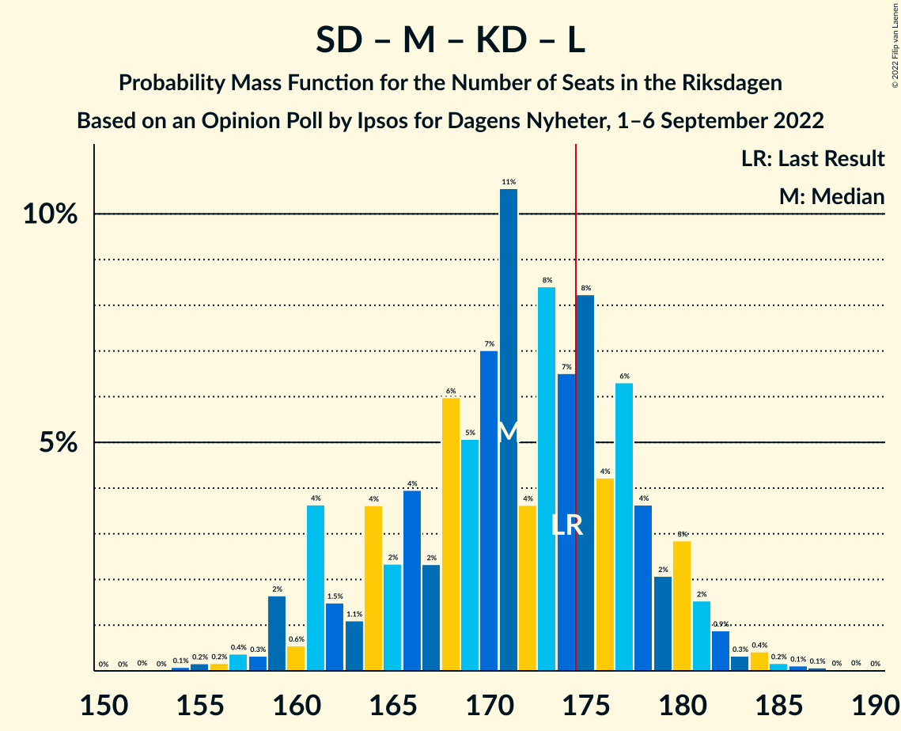

| Number of Seats | Probability | Accumulated | Special Marks |
|:---------------:|:-----------:|:-----------:|:-------------:|
| 153 | 0% | 100% |  |
| 154 | 0.1% | 99.9% |  |
| 155 | 0.2% | 99.9% |  |
| 156 | 0.2% | 99.7% |  |
| 157 | 0.4% | 99.5% |  |
| 158 | 0.3% | 99.2% |  |
| 159 | 2% | 98.8% |  |
| 160 | 0.6% | 97% |  |
| 161 | 4% | 97% |  |
| 162 | 1.5% | 93% |  |
| 163 | 1.1% | 91% |  |
| 164 | 4% | 90% |  |
| 165 | 2% | 87% |  |
| 166 | 4% | 84% |  |
| 167 | 2% | 80% |  |
| 168 | 6% | 78% |  |
| 169 | 5% | 72% |  |
| 170 | 7% | 67% |  |
| 171 | 11% | 60% |  |
| 172 | 4% | 50% |  |
| 173 | 8% | 46% |  |
| 174 | 7% | 37% | Last Result, Median |
| 175 | 8% | 31% | Majority |
| 176 | 4% | 23% |  |
| 177 | 6% | 18% |  |
| 178 | 4% | 12% |  |
| 179 | 2% | 9% |  |
| 180 | 3% | 6% |  |
| 181 | 2% | 4% |  |
| 182 | 0.9% | 2% |  |
| 183 | 0.3% | 1.2% |  |
| 184 | 0.4% | 0.9% |  |
| 185 | 0.2% | 0.4% |  |
| 186 | 0.1% | 0.3% |  |
| 187 | 0.1% | 0.2% |  |
| 188 | 0% | 0.1% |  |
| 189 | 0% | 0.1% |  |
| 190 | 0% | 0% |  |

### Sveriges socialdemokratiska arbetareparti – Moderata samlingspartiet

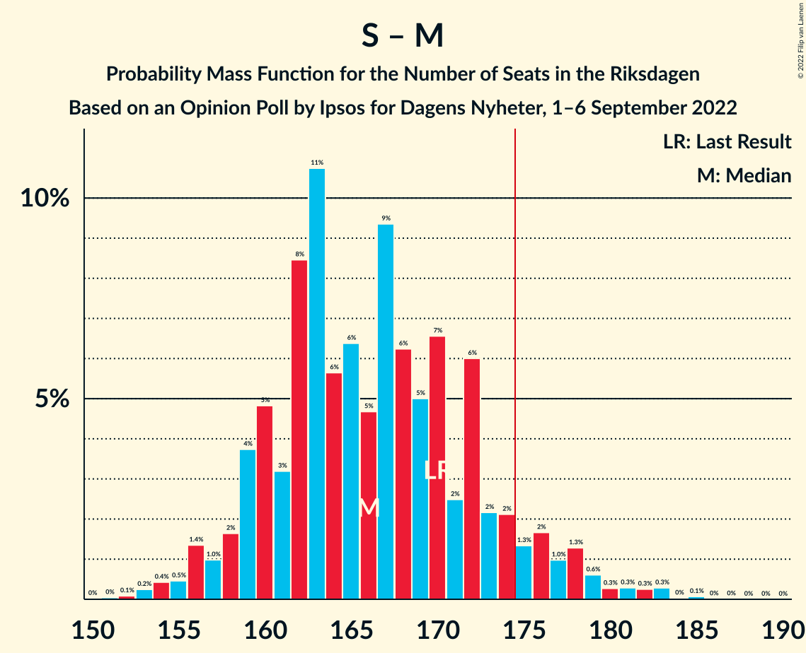

| Number of Seats | Probability | Accumulated | Special Marks |
|:---------------:|:-----------:|:-----------:|:-------------:|
| 151 | 0% | 100% |  |
| 152 | 0.1% | 99.9% |  |
| 153 | 0.2% | 99.8% |  |
| 154 | 0.4% | 99.6% |  |
| 155 | 0.5% | 99.2% |  |
| 156 | 1.4% | 98.7% |  |
| 157 | 1.0% | 97% |  |
| 158 | 2% | 96% |  |
| 159 | 4% | 95% |  |
| 160 | 5% | 91% |  |
| 161 | 3% | 86% |  |
| 162 | 8% | 83% |  |
| 163 | 11% | 74% |  |
| 164 | 6% | 64% |  |
| 165 | 6% | 58% | Median |
| 166 | 5% | 52% |  |
| 167 | 9% | 47% |  |
| 168 | 6% | 38% |  |
| 169 | 5% | 31% |  |
| 170 | 7% | 26% | Last Result |
| 171 | 2% | 20% |  |
| 172 | 6% | 17% |  |
| 173 | 2% | 11% |  |
| 174 | 2% | 9% |  |
| 175 | 1.3% | 7% | Majority |
| 176 | 2% | 6% |  |
| 177 | 1.0% | 4% |  |
| 178 | 1.3% | 3% |  |
| 179 | 0.6% | 2% |  |
| 180 | 0.3% | 1.2% |  |
| 181 | 0.3% | 1.0% |  |
| 182 | 0.3% | 0.7% |  |
| 183 | 0.3% | 0.4% |  |
| 184 | 0% | 0.1% |  |
| 185 | 0.1% | 0.1% |  |
| 186 | 0% | 0% |  |

### Sverigedemokraterna – Moderata samlingspartiet – Kristdemokraterna

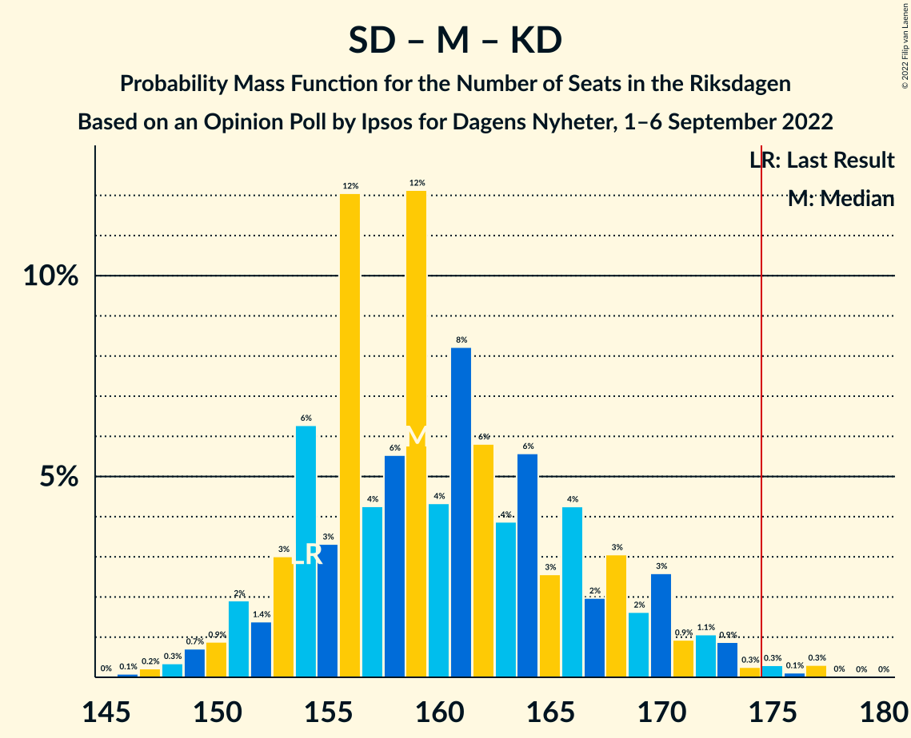

| Number of Seats | Probability | Accumulated | Special Marks |
|:---------------:|:-----------:|:-----------:|:-------------:|
| 145 | 0% | 100% |  |
| 146 | 0.1% | 99.9% |  |
| 147 | 0.2% | 99.8% |  |
| 148 | 0.3% | 99.6% |  |
| 149 | 0.7% | 99.3% |  |
| 150 | 0.9% | 98.6% |  |
| 151 | 2% | 98% |  |
| 152 | 1.4% | 96% |  |
| 153 | 3% | 94% |  |
| 154 | 6% | 91% | Last Result |
| 155 | 3% | 85% |  |
| 156 | 12% | 82% |  |
| 157 | 4% | 70% |  |
| 158 | 6% | 65% |  |
| 159 | 12% | 60% | Median |
| 160 | 4% | 48% |  |
| 161 | 8% | 43% |  |
| 162 | 6% | 35% |  |
| 163 | 4% | 29% |  |
| 164 | 6% | 26% |  |
| 165 | 3% | 20% |  |
| 166 | 4% | 17% |  |
| 167 | 2% | 13% |  |
| 168 | 3% | 11% |  |
| 169 | 2% | 8% |  |
| 170 | 3% | 7% |  |
| 171 | 0.9% | 4% |  |
| 172 | 1.1% | 3% |  |
| 173 | 0.9% | 2% |  |
| 174 | 0.3% | 1.1% |  |
| 175 | 0.3% | 0.8% | Majority |
| 176 | 0.1% | 0.5% |  |
| 177 | 0.3% | 0.4% |  |
| 178 | 0% | 0.1% |  |
| 179 | 0% | 0.1% |  |
| 180 | 0% | 0% |  |

### Sveriges socialdemokratiska arbetareparti – Centerpartiet – Miljöpartiet de gröna – Liberalerna

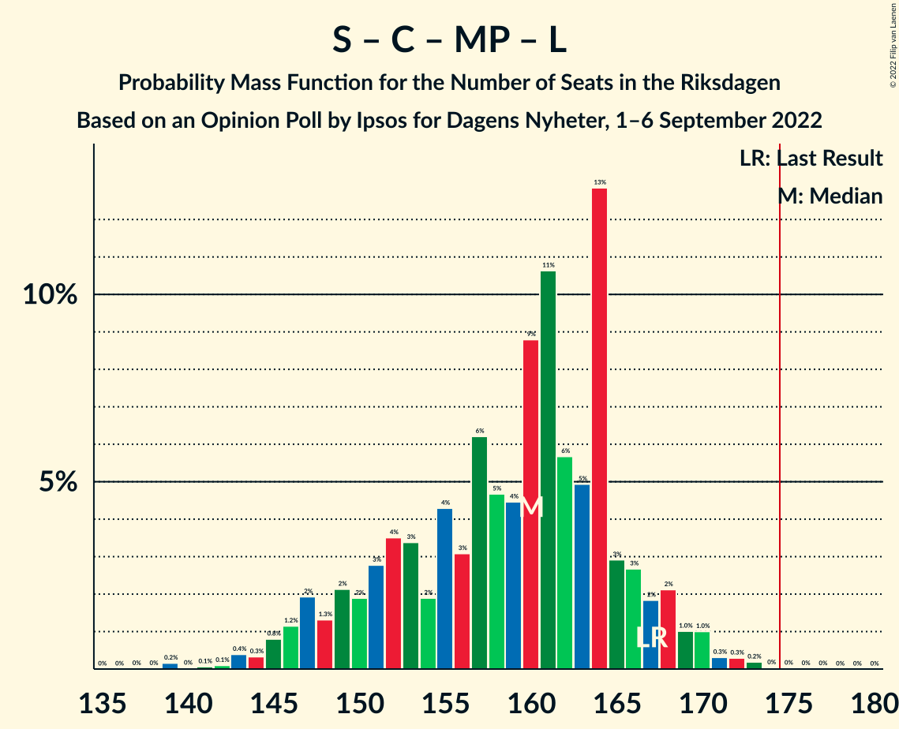

| Number of Seats | Probability | Accumulated | Special Marks |
|:---------------:|:-----------:|:-----------:|:-------------:|
| 139 | 0.2% | 100% |  |
| 140 | 0% | 99.8% |  |
| 141 | 0.1% | 99.8% |  |
| 142 | 0.1% | 99.7% |  |
| 143 | 0.4% | 99.6% |  |
| 144 | 0.3% | 99.2% |  |
| 145 | 0.8% | 98.9% |  |
| 146 | 1.2% | 98% |  |
| 147 | 2% | 97% |  |
| 148 | 1.3% | 95% |  |
| 149 | 2% | 94% |  |
| 150 | 2% | 92% |  |
| 151 | 3% | 90% |  |
| 152 | 4% | 87% |  |
| 153 | 3% | 83% |  |
| 154 | 2% | 80% |  |
| 155 | 4% | 78% |  |
| 156 | 3% | 74% |  |
| 157 | 6% | 71% |  |
| 158 | 5% | 64% |  |
| 159 | 4% | 60% |  |
| 160 | 9% | 55% |  |
| 161 | 11% | 47% |  |
| 162 | 6% | 36% | Median |
| 163 | 5% | 30% |  |
| 164 | 13% | 25% |  |
| 165 | 3% | 12% |  |
| 166 | 3% | 10% |  |
| 167 | 2% | 7% | Last Result |
| 168 | 2% | 5% |  |
| 169 | 1.0% | 3% |  |
| 170 | 1.0% | 2% |  |
| 171 | 0.3% | 0.9% |  |
| 172 | 0.3% | 0.6% |  |
| 173 | 0.2% | 0.3% |  |
| 174 | 0% | 0.1% |  |
| 175 | 0% | 0.1% | Majority |
| 176 | 0% | 0% |  |

### Sveriges socialdemokratiska arbetareparti – Vänsterpartiet – Miljöpartiet de gröna

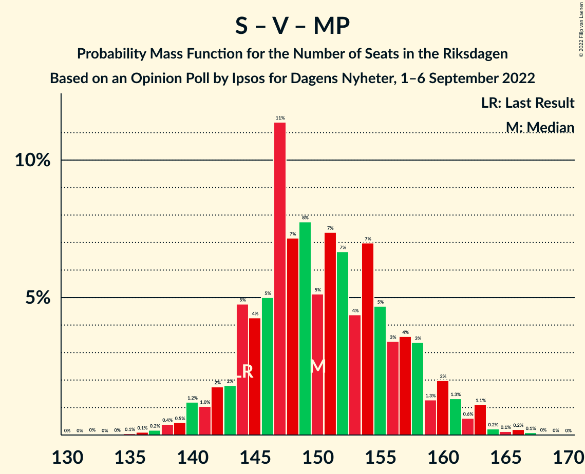

| Number of Seats | Probability | Accumulated | Special Marks |
|:---------------:|:-----------:|:-----------:|:-------------:|
| 132 | 0% | 100% |  |
| 133 | 0% | 99.9% |  |
| 134 | 0% | 99.9% |  |
| 135 | 0.1% | 99.9% |  |
| 136 | 0.1% | 99.9% |  |
| 137 | 0.2% | 99.8% |  |
| 138 | 0.4% | 99.6% |  |
| 139 | 0.5% | 99.2% |  |
| 140 | 1.2% | 98.7% |  |
| 141 | 1.0% | 98% |  |
| 142 | 2% | 96% |  |
| 143 | 2% | 95% |  |
| 144 | 5% | 93% | Last Result |
| 145 | 4% | 88% |  |
| 146 | 5% | 84% |  |
| 147 | 11% | 79% |  |
| 148 | 7% | 68% |  |
| 149 | 8% | 60% |  |
| 150 | 5% | 53% | Median |
| 151 | 7% | 47% |  |
| 152 | 7% | 40% |  |
| 153 | 4% | 33% |  |
| 154 | 7% | 29% |  |
| 155 | 5% | 22% |  |
| 156 | 3% | 17% |  |
| 157 | 4% | 14% |  |
| 158 | 3% | 10% |  |
| 159 | 1.3% | 7% |  |
| 160 | 2% | 6% |  |
| 161 | 1.3% | 4% |  |
| 162 | 0.6% | 2% |  |
| 163 | 1.1% | 2% |  |
| 164 | 0.2% | 0.7% |  |
| 165 | 0.1% | 0.5% |  |
| 166 | 0.2% | 0.4% |  |
| 167 | 0.1% | 0.2% |  |
| 168 | 0% | 0.1% |  |
| 169 | 0% | 0% |  |

### Sveriges socialdemokratiska arbetareparti – Centerpartiet – Miljöpartiet de gröna

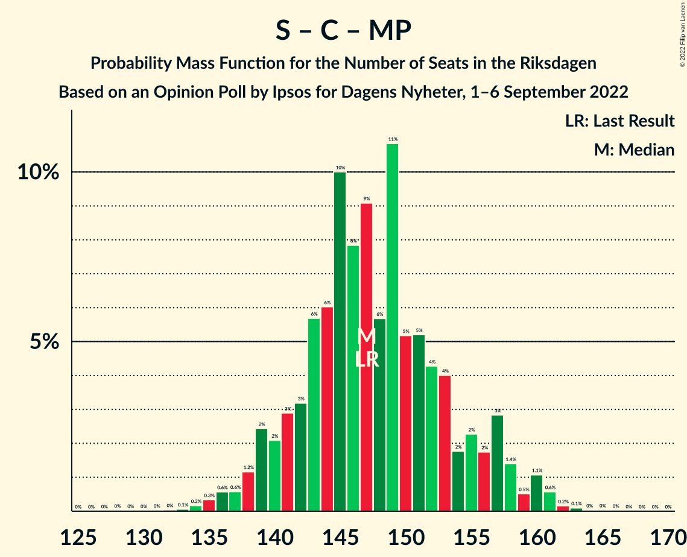

| Number of Seats | Probability | Accumulated | Special Marks |
|:---------------:|:-----------:|:-----------:|:-------------:|
| 129 | 0% | 100% |  |
| 130 | 0% | 99.9% |  |
| 131 | 0% | 99.9% |  |
| 132 | 0% | 99.9% |  |
| 133 | 0.1% | 99.9% |  |
| 134 | 0.2% | 99.8% |  |
| 135 | 0.3% | 99.6% |  |
| 136 | 0.6% | 99.3% |  |
| 137 | 0.6% | 98.7% |  |
| 138 | 1.2% | 98% |  |
| 139 | 2% | 97% |  |
| 140 | 2% | 95% |  |
| 141 | 3% | 92% |  |
| 142 | 3% | 90% |  |
| 143 | 6% | 86% |  |
| 144 | 6% | 81% |  |
| 145 | 10% | 75% |  |
| 146 | 8% | 65% |  |
| 147 | 9% | 57% | Last Result, Median |
| 148 | 6% | 48% |  |
| 149 | 11% | 42% |  |
| 150 | 5% | 31% |  |
| 151 | 5% | 26% |  |
| 152 | 4% | 21% |  |
| 153 | 4% | 17% |  |
| 154 | 2% | 13% |  |
| 155 | 2% | 11% |  |
| 156 | 2% | 9% |  |
| 157 | 3% | 7% |  |
| 158 | 1.4% | 4% |  |
| 159 | 0.5% | 3% |  |
| 160 | 1.1% | 2% |  |
| 161 | 0.6% | 0.9% |  |
| 162 | 0.2% | 0.4% |  |
| 163 | 0.1% | 0.2% |  |
| 164 | 0% | 0.1% |  |
| 165 | 0% | 0.1% |  |
| 166 | 0% | 0% |  |

### Sverigedemokraterna – Moderata samlingspartiet

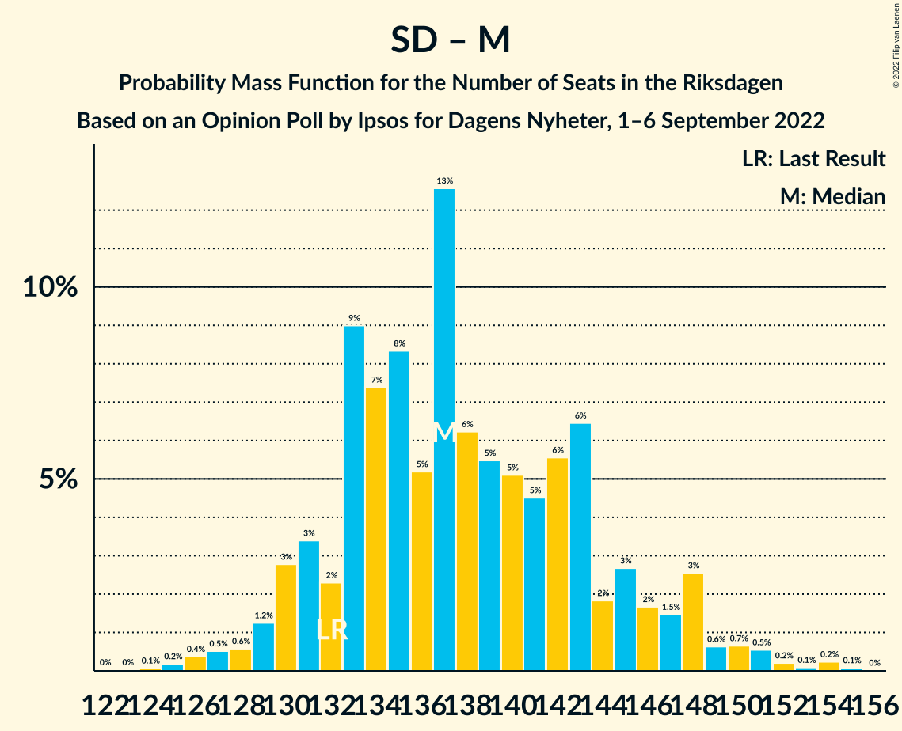

| Number of Seats | Probability | Accumulated | Special Marks |
|:---------------:|:-----------:|:-----------:|:-------------:|
| 123 | 0% | 100% |  |
| 124 | 0.1% | 99.9% |  |
| 125 | 0.2% | 99.9% |  |
| 126 | 0.4% | 99.7% |  |
| 127 | 0.5% | 99.3% |  |
| 128 | 0.6% | 98.8% |  |
| 129 | 1.2% | 98% |  |
| 130 | 3% | 97% |  |
| 131 | 3% | 94% |  |
| 132 | 2% | 91% | Last Result |
| 133 | 9% | 88% |  |
| 134 | 7% | 79% |  |
| 135 | 8% | 72% |  |
| 136 | 5% | 64% |  |
| 137 | 13% | 59% | Median |
| 138 | 6% | 46% |  |
| 139 | 5% | 40% |  |
| 140 | 5% | 34% |  |
| 141 | 5% | 29% |  |
| 142 | 6% | 25% |  |
| 143 | 6% | 19% |  |
| 144 | 2% | 13% |  |
| 145 | 3% | 11% |  |
| 146 | 2% | 8% |  |
| 147 | 1.5% | 6% |  |
| 148 | 3% | 5% |  |
| 149 | 0.6% | 2% |  |
| 150 | 0.7% | 2% |  |
| 151 | 0.5% | 1.2% |  |
| 152 | 0.2% | 0.6% |  |
| 153 | 0.1% | 0.4% |  |
| 154 | 0.2% | 0.3% |  |
| 155 | 0.1% | 0.1% |  |
| 156 | 0% | 0% |  |

### Sveriges socialdemokratiska arbetareparti – Vänsterpartiet

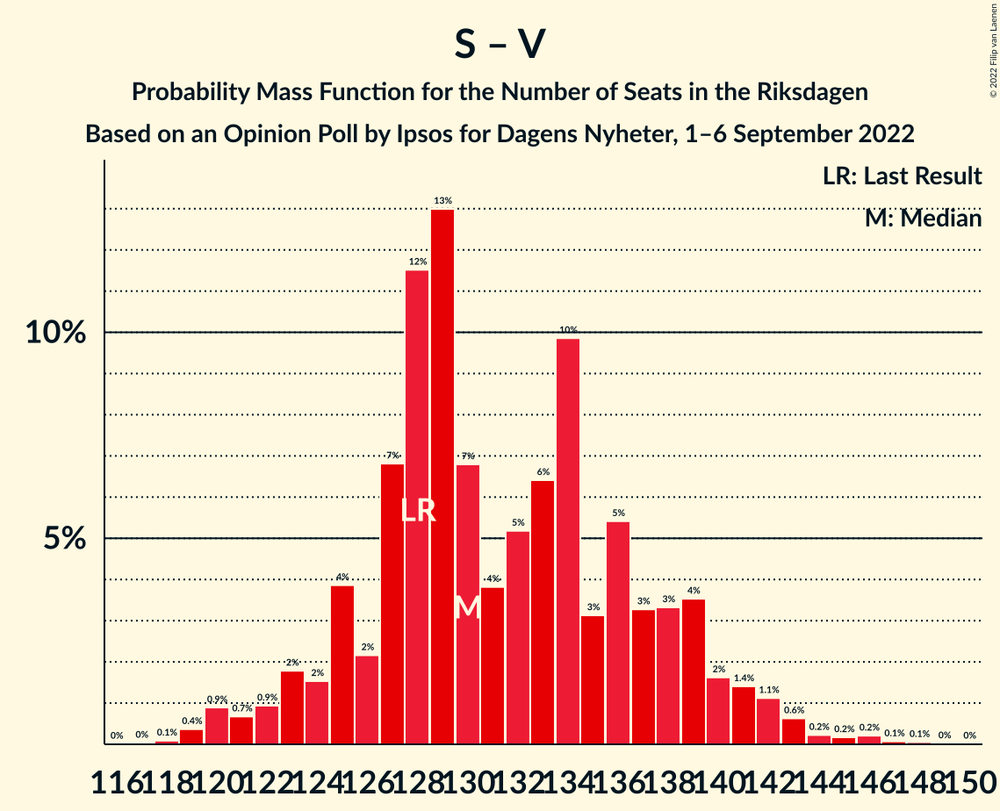

| Number of Seats | Probability | Accumulated | Special Marks |
|:---------------:|:-----------:|:-----------:|:-------------:|
| 117 | 0% | 100% |  |
| 118 | 0.1% | 99.9% |  |
| 119 | 0.4% | 99.8% |  |
| 120 | 0.9% | 99.5% |  |
| 121 | 0.7% | 98.6% |  |
| 122 | 0.9% | 98% |  |
| 123 | 2% | 97% |  |
| 124 | 2% | 95% |  |
| 125 | 4% | 94% |  |
| 126 | 2% | 90% |  |
| 127 | 7% | 88% |  |
| 128 | 12% | 81% | Last Result |
| 129 | 13% | 69% |  |
| 130 | 7% | 56% |  |
| 131 | 4% | 50% | Median |
| 132 | 5% | 46% |  |
| 133 | 6% | 41% |  |
| 134 | 10% | 34% |  |
| 135 | 3% | 24% |  |
| 136 | 5% | 21% |  |
| 137 | 3% | 16% |  |
| 138 | 3% | 12% |  |
| 139 | 4% | 9% |  |
| 140 | 2% | 6% |  |
| 141 | 1.4% | 4% |  |
| 142 | 1.1% | 3% |  |
| 143 | 0.6% | 1.4% |  |
| 144 | 0.2% | 0.8% |  |
| 145 | 0.2% | 0.5% |  |
| 146 | 0.2% | 0.4% |  |
| 147 | 0.1% | 0.2% |  |
| 148 | 0.1% | 0.1% |  |
| 149 | 0% | 0% |  |

### Moderata samlingspartiet – Centerpartiet – Kristdemokraterna – Liberalerna

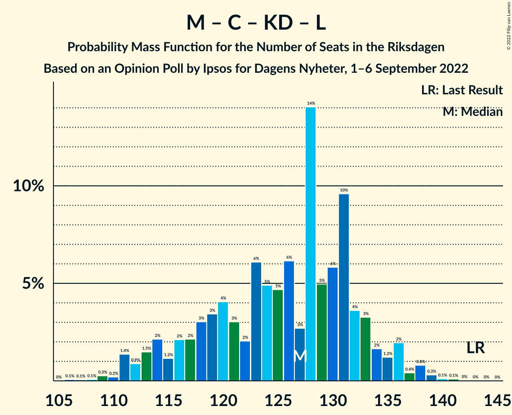

| Number of Seats | Probability | Accumulated | Special Marks |
|:---------------:|:-----------:|:-----------:|:-------------:|
| 106 | 0.1% | 100% |  |
| 107 | 0.1% | 99.9% |  |
| 108 | 0.1% | 99.9% |  |
| 109 | 0.3% | 99.8% |  |
| 110 | 0.2% | 99.5% |  |
| 111 | 1.4% | 99.3% |  |
| 112 | 0.9% | 98% |  |
| 113 | 1.5% | 97% |  |
| 114 | 2% | 96% |  |
| 115 | 1.2% | 93% |  |
| 116 | 2% | 92% |  |
| 117 | 2% | 90% |  |
| 118 | 3% | 88% |  |
| 119 | 3% | 85% |  |
| 120 | 4% | 82% |  |
| 121 | 3% | 78% |  |
| 122 | 2% | 74% |  |
| 123 | 6% | 72% |  |
| 124 | 5% | 66% |  |
| 125 | 5% | 61% |  |
| 126 | 6% | 57% |  |
| 127 | 3% | 51% |  |
| 128 | 14% | 48% | Median |
| 129 | 5% | 34% |  |
| 130 | 6% | 29% |  |
| 131 | 10% | 23% |  |
| 132 | 4% | 13% |  |
| 133 | 3% | 10% |  |
| 134 | 2% | 7% |  |
| 135 | 1.2% | 5% |  |
| 136 | 2% | 4% |  |
| 137 | 0.4% | 2% |  |
| 138 | 0.8% | 1.4% |  |
| 139 | 0.3% | 0.6% |  |
| 140 | 0.1% | 0.3% |  |
| 141 | 0.1% | 0.2% |  |
| 142 | 0% | 0.1% |  |
| 143 | 0% | 0% | Last Result |

### Sveriges socialdemokratiska arbetareparti – Miljöpartiet de gröna

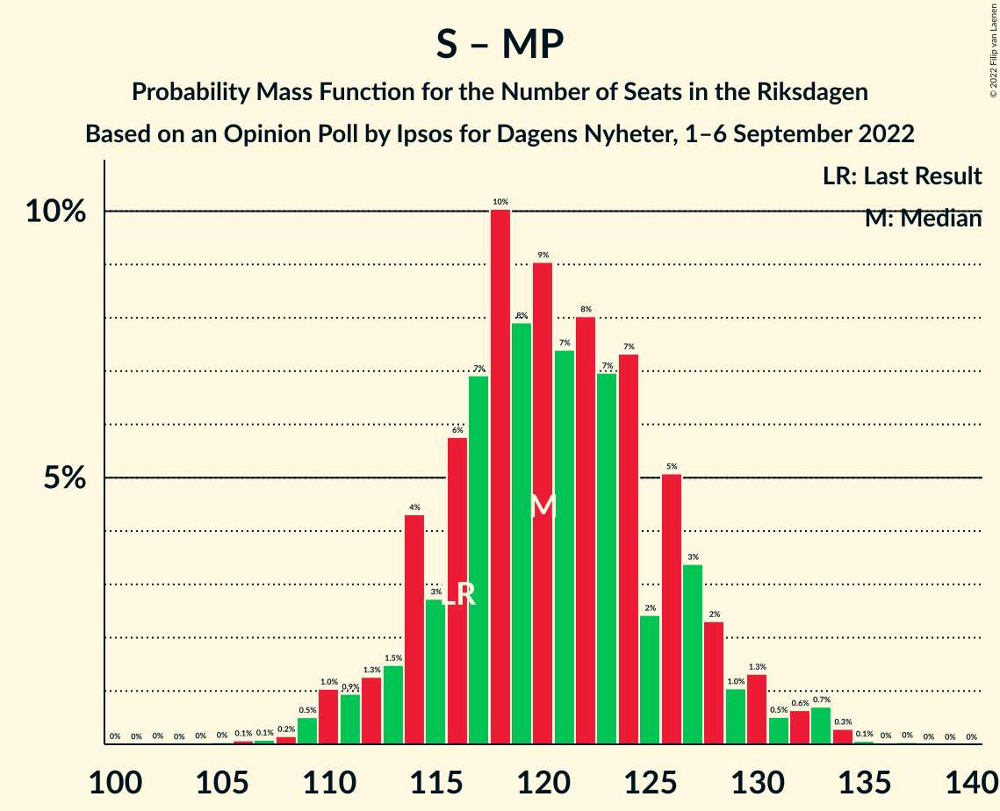

| Number of Seats | Probability | Accumulated | Special Marks |
|:---------------:|:-----------:|:-----------:|:-------------:|
| 102 | 0% | 100% |  |
| 103 | 0% | 99.9% |  |
| 104 | 0% | 99.9% |  |
| 105 | 0% | 99.9% |  |
| 106 | 0.1% | 99.9% |  |
| 107 | 0.1% | 99.8% |  |
| 108 | 0.2% | 99.7% |  |
| 109 | 0.5% | 99.5% |  |
| 110 | 1.0% | 99.0% |  |
| 111 | 0.9% | 98% |  |
| 112 | 1.3% | 97% |  |
| 113 | 1.5% | 96% |  |
| 114 | 4% | 94% |  |
| 115 | 3% | 90% |  |
| 116 | 6% | 87% | Last Result |
| 117 | 7% | 82% |  |
| 118 | 10% | 75% |  |
| 119 | 8% | 65% |  |
| 120 | 9% | 57% | Median |
| 121 | 7% | 48% |  |
| 122 | 8% | 40% |  |
| 123 | 7% | 32% |  |
| 124 | 7% | 25% |  |
| 125 | 2% | 18% |  |
| 126 | 5% | 15% |  |
| 127 | 3% | 10% |  |
| 128 | 2% | 7% |  |
| 129 | 1.0% | 5% |  |
| 130 | 1.3% | 4% |  |
| 131 | 0.5% | 2% |  |
| 132 | 0.6% | 2% |  |
| 133 | 0.7% | 1.1% |  |
| 134 | 0.3% | 0.4% |  |
| 135 | 0.1% | 0.2% |  |
| 136 | 0% | 0.1% |  |
| 137 | 0% | 0.1% |  |
| 138 | 0% | 0% |  |

### Moderata samlingspartiet – Centerpartiet – Kristdemokraterna

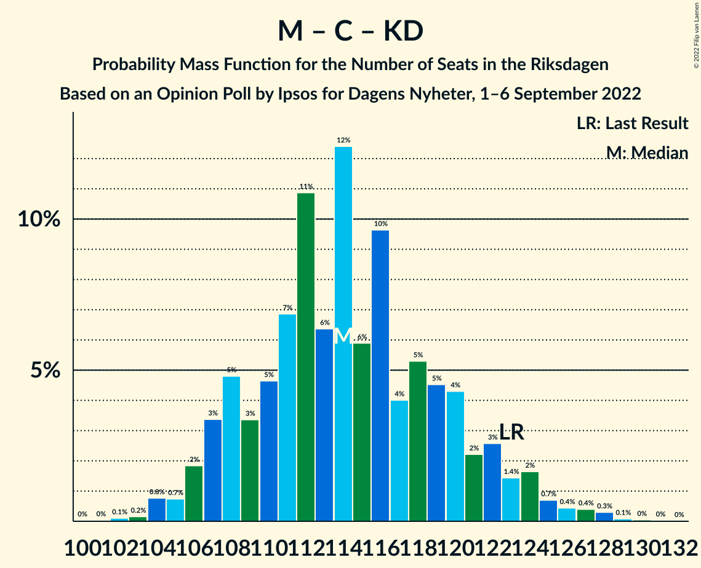

| Number of Seats | Probability | Accumulated | Special Marks |
|:---------------:|:-----------:|:-----------:|:-------------:|
| 100 | 0% | 100% |  |
| 101 | 0% | 99.9% |  |
| 102 | 0.1% | 99.9% |  |
| 103 | 0.2% | 99.8% |  |
| 104 | 0.8% | 99.6% |  |
| 105 | 0.7% | 98.9% |  |
| 106 | 2% | 98% |  |
| 107 | 3% | 96% |  |
| 108 | 5% | 93% |  |
| 109 | 3% | 88% |  |
| 110 | 5% | 85% |  |
| 111 | 7% | 80% |  |
| 112 | 11% | 73% |  |
| 113 | 6% | 62% | Median |
| 114 | 12% | 56% |  |
| 115 | 6% | 44% |  |
| 116 | 10% | 38% |  |
| 117 | 4% | 28% |  |
| 118 | 5% | 24% |  |
| 119 | 5% | 19% |  |
| 120 | 4% | 14% |  |
| 121 | 2% | 10% |  |
| 122 | 3% | 8% |  |
| 123 | 1.4% | 5% | Last Result |
| 124 | 2% | 4% |  |
| 125 | 0.7% | 2% |  |
| 126 | 0.4% | 1.3% |  |
| 127 | 0.4% | 0.9% |  |
| 128 | 0.3% | 0.5% |  |
| 129 | 0.1% | 0.2% |  |
| 130 | 0% | 0.1% |  |
| 131 | 0% | 0.1% |  |
| 132 | 0% | 0% |  |

### Moderata samlingspartiet – Centerpartiet – Liberalerna

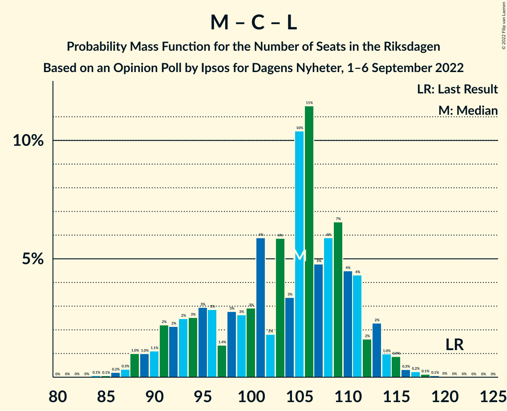

| Number of Seats | Probability | Accumulated | Special Marks |
|:---------------:|:-----------:|:-----------:|:-------------:|
| 84 | 0.1% | 100% |  |
| 85 | 0.1% | 99.9% |  |
| 86 | 0.2% | 99.9% |  |
| 87 | 0.3% | 99.6% |  |
| 88 | 1.0% | 99.3% |  |
| 89 | 1.0% | 98% |  |
| 90 | 1.1% | 97% |  |
| 91 | 2% | 96% |  |
| 92 | 2% | 94% |  |
| 93 | 2% | 92% |  |
| 94 | 3% | 89% |  |
| 95 | 3% | 87% |  |
| 96 | 3% | 84% |  |
| 97 | 1.4% | 81% |  |
| 98 | 3% | 80% |  |
| 99 | 3% | 77% |  |
| 100 | 3% | 74% |  |
| 101 | 6% | 71% |  |
| 102 | 2% | 65% |  |
| 103 | 6% | 64% |  |
| 104 | 3% | 58% |  |
| 105 | 10% | 54% |  |
| 106 | 11% | 44% | Median |
| 107 | 5% | 33% |  |
| 108 | 6% | 28% |  |
| 109 | 7% | 22% |  |
| 110 | 4% | 15% |  |
| 111 | 4% | 11% |  |
| 112 | 2% | 7% |  |
| 113 | 2% | 5% |  |
| 114 | 1.0% | 3% |  |
| 115 | 0.9% | 2% |  |
| 116 | 0.3% | 0.8% |  |
| 117 | 0.2% | 0.5% |  |
| 118 | 0.1% | 0.2% |  |
| 119 | 0.1% | 0.1% |  |
| 120 | 0% | 0% |  |
| 121 | 0% | 0% | Last Result |

### Sveriges socialdemokratiska arbetareparti

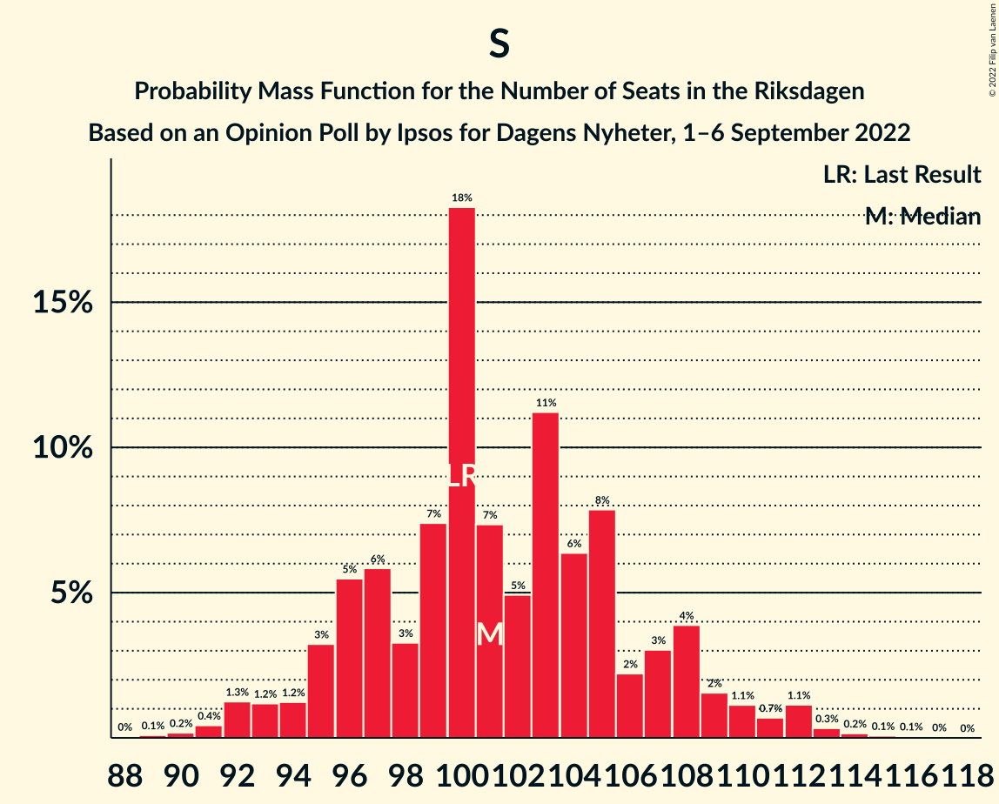

| Number of Seats | Probability | Accumulated | Special Marks |
|:---------------:|:-----------:|:-----------:|:-------------:|
| 88 | 0% | 100% |  |
| 89 | 0.1% | 99.9% |  |
| 90 | 0.2% | 99.8% |  |
| 91 | 0.4% | 99.6% |  |
| 92 | 1.3% | 99.2% |  |
| 93 | 1.2% | 98% |  |
| 94 | 1.2% | 97% |  |
| 95 | 3% | 96% |  |
| 96 | 5% | 92% |  |
| 97 | 6% | 87% |  |
| 98 | 3% | 81% |  |
| 99 | 7% | 78% |  |
| 100 | 18% | 70% | Last Result |
| 101 | 7% | 52% | Median |
| 102 | 5% | 45% |  |
| 103 | 11% | 40% |  |
| 104 | 6% | 29% |  |
| 105 | 8% | 22% |  |
| 106 | 2% | 14% |  |
| 107 | 3% | 12% |  |
| 108 | 4% | 9% |  |
| 109 | 2% | 5% |  |
| 110 | 1.1% | 4% |  |
| 111 | 0.7% | 3% |  |
| 112 | 1.1% | 2% |  |
| 113 | 0.3% | 0.7% |  |
| 114 | 0.2% | 0.3% |  |
| 115 | 0.1% | 0.2% |  |
| 116 | 0.1% | 0.1% |  |
| 117 | 0% | 0% |  |

### Moderata samlingspartiet – Kristdemokraterna – Liberalerna

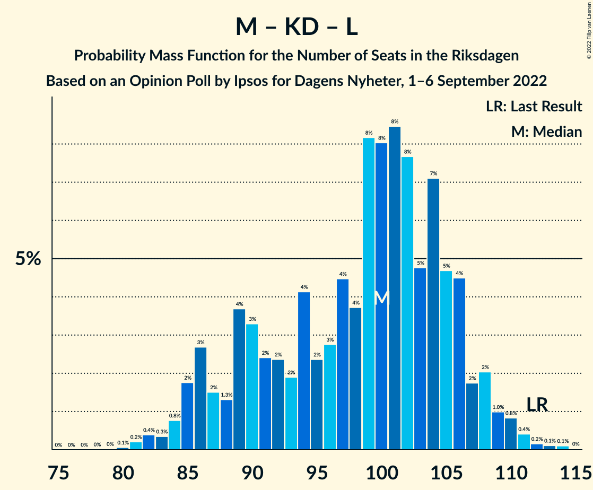

| Number of Seats | Probability | Accumulated | Special Marks |
|:---------------:|:-----------:|:-----------:|:-------------:|
| 80 | 0.1% | 100% |  |
| 81 | 0.2% | 99.9% |  |
| 82 | 0.4% | 99.7% |  |
| 83 | 0.3% | 99.3% |  |
| 84 | 0.8% | 99.0% |  |
| 85 | 2% | 98% |  |
| 86 | 3% | 96% |  |
| 87 | 2% | 94% |  |
| 88 | 1.3% | 92% |  |
| 89 | 4% | 91% |  |
| 90 | 3% | 87% |  |
| 91 | 2% | 84% |  |
| 92 | 2% | 82% |  |
| 93 | 2% | 79% |  |
| 94 | 4% | 77% |  |
| 95 | 2% | 73% |  |
| 96 | 3% | 71% |  |
| 97 | 4% | 68% |  |
| 98 | 4% | 64% |  |
| 99 | 8% | 60% |  |
| 100 | 8% | 52% |  |
| 101 | 8% | 44% | Median |
| 102 | 8% | 35% |  |
| 103 | 5% | 27% |  |
| 104 | 7% | 23% |  |
| 105 | 5% | 16% |  |
| 106 | 4% | 11% |  |
| 107 | 2% | 6% |  |
| 108 | 2% | 5% |  |
| 109 | 1.0% | 3% |  |
| 110 | 0.8% | 2% |  |
| 111 | 0.4% | 0.8% |  |
| 112 | 0.2% | 0.4% | Last Result |
| 113 | 0.1% | 0.3% |  |
| 114 | 0.1% | 0.1% |  |
| 115 | 0% | 0% |  |

### Moderata samlingspartiet – Centerpartiet

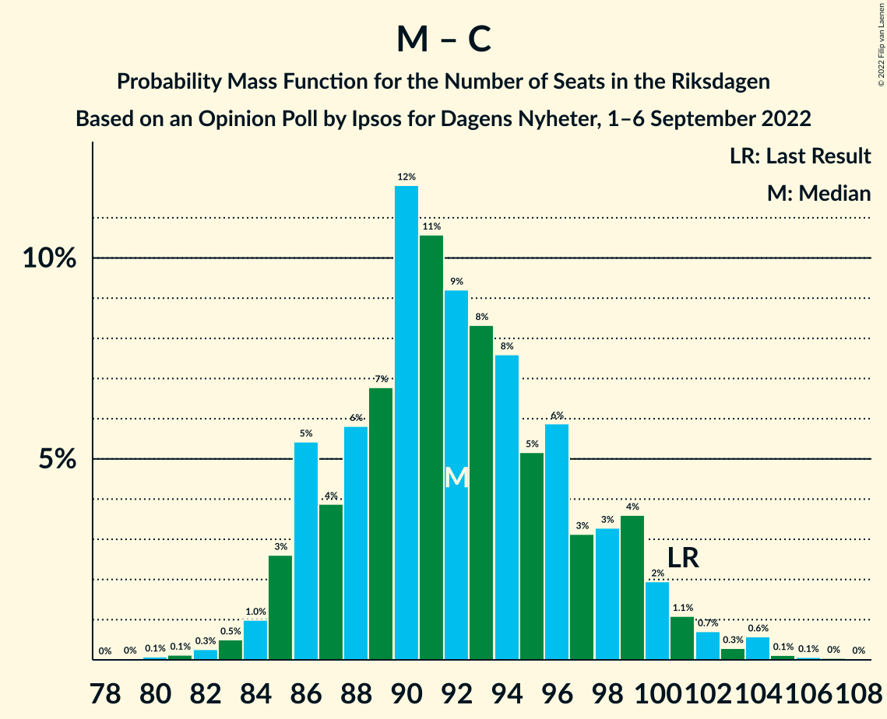

| Number of Seats | Probability | Accumulated | Special Marks |
|:---------------:|:-----------:|:-----------:|:-------------:|
| 80 | 0.1% | 100% |  |
| 81 | 0.1% | 99.9% |  |
| 82 | 0.3% | 99.8% |  |
| 83 | 0.5% | 99.5% |  |
| 84 | 1.0% | 99.0% |  |
| 85 | 3% | 98% |  |
| 86 | 5% | 95% |  |
| 87 | 4% | 90% |  |
| 88 | 6% | 86% |  |
| 89 | 7% | 80% |  |
| 90 | 12% | 73% |  |
| 91 | 11% | 62% | Median |
| 92 | 9% | 51% |  |
| 93 | 8% | 42% |  |
| 94 | 8% | 34% |  |
| 95 | 5% | 26% |  |
| 96 | 6% | 21% |  |
| 97 | 3% | 15% |  |
| 98 | 3% | 12% |  |
| 99 | 4% | 8% |  |
| 100 | 2% | 5% |  |
| 101 | 1.1% | 3% | Last Result |
| 102 | 0.7% | 2% |  |
| 103 | 0.3% | 1.1% |  |
| 104 | 0.6% | 0.9% |  |
| 105 | 0.1% | 0.3% |  |
| 106 | 0.1% | 0.2% |  |
| 107 | 0% | 0.1% |  |
| 108 | 0% | 0% |  |

### Moderata samlingspartiet – Kristdemokraterna

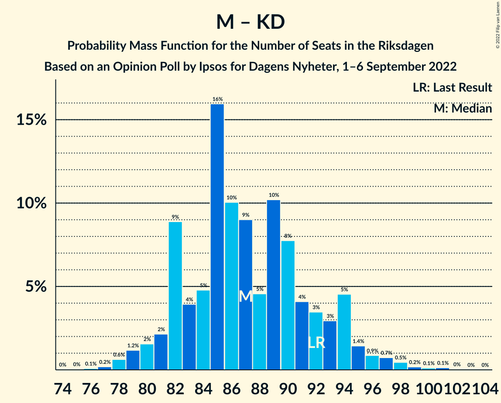

| Number of Seats | Probability | Accumulated | Special Marks |
|:---------------:|:-----------:|:-----------:|:-------------:|
| 75 | 0% | 100% |  |
| 76 | 0.1% | 99.9% |  |
| 77 | 0.2% | 99.8% |  |
| 78 | 0.6% | 99.6% |  |
| 79 | 1.2% | 99.0% |  |
| 80 | 2% | 98% |  |
| 81 | 2% | 96% |  |
| 82 | 9% | 94% |  |
| 83 | 4% | 85% |  |
| 84 | 5% | 81% |  |
| 85 | 16% | 77% |  |
| 86 | 10% | 61% | Median |
| 87 | 9% | 51% |  |
| 88 | 5% | 42% |  |
| 89 | 10% | 37% |  |
| 90 | 8% | 27% |  |
| 91 | 4% | 19% |  |
| 92 | 3% | 15% | Last Result |
| 93 | 3% | 11% |  |
| 94 | 5% | 9% |  |
| 95 | 1.4% | 4% |  |
| 96 | 0.9% | 3% |  |
| 97 | 0.7% | 2% |  |
| 98 | 0.5% | 0.9% |  |
| 99 | 0.2% | 0.5% |  |
| 100 | 0.1% | 0.3% |  |
| 101 | 0.1% | 0.2% |  |
| 102 | 0% | 0.1% |  |
| 103 | 0% | 0% |  |

## Technical Information

### Opinion Poll

+ **Polling firm:** Ipsos
+ **Commissioner(s):** Dagens Nyheter
+ **Fieldwork period:** 1–6 September 2022

### Calculations

+ **Sample size:** 1730
+ **Simulations done:** 1,048,576
+ **Error estimate:** 1.51%

