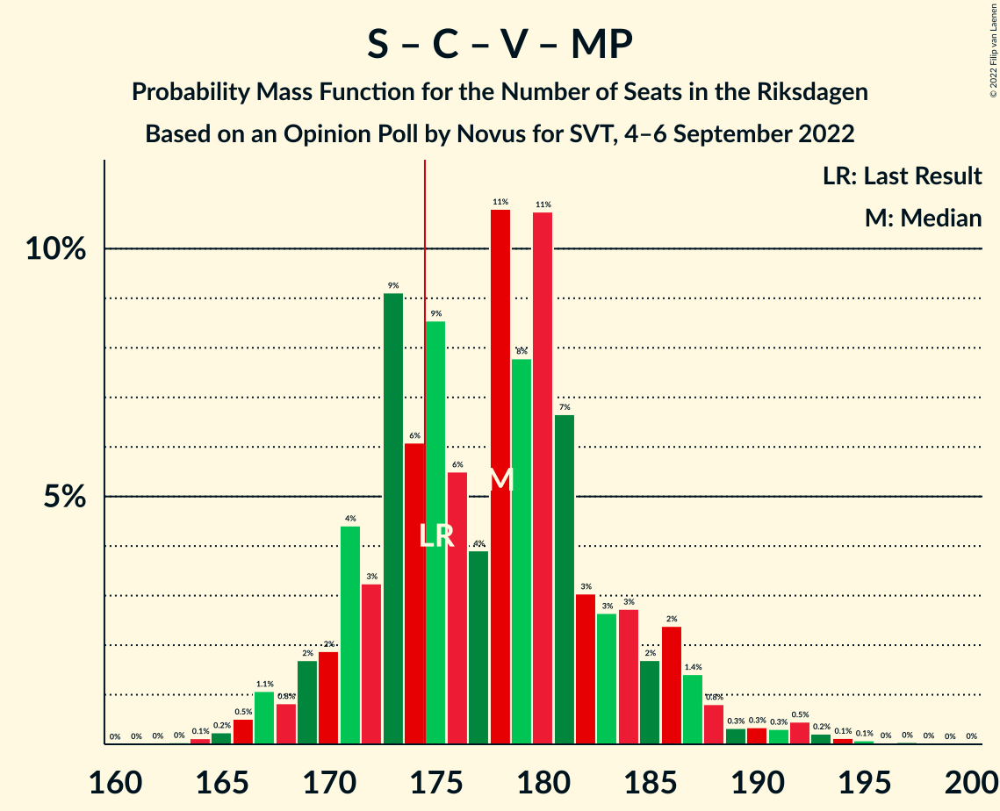
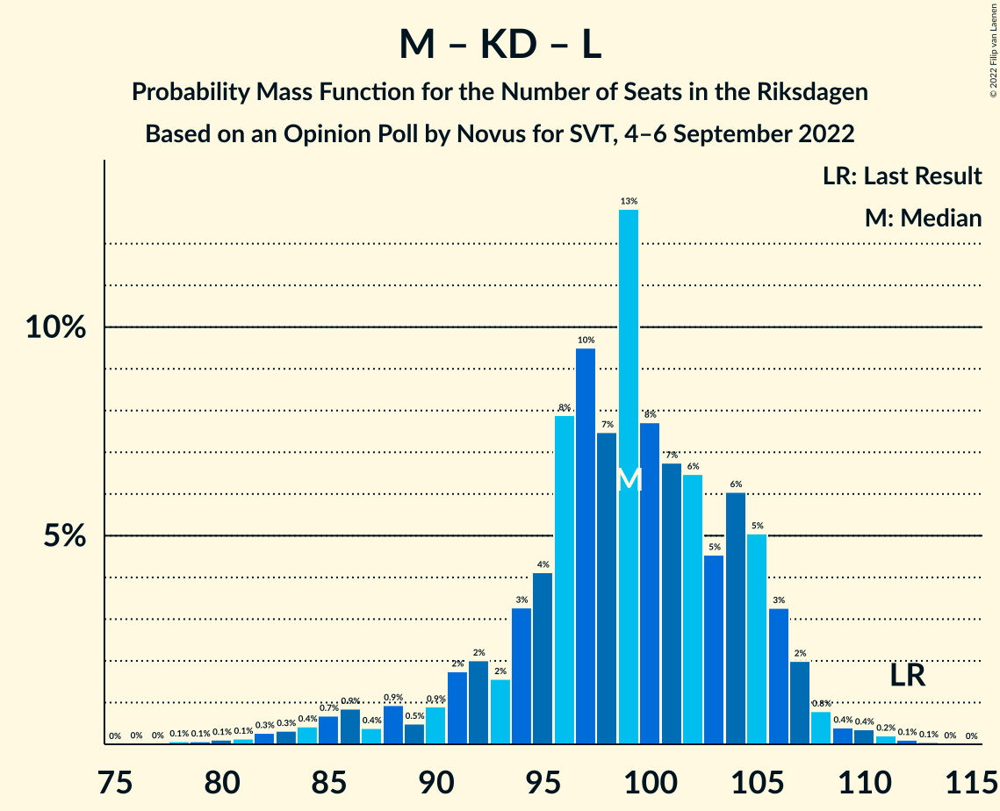

# Opinion Poll by Novus for SVT, 4–6 September 2022

<a href="#voting-intentions">Voting Intentions</a> | <a href="#seats">Seats</a> | <a href="#coalitions">Coalitions</a> | <a href="#technical-information">Technical Information</a>

## Voting Intentions

### Confidence Intervals

| Party | Last Result | Poll Result | 80% Confidence Interval | 90% Confidence Interval | 95% Confidence Interval | 99% Confidence Interval |
|:-----:|:-----------:|:-----------:|:-----------------------:|:-----------------------:|:-----------------------:|:-----------------------:|
| Sveriges socialdemokratiska arbetareparti | 28.3% | 27.8% | 26.4–29.3% |25.9–29.8% |25.6–30.1% |24.9–30.9% |
| Sverigedemokraterna | 17.5% | 20.6% | 19.3–22.0% |18.9–22.4% |18.6–22.7% |18.0–23.4% |
| Moderata samlingspartiet | 19.8% | 17.3% | 16.1–18.6% |15.8–19.0% |15.5–19.3% |14.9–20.0% |
| Centerpartiet | 8.6% | 8.6% | 7.7–9.6% |7.5–9.9% |7.3–10.1% |6.9–10.6% |
| Vänsterpartiet | 8.0% | 8.0% | 7.2–9.0% |6.9–9.3% |6.7–9.5% |6.3–10.0% |
| Kristdemokraterna | 6.3% | 5.9% | 5.2–6.8% |5.0–7.0% |4.8–7.3% |4.5–7.7% |
| Miljöpartiet de gröna | 4.4% | 5.7% | 5.0–6.6% |4.8–6.8% |4.7–7.0% |4.3–7.5% |
| Liberalerna | 5.5% | 4.8% | 4.2–5.6% |4.0–5.8% |3.8–6.0% |3.5–6.4% |

*Note:* The poll result column reflects the actual value used in the calculations. Published results may vary slightly, and in addition be rounded to fewer digits.

## Seats

### Confidence Intervals

| Party | Last Result | Median | 80% Confidence Interval | 90% Confidence Interval | 95% Confidence Interval | 99% Confidence Interval |
|:-----:|:-----------:|:------:|:-----------------------:|:-----------------------:|:-----------------------:|:-----------------------:|
| <a href="#sveriges-socialdemokratiska-arbetareparti">Sveriges socialdemokratiska arbetareparti</a> | 100 | 98 | 93–104 |91–105 |90–107 |88–111 |
| <a href="#sverigedemokraterna">Sverigedemokraterna</a> | 62 | 73 | 68–78 |67–79 |65–80 |64–83 |
| <a href="#moderata-samlingspartiet">Moderata samlingspartiet</a> | 70 | 61 | 57–66 |56–67 |54–68 |53–71 |
| <a href="#centerpartiet">Centerpartiet</a> | 31 | 31 | 28–34 |26–35 |26–36 |24–38 |
| <a href="#vänsterpartiet">Vänsterpartiet</a> | 28 | 28 | 25–32 |25–33 |24–33 |22–35 |
| <a href="#kristdemokraterna">Kristdemokraterna</a> | 22 | 21 | 18–24 |18–25 |17–26 |16–27 |
| <a href="#miljöpartiet-de-gröna">Miljöpartiet de gröna</a> | 16 | 20 | 18–23 |17–24 |16–25 |15–26 |
| <a href="#liberalerna">Liberalerna</a> | 20 | 17 | 15–20 |0–20 |0–21 |0–23 |

### Sveriges socialdemokratiska arbetareparti

*For a full overview of the results for this party, see the [Sveriges socialdemokratiska arbetareparti](party-sverigessocialdemokratiskaarbetareparti.html) page.*

| Number of Seats | Probability | Accumulated | Special Marks |
|:---------------:|:-----------:|:-----------:|:-------------:|
| 85 | 0.1% | 100% |  |
| 86 | 0.1% | 99.9% |  |
| 87 | 0.2% | 99.8% |  |
| 88 | 0.6% | 99.6% |  |
| 89 | 0.7% | 99.0% |  |
| 90 | 2% | 98% |  |
| 91 | 2% | 97% |  |
| 92 | 4% | 94% |  |
| 93 | 5% | 91% |  |
| 94 | 7% | 86% |  |
| 95 | 4% | 79% |  |
| 96 | 10% | 76% |  |
| 97 | 8% | 66% |  |
| 98 | 14% | 58% | Median |
| 99 | 8% | 44% |  |
| 100 | 10% | 36% | Last Result |
| 101 | 6% | 26% |  |
| 102 | 6% | 20% |  |
| 103 | 3% | 14% |  |
| 104 | 5% | 11% |  |
| 105 | 2% | 7% |  |
| 106 | 2% | 4% |  |
| 107 | 0.9% | 3% |  |
| 108 | 0.5% | 2% |  |
| 109 | 0.6% | 1.3% |  |
| 110 | 0.2% | 0.7% |  |
| 111 | 0.1% | 0.5% |  |
| 112 | 0.2% | 0.4% |  |
| 113 | 0.1% | 0.2% |  |
| 114 | 0.1% | 0.1% |  |
| 115 | 0% | 0% |  |

### Sverigedemokraterna

*For a full overview of the results for this party, see the [Sverigedemokraterna](party-sverigedemokraterna.html) page.*

| Number of Seats | Probability | Accumulated | Special Marks |
|:---------------:|:-----------:|:-----------:|:-------------:|
| 61 | 0.1% | 100% |  |
| 62 | 0.1% | 99.9% | Last Result |
| 63 | 0.2% | 99.8% |  |
| 64 | 0.8% | 99.6% |  |
| 65 | 1.4% | 98.9% |  |
| 66 | 2% | 97% |  |
| 67 | 2% | 96% |  |
| 68 | 6% | 94% |  |
| 69 | 12% | 88% |  |
| 70 | 7% | 75% |  |
| 71 | 5% | 68% |  |
| 72 | 9% | 63% |  |
| 73 | 14% | 54% | Median |
| 74 | 12% | 40% |  |
| 75 | 7% | 28% |  |
| 76 | 3% | 21% |  |
| 77 | 6% | 18% |  |
| 78 | 5% | 12% |  |
| 79 | 3% | 7% |  |
| 80 | 1.3% | 4% |  |
| 81 | 0.8% | 2% |  |
| 82 | 0.9% | 2% |  |
| 83 | 0.3% | 0.7% |  |
| 84 | 0.1% | 0.4% |  |
| 85 | 0.1% | 0.3% |  |
| 86 | 0.1% | 0.1% |  |
| 87 | 0% | 0% |  |

### Moderata samlingspartiet

*For a full overview of the results for this party, see the [Moderata samlingspartiet](party-moderatasamlingspartiet.html) page.*

| Number of Seats | Probability | Accumulated | Special Marks |
|:---------------:|:-----------:|:-----------:|:-------------:|
| 50 | 0% | 100% |  |
| 51 | 0.1% | 99.9% |  |
| 52 | 0.2% | 99.8% |  |
| 53 | 0.7% | 99.6% |  |
| 54 | 2% | 98.9% |  |
| 55 | 2% | 97% |  |
| 56 | 2% | 95% |  |
| 57 | 7% | 93% |  |
| 58 | 8% | 86% |  |
| 59 | 8% | 78% |  |
| 60 | 15% | 70% |  |
| 61 | 10% | 55% | Median |
| 62 | 9% | 44% |  |
| 63 | 5% | 36% |  |
| 64 | 11% | 30% |  |
| 65 | 7% | 19% |  |
| 66 | 5% | 13% |  |
| 67 | 3% | 7% |  |
| 68 | 2% | 5% |  |
| 69 | 1.1% | 2% |  |
| 70 | 0.5% | 1.1% | Last Result |
| 71 | 0.4% | 0.6% |  |
| 72 | 0.2% | 0.3% |  |
| 73 | 0.1% | 0.1% |  |
| 74 | 0% | 0% |  |

### Centerpartiet

*For a full overview of the results for this party, see the [Centerpartiet](party-centerpartiet.html) page.*

| Number of Seats | Probability | Accumulated | Special Marks |
|:---------------:|:-----------:|:-----------:|:-------------:|
| 23 | 0.2% | 100% |  |
| 24 | 0.3% | 99.8% |  |
| 25 | 2% | 99.5% |  |
| 26 | 4% | 98% |  |
| 27 | 4% | 94% |  |
| 28 | 15% | 90% |  |
| 29 | 10% | 75% |  |
| 30 | 14% | 65% |  |
| 31 | 20% | 52% | Last Result, Median |
| 32 | 9% | 32% |  |
| 33 | 10% | 23% |  |
| 34 | 8% | 13% |  |
| 35 | 2% | 6% |  |
| 36 | 2% | 3% |  |
| 37 | 0.8% | 1.4% |  |
| 38 | 0.3% | 0.5% |  |
| 39 | 0.2% | 0.3% |  |
| 40 | 0% | 0% |  |

### Vänsterpartiet

*For a full overview of the results for this party, see the [Vänsterpartiet](party-vänsterpartiet.html) page.*

| Number of Seats | Probability | Accumulated | Special Marks |
|:---------------:|:-----------:|:-----------:|:-------------:|
| 21 | 0.1% | 100% |  |
| 22 | 0.5% | 99.8% |  |
| 23 | 1.4% | 99.3% |  |
| 24 | 3% | 98% |  |
| 25 | 5% | 95% |  |
| 26 | 10% | 90% |  |
| 27 | 18% | 79% |  |
| 28 | 16% | 61% | Last Result, Median |
| 29 | 15% | 45% |  |
| 30 | 9% | 30% |  |
| 31 | 9% | 21% |  |
| 32 | 6% | 11% |  |
| 33 | 4% | 6% |  |
| 34 | 1.3% | 2% |  |
| 35 | 0.8% | 1.1% |  |
| 36 | 0.2% | 0.3% |  |
| 37 | 0.1% | 0.1% |  |
| 38 | 0% | 0.1% |  |
| 39 | 0% | 0% |  |

### Kristdemokraterna

*For a full overview of the results for this party, see the [Kristdemokraterna](party-kristdemokraterna.html) page.*

| Number of Seats | Probability | Accumulated | Special Marks |
|:---------------:|:-----------:|:-----------:|:-------------:|
| 15 | 0.1% | 100% |  |
| 16 | 0.9% | 99.8% |  |
| 17 | 3% | 98.9% |  |
| 18 | 8% | 96% |  |
| 19 | 13% | 88% |  |
| 20 | 14% | 75% |  |
| 21 | 13% | 60% | Median |
| 22 | 18% | 47% | Last Result |
| 23 | 15% | 29% |  |
| 24 | 9% | 15% |  |
| 25 | 3% | 6% |  |
| 26 | 1.3% | 3% |  |
| 27 | 0.9% | 1.2% |  |
| 28 | 0.3% | 0.4% |  |
| 29 | 0.1% | 0.1% |  |
| 30 | 0% | 0% |  |

### Miljöpartiet de gröna

*For a full overview of the results for this party, see the [Miljöpartiet de gröna](party-miljöpartietdegröna.html) page.*

| Number of Seats | Probability | Accumulated | Special Marks |
|:---------------:|:-----------:|:-----------:|:-------------:|
| 0 | 0.1% | 100% |  |
| 1 | 0% | 99.9% |  |
| 2 | 0% | 99.9% |  |
| 3 | 0% | 99.9% |  |
| 4 | 0% | 99.9% |  |
| 5 | 0% | 99.9% |  |
| 6 | 0% | 99.9% |  |
| 7 | 0% | 99.9% |  |
| 8 | 0% | 99.9% |  |
| 9 | 0% | 99.9% |  |
| 10 | 0% | 99.9% |  |
| 11 | 0% | 99.9% |  |
| 12 | 0% | 99.9% |  |
| 13 | 0% | 99.9% |  |
| 14 | 0% | 99.9% |  |
| 15 | 0.5% | 99.9% |  |
| 16 | 2% | 99.4% | Last Result |
| 17 | 5% | 97% |  |
| 18 | 9% | 92% |  |
| 19 | 17% | 83% |  |
| 20 | 21% | 66% | Median |
| 21 | 14% | 45% |  |
| 22 | 13% | 31% |  |
| 23 | 11% | 18% |  |
| 24 | 4% | 8% |  |
| 25 | 2% | 4% |  |
| 26 | 0.9% | 1.3% |  |
| 27 | 0.3% | 0.5% |  |
| 28 | 0.1% | 0.1% |  |
| 29 | 0% | 0% |  |

### Liberalerna

*For a full overview of the results for this party, see the [Liberalerna](party-liberalerna.html) page.*

| Number of Seats | Probability | Accumulated | Special Marks |
|:---------------:|:-----------:|:-----------:|:-------------:|
| 0 | 5% | 100% |  |
| 1 | 0% | 95% |  |
| 2 | 0% | 95% |  |
| 3 | 0% | 95% |  |
| 4 | 0% | 95% |  |
| 5 | 0% | 95% |  |
| 6 | 0% | 95% |  |
| 7 | 0% | 95% |  |
| 8 | 0% | 95% |  |
| 9 | 0% | 95% |  |
| 10 | 0% | 95% |  |
| 11 | 0% | 95% |  |
| 12 | 0% | 95% |  |
| 13 | 0% | 95% |  |
| 14 | 3% | 95% |  |
| 15 | 14% | 91% |  |
| 16 | 13% | 77% |  |
| 17 | 23% | 63% | Median |
| 18 | 19% | 40% |  |
| 19 | 10% | 21% |  |
| 20 | 7% | 12% | Last Result |
| 21 | 3% | 5% |  |
| 22 | 0.9% | 1.5% |  |
| 23 | 0.5% | 0.6% |  |
| 24 | 0.1% | 0.1% |  |
| 25 | 0% | 0% |  |

## Coalitions

### Confidence Intervals

| Coalition | Last Result | Median | Majority? | 80% Confidence Interval | 90% Confidence Interval | 95% Confidence Interval | 99% Confidence Interval |
|:---------:|:-----------:|:------:|:---------:|:-----------------------:|:-----------------------:|:-----------------------:|:-----------------------:|
| Sveriges socialdemokratiska arbetareparti – Centerpartiet – Vänsterpartiet – Miljöpartiet de gröna – Liberalerna | 195 | 194 | 100% | 188–200 | 186–202 | 184–203 | 180–206 |
| Sveriges socialdemokratiska arbetareparti – Moderata samlingspartiet – Centerpartiet | 201 | 190 | 100% | 184–196 | 183–199 | 181–200 | 177–206 |
| Sveriges socialdemokratiska arbetareparti – Centerpartiet – Vänsterpartiet – Miljöpartiet de gröna | 175 | 178 | 71% | 171–184 | 170–186 | 168–188 | 166–193 |
| Sverigedemokraterna – Moderata samlingspartiet – Kristdemokraterna – Liberalerna | 174 | 171 | 29% | 165–178 | 163–179 | 161–181 | 156–183 |
| Sveriges socialdemokratiska arbetareparti – Centerpartiet – Miljöpartiet de gröna – Liberalerna | 167 | 165 | 3% | 159–172 | 157–173 | 155–175 | 150–177 |
| Sveriges socialdemokratiska arbetareparti – Moderata samlingspartiet | 170 | 159 | 0.4% | 154–166 | 152–167 | 150–169 | 147–174 |
| Sverigedemokraterna – Moderata samlingspartiet – Kristdemokraterna | 154 | 155 | 0% | 149–161 | 147–163 | 146–165 | 143–169 |
| Sveriges socialdemokratiska arbetareparti – Centerpartiet – Miljöpartiet de gröna | 147 | 149 | 0% | 143–155 | 141–157 | 140–159 | 137–163 |
| Sveriges socialdemokratiska arbetareparti – Vänsterpartiet – Miljöpartiet de gröna | 144 | 147 | 0% | 141–153 | 139–155 | 138–157 | 135–162 |
| Sverigedemokraterna – Moderata samlingspartiet | 132 | 134 | 0% | 127–140 | 127–142 | 125–144 | 123–148 |
| Moderata samlingspartiet – Centerpartiet – Kristdemokraterna – Liberalerna | 143 | 130 | 0% | 124–136 | 120–137 | 117–138 | 113–142 |
| Sveriges socialdemokratiska arbetareparti – Vänsterpartiet | 128 | 126 | 0% | 121–132 | 119–134 | 118–136 | 116–141 |
| Sveriges socialdemokratiska arbetareparti – Miljöpartiet de gröna | 116 | 118 | 0% | 113–124 | 111–126 | 110–128 | 107–131 |
| Moderata samlingspartiet – Centerpartiet – Kristdemokraterna | 123 | 113 | 0% | 107–119 | 106–121 | 104–122 | 102–126 |
| Moderata samlingspartiet – Centerpartiet – Liberalerna | 121 | 108 | 0% | 103–114 | 99–116 | 96–117 | 90–120 |
| Sveriges socialdemokratiska arbetareparti | 100 | 98 | 0% | 93–104 | 91–105 | 90–107 | 88–111 |
| Moderata samlingspartiet – Kristdemokraterna – Liberalerna | 112 | 99 | 0% | 93–105 | 90–106 | 86–107 | 82–110 |
| Moderata samlingspartiet – Centerpartiet | 101 | 92 | 0% | 87–97 | 85–99 | 84–100 | 81–103 |
| Moderata samlingspartiet – Kristdemokraterna | 92 | 82 | 0% | 78–88 | 76–89 | 75–90 | 73–93 |

### Sveriges socialdemokratiska arbetareparti – Centerpartiet – Vänsterpartiet – Miljöpartiet de gröna – Liberalerna

| Number of Seats | Probability | Accumulated | Special Marks |
|:---------------:|:-----------:|:-----------:|:-------------:|
| 175 | 0% | 100% | Majority |
| 176 | 0% | 99.9% |  |
| 177 | 0.1% | 99.9% |  |
| 178 | 0.1% | 99.8% |  |
| 179 | 0.2% | 99.7% |  |
| 180 | 0.2% | 99.5% |  |
| 181 | 0.2% | 99.4% |  |
| 182 | 0.5% | 99.2% |  |
| 183 | 1.0% | 98.7% |  |
| 184 | 0.9% | 98% |  |
| 185 | 1.2% | 97% |  |
| 186 | 3% | 96% |  |
| 187 | 2% | 93% |  |
| 188 | 5% | 91% |  |
| 189 | 4% | 87% |  |
| 190 | 7% | 82% |  |
| 191 | 6% | 75% |  |
| 192 | 8% | 69% |  |
| 193 | 6% | 61% |  |
| 194 | 10% | 55% | Median |
| 195 | 10% | 45% | Last Result |
| 196 | 6% | 36% |  |
| 197 | 5% | 30% |  |
| 198 | 8% | 25% |  |
| 199 | 6% | 17% |  |
| 200 | 4% | 11% |  |
| 201 | 2% | 8% |  |
| 202 | 2% | 5% |  |
| 203 | 1.1% | 3% |  |
| 204 | 0.8% | 2% |  |
| 205 | 0.6% | 1.1% |  |
| 206 | 0.2% | 0.5% |  |
| 207 | 0.2% | 0.3% |  |
| 208 | 0.1% | 0.2% |  |
| 209 | 0% | 0.1% |  |
| 210 | 0% | 0% |  |

### Sveriges socialdemokratiska arbetareparti – Moderata samlingspartiet – Centerpartiet

| Number of Seats | Probability | Accumulated | Special Marks |
|:---------------:|:-----------:|:-----------:|:-------------:|
| 175 | 0.1% | 100% | Majority |
| 176 | 0.1% | 99.9% |  |
| 177 | 0.3% | 99.8% |  |
| 178 | 0.4% | 99.5% |  |
| 179 | 0.5% | 99.1% |  |
| 180 | 1.0% | 98.6% |  |
| 181 | 1.0% | 98% |  |
| 182 | 1.2% | 97% |  |
| 183 | 3% | 95% |  |
| 184 | 4% | 92% |  |
| 185 | 12% | 88% |  |
| 186 | 4% | 76% |  |
| 187 | 3% | 72% |  |
| 188 | 4% | 69% |  |
| 189 | 8% | 65% |  |
| 190 | 10% | 57% | Median |
| 191 | 11% | 47% |  |
| 192 | 10% | 36% |  |
| 193 | 7% | 26% |  |
| 194 | 5% | 19% |  |
| 195 | 3% | 14% |  |
| 196 | 2% | 11% |  |
| 197 | 1.0% | 9% |  |
| 198 | 2% | 8% |  |
| 199 | 3% | 6% |  |
| 200 | 1.1% | 3% |  |
| 201 | 0.6% | 2% | Last Result |
| 202 | 0.4% | 2% |  |
| 203 | 0.2% | 1.3% |  |
| 204 | 0.3% | 1.1% |  |
| 205 | 0.2% | 0.8% |  |
| 206 | 0.1% | 0.6% |  |
| 207 | 0.1% | 0.5% |  |
| 208 | 0.1% | 0.4% |  |
| 209 | 0.2% | 0.2% |  |
| 210 | 0% | 0.1% |  |
| 211 | 0% | 0% |  |

### Sveriges socialdemokratiska arbetareparti – Centerpartiet – Vänsterpartiet – Miljöpartiet de gröna

| Number of Seats | Probability | Accumulated | Special Marks |
|:---------------:|:-----------:|:-----------:|:-------------:|
| 162 | 0% | 100% |  |
| 163 | 0% | 99.9% |  |
| 164 | 0.1% | 99.9% |  |
| 165 | 0.2% | 99.8% |  |
| 166 | 0.5% | 99.5% |  |
| 167 | 1.1% | 99.0% |  |
| 168 | 0.8% | 98% |  |
| 169 | 2% | 97% |  |
| 170 | 2% | 95% |  |
| 171 | 4% | 94% |  |
| 172 | 3% | 89% |  |
| 173 | 9% | 86% |  |
| 174 | 6% | 77% |  |
| 175 | 9% | 71% | Last Result, Majority |
| 176 | 6% | 62% |  |
| 177 | 4% | 57% | Median |
| 178 | 11% | 53% |  |
| 179 | 8% | 42% |  |
| 180 | 11% | 34% |  |
| 181 | 7% | 23% |  |
| 182 | 3% | 17% |  |
| 183 | 3% | 14% |  |
| 184 | 3% | 11% |  |
| 185 | 2% | 8% |  |
| 186 | 2% | 7% |  |
| 187 | 1.4% | 4% |  |
| 188 | 0.8% | 3% |  |
| 189 | 0.3% | 2% |  |
| 190 | 0.3% | 2% |  |
| 191 | 0.3% | 1.3% |  |
| 192 | 0.5% | 1.0% |  |
| 193 | 0.2% | 0.6% |  |
| 194 | 0.1% | 0.4% |  |
| 195 | 0.1% | 0.2% |  |
| 196 | 0% | 0.1% |  |
| 197 | 0% | 0.1% |  |
| 198 | 0% | 0.1% |  |
| 199 | 0% | 0% |  |

### Sverigedemokraterna – Moderata samlingspartiet – Kristdemokraterna – Liberalerna

| Number of Seats | Probability | Accumulated | Special Marks |
|:---------------:|:-----------:|:-----------:|:-------------:|
| 151 | 0% | 100% |  |
| 152 | 0% | 99.9% |  |
| 153 | 0% | 99.9% |  |
| 154 | 0.1% | 99.9% |  |
| 155 | 0.1% | 99.8% |  |
| 156 | 0.2% | 99.6% |  |
| 157 | 0.5% | 99.4% |  |
| 158 | 0.3% | 99.0% |  |
| 159 | 0.3% | 98.7% |  |
| 160 | 0.3% | 98% |  |
| 161 | 0.8% | 98% |  |
| 162 | 1.4% | 97% |  |
| 163 | 2% | 96% |  |
| 164 | 2% | 93% |  |
| 165 | 3% | 92% |  |
| 166 | 3% | 89% |  |
| 167 | 3% | 86% |  |
| 168 | 7% | 83% |  |
| 169 | 11% | 77% |  |
| 170 | 8% | 66% |  |
| 171 | 11% | 58% |  |
| 172 | 4% | 47% | Median |
| 173 | 6% | 43% |  |
| 174 | 9% | 38% | Last Result |
| 175 | 6% | 29% | Majority |
| 176 | 9% | 23% |  |
| 177 | 3% | 14% |  |
| 178 | 4% | 11% |  |
| 179 | 2% | 6% |  |
| 180 | 2% | 5% |  |
| 181 | 0.8% | 3% |  |
| 182 | 1.1% | 2% |  |
| 183 | 0.5% | 1.0% |  |
| 184 | 0.2% | 0.5% |  |
| 185 | 0.1% | 0.2% |  |
| 186 | 0% | 0.1% |  |
| 187 | 0% | 0.1% |  |
| 188 | 0% | 0% |  |

### Sveriges socialdemokratiska arbetareparti – Centerpartiet – Miljöpartiet de gröna – Liberalerna

| Number of Seats | Probability | Accumulated | Special Marks |
|:---------------:|:-----------:|:-----------:|:-------------:|
| 146 | 0% | 100% |  |
| 147 | 0.1% | 99.9% |  |
| 148 | 0.1% | 99.8% |  |
| 149 | 0% | 99.7% |  |
| 150 | 0.3% | 99.7% |  |
| 151 | 0.4% | 99.4% |  |
| 152 | 0.2% | 99.0% |  |
| 153 | 0.5% | 98.8% |  |
| 154 | 0.7% | 98% |  |
| 155 | 0.9% | 98% |  |
| 156 | 1.4% | 97% |  |
| 157 | 1.4% | 95% |  |
| 158 | 3% | 94% |  |
| 159 | 2% | 91% |  |
| 160 | 3% | 89% |  |
| 161 | 5% | 86% |  |
| 162 | 5% | 80% |  |
| 163 | 8% | 75% |  |
| 164 | 8% | 67% |  |
| 165 | 12% | 60% |  |
| 166 | 5% | 48% | Median |
| 167 | 6% | 43% | Last Result |
| 168 | 7% | 36% |  |
| 169 | 9% | 29% |  |
| 170 | 6% | 20% |  |
| 171 | 3% | 14% |  |
| 172 | 4% | 11% |  |
| 173 | 2% | 7% |  |
| 174 | 2% | 5% |  |
| 175 | 1.2% | 3% | Majority |
| 176 | 0.6% | 1.5% |  |
| 177 | 0.4% | 0.9% |  |
| 178 | 0.2% | 0.5% |  |
| 179 | 0.1% | 0.3% |  |
| 180 | 0.1% | 0.1% |  |
| 181 | 0% | 0.1% |  |
| 182 | 0% | 0% |  |

### Sveriges socialdemokratiska arbetareparti – Moderata samlingspartiet

| Number of Seats | Probability | Accumulated | Special Marks |
|:---------------:|:-----------:|:-----------:|:-------------:|
| 144 | 0.1% | 100% |  |
| 145 | 0.1% | 99.9% |  |
| 146 | 0.1% | 99.8% |  |
| 147 | 0.2% | 99.7% |  |
| 148 | 0.6% | 99.5% |  |
| 149 | 0.6% | 98.9% |  |
| 150 | 1.0% | 98% |  |
| 151 | 2% | 97% |  |
| 152 | 2% | 96% |  |
| 153 | 3% | 94% |  |
| 154 | 6% | 90% |  |
| 155 | 3% | 84% |  |
| 156 | 10% | 81% |  |
| 157 | 9% | 72% |  |
| 158 | 8% | 63% |  |
| 159 | 6% | 54% | Median |
| 160 | 7% | 48% |  |
| 161 | 10% | 41% |  |
| 162 | 5% | 30% |  |
| 163 | 5% | 26% |  |
| 164 | 3% | 21% |  |
| 165 | 8% | 18% |  |
| 166 | 3% | 10% |  |
| 167 | 2% | 7% |  |
| 168 | 1.3% | 5% |  |
| 169 | 1.4% | 4% |  |
| 170 | 0.5% | 2% | Last Result |
| 171 | 0.5% | 2% |  |
| 172 | 0.5% | 1.3% |  |
| 173 | 0.2% | 0.7% |  |
| 174 | 0.2% | 0.6% |  |
| 175 | 0.1% | 0.4% | Majority |
| 176 | 0.1% | 0.4% |  |
| 177 | 0.2% | 0.3% |  |
| 178 | 0% | 0.1% |  |
| 179 | 0% | 0% |  |

### Sverigedemokraterna – Moderata samlingspartiet – Kristdemokraterna

| Number of Seats | Probability | Accumulated | Special Marks |
|:---------------:|:-----------:|:-----------:|:-------------:|
| 140 | 0% | 100% |  |
| 141 | 0.1% | 99.9% |  |
| 142 | 0.2% | 99.8% |  |
| 143 | 0.2% | 99.7% |  |
| 144 | 0.6% | 99.5% |  |
| 145 | 0.8% | 98.9% |  |
| 146 | 1.1% | 98% |  |
| 147 | 2% | 97% |  |
| 148 | 2% | 95% |  |
| 149 | 4% | 92% |  |
| 150 | 6% | 89% |  |
| 151 | 8% | 83% |  |
| 152 | 5% | 75% |  |
| 153 | 6% | 70% |  |
| 154 | 10% | 64% | Last Result |
| 155 | 10% | 55% | Median |
| 156 | 6% | 45% |  |
| 157 | 8% | 39% |  |
| 158 | 6% | 31% |  |
| 159 | 7% | 25% |  |
| 160 | 4% | 18% |  |
| 161 | 5% | 13% |  |
| 162 | 2% | 9% |  |
| 163 | 3% | 7% |  |
| 164 | 1.2% | 4% |  |
| 165 | 0.9% | 3% |  |
| 166 | 1.0% | 2% |  |
| 167 | 0.5% | 1.3% |  |
| 168 | 0.2% | 0.8% |  |
| 169 | 0.2% | 0.6% |  |
| 170 | 0.2% | 0.5% |  |
| 171 | 0.1% | 0.3% |  |
| 172 | 0.1% | 0.2% |  |
| 173 | 0% | 0.1% |  |
| 174 | 0% | 0.1% |  |
| 175 | 0% | 0% | Majority |

### Sveriges socialdemokratiska arbetareparti – Centerpartiet – Miljöpartiet de gröna

| Number of Seats | Probability | Accumulated | Special Marks |
|:---------------:|:-----------:|:-----------:|:-------------:|
| 133 | 0% | 100% |  |
| 134 | 0% | 99.9% |  |
| 135 | 0.1% | 99.9% |  |
| 136 | 0.2% | 99.8% |  |
| 137 | 0.2% | 99.7% |  |
| 138 | 0.3% | 99.5% |  |
| 139 | 1.0% | 99.2% |  |
| 140 | 2% | 98% |  |
| 141 | 3% | 96% |  |
| 142 | 2% | 94% |  |
| 143 | 2% | 92% |  |
| 144 | 5% | 90% |  |
| 145 | 7% | 85% |  |
| 146 | 9% | 78% |  |
| 147 | 11% | 69% | Last Result |
| 148 | 4% | 58% |  |
| 149 | 6% | 54% | Median |
| 150 | 6% | 48% |  |
| 151 | 12% | 41% |  |
| 152 | 8% | 30% |  |
| 153 | 7% | 22% |  |
| 154 | 3% | 15% |  |
| 155 | 2% | 12% |  |
| 156 | 3% | 9% |  |
| 157 | 2% | 7% |  |
| 158 | 2% | 5% |  |
| 159 | 0.8% | 3% |  |
| 160 | 0.6% | 2% |  |
| 161 | 0.3% | 1.3% |  |
| 162 | 0.3% | 1.0% |  |
| 163 | 0.5% | 0.8% |  |
| 164 | 0.1% | 0.3% |  |
| 165 | 0.1% | 0.2% |  |
| 166 | 0% | 0.1% |  |
| 167 | 0% | 0.1% |  |
| 168 | 0% | 0.1% |  |
| 169 | 0% | 0% |  |

### Sveriges socialdemokratiska arbetareparti – Vänsterpartiet – Miljöpartiet de gröna

| Number of Seats | Probability | Accumulated | Special Marks |
|:---------------:|:-----------:|:-----------:|:-------------:|
| 132 | 0% | 100% |  |
| 133 | 0.1% | 99.9% |  |
| 134 | 0.1% | 99.8% |  |
| 135 | 0.4% | 99.7% |  |
| 136 | 0.5% | 99.3% |  |
| 137 | 0.5% | 98.9% |  |
| 138 | 2% | 98% |  |
| 139 | 2% | 97% |  |
| 140 | 4% | 95% |  |
| 141 | 3% | 91% |  |
| 142 | 5% | 88% |  |
| 143 | 7% | 83% |  |
| 144 | 7% | 76% | Last Result |
| 145 | 12% | 69% |  |
| 146 | 4% | 57% | Median |
| 147 | 7% | 54% |  |
| 148 | 10% | 47% |  |
| 149 | 7% | 37% |  |
| 150 | 10% | 30% |  |
| 151 | 3% | 20% |  |
| 152 | 6% | 17% |  |
| 153 | 3% | 11% |  |
| 154 | 2% | 8% |  |
| 155 | 2% | 6% |  |
| 156 | 1.1% | 4% |  |
| 157 | 0.8% | 3% |  |
| 158 | 0.5% | 2% |  |
| 159 | 0.3% | 2% |  |
| 160 | 0.5% | 1.3% |  |
| 161 | 0.2% | 0.8% |  |
| 162 | 0.2% | 0.6% |  |
| 163 | 0.1% | 0.4% |  |
| 164 | 0.2% | 0.3% |  |
| 165 | 0% | 0.1% |  |
| 166 | 0% | 0% |  |

### Sverigedemokraterna – Moderata samlingspartiet

| Number of Seats | Probability | Accumulated | Special Marks |
|:---------------:|:-----------:|:-----------:|:-------------:|
| 119 | 0% | 100% |  |
| 120 | 0.1% | 99.9% |  |
| 121 | 0.1% | 99.9% |  |
| 122 | 0.2% | 99.8% |  |
| 123 | 0.4% | 99.6% |  |
| 124 | 0.9% | 99.2% |  |
| 125 | 1.3% | 98% |  |
| 126 | 2% | 97% |  |
| 127 | 6% | 95% |  |
| 128 | 3% | 89% |  |
| 129 | 3% | 86% |  |
| 130 | 5% | 83% |  |
| 131 | 4% | 77% |  |
| 132 | 13% | 73% | Last Result |
| 133 | 6% | 60% |  |
| 134 | 12% | 54% | Median |
| 135 | 7% | 42% |  |
| 136 | 5% | 36% |  |
| 137 | 7% | 30% |  |
| 138 | 5% | 23% |  |
| 139 | 7% | 18% |  |
| 140 | 2% | 11% |  |
| 141 | 4% | 10% |  |
| 142 | 1.3% | 6% |  |
| 143 | 2% | 5% |  |
| 144 | 1.1% | 3% |  |
| 145 | 0.4% | 2% |  |
| 146 | 0.4% | 1.2% |  |
| 147 | 0.3% | 0.8% |  |
| 148 | 0.2% | 0.5% |  |
| 149 | 0.1% | 0.3% |  |
| 150 | 0.1% | 0.2% |  |
| 151 | 0% | 0.1% |  |
| 152 | 0% | 0.1% |  |
| 153 | 0% | 0% |  |

### Moderata samlingspartiet – Centerpartiet – Kristdemokraterna – Liberalerna

| Number of Seats | Probability | Accumulated | Special Marks |
|:---------------:|:-----------:|:-----------:|:-------------:|
| 109 | 0.1% | 100% |  |
| 110 | 0.1% | 99.9% |  |
| 111 | 0.1% | 99.7% |  |
| 112 | 0.1% | 99.6% |  |
| 113 | 0.1% | 99.5% |  |
| 114 | 0.3% | 99.5% |  |
| 115 | 0.6% | 99.2% |  |
| 116 | 0.7% | 98.5% |  |
| 117 | 0.4% | 98% |  |
| 118 | 0.4% | 97% |  |
| 119 | 1.0% | 97% |  |
| 120 | 1.0% | 96% |  |
| 121 | 2% | 95% |  |
| 122 | 0.9% | 93% |  |
| 123 | 1.4% | 92% |  |
| 124 | 4% | 91% |  |
| 125 | 8% | 87% |  |
| 126 | 8% | 79% |  |
| 127 | 4% | 71% |  |
| 128 | 3% | 67% |  |
| 129 | 7% | 64% |  |
| 130 | 15% | 56% | Median |
| 131 | 10% | 41% |  |
| 132 | 10% | 32% |  |
| 133 | 3% | 22% |  |
| 134 | 1.4% | 19% |  |
| 135 | 6% | 17% |  |
| 136 | 3% | 11% |  |
| 137 | 5% | 8% |  |
| 138 | 1.5% | 3% |  |
| 139 | 0.4% | 2% |  |
| 140 | 0.2% | 1.2% |  |
| 141 | 0.3% | 1.0% |  |
| 142 | 0.4% | 0.6% |  |
| 143 | 0.1% | 0.2% | Last Result |
| 144 | 0.1% | 0.1% |  |
| 145 | 0% | 0% |  |

### Sveriges socialdemokratiska arbetareparti – Vänsterpartiet

| Number of Seats | Probability | Accumulated | Special Marks |
|:---------------:|:-----------:|:-----------:|:-------------:|
| 112 | 0% | 100% |  |
| 113 | 0% | 99.9% |  |
| 114 | 0.1% | 99.9% |  |
| 115 | 0.2% | 99.8% |  |
| 116 | 0.6% | 99.5% |  |
| 117 | 1.0% | 98.9% |  |
| 118 | 2% | 98% |  |
| 119 | 4% | 96% |  |
| 120 | 2% | 93% |  |
| 121 | 6% | 91% |  |
| 122 | 3% | 84% |  |
| 123 | 4% | 81% |  |
| 124 | 7% | 77% |  |
| 125 | 14% | 71% |  |
| 126 | 7% | 57% | Median |
| 127 | 8% | 50% |  |
| 128 | 9% | 42% | Last Result |
| 129 | 10% | 33% |  |
| 130 | 6% | 23% |  |
| 131 | 6% | 17% |  |
| 132 | 2% | 11% |  |
| 133 | 2% | 9% |  |
| 134 | 2% | 7% |  |
| 135 | 1.3% | 5% |  |
| 136 | 1.2% | 3% |  |
| 137 | 0.6% | 2% |  |
| 138 | 0.4% | 2% |  |
| 139 | 0.3% | 1.3% |  |
| 140 | 0.4% | 1.0% |  |
| 141 | 0.3% | 0.6% |  |
| 142 | 0.1% | 0.3% |  |
| 143 | 0.1% | 0.1% |  |
| 144 | 0.1% | 0.1% |  |
| 145 | 0% | 0% |  |

### Sveriges socialdemokratiska arbetareparti – Miljöpartiet de gröna

| Number of Seats | Probability | Accumulated | Special Marks |
|:---------------:|:-----------:|:-----------:|:-------------:|
| 103 | 0% | 100% |  |
| 104 | 0% | 99.9% |  |
| 105 | 0.1% | 99.9% |  |
| 106 | 0.2% | 99.8% |  |
| 107 | 0.2% | 99.7% |  |
| 108 | 0.5% | 99.5% |  |
| 109 | 0.8% | 99.0% |  |
| 110 | 2% | 98% |  |
| 111 | 2% | 96% |  |
| 112 | 4% | 95% |  |
| 113 | 5% | 91% |  |
| 114 | 4% | 86% |  |
| 115 | 7% | 82% |  |
| 116 | 9% | 75% | Last Result |
| 117 | 9% | 67% |  |
| 118 | 9% | 58% | Median |
| 119 | 7% | 50% |  |
| 120 | 9% | 43% |  |
| 121 | 9% | 33% |  |
| 122 | 6% | 24% |  |
| 123 | 5% | 19% |  |
| 124 | 6% | 14% |  |
| 125 | 3% | 8% |  |
| 126 | 1.5% | 6% |  |
| 127 | 2% | 4% |  |
| 128 | 0.8% | 3% |  |
| 129 | 0.5% | 2% |  |
| 130 | 0.3% | 1.3% |  |
| 131 | 0.6% | 1.0% |  |
| 132 | 0.1% | 0.4% |  |
| 133 | 0.1% | 0.3% |  |
| 134 | 0.1% | 0.2% |  |
| 135 | 0.1% | 0.1% |  |
| 136 | 0% | 0% |  |

### Moderata samlingspartiet – Centerpartiet – Kristdemokraterna

| Number of Seats | Probability | Accumulated | Special Marks |
|:---------------:|:-----------:|:-----------:|:-------------:|
| 99 | 0.1% | 100% |  |
| 100 | 0.1% | 99.9% |  |
| 101 | 0.3% | 99.8% |  |
| 102 | 0.3% | 99.5% |  |
| 103 | 0.5% | 99.2% |  |
| 104 | 1.4% | 98.6% |  |
| 105 | 1.0% | 97% |  |
| 106 | 2% | 96% |  |
| 107 | 6% | 94% |  |
| 108 | 5% | 88% |  |
| 109 | 6% | 84% |  |
| 110 | 7% | 77% |  |
| 111 | 6% | 70% |  |
| 112 | 10% | 65% |  |
| 113 | 6% | 54% | Median |
| 114 | 15% | 49% |  |
| 115 | 9% | 34% |  |
| 116 | 4% | 25% |  |
| 117 | 5% | 21% |  |
| 118 | 4% | 16% |  |
| 119 | 4% | 12% |  |
| 120 | 3% | 8% |  |
| 121 | 3% | 5% |  |
| 122 | 0.9% | 3% |  |
| 123 | 0.4% | 2% | Last Result |
| 124 | 0.3% | 1.2% |  |
| 125 | 0.2% | 0.9% |  |
| 126 | 0.4% | 0.7% |  |
| 127 | 0.2% | 0.3% |  |
| 128 | 0.1% | 0.1% |  |
| 129 | 0% | 0% |  |

### Moderata samlingspartiet – Centerpartiet – Liberalerna

| Number of Seats | Probability | Accumulated | Special Marks |
|:---------------:|:-----------:|:-----------:|:-------------:|
| 87 | 0.1% | 100% |  |
| 88 | 0.1% | 99.9% |  |
| 89 | 0.1% | 99.8% |  |
| 90 | 0.2% | 99.7% |  |
| 91 | 0.3% | 99.5% |  |
| 92 | 0.2% | 99.2% |  |
| 93 | 0.5% | 99.0% |  |
| 94 | 0.5% | 98.5% |  |
| 95 | 0.3% | 98% |  |
| 96 | 0.4% | 98% |  |
| 97 | 1.0% | 97% |  |
| 98 | 0.8% | 96% |  |
| 99 | 0.7% | 96% |  |
| 100 | 1.2% | 95% |  |
| 101 | 1.4% | 94% |  |
| 102 | 2% | 92% |  |
| 103 | 6% | 90% |  |
| 104 | 4% | 84% |  |
| 105 | 4% | 81% |  |
| 106 | 11% | 76% |  |
| 107 | 7% | 66% |  |
| 108 | 9% | 59% |  |
| 109 | 10% | 50% | Median |
| 110 | 5% | 40% |  |
| 111 | 9% | 34% |  |
| 112 | 9% | 26% |  |
| 113 | 5% | 17% |  |
| 114 | 4% | 12% |  |
| 115 | 3% | 8% |  |
| 116 | 1.2% | 5% |  |
| 117 | 2% | 4% |  |
| 118 | 1.0% | 2% |  |
| 119 | 0.5% | 1.1% |  |
| 120 | 0.2% | 0.5% |  |
| 121 | 0.1% | 0.3% | Last Result |
| 122 | 0.1% | 0.2% |  |
| 123 | 0% | 0.1% |  |
| 124 | 0% | 0.1% |  |
| 125 | 0% | 0% |  |

### Sveriges socialdemokratiska arbetareparti

| Number of Seats | Probability | Accumulated | Special Marks |
|:---------------:|:-----------:|:-----------:|:-------------:|
| 85 | 0.1% | 100% |  |
| 86 | 0.1% | 99.9% |  |
| 87 | 0.2% | 99.8% |  |
| 88 | 0.6% | 99.6% |  |
| 89 | 0.7% | 99.0% |  |
| 90 | 2% | 98% |  |
| 91 | 2% | 97% |  |
| 92 | 4% | 94% |  |
| 93 | 5% | 91% |  |
| 94 | 7% | 86% |  |
| 95 | 4% | 79% |  |
| 96 | 10% | 76% |  |
| 97 | 8% | 66% |  |
| 98 | 14% | 58% | Median |
| 99 | 8% | 44% |  |
| 100 | 10% | 36% | Last Result |
| 101 | 6% | 26% |  |
| 102 | 6% | 20% |  |
| 103 | 3% | 14% |  |
| 104 | 5% | 11% |  |
| 105 | 2% | 7% |  |
| 106 | 2% | 4% |  |
| 107 | 0.9% | 3% |  |
| 108 | 0.5% | 2% |  |
| 109 | 0.6% | 1.3% |  |
| 110 | 0.2% | 0.7% |  |
| 111 | 0.1% | 0.5% |  |
| 112 | 0.2% | 0.4% |  |
| 113 | 0.1% | 0.2% |  |
| 114 | 0.1% | 0.1% |  |
| 115 | 0% | 0% |  |

### Moderata samlingspartiet – Kristdemokraterna – Liberalerna

| Number of Seats | Probability | Accumulated | Special Marks |
|:---------------:|:-----------:|:-----------:|:-------------:|
| 77 | 0% | 100% |  |
| 78 | 0.1% | 99.9% |  |
| 79 | 0.1% | 99.9% |  |
| 80 | 0.1% | 99.8% |  |
| 81 | 0.1% | 99.7% |  |
| 82 | 0.3% | 99.5% |  |
| 83 | 0.3% | 99.3% |  |
| 84 | 0.4% | 98.9% |  |
| 85 | 0.7% | 98.5% |  |
| 86 | 0.9% | 98% |  |
| 87 | 0.4% | 97% |  |
| 88 | 0.9% | 97% |  |
| 89 | 0.5% | 96% |  |
| 90 | 0.9% | 95% |  |
| 91 | 2% | 94% |  |
| 92 | 2% | 93% |  |
| 93 | 2% | 90% |  |
| 94 | 3% | 89% |  |
| 95 | 4% | 86% |  |
| 96 | 8% | 82% |  |
| 97 | 10% | 74% |  |
| 98 | 7% | 64% |  |
| 99 | 13% | 57% | Median |
| 100 | 8% | 44% |  |
| 101 | 7% | 36% |  |
| 102 | 6% | 29% |  |
| 103 | 5% | 23% |  |
| 104 | 6% | 18% |  |
| 105 | 5% | 12% |  |
| 106 | 3% | 7% |  |
| 107 | 2% | 4% |  |
| 108 | 0.8% | 2% |  |
| 109 | 0.4% | 1.2% |  |
| 110 | 0.4% | 0.8% |  |
| 111 | 0.2% | 0.4% |  |
| 112 | 0.1% | 0.2% | Last Result |
| 113 | 0.1% | 0.1% |  |
| 114 | 0% | 0% |  |

### Moderata samlingspartiet – Centerpartiet

| Number of Seats | Probability | Accumulated | Special Marks |
|:---------------:|:-----------:|:-----------:|:-------------:|
| 79 | 0.1% | 100% |  |
| 80 | 0.1% | 99.9% |  |
| 81 | 0.3% | 99.8% |  |
| 82 | 0.5% | 99.5% |  |
| 83 | 0.9% | 99.0% |  |
| 84 | 1.2% | 98% |  |
| 85 | 4% | 97% |  |
| 86 | 3% | 93% |  |
| 87 | 6% | 90% |  |
| 88 | 6% | 84% |  |
| 89 | 10% | 78% |  |
| 90 | 5% | 69% |  |
| 91 | 10% | 64% |  |
| 92 | 11% | 54% | Median |
| 93 | 10% | 43% |  |
| 94 | 9% | 33% |  |
| 95 | 6% | 24% |  |
| 96 | 4% | 18% |  |
| 97 | 6% | 15% |  |
| 98 | 3% | 8% |  |
| 99 | 1.3% | 5% |  |
| 100 | 2% | 4% |  |
| 101 | 1.3% | 2% | Last Result |
| 102 | 0.4% | 1.2% |  |
| 103 | 0.4% | 0.7% |  |
| 104 | 0.2% | 0.4% |  |
| 105 | 0.1% | 0.2% |  |
| 106 | 0% | 0.1% |  |
| 107 | 0% | 0.1% |  |
| 108 | 0% | 0% |  |

### Moderata samlingspartiet – Kristdemokraterna

| Number of Seats | Probability | Accumulated | Special Marks |
|:---------------:|:-----------:|:-----------:|:-------------:|
| 70 | 0% | 100% |  |
| 71 | 0.2% | 99.9% |  |
| 72 | 0.2% | 99.8% |  |
| 73 | 0.7% | 99.6% |  |
| 74 | 1.1% | 98.9% |  |
| 75 | 2% | 98% |  |
| 76 | 2% | 96% |  |
| 77 | 3% | 93% |  |
| 78 | 5% | 91% |  |
| 79 | 9% | 86% |  |
| 80 | 5% | 77% |  |
| 81 | 16% | 72% |  |
| 82 | 11% | 56% | Median |
| 83 | 8% | 45% |  |
| 84 | 8% | 37% |  |
| 85 | 5% | 29% |  |
| 86 | 6% | 24% |  |
| 87 | 7% | 18% |  |
| 88 | 4% | 11% |  |
| 89 | 4% | 7% |  |
| 90 | 0.9% | 3% |  |
| 91 | 0.9% | 2% |  |
| 92 | 0.5% | 1.3% | Last Result |
| 93 | 0.4% | 0.8% |  |
| 94 | 0.2% | 0.4% |  |
| 95 | 0.1% | 0.2% |  |
| 96 | 0% | 0.1% |  |
| 97 | 0% | 0.1% |  |
| 98 | 0% | 0% |  |

## Technical Information

### Opinion Poll

+ **Polling firm:** Novus
+ **Commissioner(s):** SVT
+ **Fieldwork period:** 4–6 September 2022

### Calculations

+ **Sample size:** 1500
+ **Simulations done:** 1,048,576
+ **Error estimate:** 0.99%

