# Opinion Poll by SKOP, 3–6 September 2022

<a href="#voting-intentions">Voting Intentions</a> | <a href="#seats">Seats</a> | <a href="#coalitions">Coalitions</a> | <a href="#technical-information">Technical Information</a>

## Voting Intentions

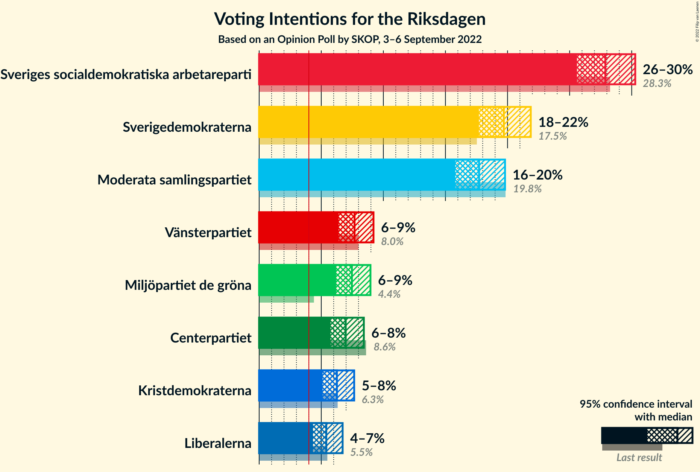

### Confidence Intervals

| Party | Last Result | Poll Result | 80% Confidence Interval | 90% Confidence Interval | 95% Confidence Interval | 99% Confidence Interval |
|:-----:|:-----------:|:-----------:|:-----------------------:|:-----------------------:|:-----------------------:|:-----------------------:|
| Sveriges socialdemokratiska arbetareparti | 28.3% | 27.9% | 26.4–29.5% |26.0–29.9% |25.6–30.3% |24.9–31.0% |
| Sverigedemokraterna | 17.5% | 19.7% | 18.4–21.1% |18.0–21.5% |17.7–21.9% |17.1–22.6% |
| Moderata samlingspartiet | 19.8% | 17.7% | 16.5–19.1% |16.1–19.5% |15.8–19.8% |15.2–20.5% |
| Vänsterpartiet | 8.0% | 7.7% | 6.8–8.7% |6.6–8.9% |6.4–9.2% |6.0–9.7% |
| Miljöpartiet de gröna | 4.4% | 7.5% | 6.6–8.4% |6.4–8.7% |6.2–9.0% |5.8–9.5% |
| Centerpartiet | 8.6% | 7.0% | 6.2–7.9% |5.9–8.2% |5.7–8.4% |5.4–8.9% |
| Kristdemokraterna | 6.3% | 6.3% | 5.5–7.2% |5.3–7.4% |5.1–7.7% |4.8–8.1% |
| Liberalerna | 5.5% | 5.4% | 4.7–6.3% |4.5–6.5% |4.3–6.7% |4.0–7.1% |

*Note:* The poll result column reflects the actual value used in the calculations. Published results may vary slightly, and in addition be rounded to fewer digits.

## Seats

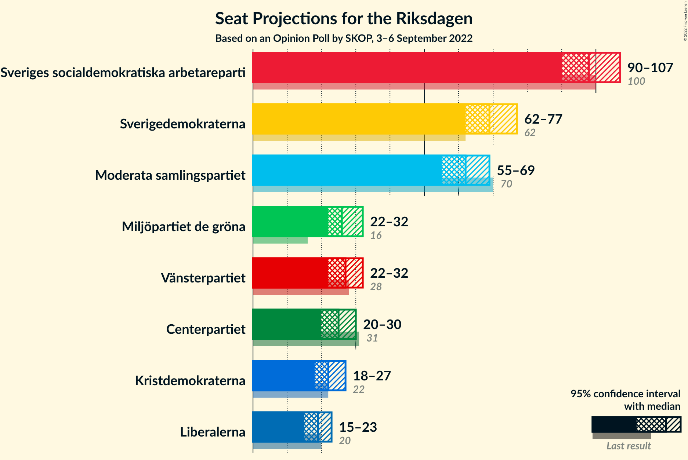

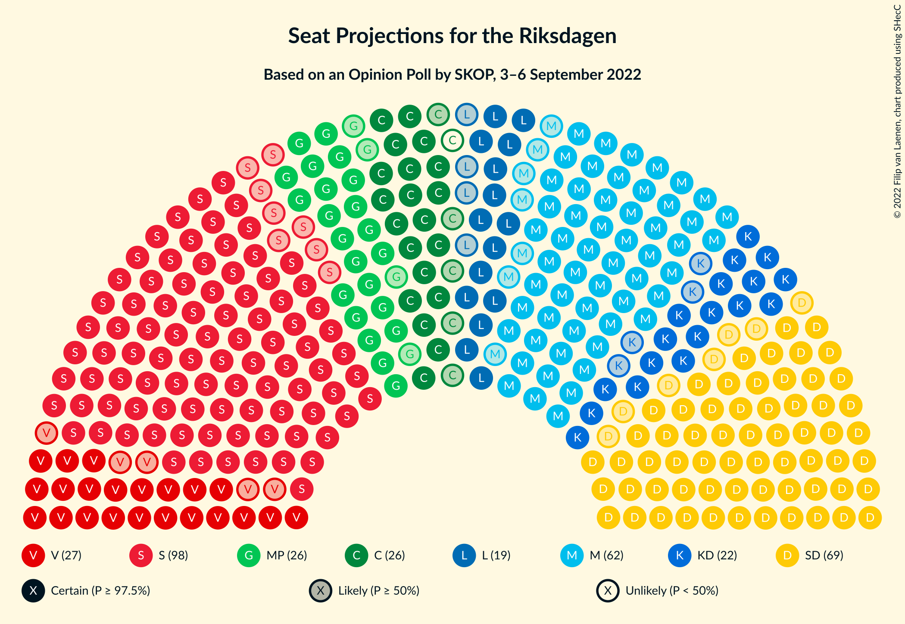

### Confidence Intervals

| Party | Last Result | Median | 80% Confidence Interval | 90% Confidence Interval | 95% Confidence Interval | 99% Confidence Interval |
|:-----:|:-----------:|:------:|:-----------------------:|:-----------------------:|:-----------------------:|:-----------------------:|
| <a href="#sveriges-socialdemokratiska-arbetareparti">Sveriges socialdemokratiska arbetareparti</a> | 100 | 98 | 93–103 |91–105 |90–107 |87–109 |
| <a href="#sverigedemokraterna">Sverigedemokraterna</a> | 62 | 69 | 64–74 |63–75 |62–77 |60–79 |
| <a href="#moderata-samlingspartiet">Moderata samlingspartiet</a> | 70 | 62 | 58–67 |56–68 |55–69 |53–72 |
| <a href="#vänsterpartiet">Vänsterpartiet</a> | 28 | 27 | 24–30 |23–31 |22–32 |21–34 |
| <a href="#miljöpartiet-de-gröna">Miljöpartiet de gröna</a> | 16 | 26 | 23–30 |22–31 |22–32 |20–33 |
| <a href="#centerpartiet">Centerpartiet</a> | 31 | 25 | 22–27 |21–29 |20–30 |19–31 |
| <a href="#kristdemokraterna">Kristdemokraterna</a> | 22 | 22 | 19–25 |19–26 |18–27 |17–28 |
| <a href="#liberalerna">Liberalerna</a> | 20 | 19 | 17–22 |16–23 |15–23 |14–25 |

### Sveriges socialdemokratiska arbetareparti

*For a full overview of the results for this party, see the [Sveriges socialdemokratiska arbetareparti](party-sverigessocialdemokratiskaarbetareparti.html) page.*

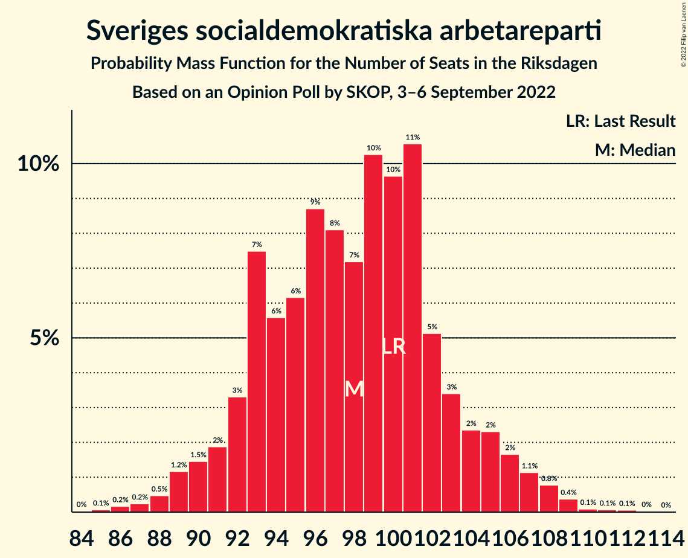

| Number of Seats | Probability | Accumulated | Special Marks |
|:---------------:|:-----------:|:-----------:|:-------------:|
| 84 | 0% | 100% |  |
| 85 | 0.1% | 99.9% |  |
| 86 | 0.2% | 99.9% |  |
| 87 | 0.2% | 99.7% |  |
| 88 | 0.5% | 99.5% |  |
| 89 | 1.2% | 99.0% |  |
| 90 | 1.5% | 98% |  |
| 91 | 2% | 96% |  |
| 92 | 3% | 94% |  |
| 93 | 7% | 91% |  |
| 94 | 6% | 84% |  |
| 95 | 6% | 78% |  |
| 96 | 9% | 72% |  |
| 97 | 8% | 63% |  |
| 98 | 7% | 55% | Median |
| 99 | 10% | 48% |  |
| 100 | 10% | 38% | Last Result |
| 101 | 11% | 28% |  |
| 102 | 5% | 17% |  |
| 103 | 3% | 12% |  |
| 104 | 2% | 9% |  |
| 105 | 2% | 7% |  |
| 106 | 2% | 4% |  |
| 107 | 1.1% | 3% |  |
| 108 | 0.8% | 1.4% |  |
| 109 | 0.4% | 0.7% |  |
| 110 | 0.1% | 0.3% |  |
| 111 | 0.1% | 0.2% |  |
| 112 | 0.1% | 0.1% |  |
| 113 | 0% | 0.1% |  |
| 114 | 0% | 0% |  |

### Sverigedemokraterna

*For a full overview of the results for this party, see the [Sverigedemokraterna](party-sverigedemokraterna.html) page.*

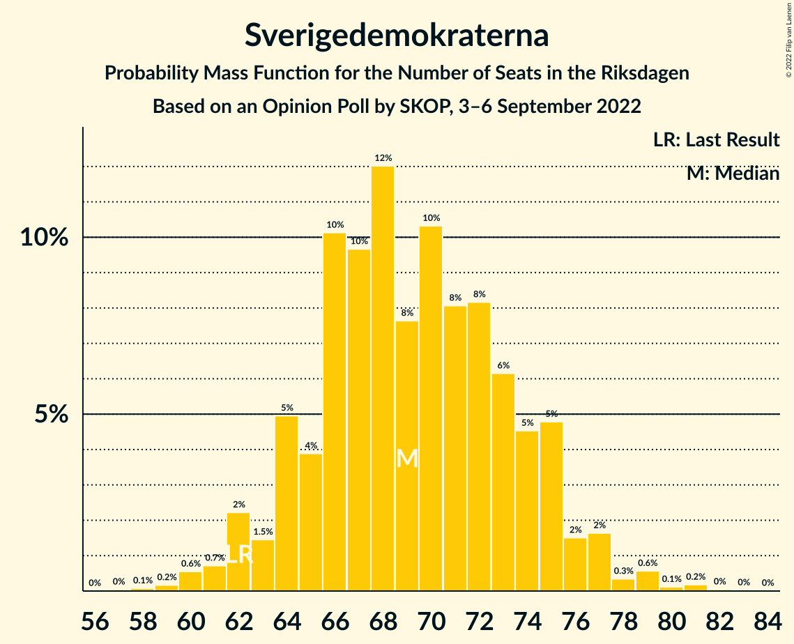

| Number of Seats | Probability | Accumulated | Special Marks |
|:---------------:|:-----------:|:-----------:|:-------------:|
| 57 | 0% | 100% |  |
| 58 | 0.1% | 99.9% |  |
| 59 | 0.2% | 99.9% |  |
| 60 | 0.6% | 99.7% |  |
| 61 | 0.7% | 99.1% |  |
| 62 | 2% | 98% | Last Result |
| 63 | 1.5% | 96% |  |
| 64 | 5% | 95% |  |
| 65 | 4% | 90% |  |
| 66 | 10% | 86% |  |
| 67 | 10% | 76% |  |
| 68 | 12% | 66% |  |
| 69 | 8% | 54% | Median |
| 70 | 10% | 46% |  |
| 71 | 8% | 36% |  |
| 72 | 8% | 28% |  |
| 73 | 6% | 20% |  |
| 74 | 5% | 14% |  |
| 75 | 5% | 9% |  |
| 76 | 2% | 4% |  |
| 77 | 2% | 3% |  |
| 78 | 0.3% | 1.3% |  |
| 79 | 0.6% | 0.9% |  |
| 80 | 0.1% | 0.4% |  |
| 81 | 0.2% | 0.3% |  |
| 82 | 0% | 0.1% |  |
| 83 | 0% | 0% |  |

### Moderata samlingspartiet

*For a full overview of the results for this party, see the [Moderata samlingspartiet](party-moderatasamlingspartiet.html) page.*

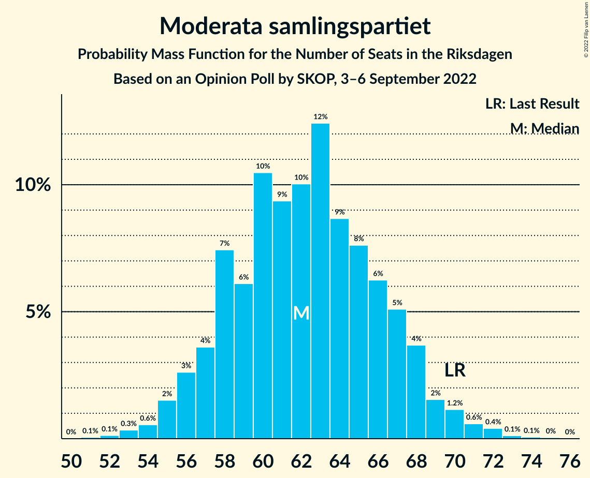

| Number of Seats | Probability | Accumulated | Special Marks |
|:---------------:|:-----------:|:-----------:|:-------------:|
| 51 | 0.1% | 100% |  |
| 52 | 0.1% | 99.9% |  |
| 53 | 0.3% | 99.8% |  |
| 54 | 0.6% | 99.4% |  |
| 55 | 2% | 98.9% |  |
| 56 | 3% | 97% |  |
| 57 | 4% | 95% |  |
| 58 | 7% | 91% |  |
| 59 | 6% | 84% |  |
| 60 | 10% | 78% |  |
| 61 | 9% | 67% |  |
| 62 | 10% | 58% | Median |
| 63 | 12% | 48% |  |
| 64 | 9% | 35% |  |
| 65 | 8% | 27% |  |
| 66 | 6% | 19% |  |
| 67 | 5% | 13% |  |
| 68 | 4% | 8% |  |
| 69 | 2% | 4% |  |
| 70 | 1.2% | 2% | Last Result |
| 71 | 0.6% | 1.3% |  |
| 72 | 0.4% | 0.7% |  |
| 73 | 0.1% | 0.3% |  |
| 74 | 0.1% | 0.1% |  |
| 75 | 0% | 0.1% |  |
| 76 | 0% | 0% |  |

### Vänsterpartiet

*For a full overview of the results for this party, see the [Vänsterpartiet](party-vänsterpartiet.html) page.*

| Number of Seats | Probability | Accumulated | Special Marks |
|:---------------:|:-----------:|:-----------:|:-------------:|
| 20 | 0.1% | 100% |  |
| 21 | 0.8% | 99.8% |  |
| 22 | 2% | 99.0% |  |
| 23 | 3% | 97% |  |
| 24 | 8% | 94% |  |
| 25 | 11% | 86% |  |
| 26 | 14% | 75% |  |
| 27 | 21% | 61% | Median |
| 28 | 11% | 40% | Last Result |
| 29 | 10% | 29% |  |
| 30 | 10% | 19% |  |
| 31 | 4% | 9% |  |
| 32 | 2% | 4% |  |
| 33 | 1.1% | 2% |  |
| 34 | 0.4% | 0.8% |  |
| 35 | 0.3% | 0.4% |  |
| 36 | 0.1% | 0.1% |  |
| 37 | 0% | 0% |  |

### Miljöpartiet de gröna

*For a full overview of the results for this party, see the [Miljöpartiet de gröna](party-miljöpartietdegröna.html) page.*

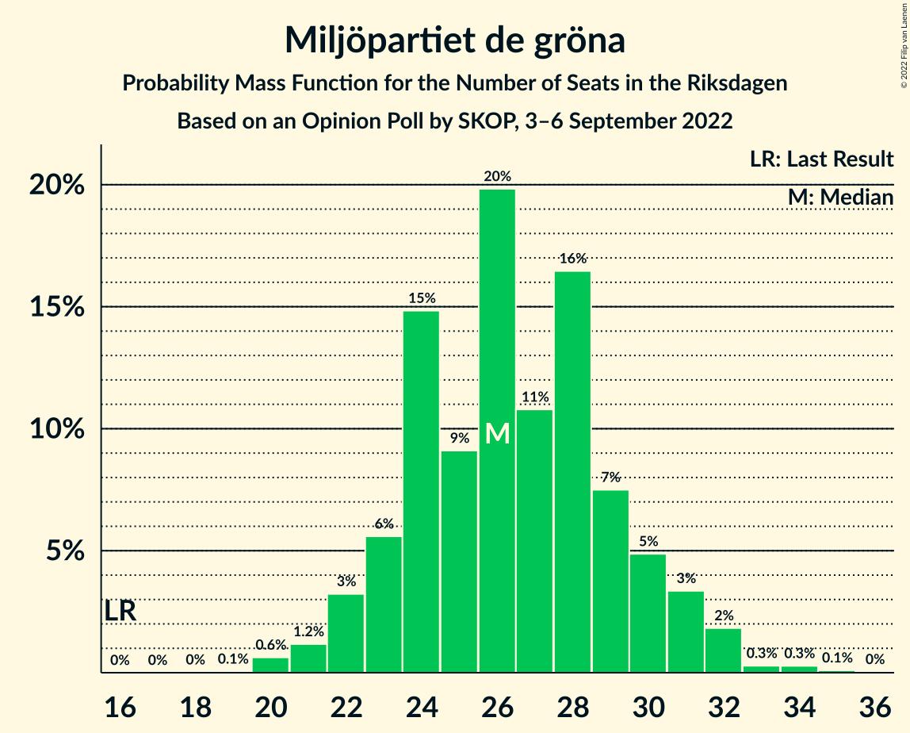

| Number of Seats | Probability | Accumulated | Special Marks |
|:---------------:|:-----------:|:-----------:|:-------------:|
| 16 | 0% | 100% | Last Result |
| 17 | 0% | 100% |  |
| 18 | 0% | 100% |  |
| 19 | 0.1% | 100% |  |
| 20 | 0.6% | 99.9% |  |
| 21 | 1.2% | 99.3% |  |
| 22 | 3% | 98% |  |
| 23 | 6% | 95% |  |
| 24 | 15% | 89% |  |
| 25 | 9% | 74% |  |
| 26 | 20% | 65% | Median |
| 27 | 11% | 46% |  |
| 28 | 16% | 35% |  |
| 29 | 7% | 18% |  |
| 30 | 5% | 11% |  |
| 31 | 3% | 6% |  |
| 32 | 2% | 3% |  |
| 33 | 0.3% | 0.7% |  |
| 34 | 0.3% | 0.4% |  |
| 35 | 0.1% | 0.1% |  |
| 36 | 0% | 0% |  |

### Centerpartiet

*For a full overview of the results for this party, see the [Centerpartiet](party-centerpartiet.html) page.*

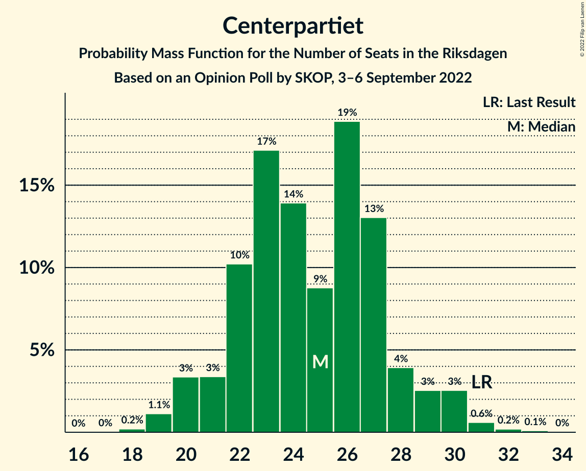

| Number of Seats | Probability | Accumulated | Special Marks |
|:---------------:|:-----------:|:-----------:|:-------------:|
| 18 | 0.2% | 100% |  |
| 19 | 1.1% | 99.8% |  |
| 20 | 3% | 98.6% |  |
| 21 | 3% | 95% |  |
| 22 | 10% | 92% |  |
| 23 | 17% | 82% |  |
| 24 | 14% | 65% |  |
| 25 | 9% | 51% | Median |
| 26 | 19% | 42% |  |
| 27 | 13% | 23% |  |
| 28 | 4% | 10% |  |
| 29 | 3% | 6% |  |
| 30 | 3% | 3% |  |
| 31 | 0.6% | 0.9% | Last Result |
| 32 | 0.2% | 0.3% |  |
| 33 | 0.1% | 0.1% |  |
| 34 | 0% | 0% |  |

### Kristdemokraterna

*For a full overview of the results for this party, see the [Kristdemokraterna](party-kristdemokraterna.html) page.*

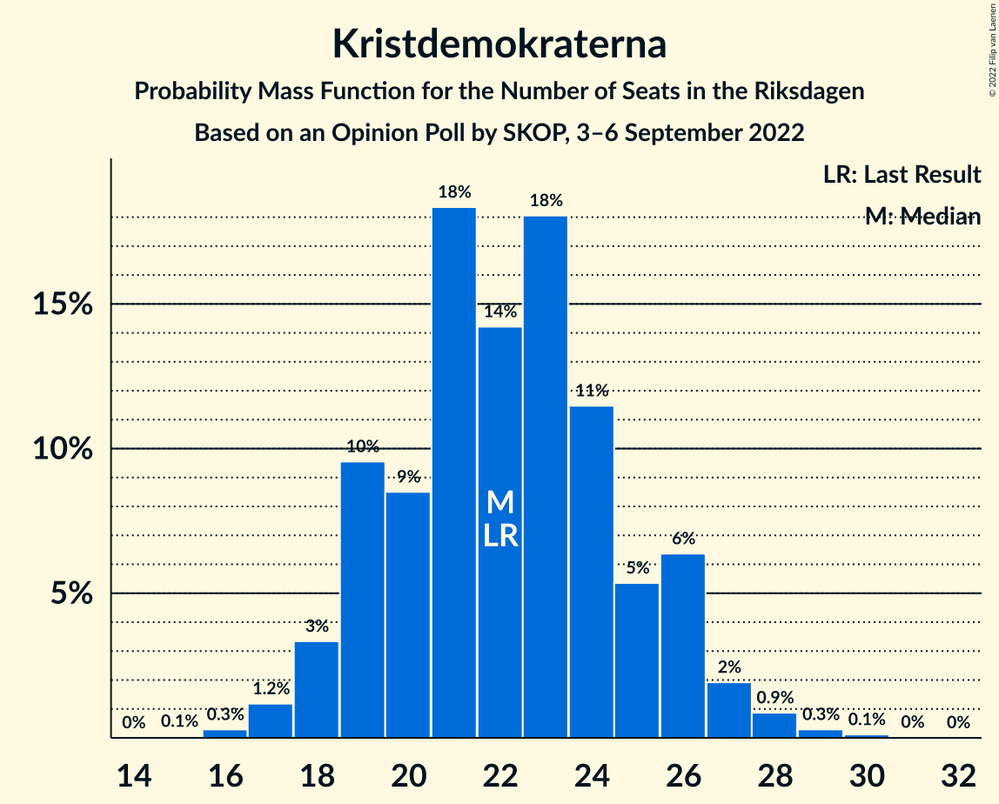

| Number of Seats | Probability | Accumulated | Special Marks |
|:---------------:|:-----------:|:-----------:|:-------------:|
| 15 | 0.1% | 100% |  |
| 16 | 0.3% | 99.9% |  |
| 17 | 1.2% | 99.6% |  |
| 18 | 3% | 98% |  |
| 19 | 10% | 95% |  |
| 20 | 9% | 86% |  |
| 21 | 18% | 77% |  |
| 22 | 14% | 59% | Last Result, Median |
| 23 | 18% | 44% |  |
| 24 | 11% | 26% |  |
| 25 | 5% | 15% |  |
| 26 | 6% | 10% |  |
| 27 | 2% | 3% |  |
| 28 | 0.9% | 1.3% |  |
| 29 | 0.3% | 0.4% |  |
| 30 | 0.1% | 0.2% |  |
| 31 | 0% | 0% |  |

### Liberalerna

*For a full overview of the results for this party, see the [Liberalerna](party-liberalerna.html) page.*

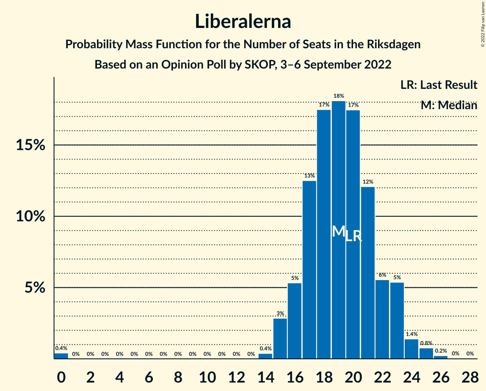

| Number of Seats | Probability | Accumulated | Special Marks |
|:---------------:|:-----------:|:-----------:|:-------------:|
| 0 | 0.4% | 100% |  |
| 1 | 0% | 99.6% |  |
| 2 | 0% | 99.6% |  |
| 3 | 0% | 99.6% |  |
| 4 | 0% | 99.6% |  |
| 5 | 0% | 99.6% |  |
| 6 | 0% | 99.6% |  |
| 7 | 0% | 99.6% |  |
| 8 | 0% | 99.6% |  |
| 9 | 0% | 99.6% |  |
| 10 | 0% | 99.6% |  |
| 11 | 0% | 99.6% |  |
| 12 | 0% | 99.6% |  |
| 13 | 0% | 99.6% |  |
| 14 | 0.4% | 99.6% |  |
| 15 | 3% | 99.2% |  |
| 16 | 5% | 96% |  |
| 17 | 13% | 91% |  |
| 18 | 17% | 79% |  |
| 19 | 18% | 61% | Median |
| 20 | 17% | 43% | Last Result |
| 21 | 12% | 25% |  |
| 22 | 6% | 13% |  |
| 23 | 5% | 8% |  |
| 24 | 1.4% | 2% |  |
| 25 | 0.8% | 1.1% |  |
| 26 | 0.2% | 0.3% |  |
| 27 | 0% | 0.1% |  |
| 28 | 0% | 0% |  |

## Coalitions

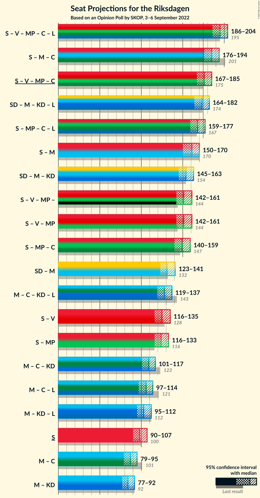

### Confidence Intervals

| Coalition | Last Result | Median | Majority? | 80% Confidence Interval | 90% Confidence Interval | 95% Confidence Interval | 99% Confidence Interval |
|:---------:|:-----------:|:------:|:---------:|:-----------------------:|:-----------------------:|:-----------------------:|:-----------------------:|
| Sveriges socialdemokratiska arbetareparti – Vänsterpartiet – Miljöpartiet de gröna – Centerpartiet – Liberalerna | 195 | 195 | 100% | 189–202 | 187–202 | 186–204 | 183–207 |
| Sveriges socialdemokratiska arbetareparti – Moderata samlingspartiet – Centerpartiet | 201 | 185 | 98.6% | 179–191 | 177–192 | 176–194 | 173–197 |
| Sveriges socialdemokratiska arbetareparti – Vänsterpartiet – Miljöpartiet de gröna – Centerpartiet | 175 | 176 | 63% | 170–182 | 168–184 | 167–185 | 164–189 |
| Sverigedemokraterna – Moderata samlingspartiet – Kristdemokraterna – Liberalerna | 174 | 173 | 37% | 167–179 | 165–181 | 164–182 | 160–185 |
| Sveriges socialdemokratiska arbetareparti – Miljöpartiet de gröna – Centerpartiet – Liberalerna | 167 | 168 | 8% | 162–174 | 160–176 | 159–177 | 156–180 |
| Sveriges socialdemokratiska arbetareparti – Moderata samlingspartiet | 170 | 161 | 0.2% | 155–165 | 152–167 | 150–170 | 148–173 |
| Sverigedemokraterna – Moderata samlingspartiet – Kristdemokraterna | 154 | 154 | 0% | 147–160 | 147–162 | 145–163 | 142–166 |
| Sveriges socialdemokratiska arbetareparti – Vänsterpartiet – Miljöpartiet de gröna | 144 | 151 | 0% | 145–158 | 144–159 | 142–161 | 140–164 |
| Sveriges socialdemokratiska arbetareparti – Miljöpartiet de gröna – Centerpartiet | 147 | 149 | 0% | 143–155 | 141–157 | 140–159 | 137–161 |
| Sverigedemokraterna – Moderata samlingspartiet | 132 | 131 | 0% | 126–138 | 124–139 | 123–141 | 120–144 |
| Moderata samlingspartiet – Centerpartiet – Kristdemokraterna – Liberalerna | 143 | 128 | 0% | 122–134 | 120–137 | 119–137 | 116–140 |
| Sveriges socialdemokratiska arbetareparti – Vänsterpartiet | 128 | 125 | 0% | 119–131 | 118–132 | 116–135 | 114–137 |
| Sveriges socialdemokratiska arbetareparti – Miljöpartiet de gröna | 116 | 124 | 0% | 119–130 | 117–132 | 116–133 | 113–136 |
| Moderata samlingspartiet – Centerpartiet – Kristdemokraterna | 123 | 109 | 0% | 103–115 | 102–117 | 101–117 | 98–120 |
| Moderata samlingspartiet – Centerpartiet – Liberalerna | 121 | 106 | 0% | 100–112 | 99–114 | 97–114 | 94–117 |
| Moderata samlingspartiet – Kristdemokraterna – Liberalerna | 112 | 103 | 0% | 98–110 | 97–111 | 95–112 | 91–115 |
| Sveriges socialdemokratiska arbetareparti | 100 | 98 | 0% | 93–103 | 91–105 | 90–107 | 87–109 |
| Moderata samlingspartiet – Centerpartiet | 101 | 87 | 0% | 82–92 | 80–94 | 79–95 | 77–98 |
| Moderata samlingspartiet – Kristdemokraterna | 92 | 84 | 0% | 79–90 | 78–91 | 77–92 | 75–95 |

### Sveriges socialdemokratiska arbetareparti – Vänsterpartiet – Miljöpartiet de gröna – Centerpartiet – Liberalerna

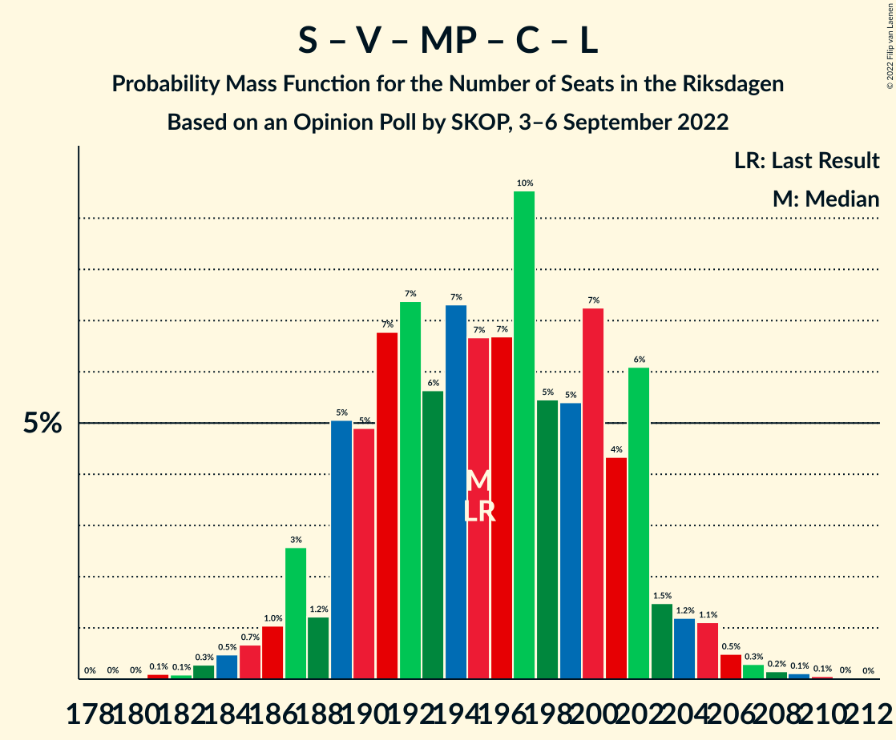

| Number of Seats | Probability | Accumulated | Special Marks |
|:---------------:|:-----------:|:-----------:|:-------------:|
| 179 | 0% | 100% |  |
| 180 | 0% | 99.9% |  |
| 181 | 0.1% | 99.9% |  |
| 182 | 0.1% | 99.8% |  |
| 183 | 0.3% | 99.7% |  |
| 184 | 0.5% | 99.4% |  |
| 185 | 0.7% | 99.0% |  |
| 186 | 1.0% | 98% |  |
| 187 | 3% | 97% |  |
| 188 | 1.2% | 95% |  |
| 189 | 5% | 93% |  |
| 190 | 5% | 88% |  |
| 191 | 7% | 83% |  |
| 192 | 7% | 77% |  |
| 193 | 6% | 69% |  |
| 194 | 7% | 64% |  |
| 195 | 7% | 56% | Last Result, Median |
| 196 | 7% | 50% |  |
| 197 | 10% | 43% |  |
| 198 | 5% | 33% |  |
| 199 | 5% | 28% |  |
| 200 | 7% | 23% |  |
| 201 | 4% | 15% |  |
| 202 | 6% | 11% |  |
| 203 | 1.5% | 5% |  |
| 204 | 1.2% | 3% |  |
| 205 | 1.1% | 2% |  |
| 206 | 0.5% | 1.2% |  |
| 207 | 0.3% | 0.7% |  |
| 208 | 0.2% | 0.4% |  |
| 209 | 0.1% | 0.2% |  |
| 210 | 0.1% | 0.1% |  |
| 211 | 0% | 0.1% |  |
| 212 | 0% | 0% |  |

### Sveriges socialdemokratiska arbetareparti – Moderata samlingspartiet – Centerpartiet

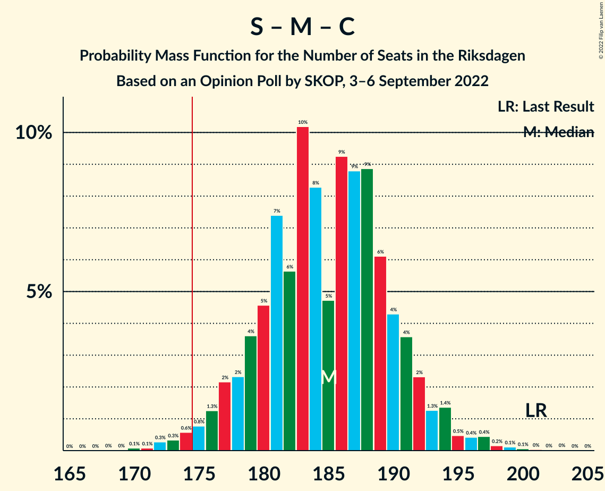

| Number of Seats | Probability | Accumulated | Special Marks |
|:---------------:|:-----------:|:-----------:|:-------------:|
| 170 | 0.1% | 100% |  |
| 171 | 0.1% | 99.9% |  |
| 172 | 0.3% | 99.8% |  |
| 173 | 0.3% | 99.5% |  |
| 174 | 0.6% | 99.2% |  |
| 175 | 0.8% | 98.6% | Majority |
| 176 | 1.3% | 98% |  |
| 177 | 2% | 97% |  |
| 178 | 2% | 94% |  |
| 179 | 4% | 92% |  |
| 180 | 5% | 88% |  |
| 181 | 7% | 84% |  |
| 182 | 6% | 76% |  |
| 183 | 10% | 71% |  |
| 184 | 8% | 61% |  |
| 185 | 5% | 52% | Median |
| 186 | 9% | 48% |  |
| 187 | 9% | 38% |  |
| 188 | 9% | 30% |  |
| 189 | 6% | 21% |  |
| 190 | 4% | 15% |  |
| 191 | 4% | 10% |  |
| 192 | 2% | 7% |  |
| 193 | 1.3% | 4% |  |
| 194 | 1.4% | 3% |  |
| 195 | 0.5% | 2% |  |
| 196 | 0.4% | 1.3% |  |
| 197 | 0.4% | 0.9% |  |
| 198 | 0.2% | 0.4% |  |
| 199 | 0.1% | 0.3% |  |
| 200 | 0.1% | 0.2% |  |
| 201 | 0% | 0.1% | Last Result |
| 202 | 0% | 0.1% |  |
| 203 | 0% | 0.1% |  |
| 204 | 0% | 0% |  |

### Sveriges socialdemokratiska arbetareparti – Vänsterpartiet – Miljöpartiet de gröna – Centerpartiet

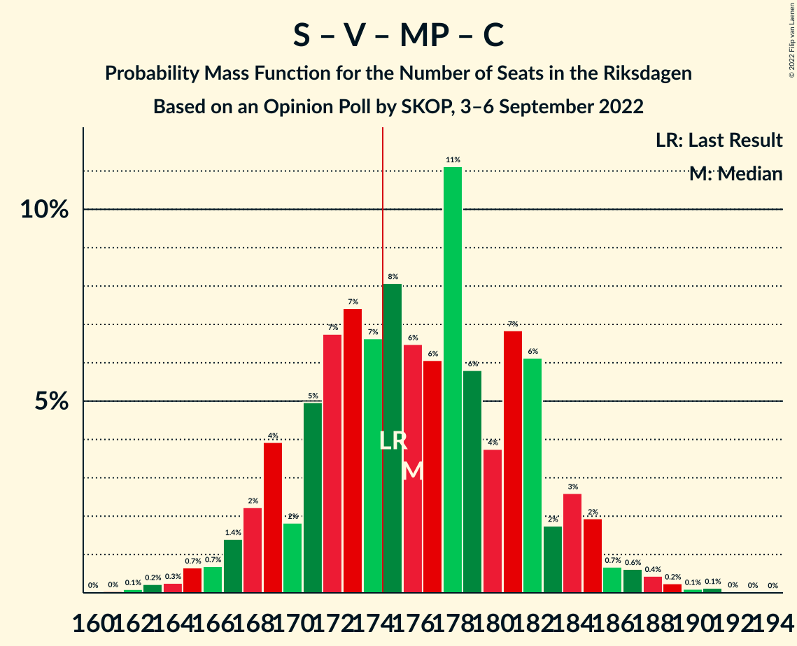

| Number of Seats | Probability | Accumulated | Special Marks |
|:---------------:|:-----------:|:-----------:|:-------------:|
| 161 | 0% | 100% |  |
| 162 | 0.1% | 99.9% |  |
| 163 | 0.2% | 99.8% |  |
| 164 | 0.3% | 99.6% |  |
| 165 | 0.7% | 99.3% |  |
| 166 | 0.7% | 98.7% |  |
| 167 | 1.4% | 98% |  |
| 168 | 2% | 97% |  |
| 169 | 4% | 94% |  |
| 170 | 2% | 90% |  |
| 171 | 5% | 89% |  |
| 172 | 7% | 84% |  |
| 173 | 7% | 77% |  |
| 174 | 7% | 69% |  |
| 175 | 8% | 63% | Last Result, Majority |
| 176 | 6% | 55% | Median |
| 177 | 6% | 48% |  |
| 178 | 11% | 42% |  |
| 179 | 6% | 31% |  |
| 180 | 4% | 25% |  |
| 181 | 7% | 22% |  |
| 182 | 6% | 15% |  |
| 183 | 2% | 9% |  |
| 184 | 3% | 7% |  |
| 185 | 2% | 4% |  |
| 186 | 0.7% | 2% |  |
| 187 | 0.6% | 2% |  |
| 188 | 0.4% | 1.0% |  |
| 189 | 0.2% | 0.6% |  |
| 190 | 0.1% | 0.3% |  |
| 191 | 0.1% | 0.2% |  |
| 192 | 0% | 0.1% |  |
| 193 | 0% | 0.1% |  |
| 194 | 0% | 0% |  |

### Sverigedemokraterna – Moderata samlingspartiet – Kristdemokraterna – Liberalerna

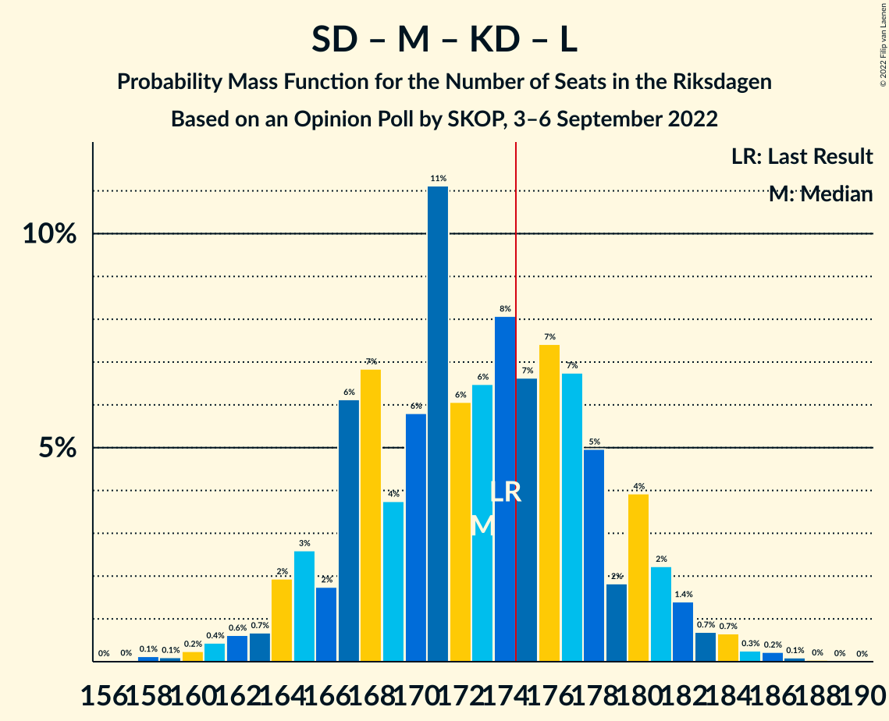

| Number of Seats | Probability | Accumulated | Special Marks |
|:---------------:|:-----------:|:-----------:|:-------------:|
| 156 | 0% | 100% |  |
| 157 | 0% | 99.9% |  |
| 158 | 0.1% | 99.9% |  |
| 159 | 0.1% | 99.8% |  |
| 160 | 0.2% | 99.7% |  |
| 161 | 0.4% | 99.4% |  |
| 162 | 0.6% | 99.0% |  |
| 163 | 0.7% | 98% |  |
| 164 | 2% | 98% |  |
| 165 | 3% | 96% |  |
| 166 | 2% | 93% |  |
| 167 | 6% | 91% |  |
| 168 | 7% | 85% |  |
| 169 | 4% | 78% |  |
| 170 | 6% | 75% |  |
| 171 | 11% | 69% |  |
| 172 | 6% | 58% | Median |
| 173 | 6% | 52% |  |
| 174 | 8% | 45% | Last Result |
| 175 | 7% | 37% | Majority |
| 176 | 7% | 31% |  |
| 177 | 7% | 23% |  |
| 178 | 5% | 16% |  |
| 179 | 2% | 11% |  |
| 180 | 4% | 10% |  |
| 181 | 2% | 6% |  |
| 182 | 1.4% | 3% |  |
| 183 | 0.7% | 2% |  |
| 184 | 0.7% | 1.3% |  |
| 185 | 0.3% | 0.7% |  |
| 186 | 0.2% | 0.4% |  |
| 187 | 0.1% | 0.2% |  |
| 188 | 0% | 0.1% |  |
| 189 | 0% | 0% |  |

### Sveriges socialdemokratiska arbetareparti – Miljöpartiet de gröna – Centerpartiet – Liberalerna

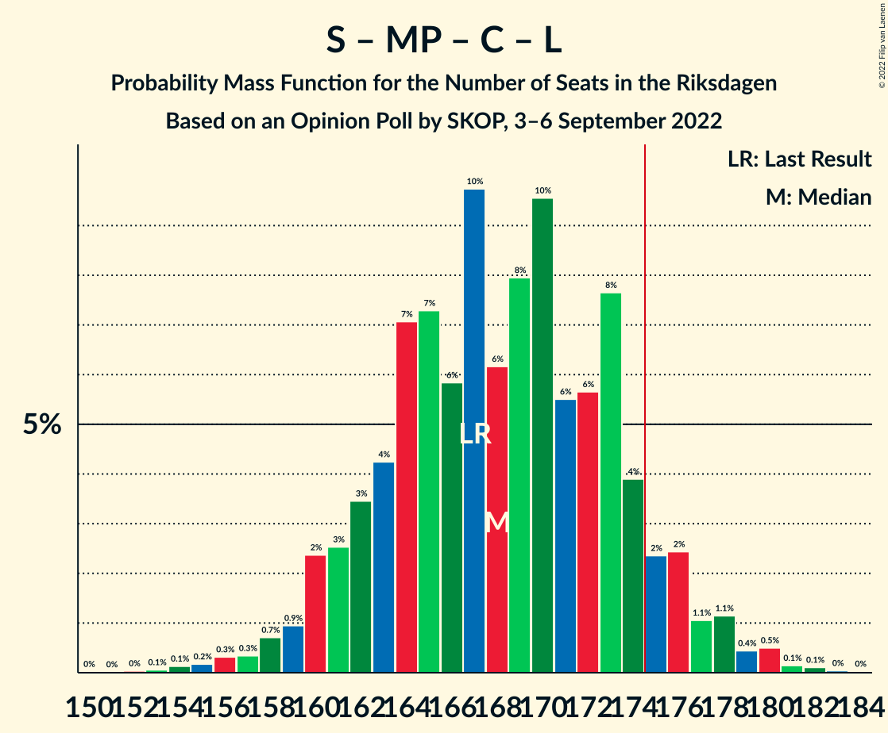

| Number of Seats | Probability | Accumulated | Special Marks |
|:---------------:|:-----------:|:-----------:|:-------------:|
| 151 | 0% | 100% |  |
| 152 | 0% | 99.9% |  |
| 153 | 0.1% | 99.9% |  |
| 154 | 0.1% | 99.8% |  |
| 155 | 0.2% | 99.7% |  |
| 156 | 0.3% | 99.5% |  |
| 157 | 0.3% | 99.2% |  |
| 158 | 0.7% | 98.9% |  |
| 159 | 0.9% | 98% |  |
| 160 | 2% | 97% |  |
| 161 | 3% | 95% |  |
| 162 | 3% | 92% |  |
| 163 | 4% | 89% |  |
| 164 | 7% | 85% |  |
| 165 | 7% | 78% |  |
| 166 | 6% | 70% |  |
| 167 | 10% | 64% | Last Result |
| 168 | 6% | 55% | Median |
| 169 | 8% | 49% |  |
| 170 | 10% | 41% |  |
| 171 | 6% | 31% |  |
| 172 | 6% | 25% |  |
| 173 | 8% | 20% |  |
| 174 | 4% | 12% |  |
| 175 | 2% | 8% | Majority |
| 176 | 2% | 6% |  |
| 177 | 1.1% | 3% |  |
| 178 | 1.1% | 2% |  |
| 179 | 0.4% | 1.3% |  |
| 180 | 0.5% | 0.8% |  |
| 181 | 0.1% | 0.3% |  |
| 182 | 0.1% | 0.2% |  |
| 183 | 0% | 0.1% |  |
| 184 | 0% | 0% |  |

### Sveriges socialdemokratiska arbetareparti – Moderata samlingspartiet

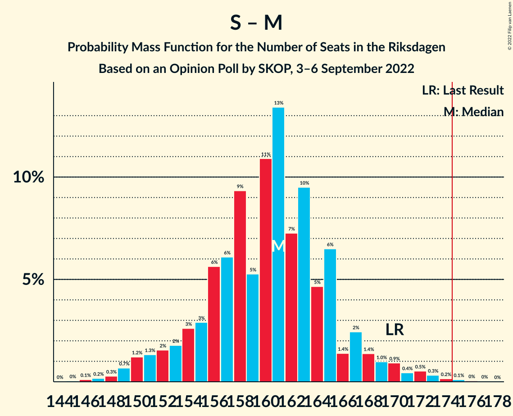

| Number of Seats | Probability | Accumulated | Special Marks |
|:---------------:|:-----------:|:-----------:|:-------------:|
| 145 | 0% | 100% |  |
| 146 | 0.1% | 99.9% |  |
| 147 | 0.2% | 99.8% |  |
| 148 | 0.3% | 99.6% |  |
| 149 | 0.7% | 99.4% |  |
| 150 | 1.2% | 98.7% |  |
| 151 | 1.3% | 97% |  |
| 152 | 2% | 96% |  |
| 153 | 2% | 95% |  |
| 154 | 3% | 93% |  |
| 155 | 3% | 90% |  |
| 156 | 6% | 87% |  |
| 157 | 6% | 82% |  |
| 158 | 9% | 76% |  |
| 159 | 5% | 66% |  |
| 160 | 11% | 61% | Median |
| 161 | 13% | 50% |  |
| 162 | 7% | 37% |  |
| 163 | 10% | 29% |  |
| 164 | 5% | 20% |  |
| 165 | 6% | 15% |  |
| 166 | 1.4% | 9% |  |
| 167 | 2% | 7% |  |
| 168 | 1.4% | 5% |  |
| 169 | 1.0% | 4% |  |
| 170 | 0.9% | 3% | Last Result |
| 171 | 0.4% | 2% |  |
| 172 | 0.5% | 1.2% |  |
| 173 | 0.3% | 0.7% |  |
| 174 | 0.2% | 0.4% |  |
| 175 | 0.1% | 0.2% | Majority |
| 176 | 0% | 0.1% |  |
| 177 | 0% | 0.1% |  |
| 178 | 0% | 0% |  |

### Sverigedemokraterna – Moderata samlingspartiet – Kristdemokraterna

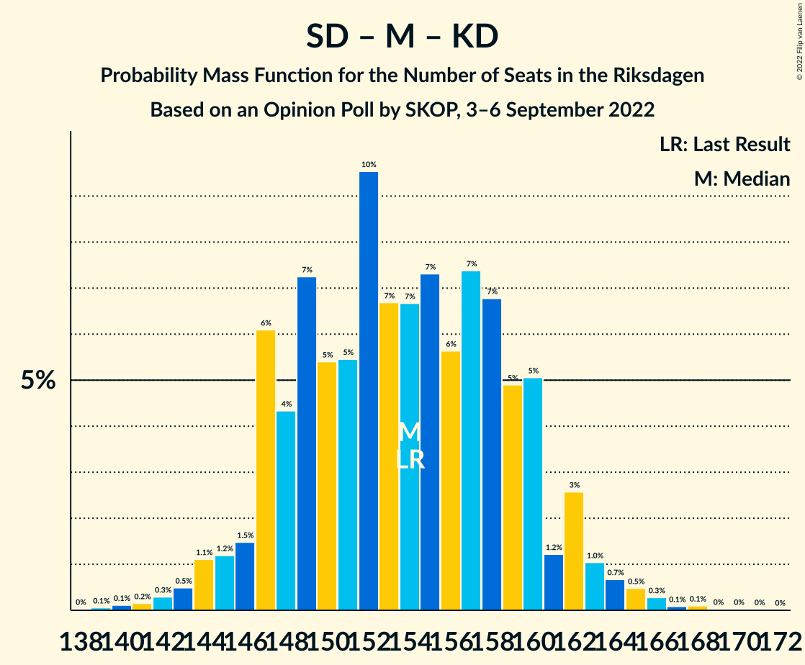

| Number of Seats | Probability | Accumulated | Special Marks |
|:---------------:|:-----------:|:-----------:|:-------------:|
| 138 | 0% | 100% |  |
| 139 | 0.1% | 99.9% |  |
| 140 | 0.1% | 99.9% |  |
| 141 | 0.2% | 99.8% |  |
| 142 | 0.3% | 99.6% |  |
| 143 | 0.5% | 99.3% |  |
| 144 | 1.1% | 98.8% |  |
| 145 | 1.2% | 98% |  |
| 146 | 1.5% | 97% |  |
| 147 | 6% | 95% |  |
| 148 | 4% | 89% |  |
| 149 | 7% | 85% |  |
| 150 | 5% | 77% |  |
| 151 | 5% | 72% |  |
| 152 | 10% | 67% |  |
| 153 | 7% | 57% | Median |
| 154 | 7% | 50% | Last Result |
| 155 | 7% | 44% |  |
| 156 | 6% | 36% |  |
| 157 | 7% | 31% |  |
| 158 | 7% | 23% |  |
| 159 | 5% | 17% |  |
| 160 | 5% | 12% |  |
| 161 | 1.2% | 7% |  |
| 162 | 3% | 5% |  |
| 163 | 1.0% | 3% |  |
| 164 | 0.7% | 2% |  |
| 165 | 0.5% | 1.0% |  |
| 166 | 0.3% | 0.6% |  |
| 167 | 0.1% | 0.3% |  |
| 168 | 0.1% | 0.2% |  |
| 169 | 0% | 0.1% |  |
| 170 | 0% | 0.1% |  |
| 171 | 0% | 0% |  |

### Sveriges socialdemokratiska arbetareparti – Vänsterpartiet – Miljöpartiet de gröna

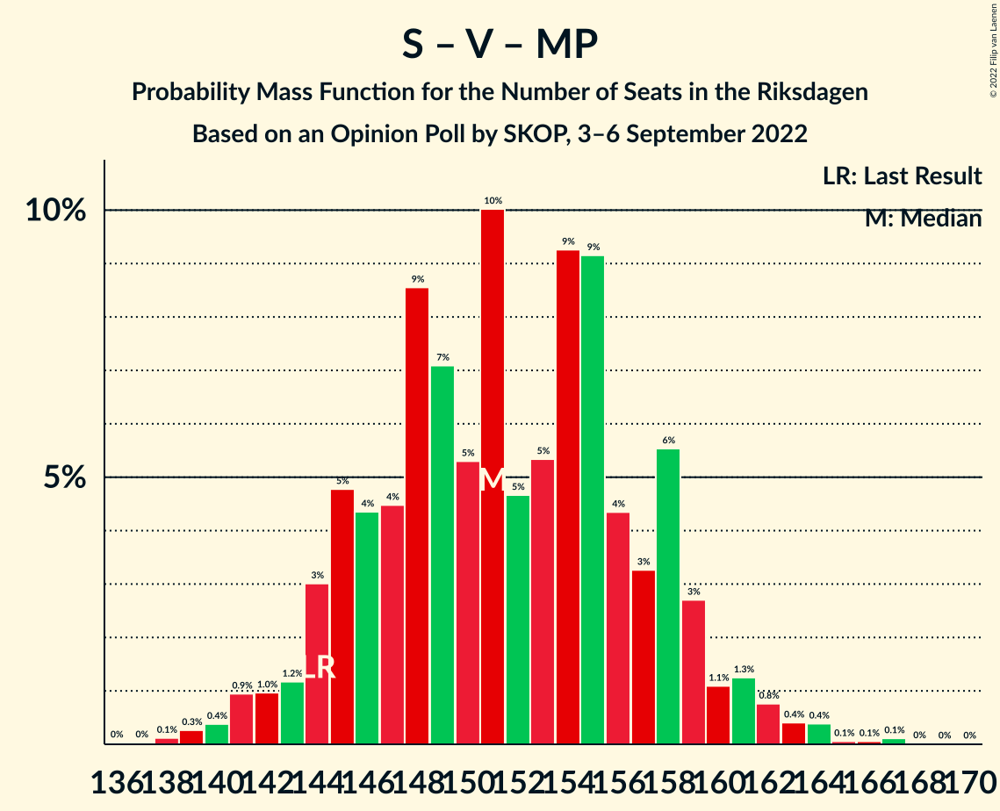

| Number of Seats | Probability | Accumulated | Special Marks |
|:---------------:|:-----------:|:-----------:|:-------------:|
| 136 | 0% | 100% |  |
| 137 | 0% | 99.9% |  |
| 138 | 0.1% | 99.9% |  |
| 139 | 0.3% | 99.8% |  |
| 140 | 0.4% | 99.5% |  |
| 141 | 0.9% | 99.1% |  |
| 142 | 1.0% | 98% |  |
| 143 | 1.2% | 97% |  |
| 144 | 3% | 96% | Last Result |
| 145 | 5% | 93% |  |
| 146 | 4% | 88% |  |
| 147 | 4% | 84% |  |
| 148 | 9% | 79% |  |
| 149 | 7% | 71% |  |
| 150 | 5% | 64% |  |
| 151 | 10% | 58% | Median |
| 152 | 5% | 48% |  |
| 153 | 5% | 44% |  |
| 154 | 9% | 38% |  |
| 155 | 9% | 29% |  |
| 156 | 4% | 20% |  |
| 157 | 3% | 16% |  |
| 158 | 6% | 12% |  |
| 159 | 3% | 7% |  |
| 160 | 1.1% | 4% |  |
| 161 | 1.3% | 3% |  |
| 162 | 0.8% | 2% |  |
| 163 | 0.4% | 1.1% |  |
| 164 | 0.4% | 0.7% |  |
| 165 | 0.1% | 0.3% |  |
| 166 | 0.1% | 0.2% |  |
| 167 | 0.1% | 0.2% |  |
| 168 | 0% | 0.1% |  |
| 169 | 0% | 0% |  |

### Sveriges socialdemokratiska arbetareparti – Miljöpartiet de gröna – Centerpartiet

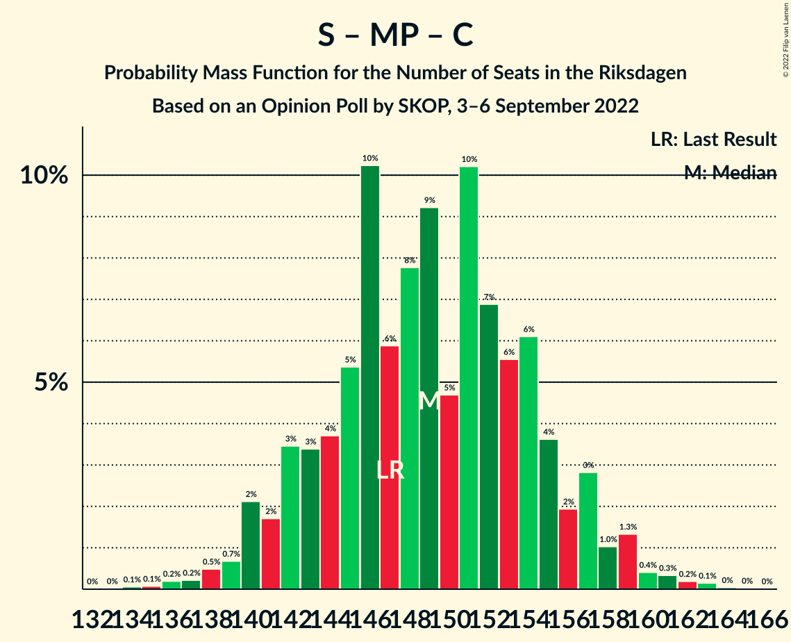

| Number of Seats | Probability | Accumulated | Special Marks |
|:---------------:|:-----------:|:-----------:|:-------------:|
| 134 | 0.1% | 100% |  |
| 135 | 0.1% | 99.9% |  |
| 136 | 0.2% | 99.8% |  |
| 137 | 0.2% | 99.6% |  |
| 138 | 0.5% | 99.4% |  |
| 139 | 0.7% | 98.9% |  |
| 140 | 2% | 98% |  |
| 141 | 2% | 96% |  |
| 142 | 3% | 94% |  |
| 143 | 3% | 91% |  |
| 144 | 4% | 88% |  |
| 145 | 5% | 84% |  |
| 146 | 10% | 78% |  |
| 147 | 6% | 68% | Last Result |
| 148 | 8% | 62% |  |
| 149 | 9% | 55% | Median |
| 150 | 5% | 45% |  |
| 151 | 10% | 41% |  |
| 152 | 7% | 30% |  |
| 153 | 6% | 24% |  |
| 154 | 6% | 18% |  |
| 155 | 4% | 12% |  |
| 156 | 2% | 8% |  |
| 157 | 3% | 6% |  |
| 158 | 1.0% | 4% |  |
| 159 | 1.3% | 3% |  |
| 160 | 0.4% | 1.2% |  |
| 161 | 0.3% | 0.8% |  |
| 162 | 0.2% | 0.4% |  |
| 163 | 0.1% | 0.3% |  |
| 164 | 0% | 0.1% |  |
| 165 | 0% | 0.1% |  |
| 166 | 0% | 0% |  |

### Sverigedemokraterna – Moderata samlingspartiet

| Number of Seats | Probability | Accumulated | Special Marks |
|:---------------:|:-----------:|:-----------:|:-------------:|
| 117 | 0% | 100% |  |
| 118 | 0.1% | 99.9% |  |
| 119 | 0.1% | 99.8% |  |
| 120 | 0.4% | 99.7% |  |
| 121 | 0.6% | 99.4% |  |
| 122 | 1.1% | 98.8% |  |
| 123 | 1.0% | 98% |  |
| 124 | 3% | 97% |  |
| 125 | 3% | 94% |  |
| 126 | 5% | 91% |  |
| 127 | 5% | 85% |  |
| 128 | 6% | 80% |  |
| 129 | 6% | 74% |  |
| 130 | 8% | 68% |  |
| 131 | 12% | 60% | Median |
| 132 | 6% | 48% | Last Result |
| 133 | 10% | 42% |  |
| 134 | 7% | 32% |  |
| 135 | 7% | 25% |  |
| 136 | 5% | 19% |  |
| 137 | 4% | 14% |  |
| 138 | 4% | 10% |  |
| 139 | 2% | 6% |  |
| 140 | 1.1% | 4% |  |
| 141 | 1.3% | 3% |  |
| 142 | 0.5% | 1.3% |  |
| 143 | 0.3% | 0.8% |  |
| 144 | 0.2% | 0.5% |  |
| 145 | 0.2% | 0.3% |  |
| 146 | 0.1% | 0.1% |  |
| 147 | 0% | 0.1% |  |
| 148 | 0% | 0% |  |

### Moderata samlingspartiet – Centerpartiet – Kristdemokraterna – Liberalerna

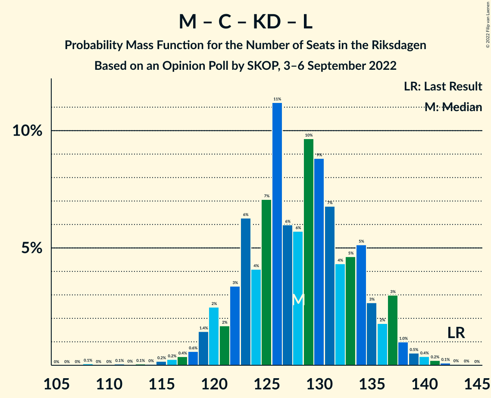

| Number of Seats | Probability | Accumulated | Special Marks |
|:---------------:|:-----------:|:-----------:|:-------------:|
| 108 | 0.1% | 100% |  |
| 109 | 0% | 99.9% |  |
| 110 | 0% | 99.9% |  |
| 111 | 0.1% | 99.9% |  |
| 112 | 0% | 99.8% |  |
| 113 | 0.1% | 99.8% |  |
| 114 | 0% | 99.8% |  |
| 115 | 0.2% | 99.7% |  |
| 116 | 0.2% | 99.6% |  |
| 117 | 0.4% | 99.3% |  |
| 118 | 0.6% | 98.9% |  |
| 119 | 1.4% | 98% |  |
| 120 | 2% | 97% |  |
| 121 | 2% | 94% |  |
| 122 | 3% | 93% |  |
| 123 | 6% | 89% |  |
| 124 | 4% | 83% |  |
| 125 | 7% | 79% |  |
| 126 | 11% | 72% |  |
| 127 | 6% | 61% |  |
| 128 | 6% | 55% | Median |
| 129 | 10% | 49% |  |
| 130 | 9% | 39% |  |
| 131 | 7% | 31% |  |
| 132 | 4% | 24% |  |
| 133 | 5% | 19% |  |
| 134 | 5% | 15% |  |
| 135 | 3% | 10% |  |
| 136 | 2% | 7% |  |
| 137 | 3% | 5% |  |
| 138 | 1.0% | 2% |  |
| 139 | 0.5% | 1.3% |  |
| 140 | 0.4% | 0.8% |  |
| 141 | 0.2% | 0.4% |  |
| 142 | 0.1% | 0.2% |  |
| 143 | 0% | 0.1% | Last Result |
| 144 | 0% | 0% |  |

### Sveriges socialdemokratiska arbetareparti – Vänsterpartiet

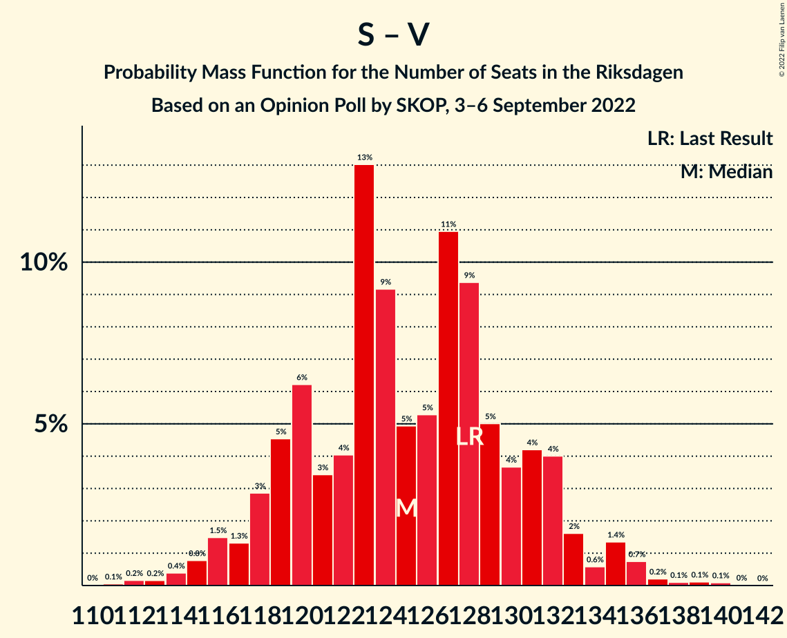

| Number of Seats | Probability | Accumulated | Special Marks |
|:---------------:|:-----------:|:-----------:|:-------------:|
| 111 | 0.1% | 100% |  |
| 112 | 0.2% | 99.9% |  |
| 113 | 0.2% | 99.7% |  |
| 114 | 0.4% | 99.6% |  |
| 115 | 0.8% | 99.2% |  |
| 116 | 1.5% | 98% |  |
| 117 | 1.3% | 97% |  |
| 118 | 3% | 96% |  |
| 119 | 5% | 93% |  |
| 120 | 6% | 88% |  |
| 121 | 3% | 82% |  |
| 122 | 4% | 79% |  |
| 123 | 13% | 75% |  |
| 124 | 9% | 61% |  |
| 125 | 5% | 52% | Median |
| 126 | 5% | 47% |  |
| 127 | 11% | 42% |  |
| 128 | 9% | 31% | Last Result |
| 129 | 5% | 22% |  |
| 130 | 4% | 17% |  |
| 131 | 4% | 13% |  |
| 132 | 4% | 9% |  |
| 133 | 2% | 5% |  |
| 134 | 0.6% | 3% |  |
| 135 | 1.4% | 3% |  |
| 136 | 0.7% | 1.3% |  |
| 137 | 0.2% | 0.6% |  |
| 138 | 0.1% | 0.3% |  |
| 139 | 0.1% | 0.2% |  |
| 140 | 0.1% | 0.1% |  |
| 141 | 0% | 0% |  |

### Sveriges socialdemokratiska arbetareparti – Miljöpartiet de gröna

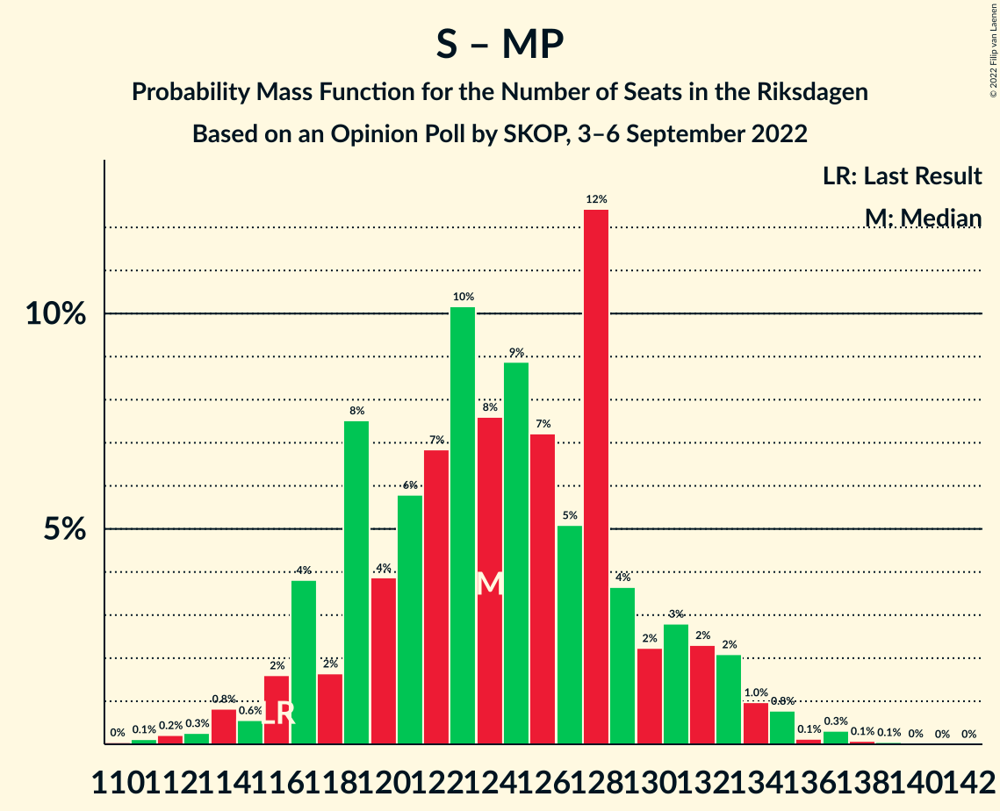

| Number of Seats | Probability | Accumulated | Special Marks |
|:---------------:|:-----------:|:-----------:|:-------------:|
| 110 | 0% | 100% |  |
| 111 | 0.1% | 99.9% |  |
| 112 | 0.2% | 99.8% |  |
| 113 | 0.3% | 99.6% |  |
| 114 | 0.8% | 99.3% |  |
| 115 | 0.6% | 98.5% |  |
| 116 | 2% | 98% | Last Result |
| 117 | 4% | 96% |  |
| 118 | 2% | 93% |  |
| 119 | 8% | 91% |  |
| 120 | 4% | 83% |  |
| 121 | 6% | 79% |  |
| 122 | 7% | 74% |  |
| 123 | 10% | 67% |  |
| 124 | 8% | 57% | Median |
| 125 | 9% | 49% |  |
| 126 | 7% | 40% |  |
| 127 | 5% | 33% |  |
| 128 | 12% | 28% |  |
| 129 | 4% | 15% |  |
| 130 | 2% | 12% |  |
| 131 | 3% | 10% |  |
| 132 | 2% | 7% |  |
| 133 | 2% | 4% |  |
| 134 | 1.0% | 2% |  |
| 135 | 0.8% | 1.4% |  |
| 136 | 0.1% | 0.6% |  |
| 137 | 0.3% | 0.5% |  |
| 138 | 0.1% | 0.2% |  |
| 139 | 0.1% | 0.1% |  |
| 140 | 0% | 0.1% |  |
| 141 | 0% | 0% |  |

### Moderata samlingspartiet – Centerpartiet – Kristdemokraterna

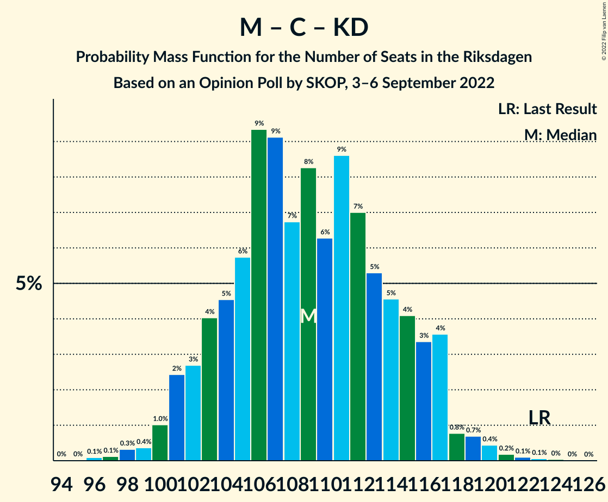

| Number of Seats | Probability | Accumulated | Special Marks |
|:---------------:|:-----------:|:-----------:|:-------------:|
| 95 | 0% | 100% |  |
| 96 | 0.1% | 99.9% |  |
| 97 | 0.1% | 99.9% |  |
| 98 | 0.3% | 99.7% |  |
| 99 | 0.4% | 99.4% |  |
| 100 | 1.0% | 99.0% |  |
| 101 | 2% | 98% |  |
| 102 | 3% | 96% |  |
| 103 | 4% | 93% |  |
| 104 | 5% | 89% |  |
| 105 | 6% | 84% |  |
| 106 | 9% | 79% |  |
| 107 | 9% | 69% |  |
| 108 | 7% | 60% |  |
| 109 | 8% | 53% | Median |
| 110 | 6% | 45% |  |
| 111 | 9% | 39% |  |
| 112 | 7% | 30% |  |
| 113 | 5% | 23% |  |
| 114 | 5% | 18% |  |
| 115 | 4% | 13% |  |
| 116 | 3% | 9% |  |
| 117 | 4% | 6% |  |
| 118 | 0.8% | 2% |  |
| 119 | 0.7% | 2% |  |
| 120 | 0.4% | 0.9% |  |
| 121 | 0.2% | 0.4% |  |
| 122 | 0.1% | 0.2% |  |
| 123 | 0.1% | 0.1% | Last Result |
| 124 | 0% | 0.1% |  |
| 125 | 0% | 0% |  |

### Moderata samlingspartiet – Centerpartiet – Liberalerna

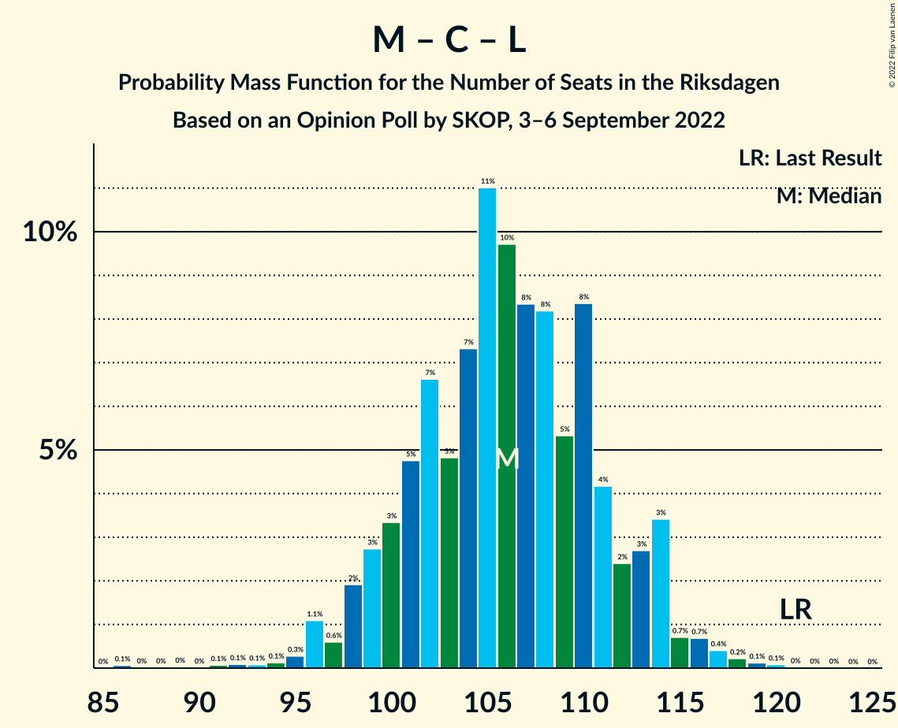

| Number of Seats | Probability | Accumulated | Special Marks |
|:---------------:|:-----------:|:-----------:|:-------------:|
| 86 | 0.1% | 100% |  |
| 87 | 0% | 99.9% |  |
| 88 | 0% | 99.9% |  |
| 89 | 0% | 99.9% |  |
| 90 | 0% | 99.9% |  |
| 91 | 0.1% | 99.8% |  |
| 92 | 0.1% | 99.8% |  |
| 93 | 0.1% | 99.7% |  |
| 94 | 0.1% | 99.6% |  |
| 95 | 0.3% | 99.5% |  |
| 96 | 1.1% | 99.2% |  |
| 97 | 0.6% | 98% |  |
| 98 | 2% | 97% |  |
| 99 | 3% | 96% |  |
| 100 | 3% | 93% |  |
| 101 | 5% | 89% |  |
| 102 | 7% | 85% |  |
| 103 | 5% | 78% |  |
| 104 | 7% | 73% |  |
| 105 | 11% | 66% |  |
| 106 | 10% | 55% | Median |
| 107 | 8% | 45% |  |
| 108 | 8% | 37% |  |
| 109 | 5% | 29% |  |
| 110 | 8% | 23% |  |
| 111 | 4% | 15% |  |
| 112 | 2% | 11% |  |
| 113 | 3% | 8% |  |
| 114 | 3% | 6% |  |
| 115 | 0.7% | 2% |  |
| 116 | 0.7% | 2% |  |
| 117 | 0.4% | 0.9% |  |
| 118 | 0.2% | 0.5% |  |
| 119 | 0.1% | 0.3% |  |
| 120 | 0.1% | 0.1% |  |
| 121 | 0% | 0% | Last Result |

### Moderata samlingspartiet – Kristdemokraterna – Liberalerna

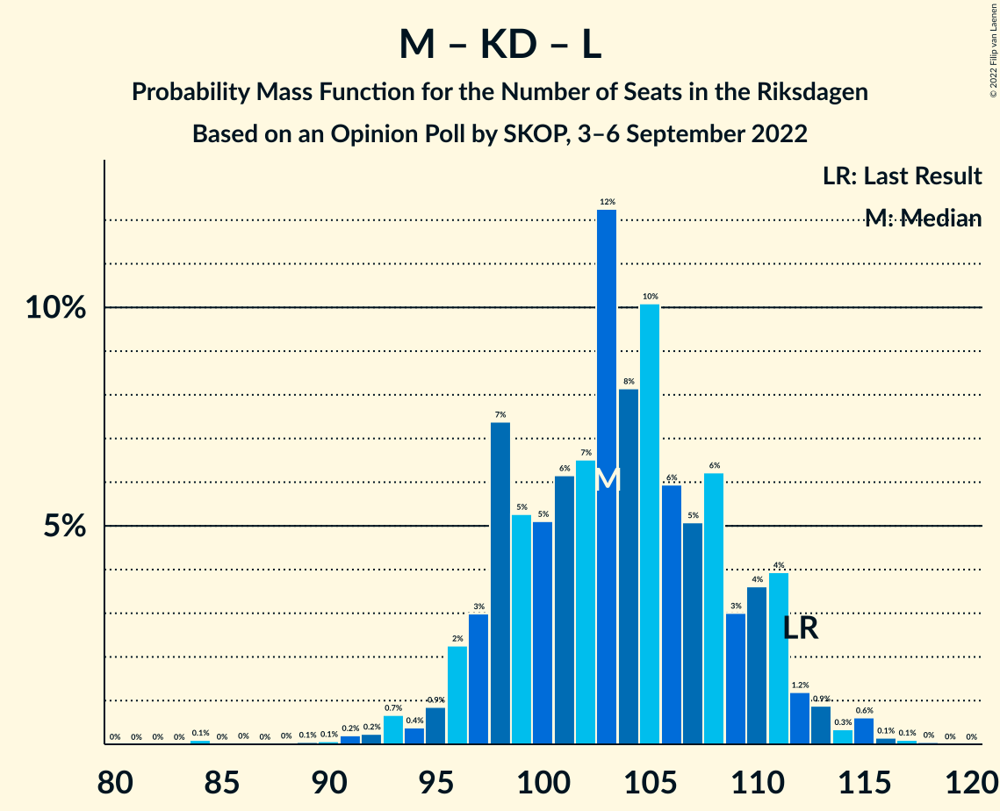

| Number of Seats | Probability | Accumulated | Special Marks |
|:---------------:|:-----------:|:-----------:|:-------------:|
| 84 | 0.1% | 100% |  |
| 85 | 0% | 99.9% |  |
| 86 | 0% | 99.9% |  |
| 87 | 0% | 99.8% |  |
| 88 | 0% | 99.8% |  |
| 89 | 0.1% | 99.8% |  |
| 90 | 0.1% | 99.7% |  |
| 91 | 0.2% | 99.7% |  |
| 92 | 0.2% | 99.5% |  |
| 93 | 0.7% | 99.2% |  |
| 94 | 0.4% | 98.6% |  |
| 95 | 0.9% | 98% |  |
| 96 | 2% | 97% |  |
| 97 | 3% | 95% |  |
| 98 | 7% | 92% |  |
| 99 | 5% | 85% |  |
| 100 | 5% | 79% |  |
| 101 | 6% | 74% |  |
| 102 | 7% | 68% |  |
| 103 | 12% | 62% | Median |
| 104 | 8% | 49% |  |
| 105 | 10% | 41% |  |
| 106 | 6% | 31% |  |
| 107 | 5% | 25% |  |
| 108 | 6% | 20% |  |
| 109 | 3% | 14% |  |
| 110 | 4% | 11% |  |
| 111 | 4% | 7% |  |
| 112 | 1.2% | 3% | Last Result |
| 113 | 0.9% | 2% |  |
| 114 | 0.3% | 1.3% |  |
| 115 | 0.6% | 0.9% |  |
| 116 | 0.1% | 0.3% |  |
| 117 | 0.1% | 0.2% |  |
| 118 | 0% | 0.1% |  |
| 119 | 0% | 0% |  |

### Sveriges socialdemokratiska arbetareparti

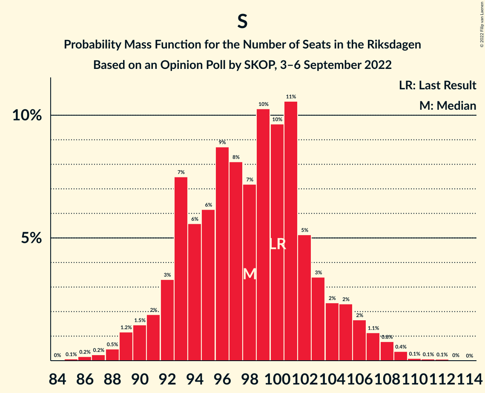

| Number of Seats | Probability | Accumulated | Special Marks |
|:---------------:|:-----------:|:-----------:|:-------------:|
| 84 | 0% | 100% |  |
| 85 | 0.1% | 99.9% |  |
| 86 | 0.2% | 99.9% |  |
| 87 | 0.2% | 99.7% |  |
| 88 | 0.5% | 99.5% |  |
| 89 | 1.2% | 99.0% |  |
| 90 | 1.5% | 98% |  |
| 91 | 2% | 96% |  |
| 92 | 3% | 94% |  |
| 93 | 7% | 91% |  |
| 94 | 6% | 84% |  |
| 95 | 6% | 78% |  |
| 96 | 9% | 72% |  |
| 97 | 8% | 63% |  |
| 98 | 7% | 55% | Median |
| 99 | 10% | 48% |  |
| 100 | 10% | 38% | Last Result |
| 101 | 11% | 28% |  |
| 102 | 5% | 17% |  |
| 103 | 3% | 12% |  |
| 104 | 2% | 9% |  |
| 105 | 2% | 7% |  |
| 106 | 2% | 4% |  |
| 107 | 1.1% | 3% |  |
| 108 | 0.8% | 1.4% |  |
| 109 | 0.4% | 0.7% |  |
| 110 | 0.1% | 0.3% |  |
| 111 | 0.1% | 0.2% |  |
| 112 | 0.1% | 0.1% |  |
| 113 | 0% | 0.1% |  |
| 114 | 0% | 0% |  |

### Moderata samlingspartiet – Centerpartiet

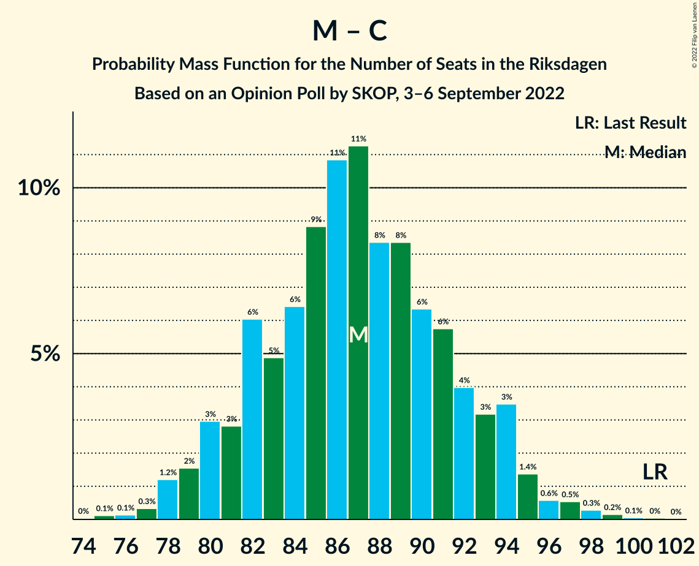

| Number of Seats | Probability | Accumulated | Special Marks |
|:---------------:|:-----------:|:-----------:|:-------------:|
| 74 | 0% | 100% |  |
| 75 | 0.1% | 99.9% |  |
| 76 | 0.1% | 99.8% |  |
| 77 | 0.3% | 99.7% |  |
| 78 | 1.2% | 99.3% |  |
| 79 | 2% | 98% |  |
| 80 | 3% | 97% |  |
| 81 | 3% | 94% |  |
| 82 | 6% | 91% |  |
| 83 | 5% | 85% |  |
| 84 | 6% | 80% |  |
| 85 | 9% | 73% |  |
| 86 | 11% | 65% |  |
| 87 | 11% | 54% | Median |
| 88 | 8% | 43% |  |
| 89 | 8% | 34% |  |
| 90 | 6% | 26% |  |
| 91 | 6% | 19% |  |
| 92 | 4% | 14% |  |
| 93 | 3% | 10% |  |
| 94 | 3% | 7% |  |
| 95 | 1.4% | 3% |  |
| 96 | 0.6% | 2% |  |
| 97 | 0.5% | 1.1% |  |
| 98 | 0.3% | 0.6% |  |
| 99 | 0.2% | 0.3% |  |
| 100 | 0.1% | 0.1% |  |
| 101 | 0% | 0.1% | Last Result |
| 102 | 0% | 0% |  |

### Moderata samlingspartiet – Kristdemokraterna

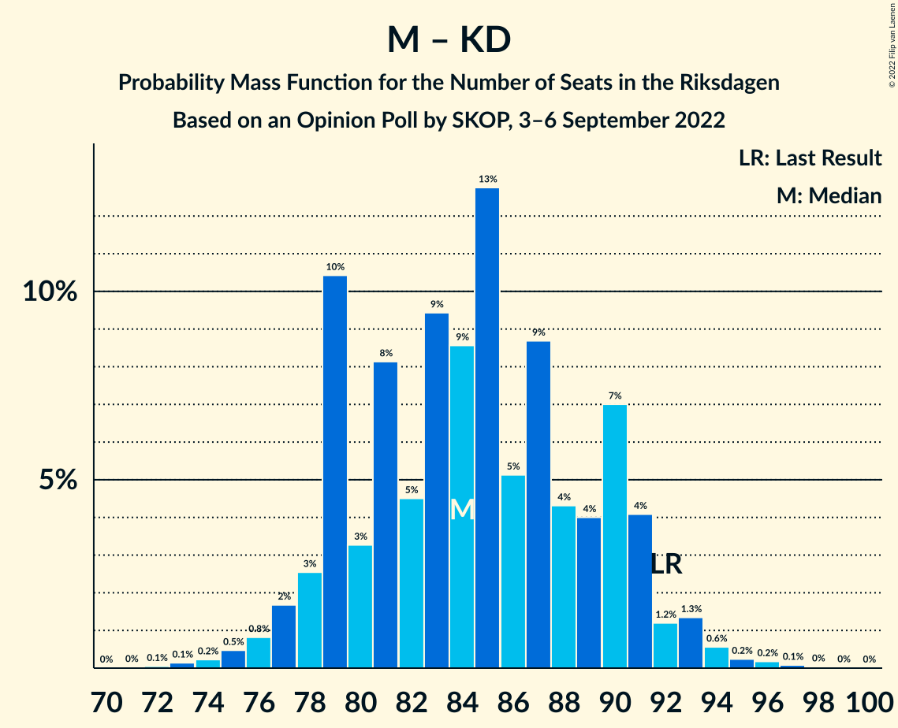

| Number of Seats | Probability | Accumulated | Special Marks |
|:---------------:|:-----------:|:-----------:|:-------------:|
| 72 | 0.1% | 100% |  |
| 73 | 0.1% | 99.9% |  |
| 74 | 0.2% | 99.8% |  |
| 75 | 0.5% | 99.5% |  |
| 76 | 0.8% | 99.1% |  |
| 77 | 2% | 98% |  |
| 78 | 3% | 97% |  |
| 79 | 10% | 94% |  |
| 80 | 3% | 84% |  |
| 81 | 8% | 80% |  |
| 82 | 5% | 72% |  |
| 83 | 9% | 68% |  |
| 84 | 9% | 58% | Median |
| 85 | 13% | 50% |  |
| 86 | 5% | 37% |  |
| 87 | 9% | 32% |  |
| 88 | 4% | 23% |  |
| 89 | 4% | 19% |  |
| 90 | 7% | 15% |  |
| 91 | 4% | 8% |  |
| 92 | 1.2% | 4% | Last Result |
| 93 | 1.3% | 2% |  |
| 94 | 0.6% | 1.1% |  |
| 95 | 0.2% | 0.6% |  |
| 96 | 0.2% | 0.3% |  |
| 97 | 0.1% | 0.2% |  |
| 98 | 0% | 0.1% |  |
| 99 | 0% | 0% |  |

## Technical Information

### Opinion Poll

+ **Polling firm:** SKOP
+ **Commissioner(s):** —
+ **Fieldwork period:** 3–6 September 2022

### Calculations

+ **Sample size:** 1406
+ **Simulations done:** 1,048,576
+ **Error estimate:** 1.91%

