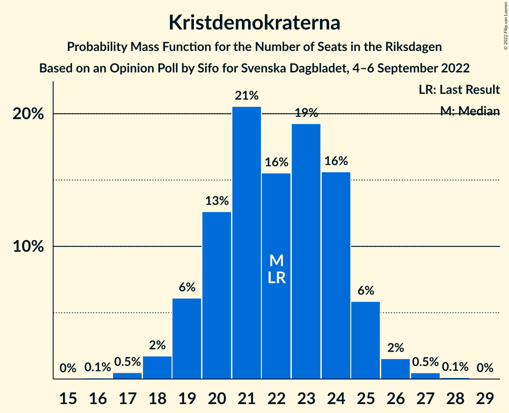
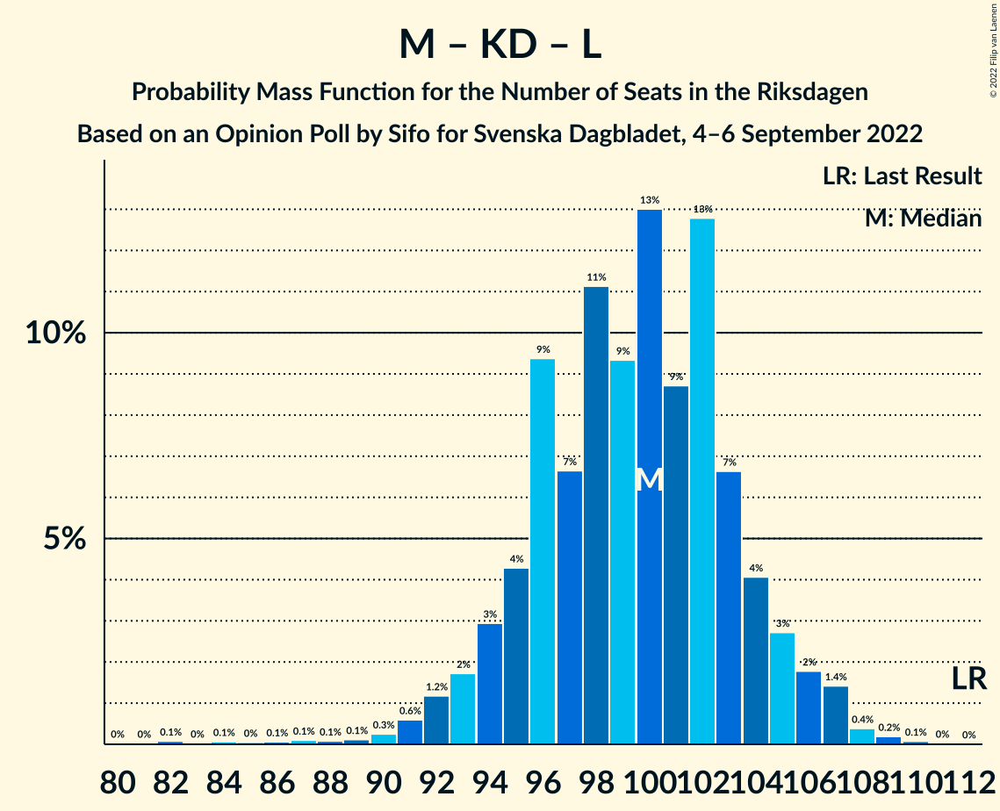

# Opinion Poll by Sifo for Svenska Dagbladet, 4–6 September 2022

<a href="#voting-intentions">Voting Intentions</a> | <a href="#seats">Seats</a> | <a href="#coalitions">Coalitions</a> | <a href="#technical-information">Technical Information</a>

## Voting Intentions

### Confidence Intervals

| Party | Last Result | Poll Result | 80% Confidence Interval | 90% Confidence Interval | 95% Confidence Interval | 99% Confidence Interval |
|:-----:|:-----------:|:-----------:|:-----------------------:|:-----------------------:|:-----------------------:|:-----------------------:|
| Sveriges socialdemokratiska arbetareparti | 28.3% | 30.1% | 28.9–31.4% |28.6–31.8% |28.3–32.1% |27.7–32.7% |
| Sverigedemokraterna | 17.5% | 21.0% | 20.0–22.2% |19.6–22.5% |19.4–22.8% |18.9–23.3% |
| Moderata samlingspartiet | 19.8% | 17.0% | 16.0–18.1% |15.7–18.4% |15.5–18.6% |15.0–19.1% |
| Centerpartiet | 8.6% | 7.1% | 6.4–7.8% |6.2–8.0% |6.1–8.2% |5.8–8.6% |
| Vänsterpartiet | 8.0% | 7.0% | 6.3–7.7% |6.2–8.0% |6.0–8.1% |5.7–8.5% |
| Kristdemokraterna | 6.3% | 6.2% | 5.6–6.9% |5.4–7.1% |5.3–7.3% |5.0–7.6% |
| Miljöpartiet de gröna | 4.4% | 5.8% | 5.2–6.5% |5.0–6.7% |4.9–6.8% |4.6–7.2% |
| Liberalerna | 5.5% | 5.0% | 4.5–5.7% |4.3–5.9% |4.2–6.0% |3.9–6.3% |

*Note:* The poll result column reflects the actual value used in the calculations. Published results may vary slightly, and in addition be rounded to fewer digits.

## Seats

### Confidence Intervals

| Party | Last Result | Median | 80% Confidence Interval | 90% Confidence Interval | 95% Confidence Interval | 99% Confidence Interval |
|:-----:|:-----------:|:------:|:-----------------------:|:-----------------------:|:-----------------------:|:-----------------------:|
| <a href="#sveriges-socialdemokratiska-arbetareparti">Sveriges socialdemokratiska arbetareparti</a> | 100 | 106 | 101–110 |100–111 |99–112 |97–115 |
| <a href="#sverigedemokraterna">Sverigedemokraterna</a> | 62 | 74 | 70–78 |69–79 |68–80 |66–82 |
| <a href="#moderata-samlingspartiet">Moderata samlingspartiet</a> | 70 | 60 | 56–63 |55–65 |54–66 |53–67 |
| <a href="#centerpartiet">Centerpartiet</a> | 31 | 25 | 22–27 |22–28 |21–29 |20–30 |
| <a href="#vänsterpartiet">Vänsterpartiet</a> | 28 | 24 | 22–27 |22–28 |21–28 |20–30 |
| <a href="#kristdemokraterna">Kristdemokraterna</a> | 22 | 22 | 20–24 |19–25 |19–25 |17–27 |
| <a href="#miljöpartiet-de-gröna">Miljöpartiet de gröna</a> | 16 | 20 | 18–23 |18–24 |17–24 |16–25 |
| <a href="#liberalerna">Liberalerna</a> | 20 | 18 | 16–20 |15–21 |15–21 |0–22 |

### Sveriges socialdemokratiska arbetareparti

*For a full overview of the results for this party, see the [Sveriges socialdemokratiska arbetareparti](party-sverigessocialdemokratiskaarbetareparti.html) page.*

| Number of Seats | Probability | Accumulated | Special Marks |
|:---------------:|:-----------:|:-----------:|:-------------:|
| 95 | 0.1% | 100% |  |
| 96 | 0.2% | 99.9% |  |
| 97 | 0.5% | 99.7% |  |
| 98 | 0.5% | 99.2% |  |
| 99 | 3% | 98.7% |  |
| 100 | 2% | 96% | Last Result |
| 101 | 5% | 94% |  |
| 102 | 9% | 88% |  |
| 103 | 4% | 79% |  |
| 104 | 13% | 75% |  |
| 105 | 12% | 62% |  |
| 106 | 8% | 50% | Median |
| 107 | 12% | 42% |  |
| 108 | 10% | 31% |  |
| 109 | 9% | 21% |  |
| 110 | 4% | 12% |  |
| 111 | 4% | 8% |  |
| 112 | 2% | 4% |  |
| 113 | 0.6% | 2% |  |
| 114 | 0.9% | 2% |  |
| 115 | 0.3% | 0.7% |  |
| 116 | 0.2% | 0.4% |  |
| 117 | 0.2% | 0.2% |  |
| 118 | 0% | 0% |  |

### Sverigedemokraterna

*For a full overview of the results for this party, see the [Sverigedemokraterna](party-sverigedemokraterna.html) page.*

| Number of Seats | Probability | Accumulated | Special Marks |
|:---------------:|:-----------:|:-----------:|:-------------:|
| 62 | 0% | 100% | Last Result |
| 63 | 0% | 100% |  |
| 64 | 0.1% | 100% |  |
| 65 | 0.1% | 99.9% |  |
| 66 | 0.3% | 99.8% |  |
| 67 | 1.2% | 99.5% |  |
| 68 | 2% | 98% |  |
| 69 | 4% | 96% |  |
| 70 | 5% | 92% |  |
| 71 | 9% | 87% |  |
| 72 | 9% | 78% |  |
| 73 | 15% | 69% |  |
| 74 | 17% | 54% | Median |
| 75 | 9% | 38% |  |
| 76 | 6% | 28% |  |
| 77 | 8% | 22% |  |
| 78 | 8% | 14% |  |
| 79 | 3% | 6% |  |
| 80 | 2% | 3% |  |
| 81 | 0.7% | 2% |  |
| 82 | 0.6% | 0.9% |  |
| 83 | 0.2% | 0.3% |  |
| 84 | 0.1% | 0.1% |  |
| 85 | 0% | 0% |  |

### Moderata samlingspartiet

*For a full overview of the results for this party, see the [Moderata samlingspartiet](party-moderatasamlingspartiet.html) page.*

| Number of Seats | Probability | Accumulated | Special Marks |
|:---------------:|:-----------:|:-----------:|:-------------:|
| 51 | 0.1% | 100% |  |
| 52 | 0.2% | 99.9% |  |
| 53 | 0.7% | 99.7% |  |
| 54 | 2% | 98.9% |  |
| 55 | 3% | 96% |  |
| 56 | 5% | 93% |  |
| 57 | 8% | 88% |  |
| 58 | 9% | 80% |  |
| 59 | 17% | 70% |  |
| 60 | 19% | 53% | Median |
| 61 | 11% | 34% |  |
| 62 | 8% | 22% |  |
| 63 | 5% | 14% |  |
| 64 | 3% | 9% |  |
| 65 | 3% | 6% |  |
| 66 | 2% | 3% |  |
| 67 | 0.6% | 1.0% |  |
| 68 | 0.2% | 0.3% |  |
| 69 | 0.1% | 0.1% |  |
| 70 | 0% | 0% | Last Result |

### Centerpartiet

*For a full overview of the results for this party, see the [Centerpartiet](party-centerpartiet.html) page.*

| Number of Seats | Probability | Accumulated | Special Marks |
|:---------------:|:-----------:|:-----------:|:-------------:|
| 19 | 0.1% | 100% |  |
| 20 | 0.5% | 99.9% |  |
| 21 | 2% | 99.4% |  |
| 22 | 7% | 97% |  |
| 23 | 12% | 90% |  |
| 24 | 22% | 78% |  |
| 25 | 19% | 56% | Median |
| 26 | 17% | 36% |  |
| 27 | 10% | 19% |  |
| 28 | 6% | 9% |  |
| 29 | 2% | 3% |  |
| 30 | 1.0% | 1.3% |  |
| 31 | 0.2% | 0.3% | Last Result |
| 32 | 0.1% | 0.1% |  |
| 33 | 0% | 0% |  |

### Vänsterpartiet

*For a full overview of the results for this party, see the [Vänsterpartiet](party-vänsterpartiet.html) page.*

| Number of Seats | Probability | Accumulated | Special Marks |
|:---------------:|:-----------:|:-----------:|:-------------:|
| 19 | 0.2% | 100% |  |
| 20 | 0.9% | 99.8% |  |
| 21 | 3% | 98.9% |  |
| 22 | 8% | 95% |  |
| 23 | 12% | 88% |  |
| 24 | 26% | 75% | Median |
| 25 | 18% | 49% |  |
| 26 | 17% | 32% |  |
| 27 | 7% | 15% |  |
| 28 | 6% | 8% | Last Result |
| 29 | 2% | 2% |  |
| 30 | 0.5% | 0.7% |  |
| 31 | 0.2% | 0.2% |  |
| 32 | 0% | 0% |  |

### Kristdemokraterna

*For a full overview of the results for this party, see the [Kristdemokraterna](party-kristdemokraterna.html) page.*

| Number of Seats | Probability | Accumulated | Special Marks |
|:---------------:|:-----------:|:-----------:|:-------------:|
| 16 | 0.1% | 100% |  |
| 17 | 0.5% | 99.9% |  |
| 18 | 2% | 99.4% |  |
| 19 | 6% | 98% |  |
| 20 | 13% | 92% |  |
| 21 | 21% | 79% |  |
| 22 | 16% | 58% | Last Result, Median |
| 23 | 19% | 43% |  |
| 24 | 16% | 24% |  |
| 25 | 6% | 8% |  |
| 26 | 2% | 2% |  |
| 27 | 0.5% | 0.6% |  |
| 28 | 0.1% | 0.1% |  |
| 29 | 0% | 0% |  |

### Miljöpartiet de gröna

*For a full overview of the results for this party, see the [Miljöpartiet de gröna](party-miljöpartietdegröna.html) page.*

| Number of Seats | Probability | Accumulated | Special Marks |
|:---------------:|:-----------:|:-----------:|:-------------:|
| 15 | 0.1% | 100% |  |
| 16 | 0.7% | 99.9% | Last Result |
| 17 | 2% | 99.2% |  |
| 18 | 12% | 97% |  |
| 19 | 13% | 85% |  |
| 20 | 30% | 72% | Median |
| 21 | 12% | 43% |  |
| 22 | 20% | 31% |  |
| 23 | 4% | 11% |  |
| 24 | 6% | 7% |  |
| 25 | 1.0% | 1.3% |  |
| 26 | 0.3% | 0.3% |  |
| 27 | 0% | 0% |  |

### Liberalerna

*For a full overview of the results for this party, see the [Liberalerna](party-liberalerna.html) page.*

| Number of Seats | Probability | Accumulated | Special Marks |
|:---------------:|:-----------:|:-----------:|:-------------:|
| 0 | 0.7% | 100% |  |
| 1 | 0% | 99.3% |  |
| 2 | 0% | 99.3% |  |
| 3 | 0% | 99.3% |  |
| 4 | 0% | 99.3% |  |
| 5 | 0% | 99.3% |  |
| 6 | 0% | 99.3% |  |
| 7 | 0% | 99.3% |  |
| 8 | 0% | 99.3% |  |
| 9 | 0% | 99.3% |  |
| 10 | 0% | 99.3% |  |
| 11 | 0% | 99.3% |  |
| 12 | 0% | 99.3% |  |
| 13 | 0% | 99.3% |  |
| 14 | 1.1% | 99.3% |  |
| 15 | 5% | 98% |  |
| 16 | 15% | 93% |  |
| 17 | 20% | 78% |  |
| 18 | 26% | 58% | Median |
| 19 | 17% | 32% |  |
| 20 | 9% | 15% | Last Result |
| 21 | 4% | 6% |  |
| 22 | 1.0% | 1.3% |  |
| 23 | 0.3% | 0.3% |  |
| 24 | 0% | 0.1% |  |
| 25 | 0% | 0% |  |

## Coalitions

### Confidence Intervals

| Coalition | Last Result | Median | Majority? | 80% Confidence Interval | 90% Confidence Interval | 95% Confidence Interval | 99% Confidence Interval |
|:---------:|:-----------:|:------:|:---------:|:-----------------------:|:-----------------------:|:-----------------------:|:-----------------------:|
| Sveriges socialdemokratiska arbetareparti – Centerpartiet – Vänsterpartiet – Miljöpartiet de gröna – Liberalerna | 195 | 193 | 100% | 189–198 | 188–200 | 186–201 | 183–203 |
| Sveriges socialdemokratiska arbetareparti – Moderata samlingspartiet – Centerpartiet | 201 | 190 | 100% | 186–195 | 184–197 | 183–198 | 181–201 |
| Sveriges socialdemokratiska arbetareparti – Centerpartiet – Vänsterpartiet – Miljöpartiet de gröna | 175 | 176 | 60% | 171–181 | 170–182 | 168–184 | 167–187 |
| Sverigedemokraterna – Moderata samlingspartiet – Kristdemokraterna – Liberalerna | 174 | 173 | 40% | 168–178 | 167–179 | 165–181 | 162–182 |
| Sveriges socialdemokratiska arbetareparti – Centerpartiet – Miljöpartiet de gröna – Liberalerna | 167 | 169 | 6% | 164–174 | 163–175 | 161–176 | 158–179 |
| Sveriges socialdemokratiska arbetareparti – Moderata samlingspartiet | 170 | 165 | 1.0% | 161–170 | 159–172 | 158–173 | 156–176 |
| Sverigedemokraterna – Moderata samlingspartiet – Kristdemokraterna | 154 | 156 | 0% | 151–160 | 149–161 | 148–163 | 146–166 |
| Sveriges socialdemokratiska arbetareparti – Centerpartiet – Miljöpartiet de gröna | 147 | 151 | 0% | 146–156 | 145–157 | 144–159 | 142–162 |
| Sveriges socialdemokratiska arbetareparti – Vänsterpartiet – Miljöpartiet de gröna | 144 | 151 | 0% | 146–155 | 145–157 | 144–158 | 141–161 |
| Sverigedemokraterna – Moderata samlingspartiet | 132 | 133 | 0% | 129–138 | 128–140 | 127–141 | 124–144 |
| Sveriges socialdemokratiska arbetareparti – Vänsterpartiet | 128 | 130 | 0% | 126–135 | 125–136 | 124–137 | 121–140 |
| Sveriges socialdemokratiska arbetareparti – Miljöpartiet de gröna | 116 | 126 | 0% | 122–131 | 120–132 | 119–133 | 117–136 |
| Moderata samlingspartiet – Centerpartiet – Kristdemokraterna – Liberalerna | 143 | 124 | 0% | 120–129 | 119–131 | 117–132 | 114–133 |
| Moderata samlingspartiet – Centerpartiet – Kristdemokraterna | 123 | 107 | 0% | 102–111 | 101–112 | 100–114 | 98–116 |
| Sveriges socialdemokratiska arbetareparti | 100 | 106 | 0% | 101–110 | 100–111 | 99–112 | 97–115 |
| Moderata samlingspartiet – Centerpartiet – Liberalerna | 121 | 102 | 0% | 98–107 | 97–109 | 96–110 | 92–111 |
| Moderata samlingspartiet – Kristdemokraterna – Liberalerna | 112 | 100 | 0% | 95–104 | 94–105 | 92–106 | 88–108 |
| Moderata samlingspartiet – Centerpartiet | 101 | 85 | 0% | 80–89 | 80–90 | 79–91 | 77–93 |
| Moderata samlingspartiet – Kristdemokraterna | 92 | 82 | 0% | 77–86 | 76–87 | 75–88 | 74–90 |

### Sveriges socialdemokratiska arbetareparti – Centerpartiet – Vänsterpartiet – Miljöpartiet de gröna – Liberalerna

| Number of Seats | Probability | Accumulated | Special Marks |
|:---------------:|:-----------:|:-----------:|:-------------:|
| 180 | 0.1% | 100% |  |
| 181 | 0.1% | 99.9% |  |
| 182 | 0.3% | 99.8% |  |
| 183 | 0.2% | 99.6% |  |
| 184 | 0.4% | 99.4% |  |
| 185 | 1.1% | 99.0% |  |
| 186 | 1.4% | 98% |  |
| 187 | 1.2% | 97% |  |
| 188 | 5% | 95% |  |
| 189 | 6% | 90% |  |
| 190 | 5% | 84% |  |
| 191 | 8% | 80% |  |
| 192 | 13% | 72% |  |
| 193 | 12% | 59% | Median |
| 194 | 6% | 46% |  |
| 195 | 14% | 40% | Last Result |
| 196 | 6% | 26% |  |
| 197 | 6% | 20% |  |
| 198 | 6% | 14% |  |
| 199 | 3% | 8% |  |
| 200 | 2% | 5% |  |
| 201 | 1.2% | 3% |  |
| 202 | 0.9% | 2% |  |
| 203 | 0.5% | 0.8% |  |
| 204 | 0.2% | 0.3% |  |
| 205 | 0.1% | 0.2% |  |
| 206 | 0% | 0.1% |  |
| 207 | 0% | 0% |  |

### Sveriges socialdemokratiska arbetareparti – Moderata samlingspartiet – Centerpartiet

| Number of Seats | Probability | Accumulated | Special Marks |
|:---------------:|:-----------:|:-----------:|:-------------:|
| 178 | 0% | 100% |  |
| 179 | 0.1% | 99.9% |  |
| 180 | 0.1% | 99.8% |  |
| 181 | 0.4% | 99.7% |  |
| 182 | 2% | 99.3% |  |
| 183 | 2% | 98% |  |
| 184 | 3% | 96% |  |
| 185 | 3% | 93% |  |
| 186 | 4% | 91% |  |
| 187 | 9% | 87% |  |
| 188 | 14% | 78% |  |
| 189 | 9% | 64% |  |
| 190 | 10% | 55% |  |
| 191 | 7% | 45% | Median |
| 192 | 10% | 37% |  |
| 193 | 9% | 27% |  |
| 194 | 6% | 18% |  |
| 195 | 3% | 12% |  |
| 196 | 2% | 9% |  |
| 197 | 4% | 7% |  |
| 198 | 2% | 4% |  |
| 199 | 1.1% | 2% |  |
| 200 | 0.4% | 1.0% |  |
| 201 | 0.2% | 0.7% | Last Result |
| 202 | 0.1% | 0.4% |  |
| 203 | 0.1% | 0.3% |  |
| 204 | 0.1% | 0.2% |  |
| 205 | 0% | 0.1% |  |
| 206 | 0% | 0.1% |  |
| 207 | 0% | 0% |  |

### Sveriges socialdemokratiska arbetareparti – Centerpartiet – Vänsterpartiet – Miljöpartiet de gröna

| Number of Seats | Probability | Accumulated | Special Marks |
|:---------------:|:-----------:|:-----------:|:-------------:|
| 164 | 0.1% | 100% |  |
| 165 | 0.2% | 99.9% |  |
| 166 | 0.1% | 99.7% |  |
| 167 | 1.2% | 99.6% |  |
| 168 | 1.5% | 98% |  |
| 169 | 0.8% | 97% |  |
| 170 | 4% | 96% |  |
| 171 | 6% | 92% |  |
| 172 | 6% | 86% |  |
| 173 | 8% | 80% |  |
| 174 | 12% | 72% |  |
| 175 | 9% | 60% | Last Result, Median, Majority |
| 176 | 15% | 51% |  |
| 177 | 5% | 36% |  |
| 178 | 7% | 31% |  |
| 179 | 10% | 24% |  |
| 180 | 5% | 15% |  |
| 181 | 4% | 10% |  |
| 182 | 3% | 7% |  |
| 183 | 1.1% | 4% |  |
| 184 | 1.0% | 3% |  |
| 185 | 0.8% | 2% |  |
| 186 | 0.2% | 0.8% |  |
| 187 | 0.2% | 0.5% |  |
| 188 | 0.1% | 0.3% |  |
| 189 | 0.1% | 0.2% |  |
| 190 | 0.1% | 0.2% |  |
| 191 | 0% | 0.1% |  |
| 192 | 0% | 0% |  |

### Sverigedemokraterna – Moderata samlingspartiet – Kristdemokraterna – Liberalerna

| Number of Seats | Probability | Accumulated | Special Marks |
|:---------------:|:-----------:|:-----------:|:-------------:|
| 158 | 0% | 100% |  |
| 159 | 0.1% | 99.9% |  |
| 160 | 0.1% | 99.8% |  |
| 161 | 0.1% | 99.8% |  |
| 162 | 0.2% | 99.7% |  |
| 163 | 0.2% | 99.5% |  |
| 164 | 0.8% | 99.2% |  |
| 165 | 1.0% | 98% |  |
| 166 | 1.1% | 97% |  |
| 167 | 3% | 96% |  |
| 168 | 4% | 93% |  |
| 169 | 5% | 90% |  |
| 170 | 10% | 85% |  |
| 171 | 7% | 76% |  |
| 172 | 5% | 69% |  |
| 173 | 15% | 64% |  |
| 174 | 9% | 49% | Last Result, Median |
| 175 | 12% | 40% | Majority |
| 176 | 8% | 28% |  |
| 177 | 6% | 20% |  |
| 178 | 6% | 14% |  |
| 179 | 4% | 8% |  |
| 180 | 0.8% | 4% |  |
| 181 | 1.5% | 3% |  |
| 182 | 1.2% | 2% |  |
| 183 | 0.1% | 0.4% |  |
| 184 | 0.2% | 0.3% |  |
| 185 | 0.1% | 0.1% |  |
| 186 | 0% | 0% |  |

### Sveriges socialdemokratiska arbetareparti – Centerpartiet – Miljöpartiet de gröna – Liberalerna

| Number of Seats | Probability | Accumulated | Special Marks |
|:---------------:|:-----------:|:-----------:|:-------------:|
| 153 | 0.1% | 100% |  |
| 154 | 0% | 99.9% |  |
| 155 | 0.1% | 99.9% |  |
| 156 | 0% | 99.8% |  |
| 157 | 0.2% | 99.8% |  |
| 158 | 0.2% | 99.6% |  |
| 159 | 0.4% | 99.4% |  |
| 160 | 0.5% | 99.0% |  |
| 161 | 1.1% | 98.5% |  |
| 162 | 2% | 97% |  |
| 163 | 4% | 96% |  |
| 164 | 6% | 92% |  |
| 165 | 5% | 86% |  |
| 166 | 7% | 81% |  |
| 167 | 10% | 74% | Last Result |
| 168 | 8% | 63% |  |
| 169 | 12% | 55% | Median |
| 170 | 15% | 42% |  |
| 171 | 4% | 27% |  |
| 172 | 7% | 24% |  |
| 173 | 7% | 17% |  |
| 174 | 4% | 10% |  |
| 175 | 3% | 6% | Majority |
| 176 | 1.4% | 4% |  |
| 177 | 1.3% | 2% |  |
| 178 | 0.2% | 1.0% |  |
| 179 | 0.5% | 0.7% |  |
| 180 | 0.2% | 0.3% |  |
| 181 | 0.1% | 0.1% |  |
| 182 | 0% | 0% |  |

### Sveriges socialdemokratiska arbetareparti – Moderata samlingspartiet

| Number of Seats | Probability | Accumulated | Special Marks |
|:---------------:|:-----------:|:-----------:|:-------------:|
| 153 | 0.1% | 100% |  |
| 154 | 0.1% | 99.9% |  |
| 155 | 0.2% | 99.8% |  |
| 156 | 0.6% | 99.7% |  |
| 157 | 0.7% | 99.1% |  |
| 158 | 1.0% | 98% |  |
| 159 | 4% | 97% |  |
| 160 | 3% | 93% |  |
| 161 | 3% | 90% |  |
| 162 | 9% | 87% |  |
| 163 | 9% | 77% |  |
| 164 | 7% | 68% |  |
| 165 | 17% | 61% |  |
| 166 | 8% | 44% | Median |
| 167 | 10% | 37% |  |
| 168 | 11% | 27% |  |
| 169 | 2% | 16% |  |
| 170 | 5% | 14% | Last Result |
| 171 | 3% | 9% |  |
| 172 | 2% | 6% |  |
| 173 | 2% | 4% |  |
| 174 | 1.2% | 2% |  |
| 175 | 0.4% | 1.0% | Majority |
| 176 | 0.2% | 0.6% |  |
| 177 | 0.2% | 0.4% |  |
| 178 | 0.1% | 0.2% |  |
| 179 | 0.1% | 0.1% |  |
| 180 | 0% | 0.1% |  |
| 181 | 0% | 0% |  |

### Sverigedemokraterna – Moderata samlingspartiet – Kristdemokraterna

| Number of Seats | Probability | Accumulated | Special Marks |
|:---------------:|:-----------:|:-----------:|:-------------:|
| 143 | 0% | 100% |  |
| 144 | 0.1% | 99.9% |  |
| 145 | 0.2% | 99.8% |  |
| 146 | 0.5% | 99.7% |  |
| 147 | 0.9% | 99.2% |  |
| 148 | 1.2% | 98% |  |
| 149 | 2% | 97% |  |
| 150 | 3% | 95% |  |
| 151 | 6% | 92% |  |
| 152 | 6% | 86% |  |
| 153 | 6% | 80% |  |
| 154 | 14% | 74% | Last Result |
| 155 | 6% | 60% |  |
| 156 | 12% | 54% | Median |
| 157 | 13% | 41% |  |
| 158 | 8% | 28% |  |
| 159 | 5% | 20% |  |
| 160 | 6% | 16% |  |
| 161 | 5% | 10% |  |
| 162 | 1.2% | 5% |  |
| 163 | 1.4% | 3% |  |
| 164 | 1.1% | 2% |  |
| 165 | 0.4% | 1.0% |  |
| 166 | 0.2% | 0.6% |  |
| 167 | 0.3% | 0.4% |  |
| 168 | 0.1% | 0.2% |  |
| 169 | 0.1% | 0.1% |  |
| 170 | 0% | 0% |  |

### Sveriges socialdemokratiska arbetareparti – Centerpartiet – Miljöpartiet de gröna

| Number of Seats | Probability | Accumulated | Special Marks |
|:---------------:|:-----------:|:-----------:|:-------------:|
| 139 | 0% | 100% |  |
| 140 | 0.2% | 99.9% |  |
| 141 | 0.2% | 99.8% |  |
| 142 | 0.5% | 99.6% |  |
| 143 | 0.6% | 99.1% |  |
| 144 | 2% | 98% |  |
| 145 | 3% | 96% |  |
| 146 | 5% | 93% |  |
| 147 | 7% | 89% | Last Result |
| 148 | 6% | 81% |  |
| 149 | 8% | 75% |  |
| 150 | 13% | 67% |  |
| 151 | 11% | 55% | Median |
| 152 | 10% | 44% |  |
| 153 | 11% | 34% |  |
| 154 | 7% | 23% |  |
| 155 | 4% | 16% |  |
| 156 | 5% | 12% |  |
| 157 | 2% | 7% |  |
| 158 | 2% | 5% |  |
| 159 | 2% | 3% |  |
| 160 | 0.3% | 1.3% |  |
| 161 | 0.4% | 1.0% |  |
| 162 | 0.3% | 0.6% |  |
| 163 | 0.1% | 0.3% |  |
| 164 | 0.1% | 0.2% |  |
| 165 | 0% | 0.1% |  |
| 166 | 0% | 0.1% |  |
| 167 | 0% | 0% |  |

### Sveriges socialdemokratiska arbetareparti – Vänsterpartiet – Miljöpartiet de gröna

| Number of Seats | Probability | Accumulated | Special Marks |
|:---------------:|:-----------:|:-----------:|:-------------:|
| 139 | 0% | 100% |  |
| 140 | 0.2% | 99.9% |  |
| 141 | 0.2% | 99.7% |  |
| 142 | 0.5% | 99.4% |  |
| 143 | 1.2% | 99.0% |  |
| 144 | 2% | 98% | Last Result |
| 145 | 3% | 96% |  |
| 146 | 7% | 93% |  |
| 147 | 5% | 86% |  |
| 148 | 8% | 81% |  |
| 149 | 11% | 72% |  |
| 150 | 11% | 62% | Median |
| 151 | 9% | 51% |  |
| 152 | 9% | 42% |  |
| 153 | 9% | 33% |  |
| 154 | 7% | 24% |  |
| 155 | 7% | 17% |  |
| 156 | 3% | 10% |  |
| 157 | 3% | 6% |  |
| 158 | 1.1% | 4% |  |
| 159 | 1.0% | 2% |  |
| 160 | 0.7% | 1.5% |  |
| 161 | 0.3% | 0.7% |  |
| 162 | 0.2% | 0.4% |  |
| 163 | 0.1% | 0.2% |  |
| 164 | 0% | 0.1% |  |
| 165 | 0.1% | 0.1% |  |
| 166 | 0% | 0% |  |

### Sverigedemokraterna – Moderata samlingspartiet

| Number of Seats | Probability | Accumulated | Special Marks |
|:---------------:|:-----------:|:-----------:|:-------------:|
| 121 | 0% | 100% |  |
| 122 | 0.1% | 99.9% |  |
| 123 | 0.1% | 99.9% |  |
| 124 | 0.5% | 99.8% |  |
| 125 | 0.6% | 99.2% |  |
| 126 | 0.7% | 98.6% |  |
| 127 | 3% | 98% |  |
| 128 | 3% | 95% |  |
| 129 | 5% | 92% |  |
| 130 | 7% | 88% |  |
| 131 | 11% | 81% |  |
| 132 | 5% | 70% | Last Result |
| 133 | 16% | 65% |  |
| 134 | 13% | 49% | Median |
| 135 | 7% | 37% |  |
| 136 | 6% | 29% |  |
| 137 | 11% | 23% |  |
| 138 | 4% | 12% |  |
| 139 | 2% | 8% |  |
| 140 | 3% | 6% |  |
| 141 | 2% | 3% |  |
| 142 | 0.8% | 2% |  |
| 143 | 0.5% | 1.1% |  |
| 144 | 0.3% | 0.6% |  |
| 145 | 0.1% | 0.2% |  |
| 146 | 0.1% | 0.1% |  |
| 147 | 0% | 0.1% |  |
| 148 | 0% | 0% |  |

### Sveriges socialdemokratiska arbetareparti – Vänsterpartiet

| Number of Seats | Probability | Accumulated | Special Marks |
|:---------------:|:-----------:|:-----------:|:-------------:|
| 119 | 0.1% | 100% |  |
| 120 | 0.2% | 99.9% |  |
| 121 | 0.3% | 99.7% |  |
| 122 | 0.6% | 99.4% |  |
| 123 | 1.2% | 98.8% |  |
| 124 | 2% | 98% |  |
| 125 | 3% | 95% |  |
| 126 | 6% | 92% |  |
| 127 | 8% | 86% |  |
| 128 | 11% | 78% | Last Result |
| 129 | 13% | 66% |  |
| 130 | 7% | 54% | Median |
| 131 | 11% | 47% |  |
| 132 | 9% | 36% |  |
| 133 | 6% | 27% |  |
| 134 | 6% | 21% |  |
| 135 | 7% | 15% |  |
| 136 | 3% | 8% |  |
| 137 | 2% | 4% |  |
| 138 | 0.7% | 2% |  |
| 139 | 0.6% | 2% |  |
| 140 | 0.5% | 1.0% |  |
| 141 | 0.3% | 0.5% |  |
| 142 | 0.1% | 0.2% |  |
| 143 | 0.1% | 0.1% |  |
| 144 | 0% | 0% |  |

### Sveriges socialdemokratiska arbetareparti – Miljöpartiet de gröna

| Number of Seats | Probability | Accumulated | Special Marks |
|:---------------:|:-----------:|:-----------:|:-------------:|
| 115 | 0.1% | 100% |  |
| 116 | 0.2% | 99.9% | Last Result |
| 117 | 0.5% | 99.7% |  |
| 118 | 0.5% | 99.2% |  |
| 119 | 2% | 98.7% |  |
| 120 | 3% | 96% |  |
| 121 | 3% | 94% |  |
| 122 | 7% | 90% |  |
| 123 | 8% | 83% |  |
| 124 | 8% | 75% |  |
| 125 | 10% | 67% |  |
| 126 | 13% | 57% | Median |
| 127 | 7% | 44% |  |
| 128 | 9% | 37% |  |
| 129 | 12% | 28% |  |
| 130 | 5% | 16% |  |
| 131 | 3% | 11% |  |
| 132 | 4% | 8% |  |
| 133 | 1.5% | 4% |  |
| 134 | 0.8% | 2% |  |
| 135 | 0.6% | 1.4% |  |
| 136 | 0.4% | 0.8% |  |
| 137 | 0.1% | 0.3% |  |
| 138 | 0.1% | 0.2% |  |
| 139 | 0.1% | 0.1% |  |
| 140 | 0% | 0% |  |

### Moderata samlingspartiet – Centerpartiet – Kristdemokraterna – Liberalerna

| Number of Seats | Probability | Accumulated | Special Marks |
|:---------------:|:-----------:|:-----------:|:-------------:|
| 107 | 0.1% | 100% |  |
| 108 | 0% | 99.9% |  |
| 109 | 0.1% | 99.9% |  |
| 110 | 0% | 99.8% |  |
| 111 | 0% | 99.7% |  |
| 112 | 0.1% | 99.7% |  |
| 113 | 0.1% | 99.6% |  |
| 114 | 0.3% | 99.5% |  |
| 115 | 0.7% | 99.2% |  |
| 116 | 0.7% | 98.5% |  |
| 117 | 1.3% | 98% |  |
| 118 | 1.3% | 97% |  |
| 119 | 2% | 95% |  |
| 120 | 9% | 94% |  |
| 121 | 7% | 85% |  |
| 122 | 11% | 77% |  |
| 123 | 6% | 66% |  |
| 124 | 12% | 60% |  |
| 125 | 8% | 48% | Median |
| 126 | 11% | 39% |  |
| 127 | 10% | 28% |  |
| 128 | 6% | 18% |  |
| 129 | 3% | 12% |  |
| 130 | 3% | 9% |  |
| 131 | 3% | 6% |  |
| 132 | 2% | 3% |  |
| 133 | 0.6% | 1.1% |  |
| 134 | 0.3% | 0.5% |  |
| 135 | 0.1% | 0.2% |  |
| 136 | 0.1% | 0.1% |  |
| 137 | 0% | 0% |  |
| 138 | 0% | 0% |  |
| 139 | 0% | 0% |  |
| 140 | 0% | 0% |  |
| 141 | 0% | 0% |  |
| 142 | 0% | 0% |  |
| 143 | 0% | 0% | Last Result |

### Moderata samlingspartiet – Centerpartiet – Kristdemokraterna

| Number of Seats | Probability | Accumulated | Special Marks |
|:---------------:|:-----------:|:-----------:|:-------------:|
| 95 | 0.1% | 100% |  |
| 96 | 0.1% | 99.9% |  |
| 97 | 0.3% | 99.8% |  |
| 98 | 0.5% | 99.5% |  |
| 99 | 0.9% | 99.1% |  |
| 100 | 2% | 98% |  |
| 101 | 3% | 96% |  |
| 102 | 4% | 94% |  |
| 103 | 7% | 89% |  |
| 104 | 15% | 83% |  |
| 105 | 6% | 68% |  |
| 106 | 11% | 62% |  |
| 107 | 12% | 51% | Median |
| 108 | 7% | 39% |  |
| 109 | 12% | 31% |  |
| 110 | 6% | 20% |  |
| 111 | 7% | 14% |  |
| 112 | 2% | 7% |  |
| 113 | 2% | 5% |  |
| 114 | 1.0% | 3% |  |
| 115 | 1.0% | 2% |  |
| 116 | 0.3% | 0.7% |  |
| 117 | 0.2% | 0.4% |  |
| 118 | 0.1% | 0.2% |  |
| 119 | 0% | 0% |  |
| 120 | 0% | 0% |  |
| 121 | 0% | 0% |  |
| 122 | 0% | 0% |  |
| 123 | 0% | 0% | Last Result |

### Sveriges socialdemokratiska arbetareparti

| Number of Seats | Probability | Accumulated | Special Marks |
|:---------------:|:-----------:|:-----------:|:-------------:|
| 95 | 0.1% | 100% |  |
| 96 | 0.2% | 99.9% |  |
| 97 | 0.5% | 99.7% |  |
| 98 | 0.5% | 99.2% |  |
| 99 | 3% | 98.7% |  |
| 100 | 2% | 96% | Last Result |
| 101 | 5% | 94% |  |
| 102 | 9% | 88% |  |
| 103 | 4% | 79% |  |
| 104 | 13% | 75% |  |
| 105 | 12% | 62% |  |
| 106 | 8% | 50% | Median |
| 107 | 12% | 42% |  |
| 108 | 10% | 31% |  |
| 109 | 9% | 21% |  |
| 110 | 4% | 12% |  |
| 111 | 4% | 8% |  |
| 112 | 2% | 4% |  |
| 113 | 0.6% | 2% |  |
| 114 | 0.9% | 2% |  |
| 115 | 0.3% | 0.7% |  |
| 116 | 0.2% | 0.4% |  |
| 117 | 0.2% | 0.2% |  |
| 118 | 0% | 0% |  |

### Moderata samlingspartiet – Centerpartiet – Liberalerna

| Number of Seats | Probability | Accumulated | Special Marks |
|:---------------:|:-----------:|:-----------:|:-------------:|
| 84 | 0.1% | 100% |  |
| 85 | 0.1% | 99.9% |  |
| 86 | 0% | 99.8% |  |
| 87 | 0% | 99.8% |  |
| 88 | 0% | 99.7% |  |
| 89 | 0.1% | 99.7% |  |
| 90 | 0.1% | 99.6% |  |
| 91 | 0.1% | 99.6% |  |
| 92 | 0.1% | 99.5% |  |
| 93 | 0.3% | 99.4% |  |
| 94 | 0.5% | 99.1% |  |
| 95 | 0.8% | 98.6% |  |
| 96 | 2% | 98% |  |
| 97 | 2% | 96% |  |
| 98 | 5% | 94% |  |
| 99 | 12% | 89% |  |
| 100 | 11% | 77% |  |
| 101 | 7% | 66% |  |
| 102 | 11% | 59% |  |
| 103 | 13% | 48% | Median |
| 104 | 8% | 35% |  |
| 105 | 9% | 26% |  |
| 106 | 6% | 18% |  |
| 107 | 3% | 11% |  |
| 108 | 3% | 8% |  |
| 109 | 2% | 5% |  |
| 110 | 2% | 3% |  |
| 111 | 0.6% | 1.0% |  |
| 112 | 0.2% | 0.3% |  |
| 113 | 0.1% | 0.1% |  |
| 114 | 0% | 0.1% |  |
| 115 | 0% | 0% |  |
| 116 | 0% | 0% |  |
| 117 | 0% | 0% |  |
| 118 | 0% | 0% |  |
| 119 | 0% | 0% |  |
| 120 | 0% | 0% |  |
| 121 | 0% | 0% | Last Result |

### Moderata samlingspartiet – Kristdemokraterna – Liberalerna

| Number of Seats | Probability | Accumulated | Special Marks |
|:---------------:|:-----------:|:-----------:|:-------------:|
| 80 | 0% | 100% |  |
| 81 | 0% | 99.9% |  |
| 82 | 0.1% | 99.9% |  |
| 83 | 0% | 99.8% |  |
| 84 | 0.1% | 99.8% |  |
| 85 | 0% | 99.7% |  |
| 86 | 0.1% | 99.7% |  |
| 87 | 0.1% | 99.6% |  |
| 88 | 0.1% | 99.5% |  |
| 89 | 0.1% | 99.4% |  |
| 90 | 0.3% | 99.3% |  |
| 91 | 0.6% | 99.1% |  |
| 92 | 1.2% | 98% |  |
| 93 | 2% | 97% |  |
| 94 | 3% | 96% |  |
| 95 | 4% | 93% |  |
| 96 | 9% | 88% |  |
| 97 | 7% | 79% |  |
| 98 | 11% | 72% |  |
| 99 | 9% | 61% |  |
| 100 | 13% | 52% | Median |
| 101 | 9% | 39% |  |
| 102 | 13% | 30% |  |
| 103 | 7% | 17% |  |
| 104 | 4% | 11% |  |
| 105 | 3% | 7% |  |
| 106 | 2% | 4% |  |
| 107 | 1.4% | 2% |  |
| 108 | 0.4% | 0.7% |  |
| 109 | 0.2% | 0.3% |  |
| 110 | 0.1% | 0.1% |  |
| 111 | 0% | 0% |  |
| 112 | 0% | 0% | Last Result |

### Moderata samlingspartiet – Centerpartiet

| Number of Seats | Probability | Accumulated | Special Marks |
|:---------------:|:-----------:|:-----------:|:-------------:|
| 74 | 0.1% | 100% |  |
| 75 | 0.1% | 99.9% |  |
| 76 | 0.2% | 99.8% |  |
| 77 | 0.6% | 99.6% |  |
| 78 | 1.0% | 99.0% |  |
| 79 | 3% | 98% |  |
| 80 | 8% | 95% |  |
| 81 | 7% | 88% |  |
| 82 | 6% | 81% |  |
| 83 | 11% | 75% |  |
| 84 | 12% | 64% |  |
| 85 | 16% | 52% | Median |
| 86 | 11% | 36% |  |
| 87 | 7% | 25% |  |
| 88 | 6% | 18% |  |
| 89 | 5% | 12% |  |
| 90 | 2% | 6% |  |
| 91 | 2% | 4% |  |
| 92 | 1.4% | 2% |  |
| 93 | 0.5% | 1.0% |  |
| 94 | 0.3% | 0.4% |  |
| 95 | 0.1% | 0.2% |  |
| 96 | 0% | 0.1% |  |
| 97 | 0% | 0% |  |
| 98 | 0% | 0% |  |
| 99 | 0% | 0% |  |
| 100 | 0% | 0% |  |
| 101 | 0% | 0% | Last Result |

### Moderata samlingspartiet – Kristdemokraterna

| Number of Seats | Probability | Accumulated | Special Marks |
|:---------------:|:-----------:|:-----------:|:-------------:|
| 72 | 0.1% | 100% |  |
| 73 | 0.3% | 99.8% |  |
| 74 | 0.6% | 99.6% |  |
| 75 | 1.5% | 99.0% |  |
| 76 | 4% | 97% |  |
| 77 | 4% | 94% |  |
| 78 | 4% | 90% |  |
| 79 | 8% | 85% |  |
| 80 | 15% | 78% |  |
| 81 | 7% | 62% |  |
| 82 | 14% | 55% | Median |
| 83 | 12% | 41% |  |
| 84 | 13% | 29% |  |
| 85 | 5% | 17% |  |
| 86 | 6% | 12% |  |
| 87 | 3% | 6% |  |
| 88 | 1.5% | 3% |  |
| 89 | 0.7% | 2% |  |
| 90 | 0.6% | 0.9% |  |
| 91 | 0.2% | 0.4% |  |
| 92 | 0.1% | 0.1% | Last Result |
| 93 | 0% | 0% |  |

## Technical Information

### Opinion Poll

+ **Polling firm:** Sifo
+ **Commissioner(s):** Svenska Dagbladet
+ **Fieldwork period:** 4–6 September 2022

### Calculations

+ **Sample size:** 2230
+ **Simulations done:** 1,048,576
+ **Error estimate:** 0.58%

