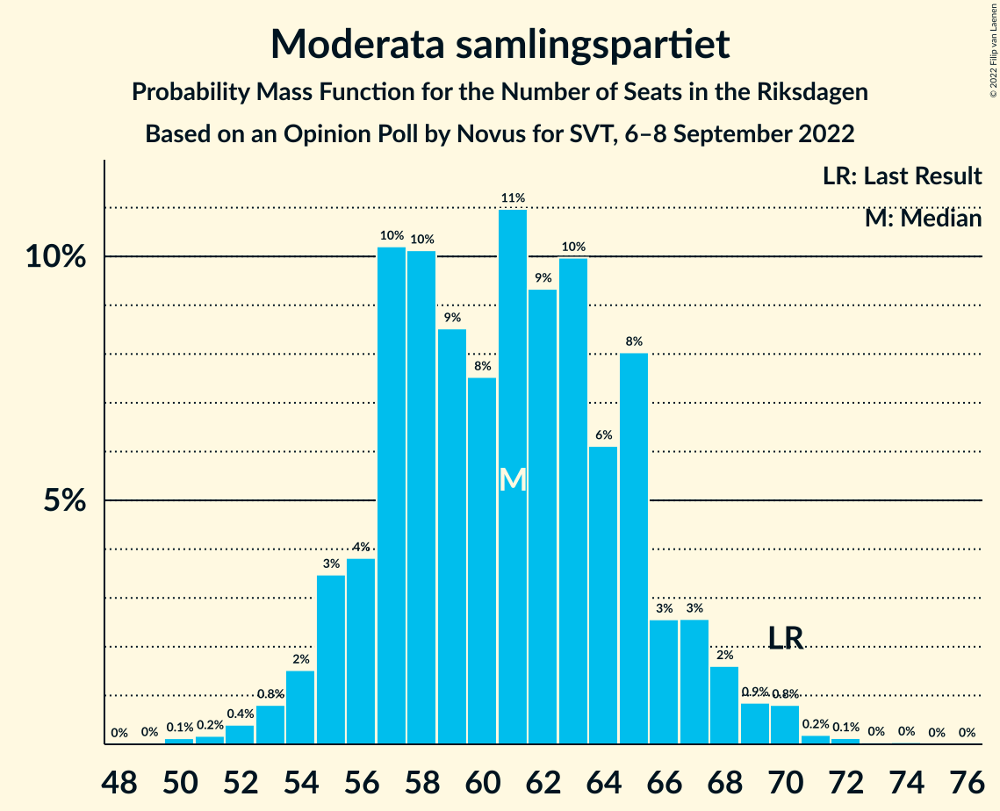
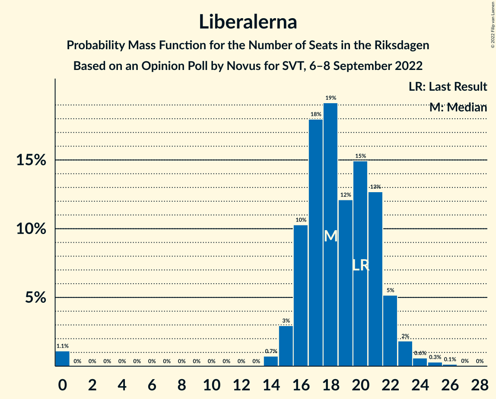

# Opinion Poll by Novus for SVT, 6–8 September 2022

<a href="#voting-intentions">Voting Intentions</a> | <a href="#seats">Seats</a> | <a href="#coalitions">Coalitions</a> | <a href="#technical-information">Technical Information</a>

## Voting Intentions

### Confidence Intervals

| Party | Last Result | Poll Result | 80% Confidence Interval | 90% Confidence Interval | 95% Confidence Interval | 99% Confidence Interval |
|:-----:|:-----------:|:-----------:|:-----------------------:|:-----------------------:|:-----------------------:|:-----------------------:|
| Sveriges socialdemokratiska arbetareparti | 28.3% | 30.3% | 28.8–31.8% |28.3–32.3% |28.0–32.6% |27.3–33.4% |
| Sverigedemokraterna | 17.5% | 21.2% | 19.9–22.6% |19.5–23.0% |19.2–23.4% |18.6–24.0% |
| Moderata samlingspartiet | 19.8% | 17.1% | 15.9–18.4% |15.6–18.8% |15.3–19.1% |14.8–19.8% |
| Vänsterpartiet | 8.0% | 7.8% | 7.0–8.8% |6.7–9.0% |6.5–9.3% |6.2–9.8% |
| Centerpartiet | 8.6% | 7.1% | 6.3–8.0% |6.1–8.3% |5.9–8.5% |5.5–8.9% |
| Kristdemokraterna | 6.3% | 5.9% | 5.2–6.7% |5.0–7.0% |4.8–7.2% |4.5–7.6% |
| Liberalerna | 5.5% | 5.2% | 4.5–6.0% |4.3–6.2% |4.2–6.4% |3.9–6.9% |
| Miljöpartiet de gröna | 4.4% | 4.5% | 3.8–5.2% |3.7–5.5% |3.5–5.6% |3.2–6.0% |

*Note:* The poll result column reflects the actual value used in the calculations. Published results may vary slightly, and in addition be rounded to fewer digits.

## Seats

### Confidence Intervals

| Party | Last Result | Median | 80% Confidence Interval | 90% Confidence Interval | 95% Confidence Interval | 99% Confidence Interval |
|:-----:|:-----------:|:------:|:-----------------------:|:-----------------------:|:-----------------------:|:-----------------------:|
| <a href="#sveriges-socialdemokratiska-arbetareparti">Sveriges socialdemokratiska arbetareparti</a> | 100 | 108 | 101–113 |100–115 |98–116 |96–120 |
| <a href="#sverigedemokraterna">Sverigedemokraterna</a> | 62 | 75 | 70–80 |68–82 |67–83 |65–86 |
| <a href="#moderata-samlingspartiet">Moderata samlingspartiet</a> | 70 | 61 | 56–65 |55–67 |54–68 |52–70 |
| <a href="#vänsterpartiet">Vänsterpartiet</a> | 28 | 27 | 25–31 |24–32 |23–33 |22–34 |
| <a href="#centerpartiet">Centerpartiet</a> | 31 | 25 | 22–28 |21–29 |20–30 |20–32 |
| <a href="#kristdemokraterna">Kristdemokraterna</a> | 22 | 21 | 18–24 |17–25 |17–25 |16–27 |
| <a href="#liberalerna">Liberalerna</a> | 20 | 18 | 16–21 |16–22 |15–23 |0–24 |
| <a href="#miljöpartiet-de-gröna">Miljöpartiet de gröna</a> | 16 | 16 | 0–18 |0–19 |0–20 |0–21 |

### Sveriges socialdemokratiska arbetareparti

*For a full overview of the results for this party, see the [Sveriges socialdemokratiska arbetareparti](party-sverigessocialdemokratiskaarbetareparti.html) page.*

| Number of Seats | Probability | Accumulated | Special Marks |
|:---------------:|:-----------:|:-----------:|:-------------:|
| 93 | 0.1% | 100% |  |
| 94 | 0.1% | 99.9% |  |
| 95 | 0.2% | 99.9% |  |
| 96 | 0.5% | 99.6% |  |
| 97 | 0.9% | 99.1% |  |
| 98 | 1.1% | 98% |  |
| 99 | 1.3% | 97% |  |
| 100 | 2% | 96% | Last Result |
| 101 | 4% | 94% |  |
| 102 | 4% | 90% |  |
| 103 | 7% | 86% |  |
| 104 | 7% | 79% |  |
| 105 | 9% | 72% |  |
| 106 | 7% | 63% |  |
| 107 | 5% | 55% |  |
| 108 | 11% | 51% | Median |
| 109 | 9% | 40% |  |
| 110 | 5% | 31% |  |
| 111 | 7% | 26% |  |
| 112 | 5% | 19% |  |
| 113 | 5% | 14% |  |
| 114 | 3% | 8% |  |
| 115 | 2% | 5% |  |
| 116 | 1.0% | 3% |  |
| 117 | 0.7% | 2% |  |
| 118 | 0.6% | 2% |  |
| 119 | 0.5% | 1.0% |  |
| 120 | 0.1% | 0.5% |  |
| 121 | 0.2% | 0.4% |  |
| 122 | 0.1% | 0.2% |  |
| 123 | 0.1% | 0.1% |  |
| 124 | 0% | 0% |  |

### Sverigedemokraterna

*For a full overview of the results for this party, see the [Sverigedemokraterna](party-sverigedemokraterna.html) page.*

| Number of Seats | Probability | Accumulated | Special Marks |
|:---------------:|:-----------:|:-----------:|:-------------:|
| 62 | 0% | 100% | Last Result |
| 63 | 0.1% | 100% |  |
| 64 | 0.2% | 99.9% |  |
| 65 | 0.2% | 99.7% |  |
| 66 | 0.6% | 99.5% |  |
| 67 | 1.4% | 98.9% |  |
| 68 | 3% | 97% |  |
| 69 | 2% | 95% |  |
| 70 | 6% | 93% |  |
| 71 | 5% | 87% |  |
| 72 | 6% | 81% |  |
| 73 | 10% | 75% |  |
| 74 | 9% | 65% |  |
| 75 | 9% | 56% | Median |
| 76 | 9% | 47% |  |
| 77 | 9% | 38% |  |
| 78 | 6% | 29% |  |
| 79 | 9% | 23% |  |
| 80 | 5% | 14% |  |
| 81 | 2% | 9% |  |
| 82 | 3% | 7% |  |
| 83 | 2% | 4% |  |
| 84 | 0.9% | 2% |  |
| 85 | 0.6% | 1.2% |  |
| 86 | 0.3% | 0.6% |  |
| 87 | 0.2% | 0.3% |  |
| 88 | 0% | 0.1% |  |
| 89 | 0% | 0.1% |  |
| 90 | 0% | 0% |  |

### Moderata samlingspartiet

*For a full overview of the results for this party, see the [Moderata samlingspartiet](party-moderatasamlingspartiet.html) page.*

| Number of Seats | Probability | Accumulated | Special Marks |
|:---------------:|:-----------:|:-----------:|:-------------:|
| 50 | 0.1% | 100% |  |
| 51 | 0.2% | 99.8% |  |
| 52 | 0.4% | 99.7% |  |
| 53 | 0.8% | 99.3% |  |
| 54 | 2% | 98% |  |
| 55 | 3% | 97% |  |
| 56 | 4% | 93% |  |
| 57 | 10% | 90% |  |
| 58 | 10% | 79% |  |
| 59 | 9% | 69% |  |
| 60 | 8% | 61% |  |
| 61 | 11% | 53% | Median |
| 62 | 9% | 42% |  |
| 63 | 10% | 33% |  |
| 64 | 6% | 23% |  |
| 65 | 8% | 17% |  |
| 66 | 3% | 9% |  |
| 67 | 3% | 6% |  |
| 68 | 2% | 4% |  |
| 69 | 0.9% | 2% |  |
| 70 | 0.8% | 1.2% | Last Result |
| 71 | 0.2% | 0.4% |  |
| 72 | 0.1% | 0.2% |  |
| 73 | 0% | 0.1% |  |
| 74 | 0% | 0.1% |  |
| 75 | 0% | 0% |  |

### Vänsterpartiet

*For a full overview of the results for this party, see the [Vänsterpartiet](party-vänsterpartiet.html) page.*

| Number of Seats | Probability | Accumulated | Special Marks |
|:---------------:|:-----------:|:-----------:|:-------------:|
| 20 | 0.1% | 100% |  |
| 21 | 0.2% | 99.9% |  |
| 22 | 0.9% | 99.7% |  |
| 23 | 2% | 98.8% |  |
| 24 | 6% | 97% |  |
| 25 | 8% | 90% |  |
| 26 | 15% | 83% |  |
| 27 | 18% | 68% | Median |
| 28 | 11% | 49% | Last Result |
| 29 | 11% | 38% |  |
| 30 | 12% | 28% |  |
| 31 | 7% | 15% |  |
| 32 | 3% | 8% |  |
| 33 | 3% | 5% |  |
| 34 | 1.1% | 2% |  |
| 35 | 0.3% | 0.5% |  |
| 36 | 0.1% | 0.2% |  |
| 37 | 0% | 0.1% |  |
| 38 | 0% | 0% |  |

### Centerpartiet

*For a full overview of the results for this party, see the [Centerpartiet](party-centerpartiet.html) page.*

| Number of Seats | Probability | Accumulated | Special Marks |
|:---------------:|:-----------:|:-----------:|:-------------:|
| 18 | 0.1% | 100% |  |
| 19 | 0.4% | 99.9% |  |
| 20 | 3% | 99.5% |  |
| 21 | 2% | 97% |  |
| 22 | 8% | 95% |  |
| 23 | 12% | 87% |  |
| 24 | 16% | 75% |  |
| 25 | 15% | 59% | Median |
| 26 | 17% | 44% |  |
| 27 | 10% | 27% |  |
| 28 | 7% | 17% |  |
| 29 | 6% | 10% |  |
| 30 | 2% | 4% |  |
| 31 | 1.0% | 2% | Last Result |
| 32 | 0.3% | 0.8% |  |
| 33 | 0.4% | 0.4% |  |
| 34 | 0% | 0.1% |  |
| 35 | 0% | 0% |  |

### Kristdemokraterna

*For a full overview of the results for this party, see the [Kristdemokraterna](party-kristdemokraterna.html) page.*

| Number of Seats | Probability | Accumulated | Special Marks |
|:---------------:|:-----------:|:-----------:|:-------------:|
| 15 | 0.3% | 100% |  |
| 16 | 1.3% | 99.6% |  |
| 17 | 3% | 98% |  |
| 18 | 5% | 95% |  |
| 19 | 12% | 90% |  |
| 20 | 23% | 77% |  |
| 21 | 22% | 55% | Median |
| 22 | 11% | 33% | Last Result |
| 23 | 8% | 22% |  |
| 24 | 6% | 14% |  |
| 25 | 6% | 8% |  |
| 26 | 2% | 2% |  |
| 27 | 0.5% | 0.8% |  |
| 28 | 0.2% | 0.3% |  |
| 29 | 0.1% | 0.1% |  |
| 30 | 0% | 0% |  |

### Liberalerna

*For a full overview of the results for this party, see the [Liberalerna](party-liberalerna.html) page.*

| Number of Seats | Probability | Accumulated | Special Marks |
|:---------------:|:-----------:|:-----------:|:-------------:|
| 0 | 1.1% | 100% |  |
| 1 | 0% | 98.9% |  |
| 2 | 0% | 98.9% |  |
| 3 | 0% | 98.9% |  |
| 4 | 0% | 98.9% |  |
| 5 | 0% | 98.9% |  |
| 6 | 0% | 98.9% |  |
| 7 | 0% | 98.9% |  |
| 8 | 0% | 98.9% |  |
| 9 | 0% | 98.9% |  |
| 10 | 0% | 98.9% |  |
| 11 | 0% | 98.9% |  |
| 12 | 0% | 98.9% |  |
| 13 | 0% | 98.9% |  |
| 14 | 0.7% | 98.9% |  |
| 15 | 3% | 98% |  |
| 16 | 10% | 95% |  |
| 17 | 18% | 85% |  |
| 18 | 19% | 67% | Median |
| 19 | 12% | 48% |  |
| 20 | 15% | 36% | Last Result |
| 21 | 13% | 21% |  |
| 22 | 5% | 8% |  |
| 23 | 2% | 3% |  |
| 24 | 0.6% | 1.1% |  |
| 25 | 0.3% | 0.5% |  |
| 26 | 0.1% | 0.2% |  |
| 27 | 0% | 0% |  |

### Miljöpartiet de gröna

*For a full overview of the results for this party, see the [Miljöpartiet de gröna](party-miljöpartietdegröna.html) page.*

| Number of Seats | Probability | Accumulated | Special Marks |
|:---------------:|:-----------:|:-----------:|:-------------:|
| 0 | 20% | 100% |  |
| 1 | 0% | 80% |  |
| 2 | 0% | 80% |  |
| 3 | 0% | 80% |  |
| 4 | 0% | 80% |  |
| 5 | 0% | 80% |  |
| 6 | 0% | 80% |  |
| 7 | 0% | 80% |  |
| 8 | 0% | 80% |  |
| 9 | 0% | 80% |  |
| 10 | 0% | 80% |  |
| 11 | 0% | 80% |  |
| 12 | 0% | 80% |  |
| 13 | 0% | 80% |  |
| 14 | 5% | 80% |  |
| 15 | 17% | 75% |  |
| 16 | 23% | 58% | Last Result, Median |
| 17 | 15% | 36% |  |
| 18 | 13% | 21% |  |
| 19 | 6% | 8% |  |
| 20 | 2% | 3% |  |
| 21 | 0.7% | 1.1% |  |
| 22 | 0.3% | 0.4% |  |
| 23 | 0.1% | 0.1% |  |
| 24 | 0% | 0% |  |

## Coalitions

### Confidence Intervals

| Coalition | Last Result | Median | Majority? | 80% Confidence Interval | 90% Confidence Interval | 95% Confidence Interval | 99% Confidence Interval |
|:---------:|:-----------:|:------:|:---------:|:-----------------------:|:-----------------------:|:-----------------------:|:-----------------------:|
| Sveriges socialdemokratiska arbetareparti – Moderata samlingspartiet – Centerpartiet | 201 | 193 | 100% | 186–201 | 185–203 | 183–205 | 180–210 |
| Sveriges socialdemokratiska arbetareparti – Vänsterpartiet – Centerpartiet – Liberalerna – Miljöpartiet de gröna | 195 | 193 | 99.9% | 185–199 | 183–200 | 180–202 | 176–205 |
| Sverigedemokraterna – Moderata samlingspartiet – Kristdemokraterna – Liberalerna | 174 | 175 | 53% | 169–183 | 167–185 | 165–188 | 162–191 |
| Sveriges socialdemokratiska arbetareparti – Vänsterpartiet – Centerpartiet – Miljöpartiet de gröna | 175 | 174 | 47% | 166–180 | 164–182 | 161–184 | 158–187 |
| Sveriges socialdemokratiska arbetareparti – Moderata samlingspartiet | 170 | 168 | 13% | 162–176 | 160–177 | 158–179 | 155–183 |
| Sveriges socialdemokratiska arbetareparti – Centerpartiet – Liberalerna – Miljöpartiet de gröna | 167 | 165 | 2% | 156–171 | 154–173 | 152–174 | 148–177 |
| Sverigedemokraterna – Moderata samlingspartiet – Kristdemokraterna | 154 | 156 | 0.1% | 150–164 | 149–166 | 147–169 | 144–173 |
| Sveriges socialdemokratiska arbetareparti – Vänsterpartiet – Miljöpartiet de gröna | 144 | 149 | 0% | 140–156 | 138–157 | 135–159 | 132–162 |
| Sveriges socialdemokratiska arbetareparti – Centerpartiet – Miljöpartiet de gröna | 147 | 147 | 0% | 137–153 | 135–155 | 133–156 | 130–159 |
| Sverigedemokraterna – Moderata samlingspartiet | 132 | 136 | 0% | 129–142 | 128–145 | 127–146 | 124–151 |
| Sveriges socialdemokratiska arbetareparti – Vänsterpartiet | 128 | 135 | 0% | 129–141 | 127–144 | 125–145 | 123–149 |
| Moderata samlingspartiet – Centerpartiet – Kristdemokraterna – Liberalerna | 143 | 126 | 0% | 118–132 | 117–133 | 116–135 | 110–139 |
| Sveriges socialdemokratiska arbetareparti – Miljöpartiet de gröna | 116 | 122 | 0% | 111–128 | 109–129 | 107–131 | 104–134 |
| Moderata samlingspartiet – Centerpartiet – Kristdemokraterna | 123 | 107 | 0% | 101–113 | 99–115 | 98–116 | 96–120 |
| Sveriges socialdemokratiska arbetareparti | 100 | 108 | 0% | 101–113 | 100–115 | 98–116 | 96–120 |
| Moderata samlingspartiet – Centerpartiet – Liberalerna | 121 | 105 | 0% | 98–111 | 97–112 | 95–114 | 89–117 |
| Moderata samlingspartiet – Kristdemokraterna – Liberalerna | 112 | 100 | 0% | 94–107 | 93–108 | 91–109 | 85–113 |
| Moderata samlingspartiet – Centerpartiet | 101 | 86 | 0% | 80–91 | 79–93 | 78–95 | 76–98 |
| Moderata samlingspartiet – Kristdemokraterna | 92 | 82 | 0% | 77–87 | 75–89 | 74–90 | 72–93 |

### Sveriges socialdemokratiska arbetareparti – Moderata samlingspartiet – Centerpartiet

| Number of Seats | Probability | Accumulated | Special Marks |
|:---------------:|:-----------:|:-----------:|:-------------:|
| 177 | 0% | 100% |  |
| 178 | 0.1% | 99.9% |  |
| 179 | 0.1% | 99.8% |  |
| 180 | 0.4% | 99.7% |  |
| 181 | 0.3% | 99.3% |  |
| 182 | 0.8% | 99.0% |  |
| 183 | 1.5% | 98% |  |
| 184 | 1.1% | 97% |  |
| 185 | 3% | 96% |  |
| 186 | 4% | 93% |  |
| 187 | 4% | 89% |  |
| 188 | 6% | 85% |  |
| 189 | 3% | 79% |  |
| 190 | 9% | 76% |  |
| 191 | 9% | 67% |  |
| 192 | 4% | 58% |  |
| 193 | 9% | 53% |  |
| 194 | 5% | 44% | Median |
| 195 | 7% | 39% |  |
| 196 | 6% | 32% |  |
| 197 | 3% | 26% |  |
| 198 | 4% | 23% |  |
| 199 | 4% | 19% |  |
| 200 | 4% | 15% |  |
| 201 | 2% | 11% | Last Result |
| 202 | 4% | 9% |  |
| 203 | 1.1% | 6% |  |
| 204 | 1.1% | 5% |  |
| 205 | 1.4% | 4% |  |
| 206 | 0.6% | 2% |  |
| 207 | 0.4% | 1.5% |  |
| 208 | 0.4% | 1.1% |  |
| 209 | 0.1% | 0.7% |  |
| 210 | 0.1% | 0.6% |  |
| 211 | 0.1% | 0.4% |  |
| 212 | 0.1% | 0.3% |  |
| 213 | 0.1% | 0.2% |  |
| 214 | 0.1% | 0.1% |  |
| 215 | 0% | 0.1% |  |
| 216 | 0% | 0.1% |  |
| 217 | 0% | 0.1% |  |
| 218 | 0% | 0% |  |

### Sveriges socialdemokratiska arbetareparti – Vänsterpartiet – Centerpartiet – Liberalerna – Miljöpartiet de gröna

| Number of Seats | Probability | Accumulated | Special Marks |
|:---------------:|:-----------:|:-----------:|:-------------:|
| 172 | 0% | 100% |  |
| 173 | 0% | 99.9% |  |
| 174 | 0% | 99.9% |  |
| 175 | 0.1% | 99.9% | Majority |
| 176 | 0.3% | 99.8% |  |
| 177 | 0.3% | 99.5% |  |
| 178 | 0.5% | 99.2% |  |
| 179 | 0.4% | 98.7% |  |
| 180 | 0.9% | 98% |  |
| 181 | 0.9% | 97% |  |
| 182 | 1.4% | 96% |  |
| 183 | 1.3% | 95% |  |
| 184 | 2% | 94% |  |
| 185 | 3% | 92% |  |
| 186 | 4% | 89% |  |
| 187 | 7% | 85% |  |
| 188 | 5% | 78% |  |
| 189 | 5% | 72% |  |
| 190 | 5% | 67% |  |
| 191 | 6% | 62% |  |
| 192 | 5% | 56% |  |
| 193 | 8% | 51% |  |
| 194 | 8% | 43% | Median |
| 195 | 7% | 34% | Last Result |
| 196 | 5% | 28% |  |
| 197 | 7% | 22% |  |
| 198 | 3% | 15% |  |
| 199 | 6% | 13% |  |
| 200 | 3% | 7% |  |
| 201 | 2% | 5% |  |
| 202 | 0.7% | 3% |  |
| 203 | 0.9% | 2% |  |
| 204 | 0.4% | 1.1% |  |
| 205 | 0.3% | 0.7% |  |
| 206 | 0.2% | 0.3% |  |
| 207 | 0.1% | 0.2% |  |
| 208 | 0% | 0.1% |  |
| 209 | 0% | 0% |  |

### Sverigedemokraterna – Moderata samlingspartiet – Kristdemokraterna – Liberalerna

| Number of Seats | Probability | Accumulated | Special Marks |
|:---------------:|:-----------:|:-----------:|:-------------:|
| 158 | 0.1% | 100% |  |
| 159 | 0.1% | 99.9% |  |
| 160 | 0.1% | 99.8% |  |
| 161 | 0.2% | 99.7% |  |
| 162 | 0.4% | 99.5% |  |
| 163 | 0.6% | 99.1% |  |
| 164 | 0.5% | 98.5% |  |
| 165 | 1.3% | 98% |  |
| 166 | 1.3% | 97% |  |
| 167 | 2% | 95% |  |
| 168 | 3% | 93% |  |
| 169 | 4% | 90% |  |
| 170 | 7% | 86% |  |
| 171 | 6% | 79% |  |
| 172 | 7% | 73% |  |
| 173 | 6% | 66% |  |
| 174 | 7% | 60% | Last Result |
| 175 | 7% | 53% | Median, Majority |
| 176 | 5% | 46% |  |
| 177 | 6% | 41% |  |
| 178 | 5% | 35% |  |
| 179 | 6% | 30% |  |
| 180 | 4% | 24% |  |
| 181 | 1.0% | 19% |  |
| 182 | 7% | 18% |  |
| 183 | 4% | 11% |  |
| 184 | 2% | 8% |  |
| 185 | 1.5% | 6% |  |
| 186 | 0.8% | 5% |  |
| 187 | 1.0% | 4% |  |
| 188 | 0.7% | 3% |  |
| 189 | 1.0% | 2% |  |
| 190 | 0.4% | 1.1% |  |
| 191 | 0.5% | 0.7% |  |
| 192 | 0.1% | 0.2% |  |
| 193 | 0% | 0.2% |  |
| 194 | 0% | 0.1% |  |
| 195 | 0% | 0.1% |  |
| 196 | 0% | 0% |  |

### Sveriges socialdemokratiska arbetareparti – Vänsterpartiet – Centerpartiet – Miljöpartiet de gröna

| Number of Seats | Probability | Accumulated | Special Marks |
|:---------------:|:-----------:|:-----------:|:-------------:|
| 154 | 0% | 100% |  |
| 155 | 0% | 99.9% |  |
| 156 | 0% | 99.9% |  |
| 157 | 0.1% | 99.8% |  |
| 158 | 0.5% | 99.8% |  |
| 159 | 0.4% | 99.3% |  |
| 160 | 1.0% | 98.9% |  |
| 161 | 0.7% | 98% |  |
| 162 | 1.0% | 97% |  |
| 163 | 0.8% | 96% |  |
| 164 | 1.5% | 95% |  |
| 165 | 2% | 94% |  |
| 166 | 4% | 92% |  |
| 167 | 7% | 89% |  |
| 168 | 1.0% | 82% |  |
| 169 | 4% | 81% |  |
| 170 | 6% | 76% |  |
| 171 | 5% | 70% |  |
| 172 | 6% | 65% |  |
| 173 | 5% | 59% |  |
| 174 | 7% | 54% |  |
| 175 | 7% | 47% | Last Result, Majority |
| 176 | 6% | 40% | Median |
| 177 | 7% | 34% |  |
| 178 | 6% | 27% |  |
| 179 | 7% | 21% |  |
| 180 | 4% | 14% |  |
| 181 | 3% | 10% |  |
| 182 | 2% | 7% |  |
| 183 | 1.3% | 5% |  |
| 184 | 1.3% | 3% |  |
| 185 | 0.5% | 2% |  |
| 186 | 0.6% | 1.5% |  |
| 187 | 0.4% | 0.9% |  |
| 188 | 0.2% | 0.5% |  |
| 189 | 0.1% | 0.3% |  |
| 190 | 0.1% | 0.2% |  |
| 191 | 0.1% | 0.1% |  |
| 192 | 0% | 0% |  |

### Sveriges socialdemokratiska arbetareparti – Moderata samlingspartiet

| Number of Seats | Probability | Accumulated | Special Marks |
|:---------------:|:-----------:|:-----------:|:-------------:|
| 152 | 0% | 100% |  |
| 153 | 0.1% | 99.9% |  |
| 154 | 0.1% | 99.8% |  |
| 155 | 0.5% | 99.7% |  |
| 156 | 0.4% | 99.2% |  |
| 157 | 0.9% | 98.9% |  |
| 158 | 1.4% | 98% |  |
| 159 | 1.2% | 96% |  |
| 160 | 3% | 95% |  |
| 161 | 1.1% | 92% |  |
| 162 | 5% | 91% |  |
| 163 | 6% | 86% |  |
| 164 | 4% | 80% |  |
| 165 | 12% | 75% |  |
| 166 | 4% | 64% |  |
| 167 | 7% | 60% |  |
| 168 | 7% | 53% |  |
| 169 | 7% | 46% | Median |
| 170 | 6% | 39% | Last Result |
| 171 | 8% | 33% |  |
| 172 | 5% | 25% |  |
| 173 | 4% | 20% |  |
| 174 | 3% | 15% |  |
| 175 | 2% | 13% | Majority |
| 176 | 4% | 10% |  |
| 177 | 2% | 6% |  |
| 178 | 1.2% | 5% |  |
| 179 | 1.1% | 3% |  |
| 180 | 0.2% | 2% |  |
| 181 | 1.0% | 2% |  |
| 182 | 0.5% | 1.1% |  |
| 183 | 0.1% | 0.6% |  |
| 184 | 0.2% | 0.5% |  |
| 185 | 0% | 0.3% |  |
| 186 | 0.1% | 0.2% |  |
| 187 | 0.1% | 0.2% |  |
| 188 | 0.1% | 0.1% |  |
| 189 | 0% | 0% |  |

### Sveriges socialdemokratiska arbetareparti – Centerpartiet – Liberalerna – Miljöpartiet de gröna

| Number of Seats | Probability | Accumulated | Special Marks |
|:---------------:|:-----------:|:-----------:|:-------------:|
| 144 | 0% | 100% |  |
| 145 | 0.1% | 99.9% |  |
| 146 | 0.1% | 99.9% |  |
| 147 | 0.3% | 99.8% |  |
| 148 | 0.4% | 99.5% |  |
| 149 | 0.4% | 99.1% |  |
| 150 | 0.5% | 98.8% |  |
| 151 | 0.6% | 98% |  |
| 152 | 1.0% | 98% |  |
| 153 | 1.0% | 97% |  |
| 154 | 2% | 96% |  |
| 155 | 2% | 94% |  |
| 156 | 5% | 92% |  |
| 157 | 2% | 87% |  |
| 158 | 4% | 86% |  |
| 159 | 3% | 82% |  |
| 160 | 6% | 79% |  |
| 161 | 3% | 73% |  |
| 162 | 5% | 70% |  |
| 163 | 7% | 64% |  |
| 164 | 5% | 57% |  |
| 165 | 5% | 52% |  |
| 166 | 6% | 48% |  |
| 167 | 10% | 42% | Last Result, Median |
| 168 | 6% | 32% |  |
| 169 | 8% | 26% |  |
| 170 | 4% | 18% |  |
| 171 | 6% | 14% |  |
| 172 | 2% | 8% |  |
| 173 | 2% | 6% |  |
| 174 | 2% | 4% |  |
| 175 | 0.9% | 2% | Majority |
| 176 | 0.6% | 1.4% |  |
| 177 | 0.3% | 0.8% |  |
| 178 | 0.3% | 0.5% |  |
| 179 | 0.1% | 0.2% |  |
| 180 | 0.1% | 0.1% |  |
| 181 | 0% | 0.1% |  |
| 182 | 0% | 0% |  |

### Sverigedemokraterna – Moderata samlingspartiet – Kristdemokraterna

| Number of Seats | Probability | Accumulated | Special Marks |
|:---------------:|:-----------:|:-----------:|:-------------:|
| 141 | 0% | 100% |  |
| 142 | 0.1% | 99.9% |  |
| 143 | 0.2% | 99.8% |  |
| 144 | 0.3% | 99.7% |  |
| 145 | 0.4% | 99.3% |  |
| 146 | 0.9% | 98.9% |  |
| 147 | 0.7% | 98% |  |
| 148 | 2% | 97% |  |
| 149 | 3% | 95% |  |
| 150 | 6% | 93% |  |
| 151 | 3% | 87% |  |
| 152 | 7% | 85% |  |
| 153 | 5% | 78% |  |
| 154 | 7% | 72% | Last Result |
| 155 | 8% | 66% |  |
| 156 | 8% | 57% |  |
| 157 | 5% | 49% | Median |
| 158 | 6% | 44% |  |
| 159 | 5% | 38% |  |
| 160 | 5% | 33% |  |
| 161 | 5% | 28% |  |
| 162 | 7% | 22% |  |
| 163 | 4% | 15% |  |
| 164 | 3% | 11% |  |
| 165 | 2% | 8% |  |
| 166 | 1.3% | 6% |  |
| 167 | 1.4% | 5% |  |
| 168 | 0.9% | 4% |  |
| 169 | 0.9% | 3% |  |
| 170 | 0.4% | 2% |  |
| 171 | 0.5% | 1.3% |  |
| 172 | 0.3% | 0.8% |  |
| 173 | 0.3% | 0.5% |  |
| 174 | 0.1% | 0.2% |  |
| 175 | 0% | 0.1% | Majority |
| 176 | 0% | 0.1% |  |
| 177 | 0% | 0.1% |  |
| 178 | 0% | 0% |  |

### Sveriges socialdemokratiska arbetareparti – Vänsterpartiet – Miljöpartiet de gröna

| Number of Seats | Probability | Accumulated | Special Marks |
|:---------------:|:-----------:|:-----------:|:-------------:|
| 128 | 0% | 100% |  |
| 129 | 0% | 99.9% |  |
| 130 | 0.1% | 99.9% |  |
| 131 | 0.3% | 99.8% |  |
| 132 | 0.3% | 99.5% |  |
| 133 | 0.6% | 99.2% |  |
| 134 | 0.6% | 98.7% |  |
| 135 | 0.9% | 98% |  |
| 136 | 0.4% | 97% |  |
| 137 | 0.9% | 97% |  |
| 138 | 1.5% | 96% |  |
| 139 | 3% | 94% |  |
| 140 | 4% | 91% |  |
| 141 | 4% | 87% |  |
| 142 | 2% | 83% |  |
| 143 | 2% | 81% |  |
| 144 | 4% | 79% | Last Result |
| 145 | 4% | 75% |  |
| 146 | 5% | 72% |  |
| 147 | 5% | 67% |  |
| 148 | 9% | 62% |  |
| 149 | 7% | 53% |  |
| 150 | 8% | 46% |  |
| 151 | 7% | 38% | Median |
| 152 | 6% | 30% |  |
| 153 | 3% | 25% |  |
| 154 | 5% | 22% |  |
| 155 | 7% | 17% |  |
| 156 | 3% | 10% |  |
| 157 | 2% | 7% |  |
| 158 | 1.5% | 5% |  |
| 159 | 1.3% | 3% |  |
| 160 | 0.7% | 2% |  |
| 161 | 0.4% | 1.2% |  |
| 162 | 0.5% | 0.9% |  |
| 163 | 0.2% | 0.4% |  |
| 164 | 0.1% | 0.2% |  |
| 165 | 0.1% | 0.1% |  |
| 166 | 0% | 0.1% |  |
| 167 | 0% | 0% |  |

### Sveriges socialdemokratiska arbetareparti – Centerpartiet – Miljöpartiet de gröna

| Number of Seats | Probability | Accumulated | Special Marks |
|:---------------:|:-----------:|:-----------:|:-------------:|
| 125 | 0% | 100% |  |
| 126 | 0% | 99.9% |  |
| 127 | 0% | 99.9% |  |
| 128 | 0.3% | 99.9% |  |
| 129 | 0.1% | 99.6% |  |
| 130 | 0.7% | 99.5% |  |
| 131 | 0.5% | 98.8% |  |
| 132 | 0.7% | 98% |  |
| 133 | 0.5% | 98% |  |
| 134 | 1.3% | 97% |  |
| 135 | 2% | 96% |  |
| 136 | 4% | 94% |  |
| 137 | 4% | 90% |  |
| 138 | 2% | 87% |  |
| 139 | 2% | 84% |  |
| 140 | 2% | 82% |  |
| 141 | 2% | 80% |  |
| 142 | 5% | 78% |  |
| 143 | 5% | 73% |  |
| 144 | 6% | 68% |  |
| 145 | 6% | 61% |  |
| 146 | 4% | 56% |  |
| 147 | 8% | 52% | Last Result |
| 148 | 5% | 43% |  |
| 149 | 6% | 38% | Median |
| 150 | 9% | 32% |  |
| 151 | 8% | 23% |  |
| 152 | 3% | 15% |  |
| 153 | 5% | 12% |  |
| 154 | 2% | 7% |  |
| 155 | 1.4% | 5% |  |
| 156 | 1.1% | 4% |  |
| 157 | 1.1% | 2% |  |
| 158 | 0.4% | 1.3% |  |
| 159 | 0.4% | 0.9% |  |
| 160 | 0.3% | 0.5% |  |
| 161 | 0.1% | 0.2% |  |
| 162 | 0.1% | 0.2% |  |
| 163 | 0% | 0.1% |  |
| 164 | 0% | 0.1% |  |
| 165 | 0% | 0% |  |

### Sverigedemokraterna – Moderata samlingspartiet

| Number of Seats | Probability | Accumulated | Special Marks |
|:---------------:|:-----------:|:-----------:|:-------------:|
| 121 | 0% | 100% |  |
| 122 | 0.1% | 99.9% |  |
| 123 | 0.2% | 99.8% |  |
| 124 | 0.6% | 99.6% |  |
| 125 | 0.6% | 99.0% |  |
| 126 | 0.7% | 98% |  |
| 127 | 2% | 98% |  |
| 128 | 2% | 96% |  |
| 129 | 4% | 94% |  |
| 130 | 4% | 89% |  |
| 131 | 6% | 85% |  |
| 132 | 6% | 79% | Last Result |
| 133 | 6% | 73% |  |
| 134 | 6% | 67% |  |
| 135 | 8% | 61% |  |
| 136 | 8% | 53% | Median |
| 137 | 6% | 45% |  |
| 138 | 6% | 39% |  |
| 139 | 6% | 32% |  |
| 140 | 7% | 26% |  |
| 141 | 5% | 20% |  |
| 142 | 5% | 14% |  |
| 143 | 2% | 9% |  |
| 144 | 2% | 7% |  |
| 145 | 1.3% | 5% |  |
| 146 | 2% | 4% |  |
| 147 | 0.4% | 2% |  |
| 148 | 0.8% | 2% |  |
| 149 | 0.2% | 1.2% |  |
| 150 | 0.4% | 1.0% |  |
| 151 | 0.1% | 0.6% |  |
| 152 | 0.3% | 0.4% |  |
| 153 | 0% | 0.1% |  |
| 154 | 0.1% | 0.1% |  |
| 155 | 0% | 0% |  |

### Sveriges socialdemokratiska arbetareparti – Vänsterpartiet

| Number of Seats | Probability | Accumulated | Special Marks |
|:---------------:|:-----------:|:-----------:|:-------------:|
| 120 | 0.1% | 100% |  |
| 121 | 0.1% | 99.9% |  |
| 122 | 0.2% | 99.8% |  |
| 123 | 0.2% | 99.6% |  |
| 124 | 0.7% | 99.4% |  |
| 125 | 2% | 98.7% |  |
| 126 | 2% | 97% |  |
| 127 | 2% | 95% |  |
| 128 | 3% | 94% | Last Result |
| 129 | 3% | 91% |  |
| 130 | 5% | 88% |  |
| 131 | 9% | 83% |  |
| 132 | 9% | 74% |  |
| 133 | 6% | 65% |  |
| 134 | 5% | 59% |  |
| 135 | 9% | 54% | Median |
| 136 | 6% | 45% |  |
| 137 | 4% | 39% |  |
| 138 | 5% | 35% |  |
| 139 | 10% | 30% |  |
| 140 | 6% | 20% |  |
| 141 | 5% | 14% |  |
| 142 | 2% | 9% |  |
| 143 | 1.0% | 6% |  |
| 144 | 0.8% | 5% |  |
| 145 | 2% | 5% |  |
| 146 | 1.1% | 2% |  |
| 147 | 0.3% | 1.4% |  |
| 148 | 0.6% | 1.1% |  |
| 149 | 0.1% | 0.5% |  |
| 150 | 0.1% | 0.4% |  |
| 151 | 0.1% | 0.3% |  |
| 152 | 0% | 0.1% |  |
| 153 | 0% | 0.1% |  |
| 154 | 0% | 0.1% |  |
| 155 | 0% | 0% |  |

### Moderata samlingspartiet – Centerpartiet – Kristdemokraterna – Liberalerna

| Number of Seats | Probability | Accumulated | Special Marks |
|:---------------:|:-----------:|:-----------:|:-------------:|
| 105 | 0% | 100% |  |
| 106 | 0% | 99.9% |  |
| 107 | 0.1% | 99.9% |  |
| 108 | 0.1% | 99.8% |  |
| 109 | 0.1% | 99.7% |  |
| 110 | 0.2% | 99.6% |  |
| 111 | 0.2% | 99.5% |  |
| 112 | 0.2% | 99.3% |  |
| 113 | 0.2% | 99.1% |  |
| 114 | 0.5% | 99.0% |  |
| 115 | 0.9% | 98.5% |  |
| 116 | 1.1% | 98% |  |
| 117 | 2% | 97% |  |
| 118 | 6% | 94% |  |
| 119 | 2% | 89% |  |
| 120 | 6% | 86% |  |
| 121 | 7% | 81% |  |
| 122 | 5% | 74% |  |
| 123 | 4% | 68% |  |
| 124 | 5% | 64% |  |
| 125 | 8% | 59% | Median |
| 126 | 9% | 51% |  |
| 127 | 7% | 42% |  |
| 128 | 7% | 35% |  |
| 129 | 7% | 28% |  |
| 130 | 5% | 22% |  |
| 131 | 4% | 17% |  |
| 132 | 4% | 13% |  |
| 133 | 4% | 9% |  |
| 134 | 1.5% | 5% |  |
| 135 | 1.1% | 3% |  |
| 136 | 0.8% | 2% |  |
| 137 | 0.5% | 2% |  |
| 138 | 0.4% | 1.1% |  |
| 139 | 0.3% | 0.8% |  |
| 140 | 0.2% | 0.4% |  |
| 141 | 0.1% | 0.3% |  |
| 142 | 0.1% | 0.2% |  |
| 143 | 0% | 0.1% | Last Result |
| 144 | 0% | 0% |  |

### Sveriges socialdemokratiska arbetareparti – Miljöpartiet de gröna

| Number of Seats | Probability | Accumulated | Special Marks |
|:---------------:|:-----------:|:-----------:|:-------------:|
| 101 | 0.1% | 100% |  |
| 102 | 0.1% | 99.9% |  |
| 103 | 0.1% | 99.8% |  |
| 104 | 0.3% | 99.7% |  |
| 105 | 1.1% | 99.4% |  |
| 106 | 0.5% | 98% |  |
| 107 | 0.8% | 98% |  |
| 108 | 2% | 97% |  |
| 109 | 3% | 96% |  |
| 110 | 2% | 92% |  |
| 111 | 4% | 90% |  |
| 112 | 1.3% | 86% |  |
| 113 | 2% | 85% |  |
| 114 | 3% | 83% |  |
| 115 | 2% | 80% |  |
| 116 | 3% | 79% | Last Result |
| 117 | 3% | 75% |  |
| 118 | 3% | 72% |  |
| 119 | 5% | 69% |  |
| 120 | 6% | 65% |  |
| 121 | 9% | 59% |  |
| 122 | 7% | 50% |  |
| 123 | 7% | 43% |  |
| 124 | 8% | 36% | Median |
| 125 | 6% | 28% |  |
| 126 | 3% | 22% |  |
| 127 | 7% | 19% |  |
| 128 | 3% | 12% |  |
| 129 | 5% | 10% |  |
| 130 | 2% | 5% |  |
| 131 | 1.2% | 3% |  |
| 132 | 1.1% | 2% |  |
| 133 | 0.3% | 0.9% |  |
| 134 | 0.4% | 0.7% |  |
| 135 | 0.1% | 0.3% |  |
| 136 | 0.1% | 0.2% |  |
| 137 | 0% | 0.1% |  |
| 138 | 0% | 0.1% |  |
| 139 | 0% | 0% |  |

### Moderata samlingspartiet – Centerpartiet – Kristdemokraterna

| Number of Seats | Probability | Accumulated | Special Marks |
|:---------------:|:-----------:|:-----------:|:-------------:|
| 93 | 0.1% | 100% |  |
| 94 | 0.1% | 99.9% |  |
| 95 | 0.3% | 99.8% |  |
| 96 | 0.3% | 99.5% |  |
| 97 | 1.1% | 99.3% |  |
| 98 | 0.8% | 98% |  |
| 99 | 3% | 97% |  |
| 100 | 3% | 94% |  |
| 101 | 5% | 91% |  |
| 102 | 4% | 86% |  |
| 103 | 10% | 82% |  |
| 104 | 4% | 72% |  |
| 105 | 8% | 68% |  |
| 106 | 6% | 60% |  |
| 107 | 8% | 54% | Median |
| 108 | 9% | 46% |  |
| 109 | 6% | 37% |  |
| 110 | 9% | 31% |  |
| 111 | 3% | 22% |  |
| 112 | 9% | 19% |  |
| 113 | 3% | 10% |  |
| 114 | 2% | 7% |  |
| 115 | 1.5% | 5% |  |
| 116 | 2% | 4% |  |
| 117 | 0.8% | 2% |  |
| 118 | 0.5% | 2% |  |
| 119 | 0.5% | 1.1% |  |
| 120 | 0.2% | 0.6% |  |
| 121 | 0.2% | 0.4% |  |
| 122 | 0.1% | 0.2% |  |
| 123 | 0.1% | 0.1% | Last Result |
| 124 | 0% | 0.1% |  |
| 125 | 0% | 0.1% |  |
| 126 | 0% | 0% |  |

### Sveriges socialdemokratiska arbetareparti

| Number of Seats | Probability | Accumulated | Special Marks |
|:---------------:|:-----------:|:-----------:|:-------------:|
| 93 | 0.1% | 100% |  |
| 94 | 0.1% | 99.9% |  |
| 95 | 0.2% | 99.9% |  |
| 96 | 0.5% | 99.6% |  |
| 97 | 0.9% | 99.1% |  |
| 98 | 1.1% | 98% |  |
| 99 | 1.3% | 97% |  |
| 100 | 2% | 96% | Last Result |
| 101 | 4% | 94% |  |
| 102 | 4% | 90% |  |
| 103 | 7% | 86% |  |
| 104 | 7% | 79% |  |
| 105 | 9% | 72% |  |
| 106 | 7% | 63% |  |
| 107 | 5% | 55% |  |
| 108 | 11% | 51% | Median |
| 109 | 9% | 40% |  |
| 110 | 5% | 31% |  |
| 111 | 7% | 26% |  |
| 112 | 5% | 19% |  |
| 113 | 5% | 14% |  |
| 114 | 3% | 8% |  |
| 115 | 2% | 5% |  |
| 116 | 1.0% | 3% |  |
| 117 | 0.7% | 2% |  |
| 118 | 0.6% | 2% |  |
| 119 | 0.5% | 1.0% |  |
| 120 | 0.1% | 0.5% |  |
| 121 | 0.2% | 0.4% |  |
| 122 | 0.1% | 0.2% |  |
| 123 | 0.1% | 0.1% |  |
| 124 | 0% | 0% |  |

### Moderata samlingspartiet – Centerpartiet – Liberalerna

| Number of Seats | Probability | Accumulated | Special Marks |
|:---------------:|:-----------:|:-----------:|:-------------:|
| 83 | 0% | 100% |  |
| 84 | 0% | 99.9% |  |
| 85 | 0.1% | 99.9% |  |
| 86 | 0.1% | 99.8% |  |
| 87 | 0.1% | 99.7% |  |
| 88 | 0.1% | 99.7% |  |
| 89 | 0.2% | 99.5% |  |
| 90 | 0.1% | 99.4% |  |
| 91 | 0.1% | 99.3% |  |
| 92 | 0.3% | 99.2% |  |
| 93 | 0.4% | 98.9% |  |
| 94 | 0.6% | 98.5% |  |
| 95 | 0.5% | 98% |  |
| 96 | 2% | 97% |  |
| 97 | 3% | 96% |  |
| 98 | 5% | 93% |  |
| 99 | 4% | 88% |  |
| 100 | 8% | 85% |  |
| 101 | 6% | 76% |  |
| 102 | 6% | 70% |  |
| 103 | 5% | 64% |  |
| 104 | 9% | 59% | Median |
| 105 | 7% | 50% |  |
| 106 | 10% | 43% |  |
| 107 | 6% | 34% |  |
| 108 | 7% | 27% |  |
| 109 | 5% | 21% |  |
| 110 | 4% | 16% |  |
| 111 | 4% | 12% |  |
| 112 | 4% | 8% |  |
| 113 | 1.1% | 4% |  |
| 114 | 0.8% | 3% |  |
| 115 | 0.9% | 2% |  |
| 116 | 0.5% | 1.1% |  |
| 117 | 0.3% | 0.6% |  |
| 118 | 0.1% | 0.3% |  |
| 119 | 0.1% | 0.2% |  |
| 120 | 0.1% | 0.1% |  |
| 121 | 0% | 0.1% | Last Result |
| 122 | 0% | 0% |  |

### Moderata samlingspartiet – Kristdemokraterna – Liberalerna

| Number of Seats | Probability | Accumulated | Special Marks |
|:---------------:|:-----------:|:-----------:|:-------------:|
| 79 | 0% | 100% |  |
| 80 | 0% | 99.9% |  |
| 81 | 0% | 99.9% |  |
| 82 | 0.1% | 99.9% |  |
| 83 | 0.1% | 99.8% |  |
| 84 | 0.1% | 99.7% |  |
| 85 | 0.3% | 99.6% |  |
| 86 | 0.2% | 99.3% |  |
| 87 | 0.1% | 99.1% |  |
| 88 | 0.2% | 99.0% |  |
| 89 | 0.2% | 98.8% |  |
| 90 | 0.2% | 98.6% |  |
| 91 | 0.9% | 98% |  |
| 92 | 2% | 97% |  |
| 93 | 2% | 96% |  |
| 94 | 7% | 94% |  |
| 95 | 4% | 86% |  |
| 96 | 5% | 82% |  |
| 97 | 9% | 77% |  |
| 98 | 5% | 69% |  |
| 99 | 8% | 64% |  |
| 100 | 5% | 55% | Median |
| 101 | 8% | 50% |  |
| 102 | 6% | 41% |  |
| 103 | 11% | 36% |  |
| 104 | 7% | 25% |  |
| 105 | 5% | 18% |  |
| 106 | 3% | 13% |  |
| 107 | 5% | 10% |  |
| 108 | 2% | 5% |  |
| 109 | 2% | 4% |  |
| 110 | 0.9% | 2% |  |
| 111 | 0.4% | 1.4% |  |
| 112 | 0.3% | 1.0% | Last Result |
| 113 | 0.3% | 0.6% |  |
| 114 | 0.1% | 0.3% |  |
| 115 | 0.2% | 0.3% |  |
| 116 | 0.1% | 0.1% |  |
| 117 | 0% | 0% |  |

### Moderata samlingspartiet – Centerpartiet

| Number of Seats | Probability | Accumulated | Special Marks |
|:---------------:|:-----------:|:-----------:|:-------------:|
| 73 | 0.1% | 100% |  |
| 74 | 0.1% | 99.9% |  |
| 75 | 0.2% | 99.8% |  |
| 76 | 0.5% | 99.6% |  |
| 77 | 0.7% | 99.1% |  |
| 78 | 2% | 98% |  |
| 79 | 3% | 97% |  |
| 80 | 4% | 94% |  |
| 81 | 6% | 90% |  |
| 82 | 6% | 84% |  |
| 83 | 9% | 77% |  |
| 84 | 8% | 69% |  |
| 85 | 7% | 61% |  |
| 86 | 7% | 54% | Median |
| 87 | 10% | 47% |  |
| 88 | 8% | 37% |  |
| 89 | 8% | 29% |  |
| 90 | 7% | 21% |  |
| 91 | 6% | 14% |  |
| 92 | 3% | 8% |  |
| 93 | 1.4% | 6% |  |
| 94 | 1.2% | 4% |  |
| 95 | 1.4% | 3% |  |
| 96 | 0.7% | 2% |  |
| 97 | 0.4% | 1.0% |  |
| 98 | 0.3% | 0.6% |  |
| 99 | 0.2% | 0.3% |  |
| 100 | 0.1% | 0.1% |  |
| 101 | 0% | 0.1% | Last Result |
| 102 | 0% | 0% |  |

### Moderata samlingspartiet – Kristdemokraterna

| Number of Seats | Probability | Accumulated | Special Marks |
|:---------------:|:-----------:|:-----------:|:-------------:|
| 69 | 0.1% | 100% |  |
| 70 | 0.1% | 99.9% |  |
| 71 | 0.2% | 99.8% |  |
| 72 | 0.6% | 99.6% |  |
| 73 | 0.3% | 99.0% |  |
| 74 | 1.3% | 98.6% |  |
| 75 | 3% | 97% |  |
| 76 | 4% | 95% |  |
| 77 | 10% | 91% |  |
| 78 | 4% | 81% |  |
| 79 | 9% | 76% |  |
| 80 | 8% | 67% |  |
| 81 | 8% | 59% |  |
| 82 | 7% | 50% | Median |
| 83 | 9% | 43% |  |
| 84 | 7% | 34% |  |
| 85 | 6% | 28% |  |
| 86 | 9% | 21% |  |
| 87 | 4% | 12% |  |
| 88 | 2% | 8% |  |
| 89 | 2% | 6% |  |
| 90 | 1.4% | 4% |  |
| 91 | 0.8% | 2% |  |
| 92 | 0.9% | 2% | Last Result |
| 93 | 0.2% | 0.6% |  |
| 94 | 0.2% | 0.4% |  |
| 95 | 0.1% | 0.2% |  |
| 96 | 0% | 0.1% |  |
| 97 | 0% | 0.1% |  |
| 98 | 0% | 0% |  |

## Technical Information

### Opinion Poll

+ **Polling firm:** Novus
+ **Commissioner(s):** SVT
+ **Fieldwork period:** 6–8 September 2022

### Calculations

+ **Sample size:** 1500
+ **Simulations done:** 1,048,576
+ **Error estimate:** 2.51%

