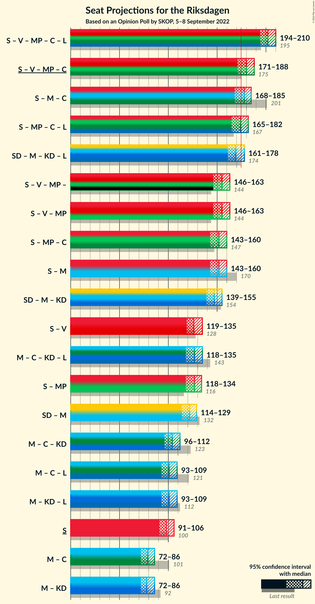
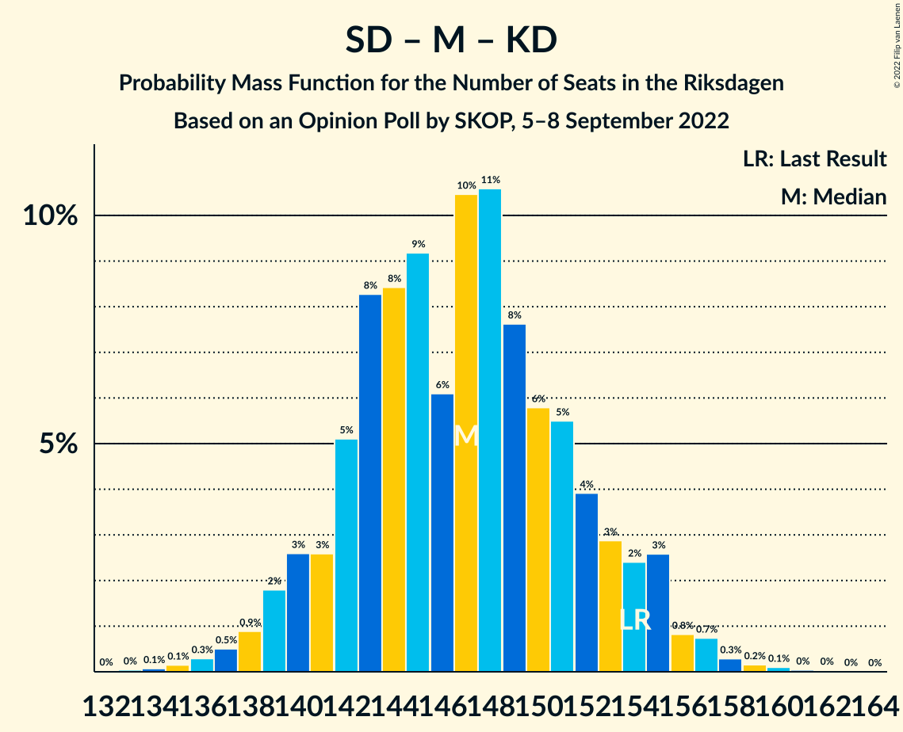

# Opinion Poll by SKOP, 5–8 September 2022

<a href="#voting-intentions">Voting Intentions</a> | <a href="#seats">Seats</a> | <a href="#coalitions">Coalitions</a> | <a href="#technical-information">Technical Information</a>

## Voting Intentions

### Confidence Intervals

| Party | Last Result | Poll Result | 80% Confidence Interval | 90% Confidence Interval | 95% Confidence Interval | 99% Confidence Interval |
|:-----:|:-----------:|:-----------:|:-----------------------:|:-----------------------:|:-----------------------:|:-----------------------:|
| Sveriges socialdemokratiska arbetareparti | 28.3% | 28.1% | 26.6–29.5% |26.2–29.9% |25.9–30.3% |25.3–31.0% |
| Sverigedemokraterna | 17.5% | 19.4% | 18.2–20.7% |17.9–21.1% |17.6–21.4% |17.0–22.1% |
| Moderata samlingspartiet | 19.8% | 15.2% | 14.1–16.4% |13.8–16.8% |13.5–17.1% |13.0–17.6% |
| Vänsterpartiet | 8.0% | 8.0% | 7.2–8.9% |7.0–9.2% |6.8–9.4% |6.4–9.9% |
| Miljöpartiet de gröna | 4.4% | 7.9% | 7.1–8.8% |6.9–9.1% |6.7–9.3% |6.3–9.8% |
| Centerpartiet | 8.6% | 7.2% | 6.4–8.1% |6.2–8.4% |6.1–8.6% |5.7–9.0% |
| Kristdemokraterna | 6.3% | 7.2% | 6.4–8.1% |6.2–8.4% |6.1–8.6% |5.7–9.0% |
| Liberalerna | 5.5% | 6.3% | 5.6–7.1% |5.4–7.4% |5.2–7.6% |4.9–8.0% |

*Note:* The poll result column reflects the actual value used in the calculations. Published results may vary slightly, and in addition be rounded to fewer digits.

## Seats

### Confidence Intervals

| Party | Last Result | Median | 80% Confidence Interval | 90% Confidence Interval | 95% Confidence Interval | 99% Confidence Interval |
|:-----:|:-----------:|:------:|:-----------------------:|:-----------------------:|:-----------------------:|:-----------------------:|
| <a href="#sveriges-socialdemokratiska-arbetareparti">Sveriges socialdemokratiska arbetareparti</a> | 100 | 98 | 93–103 |92–105 |91–106 |89–108 |
| <a href="#sverigedemokraterna">Sverigedemokraterna</a> | 62 | 68 | 64–73 |63–74 |61–75 |60–77 |
| <a href="#moderata-samlingspartiet">Moderata samlingspartiet</a> | 70 | 53 | 49–57 |49–59 |48–60 |46–62 |
| <a href="#vänsterpartiet">Vänsterpartiet</a> | 28 | 28 | 25–31 |25–32 |24–33 |23–35 |
| <a href="#miljöpartiet-de-gröna">Miljöpartiet de gröna</a> | 16 | 28 | 25–31 |24–32 |24–32 |22–34 |
| <a href="#centerpartiet">Centerpartiet</a> | 31 | 26 | 23–29 |22–29 |21–30 |20–31 |
| <a href="#kristdemokraterna">Kristdemokraterna</a> | 22 | 25 | 22–28 |22–29 |21–30 |20–32 |
| <a href="#liberalerna">Liberalerna</a> | 20 | 22 | 20–25 |19–26 |18–27 |17–28 |

### Sveriges socialdemokratiska arbetareparti

*For a full overview of the results for this party, see the [Sveriges socialdemokratiska arbetareparti](party-sverigessocialdemokratiskaarbetareparti.html) page.*

| Number of Seats | Probability | Accumulated | Special Marks |
|:---------------:|:-----------:|:-----------:|:-------------:|
| 86 | 0.1% | 100% |  |
| 87 | 0.1% | 99.9% |  |
| 88 | 0.2% | 99.8% |  |
| 89 | 0.6% | 99.5% |  |
| 90 | 1.1% | 98.9% |  |
| 91 | 1.1% | 98% |  |
| 92 | 3% | 97% |  |
| 93 | 5% | 94% |  |
| 94 | 5% | 89% |  |
| 95 | 7% | 85% |  |
| 96 | 11% | 77% |  |
| 97 | 12% | 67% |  |
| 98 | 9% | 55% | Median |
| 99 | 10% | 46% |  |
| 100 | 6% | 36% | Last Result |
| 101 | 8% | 31% |  |
| 102 | 7% | 22% |  |
| 103 | 6% | 15% |  |
| 104 | 4% | 10% |  |
| 105 | 2% | 6% |  |
| 106 | 1.4% | 4% |  |
| 107 | 1.1% | 2% |  |
| 108 | 0.8% | 1.3% |  |
| 109 | 0.2% | 0.5% |  |
| 110 | 0.1% | 0.3% |  |
| 111 | 0.1% | 0.1% |  |
| 112 | 0% | 0% |  |

### Sverigedemokraterna

*For a full overview of the results for this party, see the [Sverigedemokraterna](party-sverigedemokraterna.html) page.*

| Number of Seats | Probability | Accumulated | Special Marks |
|:---------------:|:-----------:|:-----------:|:-------------:|
| 58 | 0.2% | 100% |  |
| 59 | 0.3% | 99.8% |  |
| 60 | 0.8% | 99.5% |  |
| 61 | 1.3% | 98.7% |  |
| 62 | 2% | 97% | Last Result |
| 63 | 3% | 95% |  |
| 64 | 5% | 92% |  |
| 65 | 13% | 87% |  |
| 66 | 9% | 74% |  |
| 67 | 13% | 64% |  |
| 68 | 7% | 51% | Median |
| 69 | 13% | 44% |  |
| 70 | 5% | 31% |  |
| 71 | 9% | 26% |  |
| 72 | 5% | 18% |  |
| 73 | 5% | 12% |  |
| 74 | 3% | 7% |  |
| 75 | 2% | 4% |  |
| 76 | 0.7% | 1.5% |  |
| 77 | 0.5% | 0.8% |  |
| 78 | 0.1% | 0.3% |  |
| 79 | 0.1% | 0.2% |  |
| 80 | 0% | 0.1% |  |
| 81 | 0% | 0% |  |

### Moderata samlingspartiet

*For a full overview of the results for this party, see the [Moderata samlingspartiet](party-moderatasamlingspartiet.html) page.*

| Number of Seats | Probability | Accumulated | Special Marks |
|:---------------:|:-----------:|:-----------:|:-------------:|
| 44 | 0.1% | 100% |  |
| 45 | 0.3% | 99.9% |  |
| 46 | 0.6% | 99.6% |  |
| 47 | 1.3% | 99.0% |  |
| 48 | 3% | 98% |  |
| 49 | 6% | 95% |  |
| 50 | 7% | 89% |  |
| 51 | 10% | 82% |  |
| 52 | 9% | 72% |  |
| 53 | 13% | 63% | Median |
| 54 | 10% | 50% |  |
| 55 | 13% | 40% |  |
| 56 | 8% | 26% |  |
| 57 | 9% | 18% |  |
| 58 | 3% | 9% |  |
| 59 | 3% | 6% |  |
| 60 | 1.1% | 3% |  |
| 61 | 1.1% | 2% |  |
| 62 | 0.3% | 0.5% |  |
| 63 | 0.1% | 0.2% |  |
| 64 | 0.1% | 0.1% |  |
| 65 | 0% | 0% |  |
| 66 | 0% | 0% |  |
| 67 | 0% | 0% |  |
| 68 | 0% | 0% |  |
| 69 | 0% | 0% |  |
| 70 | 0% | 0% | Last Result |

### Vänsterpartiet

*For a full overview of the results for this party, see the [Vänsterpartiet](party-vänsterpartiet.html) page.*

| Number of Seats | Probability | Accumulated | Special Marks |
|:---------------:|:-----------:|:-----------:|:-------------:|
| 21 | 0.1% | 100% |  |
| 22 | 0.4% | 99.9% |  |
| 23 | 1.0% | 99.5% |  |
| 24 | 3% | 98.6% |  |
| 25 | 7% | 95% |  |
| 26 | 13% | 89% |  |
| 27 | 17% | 76% |  |
| 28 | 17% | 59% | Last Result, Median |
| 29 | 15% | 42% |  |
| 30 | 11% | 27% |  |
| 31 | 8% | 16% |  |
| 32 | 4% | 8% |  |
| 33 | 3% | 4% |  |
| 34 | 0.7% | 1.3% |  |
| 35 | 0.4% | 0.6% |  |
| 36 | 0.2% | 0.2% |  |
| 37 | 0% | 0.1% |  |
| 38 | 0% | 0% |  |

### Miljöpartiet de gröna

*For a full overview of the results for this party, see the [Miljöpartiet de gröna](party-miljöpartietdegröna.html) page.*

| Number of Seats | Probability | Accumulated | Special Marks |
|:---------------:|:-----------:|:-----------:|:-------------:|
| 16 | 0% | 100% | Last Result |
| 17 | 0% | 100% |  |
| 18 | 0% | 100% |  |
| 19 | 0% | 100% |  |
| 20 | 0% | 100% |  |
| 21 | 0.1% | 100% |  |
| 22 | 0.8% | 99.8% |  |
| 23 | 2% | 99.1% |  |
| 24 | 4% | 98% |  |
| 25 | 10% | 94% |  |
| 26 | 11% | 84% |  |
| 27 | 18% | 73% |  |
| 28 | 12% | 55% | Median |
| 29 | 21% | 43% |  |
| 30 | 7% | 22% |  |
| 31 | 8% | 15% |  |
| 32 | 5% | 7% |  |
| 33 | 2% | 2% |  |
| 34 | 0.5% | 0.8% |  |
| 35 | 0.2% | 0.3% |  |
| 36 | 0.1% | 0.1% |  |
| 37 | 0% | 0% |  |

### Centerpartiet

*For a full overview of the results for this party, see the [Centerpartiet](party-centerpartiet.html) page.*

| Number of Seats | Probability | Accumulated | Special Marks |
|:---------------:|:-----------:|:-----------:|:-------------:|
| 19 | 0.3% | 100% |  |
| 20 | 0.4% | 99.7% |  |
| 21 | 3% | 99.2% |  |
| 22 | 6% | 97% |  |
| 23 | 10% | 91% |  |
| 24 | 14% | 80% |  |
| 25 | 13% | 66% |  |
| 26 | 23% | 54% | Median |
| 27 | 13% | 30% |  |
| 28 | 7% | 17% |  |
| 29 | 6% | 10% |  |
| 30 | 3% | 4% |  |
| 31 | 0.8% | 1.2% | Last Result |
| 32 | 0.2% | 0.4% |  |
| 33 | 0.1% | 0.2% |  |
| 34 | 0.1% | 0.1% |  |
| 35 | 0% | 0% |  |

### Kristdemokraterna

*For a full overview of the results for this party, see the [Kristdemokraterna](party-kristdemokraterna.html) page.*

| Number of Seats | Probability | Accumulated | Special Marks |
|:---------------:|:-----------:|:-----------:|:-------------:|
| 19 | 0.2% | 100% |  |
| 20 | 0.8% | 99.8% |  |
| 21 | 2% | 98.9% |  |
| 22 | 10% | 96% | Last Result |
| 23 | 10% | 86% |  |
| 24 | 13% | 76% |  |
| 25 | 18% | 63% | Median |
| 26 | 13% | 45% |  |
| 27 | 13% | 32% |  |
| 28 | 10% | 19% |  |
| 29 | 5% | 9% |  |
| 30 | 3% | 4% |  |
| 31 | 0.7% | 1.3% |  |
| 32 | 0.4% | 0.6% |  |
| 33 | 0.1% | 0.2% |  |
| 34 | 0% | 0.1% |  |
| 35 | 0% | 0% |  |

### Liberalerna

*For a full overview of the results for this party, see the [Liberalerna](party-liberalerna.html) page.*

| Number of Seats | Probability | Accumulated | Special Marks |
|:---------------:|:-----------:|:-----------:|:-------------:|
| 16 | 0.2% | 100% |  |
| 17 | 0.8% | 99.8% |  |
| 18 | 2% | 99.0% |  |
| 19 | 5% | 97% |  |
| 20 | 12% | 92% | Last Result |
| 21 | 18% | 80% |  |
| 22 | 25% | 62% | Median |
| 23 | 14% | 38% |  |
| 24 | 9% | 24% |  |
| 25 | 6% | 15% |  |
| 26 | 5% | 8% |  |
| 27 | 2% | 3% |  |
| 28 | 0.5% | 0.7% |  |
| 29 | 0.1% | 0.2% |  |
| 30 | 0.1% | 0.1% |  |
| 31 | 0% | 0% |  |

## Coalitions

### Confidence Intervals

| Coalition | Last Result | Median | Majority? | 80% Confidence Interval | 90% Confidence Interval | 95% Confidence Interval | 99% Confidence Interval |
|:---------:|:-----------:|:------:|:---------:|:-----------------------:|:-----------------------:|:-----------------------:|:-----------------------:|
| Sveriges socialdemokratiska arbetareparti – Vänsterpartiet – Miljöpartiet de gröna – Centerpartiet – Liberalerna | 195 | 202 | 100% | 196–207 | 195–209 | 194–210 | 191–213 |
| Sveriges socialdemokratiska arbetareparti – Vänsterpartiet – Miljöpartiet de gröna – Centerpartiet | 175 | 180 | 88% | 174–185 | 173–187 | 171–188 | 169–191 |
| Sveriges socialdemokratiska arbetareparti – Moderata samlingspartiet – Centerpartiet | 201 | 178 | 71% | 172–183 | 170–184 | 168–185 | 167–189 |
| Sveriges socialdemokratiska arbetareparti – Miljöpartiet de gröna – Centerpartiet – Liberalerna | 167 | 174 | 47% | 168–179 | 166–180 | 165–182 | 163–185 |
| Sverigedemokraterna – Moderata samlingspartiet – Kristdemokraterna – Liberalerna | 174 | 169 | 12% | 164–175 | 162–176 | 161–178 | 158–180 |
| Sveriges socialdemokratiska arbetareparti – Vänsterpartiet – Miljöpartiet de gröna | 144 | 155 | 0% | 148–160 | 147–161 | 146–163 | 144–165 |
| Sveriges socialdemokratiska arbetareparti – Miljöpartiet de gröna – Centerpartiet | 147 | 152 | 0% | 146–157 | 144–159 | 143–160 | 140–163 |
| Sveriges socialdemokratiska arbetareparti – Moderata samlingspartiet | 170 | 152 | 0% | 146–158 | 145–159 | 143–160 | 141–163 |
| Sverigedemokraterna – Moderata samlingspartiet – Kristdemokraterna | 154 | 147 | 0% | 142–153 | 140–154 | 139–155 | 136–158 |
| Sveriges socialdemokratiska arbetareparti – Vänsterpartiet | 128 | 126 | 0% | 121–132 | 120–134 | 119–135 | 116–138 |
| Moderata samlingspartiet – Centerpartiet – Kristdemokraterna – Liberalerna | 143 | 127 | 0% | 121–132 | 119–134 | 118–135 | 116–137 |
| Sveriges socialdemokratiska arbetareparti – Miljöpartiet de gröna | 116 | 127 | 0% | 121–131 | 119–133 | 118–134 | 115–137 |
| Sverigedemokraterna – Moderata samlingspartiet | 132 | 122 | 0% | 116–127 | 115–128 | 114–129 | 111–132 |
| Moderata samlingspartiet – Centerpartiet – Kristdemokraterna | 123 | 104 | 0% | 99–110 | 98–111 | 96–112 | 95–115 |
| Moderata samlingspartiet – Centerpartiet – Liberalerna | 121 | 101 | 0% | 96–107 | 94–108 | 93–109 | 91–111 |
| Moderata samlingspartiet – Kristdemokraterna – Liberalerna | 112 | 101 | 0% | 96–107 | 95–108 | 93–109 | 91–111 |
| Sveriges socialdemokratiska arbetareparti | 100 | 98 | 0% | 93–103 | 92–105 | 91–106 | 89–108 |
| Moderata samlingspartiet – Centerpartiet | 101 | 79 | 0% | 74–83 | 73–85 | 72–86 | 70–88 |
| Moderata samlingspartiet – Kristdemokraterna | 92 | 78 | 0% | 74–84 | 72–85 | 72–86 | 70–88 |

### Sveriges socialdemokratiska arbetareparti – Vänsterpartiet – Miljöpartiet de gröna – Centerpartiet – Liberalerna

| Number of Seats | Probability | Accumulated | Special Marks |
|:---------------:|:-----------:|:-----------:|:-------------:|
| 187 | 0% | 100% |  |
| 188 | 0% | 99.9% |  |
| 189 | 0.1% | 99.9% |  |
| 190 | 0.2% | 99.8% |  |
| 191 | 0.3% | 99.6% |  |
| 192 | 0.7% | 99.4% |  |
| 193 | 0.8% | 98.6% |  |
| 194 | 3% | 98% |  |
| 195 | 2% | 95% | Last Result |
| 196 | 3% | 93% |  |
| 197 | 4% | 90% |  |
| 198 | 5% | 86% |  |
| 199 | 6% | 81% |  |
| 200 | 8% | 75% |  |
| 201 | 11% | 67% |  |
| 202 | 10% | 57% | Median |
| 203 | 6% | 46% |  |
| 204 | 9% | 40% |  |
| 205 | 8% | 31% |  |
| 206 | 8% | 22% |  |
| 207 | 5% | 14% |  |
| 208 | 3% | 9% |  |
| 209 | 3% | 6% |  |
| 210 | 2% | 4% |  |
| 211 | 0.9% | 2% |  |
| 212 | 0.5% | 1.1% |  |
| 213 | 0.3% | 0.6% |  |
| 214 | 0.1% | 0.3% |  |
| 215 | 0.1% | 0.1% |  |
| 216 | 0% | 0.1% |  |
| 217 | 0% | 0% |  |

### Sveriges socialdemokratiska arbetareparti – Vänsterpartiet – Miljöpartiet de gröna – Centerpartiet

| Number of Seats | Probability | Accumulated | Special Marks |
|:---------------:|:-----------:|:-----------:|:-------------:|
| 165 | 0% | 100% |  |
| 166 | 0.1% | 99.9% |  |
| 167 | 0.1% | 99.9% |  |
| 168 | 0.2% | 99.7% |  |
| 169 | 0.5% | 99.6% |  |
| 170 | 0.6% | 99.1% |  |
| 171 | 2% | 98% |  |
| 172 | 1.4% | 96% |  |
| 173 | 4% | 95% |  |
| 174 | 3% | 91% |  |
| 175 | 5% | 88% | Last Result, Majority |
| 176 | 4% | 83% |  |
| 177 | 5% | 79% |  |
| 178 | 8% | 73% |  |
| 179 | 9% | 66% |  |
| 180 | 9% | 57% | Median |
| 181 | 10% | 48% |  |
| 182 | 9% | 37% |  |
| 183 | 8% | 28% |  |
| 184 | 7% | 21% |  |
| 185 | 5% | 13% |  |
| 186 | 3% | 8% |  |
| 187 | 2% | 6% |  |
| 188 | 1.3% | 4% |  |
| 189 | 1.1% | 2% |  |
| 190 | 0.6% | 1.3% |  |
| 191 | 0.3% | 0.6% |  |
| 192 | 0.2% | 0.3% |  |
| 193 | 0.1% | 0.1% |  |
| 194 | 0% | 0.1% |  |
| 195 | 0% | 0% |  |

### Sveriges socialdemokratiska arbetareparti – Moderata samlingspartiet – Centerpartiet

| Number of Seats | Probability | Accumulated | Special Marks |
|:---------------:|:-----------:|:-----------:|:-------------:|
| 162 | 0.1% | 100% |  |
| 163 | 0.1% | 99.9% |  |
| 164 | 0.1% | 99.9% |  |
| 165 | 0.1% | 99.8% |  |
| 166 | 0.2% | 99.7% |  |
| 167 | 1.0% | 99.6% |  |
| 168 | 2% | 98.6% |  |
| 169 | 0.8% | 96% |  |
| 170 | 1.0% | 96% |  |
| 171 | 3% | 95% |  |
| 172 | 6% | 92% |  |
| 173 | 8% | 86% |  |
| 174 | 7% | 78% |  |
| 175 | 3% | 71% | Majority |
| 176 | 4% | 68% |  |
| 177 | 5% | 63% | Median |
| 178 | 16% | 58% |  |
| 179 | 18% | 42% |  |
| 180 | 3% | 23% |  |
| 181 | 2% | 20% |  |
| 182 | 5% | 19% |  |
| 183 | 5% | 14% |  |
| 184 | 6% | 9% |  |
| 185 | 2% | 3% |  |
| 186 | 0.2% | 2% |  |
| 187 | 0.3% | 2% |  |
| 188 | 0.4% | 1.2% |  |
| 189 | 0.4% | 0.8% |  |
| 190 | 0.3% | 0.4% |  |
| 191 | 0.1% | 0.1% |  |
| 192 | 0% | 0% |  |
| 193 | 0% | 0% |  |
| 194 | 0% | 0% |  |
| 195 | 0% | 0% |  |
| 196 | 0% | 0% |  |
| 197 | 0% | 0% |  |
| 198 | 0% | 0% |  |
| 199 | 0% | 0% |  |
| 200 | 0% | 0% |  |
| 201 | 0% | 0% | Last Result |

### Sveriges socialdemokratiska arbetareparti – Miljöpartiet de gröna – Centerpartiet – Liberalerna

| Number of Seats | Probability | Accumulated | Special Marks |
|:---------------:|:-----------:|:-----------:|:-------------:|
| 160 | 0.1% | 100% |  |
| 161 | 0.1% | 99.9% |  |
| 162 | 0.3% | 99.8% |  |
| 163 | 0.5% | 99.5% |  |
| 164 | 1.0% | 99.0% |  |
| 165 | 0.9% | 98% |  |
| 166 | 3% | 97% |  |
| 167 | 2% | 94% | Last Result |
| 168 | 3% | 92% |  |
| 169 | 4% | 89% |  |
| 170 | 5% | 85% |  |
| 171 | 8% | 80% |  |
| 172 | 7% | 72% |  |
| 173 | 11% | 65% |  |
| 174 | 6% | 53% | Median |
| 175 | 9% | 47% | Majority |
| 176 | 8% | 38% |  |
| 177 | 9% | 30% |  |
| 178 | 7% | 22% |  |
| 179 | 5% | 15% |  |
| 180 | 5% | 10% |  |
| 181 | 2% | 5% |  |
| 182 | 0.9% | 3% |  |
| 183 | 1.2% | 2% |  |
| 184 | 0.4% | 1.0% |  |
| 185 | 0.3% | 0.6% |  |
| 186 | 0.2% | 0.3% |  |
| 187 | 0.1% | 0.1% |  |
| 188 | 0% | 0.1% |  |
| 189 | 0% | 0% |  |

### Sverigedemokraterna – Moderata samlingspartiet – Kristdemokraterna – Liberalerna

| Number of Seats | Probability | Accumulated | Special Marks |
|:---------------:|:-----------:|:-----------:|:-------------:|
| 155 | 0% | 100% |  |
| 156 | 0.1% | 99.9% |  |
| 157 | 0.2% | 99.9% |  |
| 158 | 0.3% | 99.7% |  |
| 159 | 0.6% | 99.4% |  |
| 160 | 1.1% | 98.7% |  |
| 161 | 1.3% | 98% |  |
| 162 | 2% | 96% |  |
| 163 | 3% | 94% |  |
| 164 | 5% | 92% |  |
| 165 | 7% | 87% |  |
| 166 | 8% | 79% |  |
| 167 | 9% | 72% |  |
| 168 | 10% | 63% | Median |
| 169 | 9% | 52% |  |
| 170 | 9% | 43% |  |
| 171 | 8% | 34% |  |
| 172 | 5% | 27% |  |
| 173 | 4% | 21% |  |
| 174 | 5% | 17% | Last Result |
| 175 | 3% | 12% | Majority |
| 176 | 4% | 9% |  |
| 177 | 1.4% | 5% |  |
| 178 | 2% | 4% |  |
| 179 | 0.6% | 2% |  |
| 180 | 0.5% | 0.9% |  |
| 181 | 0.2% | 0.4% |  |
| 182 | 0.1% | 0.3% |  |
| 183 | 0.1% | 0.1% |  |
| 184 | 0% | 0.1% |  |
| 185 | 0% | 0% |  |

### Sveriges socialdemokratiska arbetareparti – Vänsterpartiet – Miljöpartiet de gröna

| Number of Seats | Probability | Accumulated | Special Marks |
|:---------------:|:-----------:|:-----------:|:-------------:|
| 140 | 0% | 100% |  |
| 141 | 0.1% | 99.9% |  |
| 142 | 0.2% | 99.8% |  |
| 143 | 0.2% | 99.7% |  |
| 144 | 0.7% | 99.5% | Last Result |
| 145 | 1.1% | 98.8% |  |
| 146 | 1.2% | 98% |  |
| 147 | 3% | 97% |  |
| 148 | 4% | 94% |  |
| 149 | 4% | 90% |  |
| 150 | 4% | 86% |  |
| 151 | 6% | 82% |  |
| 152 | 5% | 76% |  |
| 153 | 9% | 71% |  |
| 154 | 9% | 62% | Median |
| 155 | 12% | 53% |  |
| 156 | 8% | 41% |  |
| 157 | 11% | 33% |  |
| 158 | 7% | 21% |  |
| 159 | 4% | 15% |  |
| 160 | 4% | 11% |  |
| 161 | 2% | 7% |  |
| 162 | 1.4% | 5% |  |
| 163 | 2% | 3% |  |
| 164 | 0.6% | 1.4% |  |
| 165 | 0.4% | 0.9% |  |
| 166 | 0.2% | 0.5% |  |
| 167 | 0.2% | 0.3% |  |
| 168 | 0% | 0.1% |  |
| 169 | 0% | 0.1% |  |
| 170 | 0% | 0% |  |

### Sveriges socialdemokratiska arbetareparti – Miljöpartiet de gröna – Centerpartiet

| Number of Seats | Probability | Accumulated | Special Marks |
|:---------------:|:-----------:|:-----------:|:-------------:|
| 138 | 0.1% | 100% |  |
| 139 | 0.2% | 99.9% |  |
| 140 | 0.4% | 99.7% |  |
| 141 | 0.3% | 99.4% |  |
| 142 | 0.6% | 99.1% |  |
| 143 | 2% | 98% |  |
| 144 | 3% | 96% |  |
| 145 | 2% | 93% |  |
| 146 | 3% | 91% |  |
| 147 | 4% | 88% | Last Result |
| 148 | 5% | 84% |  |
| 149 | 10% | 79% |  |
| 150 | 7% | 69% |  |
| 151 | 6% | 62% |  |
| 152 | 13% | 56% | Median |
| 153 | 8% | 43% |  |
| 154 | 5% | 36% |  |
| 155 | 11% | 30% |  |
| 156 | 7% | 19% |  |
| 157 | 4% | 12% |  |
| 158 | 3% | 9% |  |
| 159 | 3% | 6% |  |
| 160 | 0.6% | 3% |  |
| 161 | 0.6% | 2% |  |
| 162 | 0.7% | 1.3% |  |
| 163 | 0.2% | 0.6% |  |
| 164 | 0.2% | 0.3% |  |
| 165 | 0% | 0.1% |  |
| 166 | 0% | 0.1% |  |
| 167 | 0% | 0% |  |

### Sveriges socialdemokratiska arbetareparti – Moderata samlingspartiet

| Number of Seats | Probability | Accumulated | Special Marks |
|:---------------:|:-----------:|:-----------:|:-------------:|
| 138 | 0.1% | 100% |  |
| 139 | 0.1% | 99.9% |  |
| 140 | 0.2% | 99.8% |  |
| 141 | 0.3% | 99.5% |  |
| 142 | 0.9% | 99.2% |  |
| 143 | 1.0% | 98% |  |
| 144 | 2% | 97% |  |
| 145 | 3% | 95% |  |
| 146 | 4% | 92% |  |
| 147 | 4% | 89% |  |
| 148 | 7% | 85% |  |
| 149 | 7% | 78% |  |
| 150 | 6% | 71% |  |
| 151 | 14% | 65% | Median |
| 152 | 7% | 51% |  |
| 153 | 8% | 43% |  |
| 154 | 9% | 35% |  |
| 155 | 5% | 26% |  |
| 156 | 5% | 20% |  |
| 157 | 5% | 16% |  |
| 158 | 3% | 10% |  |
| 159 | 4% | 8% |  |
| 160 | 2% | 4% |  |
| 161 | 0.7% | 2% |  |
| 162 | 0.4% | 1.1% |  |
| 163 | 0.4% | 0.7% |  |
| 164 | 0.2% | 0.4% |  |
| 165 | 0.1% | 0.2% |  |
| 166 | 0.1% | 0.1% |  |
| 167 | 0% | 0% |  |
| 168 | 0% | 0% |  |
| 169 | 0% | 0% |  |
| 170 | 0% | 0% | Last Result |

### Sverigedemokraterna – Moderata samlingspartiet – Kristdemokraterna

| Number of Seats | Probability | Accumulated | Special Marks |
|:---------------:|:-----------:|:-----------:|:-------------:|
| 133 | 0% | 100% |  |
| 134 | 0.1% | 99.9% |  |
| 135 | 0.1% | 99.9% |  |
| 136 | 0.3% | 99.7% |  |
| 137 | 0.5% | 99.4% |  |
| 138 | 0.9% | 98.9% |  |
| 139 | 2% | 98% |  |
| 140 | 3% | 96% |  |
| 141 | 3% | 94% |  |
| 142 | 5% | 91% |  |
| 143 | 8% | 86% |  |
| 144 | 8% | 78% |  |
| 145 | 9% | 69% |  |
| 146 | 6% | 60% | Median |
| 147 | 10% | 54% |  |
| 148 | 11% | 43% |  |
| 149 | 8% | 33% |  |
| 150 | 6% | 25% |  |
| 151 | 5% | 19% |  |
| 152 | 4% | 14% |  |
| 153 | 3% | 10% |  |
| 154 | 2% | 7% | Last Result |
| 155 | 3% | 5% |  |
| 156 | 0.8% | 2% |  |
| 157 | 0.7% | 1.4% |  |
| 158 | 0.3% | 0.6% |  |
| 159 | 0.2% | 0.4% |  |
| 160 | 0.1% | 0.2% |  |
| 161 | 0% | 0.1% |  |
| 162 | 0% | 0.1% |  |
| 163 | 0% | 0% |  |

### Sveriges socialdemokratiska arbetareparti – Vänsterpartiet

| Number of Seats | Probability | Accumulated | Special Marks |
|:---------------:|:-----------:|:-----------:|:-------------:|
| 113 | 0.1% | 100% |  |
| 114 | 0.1% | 99.9% |  |
| 115 | 0.1% | 99.8% |  |
| 116 | 0.3% | 99.7% |  |
| 117 | 0.9% | 99.4% |  |
| 118 | 0.8% | 98% |  |
| 119 | 2% | 98% |  |
| 120 | 2% | 96% |  |
| 121 | 5% | 94% |  |
| 122 | 7% | 89% |  |
| 123 | 4% | 81% |  |
| 124 | 6% | 77% |  |
| 125 | 11% | 71% |  |
| 126 | 12% | 60% | Median |
| 127 | 8% | 47% |  |
| 128 | 9% | 39% | Last Result |
| 129 | 7% | 30% |  |
| 130 | 8% | 24% |  |
| 131 | 5% | 16% |  |
| 132 | 3% | 11% |  |
| 133 | 2% | 8% |  |
| 134 | 2% | 6% |  |
| 135 | 3% | 4% |  |
| 136 | 0.6% | 1.3% |  |
| 137 | 0.3% | 0.8% |  |
| 138 | 0.3% | 0.5% |  |
| 139 | 0.1% | 0.2% |  |
| 140 | 0.1% | 0.1% |  |
| 141 | 0% | 0% |  |

### Moderata samlingspartiet – Centerpartiet – Kristdemokraterna – Liberalerna

| Number of Seats | Probability | Accumulated | Special Marks |
|:---------------:|:-----------:|:-----------:|:-------------:|
| 113 | 0% | 100% |  |
| 114 | 0.1% | 99.9% |  |
| 115 | 0.2% | 99.9% |  |
| 116 | 0.7% | 99.6% |  |
| 117 | 0.5% | 99.0% |  |
| 118 | 1.3% | 98% |  |
| 119 | 2% | 97% |  |
| 120 | 2% | 95% |  |
| 121 | 4% | 92% |  |
| 122 | 6% | 88% |  |
| 123 | 7% | 82% |  |
| 124 | 8% | 75% |  |
| 125 | 10% | 67% |  |
| 126 | 7% | 57% | Median |
| 127 | 11% | 51% |  |
| 128 | 8% | 40% |  |
| 129 | 4% | 32% |  |
| 130 | 9% | 27% |  |
| 131 | 6% | 18% |  |
| 132 | 4% | 12% |  |
| 133 | 2% | 8% |  |
| 134 | 2% | 6% |  |
| 135 | 1.0% | 3% |  |
| 136 | 1.4% | 2% |  |
| 137 | 0.5% | 0.9% |  |
| 138 | 0.2% | 0.4% |  |
| 139 | 0.1% | 0.2% |  |
| 140 | 0% | 0.1% |  |
| 141 | 0% | 0% |  |
| 142 | 0% | 0% |  |
| 143 | 0% | 0% | Last Result |

### Sveriges socialdemokratiska arbetareparti – Miljöpartiet de gröna

| Number of Seats | Probability | Accumulated | Special Marks |
|:---------------:|:-----------:|:-----------:|:-------------:|
| 113 | 0.1% | 100% |  |
| 114 | 0.1% | 99.9% |  |
| 115 | 0.3% | 99.7% |  |
| 116 | 0.8% | 99.4% | Last Result |
| 117 | 0.7% | 98.7% |  |
| 118 | 2% | 98% |  |
| 119 | 3% | 96% |  |
| 120 | 1.3% | 93% |  |
| 121 | 5% | 91% |  |
| 122 | 5% | 87% |  |
| 123 | 7% | 82% |  |
| 124 | 6% | 75% |  |
| 125 | 9% | 69% |  |
| 126 | 9% | 59% | Median |
| 127 | 10% | 50% |  |
| 128 | 10% | 40% |  |
| 129 | 7% | 30% |  |
| 130 | 10% | 23% |  |
| 131 | 4% | 13% |  |
| 132 | 4% | 9% |  |
| 133 | 1.4% | 5% |  |
| 134 | 2% | 4% |  |
| 135 | 0.6% | 2% |  |
| 136 | 0.9% | 1.5% |  |
| 137 | 0.3% | 0.6% |  |
| 138 | 0.1% | 0.3% |  |
| 139 | 0.2% | 0.2% |  |
| 140 | 0% | 0.1% |  |
| 141 | 0% | 0% |  |

### Sverigedemokraterna – Moderata samlingspartiet

| Number of Seats | Probability | Accumulated | Special Marks |
|:---------------:|:-----------:|:-----------:|:-------------:|
| 108 | 0% | 100% |  |
| 109 | 0.1% | 99.9% |  |
| 110 | 0.1% | 99.8% |  |
| 111 | 0.2% | 99.7% |  |
| 112 | 0.4% | 99.4% |  |
| 113 | 2% | 99.1% |  |
| 114 | 2% | 98% |  |
| 115 | 2% | 95% |  |
| 116 | 3% | 93% |  |
| 117 | 4% | 90% |  |
| 118 | 6% | 86% |  |
| 119 | 8% | 79% |  |
| 120 | 12% | 72% |  |
| 121 | 8% | 59% | Median |
| 122 | 11% | 51% |  |
| 123 | 11% | 40% |  |
| 124 | 7% | 29% |  |
| 125 | 7% | 22% |  |
| 126 | 5% | 15% |  |
| 127 | 3% | 10% |  |
| 128 | 3% | 7% |  |
| 129 | 2% | 4% |  |
| 130 | 1.1% | 2% |  |
| 131 | 0.5% | 1.2% |  |
| 132 | 0.3% | 0.7% | Last Result |
| 133 | 0.1% | 0.4% |  |
| 134 | 0.1% | 0.3% |  |
| 135 | 0.1% | 0.1% |  |
| 136 | 0% | 0% |  |

### Moderata samlingspartiet – Centerpartiet – Kristdemokraterna

| Number of Seats | Probability | Accumulated | Special Marks |
|:---------------:|:-----------:|:-----------:|:-------------:|
| 91 | 0% | 100% |  |
| 92 | 0.1% | 99.9% |  |
| 93 | 0.1% | 99.9% |  |
| 94 | 0.2% | 99.8% |  |
| 95 | 0.6% | 99.6% |  |
| 96 | 2% | 99.0% |  |
| 97 | 2% | 97% |  |
| 98 | 3% | 95% |  |
| 99 | 4% | 92% |  |
| 100 | 5% | 88% |  |
| 101 | 8% | 83% |  |
| 102 | 10% | 76% |  |
| 103 | 10% | 66% |  |
| 104 | 8% | 56% | Median |
| 105 | 11% | 47% |  |
| 106 | 4% | 37% |  |
| 107 | 8% | 33% |  |
| 108 | 8% | 24% |  |
| 109 | 6% | 16% |  |
| 110 | 4% | 10% |  |
| 111 | 3% | 7% |  |
| 112 | 2% | 4% |  |
| 113 | 0.9% | 2% |  |
| 114 | 0.9% | 1.4% |  |
| 115 | 0.3% | 0.5% |  |
| 116 | 0.2% | 0.3% |  |
| 117 | 0% | 0.1% |  |
| 118 | 0% | 0% |  |
| 119 | 0% | 0% |  |
| 120 | 0% | 0% |  |
| 121 | 0% | 0% |  |
| 122 | 0% | 0% |  |
| 123 | 0% | 0% | Last Result |

### Moderata samlingspartiet – Centerpartiet – Liberalerna

| Number of Seats | Probability | Accumulated | Special Marks |
|:---------------:|:-----------:|:-----------:|:-------------:|
| 89 | 0.1% | 100% |  |
| 90 | 0.1% | 99.9% |  |
| 91 | 0.4% | 99.8% |  |
| 92 | 0.7% | 99.4% |  |
| 93 | 1.4% | 98.7% |  |
| 94 | 3% | 97% |  |
| 95 | 2% | 95% |  |
| 96 | 6% | 92% |  |
| 97 | 3% | 87% |  |
| 98 | 8% | 84% |  |
| 99 | 6% | 75% |  |
| 100 | 16% | 70% |  |
| 101 | 6% | 54% | Median |
| 102 | 10% | 48% |  |
| 103 | 13% | 38% |  |
| 104 | 3% | 25% |  |
| 105 | 10% | 22% |  |
| 106 | 2% | 12% |  |
| 107 | 4% | 10% |  |
| 108 | 2% | 6% |  |
| 109 | 2% | 4% |  |
| 110 | 1.1% | 2% |  |
| 111 | 0.6% | 1.0% |  |
| 112 | 0.2% | 0.4% |  |
| 113 | 0.1% | 0.2% |  |
| 114 | 0% | 0.1% |  |
| 115 | 0% | 0% |  |
| 116 | 0% | 0% |  |
| 117 | 0% | 0% |  |
| 118 | 0% | 0% |  |
| 119 | 0% | 0% |  |
| 120 | 0% | 0% |  |
| 121 | 0% | 0% | Last Result |

### Moderata samlingspartiet – Kristdemokraterna – Liberalerna

| Number of Seats | Probability | Accumulated | Special Marks |
|:---------------:|:-----------:|:-----------:|:-------------:|
| 89 | 0.1% | 100% |  |
| 90 | 0.2% | 99.9% |  |
| 91 | 0.3% | 99.7% |  |
| 92 | 0.7% | 99.4% |  |
| 93 | 2% | 98.7% |  |
| 94 | 2% | 97% |  |
| 95 | 4% | 95% |  |
| 96 | 5% | 91% |  |
| 97 | 7% | 86% |  |
| 98 | 10% | 79% |  |
| 99 | 6% | 69% |  |
| 100 | 10% | 63% | Median |
| 101 | 10% | 54% |  |
| 102 | 6% | 44% |  |
| 103 | 8% | 38% |  |
| 104 | 10% | 30% |  |
| 105 | 4% | 19% |  |
| 106 | 5% | 15% |  |
| 107 | 4% | 11% |  |
| 108 | 2% | 6% |  |
| 109 | 2% | 4% |  |
| 110 | 0.9% | 2% |  |
| 111 | 0.5% | 0.9% |  |
| 112 | 0.3% | 0.4% | Last Result |
| 113 | 0.1% | 0.1% |  |
| 114 | 0% | 0.1% |  |
| 115 | 0% | 0% |  |

### Sveriges socialdemokratiska arbetareparti

| Number of Seats | Probability | Accumulated | Special Marks |
|:---------------:|:-----------:|:-----------:|:-------------:|
| 86 | 0.1% | 100% |  |
| 87 | 0.1% | 99.9% |  |
| 88 | 0.2% | 99.8% |  |
| 89 | 0.6% | 99.5% |  |
| 90 | 1.1% | 98.9% |  |
| 91 | 1.1% | 98% |  |
| 92 | 3% | 97% |  |
| 93 | 5% | 94% |  |
| 94 | 5% | 89% |  |
| 95 | 7% | 85% |  |
| 96 | 11% | 77% |  |
| 97 | 12% | 67% |  |
| 98 | 9% | 55% | Median |
| 99 | 10% | 46% |  |
| 100 | 6% | 36% | Last Result |
| 101 | 8% | 31% |  |
| 102 | 7% | 22% |  |
| 103 | 6% | 15% |  |
| 104 | 4% | 10% |  |
| 105 | 2% | 6% |  |
| 106 | 1.4% | 4% |  |
| 107 | 1.1% | 2% |  |
| 108 | 0.8% | 1.3% |  |
| 109 | 0.2% | 0.5% |  |
| 110 | 0.1% | 0.3% |  |
| 111 | 0.1% | 0.1% |  |
| 112 | 0% | 0% |  |

### Moderata samlingspartiet – Centerpartiet

| Number of Seats | Probability | Accumulated | Special Marks |
|:---------------:|:-----------:|:-----------:|:-------------:|
| 67 | 0% | 100% |  |
| 68 | 0.1% | 99.9% |  |
| 69 | 0.2% | 99.9% |  |
| 70 | 0.5% | 99.6% |  |
| 71 | 1.2% | 99.1% |  |
| 72 | 2% | 98% |  |
| 73 | 3% | 96% |  |
| 74 | 4% | 93% |  |
| 75 | 6% | 89% |  |
| 76 | 9% | 83% |  |
| 77 | 8% | 74% |  |
| 78 | 10% | 66% |  |
| 79 | 9% | 56% | Median |
| 80 | 11% | 47% |  |
| 81 | 11% | 36% |  |
| 82 | 9% | 25% |  |
| 83 | 7% | 16% |  |
| 84 | 3% | 10% |  |
| 85 | 3% | 7% |  |
| 86 | 2% | 4% |  |
| 87 | 0.9% | 2% |  |
| 88 | 0.8% | 1.3% |  |
| 89 | 0.3% | 0.5% |  |
| 90 | 0.1% | 0.2% |  |
| 91 | 0.1% | 0.1% |  |
| 92 | 0% | 0% |  |
| 93 | 0% | 0% |  |
| 94 | 0% | 0% |  |
| 95 | 0% | 0% |  |
| 96 | 0% | 0% |  |
| 97 | 0% | 0% |  |
| 98 | 0% | 0% |  |
| 99 | 0% | 0% |  |
| 100 | 0% | 0% |  |
| 101 | 0% | 0% | Last Result |

### Moderata samlingspartiet – Kristdemokraterna

| Number of Seats | Probability | Accumulated | Special Marks |
|:---------------:|:-----------:|:-----------:|:-------------:|
| 67 | 0% | 100% |  |
| 68 | 0.1% | 99.9% |  |
| 69 | 0.1% | 99.8% |  |
| 70 | 0.3% | 99.7% |  |
| 71 | 1.1% | 99.4% |  |
| 72 | 4% | 98% |  |
| 73 | 3% | 95% |  |
| 74 | 3% | 92% |  |
| 75 | 6% | 89% |  |
| 76 | 12% | 82% |  |
| 77 | 13% | 70% |  |
| 78 | 11% | 58% | Median |
| 79 | 4% | 47% |  |
| 80 | 5% | 43% |  |
| 81 | 8% | 38% |  |
| 82 | 12% | 30% |  |
| 83 | 7% | 18% |  |
| 84 | 4% | 11% |  |
| 85 | 3% | 7% |  |
| 86 | 2% | 4% |  |
| 87 | 1.3% | 2% |  |
| 88 | 0.7% | 1.0% |  |
| 89 | 0.1% | 0.3% |  |
| 90 | 0.1% | 0.2% |  |
| 91 | 0% | 0.1% |  |
| 92 | 0% | 0% | Last Result |

## Technical Information

### Opinion Poll

+ **Polling firm:** SKOP
+ **Commissioner(s):** —
+ **Fieldwork period:** 5–8 September 2022

### Calculations

+ **Sample size:** 1622
+ **Simulations done:** 1,048,576
+ **Error estimate:** 1.25%

