# Opinion Poll by Sifo for Svenska Dagbladet, 6–8 September 2022

<a href="#voting-intentions">Voting Intentions</a> | <a href="#seats">Seats</a> | <a href="#coalitions">Coalitions</a> | <a href="#technical-information">Technical Information</a>

## Voting Intentions

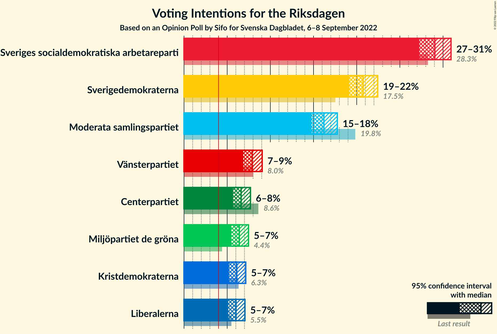

### Confidence Intervals

| Party | Last Result | Poll Result | 80% Confidence Interval | 90% Confidence Interval | 95% Confidence Interval | 99% Confidence Interval |
|:-----:|:-----------:|:-----------:|:-----------------------:|:-----------------------:|:-----------------------:|:-----------------------:|
| Sveriges socialdemokratiska arbetareparti | 28.3% | 29.1% | 27.9–30.3% |27.5–30.6% |27.3–30.9% |26.7–31.5% |
| Sverigedemokraterna | 17.5% | 20.7% | 19.7–21.8% |19.4–22.2% |19.1–22.4% |18.7–23.0% |
| Moderata samlingspartiet | 19.8% | 16.2% | 15.3–17.2% |15.0–17.5% |14.8–17.8% |14.3–18.2% |
| Vänsterpartiet | 8.0% | 7.9% | 7.2–8.7% |7.0–8.9% |6.9–9.1% |6.6–9.4% |
| Centerpartiet | 8.6% | 6.6% | 6.0–7.3% |5.8–7.5% |5.7–7.7% |5.4–8.0% |
| Miljöpartiet de gröna | 4.4% | 6.4% | 5.8–7.1% |5.6–7.3% |5.5–7.5% |5.2–7.8% |
| Kristdemokraterna | 6.3% | 6.1% | 5.5–6.8% |5.3–7.0% |5.2–7.1% |4.9–7.5% |
| Liberalerna | 5.5% | 6.0% | 5.4–6.7% |5.3–6.9% |5.1–7.1% |4.9–7.4% |

*Note:* The poll result column reflects the actual value used in the calculations. Published results may vary slightly, and in addition be rounded to fewer digits.

## Seats

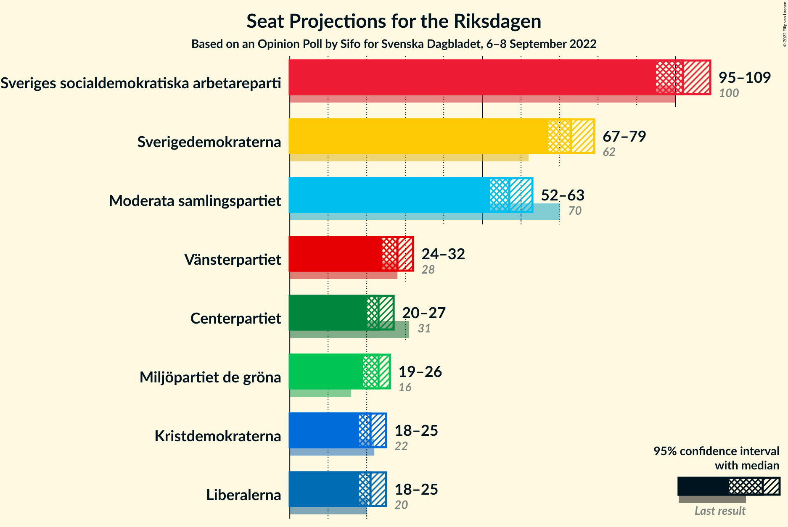

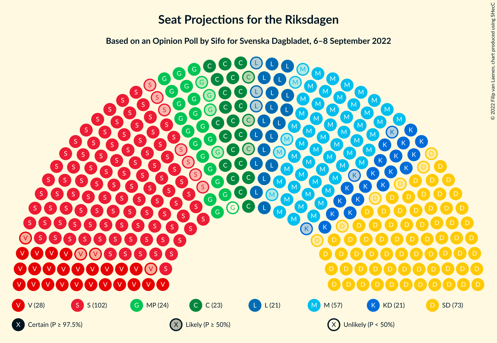

### Confidence Intervals

| Party | Last Result | Median | 80% Confidence Interval | 90% Confidence Interval | 95% Confidence Interval | 99% Confidence Interval |
|:-----:|:-----------:|:------:|:-----------------------:|:-----------------------:|:-----------------------:|:-----------------------:|
| <a href="#sveriges-socialdemokratiska-arbetareparti">Sveriges socialdemokratiska arbetareparti</a> | 100 | 102 | 98–107 |97–108 |95–109 |94–111 |
| <a href="#sverigedemokraterna">Sverigedemokraterna</a> | 62 | 73 | 69–77 |68–78 |67–79 |65–81 |
| <a href="#moderata-samlingspartiet">Moderata samlingspartiet</a> | 70 | 57 | 54–60 |53–62 |52–63 |50–64 |
| <a href="#vänsterpartiet">Vänsterpartiet</a> | 28 | 28 | 25–31 |25–31 |24–32 |23–33 |
| <a href="#centerpartiet">Centerpartiet</a> | 31 | 23 | 21–26 |20–26 |20–27 |19–28 |
| <a href="#miljöpartiet-de-gröna">Miljöpartiet de gröna</a> | 16 | 23 | 20–25 |20–26 |19–26 |18–28 |
| <a href="#kristdemokraterna">Kristdemokraterna</a> | 22 | 21 | 19–24 |19–25 |18–25 |17–26 |
| <a href="#liberalerna">Liberalerna</a> | 20 | 21 | 19–24 |18–24 |18–25 |17–26 |

### Sveriges socialdemokratiska arbetareparti

*For a full overview of the results for this party, see the [Sveriges socialdemokratiska arbetareparti](party-sverigessocialdemokratiskaarbetareparti.html) page.*

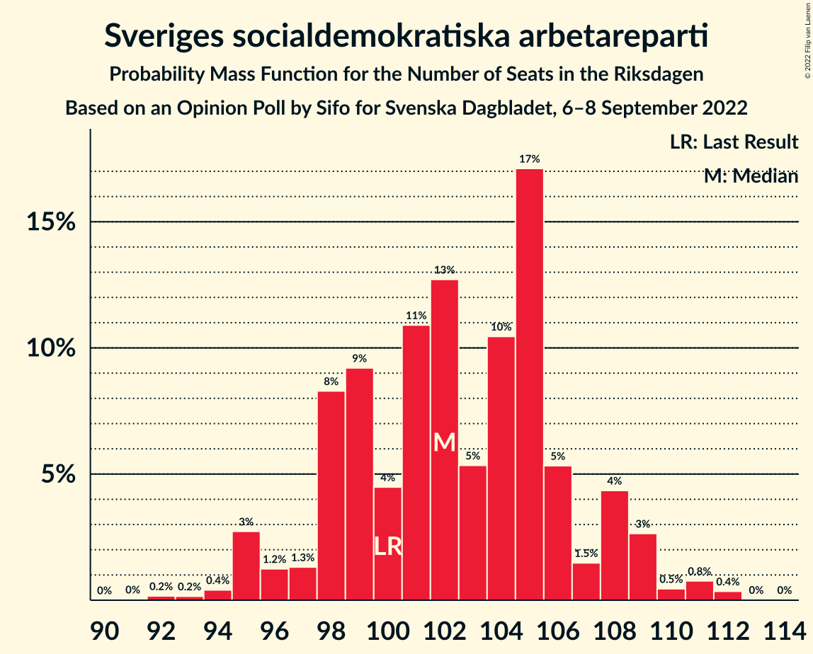

| Number of Seats | Probability | Accumulated | Special Marks |
|:---------------:|:-----------:|:-----------:|:-------------:|
| 92 | 0.2% | 100% |  |
| 93 | 0.2% | 99.8% |  |
| 94 | 0.4% | 99.6% |  |
| 95 | 3% | 99.2% |  |
| 96 | 1.2% | 96% |  |
| 97 | 1.3% | 95% |  |
| 98 | 8% | 94% |  |
| 99 | 9% | 86% |  |
| 100 | 4% | 76% | Last Result |
| 101 | 11% | 72% |  |
| 102 | 13% | 61% | Median |
| 103 | 5% | 48% |  |
| 104 | 10% | 43% |  |
| 105 | 17% | 33% |  |
| 106 | 5% | 15% |  |
| 107 | 1.5% | 10% |  |
| 108 | 4% | 9% |  |
| 109 | 3% | 4% |  |
| 110 | 0.5% | 2% |  |
| 111 | 0.8% | 1.2% |  |
| 112 | 0.4% | 0.4% |  |
| 113 | 0% | 0.1% |  |
| 114 | 0% | 0% |  |

### Sverigedemokraterna

*For a full overview of the results for this party, see the [Sverigedemokraterna](party-sverigedemokraterna.html) page.*

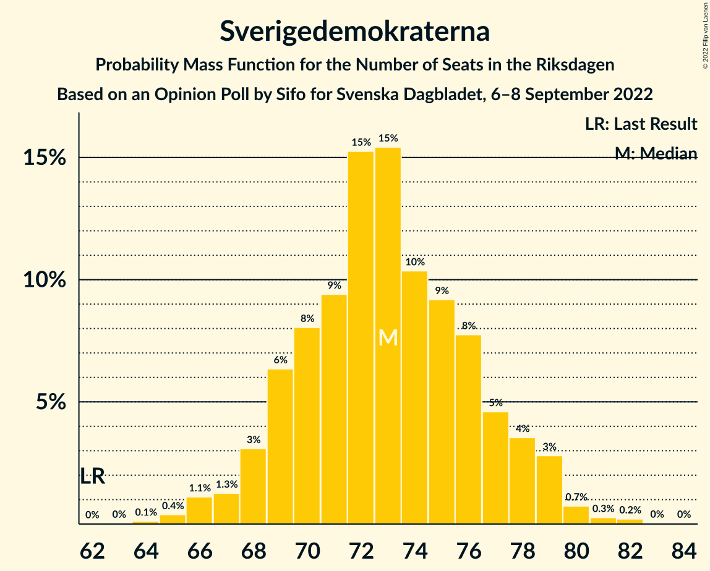

| Number of Seats | Probability | Accumulated | Special Marks |
|:---------------:|:-----------:|:-----------:|:-------------:|
| 62 | 0% | 100% | Last Result |
| 63 | 0% | 100% |  |
| 64 | 0.1% | 100% |  |
| 65 | 0.4% | 99.8% |  |
| 66 | 1.1% | 99.5% |  |
| 67 | 1.3% | 98% |  |
| 68 | 3% | 97% |  |
| 69 | 6% | 94% |  |
| 70 | 8% | 88% |  |
| 71 | 9% | 80% |  |
| 72 | 15% | 70% |  |
| 73 | 15% | 55% | Median |
| 74 | 10% | 40% |  |
| 75 | 9% | 29% |  |
| 76 | 8% | 20% |  |
| 77 | 5% | 12% |  |
| 78 | 4% | 8% |  |
| 79 | 3% | 4% |  |
| 80 | 0.7% | 1.3% |  |
| 81 | 0.3% | 0.5% |  |
| 82 | 0.2% | 0.3% |  |
| 83 | 0% | 0.1% |  |
| 84 | 0% | 0% |  |

### Moderata samlingspartiet

*For a full overview of the results for this party, see the [Moderata samlingspartiet](party-moderatasamlingspartiet.html) page.*

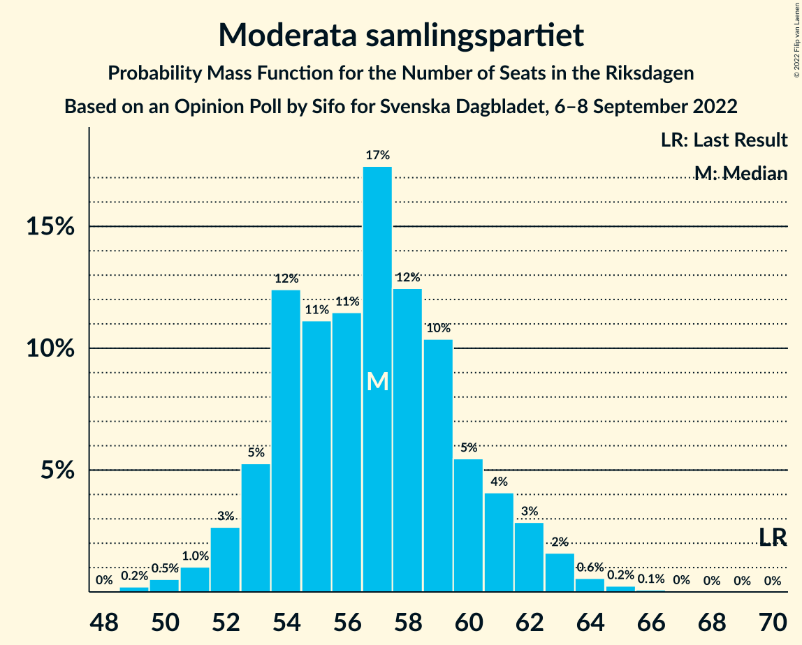

| Number of Seats | Probability | Accumulated | Special Marks |
|:---------------:|:-----------:|:-----------:|:-------------:|
| 49 | 0.2% | 100% |  |
| 50 | 0.5% | 99.7% |  |
| 51 | 1.0% | 99.2% |  |
| 52 | 3% | 98% |  |
| 53 | 5% | 96% |  |
| 54 | 12% | 90% |  |
| 55 | 11% | 78% |  |
| 56 | 11% | 67% |  |
| 57 | 17% | 55% | Median |
| 58 | 12% | 38% |  |
| 59 | 10% | 25% |  |
| 60 | 5% | 15% |  |
| 61 | 4% | 9% |  |
| 62 | 3% | 5% |  |
| 63 | 2% | 3% |  |
| 64 | 0.6% | 0.9% |  |
| 65 | 0.2% | 0.4% |  |
| 66 | 0.1% | 0.1% |  |
| 67 | 0% | 0% |  |
| 68 | 0% | 0% |  |
| 69 | 0% | 0% |  |
| 70 | 0% | 0% | Last Result |

### Vänsterpartiet

*For a full overview of the results for this party, see the [Vänsterpartiet](party-vänsterpartiet.html) page.*

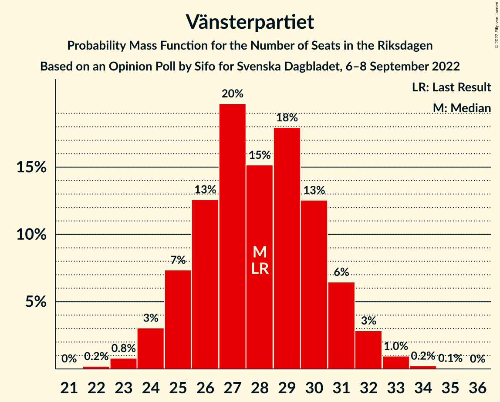

| Number of Seats | Probability | Accumulated | Special Marks |
|:---------------:|:-----------:|:-----------:|:-------------:|
| 22 | 0.2% | 100% |  |
| 23 | 0.8% | 99.8% |  |
| 24 | 3% | 99.0% |  |
| 25 | 7% | 96% |  |
| 26 | 13% | 89% |  |
| 27 | 20% | 76% |  |
| 28 | 15% | 56% | Last Result, Median |
| 29 | 18% | 41% |  |
| 30 | 13% | 23% |  |
| 31 | 6% | 11% |  |
| 32 | 3% | 4% |  |
| 33 | 1.0% | 1.3% |  |
| 34 | 0.2% | 0.3% |  |
| 35 | 0.1% | 0.1% |  |
| 36 | 0% | 0% |  |

### Centerpartiet

*For a full overview of the results for this party, see the [Centerpartiet](party-centerpartiet.html) page.*

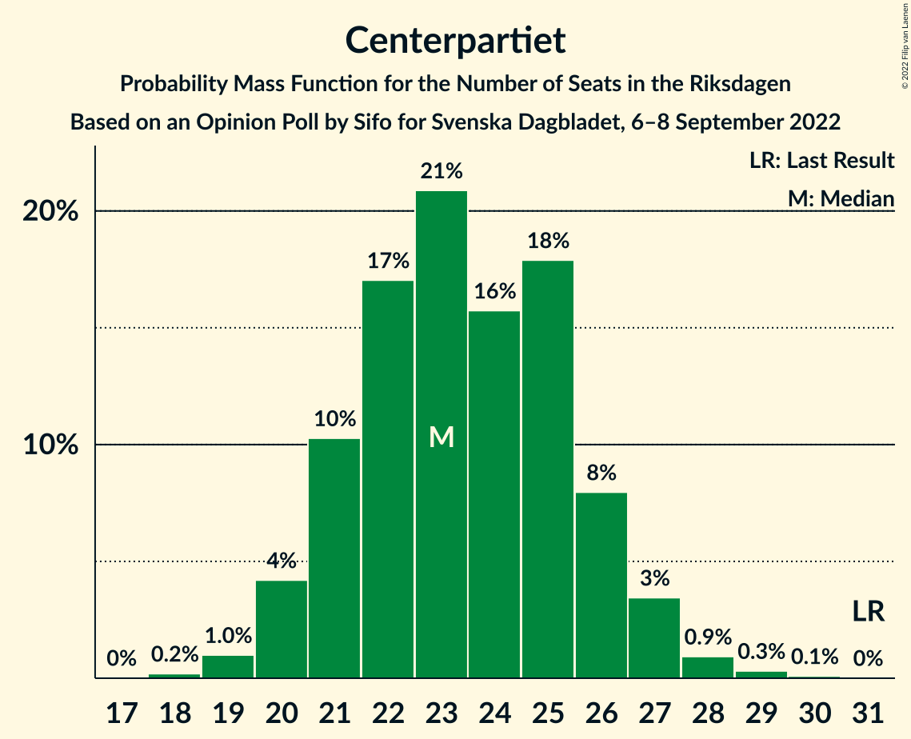

| Number of Seats | Probability | Accumulated | Special Marks |
|:---------------:|:-----------:|:-----------:|:-------------:|
| 18 | 0.2% | 100% |  |
| 19 | 1.0% | 99.8% |  |
| 20 | 4% | 98.8% |  |
| 21 | 10% | 95% |  |
| 22 | 17% | 84% |  |
| 23 | 21% | 67% | Median |
| 24 | 16% | 46% |  |
| 25 | 18% | 31% |  |
| 26 | 8% | 13% |  |
| 27 | 3% | 5% |  |
| 28 | 0.9% | 1.3% |  |
| 29 | 0.3% | 0.4% |  |
| 30 | 0.1% | 0.1% |  |
| 31 | 0% | 0% | Last Result |

### Miljöpartiet de gröna

*For a full overview of the results for this party, see the [Miljöpartiet de gröna](party-miljöpartietdegröna.html) page.*

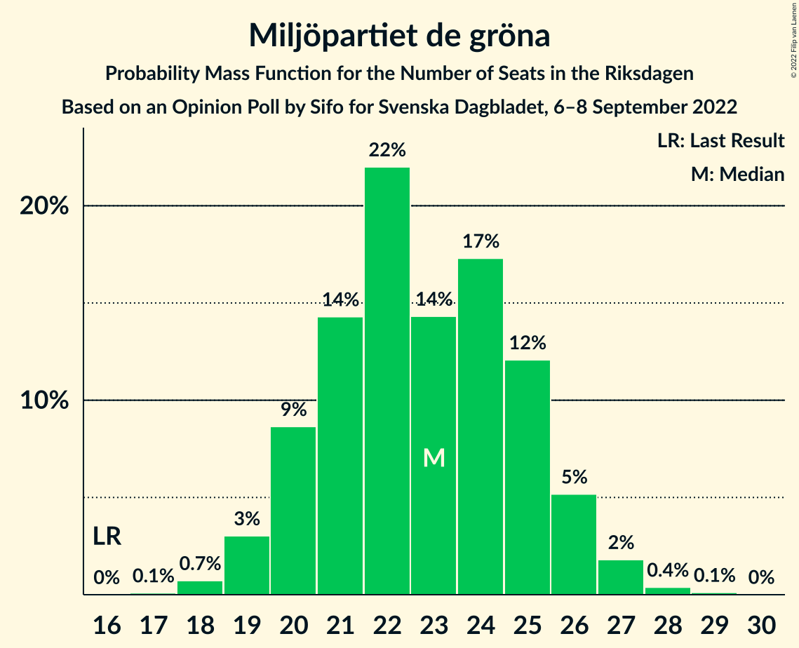

| Number of Seats | Probability | Accumulated | Special Marks |
|:---------------:|:-----------:|:-----------:|:-------------:|
| 16 | 0% | 100% | Last Result |
| 17 | 0.1% | 100% |  |
| 18 | 0.7% | 99.9% |  |
| 19 | 3% | 99.2% |  |
| 20 | 9% | 96% |  |
| 21 | 14% | 87% |  |
| 22 | 22% | 73% |  |
| 23 | 14% | 51% | Median |
| 24 | 17% | 37% |  |
| 25 | 12% | 20% |  |
| 26 | 5% | 8% |  |
| 27 | 2% | 2% |  |
| 28 | 0.4% | 0.5% |  |
| 29 | 0.1% | 0.1% |  |
| 30 | 0% | 0% |  |

### Kristdemokraterna

*For a full overview of the results for this party, see the [Kristdemokraterna](party-kristdemokraterna.html) page.*

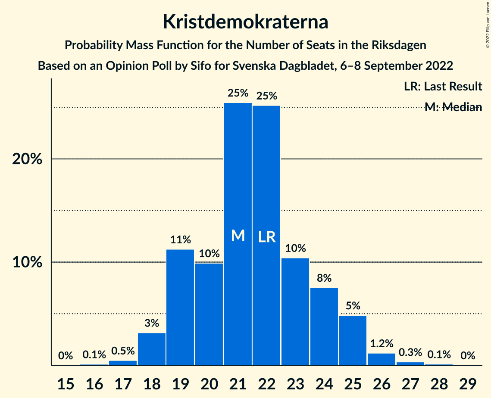

| Number of Seats | Probability | Accumulated | Special Marks |
|:---------------:|:-----------:|:-----------:|:-------------:|
| 16 | 0.1% | 100% |  |
| 17 | 0.5% | 99.9% |  |
| 18 | 3% | 99.4% |  |
| 19 | 11% | 96% |  |
| 20 | 10% | 85% |  |
| 21 | 25% | 75% | Median |
| 22 | 25% | 50% | Last Result |
| 23 | 10% | 24% |  |
| 24 | 8% | 14% |  |
| 25 | 5% | 6% |  |
| 26 | 1.2% | 2% |  |
| 27 | 0.3% | 0.5% |  |
| 28 | 0.1% | 0.1% |  |
| 29 | 0% | 0% |  |

### Liberalerna

*For a full overview of the results for this party, see the [Liberalerna](party-liberalerna.html) page.*

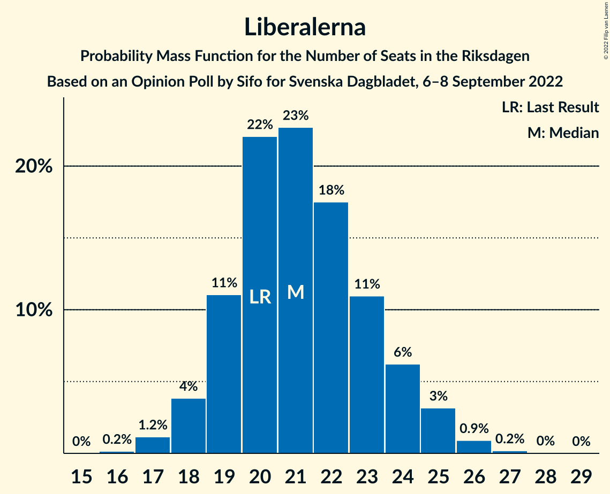

| Number of Seats | Probability | Accumulated | Special Marks |
|:---------------:|:-----------:|:-----------:|:-------------:|
| 16 | 0.2% | 100% |  |
| 17 | 1.2% | 99.8% |  |
| 18 | 4% | 98.7% |  |
| 19 | 11% | 95% |  |
| 20 | 22% | 84% | Last Result |
| 21 | 23% | 62% | Median |
| 22 | 18% | 39% |  |
| 23 | 11% | 22% |  |
| 24 | 6% | 11% |  |
| 25 | 3% | 4% |  |
| 26 | 0.9% | 1.1% |  |
| 27 | 0.2% | 0.2% |  |
| 28 | 0% | 0.1% |  |
| 29 | 0% | 0% |  |

## Coalitions

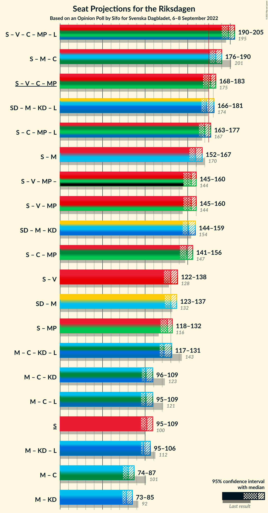

### Confidence Intervals

| Coalition | Last Result | Median | Majority? | 80% Confidence Interval | 90% Confidence Interval | 95% Confidence Interval | 99% Confidence Interval |
|:---------:|:-----------:|:------:|:---------:|:-----------------------:|:-----------------------:|:-----------------------:|:-----------------------:|
| Sveriges socialdemokratiska arbetareparti – Vänsterpartiet – Centerpartiet – Miljöpartiet de gröna – Liberalerna | 195 | 198 | 100% | 193–202 | 191–204 | 190–205 | 188–206 |
| Sveriges socialdemokratiska arbetareparti – Moderata samlingspartiet – Centerpartiet | 201 | 183 | 98.9% | 177–187 | 176–189 | 176–190 | 174–192 |
| Sveriges socialdemokratiska arbetareparti – Vänsterpartiet – Centerpartiet – Miljöpartiet de gröna | 175 | 177 | 71% | 170–181 | 170–182 | 168–183 | 167–185 |
| Sverigedemokraterna – Moderata samlingspartiet – Kristdemokraterna – Liberalerna | 174 | 172 | 29% | 168–179 | 167–179 | 166–181 | 164–182 |
| Sveriges socialdemokratiska arbetareparti – Centerpartiet – Miljöpartiet de gröna – Liberalerna | 167 | 170 | 9% | 164–174 | 164–176 | 163–177 | 160–179 |
| Sveriges socialdemokratiska arbetareparti – Moderata samlingspartiet | 170 | 159 | 0% | 154–164 | 153–165 | 152–167 | 150–169 |
| Sveriges socialdemokratiska arbetareparti – Vänsterpartiet – Miljöpartiet de gröna | 144 | 154 | 0% | 147–157 | 146–158 | 145–160 | 144–161 |
| Sverigedemokraterna – Moderata samlingspartiet – Kristdemokraterna | 154 | 151 | 0% | 147–156 | 145–158 | 144–159 | 143–161 |
| Sveriges socialdemokratiska arbetareparti – Centerpartiet – Miljöpartiet de gröna | 147 | 149 | 0% | 143–153 | 142–154 | 141–156 | 139–157 |
| Sveriges socialdemokratiska arbetareparti – Vänsterpartiet | 128 | 130 | 0% | 125–135 | 124–136 | 122–138 | 121–139 |
| Sverigedemokraterna – Moderata samlingspartiet | 132 | 130 | 0% | 126–134 | 124–136 | 123–137 | 121–139 |
| Sveriges socialdemokratiska arbetareparti – Miljöpartiet de gröna | 116 | 126 | 0% | 120–130 | 119–131 | 118–132 | 116–134 |
| Moderata samlingspartiet – Centerpartiet – Kristdemokraterna – Liberalerna | 143 | 122 | 0% | 119–129 | 118–130 | 117–131 | 116–132 |
| Moderata samlingspartiet – Centerpartiet – Kristdemokraterna | 123 | 101 | 0% | 98–106 | 96–108 | 96–109 | 94–111 |
| Moderata samlingspartiet – Centerpartiet – Liberalerna | 121 | 101 | 0% | 97–106 | 96–107 | 95–109 | 93–111 |
| Sveriges socialdemokratiska arbetareparti | 100 | 102 | 0% | 98–107 | 97–108 | 95–109 | 94–111 |
| Moderata samlingspartiet – Kristdemokraterna – Liberalerna | 112 | 98 | 0% | 96–105 | 95–106 | 95–106 | 94–107 |
| Moderata samlingspartiet – Centerpartiet | 101 | 80 | 0% | 76–84 | 75–86 | 74–87 | 73–89 |
| Moderata samlingspartiet – Kristdemokraterna | 92 | 78 | 0% | 75–83 | 74–84 | 73–85 | 71–87 |

### Sveriges socialdemokratiska arbetareparti – Vänsterpartiet – Centerpartiet – Miljöpartiet de gröna – Liberalerna

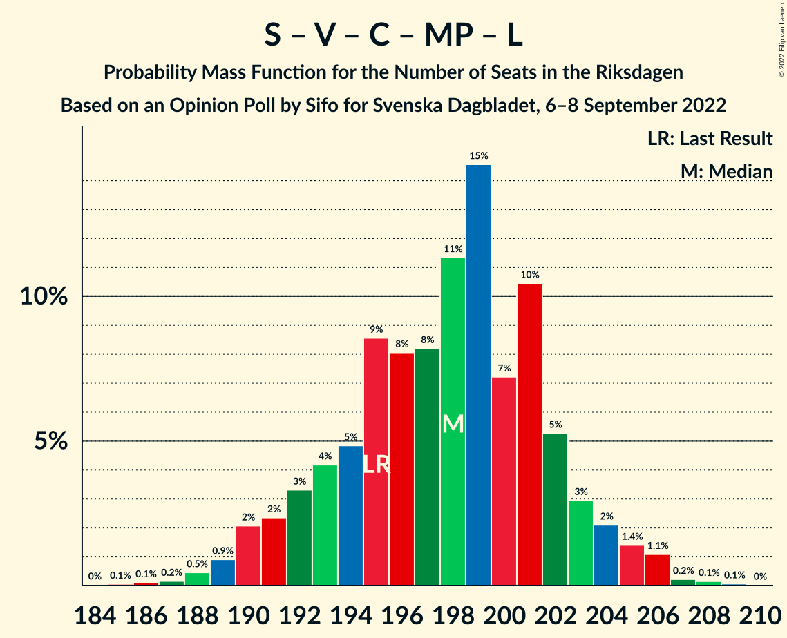

| Number of Seats | Probability | Accumulated | Special Marks |
|:---------------:|:-----------:|:-----------:|:-------------:|
| 185 | 0.1% | 100% |  |
| 186 | 0.1% | 99.9% |  |
| 187 | 0.2% | 99.8% |  |
| 188 | 0.5% | 99.7% |  |
| 189 | 0.9% | 99.2% |  |
| 190 | 2% | 98% |  |
| 191 | 2% | 96% |  |
| 192 | 3% | 94% |  |
| 193 | 4% | 91% |  |
| 194 | 5% | 86% |  |
| 195 | 9% | 82% | Last Result |
| 196 | 8% | 73% |  |
| 197 | 8% | 65% | Median |
| 198 | 11% | 57% |  |
| 199 | 15% | 45% |  |
| 200 | 7% | 31% |  |
| 201 | 10% | 24% |  |
| 202 | 5% | 13% |  |
| 203 | 3% | 8% |  |
| 204 | 2% | 5% |  |
| 205 | 1.4% | 3% |  |
| 206 | 1.1% | 2% |  |
| 207 | 0.2% | 0.5% |  |
| 208 | 0.1% | 0.2% |  |
| 209 | 0.1% | 0.1% |  |
| 210 | 0% | 0% |  |

### Sveriges socialdemokratiska arbetareparti – Moderata samlingspartiet – Centerpartiet

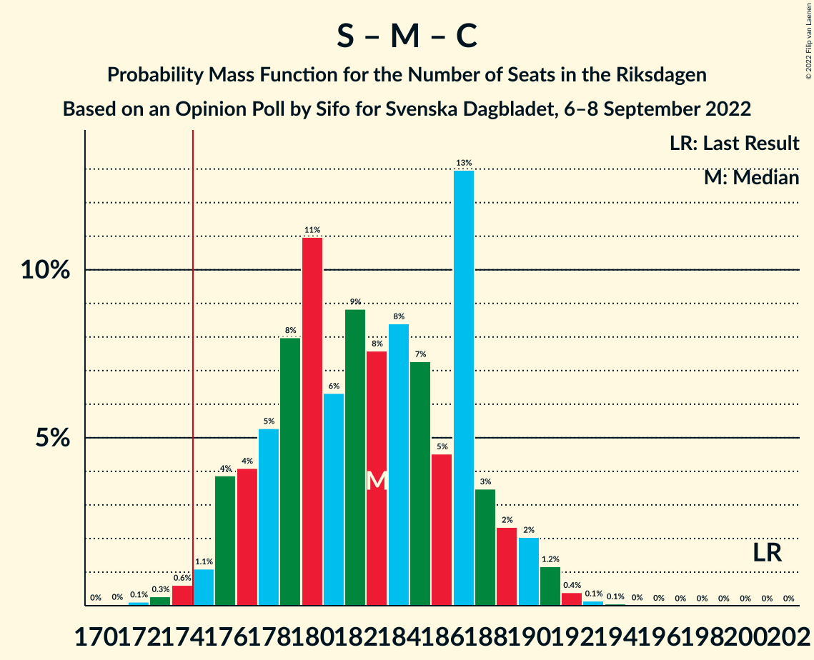

| Number of Seats | Probability | Accumulated | Special Marks |
|:---------------:|:-----------:|:-----------:|:-------------:|
| 171 | 0% | 100% |  |
| 172 | 0.1% | 99.9% |  |
| 173 | 0.3% | 99.8% |  |
| 174 | 0.6% | 99.5% |  |
| 175 | 1.1% | 98.9% | Majority |
| 176 | 4% | 98% |  |
| 177 | 4% | 94% |  |
| 178 | 5% | 90% |  |
| 179 | 8% | 85% |  |
| 180 | 11% | 77% |  |
| 181 | 6% | 66% |  |
| 182 | 9% | 59% | Median |
| 183 | 8% | 50% |  |
| 184 | 8% | 43% |  |
| 185 | 7% | 34% |  |
| 186 | 5% | 27% |  |
| 187 | 13% | 23% |  |
| 188 | 3% | 10% |  |
| 189 | 2% | 6% |  |
| 190 | 2% | 4% |  |
| 191 | 1.2% | 2% |  |
| 192 | 0.4% | 0.7% |  |
| 193 | 0.1% | 0.3% |  |
| 194 | 0.1% | 0.1% |  |
| 195 | 0% | 0% |  |
| 196 | 0% | 0% |  |
| 197 | 0% | 0% |  |
| 198 | 0% | 0% |  |
| 199 | 0% | 0% |  |
| 200 | 0% | 0% |  |
| 201 | 0% | 0% | Last Result |

### Sveriges socialdemokratiska arbetareparti – Vänsterpartiet – Centerpartiet – Miljöpartiet de gröna

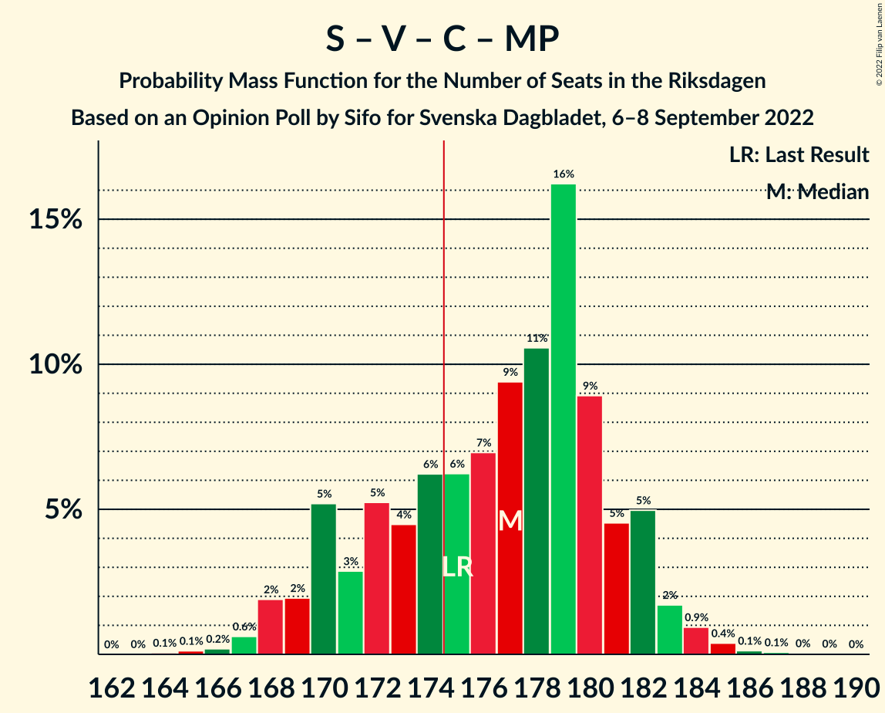

| Number of Seats | Probability | Accumulated | Special Marks |
|:---------------:|:-----------:|:-----------:|:-------------:|
| 164 | 0.1% | 100% |  |
| 165 | 0.1% | 99.9% |  |
| 166 | 0.2% | 99.8% |  |
| 167 | 0.6% | 99.6% |  |
| 168 | 2% | 99.0% |  |
| 169 | 2% | 97% |  |
| 170 | 5% | 95% |  |
| 171 | 3% | 90% |  |
| 172 | 5% | 87% |  |
| 173 | 4% | 82% |  |
| 174 | 6% | 77% |  |
| 175 | 6% | 71% | Last Result, Majority |
| 176 | 7% | 65% | Median |
| 177 | 9% | 58% |  |
| 178 | 11% | 49% |  |
| 179 | 16% | 38% |  |
| 180 | 9% | 22% |  |
| 181 | 5% | 13% |  |
| 182 | 5% | 8% |  |
| 183 | 2% | 3% |  |
| 184 | 0.9% | 2% |  |
| 185 | 0.4% | 0.7% |  |
| 186 | 0.1% | 0.3% |  |
| 187 | 0.1% | 0.2% |  |
| 188 | 0% | 0.1% |  |
| 189 | 0% | 0% |  |

### Sverigedemokraterna – Moderata samlingspartiet – Kristdemokraterna – Liberalerna

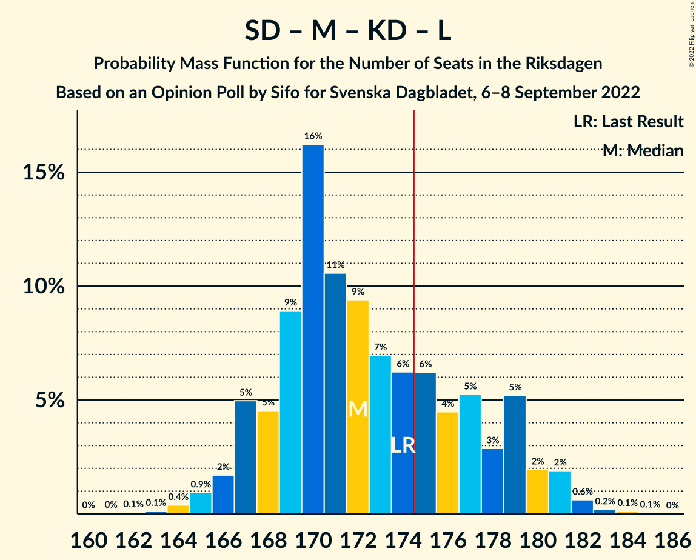

| Number of Seats | Probability | Accumulated | Special Marks |
|:---------------:|:-----------:|:-----------:|:-------------:|
| 161 | 0% | 100% |  |
| 162 | 0.1% | 99.9% |  |
| 163 | 0.1% | 99.8% |  |
| 164 | 0.4% | 99.7% |  |
| 165 | 0.9% | 99.3% |  |
| 166 | 2% | 98% |  |
| 167 | 5% | 97% |  |
| 168 | 5% | 92% |  |
| 169 | 9% | 87% |  |
| 170 | 16% | 78% |  |
| 171 | 11% | 62% |  |
| 172 | 9% | 51% | Median |
| 173 | 7% | 42% |  |
| 174 | 6% | 35% | Last Result |
| 175 | 6% | 29% | Majority |
| 176 | 4% | 23% |  |
| 177 | 5% | 18% |  |
| 178 | 3% | 13% |  |
| 179 | 5% | 10% |  |
| 180 | 2% | 5% |  |
| 181 | 2% | 3% |  |
| 182 | 0.6% | 1.0% |  |
| 183 | 0.2% | 0.4% |  |
| 184 | 0.1% | 0.2% |  |
| 185 | 0.1% | 0.1% |  |
| 186 | 0% | 0% |  |

### Sveriges socialdemokratiska arbetareparti – Centerpartiet – Miljöpartiet de gröna – Liberalerna

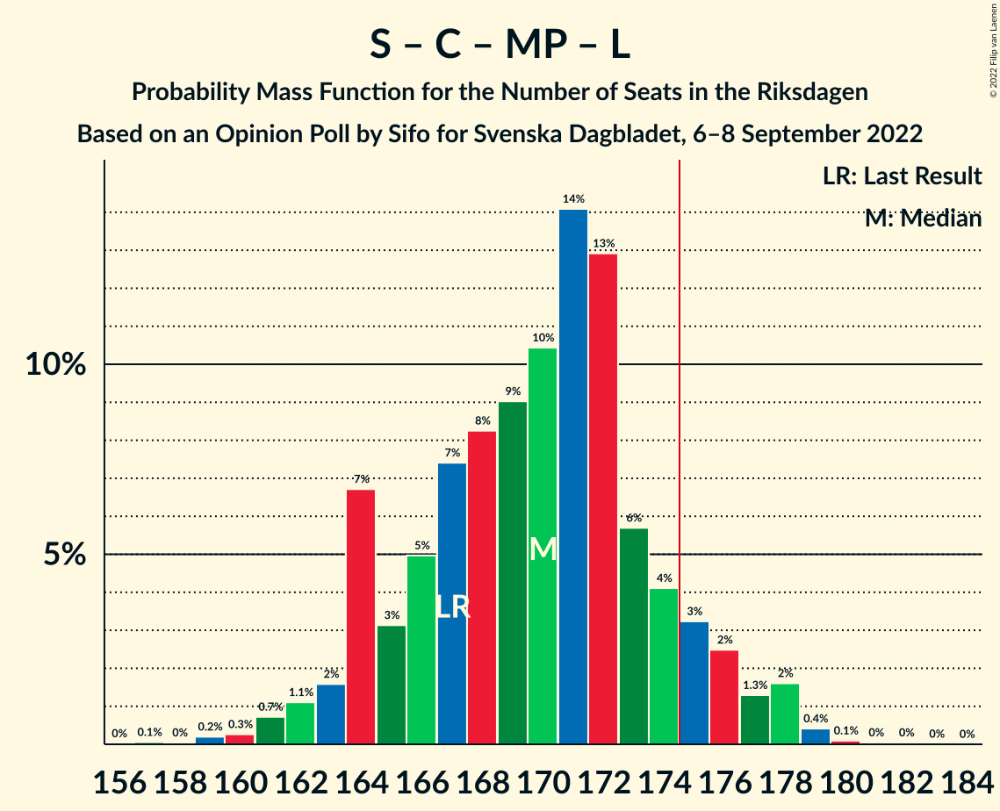

| Number of Seats | Probability | Accumulated | Special Marks |
|:---------------:|:-----------:|:-----------:|:-------------:|
| 157 | 0.1% | 100% |  |
| 158 | 0% | 99.9% |  |
| 159 | 0.2% | 99.9% |  |
| 160 | 0.3% | 99.7% |  |
| 161 | 0.7% | 99.4% |  |
| 162 | 1.1% | 98.7% |  |
| 163 | 2% | 98% |  |
| 164 | 7% | 96% |  |
| 165 | 3% | 89% |  |
| 166 | 5% | 86% |  |
| 167 | 7% | 81% | Last Result |
| 168 | 8% | 74% |  |
| 169 | 9% | 66% | Median |
| 170 | 10% | 56% |  |
| 171 | 14% | 46% |  |
| 172 | 13% | 32% |  |
| 173 | 6% | 19% |  |
| 174 | 4% | 13% |  |
| 175 | 3% | 9% | Majority |
| 176 | 2% | 6% |  |
| 177 | 1.3% | 4% |  |
| 178 | 2% | 2% |  |
| 179 | 0.4% | 0.6% |  |
| 180 | 0.1% | 0.2% |  |
| 181 | 0% | 0.1% |  |
| 182 | 0% | 0.1% |  |
| 183 | 0% | 0% |  |

### Sveriges socialdemokratiska arbetareparti – Moderata samlingspartiet

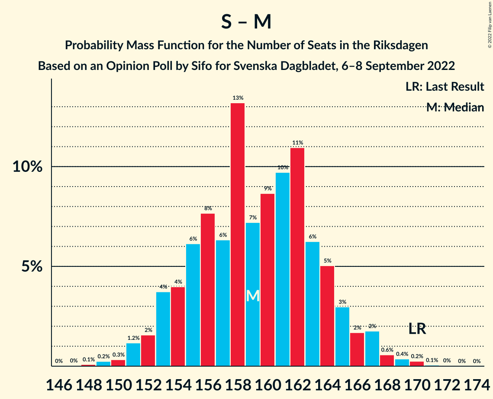

| Number of Seats | Probability | Accumulated | Special Marks |
|:---------------:|:-----------:|:-----------:|:-------------:|
| 147 | 0% | 100% |  |
| 148 | 0.1% | 99.9% |  |
| 149 | 0.2% | 99.9% |  |
| 150 | 0.3% | 99.6% |  |
| 151 | 1.2% | 99.3% |  |
| 152 | 2% | 98% |  |
| 153 | 4% | 97% |  |
| 154 | 4% | 93% |  |
| 155 | 6% | 89% |  |
| 156 | 8% | 83% |  |
| 157 | 6% | 75% |  |
| 158 | 13% | 69% |  |
| 159 | 7% | 56% | Median |
| 160 | 9% | 48% |  |
| 161 | 10% | 40% |  |
| 162 | 11% | 30% |  |
| 163 | 6% | 19% |  |
| 164 | 5% | 13% |  |
| 165 | 3% | 8% |  |
| 166 | 2% | 5% |  |
| 167 | 2% | 3% |  |
| 168 | 0.6% | 1.3% |  |
| 169 | 0.4% | 0.7% |  |
| 170 | 0.2% | 0.4% | Last Result |
| 171 | 0.1% | 0.1% |  |
| 172 | 0% | 0.1% |  |
| 173 | 0% | 0% |  |

### Sveriges socialdemokratiska arbetareparti – Vänsterpartiet – Miljöpartiet de gröna

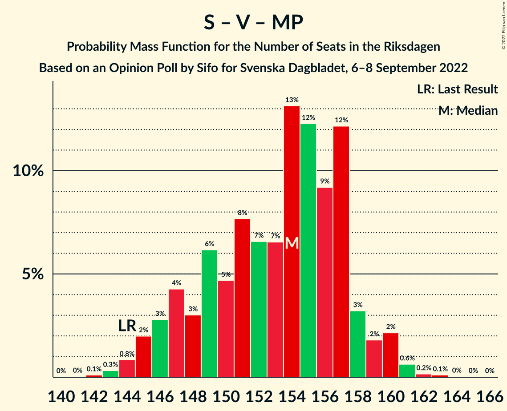

| Number of Seats | Probability | Accumulated | Special Marks |
|:---------------:|:-----------:|:-----------:|:-------------:|
| 141 | 0% | 100% |  |
| 142 | 0.1% | 99.9% |  |
| 143 | 0.3% | 99.8% |  |
| 144 | 0.8% | 99.5% | Last Result |
| 145 | 2% | 98.7% |  |
| 146 | 3% | 97% |  |
| 147 | 4% | 94% |  |
| 148 | 3% | 90% |  |
| 149 | 6% | 87% |  |
| 150 | 5% | 80% |  |
| 151 | 8% | 76% |  |
| 152 | 7% | 68% |  |
| 153 | 7% | 61% | Median |
| 154 | 13% | 55% |  |
| 155 | 12% | 42% |  |
| 156 | 9% | 30% |  |
| 157 | 12% | 20% |  |
| 158 | 3% | 8% |  |
| 159 | 2% | 5% |  |
| 160 | 2% | 3% |  |
| 161 | 0.6% | 1.0% |  |
| 162 | 0.2% | 0.4% |  |
| 163 | 0.1% | 0.2% |  |
| 164 | 0% | 0.1% |  |
| 165 | 0% | 0.1% |  |
| 166 | 0% | 0% |  |

### Sverigedemokraterna – Moderata samlingspartiet – Kristdemokraterna

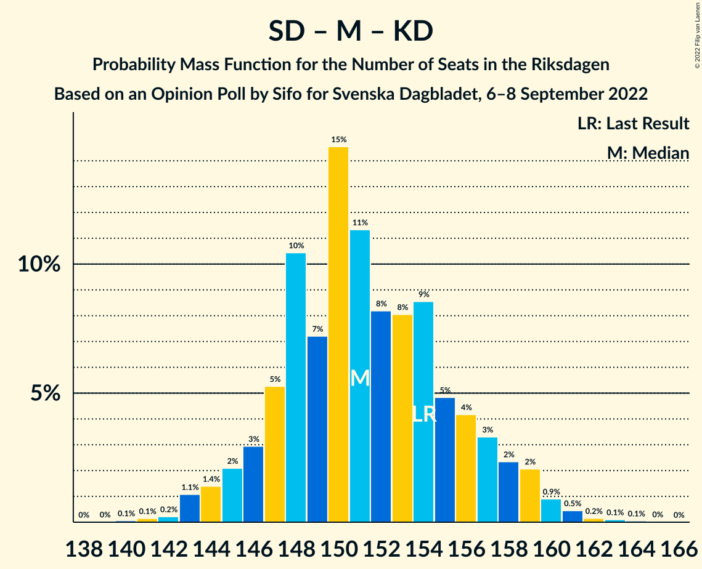

| Number of Seats | Probability | Accumulated | Special Marks |
|:---------------:|:-----------:|:-----------:|:-------------:|
| 140 | 0.1% | 100% |  |
| 141 | 0.1% | 99.9% |  |
| 142 | 0.2% | 99.8% |  |
| 143 | 1.1% | 99.5% |  |
| 144 | 1.4% | 98% |  |
| 145 | 2% | 97% |  |
| 146 | 3% | 95% |  |
| 147 | 5% | 92% |  |
| 148 | 10% | 87% |  |
| 149 | 7% | 76% |  |
| 150 | 15% | 69% |  |
| 151 | 11% | 55% | Median |
| 152 | 8% | 43% |  |
| 153 | 8% | 35% |  |
| 154 | 9% | 27% | Last Result |
| 155 | 5% | 18% |  |
| 156 | 4% | 14% |  |
| 157 | 3% | 9% |  |
| 158 | 2% | 6% |  |
| 159 | 2% | 4% |  |
| 160 | 0.9% | 2% |  |
| 161 | 0.5% | 0.8% |  |
| 162 | 0.2% | 0.3% |  |
| 163 | 0.1% | 0.2% |  |
| 164 | 0.1% | 0.1% |  |
| 165 | 0% | 0% |  |

### Sveriges socialdemokratiska arbetareparti – Centerpartiet – Miljöpartiet de gröna

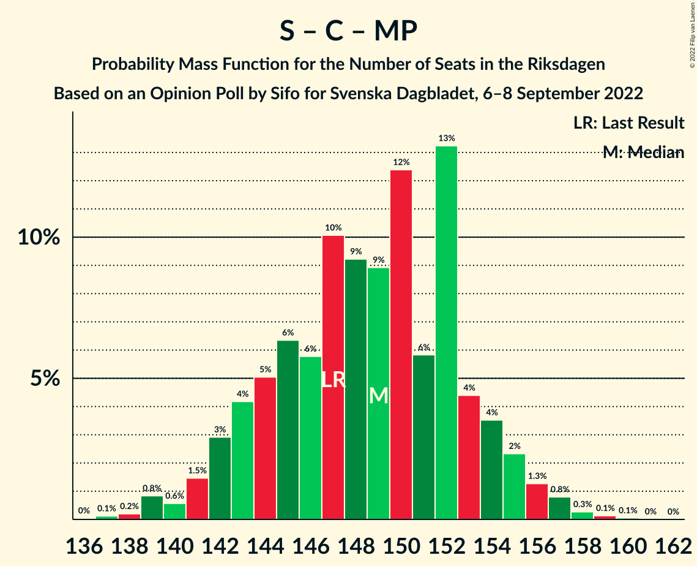

| Number of Seats | Probability | Accumulated | Special Marks |
|:---------------:|:-----------:|:-----------:|:-------------:|
| 136 | 0% | 100% |  |
| 137 | 0.1% | 99.9% |  |
| 138 | 0.2% | 99.8% |  |
| 139 | 0.8% | 99.6% |  |
| 140 | 0.6% | 98.8% |  |
| 141 | 1.5% | 98% |  |
| 142 | 3% | 97% |  |
| 143 | 4% | 94% |  |
| 144 | 5% | 90% |  |
| 145 | 6% | 85% |  |
| 146 | 6% | 78% |  |
| 147 | 10% | 72% | Last Result |
| 148 | 9% | 62% | Median |
| 149 | 9% | 53% |  |
| 150 | 12% | 44% |  |
| 151 | 6% | 32% |  |
| 152 | 13% | 26% |  |
| 153 | 4% | 13% |  |
| 154 | 4% | 8% |  |
| 155 | 2% | 5% |  |
| 156 | 1.3% | 3% |  |
| 157 | 0.8% | 1.3% |  |
| 158 | 0.3% | 0.5% |  |
| 159 | 0.1% | 0.2% |  |
| 160 | 0.1% | 0.1% |  |
| 161 | 0% | 0% |  |

### Sveriges socialdemokratiska arbetareparti – Vänsterpartiet

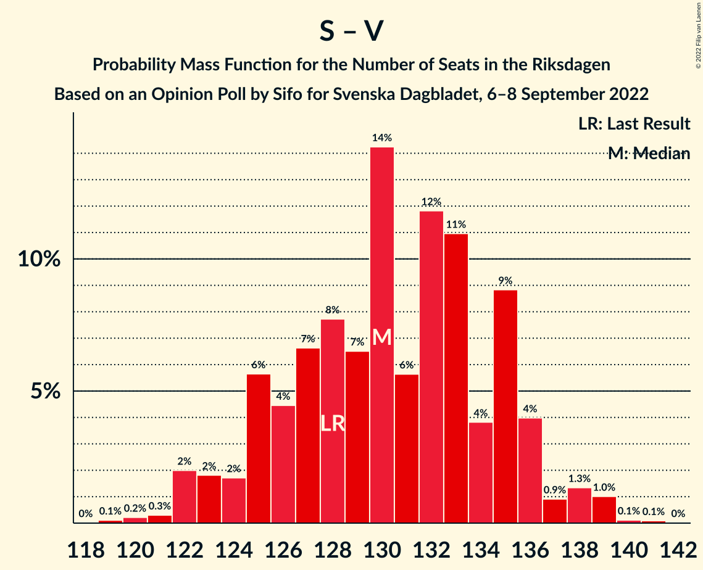

| Number of Seats | Probability | Accumulated | Special Marks |
|:---------------:|:-----------:|:-----------:|:-------------:|
| 119 | 0.1% | 100% |  |
| 120 | 0.2% | 99.9% |  |
| 121 | 0.3% | 99.6% |  |
| 122 | 2% | 99.3% |  |
| 123 | 2% | 97% |  |
| 124 | 2% | 96% |  |
| 125 | 6% | 94% |  |
| 126 | 4% | 88% |  |
| 127 | 7% | 84% |  |
| 128 | 8% | 77% | Last Result |
| 129 | 7% | 69% |  |
| 130 | 14% | 63% | Median |
| 131 | 6% | 49% |  |
| 132 | 12% | 43% |  |
| 133 | 11% | 31% |  |
| 134 | 4% | 20% |  |
| 135 | 9% | 16% |  |
| 136 | 4% | 7% |  |
| 137 | 0.9% | 4% |  |
| 138 | 1.3% | 3% |  |
| 139 | 1.0% | 1.3% |  |
| 140 | 0.1% | 0.2% |  |
| 141 | 0.1% | 0.1% |  |
| 142 | 0% | 0% |  |

### Sverigedemokraterna – Moderata samlingspartiet

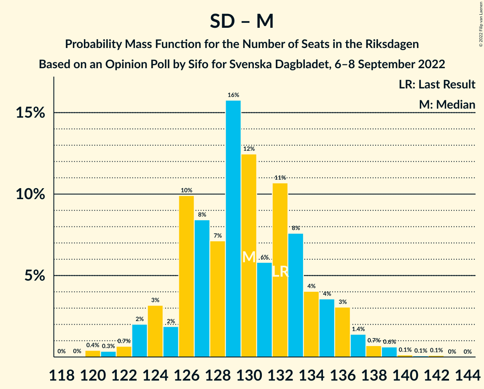

| Number of Seats | Probability | Accumulated | Special Marks |
|:---------------:|:-----------:|:-----------:|:-------------:|
| 119 | 0% | 100% |  |
| 120 | 0.4% | 99.9% |  |
| 121 | 0.3% | 99.5% |  |
| 122 | 0.7% | 99.2% |  |
| 123 | 2% | 98% |  |
| 124 | 3% | 96% |  |
| 125 | 2% | 93% |  |
| 126 | 10% | 91% |  |
| 127 | 8% | 82% |  |
| 128 | 7% | 73% |  |
| 129 | 16% | 66% |  |
| 130 | 12% | 50% | Median |
| 131 | 6% | 38% |  |
| 132 | 11% | 32% | Last Result |
| 133 | 8% | 21% |  |
| 134 | 4% | 14% |  |
| 135 | 4% | 10% |  |
| 136 | 3% | 6% |  |
| 137 | 1.4% | 3% |  |
| 138 | 0.7% | 2% |  |
| 139 | 0.6% | 0.9% |  |
| 140 | 0.1% | 0.3% |  |
| 141 | 0.1% | 0.2% |  |
| 142 | 0.1% | 0.1% |  |
| 143 | 0% | 0% |  |

### Sveriges socialdemokratiska arbetareparti – Miljöpartiet de gröna

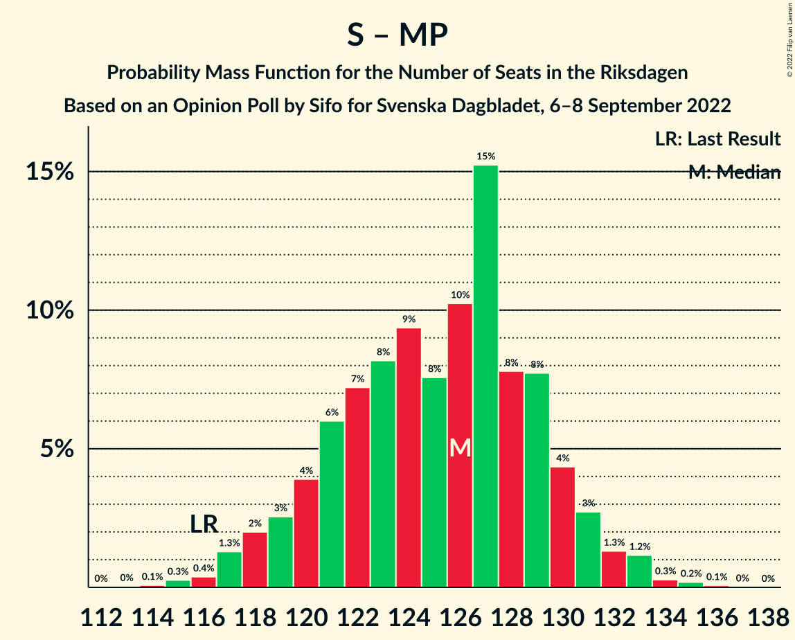

| Number of Seats | Probability | Accumulated | Special Marks |
|:---------------:|:-----------:|:-----------:|:-------------:|
| 113 | 0% | 100% |  |
| 114 | 0.1% | 99.9% |  |
| 115 | 0.3% | 99.9% |  |
| 116 | 0.4% | 99.6% | Last Result |
| 117 | 1.3% | 99.2% |  |
| 118 | 2% | 98% |  |
| 119 | 3% | 96% |  |
| 120 | 4% | 93% |  |
| 121 | 6% | 89% |  |
| 122 | 7% | 83% |  |
| 123 | 8% | 76% |  |
| 124 | 9% | 68% |  |
| 125 | 8% | 59% | Median |
| 126 | 10% | 51% |  |
| 127 | 15% | 41% |  |
| 128 | 8% | 26% |  |
| 129 | 8% | 18% |  |
| 130 | 4% | 10% |  |
| 131 | 3% | 6% |  |
| 132 | 1.3% | 3% |  |
| 133 | 1.2% | 2% |  |
| 134 | 0.3% | 0.6% |  |
| 135 | 0.2% | 0.3% |  |
| 136 | 0.1% | 0.1% |  |
| 137 | 0% | 0% |  |

### Moderata samlingspartiet – Centerpartiet – Kristdemokraterna – Liberalerna

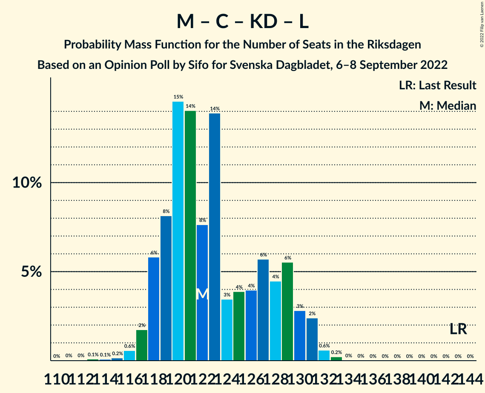

| Number of Seats | Probability | Accumulated | Special Marks |
|:---------------:|:-----------:|:-----------:|:-------------:|
| 111 | 0% | 100% |  |
| 112 | 0% | 99.9% |  |
| 113 | 0.1% | 99.9% |  |
| 114 | 0.1% | 99.8% |  |
| 115 | 0.2% | 99.7% |  |
| 116 | 0.6% | 99.6% |  |
| 117 | 2% | 99.0% |  |
| 118 | 6% | 97% |  |
| 119 | 8% | 91% |  |
| 120 | 15% | 83% |  |
| 121 | 14% | 69% |  |
| 122 | 8% | 55% | Median |
| 123 | 14% | 47% |  |
| 124 | 3% | 33% |  |
| 125 | 4% | 30% |  |
| 126 | 4% | 26% |  |
| 127 | 6% | 22% |  |
| 128 | 4% | 16% |  |
| 129 | 6% | 12% |  |
| 130 | 3% | 6% |  |
| 131 | 2% | 3% |  |
| 132 | 0.6% | 0.9% |  |
| 133 | 0.2% | 0.3% |  |
| 134 | 0% | 0.1% |  |
| 135 | 0% | 0% |  |
| 136 | 0% | 0% |  |
| 137 | 0% | 0% |  |
| 138 | 0% | 0% |  |
| 139 | 0% | 0% |  |
| 140 | 0% | 0% |  |
| 141 | 0% | 0% |  |
| 142 | 0% | 0% |  |
| 143 | 0% | 0% | Last Result |

### Moderata samlingspartiet – Centerpartiet – Kristdemokraterna

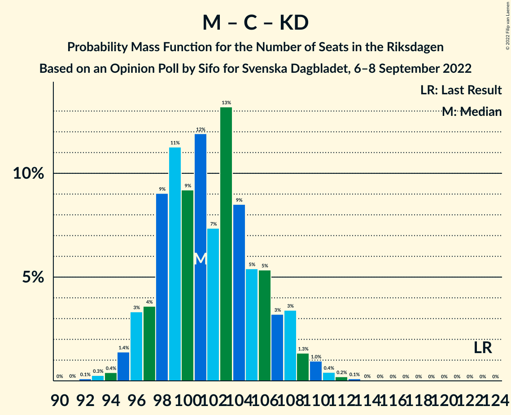

| Number of Seats | Probability | Accumulated | Special Marks |
|:---------------:|:-----------:|:-----------:|:-------------:|
| 92 | 0.1% | 100% |  |
| 93 | 0.3% | 99.9% |  |
| 94 | 0.4% | 99.6% |  |
| 95 | 1.4% | 99.2% |  |
| 96 | 3% | 98% |  |
| 97 | 4% | 94% |  |
| 98 | 9% | 91% |  |
| 99 | 11% | 82% |  |
| 100 | 9% | 71% |  |
| 101 | 12% | 61% | Median |
| 102 | 7% | 49% |  |
| 103 | 13% | 42% |  |
| 104 | 9% | 29% |  |
| 105 | 5% | 20% |  |
| 106 | 5% | 15% |  |
| 107 | 3% | 10% |  |
| 108 | 3% | 6% |  |
| 109 | 1.3% | 3% |  |
| 110 | 1.0% | 2% |  |
| 111 | 0.4% | 0.7% |  |
| 112 | 0.2% | 0.3% |  |
| 113 | 0.1% | 0.1% |  |
| 114 | 0% | 0% |  |
| 115 | 0% | 0% |  |
| 116 | 0% | 0% |  |
| 117 | 0% | 0% |  |
| 118 | 0% | 0% |  |
| 119 | 0% | 0% |  |
| 120 | 0% | 0% |  |
| 121 | 0% | 0% |  |
| 122 | 0% | 0% |  |
| 123 | 0% | 0% | Last Result |

### Moderata samlingspartiet – Centerpartiet – Liberalerna

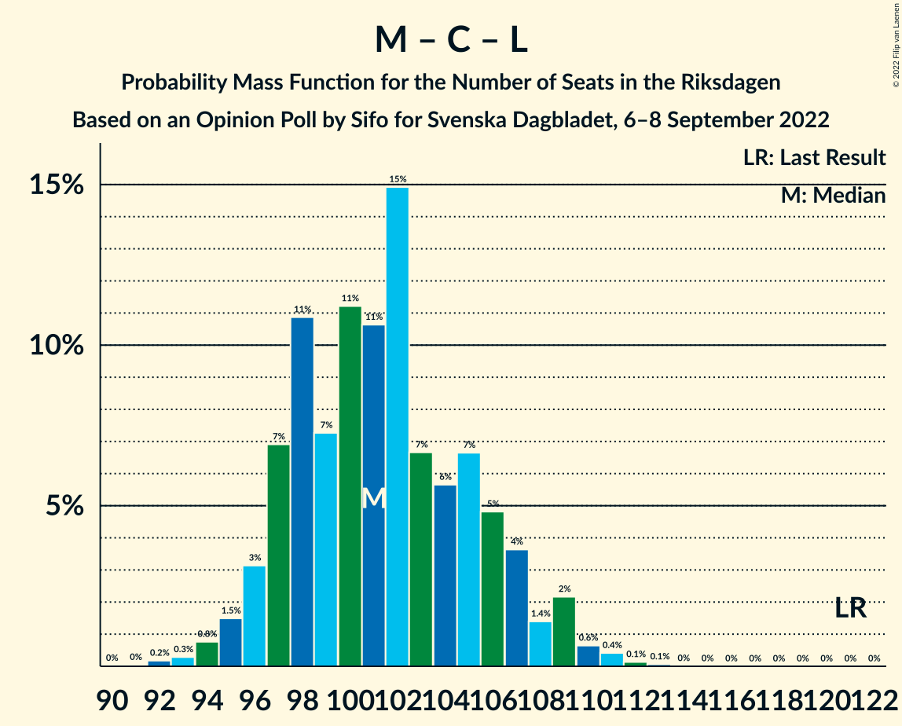

| Number of Seats | Probability | Accumulated | Special Marks |
|:---------------:|:-----------:|:-----------:|:-------------:|
| 91 | 0% | 100% |  |
| 92 | 0.2% | 99.9% |  |
| 93 | 0.3% | 99.8% |  |
| 94 | 0.8% | 99.5% |  |
| 95 | 1.5% | 98.7% |  |
| 96 | 3% | 97% |  |
| 97 | 7% | 94% |  |
| 98 | 11% | 87% |  |
| 99 | 7% | 76% |  |
| 100 | 11% | 69% |  |
| 101 | 11% | 58% | Median |
| 102 | 15% | 47% |  |
| 103 | 7% | 32% |  |
| 104 | 6% | 26% |  |
| 105 | 7% | 20% |  |
| 106 | 5% | 13% |  |
| 107 | 4% | 8% |  |
| 108 | 1.4% | 5% |  |
| 109 | 2% | 3% |  |
| 110 | 0.6% | 1.3% |  |
| 111 | 0.4% | 0.6% |  |
| 112 | 0.1% | 0.2% |  |
| 113 | 0.1% | 0.1% |  |
| 114 | 0% | 0% |  |
| 115 | 0% | 0% |  |
| 116 | 0% | 0% |  |
| 117 | 0% | 0% |  |
| 118 | 0% | 0% |  |
| 119 | 0% | 0% |  |
| 120 | 0% | 0% |  |
| 121 | 0% | 0% | Last Result |

### Sveriges socialdemokratiska arbetareparti

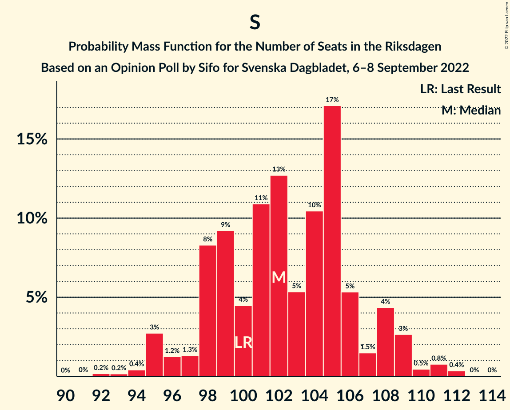

| Number of Seats | Probability | Accumulated | Special Marks |
|:---------------:|:-----------:|:-----------:|:-------------:|
| 92 | 0.2% | 100% |  |
| 93 | 0.2% | 99.8% |  |
| 94 | 0.4% | 99.6% |  |
| 95 | 3% | 99.2% |  |
| 96 | 1.2% | 96% |  |
| 97 | 1.3% | 95% |  |
| 98 | 8% | 94% |  |
| 99 | 9% | 86% |  |
| 100 | 4% | 76% | Last Result |
| 101 | 11% | 72% |  |
| 102 | 13% | 61% | Median |
| 103 | 5% | 48% |  |
| 104 | 10% | 43% |  |
| 105 | 17% | 33% |  |
| 106 | 5% | 15% |  |
| 107 | 1.5% | 10% |  |
| 108 | 4% | 9% |  |
| 109 | 3% | 4% |  |
| 110 | 0.5% | 2% |  |
| 111 | 0.8% | 1.2% |  |
| 112 | 0.4% | 0.4% |  |
| 113 | 0% | 0.1% |  |
| 114 | 0% | 0% |  |

### Moderata samlingspartiet – Kristdemokraterna – Liberalerna

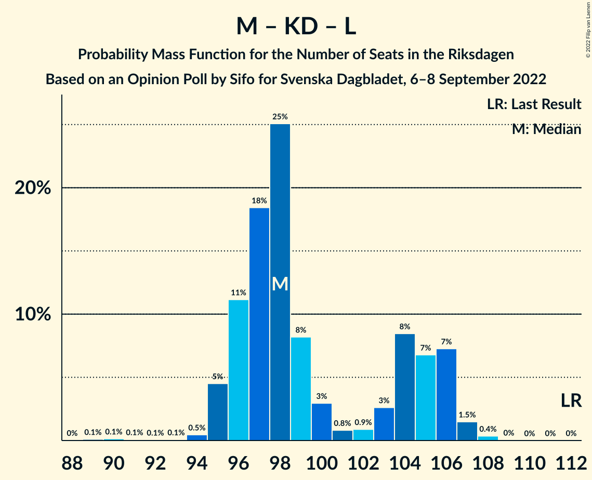

| Number of Seats | Probability | Accumulated | Special Marks |
|:---------------:|:-----------:|:-----------:|:-------------:|
| 89 | 0.1% | 100% |  |
| 90 | 0.1% | 99.9% |  |
| 91 | 0.1% | 99.7% |  |
| 92 | 0.1% | 99.6% |  |
| 93 | 0.1% | 99.6% |  |
| 94 | 0.5% | 99.5% |  |
| 95 | 5% | 99.1% |  |
| 96 | 11% | 95% |  |
| 97 | 18% | 83% |  |
| 98 | 25% | 65% |  |
| 99 | 8% | 40% | Median |
| 100 | 3% | 32% |  |
| 101 | 0.8% | 29% |  |
| 102 | 0.9% | 28% |  |
| 103 | 3% | 27% |  |
| 104 | 8% | 24% |  |
| 105 | 7% | 16% |  |
| 106 | 7% | 9% |  |
| 107 | 1.5% | 2% |  |
| 108 | 0.4% | 0.4% |  |
| 109 | 0% | 0.1% |  |
| 110 | 0% | 0% |  |
| 111 | 0% | 0% |  |
| 112 | 0% | 0% | Last Result |

### Moderata samlingspartiet – Centerpartiet

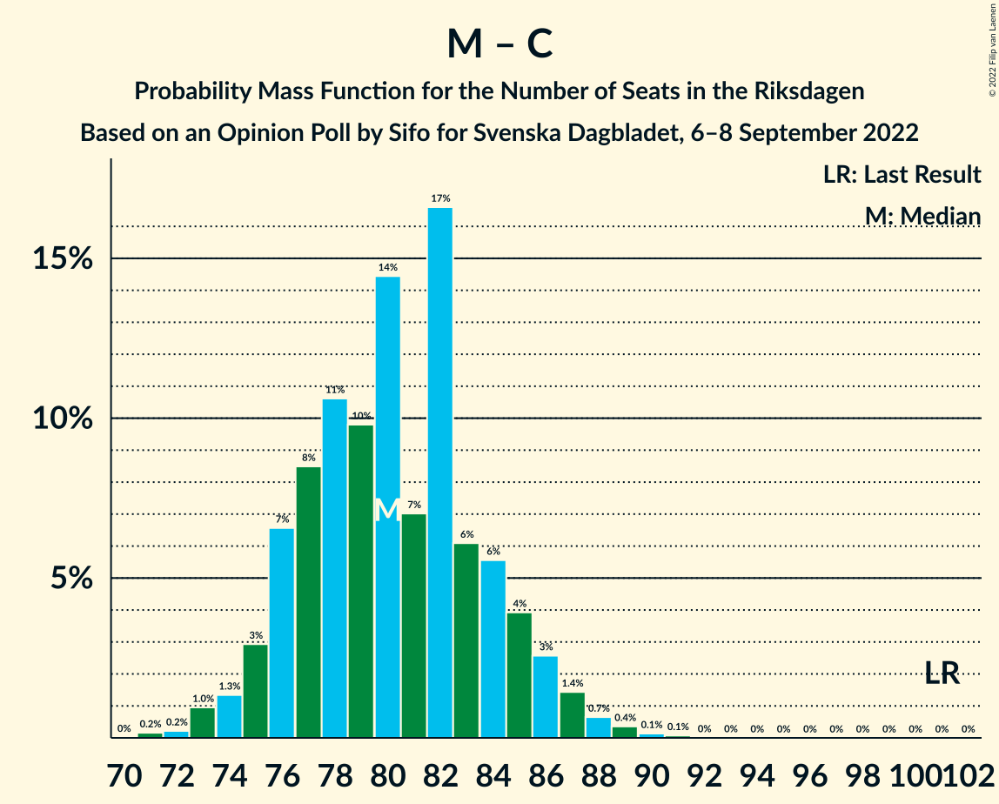

| Number of Seats | Probability | Accumulated | Special Marks |
|:---------------:|:-----------:|:-----------:|:-------------:|
| 71 | 0.2% | 100% |  |
| 72 | 0.2% | 99.8% |  |
| 73 | 1.0% | 99.6% |  |
| 74 | 1.3% | 98.6% |  |
| 75 | 3% | 97% |  |
| 76 | 7% | 94% |  |
| 77 | 8% | 88% |  |
| 78 | 11% | 79% |  |
| 79 | 10% | 69% |  |
| 80 | 14% | 59% | Median |
| 81 | 7% | 44% |  |
| 82 | 17% | 37% |  |
| 83 | 6% | 21% |  |
| 84 | 6% | 15% |  |
| 85 | 4% | 9% |  |
| 86 | 3% | 5% |  |
| 87 | 1.4% | 3% |  |
| 88 | 0.7% | 1.2% |  |
| 89 | 0.4% | 0.6% |  |
| 90 | 0.1% | 0.2% |  |
| 91 | 0.1% | 0.1% |  |
| 92 | 0% | 0% |  |
| 93 | 0% | 0% |  |
| 94 | 0% | 0% |  |
| 95 | 0% | 0% |  |
| 96 | 0% | 0% |  |
| 97 | 0% | 0% |  |
| 98 | 0% | 0% |  |
| 99 | 0% | 0% |  |
| 100 | 0% | 0% |  |
| 101 | 0% | 0% | Last Result |

### Moderata samlingspartiet – Kristdemokraterna

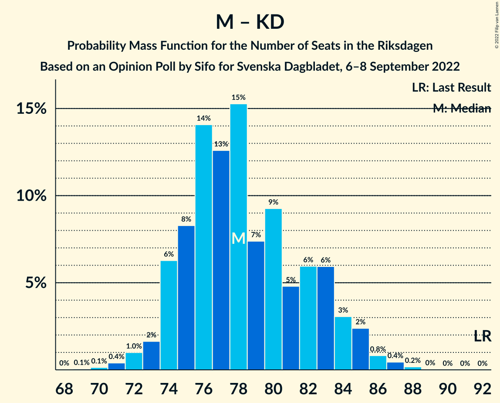

| Number of Seats | Probability | Accumulated | Special Marks |
|:---------------:|:-----------:|:-----------:|:-------------:|
| 69 | 0.1% | 100% |  |
| 70 | 0.1% | 99.9% |  |
| 71 | 0.4% | 99.8% |  |
| 72 | 1.0% | 99.4% |  |
| 73 | 2% | 98% |  |
| 74 | 6% | 97% |  |
| 75 | 8% | 90% |  |
| 76 | 14% | 82% |  |
| 77 | 13% | 68% |  |
| 78 | 15% | 56% | Median |
| 79 | 7% | 40% |  |
| 80 | 9% | 33% |  |
| 81 | 5% | 24% |  |
| 82 | 6% | 19% |  |
| 83 | 6% | 13% |  |
| 84 | 3% | 7% |  |
| 85 | 2% | 4% |  |
| 86 | 0.8% | 1.5% |  |
| 87 | 0.4% | 0.7% |  |
| 88 | 0.2% | 0.2% |  |
| 89 | 0% | 0% |  |
| 90 | 0% | 0% |  |
| 91 | 0% | 0% |  |
| 92 | 0% | 0% | Last Result |

## Technical Information

### Opinion Poll

+ **Polling firm:** Sifo
+ **Commissioner(s):** Svenska Dagbladet
+ **Fieldwork period:** 6–8 September 2022

### Calculations

+ **Sample size:** 2358
+ **Simulations done:** 1,048,576
+ **Error estimate:** 0.76%

