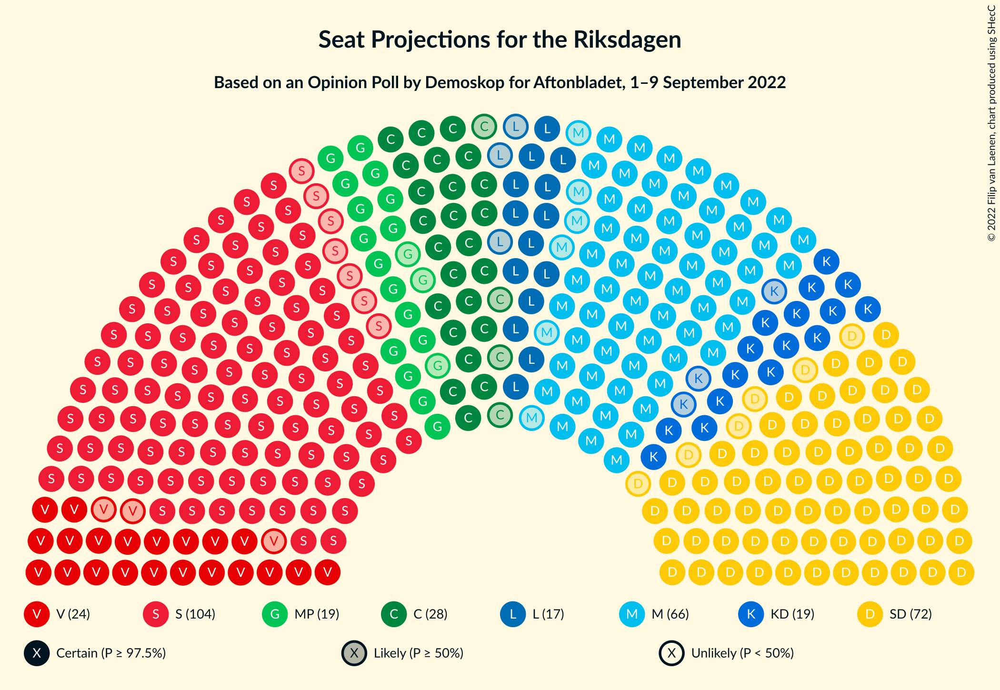
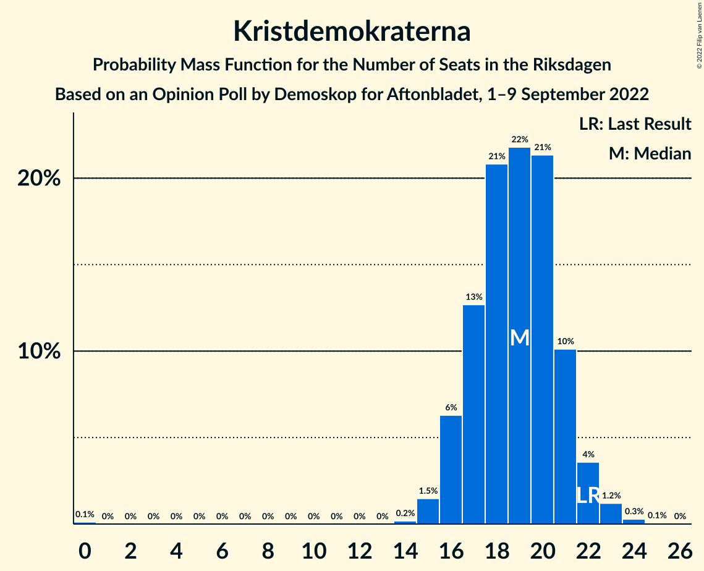
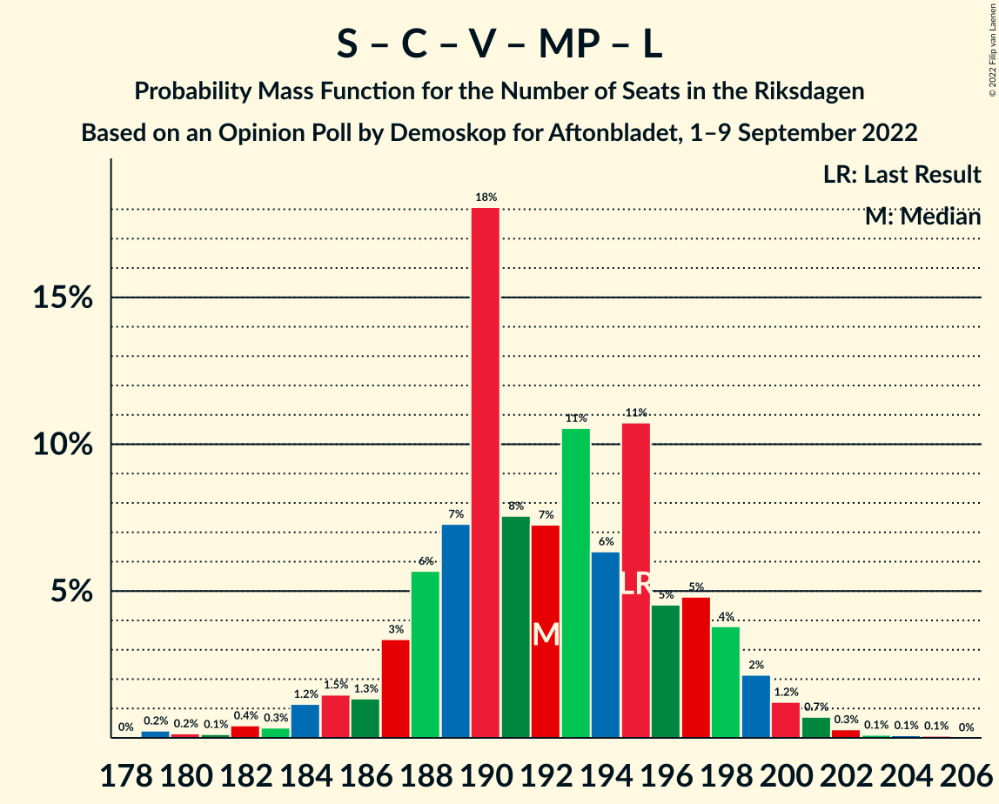

# Opinion Poll by Demoskop for Aftonbladet, 1–9 September 2022

<a href="#voting-intentions">Voting Intentions</a> | <a href="#seats">Seats</a> | <a href="#coalitions">Coalitions</a> | <a href="#technical-information">Technical Information</a>

## Voting Intentions

### Confidence Intervals

| Party | Last Result | Poll Result | 80% Confidence Interval | 90% Confidence Interval | 95% Confidence Interval | 99% Confidence Interval |
|:-----:|:-----------:|:-----------:|:-----------------------:|:-----------------------:|:-----------------------:|:-----------------------:|
| Sveriges socialdemokratiska arbetareparti | 28.3% | 29.5% | 28.3–30.8% |28.0–31.1% |27.7–31.4% |27.1–32.0% |
| Sverigedemokraterna | 17.5% | 20.5% | 19.5–21.6% |19.2–21.9% |18.9–22.2% |18.4–22.7% |
| Moderata samlingspartiet | 19.8% | 18.7% | 17.7–19.8% |17.4–20.1% |17.2–20.3% |16.7–20.9% |
| Centerpartiet | 8.6% | 7.9% | 7.2–8.7% |7.1–8.9% |6.9–9.1% |6.6–9.5% |
| Vänsterpartiet | 8.0% | 6.9% | 6.2–7.6% |6.1–7.8% |5.9–8.0% |5.6–8.4% |
| Kristdemokraterna | 6.3% | 5.3% | 4.7–5.9% |4.6–6.1% |4.5–6.3% |4.2–6.6% |
| Miljöpartiet de gröna | 4.4% | 5.3% | 4.7–5.9% |4.6–6.1% |4.5–6.3% |4.2–6.6% |
| Liberalerna | 5.5% | 4.9% | 4.4–5.5% |4.2–5.7% |4.1–5.9% |3.9–6.2% |

*Note:* The poll result column reflects the actual value used in the calculations. Published results may vary slightly, and in addition be rounded to fewer digits.

## Seats

### Confidence Intervals

| Party | Last Result | Median | 80% Confidence Interval | 90% Confidence Interval | 95% Confidence Interval | 99% Confidence Interval |
|:-----:|:-----------:|:------:|:-----------------------:|:-----------------------:|:-----------------------:|:-----------------------:|
| <a href="#sveriges-socialdemokratiska-arbetareparti">Sveriges socialdemokratiska arbetareparti</a> | 100 | 104 | 100–108 |98–109 |97–111 |96–113 |
| <a href="#sverigedemokraterna">Sverigedemokraterna</a> | 62 | 72 | 68–76 |67–78 |66–78 |65–80 |
| <a href="#moderata-samlingspartiet">Moderata samlingspartiet</a> | 70 | 66 | 62–69 |62–71 |60–72 |59–74 |
| <a href="#centerpartiet">Centerpartiet</a> | 31 | 28 | 25–30 |25–31 |24–32 |23–33 |
| <a href="#vänsterpartiet">Vänsterpartiet</a> | 28 | 24 | 22–27 |22–28 |21–28 |20–29 |
| <a href="#kristdemokraterna">Kristdemokraterna</a> | 22 | 19 | 17–21 |16–22 |16–22 |15–23 |
| <a href="#miljöpartiet-de-gröna">Miljöpartiet de gröna</a> | 16 | 19 | 17–21 |16–21 |16–22 |15–24 |
| <a href="#liberalerna">Liberalerna</a> | 20 | 17 | 16–19 |15–20 |14–21 |0–22 |

### Sveriges socialdemokratiska arbetareparti

*For a full overview of the results for this party, see the [Sveriges socialdemokratiska arbetareparti](party-sverigessocialdemokratiskaarbetareparti.html) page.*

| Number of Seats | Probability | Accumulated | Special Marks |
|:---------------:|:-----------:|:-----------:|:-------------:|
| 93 | 0.1% | 100% |  |
| 94 | 0.1% | 99.9% |  |
| 95 | 0.3% | 99.8% |  |
| 96 | 0.8% | 99.5% |  |
| 97 | 1.5% | 98.7% |  |
| 98 | 3% | 97% |  |
| 99 | 4% | 95% |  |
| 100 | 6% | 90% | Last Result |
| 101 | 11% | 84% |  |
| 102 | 8% | 73% |  |
| 103 | 12% | 65% |  |
| 104 | 13% | 54% | Median |
| 105 | 10% | 40% |  |
| 106 | 11% | 31% |  |
| 107 | 6% | 19% |  |
| 108 | 5% | 13% |  |
| 109 | 4% | 8% |  |
| 110 | 2% | 5% |  |
| 111 | 1.2% | 3% |  |
| 112 | 0.9% | 2% |  |
| 113 | 0.3% | 0.8% |  |
| 114 | 0.3% | 0.5% |  |
| 115 | 0.1% | 0.2% |  |
| 116 | 0% | 0.1% |  |
| 117 | 0% | 0% |  |

### Sverigedemokraterna

*For a full overview of the results for this party, see the [Sverigedemokraterna](party-sverigedemokraterna.html) page.*

| Number of Seats | Probability | Accumulated | Special Marks |
|:---------------:|:-----------:|:-----------:|:-------------:|
| 62 | 0% | 100% | Last Result |
| 63 | 0.1% | 100% |  |
| 64 | 0.2% | 99.9% |  |
| 65 | 0.9% | 99.7% |  |
| 66 | 1.4% | 98.8% |  |
| 67 | 3% | 97% |  |
| 68 | 5% | 95% |  |
| 69 | 10% | 89% |  |
| 70 | 6% | 79% |  |
| 71 | 16% | 73% |  |
| 72 | 10% | 57% | Median |
| 73 | 13% | 47% |  |
| 74 | 16% | 34% |  |
| 75 | 6% | 18% |  |
| 76 | 4% | 12% |  |
| 77 | 2% | 7% |  |
| 78 | 3% | 5% |  |
| 79 | 1.2% | 2% |  |
| 80 | 0.4% | 0.8% |  |
| 81 | 0.2% | 0.4% |  |
| 82 | 0.1% | 0.2% |  |
| 83 | 0% | 0.1% |  |
| 84 | 0% | 0% |  |

### Moderata samlingspartiet

*For a full overview of the results for this party, see the [Moderata samlingspartiet](party-moderatasamlingspartiet.html) page.*

| Number of Seats | Probability | Accumulated | Special Marks |
|:---------------:|:-----------:|:-----------:|:-------------:|
| 56 | 0% | 100% |  |
| 57 | 0.1% | 99.9% |  |
| 58 | 0.3% | 99.8% |  |
| 59 | 0.4% | 99.5% |  |
| 60 | 2% | 99.1% |  |
| 61 | 2% | 97% |  |
| 62 | 9% | 95% |  |
| 63 | 6% | 86% |  |
| 64 | 10% | 80% |  |
| 65 | 12% | 69% |  |
| 66 | 13% | 57% | Median |
| 67 | 19% | 44% |  |
| 68 | 6% | 25% |  |
| 69 | 10% | 19% |  |
| 70 | 3% | 9% | Last Result |
| 71 | 3% | 6% |  |
| 72 | 1.4% | 3% |  |
| 73 | 0.6% | 1.2% |  |
| 74 | 0.4% | 0.5% |  |
| 75 | 0.1% | 0.2% |  |
| 76 | 0% | 0.1% |  |
| 77 | 0% | 0% |  |

### Centerpartiet

*For a full overview of the results for this party, see the [Centerpartiet](party-centerpartiet.html) page.*

| Number of Seats | Probability | Accumulated | Special Marks |
|:---------------:|:-----------:|:-----------:|:-------------:|
| 22 | 0.1% | 100% |  |
| 23 | 0.7% | 99.8% |  |
| 24 | 3% | 99.2% |  |
| 25 | 7% | 96% |  |
| 26 | 13% | 89% |  |
| 27 | 20% | 76% |  |
| 28 | 16% | 56% | Median |
| 29 | 18% | 40% |  |
| 30 | 12% | 22% |  |
| 31 | 5% | 10% | Last Result |
| 32 | 3% | 5% |  |
| 33 | 1.2% | 2% |  |
| 34 | 0.3% | 0.4% |  |
| 35 | 0.1% | 0.1% |  |
| 36 | 0% | 0% |  |

### Vänsterpartiet

*For a full overview of the results for this party, see the [Vänsterpartiet](party-vänsterpartiet.html) page.*

| Number of Seats | Probability | Accumulated | Special Marks |
|:---------------:|:-----------:|:-----------:|:-------------:|
| 19 | 0.3% | 100% |  |
| 20 | 1.1% | 99.7% |  |
| 21 | 3% | 98.6% |  |
| 22 | 10% | 95% |  |
| 23 | 22% | 85% |  |
| 24 | 19% | 63% | Median |
| 25 | 18% | 44% |  |
| 26 | 14% | 26% |  |
| 27 | 7% | 12% |  |
| 28 | 4% | 5% | Last Result |
| 29 | 1.3% | 2% |  |
| 30 | 0.3% | 0.4% |  |
| 31 | 0.1% | 0.1% |  |
| 32 | 0% | 0% |  |

### Kristdemokraterna

*For a full overview of the results for this party, see the [Kristdemokraterna](party-kristdemokraterna.html) page.*

| Number of Seats | Probability | Accumulated | Special Marks |
|:---------------:|:-----------:|:-----------:|:-------------:|
| 0 | 0.1% | 100% |  |
| 1 | 0% | 99.9% |  |
| 2 | 0% | 99.9% |  |
| 3 | 0% | 99.9% |  |
| 4 | 0% | 99.9% |  |
| 5 | 0% | 99.9% |  |
| 6 | 0% | 99.9% |  |
| 7 | 0% | 99.9% |  |
| 8 | 0% | 99.9% |  |
| 9 | 0% | 99.9% |  |
| 10 | 0% | 99.9% |  |
| 11 | 0% | 99.9% |  |
| 12 | 0% | 99.9% |  |
| 13 | 0% | 99.9% |  |
| 14 | 0.2% | 99.9% |  |
| 15 | 1.5% | 99.7% |  |
| 16 | 6% | 98% |  |
| 17 | 13% | 92% |  |
| 18 | 21% | 79% |  |
| 19 | 22% | 58% | Median |
| 20 | 21% | 37% |  |
| 21 | 10% | 15% |  |
| 22 | 4% | 5% | Last Result |
| 23 | 1.2% | 2% |  |
| 24 | 0.3% | 0.4% |  |
| 25 | 0.1% | 0.1% |  |
| 26 | 0% | 0% |  |

### Miljöpartiet de gröna

*For a full overview of the results for this party, see the [Miljöpartiet de gröna](party-miljöpartietdegröna.html) page.*

| Number of Seats | Probability | Accumulated | Special Marks |
|:---------------:|:-----------:|:-----------:|:-------------:|
| 0 | 0.1% | 100% |  |
| 1 | 0% | 99.9% |  |
| 2 | 0% | 99.9% |  |
| 3 | 0% | 99.9% |  |
| 4 | 0% | 99.9% |  |
| 5 | 0% | 99.9% |  |
| 6 | 0% | 99.9% |  |
| 7 | 0% | 99.9% |  |
| 8 | 0% | 99.9% |  |
| 9 | 0% | 99.9% |  |
| 10 | 0% | 99.9% |  |
| 11 | 0% | 99.9% |  |
| 12 | 0% | 99.9% |  |
| 13 | 0% | 99.9% |  |
| 14 | 0.3% | 99.9% |  |
| 15 | 2% | 99.7% |  |
| 16 | 6% | 98% | Last Result |
| 17 | 13% | 92% |  |
| 18 | 12% | 79% |  |
| 19 | 35% | 67% | Median |
| 20 | 19% | 31% |  |
| 21 | 7% | 12% |  |
| 22 | 3% | 4% |  |
| 23 | 1.0% | 2% |  |
| 24 | 0.6% | 0.7% |  |
| 25 | 0.1% | 0.1% |  |
| 26 | 0% | 0% |  |

### Liberalerna

*For a full overview of the results for this party, see the [Liberalerna](party-liberalerna.html) page.*

| Number of Seats | Probability | Accumulated | Special Marks |
|:---------------:|:-----------:|:-----------:|:-------------:|
| 0 | 1.3% | 100% |  |
| 1 | 0% | 98.7% |  |
| 2 | 0% | 98.7% |  |
| 3 | 0% | 98.7% |  |
| 4 | 0% | 98.7% |  |
| 5 | 0% | 98.7% |  |
| 6 | 0% | 98.7% |  |
| 7 | 0% | 98.7% |  |
| 8 | 0% | 98.7% |  |
| 9 | 0% | 98.7% |  |
| 10 | 0% | 98.7% |  |
| 11 | 0% | 98.7% |  |
| 12 | 0% | 98.7% |  |
| 13 | 0% | 98.7% |  |
| 14 | 1.3% | 98.7% |  |
| 15 | 7% | 97% |  |
| 16 | 20% | 90% |  |
| 17 | 24% | 71% | Median |
| 18 | 24% | 47% |  |
| 19 | 14% | 22% |  |
| 20 | 6% | 9% | Last Result |
| 21 | 2% | 3% |  |
| 22 | 0.6% | 0.7% |  |
| 23 | 0.1% | 0.2% |  |
| 24 | 0% | 0% |  |

## Coalitions

### Confidence Intervals

| Coalition | Last Result | Median | Majority? | 80% Confidence Interval | 90% Confidence Interval | 95% Confidence Interval | 99% Confidence Interval |
|:---------:|:-----------:|:------:|:---------:|:-----------------------:|:-----------------------:|:-----------------------:|:-----------------------:|
| Sveriges socialdemokratiska arbetareparti – Moderata samlingspartiet – Centerpartiet | 201 | 198 | 100% | 193–202 | 192–204 | 191–205 | 188–209 |
| Sveriges socialdemokratiska arbetareparti – Centerpartiet – Vänsterpartiet – Miljöpartiet de gröna – Liberalerna | 195 | 192 | 100% | 188–197 | 186–198 | 184–200 | 181–202 |
| Sveriges socialdemokratiska arbetareparti – Centerpartiet – Vänsterpartiet – Miljöpartiet de gröna | 175 | 175 | 51% | 170–180 | 169–181 | 168–182 | 166–186 |
| Sverigedemokraterna – Moderata samlingspartiet – Kristdemokraterna – Liberalerna | 174 | 174 | 49% | 169–179 | 168–180 | 167–181 | 163–183 |
| Sveriges socialdemokratiska arbetareparti – Moderata samlingspartiet | 170 | 170 | 10% | 165–174 | 163–176 | 162–177 | 160–181 |
| Sveriges socialdemokratiska arbetareparti – Centerpartiet – Miljöpartiet de gröna – Liberalerna | 167 | 168 | 4% | 163–173 | 162–174 | 160–175 | 156–177 |
| Sverigedemokraterna – Moderata samlingspartiet – Kristdemokraterna | 154 | 157 | 0% | 152–161 | 151–163 | 149–165 | 147–168 |
| Sveriges socialdemokratiska arbetareparti – Centerpartiet – Miljöpartiet de gröna | 147 | 150 | 0% | 146–155 | 145–157 | 144–158 | 141–161 |
| Sveriges socialdemokratiska arbetareparti – Vänsterpartiet – Miljöpartiet de gröna | 144 | 147 | 0% | 143–152 | 141–153 | 140–154 | 138–157 |
| Sverigedemokraterna – Moderata samlingspartiet | 132 | 138 | 0% | 133–142 | 131–144 | 131–145 | 129–149 |
| Moderata samlingspartiet – Centerpartiet – Kristdemokraterna – Liberalerna | 143 | 130 | 0% | 126–134 | 124–136 | 122–137 | 117–139 |
| Sveriges socialdemokratiska arbetareparti – Vänsterpartiet | 128 | 128 | 0% | 124–133 | 122–134 | 121–136 | 119–138 |
| Sveriges socialdemokratiska arbetareparti – Miljöpartiet de gröna | 116 | 123 | 0% | 118–127 | 117–128 | 116–130 | 113–133 |
| Moderata samlingspartiet – Centerpartiet – Kristdemokraterna | 123 | 112 | 0% | 108–117 | 107–118 | 106–120 | 104–122 |
| Moderata samlingspartiet – Centerpartiet – Liberalerna | 121 | 111 | 0% | 107–116 | 105–117 | 103–118 | 98–120 |
| Sveriges socialdemokratiska arbetareparti | 100 | 104 | 0% | 100–108 | 98–109 | 97–111 | 96–113 |
| Moderata samlingspartiet – Kristdemokraterna – Liberalerna | 112 | 102 | 0% | 98–106 | 96–107 | 95–108 | 87–111 |
| Moderata samlingspartiet – Centerpartiet | 101 | 94 | 0% | 90–98 | 89–100 | 87–101 | 86–102 |
| Moderata samlingspartiet – Kristdemokraterna | 92 | 85 | 0% | 81–89 | 80–90 | 79–91 | 76–93 |

### Sveriges socialdemokratiska arbetareparti – Moderata samlingspartiet – Centerpartiet

| Number of Seats | Probability | Accumulated | Special Marks |
|:---------------:|:-----------:|:-----------:|:-------------:|
| 186 | 0.1% | 100% |  |
| 187 | 0.2% | 99.9% |  |
| 188 | 0.3% | 99.7% |  |
| 189 | 0.5% | 99.4% |  |
| 190 | 1.3% | 98.9% |  |
| 191 | 2% | 98% |  |
| 192 | 5% | 95% |  |
| 193 | 5% | 90% |  |
| 194 | 5% | 85% |  |
| 195 | 6% | 81% |  |
| 196 | 9% | 75% |  |
| 197 | 13% | 66% |  |
| 198 | 12% | 53% | Median |
| 199 | 15% | 41% |  |
| 200 | 8% | 25% |  |
| 201 | 5% | 17% | Last Result |
| 202 | 3% | 12% |  |
| 203 | 2% | 9% |  |
| 204 | 3% | 7% |  |
| 205 | 2% | 4% |  |
| 206 | 0.9% | 2% |  |
| 207 | 0.5% | 1.5% |  |
| 208 | 0.3% | 1.0% |  |
| 209 | 0.3% | 0.7% |  |
| 210 | 0.1% | 0.4% |  |
| 211 | 0.1% | 0.3% |  |
| 212 | 0% | 0.3% |  |
| 213 | 0.1% | 0.2% |  |
| 214 | 0.1% | 0.1% |  |
| 215 | 0% | 0.1% |  |
| 216 | 0% | 0% |  |

### Sveriges socialdemokratiska arbetareparti – Centerpartiet – Vänsterpartiet – Miljöpartiet de gröna – Liberalerna

| Number of Seats | Probability | Accumulated | Special Marks |
|:---------------:|:-----------:|:-----------:|:-------------:|
| 178 | 0% | 100% |  |
| 179 | 0.2% | 99.9% |  |
| 180 | 0.2% | 99.7% |  |
| 181 | 0.1% | 99.5% |  |
| 182 | 0.4% | 99.4% |  |
| 183 | 0.3% | 99.0% |  |
| 184 | 1.2% | 98.6% |  |
| 185 | 1.5% | 97% |  |
| 186 | 1.3% | 96% |  |
| 187 | 3% | 95% |  |
| 188 | 6% | 91% |  |
| 189 | 7% | 86% |  |
| 190 | 18% | 78% |  |
| 191 | 8% | 60% |  |
| 192 | 7% | 53% | Median |
| 193 | 11% | 45% |  |
| 194 | 6% | 35% |  |
| 195 | 11% | 29% | Last Result |
| 196 | 5% | 18% |  |
| 197 | 5% | 13% |  |
| 198 | 4% | 8% |  |
| 199 | 2% | 5% |  |
| 200 | 1.2% | 3% |  |
| 201 | 0.7% | 1.3% |  |
| 202 | 0.3% | 0.6% |  |
| 203 | 0.1% | 0.3% |  |
| 204 | 0.1% | 0.2% |  |
| 205 | 0.1% | 0.1% |  |
| 206 | 0% | 0% |  |

### Sveriges socialdemokratiska arbetareparti – Centerpartiet – Vänsterpartiet – Miljöpartiet de gröna

| Number of Seats | Probability | Accumulated | Special Marks |
|:---------------:|:-----------:|:-----------:|:-------------:|
| 163 | 0.1% | 100% |  |
| 164 | 0.1% | 99.9% |  |
| 165 | 0.2% | 99.8% |  |
| 166 | 0.7% | 99.6% |  |
| 167 | 0.9% | 98.9% |  |
| 168 | 2% | 98% |  |
| 169 | 3% | 96% |  |
| 170 | 4% | 94% |  |
| 171 | 4% | 89% |  |
| 172 | 14% | 86% |  |
| 173 | 10% | 72% |  |
| 174 | 11% | 62% |  |
| 175 | 12% | 51% | Last Result, Median, Majority |
| 176 | 6% | 39% |  |
| 177 | 8% | 33% |  |
| 178 | 6% | 24% |  |
| 179 | 7% | 18% |  |
| 180 | 4% | 11% |  |
| 181 | 2% | 7% |  |
| 182 | 2% | 5% |  |
| 183 | 1.0% | 2% |  |
| 184 | 0.5% | 1.5% |  |
| 185 | 0.3% | 0.9% |  |
| 186 | 0.2% | 0.7% |  |
| 187 | 0.2% | 0.5% |  |
| 188 | 0.1% | 0.2% |  |
| 189 | 0.1% | 0.2% |  |
| 190 | 0.1% | 0.1% |  |
| 191 | 0% | 0.1% |  |
| 192 | 0% | 0% |  |

### Sverigedemokraterna – Moderata samlingspartiet – Kristdemokraterna – Liberalerna

| Number of Seats | Probability | Accumulated | Special Marks |
|:---------------:|:-----------:|:-----------:|:-------------:|
| 158 | 0% | 100% |  |
| 159 | 0.1% | 99.9% |  |
| 160 | 0.1% | 99.9% |  |
| 161 | 0.1% | 99.8% |  |
| 162 | 0.2% | 99.8% |  |
| 163 | 0.2% | 99.5% |  |
| 164 | 0.3% | 99.3% |  |
| 165 | 0.5% | 99.1% |  |
| 166 | 1.0% | 98.5% |  |
| 167 | 2% | 98% |  |
| 168 | 2% | 95% |  |
| 169 | 4% | 93% |  |
| 170 | 7% | 89% |  |
| 171 | 6% | 82% |  |
| 172 | 8% | 76% |  |
| 173 | 6% | 67% |  |
| 174 | 12% | 61% | Last Result, Median |
| 175 | 11% | 49% | Majority |
| 176 | 10% | 38% |  |
| 177 | 14% | 28% |  |
| 178 | 4% | 14% |  |
| 179 | 4% | 11% |  |
| 180 | 3% | 6% |  |
| 181 | 2% | 4% |  |
| 182 | 0.9% | 2% |  |
| 183 | 0.7% | 1.1% |  |
| 184 | 0.2% | 0.4% |  |
| 185 | 0.1% | 0.2% |  |
| 186 | 0.1% | 0.1% |  |
| 187 | 0% | 0% |  |

### Sveriges socialdemokratiska arbetareparti – Moderata samlingspartiet

| Number of Seats | Probability | Accumulated | Special Marks |
|:---------------:|:-----------:|:-----------:|:-------------:|
| 158 | 0.1% | 100% |  |
| 159 | 0.2% | 99.9% |  |
| 160 | 0.3% | 99.7% |  |
| 161 | 1.2% | 99.4% |  |
| 162 | 0.8% | 98% |  |
| 163 | 3% | 97% |  |
| 164 | 3% | 95% |  |
| 165 | 6% | 92% |  |
| 166 | 6% | 86% |  |
| 167 | 7% | 80% |  |
| 168 | 11% | 74% |  |
| 169 | 7% | 62% |  |
| 170 | 16% | 55% | Last Result, Median |
| 171 | 7% | 39% |  |
| 172 | 12% | 31% |  |
| 173 | 4% | 19% |  |
| 174 | 5% | 15% |  |
| 175 | 4% | 10% | Majority |
| 176 | 2% | 6% |  |
| 177 | 2% | 4% |  |
| 178 | 0.5% | 2% |  |
| 179 | 0.7% | 2% |  |
| 180 | 0.3% | 0.8% |  |
| 181 | 0.1% | 0.5% |  |
| 182 | 0.2% | 0.4% |  |
| 183 | 0.1% | 0.2% |  |
| 184 | 0.1% | 0.1% |  |
| 185 | 0% | 0.1% |  |
| 186 | 0% | 0% |  |

### Sveriges socialdemokratiska arbetareparti – Centerpartiet – Miljöpartiet de gröna – Liberalerna

| Number of Seats | Probability | Accumulated | Special Marks |
|:---------------:|:-----------:|:-----------:|:-------------:|
| 152 | 0.1% | 100% |  |
| 153 | 0.1% | 99.9% |  |
| 154 | 0% | 99.9% |  |
| 155 | 0.2% | 99.8% |  |
| 156 | 0.2% | 99.6% |  |
| 157 | 0.2% | 99.4% |  |
| 158 | 0.5% | 99.2% |  |
| 159 | 0.6% | 98.8% |  |
| 160 | 0.8% | 98% |  |
| 161 | 1.4% | 97% |  |
| 162 | 4% | 96% |  |
| 163 | 3% | 92% |  |
| 164 | 7% | 89% |  |
| 165 | 9% | 82% |  |
| 166 | 11% | 73% |  |
| 167 | 9% | 62% | Last Result |
| 168 | 13% | 53% | Median |
| 169 | 7% | 40% |  |
| 170 | 8% | 33% |  |
| 171 | 10% | 26% |  |
| 172 | 5% | 15% |  |
| 173 | 3% | 10% |  |
| 174 | 3% | 7% |  |
| 175 | 2% | 4% | Majority |
| 176 | 1.3% | 2% |  |
| 177 | 0.5% | 1.0% |  |
| 178 | 0.2% | 0.4% |  |
| 179 | 0.2% | 0.3% |  |
| 180 | 0.1% | 0.1% |  |
| 181 | 0% | 0% |  |

### Sverigedemokraterna – Moderata samlingspartiet – Kristdemokraterna

| Number of Seats | Probability | Accumulated | Special Marks |
|:---------------:|:-----------:|:-----------:|:-------------:|
| 144 | 0.1% | 100% |  |
| 145 | 0.1% | 99.9% |  |
| 146 | 0.1% | 99.8% |  |
| 147 | 0.3% | 99.7% |  |
| 148 | 0.7% | 99.4% |  |
| 149 | 1.2% | 98.7% |  |
| 150 | 2% | 97% |  |
| 151 | 4% | 95% |  |
| 152 | 5% | 92% |  |
| 153 | 5% | 87% |  |
| 154 | 11% | 82% | Last Result |
| 155 | 6% | 71% |  |
| 156 | 11% | 65% |  |
| 157 | 7% | 55% | Median |
| 158 | 8% | 47% |  |
| 159 | 18% | 40% |  |
| 160 | 7% | 22% |  |
| 161 | 6% | 14% |  |
| 162 | 3% | 9% |  |
| 163 | 1.3% | 5% |  |
| 164 | 1.5% | 4% |  |
| 165 | 1.2% | 3% |  |
| 166 | 0.3% | 1.4% |  |
| 167 | 0.4% | 1.0% |  |
| 168 | 0.1% | 0.6% |  |
| 169 | 0.2% | 0.5% |  |
| 170 | 0.2% | 0.3% |  |
| 171 | 0% | 0.1% |  |
| 172 | 0% | 0% |  |

### Sveriges socialdemokratiska arbetareparti – Centerpartiet – Miljöpartiet de gröna

| Number of Seats | Probability | Accumulated | Special Marks |
|:---------------:|:-----------:|:-----------:|:-------------:|
| 138 | 0% | 100% |  |
| 139 | 0.1% | 99.9% |  |
| 140 | 0.1% | 99.9% |  |
| 141 | 0.4% | 99.7% |  |
| 142 | 0.5% | 99.4% |  |
| 143 | 1.3% | 98.9% |  |
| 144 | 2% | 98% |  |
| 145 | 3% | 96% |  |
| 146 | 5% | 92% |  |
| 147 | 6% | 87% | Last Result |
| 148 | 7% | 82% |  |
| 149 | 18% | 74% |  |
| 150 | 8% | 56% |  |
| 151 | 8% | 47% | Median |
| 152 | 11% | 40% |  |
| 153 | 7% | 29% |  |
| 154 | 7% | 22% |  |
| 155 | 6% | 15% |  |
| 156 | 4% | 9% |  |
| 157 | 2% | 6% |  |
| 158 | 2% | 4% |  |
| 159 | 0.9% | 2% |  |
| 160 | 0.5% | 1.1% |  |
| 161 | 0.2% | 0.7% |  |
| 162 | 0.2% | 0.5% |  |
| 163 | 0.1% | 0.3% |  |
| 164 | 0.1% | 0.2% |  |
| 165 | 0% | 0% |  |

### Sveriges socialdemokratiska arbetareparti – Vänsterpartiet – Miljöpartiet de gröna

| Number of Seats | Probability | Accumulated | Special Marks |
|:---------------:|:-----------:|:-----------:|:-------------:|
| 135 | 0.1% | 100% |  |
| 136 | 0.1% | 99.9% |  |
| 137 | 0.1% | 99.8% |  |
| 138 | 0.7% | 99.6% |  |
| 139 | 0.9% | 99.0% |  |
| 140 | 2% | 98% |  |
| 141 | 3% | 96% |  |
| 142 | 3% | 94% |  |
| 143 | 10% | 91% |  |
| 144 | 5% | 81% | Last Result |
| 145 | 8% | 76% |  |
| 146 | 15% | 68% |  |
| 147 | 11% | 53% | Median |
| 148 | 10% | 42% |  |
| 149 | 9% | 32% |  |
| 150 | 7% | 23% |  |
| 151 | 6% | 16% |  |
| 152 | 5% | 11% |  |
| 153 | 2% | 6% |  |
| 154 | 2% | 4% |  |
| 155 | 1.1% | 2% |  |
| 156 | 0.4% | 1.3% |  |
| 157 | 0.4% | 0.9% |  |
| 158 | 0.3% | 0.5% |  |
| 159 | 0.1% | 0.2% |  |
| 160 | 0.1% | 0.1% |  |
| 161 | 0% | 0.1% |  |
| 162 | 0% | 0% |  |

### Sverigedemokraterna – Moderata samlingspartiet

| Number of Seats | Probability | Accumulated | Special Marks |
|:---------------:|:-----------:|:-----------:|:-------------:|
| 126 | 0% | 100% |  |
| 127 | 0.1% | 99.9% |  |
| 128 | 0.1% | 99.9% |  |
| 129 | 0.5% | 99.7% |  |
| 130 | 1.0% | 99.3% |  |
| 131 | 3% | 98% |  |
| 132 | 3% | 95% | Last Result |
| 133 | 5% | 92% |  |
| 134 | 4% | 88% |  |
| 135 | 9% | 83% |  |
| 136 | 8% | 75% |  |
| 137 | 8% | 66% |  |
| 138 | 11% | 59% | Median |
| 139 | 10% | 48% |  |
| 140 | 15% | 38% |  |
| 141 | 8% | 23% |  |
| 142 | 5% | 15% |  |
| 143 | 3% | 10% |  |
| 144 | 2% | 7% |  |
| 145 | 2% | 5% |  |
| 146 | 0.8% | 2% |  |
| 147 | 0.5% | 2% |  |
| 148 | 0.5% | 1.0% |  |
| 149 | 0.2% | 0.6% |  |
| 150 | 0.2% | 0.4% |  |
| 151 | 0.1% | 0.1% |  |
| 152 | 0% | 0.1% |  |
| 153 | 0% | 0% |  |

### Moderata samlingspartiet – Centerpartiet – Kristdemokraterna – Liberalerna

| Number of Seats | Probability | Accumulated | Special Marks |
|:---------------:|:-----------:|:-----------:|:-------------:|
| 111 | 0% | 100% |  |
| 112 | 0% | 99.9% |  |
| 113 | 0% | 99.9% |  |
| 114 | 0% | 99.9% |  |
| 115 | 0% | 99.9% |  |
| 116 | 0.2% | 99.8% |  |
| 117 | 0.2% | 99.6% |  |
| 118 | 0.1% | 99.4% |  |
| 119 | 0.3% | 99.3% |  |
| 120 | 0.4% | 99.0% |  |
| 121 | 0.4% | 98.6% |  |
| 122 | 1.0% | 98% |  |
| 123 | 2% | 97% |  |
| 124 | 2% | 95% |  |
| 125 | 3% | 93% |  |
| 126 | 5% | 90% |  |
| 127 | 8% | 85% |  |
| 128 | 9% | 77% |  |
| 129 | 15% | 68% |  |
| 130 | 9% | 53% | Median |
| 131 | 11% | 43% |  |
| 132 | 8% | 32% |  |
| 133 | 6% | 24% |  |
| 134 | 9% | 19% |  |
| 135 | 4% | 9% |  |
| 136 | 3% | 6% |  |
| 137 | 2% | 3% |  |
| 138 | 0.6% | 1.3% |  |
| 139 | 0.4% | 0.7% |  |
| 140 | 0.2% | 0.3% |  |
| 141 | 0% | 0.1% |  |
| 142 | 0% | 0.1% |  |
| 143 | 0% | 0% | Last Result |

### Sveriges socialdemokratiska arbetareparti – Vänsterpartiet

| Number of Seats | Probability | Accumulated | Special Marks |
|:---------------:|:-----------:|:-----------:|:-------------:|
| 117 | 0.1% | 100% |  |
| 118 | 0.1% | 99.9% |  |
| 119 | 0.4% | 99.8% |  |
| 120 | 0.6% | 99.4% |  |
| 121 | 2% | 98.8% |  |
| 122 | 2% | 97% |  |
| 123 | 3% | 95% |  |
| 124 | 9% | 92% |  |
| 125 | 5% | 83% |  |
| 126 | 9% | 78% |  |
| 127 | 12% | 69% |  |
| 128 | 13% | 57% | Last Result, Median |
| 129 | 13% | 44% |  |
| 130 | 7% | 31% |  |
| 131 | 6% | 24% |  |
| 132 | 7% | 17% |  |
| 133 | 5% | 11% |  |
| 134 | 2% | 6% |  |
| 135 | 2% | 4% |  |
| 136 | 1.5% | 3% |  |
| 137 | 0.5% | 1.3% |  |
| 138 | 0.4% | 0.8% |  |
| 139 | 0.3% | 0.4% |  |
| 140 | 0.1% | 0.2% |  |
| 141 | 0% | 0.1% |  |
| 142 | 0% | 0.1% |  |
| 143 | 0% | 0% |  |

### Sveriges socialdemokratiska arbetareparti – Miljöpartiet de gröna

| Number of Seats | Probability | Accumulated | Special Marks |
|:---------------:|:-----------:|:-----------:|:-------------:|
| 110 | 0% | 100% |  |
| 111 | 0% | 99.9% |  |
| 112 | 0.1% | 99.9% |  |
| 113 | 0.3% | 99.8% |  |
| 114 | 0.6% | 99.5% |  |
| 115 | 0.9% | 98.9% |  |
| 116 | 2% | 98% | Last Result |
| 117 | 3% | 96% |  |
| 118 | 4% | 92% |  |
| 119 | 8% | 89% |  |
| 120 | 10% | 81% |  |
| 121 | 7% | 71% |  |
| 122 | 14% | 64% |  |
| 123 | 12% | 50% | Median |
| 124 | 9% | 39% |  |
| 125 | 9% | 30% |  |
| 126 | 7% | 21% |  |
| 127 | 6% | 14% |  |
| 128 | 3% | 8% |  |
| 129 | 2% | 5% |  |
| 130 | 1.4% | 3% |  |
| 131 | 0.9% | 2% |  |
| 132 | 0.3% | 0.8% |  |
| 133 | 0.3% | 0.5% |  |
| 134 | 0.1% | 0.2% |  |
| 135 | 0.1% | 0.1% |  |
| 136 | 0% | 0% |  |

### Moderata samlingspartiet – Centerpartiet – Kristdemokraterna

| Number of Seats | Probability | Accumulated | Special Marks |
|:---------------:|:-----------:|:-----------:|:-------------:|
| 98 | 0% | 100% |  |
| 99 | 0% | 99.9% |  |
| 100 | 0% | 99.9% |  |
| 101 | 0.1% | 99.9% |  |
| 102 | 0.1% | 99.8% |  |
| 103 | 0.2% | 99.7% |  |
| 104 | 0.6% | 99.5% |  |
| 105 | 0.8% | 98.9% |  |
| 106 | 2% | 98% |  |
| 107 | 3% | 97% |  |
| 108 | 5% | 94% |  |
| 109 | 8% | 89% |  |
| 110 | 8% | 81% |  |
| 111 | 9% | 73% |  |
| 112 | 15% | 64% |  |
| 113 | 12% | 50% | Median |
| 114 | 7% | 38% |  |
| 115 | 10% | 31% |  |
| 116 | 9% | 22% |  |
| 117 | 3% | 12% |  |
| 118 | 4% | 9% |  |
| 119 | 2% | 5% |  |
| 120 | 1.1% | 3% |  |
| 121 | 0.6% | 1.5% |  |
| 122 | 0.5% | 0.8% |  |
| 123 | 0.1% | 0.3% | Last Result |
| 124 | 0.1% | 0.2% |  |
| 125 | 0% | 0.1% |  |
| 126 | 0% | 0% |  |

### Moderata samlingspartiet – Centerpartiet – Liberalerna

| Number of Seats | Probability | Accumulated | Special Marks |
|:---------------:|:-----------:|:-----------:|:-------------:|
| 92 | 0% | 100% |  |
| 93 | 0% | 99.9% |  |
| 94 | 0% | 99.9% |  |
| 95 | 0.1% | 99.9% |  |
| 96 | 0.1% | 99.8% |  |
| 97 | 0.1% | 99.6% |  |
| 98 | 0.1% | 99.6% |  |
| 99 | 0.2% | 99.5% |  |
| 100 | 0.2% | 99.2% |  |
| 101 | 0.2% | 99.0% |  |
| 102 | 0.5% | 98.9% |  |
| 103 | 0.8% | 98% |  |
| 104 | 2% | 97% |  |
| 105 | 1.3% | 96% |  |
| 106 | 2% | 95% |  |
| 107 | 5% | 92% |  |
| 108 | 6% | 87% |  |
| 109 | 14% | 81% |  |
| 110 | 9% | 67% |  |
| 111 | 14% | 58% | Median |
| 112 | 12% | 44% |  |
| 113 | 7% | 32% |  |
| 114 | 11% | 25% |  |
| 115 | 4% | 15% |  |
| 116 | 5% | 10% |  |
| 117 | 2% | 6% |  |
| 118 | 2% | 3% |  |
| 119 | 0.5% | 1.3% |  |
| 120 | 0.4% | 0.7% |  |
| 121 | 0.2% | 0.3% | Last Result |
| 122 | 0.1% | 0.1% |  |
| 123 | 0% | 0.1% |  |
| 124 | 0% | 0% |  |

### Sveriges socialdemokratiska arbetareparti

| Number of Seats | Probability | Accumulated | Special Marks |
|:---------------:|:-----------:|:-----------:|:-------------:|
| 93 | 0.1% | 100% |  |
| 94 | 0.1% | 99.9% |  |
| 95 | 0.3% | 99.8% |  |
| 96 | 0.8% | 99.5% |  |
| 97 | 1.5% | 98.7% |  |
| 98 | 3% | 97% |  |
| 99 | 4% | 95% |  |
| 100 | 6% | 90% | Last Result |
| 101 | 11% | 84% |  |
| 102 | 8% | 73% |  |
| 103 | 12% | 65% |  |
| 104 | 13% | 54% | Median |
| 105 | 10% | 40% |  |
| 106 | 11% | 31% |  |
| 107 | 6% | 19% |  |
| 108 | 5% | 13% |  |
| 109 | 4% | 8% |  |
| 110 | 2% | 5% |  |
| 111 | 1.2% | 3% |  |
| 112 | 0.9% | 2% |  |
| 113 | 0.3% | 0.8% |  |
| 114 | 0.3% | 0.5% |  |
| 115 | 0.1% | 0.2% |  |
| 116 | 0% | 0.1% |  |
| 117 | 0% | 0% |  |

### Moderata samlingspartiet – Kristdemokraterna – Liberalerna

| Number of Seats | Probability | Accumulated | Special Marks |
|:---------------:|:-----------:|:-----------:|:-------------:|
| 83 | 0.1% | 100% |  |
| 84 | 0% | 99.9% |  |
| 85 | 0% | 99.9% |  |
| 86 | 0.1% | 99.8% |  |
| 87 | 0.3% | 99.7% |  |
| 88 | 0.2% | 99.5% |  |
| 89 | 0.1% | 99.3% |  |
| 90 | 0.1% | 99.2% |  |
| 91 | 0.3% | 99.1% |  |
| 92 | 0.4% | 98.9% |  |
| 93 | 0.3% | 98% |  |
| 94 | 0.4% | 98% |  |
| 95 | 0.9% | 98% |  |
| 96 | 3% | 97% |  |
| 97 | 3% | 94% |  |
| 98 | 7% | 92% |  |
| 99 | 9% | 85% |  |
| 100 | 8% | 76% |  |
| 101 | 10% | 68% |  |
| 102 | 12% | 58% | Median |
| 103 | 13% | 47% |  |
| 104 | 10% | 34% |  |
| 105 | 11% | 24% |  |
| 106 | 6% | 13% |  |
| 107 | 3% | 8% |  |
| 108 | 2% | 4% |  |
| 109 | 0.9% | 2% |  |
| 110 | 0.6% | 1.1% |  |
| 111 | 0.3% | 0.5% |  |
| 112 | 0.1% | 0.2% | Last Result |
| 113 | 0.1% | 0.1% |  |
| 114 | 0% | 0% |  |

### Moderata samlingspartiet – Centerpartiet

| Number of Seats | Probability | Accumulated | Special Marks |
|:---------------:|:-----------:|:-----------:|:-------------:|
| 83 | 0% | 100% |  |
| 84 | 0.1% | 99.9% |  |
| 85 | 0.3% | 99.9% |  |
| 86 | 1.4% | 99.6% |  |
| 87 | 1.1% | 98% |  |
| 88 | 1.3% | 97% |  |
| 89 | 2% | 96% |  |
| 90 | 8% | 94% |  |
| 91 | 10% | 85% |  |
| 92 | 12% | 75% |  |
| 93 | 9% | 63% |  |
| 94 | 12% | 54% | Median |
| 95 | 12% | 43% |  |
| 96 | 13% | 31% |  |
| 97 | 6% | 17% |  |
| 98 | 3% | 12% |  |
| 99 | 3% | 8% |  |
| 100 | 3% | 5% |  |
| 101 | 2% | 3% | Last Result |
| 102 | 0.6% | 1.0% |  |
| 103 | 0.2% | 0.4% |  |
| 104 | 0.1% | 0.3% |  |
| 105 | 0.1% | 0.1% |  |
| 106 | 0% | 0.1% |  |
| 107 | 0% | 0% |  |

### Moderata samlingspartiet – Kristdemokraterna

| Number of Seats | Probability | Accumulated | Special Marks |
|:---------------:|:-----------:|:-----------:|:-------------:|
| 67 | 0% | 100% |  |
| 68 | 0% | 99.9% |  |
| 69 | 0% | 99.9% |  |
| 70 | 0% | 99.9% |  |
| 71 | 0% | 99.9% |  |
| 72 | 0% | 99.9% |  |
| 73 | 0% | 99.9% |  |
| 74 | 0% | 99.9% |  |
| 75 | 0.1% | 99.8% |  |
| 76 | 0.3% | 99.7% |  |
| 77 | 0.5% | 99.4% |  |
| 78 | 0.8% | 99.0% |  |
| 79 | 2% | 98% |  |
| 80 | 5% | 96% |  |
| 81 | 7% | 91% |  |
| 82 | 9% | 84% |  |
| 83 | 11% | 75% |  |
| 84 | 11% | 64% |  |
| 85 | 11% | 53% | Median |
| 86 | 12% | 42% |  |
| 87 | 12% | 31% |  |
| 88 | 9% | 19% |  |
| 89 | 4% | 10% |  |
| 90 | 3% | 6% |  |
| 91 | 2% | 3% |  |
| 92 | 0.8% | 2% | Last Result |
| 93 | 0.5% | 0.8% |  |
| 94 | 0.2% | 0.3% |  |
| 95 | 0.1% | 0.1% |  |
| 96 | 0.1% | 0.1% |  |
| 97 | 0% | 0% |  |

## Technical Information

### Opinion Poll

+ **Polling firm:** Demoskop
+ **Commissioner(s):** Aftonbladet
+ **Fieldwork period:** 1–9 September 2022

### Calculations

+ **Sample size:** 2321
+ **Simulations done:** 1,048,576
+ **Error estimate:** 0.73%

