# Opinion Poll by Ipsos for Dagens Nyheter, 6–9 September 2022

<a href="#voting-intentions">Voting Intentions</a> | <a href="#seats">Seats</a> | <a href="#coalitions">Coalitions</a> | <a href="#technical-information">Technical Information</a>

## Voting Intentions

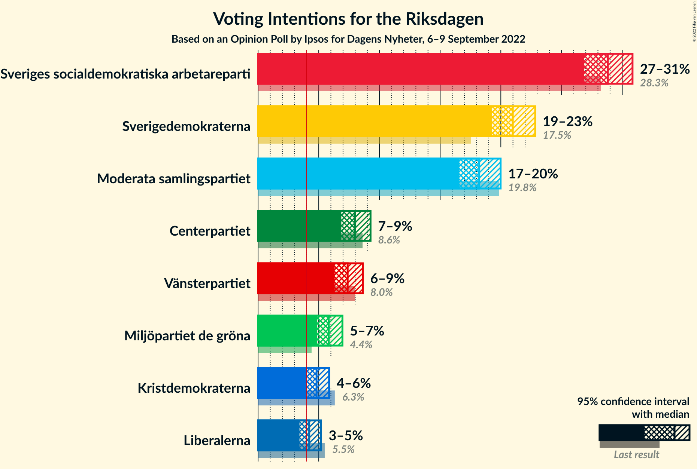

### Confidence Intervals

| Party | Last Result | Poll Result | 80% Confidence Interval | 90% Confidence Interval | 95% Confidence Interval | 99% Confidence Interval |
|:-----:|:-----------:|:-----------:|:-----------------------:|:-----------------------:|:-----------------------:|:-----------------------:|
| Sveriges socialdemokratiska arbetareparti | 28.3% | 28.8% | 27.5–30.1% |27.2–30.5% |26.9–30.8% |26.3–31.5% |
| Sverigedemokraterna | 17.5% | 21.0% | 19.8–22.2% |19.5–22.5% |19.3–22.8% |18.7–23.4% |
| Moderata samlingspartiet | 19.8% | 18.2% | 17.1–19.4% |16.8–19.7% |16.6–20.0% |16.1–20.5% |
| Centerpartiet | 8.6% | 8.0% | 7.2–8.8% |7.0–9.1% |6.9–9.3% |6.5–9.7% |
| Vänsterpartiet | 8.0% | 7.4% | 6.7–8.2% |6.5–8.4% |6.3–8.6% |6.0–9.0% |
| Miljöpartiet de gröna | 4.4% | 5.8% | 5.2–6.6% |5.0–6.8% |4.9–7.0% |4.6–7.3% |
| Kristdemokraterna | 6.3% | 4.8% | 4.3–5.5% |4.1–5.7% |4.0–5.9% |3.7–6.2% |
| Liberalerna | 5.5% | 4.2% | 3.7–4.9% |3.5–5.0% |3.4–5.2% |3.2–5.5% |

*Note:* The poll result column reflects the actual value used in the calculations. Published results may vary slightly, and in addition be rounded to fewer digits.

## Seats

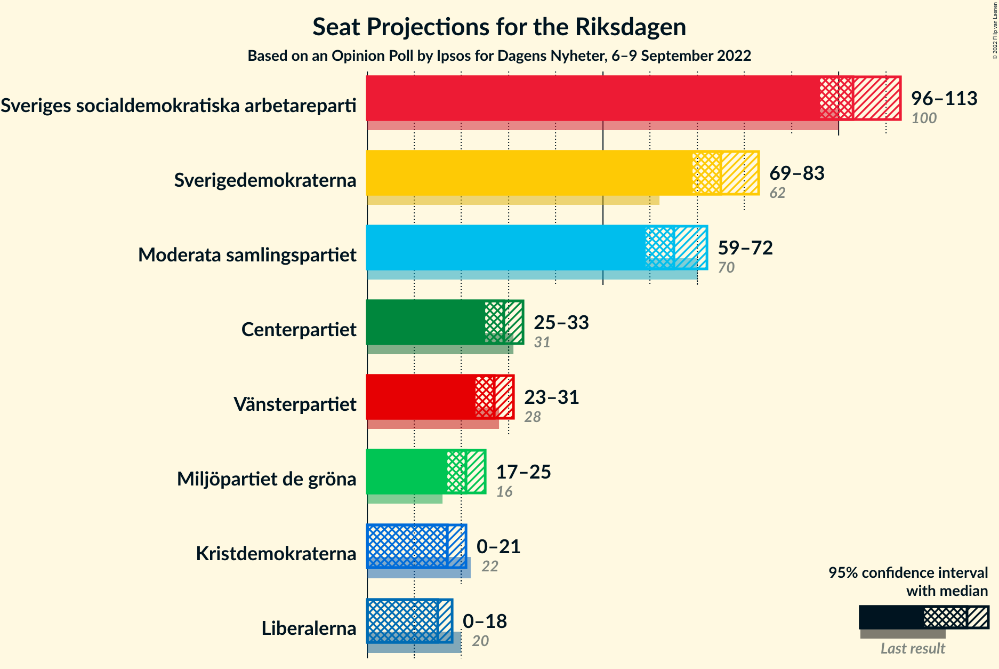

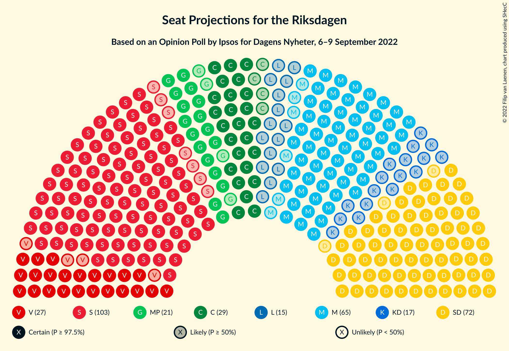

### Confidence Intervals

| Party | Last Result | Median | 80% Confidence Interval | 90% Confidence Interval | 95% Confidence Interval | 99% Confidence Interval |
|:-----:|:-----------:|:------:|:-----------------------:|:-----------------------:|:-----------------------:|:-----------------------:|
| <a href="#sveriges-socialdemokratiska-arbetareparti">Sveriges socialdemokratiska arbetareparti</a> | 100 | 103 | 98–108 |96–111 |96–113 |93–115 |
| <a href="#sverigedemokraterna">Sverigedemokraterna</a> | 62 | 75 | 71–80 |69–81 |69–83 |66–86 |
| <a href="#moderata-samlingspartiet">Moderata samlingspartiet</a> | 70 | 65 | 61–70 |60–71 |59–72 |57–75 |
| <a href="#centerpartiet">Centerpartiet</a> | 31 | 29 | 26–32 |25–32 |25–33 |23–35 |
| <a href="#vänsterpartiet">Vänsterpartiet</a> | 28 | 27 | 24–29 |23–30 |23–31 |21–32 |
| <a href="#miljöpartiet-de-gröna">Miljöpartiet de gröna</a> | 16 | 21 | 19–24 |18–24 |17–25 |16–26 |
| <a href="#kristdemokraterna">Kristdemokraterna</a> | 22 | 17 | 15–20 |15–21 |0–21 |0–22 |
| <a href="#liberalerna">Liberalerna</a> | 20 | 15 | 0–17 |0–18 |0–18 |0–19 |

### Sveriges socialdemokratiska arbetareparti

*For a full overview of the results for this party, see the [Sveriges socialdemokratiska arbetareparti](party-sverigessocialdemokratiskaarbetareparti.html) page.*

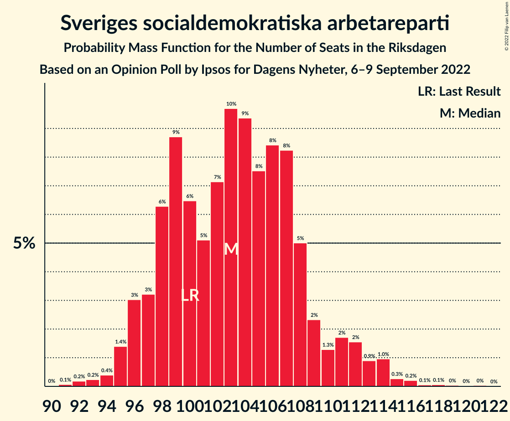

| Number of Seats | Probability | Accumulated | Special Marks |
|:---------------:|:-----------:|:-----------:|:-------------:|
| 91 | 0.1% | 100% |  |
| 92 | 0.2% | 99.9% |  |
| 93 | 0.2% | 99.7% |  |
| 94 | 0.4% | 99.5% |  |
| 95 | 1.4% | 99.1% |  |
| 96 | 3% | 98% |  |
| 97 | 3% | 95% |  |
| 98 | 6% | 91% |  |
| 99 | 9% | 85% |  |
| 100 | 6% | 76% | Last Result |
| 101 | 5% | 70% |  |
| 102 | 7% | 65% |  |
| 103 | 10% | 58% | Median |
| 104 | 9% | 48% |  |
| 105 | 8% | 39% |  |
| 106 | 8% | 31% |  |
| 107 | 8% | 23% |  |
| 108 | 5% | 14% |  |
| 109 | 2% | 9% |  |
| 110 | 1.3% | 7% |  |
| 111 | 2% | 6% |  |
| 112 | 2% | 4% |  |
| 113 | 0.9% | 3% |  |
| 114 | 1.0% | 2% |  |
| 115 | 0.3% | 0.7% |  |
| 116 | 0.2% | 0.4% |  |
| 117 | 0.1% | 0.2% |  |
| 118 | 0.1% | 0.2% |  |
| 119 | 0% | 0.1% |  |
| 120 | 0% | 0.1% |  |
| 121 | 0% | 0% |  |

### Sverigedemokraterna

*For a full overview of the results for this party, see the [Sverigedemokraterna](party-sverigedemokraterna.html) page.*

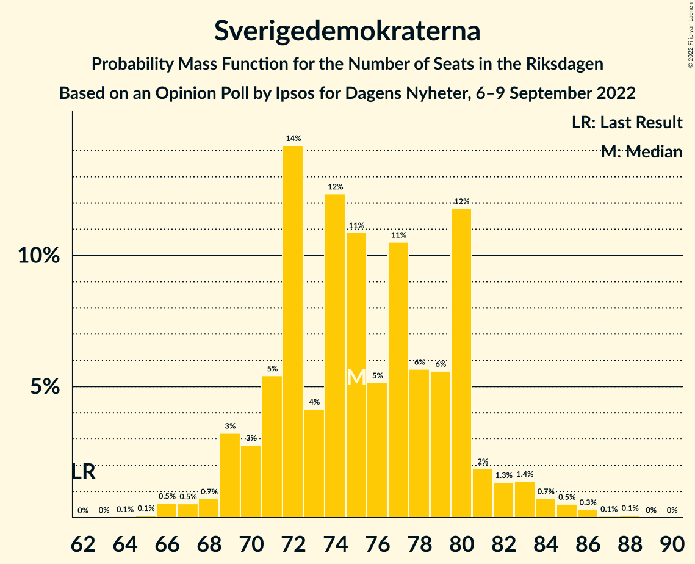

| Number of Seats | Probability | Accumulated | Special Marks |
|:---------------:|:-----------:|:-----------:|:-------------:|
| 62 | 0% | 100% | Last Result |
| 63 | 0% | 100% |  |
| 64 | 0.1% | 100% |  |
| 65 | 0.1% | 99.9% |  |
| 66 | 0.5% | 99.8% |  |
| 67 | 0.5% | 99.3% |  |
| 68 | 0.7% | 98.8% |  |
| 69 | 3% | 98% |  |
| 70 | 3% | 95% |  |
| 71 | 5% | 92% |  |
| 72 | 14% | 87% |  |
| 73 | 4% | 72% |  |
| 74 | 12% | 68% |  |
| 75 | 11% | 56% | Median |
| 76 | 5% | 45% |  |
| 77 | 11% | 40% |  |
| 78 | 6% | 29% |  |
| 79 | 6% | 24% |  |
| 80 | 12% | 18% |  |
| 81 | 2% | 6% |  |
| 82 | 1.3% | 4% |  |
| 83 | 1.4% | 3% |  |
| 84 | 0.7% | 2% |  |
| 85 | 0.5% | 1.0% |  |
| 86 | 0.3% | 0.5% |  |
| 87 | 0.1% | 0.2% |  |
| 88 | 0.1% | 0.1% |  |
| 89 | 0% | 0% |  |

### Moderata samlingspartiet

*For a full overview of the results for this party, see the [Moderata samlingspartiet](party-moderatasamlingspartiet.html) page.*

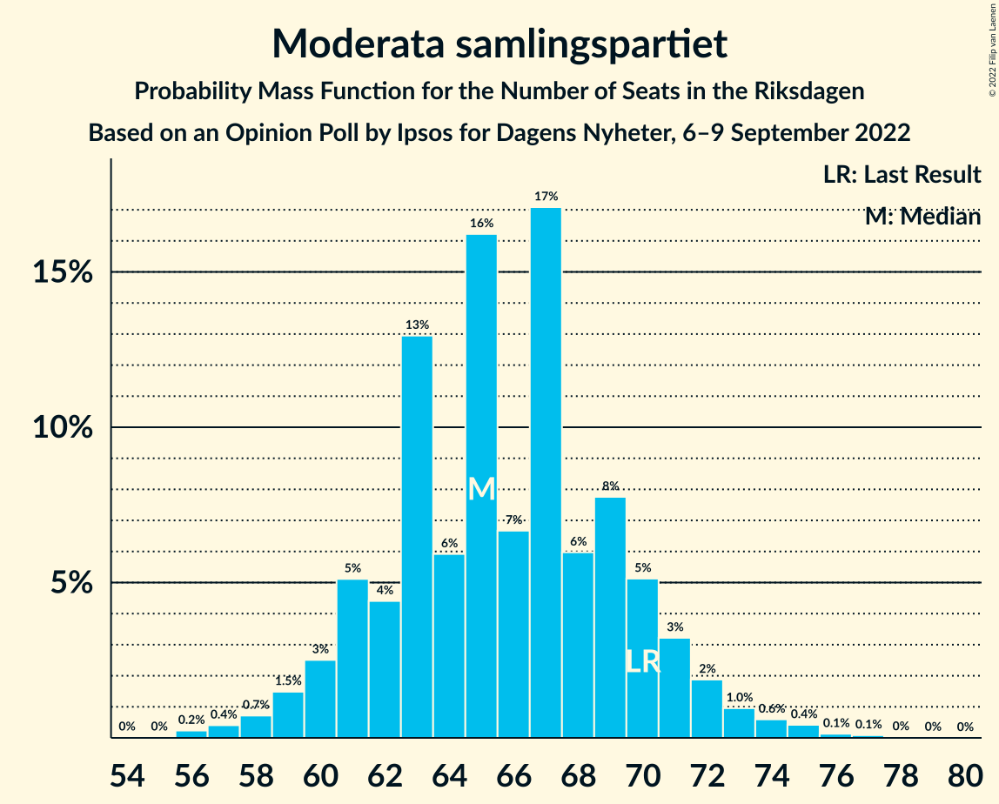

| Number of Seats | Probability | Accumulated | Special Marks |
|:---------------:|:-----------:|:-----------:|:-------------:|
| 55 | 0% | 100% |  |
| 56 | 0.2% | 99.9% |  |
| 57 | 0.4% | 99.7% |  |
| 58 | 0.7% | 99.3% |  |
| 59 | 1.5% | 98.6% |  |
| 60 | 3% | 97% |  |
| 61 | 5% | 95% |  |
| 62 | 4% | 89% |  |
| 63 | 13% | 85% |  |
| 64 | 6% | 72% |  |
| 65 | 16% | 66% | Median |
| 66 | 7% | 50% |  |
| 67 | 17% | 43% |  |
| 68 | 6% | 26% |  |
| 69 | 8% | 20% |  |
| 70 | 5% | 12% | Last Result |
| 71 | 3% | 7% |  |
| 72 | 2% | 4% |  |
| 73 | 1.0% | 2% |  |
| 74 | 0.6% | 1.3% |  |
| 75 | 0.4% | 0.7% |  |
| 76 | 0.1% | 0.3% |  |
| 77 | 0.1% | 0.1% |  |
| 78 | 0% | 0.1% |  |
| 79 | 0% | 0% |  |

### Centerpartiet

*For a full overview of the results for this party, see the [Centerpartiet](party-centerpartiet.html) page.*

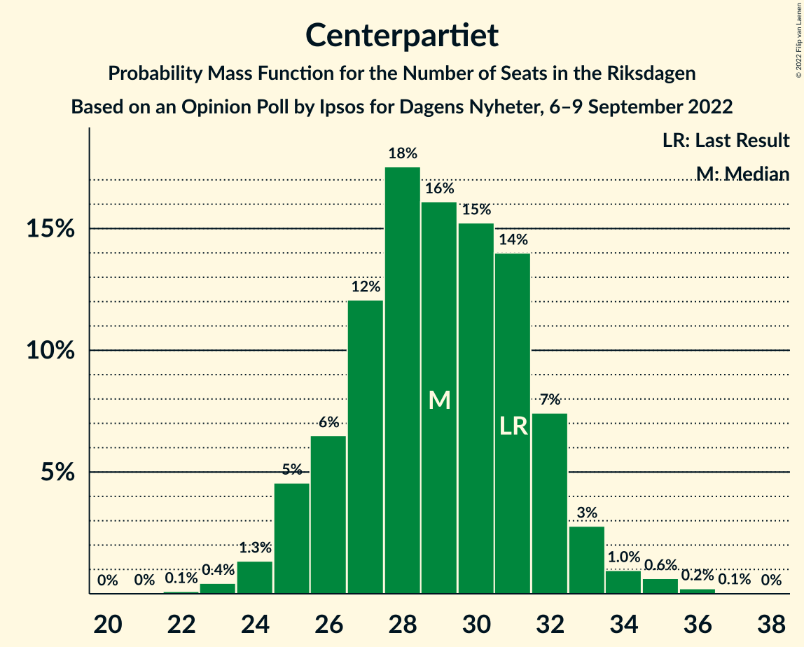

| Number of Seats | Probability | Accumulated | Special Marks |
|:---------------:|:-----------:|:-----------:|:-------------:|
| 22 | 0.1% | 100% |  |
| 23 | 0.4% | 99.9% |  |
| 24 | 1.3% | 99.4% |  |
| 25 | 5% | 98% |  |
| 26 | 6% | 94% |  |
| 27 | 12% | 87% |  |
| 28 | 18% | 75% |  |
| 29 | 16% | 57% | Median |
| 30 | 15% | 41% |  |
| 31 | 14% | 26% | Last Result |
| 32 | 7% | 12% |  |
| 33 | 3% | 5% |  |
| 34 | 1.0% | 2% |  |
| 35 | 0.6% | 0.9% |  |
| 36 | 0.2% | 0.3% |  |
| 37 | 0.1% | 0.1% |  |
| 38 | 0% | 0% |  |

### Vänsterpartiet

*For a full overview of the results for this party, see the [Vänsterpartiet](party-vänsterpartiet.html) page.*

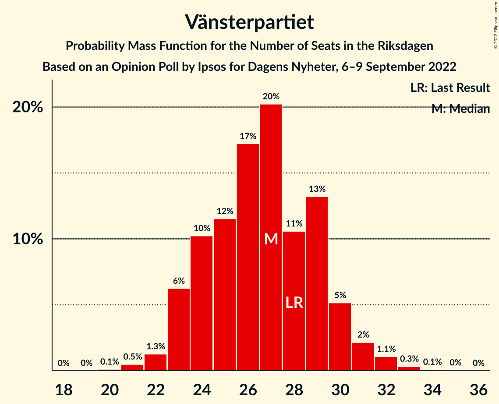

| Number of Seats | Probability | Accumulated | Special Marks |
|:---------------:|:-----------:|:-----------:|:-------------:|
| 20 | 0.1% | 100% |  |
| 21 | 0.5% | 99.9% |  |
| 22 | 1.3% | 99.4% |  |
| 23 | 6% | 98% |  |
| 24 | 10% | 92% |  |
| 25 | 12% | 82% |  |
| 26 | 17% | 70% |  |
| 27 | 20% | 53% | Median |
| 28 | 11% | 33% | Last Result |
| 29 | 13% | 22% |  |
| 30 | 5% | 9% |  |
| 31 | 2% | 4% |  |
| 32 | 1.1% | 2% |  |
| 33 | 0.3% | 0.5% |  |
| 34 | 0.1% | 0.2% |  |
| 35 | 0% | 0.1% |  |
| 36 | 0% | 0% |  |

### Miljöpartiet de gröna

*For a full overview of the results for this party, see the [Miljöpartiet de gröna](party-miljöpartietdegröna.html) page.*

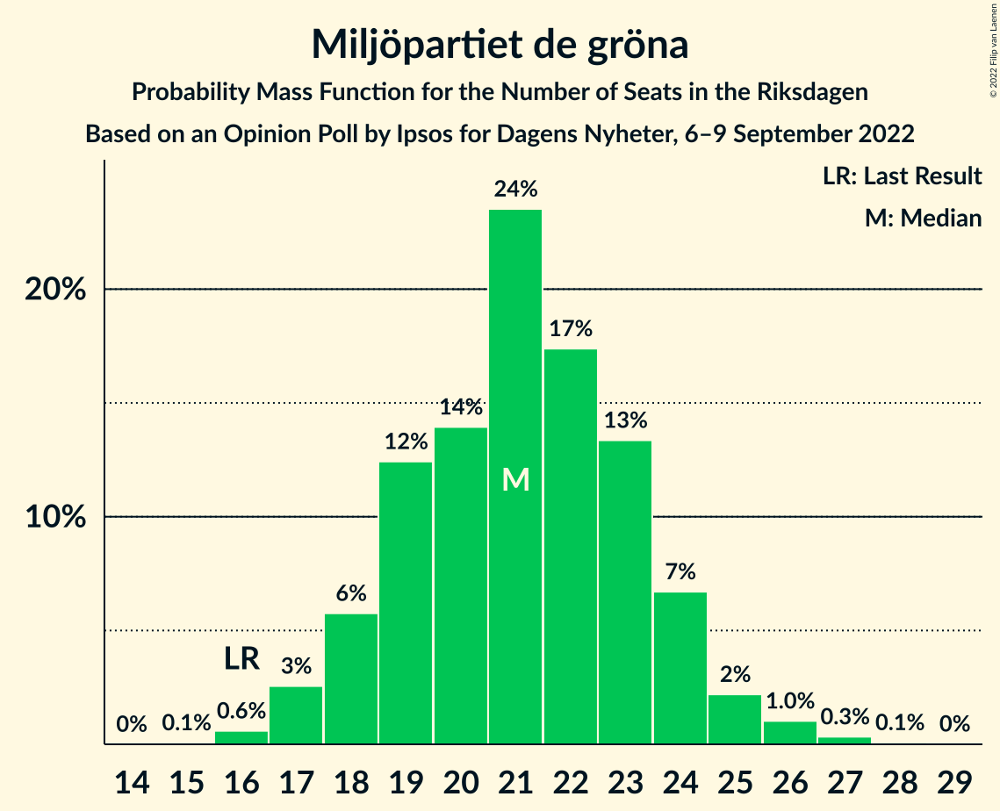

| Number of Seats | Probability | Accumulated | Special Marks |
|:---------------:|:-----------:|:-----------:|:-------------:|
| 15 | 0.1% | 100% |  |
| 16 | 0.6% | 99.9% | Last Result |
| 17 | 3% | 99.3% |  |
| 18 | 6% | 97% |  |
| 19 | 12% | 91% |  |
| 20 | 14% | 79% |  |
| 21 | 24% | 65% | Median |
| 22 | 17% | 41% |  |
| 23 | 13% | 24% |  |
| 24 | 7% | 10% |  |
| 25 | 2% | 4% |  |
| 26 | 1.0% | 1.5% |  |
| 27 | 0.3% | 0.4% |  |
| 28 | 0.1% | 0.1% |  |
| 29 | 0% | 0% |  |

### Kristdemokraterna

*For a full overview of the results for this party, see the [Kristdemokraterna](party-kristdemokraterna.html) page.*

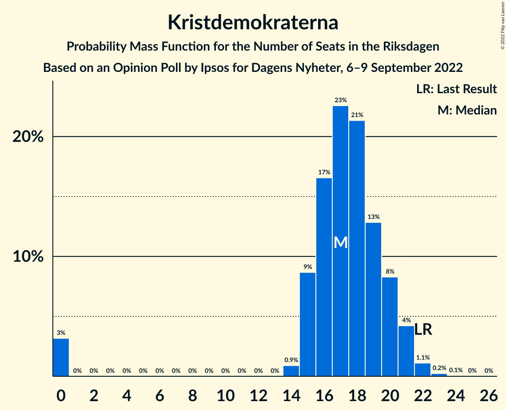

| Number of Seats | Probability | Accumulated | Special Marks |
|:---------------:|:-----------:|:-----------:|:-------------:|
| 0 | 3% | 100% |  |
| 1 | 0% | 97% |  |
| 2 | 0% | 97% |  |
| 3 | 0% | 97% |  |
| 4 | 0% | 97% |  |
| 5 | 0% | 97% |  |
| 6 | 0% | 97% |  |
| 7 | 0% | 97% |  |
| 8 | 0% | 97% |  |
| 9 | 0% | 97% |  |
| 10 | 0% | 97% |  |
| 11 | 0% | 97% |  |
| 12 | 0% | 97% |  |
| 13 | 0% | 97% |  |
| 14 | 0.9% | 97% |  |
| 15 | 9% | 96% |  |
| 16 | 17% | 87% |  |
| 17 | 23% | 71% | Median |
| 18 | 21% | 48% |  |
| 19 | 13% | 27% |  |
| 20 | 8% | 14% |  |
| 21 | 4% | 6% |  |
| 22 | 1.1% | 1.4% | Last Result |
| 23 | 0.2% | 0.3% |  |
| 24 | 0.1% | 0.1% |  |
| 25 | 0% | 0% |  |

### Liberalerna

*For a full overview of the results for this party, see the [Liberalerna](party-liberalerna.html) page.*

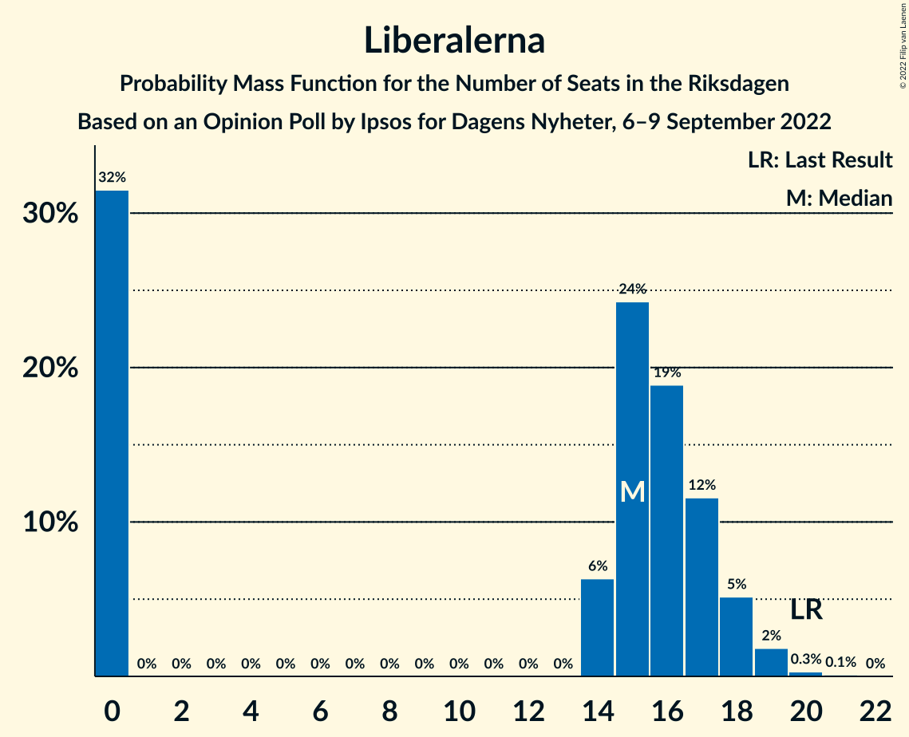

| Number of Seats | Probability | Accumulated | Special Marks |
|:---------------:|:-----------:|:-----------:|:-------------:|
| 0 | 32% | 100% |  |
| 1 | 0% | 68% |  |
| 2 | 0% | 68% |  |
| 3 | 0% | 68% |  |
| 4 | 0% | 68% |  |
| 5 | 0% | 68% |  |
| 6 | 0% | 68% |  |
| 7 | 0% | 68% |  |
| 8 | 0% | 68% |  |
| 9 | 0% | 68% |  |
| 10 | 0% | 68% |  |
| 11 | 0% | 68% |  |
| 12 | 0% | 68% |  |
| 13 | 0% | 68% |  |
| 14 | 6% | 68% |  |
| 15 | 24% | 62% | Median |
| 16 | 19% | 38% |  |
| 17 | 12% | 19% |  |
| 18 | 5% | 7% |  |
| 19 | 2% | 2% |  |
| 20 | 0.3% | 0.4% | Last Result |
| 21 | 0.1% | 0.1% |  |
| 22 | 0% | 0% |  |

## Coalitions

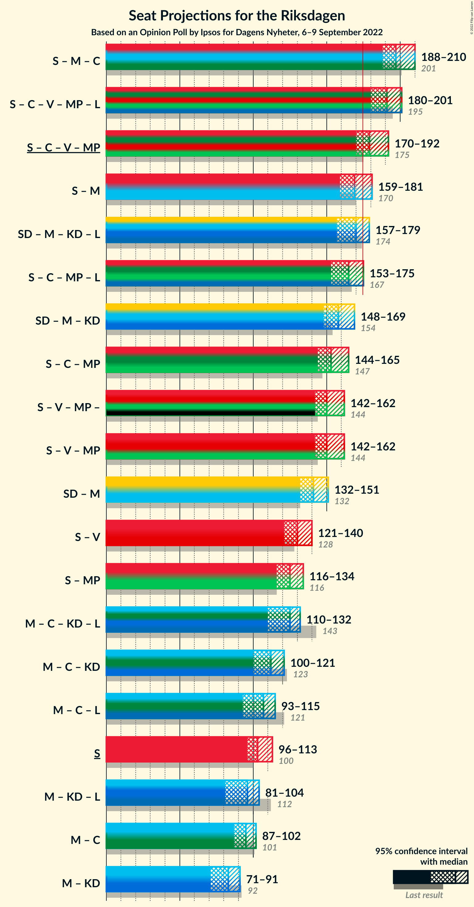

### Confidence Intervals

| Coalition | Last Result | Median | Majority? | 80% Confidence Interval | 90% Confidence Interval | 95% Confidence Interval | 99% Confidence Interval |
|:---------:|:-----------:|:------:|:---------:|:-----------------------:|:-----------------------:|:-----------------------:|:-----------------------:|
| Sveriges socialdemokratiska arbetareparti – Moderata samlingspartiet – Centerpartiet | 201 | 197 | 100% | 191–206 | 189–208 | 188–210 | 185–214 |
| Sveriges socialdemokratiska arbetareparti – Centerpartiet – Vänsterpartiet – Miljöpartiet de gröna – Liberalerna | 195 | 191 | 99.9% | 183–198 | 182–200 | 180–201 | 177–206 |
| Sveriges socialdemokratiska arbetareparti – Centerpartiet – Vänsterpartiet – Miljöpartiet de gröna | 175 | 179 | 81% | 173–187 | 171–190 | 170–192 | 168–196 |
| Sveriges socialdemokratiska arbetareparti – Moderata samlingspartiet | 170 | 169 | 18% | 162–177 | 161–179 | 159–181 | 157–185 |
| Sverigedemokraterna – Moderata samlingspartiet – Kristdemokraterna – Liberalerna | 174 | 170 | 19% | 162–176 | 159–178 | 157–179 | 153–181 |
| Sveriges socialdemokratiska arbetareparti – Centerpartiet – Miljöpartiet de gröna – Liberalerna | 167 | 165 | 3% | 156–171 | 154–173 | 153–175 | 150–179 |
| Sverigedemokraterna – Moderata samlingspartiet – Kristdemokraterna | 154 | 158 | 0.1% | 151–166 | 149–167 | 148–169 | 143–172 |
| Sveriges socialdemokratiska arbetareparti – Centerpartiet – Miljöpartiet de gröna | 147 | 153 | 0% | 147–160 | 145–162 | 144–165 | 142–168 |
| Sveriges socialdemokratiska arbetareparti – Vänsterpartiet – Miljöpartiet de gröna | 144 | 150 | 0% | 144–157 | 143–160 | 142–162 | 140–166 |
| Sverigedemokraterna – Moderata samlingspartiet | 132 | 141 | 0% | 135–148 | 133–150 | 132–151 | 130–154 |
| Sveriges socialdemokratiska arbetareparti – Vänsterpartiet | 128 | 130 | 0% | 124–137 | 122–138 | 121–140 | 119–144 |
| Sveriges socialdemokratiska arbetareparti – Miljöpartiet de gröna | 116 | 125 | 0% | 118–130 | 117–133 | 116–134 | 114–137 |
| Moderata samlingspartiet – Centerpartiet – Kristdemokraterna – Liberalerna | 143 | 125 | 0% | 113–130 | 112–131 | 110–132 | 104–135 |
| Moderata samlingspartiet – Centerpartiet – Kristdemokraterna | 123 | 112 | 0% | 106–117 | 104–119 | 100–121 | 95–123 |
| Moderata samlingspartiet – Centerpartiet – Liberalerna | 121 | 107 | 0% | 97–112 | 95–114 | 93–115 | 89–118 |
| Sveriges socialdemokratiska arbetareparti | 100 | 103 | 0% | 98–108 | 96–111 | 96–113 | 93–115 |
| Moderata samlingspartiet – Kristdemokraterna – Liberalerna | 112 | 96 | 0% | 83–101 | 82–103 | 81–104 | 75–106 |
| Moderata samlingspartiet – Centerpartiet | 101 | 95 | 0% | 90–99 | 88–101 | 87–102 | 84–106 |
| Moderata samlingspartiet – Kristdemokraterna | 92 | 83 | 0% | 78–88 | 76–90 | 71–91 | 65–93 |

### Sveriges socialdemokratiska arbetareparti – Moderata samlingspartiet – Centerpartiet

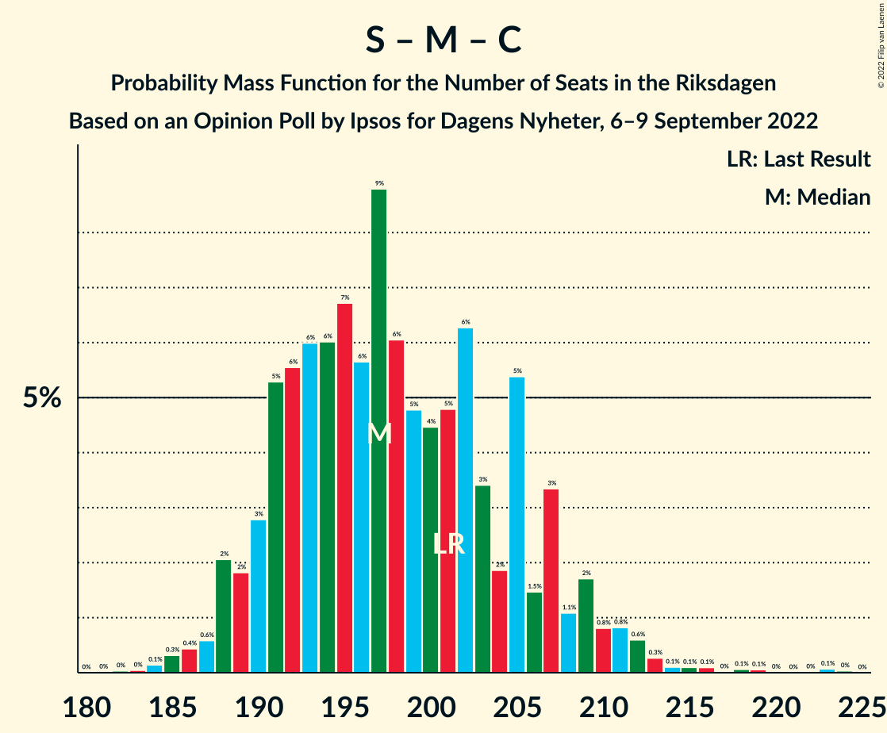

| Number of Seats | Probability | Accumulated | Special Marks |
|:---------------:|:-----------:|:-----------:|:-------------:|
| 182 | 0% | 100% |  |
| 183 | 0% | 99.9% |  |
| 184 | 0.1% | 99.9% |  |
| 185 | 0.3% | 99.8% |  |
| 186 | 0.4% | 99.4% |  |
| 187 | 0.6% | 99.0% |  |
| 188 | 2% | 98% |  |
| 189 | 2% | 96% |  |
| 190 | 3% | 95% |  |
| 191 | 5% | 92% |  |
| 192 | 6% | 86% |  |
| 193 | 6% | 81% |  |
| 194 | 6% | 75% |  |
| 195 | 7% | 69% |  |
| 196 | 6% | 62% |  |
| 197 | 9% | 57% | Median |
| 198 | 6% | 48% |  |
| 199 | 5% | 42% |  |
| 200 | 4% | 37% |  |
| 201 | 5% | 32% | Last Result |
| 202 | 6% | 28% |  |
| 203 | 3% | 21% |  |
| 204 | 2% | 18% |  |
| 205 | 5% | 16% |  |
| 206 | 1.5% | 11% |  |
| 207 | 3% | 9% |  |
| 208 | 1.1% | 6% |  |
| 209 | 2% | 5% |  |
| 210 | 0.8% | 3% |  |
| 211 | 0.8% | 2% |  |
| 212 | 0.6% | 1.4% |  |
| 213 | 0.3% | 0.8% |  |
| 214 | 0.1% | 0.6% |  |
| 215 | 0.1% | 0.5% |  |
| 216 | 0.1% | 0.4% |  |
| 217 | 0% | 0.3% |  |
| 218 | 0.1% | 0.3% |  |
| 219 | 0.1% | 0.2% |  |
| 220 | 0% | 0.1% |  |
| 221 | 0% | 0.1% |  |
| 222 | 0% | 0.1% |  |
| 223 | 0.1% | 0.1% |  |
| 224 | 0% | 0% |  |

### Sveriges socialdemokratiska arbetareparti – Centerpartiet – Vänsterpartiet – Miljöpartiet de gröna – Liberalerna

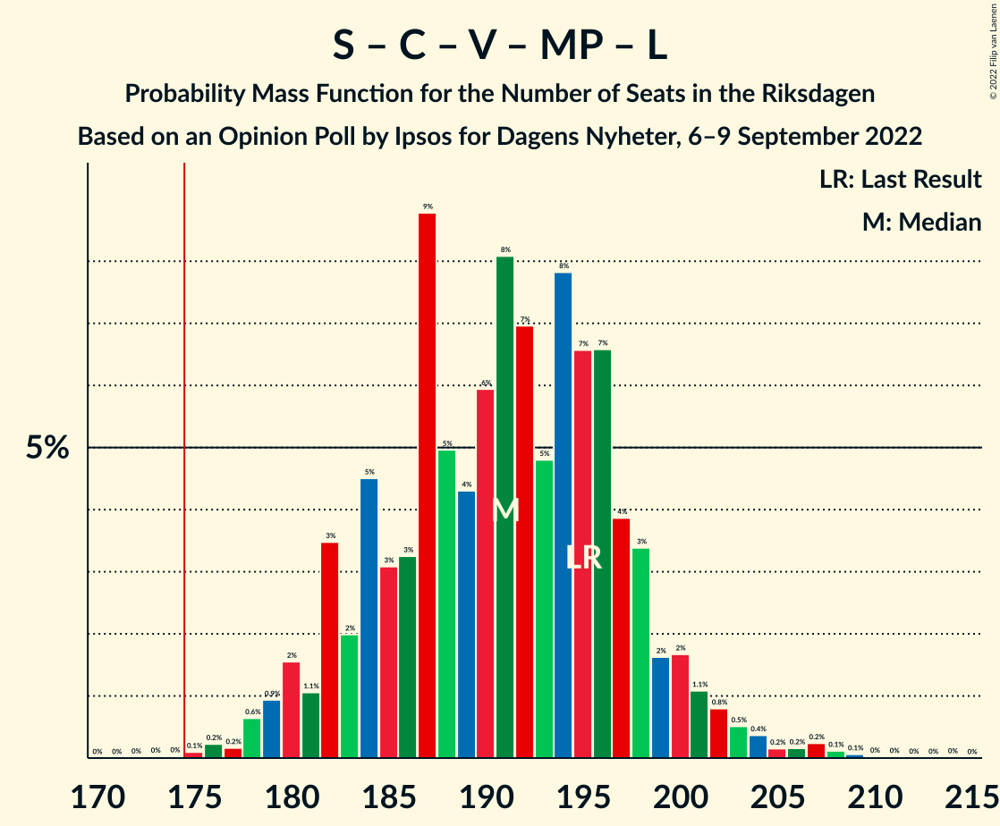

| Number of Seats | Probability | Accumulated | Special Marks |
|:---------------:|:-----------:|:-----------:|:-------------:|
| 174 | 0% | 100% |  |
| 175 | 0.1% | 99.9% | Majority |
| 176 | 0.2% | 99.8% |  |
| 177 | 0.2% | 99.6% |  |
| 178 | 0.6% | 99.4% |  |
| 179 | 0.9% | 98.8% |  |
| 180 | 2% | 98% |  |
| 181 | 1.1% | 96% |  |
| 182 | 3% | 95% |  |
| 183 | 2% | 92% |  |
| 184 | 5% | 90% |  |
| 185 | 3% | 85% |  |
| 186 | 3% | 82% |  |
| 187 | 9% | 79% |  |
| 188 | 5% | 70% |  |
| 189 | 4% | 65% |  |
| 190 | 6% | 61% |  |
| 191 | 8% | 55% |  |
| 192 | 7% | 47% |  |
| 193 | 5% | 40% |  |
| 194 | 8% | 35% |  |
| 195 | 7% | 27% | Last Result, Median |
| 196 | 7% | 21% |  |
| 197 | 4% | 14% |  |
| 198 | 3% | 10% |  |
| 199 | 2% | 7% |  |
| 200 | 2% | 5% |  |
| 201 | 1.1% | 4% |  |
| 202 | 0.8% | 2% |  |
| 203 | 0.5% | 2% |  |
| 204 | 0.4% | 1.2% |  |
| 205 | 0.2% | 0.8% |  |
| 206 | 0.2% | 0.6% |  |
| 207 | 0.2% | 0.5% |  |
| 208 | 0.1% | 0.3% |  |
| 209 | 0.1% | 0.1% |  |
| 210 | 0% | 0.1% |  |
| 211 | 0% | 0% |  |

### Sveriges socialdemokratiska arbetareparti – Centerpartiet – Vänsterpartiet – Miljöpartiet de gröna

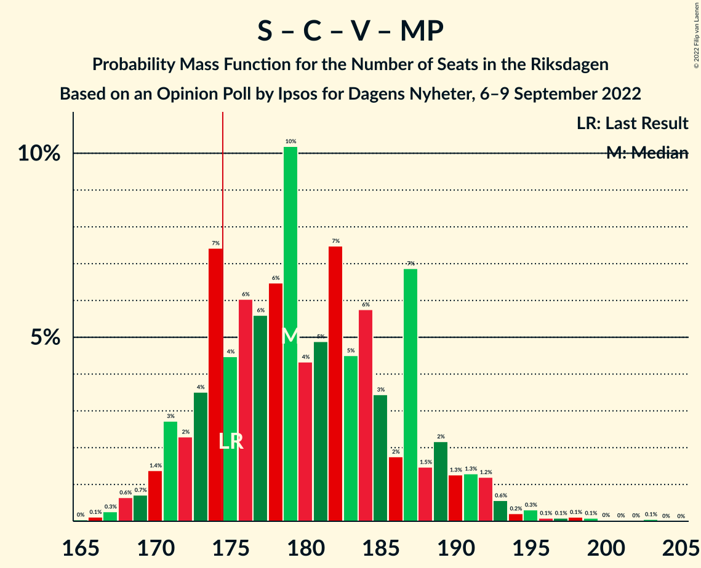

| Number of Seats | Probability | Accumulated | Special Marks |
|:---------------:|:-----------:|:-----------:|:-------------:|
| 165 | 0% | 100% |  |
| 166 | 0.1% | 99.9% |  |
| 167 | 0.3% | 99.8% |  |
| 168 | 0.6% | 99.5% |  |
| 169 | 0.7% | 98.9% |  |
| 170 | 1.4% | 98% |  |
| 171 | 3% | 97% |  |
| 172 | 2% | 94% |  |
| 173 | 4% | 92% |  |
| 174 | 7% | 88% |  |
| 175 | 4% | 81% | Last Result, Majority |
| 176 | 6% | 76% |  |
| 177 | 6% | 70% |  |
| 178 | 6% | 65% |  |
| 179 | 10% | 58% |  |
| 180 | 4% | 48% | Median |
| 181 | 5% | 44% |  |
| 182 | 7% | 39% |  |
| 183 | 5% | 31% |  |
| 184 | 6% | 27% |  |
| 185 | 3% | 21% |  |
| 186 | 2% | 18% |  |
| 187 | 7% | 16% |  |
| 188 | 1.5% | 9% |  |
| 189 | 2% | 8% |  |
| 190 | 1.3% | 5% |  |
| 191 | 1.3% | 4% |  |
| 192 | 1.2% | 3% |  |
| 193 | 0.6% | 2% |  |
| 194 | 0.2% | 1.1% |  |
| 195 | 0.3% | 0.8% |  |
| 196 | 0.1% | 0.5% |  |
| 197 | 0.1% | 0.4% |  |
| 198 | 0.1% | 0.4% |  |
| 199 | 0.1% | 0.2% |  |
| 200 | 0% | 0.2% |  |
| 201 | 0% | 0.1% |  |
| 202 | 0% | 0.1% |  |
| 203 | 0.1% | 0.1% |  |
| 204 | 0% | 0% |  |

### Sveriges socialdemokratiska arbetareparti – Moderata samlingspartiet

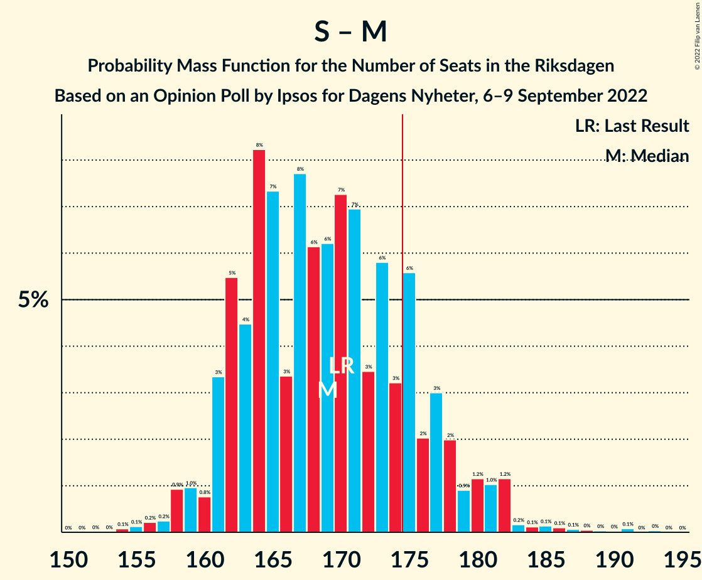

| Number of Seats | Probability | Accumulated | Special Marks |
|:---------------:|:-----------:|:-----------:|:-------------:|
| 154 | 0.1% | 100% |  |
| 155 | 0.1% | 99.9% |  |
| 156 | 0.2% | 99.8% |  |
| 157 | 0.2% | 99.6% |  |
| 158 | 0.9% | 99.3% |  |
| 159 | 1.0% | 98% |  |
| 160 | 0.8% | 97% |  |
| 161 | 3% | 97% |  |
| 162 | 5% | 93% |  |
| 163 | 4% | 88% |  |
| 164 | 8% | 83% |  |
| 165 | 7% | 75% |  |
| 166 | 3% | 68% |  |
| 167 | 8% | 64% |  |
| 168 | 6% | 57% | Median |
| 169 | 6% | 51% |  |
| 170 | 7% | 44% | Last Result |
| 171 | 7% | 37% |  |
| 172 | 3% | 30% |  |
| 173 | 6% | 27% |  |
| 174 | 3% | 21% |  |
| 175 | 6% | 18% | Majority |
| 176 | 2% | 12% |  |
| 177 | 3% | 10% |  |
| 178 | 2% | 7% |  |
| 179 | 0.9% | 5% |  |
| 180 | 1.2% | 4% |  |
| 181 | 1.0% | 3% |  |
| 182 | 1.2% | 2% |  |
| 183 | 0.2% | 0.8% |  |
| 184 | 0.1% | 0.7% |  |
| 185 | 0.1% | 0.5% |  |
| 186 | 0.1% | 0.4% |  |
| 187 | 0.1% | 0.3% |  |
| 188 | 0% | 0.2% |  |
| 189 | 0% | 0.2% |  |
| 190 | 0% | 0.2% |  |
| 191 | 0.1% | 0.1% |  |
| 192 | 0% | 0% |  |

### Sverigedemokraterna – Moderata samlingspartiet – Kristdemokraterna – Liberalerna

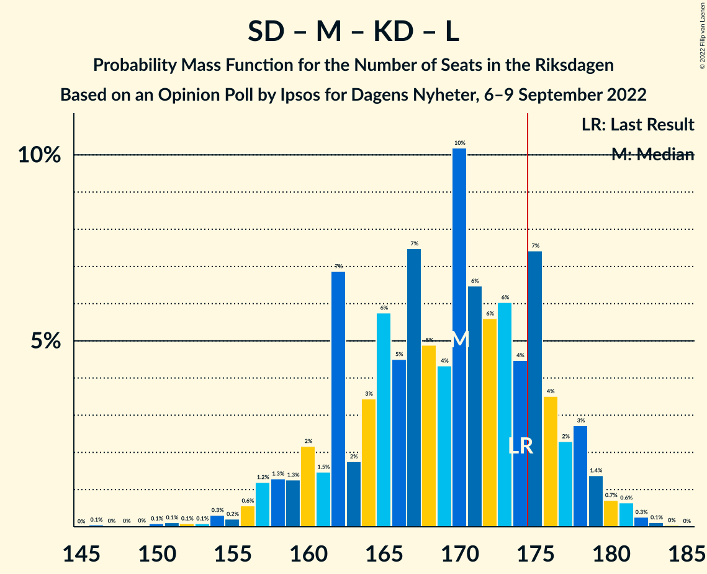

| Number of Seats | Probability | Accumulated | Special Marks |
|:---------------:|:-----------:|:-----------:|:-------------:|
| 146 | 0.1% | 100% |  |
| 147 | 0% | 99.9% |  |
| 148 | 0% | 99.9% |  |
| 149 | 0% | 99.9% |  |
| 150 | 0.1% | 99.8% |  |
| 151 | 0.1% | 99.8% |  |
| 152 | 0.1% | 99.6% |  |
| 153 | 0.1% | 99.6% |  |
| 154 | 0.3% | 99.5% |  |
| 155 | 0.2% | 99.2% |  |
| 156 | 0.6% | 98.9% |  |
| 157 | 1.2% | 98% |  |
| 158 | 1.3% | 97% |  |
| 159 | 1.3% | 96% |  |
| 160 | 2% | 95% |  |
| 161 | 1.5% | 92% |  |
| 162 | 7% | 91% |  |
| 163 | 2% | 84% |  |
| 164 | 3% | 82% |  |
| 165 | 6% | 79% |  |
| 166 | 5% | 73% |  |
| 167 | 7% | 69% |  |
| 168 | 5% | 61% |  |
| 169 | 4% | 56% |  |
| 170 | 10% | 52% |  |
| 171 | 6% | 42% |  |
| 172 | 6% | 35% | Median |
| 173 | 6% | 30% |  |
| 174 | 4% | 24% | Last Result |
| 175 | 7% | 19% | Majority |
| 176 | 4% | 12% |  |
| 177 | 2% | 8% |  |
| 178 | 3% | 6% |  |
| 179 | 1.4% | 3% |  |
| 180 | 0.7% | 2% |  |
| 181 | 0.6% | 1.1% |  |
| 182 | 0.3% | 0.5% |  |
| 183 | 0.1% | 0.2% |  |
| 184 | 0% | 0.1% |  |
| 185 | 0% | 0% |  |

### Sveriges socialdemokratiska arbetareparti – Centerpartiet – Miljöpartiet de gröna – Liberalerna

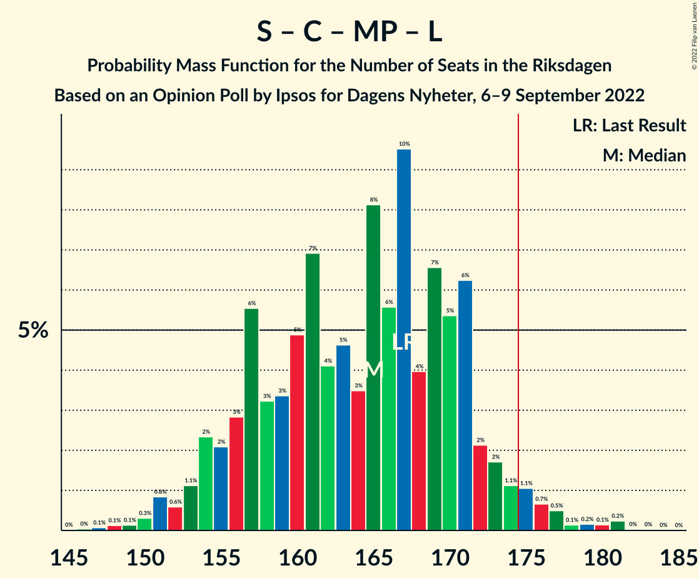

| Number of Seats | Probability | Accumulated | Special Marks |
|:---------------:|:-----------:|:-----------:|:-------------:|
| 146 | 0% | 100% |  |
| 147 | 0.1% | 99.9% |  |
| 148 | 0.1% | 99.9% |  |
| 149 | 0.1% | 99.7% |  |
| 150 | 0.3% | 99.6% |  |
| 151 | 0.8% | 99.3% |  |
| 152 | 0.6% | 98% |  |
| 153 | 1.1% | 98% |  |
| 154 | 2% | 97% |  |
| 155 | 2% | 94% |  |
| 156 | 3% | 92% |  |
| 157 | 6% | 89% |  |
| 158 | 3% | 84% |  |
| 159 | 3% | 81% |  |
| 160 | 5% | 77% |  |
| 161 | 7% | 72% |  |
| 162 | 4% | 66% |  |
| 163 | 5% | 61% |  |
| 164 | 3% | 57% |  |
| 165 | 8% | 53% |  |
| 166 | 6% | 45% |  |
| 167 | 10% | 40% | Last Result |
| 168 | 4% | 30% | Median |
| 169 | 7% | 26% |  |
| 170 | 5% | 20% |  |
| 171 | 6% | 14% |  |
| 172 | 2% | 8% |  |
| 173 | 2% | 6% |  |
| 174 | 1.1% | 4% |  |
| 175 | 1.1% | 3% | Majority |
| 176 | 0.7% | 2% |  |
| 177 | 0.5% | 1.3% |  |
| 178 | 0.1% | 0.8% |  |
| 179 | 0.2% | 0.6% |  |
| 180 | 0.1% | 0.5% |  |
| 181 | 0.2% | 0.3% |  |
| 182 | 0% | 0.1% |  |
| 183 | 0% | 0.1% |  |
| 184 | 0% | 0% |  |

### Sverigedemokraterna – Moderata samlingspartiet – Kristdemokraterna

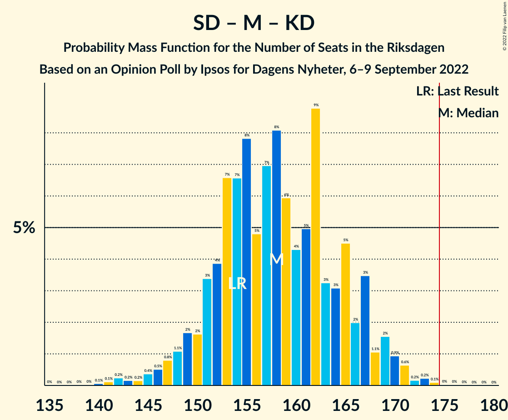

| Number of Seats | Probability | Accumulated | Special Marks |
|:---------------:|:-----------:|:-----------:|:-------------:|
| 139 | 0% | 100% |  |
| 140 | 0.1% | 99.9% |  |
| 141 | 0.1% | 99.9% |  |
| 142 | 0.2% | 99.7% |  |
| 143 | 0.2% | 99.5% |  |
| 144 | 0.2% | 99.4% |  |
| 145 | 0.4% | 99.2% |  |
| 146 | 0.5% | 98.8% |  |
| 147 | 0.8% | 98% |  |
| 148 | 1.1% | 98% |  |
| 149 | 2% | 96% |  |
| 150 | 2% | 95% |  |
| 151 | 3% | 93% |  |
| 152 | 4% | 90% |  |
| 153 | 7% | 86% |  |
| 154 | 7% | 79% | Last Result |
| 155 | 8% | 73% |  |
| 156 | 5% | 65% |  |
| 157 | 7% | 60% | Median |
| 158 | 8% | 53% |  |
| 159 | 6% | 45% |  |
| 160 | 4% | 39% |  |
| 161 | 5% | 35% |  |
| 162 | 9% | 30% |  |
| 163 | 3% | 21% |  |
| 164 | 3% | 18% |  |
| 165 | 5% | 15% |  |
| 166 | 2% | 10% |  |
| 167 | 3% | 8% |  |
| 168 | 1.1% | 5% |  |
| 169 | 2% | 4% |  |
| 170 | 0.9% | 2% |  |
| 171 | 0.6% | 1.2% |  |
| 172 | 0.2% | 0.6% |  |
| 173 | 0.2% | 0.4% |  |
| 174 | 0.1% | 0.2% |  |
| 175 | 0% | 0.1% | Majority |
| 176 | 0% | 0% |  |

### Sveriges socialdemokratiska arbetareparti – Centerpartiet – Miljöpartiet de gröna

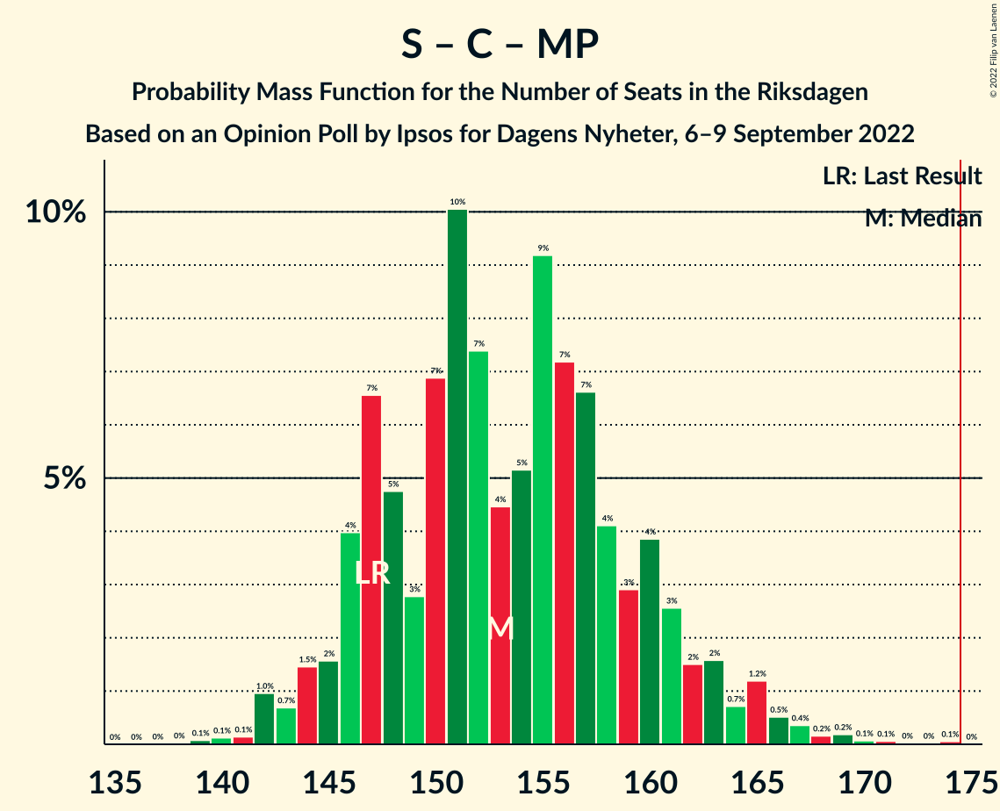

| Number of Seats | Probability | Accumulated | Special Marks |
|:---------------:|:-----------:|:-----------:|:-------------:|
| 139 | 0.1% | 100% |  |
| 140 | 0.1% | 99.9% |  |
| 141 | 0.1% | 99.8% |  |
| 142 | 1.0% | 99.6% |  |
| 143 | 0.7% | 98.7% |  |
| 144 | 1.5% | 98% |  |
| 145 | 2% | 97% |  |
| 146 | 4% | 95% |  |
| 147 | 7% | 91% | Last Result |
| 148 | 5% | 84% |  |
| 149 | 3% | 80% |  |
| 150 | 7% | 77% |  |
| 151 | 10% | 70% |  |
| 152 | 7% | 60% |  |
| 153 | 4% | 53% | Median |
| 154 | 5% | 48% |  |
| 155 | 9% | 43% |  |
| 156 | 7% | 34% |  |
| 157 | 7% | 27% |  |
| 158 | 4% | 20% |  |
| 159 | 3% | 16% |  |
| 160 | 4% | 13% |  |
| 161 | 3% | 9% |  |
| 162 | 2% | 6% |  |
| 163 | 2% | 5% |  |
| 164 | 0.7% | 3% |  |
| 165 | 1.2% | 3% |  |
| 166 | 0.5% | 1.5% |  |
| 167 | 0.4% | 1.0% |  |
| 168 | 0.2% | 0.6% |  |
| 169 | 0.2% | 0.4% |  |
| 170 | 0.1% | 0.3% |  |
| 171 | 0.1% | 0.2% |  |
| 172 | 0% | 0.1% |  |
| 173 | 0% | 0.1% |  |
| 174 | 0.1% | 0.1% |  |
| 175 | 0% | 0% | Majority |

### Sveriges socialdemokratiska arbetareparti – Vänsterpartiet – Miljöpartiet de gröna

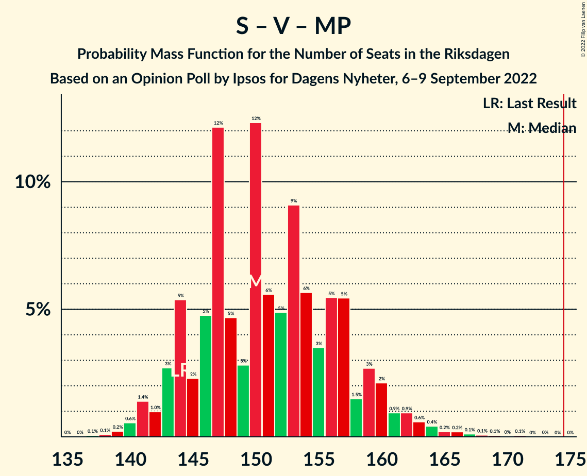

| Number of Seats | Probability | Accumulated | Special Marks |
|:---------------:|:-----------:|:-----------:|:-------------:|
| 137 | 0.1% | 100% |  |
| 138 | 0.1% | 99.9% |  |
| 139 | 0.2% | 99.8% |  |
| 140 | 0.6% | 99.6% |  |
| 141 | 1.4% | 99.0% |  |
| 142 | 1.0% | 98% |  |
| 143 | 3% | 97% |  |
| 144 | 5% | 94% | Last Result |
| 145 | 2% | 89% |  |
| 146 | 5% | 86% |  |
| 147 | 12% | 82% |  |
| 148 | 5% | 69% |  |
| 149 | 3% | 65% |  |
| 150 | 12% | 62% |  |
| 151 | 6% | 50% | Median |
| 152 | 5% | 44% |  |
| 153 | 9% | 39% |  |
| 154 | 6% | 30% |  |
| 155 | 3% | 24% |  |
| 156 | 5% | 21% |  |
| 157 | 5% | 15% |  |
| 158 | 1.5% | 10% |  |
| 159 | 3% | 8% |  |
| 160 | 2% | 6% |  |
| 161 | 0.9% | 4% |  |
| 162 | 0.9% | 3% |  |
| 163 | 0.6% | 2% |  |
| 164 | 0.4% | 1.2% |  |
| 165 | 0.2% | 0.8% |  |
| 166 | 0.2% | 0.6% |  |
| 167 | 0.1% | 0.4% |  |
| 168 | 0.1% | 0.2% |  |
| 169 | 0.1% | 0.2% |  |
| 170 | 0% | 0.1% |  |
| 171 | 0.1% | 0.1% |  |
| 172 | 0% | 0% |  |

### Sverigedemokraterna – Moderata samlingspartiet

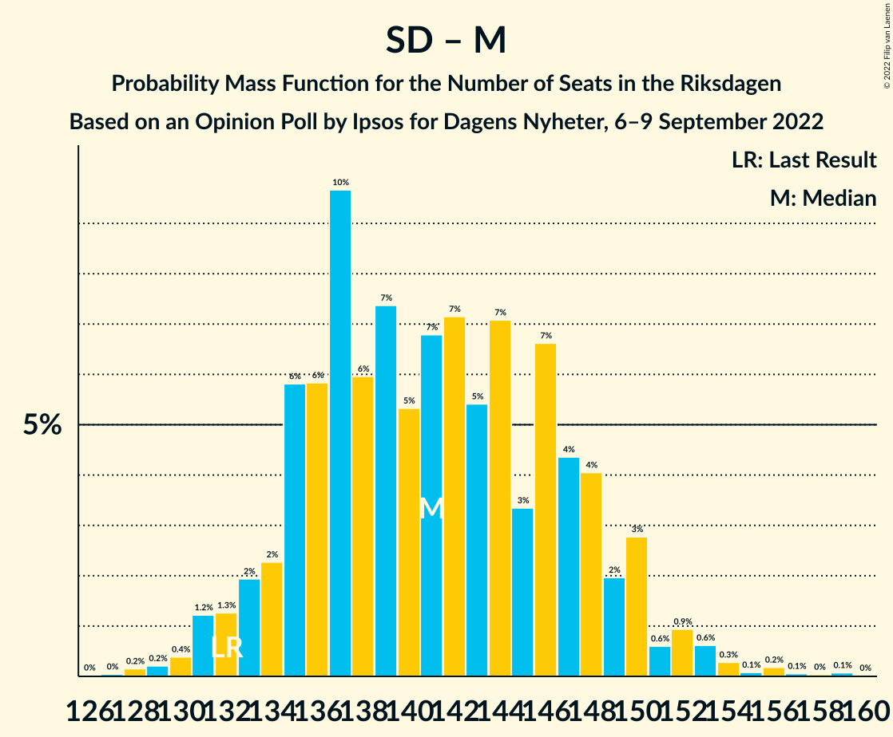

| Number of Seats | Probability | Accumulated | Special Marks |
|:---------------:|:-----------:|:-----------:|:-------------:|
| 127 | 0% | 100% |  |
| 128 | 0.2% | 99.9% |  |
| 129 | 0.2% | 99.8% |  |
| 130 | 0.4% | 99.6% |  |
| 131 | 1.2% | 99.2% |  |
| 132 | 1.3% | 98% | Last Result |
| 133 | 2% | 97% |  |
| 134 | 2% | 95% |  |
| 135 | 6% | 92% |  |
| 136 | 6% | 87% |  |
| 137 | 10% | 81% |  |
| 138 | 6% | 71% |  |
| 139 | 7% | 65% |  |
| 140 | 5% | 58% | Median |
| 141 | 7% | 52% |  |
| 142 | 7% | 46% |  |
| 143 | 5% | 39% |  |
| 144 | 7% | 33% |  |
| 145 | 3% | 26% |  |
| 146 | 7% | 23% |  |
| 147 | 4% | 16% |  |
| 148 | 4% | 12% |  |
| 149 | 2% | 8% |  |
| 150 | 3% | 6% |  |
| 151 | 0.6% | 3% |  |
| 152 | 0.9% | 2% |  |
| 153 | 0.6% | 1.4% |  |
| 154 | 0.3% | 0.8% |  |
| 155 | 0.1% | 0.5% |  |
| 156 | 0.2% | 0.4% |  |
| 157 | 0.1% | 0.2% |  |
| 158 | 0% | 0.2% |  |
| 159 | 0.1% | 0.1% |  |
| 160 | 0% | 0% |  |

### Sveriges socialdemokratiska arbetareparti – Vänsterpartiet

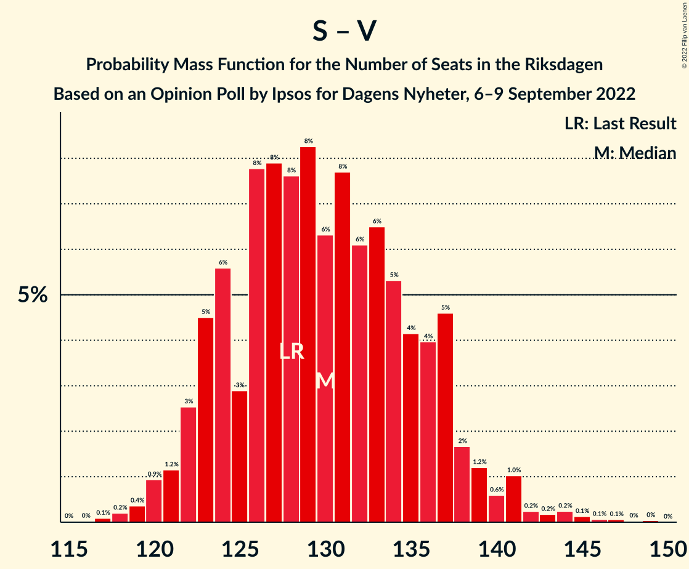

| Number of Seats | Probability | Accumulated | Special Marks |
|:---------------:|:-----------:|:-----------:|:-------------:|
| 116 | 0% | 100% |  |
| 117 | 0.1% | 99.9% |  |
| 118 | 0.2% | 99.9% |  |
| 119 | 0.4% | 99.7% |  |
| 120 | 0.9% | 99.3% |  |
| 121 | 1.2% | 98% |  |
| 122 | 3% | 97% |  |
| 123 | 5% | 95% |  |
| 124 | 6% | 90% |  |
| 125 | 3% | 85% |  |
| 126 | 8% | 82% |  |
| 127 | 8% | 74% |  |
| 128 | 8% | 66% | Last Result |
| 129 | 8% | 58% |  |
| 130 | 6% | 50% | Median |
| 131 | 8% | 44% |  |
| 132 | 6% | 36% |  |
| 133 | 6% | 30% |  |
| 134 | 5% | 24% |  |
| 135 | 4% | 18% |  |
| 136 | 4% | 14% |  |
| 137 | 5% | 10% |  |
| 138 | 2% | 5% |  |
| 139 | 1.2% | 4% |  |
| 140 | 0.6% | 3% |  |
| 141 | 1.0% | 2% |  |
| 142 | 0.2% | 1.0% |  |
| 143 | 0.2% | 0.8% |  |
| 144 | 0.2% | 0.6% |  |
| 145 | 0.1% | 0.3% |  |
| 146 | 0.1% | 0.2% |  |
| 147 | 0.1% | 0.1% |  |
| 148 | 0% | 0.1% |  |
| 149 | 0% | 0.1% |  |
| 150 | 0% | 0% |  |

### Sveriges socialdemokratiska arbetareparti – Miljöpartiet de gröna

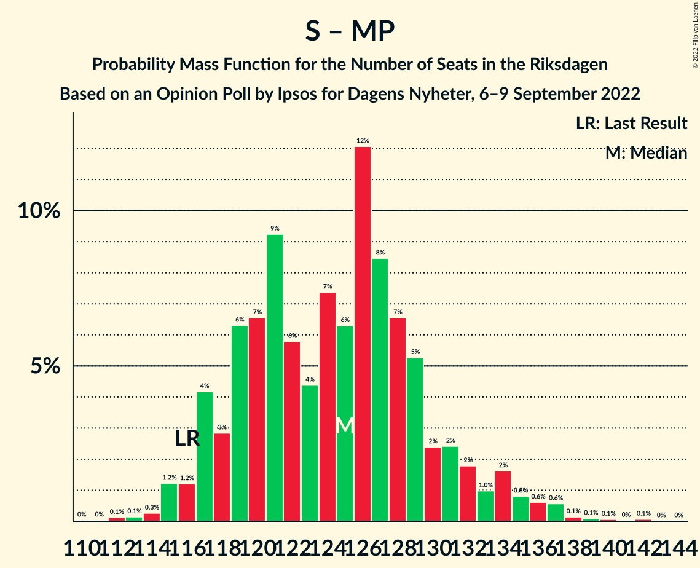

| Number of Seats | Probability | Accumulated | Special Marks |
|:---------------:|:-----------:|:-----------:|:-------------:|
| 111 | 0% | 100% |  |
| 112 | 0.1% | 99.9% |  |
| 113 | 0.1% | 99.8% |  |
| 114 | 0.3% | 99.6% |  |
| 115 | 1.2% | 99.4% |  |
| 116 | 1.2% | 98% | Last Result |
| 117 | 4% | 97% |  |
| 118 | 3% | 93% |  |
| 119 | 6% | 90% |  |
| 120 | 7% | 84% |  |
| 121 | 9% | 77% |  |
| 122 | 6% | 68% |  |
| 123 | 4% | 62% |  |
| 124 | 7% | 58% | Median |
| 125 | 6% | 50% |  |
| 126 | 12% | 44% |  |
| 127 | 8% | 32% |  |
| 128 | 7% | 23% |  |
| 129 | 5% | 17% |  |
| 130 | 2% | 12% |  |
| 131 | 2% | 9% |  |
| 132 | 2% | 7% |  |
| 133 | 1.0% | 5% |  |
| 134 | 2% | 4% |  |
| 135 | 0.8% | 2% |  |
| 136 | 0.6% | 2% |  |
| 137 | 0.6% | 1.0% |  |
| 138 | 0.1% | 0.4% |  |
| 139 | 0.1% | 0.3% |  |
| 140 | 0.1% | 0.2% |  |
| 141 | 0% | 0.1% |  |
| 142 | 0.1% | 0.1% |  |
| 143 | 0% | 0% |  |

### Moderata samlingspartiet – Centerpartiet – Kristdemokraterna – Liberalerna

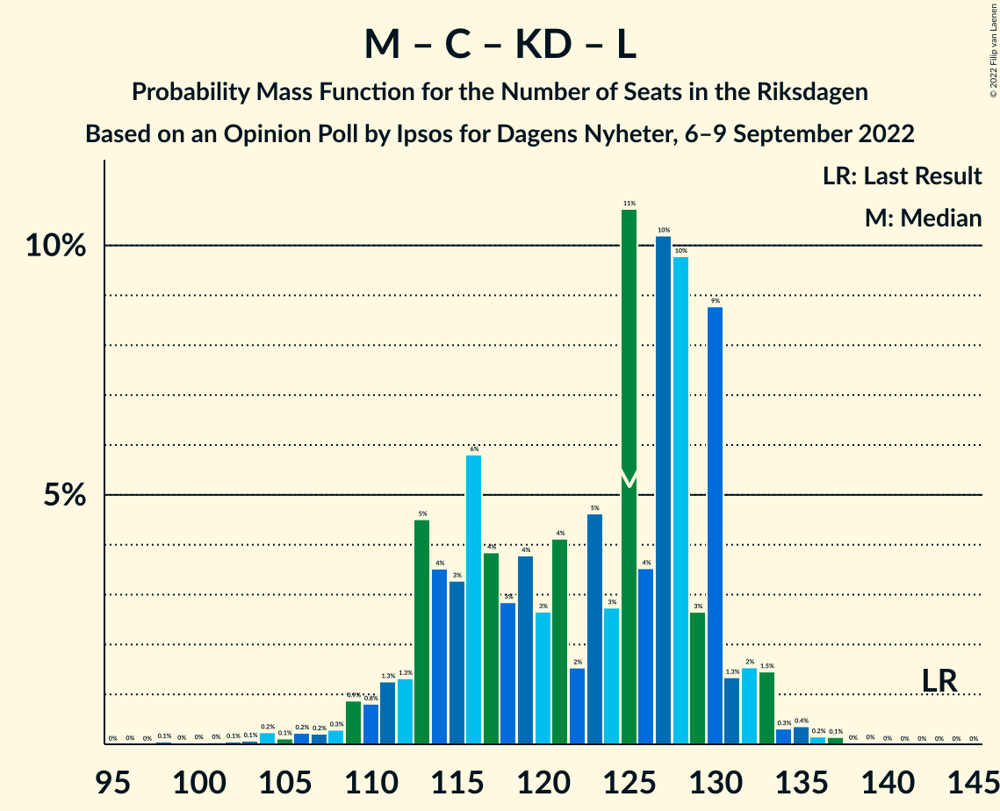

| Number of Seats | Probability | Accumulated | Special Marks |
|:---------------:|:-----------:|:-----------:|:-------------:|
| 98 | 0.1% | 100% |  |
| 99 | 0% | 99.9% |  |
| 100 | 0% | 99.9% |  |
| 101 | 0% | 99.9% |  |
| 102 | 0.1% | 99.8% |  |
| 103 | 0.1% | 99.8% |  |
| 104 | 0.2% | 99.7% |  |
| 105 | 0.1% | 99.5% |  |
| 106 | 0.2% | 99.3% |  |
| 107 | 0.2% | 99.1% |  |
| 108 | 0.3% | 98.9% |  |
| 109 | 0.9% | 98.6% |  |
| 110 | 0.8% | 98% |  |
| 111 | 1.3% | 97% |  |
| 112 | 1.3% | 96% |  |
| 113 | 5% | 94% |  |
| 114 | 4% | 90% |  |
| 115 | 3% | 86% |  |
| 116 | 6% | 83% |  |
| 117 | 4% | 77% |  |
| 118 | 3% | 73% |  |
| 119 | 4% | 71% |  |
| 120 | 3% | 67% |  |
| 121 | 4% | 64% |  |
| 122 | 2% | 60% |  |
| 123 | 5% | 58% |  |
| 124 | 3% | 54% |  |
| 125 | 11% | 51% |  |
| 126 | 4% | 40% | Median |
| 127 | 10% | 37% |  |
| 128 | 10% | 27% |  |
| 129 | 3% | 17% |  |
| 130 | 9% | 14% |  |
| 131 | 1.3% | 5% |  |
| 132 | 2% | 4% |  |
| 133 | 1.5% | 2% |  |
| 134 | 0.3% | 1.0% |  |
| 135 | 0.4% | 0.7% |  |
| 136 | 0.2% | 0.4% |  |
| 137 | 0.1% | 0.2% |  |
| 138 | 0% | 0.1% |  |
| 139 | 0% | 0% |  |
| 140 | 0% | 0% |  |
| 141 | 0% | 0% |  |
| 142 | 0% | 0% |  |
| 143 | 0% | 0% | Last Result |

### Moderata samlingspartiet – Centerpartiet – Kristdemokraterna

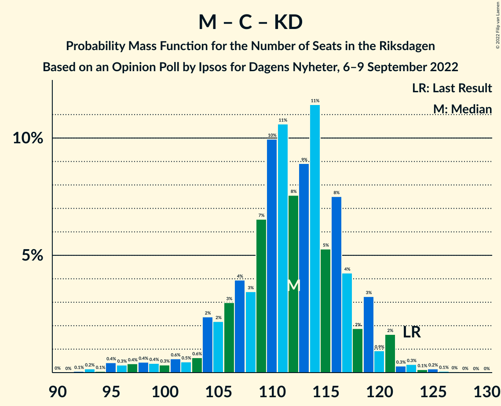

| Number of Seats | Probability | Accumulated | Special Marks |
|:---------------:|:-----------:|:-----------:|:-------------:|
| 90 | 0% | 100% |  |
| 91 | 0% | 99.9% |  |
| 92 | 0.1% | 99.9% |  |
| 93 | 0.2% | 99.9% |  |
| 94 | 0.1% | 99.7% |  |
| 95 | 0.4% | 99.6% |  |
| 96 | 0.3% | 99.2% |  |
| 97 | 0.4% | 98.9% |  |
| 98 | 0.4% | 98.5% |  |
| 99 | 0.4% | 98% |  |
| 100 | 0.3% | 98% |  |
| 101 | 0.6% | 97% |  |
| 102 | 0.5% | 97% |  |
| 103 | 0.6% | 96% |  |
| 104 | 2% | 96% |  |
| 105 | 2% | 93% |  |
| 106 | 3% | 91% |  |
| 107 | 4% | 88% |  |
| 108 | 3% | 84% |  |
| 109 | 7% | 81% |  |
| 110 | 10% | 74% |  |
| 111 | 11% | 64% | Median |
| 112 | 8% | 54% |  |
| 113 | 9% | 46% |  |
| 114 | 11% | 37% |  |
| 115 | 5% | 26% |  |
| 116 | 8% | 20% |  |
| 117 | 4% | 13% |  |
| 118 | 2% | 9% |  |
| 119 | 3% | 7% |  |
| 120 | 0.9% | 4% |  |
| 121 | 2% | 3% |  |
| 122 | 0.3% | 1.0% |  |
| 123 | 0.3% | 0.8% | Last Result |
| 124 | 0.1% | 0.4% |  |
| 125 | 0.2% | 0.3% |  |
| 126 | 0.1% | 0.1% |  |
| 127 | 0% | 0.1% |  |
| 128 | 0% | 0% |  |

### Moderata samlingspartiet – Centerpartiet – Liberalerna

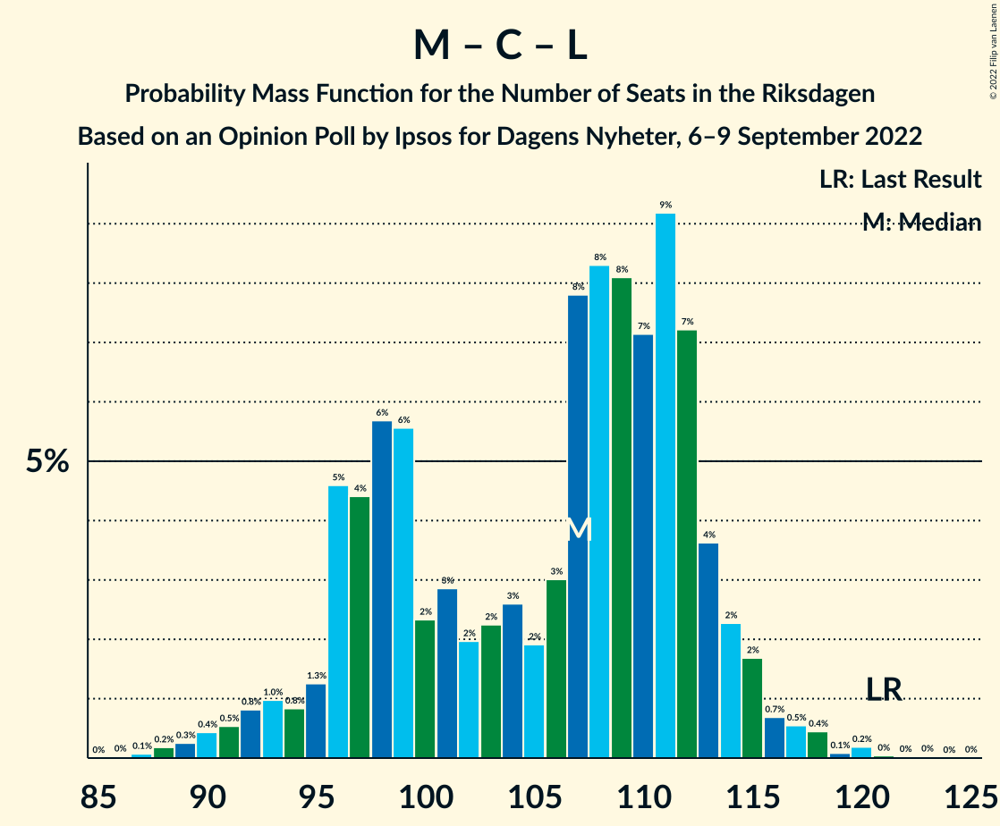

| Number of Seats | Probability | Accumulated | Special Marks |
|:---------------:|:-----------:|:-----------:|:-------------:|
| 87 | 0.1% | 100% |  |
| 88 | 0.2% | 99.9% |  |
| 89 | 0.3% | 99.7% |  |
| 90 | 0.4% | 99.5% |  |
| 91 | 0.5% | 99.0% |  |
| 92 | 0.8% | 98% |  |
| 93 | 1.0% | 98% |  |
| 94 | 0.8% | 97% |  |
| 95 | 1.3% | 96% |  |
| 96 | 5% | 95% |  |
| 97 | 4% | 90% |  |
| 98 | 6% | 86% |  |
| 99 | 6% | 80% |  |
| 100 | 2% | 74% |  |
| 101 | 3% | 72% |  |
| 102 | 2% | 69% |  |
| 103 | 2% | 67% |  |
| 104 | 3% | 65% |  |
| 105 | 2% | 62% |  |
| 106 | 3% | 60% |  |
| 107 | 8% | 57% |  |
| 108 | 8% | 50% |  |
| 109 | 8% | 41% | Median |
| 110 | 7% | 33% |  |
| 111 | 9% | 26% |  |
| 112 | 7% | 17% |  |
| 113 | 4% | 10% |  |
| 114 | 2% | 6% |  |
| 115 | 2% | 4% |  |
| 116 | 0.7% | 2% |  |
| 117 | 0.5% | 1.4% |  |
| 118 | 0.4% | 0.8% |  |
| 119 | 0.1% | 0.4% |  |
| 120 | 0.2% | 0.3% |  |
| 121 | 0% | 0.1% | Last Result |
| 122 | 0% | 0.1% |  |
| 123 | 0% | 0% |  |

### Sveriges socialdemokratiska arbetareparti

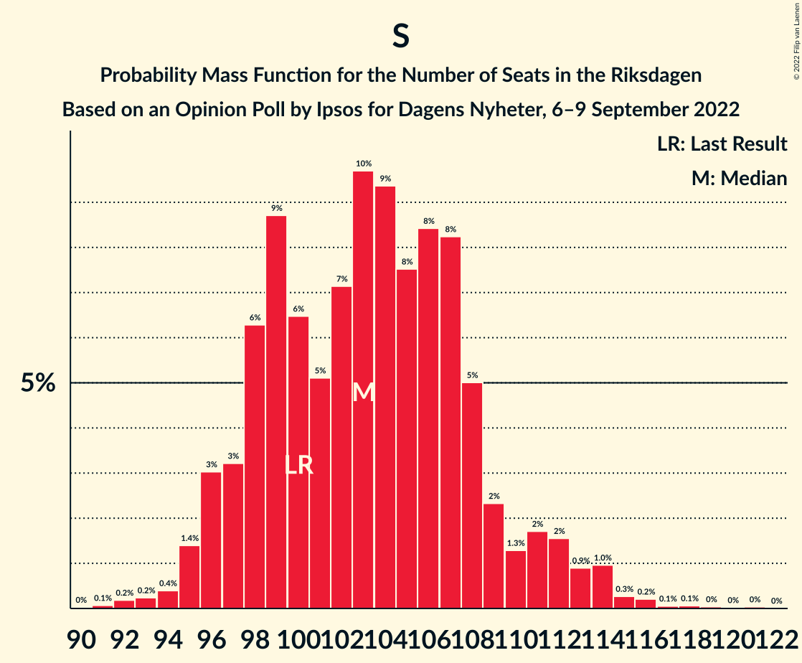

| Number of Seats | Probability | Accumulated | Special Marks |
|:---------------:|:-----------:|:-----------:|:-------------:|
| 91 | 0.1% | 100% |  |
| 92 | 0.2% | 99.9% |  |
| 93 | 0.2% | 99.7% |  |
| 94 | 0.4% | 99.5% |  |
| 95 | 1.4% | 99.1% |  |
| 96 | 3% | 98% |  |
| 97 | 3% | 95% |  |
| 98 | 6% | 91% |  |
| 99 | 9% | 85% |  |
| 100 | 6% | 76% | Last Result |
| 101 | 5% | 70% |  |
| 102 | 7% | 65% |  |
| 103 | 10% | 58% | Median |
| 104 | 9% | 48% |  |
| 105 | 8% | 39% |  |
| 106 | 8% | 31% |  |
| 107 | 8% | 23% |  |
| 108 | 5% | 14% |  |
| 109 | 2% | 9% |  |
| 110 | 1.3% | 7% |  |
| 111 | 2% | 6% |  |
| 112 | 2% | 4% |  |
| 113 | 0.9% | 3% |  |
| 114 | 1.0% | 2% |  |
| 115 | 0.3% | 0.7% |  |
| 116 | 0.2% | 0.4% |  |
| 117 | 0.1% | 0.2% |  |
| 118 | 0.1% | 0.2% |  |
| 119 | 0% | 0.1% |  |
| 120 | 0% | 0.1% |  |
| 121 | 0% | 0% |  |

### Moderata samlingspartiet – Kristdemokraterna – Liberalerna

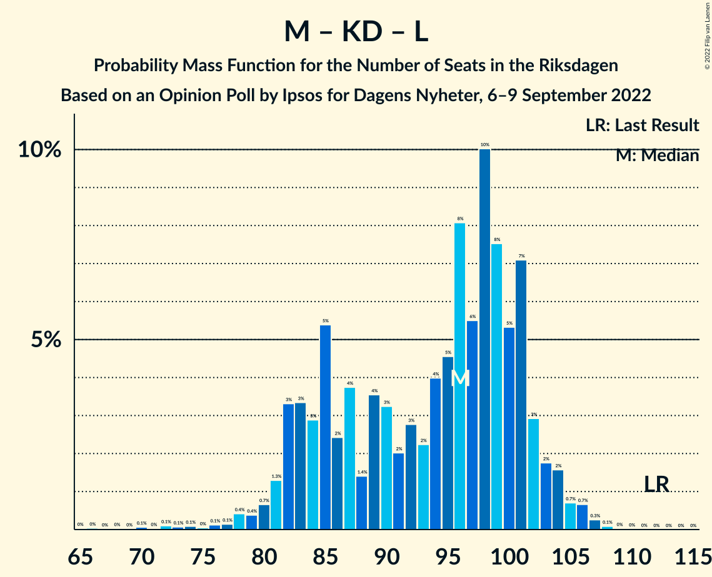

| Number of Seats | Probability | Accumulated | Special Marks |
|:---------------:|:-----------:|:-----------:|:-------------:|
| 66 | 0% | 100% |  |
| 67 | 0% | 99.9% |  |
| 68 | 0% | 99.9% |  |
| 69 | 0% | 99.9% |  |
| 70 | 0.1% | 99.9% |  |
| 71 | 0% | 99.8% |  |
| 72 | 0.1% | 99.8% |  |
| 73 | 0.1% | 99.7% |  |
| 74 | 0.1% | 99.6% |  |
| 75 | 0% | 99.5% |  |
| 76 | 0.1% | 99.5% |  |
| 77 | 0.1% | 99.3% |  |
| 78 | 0.4% | 99.2% |  |
| 79 | 0.4% | 98.8% |  |
| 80 | 0.7% | 98% |  |
| 81 | 1.3% | 98% |  |
| 82 | 3% | 96% |  |
| 83 | 3% | 93% |  |
| 84 | 3% | 90% |  |
| 85 | 5% | 87% |  |
| 86 | 2% | 82% |  |
| 87 | 4% | 79% |  |
| 88 | 1.4% | 75% |  |
| 89 | 4% | 74% |  |
| 90 | 3% | 70% |  |
| 91 | 2% | 67% |  |
| 92 | 3% | 65% |  |
| 93 | 2% | 62% |  |
| 94 | 4% | 60% |  |
| 95 | 5% | 56% |  |
| 96 | 8% | 52% |  |
| 97 | 6% | 43% | Median |
| 98 | 10% | 38% |  |
| 99 | 8% | 28% |  |
| 100 | 5% | 20% |  |
| 101 | 7% | 15% |  |
| 102 | 3% | 8% |  |
| 103 | 2% | 5% |  |
| 104 | 2% | 3% |  |
| 105 | 0.7% | 2% |  |
| 106 | 0.7% | 1.1% |  |
| 107 | 0.3% | 0.4% |  |
| 108 | 0.1% | 0.1% |  |
| 109 | 0% | 0% |  |
| 110 | 0% | 0% |  |
| 111 | 0% | 0% |  |
| 112 | 0% | 0% | Last Result |

### Moderata samlingspartiet – Centerpartiet

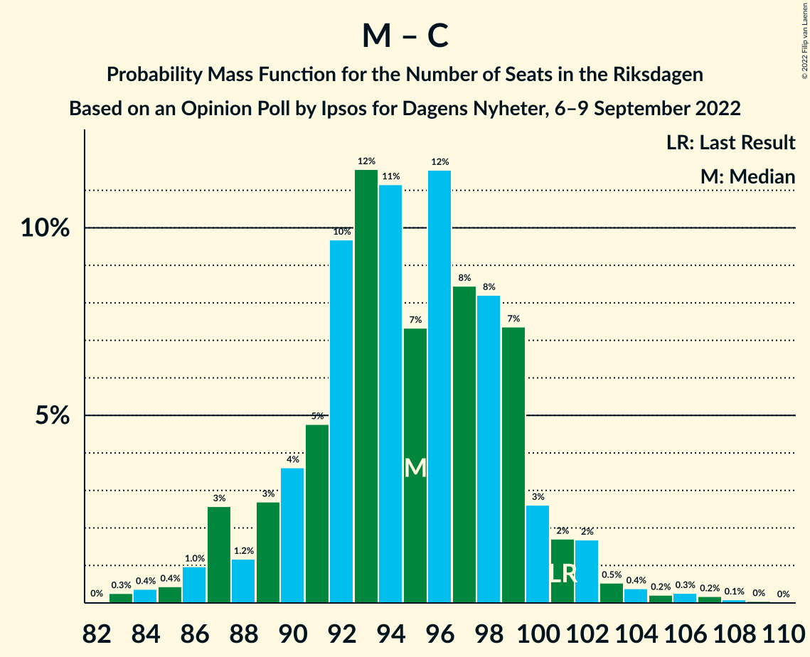

| Number of Seats | Probability | Accumulated | Special Marks |
|:---------------:|:-----------:|:-----------:|:-------------:|
| 82 | 0% | 100% |  |
| 83 | 0.3% | 99.9% |  |
| 84 | 0.4% | 99.7% |  |
| 85 | 0.4% | 99.3% |  |
| 86 | 1.0% | 98.9% |  |
| 87 | 3% | 98% |  |
| 88 | 1.2% | 95% |  |
| 89 | 3% | 94% |  |
| 90 | 4% | 91% |  |
| 91 | 5% | 88% |  |
| 92 | 10% | 83% |  |
| 93 | 12% | 73% |  |
| 94 | 11% | 62% | Median |
| 95 | 7% | 51% |  |
| 96 | 12% | 43% |  |
| 97 | 8% | 32% |  |
| 98 | 8% | 23% |  |
| 99 | 7% | 15% |  |
| 100 | 3% | 8% |  |
| 101 | 2% | 5% | Last Result |
| 102 | 2% | 3% |  |
| 103 | 0.5% | 2% |  |
| 104 | 0.4% | 1.2% |  |
| 105 | 0.2% | 0.8% |  |
| 106 | 0.3% | 0.6% |  |
| 107 | 0.2% | 0.3% |  |
| 108 | 0.1% | 0.2% |  |
| 109 | 0% | 0.1% |  |
| 110 | 0% | 0% |  |

### Moderata samlingspartiet – Kristdemokraterna

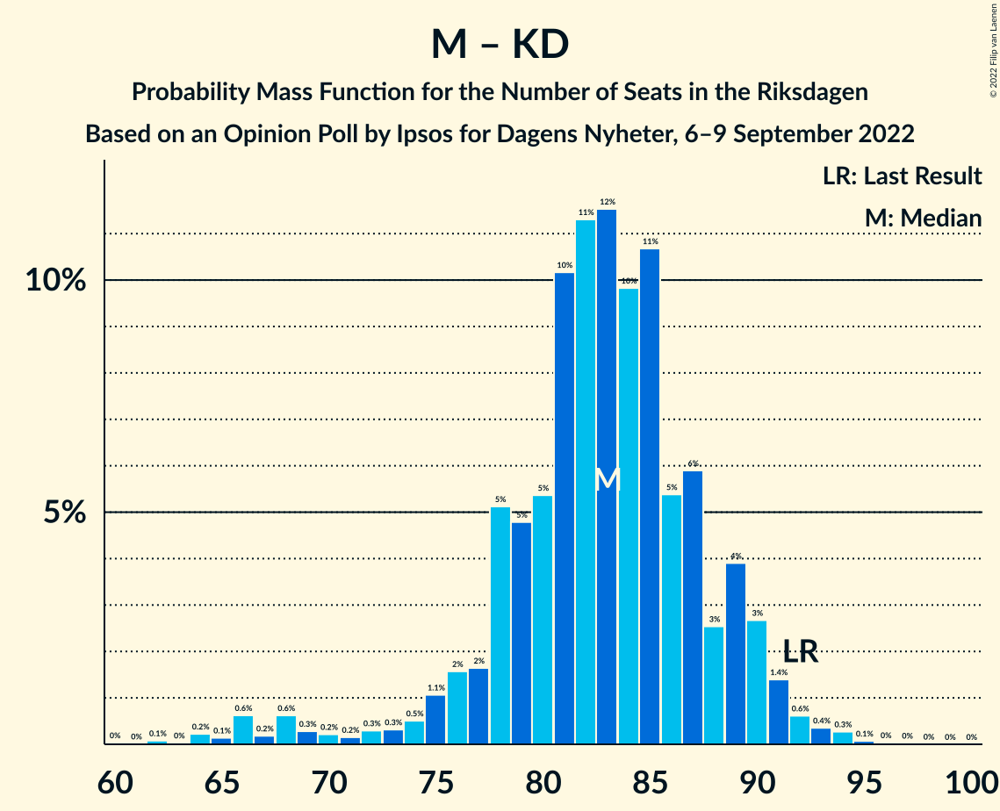

| Number of Seats | Probability | Accumulated | Special Marks |
|:---------------:|:-----------:|:-----------:|:-------------:|
| 61 | 0% | 100% |  |
| 62 | 0.1% | 99.9% |  |
| 63 | 0% | 99.9% |  |
| 64 | 0.2% | 99.8% |  |
| 65 | 0.1% | 99.6% |  |
| 66 | 0.6% | 99.5% |  |
| 67 | 0.2% | 98.8% |  |
| 68 | 0.6% | 98.7% |  |
| 69 | 0.3% | 98% |  |
| 70 | 0.2% | 98% |  |
| 71 | 0.2% | 98% |  |
| 72 | 0.3% | 97% |  |
| 73 | 0.3% | 97% |  |
| 74 | 0.5% | 97% |  |
| 75 | 1.1% | 96% |  |
| 76 | 2% | 95% |  |
| 77 | 2% | 94% |  |
| 78 | 5% | 92% |  |
| 79 | 5% | 87% |  |
| 80 | 5% | 82% |  |
| 81 | 10% | 77% |  |
| 82 | 11% | 67% | Median |
| 83 | 12% | 55% |  |
| 84 | 10% | 44% |  |
| 85 | 11% | 34% |  |
| 86 | 5% | 23% |  |
| 87 | 6% | 18% |  |
| 88 | 3% | 12% |  |
| 89 | 4% | 9% |  |
| 90 | 3% | 5% |  |
| 91 | 1.4% | 3% |  |
| 92 | 0.6% | 1.4% | Last Result |
| 93 | 0.4% | 0.8% |  |
| 94 | 0.3% | 0.4% |  |
| 95 | 0.1% | 0.1% |  |
| 96 | 0% | 0.1% |  |
| 97 | 0% | 0% |  |

## Technical Information

### Opinion Poll

+ **Polling firm:** Ipsos
+ **Commissioner(s):** Dagens Nyheter
+ **Fieldwork period:** 6–9 September 2022

### Calculations

+ **Sample size:** 1992
+ **Simulations done:** 1,048,576
+ **Error estimate:** 1.20%

