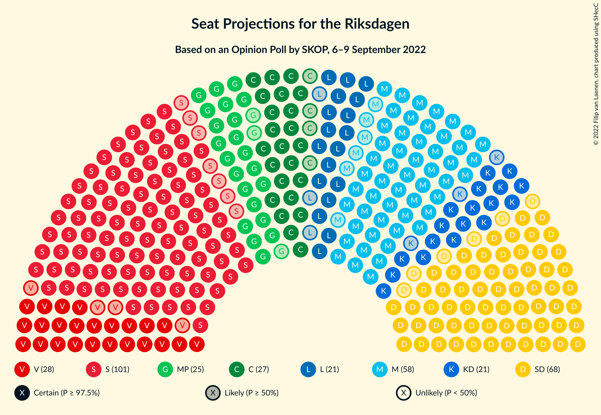

# Opinion Poll by SKOP, 6–9 September 2022

<a href="#voting-intentions">Voting Intentions</a> | <a href="#seats">Seats</a> | <a href="#coalitions">Coalitions</a> | <a href="#technical-information">Technical Information</a>

## Voting Intentions

### Confidence Intervals

| Party | Last Result | Poll Result | 80% Confidence Interval | 90% Confidence Interval | 95% Confidence Interval | 99% Confidence Interval |
|:-----:|:-----------:|:-----------:|:-----------------------:|:-----------------------:|:-----------------------:|:-----------------------:|
| Sveriges socialdemokratiska arbetareparti | 28.3% | 28.6% | 27.3–29.9% |26.9–30.3% |26.6–30.6% |26.0–31.3% |
| Sverigedemokraterna | 17.5% | 19.3% | 18.2–20.5% |17.8–20.8% |17.6–21.1% |17.0–21.7% |
| Moderata samlingspartiet | 19.8% | 16.3% | 15.2–17.4% |14.9–17.7% |14.7–18.0% |14.2–18.5% |
| Vänsterpartiet | 8.0% | 8.0% | 7.2–8.8% |7.0–9.1% |6.8–9.3% |6.5–9.7% |
| Centerpartiet | 8.6% | 7.6% | 6.9–8.4% |6.7–8.7% |6.5–8.9% |6.2–9.3% |
| Miljöpartiet de gröna | 4.4% | 7.4% | 6.7–8.2% |6.5–8.5% |6.3–8.7% |6.0–9.1% |
| Kristdemokraterna | 6.3% | 6.0% | 5.3–6.8% |5.2–7.0% |5.0–7.1% |4.7–7.5% |
| Liberalerna | 5.5% | 6.0% | 5.3–6.8% |5.2–7.0% |5.0–7.1% |4.7–7.5% |

*Note:* The poll result column reflects the actual value used in the calculations. Published results may vary slightly, and in addition be rounded to fewer digits.

## Seats

### Confidence Intervals

| Party | Last Result | Median | 80% Confidence Interval | 90% Confidence Interval | 95% Confidence Interval | 99% Confidence Interval |
|:-----:|:-----------:|:------:|:-----------------------:|:-----------------------:|:-----------------------:|:-----------------------:|
| <a href="#sveriges-socialdemokratiska-arbetareparti">Sveriges socialdemokratiska arbetareparti</a> | 100 | 101 | 96–105 |95–107 |94–108 |92–110 |
| <a href="#sverigedemokraterna">Sverigedemokraterna</a> | 62 | 68 | 64–72 |63–73 |62–74 |60–76 |
| <a href="#moderata-samlingspartiet">Moderata samlingspartiet</a> | 70 | 58 | 53–61 |52–62 |52–63 |50–65 |
| <a href="#vänsterpartiet">Vänsterpartiet</a> | 28 | 28 | 25–30 |25–31 |24–32 |23–34 |
| <a href="#centerpartiet">Centerpartiet</a> | 31 | 27 | 24–30 |24–30 |23–31 |22–33 |
| <a href="#miljöpartiet-de-gröna">Miljöpartiet de gröna</a> | 16 | 26 | 24–29 |23–29 |22–30 |21–32 |
| <a href="#kristdemokraterna">Kristdemokraterna</a> | 22 | 21 | 19–23 |18–24 |18–25 |17–26 |
| <a href="#liberalerna">Liberalerna</a> | 20 | 21 | 19–24 |18–24 |18–25 |17–26 |

### Sveriges socialdemokratiska arbetareparti

*For a full overview of the results for this party, see the [Sveriges socialdemokratiska arbetareparti](party-sverigessocialdemokratiskaarbetareparti.html) page.*

| Number of Seats | Probability | Accumulated | Special Marks |
|:---------------:|:-----------:|:-----------:|:-------------:|
| 89 | 0% | 100% |  |
| 90 | 0.1% | 99.9% |  |
| 91 | 0.3% | 99.8% |  |
| 92 | 0.6% | 99.5% |  |
| 93 | 0.9% | 98.9% |  |
| 94 | 2% | 98% |  |
| 95 | 3% | 96% |  |
| 96 | 4% | 93% |  |
| 97 | 6% | 89% |  |
| 98 | 8% | 83% |  |
| 99 | 11% | 75% |  |
| 100 | 10% | 64% | Last Result |
| 101 | 15% | 55% | Median |
| 102 | 10% | 40% |  |
| 103 | 10% | 30% |  |
| 104 | 7% | 20% |  |
| 105 | 5% | 13% |  |
| 106 | 3% | 8% |  |
| 107 | 3% | 5% |  |
| 108 | 1.4% | 3% |  |
| 109 | 0.6% | 1.3% |  |
| 110 | 0.3% | 0.7% |  |
| 111 | 0.3% | 0.4% |  |
| 112 | 0.1% | 0.1% |  |
| 113 | 0% | 0% |  |

### Sverigedemokraterna

*For a full overview of the results for this party, see the [Sverigedemokraterna](party-sverigedemokraterna.html) page.*

| Number of Seats | Probability | Accumulated | Special Marks |
|:---------------:|:-----------:|:-----------:|:-------------:|
| 58 | 0.1% | 100% |  |
| 59 | 0.1% | 99.9% |  |
| 60 | 0.5% | 99.8% |  |
| 61 | 1.1% | 99.3% |  |
| 62 | 3% | 98% | Last Result |
| 63 | 3% | 96% |  |
| 64 | 5% | 92% |  |
| 65 | 6% | 87% |  |
| 66 | 8% | 80% |  |
| 67 | 15% | 72% |  |
| 68 | 16% | 57% | Median |
| 69 | 11% | 41% |  |
| 70 | 13% | 30% |  |
| 71 | 6% | 17% |  |
| 72 | 4% | 11% |  |
| 73 | 4% | 7% |  |
| 74 | 2% | 4% |  |
| 75 | 0.9% | 2% |  |
| 76 | 0.6% | 1.1% |  |
| 77 | 0.3% | 0.4% |  |
| 78 | 0.1% | 0.2% |  |
| 79 | 0.1% | 0.1% |  |
| 80 | 0% | 0% |  |

### Moderata samlingspartiet

*For a full overview of the results for this party, see the [Moderata samlingspartiet](party-moderatasamlingspartiet.html) page.*

| Number of Seats | Probability | Accumulated | Special Marks |
|:---------------:|:-----------:|:-----------:|:-------------:|
| 48 | 0.1% | 100% |  |
| 49 | 0.2% | 99.9% |  |
| 50 | 0.5% | 99.7% |  |
| 51 | 1.1% | 99.1% |  |
| 52 | 5% | 98% |  |
| 53 | 4% | 93% |  |
| 54 | 7% | 89% |  |
| 55 | 7% | 82% |  |
| 56 | 13% | 76% |  |
| 57 | 11% | 63% |  |
| 58 | 14% | 51% | Median |
| 59 | 20% | 37% |  |
| 60 | 6% | 17% |  |
| 61 | 5% | 11% |  |
| 62 | 3% | 7% |  |
| 63 | 3% | 4% |  |
| 64 | 0.6% | 2% |  |
| 65 | 0.7% | 1.0% |  |
| 66 | 0.2% | 0.3% |  |
| 67 | 0% | 0.1% |  |
| 68 | 0% | 0% |  |
| 69 | 0% | 0% |  |
| 70 | 0% | 0% | Last Result |

### Vänsterpartiet

*For a full overview of the results for this party, see the [Vänsterpartiet](party-vänsterpartiet.html) page.*

| Number of Seats | Probability | Accumulated | Special Marks |
|:---------------:|:-----------:|:-----------:|:-------------:|
| 22 | 0.3% | 100% |  |
| 23 | 0.9% | 99.7% |  |
| 24 | 3% | 98.8% |  |
| 25 | 7% | 96% |  |
| 26 | 10% | 89% |  |
| 27 | 19% | 78% |  |
| 28 | 24% | 59% | Last Result, Median |
| 29 | 18% | 35% |  |
| 30 | 8% | 17% |  |
| 31 | 4% | 9% |  |
| 32 | 3% | 5% |  |
| 33 | 1.3% | 2% |  |
| 34 | 0.4% | 0.7% |  |
| 35 | 0.2% | 0.3% |  |
| 36 | 0.1% | 0.1% |  |
| 37 | 0% | 0% |  |

### Centerpartiet

*For a full overview of the results for this party, see the [Centerpartiet](party-centerpartiet.html) page.*

| Number of Seats | Probability | Accumulated | Special Marks |
|:---------------:|:-----------:|:-----------:|:-------------:|
| 20 | 0.1% | 100% |  |
| 21 | 0.3% | 99.9% |  |
| 22 | 0.8% | 99.6% |  |
| 23 | 3% | 98.8% |  |
| 24 | 9% | 96% |  |
| 25 | 8% | 87% |  |
| 26 | 16% | 78% |  |
| 27 | 27% | 62% | Median |
| 28 | 9% | 36% |  |
| 29 | 15% | 27% |  |
| 30 | 7% | 12% |  |
| 31 | 2% | 4% | Last Result |
| 32 | 1.1% | 2% |  |
| 33 | 0.5% | 0.7% |  |
| 34 | 0.1% | 0.2% |  |
| 35 | 0% | 0% |  |

### Miljöpartiet de gröna

*For a full overview of the results for this party, see the [Miljöpartiet de gröna](party-miljöpartietdegröna.html) page.*

| Number of Seats | Probability | Accumulated | Special Marks |
|:---------------:|:-----------:|:-----------:|:-------------:|
| 16 | 0% | 100% | Last Result |
| 17 | 0% | 100% |  |
| 18 | 0% | 100% |  |
| 19 | 0% | 100% |  |
| 20 | 0.1% | 100% |  |
| 21 | 1.0% | 99.9% |  |
| 22 | 2% | 98.9% |  |
| 23 | 4% | 97% |  |
| 24 | 16% | 93% |  |
| 25 | 26% | 77% |  |
| 26 | 10% | 50% | Median |
| 27 | 9% | 40% |  |
| 28 | 19% | 31% |  |
| 29 | 8% | 12% |  |
| 30 | 2% | 4% |  |
| 31 | 0.7% | 2% |  |
| 32 | 1.0% | 1.2% |  |
| 33 | 0.2% | 0.2% |  |
| 34 | 0% | 0% |  |

### Kristdemokraterna

*For a full overview of the results for this party, see the [Kristdemokraterna](party-kristdemokraterna.html) page.*

| Number of Seats | Probability | Accumulated | Special Marks |
|:---------------:|:-----------:|:-----------:|:-------------:|
| 16 | 0.3% | 100% |  |
| 17 | 2% | 99.7% |  |
| 18 | 6% | 98% |  |
| 19 | 14% | 92% |  |
| 20 | 20% | 77% |  |
| 21 | 22% | 57% | Median |
| 22 | 16% | 36% | Last Result |
| 23 | 11% | 20% |  |
| 24 | 6% | 9% |  |
| 25 | 2% | 3% |  |
| 26 | 0.8% | 1.1% |  |
| 27 | 0.2% | 0.3% |  |
| 28 | 0.1% | 0.1% |  |
| 29 | 0% | 0% |  |

### Liberalerna

*For a full overview of the results for this party, see the [Liberalerna](party-liberalerna.html) page.*

| Number of Seats | Probability | Accumulated | Special Marks |
|:---------------:|:-----------:|:-----------:|:-------------:|
| 16 | 0.4% | 100% |  |
| 17 | 2% | 99.5% |  |
| 18 | 6% | 98% |  |
| 19 | 12% | 92% |  |
| 20 | 19% | 80% | Last Result |
| 21 | 24% | 61% | Median |
| 22 | 13% | 37% |  |
| 23 | 14% | 24% |  |
| 24 | 6% | 10% |  |
| 25 | 3% | 5% |  |
| 26 | 0.8% | 1.2% |  |
| 27 | 0.3% | 0.4% |  |
| 28 | 0.1% | 0.1% |  |
| 29 | 0% | 0% |  |

## Coalitions

### Confidence Intervals

| Coalition | Last Result | Median | Majority? | 80% Confidence Interval | 90% Confidence Interval | 95% Confidence Interval | 99% Confidence Interval |
|:---------:|:-----------:|:------:|:---------:|:-----------------------:|:-----------------------:|:-----------------------:|:-----------------------:|
| Sveriges socialdemokratiska arbetareparti – Vänsterpartiet – Centerpartiet – Miljöpartiet de gröna – Liberalerna | 195 | 202 | 100% | 198–208 | 196–209 | 195–210 | 193–213 |
| Sveriges socialdemokratiska arbetareparti – Moderata samlingspartiet – Centerpartiet | 201 | 185 | 99.5% | 180–190 | 179–192 | 177–192 | 175–195 |
| Sveriges socialdemokratiska arbetareparti – Vänsterpartiet – Centerpartiet – Miljöpartiet de gröna | 175 | 182 | 96% | 176–186 | 175–188 | 174–189 | 171–192 |
| Sveriges socialdemokratiska arbetareparti – Centerpartiet – Miljöpartiet de gröna – Liberalerna | 167 | 174 | 50% | 170–180 | 168–181 | 167–182 | 165–185 |
| Sverigedemokraterna – Moderata samlingspartiet – Kristdemokraterna – Liberalerna | 174 | 167 | 4% | 163–173 | 161–174 | 160–175 | 157–178 |
| Sveriges socialdemokratiska arbetareparti – Moderata samlingspartiet | 170 | 158 | 0% | 153–163 | 152–164 | 150–166 | 148–169 |
| Sveriges socialdemokratiska arbetareparti – Vänsterpartiet – Miljöpartiet de gröna | 144 | 155 | 0% | 150–160 | 148–161 | 147–162 | 145–165 |
| Sveriges socialdemokratiska arbetareparti – Centerpartiet – Miljöpartiet de gröna | 147 | 154 | 0% | 149–159 | 147–160 | 146–161 | 143–164 |
| Sverigedemokraterna – Moderata samlingspartiet – Kristdemokraterna | 154 | 147 | 0% | 141–151 | 140–153 | 139–154 | 136–156 |
| Sveriges socialdemokratiska arbetareparti – Vänsterpartiet | 128 | 129 | 0% | 124–133 | 122–135 | 121–136 | 119–138 |
| Sveriges socialdemokratiska arbetareparti – Miljöpartiet de gröna | 116 | 127 | 0% | 122–132 | 121–133 | 119–135 | 117–137 |
| Moderata samlingspartiet – Centerpartiet – Kristdemokraterna – Liberalerna | 143 | 126 | 0% | 122–131 | 120–133 | 119–134 | 117–136 |
| Sverigedemokraterna – Moderata samlingspartiet | 132 | 125 | 0% | 120–130 | 119–131 | 118–133 | 116–135 |
| Moderata samlingspartiet – Centerpartiet – Liberalerna | 121 | 105 | 0% | 101–110 | 99–111 | 98–113 | 96–115 |
| Moderata samlingspartiet – Centerpartiet – Kristdemokraterna | 123 | 105 | 0% | 101–110 | 99–111 | 98–112 | 96–115 |
| Sveriges socialdemokratiska arbetareparti | 100 | 101 | 0% | 96–105 | 95–107 | 94–108 | 92–110 |
| Moderata samlingspartiet – Kristdemokraterna – Liberalerna | 112 | 99 | 0% | 95–104 | 94–105 | 93–107 | 90–109 |
| Moderata samlingspartiet – Centerpartiet | 101 | 85 | 0% | 80–89 | 78–90 | 77–91 | 76–93 |
| Moderata samlingspartiet – Kristdemokraterna | 92 | 78 | 0% | 73–82 | 73–84 | 72–85 | 70–87 |

### Sveriges socialdemokratiska arbetareparti – Vänsterpartiet – Centerpartiet – Miljöpartiet de gröna – Liberalerna

| Number of Seats | Probability | Accumulated | Special Marks |
|:---------------:|:-----------:|:-----------:|:-------------:|
| 189 | 0% | 100% |  |
| 190 | 0% | 99.9% |  |
| 191 | 0% | 99.9% |  |
| 192 | 0.3% | 99.9% |  |
| 193 | 0.5% | 99.6% |  |
| 194 | 1.3% | 99.1% |  |
| 195 | 3% | 98% | Last Result |
| 196 | 1.4% | 95% |  |
| 197 | 2% | 94% |  |
| 198 | 4% | 92% |  |
| 199 | 5% | 88% |  |
| 200 | 6% | 84% |  |
| 201 | 6% | 77% |  |
| 202 | 23% | 71% |  |
| 203 | 13% | 48% | Median |
| 204 | 4% | 34% |  |
| 205 | 4% | 31% |  |
| 206 | 8% | 27% |  |
| 207 | 7% | 19% |  |
| 208 | 6% | 11% |  |
| 209 | 2% | 6% |  |
| 210 | 2% | 3% |  |
| 211 | 0.7% | 2% |  |
| 212 | 0.5% | 1.0% |  |
| 213 | 0.2% | 0.6% |  |
| 214 | 0.1% | 0.3% |  |
| 215 | 0.1% | 0.2% |  |
| 216 | 0.1% | 0.1% |  |
| 217 | 0% | 0% |  |

### Sveriges socialdemokratiska arbetareparti – Moderata samlingspartiet – Centerpartiet

| Number of Seats | Probability | Accumulated | Special Marks |
|:---------------:|:-----------:|:-----------:|:-------------:|
| 171 | 0% | 100% |  |
| 172 | 0.1% | 99.9% |  |
| 173 | 0% | 99.8% |  |
| 174 | 0.3% | 99.8% |  |
| 175 | 0.2% | 99.5% | Majority |
| 176 | 2% | 99.3% |  |
| 177 | 1.4% | 98% |  |
| 178 | 1.1% | 96% |  |
| 179 | 4% | 95% |  |
| 180 | 2% | 91% |  |
| 181 | 4% | 89% |  |
| 182 | 9% | 85% |  |
| 183 | 4% | 75% |  |
| 184 | 14% | 72% |  |
| 185 | 10% | 58% |  |
| 186 | 9% | 48% | Median |
| 187 | 21% | 39% |  |
| 188 | 4% | 17% |  |
| 189 | 3% | 13% |  |
| 190 | 1.5% | 11% |  |
| 191 | 2% | 9% |  |
| 192 | 5% | 8% |  |
| 193 | 0.9% | 2% |  |
| 194 | 0.8% | 1.4% |  |
| 195 | 0.4% | 0.6% |  |
| 196 | 0.1% | 0.2% |  |
| 197 | 0.1% | 0.1% |  |
| 198 | 0% | 0% |  |
| 199 | 0% | 0% |  |
| 200 | 0% | 0% |  |
| 201 | 0% | 0% | Last Result |

### Sveriges socialdemokratiska arbetareparti – Vänsterpartiet – Centerpartiet – Miljöpartiet de gröna

| Number of Seats | Probability | Accumulated | Special Marks |
|:---------------:|:-----------:|:-----------:|:-------------:|
| 168 | 0% | 100% |  |
| 169 | 0.1% | 99.9% |  |
| 170 | 0.3% | 99.9% |  |
| 171 | 0.3% | 99.6% |  |
| 172 | 0.6% | 99.3% |  |
| 173 | 1.0% | 98.7% |  |
| 174 | 1.5% | 98% |  |
| 175 | 4% | 96% | Last Result, Majority |
| 176 | 4% | 92% |  |
| 177 | 3% | 88% |  |
| 178 | 5% | 85% |  |
| 179 | 5% | 80% |  |
| 180 | 5% | 75% |  |
| 181 | 15% | 70% |  |
| 182 | 10% | 55% | Median |
| 183 | 16% | 45% |  |
| 184 | 10% | 30% |  |
| 185 | 7% | 20% |  |
| 186 | 4% | 14% |  |
| 187 | 3% | 10% |  |
| 188 | 3% | 7% |  |
| 189 | 2% | 4% |  |
| 190 | 0.8% | 2% |  |
| 191 | 0.6% | 1.4% |  |
| 192 | 0.4% | 0.8% |  |
| 193 | 0.2% | 0.4% |  |
| 194 | 0.1% | 0.2% |  |
| 195 | 0% | 0.1% |  |
| 196 | 0% | 0% |  |

### Sveriges socialdemokratiska arbetareparti – Centerpartiet – Miljöpartiet de gröna – Liberalerna

| Number of Seats | Probability | Accumulated | Special Marks |
|:---------------:|:-----------:|:-----------:|:-------------:|
| 162 | 0% | 100% |  |
| 163 | 0.1% | 99.9% |  |
| 164 | 0.2% | 99.8% |  |
| 165 | 0.4% | 99.6% |  |
| 166 | 1.1% | 99.2% |  |
| 167 | 1.2% | 98% | Last Result |
| 168 | 2% | 97% |  |
| 169 | 3% | 95% |  |
| 170 | 4% | 92% |  |
| 171 | 5% | 89% |  |
| 172 | 6% | 84% |  |
| 173 | 14% | 78% |  |
| 174 | 14% | 64% |  |
| 175 | 12% | 50% | Median, Majority |
| 176 | 7% | 38% |  |
| 177 | 5% | 31% |  |
| 178 | 5% | 26% |  |
| 179 | 9% | 21% |  |
| 180 | 4% | 12% |  |
| 181 | 5% | 9% |  |
| 182 | 2% | 4% |  |
| 183 | 0.9% | 2% |  |
| 184 | 0.5% | 1.1% |  |
| 185 | 0.2% | 0.7% |  |
| 186 | 0.3% | 0.5% |  |
| 187 | 0.1% | 0.1% |  |
| 188 | 0% | 0.1% |  |
| 189 | 0% | 0% |  |

### Sverigedemokraterna – Moderata samlingspartiet – Kristdemokraterna – Liberalerna

| Number of Seats | Probability | Accumulated | Special Marks |
|:---------------:|:-----------:|:-----------:|:-------------:|
| 154 | 0% | 100% |  |
| 155 | 0.1% | 99.9% |  |
| 156 | 0.2% | 99.8% |  |
| 157 | 0.4% | 99.6% |  |
| 158 | 0.6% | 99.2% |  |
| 159 | 0.8% | 98.6% |  |
| 160 | 2% | 98% |  |
| 161 | 3% | 96% |  |
| 162 | 3% | 93% |  |
| 163 | 4% | 90% |  |
| 164 | 7% | 86% |  |
| 165 | 10% | 80% |  |
| 166 | 16% | 70% |  |
| 167 | 10% | 55% |  |
| 168 | 15% | 45% | Median |
| 169 | 5% | 30% |  |
| 170 | 5% | 25% |  |
| 171 | 5% | 20% |  |
| 172 | 3% | 15% |  |
| 173 | 4% | 12% |  |
| 174 | 4% | 8% | Last Result |
| 175 | 1.5% | 4% | Majority |
| 176 | 1.0% | 2% |  |
| 177 | 0.6% | 1.3% |  |
| 178 | 0.3% | 0.7% |  |
| 179 | 0.3% | 0.4% |  |
| 180 | 0.1% | 0.1% |  |
| 181 | 0% | 0.1% |  |
| 182 | 0% | 0% |  |

### Sveriges socialdemokratiska arbetareparti – Moderata samlingspartiet

| Number of Seats | Probability | Accumulated | Special Marks |
|:---------------:|:-----------:|:-----------:|:-------------:|
| 145 | 0.1% | 100% |  |
| 146 | 0.1% | 99.9% |  |
| 147 | 0.2% | 99.8% |  |
| 148 | 0.4% | 99.6% |  |
| 149 | 0.8% | 99.2% |  |
| 150 | 1.1% | 98% |  |
| 151 | 2% | 97% |  |
| 152 | 3% | 95% |  |
| 153 | 4% | 92% |  |
| 154 | 6% | 89% |  |
| 155 | 9% | 82% |  |
| 156 | 6% | 73% |  |
| 157 | 8% | 67% |  |
| 158 | 13% | 60% |  |
| 159 | 9% | 46% | Median |
| 160 | 14% | 37% |  |
| 161 | 7% | 23% |  |
| 162 | 6% | 17% |  |
| 163 | 4% | 11% |  |
| 164 | 2% | 7% |  |
| 165 | 2% | 5% |  |
| 166 | 1.1% | 3% |  |
| 167 | 0.5% | 1.4% |  |
| 168 | 0.4% | 0.9% |  |
| 169 | 0.3% | 0.5% |  |
| 170 | 0.1% | 0.2% | Last Result |
| 171 | 0% | 0.1% |  |
| 172 | 0% | 0% |  |

### Sveriges socialdemokratiska arbetareparti – Vänsterpartiet – Miljöpartiet de gröna

| Number of Seats | Probability | Accumulated | Special Marks |
|:---------------:|:-----------:|:-----------:|:-------------:|
| 142 | 0.1% | 100% |  |
| 143 | 0.1% | 99.9% |  |
| 144 | 0.2% | 99.7% | Last Result |
| 145 | 0.7% | 99.5% |  |
| 146 | 0.6% | 98.8% |  |
| 147 | 2% | 98% |  |
| 148 | 3% | 96% |  |
| 149 | 4% | 94% |  |
| 150 | 6% | 90% |  |
| 151 | 4% | 84% |  |
| 152 | 9% | 81% |  |
| 153 | 5% | 72% |  |
| 154 | 16% | 67% |  |
| 155 | 9% | 50% | Median |
| 156 | 9% | 41% |  |
| 157 | 12% | 33% |  |
| 158 | 4% | 21% |  |
| 159 | 7% | 17% |  |
| 160 | 3% | 10% |  |
| 161 | 3% | 7% |  |
| 162 | 2% | 4% |  |
| 163 | 1.2% | 2% |  |
| 164 | 0.4% | 1.2% |  |
| 165 | 0.5% | 0.8% |  |
| 166 | 0.2% | 0.3% |  |
| 167 | 0.1% | 0.1% |  |
| 168 | 0% | 0.1% |  |
| 169 | 0% | 0% |  |

### Sveriges socialdemokratiska arbetareparti – Centerpartiet – Miljöpartiet de gröna

| Number of Seats | Probability | Accumulated | Special Marks |
|:---------------:|:-----------:|:-----------:|:-------------:|
| 141 | 0.1% | 100% |  |
| 142 | 0.1% | 99.9% |  |
| 143 | 0.3% | 99.8% |  |
| 144 | 0.4% | 99.5% |  |
| 145 | 1.0% | 99.1% |  |
| 146 | 1.3% | 98% |  |
| 147 | 2% | 97% | Last Result |
| 148 | 3% | 95% |  |
| 149 | 4% | 92% |  |
| 150 | 7% | 88% |  |
| 151 | 5% | 81% |  |
| 152 | 10% | 76% |  |
| 153 | 14% | 66% |  |
| 154 | 10% | 52% | Median |
| 155 | 10% | 43% |  |
| 156 | 10% | 32% |  |
| 157 | 5% | 22% |  |
| 158 | 6% | 17% |  |
| 159 | 3% | 11% |  |
| 160 | 3% | 7% |  |
| 161 | 2% | 4% |  |
| 162 | 1.1% | 2% |  |
| 163 | 0.2% | 1.1% |  |
| 164 | 0.5% | 0.8% |  |
| 165 | 0.2% | 0.3% |  |
| 166 | 0.1% | 0.1% |  |
| 167 | 0% | 0% |  |

### Sverigedemokraterna – Moderata samlingspartiet – Kristdemokraterna

| Number of Seats | Probability | Accumulated | Special Marks |
|:---------------:|:-----------:|:-----------:|:-------------:|
| 133 | 0.1% | 100% |  |
| 134 | 0.1% | 99.9% |  |
| 135 | 0.1% | 99.8% |  |
| 136 | 0.2% | 99.7% |  |
| 137 | 0.5% | 99.4% |  |
| 138 | 0.7% | 99.0% |  |
| 139 | 2% | 98% |  |
| 140 | 2% | 97% |  |
| 141 | 6% | 94% |  |
| 142 | 7% | 89% |  |
| 143 | 8% | 81% |  |
| 144 | 4% | 73% |  |
| 145 | 4% | 69% |  |
| 146 | 13% | 66% |  |
| 147 | 23% | 52% | Median |
| 148 | 6% | 29% |  |
| 149 | 6% | 23% |  |
| 150 | 5% | 16% |  |
| 151 | 4% | 12% |  |
| 152 | 2% | 8% |  |
| 153 | 1.4% | 6% |  |
| 154 | 3% | 5% | Last Result |
| 155 | 1.3% | 2% |  |
| 156 | 0.5% | 0.9% |  |
| 157 | 0.3% | 0.4% |  |
| 158 | 0% | 0.1% |  |
| 159 | 0% | 0.1% |  |
| 160 | 0% | 0.1% |  |
| 161 | 0% | 0% |  |

### Sveriges socialdemokratiska arbetareparti – Vänsterpartiet

| Number of Seats | Probability | Accumulated | Special Marks |
|:---------------:|:-----------:|:-----------:|:-------------:|
| 116 | 0% | 100% |  |
| 117 | 0.1% | 99.9% |  |
| 118 | 0.3% | 99.8% |  |
| 119 | 0.5% | 99.5% |  |
| 120 | 0.9% | 99.0% |  |
| 121 | 2% | 98% |  |
| 122 | 3% | 97% |  |
| 123 | 3% | 94% |  |
| 124 | 6% | 91% |  |
| 125 | 5% | 85% |  |
| 126 | 9% | 80% |  |
| 127 | 10% | 71% |  |
| 128 | 9% | 61% | Last Result |
| 129 | 10% | 53% | Median |
| 130 | 11% | 43% |  |
| 131 | 11% | 33% |  |
| 132 | 8% | 22% |  |
| 133 | 5% | 14% |  |
| 134 | 3% | 9% |  |
| 135 | 3% | 6% |  |
| 136 | 1.4% | 3% |  |
| 137 | 0.9% | 2% |  |
| 138 | 0.5% | 0.9% |  |
| 139 | 0.2% | 0.4% |  |
| 140 | 0.1% | 0.2% |  |
| 141 | 0.1% | 0.1% |  |
| 142 | 0% | 0.1% |  |
| 143 | 0% | 0% |  |

### Sveriges socialdemokratiska arbetareparti – Miljöpartiet de gröna

| Number of Seats | Probability | Accumulated | Special Marks |
|:---------------:|:-----------:|:-----------:|:-------------:|
| 114 | 0% | 100% |  |
| 115 | 0.1% | 99.9% |  |
| 116 | 0.2% | 99.9% | Last Result |
| 117 | 0.4% | 99.7% |  |
| 118 | 0.5% | 99.3% |  |
| 119 | 2% | 98.8% |  |
| 120 | 2% | 97% |  |
| 121 | 3% | 95% |  |
| 122 | 5% | 93% |  |
| 123 | 5% | 88% |  |
| 124 | 9% | 83% |  |
| 125 | 12% | 74% |  |
| 126 | 10% | 62% |  |
| 127 | 10% | 52% | Median |
| 128 | 8% | 41% |  |
| 129 | 12% | 33% |  |
| 130 | 5% | 21% |  |
| 131 | 5% | 16% |  |
| 132 | 5% | 11% |  |
| 133 | 3% | 7% |  |
| 134 | 1.2% | 4% |  |
| 135 | 2% | 3% |  |
| 136 | 0.4% | 1.0% |  |
| 137 | 0.3% | 0.6% |  |
| 138 | 0.2% | 0.3% |  |
| 139 | 0.1% | 0.1% |  |
| 140 | 0% | 0% |  |

### Moderata samlingspartiet – Centerpartiet – Kristdemokraterna – Liberalerna

| Number of Seats | Probability | Accumulated | Special Marks |
|:---------------:|:-----------:|:-----------:|:-------------:|
| 114 | 0.1% | 100% |  |
| 115 | 0.1% | 99.8% |  |
| 116 | 0.1% | 99.7% |  |
| 117 | 0.3% | 99.6% |  |
| 118 | 1.2% | 99.3% |  |
| 119 | 2% | 98% |  |
| 120 | 2% | 96% |  |
| 121 | 3% | 93% |  |
| 122 | 5% | 91% |  |
| 123 | 6% | 85% |  |
| 124 | 12% | 79% |  |
| 125 | 11% | 68% |  |
| 126 | 7% | 57% |  |
| 127 | 10% | 49% | Median |
| 128 | 11% | 40% |  |
| 129 | 11% | 28% |  |
| 130 | 3% | 17% |  |
| 131 | 6% | 14% |  |
| 132 | 2% | 8% |  |
| 133 | 2% | 6% |  |
| 134 | 2% | 4% |  |
| 135 | 1.2% | 2% |  |
| 136 | 0.3% | 0.6% |  |
| 137 | 0.2% | 0.4% |  |
| 138 | 0.1% | 0.2% |  |
| 139 | 0.1% | 0.1% |  |
| 140 | 0% | 0% |  |
| 141 | 0% | 0% |  |
| 142 | 0% | 0% |  |
| 143 | 0% | 0% | Last Result |

### Sverigedemokraterna – Moderata samlingspartiet

| Number of Seats | Probability | Accumulated | Special Marks |
|:---------------:|:-----------:|:-----------:|:-------------:|
| 113 | 0.1% | 100% |  |
| 114 | 0.1% | 99.9% |  |
| 115 | 0.2% | 99.8% |  |
| 116 | 0.5% | 99.6% |  |
| 117 | 1.1% | 99.0% |  |
| 118 | 1.3% | 98% |  |
| 119 | 2% | 97% |  |
| 120 | 5% | 95% |  |
| 121 | 4% | 90% |  |
| 122 | 8% | 85% |  |
| 123 | 9% | 77% |  |
| 124 | 11% | 68% |  |
| 125 | 7% | 57% |  |
| 126 | 11% | 49% | Median |
| 127 | 12% | 38% |  |
| 128 | 9% | 26% |  |
| 129 | 4% | 17% |  |
| 130 | 5% | 13% |  |
| 131 | 3% | 8% |  |
| 132 | 2% | 5% | Last Result |
| 133 | 1.4% | 3% |  |
| 134 | 0.5% | 2% |  |
| 135 | 0.7% | 1.1% |  |
| 136 | 0.3% | 0.5% |  |
| 137 | 0.1% | 0.2% |  |
| 138 | 0% | 0.1% |  |
| 139 | 0% | 0% |  |

### Moderata samlingspartiet – Centerpartiet – Liberalerna

| Number of Seats | Probability | Accumulated | Special Marks |
|:---------------:|:-----------:|:-----------:|:-------------:|
| 93 | 0% | 100% |  |
| 94 | 0.1% | 99.9% |  |
| 95 | 0.2% | 99.9% |  |
| 96 | 0.2% | 99.7% |  |
| 97 | 0.9% | 99.4% |  |
| 98 | 2% | 98.5% |  |
| 99 | 2% | 97% |  |
| 100 | 4% | 95% |  |
| 101 | 4% | 91% |  |
| 102 | 7% | 86% |  |
| 103 | 9% | 79% |  |
| 104 | 10% | 71% |  |
| 105 | 12% | 60% |  |
| 106 | 8% | 48% | Median |
| 107 | 13% | 40% |  |
| 108 | 7% | 27% |  |
| 109 | 8% | 20% |  |
| 110 | 4% | 12% |  |
| 111 | 4% | 8% |  |
| 112 | 1.4% | 4% |  |
| 113 | 1.4% | 3% |  |
| 114 | 0.8% | 1.3% |  |
| 115 | 0.3% | 0.6% |  |
| 116 | 0.1% | 0.3% |  |
| 117 | 0.1% | 0.1% |  |
| 118 | 0% | 0.1% |  |
| 119 | 0% | 0% |  |
| 120 | 0% | 0% |  |
| 121 | 0% | 0% | Last Result |

### Moderata samlingspartiet – Centerpartiet – Kristdemokraterna

| Number of Seats | Probability | Accumulated | Special Marks |
|:---------------:|:-----------:|:-----------:|:-------------:|
| 94 | 0.2% | 100% |  |
| 95 | 0.2% | 99.8% |  |
| 96 | 0.1% | 99.6% |  |
| 97 | 1.1% | 99.5% |  |
| 98 | 3% | 98% |  |
| 99 | 1.2% | 95% |  |
| 100 | 3% | 94% |  |
| 101 | 7% | 91% |  |
| 102 | 6% | 84% |  |
| 103 | 3% | 77% |  |
| 104 | 15% | 74% |  |
| 105 | 14% | 59% |  |
| 106 | 3% | 45% | Median |
| 107 | 15% | 42% |  |
| 108 | 13% | 27% |  |
| 109 | 4% | 14% |  |
| 110 | 2% | 10% |  |
| 111 | 4% | 8% |  |
| 112 | 3% | 4% |  |
| 113 | 0.4% | 2% |  |
| 114 | 0.7% | 1.2% |  |
| 115 | 0.4% | 0.5% |  |
| 116 | 0.1% | 0.2% |  |
| 117 | 0% | 0.1% |  |
| 118 | 0.1% | 0.1% |  |
| 119 | 0% | 0% |  |
| 120 | 0% | 0% |  |
| 121 | 0% | 0% |  |
| 122 | 0% | 0% |  |
| 123 | 0% | 0% | Last Result |

### Sveriges socialdemokratiska arbetareparti

| Number of Seats | Probability | Accumulated | Special Marks |
|:---------------:|:-----------:|:-----------:|:-------------:|
| 89 | 0% | 100% |  |
| 90 | 0.1% | 99.9% |  |
| 91 | 0.3% | 99.8% |  |
| 92 | 0.6% | 99.5% |  |
| 93 | 0.9% | 98.9% |  |
| 94 | 2% | 98% |  |
| 95 | 3% | 96% |  |
| 96 | 4% | 93% |  |
| 97 | 6% | 89% |  |
| 98 | 8% | 83% |  |
| 99 | 11% | 75% |  |
| 100 | 10% | 64% | Last Result |
| 101 | 15% | 55% | Median |
| 102 | 10% | 40% |  |
| 103 | 10% | 30% |  |
| 104 | 7% | 20% |  |
| 105 | 5% | 13% |  |
| 106 | 3% | 8% |  |
| 107 | 3% | 5% |  |
| 108 | 1.4% | 3% |  |
| 109 | 0.6% | 1.3% |  |
| 110 | 0.3% | 0.7% |  |
| 111 | 0.3% | 0.4% |  |
| 112 | 0.1% | 0.1% |  |
| 113 | 0% | 0% |  |

### Moderata samlingspartiet – Kristdemokraterna – Liberalerna

| Number of Seats | Probability | Accumulated | Special Marks |
|:---------------:|:-----------:|:-----------:|:-------------:|
| 88 | 0.1% | 100% |  |
| 89 | 0.1% | 99.9% |  |
| 90 | 0.3% | 99.7% |  |
| 91 | 0.8% | 99.5% |  |
| 92 | 0.8% | 98.6% |  |
| 93 | 3% | 98% |  |
| 94 | 4% | 95% |  |
| 95 | 5% | 91% |  |
| 96 | 8% | 87% |  |
| 97 | 11% | 79% |  |
| 98 | 11% | 68% |  |
| 99 | 8% | 58% |  |
| 100 | 11% | 49% | Median |
| 101 | 14% | 38% |  |
| 102 | 6% | 24% |  |
| 103 | 5% | 17% |  |
| 104 | 3% | 12% |  |
| 105 | 4% | 8% |  |
| 106 | 2% | 4% |  |
| 107 | 1.3% | 3% |  |
| 108 | 0.6% | 1.2% |  |
| 109 | 0.3% | 0.6% |  |
| 110 | 0.2% | 0.3% |  |
| 111 | 0.1% | 0.2% |  |
| 112 | 0% | 0% | Last Result |

### Moderata samlingspartiet – Centerpartiet

| Number of Seats | Probability | Accumulated | Special Marks |
|:---------------:|:-----------:|:-----------:|:-------------:|
| 73 | 0% | 100% |  |
| 74 | 0.1% | 99.9% |  |
| 75 | 0.2% | 99.8% |  |
| 76 | 0.9% | 99.6% |  |
| 77 | 2% | 98.7% |  |
| 78 | 2% | 97% |  |
| 79 | 4% | 94% |  |
| 80 | 4% | 90% |  |
| 81 | 7% | 86% |  |
| 82 | 8% | 79% |  |
| 83 | 11% | 72% |  |
| 84 | 9% | 61% |  |
| 85 | 14% | 52% | Median |
| 86 | 11% | 37% |  |
| 87 | 7% | 26% |  |
| 88 | 9% | 19% |  |
| 89 | 5% | 10% |  |
| 90 | 2% | 5% |  |
| 91 | 2% | 3% |  |
| 92 | 0.7% | 1.4% |  |
| 93 | 0.3% | 0.7% |  |
| 94 | 0.2% | 0.4% |  |
| 95 | 0.1% | 0.2% |  |
| 96 | 0% | 0.1% |  |
| 97 | 0% | 0% |  |
| 98 | 0% | 0% |  |
| 99 | 0% | 0% |  |
| 100 | 0% | 0% |  |
| 101 | 0% | 0% | Last Result |

### Moderata samlingspartiet – Kristdemokraterna

| Number of Seats | Probability | Accumulated | Special Marks |
|:---------------:|:-----------:|:-----------:|:-------------:|
| 68 | 0.1% | 100% |  |
| 69 | 0.2% | 99.9% |  |
| 70 | 0.4% | 99.7% |  |
| 71 | 1.1% | 99.3% |  |
| 72 | 2% | 98% |  |
| 73 | 6% | 96% |  |
| 74 | 4% | 90% |  |
| 75 | 5% | 86% |  |
| 76 | 8% | 81% |  |
| 77 | 12% | 73% |  |
| 78 | 12% | 61% |  |
| 79 | 14% | 49% | Median |
| 80 | 16% | 35% |  |
| 81 | 5% | 19% |  |
| 82 | 4% | 14% |  |
| 83 | 4% | 10% |  |
| 84 | 2% | 5% |  |
| 85 | 2% | 3% |  |
| 86 | 0.7% | 1.3% |  |
| 87 | 0.4% | 0.6% |  |
| 88 | 0.1% | 0.2% |  |
| 89 | 0.1% | 0.1% |  |
| 90 | 0% | 0% |  |
| 91 | 0% | 0% |  |
| 92 | 0% | 0% | Last Result |

## Technical Information

### Opinion Poll

+ **Polling firm:** SKOP
+ **Commissioner(s):** —
+ **Fieldwork period:** 6–9 September 2022

### Calculations

+ **Sample size:** 1919
+ **Simulations done:** 1,048,576
+ **Error estimate:** 0.50%

