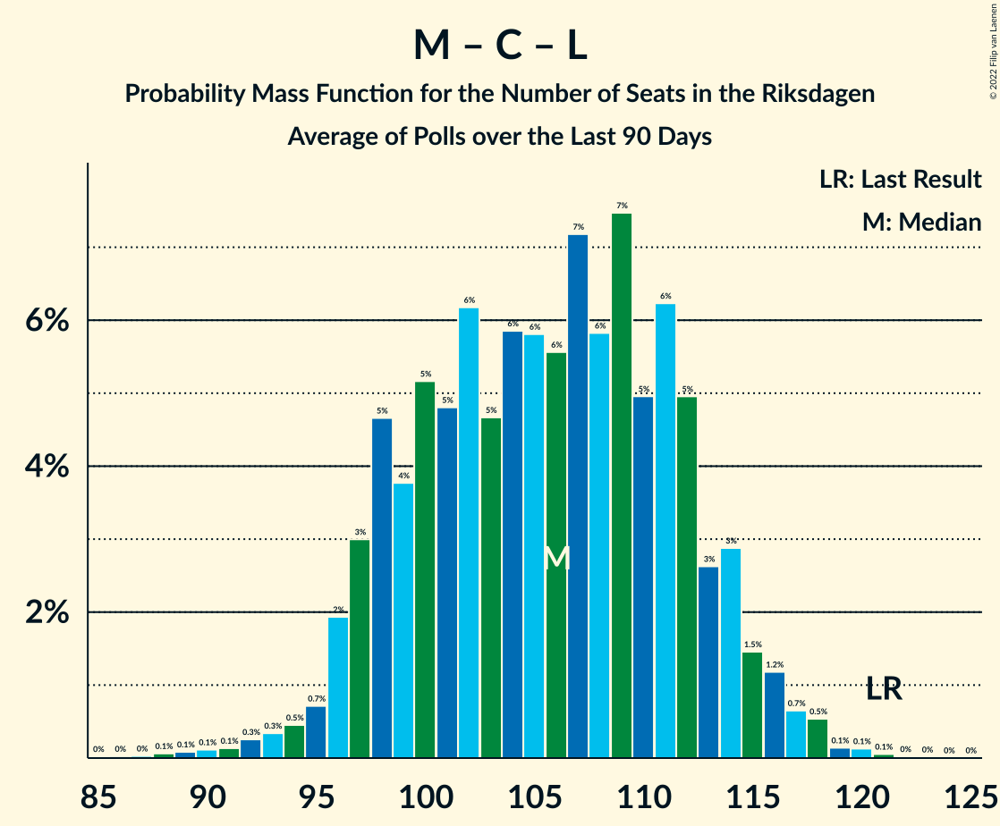

# Poll Average

<a href="#voting-intentions">Voting Intentions</a> | <a href="#seats">Seats</a> | <a href="#coalitions">Coalitions</a> | <a href="#technical-information">Technical Information</a>

## Summary

The table below lists the polls on which the average is based. They are the most recent polls (less than 90 days old) registered and analyzed so far.

| Period     | Polling firm/Commissioner(s) | S | M | SD | C | V | KD | L | MP |
|:----------:|:----------------------------:|:--:|:--:|:--:|:--:|:--:|:--:|:--:|:--:|
| 9 September 2018 | General Election | 28.3%   100 | 19.8%   70 | 17.5%   62 | 8.6%   31 | 8.0%   28 | 6.3%   22 | 5.5%   20 | 4.4%   16 |
| N/A | Poll Average | 20–32%   74–119 | 16–21%   58–77 | 19–27%   70–98 | 5–11%   18–41 | 7–13%   26–46 | 5–8%   19–31 | 2–6%   0–19 | 3–6%   0–22 |
| [30 March–19 April 2020](2020-04-19-Novus.html) | Novus   SVT | 29–32%   106–120 | 17–20%   64–75 | 18–21%   68–79 | 7–9%   26–32 | 9–10%   32–40 | 5–7%   20–26 | 2–3%   0 | 3–4%   0–16 |
| [30 March–8 April 2020](2020-04-08-Sifo.html) | Sifo | 30–32%   109–120 | 18–20%   68–76 | 19–20%   69–77 | 6–8%   24–28 | 9–10%   33–39 | 5–6%   20–24 | 3–4%   0–16 | 3–4%   0 |
| [25 March–1 April 2020](2020-04-01-Demoskop.html) | Demoskop | 26–30%   94–111 | 18–21%   64–77 | 19–22%   69–84 | 9–11%   33–42 | 7–9%   25–33 | 6–8%   21–29 | 2–4%   0 | 3–5%   0–18 |
| [20–24 March 2020](2020-03-24-Sentio.html) | Sentio   Nyheter Idag | 19–25%   70–92 | 17–22%   62–82 | 22–28%   81–102 | 4–8%   16–28 | 9–13%   31–47 | 6–9%   20–33 | 1–4%   0 | 4–7%   0–25 |
| [10–20 March 2020](2020-03-20-Ipsos.html) | Ipsos   Dagens Nyheter | 23–27%   82–95 | 17–21%   61–75 | 20–24%   70–86 | 6–8%   21–29 | 10–14%   38–48 | 5–7%   18–25 | 4–6%   15–22 | 3–5%   0–17 |
| [14–24 January 2020](2020-01-24-SKOP.html) | SKOP | 21–26%   74–96 | 15–20%   55–75 | 21–26%   75–97 | 8–12%   29–43 | 9–13%   32–47 | 5–8%   19–31 | 3–5%   0–19 | 3–5%   0–20 |
| 9 September 2018 | General Election | 28.3%   100 | 19.8%   70 | 17.5%   62 | 8.6%   31 | 8.0%   28 | 6.3%   22 | 5.5%   20 | 4.4%   16 |

Only polls for which at least the sample size has been published are included in the table above.

**Legend:**
+ **Top half of each row:** Voting intentions (95% confidence interval)
+ **Bottom half of each row:** Seat projections for the Riksdagen (95% confidence interval)
+ **S:** Sveriges socialdemokratiska arbetareparti
+ **M:** Moderata samlingspartiet
+ **SD:** Sverigedemokraterna
+ **C:** Centerpartiet
+ **V:** Vänsterpartiet
+ **KD:** Kristdemokraterna
+ **L:** Liberalerna
+ **MP:** Miljöpartiet de gröna
+ **N/A (single party):** Party not included the published results
+ **N/A (entire row):** Calculation for this opinion poll not started yet

## Voting Intentions

### Confidence Intervals

| Party | Last Result | Median | 80% Confidence Interval | 90% Confidence Interval | 95% Confidence Interval | 99% Confidence Interval |
|:-----:|:-----------:|:------:|:-----------------------:|:-----------------------:|:-----------------------:|:-----------------------:|
| <a href="#sveriges-socialdemokratiska-arbetareparti">Sveriges socialdemokratiska arbetareparti</a> | 28.3% | 26.6% | 21.8–30.9% |21.1–31.2% | 20.5–31.5% | 19.4–31.9% |
| <a href="#moderata-samlingspartiet">Moderata samlingspartiet</a> | 19.8% | 19.0% | 17.4–20.2% |16.8–20.7% | 16.2–21.2% | 15.3–22.3% |
| <a href="#sverigedemokraterna">Sverigedemokraterna</a> | 17.5% | 21.3% | 19.3–25.0% |19.0–25.9% | 18.8–26.7% | 18.4–28.0% |
| <a href="#centerpartiet">Centerpartiet</a> | 8.6% | 7.5% | 6.0–10.3% |5.5–10.6% | 5.1–11.0% | 4.5–11.6% |
| <a href="#vänsterpartiet">Vänsterpartiet</a> | 8.0% | 9.8% | 7.9–12.1% |7.4–12.6% | 7.2–13.0% | 6.8–13.7% |
| <a href="#kristdemokraterna">Kristdemokraterna</a> | 6.3% | 6.3% | 5.6–7.5% |5.4–7.9% | 5.3–8.3% | 4.9–9.1% |
| <a href="#liberalerna">Liberalerna</a> | 5.5% | 3.4% | 2.4–4.9% |2.1–5.3% | 1.9–5.6% | 1.5–6.1% |
| <a href="#miljöpartiet-de-gröna">Miljöpartiet de gröna</a> | 4.4% | 4.0% | 3.4–5.2% |3.3–5.7% | 3.2–6.1% | 2.9–6.9% |

### Sveriges socialdemokratiska arbetareparti

*For a full overview of the results for this party, see the [Sveriges socialdemokratiska arbetareparti](party-sverigessocialdemokratiskaarbetareparti.html) page.*

| Voting Intentions | Probability | Accumulated | Special Marks |
|:-----------------:|:-----------:|:-----------:|:-------------:|
| 16.5–17.5% | 0% | 100% |  |
| 17.5–18.5% | 0.1% | 100% |  |
| 18.5–19.5% | 0.6% | 99.9% |  |
| 19.5–20.5% | 2% | 99.3% |  |
| 20.5–21.5% | 5% | 97% |  |
| 21.5–22.5% | 8% | 92% |  |
| 22.5–23.5% | 10% | 84% |  |
| 23.5–24.5% | 10% | 74% |  |
| 24.5–25.5% | 8% | 64% |  |
| 25.5–26.5% | 6% | 56% |  |
| 26.5–27.5% | 6% | 50% | Median |
| 27.5–28.5% | 7% | 44% | Last Result |
| 28.5–29.5% | 6% | 37% |  |
| 29.5–30.5% | 15% | 31% |  |
| 30.5–31.5% | 15% | 17% |  |
| 31.5–32.5% | 2% | 2% |  |
| 32.5–33.5% | 0% | 0% |  |
| 33.5–34.5% | 0% | 0% |  |

### Moderata samlingspartiet

*For a full overview of the results for this party, see the [Moderata samlingspartiet](party-moderatasamlingspartiet.html) page.*

| Voting Intentions | Probability | Accumulated | Special Marks |
|:-----------------:|:-----------:|:-----------:|:-------------:|
| 12.5–13.5% | 0% | 100% |  |
| 13.5–14.5% | 0.1% | 100% |  |
| 14.5–15.5% | 0.7% | 99.9% |  |
| 15.5–16.5% | 3% | 99.2% |  |
| 16.5–17.5% | 8% | 96% |  |
| 17.5–18.5% | 22% | 88% |  |
| 18.5–19.5% | 41% | 66% | Median |
| 19.5–20.5% | 19% | 25% | Last Result |
| 20.5–21.5% | 5% | 6% |  |
| 21.5–22.5% | 1.2% | 2% |  |
| 22.5–23.5% | 0.3% | 0.3% |  |
| 23.5–24.5% | 0.1% | 0.1% |  |
| 24.5–25.5% | 0% | 0% |  |

### Sverigedemokraterna

*For a full overview of the results for this party, see the [Sverigedemokraterna](party-sverigedemokraterna.html) page.*

| Voting Intentions | Probability | Accumulated | Special Marks |
|:-----------------:|:-----------:|:-----------:|:-------------:|
| 16.5–17.5% | 0% | 100% |  |
| 17.5–18.5% | 0.9% | 100% | Last Result |
| 18.5–19.5% | 16% | 99.1% |  |
| 19.5–20.5% | 22% | 83% |  |
| 20.5–21.5% | 15% | 61% | Median |
| 21.5–22.5% | 13% | 46% |  |
| 22.5–23.5% | 11% | 33% |  |
| 23.5–24.5% | 9% | 22% |  |
| 24.5–25.5% | 7% | 13% |  |
| 25.5–26.5% | 4% | 7% |  |
| 26.5–27.5% | 2% | 3% |  |
| 27.5–28.5% | 0.7% | 0.9% |  |
| 28.5–29.5% | 0.2% | 0.2% |  |
| 29.5–30.5% | 0% | 0% |  |

### Centerpartiet

*For a full overview of the results for this party, see the [Centerpartiet](party-centerpartiet.html) page.*

| Voting Intentions | Probability | Accumulated | Special Marks |
|:-----------------:|:-----------:|:-----------:|:-------------:|
| 2.5–3.5% | 0% | 100% |  |
| 3.5–4.5% | 0.7% | 100% |  |
| 4.5–5.5% | 5% | 99.3% |  |
| 5.5–6.5% | 13% | 94% |  |
| 6.5–7.5% | 33% | 82% |  |
| 7.5–8.5% | 17% | 49% | Median |
| 8.5–9.5% | 10% | 32% | Last Result |
| 9.5–10.5% | 16% | 22% |  |
| 10.5–11.5% | 6% | 6% |  |
| 11.5–12.5% | 0.5% | 0.6% |  |
| 12.5–13.5% | 0% | 0% |  |

### Vänsterpartiet

*For a full overview of the results for this party, see the [Vänsterpartiet](party-vänsterpartiet.html) page.*

| Voting Intentions | Probability | Accumulated | Special Marks |
|:-----------------:|:-----------:|:-----------:|:-------------:|
| 4.5–5.5% | 0% | 100% |  |
| 5.5–6.5% | 0.2% | 100% |  |
| 6.5–7.5% | 6% | 99.8% |  |
| 7.5–8.5% | 10% | 94% | Last Result |
| 8.5–9.5% | 25% | 84% |  |
| 9.5–10.5% | 25% | 59% | Median |
| 10.5–11.5% | 16% | 34% |  |
| 11.5–12.5% | 13% | 18% |  |
| 12.5–13.5% | 5% | 6% |  |
| 13.5–14.5% | 0.7% | 0.7% |  |
| 14.5–15.5% | 0% | 0% |  |

### Kristdemokraterna

*For a full overview of the results for this party, see the [Kristdemokraterna](party-kristdemokraterna.html) page.*

| Voting Intentions | Probability | Accumulated | Special Marks |
|:-----------------:|:-----------:|:-----------:|:-------------:|
| 3.5–4.5% | 0.1% | 100% |  |
| 4.5–5.5% | 7% | 99.9% |  |
| 5.5–6.5% | 54% | 93% | Last Result, Median |
| 6.5–7.5% | 29% | 39% |  |
| 7.5–8.5% | 8% | 10% |  |
| 8.5–9.5% | 1.5% | 2% |  |
| 9.5–10.5% | 0.1% | 0.2% |  |
| 10.5–11.5% | 0% | 0% |  |

### Liberalerna

*For a full overview of the results for this party, see the [Liberalerna](party-liberalerna.html) page.*

| Voting Intentions | Probability | Accumulated | Special Marks |
|:-----------------:|:-----------:|:-----------:|:-------------:|
| 0.0–0.5% | 0% | 100% |  |
| 0.5–1.5% | 0.7% | 100% |  |
| 1.5–2.5% | 14% | 99.3% |  |
| 2.5–3.5% | 41% | 86% | Median |
| 3.5–4.5% | 29% | 44% |  |
| 4.5–5.5% | 13% | 16% | Last Result |
| 5.5–6.5% | 3% | 3% |  |
| 6.5–7.5% | 0.1% | 0.1% |  |
| 7.5–8.5% | 0% | 0% |  |

### Miljöpartiet de gröna

*For a full overview of the results for this party, see the [Miljöpartiet de gröna](party-miljöpartietdegröna.html) page.*

| Voting Intentions | Probability | Accumulated | Special Marks |
|:-----------------:|:-----------:|:-----------:|:-------------:|
| 1.5–2.5% | 0% | 100% |  |
| 2.5–3.5% | 20% | 100% |  |
| 3.5–4.5% | 58% | 80% | Last Result, Median |
| 4.5–5.5% | 16% | 23% |  |
| 5.5–6.5% | 5% | 6% |  |
| 6.5–7.5% | 1.0% | 1.1% |  |
| 7.5–8.5% | 0.1% | 0.1% |  |
| 8.5–9.5% | 0% | 0% |  |

## Seats

### Confidence Intervals

| Party | Last Result | Median | 80% Confidence Interval | 90% Confidence Interval | 95% Confidence Interval | 99% Confidence Interval |
|:-----:|:-----------:|:------:|:-----------------------:|:-----------------------:|:-----------------------:|:-----------------------:|
| <a href="#sveriges-socialdemokratiska-arbetareparti">Sveriges socialdemokratiska arbetareparti</a> | 100 | 96 | 79–117 |77–118 | 74–119 | 70–121 |
| <a href="#moderata-samlingspartiet">Moderata samlingspartiet</a> | 70 | 70 | 63–75 |61–76 | 58–77 | 56–82 |
| <a href="#sverigedemokraterna">Sverigedemokraterna</a> | 62 | 77 | 72–92 |70–95 | 70–98 | 68–102 |
| <a href="#centerpartiet">Centerpartiet</a> | 31 | 28 | 22–38 |20–39 | 18–41 | 16–43 |
| <a href="#vänsterpartiet">Vänsterpartiet</a> | 28 | 37 | 29–43 |27–45 | 26–46 | 25–49 |
| <a href="#kristdemokraterna">Kristdemokraterna</a> | 22 | 23 | 21–28 |20–29 | 19–31 | 18–33 |
| <a href="#liberalerna">Liberalerna</a> | 20 | 0 | 0–18 |0–18 | 0–19 | 0–22 |
| <a href="#miljöpartiet-de-gröna">Miljöpartiet de gröna</a> | 16 | 14 | 0–19 |0–21 | 0–22 | 0–25 |

### Sveriges socialdemokratiska arbetareparti

*For a full overview of the results for this party, see the [Sveriges socialdemokratiska arbetareparti](party-sverigessocialdemokratiskaarbetareparti.html) page.*

| Number of Seats | Probability | Accumulated | Special Marks |
|:---------------:|:-----------:|:-----------:|:-------------:|
| 66 | 0% | 100% |  |
| 67 | 0% | 99.9% |  |
| 68 | 0.1% | 99.9% |  |
| 69 | 0.2% | 99.8% |  |
| 70 | 0.2% | 99.6% |  |
| 71 | 0.2% | 99.5% |  |
| 72 | 0.5% | 99.3% |  |
| 73 | 0.7% | 98.8% |  |
| 74 | 0.8% | 98% |  |
| 75 | 1.0% | 97% |  |
| 76 | 0.9% | 96% |  |
| 77 | 3% | 96% |  |
| 78 | 1.1% | 93% |  |
| 79 | 3% | 92% |  |
| 80 | 1.3% | 89% |  |
| 81 | 3% | 88% |  |
| 82 | 5% | 85% |  |
| 83 | 4% | 80% |  |
| 84 | 3% | 77% |  |
| 85 | 4% | 73% |  |
| 86 | 3% | 69% |  |
| 87 | 2% | 66% |  |
| 88 | 3% | 64% |  |
| 89 | 2% | 61% |  |
| 90 | 1.5% | 59% |  |
| 91 | 4% | 58% |  |
| 92 | 1.3% | 54% |  |
| 93 | 0.8% | 52% |  |
| 94 | 0.7% | 52% |  |
| 95 | 0.9% | 51% |  |
| 96 | 0.8% | 50% | Median |
| 97 | 0.9% | 49% |  |
| 98 | 0.8% | 48% |  |
| 99 | 0.9% | 48% |  |
| 100 | 1.4% | 47% | Last Result |
| 101 | 0.7% | 45% |  |
| 102 | 1.3% | 45% |  |
| 103 | 1.3% | 43% |  |
| 104 | 2% | 42% |  |
| 105 | 1.2% | 40% |  |
| 106 | 1.3% | 39% |  |
| 107 | 1.2% | 38% |  |
| 108 | 2% | 36% |  |
| 109 | 3% | 35% |  |
| 110 | 2% | 32% |  |
| 111 | 2% | 30% |  |
| 112 | 2% | 27% |  |
| 113 | 3% | 25% |  |
| 114 | 4% | 22% |  |
| 115 | 3% | 19% |  |
| 116 | 5% | 16% |  |
| 117 | 4% | 11% |  |
| 118 | 3% | 7% |  |
| 119 | 2% | 4% |  |
| 120 | 1.3% | 2% |  |
| 121 | 0.4% | 0.7% |  |
| 122 | 0.2% | 0.3% |  |
| 123 | 0.1% | 0.1% |  |
| 124 | 0% | 0% |  |

### Moderata samlingspartiet

*For a full overview of the results for this party, see the [Moderata samlingspartiet](party-moderatasamlingspartiet.html) page.*

| Number of Seats | Probability | Accumulated | Special Marks |
|:---------------:|:-----------:|:-----------:|:-------------:|
| 52 | 0% | 100% |  |
| 53 | 0.1% | 99.9% |  |
| 54 | 0.1% | 99.8% |  |
| 55 | 0.2% | 99.7% |  |
| 56 | 0.3% | 99.6% |  |
| 57 | 0.5% | 99.3% |  |
| 58 | 2% | 98.7% |  |
| 59 | 1.3% | 97% |  |
| 60 | 0.6% | 96% |  |
| 61 | 2% | 95% |  |
| 62 | 2% | 93% |  |
| 63 | 2% | 91% |  |
| 64 | 3% | 88% |  |
| 65 | 3% | 85% |  |
| 66 | 6% | 82% |  |
| 67 | 9% | 76% |  |
| 68 | 7% | 68% |  |
| 69 | 8% | 61% |  |
| 70 | 8% | 52% | Last Result, Median |
| 71 | 11% | 44% |  |
| 72 | 9% | 33% |  |
| 73 | 9% | 25% |  |
| 74 | 5% | 15% |  |
| 75 | 4% | 10% |  |
| 76 | 3% | 7% |  |
| 77 | 2% | 4% |  |
| 78 | 0.6% | 2% |  |
| 79 | 0.4% | 2% |  |
| 80 | 0.5% | 1.3% |  |
| 81 | 0.3% | 0.8% |  |
| 82 | 0.2% | 0.5% |  |
| 83 | 0.1% | 0.3% |  |
| 84 | 0.1% | 0.2% |  |
| 85 | 0.1% | 0.2% |  |
| 86 | 0% | 0.1% |  |
| 87 | 0% | 0.1% |  |
| 88 | 0% | 0% |  |

### Sverigedemokraterna

*For a full overview of the results for this party, see the [Sverigedemokraterna](party-sverigedemokraterna.html) page.*

| Number of Seats | Probability | Accumulated | Special Marks |
|:---------------:|:-----------:|:-----------:|:-------------:|
| 62 | 0% | 100% | Last Result |
| 63 | 0% | 100% |  |
| 64 | 0% | 100% |  |
| 65 | 0% | 100% |  |
| 66 | 0.1% | 100% |  |
| 67 | 0.2% | 99.9% |  |
| 68 | 0.7% | 99.6% |  |
| 69 | 1.4% | 99.0% |  |
| 70 | 3% | 98% |  |
| 71 | 4% | 95% |  |
| 72 | 6% | 91% |  |
| 73 | 6% | 85% |  |
| 74 | 8% | 80% |  |
| 75 | 7% | 72% |  |
| 76 | 9% | 64% |  |
| 77 | 7% | 55% | Median |
| 78 | 6% | 49% |  |
| 79 | 6% | 43% |  |
| 80 | 2% | 37% |  |
| 81 | 2% | 35% |  |
| 82 | 2% | 33% |  |
| 83 | 3% | 30% |  |
| 84 | 3% | 28% |  |
| 85 | 3% | 25% |  |
| 86 | 2% | 22% |  |
| 87 | 2% | 20% |  |
| 88 | 2% | 18% |  |
| 89 | 2% | 16% |  |
| 90 | 2% | 14% |  |
| 91 | 2% | 12% |  |
| 92 | 2% | 11% |  |
| 93 | 2% | 9% |  |
| 94 | 1.3% | 7% |  |
| 95 | 1.4% | 6% |  |
| 96 | 0.6% | 4% |  |
| 97 | 0.9% | 4% |  |
| 98 | 0.6% | 3% |  |
| 99 | 0.7% | 2% |  |
| 100 | 0.4% | 1.5% |  |
| 101 | 0.3% | 1.0% |  |
| 102 | 0.3% | 0.7% |  |
| 103 | 0.1% | 0.4% |  |
| 104 | 0.1% | 0.3% |  |
| 105 | 0.1% | 0.2% |  |
| 106 | 0.1% | 0.1% |  |
| 107 | 0% | 0.1% |  |
| 108 | 0% | 0.1% |  |
| 109 | 0% | 0% |  |

### Centerpartiet

*For a full overview of the results for this party, see the [Centerpartiet](party-centerpartiet.html) page.*

| Number of Seats | Probability | Accumulated | Special Marks |
|:---------------:|:-----------:|:-----------:|:-------------:|
| 0 | 0.1% | 100% |  |
| 1 | 0% | 99.9% |  |
| 2 | 0% | 99.9% |  |
| 3 | 0% | 99.9% |  |
| 4 | 0% | 99.9% |  |
| 5 | 0% | 99.9% |  |
| 6 | 0% | 99.9% |  |
| 7 | 0% | 99.9% |  |
| 8 | 0% | 99.9% |  |
| 9 | 0% | 99.9% |  |
| 10 | 0% | 99.9% |  |
| 11 | 0% | 99.9% |  |
| 12 | 0% | 99.9% |  |
| 13 | 0% | 99.9% |  |
| 14 | 0% | 99.9% |  |
| 15 | 0.1% | 99.9% |  |
| 16 | 0.4% | 99.8% |  |
| 17 | 1.0% | 99.4% |  |
| 18 | 1.1% | 98% |  |
| 19 | 1.2% | 97% |  |
| 20 | 2% | 96% |  |
| 21 | 3% | 94% |  |
| 22 | 3% | 91% |  |
| 23 | 5% | 88% |  |
| 24 | 7% | 83% |  |
| 25 | 6% | 76% |  |
| 26 | 10% | 70% |  |
| 27 | 8% | 60% |  |
| 28 | 8% | 52% | Median |
| 29 | 5% | 44% |  |
| 30 | 4% | 39% |  |
| 31 | 3% | 35% | Last Result |
| 32 | 2% | 33% |  |
| 33 | 2% | 30% |  |
| 34 | 4% | 28% |  |
| 35 | 3% | 24% |  |
| 36 | 4% | 21% |  |
| 37 | 4% | 16% |  |
| 38 | 5% | 13% |  |
| 39 | 3% | 8% |  |
| 40 | 2% | 5% |  |
| 41 | 1.4% | 3% |  |
| 42 | 0.6% | 2% |  |
| 43 | 0.4% | 0.9% |  |
| 44 | 0.2% | 0.5% |  |
| 45 | 0.1% | 0.2% |  |
| 46 | 0% | 0.1% |  |
| 47 | 0% | 0.1% |  |
| 48 | 0% | 0% |  |

### Vänsterpartiet

*For a full overview of the results for this party, see the [Vänsterpartiet](party-vänsterpartiet.html) page.*

| Number of Seats | Probability | Accumulated | Special Marks |
|:---------------:|:-----------:|:-----------:|:-------------:|
| 23 | 0.1% | 100% |  |
| 24 | 0.3% | 99.9% |  |
| 25 | 0.9% | 99.6% |  |
| 26 | 2% | 98.7% |  |
| 27 | 3% | 97% |  |
| 28 | 3% | 95% | Last Result |
| 29 | 4% | 92% |  |
| 30 | 2% | 88% |  |
| 31 | 2% | 85% |  |
| 32 | 2% | 84% |  |
| 33 | 4% | 81% |  |
| 34 | 7% | 78% |  |
| 35 | 9% | 71% |  |
| 36 | 10% | 61% |  |
| 37 | 10% | 51% | Median |
| 38 | 5% | 41% |  |
| 39 | 7% | 35% |  |
| 40 | 6% | 29% |  |
| 41 | 7% | 22% |  |
| 42 | 2% | 15% |  |
| 43 | 3% | 13% |  |
| 44 | 4% | 10% |  |
| 45 | 2% | 6% |  |
| 46 | 1.0% | 3% |  |
| 47 | 1.1% | 2% |  |
| 48 | 0.6% | 1.3% |  |
| 49 | 0.4% | 0.7% |  |
| 50 | 0.1% | 0.3% |  |
| 51 | 0.1% | 0.2% |  |
| 52 | 0.1% | 0.1% |  |
| 53 | 0% | 0% |  |

### Kristdemokraterna

*For a full overview of the results for this party, see the [Kristdemokraterna](party-kristdemokraterna.html) page.*

| Number of Seats | Probability | Accumulated | Special Marks |
|:---------------:|:-----------:|:-----------:|:-------------:|
| 16 | 0.1% | 100% |  |
| 17 | 0.3% | 99.9% |  |
| 18 | 0.7% | 99.6% |  |
| 19 | 2% | 98.9% |  |
| 20 | 6% | 97% |  |
| 21 | 11% | 92% |  |
| 22 | 19% | 81% | Last Result |
| 23 | 16% | 62% | Median |
| 24 | 12% | 46% |  |
| 25 | 11% | 33% |  |
| 26 | 8% | 23% |  |
| 27 | 3% | 15% |  |
| 28 | 4% | 11% |  |
| 29 | 3% | 7% |  |
| 30 | 2% | 5% |  |
| 31 | 1.0% | 3% |  |
| 32 | 0.8% | 2% |  |
| 33 | 0.3% | 0.8% |  |
| 34 | 0.2% | 0.4% |  |
| 35 | 0.1% | 0.2% |  |
| 36 | 0.1% | 0.1% |  |
| 37 | 0% | 0.1% |  |
| 38 | 0% | 0% |  |

### Liberalerna

*For a full overview of the results for this party, see the [Liberalerna](party-liberalerna.html) page.*

| Number of Seats | Probability | Accumulated | Special Marks |
|:---------------:|:-----------:|:-----------:|:-------------:|
| 0 | 73% | 100% | Median |
| 1 | 0% | 27% |  |
| 2 | 0% | 27% |  |
| 3 | 0% | 27% |  |
| 4 | 0% | 27% |  |
| 5 | 0% | 27% |  |
| 6 | 0% | 27% |  |
| 7 | 0% | 27% |  |
| 8 | 0% | 27% |  |
| 9 | 0% | 27% |  |
| 10 | 0% | 27% |  |
| 11 | 0% | 27% |  |
| 12 | 0% | 27% |  |
| 13 | 0% | 27% |  |
| 14 | 0.4% | 27% |  |
| 15 | 7% | 26% |  |
| 16 | 4% | 20% |  |
| 17 | 2% | 15% |  |
| 18 | 10% | 14% |  |
| 19 | 1.4% | 3% |  |
| 20 | 0.6% | 2% | Last Result |
| 21 | 0.8% | 1.4% |  |
| 22 | 0.5% | 0.6% |  |
| 23 | 0.1% | 0.1% |  |
| 24 | 0% | 0% |  |

### Miljöpartiet de gröna

*For a full overview of the results for this party, see the [Miljöpartiet de gröna](party-miljöpartietdegröna.html) page.*

| Number of Seats | Probability | Accumulated | Special Marks |
|:---------------:|:-----------:|:-----------:|:-------------:|
| 0 | 50% | 100% |  |
| 1 | 0% | 50% |  |
| 2 | 0% | 50% |  |
| 3 | 0% | 50% |  |
| 4 | 0% | 50% |  |
| 5 | 0% | 50% |  |
| 6 | 0% | 50% |  |
| 7 | 0% | 50% |  |
| 8 | 0% | 50% |  |
| 9 | 0% | 50% |  |
| 10 | 0% | 50% |  |
| 11 | 0% | 50% |  |
| 12 | 0% | 50% |  |
| 13 | 0% | 50% |  |
| 14 | 6% | 50% | Median |
| 15 | 13% | 44% |  |
| 16 | 9% | 31% | Last Result |
| 17 | 7% | 22% |  |
| 18 | 4% | 15% |  |
| 19 | 3% | 11% |  |
| 20 | 3% | 8% |  |
| 21 | 2% | 5% |  |
| 22 | 1.3% | 3% |  |
| 23 | 0.7% | 2% |  |
| 24 | 0.7% | 1.4% |  |
| 25 | 0.4% | 0.7% |  |
| 26 | 0.2% | 0.4% |  |
| 27 | 0.1% | 0.2% |  |
| 28 | 0% | 0.1% |  |
| 29 | 0% | 0% |  |

## Coalitions

### Confidence Intervals

| Coalition | Last Result | Median | Majority? | 80% Confidence Interval | 90% Confidence Interval | 95% Confidence Interval | 99% Confidence Interval |
|:---------:|:-----------:|:------:|:---------:|:-----------------------:|:-----------------------:|:-----------------------:|:-----------------------:|
| Sveriges socialdemokratiska arbetareparti – Moderata samlingspartiet – Centerpartiet | 201 | 200 | 86% | 172–217 | 169–219 | 166–220 | 161–222 |
| Moderata samlingspartiet – Sverigedemokraterna – Kristdemokraterna | 154 | 170 | 29% | 163–188 | 161–193 | 159–196 | 156–203 |
| Sveriges socialdemokratiska arbetareparti – Moderata samlingspartiet | 170 | 165 | 40% | 146–189 | 143–191 | 140–192 | 135–193 |
| Sveriges socialdemokratiska arbetareparti – Centerpartiet – Vänsterpartiet – Liberalerna – Miljöpartiet de gröna | 195 | 179 | 71% | 161–186 | 156–188 | 153–190 | 146–193 |
| Moderata samlingspartiet – Sverigedemokraterna | 132 | 147 | 0.6% | 140–162 | 138–166 | 137–169 | 134–176 |
| Sveriges socialdemokratiska arbetareparti – Vänsterpartiet – Miljöpartiet de gröna | 144 | 143 | 0% | 131–154 | 127–156 | 124–159 | 118–164 |
| Sveriges socialdemokratiska arbetareparti – Centerpartiet – Liberalerna – Miljöpartiet de gröna | 167 | 142 | 0% | 122–153 | 118–155 | 114–157 | 107–159 |
| Sveriges socialdemokratiska arbetareparti – Vänsterpartiet | 128 | 132 | 0% | 118–153 | 114–154 | 112–155 | 108–157 |
| Moderata samlingspartiet – Centerpartiet – Kristdemokraterna – Liberalerna | 143 | 126 | 0% | 118–136 | 115–138 | 112–141 | 108–146 |
| Moderata samlingspartiet – Centerpartiet – Kristdemokraterna | 123 | 121 | 0% | 114–133 | 111–135 | 108–138 | 105–142 |
| Sveriges socialdemokratiska arbetareparti – Miljöpartiet de gröna | 116 | 107 | 0% | 91–119 | 88–122 | 84–125 | 79–129 |
| Moderata samlingspartiet – Centerpartiet – Liberalerna | 121 | 102 | 0% | 93–113 | 90–115 | 87–117 | 83–121 |
| Moderata samlingspartiet – Centerpartiet | 101 | 98 | 0% | 90–108 | 88–110 | 86–112 | 82–116 |

### Sveriges socialdemokratiska arbetareparti – Moderata samlingspartiet – Centerpartiet

| Number of Seats | Probability | Accumulated | Special Marks |
|:---------------:|:-----------:|:-----------:|:-------------:|
| 155 | 0% | 100% |  |
| 156 | 0% | 99.9% |  |
| 157 | 0% | 99.9% |  |
| 158 | 0% | 99.9% |  |
| 159 | 0.1% | 99.8% |  |
| 160 | 0.1% | 99.8% |  |
| 161 | 0.3% | 99.6% |  |
| 162 | 0.1% | 99.4% |  |
| 163 | 0.2% | 99.2% |  |
| 164 | 0.4% | 99.1% |  |
| 165 | 0.8% | 98.6% |  |
| 166 | 0.5% | 98% |  |
| 167 | 0.4% | 97% |  |
| 168 | 0.5% | 97% |  |
| 169 | 3% | 96% |  |
| 170 | 1.4% | 94% |  |
| 171 | 2% | 92% |  |
| 172 | 0.9% | 91% |  |
| 173 | 2% | 90% |  |
| 174 | 2% | 88% |  |
| 175 | 5% | 86% | Majority |
| 176 | 1.1% | 81% |  |
| 177 | 3% | 80% |  |
| 178 | 4% | 77% |  |
| 179 | 1.5% | 73% |  |
| 180 | 2% | 72% |  |
| 181 | 2% | 70% |  |
| 182 | 1.2% | 67% |  |
| 183 | 1.4% | 66% |  |
| 184 | 1.3% | 65% |  |
| 185 | 2% | 64% |  |
| 186 | 2% | 62% |  |
| 187 | 3% | 60% |  |
| 188 | 2% | 57% |  |
| 189 | 1.0% | 56% |  |
| 190 | 0.6% | 55% |  |
| 191 | 0.7% | 54% |  |
| 192 | 0.2% | 53% |  |
| 193 | 0.2% | 53% |  |
| 194 | 0.6% | 53% | Median |
| 195 | 0.3% | 52% |  |
| 196 | 0.5% | 52% |  |
| 197 | 0.5% | 51% |  |
| 198 | 0.2% | 51% |  |
| 199 | 0.6% | 51% |  |
| 200 | 1.0% | 50% |  |
| 201 | 0.6% | 49% | Last Result |
| 202 | 0.7% | 49% |  |
| 203 | 1.0% | 48% |  |
| 204 | 1.3% | 47% |  |
| 205 | 2% | 46% |  |
| 206 | 2% | 44% |  |
| 207 | 3% | 42% |  |
| 208 | 2% | 39% |  |
| 209 | 2% | 37% |  |
| 210 | 2% | 36% |  |
| 211 | 3% | 34% |  |
| 212 | 2% | 31% |  |
| 213 | 3% | 29% |  |
| 214 | 4% | 26% |  |
| 215 | 4% | 22% |  |
| 216 | 5% | 18% |  |
| 217 | 4% | 13% |  |
| 218 | 3% | 10% |  |
| 219 | 3% | 6% |  |
| 220 | 2% | 3% |  |
| 221 | 1.0% | 2% |  |
| 222 | 0.4% | 0.8% |  |
| 223 | 0.2% | 0.4% |  |
| 224 | 0.2% | 0.2% |  |
| 225 | 0% | 0% |  |

### Moderata samlingspartiet – Sverigedemokraterna – Kristdemokraterna

| Number of Seats | Probability | Accumulated | Special Marks |
|:---------------:|:-----------:|:-----------:|:-------------:|
| 152 | 0% | 100% |  |
| 153 | 0% | 99.9% |  |
| 154 | 0.1% | 99.9% | Last Result |
| 155 | 0.1% | 99.8% |  |
| 156 | 0.3% | 99.7% |  |
| 157 | 0.6% | 99.3% |  |
| 158 | 0.8% | 98.7% |  |
| 159 | 1.1% | 98% |  |
| 160 | 1.2% | 97% |  |
| 161 | 2% | 96% |  |
| 162 | 2% | 93% |  |
| 163 | 4% | 91% |  |
| 164 | 4% | 87% |  |
| 165 | 3% | 83% |  |
| 166 | 4% | 80% |  |
| 167 | 5% | 76% |  |
| 168 | 9% | 70% |  |
| 169 | 5% | 61% |  |
| 170 | 6% | 56% | Median |
| 171 | 5% | 50% |  |
| 172 | 8% | 45% |  |
| 173 | 4% | 37% |  |
| 174 | 4% | 33% |  |
| 175 | 2% | 29% | Majority |
| 176 | 2% | 27% |  |
| 177 | 1.4% | 25% |  |
| 178 | 1.1% | 23% |  |
| 179 | 1.3% | 22% |  |
| 180 | 1.2% | 21% |  |
| 181 | 1.3% | 20% |  |
| 182 | 2% | 18% |  |
| 183 | 1.4% | 17% |  |
| 184 | 1.2% | 16% |  |
| 185 | 1.3% | 14% |  |
| 186 | 1.2% | 13% |  |
| 187 | 1.2% | 12% |  |
| 188 | 1.5% | 11% |  |
| 189 | 1.4% | 9% |  |
| 190 | 0.6% | 8% |  |
| 191 | 1.1% | 7% |  |
| 192 | 1.2% | 6% |  |
| 193 | 0.7% | 5% |  |
| 194 | 0.8% | 4% |  |
| 195 | 0.8% | 4% |  |
| 196 | 0.5% | 3% |  |
| 197 | 0.5% | 2% |  |
| 198 | 0.4% | 2% |  |
| 199 | 0.4% | 1.4% |  |
| 200 | 0.2% | 1.0% |  |
| 201 | 0.2% | 0.8% |  |
| 202 | 0.1% | 0.6% |  |
| 203 | 0.1% | 0.5% |  |
| 204 | 0.1% | 0.4% |  |
| 205 | 0.1% | 0.3% |  |
| 206 | 0% | 0.2% |  |
| 207 | 0% | 0.2% |  |
| 208 | 0% | 0.1% |  |
| 209 | 0% | 0.1% |  |
| 210 | 0.1% | 0.1% |  |
| 211 | 0% | 0% |  |

### Sveriges socialdemokratiska arbetareparti – Moderata samlingspartiet

| Number of Seats | Probability | Accumulated | Special Marks |
|:---------------:|:-----------:|:-----------:|:-------------:|
| 130 | 0% | 100% |  |
| 131 | 0.1% | 99.9% |  |
| 132 | 0.1% | 99.9% |  |
| 133 | 0.1% | 99.8% |  |
| 134 | 0.1% | 99.7% |  |
| 135 | 0.7% | 99.6% |  |
| 136 | 0.4% | 99.0% |  |
| 137 | 0.3% | 98.6% |  |
| 138 | 0.2% | 98% |  |
| 139 | 0.3% | 98% |  |
| 140 | 0.9% | 98% |  |
| 141 | 0.6% | 97% |  |
| 142 | 1.0% | 96% |  |
| 143 | 0.8% | 95% |  |
| 144 | 2% | 94% |  |
| 145 | 1.3% | 93% |  |
| 146 | 2% | 91% |  |
| 147 | 2% | 89% |  |
| 148 | 3% | 87% |  |
| 149 | 5% | 84% |  |
| 150 | 2% | 80% |  |
| 151 | 2% | 78% |  |
| 152 | 5% | 76% |  |
| 153 | 2% | 71% |  |
| 154 | 2% | 69% |  |
| 155 | 2% | 66% |  |
| 156 | 2% | 65% |  |
| 157 | 1.5% | 62% |  |
| 158 | 2% | 61% |  |
| 159 | 1.1% | 59% |  |
| 160 | 2% | 58% |  |
| 161 | 0.7% | 56% |  |
| 162 | 1.1% | 56% |  |
| 163 | 3% | 55% |  |
| 164 | 0.7% | 52% |  |
| 165 | 1.2% | 51% |  |
| 166 | 0.9% | 50% | Median |
| 167 | 0.7% | 49% |  |
| 168 | 1.0% | 48% |  |
| 169 | 0.7% | 47% |  |
| 170 | 1.0% | 46% | Last Result |
| 171 | 1.1% | 45% |  |
| 172 | 0.9% | 44% |  |
| 173 | 2% | 43% |  |
| 174 | 2% | 42% |  |
| 175 | 1.2% | 40% | Majority |
| 176 | 1.3% | 39% |  |
| 177 | 1.0% | 38% |  |
| 178 | 2% | 37% |  |
| 179 | 2% | 35% |  |
| 180 | 2% | 33% |  |
| 181 | 2% | 30% |  |
| 182 | 2% | 29% |  |
| 183 | 2% | 26% |  |
| 184 | 2% | 24% |  |
| 185 | 4% | 22% |  |
| 186 | 2% | 18% |  |
| 187 | 2% | 16% |  |
| 188 | 3% | 14% |  |
| 189 | 3% | 11% |  |
| 190 | 2% | 8% |  |
| 191 | 3% | 6% |  |
| 192 | 1.5% | 3% |  |
| 193 | 1.2% | 2% |  |
| 194 | 0.2% | 0.5% |  |
| 195 | 0.2% | 0.3% |  |
| 196 | 0.1% | 0.1% |  |
| 197 | 0% | 0% |  |

### Sveriges socialdemokratiska arbetareparti – Centerpartiet – Vänsterpartiet – Liberalerna – Miljöpartiet de gröna

| Number of Seats | Probability | Accumulated | Special Marks |
|:---------------:|:-----------:|:-----------:|:-------------:|
| 139 | 0.1% | 100% |  |
| 140 | 0% | 99.9% |  |
| 141 | 0% | 99.9% |  |
| 142 | 0% | 99.9% |  |
| 143 | 0% | 99.8% |  |
| 144 | 0.1% | 99.8% |  |
| 145 | 0.1% | 99.7% |  |
| 146 | 0.1% | 99.6% |  |
| 147 | 0.1% | 99.5% |  |
| 148 | 0.2% | 99.4% |  |
| 149 | 0.3% | 99.2% |  |
| 150 | 0.4% | 98.9% |  |
| 151 | 0.4% | 98.5% |  |
| 152 | 0.5% | 98% |  |
| 153 | 0.5% | 98% |  |
| 154 | 0.9% | 97% |  |
| 155 | 0.8% | 96% |  |
| 156 | 0.7% | 95% |  |
| 157 | 1.2% | 95% |  |
| 158 | 1.1% | 94% |  |
| 159 | 0.6% | 92% |  |
| 160 | 1.4% | 92% |  |
| 161 | 1.5% | 91% |  |
| 162 | 1.2% | 89% |  |
| 163 | 1.2% | 88% |  |
| 164 | 1.3% | 87% |  |
| 165 | 1.1% | 85% |  |
| 166 | 1.4% | 84% |  |
| 167 | 2% | 83% |  |
| 168 | 1.3% | 81% |  |
| 169 | 1.2% | 80% |  |
| 170 | 1.3% | 79% |  |
| 171 | 1.1% | 78% |  |
| 172 | 1.4% | 77% |  |
| 173 | 2% | 75% |  |
| 174 | 2% | 73% |  |
| 175 | 4% | 71% | Median, Majority |
| 176 | 4% | 67% |  |
| 177 | 8% | 63% |  |
| 178 | 5% | 55% |  |
| 179 | 6% | 50% |  |
| 180 | 5% | 44% |  |
| 181 | 9% | 39% |  |
| 182 | 5% | 30% |  |
| 183 | 4% | 24% |  |
| 184 | 3% | 20% |  |
| 185 | 4% | 17% |  |
| 186 | 4% | 13% |  |
| 187 | 2% | 9% |  |
| 188 | 2% | 7% |  |
| 189 | 1.2% | 4% |  |
| 190 | 1.1% | 3% |  |
| 191 | 0.8% | 2% |  |
| 192 | 0.6% | 1.3% |  |
| 193 | 0.3% | 0.7% |  |
| 194 | 0.1% | 0.3% |  |
| 195 | 0.1% | 0.2% | Last Result |
| 196 | 0% | 0.1% |  |
| 197 | 0% | 0.1% |  |
| 198 | 0% | 0% |  |

### Moderata samlingspartiet – Sverigedemokraterna

| Number of Seats | Probability | Accumulated | Special Marks |
|:---------------:|:-----------:|:-----------:|:-------------:|
| 130 | 0% | 100% |  |
| 131 | 0% | 99.9% |  |
| 132 | 0.1% | 99.9% | Last Result |
| 133 | 0.2% | 99.8% |  |
| 134 | 0.3% | 99.5% |  |
| 135 | 0.6% | 99.2% |  |
| 136 | 0.8% | 98.6% |  |
| 137 | 1.2% | 98% |  |
| 138 | 2% | 97% |  |
| 139 | 3% | 95% |  |
| 140 | 3% | 91% |  |
| 141 | 3% | 89% |  |
| 142 | 5% | 86% |  |
| 143 | 7% | 81% |  |
| 144 | 6% | 75% |  |
| 145 | 6% | 69% |  |
| 146 | 8% | 63% |  |
| 147 | 6% | 55% | Median |
| 148 | 7% | 49% |  |
| 149 | 5% | 42% |  |
| 150 | 7% | 36% |  |
| 151 | 3% | 30% |  |
| 152 | 3% | 26% |  |
| 153 | 3% | 24% |  |
| 154 | 1.4% | 21% |  |
| 155 | 1.2% | 20% |  |
| 156 | 1.1% | 18% |  |
| 157 | 2% | 17% |  |
| 158 | 2% | 16% |  |
| 159 | 1.5% | 14% |  |
| 160 | 0.9% | 13% |  |
| 161 | 0.9% | 12% |  |
| 162 | 2% | 11% |  |
| 163 | 1.2% | 9% |  |
| 164 | 0.9% | 8% |  |
| 165 | 0.4% | 7% |  |
| 166 | 2% | 7% |  |
| 167 | 1.1% | 5% |  |
| 168 | 0.8% | 4% |  |
| 169 | 0.6% | 3% |  |
| 170 | 0.3% | 2% |  |
| 171 | 0.5% | 2% |  |
| 172 | 0.5% | 2% |  |
| 173 | 0.3% | 1.1% |  |
| 174 | 0.2% | 0.8% |  |
| 175 | 0.1% | 0.6% | Majority |
| 176 | 0.1% | 0.5% |  |
| 177 | 0.1% | 0.4% |  |
| 178 | 0.1% | 0.3% |  |
| 179 | 0% | 0.2% |  |
| 180 | 0.1% | 0.2% |  |
| 181 | 0% | 0.1% |  |
| 182 | 0% | 0.1% |  |
| 183 | 0% | 0.1% |  |
| 184 | 0% | 0% |  |

### Sveriges socialdemokratiska arbetareparti – Vänsterpartiet – Miljöpartiet de gröna

| Number of Seats | Probability | Accumulated | Special Marks |
|:---------------:|:-----------:|:-----------:|:-------------:|
| 112 | 0.1% | 100% |  |
| 113 | 0% | 99.9% |  |
| 114 | 0.1% | 99.9% |  |
| 115 | 0.1% | 99.8% |  |
| 116 | 0.1% | 99.8% |  |
| 117 | 0.1% | 99.7% |  |
| 118 | 0.2% | 99.5% |  |
| 119 | 0.3% | 99.3% |  |
| 120 | 0.4% | 99.0% |  |
| 121 | 0.2% | 98.7% |  |
| 122 | 0.6% | 98% |  |
| 123 | 0.3% | 98% |  |
| 124 | 0.4% | 98% |  |
| 125 | 0.5% | 97% |  |
| 126 | 1.0% | 97% |  |
| 127 | 0.8% | 96% |  |
| 128 | 1.4% | 95% |  |
| 129 | 1.3% | 93% |  |
| 130 | 2% | 92% |  |
| 131 | 2% | 90% |  |
| 132 | 2% | 88% |  |
| 133 | 2% | 86% |  |
| 134 | 3% | 85% |  |
| 135 | 6% | 82% |  |
| 136 | 4% | 77% |  |
| 137 | 6% | 73% |  |
| 138 | 3% | 67% |  |
| 139 | 3% | 64% |  |
| 140 | 4% | 60% |  |
| 141 | 3% | 56% |  |
| 142 | 3% | 53% |  |
| 143 | 3% | 50% |  |
| 144 | 4% | 47% | Last Result |
| 145 | 4% | 43% |  |
| 146 | 2% | 40% |  |
| 147 | 4% | 37% | Median |
| 148 | 3% | 34% |  |
| 149 | 4% | 31% |  |
| 150 | 3% | 27% |  |
| 151 | 4% | 24% |  |
| 152 | 4% | 20% |  |
| 153 | 3% | 16% |  |
| 154 | 4% | 13% |  |
| 155 | 3% | 9% |  |
| 156 | 2% | 7% |  |
| 157 | 0.9% | 5% |  |
| 158 | 0.6% | 4% |  |
| 159 | 0.9% | 3% |  |
| 160 | 0.5% | 2% |  |
| 161 | 0.9% | 2% |  |
| 162 | 0.3% | 1.0% |  |
| 163 | 0.3% | 0.8% |  |
| 164 | 0.3% | 0.5% |  |
| 165 | 0.1% | 0.2% |  |
| 166 | 0.1% | 0.1% |  |
| 167 | 0% | 0% |  |

### Sveriges socialdemokratiska arbetareparti – Centerpartiet – Liberalerna – Miljöpartiet de gröna

| Number of Seats | Probability | Accumulated | Special Marks |
|:---------------:|:-----------:|:-----------:|:-------------:|
| 99 | 0% | 100% |  |
| 100 | 0% | 99.9% |  |
| 101 | 0% | 99.9% |  |
| 102 | 0% | 99.9% |  |
| 103 | 0% | 99.8% |  |
| 104 | 0.1% | 99.8% |  |
| 105 | 0.1% | 99.7% |  |
| 106 | 0.1% | 99.7% |  |
| 107 | 0.1% | 99.6% |  |
| 108 | 0.2% | 99.5% |  |
| 109 | 0.1% | 99.3% |  |
| 110 | 0.3% | 99.2% |  |
| 111 | 0.3% | 98.9% |  |
| 112 | 0.2% | 98.6% |  |
| 113 | 0.5% | 98% |  |
| 114 | 0.6% | 98% |  |
| 115 | 0.9% | 97% |  |
| 116 | 0.5% | 96% |  |
| 117 | 0.7% | 96% |  |
| 118 | 1.3% | 95% |  |
| 119 | 1.3% | 94% |  |
| 120 | 0.9% | 93% |  |
| 121 | 2% | 92% |  |
| 122 | 1.1% | 90% |  |
| 123 | 1.1% | 89% |  |
| 124 | 2% | 88% |  |
| 125 | 1.4% | 86% |  |
| 126 | 0.8% | 85% |  |
| 127 | 1.1% | 84% |  |
| 128 | 1.3% | 83% |  |
| 129 | 1.0% | 82% |  |
| 130 | 1.2% | 81% |  |
| 131 | 2% | 79% |  |
| 132 | 1.2% | 78% |  |
| 133 | 3% | 77% |  |
| 134 | 1.2% | 73% |  |
| 135 | 1.1% | 72% |  |
| 136 | 2% | 71% |  |
| 137 | 1.5% | 69% |  |
| 138 | 3% | 68% | Median |
| 139 | 2% | 65% |  |
| 140 | 6% | 63% |  |
| 141 | 3% | 57% |  |
| 142 | 5% | 55% |  |
| 143 | 8% | 50% |  |
| 144 | 5% | 42% |  |
| 145 | 6% | 38% |  |
| 146 | 5% | 32% |  |
| 147 | 4% | 27% |  |
| 148 | 3% | 24% |  |
| 149 | 4% | 20% |  |
| 150 | 2% | 17% |  |
| 151 | 2% | 15% |  |
| 152 | 2% | 13% |  |
| 153 | 2% | 11% |  |
| 154 | 3% | 9% |  |
| 155 | 2% | 6% |  |
| 156 | 1.4% | 5% |  |
| 157 | 1.4% | 3% |  |
| 158 | 0.9% | 2% |  |
| 159 | 0.5% | 0.9% |  |
| 160 | 0.3% | 0.4% |  |
| 161 | 0.1% | 0.1% |  |
| 162 | 0% | 0.1% |  |
| 163 | 0% | 0% |  |
| 164 | 0% | 0% |  |
| 165 | 0% | 0% |  |
| 166 | 0% | 0% |  |
| 167 | 0% | 0% | Last Result |

### Sveriges socialdemokratiska arbetareparti – Vänsterpartiet

| Number of Seats | Probability | Accumulated | Special Marks |
|:---------------:|:-----------:|:-----------:|:-------------:|
| 103 | 0% | 100% |  |
| 104 | 0% | 99.9% |  |
| 105 | 0.1% | 99.9% |  |
| 106 | 0.1% | 99.8% |  |
| 107 | 0.2% | 99.7% |  |
| 108 | 0.3% | 99.5% |  |
| 109 | 0.3% | 99.2% |  |
| 110 | 0.5% | 98.9% |  |
| 111 | 0.4% | 98% |  |
| 112 | 0.8% | 98% |  |
| 113 | 1.0% | 97% |  |
| 114 | 1.4% | 96% |  |
| 115 | 1.5% | 95% |  |
| 116 | 1.0% | 93% |  |
| 117 | 2% | 92% |  |
| 118 | 2% | 90% |  |
| 119 | 2% | 89% |  |
| 120 | 3% | 87% |  |
| 121 | 1.2% | 84% |  |
| 122 | 3% | 83% |  |
| 123 | 6% | 80% |  |
| 124 | 3% | 74% |  |
| 125 | 2% | 71% |  |
| 126 | 4% | 69% |  |
| 127 | 3% | 65% |  |
| 128 | 3% | 62% | Last Result |
| 129 | 4% | 59% |  |
| 130 | 2% | 56% |  |
| 131 | 3% | 54% |  |
| 132 | 3% | 51% |  |
| 133 | 2% | 48% | Median |
| 134 | 2% | 46% |  |
| 135 | 4% | 44% |  |
| 136 | 1.5% | 40% |  |
| 137 | 1.1% | 38% |  |
| 138 | 2% | 37% |  |
| 139 | 1.0% | 36% |  |
| 140 | 0.8% | 35% |  |
| 141 | 0.9% | 34% |  |
| 142 | 0.6% | 33% |  |
| 143 | 0.8% | 32% |  |
| 144 | 2% | 32% |  |
| 145 | 0.9% | 30% |  |
| 146 | 2% | 29% |  |
| 147 | 2% | 27% |  |
| 148 | 2% | 25% |  |
| 149 | 3% | 23% |  |
| 150 | 3% | 20% |  |
| 151 | 3% | 18% |  |
| 152 | 4% | 15% |  |
| 153 | 3% | 11% |  |
| 154 | 3% | 8% |  |
| 155 | 2% | 4% |  |
| 156 | 1.3% | 2% |  |
| 157 | 0.5% | 0.8% |  |
| 158 | 0.3% | 0.4% |  |
| 159 | 0.1% | 0.1% |  |
| 160 | 0% | 0% |  |

### Moderata samlingspartiet – Centerpartiet – Kristdemokraterna – Liberalerna

| Number of Seats | Probability | Accumulated | Special Marks |
|:---------------:|:-----------:|:-----------:|:-------------:|
| 102 | 0% | 100% |  |
| 103 | 0% | 99.9% |  |
| 104 | 0% | 99.9% |  |
| 105 | 0.1% | 99.9% |  |
| 106 | 0.1% | 99.8% |  |
| 107 | 0.1% | 99.7% |  |
| 108 | 0.2% | 99.6% |  |
| 109 | 0.4% | 99.4% |  |
| 110 | 0.5% | 99.0% |  |
| 111 | 0.7% | 98.5% |  |
| 112 | 0.5% | 98% |  |
| 113 | 0.8% | 97% |  |
| 114 | 2% | 97% |  |
| 115 | 1.3% | 95% |  |
| 116 | 2% | 94% |  |
| 117 | 2% | 92% |  |
| 118 | 3% | 90% |  |
| 119 | 4% | 88% |  |
| 120 | 6% | 84% |  |
| 121 | 5% | 78% | Median |
| 122 | 5% | 73% |  |
| 123 | 8% | 68% |  |
| 124 | 5% | 60% |  |
| 125 | 4% | 55% |  |
| 126 | 3% | 52% |  |
| 127 | 3% | 48% |  |
| 128 | 2% | 46% |  |
| 129 | 4% | 43% |  |
| 130 | 4% | 39% |  |
| 131 | 5% | 35% |  |
| 132 | 4% | 31% |  |
| 133 | 8% | 27% |  |
| 134 | 4% | 19% |  |
| 135 | 3% | 15% |  |
| 136 | 5% | 13% |  |
| 137 | 1.2% | 8% |  |
| 138 | 2% | 6% |  |
| 139 | 0.9% | 5% |  |
| 140 | 1.1% | 4% |  |
| 141 | 0.8% | 3% |  |
| 142 | 0.5% | 2% |  |
| 143 | 0.4% | 2% | Last Result |
| 144 | 0.3% | 1.2% |  |
| 145 | 0.4% | 0.9% |  |
| 146 | 0.1% | 0.5% |  |
| 147 | 0.1% | 0.4% |  |
| 148 | 0.1% | 0.2% |  |
| 149 | 0% | 0.2% |  |
| 150 | 0% | 0.1% |  |
| 151 | 0% | 0.1% |  |
| 152 | 0% | 0.1% |  |
| 153 | 0% | 0% |  |

### Moderata samlingspartiet – Centerpartiet – Kristdemokraterna

| Number of Seats | Probability | Accumulated | Special Marks |
|:---------------:|:-----------:|:-----------:|:-------------:|
| 101 | 0% | 100% |  |
| 102 | 0% | 99.9% |  |
| 103 | 0% | 99.9% |  |
| 104 | 0.1% | 99.9% |  |
| 105 | 0.3% | 99.7% |  |
| 106 | 0.3% | 99.4% |  |
| 107 | 1.2% | 99.0% |  |
| 108 | 0.5% | 98% |  |
| 109 | 0.7% | 97% |  |
| 110 | 0.8% | 97% |  |
| 111 | 0.9% | 96% |  |
| 112 | 1.5% | 95% |  |
| 113 | 3% | 93% |  |
| 114 | 3% | 91% |  |
| 115 | 7% | 88% |  |
| 116 | 4% | 81% |  |
| 117 | 4% | 77% |  |
| 118 | 6% | 73% |  |
| 119 | 5% | 67% |  |
| 120 | 7% | 62% |  |
| 121 | 6% | 55% | Median |
| 122 | 5% | 49% |  |
| 123 | 7% | 44% | Last Result |
| 124 | 5% | 37% |  |
| 125 | 4% | 32% |  |
| 126 | 3% | 29% |  |
| 127 | 3% | 25% |  |
| 128 | 2% | 22% |  |
| 129 | 3% | 20% |  |
| 130 | 2% | 17% |  |
| 131 | 2% | 15% |  |
| 132 | 2% | 12% |  |
| 133 | 2% | 10% |  |
| 134 | 2% | 8% |  |
| 135 | 1.4% | 6% |  |
| 136 | 1.1% | 5% |  |
| 137 | 0.5% | 4% |  |
| 138 | 0.8% | 3% |  |
| 139 | 0.5% | 2% |  |
| 140 | 0.7% | 2% |  |
| 141 | 0.3% | 0.9% |  |
| 142 | 0.3% | 0.7% |  |
| 143 | 0.2% | 0.3% |  |
| 144 | 0% | 0.1% |  |
| 145 | 0.1% | 0.1% |  |
| 146 | 0% | 0% |  |

### Sveriges socialdemokratiska arbetareparti – Miljöpartiet de gröna

| Number of Seats | Probability | Accumulated | Special Marks |
|:---------------:|:-----------:|:-----------:|:-------------:|
| 74 | 0% | 100% |  |
| 75 | 0.1% | 99.9% |  |
| 76 | 0.1% | 99.9% |  |
| 77 | 0.1% | 99.8% |  |
| 78 | 0.1% | 99.7% |  |
| 79 | 0.4% | 99.6% |  |
| 80 | 0.2% | 99.1% |  |
| 81 | 0.3% | 99.0% |  |
| 82 | 0.5% | 98.6% |  |
| 83 | 0.5% | 98% |  |
| 84 | 0.5% | 98% |  |
| 85 | 0.7% | 97% |  |
| 86 | 0.6% | 96% |  |
| 87 | 0.8% | 96% |  |
| 88 | 1.1% | 95% |  |
| 89 | 2% | 94% |  |
| 90 | 1.1% | 92% |  |
| 91 | 4% | 91% |  |
| 92 | 1.3% | 88% |  |
| 93 | 2% | 86% |  |
| 94 | 1.4% | 84% |  |
| 95 | 1.2% | 83% |  |
| 96 | 4% | 82% |  |
| 97 | 1.5% | 77% |  |
| 98 | 3% | 76% |  |
| 99 | 5% | 73% |  |
| 100 | 5% | 69% |  |
| 101 | 2% | 64% |  |
| 102 | 3% | 62% |  |
| 103 | 3% | 59% |  |
| 104 | 2% | 56% |  |
| 105 | 2% | 54% |  |
| 106 | 2% | 52% |  |
| 107 | 2% | 50% |  |
| 108 | 2% | 49% |  |
| 109 | 3% | 47% |  |
| 110 | 2% | 44% | Median |
| 111 | 2% | 42% |  |
| 112 | 2% | 39% |  |
| 113 | 3% | 37% |  |
| 114 | 4% | 34% |  |
| 115 | 4% | 30% |  |
| 116 | 5% | 26% | Last Result |
| 117 | 5% | 21% |  |
| 118 | 5% | 16% |  |
| 119 | 2% | 11% |  |
| 120 | 2% | 8% |  |
| 121 | 0.9% | 6% |  |
| 122 | 0.9% | 5% |  |
| 123 | 0.6% | 5% |  |
| 124 | 1.1% | 4% |  |
| 125 | 0.5% | 3% |  |
| 126 | 0.8% | 2% |  |
| 127 | 0.6% | 1.5% |  |
| 128 | 0.3% | 0.9% |  |
| 129 | 0.3% | 0.6% |  |
| 130 | 0.2% | 0.3% |  |
| 131 | 0.1% | 0.1% |  |
| 132 | 0% | 0.1% |  |
| 133 | 0% | 0% |  |

### Moderata samlingspartiet – Centerpartiet – Liberalerna

| Number of Seats | Probability | Accumulated | Special Marks |
|:---------------:|:-----------:|:-----------:|:-------------:|
| 76 | 0% | 100% |  |
| 77 | 0% | 99.9% |  |
| 78 | 0% | 99.9% |  |
| 79 | 0% | 99.9% |  |
| 80 | 0.1% | 99.8% |  |
| 81 | 0.1% | 99.8% |  |
| 82 | 0.1% | 99.6% |  |
| 83 | 0.2% | 99.5% |  |
| 84 | 0.4% | 99.3% |  |
| 85 | 0.3% | 98.9% |  |
| 86 | 0.8% | 98.6% |  |
| 87 | 0.6% | 98% |  |
| 88 | 0.8% | 97% |  |
| 89 | 1.1% | 96% |  |
| 90 | 2% | 95% |  |
| 91 | 1.2% | 94% |  |
| 92 | 2% | 92% |  |
| 93 | 2% | 90% |  |
| 94 | 2% | 89% |  |
| 95 | 2% | 87% |  |
| 96 | 4% | 84% |  |
| 97 | 4% | 80% |  |
| 98 | 7% | 76% | Median |
| 99 | 5% | 69% |  |
| 100 | 6% | 63% |  |
| 101 | 4% | 57% |  |
| 102 | 3% | 53% |  |
| 103 | 3% | 50% |  |
| 104 | 3% | 46% |  |
| 105 | 3% | 43% |  |
| 106 | 2% | 39% |  |
| 107 | 4% | 37% |  |
| 108 | 4% | 33% |  |
| 109 | 5% | 29% |  |
| 110 | 3% | 24% |  |
| 111 | 6% | 21% |  |
| 112 | 4% | 15% |  |
| 113 | 0.9% | 10% |  |
| 114 | 4% | 9% |  |
| 115 | 2% | 6% |  |
| 116 | 0.8% | 4% |  |
| 117 | 0.8% | 3% |  |
| 118 | 0.9% | 2% |  |
| 119 | 0.5% | 1.4% |  |
| 120 | 0.2% | 0.8% |  |
| 121 | 0.2% | 0.7% | Last Result |
| 122 | 0.1% | 0.5% |  |
| 123 | 0.1% | 0.3% |  |
| 124 | 0.1% | 0.2% |  |
| 125 | 0% | 0.1% |  |
| 126 | 0.1% | 0.1% |  |
| 127 | 0% | 0% |  |

### Moderata samlingspartiet – Centerpartiet

| Number of Seats | Probability | Accumulated | Special Marks |
|:---------------:|:-----------:|:-----------:|:-------------:|
| 76 | 0% | 100% |  |
| 77 | 0% | 99.9% |  |
| 78 | 0% | 99.9% |  |
| 79 | 0% | 99.9% |  |
| 80 | 0.1% | 99.8% |  |
| 81 | 0.2% | 99.7% |  |
| 82 | 0.1% | 99.6% |  |
| 83 | 0.3% | 99.4% |  |
| 84 | 0.6% | 99.1% |  |
| 85 | 0.4% | 98% |  |
| 86 | 1.1% | 98% |  |
| 87 | 2% | 97% |  |
| 88 | 1.2% | 95% |  |
| 89 | 2% | 94% |  |
| 90 | 4% | 93% |  |
| 91 | 2% | 89% |  |
| 92 | 4% | 87% |  |
| 93 | 6% | 83% |  |
| 94 | 6% | 77% |  |
| 95 | 4% | 71% |  |
| 96 | 8% | 66% |  |
| 97 | 6% | 59% |  |
| 98 | 8% | 53% | Median |
| 99 | 6% | 45% |  |
| 100 | 7% | 39% |  |
| 101 | 5% | 32% | Last Result |
| 102 | 4% | 28% |  |
| 103 | 2% | 24% |  |
| 104 | 4% | 22% |  |
| 105 | 3% | 18% |  |
| 106 | 2% | 15% |  |
| 107 | 3% | 13% |  |
| 108 | 2% | 11% |  |
| 109 | 2% | 9% |  |
| 110 | 2% | 6% |  |
| 111 | 2% | 5% |  |
| 112 | 0.8% | 3% |  |
| 113 | 0.4% | 2% |  |
| 114 | 0.6% | 2% |  |
| 115 | 0.5% | 1.3% |  |
| 116 | 0.3% | 0.7% |  |
| 117 | 0.2% | 0.5% |  |
| 118 | 0.1% | 0.3% |  |
| 119 | 0.1% | 0.1% |  |
| 120 | 0.1% | 0.1% |  |
| 121 | 0% | 0% |  |

## Technical Information

+ **Number of polls included in this average:** 6
+ **Lowest number of simulations done in a poll included in this average:** 524,288
+ **Total number of simulations done in the polls included in this average:** 5,767,168
+ **Error estimate:** 1.75%
