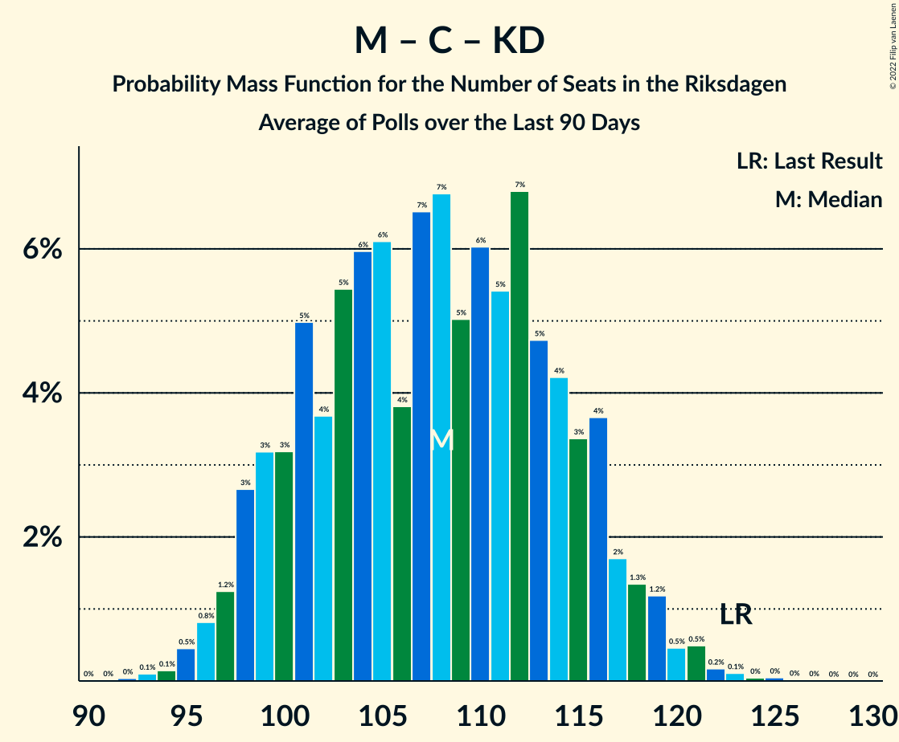

# Poll Average

<a href="#voting-intentions">Voting Intentions</a> | <a href="#seats">Seats</a> | <a href="#coalitions">Coalitions</a> | <a href="#technical-information">Technical Information</a>

## Summary

The table below lists the polls on which the average is based. They are the most recent polls (less than 90 days old) registered and analyzed so far.

| Period     | Polling firm/Commissioner(s) | S | M | SD | C | V | KD | L | MP |
|:----------:|:----------------------------:|:--:|:--:|:--:|:--:|:--:|:--:|:--:|:--:|
| 9 September 2018 | General Election | 28.3%   100 | 19.8%   70 | 17.5%   62 | 8.6%   31 | 8.0%   28 | 6.3%   22 | 5.5%   20 | 4.4%   16 |
| N/A | Poll Average | 22–28%   81–107 | 18–24%   67–89 | 17–27%   62–101 | 5–10%   18–39 | 8–13%   32–50 | 4–8%   17–29 | 2–4%   0–16 | 2–6%   0–20 |
| [12–16 November 2020](2020-11-16-Sentio.html) | Sentio   Nyheter Idag | 20–26%   75–100 | 17–23%   63–85 | 22–28%   82–108 | 4–8%   16–28 | 8–12%   30–46 | 5–8%   17–29 | 2–5%   0–16 | 2–5%   0–18 |
| [2–11 November 2020](2020-11-11-Sifo.html) | Sifo | 25–29%   89–111 | 19–23%   69–85 | 18–22%   66–81 | 6–9%   23–33 | 9–12%   32–44 | 5–7%   17–26 | 2–4%   0–15 | 3–5%   0–20 |
| [12 October–8 November 2020](2020-11-08-Novus.html) | Novus   SVT | 25–28%   92–105 | 21–23%   76–89 | 18–21%   67–78 | 8–10%   29–36 | 10–12%   35–44 | 4–6%   16–22 | 2–3%   0 | 3–5%   0–17 |
| [27 October–4 November 2020](2020-11-04-Demoskop.html) | Demoskop | 22–26%   84–98 | 21–24%   77–92 | 18–22%   68–82 | 8–10%   30–40 | 8–11%   31–40 | 6–8%   22–31 | 2–4%   0 | 3–4%   0–15 |
| [23–26 October 2020](2020-10-26-SKOP.html) | SKOP | 23–29%   87–109 | 19–24%   69–89 | 16–20%   58–77 | 7–11%   28–41 | 10–14%   38–53 | 5–8%   17–28 | 2–5%   0–16 | 2–4%   0–16 |
| [13–25 October 2020](2020-10-25-Ipsos.html) | Ipsos   Dagens Nyheter | 23–27%   82–99 | 19–23%   68–83 | 18–22%   64–79 | 8–11%   28–38 | 9–13%   34–45 | 5–7%   17–26 | 2–4%   0 | 4–6%   14–22 |
| 9 September 2018 | General Election | 28.3%   100 | 19.8%   70 | 17.5%   62 | 8.6%   31 | 8.0%   28 | 6.3%   22 | 5.5%   20 | 4.4%   16 |

Only polls for which at least the sample size has been published are included in the table above.

**Legend:**
+ **Top half of each row:** Voting intentions (95% confidence interval)
+ **Bottom half of each row:** Seat projections for the Riksdagen (95% confidence interval)
+ **S:** Sveriges socialdemokratiska arbetareparti
+ **M:** Moderata samlingspartiet
+ **SD:** Sverigedemokraterna
+ **C:** Centerpartiet
+ **V:** Vänsterpartiet
+ **KD:** Kristdemokraterna
+ **L:** Liberalerna
+ **MP:** Miljöpartiet de gröna
+ **N/A (single party):** Party not included the published results
+ **N/A (entire row):** Calculation for this opinion poll not started yet

## Voting Intentions

### Confidence Intervals

| Party | Last Result | Median | 80% Confidence Interval | 90% Confidence Interval | 95% Confidence Interval | 99% Confidence Interval |
|:-----:|:-----------:|:------:|:-----------------------:|:-----------------------:|:-----------------------:|:-----------------------:|
| <a href="#sveriges-socialdemokratiska-arbetareparti">Sveriges socialdemokratiska arbetareparti</a> | 28.3% | 25.4% | 23.0–27.5% |22.4–28.0% | 21.8–28.5% | 20.6–29.4% |
| <a href="#moderata-samlingspartiet">Moderata samlingspartiet</a> | 19.8% | 21.3% | 19.4–22.8% |18.8–23.2% | 18.3–23.6% | 17.2–24.3% |
| <a href="#sverigedemokraterna">Sverigedemokraterna</a> | 17.5% | 19.8% | 17.9–24.9% |17.2–26.1% | 16.6–26.9% | 15.6–28.2% |
| <a href="#centerpartiet">Centerpartiet</a> | 8.6% | 8.6% | 6.1–9.8% |5.5–10.1% | 5.1–10.4% | 4.5–11.1% |
| <a href="#vänsterpartiet">Vänsterpartiet</a> | 8.0% | 10.5% | 9.1–12.2% |8.8–12.8% | 8.5–13.3% | 8.0–14.2% |
| <a href="#kristdemokraterna">Kristdemokraterna</a> | 6.3% | 5.9% | 4.9–7.1% |4.7–7.4% | 4.5–7.7% | 4.2–8.2% |
| <a href="#liberalerna">Liberalerna</a> | 5.5% | 3.1% | 2.5–3.9% |2.4–4.1% | 2.3–4.4% | 2.1–4.9% |
| <a href="#miljöpartiet-de-gröna">Miljöpartiet de gröna</a> | 4.4% | 3.8% | 2.9–5.0% |2.7–5.4% | 2.5–5.6% | 2.1–6.2% |

### Sveriges socialdemokratiska arbetareparti

*For a full overview of the results for this party, see the [Sveriges socialdemokratiska arbetareparti](party-sverigessocialdemokratiskaarbetareparti.html) page.*

| Voting Intentions | Probability | Accumulated | Special Marks |
|:-----------------:|:-----------:|:-----------:|:-------------:|
| 17.5–18.5% | 0% | 100% |  |
| 18.5–19.5% | 0.1% | 100% |  |
| 19.5–20.5% | 0.4% | 99.9% |  |
| 20.5–21.5% | 1.5% | 99.6% |  |
| 21.5–22.5% | 4% | 98% |  |
| 22.5–23.5% | 10% | 94% |  |
| 23.5–24.5% | 17% | 84% |  |
| 24.5–25.5% | 18% | 67% | Median |
| 25.5–26.5% | 22% | 48% |  |
| 26.5–27.5% | 17% | 26% |  |
| 27.5–28.5% | 7% | 9% | Last Result |
| 28.5–29.5% | 2% | 2% |  |
| 29.5–30.5% | 0.3% | 0.3% |  |
| 30.5–31.5% | 0% | 0% |  |

### Moderata samlingspartiet

*For a full overview of the results for this party, see the [Moderata samlingspartiet](party-moderatasamlingspartiet.html) page.*

| Voting Intentions | Probability | Accumulated | Special Marks |
|:-----------------:|:-----------:|:-----------:|:-------------:|
| 14.5–15.5% | 0% | 100% |  |
| 15.5–16.5% | 0.1% | 100% |  |
| 16.5–17.5% | 0.7% | 99.9% |  |
| 17.5–18.5% | 3% | 99.1% |  |
| 18.5–19.5% | 8% | 96% |  |
| 19.5–20.5% | 17% | 88% | Last Result |
| 20.5–21.5% | 27% | 71% | Median |
| 21.5–22.5% | 28% | 44% |  |
| 22.5–23.5% | 13% | 15% |  |
| 23.5–24.5% | 2% | 3% |  |
| 24.5–25.5% | 0.2% | 0.3% |  |
| 25.5–26.5% | 0% | 0% |  |

### Sverigedemokraterna

*For a full overview of the results for this party, see the [Sverigedemokraterna](party-sverigedemokraterna.html) page.*

| Voting Intentions | Probability | Accumulated | Special Marks |
|:-----------------:|:-----------:|:-----------:|:-------------:|
| 13.5–14.5% | 0% | 100% |  |
| 14.5–15.5% | 0.4% | 100% |  |
| 15.5–16.5% | 2% | 99.6% |  |
| 16.5–17.5% | 5% | 98% |  |
| 17.5–18.5% | 10% | 93% | Last Result |
| 18.5–19.5% | 25% | 83% |  |
| 19.5–20.5% | 27% | 58% | Median |
| 20.5–21.5% | 12% | 31% |  |
| 21.5–22.5% | 3% | 19% |  |
| 22.5–23.5% | 2% | 16% |  |
| 23.5–24.5% | 3% | 15% |  |
| 24.5–25.5% | 4% | 11% |  |
| 25.5–26.5% | 4% | 7% |  |
| 26.5–27.5% | 2% | 3% |  |
| 27.5–28.5% | 0.9% | 1.2% |  |
| 28.5–29.5% | 0.3% | 0.3% |  |
| 29.5–30.5% | 0.1% | 0.1% |  |
| 30.5–31.5% | 0% | 0% |  |

### Centerpartiet

*For a full overview of the results for this party, see the [Centerpartiet](party-centerpartiet.html) page.*

| Voting Intentions | Probability | Accumulated | Special Marks |
|:-----------------:|:-----------:|:-----------:|:-------------:|
| 2.5–3.5% | 0% | 100% |  |
| 3.5–4.5% | 0.7% | 100% |  |
| 4.5–5.5% | 5% | 99.3% |  |
| 5.5–6.5% | 8% | 94% |  |
| 6.5–7.5% | 11% | 86% |  |
| 7.5–8.5% | 25% | 76% |  |
| 8.5–9.5% | 35% | 50% | Last Result, Median |
| 9.5–10.5% | 13% | 15% |  |
| 10.5–11.5% | 2% | 2% |  |
| 11.5–12.5% | 0.1% | 0.1% |  |
| 12.5–13.5% | 0% | 0% |  |

### Vänsterpartiet

*For a full overview of the results for this party, see the [Vänsterpartiet](party-vänsterpartiet.html) page.*

| Voting Intentions | Probability | Accumulated | Special Marks |
|:-----------------:|:-----------:|:-----------:|:-------------:|
| 5.5–6.5% | 0% | 100% |  |
| 6.5–7.5% | 0.1% | 100% |  |
| 7.5–8.5% | 3% | 99.9% | Last Result |
| 8.5–9.5% | 17% | 97% |  |
| 9.5–10.5% | 32% | 81% |  |
| 10.5–11.5% | 29% | 48% | Median |
| 11.5–12.5% | 12% | 19% |  |
| 12.5–13.5% | 5% | 7% |  |
| 13.5–14.5% | 1.4% | 2% |  |
| 14.5–15.5% | 0.2% | 0.2% |  |
| 15.5–16.5% | 0% | 0% |  |

### Kristdemokraterna

*For a full overview of the results for this party, see the [Kristdemokraterna](party-kristdemokraterna.html) page.*

| Voting Intentions | Probability | Accumulated | Special Marks |
|:-----------------:|:-----------:|:-----------:|:-------------:|
| 2.5–3.5% | 0% | 100% |  |
| 3.5–4.5% | 3% | 100% |  |
| 4.5–5.5% | 32% | 97% |  |
| 5.5–6.5% | 40% | 66% | Last Result, Median |
| 6.5–7.5% | 22% | 26% |  |
| 7.5–8.5% | 4% | 4% |  |
| 8.5–9.5% | 0.1% | 0.1% |  |
| 9.5–10.5% | 0% | 0% |  |

### Liberalerna

*For a full overview of the results for this party, see the [Liberalerna](party-liberalerna.html) page.*

| Voting Intentions | Probability | Accumulated | Special Marks |
|:-----------------:|:-----------:|:-----------:|:-------------:|
| 0.5–1.5% | 0% | 100% |  |
| 1.5–2.5% | 10% | 100% |  |
| 2.5–3.5% | 68% | 90% | Median |
| 3.5–4.5% | 20% | 22% |  |
| 4.5–5.5% | 1.3% | 1.4% | Last Result |
| 5.5–6.5% | 0% | 0% |  |
| 6.5–7.5% | 0% | 0% |  |

### Miljöpartiet de gröna

*For a full overview of the results for this party, see the [Miljöpartiet de gröna](party-miljöpartietdegröna.html) page.*

| Voting Intentions | Probability | Accumulated | Special Marks |
|:-----------------:|:-----------:|:-----------:|:-------------:|
| 0.5–1.5% | 0% | 100% |  |
| 1.5–2.5% | 3% | 100% |  |
| 2.5–3.5% | 33% | 97% |  |
| 3.5–4.5% | 44% | 64% | Last Result, Median |
| 4.5–5.5% | 16% | 20% |  |
| 5.5–6.5% | 3% | 3% |  |
| 6.5–7.5% | 0.1% | 0.1% |  |
| 7.5–8.5% | 0% | 0% |  |

## Seats

### Confidence Intervals

| Party | Last Result | Median | 80% Confidence Interval | 90% Confidence Interval | 95% Confidence Interval | 99% Confidence Interval |
|:-----:|:-----------:|:------:|:-----------------------:|:-----------------------:|:-----------------------:|:-----------------------:|
| <a href="#sveriges-socialdemokratiska-arbetareparti">Sveriges socialdemokratiska arbetareparti</a> | 100 | 94 | 85–104 |83–106 | 81–107 | 76–111 |
| <a href="#moderata-samlingspartiet">Moderata samlingspartiet</a> | 70 | 79 | 71–86 |69–88 | 67–89 | 63–92 |
| <a href="#sverigedemokraterna">Sverigedemokraterna</a> | 62 | 74 | 67–93 |64–98 | 62–101 | 58–107 |
| <a href="#centerpartiet">Centerpartiet</a> | 31 | 32 | 23–37 |21–38 | 18–39 | 16–41 |
| <a href="#vänsterpartiet">Vänsterpartiet</a> | 28 | 39 | 34–45 |33–48 | 32–50 | 30–53 |
| <a href="#kristdemokraterna">Kristdemokraterna</a> | 22 | 22 | 18–27 |17–28 | 17–29 | 16–31 |
| <a href="#liberalerna">Liberalerna</a> | 20 | 0 | 0 |0–15 | 0–16 | 0–17 |
| <a href="#miljöpartiet-de-gröna">Miljöpartiet de gröna</a> | 16 | 0 | 0–18 |0–19 | 0–20 | 0–22 |

### Sveriges socialdemokratiska arbetareparti

*For a full overview of the results for this party, see the [Sveriges socialdemokratiska arbetareparti](party-sverigessocialdemokratiskaarbetareparti.html) page.*

| Number of Seats | Probability | Accumulated | Special Marks |
|:---------------:|:-----------:|:-----------:|:-------------:|
| 71 | 0% | 100% |  |
| 72 | 0% | 99.9% |  |
| 73 | 0.1% | 99.9% |  |
| 74 | 0.1% | 99.8% |  |
| 75 | 0.2% | 99.7% |  |
| 76 | 0.2% | 99.6% |  |
| 77 | 0.3% | 99.4% |  |
| 78 | 0.3% | 99.1% |  |
| 79 | 0.5% | 98.7% |  |
| 80 | 0.6% | 98% |  |
| 81 | 0.7% | 98% |  |
| 82 | 1.3% | 97% |  |
| 83 | 1.4% | 96% |  |
| 84 | 2% | 94% |  |
| 85 | 3% | 92% |  |
| 86 | 3% | 89% |  |
| 87 | 3% | 86% |  |
| 88 | 3% | 83% |  |
| 89 | 5% | 80% |  |
| 90 | 6% | 76% |  |
| 91 | 4% | 70% |  |
| 92 | 8% | 66% |  |
| 93 | 6% | 58% |  |
| 94 | 6% | 52% | Median |
| 95 | 6% | 46% |  |
| 96 | 5% | 40% |  |
| 97 | 4% | 35% |  |
| 98 | 4% | 31% |  |
| 99 | 3% | 26% |  |
| 100 | 4% | 24% | Last Result |
| 101 | 4% | 19% |  |
| 102 | 2% | 16% |  |
| 103 | 3% | 13% |  |
| 104 | 2% | 10% |  |
| 105 | 2% | 8% |  |
| 106 | 2% | 6% |  |
| 107 | 2% | 4% |  |
| 108 | 0.8% | 2% |  |
| 109 | 0.5% | 1.4% |  |
| 110 | 0.3% | 0.9% |  |
| 111 | 0.4% | 0.6% |  |
| 112 | 0.1% | 0.2% |  |
| 113 | 0.1% | 0.1% |  |
| 114 | 0% | 0.1% |  |
| 115 | 0% | 0% |  |

### Moderata samlingspartiet

*For a full overview of the results for this party, see the [Moderata samlingspartiet](party-moderatasamlingspartiet.html) page.*

| Number of Seats | Probability | Accumulated | Special Marks |
|:---------------:|:-----------:|:-----------:|:-------------:|
| 59 | 0% | 100% |  |
| 60 | 0% | 99.9% |  |
| 61 | 0.1% | 99.9% |  |
| 62 | 0.1% | 99.8% |  |
| 63 | 0.2% | 99.7% |  |
| 64 | 0.2% | 99.5% |  |
| 65 | 0.5% | 99.2% |  |
| 66 | 0.6% | 98.7% |  |
| 67 | 0.7% | 98% |  |
| 68 | 1.3% | 97% |  |
| 69 | 1.4% | 96% |  |
| 70 | 2% | 95% | Last Result |
| 71 | 3% | 93% |  |
| 72 | 5% | 90% |  |
| 73 | 3% | 84% |  |
| 74 | 5% | 81% |  |
| 75 | 6% | 76% |  |
| 76 | 5% | 70% |  |
| 77 | 8% | 65% |  |
| 78 | 6% | 57% |  |
| 79 | 5% | 52% | Median |
| 80 | 7% | 46% |  |
| 81 | 6% | 39% |  |
| 82 | 6% | 33% |  |
| 83 | 7% | 27% |  |
| 84 | 5% | 20% |  |
| 85 | 4% | 15% |  |
| 86 | 4% | 11% |  |
| 87 | 2% | 7% |  |
| 88 | 1.1% | 5% |  |
| 89 | 2% | 4% |  |
| 90 | 0.5% | 2% |  |
| 91 | 0.5% | 1.1% |  |
| 92 | 0.3% | 0.6% |  |
| 93 | 0.1% | 0.3% |  |
| 94 | 0.1% | 0.2% |  |
| 95 | 0.1% | 0.1% |  |
| 96 | 0% | 0% |  |

### Sverigedemokraterna

*For a full overview of the results for this party, see the [Sverigedemokraterna](party-sverigedemokraterna.html) page.*

| Number of Seats | Probability | Accumulated | Special Marks |
|:---------------:|:-----------:|:-----------:|:-------------:|
| 54 | 0% | 100% |  |
| 55 | 0% | 99.9% |  |
| 56 | 0.1% | 99.9% |  |
| 57 | 0.1% | 99.8% |  |
| 58 | 0.2% | 99.7% |  |
| 59 | 0.2% | 99.5% |  |
| 60 | 0.4% | 99.3% |  |
| 61 | 0.7% | 98.8% |  |
| 62 | 1.0% | 98% | Last Result |
| 63 | 0.8% | 97% |  |
| 64 | 1.3% | 96% |  |
| 65 | 2% | 95% |  |
| 66 | 3% | 93% |  |
| 67 | 3% | 90% |  |
| 68 | 4% | 87% |  |
| 69 | 4% | 83% |  |
| 70 | 8% | 79% |  |
| 71 | 7% | 72% |  |
| 72 | 8% | 64% |  |
| 73 | 6% | 57% |  |
| 74 | 7% | 50% | Median |
| 75 | 7% | 44% |  |
| 76 | 6% | 37% |  |
| 77 | 5% | 31% |  |
| 78 | 4% | 26% |  |
| 79 | 3% | 22% |  |
| 80 | 1.2% | 19% |  |
| 81 | 1.0% | 18% |  |
| 82 | 0.8% | 17% |  |
| 83 | 0.5% | 17% |  |
| 84 | 0.5% | 16% |  |
| 85 | 0.3% | 16% |  |
| 86 | 0.5% | 15% |  |
| 87 | 0.4% | 15% |  |
| 88 | 0.7% | 14% |  |
| 89 | 1.0% | 14% |  |
| 90 | 0.5% | 13% |  |
| 91 | 1.3% | 12% |  |
| 92 | 0.7% | 11% |  |
| 93 | 1.3% | 10% |  |
| 94 | 1.2% | 9% |  |
| 95 | 0.8% | 8% |  |
| 96 | 1.0% | 7% |  |
| 97 | 0.6% | 6% |  |
| 98 | 0.8% | 5% |  |
| 99 | 0.9% | 4% |  |
| 100 | 0.5% | 4% |  |
| 101 | 0.7% | 3% |  |
| 102 | 0.6% | 2% |  |
| 103 | 0.4% | 2% |  |
| 104 | 0.4% | 1.4% |  |
| 105 | 0.3% | 1.0% |  |
| 106 | 0.1% | 0.7% |  |
| 107 | 0.1% | 0.6% |  |
| 108 | 0.1% | 0.4% |  |
| 109 | 0.1% | 0.4% |  |
| 110 | 0% | 0.2% |  |
| 111 | 0.1% | 0.2% |  |
| 112 | 0% | 0.1% |  |
| 113 | 0% | 0.1% |  |
| 114 | 0% | 0% |  |

### Centerpartiet

*For a full overview of the results for this party, see the [Centerpartiet](party-centerpartiet.html) page.*

| Number of Seats | Probability | Accumulated | Special Marks |
|:---------------:|:-----------:|:-----------:|:-------------:|
| 15 | 0.1% | 100% |  |
| 16 | 0.4% | 99.9% |  |
| 17 | 1.1% | 99.5% |  |
| 18 | 1.0% | 98% |  |
| 19 | 0.9% | 97% |  |
| 20 | 1.3% | 96% |  |
| 21 | 1.2% | 95% |  |
| 22 | 2% | 94% |  |
| 23 | 3% | 92% |  |
| 24 | 4% | 90% |  |
| 25 | 3% | 86% |  |
| 26 | 3% | 83% |  |
| 27 | 4% | 81% |  |
| 28 | 4% | 77% |  |
| 29 | 6% | 73% |  |
| 30 | 7% | 68% |  |
| 31 | 8% | 61% | Last Result |
| 32 | 13% | 52% | Median |
| 33 | 10% | 40% |  |
| 34 | 8% | 30% |  |
| 35 | 6% | 22% |  |
| 36 | 5% | 16% |  |
| 37 | 4% | 10% |  |
| 38 | 3% | 6% |  |
| 39 | 2% | 4% |  |
| 40 | 1.0% | 2% |  |
| 41 | 0.5% | 0.9% |  |
| 42 | 0.2% | 0.4% |  |
| 43 | 0.1% | 0.2% |  |
| 44 | 0% | 0.1% |  |
| 45 | 0% | 0% |  |

### Vänsterpartiet

*For a full overview of the results for this party, see the [Vänsterpartiet](party-vänsterpartiet.html) page.*

| Number of Seats | Probability | Accumulated | Special Marks |
|:---------------:|:-----------:|:-----------:|:-------------:|
| 27 | 0% | 100% |  |
| 28 | 0.1% | 99.9% | Last Result |
| 29 | 0.3% | 99.8% |  |
| 30 | 0.5% | 99.5% |  |
| 31 | 1.0% | 99.0% |  |
| 32 | 2% | 98% |  |
| 33 | 4% | 96% |  |
| 34 | 5% | 93% |  |
| 35 | 7% | 87% |  |
| 36 | 8% | 80% |  |
| 37 | 8% | 72% |  |
| 38 | 10% | 63% |  |
| 39 | 7% | 54% | Median |
| 40 | 12% | 47% |  |
| 41 | 11% | 35% |  |
| 42 | 5% | 24% |  |
| 43 | 5% | 19% |  |
| 44 | 3% | 14% |  |
| 45 | 2% | 11% |  |
| 46 | 2% | 9% |  |
| 47 | 1.4% | 7% |  |
| 48 | 1.3% | 5% |  |
| 49 | 1.4% | 4% |  |
| 50 | 0.7% | 3% |  |
| 51 | 0.9% | 2% |  |
| 52 | 0.2% | 1.0% |  |
| 53 | 0.3% | 0.7% |  |
| 54 | 0.2% | 0.4% |  |
| 55 | 0.1% | 0.2% |  |
| 56 | 0.1% | 0.1% |  |
| 57 | 0% | 0.1% |  |
| 58 | 0% | 0.1% |  |
| 59 | 0% | 0% |  |

### Kristdemokraterna

*For a full overview of the results for this party, see the [Kristdemokraterna](party-kristdemokraterna.html) page.*

| Number of Seats | Probability | Accumulated | Special Marks |
|:---------------:|:-----------:|:-----------:|:-------------:|
| 0 | 0.1% | 100% |  |
| 1 | 0% | 99.9% |  |
| 2 | 0% | 99.9% |  |
| 3 | 0% | 99.9% |  |
| 4 | 0% | 99.9% |  |
| 5 | 0% | 99.9% |  |
| 6 | 0% | 99.9% |  |
| 7 | 0% | 99.9% |  |
| 8 | 0% | 99.9% |  |
| 9 | 0% | 99.9% |  |
| 10 | 0% | 99.9% |  |
| 11 | 0% | 99.9% |  |
| 12 | 0% | 99.9% |  |
| 13 | 0% | 99.9% |  |
| 14 | 0% | 99.9% |  |
| 15 | 0.2% | 99.9% |  |
| 16 | 1.2% | 99.7% |  |
| 17 | 4% | 98% |  |
| 18 | 7% | 94% |  |
| 19 | 11% | 87% |  |
| 20 | 10% | 76% |  |
| 21 | 12% | 65% |  |
| 22 | 10% | 53% | Last Result, Median |
| 23 | 9% | 43% |  |
| 24 | 9% | 34% |  |
| 25 | 8% | 25% |  |
| 26 | 6% | 17% |  |
| 27 | 4% | 11% |  |
| 28 | 4% | 7% |  |
| 29 | 2% | 4% |  |
| 30 | 1.0% | 2% |  |
| 31 | 0.4% | 0.7% |  |
| 32 | 0.2% | 0.3% |  |
| 33 | 0.1% | 0.1% |  |
| 34 | 0% | 0% |  |

### Liberalerna

*For a full overview of the results for this party, see the [Liberalerna](party-liberalerna.html) page.*

| Number of Seats | Probability | Accumulated | Special Marks |
|:---------------:|:-----------:|:-----------:|:-------------:|
| 0 | 92% | 100% | Median |
| 1 | 0% | 8% |  |
| 2 | 0% | 8% |  |
| 3 | 0% | 8% |  |
| 4 | 0% | 8% |  |
| 5 | 0% | 8% |  |
| 6 | 0% | 8% |  |
| 7 | 0% | 8% |  |
| 8 | 0% | 8% |  |
| 9 | 0% | 8% |  |
| 10 | 0% | 8% |  |
| 11 | 0% | 8% |  |
| 12 | 0% | 8% |  |
| 13 | 0% | 8% |  |
| 14 | 0.6% | 8% |  |
| 15 | 5% | 7% |  |
| 16 | 2% | 3% |  |
| 17 | 0.3% | 0.7% |  |
| 18 | 0.1% | 0.5% |  |
| 19 | 0.1% | 0.3% |  |
| 20 | 0.2% | 0.2% | Last Result |
| 21 | 0% | 0% |  |

### Miljöpartiet de gröna

*For a full overview of the results for this party, see the [Miljöpartiet de gröna](party-miljöpartietdegröna.html) page.*

| Number of Seats | Probability | Accumulated | Special Marks |
|:---------------:|:-----------:|:-----------:|:-------------:|
| 0 | 62% | 100% | Median |
| 1 | 0% | 38% |  |
| 2 | 0% | 38% |  |
| 3 | 0% | 38% |  |
| 4 | 0% | 38% |  |
| 5 | 0% | 38% |  |
| 6 | 0% | 38% |  |
| 7 | 0% | 38% |  |
| 8 | 0% | 38% |  |
| 9 | 0% | 38% |  |
| 10 | 0% | 38% |  |
| 11 | 0% | 38% |  |
| 12 | 0% | 38% |  |
| 13 | 0% | 38% |  |
| 14 | 0.3% | 38% |  |
| 15 | 10% | 38% |  |
| 16 | 8% | 28% | Last Result |
| 17 | 6% | 20% |  |
| 18 | 6% | 14% |  |
| 19 | 4% | 8% |  |
| 20 | 2% | 3% |  |
| 21 | 1.0% | 2% |  |
| 22 | 0.6% | 0.8% |  |
| 23 | 0.1% | 0.2% |  |
| 24 | 0.1% | 0.1% |  |
| 25 | 0% | 0% |  |

## Coalitions

### Confidence Intervals

| Coalition | Last Result | Median | Majority? | 80% Confidence Interval | 90% Confidence Interval | 95% Confidence Interval | 99% Confidence Interval |
|:---------:|:-----------:|:------:|:---------:|:-----------------------:|:-----------------------:|:-----------------------:|:-----------------------:|
| Sveriges socialdemokratiska arbetareparti – Moderata samlingspartiet – Centerpartiet | 201 | 206 | 98% | 186–216 | 180–219 | 175–220 | 167–224 |
| Moderata samlingspartiet – Sverigedemokraterna – Kristdemokraterna | 154 | 175 | 51% | 165–192 | 162–196 | 160–200 | 155–207 |
| Sveriges socialdemokratiska arbetareparti – Centerpartiet – Vänsterpartiet – Liberalerna – Miljöpartiet de gröna | 195 | 174 | 49% | 156–184 | 150–187 | 145–189 | 139–194 |
| Sveriges socialdemokratiska arbetareparti – Moderata samlingspartiet | 170 | 174 | 46% | 161–184 | 157–186 | 152–188 | 146–191 |
| Moderata samlingspartiet – Sverigedemokraterna | 132 | 153 | 4% | 143–167 | 141–173 | 139–177 | 134–184 |
| Sveriges socialdemokratiska arbetareparti – Vänsterpartiet – Miljöpartiet de gröna | 144 | 142 | 0% | 125–152 | 121–154 | 118–156 | 113–161 |
| Sveriges socialdemokratiska arbetareparti – Vänsterpartiet | 128 | 133 | 0% | 122–145 | 120–148 | 117–151 | 111–155 |
| Moderata samlingspartiet – Centerpartiet – Kristdemokraterna – Liberalerna | 143 | 132 | 0% | 121–146 | 118–149 | 115–151 | 108–155 |
| Moderata samlingspartiet – Centerpartiet – Kristdemokraterna | 123 | 131 | 0% | 119–145 | 115–148 | 111–151 | 105–154 |
| Sveriges socialdemokratiska arbetareparti – Centerpartiet – Liberalerna – Miljöpartiet de gröna | 167 | 134 | 0% | 119–144 | 113–147 | 107–149 | 102–153 |
| Moderata samlingspartiet – Centerpartiet – Liberalerna | 121 | 111 | 0% | 100–121 | 96–123 | 92–126 | 86–130 |
| Moderata samlingspartiet – Centerpartiet | 101 | 110 | 0% | 98–120 | 93–122 | 89–124 | 84–128 |
| Sveriges socialdemokratiska arbetareparti – Miljöpartiet de gröna | 116 | 101 | 0% | 88–112 | 85–115 | 82–118 | 77–123 |

### Sveriges socialdemokratiska arbetareparti – Moderata samlingspartiet – Centerpartiet

| Number of Seats | Probability | Accumulated | Special Marks |
|:---------------:|:-----------:|:-----------:|:-------------:|
| 159 | 0% | 100% |  |
| 160 | 0% | 99.9% |  |
| 161 | 0.1% | 99.9% |  |
| 162 | 0% | 99.9% |  |
| 163 | 0% | 99.8% |  |
| 164 | 0.1% | 99.8% |  |
| 165 | 0.1% | 99.8% |  |
| 166 | 0.1% | 99.7% |  |
| 167 | 0.1% | 99.5% |  |
| 168 | 0.1% | 99.4% |  |
| 169 | 0.2% | 99.4% |  |
| 170 | 0.2% | 99.1% |  |
| 171 | 0.3% | 98.9% |  |
| 172 | 0.3% | 98.6% |  |
| 173 | 0.3% | 98% |  |
| 174 | 0.4% | 98% |  |
| 175 | 0.4% | 98% | Majority |
| 176 | 0.6% | 97% |  |
| 177 | 0.5% | 97% |  |
| 178 | 0.7% | 96% |  |
| 179 | 0.5% | 95% |  |
| 180 | 1.1% | 95% |  |
| 181 | 0.4% | 94% |  |
| 182 | 0.8% | 93% |  |
| 183 | 0.8% | 93% |  |
| 184 | 0.6% | 92% |  |
| 185 | 0.9% | 91% |  |
| 186 | 0.5% | 90% |  |
| 187 | 0.8% | 90% |  |
| 188 | 0.8% | 89% |  |
| 189 | 0.8% | 88% |  |
| 190 | 0.6% | 88% |  |
| 191 | 1.1% | 87% |  |
| 192 | 1.4% | 86% |  |
| 193 | 1.1% | 84% |  |
| 194 | 2% | 83% |  |
| 195 | 3% | 81% |  |
| 196 | 4% | 79% |  |
| 197 | 4% | 75% |  |
| 198 | 2% | 71% |  |
| 199 | 3% | 69% |  |
| 200 | 2% | 66% |  |
| 201 | 3% | 65% | Last Result |
| 202 | 2% | 62% |  |
| 203 | 2% | 60% |  |
| 204 | 3% | 58% |  |
| 205 | 3% | 54% | Median |
| 206 | 4% | 51% |  |
| 207 | 3% | 47% |  |
| 208 | 4% | 44% |  |
| 209 | 3% | 41% |  |
| 210 | 5% | 37% |  |
| 211 | 3% | 33% |  |
| 212 | 4% | 30% |  |
| 213 | 3% | 26% |  |
| 214 | 5% | 23% |  |
| 215 | 4% | 17% |  |
| 216 | 3% | 13% |  |
| 217 | 2% | 10% |  |
| 218 | 3% | 8% |  |
| 219 | 2% | 5% |  |
| 220 | 1.3% | 3% |  |
| 221 | 0.7% | 2% |  |
| 222 | 0.7% | 1.5% |  |
| 223 | 0.3% | 0.8% |  |
| 224 | 0.2% | 0.5% |  |
| 225 | 0.1% | 0.3% |  |
| 226 | 0.1% | 0.2% |  |
| 227 | 0.1% | 0.1% |  |
| 228 | 0% | 0.1% |  |
| 229 | 0% | 0% |  |

### Moderata samlingspartiet – Sverigedemokraterna – Kristdemokraterna

| Number of Seats | Probability | Accumulated | Special Marks |
|:---------------:|:-----------:|:-----------:|:-------------:|
| 149 | 0% | 100% |  |
| 150 | 0% | 99.9% |  |
| 151 | 0.1% | 99.9% |  |
| 152 | 0.1% | 99.8% |  |
| 153 | 0.1% | 99.8% |  |
| 154 | 0.1% | 99.7% | Last Result |
| 155 | 0.1% | 99.6% |  |
| 156 | 0.2% | 99.5% |  |
| 157 | 0.3% | 99.3% |  |
| 158 | 0.3% | 98.9% |  |
| 159 | 0.7% | 98.6% |  |
| 160 | 0.9% | 98% |  |
| 161 | 1.4% | 97% |  |
| 162 | 1.2% | 96% |  |
| 163 | 1.5% | 94% |  |
| 164 | 3% | 93% |  |
| 165 | 3% | 90% |  |
| 166 | 4% | 87% |  |
| 167 | 4% | 83% |  |
| 168 | 4% | 79% |  |
| 169 | 4% | 75% |  |
| 170 | 4% | 71% |  |
| 171 | 5% | 67% |  |
| 172 | 4% | 63% |  |
| 173 | 4% | 58% |  |
| 174 | 4% | 55% |  |
| 175 | 4% | 51% | Median, Majority |
| 176 | 3% | 47% |  |
| 177 | 4% | 44% |  |
| 178 | 3% | 40% |  |
| 179 | 3% | 37% |  |
| 180 | 2% | 34% |  |
| 181 | 2% | 32% |  |
| 182 | 2% | 30% |  |
| 183 | 2% | 28% |  |
| 184 | 3% | 26% |  |
| 185 | 1.4% | 23% |  |
| 186 | 2% | 22% |  |
| 187 | 2% | 20% |  |
| 188 | 2% | 18% |  |
| 189 | 2% | 16% |  |
| 190 | 2% | 14% |  |
| 191 | 2% | 12% |  |
| 192 | 2% | 10% |  |
| 193 | 0.9% | 8% |  |
| 194 | 1.0% | 7% |  |
| 195 | 0.6% | 7% |  |
| 196 | 1.3% | 6% |  |
| 197 | 0.4% | 5% |  |
| 198 | 0.7% | 4% |  |
| 199 | 0.9% | 4% |  |
| 200 | 0.4% | 3% |  |
| 201 | 0.4% | 2% |  |
| 202 | 0.3% | 2% |  |
| 203 | 0.1% | 1.5% |  |
| 204 | 0.4% | 1.4% |  |
| 205 | 0.3% | 1.0% |  |
| 206 | 0.1% | 0.7% |  |
| 207 | 0.2% | 0.6% |  |
| 208 | 0.1% | 0.4% |  |
| 209 | 0% | 0.3% |  |
| 210 | 0% | 0.2% |  |
| 211 | 0.1% | 0.2% |  |
| 212 | 0% | 0.1% |  |
| 213 | 0% | 0.1% |  |
| 214 | 0% | 0.1% |  |
| 215 | 0% | 0% |  |

### Sveriges socialdemokratiska arbetareparti – Centerpartiet – Vänsterpartiet – Liberalerna – Miljöpartiet de gröna

| Number of Seats | Probability | Accumulated | Special Marks |
|:---------------:|:-----------:|:-----------:|:-------------:|
| 131 | 0% | 100% |  |
| 132 | 0% | 99.9% |  |
| 133 | 0% | 99.9% |  |
| 134 | 0% | 99.9% |  |
| 135 | 0.1% | 99.8% |  |
| 136 | 0% | 99.7% |  |
| 137 | 0% | 99.7% |  |
| 138 | 0.2% | 99.7% |  |
| 139 | 0.3% | 99.5% |  |
| 140 | 0.3% | 99.2% |  |
| 141 | 0.2% | 98.9% |  |
| 142 | 0.3% | 98.7% |  |
| 143 | 0.3% | 98% |  |
| 144 | 0.3% | 98% |  |
| 145 | 0.6% | 98% |  |
| 146 | 0.2% | 97% |  |
| 147 | 0.4% | 97% |  |
| 148 | 0.6% | 97% |  |
| 149 | 0.6% | 96% |  |
| 150 | 1.0% | 96% |  |
| 151 | 0.8% | 95% |  |
| 152 | 0.4% | 94% |  |
| 153 | 1.5% | 93% |  |
| 154 | 0.6% | 92% |  |
| 155 | 0.7% | 91% |  |
| 156 | 0.8% | 90% |  |
| 157 | 2% | 90% |  |
| 158 | 2% | 88% |  |
| 159 | 2% | 86% |  |
| 160 | 2% | 84% |  |
| 161 | 2% | 82% |  |
| 162 | 2% | 80% |  |
| 163 | 2% | 78% |  |
| 164 | 1.4% | 76% |  |
| 165 | 2% | 75% | Median |
| 166 | 2% | 73% |  |
| 167 | 2% | 71% |  |
| 168 | 2% | 69% |  |
| 169 | 2% | 67% |  |
| 170 | 3% | 65% |  |
| 171 | 3% | 62% |  |
| 172 | 4% | 59% |  |
| 173 | 3% | 55% |  |
| 174 | 4% | 52% |  |
| 175 | 4% | 49% | Majority |
| 176 | 3% | 45% |  |
| 177 | 4% | 41% |  |
| 178 | 5% | 37% |  |
| 179 | 4% | 32% |  |
| 180 | 4% | 29% |  |
| 181 | 4% | 25% |  |
| 182 | 4% | 21% |  |
| 183 | 4% | 17% |  |
| 184 | 3% | 13% |  |
| 185 | 3% | 10% |  |
| 186 | 1.5% | 7% |  |
| 187 | 1.2% | 5% |  |
| 188 | 1.4% | 4% |  |
| 189 | 0.9% | 3% |  |
| 190 | 0.7% | 2% |  |
| 191 | 0.3% | 1.4% |  |
| 192 | 0.3% | 1.1% |  |
| 193 | 0.2% | 0.7% |  |
| 194 | 0.1% | 0.5% |  |
| 195 | 0.1% | 0.4% | Last Result |
| 196 | 0.1% | 0.3% |  |
| 197 | 0.1% | 0.2% |  |
| 198 | 0.1% | 0.2% |  |
| 199 | 0% | 0.1% |  |
| 200 | 0% | 0.1% |  |
| 201 | 0% | 0% |  |

### Sveriges socialdemokratiska arbetareparti – Moderata samlingspartiet

| Number of Seats | Probability | Accumulated | Special Marks |
|:---------------:|:-----------:|:-----------:|:-------------:|
| 139 | 0% | 100% |  |
| 140 | 0% | 99.9% |  |
| 141 | 0.1% | 99.9% |  |
| 142 | 0% | 99.8% |  |
| 143 | 0% | 99.8% |  |
| 144 | 0.1% | 99.7% |  |
| 145 | 0.1% | 99.7% |  |
| 146 | 0.2% | 99.6% |  |
| 147 | 0.2% | 99.4% |  |
| 148 | 0.1% | 99.2% |  |
| 149 | 0.3% | 99.1% |  |
| 150 | 0.3% | 98.8% |  |
| 151 | 0.4% | 98% |  |
| 152 | 0.6% | 98% |  |
| 153 | 0.5% | 97% |  |
| 154 | 0.6% | 97% |  |
| 155 | 0.5% | 96% |  |
| 156 | 0.7% | 96% |  |
| 157 | 0.9% | 95% |  |
| 158 | 0.9% | 94% |  |
| 159 | 1.4% | 93% |  |
| 160 | 1.2% | 92% |  |
| 161 | 3% | 91% |  |
| 162 | 2% | 88% |  |
| 163 | 2% | 87% |  |
| 164 | 4% | 84% |  |
| 165 | 2% | 81% |  |
| 166 | 4% | 79% |  |
| 167 | 4% | 75% |  |
| 168 | 3% | 71% |  |
| 169 | 2% | 68% |  |
| 170 | 4% | 66% | Last Result |
| 171 | 4% | 62% |  |
| 172 | 4% | 58% |  |
| 173 | 4% | 54% | Median |
| 174 | 5% | 51% |  |
| 175 | 4% | 46% | Majority |
| 176 | 4% | 41% |  |
| 177 | 4% | 37% |  |
| 178 | 4% | 34% |  |
| 179 | 4% | 30% |  |
| 180 | 4% | 26% |  |
| 181 | 3% | 22% |  |
| 182 | 4% | 19% |  |
| 183 | 3% | 15% |  |
| 184 | 3% | 12% |  |
| 185 | 3% | 9% |  |
| 186 | 2% | 7% |  |
| 187 | 1.0% | 4% |  |
| 188 | 1.5% | 3% |  |
| 189 | 0.6% | 2% |  |
| 190 | 0.4% | 1.2% |  |
| 191 | 0.3% | 0.8% |  |
| 192 | 0.2% | 0.5% |  |
| 193 | 0.1% | 0.3% |  |
| 194 | 0% | 0.1% |  |
| 195 | 0% | 0.1% |  |
| 196 | 0% | 0% |  |

### Moderata samlingspartiet – Sverigedemokraterna

| Number of Seats | Probability | Accumulated | Special Marks |
|:---------------:|:-----------:|:-----------:|:-------------:|
| 129 | 0% | 100% |  |
| 130 | 0.1% | 99.9% |  |
| 131 | 0.1% | 99.8% |  |
| 132 | 0.1% | 99.8% | Last Result |
| 133 | 0.1% | 99.7% |  |
| 134 | 0.2% | 99.5% |  |
| 135 | 0.3% | 99.4% |  |
| 136 | 0.4% | 99.1% |  |
| 137 | 0.4% | 98.7% |  |
| 138 | 0.6% | 98% |  |
| 139 | 0.6% | 98% |  |
| 140 | 1.4% | 97% |  |
| 141 | 2% | 96% |  |
| 142 | 4% | 94% |  |
| 143 | 3% | 90% |  |
| 144 | 2% | 87% |  |
| 145 | 3% | 85% |  |
| 146 | 3% | 81% |  |
| 147 | 3% | 78% |  |
| 148 | 3% | 75% |  |
| 149 | 5% | 72% |  |
| 150 | 6% | 68% |  |
| 151 | 4% | 62% |  |
| 152 | 5% | 58% |  |
| 153 | 3% | 53% | Median |
| 154 | 4% | 50% |  |
| 155 | 4% | 46% |  |
| 156 | 4% | 42% |  |
| 157 | 5% | 38% |  |
| 158 | 4% | 34% |  |
| 159 | 3% | 30% |  |
| 160 | 3% | 27% |  |
| 161 | 3% | 24% |  |
| 162 | 3% | 21% |  |
| 163 | 2% | 18% |  |
| 164 | 2% | 16% |  |
| 165 | 2% | 14% |  |
| 166 | 2% | 13% |  |
| 167 | 1.3% | 11% |  |
| 168 | 1.1% | 10% |  |
| 169 | 0.9% | 9% |  |
| 170 | 0.7% | 8% |  |
| 171 | 0.8% | 7% |  |
| 172 | 1.0% | 6% |  |
| 173 | 0.6% | 5% |  |
| 174 | 0.7% | 5% |  |
| 175 | 0.5% | 4% | Majority |
| 176 | 0.4% | 4% |  |
| 177 | 0.6% | 3% |  |
| 178 | 0.4% | 2% |  |
| 179 | 0.6% | 2% |  |
| 180 | 0.4% | 1.5% |  |
| 181 | 0.2% | 1.1% |  |
| 182 | 0.2% | 0.9% |  |
| 183 | 0.1% | 0.7% |  |
| 184 | 0.1% | 0.5% |  |
| 185 | 0.1% | 0.4% |  |
| 186 | 0.1% | 0.3% |  |
| 187 | 0% | 0.2% |  |
| 188 | 0.1% | 0.2% |  |
| 189 | 0.1% | 0.1% |  |
| 190 | 0% | 0.1% |  |
| 191 | 0% | 0% |  |

### Sveriges socialdemokratiska arbetareparti – Vänsterpartiet – Miljöpartiet de gröna

| Number of Seats | Probability | Accumulated | Special Marks |
|:---------------:|:-----------:|:-----------:|:-------------:|
| 107 | 0% | 100% |  |
| 108 | 0% | 99.9% |  |
| 109 | 0.1% | 99.9% |  |
| 110 | 0.1% | 99.9% |  |
| 111 | 0.1% | 99.8% |  |
| 112 | 0.1% | 99.7% |  |
| 113 | 0.1% | 99.6% |  |
| 114 | 0.2% | 99.5% |  |
| 115 | 0.3% | 99.3% |  |
| 116 | 0.5% | 99.0% |  |
| 117 | 0.4% | 98% |  |
| 118 | 0.7% | 98% |  |
| 119 | 0.6% | 97% |  |
| 120 | 0.8% | 97% |  |
| 121 | 1.2% | 96% |  |
| 122 | 1.3% | 95% |  |
| 123 | 1.2% | 93% |  |
| 124 | 2% | 92% |  |
| 125 | 2% | 90% |  |
| 126 | 3% | 88% |  |
| 127 | 2% | 85% |  |
| 128 | 2% | 83% |  |
| 129 | 2% | 81% |  |
| 130 | 2% | 79% |  |
| 131 | 2% | 77% |  |
| 132 | 1.2% | 75% |  |
| 133 | 1.3% | 73% | Median |
| 134 | 1.3% | 72% |  |
| 135 | 2% | 71% |  |
| 136 | 2% | 69% |  |
| 137 | 2% | 67% |  |
| 138 | 4% | 65% |  |
| 139 | 3% | 61% |  |
| 140 | 3% | 58% |  |
| 141 | 3% | 55% |  |
| 142 | 5% | 52% |  |
| 143 | 4% | 47% |  |
| 144 | 4% | 43% | Last Result |
| 145 | 4% | 38% |  |
| 146 | 4% | 34% |  |
| 147 | 4% | 30% |  |
| 148 | 3% | 27% |  |
| 149 | 3% | 23% |  |
| 150 | 4% | 20% |  |
| 151 | 5% | 16% |  |
| 152 | 3% | 11% |  |
| 153 | 2% | 9% |  |
| 154 | 2% | 7% |  |
| 155 | 1.3% | 5% |  |
| 156 | 1.2% | 4% |  |
| 157 | 0.5% | 2% |  |
| 158 | 0.6% | 2% |  |
| 159 | 0.3% | 1.3% |  |
| 160 | 0.3% | 1.0% |  |
| 161 | 0.2% | 0.7% |  |
| 162 | 0.2% | 0.4% |  |
| 163 | 0.1% | 0.2% |  |
| 164 | 0.1% | 0.1% |  |
| 165 | 0% | 0.1% |  |
| 166 | 0% | 0% |  |

### Sveriges socialdemokratiska arbetareparti – Vänsterpartiet

| Number of Seats | Probability | Accumulated | Special Marks |
|:---------------:|:-----------:|:-----------:|:-------------:|
| 105 | 0% | 100% |  |
| 106 | 0% | 99.9% |  |
| 107 | 0% | 99.9% |  |
| 108 | 0.1% | 99.9% |  |
| 109 | 0.1% | 99.8% |  |
| 110 | 0.1% | 99.7% |  |
| 111 | 0.2% | 99.6% |  |
| 112 | 0.2% | 99.4% |  |
| 113 | 0.2% | 99.2% |  |
| 114 | 0.3% | 99.0% |  |
| 115 | 0.4% | 98.6% |  |
| 116 | 0.6% | 98% |  |
| 117 | 0.7% | 98% |  |
| 118 | 1.0% | 97% |  |
| 119 | 0.9% | 96% |  |
| 120 | 2% | 95% |  |
| 121 | 2% | 93% |  |
| 122 | 2% | 92% |  |
| 123 | 3% | 89% |  |
| 124 | 3% | 86% |  |
| 125 | 3% | 83% |  |
| 126 | 4% | 80% |  |
| 127 | 3% | 76% |  |
| 128 | 4% | 73% | Last Result |
| 129 | 3% | 69% |  |
| 130 | 6% | 66% |  |
| 131 | 4% | 60% |  |
| 132 | 4% | 56% |  |
| 133 | 5% | 52% | Median |
| 134 | 4% | 47% |  |
| 135 | 4% | 43% |  |
| 136 | 3% | 39% |  |
| 137 | 3% | 36% |  |
| 138 | 3% | 34% |  |
| 139 | 3% | 30% |  |
| 140 | 3% | 27% |  |
| 141 | 2% | 24% |  |
| 142 | 4% | 22% |  |
| 143 | 3% | 17% |  |
| 144 | 3% | 14% |  |
| 145 | 3% | 11% |  |
| 146 | 2% | 9% |  |
| 147 | 1.4% | 7% |  |
| 148 | 1.2% | 5% |  |
| 149 | 0.7% | 4% |  |
| 150 | 0.6% | 3% |  |
| 151 | 1.0% | 3% |  |
| 152 | 0.4% | 2% |  |
| 153 | 0.6% | 1.4% |  |
| 154 | 0.3% | 0.8% |  |
| 155 | 0.2% | 0.5% |  |
| 156 | 0.2% | 0.4% |  |
| 157 | 0% | 0.2% |  |
| 158 | 0.1% | 0.2% |  |
| 159 | 0% | 0.1% |  |
| 160 | 0% | 0.1% |  |
| 161 | 0% | 0% |  |

### Moderata samlingspartiet – Centerpartiet – Kristdemokraterna – Liberalerna

| Number of Seats | Probability | Accumulated | Special Marks |
|:---------------:|:-----------:|:-----------:|:-------------:|
| 101 | 0% | 100% |  |
| 102 | 0% | 99.9% |  |
| 103 | 0% | 99.9% |  |
| 104 | 0% | 99.9% |  |
| 105 | 0.1% | 99.8% |  |
| 106 | 0.1% | 99.8% |  |
| 107 | 0.2% | 99.7% |  |
| 108 | 0.1% | 99.5% |  |
| 109 | 0.2% | 99.4% |  |
| 110 | 0.3% | 99.2% |  |
| 111 | 0.3% | 98.9% |  |
| 112 | 0.2% | 98.7% |  |
| 113 | 0.5% | 98% |  |
| 114 | 0.5% | 98% |  |
| 115 | 0.5% | 98% |  |
| 116 | 0.6% | 97% |  |
| 117 | 0.7% | 96% |  |
| 118 | 1.1% | 96% |  |
| 119 | 1.4% | 95% |  |
| 120 | 2% | 93% |  |
| 121 | 2% | 92% |  |
| 122 | 3% | 90% |  |
| 123 | 2% | 87% |  |
| 124 | 2% | 85% |  |
| 125 | 3% | 83% |  |
| 126 | 3% | 80% |  |
| 127 | 5% | 77% |  |
| 128 | 5% | 72% |  |
| 129 | 4% | 66% |  |
| 130 | 5% | 63% |  |
| 131 | 4% | 57% |  |
| 132 | 5% | 54% |  |
| 133 | 5% | 49% | Median |
| 134 | 4% | 44% |  |
| 135 | 5% | 40% |  |
| 136 | 4% | 35% |  |
| 137 | 3% | 31% |  |
| 138 | 3% | 28% |  |
| 139 | 3% | 26% |  |
| 140 | 2% | 23% |  |
| 141 | 2% | 21% |  |
| 142 | 2% | 19% |  |
| 143 | 2% | 17% | Last Result |
| 144 | 2% | 15% |  |
| 145 | 2% | 13% |  |
| 146 | 2% | 11% |  |
| 147 | 2% | 9% |  |
| 148 | 2% | 7% |  |
| 149 | 1.4% | 5% |  |
| 150 | 0.8% | 4% |  |
| 151 | 1.1% | 3% |  |
| 152 | 0.7% | 2% |  |
| 153 | 0.6% | 1.5% |  |
| 154 | 0.3% | 0.9% |  |
| 155 | 0.2% | 0.6% |  |
| 156 | 0.2% | 0.4% |  |
| 157 | 0.1% | 0.2% |  |
| 158 | 0.1% | 0.1% |  |
| 159 | 0% | 0.1% |  |
| 160 | 0% | 0.1% |  |
| 161 | 0% | 0% |  |

### Moderata samlingspartiet – Centerpartiet – Kristdemokraterna

| Number of Seats | Probability | Accumulated | Special Marks |
|:---------------:|:-----------:|:-----------:|:-------------:|
| 99 | 0% | 100% |  |
| 100 | 0% | 99.9% |  |
| 101 | 0.1% | 99.9% |  |
| 102 | 0.1% | 99.9% |  |
| 103 | 0.1% | 99.8% |  |
| 104 | 0.1% | 99.7% |  |
| 105 | 0.1% | 99.6% |  |
| 106 | 0.2% | 99.5% |  |
| 107 | 0.3% | 99.3% |  |
| 108 | 0.3% | 98.9% |  |
| 109 | 0.3% | 98.7% |  |
| 110 | 0.5% | 98% |  |
| 111 | 0.5% | 98% |  |
| 112 | 0.6% | 97% |  |
| 113 | 0.6% | 97% |  |
| 114 | 0.8% | 96% |  |
| 115 | 0.6% | 95% |  |
| 116 | 0.9% | 95% |  |
| 117 | 1.0% | 94% |  |
| 118 | 1.4% | 93% |  |
| 119 | 2% | 91% |  |
| 120 | 2% | 90% |  |
| 121 | 2% | 88% |  |
| 122 | 3% | 86% |  |
| 123 | 2% | 83% | Last Result |
| 124 | 2% | 81% |  |
| 125 | 3% | 78% |  |
| 126 | 3% | 76% |  |
| 127 | 5% | 72% |  |
| 128 | 5% | 67% |  |
| 129 | 4% | 62% |  |
| 130 | 5% | 58% |  |
| 131 | 3% | 53% |  |
| 132 | 5% | 49% |  |
| 133 | 5% | 45% | Median |
| 134 | 4% | 40% |  |
| 135 | 5% | 36% |  |
| 136 | 4% | 31% |  |
| 137 | 3% | 28% |  |
| 138 | 2% | 25% |  |
| 139 | 3% | 23% |  |
| 140 | 2% | 20% |  |
| 141 | 2% | 18% |  |
| 142 | 2% | 17% |  |
| 143 | 2% | 15% |  |
| 144 | 2% | 13% |  |
| 145 | 2% | 11% |  |
| 146 | 2% | 10% |  |
| 147 | 1.4% | 7% |  |
| 148 | 2% | 6% |  |
| 149 | 1.3% | 5% |  |
| 150 | 0.7% | 3% |  |
| 151 | 1.0% | 3% |  |
| 152 | 0.6% | 2% |  |
| 153 | 0.5% | 1.0% |  |
| 154 | 0.2% | 0.5% |  |
| 155 | 0.2% | 0.3% |  |
| 156 | 0.1% | 0.2% |  |
| 157 | 0% | 0.1% |  |
| 158 | 0% | 0% |  |

### Sveriges socialdemokratiska arbetareparti – Centerpartiet – Liberalerna – Miljöpartiet de gröna

| Number of Seats | Probability | Accumulated | Special Marks |
|:---------------:|:-----------:|:-----------:|:-------------:|
| 94 | 0% | 100% |  |
| 95 | 0% | 99.9% |  |
| 96 | 0% | 99.9% |  |
| 97 | 0.1% | 99.9% |  |
| 98 | 0% | 99.8% |  |
| 99 | 0.1% | 99.8% |  |
| 100 | 0.1% | 99.8% |  |
| 101 | 0.2% | 99.7% |  |
| 102 | 0.2% | 99.5% |  |
| 103 | 0.4% | 99.3% |  |
| 104 | 0.2% | 99.0% |  |
| 105 | 0.5% | 98.7% |  |
| 106 | 0.5% | 98% |  |
| 107 | 0.5% | 98% |  |
| 108 | 0.2% | 97% |  |
| 109 | 0.7% | 97% |  |
| 110 | 0.3% | 96% |  |
| 111 | 0.5% | 96% |  |
| 112 | 0.4% | 96% |  |
| 113 | 0.7% | 95% |  |
| 114 | 0.8% | 94% |  |
| 115 | 1.0% | 94% |  |
| 116 | 0.6% | 93% |  |
| 117 | 0.7% | 92% |  |
| 118 | 0.8% | 91% |  |
| 119 | 1.0% | 90% |  |
| 120 | 1.2% | 89% |  |
| 121 | 2% | 88% |  |
| 122 | 2% | 86% |  |
| 123 | 2% | 85% |  |
| 124 | 2% | 83% |  |
| 125 | 2% | 81% |  |
| 126 | 3% | 79% | Median |
| 127 | 3% | 76% |  |
| 128 | 3% | 73% |  |
| 129 | 3% | 70% |  |
| 130 | 4% | 67% |  |
| 131 | 3% | 63% |  |
| 132 | 5% | 60% |  |
| 133 | 4% | 55% |  |
| 134 | 3% | 50% |  |
| 135 | 4% | 47% |  |
| 136 | 4% | 43% |  |
| 137 | 4% | 39% |  |
| 138 | 3% | 35% |  |
| 139 | 3% | 32% |  |
| 140 | 3% | 29% |  |
| 141 | 5% | 25% |  |
| 142 | 5% | 20% |  |
| 143 | 3% | 15% |  |
| 144 | 3% | 13% |  |
| 145 | 2% | 10% |  |
| 146 | 2% | 8% |  |
| 147 | 1.3% | 6% |  |
| 148 | 2% | 4% |  |
| 149 | 1.1% | 3% |  |
| 150 | 0.4% | 2% |  |
| 151 | 0.3% | 1.3% |  |
| 152 | 0.4% | 1.0% |  |
| 153 | 0.2% | 0.6% |  |
| 154 | 0.1% | 0.4% |  |
| 155 | 0.1% | 0.3% |  |
| 156 | 0% | 0.2% |  |
| 157 | 0.1% | 0.1% |  |
| 158 | 0% | 0.1% |  |
| 159 | 0% | 0.1% |  |
| 160 | 0% | 0% |  |
| 161 | 0% | 0% |  |
| 162 | 0% | 0% |  |
| 163 | 0% | 0% |  |
| 164 | 0% | 0% |  |
| 165 | 0% | 0% |  |
| 166 | 0% | 0% |  |
| 167 | 0% | 0% | Last Result |

### Moderata samlingspartiet – Centerpartiet – Liberalerna

| Number of Seats | Probability | Accumulated | Special Marks |
|:---------------:|:-----------:|:-----------:|:-------------:|
| 81 | 0% | 100% |  |
| 82 | 0.1% | 99.9% |  |
| 83 | 0% | 99.9% |  |
| 84 | 0.1% | 99.8% |  |
| 85 | 0.1% | 99.7% |  |
| 86 | 0.2% | 99.6% |  |
| 87 | 0.2% | 99.4% |  |
| 88 | 0.2% | 99.2% |  |
| 89 | 0.3% | 99.0% |  |
| 90 | 0.4% | 98.6% |  |
| 91 | 0.5% | 98% |  |
| 92 | 0.6% | 98% |  |
| 93 | 0.4% | 97% |  |
| 94 | 0.5% | 97% |  |
| 95 | 0.7% | 96% |  |
| 96 | 0.9% | 96% |  |
| 97 | 0.9% | 95% |  |
| 98 | 1.3% | 94% |  |
| 99 | 2% | 92% |  |
| 100 | 1.3% | 91% |  |
| 101 | 2% | 90% |  |
| 102 | 2% | 87% |  |
| 103 | 4% | 85% |  |
| 104 | 5% | 81% |  |
| 105 | 3% | 76% |  |
| 106 | 4% | 73% |  |
| 107 | 4% | 69% |  |
| 108 | 3% | 65% |  |
| 109 | 4% | 62% |  |
| 110 | 5% | 58% |  |
| 111 | 4% | 53% | Median |
| 112 | 4% | 48% |  |
| 113 | 5% | 44% |  |
| 114 | 5% | 39% |  |
| 115 | 4% | 34% |  |
| 116 | 5% | 30% |  |
| 117 | 5% | 25% |  |
| 118 | 3% | 20% |  |
| 119 | 3% | 17% |  |
| 120 | 3% | 14% |  |
| 121 | 2% | 11% | Last Result |
| 122 | 2% | 9% |  |
| 123 | 2% | 7% |  |
| 124 | 1.1% | 5% |  |
| 125 | 0.9% | 4% |  |
| 126 | 0.9% | 3% |  |
| 127 | 0.5% | 2% |  |
| 128 | 0.4% | 1.3% |  |
| 129 | 0.3% | 0.9% |  |
| 130 | 0.1% | 0.6% |  |
| 131 | 0.1% | 0.5% |  |
| 132 | 0.1% | 0.3% |  |
| 133 | 0.1% | 0.2% |  |
| 134 | 0% | 0.1% |  |
| 135 | 0% | 0.1% |  |
| 136 | 0% | 0.1% |  |
| 137 | 0% | 0% |  |

### Moderata samlingspartiet – Centerpartiet

| Number of Seats | Probability | Accumulated | Special Marks |
|:---------------:|:-----------:|:-----------:|:-------------:|
| 78 | 0% | 100% |  |
| 79 | 0% | 99.9% |  |
| 80 | 0% | 99.9% |  |
| 81 | 0.1% | 99.9% |  |
| 82 | 0.1% | 99.8% |  |
| 83 | 0.1% | 99.7% |  |
| 84 | 0.2% | 99.6% |  |
| 85 | 0.4% | 99.4% |  |
| 86 | 0.4% | 99.1% |  |
| 87 | 0.4% | 98.7% |  |
| 88 | 0.4% | 98% |  |
| 89 | 0.6% | 98% |  |
| 90 | 0.7% | 97% |  |
| 91 | 0.7% | 97% |  |
| 92 | 0.8% | 96% |  |
| 93 | 0.7% | 95% |  |
| 94 | 0.7% | 94% |  |
| 95 | 1.0% | 94% |  |
| 96 | 1.2% | 93% |  |
| 97 | 1.0% | 91% |  |
| 98 | 2% | 90% |  |
| 99 | 2% | 89% |  |
| 100 | 1.4% | 87% |  |
| 101 | 3% | 85% | Last Result |
| 102 | 2% | 83% |  |
| 103 | 5% | 81% |  |
| 104 | 5% | 76% |  |
| 105 | 3% | 72% |  |
| 106 | 4% | 68% |  |
| 107 | 4% | 64% |  |
| 108 | 3% | 61% |  |
| 109 | 4% | 58% |  |
| 110 | 5% | 54% |  |
| 111 | 5% | 49% | Median |
| 112 | 4% | 44% |  |
| 113 | 5% | 40% |  |
| 114 | 5% | 35% |  |
| 115 | 4% | 31% |  |
| 116 | 4% | 27% |  |
| 117 | 5% | 22% |  |
| 118 | 3% | 18% |  |
| 119 | 3% | 14% |  |
| 120 | 3% | 12% |  |
| 121 | 2% | 9% |  |
| 122 | 2% | 7% |  |
| 123 | 2% | 5% |  |
| 124 | 1.0% | 3% |  |
| 125 | 0.8% | 2% |  |
| 126 | 0.6% | 1.5% |  |
| 127 | 0.3% | 0.9% |  |
| 128 | 0.3% | 0.6% |  |
| 129 | 0.1% | 0.3% |  |
| 130 | 0.1% | 0.1% |  |
| 131 | 0% | 0.1% |  |
| 132 | 0% | 0% |  |

### Sveriges socialdemokratiska arbetareparti – Miljöpartiet de gröna

| Number of Seats | Probability | Accumulated | Special Marks |
|:---------------:|:-----------:|:-----------:|:-------------:|
| 72 | 0% | 100% |  |
| 73 | 0% | 99.9% |  |
| 74 | 0.1% | 99.9% |  |
| 75 | 0.1% | 99.9% |  |
| 76 | 0.1% | 99.8% |  |
| 77 | 0.2% | 99.6% |  |
| 78 | 0.2% | 99.4% |  |
| 79 | 0.4% | 99.3% |  |
| 80 | 0.4% | 98.9% |  |
| 81 | 0.5% | 98% |  |
| 82 | 0.7% | 98% |  |
| 83 | 0.8% | 97% |  |
| 84 | 1.0% | 96% |  |
| 85 | 1.2% | 95% |  |
| 86 | 1.2% | 94% |  |
| 87 | 2% | 93% |  |
| 88 | 2% | 91% |  |
| 89 | 3% | 89% |  |
| 90 | 3% | 86% |  |
| 91 | 3% | 83% |  |
| 92 | 3% | 80% |  |
| 93 | 3% | 77% |  |
| 94 | 3% | 74% | Median |
| 95 | 3% | 71% |  |
| 96 | 4% | 68% |  |
| 97 | 2% | 65% |  |
| 98 | 4% | 63% |  |
| 99 | 2% | 59% |  |
| 100 | 5% | 57% |  |
| 101 | 4% | 52% |  |
| 102 | 4% | 48% |  |
| 103 | 4% | 44% |  |
| 104 | 3% | 40% |  |
| 105 | 4% | 37% |  |
| 106 | 3% | 33% |  |
| 107 | 4% | 31% |  |
| 108 | 2% | 26% |  |
| 109 | 2% | 24% |  |
| 110 | 6% | 22% |  |
| 111 | 3% | 16% |  |
| 112 | 3% | 13% |  |
| 113 | 2% | 10% |  |
| 114 | 2% | 8% |  |
| 115 | 1.0% | 6% |  |
| 116 | 1.0% | 5% | Last Result |
| 117 | 1.1% | 4% |  |
| 118 | 0.3% | 3% |  |
| 119 | 0.5% | 2% |  |
| 120 | 0.8% | 2% |  |
| 121 | 0.3% | 1.1% |  |
| 122 | 0.2% | 0.8% |  |
| 123 | 0.3% | 0.6% |  |
| 124 | 0.2% | 0.3% |  |
| 125 | 0% | 0.2% |  |
| 126 | 0.1% | 0.1% |  |
| 127 | 0% | 0.1% |  |
| 128 | 0% | 0% |  |

## Technical Information

+ **Number of polls included in this average:** 6
+ **Lowest number of simulations done in a poll included in this average:** 1,048,576
+ **Total number of simulations done in the polls included in this average:** 6,291,456
+ **Error estimate:** 2.10%
