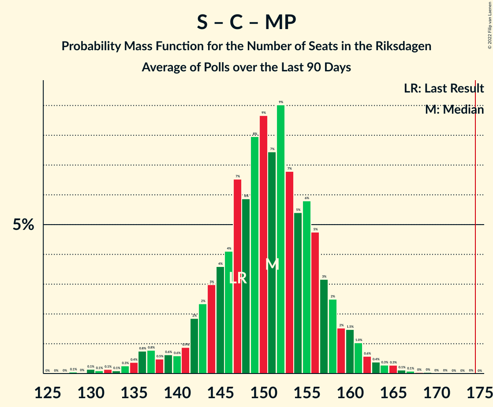
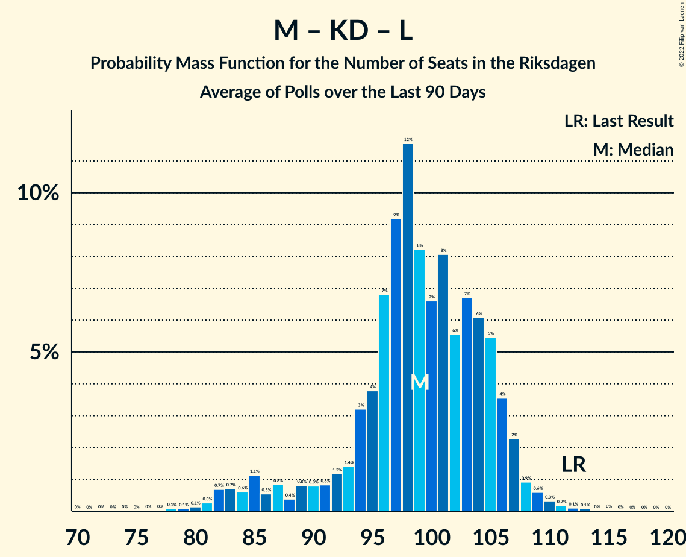

# Poll Average

<a href="#voting-intentions">Voting Intentions</a> | <a href="#seats">Seats</a> | <a href="#coalitions">Coalitions</a> | <a href="#technical-information">Technical Information</a>

## Summary

The table below lists the polls on which the average is based. They are the most recent polls (less than 90 days old) registered and analyzed so far.

| Period     | Polling firm/Commissioner(s) | S | M | SD | C | V | KD | L | MP |
|:----------:|:----------------------------:|:--:|:--:|:--:|:--:|:--:|:--:|:--:|:--:|
| 9 September 2018 | General Election | 28.3%   100 | 19.8%   70 | 17.5%   62 | 8.6%   31 | 8.0%   28 | 6.3%   22 | 5.5%   20 | 4.4%   16 |
| N/A | Poll Average | 25–31%   89–112 | 15–20%   52–71 | 18–24%   62–84 | 5–9%   19–33 | 7–10%   24–35 | 5–8%   17–28 | 4–8%   0–27 | 4–7%   15–25 |
| [29–31 August 2022](2022-08-31-Sifo.html) | Sifo   Svenska Dagbladet | 28–32%   98–113 | 14–18%   51–63 | 19–22%   67–79 | 6–9%   22–30 | 7–9%   24–33 | 5–7%   17–24 | 5–7%   19–26 | 4–6%   0–21 |
| [28–31 August 2022](2022-08-31-SKOP.html) | SKOP | 26–31%   92–110 | 14–18%   49–64 | 17–21%   59–75 | 7–10%   24–35 | 7–10%   23–34 | 5–8%   17–27 | 5–8%   19–29 | 5–7%   16–25 |
| [29–31 August 2022](2022-08-31-Novus.html) | Novus   SVT | 24–29%   86–102 | 17–21%   59–74 | 18–22%   63–78 | 6–8%   19–29 | 7–10%   25–35 | 6–9%   21–30 | 4–7%   15–23 | 5–7%   17–26 |
| [26–30 August 2022](2022-08-30-Ipsos.html) | Ipsos   Dagens Nyheter | 26–31%   91–110 | 15–19%   52–67 | 20–25%   70–87 | 5–8%   17–27 | 7–10%   25–37 | 5–8%   17–27 | 4–6%   0–21 | 5–7%   16–25 |
| [21–29 August 2022](2022-08-29-Demoskop.html) | Demoskop   Aftonbladet | 28–32%   98–112 | 16–20%   58–70 | 19–22%   67–79 | 6–9%   23–31 | 7–9%   24–32 | 5–6%   16–23 | 4–6%   0–20 | 4–6%   16–22 |
| 9 September 2018 | General Election | 28.3%   100 | 19.8%   70 | 17.5%   62 | 8.6%   31 | 8.0%   28 | 6.3%   22 | 5.5%   20 | 4.4%   16 |

Only polls for which at least the sample size has been published are included in the table above.

**Legend:**
+ **Top half of each row:** Voting intentions (95% confidence interval)
+ **Bottom half of each row:** Seat projections for the Riksdagen (95% confidence interval)
+ **S:** Sveriges socialdemokratiska arbetareparti
+ **M:** Moderata samlingspartiet
+ **SD:** Sverigedemokraterna
+ **C:** Centerpartiet
+ **V:** Vänsterpartiet
+ **KD:** Kristdemokraterna
+ **L:** Liberalerna
+ **MP:** Miljöpartiet de gröna
+ **N/A (single party):** Party not included the published results
+ **N/A (entire row):** Calculation for this opinion poll not started yet

## Voting Intentions

### Confidence Intervals

| Party | Last Result | Median | 80% Confidence Interval | 90% Confidence Interval | 95% Confidence Interval | 99% Confidence Interval |
|:-----:|:-----------:|:------:|:-----------------------:|:-----------------------:|:-----------------------:|:-----------------------:|
| <a href="#sveriges-socialdemokratiska-arbetareparti">Sveriges socialdemokratiska arbetareparti</a> | 28.3% | 28.8% | 26.3–30.6% |25.8–31.0% | 25.3–31.4% | 24.4–32.1% |
| <a href="#moderata-samlingspartiet">Moderata samlingspartiet</a> | 19.8% | 17.1% | 15.3–19.2% |14.9–19.7% | 14.6–20.1% | 13.9–20.9% |
| <a href="#sverigedemokraterna">Sverigedemokraterna</a> | 17.5% | 20.4% | 18.6–22.4% |18.0–23.1% | 17.5–23.6% | 16.7–24.6% |
| <a href="#centerpartiet">Centerpartiet</a> | 8.6% | 7.2% | 6.0–8.5% |5.6–8.9% | 5.4–9.3% | 4.9–10.0% |
| <a href="#vänsterpartiet">Vänsterpartiet</a> | 8.0% | 8.2% | 7.3–9.3% |7.0–9.6% | 6.9–9.9% | 6.5–10.5% |
| <a href="#kristdemokraterna">Kristdemokraterna</a> | 6.3% | 6.0% | 5.1–7.4% |4.9–7.8% | 4.8–8.1% | 4.5–8.6% |
| <a href="#liberalerna">Liberalerna</a> | 5.5% | 5.4% | 4.3–6.9% |4.1–7.3% | 4.0–7.6% | 3.6–8.3% |
| <a href="#miljöpartiet-de-gröna">Miljöpartiet de gröna</a> | 4.4% | 5.5% | 4.6–6.5% |4.4–6.8% | 4.2–7.0% | 3.9–7.5% |

### Sveriges socialdemokratiska arbetareparti

*For a full overview of the results for this party, see the [Sveriges socialdemokratiska arbetareparti](party-sverigessocialdemokratiskaarbetareparti.html) page.*

| Voting Intentions | Probability | Accumulated | Special Marks |
|:-----------------:|:-----------:|:-----------:|:-------------:|
| 22.5–23.5% | 0.1% | 100% |  |
| 23.5–24.5% | 0.6% | 99.9% |  |
| 24.5–25.5% | 3% | 99.3% |  |
| 25.5–26.5% | 8% | 96% |  |
| 26.5–27.5% | 14% | 88% |  |
| 27.5–28.5% | 19% | 74% | Last Result |
| 28.5–29.5% | 25% | 55% | Median |
| 29.5–30.5% | 20% | 30% |  |
| 30.5–31.5% | 8% | 10% |  |
| 31.5–32.5% | 2% | 2% |  |
| 32.5–33.5% | 0.1% | 0.1% |  |
| 33.5–34.5% | 0% | 0% |  |

### Moderata samlingspartiet

*For a full overview of the results for this party, see the [Moderata samlingspartiet](party-moderatasamlingspartiet.html) page.*

| Voting Intentions | Probability | Accumulated | Special Marks |
|:-----------------:|:-----------:|:-----------:|:-------------:|
| 11.5–12.5% | 0% | 100% |  |
| 12.5–13.5% | 0.2% | 100% |  |
| 13.5–14.5% | 2% | 99.8% |  |
| 14.5–15.5% | 11% | 98% |  |
| 15.5–16.5% | 23% | 87% |  |
| 16.5–17.5% | 23% | 64% | Median |
| 17.5–18.5% | 21% | 40% |  |
| 18.5–19.5% | 13% | 19% |  |
| 19.5–20.5% | 5% | 6% | Last Result |
| 20.5–21.5% | 1.0% | 1.1% |  |
| 21.5–22.5% | 0.1% | 0.1% |  |
| 22.5–23.5% | 0% | 0% |  |

### Sverigedemokraterna

*For a full overview of the results for this party, see the [Sverigedemokraterna](party-sverigedemokraterna.html) page.*

| Voting Intentions | Probability | Accumulated | Special Marks |
|:-----------------:|:-----------:|:-----------:|:-------------:|
| 14.5–15.5% | 0% | 100% |  |
| 15.5–16.5% | 0.4% | 100% |  |
| 16.5–17.5% | 2% | 99.6% |  |
| 17.5–18.5% | 7% | 97% | Last Result |
| 18.5–19.5% | 16% | 90% |  |
| 19.5–20.5% | 27% | 74% | Median |
| 20.5–21.5% | 25% | 47% |  |
| 21.5–22.5% | 13% | 22% |  |
| 22.5–23.5% | 6% | 9% |  |
| 23.5–24.5% | 2% | 3% |  |
| 24.5–25.5% | 0.5% | 0.5% |  |
| 25.5–26.5% | 0.1% | 0.1% |  |
| 26.5–27.5% | 0% | 0% |  |

### Centerpartiet

*For a full overview of the results for this party, see the [Centerpartiet](party-centerpartiet.html) page.*

| Voting Intentions | Probability | Accumulated | Special Marks |
|:-----------------:|:-----------:|:-----------:|:-------------:|
| 2.5–3.5% | 0% | 100% |  |
| 3.5–4.5% | 0.1% | 100% |  |
| 4.5–5.5% | 4% | 99.9% |  |
| 5.5–6.5% | 20% | 96% |  |
| 6.5–7.5% | 39% | 76% | Median |
| 7.5–8.5% | 27% | 37% |  |
| 8.5–9.5% | 8% | 9% | Last Result |
| 9.5–10.5% | 1.4% | 2% |  |
| 10.5–11.5% | 0.1% | 0.1% |  |
| 11.5–12.5% | 0% | 0% |  |

### Vänsterpartiet

*For a full overview of the results for this party, see the [Vänsterpartiet](party-vänsterpartiet.html) page.*

| Voting Intentions | Probability | Accumulated | Special Marks |
|:-----------------:|:-----------:|:-----------:|:-------------:|
| 4.5–5.5% | 0% | 100% |  |
| 5.5–6.5% | 0.7% | 100% |  |
| 6.5–7.5% | 18% | 99.3% |  |
| 7.5–8.5% | 49% | 82% | Last Result, Median |
| 8.5–9.5% | 27% | 32% |  |
| 9.5–10.5% | 5% | 5% |  |
| 10.5–11.5% | 0.4% | 0.4% |  |
| 11.5–12.5% | 0% | 0% |  |

### Kristdemokraterna

*For a full overview of the results for this party, see the [Kristdemokraterna](party-kristdemokraterna.html) page.*

| Voting Intentions | Probability | Accumulated | Special Marks |
|:-----------------:|:-----------:|:-----------:|:-------------:|
| 2.5–3.5% | 0% | 100% |  |
| 3.5–4.5% | 0.9% | 100% |  |
| 4.5–5.5% | 26% | 99.1% |  |
| 5.5–6.5% | 44% | 74% | Last Result, Median |
| 6.5–7.5% | 22% | 30% |  |
| 7.5–8.5% | 7% | 8% |  |
| 8.5–9.5% | 0.6% | 0.7% |  |
| 9.5–10.5% | 0% | 0% |  |

### Liberalerna

*For a full overview of the results for this party, see the [Liberalerna](party-liberalerna.html) page.*

| Voting Intentions | Probability | Accumulated | Special Marks |
|:-----------------:|:-----------:|:-----------:|:-------------:|
| 1.5–2.5% | 0% | 100% |  |
| 2.5–3.5% | 0.3% | 100% |  |
| 3.5–4.5% | 17% | 99.7% |  |
| 4.5–5.5% | 36% | 83% | Last Result, Median |
| 5.5–6.5% | 29% | 47% |  |
| 6.5–7.5% | 15% | 18% |  |
| 7.5–8.5% | 3% | 3% |  |
| 8.5–9.5% | 0.2% | 0.2% |  |
| 9.5–10.5% | 0% | 0% |  |

### Miljöpartiet de gröna

*For a full overview of the results for this party, see the [Miljöpartiet de gröna](party-miljöpartietdegröna.html) page.*

| Voting Intentions | Probability | Accumulated | Special Marks |
|:-----------------:|:-----------:|:-----------:|:-------------:|
| 2.5–3.5% | 0% | 100% |  |
| 3.5–4.5% | 8% | 100% | Last Result |
| 4.5–5.5% | 44% | 92% |  |
| 5.5–6.5% | 39% | 48% | Median |
| 6.5–7.5% | 8% | 8% |  |
| 7.5–8.5% | 0.4% | 0.4% |  |
| 8.5–9.5% | 0% | 0% |  |

## Seats

### Confidence Intervals

| Party | Last Result | Median | 80% Confidence Interval | 90% Confidence Interval | 95% Confidence Interval | 99% Confidence Interval |
|:-----:|:-----------:|:------:|:-----------------------:|:-----------------------:|:-----------------------:|:-----------------------:|
| <a href="#sveriges-socialdemokratiska-arbetareparti">Sveriges socialdemokratiska arbetareparti</a> | 100 | 102 | 92–108 |90–110 | 89–112 | 86–114 |
| <a href="#moderata-samlingspartiet">Moderata samlingspartiet</a> | 70 | 60 | 54–68 |53–70 | 52–71 | 49–74 |
| <a href="#sverigedemokraterna">Sverigedemokraterna</a> | 62 | 72 | 65–79 |63–82 | 62–84 | 59–87 |
| <a href="#centerpartiet">Centerpartiet</a> | 31 | 26 | 21–30 |20–32 | 19–33 | 17–35 |
| <a href="#vänsterpartiet">Vänsterpartiet</a> | 28 | 29 | 26–33 |25–34 | 24–35 | 23–37 |
| <a href="#kristdemokraterna">Kristdemokraterna</a> | 22 | 21 | 18–26 |18–27 | 17–28 | 16–30 |
| <a href="#liberalerna">Liberalerna</a> | 20 | 19 | 15–24 |15–26 | 0–27 | 0–29 |
| <a href="#miljöpartiet-de-gröna">Miljöpartiet de gröna</a> | 16 | 20 | 16–23 |15–24 | 15–25 | 0–27 |

### Sveriges socialdemokratiska arbetareparti

*For a full overview of the results for this party, see the [Sveriges socialdemokratiska arbetareparti](party-sverigessocialdemokratiskaarbetareparti.html) page.*

| Number of Seats | Probability | Accumulated | Special Marks |
|:---------------:|:-----------:|:-----------:|:-------------:|
| 82 | 0% | 100% |  |
| 83 | 0.1% | 99.9% |  |
| 84 | 0.1% | 99.9% |  |
| 85 | 0.2% | 99.7% |  |
| 86 | 0.4% | 99.5% |  |
| 87 | 0.8% | 99.1% |  |
| 88 | 0.8% | 98% |  |
| 89 | 1.3% | 98% |  |
| 90 | 2% | 96% |  |
| 91 | 2% | 94% |  |
| 92 | 3% | 93% |  |
| 93 | 3% | 90% |  |
| 94 | 4% | 87% |  |
| 95 | 4% | 84% |  |
| 96 | 4% | 80% |  |
| 97 | 4% | 75% |  |
| 98 | 4% | 71% |  |
| 99 | 5% | 67% |  |
| 100 | 6% | 62% | Last Result |
| 101 | 6% | 56% |  |
| 102 | 6% | 51% | Median |
| 103 | 7% | 44% |  |
| 104 | 6% | 37% |  |
| 105 | 6% | 31% |  |
| 106 | 6% | 25% |  |
| 107 | 6% | 19% |  |
| 108 | 4% | 13% |  |
| 109 | 3% | 9% |  |
| 110 | 2% | 6% |  |
| 111 | 1.3% | 4% |  |
| 112 | 1.1% | 3% |  |
| 113 | 0.6% | 1.4% |  |
| 114 | 0.4% | 0.8% |  |
| 115 | 0.2% | 0.4% |  |
| 116 | 0.1% | 0.2% |  |
| 117 | 0.1% | 0.1% |  |
| 118 | 0% | 0.1% |  |
| 119 | 0% | 0% |  |

### Moderata samlingspartiet

*For a full overview of the results for this party, see the [Moderata samlingspartiet](party-moderatasamlingspartiet.html) page.*

| Number of Seats | Probability | Accumulated | Special Marks |
|:---------------:|:-----------:|:-----------:|:-------------:|
| 47 | 0.1% | 100% |  |
| 48 | 0.1% | 99.9% |  |
| 49 | 0.4% | 99.7% |  |
| 50 | 0.8% | 99.3% |  |
| 51 | 1.0% | 98.6% |  |
| 52 | 2% | 98% |  |
| 53 | 3% | 95% |  |
| 54 | 4% | 93% |  |
| 55 | 5% | 88% |  |
| 56 | 6% | 83% |  |
| 57 | 8% | 77% |  |
| 58 | 6% | 70% |  |
| 59 | 6% | 63% |  |
| 60 | 8% | 57% | Median |
| 61 | 8% | 50% |  |
| 62 | 8% | 42% |  |
| 63 | 6% | 34% |  |
| 64 | 5% | 28% |  |
| 65 | 4% | 23% |  |
| 66 | 5% | 19% |  |
| 67 | 3% | 14% |  |
| 68 | 3% | 10% |  |
| 69 | 2% | 7% |  |
| 70 | 2% | 5% | Last Result |
| 71 | 1.2% | 4% |  |
| 72 | 1.0% | 2% |  |
| 73 | 0.4% | 1.4% |  |
| 74 | 0.5% | 0.9% |  |
| 75 | 0.1% | 0.4% |  |
| 76 | 0.2% | 0.3% |  |
| 77 | 0.1% | 0.2% |  |
| 78 | 0% | 0.1% |  |
| 79 | 0% | 0% |  |

### Sverigedemokraterna

*For a full overview of the results for this party, see the [Sverigedemokraterna](party-sverigedemokraterna.html) page.*

| Number of Seats | Probability | Accumulated | Special Marks |
|:---------------:|:-----------:|:-----------:|:-------------:|
| 56 | 0% | 100% |  |
| 57 | 0.1% | 99.9% |  |
| 58 | 0.3% | 99.8% |  |
| 59 | 0.3% | 99.6% |  |
| 60 | 0.7% | 99.2% |  |
| 61 | 0.8% | 98.5% |  |
| 62 | 1.4% | 98% | Last Result |
| 63 | 2% | 96% |  |
| 64 | 2% | 94% |  |
| 65 | 3% | 93% |  |
| 66 | 4% | 89% |  |
| 67 | 5% | 85% |  |
| 68 | 4% | 80% |  |
| 69 | 6% | 76% |  |
| 70 | 6% | 70% |  |
| 71 | 7% | 64% |  |
| 72 | 9% | 57% | Median |
| 73 | 8% | 48% |  |
| 74 | 8% | 39% |  |
| 75 | 5% | 31% |  |
| 76 | 6% | 27% |  |
| 77 | 5% | 21% |  |
| 78 | 4% | 16% |  |
| 79 | 3% | 13% |  |
| 80 | 2% | 10% |  |
| 81 | 2% | 8% |  |
| 82 | 1.4% | 6% |  |
| 83 | 2% | 4% |  |
| 84 | 1.0% | 3% |  |
| 85 | 0.6% | 2% |  |
| 86 | 0.4% | 1.1% |  |
| 87 | 0.2% | 0.7% |  |
| 88 | 0.2% | 0.5% |  |
| 89 | 0.1% | 0.3% |  |
| 90 | 0.1% | 0.2% |  |
| 91 | 0% | 0.1% |  |
| 92 | 0% | 0% |  |

### Centerpartiet

*For a full overview of the results for this party, see the [Centerpartiet](party-centerpartiet.html) page.*

| Number of Seats | Probability | Accumulated | Special Marks |
|:---------------:|:-----------:|:-----------:|:-------------:|
| 16 | 0.1% | 100% |  |
| 17 | 0.6% | 99.8% |  |
| 18 | 1.0% | 99.3% |  |
| 19 | 2% | 98% |  |
| 20 | 4% | 96% |  |
| 21 | 5% | 91% |  |
| 22 | 7% | 86% |  |
| 23 | 7% | 79% |  |
| 24 | 8% | 71% |  |
| 25 | 10% | 63% |  |
| 26 | 13% | 53% | Median |
| 27 | 10% | 40% |  |
| 28 | 9% | 30% |  |
| 29 | 8% | 20% |  |
| 30 | 5% | 13% |  |
| 31 | 2% | 8% | Last Result |
| 32 | 2% | 5% |  |
| 33 | 2% | 3% |  |
| 34 | 0.8% | 2% |  |
| 35 | 0.4% | 0.8% |  |
| 36 | 0.2% | 0.4% |  |
| 37 | 0.1% | 0.2% |  |
| 38 | 0% | 0.1% |  |
| 39 | 0% | 0% |  |

### Vänsterpartiet

*For a full overview of the results for this party, see the [Vänsterpartiet](party-vänsterpartiet.html) page.*

| Number of Seats | Probability | Accumulated | Special Marks |
|:---------------:|:-----------:|:-----------:|:-------------:|
| 21 | 0.1% | 100% |  |
| 22 | 0.2% | 99.9% |  |
| 23 | 0.8% | 99.7% |  |
| 24 | 2% | 98.8% |  |
| 25 | 6% | 97% |  |
| 26 | 8% | 91% |  |
| 27 | 13% | 83% |  |
| 28 | 14% | 70% | Last Result |
| 29 | 14% | 56% | Median |
| 30 | 13% | 42% |  |
| 31 | 11% | 29% |  |
| 32 | 7% | 18% |  |
| 33 | 5% | 12% |  |
| 34 | 3% | 7% |  |
| 35 | 2% | 4% |  |
| 36 | 1.1% | 2% |  |
| 37 | 0.4% | 0.8% |  |
| 38 | 0.3% | 0.4% |  |
| 39 | 0.1% | 0.1% |  |
| 40 | 0% | 0.1% |  |
| 41 | 0% | 0% |  |

### Kristdemokraterna

*For a full overview of the results for this party, see the [Kristdemokraterna](party-kristdemokraterna.html) page.*

| Number of Seats | Probability | Accumulated | Special Marks |
|:---------------:|:-----------:|:-----------:|:-------------:|
| 14 | 0% | 100% |  |
| 15 | 0.3% | 99.9% |  |
| 16 | 1.0% | 99.6% |  |
| 17 | 3% | 98.6% |  |
| 18 | 7% | 95% |  |
| 19 | 14% | 88% |  |
| 20 | 15% | 74% |  |
| 21 | 12% | 58% | Median |
| 22 | 10% | 46% | Last Result |
| 23 | 9% | 36% |  |
| 24 | 9% | 27% |  |
| 25 | 7% | 18% |  |
| 26 | 4% | 12% |  |
| 27 | 3% | 8% |  |
| 28 | 3% | 4% |  |
| 29 | 0.7% | 2% |  |
| 30 | 0.9% | 1.3% |  |
| 31 | 0.2% | 0.3% |  |
| 32 | 0.1% | 0.2% |  |
| 33 | 0.1% | 0.1% |  |
| 34 | 0% | 0% |  |

### Liberalerna

*For a full overview of the results for this party, see the [Liberalerna](party-liberalerna.html) page.*

| Number of Seats | Probability | Accumulated | Special Marks |
|:---------------:|:-----------:|:-----------:|:-------------:|
| 0 | 3% | 100% |  |
| 1 | 0% | 97% |  |
| 2 | 0% | 97% |  |
| 3 | 0% | 97% |  |
| 4 | 0% | 97% |  |
| 5 | 0% | 97% |  |
| 6 | 0% | 97% |  |
| 7 | 0% | 97% |  |
| 8 | 0% | 97% |  |
| 9 | 0% | 97% |  |
| 10 | 0% | 97% |  |
| 11 | 0% | 97% |  |
| 12 | 0% | 97% |  |
| 13 | 0% | 97% |  |
| 14 | 2% | 97% |  |
| 15 | 7% | 95% |  |
| 16 | 10% | 88% |  |
| 17 | 10% | 78% |  |
| 18 | 11% | 68% |  |
| 19 | 8% | 56% | Median |
| 20 | 10% | 48% | Last Result |
| 21 | 7% | 38% |  |
| 22 | 6% | 31% |  |
| 23 | 8% | 26% |  |
| 24 | 8% | 17% |  |
| 25 | 3% | 10% |  |
| 26 | 2% | 6% |  |
| 27 | 2% | 4% |  |
| 28 | 1.0% | 2% |  |
| 29 | 0.4% | 0.7% |  |
| 30 | 0.2% | 0.4% |  |
| 31 | 0.1% | 0.2% |  |
| 32 | 0% | 0.1% |  |
| 33 | 0% | 0% |  |

### Miljöpartiet de gröna

*For a full overview of the results for this party, see the [Miljöpartiet de gröna](party-miljöpartietdegröna.html) page.*

| Number of Seats | Probability | Accumulated | Special Marks |
|:---------------:|:-----------:|:-----------:|:-------------:|
| 0 | 0.7% | 100% |  |
| 1 | 0% | 99.3% |  |
| 2 | 0% | 99.3% |  |
| 3 | 0% | 99.3% |  |
| 4 | 0% | 99.3% |  |
| 5 | 0% | 99.3% |  |
| 6 | 0% | 99.3% |  |
| 7 | 0% | 99.3% |  |
| 8 | 0% | 99.3% |  |
| 9 | 0% | 99.3% |  |
| 10 | 0% | 99.3% |  |
| 11 | 0% | 99.3% |  |
| 12 | 0% | 99.3% |  |
| 13 | 0% | 99.3% |  |
| 14 | 0.5% | 99.3% |  |
| 15 | 4% | 98.7% |  |
| 16 | 6% | 95% | Last Result |
| 17 | 9% | 89% |  |
| 18 | 14% | 79% |  |
| 19 | 15% | 66% |  |
| 20 | 14% | 51% | Median |
| 21 | 15% | 37% |  |
| 22 | 9% | 22% |  |
| 23 | 6% | 13% |  |
| 24 | 4% | 7% |  |
| 25 | 2% | 3% |  |
| 26 | 0.7% | 1.4% |  |
| 27 | 0.4% | 0.7% |  |
| 28 | 0.2% | 0.3% |  |
| 29 | 0.1% | 0.1% |  |
| 30 | 0% | 0% |  |

## Coalitions

### Confidence Intervals

| Coalition | Last Result | Median | Majority? | 80% Confidence Interval | 90% Confidence Interval | 95% Confidence Interval | 99% Confidence Interval |
|:---------:|:-----------:|:------:|:---------:|:-----------------------:|:-----------------------:|:-----------------------:|:-----------------------:|
| Sveriges socialdemokratiska arbetareparti – Centerpartiet – Vänsterpartiet – Liberalerna – Miljöpartiet de gröna | 195 | 195 | 99.7% | 185–205 | 182–208 | 180–210 | 175–214 |
| Sveriges socialdemokratiska arbetareparti – Moderata samlingspartiet – Centerpartiet | 201 | 187 | 97% | 178–196 | 176–198 | 174–201 | 171–207 |
| Sveriges socialdemokratiska arbetareparti – Centerpartiet – Vänsterpartiet – Miljöpartiet de gröna | 175 | 176 | 56% | 167–183 | 164–186 | 162–188 | 159–191 |
| Moderata samlingspartiet – Sverigedemokraterna – Kristdemokraterna – Liberalerna | 174 | 173 | 44% | 166–182 | 163–185 | 161–187 | 158–190 |
| Sveriges socialdemokratiska arbetareparti – Centerpartiet – Liberalerna – Miljöpartiet de gröna | 167 | 166 | 15% | 154–177 | 152–179 | 149–181 | 144–185 |
| Sveriges socialdemokratiska arbetareparti – Moderata samlingspartiet | 170 | 162 | 2% | 154–169 | 152–172 | 150–174 | 147–178 |
| Moderata samlingspartiet – Sverigedemokraterna – Kristdemokraterna | 154 | 154 | 0.3% | 144–164 | 141–167 | 139–169 | 135–174 |
| Sveriges socialdemokratiska arbetareparti – Vänsterpartiet – Miljöpartiet de gröna | 144 | 150 | 0% | 142–156 | 140–159 | 138–160 | 134–164 |
| Sveriges socialdemokratiska arbetareparti – Centerpartiet – Miljöpartiet de gröna | 147 | 147 | 0% | 137–154 | 134–157 | 132–159 | 129–162 |
| Moderata samlingspartiet – Sverigedemokraterna | 132 | 134 | 0% | 123–142 | 120–143 | 117–145 | 114–150 |
| Moderata samlingspartiet – Centerpartiet – Kristdemokraterna – Liberalerna | 143 | 127 | 0% | 118–137 | 115–139 | 112–141 | 105–144 |
| Sveriges socialdemokratiska arbetareparti – Vänsterpartiet | 128 | 131 | 0% | 122–137 | 119–139 | 118–140 | 114–144 |
| Sveriges socialdemokratiska arbetareparti – Miljöpartiet de gröna | 116 | 121 | 0% | 113–127 | 111–129 | 109–131 | 106–133 |
| Moderata samlingspartiet – Centerpartiet – Kristdemokraterna | 123 | 107 | 0% | 100–117 | 98–119 | 97–121 | 94–125 |
| Moderata samlingspartiet – Centerpartiet – Liberalerna | 121 | 106 | 0% | 97–113 | 94–115 | 91–117 | 84–120 |
| Moderata samlingspartiet – Kristdemokraterna – Liberalerna | 112 | 101 | 0% | 95–111 | 92–114 | 89–116 | 82–120 |
| Sveriges socialdemokratiska arbetareparti | 100 | 102 | 0% | 92–108 | 90–110 | 89–112 | 86–114 |
| Moderata samlingspartiet – Centerpartiet | 101 | 86 | 0% | 79–93 | 77–95 | 76–97 | 73–100 |
| Moderata samlingspartiet – Kristdemokraterna | 92 | 81 | 0% | 75–92 | 74–95 | 72–97 | 70–100 |

### Sveriges socialdemokratiska arbetareparti – Centerpartiet – Vänsterpartiet – Liberalerna – Miljöpartiet de gröna

| Number of Seats | Probability | Accumulated | Special Marks |
|:---------------:|:-----------:|:-----------:|:-------------:|
| 170 | 0% | 100% |  |
| 171 | 0% | 99.9% |  |
| 172 | 0.1% | 99.9% |  |
| 173 | 0.1% | 99.9% |  |
| 174 | 0.1% | 99.8% |  |
| 175 | 0.2% | 99.7% | Majority |
| 176 | 0.2% | 99.5% |  |
| 177 | 0.3% | 99.3% |  |
| 178 | 0.5% | 99.0% |  |
| 179 | 0.8% | 98.6% |  |
| 180 | 1.1% | 98% |  |
| 181 | 1.4% | 97% |  |
| 182 | 1.4% | 95% |  |
| 183 | 1.3% | 94% |  |
| 184 | 3% | 93% |  |
| 185 | 3% | 90% |  |
| 186 | 4% | 87% |  |
| 187 | 5% | 84% |  |
| 188 | 4% | 78% |  |
| 189 | 5% | 74% |  |
| 190 | 4% | 69% |  |
| 191 | 3% | 65% |  |
| 192 | 3% | 62% |  |
| 193 | 3% | 59% |  |
| 194 | 3% | 56% |  |
| 195 | 6% | 52% | Last Result |
| 196 | 7% | 46% | Median |
| 197 | 5% | 39% |  |
| 198 | 5% | 34% |  |
| 199 | 4% | 30% |  |
| 200 | 3% | 26% |  |
| 201 | 3% | 22% |  |
| 202 | 3% | 19% |  |
| 203 | 3% | 16% |  |
| 204 | 3% | 13% |  |
| 205 | 2% | 11% |  |
| 206 | 2% | 9% |  |
| 207 | 2% | 7% |  |
| 208 | 1.0% | 5% |  |
| 209 | 1.4% | 4% |  |
| 210 | 0.9% | 3% |  |
| 211 | 0.5% | 2% |  |
| 212 | 0.3% | 1.2% |  |
| 213 | 0.3% | 0.9% |  |
| 214 | 0.2% | 0.5% |  |
| 215 | 0.1% | 0.3% |  |
| 216 | 0.1% | 0.2% |  |
| 217 | 0% | 0.1% |  |
| 218 | 0% | 0.1% |  |
| 219 | 0% | 0% |  |

### Sveriges socialdemokratiska arbetareparti – Moderata samlingspartiet – Centerpartiet

| Number of Seats | Probability | Accumulated | Special Marks |
|:---------------:|:-----------:|:-----------:|:-------------:|
| 167 | 0% | 100% |  |
| 168 | 0% | 99.9% |  |
| 169 | 0.1% | 99.9% |  |
| 170 | 0.2% | 99.8% |  |
| 171 | 0.2% | 99.7% |  |
| 172 | 0.2% | 99.4% |  |
| 173 | 1.0% | 99.2% |  |
| 174 | 0.9% | 98% |  |
| 175 | 1.2% | 97% | Majority |
| 176 | 2% | 96% |  |
| 177 | 2% | 94% |  |
| 178 | 2% | 92% |  |
| 179 | 3% | 90% |  |
| 180 | 4% | 86% |  |
| 181 | 3% | 82% |  |
| 182 | 4% | 79% |  |
| 183 | 4% | 75% |  |
| 184 | 7% | 71% |  |
| 185 | 5% | 64% |  |
| 186 | 5% | 59% |  |
| 187 | 6% | 54% |  |
| 188 | 6% | 48% | Median |
| 189 | 5% | 42% |  |
| 190 | 6% | 37% |  |
| 191 | 4% | 31% |  |
| 192 | 5% | 27% |  |
| 193 | 5% | 22% |  |
| 194 | 3% | 17% |  |
| 195 | 4% | 15% |  |
| 196 | 2% | 11% |  |
| 197 | 2% | 8% |  |
| 198 | 2% | 7% |  |
| 199 | 0.8% | 4% |  |
| 200 | 0.8% | 4% |  |
| 201 | 0.6% | 3% | Last Result |
| 202 | 0.3% | 2% |  |
| 203 | 0.3% | 2% |  |
| 204 | 0.3% | 1.4% |  |
| 205 | 0.3% | 1.1% |  |
| 206 | 0.1% | 0.8% |  |
| 207 | 0.3% | 0.7% |  |
| 208 | 0.2% | 0.4% |  |
| 209 | 0% | 0.1% |  |
| 210 | 0% | 0.1% |  |
| 211 | 0% | 0.1% |  |
| 212 | 0% | 0% |  |

### Sveriges socialdemokratiska arbetareparti – Centerpartiet – Vänsterpartiet – Miljöpartiet de gröna

| Number of Seats | Probability | Accumulated | Special Marks |
|:---------------:|:-----------:|:-----------:|:-------------:|
| 155 | 0% | 100% |  |
| 156 | 0% | 99.9% |  |
| 157 | 0.2% | 99.9% |  |
| 158 | 0.1% | 99.7% |  |
| 159 | 0.2% | 99.6% |  |
| 160 | 0.5% | 99.4% |  |
| 161 | 0.8% | 98.9% |  |
| 162 | 0.9% | 98% |  |
| 163 | 1.5% | 97% |  |
| 164 | 1.4% | 96% |  |
| 165 | 2% | 94% |  |
| 166 | 2% | 92% |  |
| 167 | 3% | 90% |  |
| 168 | 3% | 87% |  |
| 169 | 4% | 84% |  |
| 170 | 4% | 80% |  |
| 171 | 5% | 76% |  |
| 172 | 6% | 71% |  |
| 173 | 5% | 66% |  |
| 174 | 5% | 61% |  |
| 175 | 6% | 56% | Last Result, Majority |
| 176 | 6% | 50% |  |
| 177 | 5% | 45% | Median |
| 178 | 7% | 40% |  |
| 179 | 7% | 33% |  |
| 180 | 7% | 26% |  |
| 181 | 5% | 19% |  |
| 182 | 3% | 14% |  |
| 183 | 2% | 11% |  |
| 184 | 1.5% | 9% |  |
| 185 | 2% | 7% |  |
| 186 | 2% | 5% |  |
| 187 | 1.0% | 4% |  |
| 188 | 1.2% | 3% |  |
| 189 | 0.9% | 2% |  |
| 190 | 0.2% | 0.8% |  |
| 191 | 0.2% | 0.5% |  |
| 192 | 0.1% | 0.3% |  |
| 193 | 0% | 0.2% |  |
| 194 | 0.1% | 0.2% |  |
| 195 | 0% | 0.1% |  |
| 196 | 0% | 0% |  |

### Moderata samlingspartiet – Sverigedemokraterna – Kristdemokraterna – Liberalerna

| Number of Seats | Probability | Accumulated | Special Marks |
|:---------------:|:-----------:|:-----------:|:-------------:|
| 154 | 0% | 100% |  |
| 155 | 0.1% | 99.9% |  |
| 156 | 0% | 99.8% |  |
| 157 | 0.1% | 99.8% |  |
| 158 | 0.2% | 99.7% |  |
| 159 | 0.2% | 99.5% |  |
| 160 | 0.9% | 99.2% |  |
| 161 | 1.2% | 98% |  |
| 162 | 1.0% | 97% |  |
| 163 | 2% | 96% |  |
| 164 | 2% | 95% |  |
| 165 | 1.5% | 93% |  |
| 166 | 2% | 91% |  |
| 167 | 3% | 89% |  |
| 168 | 5% | 86% |  |
| 169 | 7% | 81% |  |
| 170 | 7% | 74% |  |
| 171 | 7% | 67% |  |
| 172 | 5% | 60% | Median |
| 173 | 6% | 55% |  |
| 174 | 6% | 50% | Last Result |
| 175 | 5% | 44% | Majority |
| 176 | 5% | 39% |  |
| 177 | 6% | 34% |  |
| 178 | 5% | 29% |  |
| 179 | 4% | 24% |  |
| 180 | 4% | 20% |  |
| 181 | 3% | 16% |  |
| 182 | 3% | 13% |  |
| 183 | 2% | 10% |  |
| 184 | 2% | 8% |  |
| 185 | 1.4% | 6% |  |
| 186 | 1.5% | 4% |  |
| 187 | 0.9% | 3% |  |
| 188 | 0.8% | 2% |  |
| 189 | 0.5% | 1.1% |  |
| 190 | 0.2% | 0.6% |  |
| 191 | 0.1% | 0.4% |  |
| 192 | 0.2% | 0.3% |  |
| 193 | 0% | 0.1% |  |
| 194 | 0% | 0.1% |  |
| 195 | 0% | 0% |  |

### Sveriges socialdemokratiska arbetareparti – Centerpartiet – Liberalerna – Miljöpartiet de gröna

| Number of Seats | Probability | Accumulated | Special Marks |
|:---------------:|:-----------:|:-----------:|:-------------:|
| 140 | 0% | 100% |  |
| 141 | 0.1% | 99.9% |  |
| 142 | 0.1% | 99.8% |  |
| 143 | 0.1% | 99.7% |  |
| 144 | 0.1% | 99.6% |  |
| 145 | 0.1% | 99.5% |  |
| 146 | 0.2% | 99.3% |  |
| 147 | 0.4% | 99.1% |  |
| 148 | 0.5% | 98.8% |  |
| 149 | 0.8% | 98% |  |
| 150 | 0.9% | 97% |  |
| 151 | 0.8% | 96% |  |
| 152 | 1.5% | 96% |  |
| 153 | 2% | 94% |  |
| 154 | 3% | 93% |  |
| 155 | 3% | 90% |  |
| 156 | 4% | 86% |  |
| 157 | 4% | 82% |  |
| 158 | 4% | 78% |  |
| 159 | 4% | 75% |  |
| 160 | 3% | 71% |  |
| 161 | 3% | 68% |  |
| 162 | 3% | 65% |  |
| 163 | 3% | 61% |  |
| 164 | 3% | 58% |  |
| 165 | 4% | 55% |  |
| 166 | 3% | 51% |  |
| 167 | 4% | 48% | Last Result, Median |
| 168 | 5% | 44% |  |
| 169 | 7% | 39% |  |
| 170 | 4% | 32% |  |
| 171 | 3% | 28% |  |
| 172 | 3% | 25% |  |
| 173 | 4% | 22% |  |
| 174 | 3% | 18% |  |
| 175 | 2% | 15% | Majority |
| 176 | 2% | 13% |  |
| 177 | 3% | 10% |  |
| 178 | 2% | 7% |  |
| 179 | 1.0% | 5% |  |
| 180 | 1.1% | 4% |  |
| 181 | 1.2% | 3% |  |
| 182 | 0.7% | 2% |  |
| 183 | 0.3% | 1.4% |  |
| 184 | 0.4% | 1.1% |  |
| 185 | 0.3% | 0.7% |  |
| 186 | 0.2% | 0.5% |  |
| 187 | 0% | 0.2% |  |
| 188 | 0.1% | 0.2% |  |
| 189 | 0.1% | 0.1% |  |
| 190 | 0% | 0% |  |

### Sveriges socialdemokratiska arbetareparti – Moderata samlingspartiet

| Number of Seats | Probability | Accumulated | Special Marks |
|:---------------:|:-----------:|:-----------:|:-------------:|
| 143 | 0% | 100% |  |
| 144 | 0.1% | 99.9% |  |
| 145 | 0.1% | 99.9% |  |
| 146 | 0.1% | 99.7% |  |
| 147 | 0.3% | 99.6% |  |
| 148 | 0.4% | 99.3% |  |
| 149 | 0.5% | 99.0% |  |
| 150 | 2% | 98% |  |
| 151 | 1.0% | 97% |  |
| 152 | 2% | 96% |  |
| 153 | 3% | 94% |  |
| 154 | 3% | 91% |  |
| 155 | 5% | 88% |  |
| 156 | 4% | 83% |  |
| 157 | 6% | 79% |  |
| 158 | 5% | 73% |  |
| 159 | 5% | 68% |  |
| 160 | 7% | 63% |  |
| 161 | 5% | 56% |  |
| 162 | 7% | 51% | Median |
| 163 | 7% | 44% |  |
| 164 | 6% | 37% |  |
| 165 | 6% | 31% |  |
| 166 | 5% | 25% |  |
| 167 | 5% | 21% |  |
| 168 | 3% | 15% |  |
| 169 | 3% | 12% |  |
| 170 | 2% | 10% | Last Result |
| 171 | 1.2% | 7% |  |
| 172 | 2% | 6% |  |
| 173 | 0.8% | 4% |  |
| 174 | 0.7% | 3% |  |
| 175 | 0.9% | 2% | Majority |
| 176 | 0.3% | 1.5% |  |
| 177 | 0.3% | 1.2% |  |
| 178 | 0.4% | 0.9% |  |
| 179 | 0.2% | 0.5% |  |
| 180 | 0.1% | 0.3% |  |
| 181 | 0.1% | 0.2% |  |
| 182 | 0.1% | 0.2% |  |
| 183 | 0.1% | 0.1% |  |
| 184 | 0% | 0% |  |

### Moderata samlingspartiet – Sverigedemokraterna – Kristdemokraterna

| Number of Seats | Probability | Accumulated | Special Marks |
|:---------------:|:-----------:|:-----------:|:-------------:|
| 131 | 0% | 100% |  |
| 132 | 0% | 99.9% |  |
| 133 | 0.1% | 99.9% |  |
| 134 | 0.1% | 99.8% |  |
| 135 | 0.2% | 99.7% |  |
| 136 | 0.3% | 99.5% |  |
| 137 | 0.3% | 99.1% |  |
| 138 | 0.5% | 98.8% |  |
| 139 | 0.9% | 98% |  |
| 140 | 1.4% | 97% |  |
| 141 | 1.0% | 96% |  |
| 142 | 2% | 95% |  |
| 143 | 2% | 93% |  |
| 144 | 2% | 91% |  |
| 145 | 3% | 89% |  |
| 146 | 3% | 87% |  |
| 147 | 3% | 84% |  |
| 148 | 3% | 81% |  |
| 149 | 3% | 78% |  |
| 150 | 4% | 74% |  |
| 151 | 5% | 70% |  |
| 152 | 5% | 66% |  |
| 153 | 7% | 61% | Median |
| 154 | 6% | 54% | Last Result |
| 155 | 3% | 48% |  |
| 156 | 3% | 44% |  |
| 157 | 3% | 41% |  |
| 158 | 3% | 38% |  |
| 159 | 4% | 35% |  |
| 160 | 5% | 31% |  |
| 161 | 4% | 26% |  |
| 162 | 5% | 22% |  |
| 163 | 4% | 16% |  |
| 164 | 3% | 13% |  |
| 165 | 3% | 10% |  |
| 166 | 1.3% | 7% |  |
| 167 | 1.4% | 6% |  |
| 168 | 1.4% | 5% |  |
| 169 | 1.1% | 3% |  |
| 170 | 0.8% | 2% |  |
| 171 | 0.5% | 1.4% |  |
| 172 | 0.3% | 1.0% |  |
| 173 | 0.2% | 0.7% |  |
| 174 | 0.2% | 0.5% |  |
| 175 | 0.1% | 0.3% | Majority |
| 176 | 0.1% | 0.2% |  |
| 177 | 0.1% | 0.1% |  |
| 178 | 0% | 0.1% |  |
| 179 | 0% | 0.1% |  |
| 180 | 0% | 0% |  |

### Sveriges socialdemokratiska arbetareparti – Vänsterpartiet – Miljöpartiet de gröna

| Number of Seats | Probability | Accumulated | Special Marks |
|:---------------:|:-----------:|:-----------:|:-------------:|
| 131 | 0% | 100% |  |
| 132 | 0.1% | 99.9% |  |
| 133 | 0.1% | 99.8% |  |
| 134 | 0.3% | 99.7% |  |
| 135 | 0.3% | 99.5% |  |
| 136 | 0.5% | 99.2% |  |
| 137 | 0.8% | 98.7% |  |
| 138 | 0.9% | 98% |  |
| 139 | 1.3% | 97% |  |
| 140 | 2% | 96% |  |
| 141 | 2% | 94% |  |
| 142 | 3% | 92% |  |
| 143 | 4% | 89% |  |
| 144 | 4% | 86% | Last Result |
| 145 | 5% | 82% |  |
| 146 | 5% | 78% |  |
| 147 | 6% | 72% |  |
| 148 | 6% | 67% |  |
| 149 | 7% | 60% |  |
| 150 | 8% | 53% |  |
| 151 | 9% | 46% | Median |
| 152 | 7% | 37% |  |
| 153 | 6% | 30% |  |
| 154 | 6% | 24% |  |
| 155 | 5% | 18% |  |
| 156 | 3% | 13% |  |
| 157 | 2% | 9% |  |
| 158 | 2% | 7% |  |
| 159 | 2% | 5% |  |
| 160 | 1.0% | 3% |  |
| 161 | 0.8% | 2% |  |
| 162 | 0.5% | 1.5% |  |
| 163 | 0.4% | 1.0% |  |
| 164 | 0.2% | 0.6% |  |
| 165 | 0.2% | 0.4% |  |
| 166 | 0.1% | 0.2% |  |
| 167 | 0% | 0.1% |  |
| 168 | 0% | 0.1% |  |
| 169 | 0% | 0.1% |  |
| 170 | 0% | 0% |  |

### Sveriges socialdemokratiska arbetareparti – Centerpartiet – Miljöpartiet de gröna

| Number of Seats | Probability | Accumulated | Special Marks |
|:---------------:|:-----------:|:-----------:|:-------------:|
| 125 | 0% | 100% |  |
| 126 | 0% | 99.9% |  |
| 127 | 0.1% | 99.9% |  |
| 128 | 0.1% | 99.8% |  |
| 129 | 0.4% | 99.6% |  |
| 130 | 0.4% | 99.3% |  |
| 131 | 0.6% | 98.9% |  |
| 132 | 0.9% | 98% |  |
| 133 | 0.9% | 97% |  |
| 134 | 2% | 96% |  |
| 135 | 2% | 94% |  |
| 136 | 2% | 93% |  |
| 137 | 3% | 90% |  |
| 138 | 4% | 87% |  |
| 139 | 3% | 83% |  |
| 140 | 4% | 80% |  |
| 141 | 3% | 76% |  |
| 142 | 3% | 73% |  |
| 143 | 3% | 69% |  |
| 144 | 4% | 66% |  |
| 145 | 6% | 62% |  |
| 146 | 5% | 56% |  |
| 147 | 5% | 51% | Last Result |
| 148 | 5% | 46% | Median |
| 149 | 5% | 41% |  |
| 150 | 8% | 36% |  |
| 151 | 4% | 28% |  |
| 152 | 5% | 23% |  |
| 153 | 5% | 18% |  |
| 154 | 3% | 13% |  |
| 155 | 2% | 10% |  |
| 156 | 2% | 8% |  |
| 157 | 2% | 6% |  |
| 158 | 1.2% | 4% |  |
| 159 | 0.8% | 3% |  |
| 160 | 0.4% | 2% |  |
| 161 | 0.6% | 1.3% |  |
| 162 | 0.3% | 0.7% |  |
| 163 | 0.2% | 0.4% |  |
| 164 | 0.1% | 0.3% |  |
| 165 | 0.1% | 0.1% |  |
| 166 | 0% | 0.1% |  |
| 167 | 0% | 0% |  |

### Moderata samlingspartiet – Sverigedemokraterna

| Number of Seats | Probability | Accumulated | Special Marks |
|:---------------:|:-----------:|:-----------:|:-------------:|
| 110 | 0% | 100% |  |
| 111 | 0.1% | 99.9% |  |
| 112 | 0.1% | 99.9% |  |
| 113 | 0.2% | 99.8% |  |
| 114 | 0.2% | 99.6% |  |
| 115 | 0.4% | 99.4% |  |
| 116 | 0.6% | 98.9% |  |
| 117 | 1.0% | 98% |  |
| 118 | 0.9% | 97% |  |
| 119 | 1.2% | 97% |  |
| 120 | 2% | 95% |  |
| 121 | 1.3% | 94% |  |
| 122 | 2% | 92% |  |
| 123 | 2% | 91% |  |
| 124 | 2% | 89% |  |
| 125 | 2% | 86% |  |
| 126 | 3% | 84% |  |
| 127 | 3% | 81% |  |
| 128 | 3% | 78% |  |
| 129 | 4% | 75% |  |
| 130 | 5% | 71% |  |
| 131 | 4% | 66% |  |
| 132 | 5% | 63% | Last Result, Median |
| 133 | 7% | 58% |  |
| 134 | 10% | 51% |  |
| 135 | 5% | 41% |  |
| 136 | 4% | 37% |  |
| 137 | 3% | 32% |  |
| 138 | 5% | 29% |  |
| 139 | 5% | 25% |  |
| 140 | 4% | 19% |  |
| 141 | 5% | 15% |  |
| 142 | 4% | 10% |  |
| 143 | 2% | 6% |  |
| 144 | 1.2% | 4% |  |
| 145 | 0.5% | 3% |  |
| 146 | 0.5% | 2% |  |
| 147 | 0.6% | 2% |  |
| 148 | 0.4% | 1.4% |  |
| 149 | 0.3% | 1.0% |  |
| 150 | 0.2% | 0.7% |  |
| 151 | 0.2% | 0.5% |  |
| 152 | 0.1% | 0.3% |  |
| 153 | 0.1% | 0.2% |  |
| 154 | 0.1% | 0.1% |  |
| 155 | 0% | 0.1% |  |
| 156 | 0% | 0.1% |  |
| 157 | 0% | 0% |  |

### Moderata samlingspartiet – Centerpartiet – Kristdemokraterna – Liberalerna

| Number of Seats | Probability | Accumulated | Special Marks |
|:---------------:|:-----------:|:-----------:|:-------------:|
| 98 | 0% | 100% |  |
| 99 | 0% | 99.9% |  |
| 100 | 0% | 99.9% |  |
| 101 | 0% | 99.9% |  |
| 102 | 0.1% | 99.9% |  |
| 103 | 0.1% | 99.8% |  |
| 104 | 0.2% | 99.8% |  |
| 105 | 0.2% | 99.6% |  |
| 106 | 0.1% | 99.4% |  |
| 107 | 0.2% | 99.3% |  |
| 108 | 0.2% | 99.1% |  |
| 109 | 0.2% | 98.9% |  |
| 110 | 0.4% | 98.7% |  |
| 111 | 0.4% | 98% |  |
| 112 | 0.8% | 98% |  |
| 113 | 0.8% | 97% |  |
| 114 | 1.1% | 96% |  |
| 115 | 0.9% | 95% |  |
| 116 | 1.1% | 94% |  |
| 117 | 1.2% | 93% |  |
| 118 | 3% | 92% |  |
| 119 | 3% | 89% |  |
| 120 | 3% | 86% |  |
| 121 | 4% | 84% |  |
| 122 | 5% | 80% |  |
| 123 | 5% | 75% |  |
| 124 | 6% | 70% |  |
| 125 | 5% | 64% |  |
| 126 | 7% | 59% | Median |
| 127 | 6% | 52% |  |
| 128 | 5% | 46% |  |
| 129 | 5% | 42% |  |
| 130 | 4% | 37% |  |
| 131 | 5% | 33% |  |
| 132 | 5% | 28% |  |
| 133 | 4% | 23% |  |
| 134 | 4% | 20% |  |
| 135 | 3% | 16% |  |
| 136 | 3% | 13% |  |
| 137 | 2% | 10% |  |
| 138 | 2% | 8% |  |
| 139 | 2% | 6% |  |
| 140 | 1.5% | 5% |  |
| 141 | 1.2% | 3% |  |
| 142 | 0.8% | 2% |  |
| 143 | 0.4% | 1.0% | Last Result |
| 144 | 0.3% | 0.7% |  |
| 145 | 0.2% | 0.4% |  |
| 146 | 0.1% | 0.2% |  |
| 147 | 0.1% | 0.1% |  |
| 148 | 0% | 0.1% |  |
| 149 | 0% | 0% |  |

### Sveriges socialdemokratiska arbetareparti – Vänsterpartiet

| Number of Seats | Probability | Accumulated | Special Marks |
|:---------------:|:-----------:|:-----------:|:-------------:|
| 111 | 0% | 100% |  |
| 112 | 0.1% | 99.9% |  |
| 113 | 0.1% | 99.9% |  |
| 114 | 0.3% | 99.7% |  |
| 115 | 0.3% | 99.4% |  |
| 116 | 0.5% | 99.1% |  |
| 117 | 0.6% | 98.6% |  |
| 118 | 2% | 98% |  |
| 119 | 1.5% | 96% |  |
| 120 | 1.2% | 95% |  |
| 121 | 2% | 94% |  |
| 122 | 2% | 91% |  |
| 123 | 4% | 90% |  |
| 124 | 4% | 85% |  |
| 125 | 3% | 82% |  |
| 126 | 4% | 78% |  |
| 127 | 6% | 74% |  |
| 128 | 6% | 68% | Last Result |
| 129 | 6% | 62% |  |
| 130 | 6% | 56% |  |
| 131 | 7% | 50% | Median |
| 132 | 6% | 44% |  |
| 133 | 9% | 37% |  |
| 134 | 6% | 28% |  |
| 135 | 4% | 22% |  |
| 136 | 5% | 18% |  |
| 137 | 3% | 13% |  |
| 138 | 4% | 10% |  |
| 139 | 2% | 6% |  |
| 140 | 2% | 4% |  |
| 141 | 0.6% | 2% |  |
| 142 | 0.7% | 2% |  |
| 143 | 0.4% | 1.2% |  |
| 144 | 0.4% | 0.7% |  |
| 145 | 0.1% | 0.3% |  |
| 146 | 0.1% | 0.2% |  |
| 147 | 0.1% | 0.2% |  |
| 148 | 0% | 0.1% |  |
| 149 | 0% | 0% |  |

### Sveriges socialdemokratiska arbetareparti – Miljöpartiet de gröna

| Number of Seats | Probability | Accumulated | Special Marks |
|:---------------:|:-----------:|:-----------:|:-------------:|
| 102 | 0% | 100% |  |
| 103 | 0.1% | 99.9% |  |
| 104 | 0.1% | 99.9% |  |
| 105 | 0.2% | 99.7% |  |
| 106 | 0.3% | 99.5% |  |
| 107 | 0.6% | 99.2% |  |
| 108 | 0.8% | 98.6% |  |
| 109 | 1.1% | 98% |  |
| 110 | 1.4% | 97% |  |
| 111 | 2% | 95% |  |
| 112 | 2% | 93% |  |
| 113 | 3% | 91% |  |
| 114 | 3% | 88% |  |
| 115 | 5% | 86% |  |
| 116 | 5% | 81% | Last Result |
| 117 | 6% | 76% |  |
| 118 | 5% | 70% |  |
| 119 | 5% | 65% |  |
| 120 | 8% | 60% |  |
| 121 | 6% | 52% |  |
| 122 | 6% | 46% | Median |
| 123 | 8% | 39% |  |
| 124 | 7% | 31% |  |
| 125 | 5% | 24% |  |
| 126 | 5% | 19% |  |
| 127 | 4% | 14% |  |
| 128 | 3% | 9% |  |
| 129 | 2% | 6% |  |
| 130 | 2% | 4% |  |
| 131 | 1.0% | 3% |  |
| 132 | 0.7% | 2% |  |
| 133 | 0.5% | 1.0% |  |
| 134 | 0.2% | 0.5% |  |
| 135 | 0.2% | 0.3% |  |
| 136 | 0.1% | 0.1% |  |
| 137 | 0% | 0.1% |  |
| 138 | 0% | 0% |  |

### Moderata samlingspartiet – Centerpartiet – Kristdemokraterna

| Number of Seats | Probability | Accumulated | Special Marks |
|:---------------:|:-----------:|:-----------:|:-------------:|
| 90 | 0% | 100% |  |
| 91 | 0% | 99.9% |  |
| 92 | 0.1% | 99.9% |  |
| 93 | 0.2% | 99.8% |  |
| 94 | 0.5% | 99.5% |  |
| 95 | 0.2% | 99.0% |  |
| 96 | 1.0% | 98.8% |  |
| 97 | 2% | 98% |  |
| 98 | 2% | 96% |  |
| 99 | 2% | 94% |  |
| 100 | 3% | 91% |  |
| 101 | 4% | 88% |  |
| 102 | 5% | 84% |  |
| 103 | 6% | 79% |  |
| 104 | 5% | 73% |  |
| 105 | 5% | 69% |  |
| 106 | 8% | 63% |  |
| 107 | 5% | 55% | Median |
| 108 | 6% | 50% |  |
| 109 | 5% | 44% |  |
| 110 | 6% | 39% |  |
| 111 | 6% | 33% |  |
| 112 | 4% | 27% |  |
| 113 | 4% | 23% |  |
| 114 | 4% | 20% |  |
| 115 | 3% | 15% |  |
| 116 | 3% | 13% |  |
| 117 | 2% | 10% |  |
| 118 | 2% | 8% |  |
| 119 | 2% | 6% |  |
| 120 | 1.2% | 5% |  |
| 121 | 1.0% | 3% |  |
| 122 | 0.9% | 2% |  |
| 123 | 0.5% | 2% | Last Result |
| 124 | 0.5% | 1.1% |  |
| 125 | 0.2% | 0.6% |  |
| 126 | 0.1% | 0.4% |  |
| 127 | 0.1% | 0.2% |  |
| 128 | 0% | 0.1% |  |
| 129 | 0% | 0.1% |  |
| 130 | 0% | 0% |  |

### Moderata samlingspartiet – Centerpartiet – Liberalerna

| Number of Seats | Probability | Accumulated | Special Marks |
|:---------------:|:-----------:|:-----------:|:-------------:|
| 77 | 0% | 100% |  |
| 78 | 0% | 99.9% |  |
| 79 | 0% | 99.9% |  |
| 80 | 0.1% | 99.9% |  |
| 81 | 0.1% | 99.7% |  |
| 82 | 0.1% | 99.7% |  |
| 83 | 0% | 99.6% |  |
| 84 | 0.3% | 99.5% |  |
| 85 | 0.1% | 99.2% |  |
| 86 | 0.4% | 99.1% |  |
| 87 | 0.1% | 98.8% |  |
| 88 | 0.3% | 98.7% |  |
| 89 | 0.3% | 98% |  |
| 90 | 0.5% | 98% |  |
| 91 | 0.4% | 98% |  |
| 92 | 1.0% | 97% |  |
| 93 | 0.8% | 96% |  |
| 94 | 1.3% | 96% |  |
| 95 | 2% | 94% |  |
| 96 | 2% | 92% |  |
| 97 | 2% | 91% |  |
| 98 | 2% | 89% |  |
| 99 | 3% | 87% |  |
| 100 | 3% | 84% |  |
| 101 | 4% | 81% |  |
| 102 | 5% | 77% |  |
| 103 | 7% | 72% |  |
| 104 | 5% | 65% |  |
| 105 | 6% | 60% | Median |
| 106 | 5% | 53% |  |
| 107 | 8% | 48% |  |
| 108 | 7% | 40% |  |
| 109 | 6% | 32% |  |
| 110 | 7% | 27% |  |
| 111 | 4% | 19% |  |
| 112 | 4% | 16% |  |
| 113 | 3% | 12% |  |
| 114 | 2% | 9% |  |
| 115 | 2% | 6% |  |
| 116 | 1.3% | 4% |  |
| 117 | 0.9% | 3% |  |
| 118 | 0.7% | 2% |  |
| 119 | 0.5% | 1.2% |  |
| 120 | 0.3% | 0.7% |  |
| 121 | 0.2% | 0.4% | Last Result |
| 122 | 0.1% | 0.3% |  |
| 123 | 0.1% | 0.1% |  |
| 124 | 0% | 0.1% |  |
| 125 | 0% | 0% |  |

### Moderata samlingspartiet – Kristdemokraterna – Liberalerna

| Number of Seats | Probability | Accumulated | Special Marks |
|:---------------:|:-----------:|:-----------:|:-------------:|
| 77 | 0% | 100% |  |
| 78 | 0% | 99.9% |  |
| 79 | 0.1% | 99.9% |  |
| 80 | 0.1% | 99.9% |  |
| 81 | 0.1% | 99.8% |  |
| 82 | 0.3% | 99.7% |  |
| 83 | 0.2% | 99.4% |  |
| 84 | 0.6% | 99.1% |  |
| 85 | 0.2% | 98.6% |  |
| 86 | 0.2% | 98% |  |
| 87 | 0.3% | 98% |  |
| 88 | 0.3% | 98% |  |
| 89 | 0.7% | 98% |  |
| 90 | 0.7% | 97% |  |
| 91 | 0.7% | 96% |  |
| 92 | 1.3% | 95% |  |
| 93 | 2% | 94% |  |
| 94 | 2% | 92% |  |
| 95 | 5% | 90% |  |
| 96 | 7% | 86% |  |
| 97 | 6% | 79% |  |
| 98 | 5% | 73% |  |
| 99 | 8% | 67% |  |
| 100 | 8% | 59% | Median |
| 101 | 7% | 51% |  |
| 102 | 6% | 44% |  |
| 103 | 5% | 38% |  |
| 104 | 5% | 34% |  |
| 105 | 5% | 29% |  |
| 106 | 3% | 24% |  |
| 107 | 3% | 21% |  |
| 108 | 2% | 18% |  |
| 109 | 3% | 16% |  |
| 110 | 3% | 13% |  |
| 111 | 2% | 11% |  |
| 112 | 2% | 9% | Last Result |
| 113 | 2% | 7% |  |
| 114 | 1.4% | 6% |  |
| 115 | 0.9% | 4% |  |
| 116 | 1.0% | 3% |  |
| 117 | 0.7% | 2% |  |
| 118 | 0.5% | 2% |  |
| 119 | 0.6% | 1.1% |  |
| 120 | 0.2% | 0.6% |  |
| 121 | 0.2% | 0.4% |  |
| 122 | 0.1% | 0.2% |  |
| 123 | 0% | 0.1% |  |
| 124 | 0% | 0.1% |  |
| 125 | 0% | 0% |  |

### Sveriges socialdemokratiska arbetareparti

| Number of Seats | Probability | Accumulated | Special Marks |
|:---------------:|:-----------:|:-----------:|:-------------:|
| 82 | 0% | 100% |  |
| 83 | 0.1% | 99.9% |  |
| 84 | 0.1% | 99.9% |  |
| 85 | 0.2% | 99.7% |  |
| 86 | 0.4% | 99.5% |  |
| 87 | 0.8% | 99.1% |  |
| 88 | 0.8% | 98% |  |
| 89 | 1.3% | 98% |  |
| 90 | 2% | 96% |  |
| 91 | 2% | 94% |  |
| 92 | 3% | 93% |  |
| 93 | 3% | 90% |  |
| 94 | 4% | 87% |  |
| 95 | 4% | 84% |  |
| 96 | 4% | 80% |  |
| 97 | 4% | 75% |  |
| 98 | 4% | 71% |  |
| 99 | 5% | 67% |  |
| 100 | 6% | 62% | Last Result |
| 101 | 6% | 56% |  |
| 102 | 6% | 51% | Median |
| 103 | 7% | 44% |  |
| 104 | 6% | 37% |  |
| 105 | 6% | 31% |  |
| 106 | 6% | 25% |  |
| 107 | 6% | 19% |  |
| 108 | 4% | 13% |  |
| 109 | 3% | 9% |  |
| 110 | 2% | 6% |  |
| 111 | 1.3% | 4% |  |
| 112 | 1.1% | 3% |  |
| 113 | 0.6% | 1.4% |  |
| 114 | 0.4% | 0.8% |  |
| 115 | 0.2% | 0.4% |  |
| 116 | 0.1% | 0.2% |  |
| 117 | 0.1% | 0.1% |  |
| 118 | 0% | 0.1% |  |
| 119 | 0% | 0% |  |

### Moderata samlingspartiet – Centerpartiet

| Number of Seats | Probability | Accumulated | Special Marks |
|:---------------:|:-----------:|:-----------:|:-------------:|
| 70 | 0.1% | 100% |  |
| 71 | 0.1% | 99.9% |  |
| 72 | 0.2% | 99.8% |  |
| 73 | 0.3% | 99.6% |  |
| 74 | 0.6% | 99.3% |  |
| 75 | 0.7% | 98.7% |  |
| 76 | 1.3% | 98% |  |
| 77 | 2% | 97% |  |
| 78 | 2% | 94% |  |
| 79 | 3% | 92% |  |
| 80 | 4% | 89% |  |
| 81 | 5% | 84% |  |
| 82 | 5% | 80% |  |
| 83 | 7% | 75% |  |
| 84 | 6% | 68% |  |
| 85 | 6% | 62% |  |
| 86 | 8% | 56% | Median |
| 87 | 7% | 48% |  |
| 88 | 6% | 41% |  |
| 89 | 7% | 35% |  |
| 90 | 5% | 28% |  |
| 91 | 6% | 23% |  |
| 92 | 4% | 17% |  |
| 93 | 3% | 12% |  |
| 94 | 3% | 9% |  |
| 95 | 2% | 7% |  |
| 96 | 2% | 5% |  |
| 97 | 1.3% | 3% |  |
| 98 | 0.7% | 2% |  |
| 99 | 0.4% | 1.0% |  |
| 100 | 0.3% | 0.6% |  |
| 101 | 0.1% | 0.3% | Last Result |
| 102 | 0.1% | 0.2% |  |
| 103 | 0% | 0.1% |  |
| 104 | 0% | 0% |  |

### Moderata samlingspartiet – Kristdemokraterna

| Number of Seats | Probability | Accumulated | Special Marks |
|:---------------:|:-----------:|:-----------:|:-------------:|
| 66 | 0% | 100% |  |
| 67 | 0.1% | 99.9% |  |
| 68 | 0.1% | 99.9% |  |
| 69 | 0.2% | 99.8% |  |
| 70 | 0.4% | 99.6% |  |
| 71 | 1.1% | 99.2% |  |
| 72 | 1.4% | 98% |  |
| 73 | 2% | 97% |  |
| 74 | 2% | 95% |  |
| 75 | 6% | 93% |  |
| 76 | 5% | 87% |  |
| 77 | 7% | 81% |  |
| 78 | 5% | 74% |  |
| 79 | 6% | 69% |  |
| 80 | 7% | 63% |  |
| 81 | 9% | 56% | Median |
| 82 | 6% | 47% |  |
| 83 | 4% | 41% |  |
| 84 | 5% | 37% |  |
| 85 | 5% | 32% |  |
| 86 | 4% | 28% |  |
| 87 | 3% | 24% |  |
| 88 | 3% | 21% |  |
| 89 | 3% | 18% |  |
| 90 | 2% | 15% |  |
| 91 | 2% | 13% |  |
| 92 | 2% | 11% | Last Result |
| 93 | 2% | 9% |  |
| 94 | 1.5% | 7% |  |
| 95 | 1.1% | 6% |  |
| 96 | 1.4% | 4% |  |
| 97 | 1.1% | 3% |  |
| 98 | 0.7% | 2% |  |
| 99 | 0.5% | 1.3% |  |
| 100 | 0.3% | 0.8% |  |
| 101 | 0.2% | 0.5% |  |
| 102 | 0.1% | 0.3% |  |
| 103 | 0.1% | 0.2% |  |
| 104 | 0.1% | 0.1% |  |
| 105 | 0% | 0.1% |  |
| 106 | 0% | 0% |  |

## Technical Information

+ **Number of polls included in this average:** 5
+ **Lowest number of simulations done in a poll included in this average:** 1,048,576
+ **Total number of simulations done in the polls included in this average:** 5,242,880
+ **Error estimate:** 1.57%
