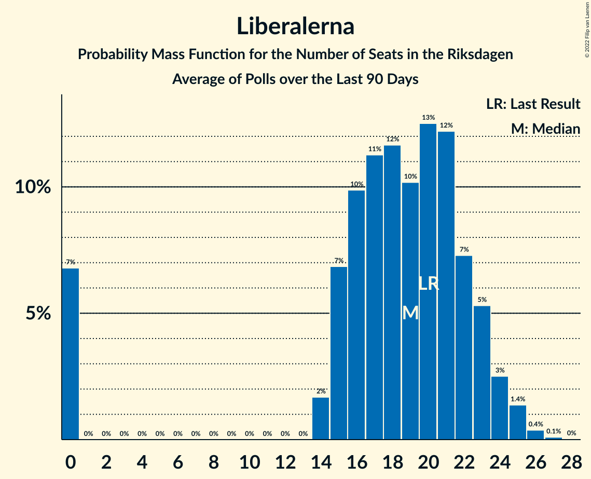

# Poll Average

<a href="#voting-intentions">Voting Intentions</a> | <a href="#seats">Seats</a> | <a href="#coalitions">Coalitions</a> | <a href="#technical-information">Technical Information</a>

## Summary

The table below lists the polls on which the average is based. They are the most recent polls (less than 90 days old) registered and analyzed so far.

| Period     | Polling firm/Commissioner(s) | S | M | SD | C | V | KD | L | MP |
|:----------:|:----------------------------:|:--:|:--:|:--:|:--:|:--:|:--:|:--:|:--:|
| 9 September 2018 | General Election | 28.3%   100 | 19.8%   70 | 17.5%   62 | 8.6%   31 | 8.0%   28 | 6.3%   22 | 5.5%   20 | 4.4%   16 |
| N/A | Poll Average | 30–36%   113–136 | 19–24%   70–89 | 14–20%   54–75 | 6–9%   22–33 | 7–10%   26–38 | 4–7%   17–26 | 2–4%   0 | 2–4%   0–15 |
| [6–14 April 2022](2022-04-14-SKOP.html) | SKOP | 32–38%   119–141 | 18–23%   67–85 | 14–18%   51–67 | 6–9%   22–34 | 8–11%   28–41 | 4–7%   17–28 | 2–4%   0 | 2–4%   0–15 |
| [29 March–5 April 2022](2022-04-05-Demoskop.html) | Demoskop   Aftonbladet | 30–34%   109–125 | 21–25%   78–92 | 15–19%   58–70 | 7–9%   26–34 | 7–9%   26–35 | 5–6%   17–24 | 2–3%   0 | 3–4%   0–16 |
| [7 March–3 April 2022](2022-04-03-Novus.html) | Novus   SVT | 31–33%   114–125 | 20–23%   76–85 | 18–20%   66–75 | 6–8%   23–29 | 7–9%   28–35 | 5–6%   19–24 | 2–3%   0 | 3–4%   0 |
| [15–27 March 2022](2022-03-27-Ipsos.html) | Ipsos   Dagens Nyheter | 31–35%   112–130 | 20–24%   73–89 | 17–21%   63–77 | 6–8%   21–30 | 7–9%   25–35 | 5–7%   18–27 | 1–3%   0 | 2–4%   0 |
| [7–17 March 2022](2022-03-17-Sifo.html) | Sifo   Svenska Dagbladet | 32–34%   118–127 | 20–22%   77–84 | 18–20%   66–73 | 6–8%   24–29 | 8–9%   30–35 | 4–5%   16–20 | 2–3%   0 | 2–3%   0 |
| 9 September 2018 | General Election | 28.3%   100 | 19.8%   70 | 17.5%   62 | 8.6%   31 | 8.0%   28 | 6.3%   22 | 5.5%   20 | 4.4%   16 |

Only polls for which at least the sample size has been published are included in the table above.

**Legend:**
+ **Top half of each row:** Voting intentions (95% confidence interval)
+ **Bottom half of each row:** Seat projections for the Riksdagen (95% confidence interval)
+ **S:** Sveriges socialdemokratiska arbetareparti
+ **M:** Moderata samlingspartiet
+ **SD:** Sverigedemokraterna
+ **C:** Centerpartiet
+ **V:** Vänsterpartiet
+ **KD:** Kristdemokraterna
+ **L:** Liberalerna
+ **MP:** Miljöpartiet de gröna
+ **N/A (single party):** Party not included the published results
+ **N/A (entire row):** Calculation for this opinion poll not started yet

## Voting Intentions

### Confidence Intervals

| Party | Last Result | Median | 80% Confidence Interval | 90% Confidence Interval | 95% Confidence Interval | 99% Confidence Interval |
|:-----:|:-----------:|:------:|:-----------------------:|:-----------------------:|:-----------------------:|:-----------------------:|
| <a href="#sveriges-socialdemokratiska-arbetareparti">Sveriges socialdemokratiska arbetareparti</a> | 28.3% | 32.6% | 31.1–34.9% |30.7–35.8% | 30.3–36.5% | 29.6–37.7% |
| <a href="#moderata-samlingspartiet">Moderata samlingspartiet</a> | 19.8% | 21.6% | 20.1–23.2% |19.4–23.7% | 18.8–24.1% | 17.8–24.8% |
| <a href="#sverigedemokraterna">Sverigedemokraterna</a> | 17.5% | 18.2% | 15.6–19.4% |14.9–19.8% | 14.4–20.2% | 13.5–21.0% |
| <a href="#centerpartiet">Centerpartiet</a> | 8.6% | 7.2% | 6.4–8.3% |6.2–8.6% | 6.0–8.9% | 5.7–9.4% |
| <a href="#vänsterpartiet">Vänsterpartiet</a> | 8.0% | 8.4% | 7.6–9.4% |7.3–9.9% | 7.1–10.3% | 6.7–11.1% |
| <a href="#kristdemokraterna">Kristdemokraterna</a> | 6.3% | 5.6% | 4.8–6.5% |4.7–6.7% | 4.5–7.0% | 4.3–7.6% |
| <a href="#liberalerna">Liberalerna</a> | 5.5% | 2.3% | 1.9–3.0% |1.7–3.3% | 1.6–3.6% | 1.4–4.1% |
| <a href="#miljöpartiet-de-gröna">Miljöpartiet de gröna</a> | 4.4% | 3.1% | 2.5–3.8% |2.4–3.9% | 2.3–4.1% | 2.0–4.4% |

### Sveriges socialdemokratiska arbetareparti

*For a full overview of the results for this party, see the [Sveriges socialdemokratiska arbetareparti](party-sverigessocialdemokratiskaarbetareparti.html) page.*

| Voting Intentions | Probability | Accumulated | Special Marks |
|:-----------------:|:-----------:|:-----------:|:-------------:|
| 27.5–28.5% | 0% | 100% | Last Result |
| 28.5–29.5% | 0.5% | 100% |  |
| 29.5–30.5% | 4% | 99.5% |  |
| 30.5–31.5% | 14% | 96% |  |
| 31.5–32.5% | 29% | 82% |  |
| 32.5–33.5% | 28% | 52% | Median |
| 33.5–34.5% | 12% | 25% |  |
| 34.5–35.5% | 7% | 13% |  |
| 35.5–36.5% | 4% | 6% |  |
| 36.5–37.5% | 2% | 2% |  |
| 37.5–38.5% | 0.5% | 0.6% |  |
| 38.5–39.5% | 0.1% | 0.1% |  |
| 39.5–40.5% | 0% | 0% |  |

### Moderata samlingspartiet

*For a full overview of the results for this party, see the [Moderata samlingspartiet](party-moderatasamlingspartiet.html) page.*

| Voting Intentions | Probability | Accumulated | Special Marks |
|:-----------------:|:-----------:|:-----------:|:-------------:|
| 15.5–16.5% | 0% | 100% |  |
| 16.5–17.5% | 0.3% | 100% |  |
| 17.5–18.5% | 1.5% | 99.7% |  |
| 18.5–19.5% | 4% | 98% |  |
| 19.5–20.5% | 10% | 94% | Last Result |
| 20.5–21.5% | 32% | 84% |  |
| 21.5–22.5% | 31% | 52% | Median |
| 22.5–23.5% | 15% | 21% |  |
| 23.5–24.5% | 6% | 6% |  |
| 24.5–25.5% | 0.9% | 0.9% |  |
| 25.5–26.5% | 0.1% | 0.1% |  |
| 26.5–27.5% | 0% | 0% |  |

### Sverigedemokraterna

*For a full overview of the results for this party, see the [Sverigedemokraterna](party-sverigedemokraterna.html) page.*

| Voting Intentions | Probability | Accumulated | Special Marks |
|:-----------------:|:-----------:|:-----------:|:-------------:|
| 11.5–12.5% | 0% | 100% |  |
| 12.5–13.5% | 0.5% | 100% |  |
| 13.5–14.5% | 3% | 99.5% |  |
| 14.5–15.5% | 7% | 97% |  |
| 15.5–16.5% | 11% | 90% |  |
| 16.5–17.5% | 15% | 79% |  |
| 17.5–18.5% | 27% | 64% | Last Result, Median |
| 18.5–19.5% | 30% | 38% |  |
| 19.5–20.5% | 7% | 8% |  |
| 20.5–21.5% | 1.1% | 1.2% |  |
| 21.5–22.5% | 0.1% | 0.1% |  |
| 22.5–23.5% | 0% | 0% |  |

### Centerpartiet

*For a full overview of the results for this party, see the [Centerpartiet](party-centerpartiet.html) page.*

| Voting Intentions | Probability | Accumulated | Special Marks |
|:-----------------:|:-----------:|:-----------:|:-------------:|
| 3.5–4.5% | 0% | 100% |  |
| 4.5–5.5% | 0.3% | 100% |  |
| 5.5–6.5% | 14% | 99.7% |  |
| 6.5–7.5% | 55% | 86% | Median |
| 7.5–8.5% | 25% | 31% |  |
| 8.5–9.5% | 6% | 6% | Last Result |
| 9.5–10.5% | 0.3% | 0.3% |  |
| 10.5–11.5% | 0% | 0% |  |

### Vänsterpartiet

*For a full overview of the results for this party, see the [Vänsterpartiet](party-vänsterpartiet.html) page.*

| Voting Intentions | Probability | Accumulated | Special Marks |
|:-----------------:|:-----------:|:-----------:|:-------------:|
| 4.5–5.5% | 0% | 100% |  |
| 5.5–6.5% | 0.3% | 100% |  |
| 6.5–7.5% | 9% | 99.7% |  |
| 7.5–8.5% | 49% | 91% | Last Result, Median |
| 8.5–9.5% | 34% | 42% |  |
| 9.5–10.5% | 6% | 8% |  |
| 10.5–11.5% | 1.4% | 2% |  |
| 11.5–12.5% | 0.2% | 0.2% |  |
| 12.5–13.5% | 0% | 0% |  |

### Kristdemokraterna

*For a full overview of the results for this party, see the [Kristdemokraterna](party-kristdemokraterna.html) page.*

| Voting Intentions | Probability | Accumulated | Special Marks |
|:-----------------:|:-----------:|:-----------:|:-------------:|
| 2.5–3.5% | 0% | 100% |  |
| 3.5–4.5% | 3% | 100% |  |
| 4.5–5.5% | 46% | 97% |  |
| 5.5–6.5% | 43% | 51% | Last Result, Median |
| 6.5–7.5% | 7% | 8% |  |
| 7.5–8.5% | 0.5% | 0.5% |  |
| 8.5–9.5% | 0% | 0% |  |

### Liberalerna

*For a full overview of the results for this party, see the [Liberalerna](party-liberalerna.html) page.*

| Voting Intentions | Probability | Accumulated | Special Marks |
|:-----------------:|:-----------:|:-----------:|:-------------:|
| 0.0–0.5% | 0% | 100% |  |
| 0.5–1.5% | 2% | 100% |  |
| 1.5–2.5% | 68% | 98% | Median |
| 2.5–3.5% | 27% | 30% |  |
| 3.5–4.5% | 3% | 3% |  |
| 4.5–5.5% | 0.1% | 0.1% | Last Result |
| 5.5–6.5% | 0% | 0% |  |

### Miljöpartiet de gröna

*For a full overview of the results for this party, see the [Miljöpartiet de gröna](party-miljöpartietdegröna.html) page.*

| Voting Intentions | Probability | Accumulated | Special Marks |
|:-----------------:|:-----------:|:-----------:|:-------------:|
| 0.5–1.5% | 0% | 100% |  |
| 1.5–2.5% | 11% | 100% |  |
| 2.5–3.5% | 70% | 89% | Median |
| 3.5–4.5% | 19% | 19% | Last Result |
| 4.5–5.5% | 0.3% | 0.3% |  |
| 5.5–6.5% | 0% | 0% |  |

## Seats

### Confidence Intervals

| Party | Last Result | Median | 80% Confidence Interval | 90% Confidence Interval | 95% Confidence Interval | 99% Confidence Interval |
|:-----:|:-----------:|:------:|:-----------------------:|:-----------------------:|:-----------------------:|:-----------------------:|
| <a href="#sveriges-socialdemokratiska-arbetareparti">Sveriges socialdemokratiska arbetareparti</a> | 100 | 121 | 116–130 |114–133 | 113–136 | 109–141 |
| <a href="#moderata-samlingspartiet">Moderata samlingspartiet</a> | 70 | 80 | 75–86 |72–88 | 70–89 | 67–92 |
| <a href="#sverigedemokraterna">Sverigedemokraterna</a> | 62 | 68 | 58–72 |56–74 | 54–75 | 51–77 |
| <a href="#centerpartiet">Centerpartiet</a> | 31 | 27 | 24–31 |23–32 | 22–33 | 21–35 |
| <a href="#vänsterpartiet">Vänsterpartiet</a> | 28 | 32 | 28–35 |27–37 | 26–38 | 25–41 |
| <a href="#kristdemokraterna">Kristdemokraterna</a> | 22 | 21 | 18–24 |17–25 | 17–26 | 16–28 |
| <a href="#liberalerna">Liberalerna</a> | 20 | 0 | 0 |0 | 0 | 0 |
| <a href="#miljöpartiet-de-gröna">Miljöpartiet de gröna</a> | 16 | 0 | 0 |0 | 0–15 | 0–16 |

### Sveriges socialdemokratiska arbetareparti

*For a full overview of the results for this party, see the [Sveriges socialdemokratiska arbetareparti](party-sverigessocialdemokratiskaarbetareparti.html) page.*

| Number of Seats | Probability | Accumulated | Special Marks |
|:---------------:|:-----------:|:-----------:|:-------------:|
| 100 | 0% | 100% | Last Result |
| 101 | 0% | 100% |  |
| 102 | 0% | 100% |  |
| 103 | 0% | 100% |  |
| 104 | 0% | 100% |  |
| 105 | 0% | 100% |  |
| 106 | 0.1% | 99.9% |  |
| 107 | 0.1% | 99.9% |  |
| 108 | 0.1% | 99.8% |  |
| 109 | 0.3% | 99.7% |  |
| 110 | 0.5% | 99.3% |  |
| 111 | 0.5% | 98.9% |  |
| 112 | 0.6% | 98% |  |
| 113 | 2% | 98% |  |
| 114 | 2% | 96% |  |
| 115 | 2% | 94% |  |
| 116 | 3% | 92% |  |
| 117 | 5% | 89% |  |
| 118 | 6% | 84% |  |
| 119 | 8% | 78% |  |
| 120 | 9% | 70% |  |
| 121 | 11% | 61% | Median |
| 122 | 9% | 50% |  |
| 123 | 8% | 41% |  |
| 124 | 7% | 33% |  |
| 125 | 4% | 26% |  |
| 126 | 3% | 21% |  |
| 127 | 4% | 18% |  |
| 128 | 2% | 15% |  |
| 129 | 1.1% | 12% |  |
| 130 | 1.1% | 11% |  |
| 131 | 2% | 10% |  |
| 132 | 1.3% | 8% |  |
| 133 | 2% | 6% |  |
| 134 | 0.8% | 4% |  |
| 135 | 0.6% | 4% |  |
| 136 | 0.6% | 3% |  |
| 137 | 0.7% | 2% |  |
| 138 | 0.5% | 2% |  |
| 139 | 0.3% | 1.1% |  |
| 140 | 0.3% | 0.9% |  |
| 141 | 0.2% | 0.6% |  |
| 142 | 0.2% | 0.3% |  |
| 143 | 0% | 0.2% |  |
| 144 | 0% | 0.1% |  |
| 145 | 0% | 0.1% |  |
| 146 | 0% | 0.1% |  |
| 147 | 0% | 0% |  |

### Moderata samlingspartiet

*For a full overview of the results for this party, see the [Moderata samlingspartiet](party-moderatasamlingspartiet.html) page.*

| Number of Seats | Probability | Accumulated | Special Marks |
|:---------------:|:-----------:|:-----------:|:-------------:|
| 63 | 0% | 100% |  |
| 64 | 0.1% | 99.9% |  |
| 65 | 0.1% | 99.8% |  |
| 66 | 0.2% | 99.7% |  |
| 67 | 0.3% | 99.5% |  |
| 68 | 0.5% | 99.3% |  |
| 69 | 0.7% | 98.8% |  |
| 70 | 0.9% | 98% | Last Result |
| 71 | 1.4% | 97% |  |
| 72 | 1.4% | 96% |  |
| 73 | 2% | 94% |  |
| 74 | 2% | 92% |  |
| 75 | 3% | 90% |  |
| 76 | 3% | 87% |  |
| 77 | 5% | 84% |  |
| 78 | 9% | 79% |  |
| 79 | 10% | 70% |  |
| 80 | 12% | 60% | Median |
| 81 | 9% | 48% |  |
| 82 | 10% | 39% |  |
| 83 | 6% | 29% |  |
| 84 | 7% | 23% |  |
| 85 | 3% | 17% |  |
| 86 | 5% | 13% |  |
| 87 | 2% | 8% |  |
| 88 | 2% | 6% |  |
| 89 | 2% | 4% |  |
| 90 | 1.1% | 2% |  |
| 91 | 0.5% | 1.2% |  |
| 92 | 0.3% | 0.7% |  |
| 93 | 0.2% | 0.5% |  |
| 94 | 0.1% | 0.2% |  |
| 95 | 0.1% | 0.1% |  |
| 96 | 0% | 0.1% |  |
| 97 | 0% | 0% |  |

### Sverigedemokraterna

*For a full overview of the results for this party, see the [Sverigedemokraterna](party-sverigedemokraterna.html) page.*

| Number of Seats | Probability | Accumulated | Special Marks |
|:---------------:|:-----------:|:-----------:|:-------------:|
| 47 | 0% | 100% |  |
| 48 | 0.1% | 99.9% |  |
| 49 | 0.1% | 99.9% |  |
| 50 | 0.2% | 99.7% |  |
| 51 | 0.5% | 99.5% |  |
| 52 | 0.6% | 99.0% |  |
| 53 | 0.7% | 98% |  |
| 54 | 1.3% | 98% |  |
| 55 | 1.3% | 97% |  |
| 56 | 2% | 95% |  |
| 57 | 2% | 93% |  |
| 58 | 3% | 91% |  |
| 59 | 3% | 88% |  |
| 60 | 3% | 86% |  |
| 61 | 3% | 83% |  |
| 62 | 3% | 79% | Last Result |
| 63 | 4% | 76% |  |
| 64 | 4% | 72% |  |
| 65 | 5% | 68% |  |
| 66 | 5% | 63% |  |
| 67 | 6% | 58% |  |
| 68 | 8% | 52% | Median |
| 69 | 11% | 44% |  |
| 70 | 9% | 33% |  |
| 71 | 9% | 24% |  |
| 72 | 5% | 14% |  |
| 73 | 4% | 9% |  |
| 74 | 2% | 5% |  |
| 75 | 1.1% | 3% |  |
| 76 | 0.8% | 1.5% |  |
| 77 | 0.3% | 0.7% |  |
| 78 | 0.2% | 0.4% |  |
| 79 | 0.1% | 0.2% |  |
| 80 | 0.1% | 0.1% |  |
| 81 | 0% | 0% |  |

### Centerpartiet

*For a full overview of the results for this party, see the [Centerpartiet](party-centerpartiet.html) page.*

| Number of Seats | Probability | Accumulated | Special Marks |
|:---------------:|:-----------:|:-----------:|:-------------:|
| 19 | 0.1% | 100% |  |
| 20 | 0.2% | 99.9% |  |
| 21 | 0.8% | 99.7% |  |
| 22 | 2% | 98.9% |  |
| 23 | 4% | 97% |  |
| 24 | 8% | 93% |  |
| 25 | 14% | 85% |  |
| 26 | 17% | 71% |  |
| 27 | 15% | 54% | Median |
| 28 | 13% | 38% |  |
| 29 | 7% | 26% |  |
| 30 | 8% | 19% |  |
| 31 | 4% | 10% | Last Result |
| 32 | 3% | 7% |  |
| 33 | 2% | 3% |  |
| 34 | 0.9% | 2% |  |
| 35 | 0.5% | 0.8% |  |
| 36 | 0.2% | 0.3% |  |
| 37 | 0.1% | 0.1% |  |
| 38 | 0% | 0% |  |

### Vänsterpartiet

*For a full overview of the results for this party, see the [Vänsterpartiet](party-vänsterpartiet.html) page.*

| Number of Seats | Probability | Accumulated | Special Marks |
|:---------------:|:-----------:|:-----------:|:-------------:|
| 23 | 0.1% | 100% |  |
| 24 | 0.3% | 99.9% |  |
| 25 | 1.1% | 99.5% |  |
| 26 | 2% | 98% |  |
| 27 | 4% | 97% |  |
| 28 | 5% | 93% | Last Result |
| 29 | 8% | 87% |  |
| 30 | 14% | 79% |  |
| 31 | 13% | 65% |  |
| 32 | 18% | 52% | Median |
| 33 | 14% | 33% |  |
| 34 | 6% | 19% |  |
| 35 | 4% | 13% |  |
| 36 | 2% | 9% |  |
| 37 | 3% | 6% |  |
| 38 | 1.2% | 3% |  |
| 39 | 0.9% | 2% |  |
| 40 | 0.5% | 1.3% |  |
| 41 | 0.4% | 0.8% |  |
| 42 | 0.3% | 0.4% |  |
| 43 | 0.1% | 0.2% |  |
| 44 | 0% | 0.1% |  |
| 45 | 0% | 0.1% |  |
| 46 | 0% | 0% |  |

### Kristdemokraterna

*For a full overview of the results for this party, see the [Kristdemokraterna](party-kristdemokraterna.html) page.*

| Number of Seats | Probability | Accumulated | Special Marks |
|:---------------:|:-----------:|:-----------:|:-------------:|
| 0 | 0.1% | 100% |  |
| 1 | 0% | 99.9% |  |
| 2 | 0% | 99.9% |  |
| 3 | 0% | 99.9% |  |
| 4 | 0% | 99.9% |  |
| 5 | 0% | 99.9% |  |
| 6 | 0% | 99.9% |  |
| 7 | 0% | 99.9% |  |
| 8 | 0% | 99.9% |  |
| 9 | 0% | 99.9% |  |
| 10 | 0% | 99.9% |  |
| 11 | 0% | 99.9% |  |
| 12 | 0% | 99.9% |  |
| 13 | 0% | 99.9% |  |
| 14 | 0% | 99.9% |  |
| 15 | 0.1% | 99.9% |  |
| 16 | 1.0% | 99.8% |  |
| 17 | 5% | 98.8% |  |
| 18 | 11% | 94% |  |
| 19 | 14% | 83% |  |
| 20 | 16% | 69% |  |
| 21 | 17% | 53% | Median |
| 22 | 13% | 37% | Last Result |
| 23 | 11% | 24% |  |
| 24 | 6% | 13% |  |
| 25 | 4% | 7% |  |
| 26 | 2% | 4% |  |
| 27 | 1.2% | 2% |  |
| 28 | 0.5% | 0.8% |  |
| 29 | 0.2% | 0.4% |  |
| 30 | 0.1% | 0.1% |  |
| 31 | 0% | 0.1% |  |
| 32 | 0% | 0% |  |

### Liberalerna

*For a full overview of the results for this party, see the [Liberalerna](party-liberalerna.html) page.*

| Number of Seats | Probability | Accumulated | Special Marks |
|:---------------:|:-----------:|:-----------:|:-------------:|
| 0 | 99.7% | 100% | Median |
| 1 | 0% | 0.3% |  |
| 2 | 0% | 0.3% |  |
| 3 | 0% | 0.3% |  |
| 4 | 0% | 0.3% |  |
| 5 | 0% | 0.3% |  |
| 6 | 0% | 0.3% |  |
| 7 | 0% | 0.3% |  |
| 8 | 0% | 0.3% |  |
| 9 | 0% | 0.3% |  |
| 10 | 0% | 0.3% |  |
| 11 | 0% | 0.3% |  |
| 12 | 0% | 0.3% |  |
| 13 | 0% | 0.3% |  |
| 14 | 0% | 0.3% |  |
| 15 | 0% | 0.3% |  |
| 16 | 0.1% | 0.3% |  |
| 17 | 0.2% | 0.2% |  |
| 18 | 0% | 0% |  |
| 19 | 0% | 0% |  |
| 20 | 0% | 0% | Last Result |

### Miljöpartiet de gröna

*For a full overview of the results for this party, see the [Miljöpartiet de gröna](party-miljöpartietdegröna.html) page.*

| Number of Seats | Probability | Accumulated | Special Marks |
|:---------------:|:-----------:|:-----------:|:-------------:|
| 0 | 97% | 100% | Median |
| 1 | 0% | 3% |  |
| 2 | 0% | 3% |  |
| 3 | 0% | 3% |  |
| 4 | 0% | 3% |  |
| 5 | 0% | 3% |  |
| 6 | 0% | 3% |  |
| 7 | 0% | 3% |  |
| 8 | 0% | 3% |  |
| 9 | 0% | 3% |  |
| 10 | 0% | 3% |  |
| 11 | 0% | 3% |  |
| 12 | 0% | 3% |  |
| 13 | 0% | 3% |  |
| 14 | 0.2% | 3% |  |
| 15 | 2% | 3% |  |
| 16 | 0.7% | 0.9% | Last Result |
| 17 | 0.2% | 0.2% |  |
| 18 | 0% | 0.1% |  |
| 19 | 0% | 0% |  |

## Coalitions

### Confidence Intervals

| Coalition | Last Result | Median | Majority? | 80% Confidence Interval | 90% Confidence Interval | 95% Confidence Interval | 99% Confidence Interval |
|:---------:|:-----------:|:------:|:---------:|:-----------------------:|:-----------------------:|:-----------------------:|:-----------------------:|
| Sveriges socialdemokratiska arbetareparti – Moderata samlingspartiet – Centerpartiet | 201 | 229 | 100% | 224–237 | 222–239 | 220–240 | 216–244 |
| Sveriges socialdemokratiska arbetareparti – Moderata samlingspartiet | 170 | 202 | 100% | 197–208 | 196–210 | 194–212 | 190–217 |
| Sveriges socialdemokratiska arbetareparti – Centerpartiet – Vänsterpartiet – Liberalerna – Miljöpartiet de gröna | 195 | 180 | 87% | 174–193 | 171–197 | 169–200 | 167–205 |
| Moderata samlingspartiet – Sverigedemokraterna – Kristdemokraterna | 154 | 169 | 13% | 156–175 | 152–178 | 149–180 | 144–182 |
| Sveriges socialdemokratiska arbetareparti – Vänsterpartiet – Miljöpartiet de gröna | 144 | 153 | 1.0% | 147–166 | 145–169 | 143–171 | 140–177 |
| Sveriges socialdemokratiska arbetareparti – Vänsterpartiet | 128 | 153 | 0.8% | 146–165 | 144–168 | 142–171 | 138–176 |
| Sveriges socialdemokratiska arbetareparti – Centerpartiet – Liberalerna – Miljöpartiet de gröna | 167 | 149 | 0.1% | 143–159 | 141–163 | 140–166 | 137–171 |
| Moderata samlingspartiet – Sverigedemokraterna | 132 | 149 | 0% | 134–154 | 130–156 | 128–158 | 123–160 |
| Moderata samlingspartiet – Centerpartiet – Kristdemokraterna – Liberalerna | 143 | 127 | 0% | 122–136 | 120–138 | 119–140 | 114–144 |
| Moderata samlingspartiet – Centerpartiet – Kristdemokraterna | 123 | 127 | 0% | 122–136 | 120–138 | 119–140 | 114–144 |
| Sveriges socialdemokratiska arbetareparti – Miljöpartiet de gröna | 116 | 122 | 0% | 117–131 | 115–134 | 113–137 | 110–142 |
| Moderata samlingspartiet – Centerpartiet – Liberalerna | 121 | 107 | 0% | 101–115 | 99–117 | 97–119 | 94–123 |
| Moderata samlingspartiet – Centerpartiet | 101 | 107 | 0% | 101–115 | 99–117 | 97–119 | 93–123 |

### Sveriges socialdemokratiska arbetareparti – Moderata samlingspartiet – Centerpartiet

| Number of Seats | Probability | Accumulated | Special Marks |
|:---------------:|:-----------:|:-----------:|:-------------:|
| 201 | 0% | 100% | Last Result |
| 202 | 0% | 100% |  |
| 203 | 0% | 100% |  |
| 204 | 0% | 100% |  |
| 205 | 0% | 100% |  |
| 206 | 0% | 100% |  |
| 207 | 0% | 100% |  |
| 208 | 0% | 100% |  |
| 209 | 0% | 100% |  |
| 210 | 0% | 100% |  |
| 211 | 0% | 100% |  |
| 212 | 0% | 99.9% |  |
| 213 | 0.1% | 99.9% |  |
| 214 | 0.1% | 99.9% |  |
| 215 | 0.1% | 99.8% |  |
| 216 | 0.2% | 99.7% |  |
| 217 | 0.3% | 99.5% |  |
| 218 | 0.4% | 99.2% |  |
| 219 | 0.5% | 98.8% |  |
| 220 | 0.9% | 98% |  |
| 221 | 2% | 97% |  |
| 222 | 2% | 96% |  |
| 223 | 2% | 94% |  |
| 224 | 4% | 91% |  |
| 225 | 5% | 87% |  |
| 226 | 7% | 82% |  |
| 227 | 10% | 75% |  |
| 228 | 10% | 65% | Median |
| 229 | 9% | 56% |  |
| 230 | 8% | 47% |  |
| 231 | 7% | 39% |  |
| 232 | 5% | 32% |  |
| 233 | 5% | 27% |  |
| 234 | 5% | 22% |  |
| 235 | 4% | 17% |  |
| 236 | 3% | 13% |  |
| 237 | 3% | 10% |  |
| 238 | 3% | 8% |  |
| 239 | 2% | 5% |  |
| 240 | 0.9% | 3% |  |
| 241 | 0.7% | 2% |  |
| 242 | 0.6% | 2% |  |
| 243 | 0.4% | 1.1% |  |
| 244 | 0.2% | 0.6% |  |
| 245 | 0.1% | 0.4% |  |
| 246 | 0.1% | 0.3% |  |
| 247 | 0.1% | 0.1% |  |
| 248 | 0% | 0.1% |  |
| 249 | 0% | 0.1% |  |
| 250 | 0% | 0% |  |

### Sveriges socialdemokratiska arbetareparti – Moderata samlingspartiet

| Number of Seats | Probability | Accumulated | Special Marks |
|:---------------:|:-----------:|:-----------:|:-------------:|
| 170 | 0% | 100% | Last Result |
| 171 | 0% | 100% |  |
| 172 | 0% | 100% |  |
| 173 | 0% | 100% |  |
| 174 | 0% | 100% |  |
| 175 | 0% | 100% | Majority |
| 176 | 0% | 100% |  |
| 177 | 0% | 100% |  |
| 178 | 0% | 100% |  |
| 179 | 0% | 100% |  |
| 180 | 0% | 100% |  |
| 181 | 0% | 100% |  |
| 182 | 0% | 100% |  |
| 183 | 0% | 100% |  |
| 184 | 0% | 100% |  |
| 185 | 0% | 100% |  |
| 186 | 0% | 99.9% |  |
| 187 | 0.1% | 99.9% |  |
| 188 | 0.1% | 99.8% |  |
| 189 | 0.2% | 99.7% |  |
| 190 | 0.3% | 99.6% |  |
| 191 | 0.3% | 99.3% |  |
| 192 | 0.6% | 99.0% |  |
| 193 | 0.7% | 98% |  |
| 194 | 1.3% | 98% |  |
| 195 | 1.4% | 96% |  |
| 196 | 2% | 95% |  |
| 197 | 3% | 93% |  |
| 198 | 4% | 89% |  |
| 199 | 6% | 86% |  |
| 200 | 8% | 79% |  |
| 201 | 10% | 71% | Median |
| 202 | 11% | 61% |  |
| 203 | 10% | 50% |  |
| 204 | 10% | 40% |  |
| 205 | 9% | 30% |  |
| 206 | 4% | 21% |  |
| 207 | 4% | 17% |  |
| 208 | 4% | 13% |  |
| 209 | 2% | 8% |  |
| 210 | 2% | 7% |  |
| 211 | 2% | 5% |  |
| 212 | 1.3% | 3% |  |
| 213 | 0.5% | 2% |  |
| 214 | 0.4% | 2% |  |
| 215 | 0.5% | 1.2% |  |
| 216 | 0.2% | 0.7% |  |
| 217 | 0.2% | 0.5% |  |
| 218 | 0.2% | 0.4% |  |
| 219 | 0.1% | 0.2% |  |
| 220 | 0% | 0.1% |  |
| 221 | 0% | 0.1% |  |
| 222 | 0% | 0.1% |  |
| 223 | 0% | 0% |  |

### Sveriges socialdemokratiska arbetareparti – Centerpartiet – Vänsterpartiet – Liberalerna – Miljöpartiet de gröna

| Number of Seats | Probability | Accumulated | Special Marks |
|:---------------:|:-----------:|:-----------:|:-------------:|
| 164 | 0% | 100% |  |
| 165 | 0.1% | 99.9% |  |
| 166 | 0.2% | 99.8% |  |
| 167 | 0.3% | 99.6% |  |
| 168 | 0.8% | 99.2% |  |
| 169 | 1.3% | 98% |  |
| 170 | 0.7% | 97% |  |
| 171 | 2% | 96% |  |
| 172 | 2% | 95% |  |
| 173 | 2% | 93% |  |
| 174 | 4% | 91% |  |
| 175 | 4% | 87% | Majority |
| 176 | 5% | 82% |  |
| 177 | 7% | 77% |  |
| 178 | 8% | 70% |  |
| 179 | 9% | 62% |  |
| 180 | 7% | 54% | Median |
| 181 | 8% | 46% |  |
| 182 | 6% | 38% |  |
| 183 | 5% | 32% |  |
| 184 | 4% | 27% |  |
| 185 | 2% | 23% |  |
| 186 | 2% | 21% |  |
| 187 | 2% | 20% |  |
| 188 | 1.5% | 18% |  |
| 189 | 1.2% | 17% |  |
| 190 | 2% | 15% |  |
| 191 | 1.2% | 14% |  |
| 192 | 2% | 12% |  |
| 193 | 0.9% | 11% |  |
| 194 | 1.1% | 10% |  |
| 195 | 1.4% | 9% | Last Result |
| 196 | 2% | 7% |  |
| 197 | 0.9% | 6% |  |
| 198 | 1.4% | 5% |  |
| 199 | 0.6% | 3% |  |
| 200 | 0.8% | 3% |  |
| 201 | 0.4% | 2% |  |
| 202 | 0.5% | 1.5% |  |
| 203 | 0.2% | 1.0% |  |
| 204 | 0.2% | 0.7% |  |
| 205 | 0.2% | 0.6% |  |
| 206 | 0.1% | 0.4% |  |
| 207 | 0.1% | 0.2% |  |
| 208 | 0% | 0.1% |  |
| 209 | 0% | 0.1% |  |
| 210 | 0% | 0.1% |  |
| 211 | 0% | 0% |  |

### Moderata samlingspartiet – Sverigedemokraterna – Kristdemokraterna

| Number of Seats | Probability | Accumulated | Special Marks |
|:---------------:|:-----------:|:-----------:|:-------------:|
| 139 | 0% | 100% |  |
| 140 | 0% | 99.9% |  |
| 141 | 0% | 99.9% |  |
| 142 | 0.1% | 99.9% |  |
| 143 | 0.1% | 99.8% |  |
| 144 | 0.2% | 99.6% |  |
| 145 | 0.2% | 99.4% |  |
| 146 | 0.2% | 99.3% |  |
| 147 | 0.5% | 99.0% |  |
| 148 | 0.4% | 98.5% |  |
| 149 | 0.8% | 98% |  |
| 150 | 0.6% | 97% |  |
| 151 | 1.4% | 97% |  |
| 152 | 0.9% | 95% |  |
| 153 | 2% | 94% |  |
| 154 | 1.4% | 93% | Last Result |
| 155 | 1.1% | 91% |  |
| 156 | 0.9% | 90% |  |
| 157 | 2% | 89% |  |
| 158 | 1.2% | 88% |  |
| 159 | 2% | 86% |  |
| 160 | 1.2% | 85% |  |
| 161 | 1.5% | 83% |  |
| 162 | 2% | 82% |  |
| 163 | 2% | 80% |  |
| 164 | 2% | 79% |  |
| 165 | 4% | 77% |  |
| 166 | 5% | 73% |  |
| 167 | 6% | 68% |  |
| 168 | 8% | 62% |  |
| 169 | 7% | 54% | Median |
| 170 | 9% | 46% |  |
| 171 | 8% | 38% |  |
| 172 | 7% | 30% |  |
| 173 | 5% | 23% |  |
| 174 | 4% | 18% |  |
| 175 | 4% | 13% | Majority |
| 176 | 2% | 9% |  |
| 177 | 2% | 7% |  |
| 178 | 2% | 5% |  |
| 179 | 0.7% | 4% |  |
| 180 | 1.3% | 3% |  |
| 181 | 0.8% | 2% |  |
| 182 | 0.3% | 0.8% |  |
| 183 | 0.2% | 0.4% |  |
| 184 | 0.1% | 0.2% |  |
| 185 | 0% | 0.1% |  |
| 186 | 0% | 0% |  |

### Sveriges socialdemokratiska arbetareparti – Vänsterpartiet – Miljöpartiet de gröna

| Number of Seats | Probability | Accumulated | Special Marks |
|:---------------:|:-----------:|:-----------:|:-------------:|
| 137 | 0% | 100% |  |
| 138 | 0.1% | 99.9% |  |
| 139 | 0.1% | 99.8% |  |
| 140 | 0.4% | 99.7% |  |
| 141 | 0.4% | 99.4% |  |
| 142 | 0.9% | 99.0% |  |
| 143 | 1.3% | 98% |  |
| 144 | 1.0% | 97% | Last Result |
| 145 | 2% | 96% |  |
| 146 | 3% | 94% |  |
| 147 | 3% | 91% |  |
| 148 | 4% | 89% |  |
| 149 | 6% | 84% |  |
| 150 | 8% | 79% |  |
| 151 | 10% | 71% |  |
| 152 | 6% | 61% |  |
| 153 | 8% | 55% | Median |
| 154 | 7% | 47% |  |
| 155 | 7% | 40% |  |
| 156 | 6% | 33% |  |
| 157 | 4% | 27% |  |
| 158 | 3% | 23% |  |
| 159 | 2% | 20% |  |
| 160 | 2% | 18% |  |
| 161 | 1.0% | 16% |  |
| 162 | 1.4% | 15% |  |
| 163 | 2% | 14% |  |
| 164 | 1.2% | 12% |  |
| 165 | 1.2% | 11% |  |
| 166 | 2% | 10% |  |
| 167 | 0.9% | 8% |  |
| 168 | 2% | 7% |  |
| 169 | 1.1% | 5% |  |
| 170 | 1.3% | 4% |  |
| 171 | 0.8% | 3% |  |
| 172 | 0.5% | 2% |  |
| 173 | 0.5% | 2% |  |
| 174 | 0.3% | 1.4% |  |
| 175 | 0.2% | 1.0% | Majority |
| 176 | 0.3% | 0.8% |  |
| 177 | 0.2% | 0.5% |  |
| 178 | 0.1% | 0.4% |  |
| 179 | 0.1% | 0.3% |  |
| 180 | 0.1% | 0.2% |  |
| 181 | 0.1% | 0.1% |  |
| 182 | 0% | 0.1% |  |
| 183 | 0% | 0% |  |

### Sveriges socialdemokratiska arbetareparti – Vänsterpartiet

| Number of Seats | Probability | Accumulated | Special Marks |
|:---------------:|:-----------:|:-----------:|:-------------:|
| 128 | 0% | 100% | Last Result |
| 129 | 0% | 100% |  |
| 130 | 0% | 100% |  |
| 131 | 0% | 100% |  |
| 132 | 0% | 100% |  |
| 133 | 0% | 100% |  |
| 134 | 0% | 100% |  |
| 135 | 0.1% | 99.9% |  |
| 136 | 0.1% | 99.8% |  |
| 137 | 0.1% | 99.7% |  |
| 138 | 0.3% | 99.6% |  |
| 139 | 0.3% | 99.4% |  |
| 140 | 0.6% | 99.1% |  |
| 141 | 0.5% | 98.5% |  |
| 142 | 1.1% | 98% |  |
| 143 | 2% | 97% |  |
| 144 | 1.2% | 95% |  |
| 145 | 2% | 94% |  |
| 146 | 3% | 92% |  |
| 147 | 3% | 89% |  |
| 148 | 4% | 86% |  |
| 149 | 6% | 82% |  |
| 150 | 8% | 76% |  |
| 151 | 10% | 68% |  |
| 152 | 6% | 58% |  |
| 153 | 8% | 52% | Median |
| 154 | 7% | 45% |  |
| 155 | 7% | 38% |  |
| 156 | 6% | 31% |  |
| 157 | 4% | 25% |  |
| 158 | 2% | 21% |  |
| 159 | 2% | 19% |  |
| 160 | 2% | 17% |  |
| 161 | 0.8% | 15% |  |
| 162 | 1.2% | 14% |  |
| 163 | 2% | 13% |  |
| 164 | 1.1% | 12% |  |
| 165 | 1.1% | 10% |  |
| 166 | 2% | 9% |  |
| 167 | 0.8% | 7% |  |
| 168 | 2% | 7% |  |
| 169 | 1.0% | 5% |  |
| 170 | 1.2% | 4% |  |
| 171 | 0.8% | 3% |  |
| 172 | 0.5% | 2% |  |
| 173 | 0.3% | 1.4% |  |
| 174 | 0.3% | 1.0% |  |
| 175 | 0.2% | 0.8% | Majority |
| 176 | 0.2% | 0.6% |  |
| 177 | 0.1% | 0.4% |  |
| 178 | 0.1% | 0.3% |  |
| 179 | 0.1% | 0.2% |  |
| 180 | 0.1% | 0.1% |  |
| 181 | 0% | 0.1% |  |
| 182 | 0% | 0% |  |

### Sveriges socialdemokratiska arbetareparti – Centerpartiet – Liberalerna – Miljöpartiet de gröna

| Number of Seats | Probability | Accumulated | Special Marks |
|:---------------:|:-----------:|:-----------:|:-------------:|
| 134 | 0% | 100% |  |
| 135 | 0.1% | 99.9% |  |
| 136 | 0.1% | 99.8% |  |
| 137 | 0.2% | 99.7% |  |
| 138 | 0.4% | 99.4% |  |
| 139 | 0.8% | 99.0% |  |
| 140 | 1.2% | 98% |  |
| 141 | 3% | 97% |  |
| 142 | 2% | 94% |  |
| 143 | 4% | 92% |  |
| 144 | 5% | 89% |  |
| 145 | 5% | 83% |  |
| 146 | 7% | 78% |  |
| 147 | 10% | 71% |  |
| 148 | 8% | 61% | Median |
| 149 | 11% | 53% |  |
| 150 | 7% | 42% |  |
| 151 | 6% | 35% |  |
| 152 | 4% | 29% |  |
| 153 | 3% | 24% |  |
| 154 | 2% | 21% |  |
| 155 | 3% | 19% |  |
| 156 | 2% | 16% |  |
| 157 | 1.4% | 15% |  |
| 158 | 3% | 13% |  |
| 159 | 1.4% | 10% |  |
| 160 | 1.4% | 9% |  |
| 161 | 1.4% | 8% |  |
| 162 | 1.1% | 6% |  |
| 163 | 1.1% | 5% |  |
| 164 | 0.6% | 4% |  |
| 165 | 0.8% | 3% |  |
| 166 | 0.5% | 3% |  |
| 167 | 0.6% | 2% | Last Result |
| 168 | 0.5% | 2% |  |
| 169 | 0.4% | 1.1% |  |
| 170 | 0.2% | 0.7% |  |
| 171 | 0.2% | 0.5% |  |
| 172 | 0.1% | 0.3% |  |
| 173 | 0.1% | 0.2% |  |
| 174 | 0.1% | 0.2% |  |
| 175 | 0% | 0.1% | Majority |
| 176 | 0% | 0.1% |  |
| 177 | 0% | 0% |  |

### Moderata samlingspartiet – Sverigedemokraterna

| Number of Seats | Probability | Accumulated | Special Marks |
|:---------------:|:-----------:|:-----------:|:-------------:|
| 118 | 0% | 100% |  |
| 119 | 0% | 99.9% |  |
| 120 | 0.1% | 99.9% |  |
| 121 | 0.1% | 99.8% |  |
| 122 | 0.1% | 99.7% |  |
| 123 | 0.2% | 99.6% |  |
| 124 | 0.3% | 99.4% |  |
| 125 | 0.4% | 99.1% |  |
| 126 | 0.4% | 98.8% |  |
| 127 | 0.4% | 98% |  |
| 128 | 1.1% | 98% |  |
| 129 | 1.2% | 97% |  |
| 130 | 0.7% | 96% |  |
| 131 | 2% | 95% |  |
| 132 | 2% | 93% | Last Result |
| 133 | 1.1% | 92% |  |
| 134 | 2% | 91% |  |
| 135 | 0.9% | 89% |  |
| 136 | 2% | 88% |  |
| 137 | 1.0% | 86% |  |
| 138 | 1.2% | 85% |  |
| 139 | 2% | 84% |  |
| 140 | 0.9% | 82% |  |
| 141 | 1.1% | 81% |  |
| 142 | 1.2% | 80% |  |
| 143 | 2% | 79% |  |
| 144 | 2% | 77% |  |
| 145 | 3% | 75% |  |
| 146 | 5% | 72% |  |
| 147 | 6% | 68% |  |
| 148 | 8% | 62% | Median |
| 149 | 10% | 54% |  |
| 150 | 11% | 44% |  |
| 151 | 9% | 33% |  |
| 152 | 7% | 24% |  |
| 153 | 5% | 17% |  |
| 154 | 4% | 12% |  |
| 155 | 3% | 8% |  |
| 156 | 1.5% | 5% |  |
| 157 | 1.4% | 4% |  |
| 158 | 1.3% | 3% |  |
| 159 | 0.6% | 1.3% |  |
| 160 | 0.4% | 0.8% |  |
| 161 | 0.2% | 0.3% |  |
| 162 | 0% | 0.1% |  |
| 163 | 0% | 0.1% |  |
| 164 | 0% | 0% |  |

### Moderata samlingspartiet – Centerpartiet – Kristdemokraterna – Liberalerna

| Number of Seats | Probability | Accumulated | Special Marks |
|:---------------:|:-----------:|:-----------:|:-------------:|
| 109 | 0% | 100% |  |
| 110 | 0% | 99.9% |  |
| 111 | 0% | 99.9% |  |
| 112 | 0.2% | 99.9% |  |
| 113 | 0.1% | 99.7% |  |
| 114 | 0.2% | 99.6% |  |
| 115 | 0.1% | 99.4% |  |
| 116 | 0.2% | 99.3% |  |
| 117 | 0.5% | 99.1% |  |
| 118 | 0.6% | 98.6% |  |
| 119 | 1.1% | 98% |  |
| 120 | 2% | 97% |  |
| 121 | 2% | 95% |  |
| 122 | 4% | 92% |  |
| 123 | 6% | 88% |  |
| 124 | 7% | 82% |  |
| 125 | 10% | 76% |  |
| 126 | 7% | 66% |  |
| 127 | 10% | 59% |  |
| 128 | 5% | 49% | Median |
| 129 | 7% | 44% |  |
| 130 | 4% | 37% |  |
| 131 | 4% | 32% |  |
| 132 | 5% | 28% |  |
| 133 | 4% | 23% |  |
| 134 | 4% | 19% |  |
| 135 | 5% | 15% |  |
| 136 | 2% | 10% |  |
| 137 | 2% | 8% |  |
| 138 | 2% | 6% |  |
| 139 | 1.1% | 4% |  |
| 140 | 1.0% | 3% |  |
| 141 | 0.6% | 2% |  |
| 142 | 0.4% | 1.3% |  |
| 143 | 0.3% | 0.9% | Last Result |
| 144 | 0.3% | 0.6% |  |
| 145 | 0.2% | 0.4% |  |
| 146 | 0.1% | 0.2% |  |
| 147 | 0% | 0.1% |  |
| 148 | 0% | 0% |  |

### Moderata samlingspartiet – Centerpartiet – Kristdemokraterna

| Number of Seats | Probability | Accumulated | Special Marks |
|:---------------:|:-----------:|:-----------:|:-------------:|
| 109 | 0% | 100% |  |
| 110 | 0% | 99.9% |  |
| 111 | 0% | 99.9% |  |
| 112 | 0.2% | 99.9% |  |
| 113 | 0.1% | 99.7% |  |
| 114 | 0.2% | 99.6% |  |
| 115 | 0.1% | 99.3% |  |
| 116 | 0.2% | 99.2% |  |
| 117 | 0.5% | 99.1% |  |
| 118 | 0.6% | 98.5% |  |
| 119 | 1.1% | 98% |  |
| 120 | 2% | 97% |  |
| 121 | 3% | 94% |  |
| 122 | 4% | 92% |  |
| 123 | 6% | 88% | Last Result |
| 124 | 7% | 82% |  |
| 125 | 10% | 75% |  |
| 126 | 7% | 66% |  |
| 127 | 10% | 59% |  |
| 128 | 5% | 49% | Median |
| 129 | 7% | 44% |  |
| 130 | 4% | 36% |  |
| 131 | 4% | 32% |  |
| 132 | 5% | 28% |  |
| 133 | 4% | 22% |  |
| 134 | 4% | 19% |  |
| 135 | 5% | 15% |  |
| 136 | 2% | 10% |  |
| 137 | 2% | 8% |  |
| 138 | 2% | 6% |  |
| 139 | 1.1% | 4% |  |
| 140 | 1.0% | 3% |  |
| 141 | 0.6% | 2% |  |
| 142 | 0.4% | 1.2% |  |
| 143 | 0.2% | 0.8% |  |
| 144 | 0.3% | 0.6% |  |
| 145 | 0.2% | 0.4% |  |
| 146 | 0.1% | 0.2% |  |
| 147 | 0% | 0.1% |  |
| 148 | 0% | 0% |  |

### Sveriges socialdemokratiska arbetareparti – Miljöpartiet de gröna

| Number of Seats | Probability | Accumulated | Special Marks |
|:---------------:|:-----------:|:-----------:|:-------------:|
| 108 | 0.1% | 100% |  |
| 109 | 0.1% | 99.9% |  |
| 110 | 0.3% | 99.8% |  |
| 111 | 0.3% | 99.4% |  |
| 112 | 0.5% | 99.1% |  |
| 113 | 1.4% | 98.6% |  |
| 114 | 2% | 97% |  |
| 115 | 2% | 96% |  |
| 116 | 3% | 94% | Last Result |
| 117 | 5% | 91% |  |
| 118 | 6% | 86% |  |
| 119 | 8% | 80% |  |
| 120 | 9% | 73% |  |
| 121 | 11% | 64% | Median |
| 122 | 9% | 53% |  |
| 123 | 8% | 44% |  |
| 124 | 7% | 36% |  |
| 125 | 4% | 28% |  |
| 126 | 3% | 24% |  |
| 127 | 4% | 21% |  |
| 128 | 3% | 17% |  |
| 129 | 2% | 14% |  |
| 130 | 1.4% | 13% |  |
| 131 | 2% | 11% |  |
| 132 | 1.5% | 9% |  |
| 133 | 2% | 7% |  |
| 134 | 0.9% | 5% |  |
| 135 | 0.7% | 4% |  |
| 136 | 0.7% | 4% |  |
| 137 | 0.8% | 3% |  |
| 138 | 0.5% | 2% |  |
| 139 | 0.3% | 2% |  |
| 140 | 0.3% | 1.3% |  |
| 141 | 0.3% | 1.0% |  |
| 142 | 0.3% | 0.7% |  |
| 143 | 0.1% | 0.4% |  |
| 144 | 0.1% | 0.3% |  |
| 145 | 0% | 0.2% |  |
| 146 | 0.1% | 0.2% |  |
| 147 | 0% | 0.1% |  |
| 148 | 0% | 0.1% |  |
| 149 | 0% | 0% |  |

### Moderata samlingspartiet – Centerpartiet – Liberalerna

| Number of Seats | Probability | Accumulated | Special Marks |
|:---------------:|:-----------:|:-----------:|:-------------:|
| 89 | 0% | 100% |  |
| 90 | 0% | 99.9% |  |
| 91 | 0.1% | 99.9% |  |
| 92 | 0.1% | 99.8% |  |
| 93 | 0.2% | 99.7% |  |
| 94 | 0.3% | 99.5% |  |
| 95 | 0.3% | 99.2% |  |
| 96 | 0.6% | 98.9% |  |
| 97 | 1.0% | 98% |  |
| 98 | 1.1% | 97% |  |
| 99 | 2% | 96% |  |
| 100 | 3% | 95% |  |
| 101 | 3% | 92% |  |
| 102 | 4% | 89% |  |
| 103 | 6% | 85% |  |
| 104 | 6% | 79% |  |
| 105 | 11% | 73% |  |
| 106 | 10% | 62% |  |
| 107 | 9% | 52% | Median |
| 108 | 7% | 44% |  |
| 109 | 6% | 36% |  |
| 110 | 5% | 30% |  |
| 111 | 4% | 25% |  |
| 112 | 3% | 21% |  |
| 113 | 3% | 18% |  |
| 114 | 3% | 15% |  |
| 115 | 4% | 13% |  |
| 116 | 2% | 8% |  |
| 117 | 2% | 6% |  |
| 118 | 1.2% | 4% |  |
| 119 | 1.1% | 3% |  |
| 120 | 0.8% | 2% |  |
| 121 | 0.4% | 1.4% | Last Result |
| 122 | 0.3% | 1.0% |  |
| 123 | 0.2% | 0.7% |  |
| 124 | 0.2% | 0.5% |  |
| 125 | 0.1% | 0.2% |  |
| 126 | 0.1% | 0.2% |  |
| 127 | 0% | 0.1% |  |
| 128 | 0% | 0% |  |

### Moderata samlingspartiet – Centerpartiet

| Number of Seats | Probability | Accumulated | Special Marks |
|:---------------:|:-----------:|:-----------:|:-------------:|
| 88 | 0% | 100% |  |
| 89 | 0% | 99.9% |  |
| 90 | 0% | 99.9% |  |
| 91 | 0.1% | 99.9% |  |
| 92 | 0.2% | 99.8% |  |
| 93 | 0.2% | 99.6% |  |
| 94 | 0.3% | 99.4% |  |
| 95 | 0.3% | 99.1% |  |
| 96 | 0.6% | 98.8% |  |
| 97 | 1.0% | 98% |  |
| 98 | 1.1% | 97% |  |
| 99 | 2% | 96% |  |
| 100 | 3% | 95% |  |
| 101 | 3% | 92% | Last Result |
| 102 | 4% | 89% |  |
| 103 | 6% | 85% |  |
| 104 | 6% | 79% |  |
| 105 | 11% | 73% |  |
| 106 | 10% | 62% |  |
| 107 | 9% | 52% | Median |
| 108 | 7% | 43% |  |
| 109 | 6% | 36% |  |
| 110 | 5% | 30% |  |
| 111 | 4% | 25% |  |
| 112 | 3% | 21% |  |
| 113 | 3% | 18% |  |
| 114 | 3% | 15% |  |
| 115 | 4% | 12% |  |
| 116 | 2% | 8% |  |
| 117 | 2% | 6% |  |
| 118 | 1.2% | 4% |  |
| 119 | 1.0% | 3% |  |
| 120 | 0.8% | 2% |  |
| 121 | 0.4% | 1.4% |  |
| 122 | 0.3% | 1.0% |  |
| 123 | 0.2% | 0.7% |  |
| 124 | 0.2% | 0.5% |  |
| 125 | 0.1% | 0.2% |  |
| 126 | 0.1% | 0.1% |  |
| 127 | 0% | 0.1% |  |
| 128 | 0% | 0% |  |

## Technical Information

+ **Number of polls included in this average:** 5
+ **Lowest number of simulations done in a poll included in this average:** 1,048,576
+ **Total number of simulations done in the polls included in this average:** 5,242,880
+ **Error estimate:** 2.27%
