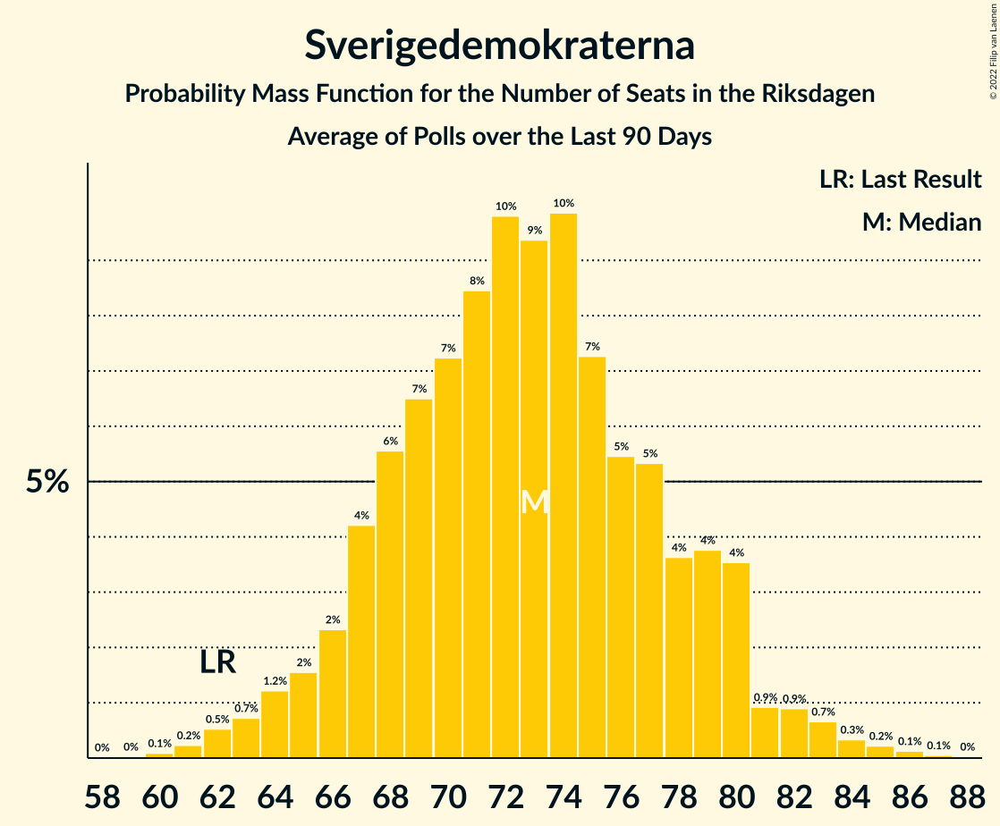

# Poll Average

<a href="#voting-intentions">Voting Intentions</a> | <a href="#seats">Seats</a> | <a href="#coalitions">Coalitions</a> | <a href="#technical-information">Technical Information</a>

## Summary

The table below lists the polls on which the average is based. They are the most recent polls (less than 90 days old) registered and analyzed so far.

| Period     | Polling firm/Commissioner(s) | S | M | SD | C | V | KD | L | MP |
|:----------:|:----------------------------:|:--:|:--:|:--:|:--:|:--:|:--:|:--:|:--:|
| 9 September 2018 | General Election | 28.3%   100 | 19.8%   70 | 17.5%   62 | 8.6%   31 | 8.0%   28 | 6.3%   22 | 5.5%   20 | 4.4%   16 |
| N/A | Poll Average | 23–27%   90–100 | 17–19%   62–70 | 22–24%   77–89 | 7–9%   24–33 | 8–12%   27–46 | 6–7%   20–26 | 4–5%   0–16 | 4–6%   0–21 |
| [3–13 February 2020](2020-02-13-Sifo.html) | Sifo | 23–25%   93 | 17–18%   68 | 22–24%   89 | 8–9%   33 | 11–12%   46 | 6–7%   20 | 4–5%   0 | 4–5%   0 |
| [25 January–5 February 2020](2020-02-05-Demoskop.html) | Demoskop | N/A   N/A | N/A   N/A | N/A   N/A | N/A   N/A | N/A   N/A | N/A   N/A | N/A   N/A | N/A   N/A |
| [24–28 January 2020](2020-01-28-Sentio.html) | Sentio   Nyheter Idag | N/A   N/A | N/A   N/A | N/A   N/A | N/A   N/A | N/A   N/A | N/A   N/A | N/A   N/A | N/A   N/A |
| [14–27 January 2020](2020-01-27-Ipsos.html) | Ipsos   Dagens Nyheter | N/A   N/A | N/A   N/A | N/A   N/A | N/A   N/A | N/A   N/A | N/A   N/A | N/A   N/A | N/A   N/A |
| [7–26 January 2020](2020-01-26-Novus.html) | Novus   SVT | N/A   N/A | N/A   N/A | N/A   N/A | N/A   N/A | N/A   N/A | N/A   N/A | N/A   N/A | N/A   N/A |
| [14–24 January 2020](2020-01-24-SKOP.html) | SKOP | N/A   N/A | N/A   N/A | N/A   N/A | N/A   N/A | N/A   N/A | N/A   N/A | N/A   N/A | N/A   N/A |
| [28 October–26 November 2019](2019-11-26-SCB.html) | SCB | 25–28%   89–101 | 17–19%   61–71 | 21–24%   76–87 | 7–8%   24–29 | 7–9%   26–32 | 6–7%   21–27 | 4–5%   0–17 | 4–6%   16–21 |
| 9 September 2018 | General Election | 28.3%   100 | 19.8%   70 | 17.5%   62 | 8.6%   31 | 8.0%   28 | 6.3%   22 | 5.5%   20 | 4.4%   16 |

Only polls for which at least the sample size has been published are included in the table above.

**Legend:**
+ **Top half of each row:** Voting intentions (95% confidence interval)
+ **Bottom half of each row:** Seat projections for the Riksdagen (95% confidence interval)
+ **S:** Sveriges socialdemokratiska arbetareparti
+ **M:** Moderata samlingspartiet
+ **SD:** Sverigedemokraterna
+ **C:** Centerpartiet
+ **V:** Vänsterpartiet
+ **KD:** Kristdemokraterna
+ **L:** Liberalerna
+ **MP:** Miljöpartiet de gröna
+ **N/A (single party):** Party not included the published results
+ **N/A (entire row):** Calculation for this opinion poll not started yet

## Voting Intentions

### Confidence Intervals

| Party | Last Result | Median | 80% Confidence Interval | 90% Confidence Interval | 95% Confidence Interval | 99% Confidence Interval |
|:-----:|:-----------:|:------:|:-----------------------:|:-----------------------:|:-----------------------:|:-----------------------:|
| <a href="#sveriges-socialdemokratiska-arbetareparti">Sveriges socialdemokratiska arbetareparti</a> | 28.3% | 24.7% | 23.2–26.9% |23.0–27.2% | 22.8–27.4% | 22.5–27.8% |
| <a href="#moderata-samlingspartiet">Moderata samlingspartiet</a> | 19.8% | 17.8% | 17.1–18.8% |16.9–19.0% | 16.8–19.3% | 16.5–19.7% |
| <a href="#sverigedemokraterna">Sverigedemokraterna</a> | 17.5% | 23.0% | 22.1–23.7% |21.8–23.9% | 21.6–24.1% | 21.2–24.4% |
| <a href="#centerpartiet">Centerpartiet</a> | 8.6% | 7.8% | 7.0–8.4% |6.8–8.5% | 6.7–8.6% | 6.5–8.8% |
| <a href="#vänsterpartiet">Vänsterpartiet</a> | 8.0% | 9.9% | 7.8–11.7% |7.6–11.8% | 7.5–12.0% | 7.2–12.2% |
| <a href="#kristdemokraterna">Kristdemokraterna</a> | 6.3% | 6.3% | 5.9–6.9% |5.8–7.1% | 5.7–7.2% | 5.5–7.5% |
| <a href="#liberalerna">Liberalerna</a> | 5.5% | 4.3% | 3.9–4.6% |3.7–4.7% | 3.6–4.8% | 3.5–5.0% |
| <a href="#miljöpartiet-de-gröna">Miljöpartiet de gröna</a> | 4.4% | 4.6% | 4.0–5.4% |3.9–5.5% | 3.8–5.7% | 3.7–5.9% |

### Sveriges socialdemokratiska arbetareparti

*For a full overview of the results for this party, see the [Sveriges socialdemokratiska arbetareparti](party-sverigessocialdemokratiskaarbetareparti.html) page.*

| Voting Intentions | Probability | Accumulated | Special Marks |
|:-----------------:|:-----------:|:-----------:|:-------------:|
| 20.5–21.5% | 0% | 100% |  |
| 21.5–22.5% | 0.7% | 100% |  |
| 22.5–23.5% | 23% | 99.3% |  |
| 23.5–24.5% | 25% | 76% |  |
| 24.5–25.5% | 7% | 51% | Median |
| 25.5–26.5% | 26% | 44% |  |
| 26.5–27.5% | 16% | 18% |  |
| 27.5–28.5% | 1.4% | 1.4% | Last Result |
| 28.5–29.5% | 0% | 0% |  |

### Moderata samlingspartiet

*For a full overview of the results for this party, see the [Moderata samlingspartiet](party-moderatasamlingspartiet.html) page.*

| Voting Intentions | Probability | Accumulated | Special Marks |
|:-----------------:|:-----------:|:-----------:|:-------------:|
| 14.5–15.5% | 0% | 100% |  |
| 15.5–16.5% | 0.6% | 100% |  |
| 16.5–17.5% | 31% | 99.4% |  |
| 17.5–18.5% | 51% | 68% | Median |
| 18.5–19.5% | 16% | 17% |  |
| 19.5–20.5% | 0.8% | 0.8% | Last Result |
| 20.5–21.5% | 0% | 0% |  |

### Sverigedemokraterna

*For a full overview of the results for this party, see the [Sverigedemokraterna](party-sverigedemokraterna.html) page.*

| Voting Intentions | Probability | Accumulated | Special Marks |
|:-----------------:|:-----------:|:-----------:|:-------------:|
| 17.5–18.5% | 0% | 100% | Last Result |
| 18.5–19.5% | 0% | 100% |  |
| 19.5–20.5% | 0% | 100% |  |
| 20.5–21.5% | 2% | 100% |  |
| 21.5–22.5% | 24% | 98% |  |
| 22.5–23.5% | 57% | 74% | Median |
| 23.5–24.5% | 17% | 17% |  |
| 24.5–25.5% | 0.2% | 0.2% |  |
| 25.5–26.5% | 0% | 0% |  |

### Centerpartiet

*For a full overview of the results for this party, see the [Centerpartiet](party-centerpartiet.html) page.*

| Voting Intentions | Probability | Accumulated | Special Marks |
|:-----------------:|:-----------:|:-----------:|:-------------:|
| 4.5–5.5% | 0% | 100% |  |
| 5.5–6.5% | 1.0% | 100% |  |
| 6.5–7.5% | 37% | 99.0% |  |
| 7.5–8.5% | 59% | 62% | Median |
| 8.5–9.5% | 3% | 3% | Last Result |
| 9.5–10.5% | 0% | 0% |  |

### Vänsterpartiet

*For a full overview of the results for this party, see the [Vänsterpartiet](party-vänsterpartiet.html) page.*

| Voting Intentions | Probability | Accumulated | Special Marks |
|:-----------------:|:-----------:|:-----------:|:-------------:|
| 5.5–6.5% | 0% | 100% |  |
| 6.5–7.5% | 4% | 100% |  |
| 7.5–8.5% | 39% | 96% | Last Result |
| 8.5–9.5% | 7% | 57% |  |
| 9.5–10.5% | 0.3% | 50% | Median |
| 10.5–11.5% | 34% | 50% |  |
| 11.5–12.5% | 16% | 16% |  |
| 12.5–13.5% | 0% | 0% |  |

### Kristdemokraterna

*For a full overview of the results for this party, see the [Kristdemokraterna](party-kristdemokraterna.html) page.*

| Voting Intentions | Probability | Accumulated | Special Marks |
|:-----------------:|:-----------:|:-----------:|:-------------:|
| 3.5–4.5% | 0% | 100% |  |
| 4.5–5.5% | 0.7% | 100% |  |
| 5.5–6.5% | 68% | 99.3% | Last Result, Median |
| 6.5–7.5% | 31% | 31% |  |
| 7.5–8.5% | 0.4% | 0.4% |  |
| 8.5–9.5% | 0% | 0% |  |

### Liberalerna

*For a full overview of the results for this party, see the [Liberalerna](party-liberalerna.html) page.*

| Voting Intentions | Probability | Accumulated | Special Marks |
|:-----------------:|:-----------:|:-----------:|:-------------:|
| 1.5–2.5% | 0% | 100% |  |
| 2.5–3.5% | 1.2% | 100% |  |
| 3.5–4.5% | 83% | 98.8% | Median |
| 4.5–5.5% | 16% | 16% | Last Result |
| 5.5–6.5% | 0% | 0% |  |

### Miljöpartiet de gröna

*For a full overview of the results for this party, see the [Miljöpartiet de gröna](party-miljöpartietdegröna.html) page.*

| Voting Intentions | Probability | Accumulated | Special Marks |
|:-----------------:|:-----------:|:-----------:|:-------------:|
| 2.5–3.5% | 0% | 100% |  |
| 3.5–4.5% | 49% | 100% | Last Result |
| 4.5–5.5% | 46% | 51% | Median |
| 5.5–6.5% | 5% | 5% |  |
| 6.5–7.5% | 0% | 0% |  |

## Seats

### Confidence Intervals

| Party | Last Result | Median | 80% Confidence Interval | 90% Confidence Interval | 95% Confidence Interval | 99% Confidence Interval |
|:-----:|:-----------:|:------:|:-----------------------:|:-----------------------:|:-----------------------:|:-----------------------:|
| <a href="#sveriges-socialdemokratiska-arbetareparti">Sveriges socialdemokratiska arbetareparti</a> | 100 | 93 | 92–97 |91–99 | 90–100 | 88–102 |
| <a href="#moderata-samlingspartiet">Moderata samlingspartiet</a> | 70 | 68 | 63–68 |63–69 | 62–70 | 61–71 |
| <a href="#sverigedemokraterna">Sverigedemokraterna</a> | 62 | 89 | 79–89 |78–89 | 77–89 | 75–89 |
| <a href="#centerpartiet">Centerpartiet</a> | 31 | 33 | 25–33 |24–33 | 24–33 | 23–33 |
| <a href="#vänsterpartiet">Vänsterpartiet</a> | 28 | 39 | 28–46 |27–46 | 27–46 | 26–46 |
| <a href="#kristdemokraterna">Kristdemokraterna</a> | 22 | 20 | 20–25 |20–25 | 20–26 | 20–27 |
| <a href="#liberalerna">Liberalerna</a> | 20 | 0 | 0–15 |0–16 | 0–16 | 0–17 |
| <a href="#miljöpartiet-de-gröna">Miljöpartiet de gröna</a> | 16 | 0 | 0–20 |0–20 | 0–21 | 0–21 |

### Sveriges socialdemokratiska arbetareparti

*For a full overview of the results for this party, see the [Sveriges socialdemokratiska arbetareparti](party-sverigessocialdemokratiskaarbetareparti.html) page.*

| Number of Seats | Probability | Accumulated | Special Marks |
|:---------------:|:-----------:|:-----------:|:-------------:|
| 86 | 0.1% | 100% |  |
| 87 | 0.3% | 99.9% |  |
| 88 | 0.3% | 99.6% |  |
| 89 | 1.2% | 99.3% |  |
| 90 | 2% | 98% |  |
| 91 | 4% | 96% |  |
| 92 | 3% | 92% |  |
| 93 | 56% | 89% | Median |
| 94 | 8% | 32% |  |
| 95 | 7% | 25% |  |
| 96 | 6% | 18% |  |
| 97 | 3% | 12% |  |
| 98 | 4% | 9% |  |
| 99 | 2% | 5% |  |
| 100 | 2% | 4% | Last Result |
| 101 | 1.0% | 2% |  |
| 102 | 0.3% | 0.6% |  |
| 103 | 0.2% | 0.3% |  |
| 104 | 0% | 0.1% |  |
| 105 | 0% | 0% |  |

### Moderata samlingspartiet

*For a full overview of the results for this party, see the [Moderata samlingspartiet](party-moderatasamlingspartiet.html) page.*

| Number of Seats | Probability | Accumulated | Special Marks |
|:---------------:|:-----------:|:-----------:|:-------------:|
| 59 | 0.1% | 100% |  |
| 60 | 0.3% | 99.9% |  |
| 61 | 1.1% | 99.6% |  |
| 62 | 2% | 98.5% |  |
| 63 | 7% | 96% |  |
| 64 | 8% | 89% |  |
| 65 | 5% | 81% |  |
| 66 | 7% | 76% |  |
| 67 | 6% | 69% |  |
| 68 | 55% | 63% | Median |
| 69 | 4% | 8% |  |
| 70 | 2% | 4% | Last Result |
| 71 | 0.9% | 1.4% |  |
| 72 | 0.3% | 0.5% |  |
| 73 | 0.1% | 0.2% |  |
| 74 | 0.1% | 0.1% |  |
| 75 | 0% | 0% |  |

### Sverigedemokraterna

*For a full overview of the results for this party, see the [Sverigedemokraterna](party-sverigedemokraterna.html) page.*

| Number of Seats | Probability | Accumulated | Special Marks |
|:---------------:|:-----------:|:-----------:|:-------------:|
| 62 | 0% | 100% | Last Result |
| 63 | 0% | 100% |  |
| 64 | 0% | 100% |  |
| 65 | 0% | 100% |  |
| 66 | 0% | 100% |  |
| 67 | 0% | 100% |  |
| 68 | 0% | 100% |  |
| 69 | 0% | 100% |  |
| 70 | 0% | 100% |  |
| 71 | 0% | 100% |  |
| 72 | 0% | 100% |  |
| 73 | 0% | 100% |  |
| 74 | 0.1% | 100% |  |
| 75 | 0.5% | 99.9% |  |
| 76 | 0.8% | 99.4% |  |
| 77 | 3% | 98.6% |  |
| 78 | 3% | 96% |  |
| 79 | 5% | 93% |  |
| 80 | 8% | 88% |  |
| 81 | 6% | 80% |  |
| 82 | 8% | 74% |  |
| 83 | 5% | 66% |  |
| 84 | 3% | 61% |  |
| 85 | 3% | 58% |  |
| 86 | 3% | 55% |  |
| 87 | 1.3% | 52% |  |
| 88 | 0.4% | 51% |  |
| 89 | 50% | 50% | Median |
| 90 | 0% | 0.1% |  |
| 91 | 0% | 0% |  |

### Centerpartiet

*For a full overview of the results for this party, see the [Centerpartiet](party-centerpartiet.html) page.*

| Number of Seats | Probability | Accumulated | Special Marks |
|:---------------:|:-----------:|:-----------:|:-------------:|
| 22 | 0.1% | 100% |  |
| 23 | 1.0% | 99.9% |  |
| 24 | 4% | 98.9% |  |
| 25 | 7% | 95% |  |
| 26 | 18% | 88% |  |
| 27 | 11% | 70% |  |
| 28 | 6% | 59% |  |
| 29 | 2% | 53% |  |
| 30 | 0.6% | 51% |  |
| 31 | 0.1% | 50% | Last Result |
| 32 | 0% | 50% |  |
| 33 | 50% | 50% | Median |
| 34 | 0% | 0% |  |

### Vänsterpartiet

*For a full overview of the results for this party, see the [Vänsterpartiet](party-vänsterpartiet.html) page.*

| Number of Seats | Probability | Accumulated | Special Marks |
|:---------------:|:-----------:|:-----------:|:-------------:|
| 24 | 0.1% | 100% |  |
| 25 | 0.2% | 99.9% |  |
| 26 | 2% | 99.7% |  |
| 27 | 6% | 98% |  |
| 28 | 4% | 92% | Last Result |
| 29 | 22% | 87% |  |
| 30 | 6% | 65% |  |
| 31 | 6% | 59% |  |
| 32 | 3% | 53% |  |
| 33 | 0.4% | 51% |  |
| 34 | 0.2% | 50% |  |
| 35 | 0% | 50% |  |
| 36 | 0% | 50% |  |
| 37 | 0% | 50% |  |
| 38 | 0% | 50% |  |
| 39 | 0% | 50% | Median |
| 40 | 0% | 50% |  |
| 41 | 0% | 50% |  |
| 42 | 0% | 50% |  |
| 43 | 0% | 50% |  |
| 44 | 0% | 50% |  |
| 45 | 0% | 50% |  |
| 46 | 50% | 50% |  |
| 47 | 0% | 0% |  |

### Kristdemokraterna

*For a full overview of the results for this party, see the [Kristdemokraterna](party-kristdemokraterna.html) page.*

| Number of Seats | Probability | Accumulated | Special Marks |
|:---------------:|:-----------:|:-----------:|:-------------:|
| 20 | 50% | 100% | Median |
| 21 | 1.1% | 50% |  |
| 22 | 10% | 49% | Last Result |
| 23 | 9% | 39% |  |
| 24 | 14% | 29% |  |
| 25 | 10% | 15% |  |
| 26 | 3% | 5% |  |
| 27 | 2% | 2% |  |
| 28 | 0.3% | 0.3% |  |
| 29 | 0% | 0% |  |

### Liberalerna

*For a full overview of the results for this party, see the [Liberalerna](party-liberalerna.html) page.*

| Number of Seats | Probability | Accumulated | Special Marks |
|:---------------:|:-----------:|:-----------:|:-------------:|
| 0 | 68% | 100% | Median |
| 1 | 0% | 32% |  |
| 2 | 0% | 32% |  |
| 3 | 0% | 32% |  |
| 4 | 0% | 32% |  |
| 5 | 0% | 32% |  |
| 6 | 0% | 32% |  |
| 7 | 0% | 32% |  |
| 8 | 0% | 32% |  |
| 9 | 0% | 32% |  |
| 10 | 0% | 32% |  |
| 11 | 0% | 32% |  |
| 12 | 0% | 32% |  |
| 13 | 0% | 32% |  |
| 14 | 4% | 32% |  |
| 15 | 19% | 28% |  |
| 16 | 7% | 9% |  |
| 17 | 2% | 2% |  |
| 18 | 0.1% | 0.1% |  |
| 19 | 0% | 0% |  |
| 20 | 0% | 0% | Last Result |

### Miljöpartiet de gröna

*For a full overview of the results for this party, see the [Miljöpartiet de gröna](party-miljöpartietdegröna.html) page.*

| Number of Seats | Probability | Accumulated | Special Marks |
|:---------------:|:-----------:|:-----------:|:-------------:|
| 0 | 50% | 100% | Median |
| 1 | 0% | 50% |  |
| 2 | 0% | 50% |  |
| 3 | 0% | 50% |  |
| 4 | 0% | 50% |  |
| 5 | 0% | 50% |  |
| 6 | 0% | 50% |  |
| 7 | 0% | 50% |  |
| 8 | 0% | 50% |  |
| 9 | 0% | 50% |  |
| 10 | 0% | 50% |  |
| 11 | 0% | 50% |  |
| 12 | 0% | 50% |  |
| 13 | 0% | 50% |  |
| 14 | 0% | 50% |  |
| 15 | 0.3% | 50% |  |
| 16 | 3% | 50% | Last Result |
| 17 | 6% | 46% |  |
| 18 | 19% | 40% |  |
| 19 | 11% | 21% |  |
| 20 | 7% | 10% |  |
| 21 | 3% | 3% |  |
| 22 | 0.2% | 0.3% |  |
| 23 | 0.1% | 0.1% |  |
| 24 | 0% | 0% |  |

## Coalitions

### Confidence Intervals

| Coalition | Last Result | Median | Majority? | 80% Confidence Interval | 90% Confidence Interval | 95% Confidence Interval | 99% Confidence Interval |
|:---------:|:-----------:|:------:|:---------:|:-----------------------:|:-----------------------:|:-----------------------:|:-----------------------:|
| Sveriges socialdemokratiska arbetareparti – Moderata samlingspartiet – Centerpartiet | 201 | 194 | 100% | 183–194 | 182–194 | 180–195 | 178–197 |
| Sveriges socialdemokratiska arbetareparti – Centerpartiet – Vänsterpartiet – Liberalerna – Miljöpartiet de gröna | 195 | 172 | 37% | 172–182 | 171–183 | 170–184 | 168–186 |
| Moderata samlingspartiet – Sverigedemokraterna – Kristdemokraterna | 154 | 177 | 63% | 167–177 | 166–178 | 165–179 | 163–181 |
| Sveriges socialdemokratiska arbetareparti – Moderata samlingspartiet | 170 | 161 | 0% | 157–165 | 155–166 | 154–168 | 153–170 |
| Moderata samlingspartiet – Sverigedemokraterna | 132 | 157 | 0% | 143–157 | 142–157 | 141–157 | 140–157 |
| Sveriges socialdemokratiska arbetareparti – Centerpartiet – Liberalerna – Miljöpartiet de gröna | 167 | 127 | 0% | 126–153 | 126–155 | 126–156 | 126–158 |
| Sveriges socialdemokratiska arbetareparti – Vänsterpartiet – Miljöpartiet de gröna | 144 | 139 | 0% | 139–146 | 137–147 | 136–149 | 134–151 |
| Sveriges socialdemokratiska arbetareparti – Vänsterpartiet | 128 | 139 | 0% | 121–139 | 119–139 | 118–139 | 116–139 |
| Moderata samlingspartiet – Centerpartiet – Kristdemokraterna – Liberalerna | 143 | 121 | 0% | 119–131 | 118–132 | 117–133 | 115–135 |
| Moderata samlingspartiet – Centerpartiet – Kristdemokraterna | 123 | 121 | 0% | 112–121 | 112–121 | 110–122 | 109–124 |
| Sveriges socialdemokratiska arbetareparti – Miljöpartiet de gröna | 116 | 93 | 0% | 93–116 | 93–118 | 93–119 | 93–121 |
| Moderata samlingspartiet – Centerpartiet – Liberalerna | 121 | 101 | 0% | 95–107 | 93–108 | 92–109 | 91–111 |
| Moderata samlingspartiet – Centerpartiet | 101 | 101 | 0% | 89–101 | 89–101 | 88–101 | 86–101 |

### Sveriges socialdemokratiska arbetareparti – Moderata samlingspartiet – Centerpartiet

| Number of Seats | Probability | Accumulated | Special Marks |
|:---------------:|:-----------:|:-----------:|:-------------:|
| 176 | 0.1% | 100% |  |
| 177 | 0.2% | 99.9% |  |
| 178 | 0.5% | 99.8% |  |
| 179 | 0.8% | 99.3% |  |
| 180 | 1.2% | 98% |  |
| 181 | 2% | 97% |  |
| 182 | 3% | 96% |  |
| 183 | 9% | 93% |  |
| 184 | 6% | 83% |  |
| 185 | 3% | 78% |  |
| 186 | 3% | 75% |  |
| 187 | 2% | 72% |  |
| 188 | 2% | 70% |  |
| 189 | 3% | 68% |  |
| 190 | 2% | 65% |  |
| 191 | 4% | 63% |  |
| 192 | 3% | 60% |  |
| 193 | 3% | 57% |  |
| 194 | 52% | 54% | Median |
| 195 | 1.1% | 3% |  |
| 196 | 0.8% | 1.5% |  |
| 197 | 0.4% | 0.7% |  |
| 198 | 0.2% | 0.3% |  |
| 199 | 0.1% | 0.1% |  |
| 200 | 0% | 0.1% |  |
| 201 | 0% | 0% | Last Result |

### Sveriges socialdemokratiska arbetareparti – Centerpartiet – Vänsterpartiet – Liberalerna – Miljöpartiet de gröna

| Number of Seats | Probability | Accumulated | Special Marks |
|:---------------:|:-----------:|:-----------:|:-------------:|
| 166 | 0% | 100% |  |
| 167 | 0.1% | 99.9% |  |
| 168 | 0.4% | 99.8% |  |
| 169 | 0.7% | 99.4% |  |
| 170 | 1.2% | 98.7% |  |
| 171 | 3% | 97% |  |
| 172 | 52% | 94% |  |
| 173 | 3% | 42% |  |
| 174 | 2% | 39% |  |
| 175 | 3% | 37% | Majority |
| 176 | 2% | 34% |  |
| 177 | 3% | 32% |  |
| 178 | 2% | 29% |  |
| 179 | 4% | 27% |  |
| 180 | 3% | 23% |  |
| 181 | 7% | 21% |  |
| 182 | 7% | 14% |  |
| 183 | 3% | 7% |  |
| 184 | 3% | 5% |  |
| 185 | 1.2% | 2% |  |
| 186 | 0.6% | 1.0% |  |
| 187 | 0.3% | 0.4% |  |
| 188 | 0.1% | 0.1% |  |
| 189 | 0% | 0.1% |  |
| 190 | 0% | 0% |  |
| 191 | 0% | 0% |  |
| 192 | 0% | 0% |  |
| 193 | 0% | 0% |  |
| 194 | 0% | 0% |  |
| 195 | 0% | 0% | Last Result |

### Moderata samlingspartiet – Sverigedemokraterna – Kristdemokraterna

| Number of Seats | Probability | Accumulated | Special Marks |
|:---------------:|:-----------:|:-----------:|:-------------:|
| 154 | 0% | 100% | Last Result |
| 155 | 0% | 100% |  |
| 156 | 0% | 100% |  |
| 157 | 0% | 100% |  |
| 158 | 0% | 100% |  |
| 159 | 0% | 100% |  |
| 160 | 0% | 100% |  |
| 161 | 0.1% | 99.9% |  |
| 162 | 0.3% | 99.9% |  |
| 163 | 0.6% | 99.6% |  |
| 164 | 1.2% | 99.0% |  |
| 165 | 3% | 98% |  |
| 166 | 3% | 95% |  |
| 167 | 7% | 93% |  |
| 168 | 7% | 86% |  |
| 169 | 3% | 79% |  |
| 170 | 4% | 77% |  |
| 171 | 2% | 73% |  |
| 172 | 3% | 71% |  |
| 173 | 2% | 68% |  |
| 174 | 3% | 66% |  |
| 175 | 2% | 63% | Majority |
| 176 | 3% | 61% |  |
| 177 | 52% | 58% | Median |
| 178 | 3% | 6% |  |
| 179 | 1.2% | 3% |  |
| 180 | 0.7% | 1.3% |  |
| 181 | 0.4% | 0.6% |  |
| 182 | 0.1% | 0.2% |  |
| 183 | 0% | 0.1% |  |
| 184 | 0% | 0% |  |

### Sveriges socialdemokratiska arbetareparti – Moderata samlingspartiet

| Number of Seats | Probability | Accumulated | Special Marks |
|:---------------:|:-----------:|:-----------:|:-------------:|
| 150 | 0% | 100% |  |
| 151 | 0.2% | 99.9% |  |
| 152 | 0.2% | 99.7% |  |
| 153 | 1.0% | 99.5% |  |
| 154 | 1.4% | 98.5% |  |
| 155 | 2% | 97% |  |
| 156 | 3% | 95% |  |
| 157 | 8% | 92% |  |
| 158 | 4% | 84% |  |
| 159 | 4% | 80% |  |
| 160 | 3% | 76% |  |
| 161 | 54% | 72% | Median |
| 162 | 2% | 18% |  |
| 163 | 3% | 16% |  |
| 164 | 3% | 13% |  |
| 165 | 3% | 10% |  |
| 166 | 3% | 7% |  |
| 167 | 1.4% | 4% |  |
| 168 | 1.5% | 3% |  |
| 169 | 0.8% | 1.4% |  |
| 170 | 0.2% | 0.7% | Last Result |
| 171 | 0.3% | 0.4% |  |
| 172 | 0.1% | 0.1% |  |
| 173 | 0% | 0% |  |

### Moderata samlingspartiet – Sverigedemokraterna

| Number of Seats | Probability | Accumulated | Special Marks |
|:---------------:|:-----------:|:-----------:|:-------------:|
| 132 | 0% | 100% | Last Result |
| 133 | 0% | 100% |  |
| 134 | 0% | 100% |  |
| 135 | 0% | 100% |  |
| 136 | 0% | 100% |  |
| 137 | 0% | 100% |  |
| 138 | 0.2% | 100% |  |
| 139 | 0.2% | 99.7% |  |
| 140 | 0.9% | 99.5% |  |
| 141 | 2% | 98.6% |  |
| 142 | 2% | 97% |  |
| 143 | 6% | 95% |  |
| 144 | 4% | 88% |  |
| 145 | 3% | 85% |  |
| 146 | 8% | 82% |  |
| 147 | 3% | 74% |  |
| 148 | 3% | 71% |  |
| 149 | 3% | 68% |  |
| 150 | 3% | 64% |  |
| 151 | 2% | 61% |  |
| 152 | 2% | 60% |  |
| 153 | 3% | 57% |  |
| 154 | 1.0% | 54% |  |
| 155 | 2% | 53% |  |
| 156 | 0.3% | 51% |  |
| 157 | 50% | 50% | Median |
| 158 | 0.1% | 0.2% |  |
| 159 | 0% | 0% |  |

### Sveriges socialdemokratiska arbetareparti – Centerpartiet – Liberalerna – Miljöpartiet de gröna

| Number of Seats | Probability | Accumulated | Special Marks |
|:---------------:|:-----------:|:-----------:|:-------------:|
| 126 | 50% | 100% | Median |
| 127 | 0% | 50% |  |
| 128 | 0% | 50% |  |
| 129 | 0% | 50% |  |
| 130 | 0% | 50% |  |
| 131 | 0% | 50% |  |
| 132 | 0% | 50% |  |
| 133 | 0% | 50% |  |
| 134 | 0% | 50% |  |
| 135 | 0% | 50% |  |
| 136 | 0% | 50% |  |
| 137 | 0.2% | 50% |  |
| 138 | 0.2% | 50% |  |
| 139 | 1.1% | 50% |  |
| 140 | 0.8% | 48% |  |
| 141 | 1.1% | 48% |  |
| 142 | 4% | 47% |  |
| 143 | 3% | 42% |  |
| 144 | 2% | 40% |  |
| 145 | 2% | 38% |  |
| 146 | 2% | 36% |  |
| 147 | 2% | 33% |  |
| 148 | 3% | 32% |  |
| 149 | 2% | 29% |  |
| 150 | 2% | 27% |  |
| 151 | 3% | 25% |  |
| 152 | 8% | 22% |  |
| 153 | 6% | 14% |  |
| 154 | 2% | 8% |  |
| 155 | 3% | 6% |  |
| 156 | 1.4% | 3% |  |
| 157 | 0.8% | 1.4% |  |
| 158 | 0.3% | 0.6% |  |
| 159 | 0.2% | 0.3% |  |
| 160 | 0% | 0.1% |  |
| 161 | 0% | 0% |  |
| 162 | 0% | 0% |  |
| 163 | 0% | 0% |  |
| 164 | 0% | 0% |  |
| 165 | 0% | 0% |  |
| 166 | 0% | 0% |  |
| 167 | 0% | 0% | Last Result |

### Sveriges socialdemokratiska arbetareparti – Vänsterpartiet – Miljöpartiet de gröna

| Number of Seats | Probability | Accumulated | Special Marks |
|:---------------:|:-----------:|:-----------:|:-------------:|
| 133 | 0.2% | 100% |  |
| 134 | 0.7% | 99.8% |  |
| 135 | 0.7% | 99.1% |  |
| 136 | 3% | 98% |  |
| 137 | 2% | 95% |  |
| 138 | 1.4% | 93% |  |
| 139 | 53% | 92% |  |
| 140 | 7% | 39% |  |
| 141 | 8% | 32% |  |
| 142 | 3% | 24% |  |
| 143 | 2% | 21% |  |
| 144 | 6% | 19% | Last Result |
| 145 | 3% | 13% |  |
| 146 | 3% | 11% |  |
| 147 | 3% | 8% |  |
| 148 | 1.4% | 5% |  |
| 149 | 2% | 4% |  |
| 150 | 0.5% | 2% |  |
| 151 | 1.1% | 1.4% |  |
| 152 | 0.1% | 0.2% |  |
| 153 | 0.1% | 0.1% |  |
| 154 | 0% | 0% |  |

### Sveriges socialdemokratiska arbetareparti – Vänsterpartiet

| Number of Seats | Probability | Accumulated | Special Marks |
|:---------------:|:-----------:|:-----------:|:-------------:|
| 115 | 0.2% | 100% |  |
| 116 | 0.3% | 99.7% |  |
| 117 | 0.9% | 99.4% |  |
| 118 | 2% | 98.5% |  |
| 119 | 3% | 97% |  |
| 120 | 3% | 94% |  |
| 121 | 3% | 91% |  |
| 122 | 6% | 88% |  |
| 123 | 7% | 82% |  |
| 124 | 6% | 74% |  |
| 125 | 4% | 69% |  |
| 126 | 3% | 65% |  |
| 127 | 4% | 62% |  |
| 128 | 3% | 57% | Last Result |
| 129 | 1.4% | 55% |  |
| 130 | 2% | 53% |  |
| 131 | 0.6% | 51% |  |
| 132 | 0.4% | 51% | Median |
| 133 | 0.3% | 50% |  |
| 134 | 0% | 50% |  |
| 135 | 0% | 50% |  |
| 136 | 0% | 50% |  |
| 137 | 0% | 50% |  |
| 138 | 0% | 50% |  |
| 139 | 50% | 50% |  |
| 140 | 0% | 0% |  |

### Moderata samlingspartiet – Centerpartiet – Kristdemokraterna – Liberalerna

| Number of Seats | Probability | Accumulated | Special Marks |
|:---------------:|:-----------:|:-----------:|:-------------:|
| 112 | 0.1% | 100% |  |
| 113 | 0.1% | 99.9% |  |
| 114 | 0.1% | 99.8% |  |
| 115 | 0.4% | 99.7% |  |
| 116 | 2% | 99.3% |  |
| 117 | 2% | 98% |  |
| 118 | 3% | 95% |  |
| 119 | 4% | 92% |  |
| 120 | 2% | 88% |  |
| 121 | 51% | 87% | Median |
| 122 | 2% | 35% |  |
| 123 | 1.4% | 34% |  |
| 124 | 2% | 32% |  |
| 125 | 1.2% | 31% |  |
| 126 | 3% | 29% |  |
| 127 | 4% | 27% |  |
| 128 | 6% | 22% |  |
| 129 | 3% | 16% |  |
| 130 | 3% | 14% |  |
| 131 | 4% | 10% |  |
| 132 | 3% | 6% |  |
| 133 | 1.4% | 3% |  |
| 134 | 1.1% | 2% |  |
| 135 | 0.4% | 0.5% |  |
| 136 | 0.1% | 0.1% |  |
| 137 | 0% | 0% |  |
| 138 | 0% | 0% |  |
| 139 | 0% | 0% |  |
| 140 | 0% | 0% |  |
| 141 | 0% | 0% |  |
| 142 | 0% | 0% |  |
| 143 | 0% | 0% | Last Result |

### Moderata samlingspartiet – Centerpartiet – Kristdemokraterna

| Number of Seats | Probability | Accumulated | Special Marks |
|:---------------:|:-----------:|:-----------:|:-------------:|
| 107 | 0.1% | 100% |  |
| 108 | 0.2% | 99.9% |  |
| 109 | 0.8% | 99.7% |  |
| 110 | 2% | 98.9% |  |
| 111 | 2% | 97% |  |
| 112 | 5% | 95% |  |
| 113 | 6% | 90% |  |
| 114 | 3% | 84% |  |
| 115 | 4% | 80% |  |
| 116 | 5% | 76% |  |
| 117 | 5% | 72% |  |
| 118 | 4% | 66% |  |
| 119 | 5% | 62% |  |
| 120 | 2% | 57% |  |
| 121 | 51% | 55% | Median |
| 122 | 2% | 4% |  |
| 123 | 1.2% | 2% | Last Result |
| 124 | 0.5% | 0.8% |  |
| 125 | 0.1% | 0.3% |  |
| 126 | 0.1% | 0.1% |  |
| 127 | 0% | 0% |  |

### Sveriges socialdemokratiska arbetareparti – Miljöpartiet de gröna

| Number of Seats | Probability | Accumulated | Special Marks |
|:---------------:|:-----------:|:-----------:|:-------------:|
| 93 | 50% | 100% | Median |
| 94 | 0% | 50% |  |
| 95 | 0% | 50% |  |
| 96 | 0% | 50% |  |
| 97 | 0% | 50% |  |
| 98 | 0% | 50% |  |
| 99 | 0% | 50% |  |
| 100 | 0% | 50% |  |
| 101 | 0% | 50% |  |
| 102 | 0% | 50% |  |
| 103 | 0% | 50% |  |
| 104 | 0.1% | 50% |  |
| 105 | 0.2% | 50% |  |
| 106 | 0.8% | 50% |  |
| 107 | 2% | 49% |  |
| 108 | 2% | 47% |  |
| 109 | 2% | 45% |  |
| 110 | 4% | 43% |  |
| 111 | 6% | 39% |  |
| 112 | 8% | 33% |  |
| 113 | 4% | 25% |  |
| 114 | 3% | 21% |  |
| 115 | 6% | 18% |  |
| 116 | 3% | 12% | Last Result |
| 117 | 3% | 9% |  |
| 118 | 2% | 6% |  |
| 119 | 2% | 4% |  |
| 120 | 0.8% | 2% |  |
| 121 | 0.8% | 1.0% |  |
| 122 | 0.2% | 0.2% |  |
| 123 | 0.1% | 0.1% |  |
| 124 | 0% | 0% |  |

### Moderata samlingspartiet – Centerpartiet – Liberalerna

| Number of Seats | Probability | Accumulated | Special Marks |
|:---------------:|:-----------:|:-----------:|:-------------:|
| 89 | 0.1% | 100% |  |
| 90 | 0.3% | 99.8% |  |
| 91 | 0.9% | 99.5% |  |
| 92 | 1.4% | 98.6% |  |
| 93 | 3% | 97% |  |
| 94 | 4% | 94% |  |
| 95 | 2% | 90% |  |
| 96 | 3% | 88% |  |
| 97 | 2% | 85% |  |
| 98 | 0.8% | 83% |  |
| 99 | 0.6% | 83% |  |
| 100 | 0.4% | 82% |  |
| 101 | 51% | 82% | Median |
| 102 | 1.3% | 31% |  |
| 103 | 2% | 29% |  |
| 104 | 6% | 27% |  |
| 105 | 5% | 21% |  |
| 106 | 3% | 16% |  |
| 107 | 5% | 12% |  |
| 108 | 4% | 7% |  |
| 109 | 2% | 4% |  |
| 110 | 1.0% | 2% |  |
| 111 | 0.5% | 0.7% |  |
| 112 | 0.1% | 0.2% |  |
| 113 | 0.1% | 0.1% |  |
| 114 | 0% | 0% |  |
| 115 | 0% | 0% |  |
| 116 | 0% | 0% |  |
| 117 | 0% | 0% |  |
| 118 | 0% | 0% |  |
| 119 | 0% | 0% |  |
| 120 | 0% | 0% |  |
| 121 | 0% | 0% | Last Result |

### Moderata samlingspartiet – Centerpartiet

| Number of Seats | Probability | Accumulated | Special Marks |
|:---------------:|:-----------:|:-----------:|:-------------:|
| 84 | 0.1% | 100% |  |
| 85 | 0.3% | 99.9% |  |
| 86 | 0.3% | 99.5% |  |
| 87 | 2% | 99.2% |  |
| 88 | 2% | 98% |  |
| 89 | 8% | 96% |  |
| 90 | 5% | 88% |  |
| 91 | 6% | 83% |  |
| 92 | 5% | 77% |  |
| 93 | 6% | 72% |  |
| 94 | 5% | 65% |  |
| 95 | 4% | 61% |  |
| 96 | 3% | 57% |  |
| 97 | 2% | 54% |  |
| 98 | 0.8% | 52% |  |
| 99 | 0.5% | 51% |  |
| 100 | 0.3% | 50% |  |
| 101 | 50% | 50% | Last Result, Median |
| 102 | 0.1% | 0.1% |  |
| 103 | 0% | 0% |  |

## Technical Information

+ **Number of polls included in this average:** 7
+ **Lowest number of simulations done in a poll included in this average:** 0
+ **Total number of simulations done in the polls included in this average:** 1,048,592
+ **Error estimate:** 1.19%
