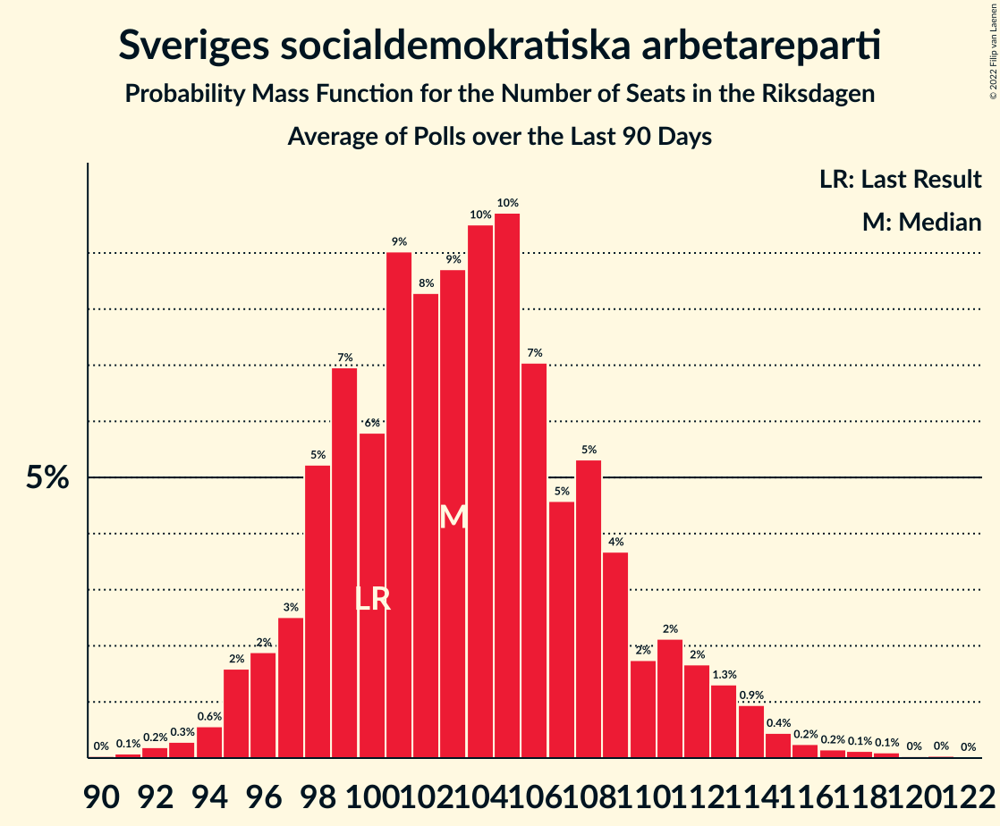

# Poll Average

<a href="#voting-intentions">Voting Intentions</a> | <a href="#seats">Seats</a> | <a href="#coalitions">Coalitions</a> | <a href="#technical-information">Technical Information</a>

## Summary

The table below lists the polls on which the average is based. They are the most recent polls (less than 90 days old) registered and analyzed so far.

| Period     | Polling firm/Commissioner(s) | S | M | SD | MP | C | V | L | KD | Fi |
|:----------:|:----------------------------:|:--:|:--:|:--:|:--:|:--:|:--:|:--:|:--:|:--:|
| 14 September 2014 | General Election | 31.0%   113 | 23.3%   84 | 12.9%   49 | 6.9%   25 | 6.1%   22 | 5.7%   21 | 5.4%   19 | 4.6%   16 | 3.1%   0 |
| N/A | Poll Average | 21–29%   75–108 | 15–23%   54–87 | 18–25%   61–93 | 4–7%   0–27 | 7–12%   25–43 | 7–12%   27–44 | 4–7%   0–25 | 3–6%   0–22 | 1–3%   0 |
| [16–24 August 2018](2018-08-24-Ipsos.html) | Ipsos   Dagens Nyheter | 24–28%   85–103 | 15–19%   52–69 | 18–21%   60–79 | 5–7%   18–27 | 8–10%   26–37 | 9–11%   28–44 | 4–7%   17–24 | 4–6%   0–22 | N/A   N/A |
| [16–22 August 2018](2018-08-22-SKOP.html) | SKOP | 23–26%   82–96 | 16–19%   56–69 | 18–22%   68–81 | 5–7%   18–25 | 7–9%   26–35 | 8–11%   29–38 | 5–7%   19–27 | 4–6%   0–20 | 1–2%   0 |
| [13–21 August 2018](2018-08-21-Novus.html) | Novus   SVT | 23–27%   84–100 | 17–21%   64–79 | 17–21%   64–78 | 5–7%   19–27 | 9–12%   32–42 | 7–10%   27–37 | 4–6%   16–24 | 3–4%   0–16 | N/A   N/A |
| [17–20 August 2018](2018-08-20-YouGov.html) | YouGov   Metro | 20–24%   71–89 | 14–18%   51–65 | 22–26%   78–98 | 4–6%   15–23 | 7–9%   24–36 | 8–11%   29–39 | 4–7%   16–24 | 3–5%   0–18 | 1–3%   0 |
| [13–16 August 2018](2018-08-16-Sifo.html) | Sifo   Svenska Dagbladet | 24–27%   85–97 | 18–21%   65–76 | 17–20%   62–73 | 6–7%   21–27 | 9–11%   31–38 | 8–10%   30–37 | 4–6%   16–21 | 4–5%   0–17 | 1%   0 |
| [10–16 August 2018](2018-08-16-Inizio.html) | Inizio   Aftonbladet | 23–27%   82–96 | 19–23%   69–82 | 17–21%   61–75 | 4–6%   16–24 | 7–10%   26–35 | 8–10%   27–37 | 4–6%   0–20 | 4–6%   16–23 | 1–2%   0 |
| [8–15 August 2018](2018-08-15-Demoskop.html) | Demoskop   Expressen | 22–26%   79–96 | 18–22%   65–80 | 18–22%   64–80 | 5–8%   20–28 | 10–13%   35–47 | 7–10%   27–38 | 4–6%   0–22 | 3–5%   0–17 | 1–2%   0 |
| [9–14 August 2018](2018-08-14-Sentio.html) | Sentio   Nyheter Idag | 20–26%   73–98 | 17–22%   61–86 | 19–25%   71–95 | 3–6%   0–24 | 6–10%   22–37 | 9–13%   32–49 | 3–6%   0–22 | 3–5%   0–20 | 1–3%   0 |
| [27 April–29 May 2018](2018-05-29-SCB.html) | SCB | 27–30%   100–113 | 21–24%   79–91 | 17–20%   65–75 | 4–5%   0–18 | 8–10%   29–36 | 7–8%   25–31 | 4–5%   0–19 | 2–3%   0 | N/A   N/A |
| 14 September 2014 | General Election | 31.0%   113 | 23.3%   84 | 12.9%   49 | 6.9%   25 | 6.1%   22 | 5.7%   21 | 5.4%   19 | 4.6%   16 | 3.1%   0 |

Only polls for which at least the sample size has been published are included in the table above.

**Legend:**
+ **Top half of each row:** Voting intentions (95% confidence interval)
+ **Bottom half of each row:** Seat projections for the Riksdagen (95% confidence interval)
+ **S:** Sveriges socialdemokratiska arbetareparti
+ **M:** Moderata samlingspartiet
+ **SD:** Sverigedemokraterna
+ **MP:** Miljöpartiet de gröna
+ **C:** Centerpartiet
+ **V:** Vänsterpartiet
+ **L:** Liberalerna
+ **KD:** Kristdemokraterna
+ **Fi:** Feministiskt initiativ
+ **N/A (single party):** Party not included the published results
+ **N/A (entire row):** Calculation for this opinion poll not started yet

## Voting Intentions

### Confidence Intervals

| Party | Last Result | Median | 80% Confidence Interval | 90% Confidence Interval | 95% Confidence Interval | 99% Confidence Interval |
|:-----:|:-----------:|:------:|:-----------------------:|:-----------------------:|:-----------------------:|:-----------------------:|
| <a href="#sveriges-socialdemokratiska-arbetareparti">Sveriges socialdemokratiska arbetareparti</a> | 31.0% | 24.7% | 21.9–27.7% |21.2–28.4% | 20.7–28.8% | 19.7–29.5% |
| <a href="#moderata-samlingspartiet">Moderata samlingspartiet</a> | 23.3% | 19.2% | 16.2–22.2% |15.6–22.7% | 15.1–23.1% | 14.3–23.7% |
| <a href="#sverigedemokraterna">Sverigedemokraterna</a> | 12.9% | 19.5% | 18.1–23.5% |17.8–24.5% | 17.6–25.1% | 17.0–26.1% |
| <a href="#miljöpartiet-de-gröna">Miljöpartiet de gröna</a> | 6.9% | 5.7% | 4.4–6.8% |4.1–7.1% | 3.9–7.3% | 3.6–7.7% |
| <a href="#centerpartiet">Centerpartiet</a> | 6.1% | 8.8% | 7.6–10.7% |7.2–11.3% | 6.9–11.7% | 6.2–12.5% |
| <a href="#vänsterpartiet">Vänsterpartiet</a> | 5.7% | 9.1% | 7.7–10.4% |7.3–11.0% | 7.1–11.6% | 6.8–12.6% |
| <a href="#liberalerna">Liberalerna</a> | 5.4% | 5.1% | 4.2–6.2% |4.0–6.5% | 3.8–6.8% | 3.3–7.3% |
| <a href="#kristdemokraterna">Kristdemokraterna</a> | 4.6% | 4.1% | 3.0–5.2% |2.8–5.5% | 2.7–5.7% | 2.5–6.2% |
| <a href="#feministiskt-initiativ">Feministiskt initiativ</a> | 3.1% | 1.4% | 0.9–2.2% |0.8–2.5% | 0.7–2.6% | 0.6–3.0% |

### Sveriges socialdemokratiska arbetareparti

*For a full overview of the results for this party, see the [Sveriges socialdemokratiska arbetareparti](party-sverigessocialdemokratiskaarbetareparti.html) page.*

| Voting Intentions | Probability | Accumulated | Special Marks |
|:-----------------:|:-----------:|:-----------:|:-------------:|
| 17.5–18.5% | 0% | 100% |  |
| 18.5–19.5% | 0.3% | 100% |  |
| 19.5–20.5% | 2% | 99.7% |  |
| 20.5–21.5% | 5% | 98% |  |
| 21.5–22.5% | 9% | 93% |  |
| 22.5–23.5% | 12% | 84% |  |
| 23.5–24.5% | 19% | 72% |  |
| 24.5–25.5% | 22% | 53% | Median |
| 25.5–26.5% | 14% | 31% |  |
| 26.5–27.5% | 6% | 18% |  |
| 27.5–28.5% | 7% | 11% |  |
| 28.5–29.5% | 4% | 4% |  |
| 29.5–30.5% | 0.4% | 0.4% |  |
| 30.5–31.5% | 0% | 0% | Last Result |

### Moderata samlingspartiet

*For a full overview of the results for this party, see the [Moderata samlingspartiet](party-moderatasamlingspartiet.html) page.*

| Voting Intentions | Probability | Accumulated | Special Marks |
|:-----------------:|:-----------:|:-----------:|:-------------:|
| 12.5–13.5% | 0.1% | 100% |  |
| 13.5–14.5% | 0.9% | 99.9% |  |
| 14.5–15.5% | 4% | 99.1% |  |
| 15.5–16.5% | 9% | 95% |  |
| 16.5–17.5% | 13% | 86% |  |
| 17.5–18.5% | 12% | 73% |  |
| 18.5–19.5% | 18% | 61% | Median |
| 19.5–20.5% | 17% | 43% |  |
| 20.5–21.5% | 10% | 25% |  |
| 21.5–22.5% | 8% | 15% |  |
| 22.5–23.5% | 6% | 7% | Last Result |
| 23.5–24.5% | 0.8% | 0.8% |  |
| 24.5–25.5% | 0% | 0% |  |

### Sverigedemokraterna

*For a full overview of the results for this party, see the [Sverigedemokraterna](party-sverigedemokraterna.html) page.*

| Voting Intentions | Probability | Accumulated | Special Marks |
|:-----------------:|:-----------:|:-----------:|:-------------:|
| 12.5–13.5% | 0% | 100% | Last Result |
| 13.5–14.5% | 0% | 100% |  |
| 14.5–15.5% | 0% | 100% |  |
| 15.5–16.5% | 0.1% | 100% |  |
| 16.5–17.5% | 2% | 99.9% |  |
| 17.5–18.5% | 19% | 98% |  |
| 18.5–19.5% | 30% | 79% |  |
| 19.5–20.5% | 20% | 49% | Median |
| 20.5–21.5% | 10% | 28% |  |
| 21.5–22.5% | 5% | 19% |  |
| 22.5–23.5% | 5% | 14% |  |
| 23.5–24.5% | 5% | 10% |  |
| 24.5–25.5% | 3% | 5% |  |
| 25.5–26.5% | 1.1% | 1.4% |  |
| 26.5–27.5% | 0.2% | 0.2% |  |
| 27.5–28.5% | 0% | 0% |  |

### Miljöpartiet de gröna

*For a full overview of the results for this party, see the [Miljöpartiet de gröna](party-miljöpartietdegröna.html) page.*

| Voting Intentions | Probability | Accumulated | Special Marks |
|:-----------------:|:-----------:|:-----------:|:-------------:|
| 1.5–2.5% | 0% | 100% |  |
| 2.5–3.5% | 0.4% | 100% |  |
| 3.5–4.5% | 15% | 99.6% |  |
| 4.5–5.5% | 28% | 85% |  |
| 5.5–6.5% | 40% | 57% | Median |
| 6.5–7.5% | 16% | 17% | Last Result |
| 7.5–8.5% | 1.0% | 1.0% |  |
| 8.5–9.5% | 0% | 0% |  |

### Centerpartiet

*For a full overview of the results for this party, see the [Centerpartiet](party-centerpartiet.html) page.*

| Voting Intentions | Probability | Accumulated | Special Marks |
|:-----------------:|:-----------:|:-----------:|:-------------:|
| 4.5–5.5% | 0.1% | 100% |  |
| 5.5–6.5% | 1.2% | 99.9% | Last Result |
| 6.5–7.5% | 9% | 98.7% |  |
| 7.5–8.5% | 30% | 90% |  |
| 8.5–9.5% | 33% | 61% | Median |
| 9.5–10.5% | 16% | 27% |  |
| 10.5–11.5% | 8% | 12% |  |
| 11.5–12.5% | 3% | 3% |  |
| 12.5–13.5% | 0.4% | 0.4% |  |
| 13.5–14.5% | 0% | 0% |  |

### Vänsterpartiet

*For a full overview of the results for this party, see the [Vänsterpartiet](party-vänsterpartiet.html) page.*

| Voting Intentions | Probability | Accumulated | Special Marks |
|:-----------------:|:-----------:|:-----------:|:-------------:|
| 4.5–5.5% | 0% | 100% |  |
| 5.5–6.5% | 0.1% | 100% | Last Result |
| 6.5–7.5% | 8% | 99.9% |  |
| 7.5–8.5% | 20% | 92% |  |
| 8.5–9.5% | 40% | 72% | Median |
| 9.5–10.5% | 23% | 31% |  |
| 10.5–11.5% | 6% | 9% |  |
| 11.5–12.5% | 2% | 3% |  |
| 12.5–13.5% | 0.5% | 0.6% |  |
| 13.5–14.5% | 0.1% | 0.1% |  |
| 14.5–15.5% | 0% | 0% |  |

### Liberalerna

*For a full overview of the results for this party, see the [Liberalerna](party-liberalerna.html) page.*

| Voting Intentions | Probability | Accumulated | Special Marks |
|:-----------------:|:-----------:|:-----------:|:-------------:|
| 1.5–2.5% | 0% | 100% |  |
| 2.5–3.5% | 1.2% | 100% |  |
| 3.5–4.5% | 23% | 98.8% |  |
| 4.5–5.5% | 49% | 76% | Last Result, Median |
| 5.5–6.5% | 22% | 27% |  |
| 6.5–7.5% | 4% | 4% |  |
| 7.5–8.5% | 0.2% | 0.2% |  |
| 8.5–9.5% | 0% | 0% |  |

### Kristdemokraterna

*For a full overview of the results for this party, see the [Kristdemokraterna](party-kristdemokraterna.html) page.*

| Voting Intentions | Probability | Accumulated | Special Marks |
|:-----------------:|:-----------:|:-----------:|:-------------:|
| 0.5–1.5% | 0% | 100% |  |
| 1.5–2.5% | 1.0% | 100% |  |
| 2.5–3.5% | 27% | 99.0% |  |
| 3.5–4.5% | 44% | 72% | Median |
| 4.5–5.5% | 24% | 28% | Last Result |
| 5.5–6.5% | 4% | 4% |  |
| 6.5–7.5% | 0.1% | 0.1% |  |
| 7.5–8.5% | 0% | 0% |  |

### Feministiskt initiativ

*For a full overview of the results for this party, see the [Feministiskt initiativ](party-feministisktinitiativ.html) page.*

| Voting Intentions | Probability | Accumulated | Special Marks |
|:-----------------:|:-----------:|:-----------:|:-------------:|
| 0.0–0.5% | 0.2% | 100% |  |
| 0.5–1.5% | 58% | 99.8% | Median |
| 1.5–2.5% | 38% | 41% |  |
| 2.5–3.5% | 4% | 4% | Last Result |
| 3.5–4.5% | 0% | 0% |  |

## Seats

### Confidence Intervals

| Party | Last Result | Median | 80% Confidence Interval | 90% Confidence Interval | 95% Confidence Interval | 99% Confidence Interval |
|:-----:|:-----------:|:------:|:-----------------------:|:-----------------------:|:-----------------------:|:-----------------------:|
| <a href="#sveriges-socialdemokratiska-arbetareparti">Sveriges socialdemokratiska arbetareparti</a> | 113 | 90 | 80–103 |78–105 | 75–108 | 72–112 |
| <a href="#moderata-samlingspartiet">Moderata samlingspartiet</a> | 84 | 70 | 58–82 |56–85 | 54–87 | 52–90 |
| <a href="#sverigedemokraterna">Sverigedemokraterna</a> | 49 | 71 | 65–86 |64–90 | 61–93 | 60–97 |
| <a href="#miljöpartiet-de-gröna">Miljöpartiet de gröna</a> | 25 | 21 | 16–25 |15–26 | 0–27 | 0–28 |
| <a href="#centerpartiet">Centerpartiet</a> | 22 | 32 | 27–40 |26–41 | 25–43 | 23–46 |
| <a href="#vänsterpartiet">Vänsterpartiet</a> | 21 | 33 | 28–38 |27–42 | 27–44 | 25–48 |
| <a href="#liberalerna">Liberalerna</a> | 19 | 18 | 15–23 |0–24 | 0–25 | 0–27 |
| <a href="#kristdemokraterna">Kristdemokraterna</a> | 16 | 15 | 0–19 |0–22 | 0–22 | 0–22 |
| <a href="#feministiskt-initiativ">Feministiskt initiativ</a> | 0 | 0 | 0 |0 | 0 | 0 |

### Sveriges socialdemokratiska arbetareparti

*For a full overview of the results for this party, see the [Sveriges socialdemokratiska arbetareparti](party-sverigessocialdemokratiskaarbetareparti.html) page.*

| Number of Seats | Probability | Accumulated | Special Marks |
|:---------------:|:-----------:|:-----------:|:-------------:|
| 67 | 0% | 100% |  |
| 68 | 0% | 99.9% |  |
| 69 | 0% | 99.9% |  |
| 70 | 0.2% | 99.9% |  |
| 71 | 0.1% | 99.7% |  |
| 72 | 0.4% | 99.6% |  |
| 73 | 0.3% | 99.2% |  |
| 74 | 1.0% | 98.9% |  |
| 75 | 0.6% | 98% |  |
| 76 | 1.2% | 97% |  |
| 77 | 0.9% | 96% |  |
| 78 | 1.2% | 95% |  |
| 79 | 3% | 94% |  |
| 80 | 1.5% | 91% |  |
| 81 | 2% | 89% |  |
| 82 | 2% | 87% |  |
| 83 | 3% | 85% |  |
| 84 | 2% | 81% |  |
| 85 | 5% | 79% |  |
| 86 | 5% | 74% |  |
| 87 | 6% | 69% |  |
| 88 | 6% | 63% |  |
| 89 | 5% | 57% |  |
| 90 | 6% | 52% | Median |
| 91 | 6% | 46% |  |
| 92 | 4% | 40% |  |
| 93 | 4% | 36% |  |
| 94 | 4% | 32% |  |
| 95 | 4% | 28% |  |
| 96 | 3% | 24% |  |
| 97 | 1.3% | 21% |  |
| 98 | 1.3% | 19% |  |
| 99 | 0.9% | 18% |  |
| 100 | 5% | 17% |  |
| 101 | 1.0% | 12% |  |
| 102 | 0.8% | 11% |  |
| 103 | 2% | 10% |  |
| 104 | 1.4% | 9% |  |
| 105 | 2% | 7% |  |
| 106 | 1.2% | 5% |  |
| 107 | 0.9% | 4% |  |
| 108 | 0.7% | 3% |  |
| 109 | 0.5% | 2% |  |
| 110 | 0.6% | 2% |  |
| 111 | 0.4% | 1.1% |  |
| 112 | 0.3% | 0.7% |  |
| 113 | 0.2% | 0.4% | Last Result |
| 114 | 0.1% | 0.2% |  |
| 115 | 0.1% | 0.1% |  |
| 116 | 0% | 0.1% |  |
| 117 | 0% | 0% |  |

### Moderata samlingspartiet

*For a full overview of the results for this party, see the [Moderata samlingspartiet](party-moderatasamlingspartiet.html) page.*

| Number of Seats | Probability | Accumulated | Special Marks |
|:---------------:|:-----------:|:-----------:|:-------------:|
| 48 | 0.1% | 100% |  |
| 49 | 0.1% | 99.9% |  |
| 50 | 0.1% | 99.9% |  |
| 51 | 0.1% | 99.7% |  |
| 52 | 0.5% | 99.6% |  |
| 53 | 0.4% | 99.1% |  |
| 54 | 2% | 98.7% |  |
| 55 | 2% | 97% |  |
| 56 | 2% | 96% |  |
| 57 | 2% | 94% |  |
| 58 | 5% | 92% |  |
| 59 | 2% | 87% |  |
| 60 | 2% | 85% |  |
| 61 | 3% | 83% |  |
| 62 | 4% | 80% |  |
| 63 | 2% | 76% |  |
| 64 | 5% | 74% |  |
| 65 | 3% | 70% |  |
| 66 | 2% | 66% |  |
| 67 | 3% | 64% |  |
| 68 | 4% | 61% |  |
| 69 | 4% | 57% |  |
| 70 | 6% | 53% | Median |
| 71 | 5% | 47% |  |
| 72 | 5% | 43% |  |
| 73 | 5% | 38% |  |
| 74 | 4% | 33% |  |
| 75 | 4% | 29% |  |
| 76 | 4% | 25% |  |
| 77 | 3% | 21% |  |
| 78 | 2% | 19% |  |
| 79 | 2% | 16% |  |
| 80 | 1.3% | 14% |  |
| 81 | 2% | 13% |  |
| 82 | 2% | 11% |  |
| 83 | 1.5% | 10% |  |
| 84 | 3% | 8% | Last Result |
| 85 | 1.2% | 5% |  |
| 86 | 1.3% | 4% |  |
| 87 | 1.0% | 3% |  |
| 88 | 0.6% | 2% |  |
| 89 | 0.3% | 1.1% |  |
| 90 | 0.3% | 0.8% |  |
| 91 | 0.3% | 0.5% |  |
| 92 | 0.1% | 0.2% |  |
| 93 | 0.1% | 0.1% |  |
| 94 | 0% | 0.1% |  |
| 95 | 0% | 0% |  |

### Sverigedemokraterna

*For a full overview of the results for this party, see the [Sverigedemokraterna](party-sverigedemokraterna.html) page.*

| Number of Seats | Probability | Accumulated | Special Marks |
|:---------------:|:-----------:|:-----------:|:-------------:|
| 49 | 0% | 100% | Last Result |
| 50 | 0% | 100% |  |
| 51 | 0% | 100% |  |
| 52 | 0% | 100% |  |
| 53 | 0% | 100% |  |
| 54 | 0% | 100% |  |
| 55 | 0% | 100% |  |
| 56 | 0% | 100% |  |
| 57 | 0.1% | 100% |  |
| 58 | 0% | 99.9% |  |
| 59 | 0% | 99.9% |  |
| 60 | 2% | 99.9% |  |
| 61 | 0.6% | 98% |  |
| 62 | 0.8% | 97% |  |
| 63 | 1.2% | 96% |  |
| 64 | 2% | 95% |  |
| 65 | 7% | 93% |  |
| 66 | 5% | 86% |  |
| 67 | 6% | 81% |  |
| 68 | 6% | 75% |  |
| 69 | 9% | 69% |  |
| 70 | 7% | 60% |  |
| 71 | 6% | 53% | Median |
| 72 | 7% | 47% |  |
| 73 | 5% | 40% |  |
| 74 | 4% | 35% |  |
| 75 | 4% | 31% |  |
| 76 | 2% | 27% |  |
| 77 | 2% | 24% |  |
| 78 | 2% | 23% |  |
| 79 | 1.3% | 21% |  |
| 80 | 1.5% | 20% |  |
| 81 | 1.1% | 18% |  |
| 82 | 1.3% | 17% |  |
| 83 | 1.4% | 16% |  |
| 84 | 1.4% | 15% |  |
| 85 | 2% | 13% |  |
| 86 | 1.3% | 11% |  |
| 87 | 2% | 10% |  |
| 88 | 2% | 8% |  |
| 89 | 0.8% | 7% |  |
| 90 | 1.2% | 6% |  |
| 91 | 1.0% | 5% |  |
| 92 | 0.6% | 4% |  |
| 93 | 0.5% | 3% |  |
| 94 | 0.7% | 2% |  |
| 95 | 0.8% | 2% |  |
| 96 | 0.4% | 1.0% |  |
| 97 | 0.1% | 0.6% |  |
| 98 | 0.2% | 0.4% |  |
| 99 | 0.1% | 0.3% |  |
| 100 | 0.1% | 0.2% |  |
| 101 | 0% | 0.1% |  |
| 102 | 0% | 0.1% |  |
| 103 | 0% | 0.1% |  |
| 104 | 0% | 0% |  |

### Miljöpartiet de gröna

*For a full overview of the results for this party, see the [Miljöpartiet de gröna](party-miljöpartietdegröna.html) page.*

| Number of Seats | Probability | Accumulated | Special Marks |
|:---------------:|:-----------:|:-----------:|:-------------:|
| 0 | 3% | 100% |  |
| 1 | 0% | 97% |  |
| 2 | 0% | 97% |  |
| 3 | 0% | 97% |  |
| 4 | 0% | 97% |  |
| 5 | 0% | 97% |  |
| 6 | 0% | 97% |  |
| 7 | 0% | 97% |  |
| 8 | 0% | 97% |  |
| 9 | 0% | 97% |  |
| 10 | 0% | 97% |  |
| 11 | 0% | 97% |  |
| 12 | 0% | 97% |  |
| 13 | 0% | 97% |  |
| 14 | 0% | 97% |  |
| 15 | 4% | 97% |  |
| 16 | 7% | 93% |  |
| 17 | 7% | 85% |  |
| 18 | 7% | 78% |  |
| 19 | 9% | 71% |  |
| 20 | 9% | 62% |  |
| 21 | 15% | 54% | Median |
| 22 | 9% | 39% |  |
| 23 | 10% | 30% |  |
| 24 | 8% | 20% |  |
| 25 | 5% | 11% | Last Result |
| 26 | 3% | 6% |  |
| 27 | 2% | 3% |  |
| 28 | 0.6% | 1.0% |  |
| 29 | 0.3% | 0.5% |  |
| 30 | 0.1% | 0.2% |  |
| 31 | 0% | 0.1% |  |
| 32 | 0% | 0% |  |

### Centerpartiet

*For a full overview of the results for this party, see the [Centerpartiet](party-centerpartiet.html) page.*

| Number of Seats | Probability | Accumulated | Special Marks |
|:---------------:|:-----------:|:-----------:|:-------------:|
| 20 | 0% | 100% |  |
| 21 | 0.1% | 99.9% |  |
| 22 | 0.2% | 99.8% | Last Result |
| 23 | 0.3% | 99.6% |  |
| 24 | 1.0% | 99.2% |  |
| 25 | 2% | 98% |  |
| 26 | 4% | 97% |  |
| 27 | 4% | 93% |  |
| 28 | 5% | 89% |  |
| 29 | 7% | 84% |  |
| 30 | 7% | 77% |  |
| 31 | 14% | 70% |  |
| 32 | 9% | 56% | Median |
| 33 | 9% | 47% |  |
| 34 | 8% | 38% |  |
| 35 | 5% | 30% |  |
| 36 | 4% | 25% |  |
| 37 | 6% | 20% |  |
| 38 | 3% | 15% |  |
| 39 | 2% | 12% |  |
| 40 | 2% | 10% |  |
| 41 | 3% | 8% |  |
| 42 | 2% | 5% |  |
| 43 | 1.4% | 3% |  |
| 44 | 0.4% | 2% |  |
| 45 | 0.5% | 1.2% |  |
| 46 | 0.4% | 0.7% |  |
| 47 | 0.1% | 0.3% |  |
| 48 | 0.1% | 0.2% |  |
| 49 | 0% | 0.1% |  |
| 50 | 0% | 0% |  |

### Vänsterpartiet

*For a full overview of the results for this party, see the [Vänsterpartiet](party-vänsterpartiet.html) page.*

| Number of Seats | Probability | Accumulated | Special Marks |
|:---------------:|:-----------:|:-----------:|:-------------:|
| 21 | 0% | 100% | Last Result |
| 22 | 0% | 100% |  |
| 23 | 0% | 100% |  |
| 24 | 0.1% | 100% |  |
| 25 | 0.7% | 99.9% |  |
| 26 | 2% | 99.1% |  |
| 27 | 5% | 98% |  |
| 28 | 5% | 93% |  |
| 29 | 6% | 88% |  |
| 30 | 8% | 82% |  |
| 31 | 10% | 74% |  |
| 32 | 8% | 64% |  |
| 33 | 11% | 56% | Median |
| 34 | 9% | 46% |  |
| 35 | 14% | 37% |  |
| 36 | 6% | 23% |  |
| 37 | 4% | 17% |  |
| 38 | 3% | 13% |  |
| 39 | 1.4% | 10% |  |
| 40 | 2% | 8% |  |
| 41 | 1.2% | 7% |  |
| 42 | 1.2% | 5% |  |
| 43 | 0.7% | 4% |  |
| 44 | 2% | 4% |  |
| 45 | 0.7% | 2% |  |
| 46 | 0.3% | 1.2% |  |
| 47 | 0.3% | 0.9% |  |
| 48 | 0.2% | 0.6% |  |
| 49 | 0.1% | 0.4% |  |
| 50 | 0.1% | 0.3% |  |
| 51 | 0.1% | 0.2% |  |
| 52 | 0% | 0.1% |  |
| 53 | 0% | 0.1% |  |
| 54 | 0% | 0.1% |  |
| 55 | 0% | 0.1% |  |
| 56 | 0% | 0% |  |

### Liberalerna

*For a full overview of the results for this party, see the [Liberalerna](party-liberalerna.html) page.*

| Number of Seats | Probability | Accumulated | Special Marks |
|:---------------:|:-----------:|:-----------:|:-------------:|
| 0 | 6% | 100% |  |
| 1 | 0% | 94% |  |
| 2 | 0% | 94% |  |
| 3 | 0% | 94% |  |
| 4 | 0% | 94% |  |
| 5 | 0% | 94% |  |
| 6 | 0% | 94% |  |
| 7 | 0% | 94% |  |
| 8 | 0% | 94% |  |
| 9 | 0% | 94% |  |
| 10 | 0% | 94% |  |
| 11 | 0% | 94% |  |
| 12 | 0% | 94% |  |
| 13 | 0% | 94% |  |
| 14 | 0.1% | 94% |  |
| 15 | 4% | 94% |  |
| 16 | 9% | 90% |  |
| 17 | 20% | 81% |  |
| 18 | 14% | 61% | Median |
| 19 | 13% | 47% | Last Result |
| 20 | 10% | 33% |  |
| 21 | 6% | 23% |  |
| 22 | 5% | 17% |  |
| 23 | 5% | 12% |  |
| 24 | 4% | 7% |  |
| 25 | 2% | 3% |  |
| 26 | 0.8% | 2% |  |
| 27 | 0.5% | 0.7% |  |
| 28 | 0.1% | 0.2% |  |
| 29 | 0% | 0.1% |  |
| 30 | 0% | 0% |  |

### Kristdemokraterna

*For a full overview of the results for this party, see the [Kristdemokraterna](party-kristdemokraterna.html) page.*

| Number of Seats | Probability | Accumulated | Special Marks |
|:---------------:|:-----------:|:-----------:|:-------------:|
| 0 | 47% | 100% |  |
| 1 | 0% | 53% |  |
| 2 | 0% | 53% |  |
| 3 | 0% | 53% |  |
| 4 | 0% | 53% |  |
| 5 | 0% | 53% |  |
| 6 | 0% | 53% |  |
| 7 | 0% | 53% |  |
| 8 | 0% | 53% |  |
| 9 | 0% | 53% |  |
| 10 | 0% | 53% |  |
| 11 | 0% | 53% |  |
| 12 | 0% | 53% |  |
| 13 | 0% | 53% |  |
| 14 | 3% | 53% |  |
| 15 | 11% | 51% | Median |
| 16 | 9% | 39% | Last Result |
| 17 | 8% | 30% |  |
| 18 | 6% | 22% |  |
| 19 | 7% | 17% |  |
| 20 | 2% | 10% |  |
| 21 | 2% | 7% |  |
| 22 | 5% | 5% |  |
| 23 | 0.3% | 0.5% |  |
| 24 | 0.1% | 0.2% |  |
| 25 | 0% | 0% |  |

### Feministiskt initiativ

*For a full overview of the results for this party, see the [Feministiskt initiativ](party-feministisktinitiativ.html) page.*

| Number of Seats | Probability | Accumulated | Special Marks |
|:---------------:|:-----------:|:-----------:|:-------------:|
| 0 | 100% | 100% | Last Result, Median |

## Coalitions

### Confidence Intervals

| Coalition | Last Result | Median | Majority? | 80% Confidence Interval | 90% Confidence Interval | 95% Confidence Interval | 99% Confidence Interval |
|:---------:|:-----------:|:------:|:---------:|:-----------------------:|:-----------------------:|:-----------------------:|:-----------------------:|
| Sveriges socialdemokratiska arbetareparti – Moderata samlingspartiet | 197 | 159 | 12% | 143–185 | 137–189 | 133–193 | 129–200 |
| Moderata samlingspartiet – Sverigedemokraterna | 133 | 143 | 0.3% | 130–155 | 124–160 | 123–163 | 123–172 |
| Sveriges socialdemokratiska arbetareparti – Miljöpartiet de gröna – Vänsterpartiet – Feministiskt initiativ | 159 | 145 | 0% | 133–154 | 129–156 | 126–158 | 121–162 |
| Sveriges socialdemokratiska arbetareparti – Miljöpartiet de gröna – Vänsterpartiet | 159 | 145 | 0% | 133–154 | 129–156 | 126–158 | 121–162 |
| Moderata samlingspartiet – Centerpartiet – Liberalerna – Kristdemokraterna | 141 | 131 | 0% | 115–141 | 109–144 | 105–145 | 100–149 |
| Sveriges socialdemokratiska arbetareparti – Vänsterpartiet | 134 | 123 | 0% | 114–135 | 111–136 | 108–140 | 105–142 |
| Moderata samlingspartiet – Centerpartiet – Liberalerna | 125 | 121 | 0% | 106–133 | 103–136 | 101–137 | 96–142 |
| Moderata samlingspartiet – Centerpartiet – Kristdemokraterna | 122 | 113 | 0% | 98–124 | 90–127 | 87–129 | 82–133 |
| Sveriges socialdemokratiska arbetareparti – Miljöpartiet de gröna | 138 | 111 | 0% | 99–121 | 94–122 | 91–124 | 84–127 |
| Moderata samlingspartiet – Centerpartiet | 106 | 104 | 0% | 88–116 | 85–119 | 83–121 | 78–125 |

### Sveriges socialdemokratiska arbetareparti – Moderata samlingspartiet

| Number of Seats | Probability | Accumulated | Special Marks |
|:---------------:|:-----------:|:-----------:|:-------------:|
| 124 | 0% | 100% |  |
| 125 | 0% | 99.9% |  |
| 126 | 0.1% | 99.9% |  |
| 127 | 0.1% | 99.8% |  |
| 128 | 0.2% | 99.7% |  |
| 129 | 0.3% | 99.5% |  |
| 130 | 0.4% | 99.3% |  |
| 131 | 0.7% | 98.9% |  |
| 132 | 0.3% | 98% |  |
| 133 | 0.7% | 98% |  |
| 134 | 0.3% | 97% |  |
| 135 | 1.1% | 97% |  |
| 136 | 0.7% | 96% |  |
| 137 | 0.4% | 95% |  |
| 138 | 0.5% | 95% |  |
| 139 | 1.1% | 94% |  |
| 140 | 0.8% | 93% |  |
| 141 | 0.5% | 92% |  |
| 142 | 2% | 92% |  |
| 143 | 1.4% | 90% |  |
| 144 | 0.7% | 89% |  |
| 145 | 0.7% | 88% |  |
| 146 | 1.2% | 87% |  |
| 147 | 0.9% | 86% |  |
| 148 | 2% | 85% |  |
| 149 | 1.1% | 83% |  |
| 150 | 2% | 82% |  |
| 151 | 2% | 80% |  |
| 152 | 2% | 78% |  |
| 153 | 2% | 76% |  |
| 154 | 2% | 74% |  |
| 155 | 3% | 71% |  |
| 156 | 3% | 68% |  |
| 157 | 3% | 65% |  |
| 158 | 9% | 62% |  |
| 159 | 6% | 53% |  |
| 160 | 3% | 46% | Median |
| 161 | 4% | 43% |  |
| 162 | 3% | 39% |  |
| 163 | 3% | 36% |  |
| 164 | 3% | 32% |  |
| 165 | 3% | 29% |  |
| 166 | 4% | 26% |  |
| 167 | 2% | 22% |  |
| 168 | 2% | 20% |  |
| 169 | 2% | 18% |  |
| 170 | 1.4% | 16% |  |
| 171 | 0.8% | 15% |  |
| 172 | 0.6% | 14% |  |
| 173 | 0.7% | 13% |  |
| 174 | 0.4% | 12% |  |
| 175 | 0.3% | 12% | Majority |
| 176 | 0.2% | 12% |  |
| 177 | 0.1% | 12% |  |
| 178 | 0.1% | 11% |  |
| 179 | 0.1% | 11% |  |
| 180 | 0.1% | 11% |  |
| 181 | 0.1% | 11% |  |
| 182 | 0.1% | 11% |  |
| 183 | 0.2% | 11% |  |
| 184 | 0.3% | 11% |  |
| 185 | 0.5% | 11% |  |
| 186 | 0.9% | 10% |  |
| 187 | 1.1% | 9% |  |
| 188 | 1.0% | 8% |  |
| 189 | 2% | 7% |  |
| 190 | 1.1% | 5% |  |
| 191 | 0.7% | 4% |  |
| 192 | 0.4% | 3% |  |
| 193 | 0.3% | 3% |  |
| 194 | 0.2% | 2% |  |
| 195 | 0.2% | 2% |  |
| 196 | 0.4% | 2% |  |
| 197 | 0.2% | 1.4% | Last Result |
| 198 | 0.3% | 1.2% |  |
| 199 | 0.2% | 0.9% |  |
| 200 | 0.3% | 0.7% |  |
| 201 | 0.1% | 0.4% |  |
| 202 | 0.1% | 0.3% |  |
| 203 | 0% | 0.2% |  |
| 204 | 0% | 0.2% |  |
| 205 | 0% | 0.1% |  |
| 206 | 0% | 0.1% |  |
| 207 | 0% | 0.1% |  |
| 208 | 0% | 0.1% |  |
| 209 | 0% | 0% |  |

### Moderata samlingspartiet – Sverigedemokraterna

| Number of Seats | Probability | Accumulated | Special Marks |
|:---------------:|:-----------:|:-----------:|:-------------:|
| 116 | 0.1% | 100% |  |
| 117 | 0.1% | 99.9% |  |
| 118 | 0% | 99.9% |  |
| 119 | 0% | 99.9% |  |
| 120 | 0% | 99.9% |  |
| 121 | 0% | 99.9% |  |
| 122 | 0% | 99.8% |  |
| 123 | 4% | 99.8% |  |
| 124 | 2% | 95% |  |
| 125 | 0.3% | 94% |  |
| 126 | 0.5% | 93% |  |
| 127 | 0.9% | 93% |  |
| 128 | 0.9% | 92% |  |
| 129 | 0.4% | 91% |  |
| 130 | 0.6% | 91% |  |
| 131 | 0.9% | 90% |  |
| 132 | 2% | 89% |  |
| 133 | 1.4% | 87% | Last Result |
| 134 | 5% | 86% |  |
| 135 | 3% | 81% |  |
| 136 | 5% | 78% |  |
| 137 | 3% | 73% |  |
| 138 | 4% | 70% |  |
| 139 | 4% | 66% |  |
| 140 | 3% | 62% |  |
| 141 | 4% | 59% | Median |
| 142 | 5% | 55% |  |
| 143 | 4% | 50% |  |
| 144 | 4% | 46% |  |
| 145 | 4% | 42% |  |
| 146 | 3% | 38% |  |
| 147 | 5% | 35% |  |
| 148 | 2% | 30% |  |
| 149 | 2% | 28% |  |
| 150 | 3% | 26% |  |
| 151 | 3% | 23% |  |
| 152 | 3% | 19% |  |
| 153 | 3% | 16% |  |
| 154 | 1.5% | 14% |  |
| 155 | 2% | 12% |  |
| 156 | 1.4% | 10% |  |
| 157 | 1.1% | 9% |  |
| 158 | 0.9% | 7% |  |
| 159 | 1.3% | 7% |  |
| 160 | 0.5% | 5% |  |
| 161 | 1.4% | 5% |  |
| 162 | 0.5% | 3% |  |
| 163 | 0.5% | 3% |  |
| 164 | 0.4% | 2% |  |
| 165 | 0.2% | 2% |  |
| 166 | 0.3% | 2% |  |
| 167 | 0.3% | 1.3% |  |
| 168 | 0.1% | 1.0% |  |
| 169 | 0.2% | 0.9% |  |
| 170 | 0.1% | 0.7% |  |
| 171 | 0.1% | 0.6% |  |
| 172 | 0.1% | 0.5% |  |
| 173 | 0.1% | 0.4% |  |
| 174 | 0% | 0.3% |  |
| 175 | 0% | 0.3% | Majority |
| 176 | 0.1% | 0.3% |  |
| 177 | 0% | 0.2% |  |
| 178 | 0% | 0.2% |  |
| 179 | 0% | 0.2% |  |
| 180 | 0% | 0.1% |  |
| 181 | 0% | 0.1% |  |
| 182 | 0.1% | 0.1% |  |
| 183 | 0% | 0.1% |  |
| 184 | 0% | 0% |  |

### Sveriges socialdemokratiska arbetareparti – Miljöpartiet de gröna – Vänsterpartiet – Feministiskt initiativ

| Number of Seats | Probability | Accumulated | Special Marks |
|:---------------:|:-----------:|:-----------:|:-------------:|
| 113 | 0% | 100% |  |
| 114 | 0.1% | 99.9% |  |
| 115 | 0% | 99.9% |  |
| 116 | 0% | 99.9% |  |
| 117 | 0% | 99.8% |  |
| 118 | 0% | 99.8% |  |
| 119 | 0.1% | 99.8% |  |
| 120 | 0% | 99.7% |  |
| 121 | 0.3% | 99.6% |  |
| 122 | 0.1% | 99.3% |  |
| 123 | 0.3% | 99.2% |  |
| 124 | 0.3% | 98.9% |  |
| 125 | 0.5% | 98.6% |  |
| 126 | 0.6% | 98% |  |
| 127 | 0.5% | 97% |  |
| 128 | 1.2% | 97% |  |
| 129 | 1.4% | 96% |  |
| 130 | 0.7% | 94% |  |
| 131 | 2% | 94% |  |
| 132 | 1.2% | 92% |  |
| 133 | 1.3% | 91% |  |
| 134 | 2% | 89% |  |
| 135 | 3% | 87% |  |
| 136 | 2% | 85% |  |
| 137 | 4% | 83% |  |
| 138 | 3% | 79% |  |
| 139 | 2% | 76% |  |
| 140 | 4% | 74% |  |
| 141 | 6% | 70% |  |
| 142 | 4% | 63% |  |
| 143 | 4% | 60% |  |
| 144 | 5% | 55% | Median |
| 145 | 4% | 51% |  |
| 146 | 6% | 46% |  |
| 147 | 5% | 40% |  |
| 148 | 6% | 35% |  |
| 149 | 7% | 30% |  |
| 150 | 4% | 23% |  |
| 151 | 3% | 19% |  |
| 152 | 3% | 16% |  |
| 153 | 2% | 13% |  |
| 154 | 2% | 11% |  |
| 155 | 0.8% | 9% |  |
| 156 | 5% | 8% |  |
| 157 | 0.5% | 3% |  |
| 158 | 0.4% | 3% |  |
| 159 | 0.3% | 2% | Last Result |
| 160 | 0.4% | 2% |  |
| 161 | 1.3% | 2% |  |
| 162 | 0.4% | 0.5% |  |
| 163 | 0.1% | 0.2% |  |
| 164 | 0% | 0.1% |  |
| 165 | 0.1% | 0.1% |  |
| 166 | 0% | 0% |  |

### Sveriges socialdemokratiska arbetareparti – Miljöpartiet de gröna – Vänsterpartiet

| Number of Seats | Probability | Accumulated | Special Marks |
|:---------------:|:-----------:|:-----------:|:-------------:|
| 113 | 0% | 100% |  |
| 114 | 0.1% | 99.9% |  |
| 115 | 0% | 99.9% |  |
| 116 | 0% | 99.9% |  |
| 117 | 0% | 99.8% |  |
| 118 | 0% | 99.8% |  |
| 119 | 0.1% | 99.8% |  |
| 120 | 0% | 99.7% |  |
| 121 | 0.3% | 99.6% |  |
| 122 | 0.1% | 99.3% |  |
| 123 | 0.3% | 99.2% |  |
| 124 | 0.3% | 98.9% |  |
| 125 | 0.5% | 98.6% |  |
| 126 | 0.6% | 98% |  |
| 127 | 0.5% | 97% |  |
| 128 | 1.2% | 97% |  |
| 129 | 1.4% | 96% |  |
| 130 | 0.7% | 94% |  |
| 131 | 2% | 94% |  |
| 132 | 1.2% | 92% |  |
| 133 | 1.3% | 91% |  |
| 134 | 2% | 89% |  |
| 135 | 3% | 87% |  |
| 136 | 2% | 85% |  |
| 137 | 4% | 83% |  |
| 138 | 3% | 79% |  |
| 139 | 2% | 76% |  |
| 140 | 4% | 74% |  |
| 141 | 6% | 70% |  |
| 142 | 4% | 63% |  |
| 143 | 4% | 60% |  |
| 144 | 5% | 55% | Median |
| 145 | 4% | 51% |  |
| 146 | 6% | 46% |  |
| 147 | 5% | 40% |  |
| 148 | 6% | 35% |  |
| 149 | 7% | 30% |  |
| 150 | 4% | 23% |  |
| 151 | 3% | 19% |  |
| 152 | 3% | 16% |  |
| 153 | 2% | 13% |  |
| 154 | 2% | 11% |  |
| 155 | 0.8% | 9% |  |
| 156 | 5% | 8% |  |
| 157 | 0.5% | 3% |  |
| 158 | 0.4% | 3% |  |
| 159 | 0.3% | 2% | Last Result |
| 160 | 0.4% | 2% |  |
| 161 | 1.3% | 2% |  |
| 162 | 0.4% | 0.5% |  |
| 163 | 0.1% | 0.2% |  |
| 164 | 0% | 0.1% |  |
| 165 | 0.1% | 0.1% |  |
| 166 | 0% | 0% |  |

### Moderata samlingspartiet – Centerpartiet – Liberalerna – Kristdemokraterna

| Number of Seats | Probability | Accumulated | Special Marks |
|:---------------:|:-----------:|:-----------:|:-------------:|
| 94 | 0% | 100% |  |
| 95 | 0% | 99.9% |  |
| 96 | 0% | 99.9% |  |
| 97 | 0% | 99.9% |  |
| 98 | 0.1% | 99.9% |  |
| 99 | 0.2% | 99.8% |  |
| 100 | 0.3% | 99.6% |  |
| 101 | 0.4% | 99.3% |  |
| 102 | 0.4% | 98.9% |  |
| 103 | 0.4% | 98% |  |
| 104 | 0.5% | 98% |  |
| 105 | 0.7% | 98% |  |
| 106 | 0.5% | 97% |  |
| 107 | 0.7% | 96% |  |
| 108 | 0.4% | 96% |  |
| 109 | 0.7% | 95% |  |
| 110 | 1.2% | 95% |  |
| 111 | 0.6% | 93% |  |
| 112 | 0.5% | 93% |  |
| 113 | 0.8% | 92% |  |
| 114 | 1.0% | 92% |  |
| 115 | 1.2% | 90% |  |
| 116 | 2% | 89% |  |
| 117 | 1.5% | 88% |  |
| 118 | 0.6% | 86% |  |
| 119 | 0.6% | 85% |  |
| 120 | 2% | 85% |  |
| 121 | 1.1% | 83% |  |
| 122 | 1.4% | 82% |  |
| 123 | 3% | 81% |  |
| 124 | 1.3% | 78% |  |
| 125 | 2% | 76% |  |
| 126 | 2% | 74% |  |
| 127 | 3% | 72% |  |
| 128 | 9% | 69% |  |
| 129 | 3% | 60% |  |
| 130 | 4% | 57% |  |
| 131 | 4% | 53% |  |
| 132 | 5% | 49% |  |
| 133 | 5% | 45% |  |
| 134 | 5% | 39% |  |
| 135 | 5% | 34% | Median |
| 136 | 4% | 30% |  |
| 137 | 3% | 26% |  |
| 138 | 4% | 23% |  |
| 139 | 3% | 19% |  |
| 140 | 4% | 16% |  |
| 141 | 2% | 12% | Last Result |
| 142 | 2% | 10% |  |
| 143 | 2% | 7% |  |
| 144 | 1.3% | 5% |  |
| 145 | 2% | 4% |  |
| 146 | 0.7% | 2% |  |
| 147 | 0.5% | 2% |  |
| 148 | 0.5% | 1.1% |  |
| 149 | 0.2% | 0.6% |  |
| 150 | 0.2% | 0.4% |  |
| 151 | 0.1% | 0.2% |  |
| 152 | 0.1% | 0.1% |  |
| 153 | 0% | 0.1% |  |
| 154 | 0% | 0% |  |

### Sveriges socialdemokratiska arbetareparti – Vänsterpartiet

| Number of Seats | Probability | Accumulated | Special Marks |
|:---------------:|:-----------:|:-----------:|:-------------:|
| 100 | 0.1% | 100% |  |
| 101 | 0% | 99.9% |  |
| 102 | 0% | 99.9% |  |
| 103 | 0.1% | 99.9% |  |
| 104 | 0.2% | 99.8% |  |
| 105 | 0.5% | 99.5% |  |
| 106 | 0.2% | 99.1% |  |
| 107 | 0.4% | 98.8% |  |
| 108 | 1.1% | 98% |  |
| 109 | 0.7% | 97% |  |
| 110 | 0.9% | 97% |  |
| 111 | 1.0% | 96% |  |
| 112 | 2% | 95% |  |
| 113 | 2% | 93% |  |
| 114 | 2% | 90% |  |
| 115 | 3% | 88% |  |
| 116 | 3% | 85% |  |
| 117 | 4% | 82% |  |
| 118 | 4% | 78% |  |
| 119 | 4% | 74% |  |
| 120 | 4% | 70% |  |
| 121 | 5% | 66% |  |
| 122 | 6% | 61% |  |
| 123 | 6% | 56% | Median |
| 124 | 4% | 50% |  |
| 125 | 5% | 45% |  |
| 126 | 4% | 41% |  |
| 127 | 5% | 36% |  |
| 128 | 3% | 32% |  |
| 129 | 3% | 29% |  |
| 130 | 6% | 26% |  |
| 131 | 2% | 20% |  |
| 132 | 3% | 18% |  |
| 133 | 2% | 15% |  |
| 134 | 1.4% | 13% | Last Result |
| 135 | 5% | 12% |  |
| 136 | 2% | 7% |  |
| 137 | 1.0% | 5% |  |
| 138 | 0.6% | 4% |  |
| 139 | 0.5% | 3% |  |
| 140 | 1.4% | 3% |  |
| 141 | 0.5% | 1.4% |  |
| 142 | 0.4% | 0.9% |  |
| 143 | 0.2% | 0.5% |  |
| 144 | 0.1% | 0.3% |  |
| 145 | 0.1% | 0.2% |  |
| 146 | 0% | 0.2% |  |
| 147 | 0% | 0.2% |  |
| 148 | 0% | 0.1% |  |
| 149 | 0% | 0.1% |  |
| 150 | 0% | 0.1% |  |
| 151 | 0% | 0.1% |  |
| 152 | 0% | 0.1% |  |
| 153 | 0% | 0% |  |

### Moderata samlingspartiet – Centerpartiet – Liberalerna

| Number of Seats | Probability | Accumulated | Special Marks |
|:---------------:|:-----------:|:-----------:|:-------------:|
| 90 | 0% | 100% |  |
| 91 | 0% | 99.9% |  |
| 92 | 0% | 99.9% |  |
| 93 | 0.1% | 99.9% |  |
| 94 | 0.1% | 99.8% |  |
| 95 | 0.1% | 99.7% |  |
| 96 | 0.1% | 99.6% |  |
| 97 | 0.5% | 99.5% |  |
| 98 | 0.2% | 99.0% |  |
| 99 | 0.6% | 98.8% |  |
| 100 | 0.5% | 98% |  |
| 101 | 1.2% | 98% |  |
| 102 | 0.8% | 96% |  |
| 103 | 0.8% | 96% |  |
| 104 | 1.3% | 95% |  |
| 105 | 1.1% | 93% |  |
| 106 | 6% | 92% |  |
| 107 | 2% | 87% |  |
| 108 | 1.2% | 85% |  |
| 109 | 1.2% | 84% |  |
| 110 | 3% | 83% |  |
| 111 | 1.3% | 80% |  |
| 112 | 1.4% | 79% |  |
| 113 | 3% | 78% |  |
| 114 | 2% | 74% |  |
| 115 | 2% | 72% |  |
| 116 | 3% | 70% |  |
| 117 | 3% | 66% |  |
| 118 | 2% | 64% |  |
| 119 | 3% | 61% |  |
| 120 | 4% | 58% | Median |
| 121 | 6% | 54% |  |
| 122 | 4% | 48% |  |
| 123 | 3% | 44% |  |
| 124 | 3% | 41% |  |
| 125 | 3% | 38% | Last Result |
| 126 | 5% | 35% |  |
| 127 | 4% | 31% |  |
| 128 | 3% | 26% |  |
| 129 | 3% | 23% |  |
| 130 | 3% | 21% |  |
| 131 | 3% | 18% |  |
| 132 | 3% | 15% |  |
| 133 | 3% | 12% |  |
| 134 | 2% | 9% |  |
| 135 | 2% | 7% |  |
| 136 | 1.3% | 5% |  |
| 137 | 1.4% | 4% |  |
| 138 | 0.9% | 2% |  |
| 139 | 0.3% | 1.5% |  |
| 140 | 0.3% | 1.1% |  |
| 141 | 0.3% | 0.8% |  |
| 142 | 0.4% | 0.5% |  |
| 143 | 0.1% | 0.2% |  |
| 144 | 0% | 0.1% |  |
| 145 | 0% | 0% |  |

### Moderata samlingspartiet – Centerpartiet – Kristdemokraterna

| Number of Seats | Probability | Accumulated | Special Marks |
|:---------------:|:-----------:|:-----------:|:-------------:|
| 79 | 0.1% | 100% |  |
| 80 | 0.1% | 99.9% |  |
| 81 | 0.1% | 99.8% |  |
| 82 | 0.3% | 99.7% |  |
| 83 | 0.4% | 99.4% |  |
| 84 | 0.1% | 99.0% |  |
| 85 | 0.7% | 98.9% |  |
| 86 | 0.3% | 98% |  |
| 87 | 0.6% | 98% |  |
| 88 | 0.6% | 97% |  |
| 89 | 0.8% | 97% |  |
| 90 | 0.9% | 96% |  |
| 91 | 0.4% | 95% |  |
| 92 | 0.5% | 94% |  |
| 93 | 0.6% | 94% |  |
| 94 | 0.7% | 93% |  |
| 95 | 0.5% | 93% |  |
| 96 | 0.8% | 92% |  |
| 97 | 0.8% | 91% |  |
| 98 | 1.0% | 91% |  |
| 99 | 2% | 90% |  |
| 100 | 1.0% | 87% |  |
| 101 | 1.0% | 86% |  |
| 102 | 1.4% | 85% |  |
| 103 | 2% | 84% |  |
| 104 | 2% | 82% |  |
| 105 | 2% | 80% |  |
| 106 | 2% | 78% |  |
| 107 | 5% | 76% |  |
| 108 | 3% | 71% |  |
| 109 | 3% | 68% |  |
| 110 | 3% | 64% |  |
| 111 | 8% | 62% |  |
| 112 | 4% | 54% |  |
| 113 | 3% | 51% |  |
| 114 | 4% | 47% |  |
| 115 | 4% | 44% |  |
| 116 | 7% | 40% |  |
| 117 | 3% | 33% | Median |
| 118 | 3% | 30% |  |
| 119 | 4% | 26% |  |
| 120 | 3% | 23% |  |
| 121 | 3% | 19% |  |
| 122 | 3% | 16% | Last Result |
| 123 | 2% | 14% |  |
| 124 | 2% | 12% |  |
| 125 | 2% | 9% |  |
| 126 | 2% | 7% |  |
| 127 | 2% | 6% |  |
| 128 | 0.8% | 4% |  |
| 129 | 0.7% | 3% |  |
| 130 | 0.5% | 2% |  |
| 131 | 0.7% | 2% |  |
| 132 | 0.2% | 1.0% |  |
| 133 | 0.3% | 0.7% |  |
| 134 | 0.2% | 0.5% |  |
| 135 | 0.1% | 0.3% |  |
| 136 | 0% | 0.2% |  |
| 137 | 0.1% | 0.1% |  |
| 138 | 0% | 0.1% |  |
| 139 | 0% | 0% |  |

### Sveriges socialdemokratiska arbetareparti – Miljöpartiet de gröna

| Number of Seats | Probability | Accumulated | Special Marks |
|:---------------:|:-----------:|:-----------:|:-------------:|
| 75 | 0% | 100% |  |
| 76 | 0% | 99.9% |  |
| 77 | 0% | 99.9% |  |
| 78 | 0% | 99.9% |  |
| 79 | 0% | 99.8% |  |
| 80 | 0% | 99.8% |  |
| 81 | 0.1% | 99.8% |  |
| 82 | 0.1% | 99.7% |  |
| 83 | 0.1% | 99.7% |  |
| 84 | 0.1% | 99.6% |  |
| 85 | 0.1% | 99.5% |  |
| 86 | 0.1% | 99.4% |  |
| 87 | 0.2% | 99.3% |  |
| 88 | 0.2% | 99.1% |  |
| 89 | 0.5% | 98.9% |  |
| 90 | 0.5% | 98% |  |
| 91 | 0.4% | 98% |  |
| 92 | 0.5% | 97% |  |
| 93 | 0.9% | 97% |  |
| 94 | 1.1% | 96% |  |
| 95 | 1.1% | 95% |  |
| 96 | 1.1% | 94% |  |
| 97 | 2% | 93% |  |
| 98 | 0.9% | 91% |  |
| 99 | 1.1% | 90% |  |
| 100 | 3% | 89% |  |
| 101 | 2% | 87% |  |
| 102 | 1.4% | 85% |  |
| 103 | 3% | 83% |  |
| 104 | 2% | 81% |  |
| 105 | 2% | 79% |  |
| 106 | 5% | 77% |  |
| 107 | 4% | 72% |  |
| 108 | 4% | 68% |  |
| 109 | 5% | 64% |  |
| 110 | 6% | 59% |  |
| 111 | 5% | 53% | Median |
| 112 | 4% | 48% |  |
| 113 | 3% | 44% |  |
| 114 | 6% | 41% |  |
| 115 | 5% | 36% |  |
| 116 | 5% | 31% |  |
| 117 | 4% | 26% |  |
| 118 | 3% | 22% |  |
| 119 | 3% | 19% |  |
| 120 | 3% | 16% |  |
| 121 | 8% | 14% |  |
| 122 | 2% | 6% |  |
| 123 | 1.1% | 4% |  |
| 124 | 1.5% | 3% |  |
| 125 | 0.5% | 2% |  |
| 126 | 0.6% | 1.2% |  |
| 127 | 0.2% | 0.6% |  |
| 128 | 0.2% | 0.4% |  |
| 129 | 0.1% | 0.2% |  |
| 130 | 0.1% | 0.1% |  |
| 131 | 0% | 0.1% |  |
| 132 | 0% | 0% |  |
| 133 | 0% | 0% |  |
| 134 | 0% | 0% |  |
| 135 | 0% | 0% |  |
| 136 | 0% | 0% |  |
| 137 | 0% | 0% |  |
| 138 | 0% | 0% | Last Result |

### Moderata samlingspartiet – Centerpartiet

| Number of Seats | Probability | Accumulated | Special Marks |
|:---------------:|:-----------:|:-----------:|:-------------:|
| 75 | 0% | 100% |  |
| 76 | 0% | 99.9% |  |
| 77 | 0% | 99.9% |  |
| 78 | 0.4% | 99.9% |  |
| 79 | 0.1% | 99.4% |  |
| 80 | 0.4% | 99.3% |  |
| 81 | 0.6% | 98.9% |  |
| 82 | 0.5% | 98% |  |
| 83 | 1.3% | 98% |  |
| 84 | 0.7% | 97% |  |
| 85 | 1.2% | 96% |  |
| 86 | 1.0% | 95% |  |
| 87 | 2% | 94% |  |
| 88 | 2% | 92% |  |
| 89 | 6% | 90% |  |
| 90 | 3% | 83% |  |
| 91 | 2% | 81% |  |
| 92 | 2% | 78% |  |
| 93 | 2% | 77% |  |
| 94 | 1.0% | 74% |  |
| 95 | 1.4% | 73% |  |
| 96 | 1.5% | 72% |  |
| 97 | 3% | 70% |  |
| 98 | 2% | 67% |  |
| 99 | 3% | 65% |  |
| 100 | 2% | 62% |  |
| 101 | 4% | 60% |  |
| 102 | 2% | 56% | Median |
| 103 | 4% | 54% |  |
| 104 | 4% | 50% |  |
| 105 | 3% | 46% |  |
| 106 | 3% | 43% | Last Result |
| 107 | 5% | 40% |  |
| 108 | 4% | 35% |  |
| 109 | 3% | 31% |  |
| 110 | 3% | 29% |  |
| 111 | 3% | 25% |  |
| 112 | 2% | 22% |  |
| 113 | 3% | 20% |  |
| 114 | 3% | 17% |  |
| 115 | 2% | 15% |  |
| 116 | 3% | 12% |  |
| 117 | 1.5% | 9% |  |
| 118 | 2% | 8% |  |
| 119 | 1.0% | 6% |  |
| 120 | 2% | 5% |  |
| 121 | 0.8% | 3% |  |
| 122 | 0.9% | 2% |  |
| 123 | 0.5% | 1.4% |  |
| 124 | 0.4% | 0.9% |  |
| 125 | 0.2% | 0.5% |  |
| 126 | 0.1% | 0.4% |  |
| 127 | 0.1% | 0.2% |  |
| 128 | 0.1% | 0.2% |  |
| 129 | 0% | 0.1% |  |
| 130 | 0% | 0.1% |  |
| 131 | 0% | 0.1% |  |
| 132 | 0% | 0% |  |

## Technical Information

