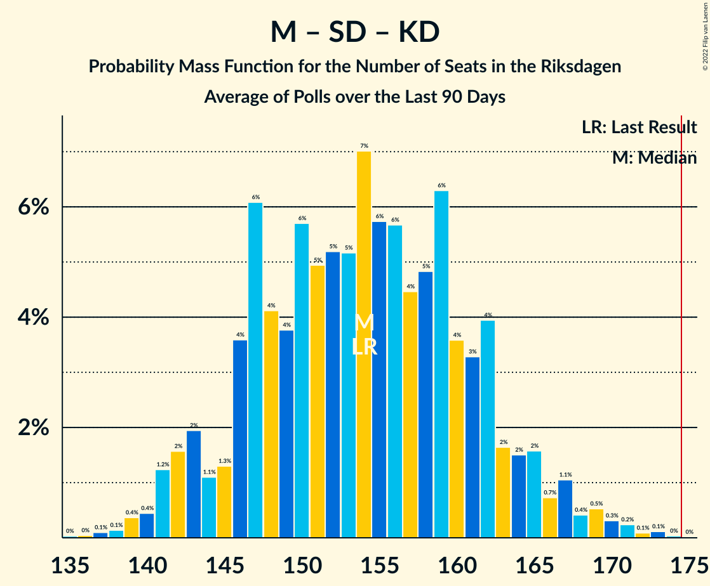

# Poll Average

<a href="#voting-intentions">Voting Intentions</a> | <a href="#seats">Seats</a> | <a href="#coalitions">Coalitions</a> | <a href="#technical-information">Technical Information</a>

## Summary

The table below lists the polls on which the average is based. They are the most recent polls (less than 90 days old) registered and analyzed so far.

| Period     | Polling firm/Commissioner(s) | S | M | SD | C | V | KD | L | MP |
|:----------:|:----------------------------:|:--:|:--:|:--:|:--:|:--:|:--:|:--:|:--:|
| 9 September 2018 | General Election | 28.3%   100 | 19.8%   70 | 17.5%   62 | 8.6%   31 | 8.0%   28 | 6.3%   22 | 5.5%   20 | 4.4%   16 |
| N/A | Poll Average | 26–32%   90–112 | 16–20%   58–72 | 17–22%   59–79 | 6–10%   22–32 | 6–9%   21–34 | 5–7%   17–26 | 4–6%   0–23 | 5–9%   16–33 |
| [1–6 September 2022](2022-09-06-Ipsos.html) | Ipsos   Dagens Nyheter | 26–31%   93–111 | 16–20%   59–72 | 19–22%   66–81 | 6–9%   23–32 | 7–10%   25–35 | 5–7%   18–27 | 3–5%   0–19 | 4–6%   16–23 |
| [3–5 September 2022](2022-09-05-Sifo.html) | Sifo   Svenska Dagbladet | 28–32%   99–113 | 17–20%   60–72 | 18–22%   64–77 | 7–9%   23–32 | 6–8%   20–28 | 5–7%   16–23 | 4–6%   0–20 | 5–7%   17–24 |
| [2–5 September 2022](2022-09-05-SKOP.html) | SKOP | 25–30%   88–106 | 16–20%   56–72 | 16–21%   58–74 | 6–9%   21–32 | 6–9%   22–33 | 5–8%   17–26 | 4–7%   15–25 | 7–10%   23–35 |
| [3–5 September 2022](2022-09-05-Novus.html) | Novus   SVT | 26–31%   N/A | 16–20%   N/A | 18–22%   N/A | 7–10%   N/A | 6–9%   N/A | 5–8%   N/A | 3–6%   N/A | 5–7%   N/A |
| [31 August–4 September 2022](2022-09-04-Demoskop.html) | Demoskop   Aftonbladet | N/A   N/A | N/A   N/A | N/A   N/A | N/A   N/A | N/A   N/A | N/A   N/A | N/A   N/A | N/A   N/A |
| 9 September 2018 | General Election | 28.3%   100 | 19.8%   70 | 17.5%   62 | 8.6%   31 | 8.0%   28 | 6.3%   22 | 5.5%   20 | 4.4%   16 |

Only polls for which at least the sample size has been published are included in the table above.

**Legend:**
+ **Top half of each row:** Voting intentions (95% confidence interval)
+ **Bottom half of each row:** Seat projections for the Riksdagen (95% confidence interval)
+ **S:** Sveriges socialdemokratiska arbetareparti
+ **M:** Moderata samlingspartiet
+ **SD:** Sverigedemokraterna
+ **C:** Centerpartiet
+ **V:** Vänsterpartiet
+ **KD:** Kristdemokraterna
+ **L:** Liberalerna
+ **MP:** Miljöpartiet de gröna
+ **N/A (single party):** Party not included the published results
+ **N/A (entire row):** Calculation for this opinion poll not started yet

## Voting Intentions

### Confidence Intervals

| Party | Last Result | Median | 80% Confidence Interval | 90% Confidence Interval | 95% Confidence Interval | 99% Confidence Interval |
|:-----:|:-----------:|:------:|:-----------------------:|:-----------------------:|:-----------------------:|:-----------------------:|
| <a href="#sveriges-socialdemokratiska-arbetareparti">Sveriges socialdemokratiska arbetareparti</a> | 28.3% | 28.7% | 26.8–30.6% |26.3–31.1% | 25.9–31.5% | 24.9–32.2% |
| <a href="#moderata-samlingspartiet">Moderata samlingspartiet</a> | 19.8% | 18.3% | 16.9–19.5% |16.6–19.9% | 16.3–20.2% | 15.6–20.9% |
| <a href="#sverigedemokraterna">Sverigedemokraterna</a> | 17.5% | 19.8% | 18.1–21.3% |17.6–21.7% | 17.1–22.0% | 16.3–22.7% |
| <a href="#centerpartiet">Centerpartiet</a> | 8.6% | 7.9% | 6.9–9.1% |6.6–9.5% | 6.4–9.8% | 5.9–10.4% |
| <a href="#vänsterpartiet">Vänsterpartiet</a> | 8.0% | 7.6% | 6.6–8.8% |6.3–9.1% | 6.1–9.4% | 5.8–9.9% |
| <a href="#kristdemokraterna">Kristdemokraterna</a> | 6.3% | 6.0% | 5.2–6.9% |4.9–7.2% | 4.8–7.4% | 4.4–7.9% |
| <a href="#liberalerna">Liberalerna</a> | 5.5% | 4.7% | 3.9–5.8% |3.7–6.2% | 3.5–6.5% | 3.2–7.1% |
| <a href="#miljöpartiet-de-gröna">Miljöpartiet de gröna</a> | 4.4% | 5.8% | 5.0–8.4% |4.7–8.9% | 4.6–9.2% | 4.2–9.9% |

### Sveriges socialdemokratiska arbetareparti

*For a full overview of the results for this party, see the [Sveriges socialdemokratiska arbetareparti](party-sverigessocialdemokratiskaarbetareparti.html) page.*

| Voting Intentions | Probability | Accumulated | Special Marks |
|:-----------------:|:-----------:|:-----------:|:-------------:|
| 22.5–23.5% | 0% | 100% |  |
| 23.5–24.5% | 0.2% | 100% |  |
| 24.5–25.5% | 1.3% | 99.8% |  |
| 25.5–26.5% | 5% | 98.5% |  |
| 26.5–27.5% | 14% | 93% |  |
| 27.5–28.5% | 24% | 79% | Last Result |
| 28.5–29.5% | 26% | 55% | Median |
| 29.5–30.5% | 19% | 29% |  |
| 30.5–31.5% | 8% | 10% |  |
| 31.5–32.5% | 2% | 2% |  |
| 32.5–33.5% | 0.2% | 0.2% |  |
| 33.5–34.5% | 0% | 0% |  |

### Moderata samlingspartiet

*For a full overview of the results for this party, see the [Moderata samlingspartiet](party-moderatasamlingspartiet.html) page.*

| Voting Intentions | Probability | Accumulated | Special Marks |
|:-----------------:|:-----------:|:-----------:|:-------------:|
| 13.5–14.5% | 0% | 100% |  |
| 14.5–15.5% | 0.4% | 100% |  |
| 15.5–16.5% | 5% | 99.6% |  |
| 16.5–17.5% | 19% | 95% |  |
| 17.5–18.5% | 37% | 76% | Median |
| 18.5–19.5% | 29% | 39% |  |
| 19.5–20.5% | 9% | 10% | Last Result |
| 20.5–21.5% | 1.2% | 1.3% |  |
| 21.5–22.5% | 0.1% | 0.1% |  |
| 22.5–23.5% | 0% | 0% |  |

### Sverigedemokraterna

*For a full overview of the results for this party, see the [Sverigedemokraterna](party-sverigedemokraterna.html) page.*

| Voting Intentions | Probability | Accumulated | Special Marks |
|:-----------------:|:-----------:|:-----------:|:-------------:|
| 13.5–14.5% | 0% | 100% |  |
| 14.5–15.5% | 0.1% | 100% |  |
| 15.5–16.5% | 0.8% | 99.9% |  |
| 16.5–17.5% | 4% | 99.1% |  |
| 17.5–18.5% | 11% | 95% | Last Result |
| 18.5–19.5% | 25% | 84% |  |
| 19.5–20.5% | 32% | 59% | Median |
| 20.5–21.5% | 20% | 27% |  |
| 21.5–22.5% | 5% | 6% |  |
| 22.5–23.5% | 0.7% | 0.7% |  |
| 23.5–24.5% | 0% | 0% |  |

### Centerpartiet

*For a full overview of the results for this party, see the [Centerpartiet](party-centerpartiet.html) page.*

| Voting Intentions | Probability | Accumulated | Special Marks |
|:-----------------:|:-----------:|:-----------:|:-------------:|
| 3.5–4.5% | 0% | 100% |  |
| 4.5–5.5% | 0.1% | 100% |  |
| 5.5–6.5% | 4% | 99.9% |  |
| 6.5–7.5% | 31% | 96% |  |
| 7.5–8.5% | 41% | 65% | Median |
| 8.5–9.5% | 19% | 23% | Last Result |
| 9.5–10.5% | 4% | 4% |  |
| 10.5–11.5% | 0.3% | 0.3% |  |
| 11.5–12.5% | 0% | 0% |  |

### Vänsterpartiet

*For a full overview of the results for this party, see the [Vänsterpartiet](party-vänsterpartiet.html) page.*

| Voting Intentions | Probability | Accumulated | Special Marks |
|:-----------------:|:-----------:|:-----------:|:-------------:|
| 3.5–4.5% | 0% | 100% |  |
| 4.5–5.5% | 0.2% | 100% |  |
| 5.5–6.5% | 9% | 99.8% |  |
| 6.5–7.5% | 37% | 91% |  |
| 7.5–8.5% | 37% | 54% | Last Result, Median |
| 8.5–9.5% | 15% | 17% |  |
| 9.5–10.5% | 2% | 2% |  |
| 10.5–11.5% | 0.1% | 0.1% |  |
| 11.5–12.5% | 0% | 0% |  |

### Kristdemokraterna

*For a full overview of the results for this party, see the [Kristdemokraterna](party-kristdemokraterna.html) page.*

| Voting Intentions | Probability | Accumulated | Special Marks |
|:-----------------:|:-----------:|:-----------:|:-------------:|
| 2.5–3.5% | 0% | 100% |  |
| 3.5–4.5% | 0.9% | 100% |  |
| 4.5–5.5% | 24% | 99.1% |  |
| 5.5–6.5% | 55% | 75% | Last Result, Median |
| 6.5–7.5% | 19% | 20% |  |
| 7.5–8.5% | 1.4% | 1.4% |  |
| 8.5–9.5% | 0% | 0% |  |

### Liberalerna

*For a full overview of the results for this party, see the [Liberalerna](party-liberalerna.html) page.*

| Voting Intentions | Probability | Accumulated | Special Marks |
|:-----------------:|:-----------:|:-----------:|:-------------:|
| 1.5–2.5% | 0% | 100% |  |
| 2.5–3.5% | 3% | 100% |  |
| 3.5–4.5% | 40% | 97% |  |
| 4.5–5.5% | 42% | 57% | Last Result, Median |
| 5.5–6.5% | 13% | 15% |  |
| 6.5–7.5% | 2% | 2% |  |
| 7.5–8.5% | 0.1% | 0.1% |  |
| 8.5–9.5% | 0% | 0% |  |

### Miljöpartiet de gröna

*For a full overview of the results for this party, see the [Miljöpartiet de gröna](party-miljöpartietdegröna.html) page.*

| Voting Intentions | Probability | Accumulated | Special Marks |
|:-----------------:|:-----------:|:-----------:|:-------------:|
| 2.5–3.5% | 0% | 100% |  |
| 3.5–4.5% | 2% | 100% | Last Result |
| 4.5–5.5% | 33% | 98% |  |
| 5.5–6.5% | 37% | 65% | Median |
| 6.5–7.5% | 9% | 28% |  |
| 7.5–8.5% | 12% | 20% |  |
| 8.5–9.5% | 7% | 8% |  |
| 9.5–10.5% | 1.2% | 1.3% |  |
| 10.5–11.5% | 0.1% | 0.1% |  |
| 11.5–12.5% | 0% | 0% |  |

## Seats

### Confidence Intervals

| Party | Last Result | Median | 80% Confidence Interval | 90% Confidence Interval | 95% Confidence Interval | 99% Confidence Interval |
|:-----:|:-----------:|:------:|:-----------------------:|:-----------------------:|:-----------------------:|:-----------------------:|
| <a href="#sveriges-socialdemokratiska-arbetareparti">Sveriges socialdemokratiska arbetareparti</a> | 100 | 102 | 94–108 |92–110 | 90–112 | 87–115 |
| <a href="#moderata-samlingspartiet">Moderata samlingspartiet</a> | 70 | 64 | 60–69 |59–71 | 58–72 | 55–75 |
| <a href="#sverigedemokraterna">Sverigedemokraterna</a> | 62 | 70 | 63–76 |61–78 | 59–79 | 57–82 |
| <a href="#centerpartiet">Centerpartiet</a> | 31 | 27 | 24–30 |23–31 | 22–32 | 20–34 |
| <a href="#vänsterpartiet">Vänsterpartiet</a> | 28 | 27 | 23–32 |22–33 | 21–34 | 20–36 |
| <a href="#kristdemokraterna">Kristdemokraterna</a> | 22 | 21 | 18–24 |17–25 | 17–26 | 15–28 |
| <a href="#liberalerna">Liberalerna</a> | 20 | 17 | 0–21 |0–22 | 0–23 | 0–25 |
| <a href="#miljöpartiet-de-gröna">Miljöpartiet de gröna</a> | 16 | 21 | 18–30 |17–32 | 16–33 | 15–35 |

### Sveriges socialdemokratiska arbetareparti

*For a full overview of the results for this party, see the [Sveriges socialdemokratiska arbetareparti](party-sverigessocialdemokratiskaarbetareparti.html) page.*

| Number of Seats | Probability | Accumulated | Special Marks |
|:---------------:|:-----------:|:-----------:|:-------------:|
| 83 | 0% | 100% |  |
| 84 | 0% | 99.9% |  |
| 85 | 0.1% | 99.9% |  |
| 86 | 0.1% | 99.8% |  |
| 87 | 0.2% | 99.7% |  |
| 88 | 0.7% | 99.4% |  |
| 89 | 0.4% | 98.7% |  |
| 90 | 1.2% | 98% |  |
| 91 | 1.2% | 97% |  |
| 92 | 2% | 96% |  |
| 93 | 3% | 94% |  |
| 94 | 2% | 91% |  |
| 95 | 4% | 89% |  |
| 96 | 4% | 85% |  |
| 97 | 7% | 81% |  |
| 98 | 3% | 74% |  |
| 99 | 6% | 71% |  |
| 100 | 10% | 65% | Last Result |
| 101 | 5% | 56% |  |
| 102 | 6% | 51% | Median |
| 103 | 8% | 45% |  |
| 104 | 5% | 37% |  |
| 105 | 8% | 32% |  |
| 106 | 5% | 24% |  |
| 107 | 3% | 19% |  |
| 108 | 7% | 16% |  |
| 109 | 3% | 9% |  |
| 110 | 1.3% | 6% |  |
| 111 | 2% | 5% |  |
| 112 | 1.3% | 3% |  |
| 113 | 0.5% | 1.4% |  |
| 114 | 0.3% | 0.8% |  |
| 115 | 0.3% | 0.5% |  |
| 116 | 0.1% | 0.3% |  |
| 117 | 0.1% | 0.2% |  |
| 118 | 0.1% | 0.1% |  |
| 119 | 0% | 0% |  |

### Moderata samlingspartiet

*For a full overview of the results for this party, see the [Moderata samlingspartiet](party-moderatasamlingspartiet.html) page.*

| Number of Seats | Probability | Accumulated | Special Marks |
|:---------------:|:-----------:|:-----------:|:-------------:|
| 52 | 0% | 100% |  |
| 53 | 0.1% | 99.9% |  |
| 54 | 0.2% | 99.8% |  |
| 55 | 0.3% | 99.6% |  |
| 56 | 0.4% | 99.4% |  |
| 57 | 0.9% | 98.9% |  |
| 58 | 2% | 98% |  |
| 59 | 4% | 96% |  |
| 60 | 6% | 93% |  |
| 61 | 6% | 86% |  |
| 62 | 8% | 80% |  |
| 63 | 12% | 72% |  |
| 64 | 11% | 60% | Median |
| 65 | 10% | 49% |  |
| 66 | 9% | 39% |  |
| 67 | 7% | 30% |  |
| 68 | 7% | 23% |  |
| 69 | 6% | 16% |  |
| 70 | 4% | 10% | Last Result |
| 71 | 2% | 6% |  |
| 72 | 2% | 4% |  |
| 73 | 0.9% | 2% |  |
| 74 | 0.6% | 1.1% |  |
| 75 | 0.3% | 0.5% |  |
| 76 | 0.1% | 0.2% |  |
| 77 | 0% | 0.1% |  |
| 78 | 0% | 0% |  |

### Sverigedemokraterna

*For a full overview of the results for this party, see the [Sverigedemokraterna](party-sverigedemokraterna.html) page.*

| Number of Seats | Probability | Accumulated | Special Marks |
|:---------------:|:-----------:|:-----------:|:-------------:|
| 54 | 0.1% | 100% |  |
| 55 | 0.1% | 99.9% |  |
| 56 | 0.2% | 99.8% |  |
| 57 | 0.3% | 99.6% |  |
| 58 | 0.7% | 99.2% |  |
| 59 | 1.0% | 98% |  |
| 60 | 2% | 97% |  |
| 61 | 2% | 95% |  |
| 62 | 3% | 94% | Last Result |
| 63 | 3% | 91% |  |
| 64 | 3% | 88% |  |
| 65 | 6% | 85% |  |
| 66 | 5% | 79% |  |
| 67 | 6% | 74% |  |
| 68 | 7% | 69% |  |
| 69 | 9% | 62% |  |
| 70 | 9% | 53% | Median |
| 71 | 9% | 44% |  |
| 72 | 7% | 35% |  |
| 73 | 6% | 28% |  |
| 74 | 7% | 22% |  |
| 75 | 4% | 15% |  |
| 76 | 4% | 11% |  |
| 77 | 2% | 7% |  |
| 78 | 2% | 5% |  |
| 79 | 0.9% | 3% |  |
| 80 | 0.7% | 2% |  |
| 81 | 0.3% | 1.0% |  |
| 82 | 0.4% | 0.7% |  |
| 83 | 0.1% | 0.3% |  |
| 84 | 0.2% | 0.2% |  |
| 85 | 0% | 0% |  |

### Centerpartiet

*For a full overview of the results for this party, see the [Centerpartiet](party-centerpartiet.html) page.*

| Number of Seats | Probability | Accumulated | Special Marks |
|:---------------:|:-----------:|:-----------:|:-------------:|
| 19 | 0.1% | 100% |  |
| 20 | 0.4% | 99.8% |  |
| 21 | 1.0% | 99.5% |  |
| 22 | 2% | 98% |  |
| 23 | 5% | 96% |  |
| 24 | 8% | 91% |  |
| 25 | 13% | 84% |  |
| 26 | 15% | 71% |  |
| 27 | 19% | 56% | Median |
| 28 | 12% | 37% |  |
| 29 | 11% | 25% |  |
| 30 | 6% | 13% |  |
| 31 | 3% | 7% | Last Result |
| 32 | 2% | 4% |  |
| 33 | 1.0% | 2% |  |
| 34 | 0.3% | 0.5% |  |
| 35 | 0.1% | 0.2% |  |
| 36 | 0% | 0.1% |  |
| 37 | 0% | 0% |  |

### Vänsterpartiet

*For a full overview of the results for this party, see the [Vänsterpartiet](party-vänsterpartiet.html) page.*

| Number of Seats | Probability | Accumulated | Special Marks |
|:---------------:|:-----------:|:-----------:|:-------------:|
| 19 | 0.1% | 100% |  |
| 20 | 1.0% | 99.8% |  |
| 21 | 2% | 98.8% |  |
| 22 | 3% | 97% |  |
| 23 | 8% | 94% |  |
| 24 | 7% | 86% |  |
| 25 | 10% | 79% |  |
| 26 | 16% | 69% |  |
| 27 | 10% | 54% | Median |
| 28 | 9% | 44% | Last Result |
| 29 | 11% | 35% |  |
| 30 | 7% | 25% |  |
| 31 | 5% | 17% |  |
| 32 | 5% | 12% |  |
| 33 | 4% | 7% |  |
| 34 | 2% | 3% |  |
| 35 | 0.9% | 2% |  |
| 36 | 0.3% | 0.6% |  |
| 37 | 0.1% | 0.3% |  |
| 38 | 0.1% | 0.1% |  |
| 39 | 0% | 0% |  |

### Kristdemokraterna

*For a full overview of the results for this party, see the [Kristdemokraterna](party-kristdemokraterna.html) page.*

| Number of Seats | Probability | Accumulated | Special Marks |
|:---------------:|:-----------:|:-----------:|:-------------:|
| 14 | 0.1% | 100% |  |
| 15 | 0.4% | 99.9% |  |
| 16 | 2% | 99.5% |  |
| 17 | 5% | 98% |  |
| 18 | 9% | 93% |  |
| 19 | 12% | 84% |  |
| 20 | 13% | 72% |  |
| 21 | 16% | 58% | Median |
| 22 | 15% | 42% | Last Result |
| 23 | 12% | 27% |  |
| 24 | 6% | 15% |  |
| 25 | 5% | 9% |  |
| 26 | 2% | 4% |  |
| 27 | 1.3% | 2% |  |
| 28 | 0.4% | 0.7% |  |
| 29 | 0.2% | 0.2% |  |
| 30 | 0% | 0.1% |  |
| 31 | 0% | 0% |  |

### Liberalerna

*For a full overview of the results for this party, see the [Liberalerna](party-liberalerna.html) page.*

| Number of Seats | Probability | Accumulated | Special Marks |
|:---------------:|:-----------:|:-----------:|:-------------:|
| 0 | 12% | 100% |  |
| 1 | 0% | 88% |  |
| 2 | 0% | 88% |  |
| 3 | 0% | 88% |  |
| 4 | 0% | 88% |  |
| 5 | 0% | 88% |  |
| 6 | 0% | 88% |  |
| 7 | 0% | 88% |  |
| 8 | 0% | 88% |  |
| 9 | 0% | 88% |  |
| 10 | 0% | 88% |  |
| 11 | 0% | 88% |  |
| 12 | 0% | 88% |  |
| 13 | 0% | 88% |  |
| 14 | 4% | 88% |  |
| 15 | 14% | 85% |  |
| 16 | 18% | 71% |  |
| 17 | 13% | 53% | Median |
| 18 | 13% | 40% |  |
| 19 | 9% | 27% |  |
| 20 | 6% | 19% | Last Result |
| 21 | 5% | 12% |  |
| 22 | 3% | 8% |  |
| 23 | 2% | 4% |  |
| 24 | 1.1% | 2% |  |
| 25 | 0.5% | 0.9% |  |
| 26 | 0.3% | 0.4% |  |
| 27 | 0.1% | 0.1% |  |
| 28 | 0% | 0.1% |  |
| 29 | 0% | 0% |  |

### Miljöpartiet de gröna

*For a full overview of the results for this party, see the [Miljöpartiet de gröna](party-miljöpartietdegröna.html) page.*

| Number of Seats | Probability | Accumulated | Special Marks |
|:---------------:|:-----------:|:-----------:|:-------------:|
| 0 | 0.1% | 100% |  |
| 1 | 0% | 99.9% |  |
| 2 | 0% | 99.9% |  |
| 3 | 0% | 99.9% |  |
| 4 | 0% | 99.9% |  |
| 5 | 0% | 99.9% |  |
| 6 | 0% | 99.9% |  |
| 7 | 0% | 99.9% |  |
| 8 | 0% | 99.9% |  |
| 9 | 0% | 99.9% |  |
| 10 | 0% | 99.9% |  |
| 11 | 0% | 99.9% |  |
| 12 | 0% | 99.9% |  |
| 13 | 0% | 99.9% |  |
| 14 | 0.1% | 99.9% |  |
| 15 | 0.6% | 99.8% |  |
| 16 | 2% | 99.1% | Last Result |
| 17 | 5% | 97% |  |
| 18 | 12% | 92% |  |
| 19 | 12% | 80% |  |
| 20 | 14% | 68% |  |
| 21 | 10% | 54% | Median |
| 22 | 6% | 44% |  |
| 23 | 4% | 38% |  |
| 24 | 3% | 34% |  |
| 25 | 2% | 32% |  |
| 26 | 3% | 29% |  |
| 27 | 4% | 26% |  |
| 28 | 5% | 22% |  |
| 29 | 4% | 17% |  |
| 30 | 4% | 13% |  |
| 31 | 3% | 9% |  |
| 32 | 2% | 5% |  |
| 33 | 2% | 4% |  |
| 34 | 1.0% | 2% |  |
| 35 | 0.5% | 0.9% |  |
| 36 | 0.2% | 0.4% |  |
| 37 | 0.1% | 0.2% |  |
| 38 | 0% | 0.1% |  |
| 39 | 0% | 0% |  |

## Coalitions

### Confidence Intervals

| Coalition | Last Result | Median | Majority? | 80% Confidence Interval | 90% Confidence Interval | 95% Confidence Interval | 99% Confidence Interval |
|:---------:|:-----------:|:------:|:---------:|:-----------------------:|:-----------------------:|:-----------------------:|:-----------------------:|
| Sveriges socialdemokratiska arbetareparti – Centerpartiet – Vänsterpartiet – Liberalerna – Miljöpartiet de gröna | 195 | 194 | 99.7% | 185–202 | 183–204 | 180–206 | 176–210 |
| Sveriges socialdemokratiska arbetareparti – Moderata samlingspartiet – Centerpartiet | 201 | 193 | 99.7% | 183–202 | 182–204 | 180–206 | 176–211 |
| Sveriges socialdemokratiska arbetareparti – Centerpartiet – Vänsterpartiet – Miljöpartiet de gröna | 175 | 178 | 75% | 172–185 | 170–188 | 169–189 | 166–192 |
| Moderata samlingspartiet – Sverigedemokraterna – Kristdemokraterna – Liberalerna | 174 | 171 | 25% | 164–177 | 161–179 | 160–180 | 157–183 |
| Sveriges socialdemokratiska arbetareparti – Centerpartiet – Liberalerna – Miljöpartiet de gröna | 167 | 168 | 12% | 156–175 | 152–177 | 149–179 | 145–183 |
| Sveriges socialdemokratiska arbetareparti – Moderata samlingspartiet | 170 | 166 | 9% | 157–174 | 155–176 | 153–178 | 150–183 |
| Moderata samlingspartiet – Sverigedemokraterna – Kristdemokraterna | 154 | 155 | 0.3% | 147–164 | 145–166 | 143–169 | 139–173 |
| Sveriges socialdemokratiska arbetareparti – Vänsterpartiet – Miljöpartiet de gröna | 144 | 151 | 0% | 145–158 | 143–160 | 142–162 | 139–165 |
| Sveriges socialdemokratiska arbetareparti – Centerpartiet – Miljöpartiet de gröna | 147 | 151 | 0% | 144–158 | 142–160 | 140–161 | 137–165 |
| Moderata samlingspartiet – Sverigedemokraterna | 132 | 134 | 0% | 126–142 | 124–144 | 121–147 | 118–150 |
| Sveriges socialdemokratiska arbetareparti – Vänsterpartiet | 128 | 129 | 0% | 121–136 | 119–138 | 117–139 | 114–143 |
| Moderata samlingspartiet – Centerpartiet – Kristdemokraterna – Liberalerna | 143 | 128 | 0% | 120–135 | 117–137 | 114–138 | 111–142 |
| Sveriges socialdemokratiska arbetareparti – Miljöpartiet de gröna | 116 | 124 | 0% | 117–131 | 116–133 | 114–134 | 110–138 |
| Moderata samlingspartiet – Centerpartiet – Kristdemokraterna | 123 | 112 | 0% | 107–119 | 105–121 | 104–122 | 100–126 |
| Moderata samlingspartiet – Centerpartiet – Liberalerna | 121 | 108 | 0% | 99–114 | 95–115 | 92–117 | 88–120 |
| Sveriges socialdemokratiska arbetareparti | 100 | 102 | 0% | 94–108 | 92–110 | 90–112 | 87–115 |
| Moderata samlingspartiet – Kristdemokraterna – Liberalerna | 112 | 102 | 0% | 93–108 | 89–110 | 86–112 | 83–115 |
| Moderata samlingspartiet – Centerpartiet | 101 | 91 | 0% | 86–97 | 84–99 | 83–100 | 80–104 |
| Moderata samlingspartiet – Kristdemokraterna | 92 | 86 | 0% | 80–91 | 79–93 | 78–94 | 75–97 |

### Sveriges socialdemokratiska arbetareparti – Centerpartiet – Vänsterpartiet – Liberalerna – Miljöpartiet de gröna

| Number of Seats | Probability | Accumulated | Special Marks |
|:---------------:|:-----------:|:-----------:|:-------------:|
| 172 | 0.1% | 100% |  |
| 173 | 0% | 99.9% |  |
| 174 | 0.1% | 99.8% |  |
| 175 | 0.1% | 99.7% | Majority |
| 176 | 0.3% | 99.6% |  |
| 177 | 0.4% | 99.3% |  |
| 178 | 0.3% | 99.0% |  |
| 179 | 0.9% | 98.7% |  |
| 180 | 0.6% | 98% |  |
| 181 | 1.2% | 97% |  |
| 182 | 0.7% | 96% |  |
| 183 | 2% | 95% |  |
| 184 | 1.1% | 93% |  |
| 185 | 2% | 92% |  |
| 186 | 2% | 90% |  |
| 187 | 3% | 88% |  |
| 188 | 4% | 85% |  |
| 189 | 5% | 81% |  |
| 190 | 7% | 76% |  |
| 191 | 4% | 69% |  |
| 192 | 3% | 65% |  |
| 193 | 10% | 62% |  |
| 194 | 5% | 52% | Median |
| 195 | 5% | 47% | Last Result |
| 196 | 7% | 42% |  |
| 197 | 9% | 35% |  |
| 198 | 5% | 26% |  |
| 199 | 4% | 21% |  |
| 200 | 3% | 17% |  |
| 201 | 3% | 14% |  |
| 202 | 3% | 11% |  |
| 203 | 1.5% | 8% |  |
| 204 | 2% | 6% |  |
| 205 | 1.3% | 4% |  |
| 206 | 1.0% | 3% |  |
| 207 | 0.4% | 2% |  |
| 208 | 0.8% | 2% |  |
| 209 | 0.4% | 1.0% |  |
| 210 | 0.2% | 0.6% |  |
| 211 | 0.1% | 0.3% |  |
| 212 | 0.1% | 0.3% |  |
| 213 | 0.1% | 0.2% |  |
| 214 | 0% | 0.1% |  |
| 215 | 0% | 0% |  |

### Sveriges socialdemokratiska arbetareparti – Moderata samlingspartiet – Centerpartiet

| Number of Seats | Probability | Accumulated | Special Marks |
|:---------------:|:-----------:|:-----------:|:-------------:|
| 171 | 0% | 100% |  |
| 172 | 0.1% | 99.9% |  |
| 173 | 0.1% | 99.8% |  |
| 174 | 0.1% | 99.8% |  |
| 175 | 0.1% | 99.7% | Majority |
| 176 | 0.1% | 99.5% |  |
| 177 | 0.2% | 99.4% |  |
| 178 | 0.3% | 99.2% |  |
| 179 | 0.5% | 98.9% |  |
| 180 | 1.3% | 98% |  |
| 181 | 2% | 97% |  |
| 182 | 2% | 95% |  |
| 183 | 3% | 93% |  |
| 184 | 4% | 89% |  |
| 185 | 4% | 86% |  |
| 186 | 4% | 82% |  |
| 187 | 4% | 78% |  |
| 188 | 2% | 74% |  |
| 189 | 3% | 72% |  |
| 190 | 5% | 69% |  |
| 191 | 6% | 64% |  |
| 192 | 4% | 58% |  |
| 193 | 6% | 54% | Median |
| 194 | 4% | 48% |  |
| 195 | 6% | 44% |  |
| 196 | 5% | 38% |  |
| 197 | 4% | 33% |  |
| 198 | 7% | 29% |  |
| 199 | 3% | 21% |  |
| 200 | 5% | 19% |  |
| 201 | 4% | 14% | Last Result |
| 202 | 2% | 10% |  |
| 203 | 3% | 8% |  |
| 204 | 1.2% | 5% |  |
| 205 | 1.1% | 4% |  |
| 206 | 0.9% | 3% |  |
| 207 | 0.6% | 2% |  |
| 208 | 0.4% | 2% |  |
| 209 | 0.4% | 1.3% |  |
| 210 | 0.3% | 0.9% |  |
| 211 | 0.2% | 0.6% |  |
| 212 | 0.2% | 0.5% |  |
| 213 | 0.1% | 0.3% |  |
| 214 | 0% | 0.2% |  |
| 215 | 0.1% | 0.1% |  |
| 216 | 0% | 0.1% |  |
| 217 | 0% | 0% |  |

### Sveriges socialdemokratiska arbetareparti – Centerpartiet – Vänsterpartiet – Miljöpartiet de gröna

| Number of Seats | Probability | Accumulated | Special Marks |
|:---------------:|:-----------:|:-----------:|:-------------:|
| 162 | 0% | 100% |  |
| 163 | 0.1% | 99.9% |  |
| 164 | 0.1% | 99.9% |  |
| 165 | 0.2% | 99.8% |  |
| 166 | 0.3% | 99.5% |  |
| 167 | 0.7% | 99.2% |  |
| 168 | 0.9% | 98.5% |  |
| 169 | 2% | 98% |  |
| 170 | 2% | 96% |  |
| 171 | 3% | 94% |  |
| 172 | 5% | 91% |  |
| 173 | 4% | 87% |  |
| 174 | 7% | 82% |  |
| 175 | 6% | 75% | Last Result, Majority |
| 176 | 7% | 69% |  |
| 177 | 6% | 62% | Median |
| 178 | 10% | 56% |  |
| 179 | 8% | 45% |  |
| 180 | 6% | 38% |  |
| 181 | 8% | 31% |  |
| 182 | 4% | 24% |  |
| 183 | 6% | 20% |  |
| 184 | 3% | 14% |  |
| 185 | 3% | 12% |  |
| 186 | 2% | 9% |  |
| 187 | 2% | 7% |  |
| 188 | 2% | 5% |  |
| 189 | 0.7% | 3% |  |
| 190 | 1.0% | 2% |  |
| 191 | 0.4% | 1.3% |  |
| 192 | 0.4% | 0.9% |  |
| 193 | 0.2% | 0.5% |  |
| 194 | 0.1% | 0.3% |  |
| 195 | 0.1% | 0.2% |  |
| 196 | 0% | 0.1% |  |
| 197 | 0% | 0.1% |  |
| 198 | 0% | 0% |  |

### Moderata samlingspartiet – Sverigedemokraterna – Kristdemokraterna – Liberalerna

| Number of Seats | Probability | Accumulated | Special Marks |
|:---------------:|:-----------:|:-----------:|:-------------:|
| 152 | 0% | 100% |  |
| 153 | 0% | 99.9% |  |
| 154 | 0.1% | 99.9% |  |
| 155 | 0.1% | 99.8% |  |
| 156 | 0.2% | 99.7% |  |
| 157 | 0.4% | 99.5% |  |
| 158 | 0.4% | 99.1% |  |
| 159 | 1.0% | 98.7% |  |
| 160 | 0.7% | 98% |  |
| 161 | 2% | 97% |  |
| 162 | 2% | 95% |  |
| 163 | 2% | 93% |  |
| 164 | 3% | 91% |  |
| 165 | 3% | 88% |  |
| 166 | 6% | 86% |  |
| 167 | 4% | 80% |  |
| 168 | 8% | 76% |  |
| 169 | 6% | 69% |  |
| 170 | 8% | 62% |  |
| 171 | 10% | 55% |  |
| 172 | 6% | 44% | Median |
| 173 | 7% | 38% |  |
| 174 | 6% | 31% | Last Result |
| 175 | 7% | 25% | Majority |
| 176 | 4% | 18% |  |
| 177 | 5% | 13% |  |
| 178 | 3% | 9% |  |
| 179 | 2% | 6% |  |
| 180 | 2% | 4% |  |
| 181 | 0.9% | 2% |  |
| 182 | 0.7% | 1.5% |  |
| 183 | 0.3% | 0.8% |  |
| 184 | 0.2% | 0.5% |  |
| 185 | 0.1% | 0.2% |  |
| 186 | 0.1% | 0.1% |  |
| 187 | 0% | 0.1% |  |
| 188 | 0% | 0% |  |

### Sveriges socialdemokratiska arbetareparti – Centerpartiet – Liberalerna – Miljöpartiet de gröna

| Number of Seats | Probability | Accumulated | Special Marks |
|:---------------:|:-----------:|:-----------:|:-------------:|
| 139 | 0.1% | 100% |  |
| 140 | 0% | 99.9% |  |
| 141 | 0% | 99.9% |  |
| 142 | 0% | 99.9% |  |
| 143 | 0.1% | 99.9% |  |
| 144 | 0.1% | 99.7% |  |
| 145 | 0.3% | 99.6% |  |
| 146 | 0.4% | 99.4% |  |
| 147 | 0.6% | 99.0% |  |
| 148 | 0.4% | 98% |  |
| 149 | 0.7% | 98% |  |
| 150 | 0.6% | 97% |  |
| 151 | 0.9% | 97% |  |
| 152 | 1.2% | 96% |  |
| 153 | 1.2% | 94% |  |
| 154 | 0.7% | 93% |  |
| 155 | 2% | 93% |  |
| 156 | 1.3% | 91% |  |
| 157 | 2% | 90% |  |
| 158 | 2% | 88% |  |
| 159 | 2% | 86% |  |
| 160 | 4% | 84% |  |
| 161 | 4% | 80% |  |
| 162 | 3% | 76% |  |
| 163 | 3% | 73% |  |
| 164 | 6% | 69% |  |
| 165 | 4% | 63% |  |
| 166 | 4% | 59% |  |
| 167 | 5% | 55% | Last Result, Median |
| 168 | 6% | 50% |  |
| 169 | 4% | 44% |  |
| 170 | 5% | 40% |  |
| 171 | 9% | 35% |  |
| 172 | 5% | 26% |  |
| 173 | 4% | 21% |  |
| 174 | 5% | 16% |  |
| 175 | 2% | 12% | Majority |
| 176 | 2% | 9% |  |
| 177 | 2% | 7% |  |
| 178 | 2% | 5% |  |
| 179 | 1.0% | 3% |  |
| 180 | 0.6% | 2% |  |
| 181 | 0.4% | 1.5% |  |
| 182 | 0.4% | 1.1% |  |
| 183 | 0.3% | 0.8% |  |
| 184 | 0.2% | 0.5% |  |
| 185 | 0.1% | 0.2% |  |
| 186 | 0.1% | 0.1% |  |
| 187 | 0% | 0.1% |  |
| 188 | 0% | 0% |  |

### Sveriges socialdemokratiska arbetareparti – Moderata samlingspartiet

| Number of Seats | Probability | Accumulated | Special Marks |
|:---------------:|:-----------:|:-----------:|:-------------:|
| 145 | 0% | 100% |  |
| 146 | 0.1% | 99.9% |  |
| 147 | 0.1% | 99.9% |  |
| 148 | 0.1% | 99.8% |  |
| 149 | 0.2% | 99.7% |  |
| 150 | 0.2% | 99.5% |  |
| 151 | 0.4% | 99.3% |  |
| 152 | 1.0% | 98.9% |  |
| 153 | 0.6% | 98% |  |
| 154 | 1.4% | 97% |  |
| 155 | 1.2% | 96% |  |
| 156 | 4% | 95% |  |
| 157 | 2% | 91% |  |
| 158 | 3% | 89% |  |
| 159 | 3% | 86% |  |
| 160 | 4% | 83% |  |
| 161 | 4% | 79% |  |
| 162 | 6% | 76% |  |
| 163 | 6% | 70% |  |
| 164 | 4% | 63% |  |
| 165 | 5% | 60% |  |
| 166 | 5% | 54% | Median |
| 167 | 7% | 49% |  |
| 168 | 4% | 43% |  |
| 169 | 5% | 38% |  |
| 170 | 5% | 33% | Last Result |
| 171 | 6% | 28% |  |
| 172 | 6% | 22% |  |
| 173 | 5% | 16% |  |
| 174 | 3% | 12% |  |
| 175 | 2% | 9% | Majority |
| 176 | 2% | 7% |  |
| 177 | 1.0% | 5% |  |
| 178 | 1.3% | 4% |  |
| 179 | 0.6% | 2% |  |
| 180 | 0.4% | 2% |  |
| 181 | 0.4% | 1.3% |  |
| 182 | 0.3% | 0.9% |  |
| 183 | 0.2% | 0.6% |  |
| 184 | 0.1% | 0.4% |  |
| 185 | 0.1% | 0.2% |  |
| 186 | 0.1% | 0.2% |  |
| 187 | 0.1% | 0.1% |  |
| 188 | 0% | 0% |  |

### Moderata samlingspartiet – Sverigedemokraterna – Kristdemokraterna

| Number of Seats | Probability | Accumulated | Special Marks |
|:---------------:|:-----------:|:-----------:|:-------------:|
| 135 | 0% | 100% |  |
| 136 | 0.1% | 99.9% |  |
| 137 | 0.1% | 99.8% |  |
| 138 | 0.1% | 99.7% |  |
| 139 | 0.2% | 99.7% |  |
| 140 | 0.4% | 99.4% |  |
| 141 | 0.8% | 99.0% |  |
| 142 | 0.4% | 98% |  |
| 143 | 1.0% | 98% |  |
| 144 | 1.3% | 97% |  |
| 145 | 2% | 96% |  |
| 146 | 1.5% | 94% |  |
| 147 | 3% | 92% |  |
| 148 | 3% | 89% |  |
| 149 | 3% | 86% |  |
| 150 | 4% | 83% |  |
| 151 | 5% | 79% |  |
| 152 | 9% | 74% |  |
| 153 | 7% | 65% |  |
| 154 | 5% | 58% | Last Result |
| 155 | 5% | 53% | Median |
| 156 | 10% | 48% |  |
| 157 | 3% | 38% |  |
| 158 | 4% | 35% |  |
| 159 | 7% | 31% |  |
| 160 | 5% | 24% |  |
| 161 | 4% | 19% |  |
| 162 | 3% | 15% |  |
| 163 | 2% | 12% |  |
| 164 | 2% | 10% |  |
| 165 | 1.1% | 8% |  |
| 166 | 2% | 7% |  |
| 167 | 0.7% | 5% |  |
| 168 | 1.2% | 4% |  |
| 169 | 0.6% | 3% |  |
| 170 | 0.9% | 2% |  |
| 171 | 0.3% | 1.3% |  |
| 172 | 0.4% | 1.0% |  |
| 173 | 0.3% | 0.7% |  |
| 174 | 0.1% | 0.4% |  |
| 175 | 0.1% | 0.3% | Majority |
| 176 | 0% | 0.2% |  |
| 177 | 0.1% | 0.1% |  |
| 178 | 0% | 0% |  |

### Sveriges socialdemokratiska arbetareparti – Vänsterpartiet – Miljöpartiet de gröna

| Number of Seats | Probability | Accumulated | Special Marks |
|:---------------:|:-----------:|:-----------:|:-------------:|
| 135 | 0% | 100% |  |
| 136 | 0.1% | 99.9% |  |
| 137 | 0.1% | 99.9% |  |
| 138 | 0.2% | 99.8% |  |
| 139 | 0.2% | 99.6% |  |
| 140 | 0.7% | 99.3% |  |
| 141 | 0.7% | 98.7% |  |
| 142 | 1.2% | 98% |  |
| 143 | 2% | 97% |  |
| 144 | 3% | 95% | Last Result |
| 145 | 3% | 92% |  |
| 146 | 4% | 88% |  |
| 147 | 7% | 84% |  |
| 148 | 7% | 77% |  |
| 149 | 8% | 70% |  |
| 150 | 6% | 63% | Median |
| 151 | 9% | 56% |  |
| 152 | 8% | 47% |  |
| 153 | 6% | 39% |  |
| 154 | 8% | 33% |  |
| 155 | 5% | 25% |  |
| 156 | 5% | 20% |  |
| 157 | 4% | 15% |  |
| 158 | 3% | 12% |  |
| 159 | 2% | 9% |  |
| 160 | 2% | 7% |  |
| 161 | 2% | 5% |  |
| 162 | 0.6% | 3% |  |
| 163 | 0.9% | 2% |  |
| 164 | 0.4% | 1.1% |  |
| 165 | 0.2% | 0.7% |  |
| 166 | 0.2% | 0.5% |  |
| 167 | 0.1% | 0.3% |  |
| 168 | 0.1% | 0.2% |  |
| 169 | 0% | 0.1% |  |
| 170 | 0% | 0% |  |

### Sveriges socialdemokratiska arbetareparti – Centerpartiet – Miljöpartiet de gröna

| Number of Seats | Probability | Accumulated | Special Marks |
|:---------------:|:-----------:|:-----------:|:-------------:|
| 133 | 0% | 100% |  |
| 134 | 0.1% | 99.9% |  |
| 135 | 0.1% | 99.9% |  |
| 136 | 0.2% | 99.7% |  |
| 137 | 0.2% | 99.5% |  |
| 138 | 0.4% | 99.3% |  |
| 139 | 0.9% | 98.9% |  |
| 140 | 1.0% | 98% |  |
| 141 | 1.2% | 97% |  |
| 142 | 2% | 96% |  |
| 143 | 3% | 94% |  |
| 144 | 3% | 92% |  |
| 145 | 5% | 89% |  |
| 146 | 5% | 84% |  |
| 147 | 6% | 79% | Last Result |
| 148 | 7% | 73% |  |
| 149 | 7% | 67% |  |
| 150 | 5% | 59% | Median |
| 151 | 6% | 54% |  |
| 152 | 6% | 47% |  |
| 153 | 10% | 41% |  |
| 154 | 6% | 31% |  |
| 155 | 7% | 26% |  |
| 156 | 4% | 19% |  |
| 157 | 4% | 15% |  |
| 158 | 3% | 11% |  |
| 159 | 3% | 8% |  |
| 160 | 2% | 5% |  |
| 161 | 1.1% | 4% |  |
| 162 | 0.8% | 2% |  |
| 163 | 0.5% | 2% |  |
| 164 | 0.3% | 1.1% |  |
| 165 | 0.4% | 0.8% |  |
| 166 | 0.1% | 0.5% |  |
| 167 | 0.2% | 0.3% |  |
| 168 | 0.1% | 0.1% |  |
| 169 | 0% | 0.1% |  |
| 170 | 0% | 0.1% |  |
| 171 | 0% | 0% |  |

### Moderata samlingspartiet – Sverigedemokraterna

| Number of Seats | Probability | Accumulated | Special Marks |
|:---------------:|:-----------:|:-----------:|:-------------:|
| 114 | 0% | 100% |  |
| 115 | 0.1% | 99.9% |  |
| 116 | 0.1% | 99.9% |  |
| 117 | 0.1% | 99.8% |  |
| 118 | 0.2% | 99.7% |  |
| 119 | 0.5% | 99.4% |  |
| 120 | 0.9% | 99.0% |  |
| 121 | 0.7% | 98% |  |
| 122 | 0.5% | 97% |  |
| 123 | 1.3% | 97% |  |
| 124 | 3% | 96% |  |
| 125 | 2% | 93% |  |
| 126 | 3% | 91% |  |
| 127 | 3% | 88% |  |
| 128 | 2% | 85% |  |
| 129 | 4% | 83% |  |
| 130 | 4% | 79% |  |
| 131 | 6% | 75% |  |
| 132 | 4% | 69% | Last Result |
| 133 | 10% | 65% |  |
| 134 | 5% | 55% | Median |
| 135 | 8% | 49% |  |
| 136 | 5% | 42% |  |
| 137 | 8% | 37% |  |
| 138 | 6% | 28% |  |
| 139 | 5% | 23% |  |
| 140 | 4% | 18% |  |
| 141 | 2% | 14% |  |
| 142 | 3% | 12% |  |
| 143 | 3% | 9% |  |
| 144 | 1.1% | 6% |  |
| 145 | 1.2% | 5% |  |
| 146 | 0.8% | 3% |  |
| 147 | 0.6% | 3% |  |
| 148 | 0.9% | 2% |  |
| 149 | 0.3% | 1.0% |  |
| 150 | 0.2% | 0.7% |  |
| 151 | 0.2% | 0.4% |  |
| 152 | 0.1% | 0.2% |  |
| 153 | 0% | 0.2% |  |
| 154 | 0.1% | 0.1% |  |
| 155 | 0% | 0% |  |

### Sveriges socialdemokratiska arbetareparti – Vänsterpartiet

| Number of Seats | Probability | Accumulated | Special Marks |
|:---------------:|:-----------:|:-----------:|:-------------:|
| 109 | 0% | 100% |  |
| 110 | 0% | 99.9% |  |
| 111 | 0.1% | 99.9% |  |
| 112 | 0.1% | 99.8% |  |
| 113 | 0.1% | 99.7% |  |
| 114 | 0.5% | 99.6% |  |
| 115 | 0.4% | 99.1% |  |
| 116 | 0.7% | 98.7% |  |
| 117 | 0.8% | 98% |  |
| 118 | 2% | 97% |  |
| 119 | 2% | 95% |  |
| 120 | 2% | 94% |  |
| 121 | 3% | 92% |  |
| 122 | 3% | 89% |  |
| 123 | 5% | 86% |  |
| 124 | 3% | 81% |  |
| 125 | 5% | 78% |  |
| 126 | 6% | 74% |  |
| 127 | 6% | 68% |  |
| 128 | 8% | 62% | Last Result |
| 129 | 10% | 54% | Median |
| 130 | 6% | 43% |  |
| 131 | 6% | 37% |  |
| 132 | 6% | 32% |  |
| 133 | 5% | 26% |  |
| 134 | 8% | 20% |  |
| 135 | 2% | 12% |  |
| 136 | 3% | 10% |  |
| 137 | 2% | 8% |  |
| 138 | 2% | 6% |  |
| 139 | 1.4% | 4% |  |
| 140 | 0.8% | 2% |  |
| 141 | 0.6% | 2% |  |
| 142 | 0.4% | 1.0% |  |
| 143 | 0.3% | 0.6% |  |
| 144 | 0.1% | 0.3% |  |
| 145 | 0.1% | 0.2% |  |
| 146 | 0.1% | 0.1% |  |
| 147 | 0% | 0.1% |  |
| 148 | 0% | 0% |  |

### Moderata samlingspartiet – Centerpartiet – Kristdemokraterna – Liberalerna

| Number of Seats | Probability | Accumulated | Special Marks |
|:---------------:|:-----------:|:-----------:|:-------------:|
| 107 | 0% | 100% |  |
| 108 | 0% | 99.9% |  |
| 109 | 0.1% | 99.9% |  |
| 110 | 0.1% | 99.8% |  |
| 111 | 0.5% | 99.7% |  |
| 112 | 0.4% | 99.2% |  |
| 113 | 0.6% | 98.8% |  |
| 114 | 0.9% | 98% |  |
| 115 | 0.6% | 97% |  |
| 116 | 0.9% | 97% |  |
| 117 | 0.9% | 96% |  |
| 118 | 2% | 95% |  |
| 119 | 2% | 93% |  |
| 120 | 2% | 92% |  |
| 121 | 2% | 89% |  |
| 122 | 1.5% | 88% |  |
| 123 | 4% | 86% |  |
| 124 | 5% | 82% |  |
| 125 | 7% | 77% |  |
| 126 | 6% | 70% |  |
| 127 | 6% | 64% |  |
| 128 | 10% | 58% |  |
| 129 | 6% | 48% | Median |
| 130 | 7% | 42% |  |
| 131 | 8% | 35% |  |
| 132 | 5% | 27% |  |
| 133 | 6% | 21% |  |
| 134 | 3% | 15% |  |
| 135 | 3% | 12% |  |
| 136 | 4% | 9% |  |
| 137 | 2% | 5% |  |
| 138 | 1.4% | 4% |  |
| 139 | 0.8% | 2% |  |
| 140 | 0.6% | 2% |  |
| 141 | 0.5% | 1.0% |  |
| 142 | 0.2% | 0.5% |  |
| 143 | 0.1% | 0.3% | Last Result |
| 144 | 0.1% | 0.2% |  |
| 145 | 0.1% | 0.2% |  |
| 146 | 0% | 0.1% |  |
| 147 | 0% | 0% |  |

### Sveriges socialdemokratiska arbetareparti – Miljöpartiet de gröna

| Number of Seats | Probability | Accumulated | Special Marks |
|:---------------:|:-----------:|:-----------:|:-------------:|
| 106 | 0% | 100% |  |
| 107 | 0% | 99.9% |  |
| 108 | 0.1% | 99.9% |  |
| 109 | 0.2% | 99.8% |  |
| 110 | 0.4% | 99.7% |  |
| 111 | 0.3% | 99.3% |  |
| 112 | 0.5% | 99.0% |  |
| 113 | 0.6% | 98% |  |
| 114 | 2% | 98% |  |
| 115 | 1.1% | 96% |  |
| 116 | 2% | 95% | Last Result |
| 117 | 3% | 93% |  |
| 118 | 5% | 89% |  |
| 119 | 5% | 85% |  |
| 120 | 5% | 80% |  |
| 121 | 5% | 75% |  |
| 122 | 7% | 70% |  |
| 123 | 6% | 62% | Median |
| 124 | 7% | 56% |  |
| 125 | 9% | 49% |  |
| 126 | 6% | 40% |  |
| 127 | 8% | 34% |  |
| 128 | 6% | 25% |  |
| 129 | 4% | 19% |  |
| 130 | 4% | 15% |  |
| 131 | 4% | 11% |  |
| 132 | 2% | 8% |  |
| 133 | 2% | 5% |  |
| 134 | 1.2% | 3% |  |
| 135 | 0.5% | 2% |  |
| 136 | 0.7% | 2% |  |
| 137 | 0.3% | 0.9% |  |
| 138 | 0.2% | 0.6% |  |
| 139 | 0.1% | 0.4% |  |
| 140 | 0.1% | 0.2% |  |
| 141 | 0.1% | 0.1% |  |
| 142 | 0% | 0.1% |  |
| 143 | 0% | 0% |  |

### Moderata samlingspartiet – Centerpartiet – Kristdemokraterna

| Number of Seats | Probability | Accumulated | Special Marks |
|:---------------:|:-----------:|:-----------:|:-------------:|
| 96 | 0% | 100% |  |
| 97 | 0.1% | 99.9% |  |
| 98 | 0.1% | 99.9% |  |
| 99 | 0.1% | 99.8% |  |
| 100 | 0.3% | 99.7% |  |
| 101 | 0.3% | 99.4% |  |
| 102 | 0.5% | 99.1% |  |
| 103 | 1.0% | 98.6% |  |
| 104 | 2% | 98% |  |
| 105 | 2% | 96% |  |
| 106 | 3% | 94% |  |
| 107 | 5% | 91% |  |
| 108 | 7% | 86% |  |
| 109 | 9% | 80% |  |
| 110 | 6% | 70% |  |
| 111 | 6% | 64% |  |
| 112 | 9% | 58% | Median |
| 113 | 8% | 49% |  |
| 114 | 10% | 42% |  |
| 115 | 7% | 32% |  |
| 116 | 6% | 25% |  |
| 117 | 4% | 19% |  |
| 118 | 4% | 15% |  |
| 119 | 3% | 11% |  |
| 120 | 2% | 7% |  |
| 121 | 1.5% | 5% |  |
| 122 | 1.2% | 4% |  |
| 123 | 0.7% | 2% | Last Result |
| 124 | 0.7% | 2% |  |
| 125 | 0.4% | 0.9% |  |
| 126 | 0.2% | 0.5% |  |
| 127 | 0.2% | 0.4% |  |
| 128 | 0.1% | 0.2% |  |
| 129 | 0% | 0.1% |  |
| 130 | 0% | 0% |  |

### Moderata samlingspartiet – Centerpartiet – Liberalerna

| Number of Seats | Probability | Accumulated | Special Marks |
|:---------------:|:-----------:|:-----------:|:-------------:|
| 85 | 0% | 100% |  |
| 86 | 0.1% | 99.9% |  |
| 87 | 0.1% | 99.9% |  |
| 88 | 0.3% | 99.7% |  |
| 89 | 0.3% | 99.4% |  |
| 90 | 0.4% | 99.1% |  |
| 91 | 0.8% | 98.7% |  |
| 92 | 0.8% | 98% |  |
| 93 | 0.9% | 97% |  |
| 94 | 1.0% | 96% |  |
| 95 | 1.2% | 95% |  |
| 96 | 1.4% | 94% |  |
| 97 | 0.9% | 93% |  |
| 98 | 1.2% | 92% |  |
| 99 | 1.3% | 91% |  |
| 100 | 2% | 89% |  |
| 101 | 3% | 88% |  |
| 102 | 3% | 85% |  |
| 103 | 4% | 82% |  |
| 104 | 4% | 79% |  |
| 105 | 8% | 74% |  |
| 106 | 10% | 66% |  |
| 107 | 5% | 57% |  |
| 108 | 9% | 51% | Median |
| 109 | 7% | 43% |  |
| 110 | 7% | 36% |  |
| 111 | 7% | 29% |  |
| 112 | 6% | 22% |  |
| 113 | 5% | 16% |  |
| 114 | 4% | 12% |  |
| 115 | 3% | 8% |  |
| 116 | 2% | 5% |  |
| 117 | 1.1% | 3% |  |
| 118 | 0.7% | 2% |  |
| 119 | 0.4% | 1.2% |  |
| 120 | 0.3% | 0.8% |  |
| 121 | 0.2% | 0.5% | Last Result |
| 122 | 0.1% | 0.3% |  |
| 123 | 0.1% | 0.2% |  |
| 124 | 0% | 0.1% |  |
| 125 | 0% | 0% |  |

### Sveriges socialdemokratiska arbetareparti

| Number of Seats | Probability | Accumulated | Special Marks |
|:---------------:|:-----------:|:-----------:|:-------------:|
| 83 | 0% | 100% |  |
| 84 | 0% | 99.9% |  |
| 85 | 0.1% | 99.9% |  |
| 86 | 0.1% | 99.8% |  |
| 87 | 0.2% | 99.7% |  |
| 88 | 0.7% | 99.4% |  |
| 89 | 0.4% | 98.7% |  |
| 90 | 1.2% | 98% |  |
| 91 | 1.2% | 97% |  |
| 92 | 2% | 96% |  |
| 93 | 3% | 94% |  |
| 94 | 2% | 91% |  |
| 95 | 4% | 89% |  |
| 96 | 4% | 85% |  |
| 97 | 7% | 81% |  |
| 98 | 3% | 74% |  |
| 99 | 6% | 71% |  |
| 100 | 10% | 65% | Last Result |
| 101 | 5% | 56% |  |
| 102 | 6% | 51% | Median |
| 103 | 8% | 45% |  |
| 104 | 5% | 37% |  |
| 105 | 8% | 32% |  |
| 106 | 5% | 24% |  |
| 107 | 3% | 19% |  |
| 108 | 7% | 16% |  |
| 109 | 3% | 9% |  |
| 110 | 1.3% | 6% |  |
| 111 | 2% | 5% |  |
| 112 | 1.3% | 3% |  |
| 113 | 0.5% | 1.4% |  |
| 114 | 0.3% | 0.8% |  |
| 115 | 0.3% | 0.5% |  |
| 116 | 0.1% | 0.3% |  |
| 117 | 0.1% | 0.2% |  |
| 118 | 0.1% | 0.1% |  |
| 119 | 0% | 0% |  |

### Moderata samlingspartiet – Kristdemokraterna – Liberalerna

| Number of Seats | Probability | Accumulated | Special Marks |
|:---------------:|:-----------:|:-----------:|:-------------:|
| 81 | 0.1% | 100% |  |
| 82 | 0.2% | 99.9% |  |
| 83 | 0.3% | 99.7% |  |
| 84 | 0.3% | 99.5% |  |
| 85 | 0.8% | 99.2% |  |
| 86 | 1.0% | 98% |  |
| 87 | 0.7% | 97% |  |
| 88 | 0.6% | 97% |  |
| 89 | 1.5% | 96% |  |
| 90 | 2% | 95% |  |
| 91 | 1.0% | 93% |  |
| 92 | 1.0% | 92% |  |
| 93 | 1.0% | 91% |  |
| 94 | 2% | 90% |  |
| 95 | 2% | 88% |  |
| 96 | 3% | 86% |  |
| 97 | 4% | 83% |  |
| 98 | 6% | 80% |  |
| 99 | 6% | 74% |  |
| 100 | 8% | 68% |  |
| 101 | 10% | 60% |  |
| 102 | 9% | 51% | Median |
| 103 | 7% | 42% |  |
| 104 | 6% | 35% |  |
| 105 | 7% | 29% |  |
| 106 | 5% | 22% |  |
| 107 | 4% | 17% |  |
| 108 | 4% | 12% |  |
| 109 | 2% | 9% |  |
| 110 | 2% | 7% |  |
| 111 | 1.4% | 4% |  |
| 112 | 1.3% | 3% | Last Result |
| 113 | 0.4% | 2% |  |
| 114 | 0.6% | 1.2% |  |
| 115 | 0.3% | 0.6% |  |
| 116 | 0.2% | 0.4% |  |
| 117 | 0.1% | 0.2% |  |
| 118 | 0.1% | 0.1% |  |
| 119 | 0% | 0.1% |  |
| 120 | 0% | 0% |  |

### Moderata samlingspartiet – Centerpartiet

| Number of Seats | Probability | Accumulated | Special Marks |
|:---------------:|:-----------:|:-----------:|:-------------:|
| 77 | 0% | 100% |  |
| 78 | 0.1% | 99.9% |  |
| 79 | 0.2% | 99.8% |  |
| 80 | 0.3% | 99.7% |  |
| 81 | 0.4% | 99.4% |  |
| 82 | 0.9% | 99.0% |  |
| 83 | 1.1% | 98% |  |
| 84 | 3% | 97% |  |
| 85 | 3% | 94% |  |
| 86 | 5% | 92% |  |
| 87 | 5% | 86% |  |
| 88 | 6% | 82% |  |
| 89 | 7% | 76% |  |
| 90 | 12% | 68% |  |
| 91 | 9% | 57% | Median |
| 92 | 8% | 48% |  |
| 93 | 7% | 40% |  |
| 94 | 8% | 33% |  |
| 95 | 7% | 24% |  |
| 96 | 5% | 17% |  |
| 97 | 3% | 12% |  |
| 98 | 3% | 9% |  |
| 99 | 3% | 6% |  |
| 100 | 1.2% | 3% |  |
| 101 | 0.8% | 2% | Last Result |
| 102 | 0.6% | 1.4% |  |
| 103 | 0.3% | 0.8% |  |
| 104 | 0.3% | 0.5% |  |
| 105 | 0.2% | 0.3% |  |
| 106 | 0% | 0.1% |  |
| 107 | 0% | 0% |  |

### Moderata samlingspartiet – Kristdemokraterna

| Number of Seats | Probability | Accumulated | Special Marks |
|:---------------:|:-----------:|:-----------:|:-------------:|
| 71 | 0% | 100% |  |
| 72 | 0.1% | 99.9% |  |
| 73 | 0.1% | 99.9% |  |
| 74 | 0.2% | 99.8% |  |
| 75 | 0.2% | 99.6% |  |
| 76 | 0.3% | 99.4% |  |
| 77 | 0.7% | 99.0% |  |
| 78 | 2% | 98% |  |
| 79 | 2% | 97% |  |
| 80 | 5% | 95% |  |
| 81 | 4% | 90% |  |
| 82 | 13% | 86% |  |
| 83 | 5% | 73% |  |
| 84 | 8% | 67% |  |
| 85 | 10% | 60% | Median |
| 86 | 10% | 50% |  |
| 87 | 9% | 40% |  |
| 88 | 6% | 31% |  |
| 89 | 7% | 25% |  |
| 90 | 6% | 19% |  |
| 91 | 3% | 13% |  |
| 92 | 3% | 9% | Last Result |
| 93 | 2% | 6% |  |
| 94 | 2% | 4% |  |
| 95 | 0.8% | 2% |  |
| 96 | 0.6% | 1.4% |  |
| 97 | 0.4% | 0.8% |  |
| 98 | 0.2% | 0.4% |  |
| 99 | 0.1% | 0.2% |  |
| 100 | 0.1% | 0.1% |  |
| 101 | 0.1% | 0.1% |  |
| 102 | 0% | 0% |  |

## Technical Information

+ **Number of polls included in this average:** 5
+ **Lowest number of simulations done in a poll included in this average:** 0
+ **Total number of simulations done in the polls included in this average:** 3,145,728
+ **Error estimate:** 1.59%
