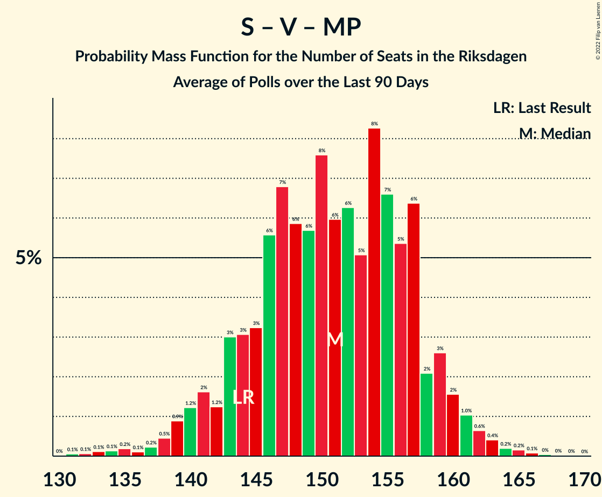

# Poll Average

<a href="#voting-intentions">Voting Intentions</a> | <a href="#seats">Seats</a> | <a href="#coalitions">Coalitions</a> | <a href="#technical-information">Technical Information</a>

## Summary

The table below lists the polls on which the average is based. They are the most recent polls (less than 90 days old) registered and analyzed so far.

| Period     | Polling firm/Commissioner(s) | S | M | SD | C | V | KD | L | MP |
|:----------:|:----------------------------:|:--:|:--:|:--:|:--:|:--:|:--:|:--:|:--:|
| 9 September 2018 | General Election | 28.3%   100 | 19.8%   70 | 17.5%   62 | 8.6%   31 | 8.0%   28 | 6.3%   22 | 5.5%   20 | 4.4%   16 |
| N/A | Poll Average | 24–30%   86–111 | 15–19%   54–72 | 16–22%   56–79 | 6–10%   20–37 | 8–11%   28–41 | 9–13%   34–49 | 3–5%   0–18 | 3–5%   0–20 |
| [9–22 April 2019](2019-04-22-Ipsos.html) | Ipsos   Dagens Nyheter | 25–30%   90–108 | 14–18%   51–67 | 15–19%   56–71 | 7–10%   24–36 | 9–12%   31–43 | 11–14%   38–52 | 3–5%   0–18 | 3–5%   0–19 |
| [1–11 April 2019](2019-04-11-Sifo.html) | Sifo   Svenska Dagbladet | 26–28%   97–104 | 15–17%   56–61 | 18–20%   67–72 | 7–8%   25–29 | 8–9%   30–34 | 12–13%   42–47 | 3–4%   0 | 4–5%   15–18 |
| [4–10 April 2019](2019-04-10-Sentio.html) | Sentio   Nyheter Idag | 23–29%   82–107 | 15–20%   54–75 | 17–23%   63–86 | 5–8%   17–30 | 7–11%   27–42 | 9–13%   32–48 | 3–5%   0–20 | 3–6%   0–23 |
| [26 March–3 April 2019](2019-04-03-Demoskop.html) | Demoskop   Expressen | 23–28%   84–103 | 15–18%   54–68 | 16–20%   59–74 | 7–10%   25–36 | 8–11%   30–41 | 10–13%   37–49 | 3–5%   0–18 | 4–6%   0–20 |
| [4–31 March 2019](2019-03-31-Novus.html) | Novus   SVT | 26–29%   95–109 | 16–19%   61–71 | 17–19%   63–74 | 7–9%   27–35 | 9–11%   33–41 | 10–12%   36–44 | 3–4%   0–16 | 3–4%   0–15 |
| [23–28 March 2019](2019-03-28-Inizio.html) | Inizio   Aftonbladet | 25–28%   92–105 | 15–18%   55–66 | 17–20%   63–72 | 8–10%   30–36 | 8–10%   28–35 | 11–13%   40–49 | 3–4%   0 | 4–5%   0–18 |
| [7–27 March 2019](2019-03-27-SKOP.html) | SKOP | 26–31%   96–116 | 16–20%   59–73 | 15–18%   53–70 | 8–11%   32–39 | 7–10%   27–39 | 9–12%   32–43 | 3–5%   0–19 | 2–4%   0–15 |
| 9 September 2018 | General Election | 28.3%   100 | 19.8%   70 | 17.5%   62 | 8.6%   31 | 8.0%   28 | 6.3%   22 | 5.5%   20 | 4.4%   16 |

Only polls for which at least the sample size has been published are included in the table above.

**Legend:**
+ **Top half of each row:** Voting intentions (95% confidence interval)
+ **Bottom half of each row:** Seat projections for the Riksdagen (95% confidence interval)
+ **S:** Sveriges socialdemokratiska arbetareparti
+ **M:** Moderata samlingspartiet
+ **SD:** Sverigedemokraterna
+ **C:** Centerpartiet
+ **V:** Vänsterpartiet
+ **KD:** Kristdemokraterna
+ **L:** Liberalerna
+ **MP:** Miljöpartiet de gröna
+ **N/A (single party):** Party not included the published results
+ **N/A (entire row):** Calculation for this opinion poll not started yet

## Voting Intentions

### Confidence Intervals

| Party | Last Result | Median | 80% Confidence Interval | 90% Confidence Interval | 95% Confidence Interval | 99% Confidence Interval |
|:-----:|:-----------:|:------:|:-----------------------:|:-----------------------:|:-----------------------:|:-----------------------:|
| <a href="#sveriges-socialdemokratiska-arbetareparti">Sveriges socialdemokratiska arbetareparti</a> | 28.3% | 27.0% | 24.9–28.6% |24.3–29.3% | 23.8–29.9% | 22.8–30.9% |
| <a href="#moderata-samlingspartiet">Moderata samlingspartiet</a> | 19.8% | 16.8% | 15.6–18.4% |15.3–19.0% | 15.0–19.4% | 14.3–20.4% |
| <a href="#sverigedemokraterna">Sverigedemokraterna</a> | 17.5% | 18.2% | 16.4–19.8% |15.9–20.8% | 15.5–21.6% | 14.8–22.9% |
| <a href="#centerpartiet">Centerpartiet</a> | 8.6% | 8.2% | 6.8–9.6% |6.1–10.0% | 5.6–10.3% | 4.9–10.9% |
| <a href="#vänsterpartiet">Vänsterpartiet</a> | 8.0% | 9.2% | 8.3–10.5% |8.0–10.8% | 7.8–11.1% | 7.3–11.8% |
| <a href="#kristdemokraterna">Kristdemokraterna</a> | 6.3% | 11.5% | 9.9–12.7% |9.5–13.0% | 9.2–13.3% | 8.5–13.9% |
| <a href="#liberalerna">Liberalerna</a> | 5.5% | 3.7% | 3.2–4.6% |3.0–4.8% | 2.9–5.1% | 2.6–5.5% |
| <a href="#miljöpartiet-de-gröna">Miljöpartiet de gröna</a> | 4.4% | 4.1% | 3.2–4.9% |2.9–5.1% | 2.7–5.4% | 2.4–5.9% |

### Sveriges socialdemokratiska arbetareparti

*For a full overview of the results for this party, see the [Sveriges socialdemokratiska arbetareparti](party-sverigessocialdemokratiskaarbetareparti.html) page.*

| Voting Intentions | Probability | Accumulated | Special Marks |
|:-----------------:|:-----------:|:-----------:|:-------------:|
| 20.5–21.5% | 0% | 100% |  |
| 21.5–22.5% | 0.3% | 100% |  |
| 22.5–23.5% | 1.5% | 99.7% |  |
| 23.5–24.5% | 5% | 98% |  |
| 24.5–25.5% | 11% | 93% |  |
| 25.5–26.5% | 20% | 83% |  |
| 26.5–27.5% | 32% | 62% | Median |
| 27.5–28.5% | 19% | 30% | Last Result |
| 28.5–29.5% | 7% | 11% |  |
| 29.5–30.5% | 3% | 4% |  |
| 30.5–31.5% | 0.8% | 0.9% |  |
| 31.5–32.5% | 0.1% | 0.1% |  |
| 32.5–33.5% | 0% | 0% |  |

### Moderata samlingspartiet

*For a full overview of the results for this party, see the [Moderata samlingspartiet](party-moderatasamlingspartiet.html) page.*

| Voting Intentions | Probability | Accumulated | Special Marks |
|:-----------------:|:-----------:|:-----------:|:-------------:|
| 12.5–13.5% | 0% | 100% |  |
| 13.5–14.5% | 0.8% | 100% |  |
| 14.5–15.5% | 8% | 99.1% |  |
| 15.5–16.5% | 32% | 91% |  |
| 16.5–17.5% | 30% | 59% | Median |
| 17.5–18.5% | 20% | 28% |  |
| 18.5–19.5% | 7% | 9% |  |
| 19.5–20.5% | 2% | 2% | Last Result |
| 20.5–21.5% | 0.3% | 0.3% |  |
| 21.5–22.5% | 0% | 0% |  |

### Sverigedemokraterna

*For a full overview of the results for this party, see the [Sverigedemokraterna](party-sverigedemokraterna.html) page.*

| Voting Intentions | Probability | Accumulated | Special Marks |
|:-----------------:|:-----------:|:-----------:|:-------------:|
| 12.5–13.5% | 0% | 100% |  |
| 13.5–14.5% | 0.3% | 100% |  |
| 14.5–15.5% | 3% | 99.7% |  |
| 15.5–16.5% | 9% | 97% |  |
| 16.5–17.5% | 19% | 88% |  |
| 17.5–18.5% | 31% | 69% | Last Result, Median |
| 18.5–19.5% | 26% | 38% |  |
| 19.5–20.5% | 6% | 12% |  |
| 20.5–21.5% | 3% | 6% |  |
| 21.5–22.5% | 2% | 3% |  |
| 22.5–23.5% | 0.6% | 0.8% |  |
| 23.5–24.5% | 0.1% | 0.2% |  |
| 24.5–25.5% | 0% | 0% |  |

### Centerpartiet

*For a full overview of the results for this party, see the [Centerpartiet](party-centerpartiet.html) page.*

| Voting Intentions | Probability | Accumulated | Special Marks |
|:-----------------:|:-----------:|:-----------:|:-------------:|
| 2.5–3.5% | 0% | 100% |  |
| 3.5–4.5% | 0.1% | 100% |  |
| 4.5–5.5% | 2% | 99.9% |  |
| 5.5–6.5% | 6% | 98% |  |
| 6.5–7.5% | 18% | 92% |  |
| 7.5–8.5% | 36% | 74% | Median |
| 8.5–9.5% | 27% | 38% | Last Result |
| 9.5–10.5% | 9% | 11% |  |
| 10.5–11.5% | 1.3% | 1.4% |  |
| 11.5–12.5% | 0.1% | 0.1% |  |
| 12.5–13.5% | 0% | 0% |  |

### Vänsterpartiet

*For a full overview of the results for this party, see the [Vänsterpartiet](party-vänsterpartiet.html) page.*

| Voting Intentions | Probability | Accumulated | Special Marks |
|:-----------------:|:-----------:|:-----------:|:-------------:|
| 5.5–6.5% | 0% | 100% |  |
| 6.5–7.5% | 1.1% | 100% |  |
| 7.5–8.5% | 19% | 98.9% | Last Result |
| 8.5–9.5% | 43% | 80% | Median |
| 9.5–10.5% | 28% | 37% |  |
| 10.5–11.5% | 8% | 9% |  |
| 11.5–12.5% | 0.9% | 1.0% |  |
| 12.5–13.5% | 0.1% | 0.1% |  |
| 13.5–14.5% | 0% | 0% |  |

### Kristdemokraterna

*For a full overview of the results for this party, see the [Kristdemokraterna](party-kristdemokraterna.html) page.*

| Voting Intentions | Probability | Accumulated | Special Marks |
|:-----------------:|:-----------:|:-----------:|:-------------:|
| 5.5–6.5% | 0% | 100% | Last Result |
| 6.5–7.5% | 0% | 100% |  |
| 7.5–8.5% | 0.5% | 100% |  |
| 8.5–9.5% | 5% | 99.5% |  |
| 9.5–10.5% | 19% | 94% |  |
| 10.5–11.5% | 27% | 76% |  |
| 11.5–12.5% | 36% | 49% | Median |
| 12.5–13.5% | 12% | 14% |  |
| 13.5–14.5% | 1.2% | 1.3% |  |
| 14.5–15.5% | 0.1% | 0.1% |  |
| 15.5–16.5% | 0% | 0% |  |

### Liberalerna

*For a full overview of the results for this party, see the [Liberalerna](party-liberalerna.html) page.*

| Voting Intentions | Probability | Accumulated | Special Marks |
|:-----------------:|:-----------:|:-----------:|:-------------:|
| 0.5–1.5% | 0% | 100% |  |
| 1.5–2.5% | 0.3% | 100% |  |
| 2.5–3.5% | 36% | 99.7% |  |
| 3.5–4.5% | 53% | 63% | Median |
| 4.5–5.5% | 10% | 10% | Last Result |
| 5.5–6.5% | 0.4% | 0.4% |  |
| 6.5–7.5% | 0% | 0% |  |

### Miljöpartiet de gröna

*For a full overview of the results for this party, see the [Miljöpartiet de gröna](party-miljöpartietdegröna.html) page.*

| Voting Intentions | Probability | Accumulated | Special Marks |
|:-----------------:|:-----------:|:-----------:|:-------------:|
| 0.5–1.5% | 0% | 100% |  |
| 1.5–2.5% | 1.1% | 100% |  |
| 2.5–3.5% | 23% | 98.9% |  |
| 3.5–4.5% | 50% | 76% | Last Result, Median |
| 4.5–5.5% | 25% | 27% |  |
| 5.5–6.5% | 2% | 2% |  |
| 6.5–7.5% | 0.1% | 0.1% |  |
| 7.5–8.5% | 0% | 0% |  |

## Seats

### Confidence Intervals

| Party | Last Result | Median | 80% Confidence Interval | 90% Confidence Interval | 95% Confidence Interval | 99% Confidence Interval |
|:-----:|:-----------:|:------:|:-----------------------:|:-----------------------:|:-----------------------:|:-----------------------:|
| <a href="#sveriges-socialdemokratiska-arbetareparti">Sveriges socialdemokratiska arbetareparti</a> | 100 | 99 | 90–106 |88–108 | 86–111 | 82–115 |
| <a href="#moderata-samlingspartiet">Moderata samlingspartiet</a> | 70 | 62 | 56–69 |55–70 | 54–72 | 51–75 |
| <a href="#sverigedemokraterna">Sverigedemokraterna</a> | 62 | 67 | 60–73 |58–75 | 56–79 | 54–84 |
| <a href="#centerpartiet">Centerpartiet</a> | 31 | 30 | 25–35 |23–36 | 20–37 | 17–39 |
| <a href="#vänsterpartiet">Vänsterpartiet</a> | 28 | 34 | 30–39 |29–40 | 28–41 | 26–44 |
| <a href="#kristdemokraterna">Kristdemokraterna</a> | 22 | 42 | 37–47 |35–48 | 34–49 | 31–52 |
| <a href="#liberalerna">Liberalerna</a> | 20 | 0 | 0–16 |0–18 | 0–18 | 0–20 |
| <a href="#miljöpartiet-de-gröna">Miljöpartiet de gröna</a> | 16 | 15 | 0–18 |0–19 | 0–20 | 0–22 |

### Sveriges socialdemokratiska arbetareparti

*For a full overview of the results for this party, see the [Sveriges socialdemokratiska arbetareparti](party-sverigessocialdemokratiskaarbetareparti.html) page.*

| Number of Seats | Probability | Accumulated | Special Marks |
|:---------------:|:-----------:|:-----------:|:-------------:|
| 78 | 0% | 100% |  |
| 79 | 0.1% | 99.9% |  |
| 80 | 0% | 99.9% |  |
| 81 | 0.1% | 99.8% |  |
| 82 | 0.4% | 99.7% |  |
| 83 | 0.3% | 99.2% |  |
| 84 | 0.5% | 98.9% |  |
| 85 | 0.6% | 98% |  |
| 86 | 0.8% | 98% |  |
| 87 | 1.4% | 97% |  |
| 88 | 2% | 96% |  |
| 89 | 2% | 94% |  |
| 90 | 2% | 92% |  |
| 91 | 4% | 90% |  |
| 92 | 4% | 86% |  |
| 93 | 3% | 82% |  |
| 94 | 4% | 79% |  |
| 95 | 5% | 75% |  |
| 96 | 4% | 70% |  |
| 97 | 7% | 66% |  |
| 98 | 7% | 58% |  |
| 99 | 6% | 51% | Median |
| 100 | 7% | 46% | Last Result |
| 101 | 9% | 38% |  |
| 102 | 6% | 29% |  |
| 103 | 4% | 23% |  |
| 104 | 4% | 19% |  |
| 105 | 4% | 15% |  |
| 106 | 3% | 11% |  |
| 107 | 2% | 9% |  |
| 108 | 2% | 6% |  |
| 109 | 0.7% | 5% |  |
| 110 | 0.4% | 4% |  |
| 111 | 1.4% | 3% |  |
| 112 | 0.3% | 2% |  |
| 113 | 0.1% | 2% |  |
| 114 | 0.6% | 2% |  |
| 115 | 0.6% | 1.0% |  |
| 116 | 0.2% | 0.4% |  |
| 117 | 0% | 0.2% |  |
| 118 | 0.1% | 0.2% |  |
| 119 | 0% | 0% |  |

### Moderata samlingspartiet

*For a full overview of the results for this party, see the [Moderata samlingspartiet](party-moderatasamlingspartiet.html) page.*

| Number of Seats | Probability | Accumulated | Special Marks |
|:---------------:|:-----------:|:-----------:|:-------------:|
| 49 | 0.1% | 100% |  |
| 50 | 0.1% | 99.9% |  |
| 51 | 0.4% | 99.8% |  |
| 52 | 0.3% | 99.4% |  |
| 53 | 0.8% | 99.1% |  |
| 54 | 0.8% | 98% |  |
| 55 | 3% | 97% |  |
| 56 | 5% | 94% |  |
| 57 | 4% | 90% |  |
| 58 | 8% | 85% |  |
| 59 | 6% | 78% |  |
| 60 | 11% | 72% |  |
| 61 | 8% | 60% |  |
| 62 | 7% | 53% | Median |
| 63 | 7% | 45% |  |
| 64 | 7% | 38% |  |
| 65 | 7% | 31% |  |
| 66 | 4% | 25% |  |
| 67 | 5% | 20% |  |
| 68 | 4% | 16% |  |
| 69 | 4% | 11% |  |
| 70 | 3% | 8% | Last Result |
| 71 | 1.2% | 4% |  |
| 72 | 0.9% | 3% |  |
| 73 | 0.7% | 2% |  |
| 74 | 0.9% | 2% |  |
| 75 | 0.4% | 0.7% |  |
| 76 | 0.1% | 0.3% |  |
| 77 | 0% | 0.2% |  |
| 78 | 0% | 0.1% |  |
| 79 | 0% | 0.1% |  |
| 80 | 0% | 0.1% |  |
| 81 | 0.1% | 0.1% |  |
| 82 | 0% | 0% |  |

### Sverigedemokraterna

*For a full overview of the results for this party, see the [Sverigedemokraterna](party-sverigedemokraterna.html) page.*

| Number of Seats | Probability | Accumulated | Special Marks |
|:---------------:|:-----------:|:-----------:|:-------------:|
| 51 | 0% | 100% |  |
| 52 | 0.2% | 99.9% |  |
| 53 | 0.2% | 99.7% |  |
| 54 | 1.0% | 99.5% |  |
| 55 | 0.8% | 98.5% |  |
| 56 | 0.8% | 98% |  |
| 57 | 1.0% | 97% |  |
| 58 | 3% | 96% |  |
| 59 | 2% | 93% |  |
| 60 | 2% | 91% |  |
| 61 | 4% | 89% |  |
| 62 | 5% | 85% | Last Result |
| 63 | 4% | 80% |  |
| 64 | 5% | 77% |  |
| 65 | 8% | 72% |  |
| 66 | 8% | 64% |  |
| 67 | 9% | 56% | Median |
| 68 | 8% | 47% |  |
| 69 | 10% | 39% |  |
| 70 | 7% | 29% |  |
| 71 | 6% | 22% |  |
| 72 | 5% | 16% |  |
| 73 | 2% | 11% |  |
| 74 | 2% | 10% |  |
| 75 | 3% | 7% |  |
| 76 | 1.0% | 4% |  |
| 77 | 0.1% | 3% |  |
| 78 | 0.3% | 3% |  |
| 79 | 0.7% | 3% |  |
| 80 | 0.7% | 2% |  |
| 81 | 0% | 1.4% |  |
| 82 | 0.3% | 1.4% |  |
| 83 | 0.2% | 1.1% |  |
| 84 | 0.5% | 0.9% |  |
| 85 | 0% | 0.4% |  |
| 86 | 0.2% | 0.4% |  |
| 87 | 0.1% | 0.2% |  |
| 88 | 0% | 0.1% |  |
| 89 | 0% | 0.1% |  |
| 90 | 0% | 0.1% |  |
| 91 | 0% | 0.1% |  |
| 92 | 0% | 0.1% |  |
| 93 | 0% | 0% |  |

### Centerpartiet

*For a full overview of the results for this party, see the [Centerpartiet](party-centerpartiet.html) page.*

| Number of Seats | Probability | Accumulated | Special Marks |
|:---------------:|:-----------:|:-----------:|:-------------:|
| 16 | 0.2% | 100% |  |
| 17 | 0.4% | 99.8% |  |
| 18 | 0.6% | 99.3% |  |
| 19 | 1.1% | 98.8% |  |
| 20 | 0.9% | 98% |  |
| 21 | 0.7% | 97% |  |
| 22 | 0.5% | 96% |  |
| 23 | 1.2% | 96% |  |
| 24 | 2% | 94% |  |
| 25 | 3% | 92% |  |
| 26 | 5% | 89% |  |
| 27 | 9% | 83% |  |
| 28 | 11% | 75% |  |
| 29 | 8% | 63% |  |
| 30 | 7% | 56% | Median |
| 31 | 8% | 49% | Last Result |
| 32 | 6% | 41% |  |
| 33 | 9% | 35% |  |
| 34 | 11% | 25% |  |
| 35 | 9% | 14% |  |
| 36 | 2% | 5% |  |
| 37 | 2% | 3% |  |
| 38 | 0.7% | 1.2% |  |
| 39 | 0.3% | 0.5% |  |
| 40 | 0.2% | 0.3% |  |
| 41 | 0% | 0.1% |  |
| 42 | 0% | 0.1% |  |
| 43 | 0% | 0% |  |

### Vänsterpartiet

*For a full overview of the results for this party, see the [Vänsterpartiet](party-vänsterpartiet.html) page.*

| Number of Seats | Probability | Accumulated | Special Marks |
|:---------------:|:-----------:|:-----------:|:-------------:|
| 25 | 0.2% | 100% |  |
| 26 | 0.4% | 99.8% |  |
| 27 | 0.5% | 99.4% |  |
| 28 | 2% | 98.9% | Last Result |
| 29 | 4% | 97% |  |
| 30 | 5% | 93% |  |
| 31 | 12% | 88% |  |
| 32 | 11% | 76% |  |
| 33 | 10% | 65% |  |
| 34 | 12% | 56% | Median |
| 35 | 8% | 43% |  |
| 36 | 10% | 35% |  |
| 37 | 8% | 25% |  |
| 38 | 6% | 18% |  |
| 39 | 5% | 11% |  |
| 40 | 2% | 6% |  |
| 41 | 2% | 4% |  |
| 42 | 1.0% | 2% |  |
| 43 | 0.5% | 1.1% |  |
| 44 | 0.2% | 0.5% |  |
| 45 | 0.2% | 0.3% |  |
| 46 | 0.1% | 0.1% |  |
| 47 | 0% | 0.1% |  |
| 48 | 0% | 0% |  |

### Kristdemokraterna

*For a full overview of the results for this party, see the [Kristdemokraterna](party-kristdemokraterna.html) page.*

| Number of Seats | Probability | Accumulated | Special Marks |
|:---------------:|:-----------:|:-----------:|:-------------:|
| 22 | 0% | 100% | Last Result |
| 23 | 0% | 100% |  |
| 24 | 0% | 100% |  |
| 25 | 0% | 100% |  |
| 26 | 0% | 100% |  |
| 27 | 0% | 100% |  |
| 28 | 0% | 100% |  |
| 29 | 0.1% | 100% |  |
| 30 | 0.2% | 99.9% |  |
| 31 | 0.3% | 99.7% |  |
| 32 | 0.2% | 99.4% |  |
| 33 | 2% | 99.2% |  |
| 34 | 1.4% | 98% |  |
| 35 | 3% | 96% |  |
| 36 | 3% | 93% |  |
| 37 | 5% | 90% |  |
| 38 | 5% | 85% |  |
| 39 | 6% | 80% |  |
| 40 | 7% | 74% |  |
| 41 | 9% | 66% |  |
| 42 | 8% | 58% | Median |
| 43 | 9% | 50% |  |
| 44 | 12% | 41% |  |
| 45 | 9% | 30% |  |
| 46 | 9% | 20% |  |
| 47 | 5% | 11% |  |
| 48 | 2% | 6% |  |
| 49 | 2% | 4% |  |
| 50 | 0.7% | 2% |  |
| 51 | 0.4% | 1.0% |  |
| 52 | 0.4% | 0.6% |  |
| 53 | 0.1% | 0.2% |  |
| 54 | 0.1% | 0.1% |  |
| 55 | 0% | 0.1% |  |
| 56 | 0% | 0% |  |

### Liberalerna

*For a full overview of the results for this party, see the [Liberalerna](party-liberalerna.html) page.*

| Number of Seats | Probability | Accumulated | Special Marks |
|:---------------:|:-----------:|:-----------:|:-------------:|
| 0 | 67% | 100% | Median |
| 1 | 0% | 33% |  |
| 2 | 0% | 33% |  |
| 3 | 0% | 33% |  |
| 4 | 0% | 33% |  |
| 5 | 0% | 33% |  |
| 6 | 0% | 33% |  |
| 7 | 0% | 33% |  |
| 8 | 0% | 33% |  |
| 9 | 0% | 33% |  |
| 10 | 0% | 33% |  |
| 11 | 0% | 33% |  |
| 12 | 0% | 33% |  |
| 13 | 0% | 33% |  |
| 14 | 1.3% | 33% |  |
| 15 | 16% | 32% |  |
| 16 | 6% | 16% |  |
| 17 | 4% | 10% |  |
| 18 | 3% | 5% |  |
| 19 | 1.0% | 2% |  |
| 20 | 0.4% | 0.7% | Last Result |
| 21 | 0.1% | 0.3% |  |
| 22 | 0.2% | 0.2% |  |
| 23 | 0% | 0% |  |

### Miljöpartiet de gröna

*For a full overview of the results for this party, see the [Miljöpartiet de gröna](party-miljöpartietdegröna.html) page.*

| Number of Seats | Probability | Accumulated | Special Marks |
|:---------------:|:-----------:|:-----------:|:-------------:|
| 0 | 43% | 100% |  |
| 1 | 0% | 57% |  |
| 2 | 0% | 57% |  |
| 3 | 0% | 57% |  |
| 4 | 0% | 57% |  |
| 5 | 0% | 57% |  |
| 6 | 0% | 57% |  |
| 7 | 0% | 57% |  |
| 8 | 0% | 57% |  |
| 9 | 0% | 57% |  |
| 10 | 0% | 57% |  |
| 11 | 0% | 57% |  |
| 12 | 0% | 57% |  |
| 13 | 0% | 57% |  |
| 14 | 2% | 57% |  |
| 15 | 13% | 55% | Median |
| 16 | 12% | 43% | Last Result |
| 17 | 14% | 30% |  |
| 18 | 9% | 16% |  |
| 19 | 4% | 7% |  |
| 20 | 1.0% | 3% |  |
| 21 | 0.6% | 2% |  |
| 22 | 0.7% | 1.1% |  |
| 23 | 0.3% | 0.4% |  |
| 24 | 0.1% | 0.1% |  |
| 25 | 0% | 0.1% |  |
| 26 | 0% | 0% |  |

## Coalitions

### Confidence Intervals

| Coalition | Last Result | Median | Majority? | 80% Confidence Interval | 90% Confidence Interval | 95% Confidence Interval | 99% Confidence Interval |
|:---------:|:-----------:|:------:|:---------:|:-----------------------:|:-----------------------:|:-----------------------:|:-----------------------:|
| Sveriges socialdemokratiska arbetareparti – Moderata samlingspartiet – Centerpartiet | 201 | 189 | 95% | 178–205 | 175–208 | 172–212 | 167–218 |
| Sveriges socialdemokratiska arbetareparti – Centerpartiet – Vänsterpartiet – Liberalerna – Miljöpartiet de gröna | 195 | 177 | 70% | 169–187 | 165–190 | 164–192 | 155–196 |
| Moderata samlingspartiet – Sverigedemokraterna – Kristdemokraterna | 154 | 172 | 30% | 162–180 | 159–184 | 157–185 | 153–194 |
| Sveriges socialdemokratiska arbetareparti – Moderata samlingspartiet | 170 | 159 | 7% | 151–173 | 148–175 | 145–179 | 142–185 |
| Sveriges socialdemokratiska arbetareparti – Centerpartiet – Liberalerna – Miljöpartiet de gröna | 167 | 144 | 0% | 133–153 | 131–157 | 128–158 | 121–162 |
| Moderata samlingspartiet – Centerpartiet – Kristdemokraterna – Liberalerna | 143 | 139 | 0% | 129–152 | 128–154 | 124–157 | 116–160 |
| Sveriges socialdemokratiska arbetareparti – Vänsterpartiet – Miljöpartiet de gröna | 144 | 143 | 0% | 133–150 | 130–153 | 127–155 | 125–159 |
| Sveriges socialdemokratiska arbetareparti – Vänsterpartiet | 128 | 132 | 0% | 124–142 | 122–145 | 119–147 | 115–150 |
| Moderata samlingspartiet – Centerpartiet – Kristdemokraterna | 123 | 135 | 0% | 127–142 | 123–144 | 120–146 | 114–149 |
| Moderata samlingspartiet – Sverigedemokraterna | 132 | 129 | 0% | 121–139 | 118–141 | 116–144 | 113–151 |
| Sveriges socialdemokratiska arbetareparti – Miljöpartiet de gröna | 116 | 108 | 0% | 99–117 | 96–119 | 93–120 | 90–123 |
| Moderata samlingspartiet – Centerpartiet – Liberalerna | 121 | 97 | 0% | 86–113 | 84–117 | 83–119 | 78–124 |
| Moderata samlingspartiet – Centerpartiet | 101 | 93 | 0% | 84–101 | 83–103 | 80–105 | 77–109 |

### Sveriges socialdemokratiska arbetareparti – Moderata samlingspartiet – Centerpartiet

| Number of Seats | Probability | Accumulated | Special Marks |
|:---------------:|:-----------:|:-----------:|:-------------:|
| 161 | 0% | 100% |  |
| 162 | 0% | 99.9% |  |
| 163 | 0.1% | 99.9% |  |
| 164 | 0% | 99.9% |  |
| 165 | 0.3% | 99.8% |  |
| 166 | 0% | 99.6% |  |
| 167 | 0.1% | 99.5% |  |
| 168 | 0.1% | 99.5% |  |
| 169 | 0.6% | 99.3% |  |
| 170 | 0.4% | 98.8% |  |
| 171 | 0.3% | 98% |  |
| 172 | 0.8% | 98% |  |
| 173 | 0.8% | 97% |  |
| 174 | 1.2% | 96% |  |
| 175 | 0.8% | 95% | Majority |
| 176 | 1.2% | 95% |  |
| 177 | 1.2% | 93% |  |
| 178 | 2% | 92% |  |
| 179 | 2% | 90% |  |
| 180 | 3% | 88% |  |
| 181 | 3% | 85% |  |
| 182 | 2% | 83% |  |
| 183 | 3% | 80% |  |
| 184 | 4% | 78% |  |
| 185 | 6% | 74% |  |
| 186 | 8% | 68% |  |
| 187 | 4% | 61% |  |
| 188 | 4% | 56% |  |
| 189 | 3% | 52% |  |
| 190 | 3% | 49% |  |
| 191 | 3% | 46% | Median |
| 192 | 5% | 43% |  |
| 193 | 2% | 38% |  |
| 194 | 2% | 36% |  |
| 195 | 1.4% | 33% |  |
| 196 | 2% | 32% |  |
| 197 | 2% | 30% |  |
| 198 | 2% | 28% |  |
| 199 | 2% | 26% |  |
| 200 | 3% | 24% |  |
| 201 | 3% | 21% | Last Result |
| 202 | 3% | 17% |  |
| 203 | 1.4% | 14% |  |
| 204 | 2% | 13% |  |
| 205 | 1.4% | 10% |  |
| 206 | 1.3% | 9% |  |
| 207 | 1.0% | 8% |  |
| 208 | 2% | 7% |  |
| 209 | 0.5% | 5% |  |
| 210 | 1.1% | 4% |  |
| 211 | 0.7% | 3% |  |
| 212 | 0.2% | 3% |  |
| 213 | 0.6% | 2% |  |
| 214 | 0.1% | 2% |  |
| 215 | 0.3% | 2% |  |
| 216 | 0% | 1.5% |  |
| 217 | 0.2% | 1.4% |  |
| 218 | 1.0% | 1.2% |  |
| 219 | 0.1% | 0.3% |  |
| 220 | 0% | 0.2% |  |
| 221 | 0% | 0.1% |  |
| 222 | 0% | 0.1% |  |
| 223 | 0.1% | 0.1% |  |
| 224 | 0% | 0% |  |

### Sveriges socialdemokratiska arbetareparti – Centerpartiet – Vänsterpartiet – Liberalerna – Miljöpartiet de gröna

| Number of Seats | Probability | Accumulated | Special Marks |
|:---------------:|:-----------:|:-----------:|:-------------:|
| 149 | 0.1% | 100% |  |
| 150 | 0% | 99.9% |  |
| 151 | 0.1% | 99.8% |  |
| 152 | 0% | 99.7% |  |
| 153 | 0% | 99.7% |  |
| 154 | 0.2% | 99.7% |  |
| 155 | 0.1% | 99.5% |  |
| 156 | 0% | 99.5% |  |
| 157 | 0.1% | 99.4% |  |
| 158 | 0% | 99.4% |  |
| 159 | 0.1% | 99.3% |  |
| 160 | 0.5% | 99.3% |  |
| 161 | 0.2% | 98.8% |  |
| 162 | 0.6% | 98.6% |  |
| 163 | 0.2% | 98% |  |
| 164 | 1.3% | 98% |  |
| 165 | 2% | 97% |  |
| 166 | 0.8% | 94% |  |
| 167 | 0.8% | 94% |  |
| 168 | 2% | 93% |  |
| 169 | 2% | 91% |  |
| 170 | 5% | 89% |  |
| 171 | 2% | 84% |  |
| 172 | 3% | 81% |  |
| 173 | 4% | 78% |  |
| 174 | 4% | 74% |  |
| 175 | 5% | 70% | Majority |
| 176 | 9% | 65% |  |
| 177 | 9% | 56% |  |
| 178 | 7% | 47% | Median |
| 179 | 5% | 41% |  |
| 180 | 5% | 36% |  |
| 181 | 4% | 31% |  |
| 182 | 2% | 27% |  |
| 183 | 2% | 25% |  |
| 184 | 3% | 22% |  |
| 185 | 3% | 19% |  |
| 186 | 5% | 16% |  |
| 187 | 1.4% | 11% |  |
| 188 | 3% | 10% |  |
| 189 | 2% | 7% |  |
| 190 | 1.3% | 5% |  |
| 191 | 0.9% | 4% |  |
| 192 | 0.9% | 3% |  |
| 193 | 0.6% | 2% |  |
| 194 | 0.5% | 2% |  |
| 195 | 0.5% | 1.0% | Last Result |
| 196 | 0.2% | 0.6% |  |
| 197 | 0.2% | 0.4% |  |
| 198 | 0.1% | 0.2% |  |
| 199 | 0.1% | 0.1% |  |
| 200 | 0% | 0.1% |  |
| 201 | 0% | 0% |  |

### Moderata samlingspartiet – Sverigedemokraterna – Kristdemokraterna

| Number of Seats | Probability | Accumulated | Special Marks |
|:---------------:|:-----------:|:-----------:|:-------------:|
| 149 | 0% | 100% |  |
| 150 | 0.1% | 99.9% |  |
| 151 | 0.1% | 99.9% |  |
| 152 | 0.2% | 99.8% |  |
| 153 | 0.2% | 99.6% |  |
| 154 | 0.5% | 99.4% | Last Result |
| 155 | 0.5% | 99.0% |  |
| 156 | 0.6% | 98% |  |
| 157 | 0.9% | 98% |  |
| 158 | 0.9% | 97% |  |
| 159 | 1.3% | 96% |  |
| 160 | 2% | 95% |  |
| 161 | 3% | 93% |  |
| 162 | 1.4% | 90% |  |
| 163 | 5% | 89% |  |
| 164 | 3% | 84% |  |
| 165 | 3% | 81% |  |
| 166 | 2% | 78% |  |
| 167 | 2% | 75% |  |
| 168 | 4% | 73% |  |
| 169 | 5% | 69% |  |
| 170 | 5% | 64% |  |
| 171 | 7% | 59% | Median |
| 172 | 9% | 53% |  |
| 173 | 9% | 44% |  |
| 174 | 5% | 35% |  |
| 175 | 4% | 30% | Majority |
| 176 | 4% | 26% |  |
| 177 | 3% | 22% |  |
| 178 | 2% | 18% |  |
| 179 | 5% | 16% |  |
| 180 | 2% | 11% |  |
| 181 | 2% | 9% |  |
| 182 | 0.8% | 7% |  |
| 183 | 0.8% | 6% |  |
| 184 | 2% | 6% |  |
| 185 | 1.3% | 3% |  |
| 186 | 0.2% | 2% |  |
| 187 | 0.6% | 2% |  |
| 188 | 0.2% | 1.3% |  |
| 189 | 0.5% | 1.2% |  |
| 190 | 0.1% | 0.7% |  |
| 191 | 0% | 0.6% |  |
| 192 | 0% | 0.6% |  |
| 193 | 0% | 0.6% |  |
| 194 | 0.1% | 0.5% |  |
| 195 | 0.2% | 0.5% |  |
| 196 | 0% | 0.3% |  |
| 197 | 0% | 0.3% |  |
| 198 | 0.1% | 0.3% |  |
| 199 | 0% | 0.2% |  |
| 200 | 0.1% | 0.1% |  |
| 201 | 0% | 0% |  |

### Sveriges socialdemokratiska arbetareparti – Moderata samlingspartiet

| Number of Seats | Probability | Accumulated | Special Marks |
|:---------------:|:-----------:|:-----------:|:-------------:|
| 137 | 0% | 100% |  |
| 138 | 0.1% | 99.9% |  |
| 139 | 0.1% | 99.9% |  |
| 140 | 0.1% | 99.8% |  |
| 141 | 0.1% | 99.7% |  |
| 142 | 0.3% | 99.6% |  |
| 143 | 0.3% | 99.3% |  |
| 144 | 1.0% | 99.0% |  |
| 145 | 0.8% | 98% |  |
| 146 | 0.8% | 97% |  |
| 147 | 1.0% | 96% |  |
| 148 | 2% | 95% |  |
| 149 | 2% | 93% |  |
| 150 | 2% | 92% |  |
| 151 | 3% | 90% |  |
| 152 | 2% | 87% |  |
| 153 | 2% | 85% |  |
| 154 | 4% | 83% |  |
| 155 | 4% | 79% |  |
| 156 | 5% | 75% |  |
| 157 | 7% | 70% |  |
| 158 | 8% | 63% |  |
| 159 | 6% | 54% |  |
| 160 | 5% | 48% |  |
| 161 | 4% | 43% | Median |
| 162 | 2% | 39% |  |
| 163 | 4% | 37% |  |
| 164 | 2% | 34% |  |
| 165 | 4% | 32% |  |
| 166 | 2% | 27% |  |
| 167 | 3% | 25% |  |
| 168 | 2% | 22% |  |
| 169 | 2% | 19% |  |
| 170 | 3% | 17% | Last Result |
| 171 | 2% | 14% |  |
| 172 | 2% | 13% |  |
| 173 | 2% | 11% |  |
| 174 | 2% | 9% |  |
| 175 | 3% | 7% | Majority |
| 176 | 1.0% | 4% |  |
| 177 | 0.4% | 3% |  |
| 178 | 0.2% | 3% |  |
| 179 | 0.8% | 3% |  |
| 180 | 0.2% | 2% |  |
| 181 | 0% | 2% |  |
| 182 | 0.1% | 2% |  |
| 183 | 0.6% | 2% |  |
| 184 | 0.3% | 0.9% |  |
| 185 | 0.5% | 0.6% |  |
| 186 | 0% | 0.1% |  |
| 187 | 0% | 0.1% |  |
| 188 | 0% | 0.1% |  |
| 189 | 0% | 0.1% |  |
| 190 | 0.1% | 0.1% |  |
| 191 | 0% | 0% |  |

### Sveriges socialdemokratiska arbetareparti – Centerpartiet – Liberalerna – Miljöpartiet de gröna

| Number of Seats | Probability | Accumulated | Special Marks |
|:---------------:|:-----------:|:-----------:|:-------------:|
| 112 | 0% | 100% |  |
| 113 | 0% | 99.9% |  |
| 114 | 0.1% | 99.9% |  |
| 115 | 0.1% | 99.9% |  |
| 116 | 0% | 99.8% |  |
| 117 | 0% | 99.7% |  |
| 118 | 0.1% | 99.7% |  |
| 119 | 0% | 99.6% |  |
| 120 | 0% | 99.6% |  |
| 121 | 0% | 99.5% |  |
| 122 | 0.1% | 99.5% |  |
| 123 | 0.1% | 99.4% |  |
| 124 | 0.3% | 99.3% |  |
| 125 | 0.1% | 99.0% |  |
| 126 | 0.9% | 99.0% |  |
| 127 | 0.3% | 98% |  |
| 128 | 0.4% | 98% |  |
| 129 | 0.5% | 97% |  |
| 130 | 0.5% | 97% |  |
| 131 | 2% | 96% |  |
| 132 | 4% | 94% |  |
| 133 | 2% | 91% |  |
| 134 | 3% | 88% |  |
| 135 | 3% | 85% |  |
| 136 | 3% | 83% |  |
| 137 | 3% | 80% |  |
| 138 | 3% | 77% |  |
| 139 | 3% | 74% |  |
| 140 | 4% | 71% |  |
| 141 | 4% | 67% |  |
| 142 | 3% | 63% |  |
| 143 | 5% | 60% |  |
| 144 | 9% | 55% | Median |
| 145 | 8% | 46% |  |
| 146 | 7% | 38% |  |
| 147 | 3% | 31% |  |
| 148 | 4% | 28% |  |
| 149 | 3% | 25% |  |
| 150 | 4% | 22% |  |
| 151 | 2% | 18% |  |
| 152 | 4% | 16% |  |
| 153 | 2% | 12% |  |
| 154 | 2% | 10% |  |
| 155 | 1.3% | 8% |  |
| 156 | 1.4% | 7% |  |
| 157 | 2% | 5% |  |
| 158 | 1.1% | 3% |  |
| 159 | 0.4% | 2% |  |
| 160 | 0.4% | 2% |  |
| 161 | 0.4% | 1.2% |  |
| 162 | 0.4% | 0.8% |  |
| 163 | 0.1% | 0.4% |  |
| 164 | 0.1% | 0.3% |  |
| 165 | 0.1% | 0.2% |  |
| 166 | 0.1% | 0.1% |  |
| 167 | 0% | 0.1% | Last Result |
| 168 | 0% | 0.1% |  |
| 169 | 0% | 0% |  |

### Moderata samlingspartiet – Centerpartiet – Kristdemokraterna – Liberalerna

| Number of Seats | Probability | Accumulated | Special Marks |
|:---------------:|:-----------:|:-----------:|:-------------:|
| 113 | 0% | 100% |  |
| 114 | 0.2% | 99.9% |  |
| 115 | 0% | 99.7% |  |
| 116 | 0.4% | 99.6% |  |
| 117 | 0.2% | 99.2% |  |
| 118 | 0.4% | 99.1% |  |
| 119 | 0.1% | 98.7% |  |
| 120 | 0.6% | 98.6% |  |
| 121 | 0.1% | 98% |  |
| 122 | 0.2% | 98% |  |
| 123 | 0.1% | 98% |  |
| 124 | 0.2% | 98% |  |
| 125 | 0.4% | 97% |  |
| 126 | 0.6% | 97% |  |
| 127 | 0.8% | 97% |  |
| 128 | 2% | 96% |  |
| 129 | 5% | 94% |  |
| 130 | 2% | 89% |  |
| 131 | 4% | 87% |  |
| 132 | 5% | 83% |  |
| 133 | 2% | 79% |  |
| 134 | 4% | 76% | Median |
| 135 | 4% | 72% |  |
| 136 | 4% | 68% |  |
| 137 | 4% | 64% |  |
| 138 | 7% | 60% |  |
| 139 | 4% | 54% |  |
| 140 | 4% | 50% |  |
| 141 | 7% | 45% |  |
| 142 | 4% | 39% |  |
| 143 | 4% | 35% | Last Result |
| 144 | 3% | 31% |  |
| 145 | 3% | 28% |  |
| 146 | 3% | 25% |  |
| 147 | 3% | 22% |  |
| 148 | 2% | 19% |  |
| 149 | 4% | 18% |  |
| 150 | 1.3% | 14% |  |
| 151 | 2% | 13% |  |
| 152 | 3% | 11% |  |
| 153 | 3% | 8% |  |
| 154 | 1.4% | 6% |  |
| 155 | 0.5% | 4% |  |
| 156 | 1.1% | 4% |  |
| 157 | 1.1% | 3% |  |
| 158 | 0.6% | 1.5% |  |
| 159 | 0.2% | 0.9% |  |
| 160 | 0.2% | 0.7% |  |
| 161 | 0.1% | 0.4% |  |
| 162 | 0.1% | 0.3% |  |
| 163 | 0.1% | 0.2% |  |
| 164 | 0% | 0% |  |

### Sveriges socialdemokratiska arbetareparti – Vänsterpartiet – Miljöpartiet de gröna

| Number of Seats | Probability | Accumulated | Special Marks |
|:---------------:|:-----------:|:-----------:|:-------------:|
| 118 | 0% | 100% |  |
| 119 | 0% | 99.9% |  |
| 120 | 0% | 99.9% |  |
| 121 | 0.1% | 99.9% |  |
| 122 | 0.1% | 99.8% |  |
| 123 | 0.1% | 99.7% |  |
| 124 | 0.1% | 99.7% |  |
| 125 | 1.4% | 99.6% |  |
| 126 | 0.5% | 98% |  |
| 127 | 0.9% | 98% |  |
| 128 | 0.3% | 97% |  |
| 129 | 0.9% | 96% |  |
| 130 | 1.3% | 96% |  |
| 131 | 2% | 94% |  |
| 132 | 2% | 92% |  |
| 133 | 2% | 90% |  |
| 134 | 2% | 89% |  |
| 135 | 3% | 86% |  |
| 136 | 4% | 83% |  |
| 137 | 4% | 80% |  |
| 138 | 5% | 75% |  |
| 139 | 3% | 70% |  |
| 140 | 4% | 66% |  |
| 141 | 4% | 62% |  |
| 142 | 5% | 58% |  |
| 143 | 9% | 54% |  |
| 144 | 7% | 45% | Last Result |
| 145 | 5% | 38% |  |
| 146 | 3% | 34% |  |
| 147 | 6% | 31% |  |
| 148 | 7% | 25% | Median |
| 149 | 5% | 18% |  |
| 150 | 4% | 13% |  |
| 151 | 3% | 10% |  |
| 152 | 2% | 7% |  |
| 153 | 2% | 5% |  |
| 154 | 0.7% | 3% |  |
| 155 | 0.8% | 3% |  |
| 156 | 0.6% | 2% |  |
| 157 | 0.4% | 1.3% |  |
| 158 | 0.2% | 0.9% |  |
| 159 | 0.2% | 0.7% |  |
| 160 | 0.1% | 0.5% |  |
| 161 | 0.2% | 0.4% |  |
| 162 | 0% | 0.1% |  |
| 163 | 0% | 0.1% |  |
| 164 | 0% | 0.1% |  |
| 165 | 0% | 0% |  |

### Sveriges socialdemokratiska arbetareparti – Vänsterpartiet

| Number of Seats | Probability | Accumulated | Special Marks |
|:---------------:|:-----------:|:-----------:|:-------------:|
| 110 | 0% | 100% |  |
| 111 | 0% | 99.9% |  |
| 112 | 0% | 99.9% |  |
| 113 | 0.1% | 99.9% |  |
| 114 | 0.2% | 99.8% |  |
| 115 | 0.2% | 99.6% |  |
| 116 | 0.3% | 99.4% |  |
| 117 | 0.5% | 99.1% |  |
| 118 | 0.6% | 98.6% |  |
| 119 | 0.8% | 98% |  |
| 120 | 0.8% | 97% |  |
| 121 | 1.3% | 96% |  |
| 122 | 1.4% | 95% |  |
| 123 | 2% | 94% |  |
| 124 | 2% | 92% |  |
| 125 | 5% | 90% |  |
| 126 | 3% | 85% |  |
| 127 | 5% | 82% |  |
| 128 | 7% | 77% | Last Result |
| 129 | 4% | 70% |  |
| 130 | 4% | 66% |  |
| 131 | 9% | 62% |  |
| 132 | 6% | 53% |  |
| 133 | 5% | 47% | Median |
| 134 | 5% | 42% |  |
| 135 | 4% | 37% |  |
| 136 | 4% | 33% |  |
| 137 | 5% | 29% |  |
| 138 | 5% | 25% |  |
| 139 | 2% | 20% |  |
| 140 | 2% | 17% |  |
| 141 | 3% | 15% |  |
| 142 | 3% | 12% |  |
| 143 | 3% | 9% |  |
| 144 | 1.2% | 7% |  |
| 145 | 1.4% | 6% |  |
| 146 | 1.5% | 4% |  |
| 147 | 1.4% | 3% |  |
| 148 | 0.4% | 1.2% |  |
| 149 | 0.2% | 0.9% |  |
| 150 | 0.4% | 0.7% |  |
| 151 | 0.1% | 0.3% |  |
| 152 | 0.1% | 0.2% |  |
| 153 | 0.1% | 0.1% |  |
| 154 | 0% | 0.1% |  |
| 155 | 0% | 0% |  |

### Moderata samlingspartiet – Centerpartiet – Kristdemokraterna

| Number of Seats | Probability | Accumulated | Special Marks |
|:---------------:|:-----------:|:-----------:|:-------------:|
| 107 | 0% | 100% |  |
| 108 | 0% | 99.9% |  |
| 109 | 0% | 99.9% |  |
| 110 | 0% | 99.9% |  |
| 111 | 0.1% | 99.9% |  |
| 112 | 0% | 99.8% |  |
| 113 | 0.1% | 99.7% |  |
| 114 | 0.4% | 99.7% |  |
| 115 | 0.1% | 99.3% |  |
| 116 | 0.6% | 99.2% |  |
| 117 | 0.3% | 98.7% |  |
| 118 | 0.6% | 98% |  |
| 119 | 0.3% | 98% |  |
| 120 | 0.7% | 98% |  |
| 121 | 0.4% | 97% |  |
| 122 | 1.0% | 96% |  |
| 123 | 0.6% | 95% | Last Result |
| 124 | 0.8% | 95% |  |
| 125 | 2% | 94% |  |
| 126 | 2% | 92% |  |
| 127 | 2% | 91% |  |
| 128 | 3% | 88% |  |
| 129 | 7% | 85% |  |
| 130 | 4% | 78% |  |
| 131 | 6% | 74% |  |
| 132 | 6% | 68% |  |
| 133 | 5% | 63% |  |
| 134 | 6% | 58% | Median |
| 135 | 5% | 52% |  |
| 136 | 6% | 47% |  |
| 137 | 6% | 41% |  |
| 138 | 9% | 35% |  |
| 139 | 4% | 26% |  |
| 140 | 4% | 22% |  |
| 141 | 7% | 19% |  |
| 142 | 3% | 12% |  |
| 143 | 2% | 9% |  |
| 144 | 2% | 6% |  |
| 145 | 1.4% | 4% |  |
| 146 | 0.9% | 3% |  |
| 147 | 0.7% | 2% |  |
| 148 | 0.4% | 1.2% |  |
| 149 | 0.5% | 0.8% |  |
| 150 | 0.1% | 0.4% |  |
| 151 | 0.1% | 0.3% |  |
| 152 | 0.1% | 0.2% |  |
| 153 | 0% | 0.1% |  |
| 154 | 0% | 0.1% |  |
| 155 | 0% | 0% |  |

### Moderata samlingspartiet – Sverigedemokraterna

| Number of Seats | Probability | Accumulated | Special Marks |
|:---------------:|:-----------:|:-----------:|:-------------:|
| 107 | 0% | 100% |  |
| 108 | 0.1% | 99.9% |  |
| 109 | 0.1% | 99.9% |  |
| 110 | 0.1% | 99.8% |  |
| 111 | 0.1% | 99.8% |  |
| 112 | 0.1% | 99.7% |  |
| 113 | 0.2% | 99.6% |  |
| 114 | 0.8% | 99.3% |  |
| 115 | 0.9% | 98.6% |  |
| 116 | 0.6% | 98% |  |
| 117 | 0.9% | 97% |  |
| 118 | 2% | 96% |  |
| 119 | 1.1% | 94% |  |
| 120 | 3% | 93% |  |
| 121 | 2% | 90% |  |
| 122 | 4% | 88% |  |
| 123 | 3% | 84% |  |
| 124 | 4% | 81% |  |
| 125 | 6% | 77% |  |
| 126 | 8% | 71% |  |
| 127 | 6% | 63% |  |
| 128 | 6% | 57% |  |
| 129 | 7% | 51% | Median |
| 130 | 7% | 45% |  |
| 131 | 4% | 38% |  |
| 132 | 5% | 34% | Last Result |
| 133 | 2% | 29% |  |
| 134 | 3% | 26% |  |
| 135 | 2% | 23% |  |
| 136 | 3% | 21% |  |
| 137 | 5% | 18% |  |
| 138 | 2% | 13% |  |
| 139 | 4% | 11% |  |
| 140 | 2% | 7% |  |
| 141 | 0.6% | 5% |  |
| 142 | 0.6% | 5% |  |
| 143 | 0.5% | 4% |  |
| 144 | 1.2% | 3% |  |
| 145 | 0.2% | 2% |  |
| 146 | 0.3% | 2% |  |
| 147 | 0.2% | 2% |  |
| 148 | 0.4% | 2% |  |
| 149 | 0.3% | 1.2% |  |
| 150 | 0.1% | 0.8% |  |
| 151 | 0.3% | 0.8% |  |
| 152 | 0.1% | 0.5% |  |
| 153 | 0.2% | 0.4% |  |
| 154 | 0% | 0.2% |  |
| 155 | 0% | 0.2% |  |
| 156 | 0% | 0.2% |  |
| 157 | 0% | 0.2% |  |
| 158 | 0% | 0.1% |  |
| 159 | 0.1% | 0.1% |  |
| 160 | 0% | 0.1% |  |
| 161 | 0% | 0.1% |  |
| 162 | 0% | 0.1% |  |
| 163 | 0% | 0% |  |

### Sveriges socialdemokratiska arbetareparti – Miljöpartiet de gröna

| Number of Seats | Probability | Accumulated | Special Marks |
|:---------------:|:-----------:|:-----------:|:-------------:|
| 85 | 0.1% | 100% |  |
| 86 | 0% | 99.9% |  |
| 87 | 0.1% | 99.9% |  |
| 88 | 0.1% | 99.8% |  |
| 89 | 0.1% | 99.7% |  |
| 90 | 0.1% | 99.6% |  |
| 91 | 0.1% | 99.5% |  |
| 92 | 2% | 99.4% |  |
| 93 | 0.6% | 98% |  |
| 94 | 0.6% | 97% |  |
| 95 | 0.8% | 97% |  |
| 96 | 2% | 96% |  |
| 97 | 2% | 94% |  |
| 98 | 1.4% | 92% |  |
| 99 | 2% | 90% |  |
| 100 | 2% | 88% |  |
| 101 | 6% | 86% |  |
| 102 | 5% | 79% |  |
| 103 | 4% | 74% |  |
| 104 | 5% | 71% |  |
| 105 | 4% | 66% |  |
| 106 | 5% | 62% |  |
| 107 | 5% | 58% |  |
| 108 | 4% | 52% |  |
| 109 | 3% | 49% |  |
| 110 | 4% | 45% |  |
| 111 | 4% | 41% |  |
| 112 | 6% | 37% |  |
| 113 | 4% | 31% |  |
| 114 | 4% | 27% | Median |
| 115 | 4% | 22% |  |
| 116 | 5% | 19% | Last Result |
| 117 | 4% | 13% |  |
| 118 | 4% | 10% |  |
| 119 | 3% | 5% |  |
| 120 | 1.1% | 3% |  |
| 121 | 0.7% | 2% |  |
| 122 | 0.3% | 0.9% |  |
| 123 | 0.2% | 0.6% |  |
| 124 | 0.2% | 0.4% |  |
| 125 | 0% | 0.2% |  |
| 126 | 0.1% | 0.1% |  |
| 127 | 0% | 0.1% |  |
| 128 | 0% | 0.1% |  |
| 129 | 0% | 0% |  |

### Moderata samlingspartiet – Centerpartiet – Liberalerna

| Number of Seats | Probability | Accumulated | Special Marks |
|:---------------:|:-----------:|:-----------:|:-------------:|
| 73 | 0% | 100% |  |
| 74 | 0% | 99.9% |  |
| 75 | 0% | 99.9% |  |
| 76 | 0% | 99.9% |  |
| 77 | 0% | 99.9% |  |
| 78 | 0.5% | 99.9% |  |
| 79 | 0.2% | 99.4% |  |
| 80 | 0.6% | 99.2% |  |
| 81 | 0.2% | 98.6% |  |
| 82 | 0.5% | 98% |  |
| 83 | 0.6% | 98% |  |
| 84 | 2% | 97% |  |
| 85 | 4% | 95% |  |
| 86 | 5% | 91% |  |
| 87 | 2% | 86% |  |
| 88 | 4% | 84% |  |
| 89 | 2% | 79% |  |
| 90 | 3% | 78% |  |
| 91 | 3% | 75% |  |
| 92 | 2% | 72% | Median |
| 93 | 4% | 70% |  |
| 94 | 4% | 66% |  |
| 95 | 6% | 61% |  |
| 96 | 3% | 55% |  |
| 97 | 5% | 52% |  |
| 98 | 4% | 47% |  |
| 99 | 4% | 42% |  |
| 100 | 5% | 38% |  |
| 101 | 4% | 34% |  |
| 102 | 2% | 30% |  |
| 103 | 2% | 28% |  |
| 104 | 4% | 26% |  |
| 105 | 2% | 22% |  |
| 106 | 1.3% | 20% |  |
| 107 | 3% | 18% |  |
| 108 | 2% | 16% |  |
| 109 | 1.0% | 14% |  |
| 110 | 1.0% | 13% |  |
| 111 | 0.9% | 12% |  |
| 112 | 0.9% | 11% |  |
| 113 | 2% | 10% |  |
| 114 | 0.5% | 8% |  |
| 115 | 2% | 8% |  |
| 116 | 0.7% | 6% |  |
| 117 | 0.2% | 5% |  |
| 118 | 1.0% | 5% |  |
| 119 | 2% | 4% |  |
| 120 | 1.1% | 2% |  |
| 121 | 0.2% | 1.0% | Last Result |
| 122 | 0.1% | 0.8% |  |
| 123 | 0.1% | 0.7% |  |
| 124 | 0.4% | 0.7% |  |
| 125 | 0.1% | 0.2% |  |
| 126 | 0% | 0.1% |  |
| 127 | 0.1% | 0.1% |  |
| 128 | 0% | 0% |  |

### Moderata samlingspartiet – Centerpartiet

| Number of Seats | Probability | Accumulated | Special Marks |
|:---------------:|:-----------:|:-----------:|:-------------:|
| 71 | 0% | 100% |  |
| 72 | 0% | 99.9% |  |
| 73 | 0.1% | 99.9% |  |
| 74 | 0% | 99.9% |  |
| 75 | 0% | 99.8% |  |
| 76 | 0.2% | 99.8% |  |
| 77 | 0.2% | 99.6% |  |
| 78 | 0.7% | 99.4% |  |
| 79 | 0.5% | 98.7% |  |
| 80 | 1.1% | 98% |  |
| 81 | 0.6% | 97% |  |
| 82 | 1.4% | 96% |  |
| 83 | 2% | 95% |  |
| 84 | 4% | 93% |  |
| 85 | 5% | 90% |  |
| 86 | 7% | 85% |  |
| 87 | 4% | 78% |  |
| 88 | 7% | 74% |  |
| 89 | 4% | 67% |  |
| 90 | 4% | 63% |  |
| 91 | 4% | 59% |  |
| 92 | 3% | 54% | Median |
| 93 | 6% | 51% |  |
| 94 | 5% | 46% |  |
| 95 | 7% | 40% |  |
| 96 | 4% | 34% |  |
| 97 | 6% | 30% |  |
| 98 | 5% | 24% |  |
| 99 | 4% | 19% |  |
| 100 | 5% | 15% |  |
| 101 | 3% | 10% | Last Result |
| 102 | 1.0% | 8% |  |
| 103 | 2% | 7% |  |
| 104 | 2% | 5% |  |
| 105 | 1.4% | 3% |  |
| 106 | 0.4% | 1.5% |  |
| 107 | 0.3% | 1.1% |  |
| 108 | 0.1% | 0.7% |  |
| 109 | 0.3% | 0.6% |  |
| 110 | 0.1% | 0.3% |  |
| 111 | 0.1% | 0.2% |  |
| 112 | 0% | 0.1% |  |
| 113 | 0% | 0.1% |  |
| 114 | 0% | 0% |  |

## Technical Information

+ **Number of polls included in this average:** 7
+ **Lowest number of simulations done in a poll included in this average:** 131,072
+ **Total number of simulations done in the polls included in this average:** 3,145,728
+ **Error estimate:** 1.78%
