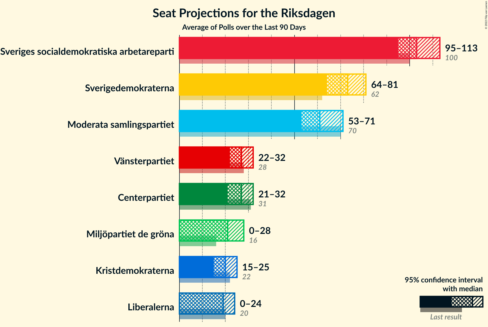

# Poll Average

<a href="#voting-intentions">Voting Intentions</a> | <a href="#seats">Seats</a> | <a href="#coalitions">Coalitions</a> | <a href="#technical-information">Technical Information</a>

## Summary

The table below lists the polls on which the average is based. They are the most recent polls (less than 90 days old) registered and analyzed so far.

| Period     | Polling firm/Commissioner(s) | S | M | SD | C | V | KD | L | MP |
|:----------:|:----------------------------:|:--:|:--:|:--:|:--:|:--:|:--:|:--:|:--:|
| 9 September 2018 | General Election | 28.3%   100 | 19.8%   70 | 17.5%   62 | 8.6%   31 | 8.0%   28 | 6.3%   22 | 5.5%   20 | 4.4%   16 |
| N/A | Poll Average | 24–29%   90–110 | 21–26%   77–97 | 14–21%   53–79 | 8–11%   29–42 | 8–12%   30–45 | 4–6%   0–22 | 2–4%   0–15 | 3–5%   0–19 |
| [30 March–7 April 2021](2021-04-07-Demoskop.html) | Demoskop | 24–27%   89–103 | 21–24%   81–94 | 18–21%   66–77 | 9–11%   32–41 | 7–10%   29–37 | 4–6%   16–24 | 3–4%   0–16 | 3–4%   0 |
| [1 March–4 April 2021](2021-04-04-Novus.html) | Novus   SVT | 26–29%   96–108 | 21–24%   78–90 | 18–20%   65–74 | 8–9%   28–34 | 9–10%   31–39 | 4–5%   0–18 | 2–3%   0 | 4–5%   15–19 |
| [26–29 March 2021](2021-03-29-Sentio.html) | Sentio | N/A   N/A | N/A   N/A | N/A   N/A | N/A   N/A | N/A   N/A | N/A   N/A | N/A   N/A | N/A   N/A |
| [9–21 March 2021](2021-03-21-Ipsos.html) | Ipsos   Dagens Nyheter | 25–29%   92–111 | 20–24%   72–92 | 18–22%   66–83 | 8–11%   29–40 | 9–13%   35–47 | 3–5%   0–19 | 2–4%   0–15 | 3–5%   0–18 |
| [1–11 March 2021](2021-03-11-Sifo.html) | Sifo | 26–28%   96–107 | 22–24%   80–89 | 18–19%   64–72 | 8–9%   30–35 | 9–10%   33–39 | 4–5%   15–18 | 3%   0 | 4–5%   0–17 |
| [19–23 February 2021](2021-02-23-SKOP.html) | SKOP | 25–30%   91–114 | 22–27%   81–102 | 13–18%   48–67 | 8–12%   31–45 | 8–12%   31–46 | 3–6%   0–22 | 2–4%   0 | 3–5%   0–20 |
| 9 September 2018 | General Election | 28.3%   100 | 19.8%   70 | 17.5%   62 | 8.6%   31 | 8.0%   28 | 6.3%   22 | 5.5%   20 | 4.4%   16 |

Only polls for which at least the sample size has been published are included in the table above.

**Legend:**
+ **Top half of each row:** Voting intentions (95% confidence interval)
+ **Bottom half of each row:** Seat projections for the Riksdagen (95% confidence interval)
+ **S:** Sveriges socialdemokratiska arbetareparti
+ **M:** Moderata samlingspartiet
+ **SD:** Sverigedemokraterna
+ **C:** Centerpartiet
+ **V:** Vänsterpartiet
+ **KD:** Kristdemokraterna
+ **L:** Liberalerna
+ **MP:** Miljöpartiet de gröna
+ **N/A (single party):** Party not included the published results
+ **N/A (entire row):** Calculation for this opinion poll not started yet

## Voting Intentions

### Confidence Intervals

| Party | Last Result | Median | 80% Confidence Interval | 90% Confidence Interval | 95% Confidence Interval | 99% Confidence Interval |
|:-----:|:-----------:|:------:|:-----------------------:|:-----------------------:|:-----------------------:|:-----------------------:|
| <a href="#sveriges-socialdemokratiska-arbetareparti">Sveriges socialdemokratiska arbetareparti</a> | 28.3% | 27.1% | 25.2–28.4% |24.7–28.8% | 24.3–29.3% | 23.7–30.3% |
| <a href="#moderata-samlingspartiet">Moderata samlingspartiet</a> | 19.8% | 22.8% | 21.6–24.6% |21.2–25.5% | 20.8–26.1% | 20.0–27.3% |
| <a href="#sverigedemokraterna">Sverigedemokraterna</a> | 17.5% | 18.7% | 15.5–20.2% |14.8–20.8% | 14.3–21.2% | 13.4–22.1% |
| <a href="#centerpartiet">Centerpartiet</a> | 8.6% | 9.1% | 8.2–10.5% |8.0–10.9% | 7.9–11.2% | 7.5–12.0% |
| <a href="#vänsterpartiet">Vänsterpartiet</a> | 8.0% | 9.7% | 8.4–11.3% |8.1–11.7% | 7.8–12.1% | 7.4–12.7% |
| <a href="#kristdemokraterna">Kristdemokraterna</a> | 6.3% | 4.4% | 3.8–5.4% |3.6–5.7% | 3.5–5.9% | 3.1–6.3% |
| <a href="#liberalerna">Liberalerna</a> | 5.5% | 3.0% | 2.4–3.8% |2.1–4.0% | 1.9–4.2% | 1.6–4.5% |
| <a href="#miljöpartiet-de-gröna">Miljöpartiet de gröna</a> | 4.4% | 4.1% | 3.2–4.7% |3.0–4.9% | 2.9–5.1% | 2.6–5.5% |

### Sveriges socialdemokratiska arbetareparti

*For a full overview of the results for this party, see the [Sveriges socialdemokratiska arbetareparti](party-sverigessocialdemokratiskaarbetareparti.html) page.*

| Voting Intentions | Probability | Accumulated | Special Marks |
|:-----------------:|:-----------:|:-----------:|:-------------:|
| 21.5–22.5% | 0% | 100% |  |
| 22.5–23.5% | 0.3% | 100% |  |
| 23.5–24.5% | 3% | 99.7% |  |
| 24.5–25.5% | 11% | 96% |  |
| 25.5–26.5% | 18% | 85% |  |
| 26.5–27.5% | 36% | 67% | Median |
| 27.5–28.5% | 24% | 31% | Last Result |
| 28.5–29.5% | 6% | 8% |  |
| 29.5–30.5% | 1.3% | 2% |  |
| 30.5–31.5% | 0.3% | 0.3% |  |
| 31.5–32.5% | 0% | 0% |  |
| 32.5–33.5% | 0% | 0% |  |

### Moderata samlingspartiet

*For a full overview of the results for this party, see the [Moderata samlingspartiet](party-moderatasamlingspartiet.html) page.*

| Voting Intentions | Probability | Accumulated | Special Marks |
|:-----------------:|:-----------:|:-----------:|:-------------:|
| 17.5–18.5% | 0% | 100% |  |
| 18.5–19.5% | 0.2% | 100% |  |
| 19.5–20.5% | 1.5% | 99.8% | Last Result |
| 20.5–21.5% | 7% | 98% |  |
| 21.5–22.5% | 28% | 91% |  |
| 22.5–23.5% | 40% | 63% | Median |
| 23.5–24.5% | 13% | 24% |  |
| 24.5–25.5% | 6% | 10% |  |
| 25.5–26.5% | 3% | 5% |  |
| 26.5–27.5% | 1.1% | 1.4% |  |
| 27.5–28.5% | 0.3% | 0.3% |  |
| 28.5–29.5% | 0% | 0% |  |

### Sverigedemokraterna

*For a full overview of the results for this party, see the [Sverigedemokraterna](party-sverigedemokraterna.html) page.*

| Voting Intentions | Probability | Accumulated | Special Marks |
|:-----------------:|:-----------:|:-----------:|:-------------:|
| 11.5–12.5% | 0.1% | 100% |  |
| 12.5–13.5% | 0.6% | 99.9% |  |
| 13.5–14.5% | 3% | 99.3% |  |
| 14.5–15.5% | 6% | 96% |  |
| 15.5–16.5% | 6% | 90% |  |
| 16.5–17.5% | 4% | 84% |  |
| 17.5–18.5% | 25% | 80% | Last Result |
| 18.5–19.5% | 33% | 55% | Median |
| 19.5–20.5% | 15% | 21% |  |
| 20.5–21.5% | 6% | 7% |  |
| 21.5–22.5% | 1.3% | 1.4% |  |
| 22.5–23.5% | 0.1% | 0.2% |  |
| 23.5–24.5% | 0% | 0% |  |

### Centerpartiet

*For a full overview of the results for this party, see the [Centerpartiet](party-centerpartiet.html) page.*

| Voting Intentions | Probability | Accumulated | Special Marks |
|:-----------------:|:-----------:|:-----------:|:-------------:|
| 5.5–6.5% | 0% | 100% |  |
| 6.5–7.5% | 0.6% | 100% |  |
| 7.5–8.5% | 22% | 99.4% |  |
| 8.5–9.5% | 44% | 77% | Last Result, Median |
| 9.5–10.5% | 24% | 33% |  |
| 10.5–11.5% | 7% | 9% |  |
| 11.5–12.5% | 1.2% | 1.4% |  |
| 12.5–13.5% | 0.1% | 0.1% |  |
| 13.5–14.5% | 0% | 0% |  |

### Vänsterpartiet

*For a full overview of the results for this party, see the [Vänsterpartiet](party-vänsterpartiet.html) page.*

| Voting Intentions | Probability | Accumulated | Special Marks |
|:-----------------:|:-----------:|:-----------:|:-------------:|
| 5.5–6.5% | 0% | 100% |  |
| 6.5–7.5% | 0.9% | 100% |  |
| 7.5–8.5% | 12% | 99.1% | Last Result |
| 8.5–9.5% | 30% | 87% |  |
| 9.5–10.5% | 36% | 58% | Median |
| 10.5–11.5% | 15% | 22% |  |
| 11.5–12.5% | 6% | 7% |  |
| 12.5–13.5% | 0.8% | 0.9% |  |
| 13.5–14.5% | 0% | 0% |  |

### Kristdemokraterna

*For a full overview of the results for this party, see the [Kristdemokraterna](party-kristdemokraterna.html) page.*

| Voting Intentions | Probability | Accumulated | Special Marks |
|:-----------------:|:-----------:|:-----------:|:-------------:|
| 1.5–2.5% | 0% | 100% |  |
| 2.5–3.5% | 4% | 100% |  |
| 3.5–4.5% | 55% | 96% | Median |
| 4.5–5.5% | 34% | 41% |  |
| 5.5–6.5% | 7% | 7% | Last Result |
| 6.5–7.5% | 0.1% | 0.2% |  |
| 7.5–8.5% | 0% | 0% |  |

### Liberalerna

*For a full overview of the results for this party, see the [Liberalerna](party-liberalerna.html) page.*

| Voting Intentions | Probability | Accumulated | Special Marks |
|:-----------------:|:-----------:|:-----------:|:-------------:|
| 0.0–0.5% | 0% | 100% |  |
| 0.5–1.5% | 0.3% | 100% |  |
| 1.5–2.5% | 15% | 99.7% |  |
| 2.5–3.5% | 68% | 85% | Median |
| 3.5–4.5% | 16% | 17% |  |
| 4.5–5.5% | 0.4% | 0.4% | Last Result |
| 5.5–6.5% | 0% | 0% |  |

### Miljöpartiet de gröna

*For a full overview of the results for this party, see the [Miljöpartiet de gröna](party-miljöpartietdegröna.html) page.*

| Voting Intentions | Probability | Accumulated | Special Marks |
|:-----------------:|:-----------:|:-----------:|:-------------:|
| 0.5–1.5% | 0% | 100% |  |
| 1.5–2.5% | 0.2% | 100% |  |
| 2.5–3.5% | 22% | 99.8% |  |
| 3.5–4.5% | 60% | 78% | Last Result, Median |
| 4.5–5.5% | 18% | 18% |  |
| 5.5–6.5% | 0.4% | 0.4% |  |
| 6.5–7.5% | 0% | 0% |  |

## Seats

### Confidence Intervals

| Party | Last Result | Median | 80% Confidence Interval | 90% Confidence Interval | 95% Confidence Interval | 99% Confidence Interval |
|:-----:|:-----------:|:------:|:-----------------------:|:-----------------------:|:-----------------------:|:-----------------------:|
| <a href="#sveriges-socialdemokratiska-arbetareparti">Sveriges socialdemokratiska arbetareparti</a> | 100 | 100 | 94–107 |93–109 | 90–110 | 88–115 |
| <a href="#moderata-samlingspartiet">Moderata samlingspartiet</a> | 70 | 86 | 80–92 |79–94 | 77–97 | 72–102 |
| <a href="#sverigedemokraterna">Sverigedemokraterna</a> | 62 | 69 | 57–76 |55–78 | 53–79 | 48–84 |
| <a href="#centerpartiet">Centerpartiet</a> | 31 | 34 | 31–40 |30–40 | 29–42 | 28–45 |
| <a href="#vänsterpartiet">Vänsterpartiet</a> | 28 | 36 | 32–42 |31–43 | 30–45 | 29–47 |
| <a href="#kristdemokraterna">Kristdemokraterna</a> | 22 | 16 | 0–20 |0–21 | 0–22 | 0–24 |
| <a href="#liberalerna">Liberalerna</a> | 20 | 0 | 0 |0–15 | 0–15 | 0–16 |
| <a href="#miljöpartiet-de-gröna">Miljöpartiet de gröna</a> | 16 | 15 | 0–17 |0–18 | 0–19 | 0–20 |

### Sveriges socialdemokratiska arbetareparti

*For a full overview of the results for this party, see the [Sveriges socialdemokratiska arbetareparti](party-sverigessocialdemokratiskaarbetareparti.html) page.*

| Number of Seats | Probability | Accumulated | Special Marks |
|:---------------:|:-----------:|:-----------:|:-------------:|
| 85 | 0% | 100% |  |
| 86 | 0.2% | 99.9% |  |
| 87 | 0.2% | 99.7% |  |
| 88 | 0.2% | 99.5% |  |
| 89 | 1.0% | 99.3% |  |
| 90 | 1.2% | 98% |  |
| 91 | 0.6% | 97% |  |
| 92 | 1.5% | 97% |  |
| 93 | 3% | 95% |  |
| 94 | 4% | 92% |  |
| 95 | 6% | 89% |  |
| 96 | 7% | 83% |  |
| 97 | 7% | 77% |  |
| 98 | 8% | 70% |  |
| 99 | 7% | 62% |  |
| 100 | 14% | 55% | Last Result, Median |
| 101 | 7% | 41% |  |
| 102 | 4% | 35% |  |
| 103 | 8% | 30% |  |
| 104 | 4% | 23% |  |
| 105 | 4% | 18% |  |
| 106 | 4% | 15% |  |
| 107 | 3% | 11% |  |
| 108 | 2% | 8% |  |
| 109 | 3% | 6% |  |
| 110 | 0.7% | 3% |  |
| 111 | 0.6% | 2% |  |
| 112 | 0.3% | 2% |  |
| 113 | 0.3% | 1.3% |  |
| 114 | 0.3% | 1.0% |  |
| 115 | 0.2% | 0.7% |  |
| 116 | 0.1% | 0.5% |  |
| 117 | 0.2% | 0.4% |  |
| 118 | 0.1% | 0.2% |  |
| 119 | 0% | 0.1% |  |
| 120 | 0% | 0.1% |  |
| 121 | 0% | 0.1% |  |
| 122 | 0% | 0% |  |

### Moderata samlingspartiet

*For a full overview of the results for this party, see the [Moderata samlingspartiet](party-moderatasamlingspartiet.html) page.*

| Number of Seats | Probability | Accumulated | Special Marks |
|:---------------:|:-----------:|:-----------:|:-------------:|
| 70 | 0.1% | 100% | Last Result |
| 71 | 0.2% | 99.9% |  |
| 72 | 0.3% | 99.7% |  |
| 73 | 0.2% | 99.4% |  |
| 74 | 0.1% | 99.2% |  |
| 75 | 0.4% | 99.1% |  |
| 76 | 0.7% | 98.7% |  |
| 77 | 1.1% | 98% |  |
| 78 | 1.2% | 97% |  |
| 79 | 2% | 96% |  |
| 80 | 4% | 93% |  |
| 81 | 4% | 89% |  |
| 82 | 7% | 85% |  |
| 83 | 5% | 78% |  |
| 84 | 12% | 73% |  |
| 85 | 11% | 61% |  |
| 86 | 8% | 50% | Median |
| 87 | 9% | 42% |  |
| 88 | 4% | 33% |  |
| 89 | 5% | 29% |  |
| 90 | 11% | 23% |  |
| 91 | 2% | 13% |  |
| 92 | 2% | 11% |  |
| 93 | 3% | 9% |  |
| 94 | 2% | 6% |  |
| 95 | 0.9% | 4% |  |
| 96 | 0.8% | 3% |  |
| 97 | 0.5% | 3% |  |
| 98 | 0.4% | 2% |  |
| 99 | 0.7% | 2% |  |
| 100 | 0.3% | 1.1% |  |
| 101 | 0.2% | 0.8% |  |
| 102 | 0.2% | 0.6% |  |
| 103 | 0.1% | 0.4% |  |
| 104 | 0.1% | 0.3% |  |
| 105 | 0.1% | 0.2% |  |
| 106 | 0% | 0.1% |  |
| 107 | 0% | 0.1% |  |
| 108 | 0% | 0.1% |  |
| 109 | 0% | 0% |  |

### Sverigedemokraterna

*For a full overview of the results for this party, see the [Sverigedemokraterna](party-sverigedemokraterna.html) page.*

| Number of Seats | Probability | Accumulated | Special Marks |
|:---------------:|:-----------:|:-----------:|:-------------:|
| 45 | 0% | 100% |  |
| 46 | 0.1% | 99.9% |  |
| 47 | 0.1% | 99.8% |  |
| 48 | 0.3% | 99.8% |  |
| 49 | 0.2% | 99.5% |  |
| 50 | 0.4% | 99.3% |  |
| 51 | 0.3% | 99.0% |  |
| 52 | 0.8% | 98.6% |  |
| 53 | 0.5% | 98% |  |
| 54 | 2% | 97% |  |
| 55 | 1.1% | 96% |  |
| 56 | 2% | 95% |  |
| 57 | 3% | 92% |  |
| 58 | 2% | 90% |  |
| 59 | 2% | 88% |  |
| 60 | 1.3% | 85% |  |
| 61 | 1.3% | 84% |  |
| 62 | 0.7% | 83% | Last Result |
| 63 | 1.1% | 82% |  |
| 64 | 1.5% | 81% |  |
| 65 | 3% | 80% |  |
| 66 | 5% | 76% |  |
| 67 | 7% | 72% |  |
| 68 | 10% | 64% |  |
| 69 | 7% | 54% | Median |
| 70 | 11% | 47% |  |
| 71 | 4% | 36% |  |
| 72 | 9% | 32% |  |
| 73 | 5% | 23% |  |
| 74 | 2% | 18% |  |
| 75 | 2% | 16% |  |
| 76 | 4% | 13% |  |
| 77 | 4% | 9% |  |
| 78 | 1.3% | 5% |  |
| 79 | 2% | 4% |  |
| 80 | 0.3% | 2% |  |
| 81 | 0.1% | 2% |  |
| 82 | 0.8% | 1.5% |  |
| 83 | 0.1% | 0.6% |  |
| 84 | 0.3% | 0.5% |  |
| 85 | 0.1% | 0.2% |  |
| 86 | 0% | 0.1% |  |
| 87 | 0% | 0% |  |

### Centerpartiet

*For a full overview of the results for this party, see the [Centerpartiet](party-centerpartiet.html) page.*

| Number of Seats | Probability | Accumulated | Special Marks |
|:---------------:|:-----------:|:-----------:|:-------------:|
| 25 | 0.1% | 100% |  |
| 26 | 0.1% | 99.9% |  |
| 27 | 0.3% | 99.9% |  |
| 28 | 0.9% | 99.6% |  |
| 29 | 3% | 98.7% |  |
| 30 | 4% | 95% |  |
| 31 | 11% | 92% | Last Result |
| 32 | 18% | 80% |  |
| 33 | 9% | 62% |  |
| 34 | 8% | 53% | Median |
| 35 | 9% | 45% |  |
| 36 | 8% | 36% |  |
| 37 | 8% | 27% |  |
| 38 | 6% | 20% |  |
| 39 | 3% | 14% |  |
| 40 | 6% | 11% |  |
| 41 | 2% | 5% |  |
| 42 | 1.0% | 3% |  |
| 43 | 0.7% | 2% |  |
| 44 | 0.8% | 1.4% |  |
| 45 | 0.2% | 0.6% |  |
| 46 | 0.2% | 0.4% |  |
| 47 | 0.1% | 0.2% |  |
| 48 | 0% | 0.1% |  |
| 49 | 0% | 0% |  |

### Vänsterpartiet

*For a full overview of the results for this party, see the [Vänsterpartiet](party-vänsterpartiet.html) page.*

| Number of Seats | Probability | Accumulated | Special Marks |
|:---------------:|:-----------:|:-----------:|:-------------:|
| 27 | 0.1% | 100% |  |
| 28 | 0.3% | 99.9% | Last Result |
| 29 | 0.6% | 99.6% |  |
| 30 | 2% | 98.9% |  |
| 31 | 3% | 97% |  |
| 32 | 7% | 94% |  |
| 33 | 8% | 87% |  |
| 34 | 11% | 79% |  |
| 35 | 17% | 68% |  |
| 36 | 11% | 52% | Median |
| 37 | 7% | 41% |  |
| 38 | 8% | 34% |  |
| 39 | 6% | 25% |  |
| 40 | 5% | 19% |  |
| 41 | 3% | 14% |  |
| 42 | 4% | 11% |  |
| 43 | 2% | 6% |  |
| 44 | 2% | 5% |  |
| 45 | 1.3% | 3% |  |
| 46 | 0.5% | 2% |  |
| 47 | 0.6% | 1.0% |  |
| 48 | 0.1% | 0.4% |  |
| 49 | 0.1% | 0.3% |  |
| 50 | 0.1% | 0.2% |  |
| 51 | 0% | 0.1% |  |
| 52 | 0% | 0% |  |

### Kristdemokraterna

*For a full overview of the results for this party, see the [Kristdemokraterna](party-kristdemokraterna.html) page.*

| Number of Seats | Probability | Accumulated | Special Marks |
|:---------------:|:-----------:|:-----------:|:-------------:|
| 0 | 22% | 100% |  |
| 1 | 0% | 78% |  |
| 2 | 0% | 78% |  |
| 3 | 0% | 78% |  |
| 4 | 0% | 78% |  |
| 5 | 0% | 78% |  |
| 6 | 0% | 78% |  |
| 7 | 0% | 78% |  |
| 8 | 0% | 78% |  |
| 9 | 0% | 78% |  |
| 10 | 0% | 78% |  |
| 11 | 0% | 78% |  |
| 12 | 0% | 78% |  |
| 13 | 0% | 78% |  |
| 14 | 0.4% | 78% |  |
| 15 | 12% | 77% |  |
| 16 | 24% | 65% | Median |
| 17 | 11% | 42% |  |
| 18 | 9% | 31% |  |
| 19 | 7% | 21% |  |
| 20 | 7% | 14% |  |
| 21 | 3% | 7% |  |
| 22 | 2% | 4% | Last Result |
| 23 | 0.6% | 2% |  |
| 24 | 0.8% | 0.9% |  |
| 25 | 0.1% | 0.2% |  |
| 26 | 0% | 0.1% |  |
| 27 | 0% | 0% |  |

### Liberalerna

*For a full overview of the results for this party, see the [Liberalerna](party-liberalerna.html) page.*

| Number of Seats | Probability | Accumulated | Special Marks |
|:---------------:|:-----------:|:-----------:|:-------------:|
| 0 | 94% | 100% | Median |
| 1 | 0% | 6% |  |
| 2 | 0% | 6% |  |
| 3 | 0% | 6% |  |
| 4 | 0% | 6% |  |
| 5 | 0% | 6% |  |
| 6 | 0% | 6% |  |
| 7 | 0% | 6% |  |
| 8 | 0% | 6% |  |
| 9 | 0% | 6% |  |
| 10 | 0% | 6% |  |
| 11 | 0% | 6% |  |
| 12 | 0% | 6% |  |
| 13 | 0% | 6% |  |
| 14 | 0% | 6% |  |
| 15 | 4% | 6% |  |
| 16 | 1.3% | 2% |  |
| 17 | 0.3% | 0.5% |  |
| 18 | 0.1% | 0.1% |  |
| 19 | 0% | 0% |  |
| 20 | 0% | 0% | Last Result |

### Miljöpartiet de gröna

*For a full overview of the results for this party, see the [Miljöpartiet de gröna](party-miljöpartietdegröna.html) page.*

| Number of Seats | Probability | Accumulated | Special Marks |
|:---------------:|:-----------:|:-----------:|:-------------:|
| 0 | 43% | 100% |  |
| 1 | 0% | 57% |  |
| 2 | 0% | 57% |  |
| 3 | 0% | 57% |  |
| 4 | 0% | 57% |  |
| 5 | 0% | 57% |  |
| 6 | 0% | 57% |  |
| 7 | 0% | 57% |  |
| 8 | 0% | 57% |  |
| 9 | 0% | 57% |  |
| 10 | 0% | 57% |  |
| 11 | 0% | 57% |  |
| 12 | 0% | 57% |  |
| 13 | 0% | 57% |  |
| 14 | 0.1% | 57% |  |
| 15 | 16% | 57% | Median |
| 16 | 19% | 42% | Last Result |
| 17 | 15% | 23% |  |
| 18 | 5% | 8% |  |
| 19 | 2% | 3% |  |
| 20 | 0.7% | 1.0% |  |
| 21 | 0.2% | 0.3% |  |
| 22 | 0.1% | 0.1% |  |
| 23 | 0% | 0% |  |

## Coalitions

### Confidence Intervals

| Coalition | Last Result | Median | Majority? | 80% Confidence Interval | 90% Confidence Interval | 95% Confidence Interval | 99% Confidence Interval |
|:---------:|:-----------:|:------:|:---------:|:-----------------------:|:-----------------------:|:-----------------------:|:-----------------------:|
| Sveriges socialdemokratiska arbetareparti – Moderata samlingspartiet – Centerpartiet | 201 | 219 | 100% | 211–232 | 209–234 | 207–239 | 200–248 |
| Sveriges socialdemokratiska arbetareparti – Moderata samlingspartiet | 170 | 185 | 96% | 178–195 | 175–197 | 173–201 | 169–209 |
| Sveriges socialdemokratiska arbetareparti – Centerpartiet – Vänsterpartiet – Liberalerna – Miljöpartiet de gröna | 195 | 182 | 80% | 169–192 | 168–195 | 166–197 | 160–202 |
| Moderata samlingspartiet – Sverigedemokraterna – Kristdemokraterna | 154 | 167 | 20% | 157–180 | 154–181 | 152–183 | 147–189 |
| Moderata samlingspartiet – Sverigedemokraterna | 132 | 153 | 0.1% | 146–163 | 143–165 | 140–166 | 135–171 |
| Sveriges socialdemokratiska arbetareparti – Vänsterpartiet – Miljöpartiet de gröna | 144 | 149 | 0% | 129–157 | 126–160 | 124–163 | 121–166 |
| Sveriges socialdemokratiska arbetareparti – Centerpartiet – Liberalerna – Miljöpartiet de gröna | 167 | 146 | 0% | 135–153 | 132–156 | 130–158 | 127–164 |
| Moderata samlingspartiet – Centerpartiet – Kristdemokraterna – Liberalerna | 143 | 133 | 0% | 121–150 | 117–154 | 115–155 | 111–160 |
| Moderata samlingspartiet – Centerpartiet – Kristdemokraterna | 123 | 133 | 0% | 120–149 | 117–150 | 115–152 | 109–157 |
| Sveriges socialdemokratiska arbetareparti – Vänsterpartiet | 128 | 135 | 0% | 129–147 | 126–149 | 124–151 | 121–157 |
| Moderata samlingspartiet – Centerpartiet – Liberalerna | 121 | 120 | 0% | 113–132 | 111–135 | 109–137 | 105–142 |
| Moderata samlingspartiet – Centerpartiet | 101 | 119 | 0% | 113–130 | 111–132 | 109–136 | 104–141 |
| Sveriges socialdemokratiska arbetareparti – Miljöpartiet de gröna | 116 | 112 | 0% | 95–120 | 94–122 | 92–124 | 89–127 |

### Sveriges socialdemokratiska arbetareparti – Moderata samlingspartiet – Centerpartiet

| Number of Seats | Probability | Accumulated | Special Marks |
|:---------------:|:-----------:|:-----------:|:-------------:|
| 195 | 0% | 100% |  |
| 196 | 0% | 99.9% |  |
| 197 | 0% | 99.9% |  |
| 198 | 0.2% | 99.9% |  |
| 199 | 0% | 99.7% |  |
| 200 | 0.2% | 99.7% |  |
| 201 | 0.1% | 99.5% | Last Result |
| 202 | 0.1% | 99.3% |  |
| 203 | 0.1% | 99.2% |  |
| 204 | 0.1% | 99.1% |  |
| 205 | 0.2% | 99.0% |  |
| 206 | 1.3% | 98.8% |  |
| 207 | 0.5% | 98% |  |
| 208 | 1.2% | 97% |  |
| 209 | 2% | 96% |  |
| 210 | 1.2% | 94% |  |
| 211 | 3% | 93% |  |
| 212 | 5% | 90% |  |
| 213 | 4% | 85% |  |
| 214 | 3% | 80% |  |
| 215 | 5% | 77% |  |
| 216 | 9% | 73% |  |
| 217 | 7% | 64% |  |
| 218 | 4% | 57% |  |
| 219 | 3% | 53% |  |
| 220 | 3% | 50% | Median |
| 221 | 1.3% | 47% |  |
| 222 | 3% | 45% |  |
| 223 | 5% | 42% |  |
| 224 | 3% | 37% |  |
| 225 | 8% | 34% |  |
| 226 | 6% | 25% |  |
| 227 | 3% | 20% |  |
| 228 | 3% | 17% |  |
| 229 | 2% | 14% |  |
| 230 | 0.9% | 12% |  |
| 231 | 1.2% | 11% |  |
| 232 | 4% | 10% |  |
| 233 | 0.7% | 6% |  |
| 234 | 1.0% | 5% |  |
| 235 | 0.6% | 5% |  |
| 236 | 0.5% | 4% |  |
| 237 | 0.4% | 3% |  |
| 238 | 0.4% | 3% |  |
| 239 | 0.6% | 3% |  |
| 240 | 0.2% | 2% |  |
| 241 | 0.2% | 2% |  |
| 242 | 0.2% | 2% |  |
| 243 | 0.2% | 1.4% |  |
| 244 | 0.1% | 1.3% |  |
| 245 | 0.1% | 1.1% |  |
| 246 | 0.4% | 1.1% |  |
| 247 | 0.1% | 0.7% |  |
| 248 | 0.1% | 0.6% |  |
| 249 | 0.1% | 0.5% |  |
| 250 | 0% | 0.4% |  |
| 251 | 0% | 0.3% |  |
| 252 | 0.1% | 0.3% |  |
| 253 | 0.1% | 0.2% |  |
| 254 | 0% | 0.2% |  |
| 255 | 0% | 0.1% |  |
| 256 | 0% | 0.1% |  |
| 257 | 0% | 0.1% |  |
| 258 | 0% | 0% |  |

### Sveriges socialdemokratiska arbetareparti – Moderata samlingspartiet

| Number of Seats | Probability | Accumulated | Special Marks |
|:---------------:|:-----------:|:-----------:|:-------------:|
| 163 | 0% | 100% |  |
| 164 | 0% | 99.9% |  |
| 165 | 0% | 99.9% |  |
| 166 | 0.2% | 99.9% |  |
| 167 | 0% | 99.7% |  |
| 168 | 0.1% | 99.7% |  |
| 169 | 0.3% | 99.6% |  |
| 170 | 0.4% | 99.4% | Last Result |
| 171 | 0.2% | 99.0% |  |
| 172 | 0.8% | 98.8% |  |
| 173 | 1.1% | 98% |  |
| 174 | 1.0% | 97% |  |
| 175 | 2% | 96% | Majority |
| 176 | 0.6% | 94% |  |
| 177 | 1.3% | 93% |  |
| 178 | 2% | 92% |  |
| 179 | 3% | 90% |  |
| 180 | 3% | 86% |  |
| 181 | 4% | 84% |  |
| 182 | 8% | 80% |  |
| 183 | 5% | 72% |  |
| 184 | 11% | 66% |  |
| 185 | 9% | 56% |  |
| 186 | 7% | 47% | Median |
| 187 | 4% | 40% |  |
| 188 | 3% | 36% |  |
| 189 | 3% | 32% |  |
| 190 | 3% | 29% |  |
| 191 | 5% | 26% |  |
| 192 | 5% | 22% |  |
| 193 | 4% | 16% |  |
| 194 | 1.4% | 12% |  |
| 195 | 3% | 11% |  |
| 196 | 2% | 8% |  |
| 197 | 1.1% | 5% |  |
| 198 | 0.6% | 4% |  |
| 199 | 0.7% | 4% |  |
| 200 | 0.4% | 3% |  |
| 201 | 0.4% | 3% |  |
| 202 | 0.2% | 2% |  |
| 203 | 0.3% | 2% |  |
| 204 | 0.2% | 2% |  |
| 205 | 0.3% | 1.5% |  |
| 206 | 0.2% | 1.2% |  |
| 207 | 0.3% | 1.0% |  |
| 208 | 0.1% | 0.7% |  |
| 209 | 0.1% | 0.6% |  |
| 210 | 0.1% | 0.5% |  |
| 211 | 0.1% | 0.4% |  |
| 212 | 0.1% | 0.3% |  |
| 213 | 0% | 0.2% |  |
| 214 | 0% | 0.2% |  |
| 215 | 0% | 0.2% |  |
| 216 | 0% | 0.2% |  |
| 217 | 0% | 0.2% |  |
| 218 | 0.1% | 0.1% |  |
| 219 | 0% | 0% |  |

### Sveriges socialdemokratiska arbetareparti – Centerpartiet – Vänsterpartiet – Liberalerna – Miljöpartiet de gröna

| Number of Seats | Probability | Accumulated | Special Marks |
|:---------------:|:-----------:|:-----------:|:-------------:|
| 159 | 0.4% | 100% |  |
| 160 | 0.9% | 99.5% |  |
| 161 | 0.3% | 98.6% |  |
| 162 | 0.1% | 98% |  |
| 163 | 0.1% | 98% |  |
| 164 | 0.2% | 98% |  |
| 165 | 0.4% | 98% |  |
| 166 | 0.8% | 98% |  |
| 167 | 1.4% | 97% |  |
| 168 | 2% | 95% |  |
| 169 | 5% | 94% |  |
| 170 | 3% | 89% |  |
| 171 | 2% | 86% |  |
| 172 | 0.9% | 84% |  |
| 173 | 1.1% | 83% |  |
| 174 | 2% | 82% |  |
| 175 | 3% | 80% | Majority |
| 176 | 3% | 77% |  |
| 177 | 3% | 74% |  |
| 178 | 4% | 71% |  |
| 179 | 3% | 67% |  |
| 180 | 5% | 64% |  |
| 181 | 5% | 59% |  |
| 182 | 10% | 54% |  |
| 183 | 6% | 43% |  |
| 184 | 5% | 38% |  |
| 185 | 3% | 32% | Median |
| 186 | 4% | 30% |  |
| 187 | 6% | 26% |  |
| 188 | 4% | 20% |  |
| 189 | 2% | 16% |  |
| 190 | 1.1% | 14% |  |
| 191 | 3% | 13% |  |
| 192 | 1.4% | 10% |  |
| 193 | 2% | 9% |  |
| 194 | 2% | 7% |  |
| 195 | 1.1% | 5% | Last Result |
| 196 | 2% | 4% |  |
| 197 | 0.3% | 3% |  |
| 198 | 0.5% | 2% |  |
| 199 | 0.3% | 2% |  |
| 200 | 0.8% | 2% |  |
| 201 | 0.2% | 0.8% |  |
| 202 | 0.1% | 0.6% |  |
| 203 | 0.1% | 0.5% |  |
| 204 | 0.1% | 0.4% |  |
| 205 | 0.1% | 0.3% |  |
| 206 | 0% | 0.2% |  |
| 207 | 0.1% | 0.1% |  |
| 208 | 0% | 0.1% |  |
| 209 | 0% | 0% |  |

### Moderata samlingspartiet – Sverigedemokraterna – Kristdemokraterna

| Number of Seats | Probability | Accumulated | Special Marks |
|:---------------:|:-----------:|:-----------:|:-------------:|
| 141 | 0% | 100% |  |
| 142 | 0.1% | 99.9% |  |
| 143 | 0% | 99.9% |  |
| 144 | 0.1% | 99.8% |  |
| 145 | 0.1% | 99.7% |  |
| 146 | 0.1% | 99.6% |  |
| 147 | 0.1% | 99.5% |  |
| 148 | 0.2% | 99.4% |  |
| 149 | 0.8% | 99.2% |  |
| 150 | 0.3% | 98% |  |
| 151 | 0.5% | 98% |  |
| 152 | 0.3% | 98% |  |
| 153 | 2% | 97% |  |
| 154 | 1.1% | 96% | Last Result |
| 155 | 2% | 95% |  |
| 156 | 2% | 93% |  |
| 157 | 1.4% | 91% |  |
| 158 | 3% | 90% |  |
| 159 | 1.1% | 87% |  |
| 160 | 2% | 86% |  |
| 161 | 4% | 84% |  |
| 162 | 6% | 80% |  |
| 163 | 4% | 74% |  |
| 164 | 3% | 70% |  |
| 165 | 5% | 68% |  |
| 166 | 6% | 62% |  |
| 167 | 10% | 57% |  |
| 168 | 5% | 46% |  |
| 169 | 5% | 41% |  |
| 170 | 3% | 36% |  |
| 171 | 4% | 33% | Median |
| 172 | 3% | 29% |  |
| 173 | 3% | 26% |  |
| 174 | 3% | 23% |  |
| 175 | 2% | 20% | Majority |
| 176 | 1.1% | 18% |  |
| 177 | 0.9% | 17% |  |
| 178 | 2% | 16% |  |
| 179 | 3% | 14% |  |
| 180 | 5% | 11% |  |
| 181 | 2% | 6% |  |
| 182 | 1.4% | 5% |  |
| 183 | 0.8% | 3% |  |
| 184 | 0.4% | 2% |  |
| 185 | 0.2% | 2% |  |
| 186 | 0.1% | 2% |  |
| 187 | 0.1% | 2% |  |
| 188 | 0.3% | 2% |  |
| 189 | 0.9% | 1.4% |  |
| 190 | 0.4% | 0.5% |  |
| 191 | 0% | 0% |  |

### Moderata samlingspartiet – Sverigedemokraterna

| Number of Seats | Probability | Accumulated | Special Marks |
|:---------------:|:-----------:|:-----------:|:-------------:|
| 130 | 0% | 100% |  |
| 131 | 0% | 99.9% |  |
| 132 | 0% | 99.9% | Last Result |
| 133 | 0.1% | 99.9% |  |
| 134 | 0.2% | 99.7% |  |
| 135 | 0.1% | 99.6% |  |
| 136 | 0.1% | 99.5% |  |
| 137 | 0.8% | 99.3% |  |
| 138 | 0.4% | 98.5% |  |
| 139 | 0.3% | 98% |  |
| 140 | 0.9% | 98% |  |
| 141 | 1.3% | 97% |  |
| 142 | 0.6% | 96% |  |
| 143 | 0.6% | 95% |  |
| 144 | 2% | 94% |  |
| 145 | 2% | 92% |  |
| 146 | 2% | 90% |  |
| 147 | 2% | 88% |  |
| 148 | 3% | 86% |  |
| 149 | 5% | 83% |  |
| 150 | 4% | 78% |  |
| 151 | 7% | 74% |  |
| 152 | 8% | 66% |  |
| 153 | 9% | 58% |  |
| 154 | 3% | 49% |  |
| 155 | 5% | 46% | Median |
| 156 | 2% | 41% |  |
| 157 | 6% | 39% |  |
| 158 | 4% | 32% |  |
| 159 | 2% | 29% |  |
| 160 | 6% | 26% |  |
| 161 | 4% | 21% |  |
| 162 | 5% | 16% |  |
| 163 | 4% | 11% |  |
| 164 | 1.4% | 8% |  |
| 165 | 1.3% | 6% |  |
| 166 | 3% | 5% |  |
| 167 | 0.2% | 2% |  |
| 168 | 0.9% | 2% |  |
| 169 | 0.3% | 0.9% |  |
| 170 | 0.1% | 0.7% |  |
| 171 | 0.3% | 0.6% |  |
| 172 | 0.1% | 0.2% |  |
| 173 | 0% | 0.2% |  |
| 174 | 0% | 0.1% |  |
| 175 | 0.1% | 0.1% | Majority |
| 176 | 0% | 0% |  |

### Sveriges socialdemokratiska arbetareparti – Vänsterpartiet – Miljöpartiet de gröna

| Number of Seats | Probability | Accumulated | Special Marks |
|:---------------:|:-----------:|:-----------:|:-------------:|
| 116 | 0% | 100% |  |
| 117 | 0.1% | 99.9% |  |
| 118 | 0% | 99.8% |  |
| 119 | 0% | 99.8% |  |
| 120 | 0.2% | 99.8% |  |
| 121 | 0.1% | 99.6% |  |
| 122 | 0.2% | 99.5% |  |
| 123 | 0.7% | 99.2% |  |
| 124 | 1.3% | 98.5% |  |
| 125 | 2% | 97% |  |
| 126 | 0.7% | 95% |  |
| 127 | 1.4% | 95% |  |
| 128 | 0.8% | 93% |  |
| 129 | 4% | 92% |  |
| 130 | 3% | 88% |  |
| 131 | 1.2% | 85% |  |
| 132 | 0.8% | 84% |  |
| 133 | 1.4% | 83% |  |
| 134 | 2% | 82% |  |
| 135 | 1.2% | 80% |  |
| 136 | 0.4% | 79% |  |
| 137 | 1.0% | 79% |  |
| 138 | 2% | 78% |  |
| 139 | 0.9% | 76% |  |
| 140 | 2% | 75% |  |
| 141 | 2% | 73% |  |
| 142 | 1.1% | 71% |  |
| 143 | 1.0% | 70% |  |
| 144 | 1.4% | 69% | Last Result |
| 145 | 2% | 68% |  |
| 146 | 3% | 66% |  |
| 147 | 5% | 64% |  |
| 148 | 5% | 58% |  |
| 149 | 10% | 53% |  |
| 150 | 10% | 43% |  |
| 151 | 5% | 34% | Median |
| 152 | 5% | 29% |  |
| 153 | 3% | 24% |  |
| 154 | 2% | 21% |  |
| 155 | 5% | 19% |  |
| 156 | 3% | 14% |  |
| 157 | 2% | 11% |  |
| 158 | 2% | 10% |  |
| 159 | 1.5% | 8% |  |
| 160 | 3% | 7% |  |
| 161 | 0.4% | 4% |  |
| 162 | 0.7% | 3% |  |
| 163 | 0.6% | 3% |  |
| 164 | 1.0% | 2% |  |
| 165 | 0.7% | 1.3% |  |
| 166 | 0.1% | 0.5% |  |
| 167 | 0.1% | 0.4% |  |
| 168 | 0.1% | 0.2% |  |
| 169 | 0% | 0.1% |  |
| 170 | 0% | 0.1% |  |
| 171 | 0% | 0.1% |  |
| 172 | 0% | 0.1% |  |
| 173 | 0% | 0% |  |

### Sveriges socialdemokratiska arbetareparti – Centerpartiet – Liberalerna – Miljöpartiet de gröna

| Number of Seats | Probability | Accumulated | Special Marks |
|:---------------:|:-----------:|:-----------:|:-------------:|
| 123 | 0% | 100% |  |
| 124 | 0.1% | 99.9% |  |
| 125 | 0.2% | 99.9% |  |
| 126 | 0.1% | 99.7% |  |
| 127 | 0.1% | 99.6% |  |
| 128 | 0.1% | 99.5% |  |
| 129 | 2% | 99.3% |  |
| 130 | 1.0% | 98% |  |
| 131 | 1.0% | 97% |  |
| 132 | 2% | 96% |  |
| 133 | 2% | 94% |  |
| 134 | 1.0% | 92% |  |
| 135 | 4% | 91% |  |
| 136 | 4% | 87% |  |
| 137 | 1.5% | 82% |  |
| 138 | 3% | 81% |  |
| 139 | 3% | 78% |  |
| 140 | 4% | 75% |  |
| 141 | 3% | 72% |  |
| 142 | 2% | 68% |  |
| 143 | 4% | 66% |  |
| 144 | 3% | 62% |  |
| 145 | 5% | 59% |  |
| 146 | 8% | 54% |  |
| 147 | 7% | 46% |  |
| 148 | 6% | 39% |  |
| 149 | 7% | 33% | Median |
| 150 | 5% | 25% |  |
| 151 | 2% | 21% |  |
| 152 | 6% | 19% |  |
| 153 | 4% | 13% |  |
| 154 | 2% | 9% |  |
| 155 | 0.7% | 8% |  |
| 156 | 2% | 7% |  |
| 157 | 2% | 5% |  |
| 158 | 0.8% | 3% |  |
| 159 | 0.6% | 2% |  |
| 160 | 0.4% | 2% |  |
| 161 | 0.3% | 1.4% |  |
| 162 | 0.1% | 1.1% |  |
| 163 | 0.2% | 1.0% |  |
| 164 | 0.4% | 0.7% |  |
| 165 | 0.1% | 0.4% |  |
| 166 | 0.1% | 0.3% |  |
| 167 | 0% | 0.2% | Last Result |
| 168 | 0.1% | 0.2% |  |
| 169 | 0% | 0.1% |  |
| 170 | 0% | 0.1% |  |
| 171 | 0% | 0% |  |

### Moderata samlingspartiet – Centerpartiet – Kristdemokraterna – Liberalerna

| Number of Seats | Probability | Accumulated | Special Marks |
|:---------------:|:-----------:|:-----------:|:-------------:|
| 107 | 0.1% | 100% |  |
| 108 | 0% | 99.9% |  |
| 109 | 0.3% | 99.9% |  |
| 110 | 0.1% | 99.6% |  |
| 111 | 0% | 99.5% |  |
| 112 | 0.5% | 99.5% |  |
| 113 | 0.3% | 99.0% |  |
| 114 | 0.4% | 98.6% |  |
| 115 | 1.2% | 98% |  |
| 116 | 0.5% | 97% |  |
| 117 | 4% | 97% |  |
| 118 | 0.7% | 93% |  |
| 119 | 1.1% | 92% |  |
| 120 | 1.0% | 91% |  |
| 121 | 0.3% | 90% |  |
| 122 | 4% | 90% |  |
| 123 | 4% | 86% |  |
| 124 | 1.0% | 82% |  |
| 125 | 2% | 81% |  |
| 126 | 1.0% | 79% |  |
| 127 | 1.2% | 78% |  |
| 128 | 2% | 77% |  |
| 129 | 5% | 75% |  |
| 130 | 5% | 70% |  |
| 131 | 8% | 65% |  |
| 132 | 5% | 57% |  |
| 133 | 5% | 52% |  |
| 134 | 3% | 47% |  |
| 135 | 2% | 44% |  |
| 136 | 2% | 42% | Median |
| 137 | 1.4% | 40% |  |
| 138 | 3% | 39% |  |
| 139 | 1.0% | 36% |  |
| 140 | 3% | 35% |  |
| 141 | 3% | 33% |  |
| 142 | 1.1% | 30% |  |
| 143 | 3% | 29% | Last Result |
| 144 | 3% | 26% |  |
| 145 | 2% | 23% |  |
| 146 | 2% | 21% |  |
| 147 | 2% | 20% |  |
| 148 | 2% | 18% |  |
| 149 | 4% | 15% |  |
| 150 | 3% | 12% |  |
| 151 | 0.6% | 8% |  |
| 152 | 2% | 8% |  |
| 153 | 0.7% | 6% |  |
| 154 | 2% | 6% |  |
| 155 | 1.3% | 3% |  |
| 156 | 0.9% | 2% |  |
| 157 | 0.2% | 1.1% |  |
| 158 | 0.2% | 0.9% |  |
| 159 | 0.1% | 0.7% |  |
| 160 | 0.2% | 0.5% |  |
| 161 | 0.2% | 0.4% |  |
| 162 | 0.1% | 0.2% |  |
| 163 | 0.1% | 0.1% |  |
| 164 | 0% | 0.1% |  |
| 165 | 0% | 0% |  |

### Moderata samlingspartiet – Centerpartiet – Kristdemokraterna

| Number of Seats | Probability | Accumulated | Special Marks |
|:---------------:|:-----------:|:-----------:|:-------------:|
| 105 | 0.1% | 100% |  |
| 106 | 0% | 99.9% |  |
| 107 | 0.1% | 99.9% |  |
| 108 | 0% | 99.8% |  |
| 109 | 0.3% | 99.8% |  |
| 110 | 0.1% | 99.5% |  |
| 111 | 0.1% | 99.4% |  |
| 112 | 0.5% | 99.3% |  |
| 113 | 0.3% | 98.8% |  |
| 114 | 0.4% | 98% |  |
| 115 | 1.2% | 98% |  |
| 116 | 0.7% | 97% |  |
| 117 | 4% | 96% |  |
| 118 | 0.7% | 92% |  |
| 119 | 1.1% | 92% |  |
| 120 | 0.9% | 91% |  |
| 121 | 0.3% | 90% |  |
| 122 | 4% | 89% |  |
| 123 | 4% | 86% | Last Result |
| 124 | 1.0% | 81% |  |
| 125 | 2% | 80% |  |
| 126 | 0.9% | 79% |  |
| 127 | 1.2% | 78% |  |
| 128 | 2% | 76% |  |
| 129 | 5% | 75% |  |
| 130 | 5% | 69% |  |
| 131 | 8% | 65% |  |
| 132 | 5% | 57% |  |
| 133 | 5% | 52% |  |
| 134 | 3% | 47% |  |
| 135 | 2% | 44% |  |
| 136 | 2% | 42% | Median |
| 137 | 2% | 39% |  |
| 138 | 3% | 37% |  |
| 139 | 2% | 34% |  |
| 140 | 4% | 32% |  |
| 141 | 3% | 28% |  |
| 142 | 1.1% | 25% |  |
| 143 | 3% | 24% |  |
| 144 | 3% | 21% |  |
| 145 | 2% | 18% |  |
| 146 | 2% | 16% |  |
| 147 | 2% | 14% |  |
| 148 | 2% | 12% |  |
| 149 | 4% | 10% |  |
| 150 | 3% | 7% |  |
| 151 | 0.4% | 3% |  |
| 152 | 0.8% | 3% |  |
| 153 | 0.3% | 2% |  |
| 154 | 0.8% | 2% |  |
| 155 | 0.3% | 1.0% |  |
| 156 | 0.2% | 0.7% |  |
| 157 | 0.2% | 0.6% |  |
| 158 | 0.1% | 0.4% |  |
| 159 | 0% | 0.2% |  |
| 160 | 0.1% | 0.2% |  |
| 161 | 0.1% | 0.2% |  |
| 162 | 0% | 0.1% |  |
| 163 | 0% | 0% |  |

### Sveriges socialdemokratiska arbetareparti – Vänsterpartiet

| Number of Seats | Probability | Accumulated | Special Marks |
|:---------------:|:-----------:|:-----------:|:-------------:|
| 116 | 0% | 100% |  |
| 117 | 0.1% | 99.9% |  |
| 118 | 0% | 99.8% |  |
| 119 | 0.1% | 99.8% |  |
| 120 | 0.2% | 99.7% |  |
| 121 | 0.2% | 99.5% |  |
| 122 | 0.3% | 99.3% |  |
| 123 | 0.7% | 99.0% |  |
| 124 | 1.4% | 98% |  |
| 125 | 2% | 97% |  |
| 126 | 1.0% | 95% |  |
| 127 | 2% | 94% |  |
| 128 | 1.2% | 92% | Last Result |
| 129 | 5% | 91% |  |
| 130 | 5% | 87% |  |
| 131 | 5% | 82% |  |
| 132 | 5% | 77% |  |
| 133 | 10% | 72% |  |
| 134 | 6% | 62% |  |
| 135 | 8% | 56% |  |
| 136 | 5% | 48% | Median |
| 137 | 3% | 43% |  |
| 138 | 7% | 40% |  |
| 139 | 5% | 33% |  |
| 140 | 2% | 28% |  |
| 141 | 3% | 25% |  |
| 142 | 3% | 23% |  |
| 143 | 2% | 20% |  |
| 144 | 3% | 18% |  |
| 145 | 1.3% | 15% |  |
| 146 | 1.2% | 14% |  |
| 147 | 4% | 12% |  |
| 148 | 2% | 8% |  |
| 149 | 3% | 7% |  |
| 150 | 0.7% | 3% |  |
| 151 | 0.8% | 3% |  |
| 152 | 0.4% | 2% |  |
| 153 | 0.1% | 2% |  |
| 154 | 0.5% | 1.4% |  |
| 155 | 0.2% | 0.8% |  |
| 156 | 0.1% | 0.7% |  |
| 157 | 0.1% | 0.5% |  |
| 158 | 0% | 0.4% |  |
| 159 | 0.3% | 0.4% |  |
| 160 | 0% | 0.1% |  |
| 161 | 0% | 0% |  |

### Moderata samlingspartiet – Centerpartiet – Liberalerna

| Number of Seats | Probability | Accumulated | Special Marks |
|:---------------:|:-----------:|:-----------:|:-------------:|
| 101 | 0.1% | 100% |  |
| 102 | 0% | 99.9% |  |
| 103 | 0.2% | 99.8% |  |
| 104 | 0.1% | 99.6% |  |
| 105 | 0.1% | 99.5% |  |
| 106 | 0.5% | 99.4% |  |
| 107 | 0.7% | 98.9% |  |
| 108 | 0.4% | 98% |  |
| 109 | 0.9% | 98% |  |
| 110 | 0.9% | 97% |  |
| 111 | 1.4% | 96% |  |
| 112 | 3% | 95% |  |
| 113 | 4% | 92% |  |
| 114 | 6% | 88% |  |
| 115 | 5% | 82% |  |
| 116 | 9% | 77% |  |
| 117 | 8% | 68% |  |
| 118 | 4% | 60% |  |
| 119 | 3% | 56% |  |
| 120 | 3% | 53% | Median |
| 121 | 3% | 49% | Last Result |
| 122 | 5% | 46% |  |
| 123 | 6% | 41% |  |
| 124 | 2% | 34% |  |
| 125 | 3% | 32% |  |
| 126 | 2% | 29% |  |
| 127 | 2% | 26% |  |
| 128 | 4% | 24% |  |
| 129 | 2% | 20% |  |
| 130 | 6% | 18% |  |
| 131 | 1.2% | 12% |  |
| 132 | 1.0% | 11% |  |
| 133 | 0.9% | 10% |  |
| 134 | 3% | 9% |  |
| 135 | 1.0% | 6% |  |
| 136 | 2% | 5% |  |
| 137 | 0.9% | 3% |  |
| 138 | 0.4% | 2% |  |
| 139 | 0.4% | 2% |  |
| 140 | 0.6% | 1.5% |  |
| 141 | 0.3% | 0.9% |  |
| 142 | 0.2% | 0.5% |  |
| 143 | 0.1% | 0.4% |  |
| 144 | 0.1% | 0.3% |  |
| 145 | 0% | 0.2% |  |
| 146 | 0.1% | 0.2% |  |
| 147 | 0% | 0.1% |  |
| 148 | 0% | 0.1% |  |
| 149 | 0% | 0.1% |  |
| 150 | 0% | 0% |  |

### Moderata samlingspartiet – Centerpartiet

| Number of Seats | Probability | Accumulated | Special Marks |
|:---------------:|:-----------:|:-----------:|:-------------:|
| 101 | 0.1% | 100% | Last Result |
| 102 | 0% | 99.9% |  |
| 103 | 0.2% | 99.8% |  |
| 104 | 0.1% | 99.6% |  |
| 105 | 0.2% | 99.5% |  |
| 106 | 0.5% | 99.3% |  |
| 107 | 0.8% | 98.8% |  |
| 108 | 0.4% | 98% |  |
| 109 | 0.9% | 98% |  |
| 110 | 0.9% | 97% |  |
| 111 | 1.5% | 96% |  |
| 112 | 3% | 94% |  |
| 113 | 4% | 92% |  |
| 114 | 6% | 87% |  |
| 115 | 6% | 82% |  |
| 116 | 9% | 76% |  |
| 117 | 8% | 67% |  |
| 118 | 4% | 58% |  |
| 119 | 5% | 54% |  |
| 120 | 3% | 49% | Median |
| 121 | 4% | 46% |  |
| 122 | 6% | 41% |  |
| 123 | 6% | 36% |  |
| 124 | 3% | 29% |  |
| 125 | 3% | 26% |  |
| 126 | 2% | 23% |  |
| 127 | 2% | 21% |  |
| 128 | 4% | 18% |  |
| 129 | 2% | 15% |  |
| 130 | 6% | 13% |  |
| 131 | 0.7% | 6% |  |
| 132 | 0.8% | 6% |  |
| 133 | 0.6% | 5% |  |
| 134 | 0.8% | 4% |  |
| 135 | 0.8% | 3% |  |
| 136 | 0.6% | 3% |  |
| 137 | 0.5% | 2% |  |
| 138 | 0.3% | 1.4% |  |
| 139 | 0.3% | 1.1% |  |
| 140 | 0.3% | 0.8% |  |
| 141 | 0.2% | 0.6% |  |
| 142 | 0.1% | 0.4% |  |
| 143 | 0.1% | 0.3% |  |
| 144 | 0.1% | 0.3% |  |
| 145 | 0% | 0.2% |  |
| 146 | 0.1% | 0.2% |  |
| 147 | 0% | 0.1% |  |
| 148 | 0% | 0.1% |  |
| 149 | 0% | 0% |  |

### Sveriges socialdemokratiska arbetareparti – Miljöpartiet de gröna

| Number of Seats | Probability | Accumulated | Special Marks |
|:---------------:|:-----------:|:-----------:|:-------------:|
| 86 | 0.1% | 100% |  |
| 87 | 0.1% | 99.8% |  |
| 88 | 0.1% | 99.7% |  |
| 89 | 0.8% | 99.6% |  |
| 90 | 0.9% | 98.9% |  |
| 91 | 0.3% | 98% |  |
| 92 | 1.0% | 98% |  |
| 93 | 1.3% | 97% |  |
| 94 | 3% | 95% |  |
| 95 | 4% | 93% |  |
| 96 | 3% | 89% |  |
| 97 | 3% | 86% |  |
| 98 | 2% | 83% |  |
| 99 | 2% | 81% |  |
| 100 | 1.3% | 79% |  |
| 101 | 2% | 77% |  |
| 102 | 1.1% | 75% |  |
| 103 | 2% | 74% |  |
| 104 | 3% | 72% |  |
| 105 | 3% | 69% |  |
| 106 | 1.5% | 66% |  |
| 107 | 2% | 64% |  |
| 108 | 1.2% | 62% |  |
| 109 | 4% | 61% |  |
| 110 | 1.3% | 57% |  |
| 111 | 3% | 56% |  |
| 112 | 3% | 53% |  |
| 113 | 4% | 50% |  |
| 114 | 6% | 46% |  |
| 115 | 8% | 40% | Median |
| 116 | 4% | 32% | Last Result |
| 117 | 9% | 27% |  |
| 118 | 3% | 18% |  |
| 119 | 2% | 15% |  |
| 120 | 4% | 13% |  |
| 121 | 2% | 9% |  |
| 122 | 3% | 7% |  |
| 123 | 1.1% | 4% |  |
| 124 | 0.7% | 3% |  |
| 125 | 1.1% | 2% |  |
| 126 | 0.2% | 0.8% |  |
| 127 | 0.3% | 0.6% |  |
| 128 | 0.1% | 0.3% |  |
| 129 | 0.1% | 0.2% |  |
| 130 | 0.1% | 0.1% |  |
| 131 | 0% | 0.1% |  |
| 132 | 0% | 0% |  |

## Technical Information

+ **Number of polls included in this average:** 6
+ **Lowest number of simulations done in a poll included in this average:** 0
+ **Total number of simulations done in the polls included in this average:** 3,407,872
+ **Error estimate:** 1.59%
