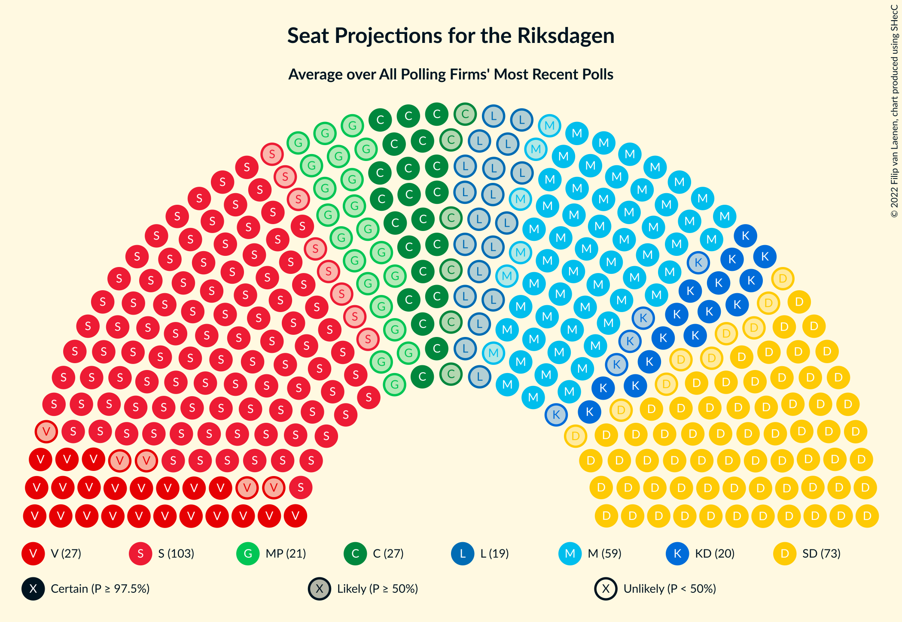

# Poll Average

<a href="#voting-intentions">Voting Intentions</a> | <a href="#seats">Seats</a> | <a href="#coalitions">Coalitions</a> | <a href="#technical-information">Technical Information</a>

## Summary

The table below lists the polls on which the average is based. They are the most recent polls (less than 90 days old) registered and analyzed so far.

| Period     | Polling firm/Commissioner(s) | S | M | SD | C | V | KD | L | MP |
|:----------:|:----------------------------:|:--:|:--:|:--:|:--:|:--:|:--:|:--:|:--:|
| 9 September 2018 | General Election | 28.3%   100 | 19.8%   70 | 17.5%   62 | 8.6%   31 | 8.0%   28 | 6.3%   22 | 5.5%   20 | 4.4%   16 |
| N/A | Poll Average | 23–28%   82–99 | 16–21%   56–74 | 16–23%   59–82 | 8–11%   26–38 | 7–10%   26–36 | 6–10%   21–36 | 4–7%   0–22 | 4–6%   0–21 |
| [20–25 September 2019](2019-09-25-Inizio.html) | Inizio   Aftonbladet | N/A   N/A | N/A   N/A | N/A   N/A | N/A   N/A | N/A   N/A | N/A   N/A | N/A   N/A | N/A   N/A |
| [20–24 September 2019](2019-09-24-Sentio.html) | Sentio   Nyheter Idag | N/A   N/A | N/A   N/A | N/A   N/A | N/A   N/A | N/A   N/A | N/A   N/A | N/A   N/A | N/A   N/A |
| [10–23 September 2019](2019-09-23-Ipsos.html) | Ipsos   Dagens Nyheter | 24–28%   85–101 | 17–21%   60–73 | 17–21%   59–74 | 8–11%   28–37 | 8–11%   29–38 | 6–8%   20–29 | 4–6%   0–22 | 4–6%   14–22 |
| [26 August–22 September 2019](2019-09-22-Novus.html) | Novus   SVT | N/A   N/A | N/A   N/A | N/A   N/A | N/A   N/A | N/A   N/A | N/A   N/A | N/A   N/A | N/A   N/A |
| [2–12 September 2019](2019-09-12-Sifo.html) | Sifo | 25–27%   89–97 | 18–20%   64–71 | 19–21%   69–76 | 8–9%   29–33 | 8–9%   28–33 | 7–8%   24–28 | 4–5%   0–16 | 5–6%   17–20 |
| [27 August–3 September 2019](2019-09-03-Demoskop.html) | Demoskop | 22–26%   80–94 | 18–22%   62–77 | 20–24%   70–85 | 7–10%   25–35 | 7–10%   25–35 | 5–8%   20–27 | 4–6%   0–20 | 4–6%   14–21 |
| [25 June–16 July 2019](2019-07-16-SKOP.html) | SKOP | 23–28%   81–100 | 15–19%   52–69 | 16–20%   56–72 | 8–11%   28–41 | 7–11%   26–39 | 8–11%   27–38 | 4–7%   16–26 | 4–6%   0–22 |
| 9 September 2018 | General Election | 28.3%   100 | 19.8%   70 | 17.5%   62 | 8.6%   31 | 8.0%   28 | 6.3%   22 | 5.5%   20 | 4.4%   16 |

Only polls for which at least the sample size has been published are included in the table above.

**Legend:**
+ **Top half of each row:** Voting intentions (95% confidence interval)
+ **Bottom half of each row:** Seat projections for the Riksdagen (95% confidence interval)
+ **S:** Sveriges socialdemokratiska arbetareparti
+ **M:** Moderata samlingspartiet
+ **SD:** Sverigedemokraterna
+ **C:** Centerpartiet
+ **V:** Vänsterpartiet
+ **KD:** Kristdemokraterna
+ **L:** Liberalerna
+ **MP:** Miljöpartiet de gröna
+ **N/A (single party):** Party not included the published results
+ **N/A (entire row):** Calculation for this opinion poll not started yet

## Voting Intentions

### Confidence Intervals

| Party | Last Result | Median | 80% Confidence Interval | 90% Confidence Interval | 95% Confidence Interval | 99% Confidence Interval |
|:-----:|:-----------:|:------:|:-----------------------:|:-----------------------:|:-----------------------:|:-----------------------:|
| <a href="#sveriges-socialdemokratiska-arbetareparti">Sveriges socialdemokratiska arbetareparti</a> | 28.3% | 25.5% | 23.7–26.9% |23.1–27.4% | 22.7–27.9% | 22.0–28.8% |
| <a href="#moderata-samlingspartiet">Moderata samlingspartiet</a> | 19.8% | 18.8% | 16.7–20.2% |16.1–20.6% | 15.6–21.0% | 14.7–21.7% |
| <a href="#sverigedemokraterna">Sverigedemokraterna</a> | 17.5% | 19.9% | 17.6–21.8% |17.0–22.4% | 16.5–22.9% | 15.7–23.7% |
| <a href="#centerpartiet">Centerpartiet</a> | 8.6% | 8.8% | 8.0–10.1% |7.8–10.5% | 7.5–10.9% | 7.1–11.6% |
| <a href="#vänsterpartiet">Vänsterpartiet</a> | 8.0% | 8.7% | 7.9–9.7% |7.6–10.1% | 7.4–10.4% | 7.0–11.0% |
| <a href="#kristdemokraterna">Kristdemokraterna</a> | 6.3% | 7.3% | 6.2–9.4% |6.0–10.0% | 5.7–10.4% | 5.3–11.1% |
| <a href="#liberalerna">Liberalerna</a> | 5.5% | 4.8% | 4.1–6.1% |3.9–6.4% | 3.8–6.8% | 3.6–7.4% |
| <a href="#miljöpartiet-de-gröna">Miljöpartiet de gröna</a> | 4.4% | 5.0% | 4.3–5.6% |4.0–5.8% | 3.8–6.1% | 3.5–6.5% |

### Sveriges socialdemokratiska arbetareparti

*For a full overview of the results for this party, see the [Sveriges socialdemokratiska arbetareparti](party-sverigessocialdemokratiskaarbetareparti.html) page.*

| Voting Intentions | Probability | Accumulated | Special Marks |
|:-----------------:|:-----------:|:-----------:|:-------------:|
| 19.5–20.5% | 0% | 100% |  |
| 20.5–21.5% | 0.2% | 100% |  |
| 21.5–22.5% | 2% | 99.8% |  |
| 22.5–23.5% | 7% | 98% |  |
| 23.5–24.5% | 15% | 91% |  |
| 24.5–25.5% | 27% | 76% |  |
| 25.5–26.5% | 34% | 50% | Median |
| 26.5–27.5% | 12% | 16% |  |
| 27.5–28.5% | 3% | 4% | Last Result |
| 28.5–29.5% | 0.7% | 0.8% |  |
| 29.5–30.5% | 0.1% | 0.1% |  |
| 30.5–31.5% | 0% | 0% |  |

### Moderata samlingspartiet

*For a full overview of the results for this party, see the [Moderata samlingspartiet](party-moderatasamlingspartiet.html) page.*

| Voting Intentions | Probability | Accumulated | Special Marks |
|:-----------------:|:-----------:|:-----------:|:-------------:|
| 12.5–13.5% | 0% | 100% |  |
| 13.5–14.5% | 0.3% | 100% |  |
| 14.5–15.5% | 2% | 99.7% |  |
| 15.5–16.5% | 6% | 98% |  |
| 16.5–17.5% | 10% | 91% |  |
| 17.5–18.5% | 21% | 81% |  |
| 18.5–19.5% | 39% | 60% | Median |
| 19.5–20.5% | 16% | 21% | Last Result |
| 20.5–21.5% | 5% | 6% |  |
| 21.5–22.5% | 0.7% | 0.7% |  |
| 22.5–23.5% | 0% | 0% |  |
| 23.5–24.5% | 0% | 0% |  |

### Sverigedemokraterna

*For a full overview of the results for this party, see the [Sverigedemokraterna](party-sverigedemokraterna.html) page.*

| Voting Intentions | Probability | Accumulated | Special Marks |
|:-----------------:|:-----------:|:-----------:|:-------------:|
| 13.5–14.5% | 0% | 100% |  |
| 14.5–15.5% | 0.3% | 100% |  |
| 15.5–16.5% | 2% | 99.7% |  |
| 16.5–17.5% | 7% | 97% |  |
| 17.5–18.5% | 15% | 90% | Last Result |
| 18.5–19.5% | 18% | 76% |  |
| 19.5–20.5% | 30% | 58% | Median |
| 20.5–21.5% | 15% | 28% |  |
| 21.5–22.5% | 9% | 13% |  |
| 22.5–23.5% | 4% | 4% |  |
| 23.5–24.5% | 0.7% | 0.7% |  |
| 24.5–25.5% | 0.1% | 0.1% |  |
| 25.5–26.5% | 0% | 0% |  |

### Centerpartiet

*For a full overview of the results for this party, see the [Centerpartiet](party-centerpartiet.html) page.*

| Voting Intentions | Probability | Accumulated | Special Marks |
|:-----------------:|:-----------:|:-----------:|:-------------:|
| 5.5–6.5% | 0% | 100% |  |
| 6.5–7.5% | 3% | 100% |  |
| 7.5–8.5% | 31% | 97% |  |
| 8.5–9.5% | 46% | 66% | Last Result, Median |
| 9.5–10.5% | 16% | 20% |  |
| 10.5–11.5% | 4% | 4% |  |
| 11.5–12.5% | 0.5% | 0.5% |  |
| 12.5–13.5% | 0% | 0% |  |

### Vänsterpartiet

*For a full overview of the results for this party, see the [Vänsterpartiet](party-vänsterpartiet.html) page.*

| Voting Intentions | Probability | Accumulated | Special Marks |
|:-----------------:|:-----------:|:-----------:|:-------------:|
| 5.5–6.5% | 0.1% | 100% |  |
| 6.5–7.5% | 4% | 99.9% |  |
| 7.5–8.5% | 39% | 96% | Last Result |
| 8.5–9.5% | 44% | 57% | Median |
| 9.5–10.5% | 12% | 14% |  |
| 10.5–11.5% | 2% | 2% |  |
| 11.5–12.5% | 0.1% | 0.1% |  |
| 12.5–13.5% | 0% | 0% |  |

### Kristdemokraterna

*For a full overview of the results for this party, see the [Kristdemokraterna](party-kristdemokraterna.html) page.*

| Voting Intentions | Probability | Accumulated | Special Marks |
|:-----------------:|:-----------:|:-----------:|:-------------:|
| 3.5–4.5% | 0% | 100% |  |
| 4.5–5.5% | 1.2% | 100% |  |
| 5.5–6.5% | 17% | 98.8% | Last Result |
| 6.5–7.5% | 45% | 82% | Median |
| 7.5–8.5% | 17% | 37% |  |
| 8.5–9.5% | 11% | 20% |  |
| 9.5–10.5% | 7% | 9% |  |
| 10.5–11.5% | 2% | 2% |  |
| 11.5–12.5% | 0.2% | 0.2% |  |
| 12.5–13.5% | 0% | 0% |  |

### Liberalerna

*For a full overview of the results for this party, see the [Liberalerna](party-liberalerna.html) page.*

| Voting Intentions | Probability | Accumulated | Special Marks |
|:-----------------:|:-----------:|:-----------:|:-------------:|
| 1.5–2.5% | 0% | 100% |  |
| 2.5–3.5% | 0.3% | 100% |  |
| 3.5–4.5% | 39% | 99.7% |  |
| 4.5–5.5% | 39% | 61% | Last Result, Median |
| 5.5–6.5% | 18% | 22% |  |
| 6.5–7.5% | 4% | 4% |  |
| 7.5–8.5% | 0.3% | 0.3% |  |
| 8.5–9.5% | 0% | 0% |  |

### Miljöpartiet de gröna

*For a full overview of the results for this party, see the [Miljöpartiet de gröna](party-miljöpartietdegröna.html) page.*

| Voting Intentions | Probability | Accumulated | Special Marks |
|:-----------------:|:-----------:|:-----------:|:-------------:|
| 1.5–2.5% | 0% | 100% |  |
| 2.5–3.5% | 0.7% | 100% |  |
| 3.5–4.5% | 20% | 99.3% | Last Result |
| 4.5–5.5% | 68% | 80% | Median |
| 5.5–6.5% | 12% | 12% |  |
| 6.5–7.5% | 0.4% | 0.4% |  |
| 7.5–8.5% | 0% | 0% |  |

## Seats

### Confidence Intervals

| Party | Last Result | Median | 80% Confidence Interval | 90% Confidence Interval | 95% Confidence Interval | 99% Confidence Interval |
|:-----:|:-----------:|:------:|:-----------------------:|:-----------------------:|:-----------------------:|:-----------------------:|
| <a href="#sveriges-socialdemokratiska-arbetareparti">Sveriges socialdemokratiska arbetareparti</a> | 100 | 90 | 85–96 |83–98 | 82–99 | 79–102 |
| <a href="#moderata-samlingspartiet">Moderata samlingspartiet</a> | 70 | 66 | 61–71 |59–73 | 56–74 | 52–78 |
| <a href="#sverigedemokraterna">Sverigedemokraterna</a> | 62 | 70 | 61–77 |60–80 | 59–82 | 55–85 |
| <a href="#centerpartiet">Centerpartiet</a> | 31 | 31 | 28–35 |28–37 | 26–38 | 25–41 |
| <a href="#vänsterpartiet">Vänsterpartiet</a> | 28 | 31 | 29–34 |28–35 | 26–36 | 25–39 |
| <a href="#kristdemokraterna">Kristdemokraterna</a> | 22 | 25 | 22–34 |22–36 | 21–36 | 19–39 |
| <a href="#liberalerna">Liberalerna</a> | 20 | 16 | 14–21 |0–22 | 0–22 | 0–26 |
| <a href="#miljöpartiet-de-gröna">Miljöpartiet de gröna</a> | 16 | 18 | 15–20 |15–21 | 0–21 | 0–23 |

### Sveriges socialdemokratiska arbetareparti

*For a full overview of the results for this party, see the [Sveriges socialdemokratiska arbetareparti](party-sverigessocialdemokratiskaarbetareparti.html) page.*

| Number of Seats | Probability | Accumulated | Special Marks |
|:---------------:|:-----------:|:-----------:|:-------------:|
| 76 | 0% | 100% |  |
| 77 | 0.1% | 99.9% |  |
| 78 | 0.3% | 99.9% |  |
| 79 | 0.4% | 99.6% |  |
| 80 | 0.5% | 99.2% |  |
| 81 | 0.8% | 98.7% |  |
| 82 | 2% | 98% |  |
| 83 | 3% | 96% |  |
| 84 | 2% | 93% |  |
| 85 | 4% | 91% |  |
| 86 | 7% | 87% |  |
| 87 | 10% | 80% |  |
| 88 | 3% | 70% |  |
| 89 | 5% | 66% |  |
| 90 | 12% | 62% | Median |
| 91 | 9% | 49% |  |
| 92 | 8% | 40% |  |
| 93 | 8% | 32% |  |
| 94 | 7% | 24% |  |
| 95 | 6% | 17% |  |
| 96 | 4% | 11% |  |
| 97 | 2% | 7% |  |
| 98 | 2% | 5% |  |
| 99 | 1.0% | 3% |  |
| 100 | 0.6% | 2% | Last Result |
| 101 | 1.1% | 2% |  |
| 102 | 0.2% | 0.6% |  |
| 103 | 0.1% | 0.4% |  |
| 104 | 0.1% | 0.2% |  |
| 105 | 0.1% | 0.1% |  |
| 106 | 0% | 0.1% |  |
| 107 | 0% | 0.1% |  |
| 108 | 0% | 0% |  |

### Moderata samlingspartiet

*For a full overview of the results for this party, see the [Moderata samlingspartiet](party-moderatasamlingspartiet.html) page.*

| Number of Seats | Probability | Accumulated | Special Marks |
|:---------------:|:-----------:|:-----------:|:-------------:|
| 48 | 0.1% | 100% |  |
| 49 | 0% | 99.9% |  |
| 50 | 0.1% | 99.9% |  |
| 51 | 0.2% | 99.8% |  |
| 52 | 0.5% | 99.6% |  |
| 53 | 0.3% | 99.1% |  |
| 54 | 0.2% | 98.8% |  |
| 55 | 0.3% | 98.6% |  |
| 56 | 1.1% | 98% |  |
| 57 | 0.9% | 97% |  |
| 58 | 1.0% | 96% |  |
| 59 | 0.8% | 95% |  |
| 60 | 2% | 95% |  |
| 61 | 5% | 92% |  |
| 62 | 7% | 87% |  |
| 63 | 7% | 80% |  |
| 64 | 9% | 74% |  |
| 65 | 9% | 65% |  |
| 66 | 7% | 56% | Median |
| 67 | 11% | 49% |  |
| 68 | 6% | 38% |  |
| 69 | 12% | 31% |  |
| 70 | 5% | 19% | Last Result |
| 71 | 5% | 14% |  |
| 72 | 3% | 9% |  |
| 73 | 3% | 6% |  |
| 74 | 1.1% | 3% |  |
| 75 | 0.4% | 2% |  |
| 76 | 0.5% | 2% |  |
| 77 | 0.4% | 1.0% |  |
| 78 | 0.4% | 0.6% |  |
| 79 | 0.1% | 0.3% |  |
| 80 | 0.1% | 0.2% |  |
| 81 | 0% | 0.1% |  |
| 82 | 0% | 0% |  |

### Sverigedemokraterna

*For a full overview of the results for this party, see the [Sverigedemokraterna](party-sverigedemokraterna.html) page.*

| Number of Seats | Probability | Accumulated | Special Marks |
|:---------------:|:-----------:|:-----------:|:-------------:|
| 52 | 0% | 100% |  |
| 53 | 0% | 99.9% |  |
| 54 | 0% | 99.9% |  |
| 55 | 0.5% | 99.9% |  |
| 56 | 0.1% | 99.4% |  |
| 57 | 0.8% | 99.3% |  |
| 58 | 0.2% | 98% |  |
| 59 | 0.9% | 98% |  |
| 60 | 3% | 97% |  |
| 61 | 4% | 94% |  |
| 62 | 4% | 90% | Last Result |
| 63 | 0.8% | 86% |  |
| 64 | 6% | 85% |  |
| 65 | 3% | 80% |  |
| 66 | 7% | 77% |  |
| 67 | 3% | 70% |  |
| 68 | 3% | 66% |  |
| 69 | 9% | 63% |  |
| 70 | 9% | 55% | Median |
| 71 | 8% | 45% |  |
| 72 | 7% | 37% |  |
| 73 | 4% | 30% |  |
| 74 | 6% | 26% |  |
| 75 | 5% | 20% |  |
| 76 | 3% | 15% |  |
| 77 | 3% | 12% |  |
| 78 | 2% | 9% |  |
| 79 | 2% | 7% |  |
| 80 | 2% | 5% |  |
| 81 | 1.0% | 4% |  |
| 82 | 0.8% | 3% |  |
| 83 | 0.7% | 2% |  |
| 84 | 0.3% | 1.0% |  |
| 85 | 0.4% | 0.7% |  |
| 86 | 0.1% | 0.3% |  |
| 87 | 0.1% | 0.2% |  |
| 88 | 0.1% | 0.1% |  |
| 89 | 0% | 0% |  |

### Centerpartiet

*For a full overview of the results for this party, see the [Centerpartiet](party-centerpartiet.html) page.*

| Number of Seats | Probability | Accumulated | Special Marks |
|:---------------:|:-----------:|:-----------:|:-------------:|
| 23 | 0.1% | 100% |  |
| 24 | 0.2% | 99.9% |  |
| 25 | 0.6% | 99.8% |  |
| 26 | 2% | 99.1% |  |
| 27 | 2% | 97% |  |
| 28 | 6% | 95% |  |
| 29 | 8% | 89% |  |
| 30 | 18% | 81% |  |
| 31 | 16% | 63% | Last Result, Median |
| 32 | 18% | 47% |  |
| 33 | 12% | 29% |  |
| 34 | 5% | 18% |  |
| 35 | 3% | 13% |  |
| 36 | 2% | 9% |  |
| 37 | 4% | 7% |  |
| 38 | 0.9% | 3% |  |
| 39 | 0.7% | 2% |  |
| 40 | 0.4% | 1.1% |  |
| 41 | 0.5% | 0.8% |  |
| 42 | 0.1% | 0.2% |  |
| 43 | 0.1% | 0.1% |  |
| 44 | 0% | 0% |  |

### Vänsterpartiet

*For a full overview of the results for this party, see the [Vänsterpartiet](party-vänsterpartiet.html) page.*

| Number of Seats | Probability | Accumulated | Special Marks |
|:---------------:|:-----------:|:-----------:|:-------------:|
| 23 | 0.1% | 100% |  |
| 24 | 0.2% | 99.9% |  |
| 25 | 0.9% | 99.7% |  |
| 26 | 1.5% | 98.8% |  |
| 27 | 2% | 97% |  |
| 28 | 3% | 95% | Last Result |
| 29 | 16% | 92% |  |
| 30 | 23% | 76% |  |
| 31 | 12% | 52% | Median |
| 32 | 12% | 41% |  |
| 33 | 7% | 29% |  |
| 34 | 13% | 22% |  |
| 35 | 5% | 9% |  |
| 36 | 1.5% | 4% |  |
| 37 | 0.4% | 2% |  |
| 38 | 0.8% | 2% |  |
| 39 | 1.0% | 1.1% |  |
| 40 | 0.1% | 0.1% |  |
| 41 | 0% | 0.1% |  |
| 42 | 0% | 0% |  |

### Kristdemokraterna

*For a full overview of the results for this party, see the [Kristdemokraterna](party-kristdemokraterna.html) page.*

| Number of Seats | Probability | Accumulated | Special Marks |
|:---------------:|:-----------:|:-----------:|:-------------:|
| 17 | 0.1% | 100% |  |
| 18 | 0.1% | 99.9% |  |
| 19 | 0.5% | 99.8% |  |
| 20 | 1.1% | 99.3% |  |
| 21 | 3% | 98% |  |
| 22 | 7% | 95% | Last Result |
| 23 | 10% | 88% |  |
| 24 | 10% | 78% |  |
| 25 | 18% | 67% | Median |
| 26 | 16% | 49% |  |
| 27 | 5% | 33% |  |
| 28 | 3% | 28% |  |
| 29 | 2% | 25% |  |
| 30 | 1.5% | 23% |  |
| 31 | 4% | 22% |  |
| 32 | 4% | 18% |  |
| 33 | 3% | 14% |  |
| 34 | 3% | 11% |  |
| 35 | 1.3% | 8% |  |
| 36 | 6% | 7% |  |
| 37 | 0.2% | 1.2% |  |
| 38 | 0.4% | 1.0% |  |
| 39 | 0.2% | 0.6% |  |
| 40 | 0.2% | 0.4% |  |
| 41 | 0.1% | 0.2% |  |
| 42 | 0.1% | 0.2% |  |
| 43 | 0% | 0% |  |

### Liberalerna

*For a full overview of the results for this party, see the [Liberalerna](party-liberalerna.html) page.*

| Number of Seats | Probability | Accumulated | Special Marks |
|:---------------:|:-----------:|:-----------:|:-------------:|
| 0 | 8% | 100% |  |
| 1 | 0% | 92% |  |
| 2 | 0% | 92% |  |
| 3 | 0% | 92% |  |
| 4 | 0% | 92% |  |
| 5 | 0% | 92% |  |
| 6 | 0% | 92% |  |
| 7 | 0% | 92% |  |
| 8 | 0% | 92% |  |
| 9 | 0% | 92% |  |
| 10 | 0% | 92% |  |
| 11 | 0% | 92% |  |
| 12 | 0% | 92% |  |
| 13 | 0% | 92% |  |
| 14 | 5% | 92% |  |
| 15 | 17% | 87% |  |
| 16 | 20% | 70% | Median |
| 17 | 11% | 50% |  |
| 18 | 5% | 39% |  |
| 19 | 9% | 34% |  |
| 20 | 9% | 24% | Last Result |
| 21 | 10% | 16% |  |
| 22 | 4% | 6% |  |
| 23 | 0.7% | 2% |  |
| 24 | 0.2% | 1.4% |  |
| 25 | 0.3% | 1.2% |  |
| 26 | 0.6% | 0.9% |  |
| 27 | 0.2% | 0.3% |  |
| 28 | 0% | 0.1% |  |
| 29 | 0.1% | 0.1% |  |
| 30 | 0% | 0% |  |

### Miljöpartiet de gröna

*For a full overview of the results for this party, see the [Miljöpartiet de gröna](party-miljöpartietdegröna.html) page.*

| Number of Seats | Probability | Accumulated | Special Marks |
|:---------------:|:-----------:|:-----------:|:-------------:|
| 0 | 3% | 100% |  |
| 1 | 0% | 97% |  |
| 2 | 0% | 97% |  |
| 3 | 0% | 97% |  |
| 4 | 0% | 97% |  |
| 5 | 0% | 97% |  |
| 6 | 0% | 97% |  |
| 7 | 0% | 97% |  |
| 8 | 0% | 97% |  |
| 9 | 0% | 97% |  |
| 10 | 0% | 97% |  |
| 11 | 0% | 97% |  |
| 12 | 0% | 97% |  |
| 13 | 0% | 97% |  |
| 14 | 0.8% | 97% |  |
| 15 | 8% | 96% |  |
| 16 | 8% | 87% | Last Result |
| 17 | 25% | 80% |  |
| 18 | 22% | 55% | Median |
| 19 | 19% | 33% |  |
| 20 | 8% | 13% |  |
| 21 | 4% | 6% |  |
| 22 | 1.1% | 2% |  |
| 23 | 0.5% | 0.7% |  |
| 24 | 0.1% | 0.2% |  |
| 25 | 0% | 0.1% |  |
| 26 | 0% | 0% |  |

## Coalitions

### Confidence Intervals

| Coalition | Last Result | Median | Majority? | 80% Confidence Interval | 90% Confidence Interval | 95% Confidence Interval | 99% Confidence Interval |
|:---------:|:-----------:|:------:|:---------:|:-----------------------:|:-----------------------:|:-----------------------:|:-----------------------:|
| Sveriges socialdemokratiska arbetareparti – Moderata samlingspartiet – Centerpartiet | 201 | 188 | 99.3% | 181–195 | 179–198 | 177–199 | 174–205 |
| Sveriges socialdemokratiska arbetareparti – Centerpartiet – Vänsterpartiet – Liberalerna – Miljöpartiet de gröna | 195 | 186 | 97% | 178–196 | 175–197 | 173–199 | 168–203 |
| Moderata samlingspartiet – Sverigedemokraterna – Kristdemokraterna | 154 | 163 | 3% | 153–171 | 152–174 | 150–176 | 146–181 |
| Sveriges socialdemokratiska arbetareparti – Moderata samlingspartiet | 170 | 157 | 0.1% | 149–163 | 147–165 | 145–167 | 140–171 |
| Sveriges socialdemokratiska arbetareparti – Centerpartiet – Liberalerna – Miljöpartiet de gröna | 167 | 155 | 0.2% | 146–164 | 144–166 | 142–167 | 136–172 |
| Moderata samlingspartiet – Centerpartiet – Kristdemokraterna – Liberalerna | 143 | 139 | 0% | 133–150 | 129–152 | 127–155 | 124–160 |
| Moderata samlingspartiet – Sverigedemokraterna | 132 | 137 | 0% | 125–147 | 122–150 | 118–151 | 114–157 |
| Sveriges socialdemokratiska arbetareparti – Vänsterpartiet – Miljöpartiet de gröna | 144 | 139 | 0% | 132–146 | 131–148 | 128–149 | 123–153 |
| Moderata samlingspartiet – Centerpartiet – Kristdemokraterna | 123 | 124 | 0% | 118–131 | 117–133 | 116–135 | 113–140 |
| Sveriges socialdemokratiska arbetareparti – Vänsterpartiet | 128 | 121 | 0% | 115–128 | 114–129 | 112–132 | 109–136 |
| Moderata samlingspartiet – Centerpartiet – Liberalerna | 121 | 114 | 0% | 107–119 | 103–121 | 101–123 | 98–127 |
| Sveriges socialdemokratiska arbetareparti – Miljöpartiet de gröna | 116 | 108 | 0% | 102–114 | 99–116 | 95–117 | 91–120 |
| Moderata samlingspartiet – Centerpartiet | 101 | 97 | 0% | 93–103 | 90–104 | 88–106 | 86–110 |

### Sveriges socialdemokratiska arbetareparti – Moderata samlingspartiet – Centerpartiet

| Number of Seats | Probability | Accumulated | Special Marks |
|:---------------:|:-----------:|:-----------:|:-------------:|
| 169 | 0% | 100% |  |
| 170 | 0% | 99.9% |  |
| 171 | 0.1% | 99.9% |  |
| 172 | 0.2% | 99.8% |  |
| 173 | 0.1% | 99.6% |  |
| 174 | 0.3% | 99.6% |  |
| 175 | 0.6% | 99.3% | Majority |
| 176 | 0.4% | 98.7% |  |
| 177 | 1.1% | 98% |  |
| 178 | 1.0% | 97% |  |
| 179 | 2% | 96% |  |
| 180 | 1.4% | 94% |  |
| 181 | 4% | 93% |  |
| 182 | 6% | 89% |  |
| 183 | 3% | 82% |  |
| 184 | 6% | 80% |  |
| 185 | 4% | 74% |  |
| 186 | 5% | 70% |  |
| 187 | 11% | 65% | Median |
| 188 | 9% | 54% |  |
| 189 | 9% | 45% |  |
| 190 | 8% | 36% |  |
| 191 | 6% | 28% |  |
| 192 | 5% | 22% |  |
| 193 | 5% | 17% |  |
| 194 | 2% | 13% |  |
| 195 | 2% | 11% |  |
| 196 | 2% | 9% |  |
| 197 | 1.4% | 7% |  |
| 198 | 2% | 6% |  |
| 199 | 1.1% | 3% |  |
| 200 | 0.5% | 2% |  |
| 201 | 0.5% | 2% | Last Result |
| 202 | 0.3% | 1.2% |  |
| 203 | 0.3% | 0.8% |  |
| 204 | 0.1% | 0.6% |  |
| 205 | 0.1% | 0.5% |  |
| 206 | 0.2% | 0.4% |  |
| 207 | 0% | 0.2% |  |
| 208 | 0.1% | 0.2% |  |
| 209 | 0% | 0.1% |  |
| 210 | 0% | 0.1% |  |
| 211 | 0% | 0% |  |

### Sveriges socialdemokratiska arbetareparti – Centerpartiet – Vänsterpartiet – Liberalerna – Miljöpartiet de gröna

| Number of Seats | Probability | Accumulated | Special Marks |
|:---------------:|:-----------:|:-----------:|:-------------:|
| 163 | 0% | 100% |  |
| 164 | 0% | 99.9% |  |
| 165 | 0% | 99.9% |  |
| 166 | 0.1% | 99.9% |  |
| 167 | 0.1% | 99.8% |  |
| 168 | 0.3% | 99.7% |  |
| 169 | 0.2% | 99.4% |  |
| 170 | 0.2% | 99.1% |  |
| 171 | 0.7% | 98.9% |  |
| 172 | 0.2% | 98% |  |
| 173 | 0.7% | 98% |  |
| 174 | 0.8% | 97% |  |
| 175 | 2% | 97% | Majority |
| 176 | 0.8% | 95% |  |
| 177 | 3% | 94% |  |
| 178 | 2% | 91% |  |
| 179 | 6% | 88% |  |
| 180 | 5% | 83% |  |
| 181 | 3% | 78% |  |
| 182 | 4% | 75% |  |
| 183 | 3% | 71% |  |
| 184 | 9% | 69% |  |
| 185 | 4% | 59% |  |
| 186 | 6% | 56% | Median |
| 187 | 10% | 50% |  |
| 188 | 3% | 39% |  |
| 189 | 2% | 36% |  |
| 190 | 1.1% | 34% |  |
| 191 | 6% | 33% |  |
| 192 | 4% | 27% |  |
| 193 | 5% | 23% |  |
| 194 | 5% | 18% |  |
| 195 | 2% | 13% | Last Result |
| 196 | 4% | 11% |  |
| 197 | 2% | 6% |  |
| 198 | 2% | 5% |  |
| 199 | 1.1% | 3% |  |
| 200 | 0.4% | 2% |  |
| 201 | 0.3% | 2% |  |
| 202 | 0.7% | 1.5% |  |
| 203 | 0.5% | 0.8% |  |
| 204 | 0.1% | 0.3% |  |
| 205 | 0.1% | 0.2% |  |
| 206 | 0% | 0.1% |  |
| 207 | 0% | 0.1% |  |
| 208 | 0% | 0.1% |  |
| 209 | 0% | 0% |  |

### Moderata samlingspartiet – Sverigedemokraterna – Kristdemokraterna

| Number of Seats | Probability | Accumulated | Special Marks |
|:---------------:|:-----------:|:-----------:|:-------------:|
| 141 | 0% | 100% |  |
| 142 | 0% | 99.9% |  |
| 143 | 0% | 99.9% |  |
| 144 | 0.1% | 99.9% |  |
| 145 | 0.1% | 99.8% |  |
| 146 | 0.5% | 99.7% |  |
| 147 | 0.7% | 99.2% |  |
| 148 | 0.3% | 98.5% |  |
| 149 | 0.4% | 98% |  |
| 150 | 1.1% | 98% |  |
| 151 | 2% | 97% |  |
| 152 | 2% | 95% |  |
| 153 | 4% | 94% |  |
| 154 | 2% | 89% | Last Result |
| 155 | 5% | 87% |  |
| 156 | 5% | 82% |  |
| 157 | 4% | 77% |  |
| 158 | 6% | 73% |  |
| 159 | 1.1% | 67% |  |
| 160 | 2% | 66% |  |
| 161 | 3% | 64% | Median |
| 162 | 10% | 61% |  |
| 163 | 6% | 50% |  |
| 164 | 4% | 44% |  |
| 165 | 9% | 41% |  |
| 166 | 3% | 31% |  |
| 167 | 4% | 29% |  |
| 168 | 3% | 25% |  |
| 169 | 5% | 22% |  |
| 170 | 6% | 17% |  |
| 171 | 2% | 12% |  |
| 172 | 3% | 9% |  |
| 173 | 0.8% | 6% |  |
| 174 | 2% | 5% |  |
| 175 | 0.8% | 3% | Majority |
| 176 | 0.7% | 3% |  |
| 177 | 0.2% | 2% |  |
| 178 | 0.7% | 2% |  |
| 179 | 0.2% | 1.1% |  |
| 180 | 0.2% | 0.9% |  |
| 181 | 0.3% | 0.6% |  |
| 182 | 0.1% | 0.3% |  |
| 183 | 0.1% | 0.2% |  |
| 184 | 0% | 0.1% |  |
| 185 | 0% | 0.1% |  |
| 186 | 0% | 0.1% |  |
| 187 | 0% | 0% |  |

### Sveriges socialdemokratiska arbetareparti – Moderata samlingspartiet

| Number of Seats | Probability | Accumulated | Special Marks |
|:---------------:|:-----------:|:-----------:|:-------------:|
| 135 | 0% | 100% |  |
| 136 | 0% | 99.9% |  |
| 137 | 0% | 99.9% |  |
| 138 | 0.1% | 99.9% |  |
| 139 | 0% | 99.8% |  |
| 140 | 0.5% | 99.8% |  |
| 141 | 0.2% | 99.3% |  |
| 142 | 0.3% | 99.1% |  |
| 143 | 0.2% | 98.8% |  |
| 144 | 0.8% | 98.5% |  |
| 145 | 0.6% | 98% |  |
| 146 | 0.8% | 97% |  |
| 147 | 3% | 96% |  |
| 148 | 1.3% | 93% |  |
| 149 | 7% | 92% |  |
| 150 | 2% | 85% |  |
| 151 | 3% | 83% |  |
| 152 | 3% | 80% |  |
| 153 | 4% | 78% |  |
| 154 | 4% | 74% |  |
| 155 | 5% | 70% |  |
| 156 | 8% | 65% | Median |
| 157 | 13% | 57% |  |
| 158 | 8% | 44% |  |
| 159 | 14% | 36% |  |
| 160 | 4% | 22% |  |
| 161 | 2% | 18% |  |
| 162 | 3% | 16% |  |
| 163 | 3% | 12% |  |
| 164 | 2% | 9% |  |
| 165 | 4% | 8% |  |
| 166 | 1.3% | 4% |  |
| 167 | 1.1% | 3% |  |
| 168 | 0.5% | 2% |  |
| 169 | 0.5% | 1.4% |  |
| 170 | 0.3% | 0.9% | Last Result |
| 171 | 0.2% | 0.6% |  |
| 172 | 0.1% | 0.4% |  |
| 173 | 0% | 0.3% |  |
| 174 | 0.2% | 0.2% |  |
| 175 | 0% | 0.1% | Majority |
| 176 | 0% | 0.1% |  |
| 177 | 0% | 0% |  |

### Sveriges socialdemokratiska arbetareparti – Centerpartiet – Liberalerna – Miljöpartiet de gröna

| Number of Seats | Probability | Accumulated | Special Marks |
|:---------------:|:-----------:|:-----------:|:-------------:|
| 132 | 0% | 100% |  |
| 133 | 0.1% | 99.9% |  |
| 134 | 0.1% | 99.9% |  |
| 135 | 0.1% | 99.7% |  |
| 136 | 0.2% | 99.7% |  |
| 137 | 0.3% | 99.5% |  |
| 138 | 0.4% | 99.2% |  |
| 139 | 0.2% | 98.8% |  |
| 140 | 0.3% | 98.5% |  |
| 141 | 0.5% | 98% |  |
| 142 | 0.7% | 98% |  |
| 143 | 0.6% | 97% |  |
| 144 | 1.5% | 96% |  |
| 145 | 2% | 95% |  |
| 146 | 4% | 93% |  |
| 147 | 3% | 89% |  |
| 148 | 3% | 86% |  |
| 149 | 4% | 83% |  |
| 150 | 2% | 79% |  |
| 151 | 6% | 77% |  |
| 152 | 2% | 72% |  |
| 153 | 6% | 69% |  |
| 154 | 8% | 63% |  |
| 155 | 6% | 56% | Median |
| 156 | 4% | 50% |  |
| 157 | 6% | 46% |  |
| 158 | 8% | 40% |  |
| 159 | 7% | 33% |  |
| 160 | 4% | 26% |  |
| 161 | 6% | 22% |  |
| 162 | 3% | 16% |  |
| 163 | 2% | 13% |  |
| 164 | 4% | 11% |  |
| 165 | 1.2% | 7% |  |
| 166 | 2% | 6% |  |
| 167 | 1.2% | 4% | Last Result |
| 168 | 0.6% | 2% |  |
| 169 | 0.5% | 2% |  |
| 170 | 0.2% | 1.3% |  |
| 171 | 0.4% | 1.1% |  |
| 172 | 0.4% | 0.7% |  |
| 173 | 0.1% | 0.3% |  |
| 174 | 0% | 0.2% |  |
| 175 | 0.1% | 0.2% | Majority |
| 176 | 0.1% | 0.1% |  |
| 177 | 0% | 0.1% |  |
| 178 | 0% | 0.1% |  |
| 179 | 0% | 0% |  |

### Moderata samlingspartiet – Centerpartiet – Kristdemokraterna – Liberalerna

| Number of Seats | Probability | Accumulated | Special Marks |
|:---------------:|:-----------:|:-----------:|:-------------:|
| 120 | 0% | 100% |  |
| 121 | 0.1% | 99.9% |  |
| 122 | 0% | 99.9% |  |
| 123 | 0.1% | 99.8% |  |
| 124 | 0.5% | 99.7% |  |
| 125 | 0.6% | 99.2% |  |
| 126 | 0.9% | 98.6% |  |
| 127 | 0.7% | 98% |  |
| 128 | 2% | 97% |  |
| 129 | 0.6% | 95% |  |
| 130 | 2% | 95% |  |
| 131 | 0.8% | 92% |  |
| 132 | 0.9% | 92% |  |
| 133 | 2% | 91% |  |
| 134 | 3% | 89% |  |
| 135 | 3% | 86% |  |
| 136 | 6% | 83% |  |
| 137 | 8% | 77% |  |
| 138 | 11% | 69% | Median |
| 139 | 10% | 58% |  |
| 140 | 9% | 48% |  |
| 141 | 4% | 39% |  |
| 142 | 4% | 35% |  |
| 143 | 3% | 30% | Last Result |
| 144 | 2% | 27% |  |
| 145 | 2% | 25% |  |
| 146 | 5% | 23% |  |
| 147 | 1.1% | 19% |  |
| 148 | 2% | 17% |  |
| 149 | 3% | 15% |  |
| 150 | 3% | 12% |  |
| 151 | 0.8% | 9% |  |
| 152 | 4% | 9% |  |
| 153 | 0.7% | 4% |  |
| 154 | 1.1% | 4% |  |
| 155 | 1.3% | 3% |  |
| 156 | 0.1% | 1.4% |  |
| 157 | 0.3% | 1.3% |  |
| 158 | 0.1% | 1.0% |  |
| 159 | 0.1% | 0.8% |  |
| 160 | 0.3% | 0.7% |  |
| 161 | 0% | 0.4% |  |
| 162 | 0.1% | 0.4% |  |
| 163 | 0.1% | 0.3% |  |
| 164 | 0.2% | 0.2% |  |
| 165 | 0% | 0.1% |  |
| 166 | 0% | 0% |  |

### Moderata samlingspartiet – Sverigedemokraterna

| Number of Seats | Probability | Accumulated | Special Marks |
|:---------------:|:-----------:|:-----------:|:-------------:|
| 109 | 0% | 100% |  |
| 110 | 0% | 99.9% |  |
| 111 | 0.1% | 99.9% |  |
| 112 | 0% | 99.9% |  |
| 113 | 0.1% | 99.8% |  |
| 114 | 0.7% | 99.8% |  |
| 115 | 0.2% | 99.1% |  |
| 116 | 0.1% | 98.9% |  |
| 117 | 0.1% | 98.8% |  |
| 118 | 2% | 98.6% |  |
| 119 | 0.2% | 97% |  |
| 120 | 0.5% | 97% |  |
| 121 | 0.3% | 96% |  |
| 122 | 5% | 96% |  |
| 123 | 0.4% | 91% |  |
| 124 | 0.4% | 91% |  |
| 125 | 4% | 90% |  |
| 126 | 6% | 87% |  |
| 127 | 0.2% | 81% |  |
| 128 | 1.1% | 80% |  |
| 129 | 2% | 79% |  |
| 130 | 6% | 78% |  |
| 131 | 2% | 71% |  |
| 132 | 7% | 70% | Last Result |
| 133 | 5% | 63% |  |
| 134 | 2% | 58% |  |
| 135 | 2% | 56% |  |
| 136 | 4% | 54% | Median |
| 137 | 5% | 50% |  |
| 138 | 3% | 46% |  |
| 139 | 6% | 42% |  |
| 140 | 7% | 36% |  |
| 141 | 3% | 29% |  |
| 142 | 2% | 26% |  |
| 143 | 3% | 24% |  |
| 144 | 3% | 21% |  |
| 145 | 5% | 18% |  |
| 146 | 2% | 13% |  |
| 147 | 3% | 11% |  |
| 148 | 2% | 9% |  |
| 149 | 1.4% | 7% |  |
| 150 | 1.1% | 5% |  |
| 151 | 2% | 4% |  |
| 152 | 0.3% | 2% |  |
| 153 | 0.6% | 2% |  |
| 154 | 0.2% | 2% |  |
| 155 | 0.5% | 1.3% |  |
| 156 | 0.1% | 0.8% |  |
| 157 | 0.3% | 0.6% |  |
| 158 | 0.1% | 0.4% |  |
| 159 | 0% | 0.2% |  |
| 160 | 0.1% | 0.2% |  |
| 161 | 0% | 0.1% |  |
| 162 | 0% | 0.1% |  |
| 163 | 0% | 0% |  |

### Sveriges socialdemokratiska arbetareparti – Vänsterpartiet – Miljöpartiet de gröna

| Number of Seats | Probability | Accumulated | Special Marks |
|:---------------:|:-----------:|:-----------:|:-------------:|
| 116 | 0% | 100% |  |
| 117 | 0.2% | 99.9% |  |
| 118 | 0% | 99.8% |  |
| 119 | 0% | 99.7% |  |
| 120 | 0% | 99.7% |  |
| 121 | 0% | 99.7% |  |
| 122 | 0.1% | 99.6% |  |
| 123 | 0.1% | 99.6% |  |
| 124 | 0.1% | 99.4% |  |
| 125 | 1.3% | 99.3% |  |
| 126 | 0.2% | 98% |  |
| 127 | 0.2% | 98% |  |
| 128 | 0.4% | 98% |  |
| 129 | 0.9% | 97% |  |
| 130 | 1.3% | 96% |  |
| 131 | 2% | 95% |  |
| 132 | 4% | 93% |  |
| 133 | 8% | 89% |  |
| 134 | 6% | 81% |  |
| 135 | 4% | 75% |  |
| 136 | 4% | 71% |  |
| 137 | 4% | 67% |  |
| 138 | 10% | 63% |  |
| 139 | 6% | 53% | Median |
| 140 | 8% | 47% |  |
| 141 | 10% | 39% |  |
| 142 | 7% | 29% |  |
| 143 | 3% | 22% |  |
| 144 | 2% | 19% | Last Result |
| 145 | 5% | 17% |  |
| 146 | 4% | 12% |  |
| 147 | 3% | 9% |  |
| 148 | 3% | 6% |  |
| 149 | 1.0% | 3% |  |
| 150 | 0.8% | 2% |  |
| 151 | 0.2% | 1.3% |  |
| 152 | 0.6% | 1.1% |  |
| 153 | 0.1% | 0.6% |  |
| 154 | 0.1% | 0.4% |  |
| 155 | 0.3% | 0.4% |  |
| 156 | 0.1% | 0.1% |  |
| 157 | 0% | 0.1% |  |
| 158 | 0% | 0% |  |

### Moderata samlingspartiet – Centerpartiet – Kristdemokraterna

| Number of Seats | Probability | Accumulated | Special Marks |
|:---------------:|:-----------:|:-----------:|:-------------:|
| 110 | 0% | 100% |  |
| 111 | 0.1% | 99.9% |  |
| 112 | 0.1% | 99.9% |  |
| 113 | 0.2% | 99.7% |  |
| 114 | 0.8% | 99.5% |  |
| 115 | 1.2% | 98.7% |  |
| 116 | 1.2% | 98% |  |
| 117 | 3% | 96% |  |
| 118 | 5% | 93% |  |
| 119 | 4% | 89% |  |
| 120 | 5% | 85% |  |
| 121 | 8% | 80% |  |
| 122 | 7% | 72% | Median |
| 123 | 12% | 64% | Last Result |
| 124 | 7% | 52% |  |
| 125 | 9% | 45% |  |
| 126 | 8% | 36% |  |
| 127 | 3% | 28% |  |
| 128 | 7% | 25% |  |
| 129 | 4% | 19% |  |
| 130 | 3% | 14% |  |
| 131 | 5% | 11% |  |
| 132 | 1.0% | 6% |  |
| 133 | 2% | 5% |  |
| 134 | 0.5% | 4% |  |
| 135 | 0.6% | 3% |  |
| 136 | 1.3% | 2% |  |
| 137 | 0.3% | 1.2% |  |
| 138 | 0.1% | 0.9% |  |
| 139 | 0.1% | 0.8% |  |
| 140 | 0.2% | 0.6% |  |
| 141 | 0.2% | 0.4% |  |
| 142 | 0% | 0.3% |  |
| 143 | 0% | 0.3% |  |
| 144 | 0.2% | 0.2% |  |
| 145 | 0% | 0% |  |

### Sveriges socialdemokratiska arbetareparti – Vänsterpartiet

| Number of Seats | Probability | Accumulated | Special Marks |
|:---------------:|:-----------:|:-----------:|:-------------:|
| 106 | 0% | 100% |  |
| 107 | 0.1% | 99.9% |  |
| 108 | 0.3% | 99.9% |  |
| 109 | 0.1% | 99.6% |  |
| 110 | 0.7% | 99.4% |  |
| 111 | 0.5% | 98.7% |  |
| 112 | 1.1% | 98% |  |
| 113 | 2% | 97% |  |
| 114 | 2% | 95% |  |
| 115 | 7% | 94% |  |
| 116 | 6% | 87% |  |
| 117 | 3% | 81% |  |
| 118 | 6% | 78% |  |
| 119 | 4% | 72% |  |
| 120 | 10% | 68% |  |
| 121 | 8% | 57% | Median |
| 122 | 6% | 49% |  |
| 123 | 10% | 43% |  |
| 124 | 4% | 33% |  |
| 125 | 7% | 29% |  |
| 126 | 6% | 23% |  |
| 127 | 5% | 17% |  |
| 128 | 2% | 11% | Last Result |
| 129 | 4% | 9% |  |
| 130 | 0.9% | 5% |  |
| 131 | 1.4% | 4% |  |
| 132 | 0.8% | 3% |  |
| 133 | 0.4% | 2% |  |
| 134 | 0.6% | 1.5% |  |
| 135 | 0.3% | 0.8% |  |
| 136 | 0.2% | 0.5% |  |
| 137 | 0.1% | 0.4% |  |
| 138 | 0.1% | 0.3% |  |
| 139 | 0.2% | 0.2% |  |
| 140 | 0% | 0.1% |  |
| 141 | 0% | 0% |  |

### Moderata samlingspartiet – Centerpartiet – Liberalerna

| Number of Seats | Probability | Accumulated | Special Marks |
|:---------------:|:-----------:|:-----------:|:-------------:|
| 95 | 0% | 100% |  |
| 96 | 0% | 99.9% |  |
| 97 | 0.1% | 99.9% |  |
| 98 | 0.4% | 99.8% |  |
| 99 | 1.1% | 99.4% |  |
| 100 | 0.8% | 98% |  |
| 101 | 1.2% | 98% |  |
| 102 | 0.8% | 96% |  |
| 103 | 1.5% | 96% |  |
| 104 | 2% | 94% |  |
| 105 | 1.0% | 92% |  |
| 106 | 0.9% | 91% |  |
| 107 | 1.4% | 91% |  |
| 108 | 1.5% | 89% |  |
| 109 | 2% | 88% |  |
| 110 | 4% | 86% |  |
| 111 | 9% | 82% |  |
| 112 | 5% | 73% |  |
| 113 | 13% | 68% | Median |
| 114 | 7% | 55% |  |
| 115 | 9% | 48% |  |
| 116 | 10% | 39% |  |
| 117 | 10% | 29% |  |
| 118 | 2% | 18% |  |
| 119 | 8% | 16% |  |
| 120 | 2% | 8% |  |
| 121 | 0.9% | 6% | Last Result |
| 122 | 1.5% | 5% |  |
| 123 | 1.0% | 3% |  |
| 124 | 0.7% | 2% |  |
| 125 | 0.5% | 2% |  |
| 126 | 0.6% | 1.2% |  |
| 127 | 0.2% | 0.6% |  |
| 128 | 0.1% | 0.5% |  |
| 129 | 0.1% | 0.3% |  |
| 130 | 0.2% | 0.2% |  |
| 131 | 0% | 0.1% |  |
| 132 | 0% | 0% |  |

### Sveriges socialdemokratiska arbetareparti – Miljöpartiet de gröna

| Number of Seats | Probability | Accumulated | Special Marks |
|:---------------:|:-----------:|:-----------:|:-------------:|
| 85 | 0% | 100% |  |
| 86 | 0% | 99.9% |  |
| 87 | 0.2% | 99.9% |  |
| 88 | 0.1% | 99.7% |  |
| 89 | 0% | 99.7% |  |
| 90 | 0.1% | 99.6% |  |
| 91 | 0.1% | 99.6% |  |
| 92 | 1.1% | 99.5% |  |
| 93 | 0.2% | 98% |  |
| 94 | 0.2% | 98% |  |
| 95 | 0.7% | 98% |  |
| 96 | 0.2% | 97% |  |
| 97 | 0.2% | 97% |  |
| 98 | 0.8% | 97% |  |
| 99 | 2% | 96% |  |
| 100 | 1.0% | 94% |  |
| 101 | 3% | 93% |  |
| 102 | 3% | 90% |  |
| 103 | 5% | 87% |  |
| 104 | 11% | 82% |  |
| 105 | 6% | 71% |  |
| 106 | 4% | 65% |  |
| 107 | 6% | 61% |  |
| 108 | 8% | 55% | Median |
| 109 | 11% | 47% |  |
| 110 | 5% | 35% |  |
| 111 | 7% | 30% |  |
| 112 | 9% | 23% |  |
| 113 | 4% | 14% |  |
| 114 | 3% | 11% |  |
| 115 | 2% | 8% |  |
| 116 | 2% | 6% | Last Result |
| 117 | 1.2% | 3% |  |
| 118 | 1.1% | 2% |  |
| 119 | 0.4% | 1.0% |  |
| 120 | 0.2% | 0.6% |  |
| 121 | 0.2% | 0.5% |  |
| 122 | 0.1% | 0.2% |  |
| 123 | 0% | 0.1% |  |
| 124 | 0% | 0.1% |  |
| 125 | 0% | 0% |  |

### Moderata samlingspartiet – Centerpartiet

| Number of Seats | Probability | Accumulated | Special Marks |
|:---------------:|:-----------:|:-----------:|:-------------:|
| 81 | 0% | 100% |  |
| 82 | 0.1% | 99.9% |  |
| 83 | 0% | 99.9% |  |
| 84 | 0% | 99.8% |  |
| 85 | 0.1% | 99.8% |  |
| 86 | 0.5% | 99.7% |  |
| 87 | 0.6% | 99.2% |  |
| 88 | 2% | 98.5% |  |
| 89 | 2% | 97% |  |
| 90 | 0.6% | 95% |  |
| 91 | 0.8% | 95% |  |
| 92 | 3% | 94% |  |
| 93 | 4% | 91% |  |
| 94 | 5% | 87% |  |
| 95 | 12% | 82% |  |
| 96 | 7% | 71% |  |
| 97 | 17% | 63% | Median |
| 98 | 9% | 47% |  |
| 99 | 5% | 38% |  |
| 100 | 10% | 33% |  |
| 101 | 7% | 23% | Last Result |
| 102 | 4% | 15% |  |
| 103 | 4% | 12% |  |
| 104 | 3% | 8% |  |
| 105 | 1.2% | 5% |  |
| 106 | 1.2% | 3% |  |
| 107 | 0.9% | 2% |  |
| 108 | 0.3% | 1.2% |  |
| 109 | 0.3% | 0.9% |  |
| 110 | 0.3% | 0.6% |  |
| 111 | 0.2% | 0.4% |  |
| 112 | 0.1% | 0.2% |  |
| 113 | 0.1% | 0.1% |  |
| 114 | 0% | 0% |  |

## Technical Information

+ **Number of polls included in this average:** 7
+ **Lowest number of simulations done in a poll included in this average:** 0
+ **Total number of simulations done in the polls included in this average:** 1,441,792
+ **Error estimate:** 2.18%
