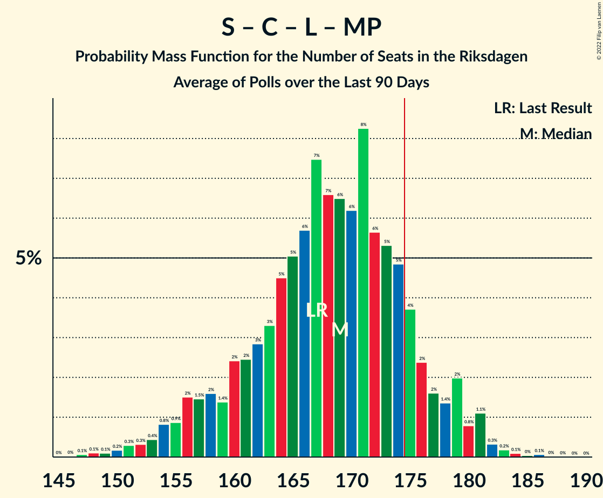

# Poll Average

<a href="#voting-intentions">Voting Intentions</a> | <a href="#seats">Seats</a> | <a href="#coalitions">Coalitions</a> | <a href="#technical-information">Technical Information</a>

## Summary

The table below lists the polls on which the average is based. They are the most recent polls (less than 90 days old) registered and analyzed so far.

| Period     | Polling firm/Commissioner(s) | S | M | SD | C | V | KD | L | MP |
|:----------:|:----------------------------:|:--:|:--:|:--:|:--:|:--:|:--:|:--:|:--:|
| 9 September 2018 | General Election | 28.3%   100 | 19.8%   70 | 17.5%   62 | 8.6%   31 | 8.0%   28 | 6.3%   22 | 5.5%   20 | 4.4%   16 |
| N/A | Poll Average | 26–31%   92–111 | 16–20%   55–71 | 18–22%   64–80 | 6–10%   22–34 | 6–10%   22–34 | 5–7%   17–26 | 4–6%   0–22 | 4–8%   0–29 |
| [4–6 September 2022](2022-09-06-Sifo.html) | Sifo   Svenska Dagbladet | 28–32%   99–112 | 15–19%   54–66 | 19–23%   68–80 | 6–8%   21–29 | 6–8%   21–28 | 5–7%   19–25 | 4–6%   15–21 | 5–7%   17–24 |
| [3–6 September 2022](2022-09-06-SKOP.html) | SKOP | 26–30%   90–107 | 16–20%   55–69 | 18–22%   62–77 | 6–8%   20–30 | 6–9%   22–32 | 5–8%   18–27 | 4–7%   15–23 | 6–9%   22–32 |
| [4–6 September 2022](2022-09-06-Novus.html) | Novus   SVT | 26–30%   90–107 | 16–19%   54–68 | 19–23%   65–80 | 7–10%   26–36 | 7–9%   24–33 | 5–7%   17–26 | 4–6%   0–21 | 5–7%   16–25 |
| [1–6 September 2022](2022-09-06-Ipsos.html) | Ipsos   Dagens Nyheter | 26–31%   93–111 | 16–20%   59–72 | 19–22%   66–81 | 6–9%   23–32 | 7–10%   25–35 | 5–7%   18–27 | 3–5%   0–19 | 4–6%   16–23 |
| [31 August–4 September 2022](2022-09-04-Demoskop.html) | Demoskop   Aftonbladet | 27–31%   96–112 | 17–20%   59–72 | 19–22%   66–80 | 7–9%   25–33 | 7–10%   25–34 | 4–6%   16–22 | 4–6%   16–23 | 4–5%   0–18 |
| 9 September 2018 | General Election | 28.3%   100 | 19.8%   70 | 17.5%   62 | 8.6%   31 | 8.0%   28 | 6.3%   22 | 5.5%   20 | 4.4%   16 |

Only polls for which at least the sample size has been published are included in the table above.

**Legend:**
+ **Top half of each row:** Voting intentions (95% confidence interval)
+ **Bottom half of each row:** Seat projections for the Riksdagen (95% confidence interval)
+ **S:** Sveriges socialdemokratiska arbetareparti
+ **M:** Moderata samlingspartiet
+ **SD:** Sverigedemokraterna
+ **C:** Centerpartiet
+ **V:** Vänsterpartiet
+ **KD:** Kristdemokraterna
+ **L:** Liberalerna
+ **MP:** Miljöpartiet de gröna
+ **N/A (single party):** Party not included the published results
+ **N/A (entire row):** Calculation for this opinion poll not started yet

## Voting Intentions

### Confidence Intervals

| Party | Last Result | Median | 80% Confidence Interval | 90% Confidence Interval | 95% Confidence Interval | 99% Confidence Interval |
|:-----:|:-----------:|:------:|:-----------------------:|:-----------------------:|:-----------------------:|:-----------------------:|
| <a href="#sveriges-socialdemokratiska-arbetareparti">Sveriges socialdemokratiska arbetareparti</a> | 28.3% | 28.7% | 26.9–30.5% |26.4–31.0% | 26.0–31.4% | 25.2–32.1% |
| <a href="#moderata-samlingspartiet">Moderata samlingspartiet</a> | 19.8% | 17.7% | 16.4–19.1% |16.1–19.5% | 15.8–19.8% | 15.2–20.4% |
| <a href="#sverigedemokraterna">Sverigedemokraterna</a> | 17.5% | 20.5% | 19.1–21.8% |18.7–22.2% | 18.4–22.5% | 17.6–23.1% |
| <a href="#centerpartiet">Centerpartiet</a> | 8.6% | 7.7% | 6.6–8.9% |6.3–9.2% | 6.1–9.5% | 5.7–10.1% |
| <a href="#vänsterpartiet">Vänsterpartiet</a> | 8.0% | 7.9% | 6.8–9.0% |6.6–9.2% | 6.3–9.5% | 6.0–10.0% |
| <a href="#kristdemokraterna">Kristdemokraterna</a> | 6.3% | 6.0% | 5.1–6.9% |4.9–7.1% | 4.7–7.4% | 4.4–7.8% |
| <a href="#liberalerna">Liberalerna</a> | 5.5% | 5.0% | 4.1–5.8% |3.9–6.1% | 3.7–6.3% | 3.4–6.8% |
| <a href="#miljöpartiet-de-gröna">Miljöpartiet de gröna</a> | 4.4% | 5.6% | 4.3–7.5% |4.0–8.0% | 3.8–8.3% | 3.5–9.0% |

### Sveriges socialdemokratiska arbetareparti

*For a full overview of the results for this party, see the [Sveriges socialdemokratiska arbetareparti](party-sverigessocialdemokratiskaarbetareparti.html) page.*

| Voting Intentions | Probability | Accumulated | Special Marks |
|:-----------------:|:-----------:|:-----------:|:-------------:|
| 22.5–23.5% | 0% | 100% |  |
| 23.5–24.5% | 0.1% | 100% |  |
| 24.5–25.5% | 0.9% | 99.9% |  |
| 25.5–26.5% | 5% | 99.0% |  |
| 26.5–27.5% | 15% | 94% |  |
| 27.5–28.5% | 24% | 79% | Last Result |
| 28.5–29.5% | 26% | 54% | Median |
| 29.5–30.5% | 18% | 28% |  |
| 30.5–31.5% | 8% | 10% |  |
| 31.5–32.5% | 2% | 2% |  |
| 32.5–33.5% | 0.2% | 0.2% |  |
| 33.5–34.5% | 0% | 0% |  |

### Moderata samlingspartiet

*For a full overview of the results for this party, see the [Moderata samlingspartiet](party-moderatasamlingspartiet.html) page.*

| Voting Intentions | Probability | Accumulated | Special Marks |
|:-----------------:|:-----------:|:-----------:|:-------------:|
| 13.5–14.5% | 0% | 100% |  |
| 14.5–15.5% | 1.4% | 100% |  |
| 15.5–16.5% | 11% | 98.6% |  |
| 16.5–17.5% | 30% | 87% |  |
| 17.5–18.5% | 35% | 57% | Median |
| 18.5–19.5% | 18% | 23% |  |
| 19.5–20.5% | 4% | 4% | Last Result |
| 20.5–21.5% | 0.3% | 0.4% |  |
| 21.5–22.5% | 0% | 0% |  |

### Sverigedemokraterna

*For a full overview of the results for this party, see the [Sverigedemokraterna](party-sverigedemokraterna.html) page.*

| Voting Intentions | Probability | Accumulated | Special Marks |
|:-----------------:|:-----------:|:-----------:|:-------------:|
| 15.5–16.5% | 0% | 100% |  |
| 16.5–17.5% | 0.4% | 100% |  |
| 17.5–18.5% | 3% | 99.6% | Last Result |
| 18.5–19.5% | 15% | 96% |  |
| 19.5–20.5% | 33% | 81% | Median |
| 20.5–21.5% | 33% | 48% |  |
| 21.5–22.5% | 13% | 15% |  |
| 22.5–23.5% | 2% | 2% |  |
| 23.5–24.5% | 0.1% | 0.1% |  |
| 24.5–25.5% | 0% | 0% |  |

### Centerpartiet

*For a full overview of the results for this party, see the [Centerpartiet](party-centerpartiet.html) page.*

| Voting Intentions | Probability | Accumulated | Special Marks |
|:-----------------:|:-----------:|:-----------:|:-------------:|
| 3.5–4.5% | 0% | 100% |  |
| 4.5–5.5% | 0.2% | 100% |  |
| 5.5–6.5% | 9% | 99.8% |  |
| 6.5–7.5% | 36% | 91% |  |
| 7.5–8.5% | 38% | 55% | Median |
| 8.5–9.5% | 15% | 18% | Last Result |
| 9.5–10.5% | 2% | 2% |  |
| 10.5–11.5% | 0.1% | 0.1% |  |
| 11.5–12.5% | 0% | 0% |  |

### Vänsterpartiet

*For a full overview of the results for this party, see the [Vänsterpartiet](party-vänsterpartiet.html) page.*

| Voting Intentions | Probability | Accumulated | Special Marks |
|:-----------------:|:-----------:|:-----------:|:-------------:|
| 4.5–5.5% | 0% | 100% |  |
| 5.5–6.5% | 5% | 100% |  |
| 6.5–7.5% | 28% | 95% |  |
| 7.5–8.5% | 44% | 67% | Last Result, Median |
| 8.5–9.5% | 21% | 23% |  |
| 9.5–10.5% | 2% | 2% |  |
| 10.5–11.5% | 0% | 0% |  |
| 11.5–12.5% | 0% | 0% |  |

### Kristdemokraterna

*For a full overview of the results for this party, see the [Kristdemokraterna](party-kristdemokraterna.html) page.*

| Voting Intentions | Probability | Accumulated | Special Marks |
|:-----------------:|:-----------:|:-----------:|:-------------:|
| 2.5–3.5% | 0% | 100% |  |
| 3.5–4.5% | 1.1% | 100% |  |
| 4.5–5.5% | 24% | 98.9% |  |
| 5.5–6.5% | 54% | 75% | Last Result, Median |
| 6.5–7.5% | 20% | 22% |  |
| 7.5–8.5% | 1.3% | 1.3% |  |
| 8.5–9.5% | 0% | 0% |  |

### Liberalerna

*For a full overview of the results for this party, see the [Liberalerna](party-liberalerna.html) page.*

| Voting Intentions | Probability | Accumulated | Special Marks |
|:-----------------:|:-----------:|:-----------:|:-------------:|
| 1.5–2.5% | 0% | 100% |  |
| 2.5–3.5% | 1.4% | 100% |  |
| 3.5–4.5% | 24% | 98.6% |  |
| 4.5–5.5% | 54% | 75% | Last Result, Median |
| 5.5–6.5% | 19% | 20% |  |
| 6.5–7.5% | 1.1% | 1.1% |  |
| 7.5–8.5% | 0% | 0% |  |

### Miljöpartiet de gröna

*For a full overview of the results for this party, see the [Miljöpartiet de gröna](party-miljöpartietdegröna.html) page.*

| Voting Intentions | Probability | Accumulated | Special Marks |
|:-----------------:|:-----------:|:-----------:|:-------------:|
| 1.5–2.5% | 0% | 100% |  |
| 2.5–3.5% | 0.6% | 100% |  |
| 3.5–4.5% | 15% | 99.4% | Last Result |
| 4.5–5.5% | 30% | 84% |  |
| 5.5–6.5% | 32% | 54% | Median |
| 6.5–7.5% | 13% | 22% |  |
| 7.5–8.5% | 8% | 10% |  |
| 8.5–9.5% | 1.5% | 2% |  |
| 9.5–10.5% | 0.1% | 0.1% |  |
| 10.5–11.5% | 0% | 0% |  |

## Seats

### Confidence Intervals

| Party | Last Result | Median | 80% Confidence Interval | 90% Confidence Interval | 95% Confidence Interval | 99% Confidence Interval |
|:-----:|:-----------:|:------:|:-----------------------:|:-----------------------:|:-----------------------:|:-----------------------:|
| <a href="#sveriges-socialdemokratiska-arbetareparti">Sveriges socialdemokratiska arbetareparti</a> | 100 | 101 | 95–108 |93–110 | 92–111 | 89–114 |
| <a href="#moderata-samlingspartiet">Moderata samlingspartiet</a> | 70 | 62 | 58–68 |56–69 | 55–71 | 53–73 |
| <a href="#sverigedemokraterna">Sverigedemokraterna</a> | 62 | 72 | 67–77 |66–79 | 64–80 | 62–82 |
| <a href="#centerpartiet">Centerpartiet</a> | 31 | 27 | 23–31 |22–33 | 22–34 | 20–36 |
| <a href="#vänsterpartiet">Vänsterpartiet</a> | 28 | 28 | 24–32 |23–33 | 22–34 | 21–35 |
| <a href="#kristdemokraterna">Kristdemokraterna</a> | 22 | 21 | 18–24 |17–25 | 17–26 | 16–28 |
| <a href="#liberalerna">Liberalerna</a> | 20 | 18 | 15–21 |0–21 | 0–22 | 0–24 |
| <a href="#miljöpartiet-de-gröna">Miljöpartiet de gröna</a> | 16 | 20 | 15–26 |14–28 | 0–29 | 0–32 |

### Sveriges socialdemokratiska arbetareparti

*For a full overview of the results for this party, see the [Sveriges socialdemokratiska arbetareparti](party-sverigessocialdemokratiskaarbetareparti.html) page.*

| Number of Seats | Probability | Accumulated | Special Marks |
|:---------------:|:-----------:|:-----------:|:-------------:|
| 86 | 0.1% | 100% |  |
| 87 | 0.1% | 99.9% |  |
| 88 | 0.2% | 99.8% |  |
| 89 | 0.4% | 99.6% |  |
| 90 | 0.7% | 99.2% |  |
| 91 | 0.9% | 98.5% |  |
| 92 | 2% | 98% |  |
| 93 | 3% | 96% |  |
| 94 | 3% | 93% |  |
| 95 | 3% | 90% |  |
| 96 | 5% | 88% |  |
| 97 | 5% | 82% |  |
| 98 | 5% | 77% |  |
| 99 | 7% | 72% |  |
| 100 | 9% | 65% | Last Result |
| 101 | 8% | 56% | Median |
| 102 | 7% | 48% |  |
| 103 | 6% | 41% |  |
| 104 | 7% | 35% |  |
| 105 | 8% | 28% |  |
| 106 | 4% | 20% |  |
| 107 | 5% | 17% |  |
| 108 | 4% | 12% |  |
| 109 | 3% | 8% |  |
| 110 | 2% | 5% |  |
| 111 | 2% | 4% |  |
| 112 | 1.0% | 2% |  |
| 113 | 0.4% | 1.1% |  |
| 114 | 0.3% | 0.7% |  |
| 115 | 0.2% | 0.4% |  |
| 116 | 0.1% | 0.2% |  |
| 117 | 0.1% | 0.1% |  |
| 118 | 0% | 0% |  |

### Moderata samlingspartiet

*For a full overview of the results for this party, see the [Moderata samlingspartiet](party-moderatasamlingspartiet.html) page.*

| Number of Seats | Probability | Accumulated | Special Marks |
|:---------------:|:-----------:|:-----------:|:-------------:|
| 51 | 0.1% | 100% |  |
| 52 | 0.1% | 99.9% |  |
| 53 | 0.4% | 99.8% |  |
| 54 | 1.0% | 99.4% |  |
| 55 | 1.4% | 98% |  |
| 56 | 2% | 97% |  |
| 57 | 4% | 95% |  |
| 58 | 5% | 91% |  |
| 59 | 7% | 86% |  |
| 60 | 11% | 79% |  |
| 61 | 9% | 68% |  |
| 62 | 9% | 59% | Median |
| 63 | 11% | 50% |  |
| 64 | 10% | 39% |  |
| 65 | 8% | 29% |  |
| 66 | 6% | 22% |  |
| 67 | 5% | 16% |  |
| 68 | 3% | 11% |  |
| 69 | 3% | 8% |  |
| 70 | 2% | 5% | Last Result |
| 71 | 1.3% | 3% |  |
| 72 | 1.0% | 2% |  |
| 73 | 0.4% | 0.8% |  |
| 74 | 0.2% | 0.4% |  |
| 75 | 0.1% | 0.2% |  |
| 76 | 0% | 0.1% |  |
| 77 | 0% | 0% |  |

### Sverigedemokraterna

*For a full overview of the results for this party, see the [Sverigedemokraterna](party-sverigedemokraterna.html) page.*

| Number of Seats | Probability | Accumulated | Special Marks |
|:---------------:|:-----------:|:-----------:|:-------------:|
| 59 | 0% | 100% |  |
| 60 | 0.1% | 99.9% |  |
| 61 | 0.2% | 99.8% |  |
| 62 | 0.5% | 99.6% | Last Result |
| 63 | 0.4% | 99.2% |  |
| 64 | 1.3% | 98.7% |  |
| 65 | 1.5% | 97% |  |
| 66 | 3% | 96% |  |
| 67 | 4% | 93% |  |
| 68 | 6% | 89% |  |
| 69 | 8% | 83% |  |
| 70 | 7% | 75% |  |
| 71 | 9% | 68% |  |
| 72 | 10% | 59% | Median |
| 73 | 12% | 49% |  |
| 74 | 11% | 37% |  |
| 75 | 7% | 26% |  |
| 76 | 5% | 19% |  |
| 77 | 5% | 14% |  |
| 78 | 4% | 10% |  |
| 79 | 2% | 5% |  |
| 80 | 1.3% | 3% |  |
| 81 | 0.6% | 2% |  |
| 82 | 0.6% | 1.0% |  |
| 83 | 0.2% | 0.4% |  |
| 84 | 0.2% | 0.2% |  |
| 85 | 0% | 0.1% |  |
| 86 | 0% | 0% |  |

### Centerpartiet

*For a full overview of the results for this party, see the [Centerpartiet](party-centerpartiet.html) page.*

| Number of Seats | Probability | Accumulated | Special Marks |
|:---------------:|:-----------:|:-----------:|:-------------:|
| 18 | 0% | 100% |  |
| 19 | 0.2% | 99.9% |  |
| 20 | 0.8% | 99.7% |  |
| 21 | 1.2% | 98.9% |  |
| 22 | 4% | 98% |  |
| 23 | 6% | 94% |  |
| 24 | 9% | 87% |  |
| 25 | 10% | 79% |  |
| 26 | 13% | 69% |  |
| 27 | 12% | 56% | Median |
| 28 | 11% | 44% |  |
| 29 | 9% | 33% |  |
| 30 | 8% | 24% |  |
| 31 | 7% | 16% | Last Result |
| 32 | 3% | 9% |  |
| 33 | 3% | 6% |  |
| 34 | 2% | 3% |  |
| 35 | 0.6% | 1.3% |  |
| 36 | 0.4% | 0.7% |  |
| 37 | 0.2% | 0.3% |  |
| 38 | 0.1% | 0.1% |  |
| 39 | 0% | 0.1% |  |
| 40 | 0% | 0% |  |

### Vänsterpartiet

*For a full overview of the results for this party, see the [Vänsterpartiet](party-vänsterpartiet.html) page.*

| Number of Seats | Probability | Accumulated | Special Marks |
|:---------------:|:-----------:|:-----------:|:-------------:|
| 20 | 0.2% | 100% |  |
| 21 | 0.9% | 99.7% |  |
| 22 | 2% | 98.9% |  |
| 23 | 3% | 97% |  |
| 24 | 8% | 93% |  |
| 25 | 8% | 86% |  |
| 26 | 10% | 78% |  |
| 27 | 13% | 68% |  |
| 28 | 12% | 55% | Last Result, Median |
| 29 | 13% | 43% |  |
| 30 | 10% | 30% |  |
| 31 | 7% | 20% |  |
| 32 | 6% | 13% |  |
| 33 | 4% | 7% |  |
| 34 | 2% | 3% |  |
| 35 | 0.8% | 1.3% |  |
| 36 | 0.3% | 0.5% |  |
| 37 | 0.1% | 0.2% |  |
| 38 | 0.1% | 0.1% |  |
| 39 | 0% | 0% |  |

### Kristdemokraterna

*For a full overview of the results for this party, see the [Kristdemokraterna](party-kristdemokraterna.html) page.*

| Number of Seats | Probability | Accumulated | Special Marks |
|:---------------:|:-----------:|:-----------:|:-------------:|
| 14 | 0% | 100% |  |
| 15 | 0.3% | 99.9% |  |
| 16 | 2% | 99.6% |  |
| 17 | 4% | 98% |  |
| 18 | 7% | 94% |  |
| 19 | 12% | 87% |  |
| 20 | 12% | 75% |  |
| 21 | 16% | 63% | Median |
| 22 | 15% | 48% | Last Result |
| 23 | 15% | 32% |  |
| 24 | 9% | 18% |  |
| 25 | 4% | 8% |  |
| 26 | 2% | 4% |  |
| 27 | 1.2% | 2% |  |
| 28 | 0.4% | 0.6% |  |
| 29 | 0.1% | 0.2% |  |
| 30 | 0% | 0.1% |  |
| 31 | 0% | 0% |  |

### Liberalerna

*For a full overview of the results for this party, see the [Liberalerna](party-liberalerna.html) page.*

| Number of Seats | Probability | Accumulated | Special Marks |
|:---------------:|:-----------:|:-----------:|:-------------:|
| 0 | 7% | 100% |  |
| 1 | 0% | 93% |  |
| 2 | 0% | 93% |  |
| 3 | 0% | 93% |  |
| 4 | 0% | 93% |  |
| 5 | 0% | 93% |  |
| 6 | 0% | 93% |  |
| 7 | 0% | 93% |  |
| 8 | 0% | 93% |  |
| 9 | 0% | 93% |  |
| 10 | 0% | 93% |  |
| 11 | 0% | 93% |  |
| 12 | 0% | 93% |  |
| 13 | 0% | 93% |  |
| 14 | 3% | 93% |  |
| 15 | 10% | 90% |  |
| 16 | 12% | 81% |  |
| 17 | 16% | 68% |  |
| 18 | 18% | 52% | Median |
| 19 | 14% | 34% |  |
| 20 | 10% | 21% | Last Result |
| 21 | 6% | 11% |  |
| 22 | 3% | 5% |  |
| 23 | 2% | 2% |  |
| 24 | 0.4% | 0.7% |  |
| 25 | 0.2% | 0.3% |  |
| 26 | 0.1% | 0.1% |  |
| 27 | 0% | 0% |  |

### Miljöpartiet de gröna

*For a full overview of the results for this party, see the [Miljöpartiet de gröna](party-miljöpartietdegröna.html) page.*

| Number of Seats | Probability | Accumulated | Special Marks |
|:---------------:|:-----------:|:-----------:|:-------------:|
| 0 | 5% | 100% |  |
| 1 | 0% | 95% |  |
| 2 | 0% | 95% |  |
| 3 | 0% | 95% |  |
| 4 | 0% | 95% |  |
| 5 | 0% | 95% |  |
| 6 | 0% | 95% |  |
| 7 | 0% | 95% |  |
| 8 | 0% | 95% |  |
| 9 | 0% | 95% |  |
| 10 | 0% | 95% |  |
| 11 | 0% | 95% |  |
| 12 | 0% | 95% |  |
| 13 | 0% | 95% |  |
| 14 | 2% | 95% |  |
| 15 | 7% | 94% |  |
| 16 | 5% | 87% | Last Result |
| 17 | 7% | 83% |  |
| 18 | 10% | 76% |  |
| 19 | 10% | 66% |  |
| 20 | 13% | 56% | Median |
| 21 | 8% | 43% |  |
| 22 | 8% | 34% |  |
| 23 | 5% | 26% |  |
| 24 | 5% | 21% |  |
| 25 | 3% | 16% |  |
| 26 | 4% | 13% |  |
| 27 | 2% | 9% |  |
| 28 | 3% | 7% |  |
| 29 | 2% | 4% |  |
| 30 | 1.0% | 2% |  |
| 31 | 0.7% | 1.2% |  |
| 32 | 0.4% | 0.5% |  |
| 33 | 0.1% | 0.1% |  |
| 34 | 0.1% | 0.1% |  |
| 35 | 0% | 0% |  |

## Coalitions

### Confidence Intervals

| Coalition | Last Result | Median | Majority? | 80% Confidence Interval | 90% Confidence Interval | 95% Confidence Interval | 99% Confidence Interval |
|:---------:|:-----------:|:------:|:---------:|:-----------------------:|:-----------------------:|:-----------------------:|:-----------------------:|
| Sveriges socialdemokratiska arbetareparti – Moderata samlingspartiet – Centerpartiet | 201 | 191 | 99.7% | 183–199 | 181–203 | 179–206 | 176–209 |
| Sveriges socialdemokratiska arbetareparti – Centerpartiet – Vänsterpartiet – Liberalerna – Miljöpartiet de gröna | 195 | 193 | 99.8% | 186–199 | 183–201 | 181–202 | 177–205 |
| Sveriges socialdemokratiska arbetareparti – Centerpartiet – Vänsterpartiet – Miljöpartiet de gröna | 175 | 176 | 63% | 170–182 | 168–185 | 166–187 | 162–191 |
| Moderata samlingspartiet – Sverigedemokraterna – Kristdemokraterna – Liberalerna | 174 | 173 | 37% | 167–179 | 164–181 | 162–183 | 158–187 |
| Sveriges socialdemokratiska arbetareparti – Moderata samlingspartiet | 170 | 164 | 4% | 156–171 | 154–174 | 153–177 | 149–181 |
| Sveriges socialdemokratiska arbetareparti – Centerpartiet – Liberalerna – Miljöpartiet de gröna | 167 | 165 | 4% | 157–172 | 153–174 | 150–175 | 146–178 |
| Moderata samlingspartiet – Sverigedemokraterna – Kristdemokraterna | 154 | 156 | 0.2% | 150–163 | 148–166 | 147–168 | 144–172 |
| Sveriges socialdemokratiska arbetareparti – Vänsterpartiet – Miljöpartiet de gröna | 144 | 149 | 0% | 142–156 | 140–158 | 138–160 | 133–163 |
| Sveriges socialdemokratiska arbetareparti – Centerpartiet – Miljöpartiet de gröna | 147 | 148 | 0% | 141–155 | 139–157 | 137–158 | 133–161 |
| Moderata samlingspartiet – Sverigedemokraterna | 132 | 134 | 0% | 128–141 | 127–143 | 125–146 | 122–150 |
| Sveriges socialdemokratiska arbetareparti – Vänsterpartiet | 128 | 129 | 0% | 123–136 | 120–138 | 119–141 | 116–144 |
| Moderata samlingspartiet – Centerpartiet – Kristdemokraterna – Liberalerna | 143 | 128 | 0% | 121–135 | 119–137 | 116–138 | 111–142 |
| Sveriges socialdemokratiska arbetareparti – Miljöpartiet de gröna | 116 | 121 | 0% | 114–128 | 111–130 | 108–132 | 103–135 |
| Moderata samlingspartiet – Centerpartiet – Kristdemokraterna | 123 | 111 | 0% | 104–118 | 103–120 | 102–122 | 99–125 |
| Moderata samlingspartiet – Centerpartiet – Liberalerna | 121 | 106 | 0% | 99–114 | 96–116 | 93–118 | 89–122 |
| Sveriges socialdemokratiska arbetareparti | 100 | 101 | 0% | 95–108 | 93–110 | 92–111 | 89–114 |
| Moderata samlingspartiet – Kristdemokraterna – Liberalerna | 112 | 101 | 0% | 94–107 | 91–108 | 88–110 | 84–113 |
| Moderata samlingspartiet – Centerpartiet | 101 | 90 | 0% | 83–97 | 81–98 | 80–100 | 78–103 |
| Moderata samlingspartiet – Kristdemokraterna | 92 | 84 | 0% | 79–90 | 77–91 | 76–93 | 74–96 |

### Sveriges socialdemokratiska arbetareparti – Moderata samlingspartiet – Centerpartiet

| Number of Seats | Probability | Accumulated | Special Marks |
|:---------------:|:-----------:|:-----------:|:-------------:|
| 172 | 0.1% | 100% |  |
| 173 | 0.1% | 99.9% |  |
| 174 | 0.1% | 99.8% |  |
| 175 | 0.2% | 99.7% | Majority |
| 176 | 0.3% | 99.5% |  |
| 177 | 0.5% | 99.3% |  |
| 178 | 0.6% | 98.8% |  |
| 179 | 0.9% | 98% |  |
| 180 | 1.2% | 97% |  |
| 181 | 2% | 96% |  |
| 182 | 2% | 94% |  |
| 183 | 3% | 92% |  |
| 184 | 3% | 89% |  |
| 185 | 4% | 86% |  |
| 186 | 4% | 82% |  |
| 187 | 6% | 77% |  |
| 188 | 6% | 72% |  |
| 189 | 6% | 65% |  |
| 190 | 8% | 59% | Median |
| 191 | 7% | 51% |  |
| 192 | 6% | 44% |  |
| 193 | 6% | 38% |  |
| 194 | 4% | 32% |  |
| 195 | 5% | 28% |  |
| 196 | 5% | 23% |  |
| 197 | 4% | 18% |  |
| 198 | 3% | 14% |  |
| 199 | 2% | 12% |  |
| 200 | 1.5% | 10% |  |
| 201 | 2% | 8% | Last Result |
| 202 | 1.2% | 7% |  |
| 203 | 1.2% | 5% |  |
| 204 | 0.6% | 4% |  |
| 205 | 0.6% | 4% |  |
| 206 | 0.7% | 3% |  |
| 207 | 1.0% | 2% |  |
| 208 | 0.5% | 1.3% |  |
| 209 | 0.3% | 0.8% |  |
| 210 | 0.2% | 0.5% |  |
| 211 | 0.1% | 0.3% |  |
| 212 | 0.1% | 0.2% |  |
| 213 | 0% | 0.1% |  |
| 214 | 0% | 0.1% |  |
| 215 | 0% | 0% |  |

### Sveriges socialdemokratiska arbetareparti – Centerpartiet – Vänsterpartiet – Liberalerna – Miljöpartiet de gröna

| Number of Seats | Probability | Accumulated | Special Marks |
|:---------------:|:-----------:|:-----------:|:-------------:|
| 172 | 0.1% | 100% |  |
| 173 | 0% | 99.9% |  |
| 174 | 0.1% | 99.9% |  |
| 175 | 0.1% | 99.8% | Majority |
| 176 | 0.2% | 99.8% |  |
| 177 | 0.3% | 99.6% |  |
| 178 | 0.2% | 99.3% |  |
| 179 | 0.7% | 99.1% |  |
| 180 | 0.5% | 98% |  |
| 181 | 0.9% | 98% |  |
| 182 | 0.7% | 97% |  |
| 183 | 1.5% | 96% |  |
| 184 | 1.0% | 95% |  |
| 185 | 2% | 94% |  |
| 186 | 2% | 92% |  |
| 187 | 3% | 90% |  |
| 188 | 5% | 87% |  |
| 189 | 5% | 82% |  |
| 190 | 7% | 77% |  |
| 191 | 7% | 70% |  |
| 192 | 8% | 63% |  |
| 193 | 9% | 55% |  |
| 194 | 7% | 46% | Median |
| 195 | 9% | 39% | Last Result |
| 196 | 5% | 30% |  |
| 197 | 6% | 24% |  |
| 198 | 5% | 19% |  |
| 199 | 3% | 13% |  |
| 200 | 4% | 10% |  |
| 201 | 2% | 6% |  |
| 202 | 2% | 4% |  |
| 203 | 0.7% | 2% |  |
| 204 | 0.5% | 1.3% |  |
| 205 | 0.4% | 0.8% |  |
| 206 | 0.2% | 0.4% |  |
| 207 | 0.1% | 0.2% |  |
| 208 | 0.1% | 0.1% |  |
| 209 | 0% | 0.1% |  |
| 210 | 0% | 0% |  |

### Sveriges socialdemokratiska arbetareparti – Centerpartiet – Vänsterpartiet – Miljöpartiet de gröna

| Number of Seats | Probability | Accumulated | Special Marks |
|:---------------:|:-----------:|:-----------:|:-------------:|
| 158 | 0% | 100% |  |
| 159 | 0% | 99.9% |  |
| 160 | 0.1% | 99.9% |  |
| 161 | 0.1% | 99.8% |  |
| 162 | 0.3% | 99.7% |  |
| 163 | 0.3% | 99.4% |  |
| 164 | 0.4% | 99.1% |  |
| 165 | 0.5% | 98.8% |  |
| 166 | 0.9% | 98% |  |
| 167 | 1.5% | 97% |  |
| 168 | 2% | 96% |  |
| 169 | 2% | 94% |  |
| 170 | 3% | 92% |  |
| 171 | 5% | 89% |  |
| 172 | 5% | 84% |  |
| 173 | 7% | 78% |  |
| 174 | 8% | 71% |  |
| 175 | 8% | 63% | Last Result, Majority |
| 176 | 9% | 55% | Median |
| 177 | 5% | 46% |  |
| 178 | 10% | 41% |  |
| 179 | 7% | 31% |  |
| 180 | 6% | 24% |  |
| 181 | 5% | 18% |  |
| 182 | 3% | 13% |  |
| 183 | 2% | 10% |  |
| 184 | 2% | 7% |  |
| 185 | 2% | 6% |  |
| 186 | 0.9% | 4% |  |
| 187 | 0.8% | 3% |  |
| 188 | 1.0% | 2% |  |
| 189 | 0.2% | 1.2% |  |
| 190 | 0.4% | 1.0% |  |
| 191 | 0.2% | 0.6% |  |
| 192 | 0.2% | 0.4% |  |
| 193 | 0.1% | 0.2% |  |
| 194 | 0.1% | 0.1% |  |
| 195 | 0% | 0.1% |  |
| 196 | 0% | 0% |  |

### Moderata samlingspartiet – Sverigedemokraterna – Kristdemokraterna – Liberalerna

| Number of Seats | Probability | Accumulated | Special Marks |
|:---------------:|:-----------:|:-----------:|:-------------:|
| 154 | 0% | 100% |  |
| 155 | 0.1% | 99.9% |  |
| 156 | 0.1% | 99.9% |  |
| 157 | 0.2% | 99.8% |  |
| 158 | 0.2% | 99.6% |  |
| 159 | 0.4% | 99.4% |  |
| 160 | 0.2% | 99.0% |  |
| 161 | 1.0% | 98.8% |  |
| 162 | 0.8% | 98% |  |
| 163 | 0.9% | 97% |  |
| 164 | 2% | 96% |  |
| 165 | 2% | 94% |  |
| 166 | 2% | 93% |  |
| 167 | 3% | 90% |  |
| 168 | 5% | 87% |  |
| 169 | 6% | 82% |  |
| 170 | 7% | 76% |  |
| 171 | 10% | 69% |  |
| 172 | 5% | 59% |  |
| 173 | 9% | 54% | Median |
| 174 | 8% | 45% | Last Result |
| 175 | 8% | 37% | Majority |
| 176 | 7% | 29% |  |
| 177 | 5% | 22% |  |
| 178 | 5% | 16% |  |
| 179 | 3% | 11% |  |
| 180 | 2% | 8% |  |
| 181 | 2% | 6% |  |
| 182 | 1.5% | 4% |  |
| 183 | 0.9% | 3% |  |
| 184 | 0.5% | 2% |  |
| 185 | 0.4% | 1.2% |  |
| 186 | 0.3% | 0.9% |  |
| 187 | 0.3% | 0.6% |  |
| 188 | 0.1% | 0.3% |  |
| 189 | 0.1% | 0.2% |  |
| 190 | 0% | 0.1% |  |
| 191 | 0% | 0.1% |  |
| 192 | 0% | 0% |  |

### Sveriges socialdemokratiska arbetareparti – Moderata samlingspartiet

| Number of Seats | Probability | Accumulated | Special Marks |
|:---------------:|:-----------:|:-----------:|:-------------:|
| 146 | 0% | 100% |  |
| 147 | 0.1% | 99.9% |  |
| 148 | 0.2% | 99.8% |  |
| 149 | 0.2% | 99.6% |  |
| 150 | 0.4% | 99.4% |  |
| 151 | 0.6% | 98.9% |  |
| 152 | 0.7% | 98% |  |
| 153 | 1.1% | 98% |  |
| 154 | 2% | 97% |  |
| 155 | 1.3% | 95% |  |
| 156 | 4% | 93% |  |
| 157 | 3% | 90% |  |
| 158 | 4% | 86% |  |
| 159 | 4% | 82% |  |
| 160 | 6% | 78% |  |
| 161 | 7% | 73% |  |
| 162 | 7% | 66% |  |
| 163 | 8% | 59% | Median |
| 164 | 5% | 51% |  |
| 165 | 9% | 46% |  |
| 166 | 4% | 37% |  |
| 167 | 6% | 33% |  |
| 168 | 6% | 27% |  |
| 169 | 4% | 20% |  |
| 170 | 4% | 17% | Last Result |
| 171 | 2% | 12% |  |
| 172 | 3% | 10% |  |
| 173 | 2% | 7% |  |
| 174 | 1.4% | 6% |  |
| 175 | 0.6% | 4% | Majority |
| 176 | 1.1% | 4% |  |
| 177 | 1.1% | 3% |  |
| 178 | 0.6% | 2% |  |
| 179 | 0.3% | 1.0% |  |
| 180 | 0.2% | 0.7% |  |
| 181 | 0.1% | 0.5% |  |
| 182 | 0.2% | 0.4% |  |
| 183 | 0.1% | 0.2% |  |
| 184 | 0% | 0.1% |  |
| 185 | 0% | 0.1% |  |
| 186 | 0% | 0% |  |

### Sveriges socialdemokratiska arbetareparti – Centerpartiet – Liberalerna – Miljöpartiet de gröna

| Number of Seats | Probability | Accumulated | Special Marks |
|:---------------:|:-----------:|:-----------:|:-------------:|
| 141 | 0% | 100% |  |
| 142 | 0% | 99.9% |  |
| 143 | 0.1% | 99.9% |  |
| 144 | 0.1% | 99.8% |  |
| 145 | 0.2% | 99.8% |  |
| 146 | 0.2% | 99.6% |  |
| 147 | 0.4% | 99.3% |  |
| 148 | 0.3% | 98.9% |  |
| 149 | 0.5% | 98.6% |  |
| 150 | 0.6% | 98% |  |
| 151 | 0.8% | 97% |  |
| 152 | 0.9% | 97% |  |
| 153 | 1.0% | 96% |  |
| 154 | 0.8% | 95% |  |
| 155 | 2% | 94% |  |
| 156 | 2% | 92% |  |
| 157 | 2% | 91% |  |
| 158 | 2% | 89% |  |
| 159 | 2% | 87% |  |
| 160 | 5% | 84% |  |
| 161 | 5% | 80% |  |
| 162 | 4% | 75% |  |
| 163 | 6% | 71% |  |
| 164 | 8% | 65% |  |
| 165 | 8% | 56% |  |
| 166 | 5% | 48% | Median |
| 167 | 7% | 43% | Last Result |
| 168 | 6% | 36% |  |
| 169 | 7% | 30% |  |
| 170 | 7% | 23% |  |
| 171 | 3% | 16% |  |
| 172 | 4% | 13% |  |
| 173 | 4% | 9% |  |
| 174 | 2% | 6% |  |
| 175 | 1.3% | 4% | Majority |
| 176 | 0.9% | 2% |  |
| 177 | 0.6% | 1.4% |  |
| 178 | 0.3% | 0.8% |  |
| 179 | 0.2% | 0.5% |  |
| 180 | 0.1% | 0.3% |  |
| 181 | 0.1% | 0.1% |  |
| 182 | 0% | 0.1% |  |
| 183 | 0% | 0% |  |

### Moderata samlingspartiet – Sverigedemokraterna – Kristdemokraterna

| Number of Seats | Probability | Accumulated | Special Marks |
|:---------------:|:-----------:|:-----------:|:-------------:|
| 140 | 0% | 100% |  |
| 141 | 0.1% | 99.9% |  |
| 142 | 0.1% | 99.9% |  |
| 143 | 0.2% | 99.8% |  |
| 144 | 0.4% | 99.6% |  |
| 145 | 0.5% | 99.2% |  |
| 146 | 0.7% | 98.7% |  |
| 147 | 2% | 98% |  |
| 148 | 2% | 96% |  |
| 149 | 4% | 94% |  |
| 150 | 3% | 90% |  |
| 151 | 5% | 87% |  |
| 152 | 6% | 81% |  |
| 153 | 5% | 76% |  |
| 154 | 9% | 70% | Last Result |
| 155 | 7% | 61% | Median |
| 156 | 9% | 54% |  |
| 157 | 8% | 45% |  |
| 158 | 7% | 37% |  |
| 159 | 7% | 30% |  |
| 160 | 5% | 23% |  |
| 161 | 5% | 18% |  |
| 162 | 3% | 13% |  |
| 163 | 2% | 10% |  |
| 164 | 2% | 8% |  |
| 165 | 1.0% | 6% |  |
| 166 | 1.5% | 5% |  |
| 167 | 0.7% | 4% |  |
| 168 | 0.9% | 3% |  |
| 169 | 0.5% | 2% |  |
| 170 | 0.7% | 2% |  |
| 171 | 0.2% | 0.9% |  |
| 172 | 0.3% | 0.7% |  |
| 173 | 0.2% | 0.4% |  |
| 174 | 0.1% | 0.2% |  |
| 175 | 0.1% | 0.2% | Majority |
| 176 | 0% | 0.1% |  |
| 177 | 0.1% | 0.1% |  |
| 178 | 0% | 0% |  |

### Sveriges socialdemokratiska arbetareparti – Vänsterpartiet – Miljöpartiet de gröna

| Number of Seats | Probability | Accumulated | Special Marks |
|:---------------:|:-----------:|:-----------:|:-------------:|
| 129 | 0% | 100% |  |
| 130 | 0.1% | 99.9% |  |
| 131 | 0.1% | 99.9% |  |
| 132 | 0.1% | 99.7% |  |
| 133 | 0.3% | 99.6% |  |
| 134 | 0.2% | 99.3% |  |
| 135 | 0.4% | 99.1% |  |
| 136 | 0.5% | 98.7% |  |
| 137 | 0.7% | 98% |  |
| 138 | 0.9% | 98% |  |
| 139 | 1.0% | 97% |  |
| 140 | 2% | 96% |  |
| 141 | 2% | 94% |  |
| 142 | 2% | 92% |  |
| 143 | 4% | 90% |  |
| 144 | 4% | 86% | Last Result |
| 145 | 6% | 82% |  |
| 146 | 5% | 76% |  |
| 147 | 8% | 70% |  |
| 148 | 9% | 63% |  |
| 149 | 7% | 54% | Median |
| 150 | 8% | 47% |  |
| 151 | 7% | 39% |  |
| 152 | 6% | 32% |  |
| 153 | 5% | 26% |  |
| 154 | 5% | 20% |  |
| 155 | 5% | 15% |  |
| 156 | 3% | 10% |  |
| 157 | 2% | 8% |  |
| 158 | 2% | 6% |  |
| 159 | 1.1% | 4% |  |
| 160 | 0.9% | 3% |  |
| 161 | 0.6% | 2% |  |
| 162 | 0.4% | 1.1% |  |
| 163 | 0.3% | 0.7% |  |
| 164 | 0.2% | 0.4% |  |
| 165 | 0.1% | 0.2% |  |
| 166 | 0.1% | 0.1% |  |
| 167 | 0% | 0.1% |  |
| 168 | 0% | 0% |  |

### Sveriges socialdemokratiska arbetareparti – Centerpartiet – Miljöpartiet de gröna

| Number of Seats | Probability | Accumulated | Special Marks |
|:---------------:|:-----------:|:-----------:|:-------------:|
| 128 | 0% | 100% |  |
| 129 | 0% | 99.9% |  |
| 130 | 0% | 99.9% |  |
| 131 | 0.2% | 99.9% |  |
| 132 | 0.1% | 99.7% |  |
| 133 | 0.3% | 99.6% |  |
| 134 | 0.4% | 99.3% |  |
| 135 | 0.6% | 98.9% |  |
| 136 | 0.5% | 98% |  |
| 137 | 0.6% | 98% |  |
| 138 | 1.1% | 97% |  |
| 139 | 2% | 96% |  |
| 140 | 2% | 94% |  |
| 141 | 3% | 93% |  |
| 142 | 3% | 90% |  |
| 143 | 4% | 87% |  |
| 144 | 5% | 84% |  |
| 145 | 7% | 79% |  |
| 146 | 8% | 73% |  |
| 147 | 8% | 65% | Last Result |
| 148 | 7% | 57% | Median |
| 149 | 8% | 50% |  |
| 150 | 7% | 42% |  |
| 151 | 9% | 35% |  |
| 152 | 6% | 26% |  |
| 153 | 6% | 20% |  |
| 154 | 4% | 14% |  |
| 155 | 2% | 10% |  |
| 156 | 2% | 8% |  |
| 157 | 2% | 5% |  |
| 158 | 1.3% | 3% |  |
| 159 | 0.9% | 2% |  |
| 160 | 0.5% | 1.3% |  |
| 161 | 0.3% | 0.8% |  |
| 162 | 0.2% | 0.5% |  |
| 163 | 0.2% | 0.3% |  |
| 164 | 0.1% | 0.1% |  |
| 165 | 0% | 0.1% |  |
| 166 | 0% | 0.1% |  |
| 167 | 0% | 0% |  |

### Moderata samlingspartiet – Sverigedemokraterna

| Number of Seats | Probability | Accumulated | Special Marks |
|:---------------:|:-----------:|:-----------:|:-------------:|
| 119 | 0% | 100% |  |
| 120 | 0.1% | 99.9% |  |
| 121 | 0.2% | 99.8% |  |
| 122 | 0.3% | 99.7% |  |
| 123 | 0.3% | 99.4% |  |
| 124 | 0.9% | 99.1% |  |
| 125 | 1.0% | 98% |  |
| 126 | 2% | 97% |  |
| 127 | 3% | 96% |  |
| 128 | 3% | 92% |  |
| 129 | 3% | 90% |  |
| 130 | 5% | 86% |  |
| 131 | 7% | 81% |  |
| 132 | 6% | 75% | Last Result |
| 133 | 10% | 69% |  |
| 134 | 9% | 59% | Median |
| 135 | 8% | 50% |  |
| 136 | 6% | 42% |  |
| 137 | 9% | 36% |  |
| 138 | 5% | 27% |  |
| 139 | 5% | 22% |  |
| 140 | 3% | 17% |  |
| 141 | 3% | 13% |  |
| 142 | 2% | 10% |  |
| 143 | 3% | 8% |  |
| 144 | 1.0% | 5% |  |
| 145 | 0.9% | 4% |  |
| 146 | 0.7% | 3% |  |
| 147 | 0.6% | 2% |  |
| 148 | 0.8% | 2% |  |
| 149 | 0.3% | 0.9% |  |
| 150 | 0.2% | 0.6% |  |
| 151 | 0.2% | 0.4% |  |
| 152 | 0.1% | 0.2% |  |
| 153 | 0% | 0.1% |  |
| 154 | 0.1% | 0.1% |  |
| 155 | 0% | 0% |  |

### Sveriges socialdemokratiska arbetareparti – Vänsterpartiet

| Number of Seats | Probability | Accumulated | Special Marks |
|:---------------:|:-----------:|:-----------:|:-------------:|
| 112 | 0% | 100% |  |
| 113 | 0% | 99.9% |  |
| 114 | 0.1% | 99.9% |  |
| 115 | 0.2% | 99.8% |  |
| 116 | 0.4% | 99.6% |  |
| 117 | 0.5% | 99.2% |  |
| 118 | 0.9% | 98.7% |  |
| 119 | 2% | 98% |  |
| 120 | 2% | 96% |  |
| 121 | 2% | 94% |  |
| 122 | 2% | 92% |  |
| 123 | 4% | 90% |  |
| 124 | 4% | 86% |  |
| 125 | 6% | 82% |  |
| 126 | 5% | 76% |  |
| 127 | 7% | 72% |  |
| 128 | 9% | 64% | Last Result |
| 129 | 9% | 55% | Median |
| 130 | 7% | 46% |  |
| 131 | 7% | 39% |  |
| 132 | 6% | 32% |  |
| 133 | 5% | 27% |  |
| 134 | 4% | 22% |  |
| 135 | 6% | 17% |  |
| 136 | 3% | 12% |  |
| 137 | 2% | 9% |  |
| 138 | 1.5% | 6% |  |
| 139 | 1.4% | 5% |  |
| 140 | 1.0% | 4% |  |
| 141 | 0.9% | 3% |  |
| 142 | 0.6% | 2% |  |
| 143 | 0.6% | 1.1% |  |
| 144 | 0.2% | 0.6% |  |
| 145 | 0.2% | 0.4% |  |
| 146 | 0.1% | 0.2% |  |
| 147 | 0% | 0.1% |  |
| 148 | 0% | 0% |  |

### Moderata samlingspartiet – Centerpartiet – Kristdemokraterna – Liberalerna

| Number of Seats | Probability | Accumulated | Special Marks |
|:---------------:|:-----------:|:-----------:|:-------------:|
| 107 | 0% | 100% |  |
| 108 | 0% | 99.9% |  |
| 109 | 0.1% | 99.9% |  |
| 110 | 0.1% | 99.8% |  |
| 111 | 0.3% | 99.7% |  |
| 112 | 0.2% | 99.4% |  |
| 113 | 0.3% | 99.2% |  |
| 114 | 0.6% | 98.9% |  |
| 115 | 0.5% | 98% |  |
| 116 | 0.7% | 98% |  |
| 117 | 0.8% | 97% |  |
| 118 | 1.1% | 96% |  |
| 119 | 2% | 95% |  |
| 120 | 3% | 94% |  |
| 121 | 3% | 90% |  |
| 122 | 4% | 87% |  |
| 123 | 4% | 84% |  |
| 124 | 5% | 80% |  |
| 125 | 6% | 74% |  |
| 126 | 8% | 68% |  |
| 127 | 7% | 60% |  |
| 128 | 7% | 52% | Median |
| 129 | 7% | 45% |  |
| 130 | 8% | 38% |  |
| 131 | 7% | 31% |  |
| 132 | 6% | 23% |  |
| 133 | 4% | 18% |  |
| 134 | 3% | 14% |  |
| 135 | 3% | 11% |  |
| 136 | 2% | 8% |  |
| 137 | 2% | 6% |  |
| 138 | 1.4% | 3% |  |
| 139 | 0.6% | 2% |  |
| 140 | 0.3% | 1.3% |  |
| 141 | 0.4% | 1.0% |  |
| 142 | 0.3% | 0.6% |  |
| 143 | 0.1% | 0.3% | Last Result |
| 144 | 0.1% | 0.2% |  |
| 145 | 0% | 0.1% |  |
| 146 | 0% | 0% |  |

### Sveriges socialdemokratiska arbetareparti – Miljöpartiet de gröna

| Number of Seats | Probability | Accumulated | Special Marks |
|:---------------:|:-----------:|:-----------:|:-------------:|
| 98 | 0% | 100% |  |
| 99 | 0% | 99.9% |  |
| 100 | 0.1% | 99.9% |  |
| 101 | 0.1% | 99.8% |  |
| 102 | 0.1% | 99.8% |  |
| 103 | 0.3% | 99.6% |  |
| 104 | 0.4% | 99.4% |  |
| 105 | 0.4% | 99.0% |  |
| 106 | 0.3% | 98.6% |  |
| 107 | 0.5% | 98% |  |
| 108 | 0.4% | 98% |  |
| 109 | 1.0% | 97% |  |
| 110 | 1.0% | 96% |  |
| 111 | 1.3% | 95% |  |
| 112 | 1.5% | 94% |  |
| 113 | 2% | 93% |  |
| 114 | 3% | 90% |  |
| 115 | 4% | 88% |  |
| 116 | 5% | 84% | Last Result |
| 117 | 5% | 79% |  |
| 118 | 5% | 74% |  |
| 119 | 6% | 69% |  |
| 120 | 7% | 62% |  |
| 121 | 6% | 55% | Median |
| 122 | 7% | 48% |  |
| 123 | 7% | 42% |  |
| 124 | 6% | 35% |  |
| 125 | 5% | 29% |  |
| 126 | 6% | 24% |  |
| 127 | 4% | 18% |  |
| 128 | 5% | 15% |  |
| 129 | 4% | 10% |  |
| 130 | 2% | 6% |  |
| 131 | 1.5% | 5% |  |
| 132 | 1.4% | 3% |  |
| 133 | 0.9% | 2% |  |
| 134 | 0.4% | 1.1% |  |
| 135 | 0.3% | 0.6% |  |
| 136 | 0.1% | 0.3% |  |
| 137 | 0.1% | 0.2% |  |
| 138 | 0% | 0.1% |  |
| 139 | 0% | 0.1% |  |
| 140 | 0% | 0% |  |

### Moderata samlingspartiet – Centerpartiet – Kristdemokraterna

| Number of Seats | Probability | Accumulated | Special Marks |
|:---------------:|:-----------:|:-----------:|:-------------:|
| 96 | 0% | 100% |  |
| 97 | 0.1% | 99.9% |  |
| 98 | 0.2% | 99.8% |  |
| 99 | 0.3% | 99.7% |  |
| 100 | 0.6% | 99.4% |  |
| 101 | 1.1% | 98.8% |  |
| 102 | 1.5% | 98% |  |
| 103 | 2% | 96% |  |
| 104 | 5% | 94% |  |
| 105 | 3% | 89% |  |
| 106 | 5% | 86% |  |
| 107 | 7% | 81% |  |
| 108 | 6% | 74% |  |
| 109 | 8% | 68% |  |
| 110 | 7% | 60% | Median |
| 111 | 7% | 53% |  |
| 112 | 8% | 46% |  |
| 113 | 6% | 38% |  |
| 114 | 8% | 32% |  |
| 115 | 6% | 25% |  |
| 116 | 5% | 19% |  |
| 117 | 4% | 14% |  |
| 118 | 2% | 10% |  |
| 119 | 2% | 8% |  |
| 120 | 2% | 6% |  |
| 121 | 1.4% | 4% |  |
| 122 | 0.9% | 3% |  |
| 123 | 0.5% | 2% | Last Result |
| 124 | 0.5% | 1.2% |  |
| 125 | 0.2% | 0.7% |  |
| 126 | 0.2% | 0.4% |  |
| 127 | 0.1% | 0.3% |  |
| 128 | 0.1% | 0.1% |  |
| 129 | 0% | 0.1% |  |
| 130 | 0% | 0% |  |

### Moderata samlingspartiet – Centerpartiet – Liberalerna

| Number of Seats | Probability | Accumulated | Special Marks |
|:---------------:|:-----------:|:-----------:|:-------------:|
| 85 | 0% | 100% |  |
| 86 | 0.1% | 99.9% |  |
| 87 | 0.1% | 99.9% |  |
| 88 | 0.2% | 99.8% |  |
| 89 | 0.2% | 99.5% |  |
| 90 | 0.3% | 99.3% |  |
| 91 | 0.5% | 99.0% |  |
| 92 | 0.5% | 98% |  |
| 93 | 0.7% | 98% |  |
| 94 | 0.7% | 97% |  |
| 95 | 0.9% | 97% |  |
| 96 | 1.3% | 96% |  |
| 97 | 1.0% | 94% |  |
| 98 | 2% | 93% |  |
| 99 | 4% | 91% |  |
| 100 | 4% | 88% |  |
| 101 | 4% | 84% |  |
| 102 | 4% | 80% |  |
| 103 | 6% | 76% |  |
| 104 | 5% | 70% |  |
| 105 | 7% | 65% |  |
| 106 | 8% | 58% |  |
| 107 | 6% | 50% | Median |
| 108 | 7% | 44% |  |
| 109 | 6% | 37% |  |
| 110 | 6% | 31% |  |
| 111 | 6% | 25% |  |
| 112 | 5% | 20% |  |
| 113 | 3% | 15% |  |
| 114 | 3% | 12% |  |
| 115 | 3% | 9% |  |
| 116 | 2% | 6% |  |
| 117 | 1.0% | 4% |  |
| 118 | 0.8% | 3% |  |
| 119 | 1.0% | 2% |  |
| 120 | 0.6% | 1.3% |  |
| 121 | 0.2% | 0.7% | Last Result |
| 122 | 0.2% | 0.5% |  |
| 123 | 0.2% | 0.3% |  |
| 124 | 0.1% | 0.1% |  |
| 125 | 0% | 0% |  |

### Sveriges socialdemokratiska arbetareparti

| Number of Seats | Probability | Accumulated | Special Marks |
|:---------------:|:-----------:|:-----------:|:-------------:|
| 86 | 0.1% | 100% |  |
| 87 | 0.1% | 99.9% |  |
| 88 | 0.2% | 99.8% |  |
| 89 | 0.4% | 99.6% |  |
| 90 | 0.7% | 99.2% |  |
| 91 | 0.9% | 98.5% |  |
| 92 | 2% | 98% |  |
| 93 | 3% | 96% |  |
| 94 | 3% | 93% |  |
| 95 | 3% | 90% |  |
| 96 | 5% | 88% |  |
| 97 | 5% | 82% |  |
| 98 | 5% | 77% |  |
| 99 | 7% | 72% |  |
| 100 | 9% | 65% | Last Result |
| 101 | 8% | 56% | Median |
| 102 | 7% | 48% |  |
| 103 | 6% | 41% |  |
| 104 | 7% | 35% |  |
| 105 | 8% | 28% |  |
| 106 | 4% | 20% |  |
| 107 | 5% | 17% |  |
| 108 | 4% | 12% |  |
| 109 | 3% | 8% |  |
| 110 | 2% | 5% |  |
| 111 | 2% | 4% |  |
| 112 | 1.0% | 2% |  |
| 113 | 0.4% | 1.1% |  |
| 114 | 0.3% | 0.7% |  |
| 115 | 0.2% | 0.4% |  |
| 116 | 0.1% | 0.2% |  |
| 117 | 0.1% | 0.1% |  |
| 118 | 0% | 0% |  |

### Moderata samlingspartiet – Kristdemokraterna – Liberalerna

| Number of Seats | Probability | Accumulated | Special Marks |
|:---------------:|:-----------:|:-----------:|:-------------:|
| 79 | 0% | 100% |  |
| 80 | 0% | 99.9% |  |
| 81 | 0.1% | 99.9% |  |
| 82 | 0.2% | 99.8% |  |
| 83 | 0.1% | 99.7% |  |
| 84 | 0.3% | 99.5% |  |
| 85 | 0.5% | 99.3% |  |
| 86 | 0.7% | 98.8% |  |
| 87 | 0.4% | 98% |  |
| 88 | 0.5% | 98% |  |
| 89 | 0.9% | 97% |  |
| 90 | 0.9% | 96% |  |
| 91 | 1.0% | 95% |  |
| 92 | 1.2% | 94% |  |
| 93 | 1.2% | 93% |  |
| 94 | 2% | 92% |  |
| 95 | 2% | 90% |  |
| 96 | 5% | 87% |  |
| 97 | 5% | 82% |  |
| 98 | 8% | 77% |  |
| 99 | 10% | 69% |  |
| 100 | 8% | 59% |  |
| 101 | 8% | 51% | Median |
| 102 | 8% | 43% |  |
| 103 | 7% | 35% |  |
| 104 | 7% | 28% |  |
| 105 | 6% | 22% |  |
| 106 | 5% | 16% |  |
| 107 | 3% | 11% |  |
| 108 | 3% | 8% |  |
| 109 | 1.4% | 5% |  |
| 110 | 1.2% | 3% |  |
| 111 | 1.0% | 2% |  |
| 112 | 0.5% | 1.2% | Last Result |
| 113 | 0.4% | 0.8% |  |
| 114 | 0.2% | 0.4% |  |
| 115 | 0.1% | 0.2% |  |
| 116 | 0% | 0.1% |  |
| 117 | 0% | 0% |  |

### Moderata samlingspartiet – Centerpartiet

| Number of Seats | Probability | Accumulated | Special Marks |
|:---------------:|:-----------:|:-----------:|:-------------:|
| 75 | 0% | 100% |  |
| 76 | 0.1% | 99.9% |  |
| 77 | 0.2% | 99.9% |  |
| 78 | 0.5% | 99.7% |  |
| 79 | 0.8% | 99.2% |  |
| 80 | 2% | 98% |  |
| 81 | 2% | 96% |  |
| 82 | 3% | 94% |  |
| 83 | 3% | 92% |  |
| 84 | 4% | 88% |  |
| 85 | 6% | 84% |  |
| 86 | 6% | 78% |  |
| 87 | 6% | 71% |  |
| 88 | 6% | 65% |  |
| 89 | 7% | 59% | Median |
| 90 | 7% | 53% |  |
| 91 | 8% | 46% |  |
| 92 | 7% | 38% |  |
| 93 | 7% | 31% |  |
| 94 | 6% | 24% |  |
| 95 | 5% | 18% |  |
| 96 | 3% | 14% |  |
| 97 | 3% | 10% |  |
| 98 | 2% | 7% |  |
| 99 | 2% | 5% |  |
| 100 | 1.1% | 3% |  |
| 101 | 0.8% | 2% | Last Result |
| 102 | 0.6% | 1.2% |  |
| 103 | 0.3% | 0.6% |  |
| 104 | 0.2% | 0.4% |  |
| 105 | 0.1% | 0.2% |  |
| 106 | 0% | 0.1% |  |
| 107 | 0% | 0% |  |

### Moderata samlingspartiet – Kristdemokraterna

| Number of Seats | Probability | Accumulated | Special Marks |
|:---------------:|:-----------:|:-----------:|:-------------:|
| 71 | 0% | 100% |  |
| 72 | 0.1% | 99.9% |  |
| 73 | 0.2% | 99.8% |  |
| 74 | 0.4% | 99.6% |  |
| 75 | 0.9% | 99.2% |  |
| 76 | 1.5% | 98% |  |
| 77 | 2% | 97% |  |
| 78 | 3% | 95% |  |
| 79 | 6% | 92% |  |
| 80 | 7% | 85% |  |
| 81 | 8% | 78% |  |
| 82 | 11% | 70% |  |
| 83 | 8% | 59% | Median |
| 84 | 9% | 51% |  |
| 85 | 10% | 42% |  |
| 86 | 7% | 33% |  |
| 87 | 7% | 25% |  |
| 88 | 4% | 19% |  |
| 89 | 4% | 15% |  |
| 90 | 4% | 10% |  |
| 91 | 2% | 7% |  |
| 92 | 1.3% | 4% | Last Result |
| 93 | 1.0% | 3% |  |
| 94 | 1.2% | 2% |  |
| 95 | 0.4% | 1.0% |  |
| 96 | 0.2% | 0.6% |  |
| 97 | 0.2% | 0.4% |  |
| 98 | 0.1% | 0.2% |  |
| 99 | 0% | 0.1% |  |
| 100 | 0% | 0.1% |  |
| 101 | 0% | 0% |  |

## Technical Information

+ **Number of polls included in this average:** 5
+ **Lowest number of simulations done in a poll included in this average:** 1,048,576
+ **Total number of simulations done in the polls included in this average:** 5,242,880
+ **Error estimate:** 1.91%
